# *第七章*：.NET 6 中的日志记录

日志记录可以帮助你在运行时记录应用程序的不同数据的行为，你可以控制你想记录什么以及你想在哪里记录它。一旦你的功能开发完成，你可以在开发 PC 上彻底进行单元测试，然后在测试环境中进行彻底的集成测试，然后部署到生产环境中，最后对许多用户开放。与开发机器相比，你的应用程序运行的上下文（如服务器、数据和负载）在测试环境和生产环境中是不同的，你可能会在测试和生产环境的最初几天遇到意外问题。

在这里，日志记录在记录端到端流程中不同组件执行其功能并相互交互时的运行时发生的事情中起着非常重要的作用。有了日志信息，我们可以调试生产问题并构建非常有用的见解。我们将学习日志最佳实践和可用的不同日志提供程序，例如 Azure App Service 日志记录和 Application Insights 日志记录，并将构建一个可重复使用的日志库，该库可用于不同的项目。

在本章中，我们将涵盖以下主题：

+   良好日志记录的特点

+   理解可用的日志提供程序

+   与 Azure App Service 一起工作

+   Application Insights 中的实时遥测

+   创建.NET 6 日志类库

到本章结束时，你将对日志记录有一个很好的了解，以及一些可以在部署时应用的 Azure App Service 和 Application Insights 的平台级概念。

# 技术要求

需要具备对 Microsoft .NET 和 Azure 的基本了解。

本章的代码可以在以下位置找到：[`github.com/PacktPublishing/Enterprise-Application-Development-with-C-10-and-.NET-6-Second-Edition/tree/main/Chapter07`](https://github.com/PacktPublishing/Enterprise-Application-Development-with-C-10-and-.NET-6-Second-Edition/tree/main/Chapter07).

# 良好日志记录的特点

日志记录已实现，但日志中的信息对构建见解或调试生产问题没有用。你见过多少次这个问题？

这就是最佳实践发挥作用的地方，在你的应用程序中实现良好的日志记录。良好日志记录的一些特点如下：

+   它不应影响实际的应用程序性能。

+   它应该是准确和完整的。

+   它应该用于数据分析和学习应用程序的使用情况，例如并发用户、峰值负载时间和最/最少使用的功能。

+   它应该帮助我们重现报告的问题，以进行根本原因分析，并最小化*无法重现*的实例。

+   它应该是分布式的，并且易于每个人（开发人员、产品所有者和支持人员）访问。

+   它不应包含受保护或敏感信息，**个人身份信息**（**PII**），或重复或不必要的日志。

除了这些，它还应捕获以下关键信息的一些内容：

+   **关联 ID**：用于在日志存储中搜索的问题的唯一标识符。

+   **日志级别**：信息、警告和错误等。

+   **时间戳**：日志条目的时间（始终使用一个同意的标准格式，例如 UTC 或服务器时间，不要混合使用）。

+   **消息**：要记录的消息。这可能是一个信息或自定义错误消息，实际的异常消息，或自定义和实际错误消息的组合。

+   **机器/服务器/实例名称**：负载均衡器中可能有多个服务器。这将帮助我们找到日志发生的服务器。

+   **程序集**：日志发生的位置的程序集名称。

你想记录什么？这就是日志级别指导介入的地方：

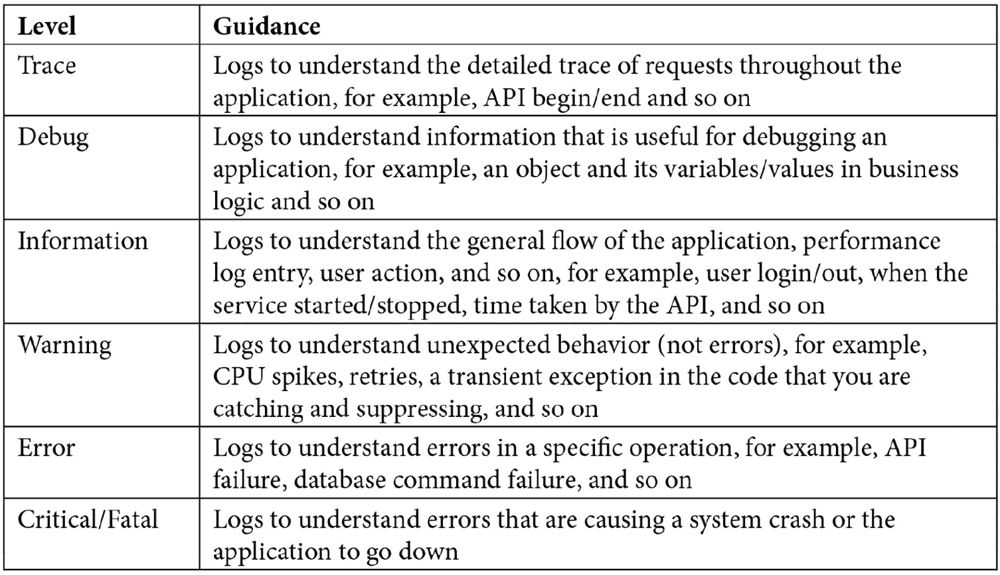

表 7.1

日志级别是可配置的，并基于指定的级别；它将从指定的级别启用到所有更高级别。例如，如果您在配置中指定日志级别为**信息**，则所有来自**信息**、**警告**、**错误**和**致命**的日志消息都将被记录，而**调试**和**跟踪**消息将不会记录，如下表所示。如果没有指定日志级别，则默认为**信息**级别：

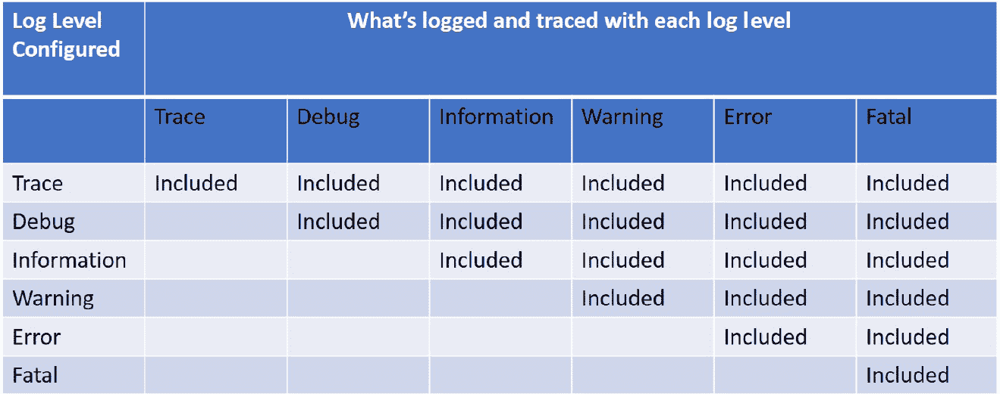

表 7.2

你想在何处记录？这就是日志提供程序介入的地方。让我们在下一节中看看它们。

# 理解可用的日志提供程序

.NET 6 支持多个内置日志提供程序以及几个第三方日志提供程序。这些提供程序公开的 API 帮助将日志输出写入不同的来源，例如提供程序支持的文件或事件日志。您的代码还可以启用多个提供程序，这在您从一个提供程序迁移到另一个提供程序时是一个非常常见的场景，您可以保留旧的，监控新的，一旦您满意，您就可以退役旧的提供程序。让我们详细讨论这两种类型的提供程序。

## 内置日志提供程序

所有内置日志提供程序都支持在 `Microsoft.Extensions.Logging` 命名空间中。让我们看看其中的一些：

.jpg).jpg)

表 7.3

## 第三方日志提供程序

虽然 .NET 6 提供了几个强大的内置日志提供程序，但它也支持第三方日志提供程序。让我们来看看它们：

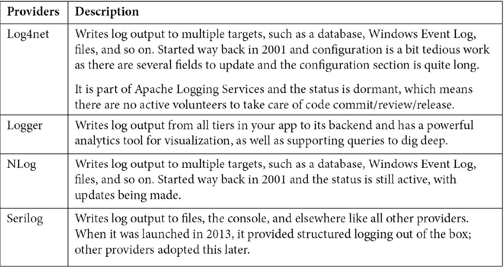

表 7.4

在简要了解了多个内置和第三方提供程序之后，让我们在下一节中深入探讨 Azure App Service 和 Application Insights。

# 使用 Azure App Service

在 **基础设施即服务**（**IaaS**）托管模型中，您对机器上安装的操作系统和软件拥有完全控制权。这与我们许多人习惯的本地部署非常相似。您可以通过远程桌面访问服务器，查看 IIS 日志、Windows 事件查看器或文件。当您迁移到 **平台即服务**（**PaaS**）托管模型时，Azure 会完全负责管理实例。这有助于节省大量时间，因为您的工程师不必花费时间管理服务器，以保持操作系统、基础设施和安全更新的最新状态。

在本节中，我们将了解如何在将应用程序部署到 Azure App Service 计划（Microsoft 的重要 PaaS 提供之一）时进行广泛的日志记录和监控。

## 在 Azure App Service 中启用应用程序日志记录

要启用应用程序日志记录，您需要执行以下步骤：

1.  使用 `dotnet add <.csproj>  package <Nuget package> -v <Version number>` 命令在您的现有 .NET 6 项目中添加 `AzureAppServices` 包，如下所示：

![Figure 7.1 – Installing a package from the CLI

![img/Figure_7.1_B18507.jpg]

图 7.1 – 从 CLI 安装包

您可以从 [`docs.microsoft.com/en-us/dotnet/core/tools/dotnet`](https://docs.microsoft.com/en-us/dotnet/core/tools/dotnet) 获取有关 .NET CLI 命令的更多详细信息。

您也可以右键单击 `Microsoft.Extensions.Logging.AzureAppServices` 包，并按以下截图所示进行安装：

![Figure 7.2 – 从 IDE 安装包

![img/Figure_7.2_B18507.jpg]

图 7.2 – 从 IDE 安装包

1.  在您的 .NET 6 应用程序的 `Program.cs` 文件中，在 `CreateHostBuilder` 方法中添加以下突出显示的代码：

    ```cs
    //Removed code for brevity
    builder.Logging.AddAzureWebAppDiagnostics();
    //Removed code for brevity               
    ```

`CreateHostBuilder` 为我们正在开发的程序执行默认配置。让我们在这里添加一个日志配置，这也会动态注入 `_logger` 对象（对象创建使用 **依赖注入**（**DI**）进行，如*第五章*，*.NET 6 中的依赖注入*所述）。

1.  **添加日志记录**：将以下突出显示的日志代码添加到任何控制器中的方法中，通常位于核心逻辑处，以测试日志记录是否正常工作：

    ```cs
    [ApiController]
    [Route("[controller]")]
    public class WeatherForecastController : ControllerBase
     {
            private static readonly string[] Summaries = new[]
            {
                "Freezing", "Bracing", "Chilly", "Cool", "Mild", "Warm", "Balmy", "Hot", "Sweltering", "Scorching"
            };
            private readonly ILogger<WeatherForecast Controller> _logger;
            public WeatherForecastController(ILogger<WeatherForecast Controller> logger)
            {
                _logger = logger;
            }
            [HttpGet]
            public IEnumerable<WeatherForecast> Get()
            {
                _logger.LogInformation("Logging Information for testing");
                _logger.LogWarning("Logging Warning for testing");
                _logger.LogError("Logging Error for testing");
                var rng = new Random();
                return Enumerable.Range(1, 5).Select(index => new WeatherForecast
                {
                    Date = DateTime.Now.AddDays(index),
                    TemperatureC = rng.Next(-20, 55),
                    Summary = Summaries[rng.Next(Summaries.Length)]
                })
                .ToArray();
            }
    }
    ```

1.  `TestAppServiceForLoggingDemo`。有关如何发布的更多信息，请参阅[`docs.microsoft.com/en-us/visualstudio/deployment/quickstart-deploy-to-azure?view=vs-2022`](https://docs.microsoft.com/en-us/visualstudio/deployment/quickstart-deploy-to-azure?view=vs-2022)。对于此示例，我们使用了基于 Windows 的 App Service 计划。

1.  **启用日志记录**：转到 Azure 门户 | **您的订阅** | **资源组** | **应用服务**（它在那里部署），然后在 **监控** 下选择 **应用服务日志**。您可以看到不同的日志选项，如下所示：

![Figure 7.3 – App Service 日志默认状态

![img/Figure_7.3_B18507.jpg]

图 7.3 – 应用服务日志默认状态

默认情况下，所有日志选项都已关闭，如前一个截图所示。让我们看看这些选项有哪些：

+   **应用程序日志（文件系统）**：将应用程序的日志消息写入 Web 服务器的本地文件系统。一旦您打开它，这将启用 12 小时，之后将自动禁用。因此，此选项用于临时调试目的。

+   **应用程序日志（Blob）**：将应用程序的日志消息写入 Blob 存储，以在配置的保留期内进行持久日志记录。Blob 中的日志记录用于长期调试目的。您需要一个 Blob 存储容器来写入日志。您可以在[`docs.microsoft.com/en-us/azure/storage/blobs/storage-blobs-introduction`](https://docs.microsoft.com/en-us/azure/storage/blobs/storage-blobs-introduction)上了解更多关于 Blob 存储容器的信息。一旦您选择**开启**，您将获得创建新存储账户或搜索现有存储账户以写入日志的选项。点击**+ 存储账户**并指定一个名称以创建新账户，如下截图所示：

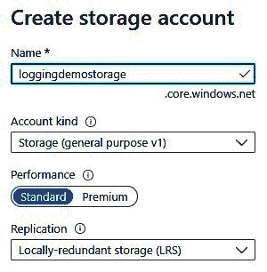

图 7.4 – 存储账户配置

+   **Web 服务器日志**：IIS 日志记录在服务器上，提供诊断信息，如 HTTP 方法、资源 URI、客户端 IP、客户端端口、用户代理和响应代码。您可以将日志存储在 Blob 存储或文件系统中。在**保留期（天数）**中，您可以配置日志应保留的天数。

+   服务器返回的`400`响应，这可以帮助您确定服务器为什么返回此错误。

    注意

    由于安全原因，在生产环境中，我们不向客户端发送详细的错误页面，但每当应用程序发生 HTTP 代码`400`或更高的错误时，应用服务都可以将此错误保存到文件系统中。

+   **失败的请求跟踪**：关于失败请求的详细信息，包括 IIS 跟踪等。对于每个失败的请求，都会生成一个包含 XML 日志文件和用于查看日志文件的 XSL 样式的文件夹。

以下截图显示了您打开并启用所有日志选项时的外观：

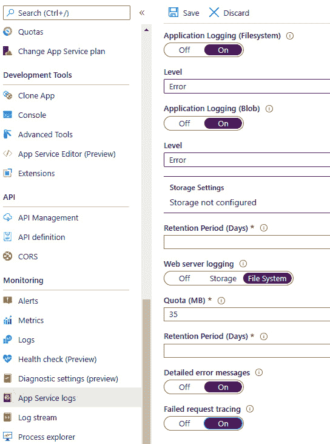

图 7.5 – 应用服务日志启用

1.  您可以通过浏览托管在应用服务上的网站并导航到执行日志记录的控制器所在的页面来验证我们已启用的任何日志选项。例如，让我们通过访问配置了日志选项之一的 Blob 存储来检查**应用程序日志（Blob）**，如下截图所示：

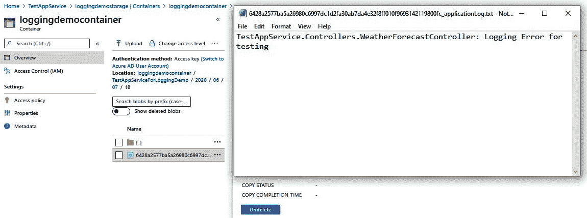

图 7.6 – 从 Blob 存储获取的应用服务日志

您还可以通过导航到**监控**下的**日志流**，从添加测试日志的控制器实时查看日志：

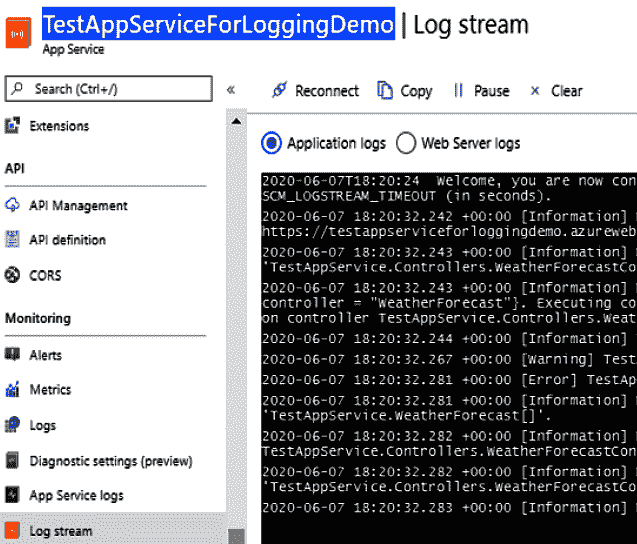

图 7.7 – 应用服务日志在日志流中

我们看到了如何在 Azure 应用服务中启用不同的日志并验证了**应用程序日志（Blob）**和**日志流**中的日志。在下一节中，我们将看到如何进行监控和设置警报。

## 使用度量值进行监控

您可以使用 Azure Monitor 中的度量值来监控您的应用服务计划和应用程序服务。

导航到您的应用服务计划并查看概述，如以下截图所示。您可以看到 CPU、内存、数据输入、数据输出等标准图表：

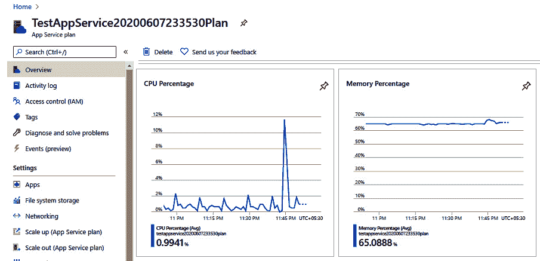

图 7.8 – 应用服务计划概述

现在，点击任何图表，例如，**CPU 百分比**图表。您将看到以下截图所示的视图（默认持续时间是 1 小时）：

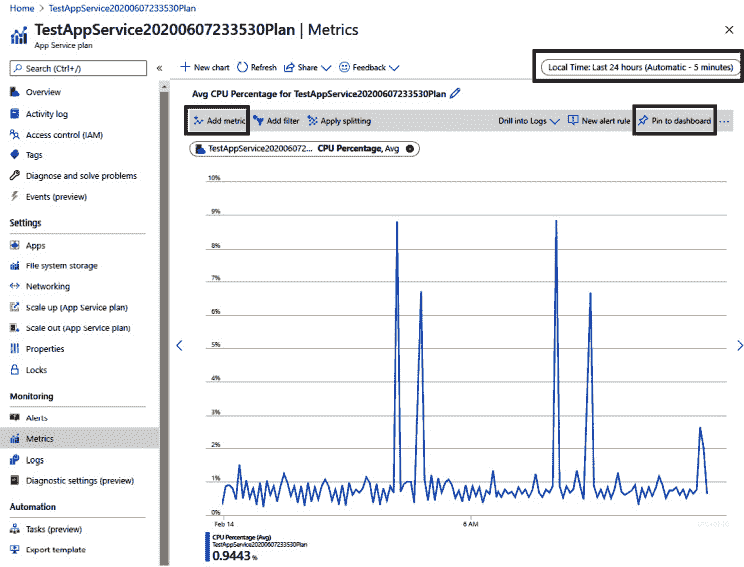

图 7.9 – 应用服务度量值概述

我在之前截图所示的图表中突出显示了三个重要部分。让我们来讨论它们：

+   **本地时间**：当您点击**本地时间**时，您将看到以下截图所示的选项。您可以更改此图表应表示的时间范围值：

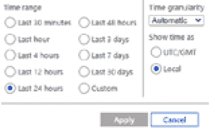

图 7.10 – 应用服务度量值时间范围

+   **添加度量值**：当您点击**添加度量值**时，您将看到以下截图所示的选项。您可以选择图表要显示的度量值：

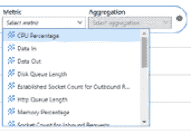

图 7.11 – 应用服务 – 添加度量值

+   **固定到仪表板**：您可以通过点击**固定到仪表板**将图表添加到仪表板，以便您登录 Azure 门户时可以看到更新。

当您点击左侧门户菜单时，您可以看到**仪表板**，您可以点击它以查看所有已固定的仪表板：


图 7.12 – 仪表板左侧门户菜单选项

在下一节中，让我们看看如何在 Azure 应用洞察中启用实时遥测。

# Azure 应用洞察的实时遥测

Application Insights 是 Microsoft Azure 为开发人员和 DevOps 专业人员提供的最佳遥测服务之一，作为一个可扩展的**应用程序性能管理（APM）**服务，用于以下目的：

+   实时监控您的应用程序。

+   自动检测性能异常。

+   包含强大的分析工具以帮助您诊断问题。

+   了解用户如何使用您的应用程序。

+   帮助您持续改进性能和可用性。

`Microsoft.Extensions.Logging.ApplicationInsights` 作为 `Microsoft.ApplicationInsights.AspNetCore` 的依赖项被包含。`Microsoft.ApplicationInsights.AspNetCore` 包用于 ASP.NET Core 应用程序中的遥测，当您使用此包时，您不需要安装 `Microsoft.Extensions.Logging.ApplicationInsights`。

如下图所示，您可以在应用程序中安装此包以启用并写入遥测：

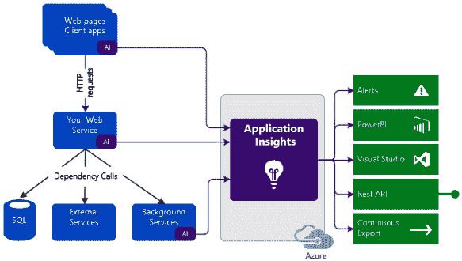

图 7.13 – 应用洞察遥测的仪器化

注意

这不会影响您的应用程序性能。对应用洞察的调用是非阻塞的，并且以批量形式在单独的线程中发送。

## 在应用洞察中启用应用程序日志记录

使用应用洞察启用应用程序日志记录的步骤如下：

1.  使用 `Install-Package <Package name> -version <Version number>` 命令安装 `Microsoft.ApplicationInsights.AspNetCore` 包：

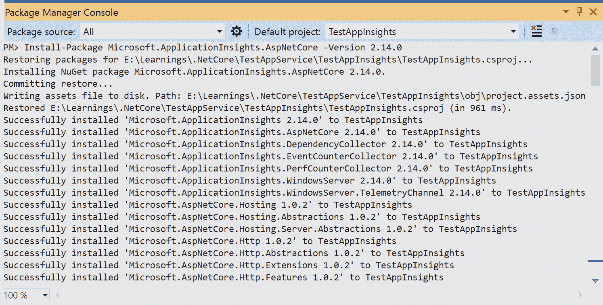

图 7.14 - 从包管理控制台安装包

1.  `appsettings.json` 以确保所有遥测数据都写入您的 Azure 应用洞察资源。如果您没有 Azure 应用洞察资源，请继续创建一个，然后将其添加到 `appsettings.json`：

    ```cs
    {
      "Logging": {
        "LogLevel": {
          "Default": "Information",
          "Microsoft": "Warning",
          "Microsoft.Hosting.Lifetime": "Information"
        }
      },
      "Telemetry": {
        "InstrumentationKey": "Your AppInsights Instrumentation Key "
      }
    ```

1.  在 `Program.cs` 文件中，添加高亮代码：

    ```cs
    string InstrumentationKey = builder.Configuration["Telemetry:InstrumentationKey"];
    // The following line enables Application Insights telemetry collection.
    builder.Services.AddApplicationInsightsTelemetry(InstrumentationKey);         
    ```

现在，您可以构建和运行应用程序。默认情况下，您将获得大量的遥测数据。

导航到 **应用洞察** | **概览**，您可以看到任何失败的请求、服务器响应时间和服务器请求，如图下截图所示：

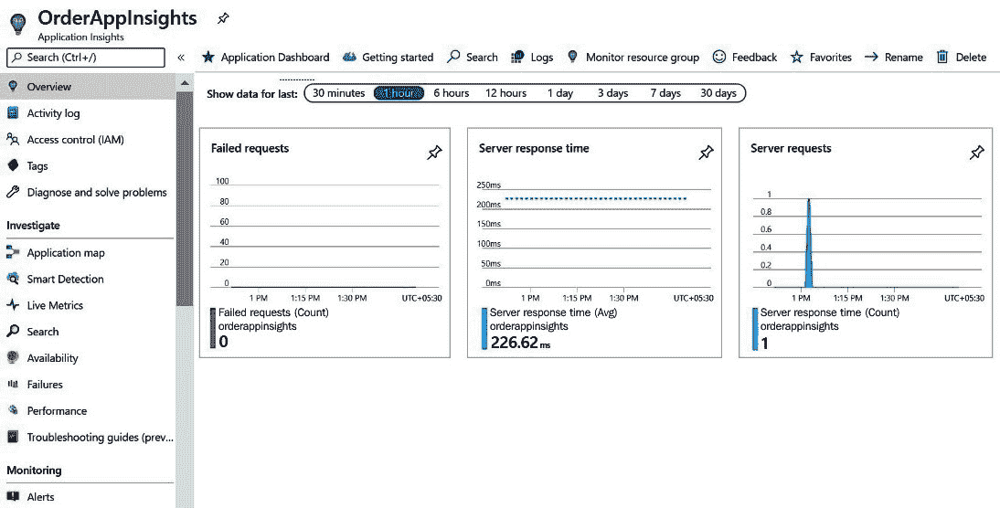

图 7.15 – 应用洞察概览

您可以导航到 **应用洞察** | **实时指标** 以获取实时性能计数器，如图下所示：

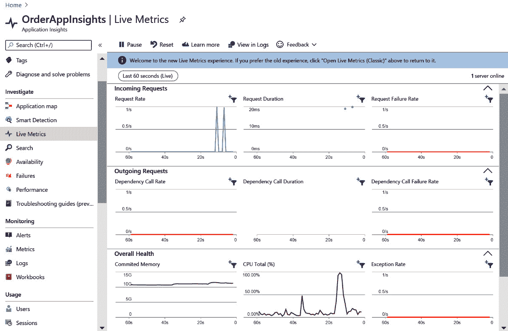

图 7.16 - 应用洞察实时指标

您可以导航到 **应用洞察** | **指标** 以获取不同的指标和图表，如图下所示：


图 7.17 – 应用洞察指标

您可以导航到 **应用洞察** | **性能** 以分析操作持续时间、依赖项响应时间等，如图下所示：

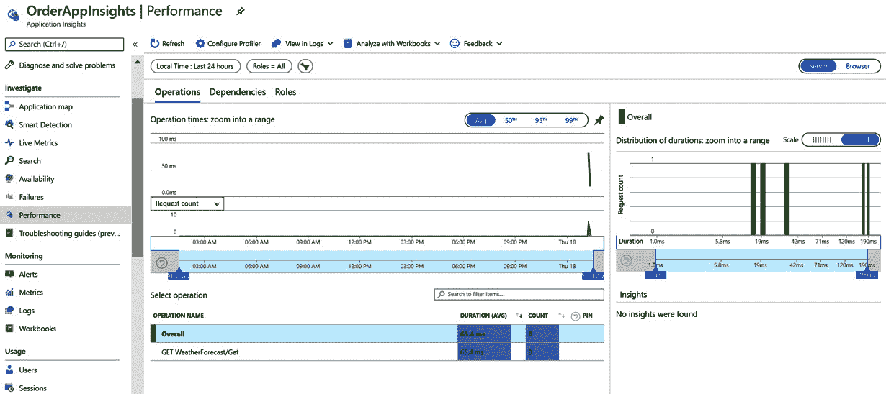

图 7.18 – 应用洞察性能

您可以导航到 **应用洞察** | **失败** 并分析操作、失败的请求、失败的依赖项、前三个响应代码、异常类型和依赖项失败，如图下所示：

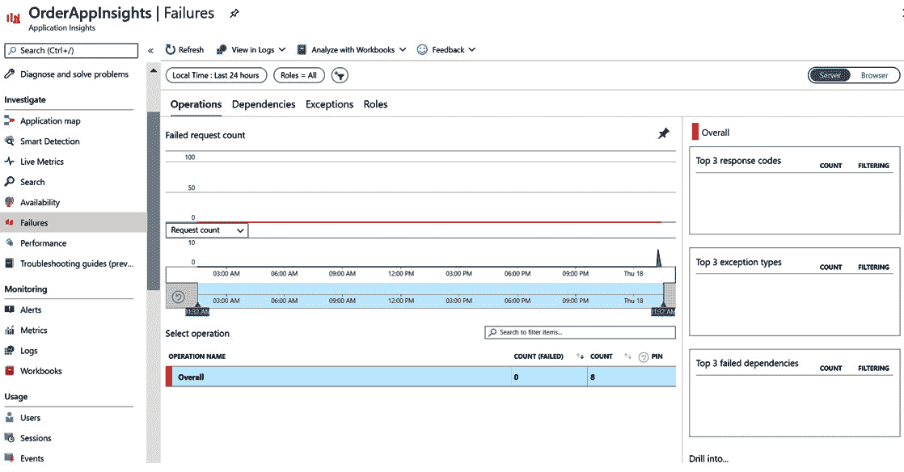

图 7.19 – 应用洞察失败

我们已经看到了开箱即用的遥测和警报。我们如何添加信息、错误或警告的日志？您可以使用日志记录器（对象创建是通过 DI 实现的，这在 *第五章*，*.NET 6 中的依赖注入*）中已经介绍过）。DI 是通过前述步骤中看到的第二个（*应用程序设置配置*）和第三个（*启用 Application Insights 遥测*）步骤启用的。为了测试目的，为了查看它是否正常工作，您可以将以下代码添加到您的控制器中并运行应用程序：

```cs
[HttpGet]
```

```cs
        public IEnumerable<WeatherForecast> Get()
```

```cs
        {
```

```cs
    //Removed code for brevity
```

```cs
            _logger.LogWarning("Logging Warning for
```

```cs
               testing");
```

```cs
            _logger.LogError("Logging Error for testing");
```

```cs
            //Removed code for brevity
```

您可以导航到 **Application Insights** | **日志** 并检查跟踪，在那里您可以查看已记录的警告和错误，如图所示：

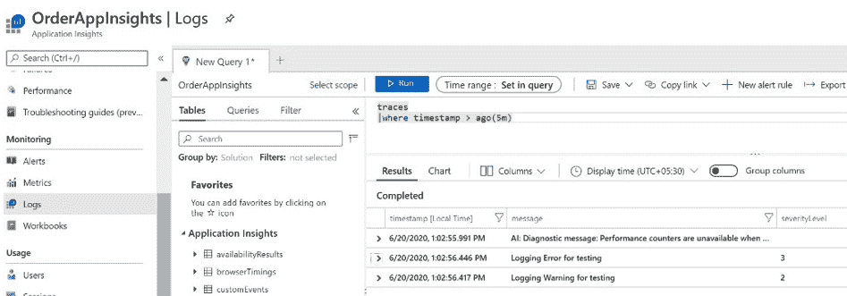


图 7.20 – Application Insights 日志

Application Insights 非常简单易用，是一个非常强大的日志提供程序。我们看到了它提供的丰富遥测数据，并添加了我们自己的日志。在下一节中，我们将开发一个自定义日志类库。.NET 6 中提供的默认日志记录器对于您的应用程序遥测来说已经足够了。如果您需要记录默认在 .NET 6 中提供的自定义指标和事件，您可以利用以下自定义日志记录器库。

# 创建 .NET 6 日志类库

我们将创建一个支持 Application Insights 日志记录并可扩展以支持其他来源日志记录的类库（DLL）。为此，请执行以下步骤：

1.  创建一个新的名为 `Logger` 的 .NET 6 类库。

1.  安装 `Microsoft.ApplicationInsights` 包。

1.  创建一个名为 `ICustomLogger.cs` 的新类，并添加以下代码：

    ```cs
    using System;
    using System.Collections.Generic;
    namespace Logger
    {
        public interface ICustomLogger
        {
            void Dependency(string dependencyTypeName,
             string dependencyName, string data,
             DateTimeOffset startTime, TimeSpan duration,
             bool success);
            void Error(string message, IDictionary<string,
              string> properties = null);
            void Event(string eventName,
            IDictionary<string, string> properties = null,
            IDictionary<string, double> metrics = null);
            void Metric(string name, long value,
             IDictionary<string, string> properties =
             null);
            void Exception(Exception exception,
             IDictionary<string, string> properties =
             null);
            void Information(string message,
             IDictionary<string, string> properties =
             null);
            void Request(string name, DateTimeOffset
             startTime, TimeSpan duration, string
             responseCode, bool success);
            void Verbose(string message,
             IDictionary<string, string> properties =
             null);
            void Warning(string message,
             IDictionary<string, string> properties =
             null);
        }
    }
    ```

1.  创建一个名为 `AiLogger.cs` 的新类，并添加以下代码以记录自定义事件和指标：

    +   **命名空间和构造函数**:

        ```cs
        using Microsoft.ApplicationInsights;
        using Microsoft.ApplicationInsights.DataContracts;
        using System;
        using System.Collections.Generic;
        namespace Logger
        {
            public class AiLogger : ICustomLogger
            {
                private TelemetryClient client;

                public AiLogger(TelemetryClient client)
                {
                    if (client is null)
                    {
                        throw new ArgumentNullException(nameof(client));
                    }
                    this.client = client;
                }
        ```

    +   **代码用于记录警告、错误和异常**:

        ```cs
                public void Warning(string message, IDictionary<string, string> properties = null)
                {
                    this.client.TrackTrace(message, SeverityLevel.Warning, properties);
                }
                public void Error(string message, IDictionary<string, string> properties = null)
                {
                    this.client.TrackTrace(message, SeverityLevel.Error, properties);
                }
                public void Exception(Exception exception, IDictionary<string, string> properties = null)
                {
                    this.client.TrackException(exception, properties);
                }        
        ```

    +   **代码用于记录自定义事件、指标、信息、请求和依赖**:

        ```cs
        public void Event(string eventName, IDictionary<string, string> properties = null, IDictionary<string, double> metrics = null)
                {
                    this.client.TrackEvent(eventName, properties, metrics);
                }
                public void Metric(string name, long value, IDictionary<string, string> properties = null)
                {
                    this.client.TrackMetric(name, value, properties);
                }
                public void Information(string message, IDictionary<string, string> properties = null)
                {
                    this.client.TrackTrace(message, SeverityLevel.Information, properties);
                }
                public void Request(string name, DateTimeOffset startTime, TimeSpan duration, string responseCode, bool success)
                {
                    this.client.TrackRequest(name, startTime, duration, responseCode, success);
                }        
            }
        public void Dependency(string dependencyTypeName, string dependencyName, string data, DateTimeOffset startTime, TimeSpan duration, bool success)
                {            this.client.TrackDependency(dependencyTypeName, dependencyName, data, startTime, duration, success);
                }
        ```

`AiLogger` 使用 `TelemetryClient` 类，该类将遥测数据发送到 Azure Application Insights。

1.  构建库，您的自定义 .NET 6 日志记录器就绪，可以消费项目中的事件。

在接下来的章节中，我们将作为企业应用程序开发的一部分使用日志记录库。在本章提供的示例中，您可以看到我们如何动态地将此自定义日志记录器注入到 `LoggerDemoService` 项目中。

# 摘要

在本章中，我们学习了良好日志记录的特点，可用的不同日志提供程序，例如 Azure App Service 日志提供程序和 Azure Application Insights 日志提供程序，以及如何创建可重用的日志记录器库。

您现在拥有了必要的日志记录知识，这将帮助您在项目中实现可重用的记录器或扩展当前的记录器，以适当的日志级别和关键信息来调试问题并在生产数据上构建分析。

在下一章中，我们将学习如何在 .NET 6 应用程序中缓存数据的各种技术，以及可以与 .NET 应用程序集成的各种缓存组件和平台。

# 问题

1.  哪些日志会在执行流程因失败而停止时突出显示？这些应该表明当前活动中的失败，而不是应用程序范围内的失败：

a. 警告

b. 错误

c. 严重

d. 信息

**答案：b**

1.  对于在任何地方运行的应用程序和组件，包括 Azure、AWS、您自己的本地服务器或移动平台，用于日志记录可以依赖什么？

a. 应用洞察

b. Azure App Service

c. EventLog

d. Serilog

**答案：a**

1.  Azure App Service 中可用的日志记录选项有哪些？

a. **应用程序日志（文件系统）**和**应用程序日志（Blob**）

b. **Web 服务器日志**和**详细错误消息**

c. **失败的请求跟踪**

d. 所有以上选项

**答案：d**

1.  应用洞察是一个可扩展的 APM 服务，可以执行以下哪些操作？

a. 监控您的实时应用程序。

b. 自动检测性能异常。

c. 包含强大的分析工具以帮助您诊断问题。

d. 所有以上选项。

**答案：d**
