# *第八章*：关于缓存你需要知道的一切

缓存是帮助企业应用扩展并提高响应时间的关键系统设计模式之一。任何 Web 应用通常都涉及从数据存储中读取和写入数据，这些数据存储通常是关系型数据库，如 SQL Server，或 NoSQL 数据库，如 Cosmos DB。然而，对于每个请求从数据库中读取数据并不高效，尤其是当数据没有变化时。这是因为数据库通常将数据持久化到磁盘，从磁盘加载数据并将其发送回浏览器客户端（或移动/桌面应用程序中的设备）或用户的操作是成本高昂的。这就是缓存发挥作用的地方。

缓存存储可以用作检索数据的主要来源，只有当所需数据不在缓存中时才回退到原始数据存储，从而为消费应用程序提供更快的响应。当以这种方式使用缓存时，我们还需要确保当原始数据存储中的数据更新时，缓存中的数据会过期/刷新。

在本章中，我们将学习在.NET 6 应用程序中缓存数据的各种技术，以及可以与.NET 6 应用程序集成的各种缓存组件和平台。我们将涵盖以下主题：

+   缓存简介

+   理解缓存组件

+   缓存平台

+   使用分布式缓存设计缓存抽象层

# 技术要求

需要基本了解.NET Core、C#、Azure 和.NET CLI。本章的代码可以在此处找到：[`github.com/PacktPublishing/Enterprise-Application-Development-with-C-10-and-.NET-6-Second-Edition/tree/main/Chapter08`](https://github.com/PacktPublishing/Enterprise-Application-Development-with-C-10-and-.NET-6-Second-Edition/tree/main/Chapter08)。

代码示例的说明可以在此处找到：[`github.com/PacktPublishing/Enterprise-Application-Development-with-C-10-and-.NET-6-Second-Edition/tree/main/Enterprise%20Application`](https://github.com/PacktPublishing/Enterprise-Application-Development-with-C-10-and-.NET-6-Second-Edition/tree/main/Enterprise%20Application)。

# 缓存简介

有多种方法可以提高应用程序的性能，缓存是企业在应用中使用的关键技术之一。**缓存**就像一个临时数据存储，具有有限的大小和有限的数据，但与原始数据源相比，数据访问速度要快得多，通常只存储数据的一个子集，即最常使用且不经常变化的数据。

**缓存存储**可能只是计算机的 RAM，该 RAM 在执行过程中被进程使用，或者它可能是像 Redis 这样的东西，它使用内存和磁盘来存储数据。这里的关键是它通常位于比原始存储层访问时间更低的硬件上。

缓存可以在架构的每一层实现，以便从最接近用户的那一层检索数据。例如，在任何 Web 应用中，当我们输入 URL 并在浏览器中按下*Enter*键时，它会通过加载 Web 应用所涉及的各个 Web 组件，从浏览器、代理和 DNS 开始，到 Web 服务器和数据库。缓存是可以在所有这些层应用的东西。

如果数据在浏览器中缓存，它可以立即加载。如果没有在用户最近的那一层找到数据，它可以回退到更高一层，从而减少共享多个用户的更高层（如应用服务器和数据库层）的负载。

下图以高层次描述了这一讨论，其中请求在各个层之间流动，并且只有在缓存中没有数据（用虚线表示）时才会移动到更高层：

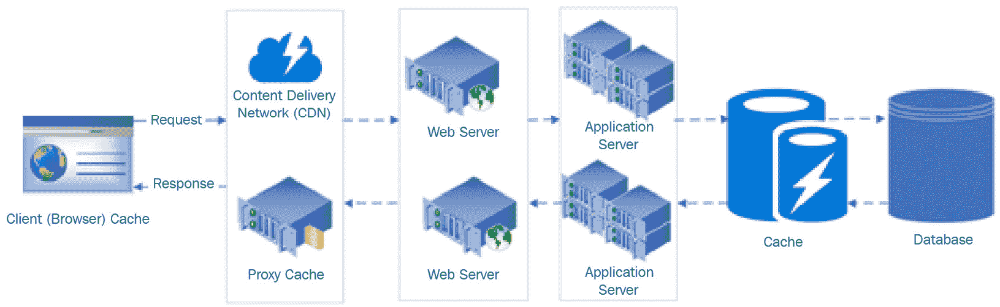

图 8.1 – 请求流程中的缓存层

让我们讨论一下应用架构中可以缓存数据的一些这些层。

## 客户端缓存

常请求的数据可以在客户端缓存，以避免不必要的往返服务器。例如，微软的 Outlook 应用从服务器下载最新的电子邮件，并在客户端保留副本，然后定期同步新邮件。如果需要搜索尚未下载的电子邮件，它将返回服务器。

同样，浏览器可以根据某些头部信息缓存来自 Web 应用的多种资源和响应，并且对相同资源的后续请求将从浏览器缓存中加载。例如，所有 JavaScript 文件、图像文件和 CSS 通常会在浏览器中缓存一定时间。此外，通过发送适当的响应头部，API 的响应也可以被缓存。这被称为**HTTP 缓存**或**响应缓存**，将在后面的章节中详细讨论。

## 内容分发网络（CDN）

**内容分发网络**（**CDN**）是一组全球分布的服务器，通常用于提供静态内容，如 HTML、CSS 和视频。每当应用请求一个资源时，如果启用了 CDN，系统将首先尝试从物理上最接近用户的 CDN 服务器加载该资源。然而，如果该资源不在 CDN 服务器上，它将从服务器检索并缓存到 CDN 中，以服务于后续请求。Netflix 就是这样一个很好的例子，它严重依赖其定制的 CDN 来向用户交付内容。

微软还提供了 Azure CDN，主要用于服务静态内容。此外，微软的 CDN 还提供了与 Azure 存储集成的选项，我们将在我们的电子商务应用中使用它来服务各种产品图片。类似地，AWS 有 Amazon Cloudfront，而 Google Cloud 则在其各自的云存储服务中提供 Cloud CDN。

## Web 服务器缓存

虽然 CDN 对于静态内容非常出色，但它们在从应用服务器刷新数据方面会带来额外的成本和维护开销。为了克服这些限制，应用可以使用 Web 服务器或反向代理来服务静态内容。一个轻量级的 NGINX 服务器就是这样一个例子，它可以用来服务静态内容。

Web 服务器也可以缓存动态内容，例如来自应用服务器的 API 响应。当配置为反向代理时，如 NGINX 或 IIS 这样的 Web 服务器可以进一步用于缓存动态内容，从而通过从其缓存中服务请求来减轻应用服务器的负载。

注意

NGINX 是一个开源解决方案，主要以其 Web 服务器功能而闻名；然而，它也可以用作反向代理、负载均衡等。欲了解更多信息，请参阅[`www.nginx.com/`](https://www.nginx.com/)。

## 数据库缓存

越来越多的数据库服务器会缓存查询的某些组件；例如，SQL Server 通常有缓存执行计划，并且还有一个数据缓冲区用于缓存，MongoDB 则将最近查询的数据保存在内存中以实现快速检索。因此，调整这些设置以改善应用性能是很好的。

注意

数据库缓存并不能保证相同查询的后续执行不会消耗 CPU 资源；也就是说，它并不是真正免费的。在后续请求中，相同的查询执行速度会更快。

## 应用缓存

应用缓存可以通过在应用服务器内部缓存从存储层检索到的数据来实现。这通常以下两种方式完成：

+   存储在应用服务器的内存中，也称为内存缓存

+   存储在外部存储中，如 Redis 或 Memcached，其访问速度比底层原始数据存储更快

应用缓存通常涉及在应用逻辑中集成额外的代码以缓存数据。因此，每当请求数据时，应用首先会在缓存中查找。但如果缓存中没有，应用将回退到原始数据存储，如数据库。通常，应用缓存的大小与原始数据存储相比有限，因此，应用缓存平台将采用各种算法，如**最近最少使用**（**LRU**）或**最少使用频率**（**LFU**）来清理缓存中存储的数据。我们将在*缓存平台*部分讨论更多关于缓存平台的内容。

对于应用程序缓存来说，另一个需要考虑的重要点是数据失效，即数据需要多频繁地过期或与原始数据源同步。因此，需要考虑诸如缓存过期以及用原始数据存储更新缓存的各种策略（读透，写透）。我们将在*缓存访问模式*部分讨论更多的缓存失效/刷新策略。

# 理解缓存的组件

在我们了解.NET 6 应用程序中可用的各种可能的缓存存储/平台之前，我们需要了解.NET 6 中可用的各种缓存组件以及如何在企业应用程序中使用它们。在这个过程中，我们还将涵盖各种缓存淘汰策略和技术，以保持缓存与原始数据存储同步。

## 响应缓存

响应缓存是 HTTP 支持的一种缓存技术，用于缓存使用 HTTP 或 HTTPS 发出的请求的响应，无论是在客户端（例如，浏览器）还是中间代理服务器上。从实现的角度来看，这通过在请求和响应中设置适当的`Cache-Control`头值来控制。一个典型的`Cache-Control`头将如下所示：

```cs
Cache-Control:public,max-age=10
```

在这种情况下，如果响应中存在该头，服务器正在告诉客户端/代理（公开）客户端可以缓存响应 10 秒（`max-age=10`）。然而，客户端仍然可以覆盖它并缓存更短的时间；也就是说，如果请求和响应都设置了缓存头，则缓存持续时间将是两者中的最小值。

除了`max-age`之外，根据 HTTP 规范（[`tools.ietf.org/html/rfc7234#section-5.2`](https://tools.ietf.org/html/rfc7234#section-5.2)），`Cache-Control`还可以包含以下值：

+   **公开**：响应可以缓存在任何地方 – 客户端/服务器/中间代理服务器。

+   **私有**：响应可以存储在特定用户处，但不能存储在共享缓存服务器上；例如，它可以存储在客户端浏览器或应用服务器中。

+   **No-cache**：响应不能被缓存。

在响应缓存中起作用的其它头包括以下内容：

+   **Age**：这是一个响应头，表示对象在缓存（代理/浏览器）中存在的时间长度。接受的值是一个整数，表示秒数。

+   `Vary`设置为`user-agent`值，每个`user-agent`的响应将唯一缓存。

下面的截图显示了 Postman 中一个示例请求相关的缓存响应头：

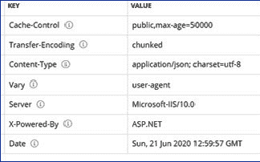

图 8.2 – 带有 Cache-Control 和 Vary 头的示例响应

下面的序列图显示了使用 ASP.NET Core 6 构建的具有启用响应缓存中间件的示例 API：

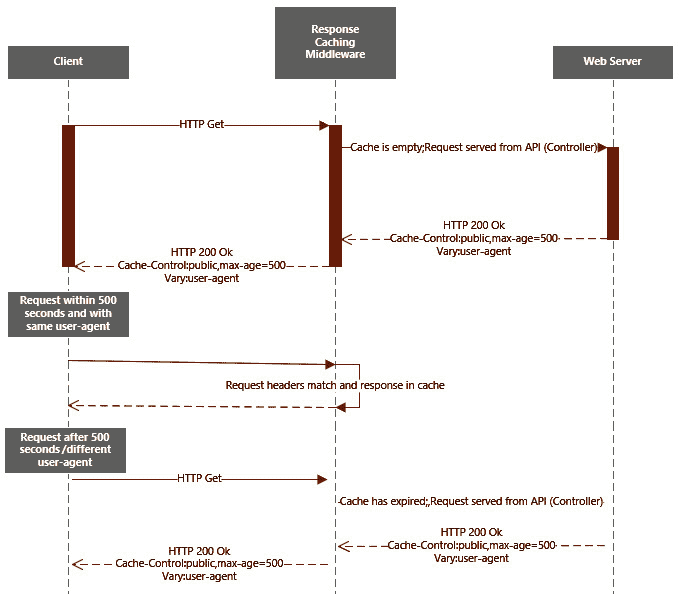

图 8.3 – 响应缓存序列图

在创建新的 ASP.NET Core 6 MVC/Web API 应用程序或使用现有的 ASP.NET Core 6 MVC/Web API 应用程序后，要配置响应缓存，需要以下代码更改：

1.  在`Program.cs`中添加`builder.Services.AddResponseCaching()`，并使用`app.UseResponseCaching()`添加所需的中间件。此中间件包含缓存数据的所需逻辑。确保在`app.UseEndpoints`之前注入此中间件。

1.  通过自定义中间件或使用`ResponseCache`属性来处理响应以设置缓存头。

    注意

    在使用 CORS 中间件时，必须先调用`UseCors`然后调用`UseResponseCaching`。有关此顺序的更多信息，请参阅[`github.com/dotnet/AspNetCore.Docs/blob/master/aspnetcore/fundamentals/middleware/index.md`](https://github.com/dotnet/AspNetCore.Docs/blob/master/aspnetcore/fundamentals/middleware/index.md)。

`ResponseCache`属性可用于整个控制器或控制器中的特定方法，并接受以下键属性：

+   `Duration`：一个数值，用于设置响应头中的`max-age`值

+   `ResponseCacheLocation`：一个枚举，接受三个值 - `Any`、`Client`和`None` - 并进一步设置`Cache-Control`头为`public`、`private`或`no-store`

+   `VaryByHeader`：一个字符串，用于控制基于特定头的缓存行为

+   `VaryByQueryKeys`：一个字符串数组，接受基于其缓存数据的关键值

带有`ResponseCache`属性的一个典型方法看起来像这样：

```cs
        [HttpGet]
```

```cs
        [ResponseCache(Duration = 500, VaryByHeader = 
```

```cs
          "user-agent", Location = 
```

```cs
          ResponseCacheLocation.Any, VaryByQueryKeys = 
```

```cs
          new[] { "Id" })]
```

```cs
        public async Task<IActionResult> 
```

```cs
          Get([FromQuery]int Id = 0)
```

此方法将基于唯一的`user-agent`头和`Id`值缓存`500`秒。如果这些值中的任何一个发生变化，则从服务器提供响应，否则从缓存中间件提供。

如您在此处所见，我们需要为每个控制器/方法前缀添加`ResponseCache`属性。因此，如果应用程序有多个控制器/方法，这可能是一个维护开销，因为为了更改数据缓存的方式（例如更改`Duration`值），我们需要在控制器/方法级别应用更改，这正是缓存配置文件发挥作用的地方。

因此，我们不必单独设置属性，我们可以将它们分组，并在`Program.cs`中给它们一个名称，该名称可以在`ResponseCache`属性中使用。因此，对于前面的属性，我们可以在`Program.cs`中通过添加以下代码创建一个缓存配置文件：

```cs
            builder.Services.AddControllers(options =>
```

```cs
            {
```

```cs
                options.CacheProfiles.Add("Default", 
```

```cs
                  new CacheProfile {
```

```cs
                    Duration = 500,
```

```cs
                    VaryByHeader = "user-agent",
```

```cs
                    Location = ResponseCacheLocation.Any,
```

```cs
                    VaryByQueryKeys = new[] { "Id" } });
```

```cs
            });
```

在控制器上，使用`CacheProfileName`调用此缓存配置文件：

```cs
[ResponseCache(CacheProfileName = "Default")]
```

对于 MVC 应用程序，可以在`services.AddControllersWithViews()`中配置`CacheProfile`。

## 分布式缓存

正如我们所知，在分布式系统中，数据存储被分散在多个服务器上。同样，分布式缓存是传统缓存的扩展，其中缓存数据存储在网络的多个服务器上。在我们深入了解分布式缓存之前，这里快速回顾一下**CAP 定理**：

+   **C** 代表一致性，意味着数据在所有节点上都是一致的，每个节点都有相同的数据副本。

+   **A** 代表可用性，意味着系统是可用的，一个节点的故障不会导致系统崩溃。

+   **P** 代表分区容错，意味着即使节点之间的通信中断，系统也不会崩溃。

根据 CAP 定理，任何分布式系统只能实现上述两个原则中的两个，并且由于分布式系统必须是分区容错的（P），我们只能实现数据的一致性（C）或数据的高可用性（A）。

因此，分布式缓存是一种缓存策略，其中数据存储在应用服务器之外的多台服务器/节点/分片中。由于数据分布在多台服务器上，如果一台服务器宕机，另一台服务器可以作为备份来检索数据。

例如，如果我们的系统想要缓存国家、州和城市，并且在一个分布式缓存系统中有三台缓存服务器，假设其中一台缓存服务器将缓存国家，另一台缓存州，还有一台缓存城市（当然，在实际应用中，数据的分割方式要复杂得多）。

此外，每台服务器还将作为一个或多个实体的备份。因此，从高层次来看，一种分布式缓存系统看起来如下所示：

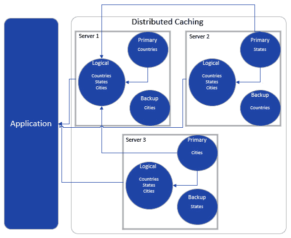

图 8.4 – 分布式缓存高级表示

如您所见，在读取数据时，数据是从主服务器读取的，如果主服务器不可用，缓存系统将回退到辅助服务器。同样，对于写入操作，只有在数据被写入主服务器和辅助服务器之后，写入操作才算完成。在此操作完成之前，读取操作可能会被阻塞，从而影响系统的可用性。对于写入操作，另一种策略可以是后台同步，这将导致数据最终一致性，因此在同步完成之前，数据的一致性可能会受到影响。回到 CAP 定理，大多数分布式缓存系统属于 CP 或 AP 类别。

以下是一些与.NET 6 应用程序集成的分布式缓存提供商：

+   Redis Cache

+   Memcached

+   Couchbase

+   SQL Server

+   NCache

这可以进一步扩展到任何集群编排平台，例如，**Terracotta**，它负责管理各种节点，并将数据分发到所有节点。

尽管分布式缓存有很多好处，但与单服务器缓存或进程内缓存相比，分布式缓存的一个可能缺点可能是由于可能的额外跳转和序列化/反序列化而引入的延迟。因此，如果应用严重依赖于缓存数据，设计可以考虑内存缓存和分布式缓存的组合。然而，大多数场景都可以通过集成一个良好实现的分布式缓存系统（如 Redis）来覆盖，我们将在本章后面讨论这一点。

## Cache access patterns

一旦对象数据被缓存，就需要一个设计来处理缓存的刷新。可以实现多种缓存访问模式来处理这种情况。以下是一些关键模式：

+   Cache-aside pattern

+   Read-through/write-through

+   Refresh-ahead

+   Write-behind

让我们逐一详细讨论。

### Cache-aside pattern

如其名所示，在缓存-旁路模式中，缓存存储与数据存储一起保留。在这个模式中，应用程序代码会检查缓存存储中的数据可用性。如果缓存存储中没有数据，则从底层数据存储中检索数据，并在缓存中更新。后续请求将再次查询缓存中的数据，如果数据在缓存中可用，则将从缓存中提供服务。缓存-旁路模式依赖于懒加载的概念，这在*第四章*中讨论过，*线程和异步操作*，并且当数据首次被访问时填充；对同一实体的后续请求将加载自缓存。

在更新原始数据存储中的数据时，应该处理缓存存储中数据的过期。

以下是这个模式的优势：

+   与下一节中介绍的读取/写入模式相比，实现简化。由于缓存不是应用中的主要数据源，我们不需要额外的类来同步缓存存储与数据存储。

+   由于它依赖于懒加载原则，缓存仅在访问任何数据至少一次时才会被填充。

然而，这个模式也有一些缺点：

+   这可能导致缓存未命中次数增加的可能性。缓存未命中应该始终保持在最小，因为它们会由于额外的跳转而引入应用的延迟。

+   如果在数据更新期间错过缓存过期，可能会导致缓存中的数据过时。这可能发生在数据由没有缓存系统信息的后台/外部进程更新时。

一种减轻过期问题的方法是为每个实体设置**生存时间**（**TTL**），这样对象在一段时间后就会自动过期。然而，在监控数据刷新率后，需要仔细评估 TTL 持续时间。在缓存旁路模式的情况下，另一种常见做法是在应用程序启动时预先填充缓存存储，因为这有助于减少缓存未命中次数。大多数企业应用程序通常使用缓存旁路模式实现缓存层，并用主数据而不是事务数据预先填充它。

### 读取/写入

在读取/写入中，应用程序直接从缓存存储读取/写入数据；也就是说，应用程序将其用作主存储，缓存层负责在缓存中加载数据，并负责将任何从缓存存储更新的数据写回原始存储。

当应用程序想要读取一个实体时，它将直接从缓存存储请求它。如果该实体存在于缓存中，则返回响应。然而，如果它不在缓存中，缓存层将从原始数据存储请求它，该数据存储在缓存中更新以供将来使用，然后从缓存层返回响应。

更新实体时，以下步骤发生：

1.  首先更新到缓存中。

1.  缓存层将其写回原始数据存储。

这种类型系统的优点如下：

+   在原始数据存储（通常是一个数据库）上显著减少负载，因为在大多数企业应用程序中，所有调用都会从缓存提供服务，除了从缓存层到数据存储的调用。

+   简化的应用程序代码，因为它只与一个存储进行交互，而与缓存旁路模式不同，后者不仅与缓存存储交互，还与应用程序代码内的数据存储交互。

这种模式的几个缺点如下：

+   需要一个额外的机制来同步缓存和数据存储之间的数据。

+   缓存更新变得有些棘手，因为它涉及到刷新缓存存储的额外复杂性。

### 预刷新

预刷新策略允许您异步地将数据加载到缓存存储中；也就是说，在这个设计中，应用程序仍然直接与缓存存储通信。然而，缓存层会在缓存中的数据过期之前定期刷新数据。对于最近访问过的条目，刷新是异步发生的，并在它们过期之前从原始存储异步刷新。这样，如果任何缓存项已过期，应用程序中就不会有任何延迟。

### 写入后

在写入后策略中，数据首先更新到缓存存储，然后异步更新回数据存储，这与写入策略不同，在写入策略中，数据会立即更新到数据存储。这种策略的一个关键优点是降低了延迟。然而，由于数据是异步更新的（写入数据存储和缓存存储是两个不同的交易），因此应该实现回滚机制，以防万一出现故障。

通常，与写入策略相比，实现起来要复杂得多，因为需要额外的处理来避免在异步更新期间发生数据丢失，但如果需要将缓存存储作为主要数据源，这仍然是一个很好的集成模式。

到目前为止讨论的所有模式都可以在以下图中以高层次可视化：

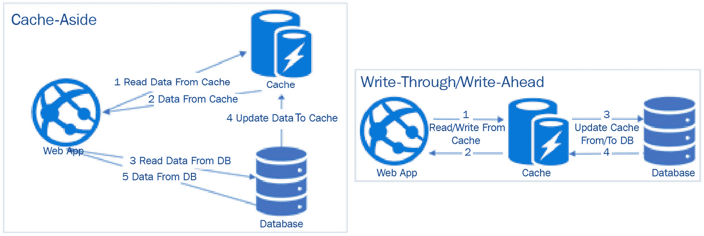

图 8.5 – 缓存模式

到目前为止，我们已经看到了各种缓存模式和策略。在下一节中，我们将讨论各种缓存提供程序及其与 .NET 6 应用程序的集成。

# 缓存平台

.NET 6 支持多个缓存平台。以下是一些常用的缓存平台：

+   `w3wp.exe`。

+   **分布式缓存**：数据存储在多个服务器上。可以与 .NET 6 应用程序集成的数据存储包括 SQL Server、Redis 和 NCache。

## 内存缓存

要配置内存缓存，在创建新的 ASP.NET Core 6 MVC/Web API 应用程序后，或者对于现有的 ASP.NET Core 6 MVC/Web API 应用程序，需要以下代码更改：

1.  在 `Program.cs` 中添加 `builder.Services.AddMemoryCache()`。`MemoryCache` 类是 .NET 6 中 `IMemoryCache` 的内置实现，可以在任何 C# 类中通过 `IMemoryCache` 使用。它通过构造函数注入进行实例化。对象创建是通过 `IMemoryCache` 进行的，并使用构造函数注入创建 `MemoryCache` 的实例。

1.  `MemoryCache` 提供了许多方法，但其中一些重要的是 `Get`（获取键的值）、`Set`（插入键及其值）和 `Remove`（移除键（缓存过期））。

1.  在创建缓存对象（使用 `Set` 或其他方法）时，可以使用 `MemoryCacheEntryOptions` 对内存缓存进行各种参数的配置。以下属性是支持的：

a. `SetAbsoluteExpiration`: 缓存的绝对有效时间，即缓存有效的确切日期和时间（`DateTime`）。

b. `SetSlidingExpiration`: 缓存条目在缓存中变为非活动状态后的无效时间。例如，5 秒的滑动过期值将等待缓存条目非活动 5 秒。滑动过期值应始终小于绝对过期值，因为无论滑动过期值如何，缓存都会在达到绝对过期时间后过期。

c. `SetPriority`：在执行缓存淘汰时，缓存大小是有限的（可以使用 `SetPriority` 通过 `CacheItemPriority` 枚举设置缓存条目的优先级。其默认值是 `CacheItemPriority.Normal`）。

按照前面的步骤集成的简单 Web API 控制器，带有内存缓存集成，将如下所示：

```cs
    public class WeatherForecastController : ControllerBase
```

```cs
    {
```

```cs
        private IMemoryCache cache;
```

```cs
        public WeatherForecastController(IMemoryCache 
```

```cs
          cache)
```

```cs
        {
```

```cs
            this.cache = cache;
```

```cs
        }
```

```cs
        [HttpGet]
```

```cs
        public IActionResult Get()
```

```cs
        {            
```

```cs
            DateTime? cacheEntry;            
```

```cs
            if (!cache.TryGetValue("Weather", 
```

```cs
              out cacheEntry))
```

```cs
            {
```

```cs
                cacheEntry = DateTime.Now;
```

```cs
                var cacheEntryOptions = new 
```

```cs
                  MemoryCacheEntryOptions()
```

```cs
                    .SetSlidingExpiration(
```

```cs
                     TimeSpan.FromSeconds(50))
```

```cs
                    .SetAbsoluteExpiration(
```

```cs
                     TimeSpan.FromSeconds(100))
```

```cs
                    .SetPriority(
```

```cs
                     CacheItemPriority.NeverRemove);
```

```cs
                cache.Set("Weather", cacheEntry, 
```

```cs
                  cacheEntryOptions);
```

```cs
            }
```

```cs
            cache.TryGetValue("Weather", out cacheEntry);
```

```cs
            var rng = new Random();
```

```cs
            return Ok(from temp in Enumerable.Range(1, 5)
```

```cs
                   select new
```

```cs
                   {
```

```cs
                       Date = cacheEntry,
```

```cs
                       TemperatureC = rng.Next(-20, 55),
```

```cs
                       Summary = "Rainy day"
```

```cs
                   });
```

```cs
        }
```

```cs
    }
```

如您所见，此代码是自我解释的，并使用内存缓存提供了一个 API。

`MemoryCache` 中可用的一种附加方法是使用 `RegisterPostEvictionCallback` 集成回调方法。这是 `MemoryCacheEntryOptions` 中的一个扩展方法，它接受一个 `PostEvictionDelegate` 委托，并在缓存条目过期时触发回调。`PostEvictionDelegate` 的签名如下：

```cs
public delegate void PostEvictionDelegate(object key, object value, EvictionReason reason, object state);
```

因此，这意味着我们传递给 `RegisterPostEvictionCallback` 的回调应该遵循相同的签名，如您所见，所有输入参数都是自我解释的。因此，让我们添加一个回调方法并更新 `cacheEntryOptions`，如下所示：

```cs
private void EvictionCallback(object key, object value, EvictionReason reason, object state)
```

```cs
{
```

```cs
      Debug.WriteLine(reason);        
```

```cs
}
```

```cs
cacheEntryOptions.RegisterPostEvictionCallback(EvictionCallback);
```

天气控制器的代码映射如下截图所示：

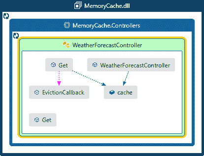

图 8.6 – 天气控制器代码映射

一旦我们运行此代码，我们就可以看到在 50 秒的绝对过期后对控制器的任何后续调用都将触发回调，并将原因记录为 `Expiration`。一旦部署到 `AppService`，回调将自动触发。只有出于调试目的，我们才需要再次调用。

## 分布式缓存

在讨论了内存缓存之后，让我们继续探讨其他可以配置为分布式缓存的缓存平台。分布式缓存，就像分布式存储系统一样，将缓存数据分布到多个服务器上，主要是为了支持扩展。在本节中，我们将查看不同类型的分布式缓存，从 SQL 开始。

### SQL

分布式缓存可以使用各种存储实现，其中之一是 SQL Server。使用 SQL Server 进行分布式缓存的第一步是创建存储缓存条目的所需 SQL 表。将 SQL 作为分布式缓存存储的整个设置涉及以下步骤：

1.  在管理员提示符中打开命令行并运行以下命令以全局安装 `dotnet-sql-cache` 包：

    ```cs
    dotnet tool install ––global dotnet-sql-cache
    ```

这就是它的样子：

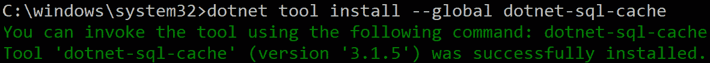

图 8.7 – 使用 .NET CLI 安装 sql-cache 包

1.  创建所需的数据库（本地或使用 Azure SQL）并运行以下命令以创建存储缓存数据的表：

    ```cs
    dotnet sql-cache create "Data Source=.;Initial Catalog=DistributedCache;Integrated Security=true;" dbo cache
    ```

在这个命令中，我们传递数据库的连接字符串（在本地运行时相应更新）作为参数之一，另一个是表的名称（`cache` 是前一个片段中表的名称）。

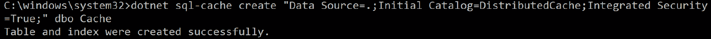

图 8.8 – 为分布式缓存创建 SQL 表

1.  一旦命令成功运行，如果我们打开 SSMS 中的 SQL 服务器，我们将看到如下所示的表，其中包含用于优化的列和索引：

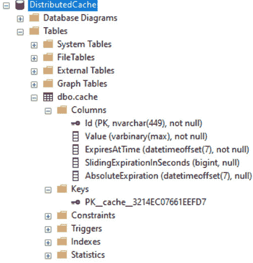

图 8.9 – SSMS 中 SQL 分布式缓存的缓存表

1.  创建一个 Web API 应用程序并安装 NuGet 包 `Microsoft.Extensions.Caching.SqlServer`（通过 **包管理控制台**（**PMC**）或使用 .NET CLI）。

1.  在 `Program.cs` 中添加以下代码：

    ```cs
    builder.Services.AddDistributedSqlServerCache(options =>
    {
        options.ConnectionString = "Data Source=.;Initial 
          Catalog=DistributedCache;Integrated 
          Security=true;";
        options.SchemaName = "dbo";
        options.TableName = "Cache";
    });
    ```

1.  要将数据插入缓存，我们需要使用 `IDistributedCache`，该对象将通过构造函数注入创建。因此，清理 `WeatherForecastController`（在创建 ASP.NET Core 6 Web API 项目期间创建的默认控制器）中的所有代码，并添加以下代码（一个具有 `Get` 方法的 Web API 控制器）：

    ```cs
        public class WeatherForecastController : ControllerBase
        {
            private readonly IDistributedCache 
              distributedCache;
            public WeatherForecastController(
              IDistributedCache distributedCache)
            {
                this.distributedCache = distributedCache;
            }
        }
    ```

1.  添加以下 `Get` 方法，它使用 `distributedCache` 并将数据保存到缓存存储（在这种情况下为 SQL）：

    ```cs
    [HttpGet]
    public IActionResult Get()
            {
                DateTime? cacheEntry;
                if (distributedCache.Get("Weather") == 
                  null)
                {
                    cacheEntry = DateTime.Now;
                    var cacheEntryOptions = new 
                      DistributedCacheEntryOptions()
                        .SetSlidingExpiration(TimeSpan
                        .FromSeconds(50))
                        .SetAbsoluteExpiration(TimeSpan
                        .FromSeconds(100));
                    distributedCache.SetString("Weather", 
                      cacheEntry.ToString(), 
                      cacheEntryOptions);
                }
                var cachedDate = 
                  distributedCache.GetString("Weather");
                var rng = new Random();
                return Ok(from temp in Enumerable.Range(1, 
                  5)
                          select new
                          {
                              Date = cachedDate,
                              TemperatureC = rng.Next(-20, 
                                55),
                              Summary = "Rainy day"
                          });
            }
    ```

1.  运行应用程序后，我们可以看到缓存条目正被存储在 SQL 数据库中，如下面的屏幕截图所示：

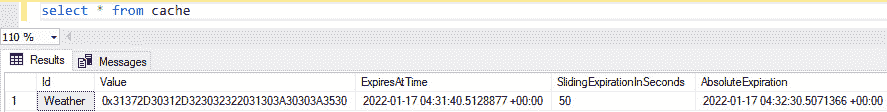

图 8.10 – SQL 分布式缓存的缓存表

如您所见，代码与 `MemoryCache` 代码非常相似，只是我们在这里使用 `IDistributedCache` 来读写缓存数据，并使用 `DistributedCacheEntryOptions` 在创建缓存条目时设置额外的属性。

使用 SQL Server 作为分布式缓存存储的一些建议如下：

+   如果现有应用程序不支持 Redis 等存储，可以选择 SQL Server。例如，仅与 SQL Server 集成的本地应用程序可以轻松扩展 SQL Server 以用于缓存目的。

+   缓存数据库应与应用程序数据库不同，因为使用相同的数据库可能会导致瓶颈并违背使用缓存的目的。

+   SQL Server 的 `IDistributedCache` 内置实现是 `SqlServerCache`，它不支持为缓存表序列化不同的模式。任何自定义都必须通过在自定义类中实现 `IDistributedCache` 来手动覆盖。

到目前为止，我们已经看到了使用 SQL Server 进行内存缓存和分布式缓存的示例。在下一节中，我们将看到如何在 .NET 6 应用程序中使用 Redis（推荐的存储之一，也是广泛用于缓存的存储）进行分布式缓存。

### Redis

Redis 是一个内存数据存储，用于各种目的，如数据库、缓存存储，甚至作为消息代理。Redis 支持的核心数据结构是键值对，其中值可以是简单的字符串，也可以是自定义的复杂数据类型（嵌套类）。Redis 与内存数据集一起工作，并且可以根据需要将数据持久化到磁盘。Redis 还内部支持 Redis 集群的复制和自动分区。由于所有这些功能都是开箱即用的，因此它是一个理想的分布式缓存存储。

Azure 提供了一个名为 **Azure Cache for Redis** 的 Redis 服务器托管实例，就像任何其他 PaaS 服务一样，由 Microsoft 管理。这允许应用程序开发者直接集成它，并将维护、扩展和升级 Redis 服务器的基础设施开销留给 Microsoft。Azure Cache for Redis 可用于分布式缓存，并且可以使用以下步骤轻松集成到 .NET 6 应用程序中：

1.  首先，根据 [`docs.microsoft.com/en-in/azure/azure-cache-for-redis/quickstart-create-redis`](https://docs.microsoft.com/en-in/azure/azure-cache-for-redis/quickstart-create-redis) 中的说明创建 Azure Cache for Redis 的实例。导航到 **访问密钥** 并复制 **主连接字符串** 下的值，如图所示：

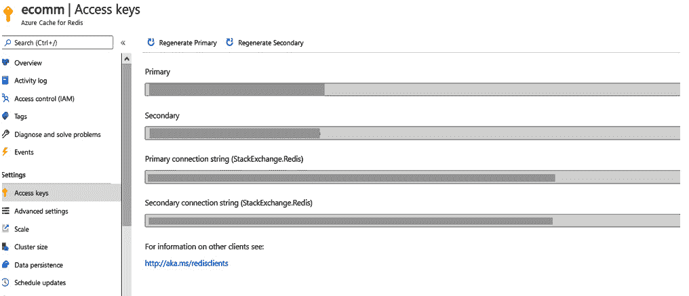

图 8.11 – Azure Cache for Redis 的缓存键

1.  创建一个 ASP.NET Core 6 Web API 应用程序并安装 NuGet 包 `Microsoft.Extensions.Caching.StackExchangeRedis`。

1.  在 `Program.cs` 中添加以下代码：

    ```cs
                builder.Services.AddStackExchangeRedisCache(
                    options =>
                    {
                        options.Configuration = 
                          "<Connection string copied in 
                            step 1>";
                    });
    ```

1.  使用与上一节 *SQL* 中所示相同的代码更新默认的 `WeatherForecastController` 控制器。

1.  运行应用程序后，我们可以看到数据在缓存中存储了 10 秒。在 50 秒内对 API 的任何调用都将从缓存中检索数据。

1.  Azure Cache for Redis 还附带一个控制台，允许我们使用 Redis CLI 命令查询 Redis 服务器。可以通过导航到 Redis 实例的左侧菜单概览来在 Azure 门户中找到该控制台。查询 `Weather` 键将给出以下截图所示的结果：

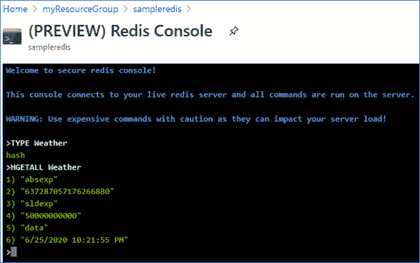

图 8.12 – Redis 控制台

如果我们选择 Azure Cache for Redis 的 Premium 层，它还支持多个分片以支持更高的数据量，并支持高可用性的地理复制。

1.  此外，为了从缓存存储中添加/删除键，还有 `GetAsync` 和 `SetAsync` 方法，可以用来存储更复杂的数据类型或任何非字符串类型。然而，这些方法返回/接受 `Task<byte[]>`，因此应用程序需要处理序列化/反序列化，这在可重用的缓存库中可以看到。

Redis 是企业应用程序中最受欢迎的缓存存储，在我们的电子商务应用程序中，我们将使用 Azure Cache for Redis 作为我们的缓存存储。有关 Azure Cache for Redis 的更多信息，可以在[`docs.microsoft.com/en-in/azure/azure-cache-for-redis/`](https://docs.microsoft.com/en-in/azure/azure-cache-for-redis/)找到。

### 其他提供者

如您所见，.NET 6 应用程序中的分布式缓存是由`IDistributedCache`驱动的，并且`Program`类中的缓存存储配置将根据注入的存储实现进行相应配置。此外，.NET 6 还内置了两个其他提供者：

+   `IDistributedCache`。NCache 可以像 Redis 或 SQL 一样集成。然而，NCache 服务器需要在本地进行配置以用于开发，并且可以使用 IaaS 中的虚拟机或 PaaS 中的应用服务进行配置。

+   `AddDistributedMemoryCache`): 这是`IDistributedCache`的另一个内置实现，可以类似地使用。它可以用于单元测试。由于它不是分布式缓存并且使用进程内存，因此不建议在多个应用程序服务器场景中使用。`AddMemoryCache(IMemoryCache)`和`AddDistributedMemoryCache(IDistributedCache)`之间的唯一区别是后者需要序列化以存储复杂数据。因此，如果存在无法序列化且需要缓存的类型，请使用`IMemoryCache`，否则请使用`IDistributedCache`。

在企业应用程序中，`IDistributedCache`可以处理所有缓存层实现，对于开发/测试环境使用内存缓存，对于生产环境使用 Redis 将是一个理想的选择。如果您的应用程序托管在单个服务器上，您可以使用内存缓存，但在生产应用程序中这种情况非常罕见，因此最推荐使用分布式缓存。

因此，基于我们讨论的所有原则和模式，我们将设计一个用于电子商务应用程序的缓存抽象层，这将在下一节中讨论。

# 使用分布式缓存设计缓存抽象层

在企业应用程序中，在底层缓存实现之上有一个包装类总是很好的，因为它抽象了缓存的核心理念，也可以用作一个包含应用程序范围内默认缓存条目选项的单个类。

我们将实现一个缓存包装类，其底层存储为 Azure Cache for Redis，使用`IDistributedCache`实现。这是一个.NET Standard 2.1 类库；该库的源代码位于`Packt.Ecommerce.Caching`项目中。任何想要缓存数据的类都应该使用构造函数注入`IDistributedCacheService`，并可以调用以下各种方法：

+   `AddOrUpdateCacheAsync<T>`: 异步添加或更新类型为`T`的缓存条目

+   `AddOrUpdateCacheStringAsync`：异步添加或更新字符串类型的缓存条目

+   `GetCacheAsync<T>`：异步获取类型为 `T` 的缓存条目

+   `GetCacheStringAsync`：异步获取字符串类型的缓存条目

+   `RefreshCacheAsync`：异步刷新缓存条目

+   `RemoveCacheAsync`：异步移除缓存条目

`DistributedCacheService` 是继承自 `IDistributedCacheService` 并实现所有上述方法的包装类。此外，在这个类中配置了 `IDistributedCache` 和 `DistributedCacheEntryOptions` 以使用分布式缓存。

对于序列化和反序列化，我们将使用 `System.Text.Json`，一个自定义的 `IEntitySerializer` 接口，以及使用以下方法创建的 `EntitySerializer` 类：

+   `SerializeEntityAsync<T>`：异步将指定的对象序列化为字节数组

+   `DeserializeEntityAsync<T>`：异步反序列化指定的流

`IEntitySerializer` 的实现通过构造函数注入注入到 `DistributedCacheService` 类中，并用于序列化和反序列化。

注意

请参阅 *序列化性能比较* 文章，该文章讨论了各种序列化程序的基准测试。您可以在 [`maxondev.com/serialization-performance-comparison-c-net-formats-frameworks-xmldatacontractserializer-xmlserializer-binaryformatter-json-newtonsoft-servicestack-text/`](https://maxondev.com/serialization-performance-comparison-c-net-formats-frameworks-xmldatacontractserializer-xmlserializer-binaryformatter-json-newtonsoft-servicestack-text/) 找到它。

`DistributedCacheService` 和 `EntitySerializer` 的实现遵循在 *第四章*，*线程和异步操作* 中讨论的所有异步原则，以及在第 *第六章**，.NET 6 中的配置*中解释的配置。

最后，在 API/MVC 应用程序中，执行以下步骤：

1.  安装 NuGet 包 `Microsoft.Extensions.Caching.StackExchangeRedis`。

1.  通过将以下代码片段添加到 `Program.cs` 来配置缓存：

    ```cs
    if (this.Configuration.GetValue<bool>("AppSettings:UseRedis"))
    {
        builder.Services.AddStackExchangeRedisCache(
          options =>
        {
            options.Configuration = this.Configuration
              .GetConnectionString("Redis");
        });
    }
    else
    {
        services.AddDistributedMemoryCache();
    }
    ```

1.  从配置的角度来看，向 `appsettings.json` 中添加了两个属性，如下所示：

    ```cs
      "ConnectionStrings": {
        //removed other values for brevity
        "Redis": "" //Azure Cache for Redis connection 
                    //string.
      },
      "AppSettings": {
        //removed other values for brevity
        "UseRedis": false //Flag to fallback to in memory 
        //distributed caching, usually false for local 
        //development.
      },
    ```

任何想要缓存数据的类都需要添加对 `Packt.Ecommerce.Caching` 项目的引用，并注入 `IDistributedCacheService`，然后可以调用上述方法来读取/更新/插入缓存存储中的数据。以下是一个使用缓存服务的代码片段：

```cs
   public class Country
```

```cs
    {
```

```cs
      public int Id { get; set; }
```

```cs
      public string Name { get; set; }
```

```cs
    }
```

```cs
        public async Task<Country> GetCountryAsync()
```

```cs
        {
```

```cs
            var country = await 
```

```cs
            this.cacheService.GetAsync<Country>("Country"); // cacheservice is of Type IDistributedCacheService and is 
```

```cs
// injected using constructor injection.
```

```cs
            if (country == null)
```

```cs
            {
```

```cs
                country = await 
```

```cs
                  this.countryRepository.GetCountryAsync(); // Retrieving data from database using Repository pattern.
```

```cs
                if (country != null)
```

```cs
                {
```

```cs
                    await this.cacheService
```

```cs
                     .AddOrUpdateAsync<Country>("Country", 
```

```cs
                     country, TimeSpan.FromMinutes(5));
```

```cs
                }
```

```cs
            }
```

```cs
            return country;
```

```cs
        }
```

在这里，我们使用缓存旁路模式，首先检查缓存存储中的 `Country` 键。如果找到，则从函数中返回它，否则从数据库中检索它并将其插入缓存，然后从函数中返回。我们将在 *第十章*，*创建 ASP.NET Core 6 Web API* 中大量使用缓存服务。

正如你所看到的，我们已经使用了之前章节中讨论的一些模式。在下一节中还将讨论一些额外的考虑因素，这些因素在设计企业应用中的缓存层时需要牢记。

## 缓存考虑因素

在企业应用中，拥有一个缓存层对于提高性能和可扩展性至关重要。因此，在开发缓存层时需要考虑以下因素：

+   如果我们正在构建一个新的应用程序，那么可以使用`IDistributedCache`实现作为起点，使用 Azure Cache for Redis，因为它可以很容易地通过几行代码集成到应用程序中。然而，这需要评估相应的成本。

+   对于一个现有的项目，当前的基础设施起着至关重要的作用，如果已经使用 SQL Server 作为数据存储，那么 SQL 可以成为默认的选择。然而，对 SQL 与 Redis 的性能进行基准测试是个好主意，并据此做出相应的决策。

+   在底层缓存存储上有一个包装类是一个好的方法，因为它将应用程序与缓存存储解耦，并使得代码在缓存存储未来发生变化时更加灵活且易于维护。

+   `IMemoryCache`和`IDistributedCache`的方法不是线程安全的。例如，假设一个线程从缓存中查询一个键，发现它不在缓存中，然后回退到原始数据存储。当从原始存储检索数据时，如果另一个线程查询相同的键，它不会等待第一个线程完成从数据库的读取。第二个线程也将回退到数据库。因此，需要显式处理线程安全性，可能是在包装类中。

+   除了应用缓存之外，还应实现响应缓存以实现进一步的优化。

+   `If-None-Match`请求头，如果匹配，服务器返回`304`（无变化），客户端可以重用数据的缓存版本。对于 ETag，服务器端没有内置的实现，因此可以使用过滤器或中间件来实现服务器端逻辑。

+   尽管我们在实现中使用了 JSON 序列化，但还有其他格式，如 BSON 或协议缓冲区，应该评估用于序列化和反序列化。

正如任何其他用于缓存的开发中的应用组件一样，没有一种适合所有情况的解决方案。因此，应该评估前面提到的点，并相应地实施适当的缓存解决方案。

# 摘要

在本章中，我们学习了各种缓存技术、模式和它们在提高应用程序性能方面的好处。此外，我们还学习了 HTTP 缓存，如何将响应缓存集成到 API 响应中，以及各种可用的缓存提供者和它们与.NET 6 应用程序的集成。我们还学习了如何使用`IDistributedCache`实现分布式缓存，并构建了一个缓存抽象层，该层将在后续章节中用于缓存需求。我们在学习过程中了解的一些关键信息和技能包括为什么和何时需要缓存，以及如何在.NET 6 应用程序中实现缓存。

在下一章中，我们将探讨.NET 6 中的各种数据存储和提供者及其与.NET 6 应用程序的集成。

# 问题

1.  以下哪个`Cache-Control`头部的值允许响应存储在任何服务器（客户端/服务器/代理）中？

a. `私有`

b. `公共`

c. `No-cache`

**答案：b**

1.  在多应用服务器场景中，我们应该选择以下哪个缓存平台？

a. 分布式缓存

b. 内存缓存

**答案：a**

1.  判断对错：在缓存旁路模式中，数据首先更新在缓存存储中，然后是在底层数据存储中。

a. 正确

b. 错误

**答案：b**

1.  以下哪个缓存最适合存储静态文件和图像文件并支持地理复制？

a. 网络服务器缓存

b. 应用程序缓存

c. 内容分发网络（CDN）

**答案：c**

# 进一步阅读

你可以在此处了解更多有关缓存的信息：

+   [`github.com/Alachisoft/NCache`](https://github.com/Alachisoft/NCache)

+   [`redis.io/`](https://redis.io/)

+   [`aws.amazon.com/redis/`](https://aws.amazon.com/redis/)

+   [`docs.microsoft.com/en-us/azure/azure-cache-for-redis/cache-configure#redis-console`](https://docs.microsoft.com/en-us/azure/azure-cache-for-redis/cache-configure#redis-console)

+   功能（terracotta.org）
