# 第九章：*第九章*：在 .NET 6 中处理数据

任何应用程序的一个基本组件是将数据持久化到永久数据存储的能力；在选择合适的持久化存储时进行一些前瞻性思考可以帮助系统在未来更好地扩展。

任何应用程序中常见的操作之一是登录系统，执行一些读取/更新操作，注销，然后稍后再回来查看是否保留了更改。数据库在持久化这些通常称为 **用户事务** 的操作中发挥着重要作用。除了事务数据外，为了监控和调试目的，应用程序可能还需要存储日志数据和审计数据，例如谁修改了日期。设计任何此类应用程序的一个重要步骤是理解需求并相应地设计数据库。选择/设计数据库时，还必须考虑各种数据保留要求和任何数据保护政策，例如 **通用数据保护条例**（**GDPR**）。

一个应用程序可以有多个数据提供者，例如结构化查询语言（**SQL**）数据提供者、NoSQL 数据提供者和文件数据提供者。在本章中，我们将讨论可用于 .NET 6 中存储和数据处理的多种数据提供者。我们将涵盖以下主题：

+   数据简介

+   磁盘、文件和目录

+   SQL、Azure Cosmos DB 和 Azure Storage

+   使用 EF Core 进行操作

+   使用 Azure Cosmos DB 设计数据访问服务

# 技术要求

需要基本了解 .NET Core、C#、Azure 和 .NET **命令行界面**（**CLI**）。

本章的代码文件可以在以下链接找到：[`github.com/PacktPublishing/Enterprise-Application-Development-with-C-10-and-.NET-6-Second-Edition/tree/main/Chapter08`](https://github.com/PacktPublishing/Enterprise-Application-Development-with-C-10-and-.NET-6-Second-Edition/tree/main/Chapter08).

代码的说明可以在这里找到：[`github.com/PacktPublishing/Enterprise-Application-Development-with-C-10-and-.NET-6-Second-Edition/tree/main/Enterprise%20Application`](https://github.com/PacktPublishing/Enterprise-Application-Development-with-C-10-and-.NET-6-Second-Edition/tree/main/Enterprise%20Application).

# 数据简介

任何网络应用程序，无论是内容管理系统、社交网络平台还是电子商务应用程序，都需要将数据持久化到永久存储中，以便用户可以按需检索、消费和处理数据。在*第八章*，“所有你需要知道的缓存知识”中，我们讨论了使用缓存存储；然而，缓存存储是临时存储，数据仍然需要持久化在永久存储中。因此，我们需要一个不仅支持对各种实体进行**创建/读取/更新/删除**（**CRUD**）操作，而且支持高可用性并在出现故障时恢复任何数据的存储，即灾难恢复。

优秀系统设计的关键标准之一是在系统设计的早期阶段就设计数据模型。数据模型应尝试定义系统运行和实体间交互所需的所有可能的实体。在系统设计早期定义数据模型有助于确定如何管理数据以及可以使用哪种数据存储，以及决定各种复制/分区策略。

在接下来的章节中，将解释两种常见的数据存储分类。

## 关系型数据库管理系统（RDBMS）

关系型数据库将数据存储在表中。每个实体被定义为一张或多张表，数据库通过多张表来定义。将表分割成多张表的过程称为**规范化**。各种表之间的关系通过外键约束来定义。实体的属性定义为列，相同类型的多个实体存储为行。一些常用的关系型数据库包括 Microsoft SQL Server、MySQL、PostgreSQL 和 Oracle。

一个典型的用于存储员工信息的关系型数据库可能有一个`employee`表，定义员工的各项属性，如姓名、员工 ID 等，以及以员工 ID 作为主键的列。多个员工以单独的行存储在这个表中。员工的任何属性都可以进一步规范化到单独的表中；例如，员工的工程项目可以存储在单独的表中（因为可能有多个项目），比如`employeeproject`，并且可以通过员工 ID 与`employee`表链接，如下面的图所示：

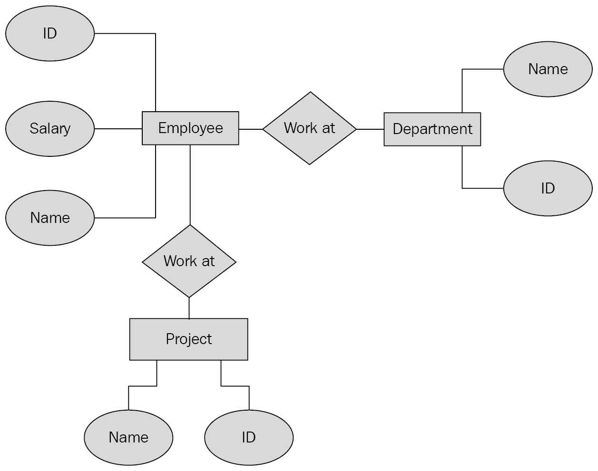

图 9.1 – 员工实体关系图

以下是一些关系型数据库的关键特性：

+   关系型数据库使用 SQL 进行查询。

+   表通常具有明确的模式和约束，并且不太可能发生变化。

+   所有交易都具有**原子性/一致性/隔离性/持久性**（**ACID**）属性，因此维护数据完整性和一致性。

+   由于数据已规范化，冗余最小化。

+   关系型数据库通常支持垂直扩展，即向上扩展（它们确实支持复制，但与 NoSQL 数据库中的复制相比，这是一个昂贵的操作）。

## NoSQL

另一种类型的数据存储是 NoSQL 数据库，它们以非结构化格式存储数据，其中数据不需要有预定义的模式。最常见的是，数据以键值对的形式存储（例如在 Redis 中），以文档的形式存储（例如在 MongoDB 和 CouchDB 中），或使用图结构存储为图（例如在 Neo4j 中）。

如果我们将相同的员工示例持久化到 NoSQL 数据库中，例如 MongoDB，我们最终会在一个名为`employee`的集合中存储它，每个文档存储员工的全部属性，如下所示：

```cs
{
```

```cs
  "employee": [
```

```cs
    {
```

```cs
      "employeeid": 1,
```

```cs
      "name": "Ravindra",
```

```cs
      "salary": 100,
```

```cs
      "Projects": [
```

```cs
        {
```

```cs
          "id": 1,
```

```cs
                  "name": "project1",
```

```cs
        },
```

```cs
        {
```

```cs
                     "id": 2,
```

```cs
                  "name": "project2",
```

```cs
        }
```

```cs
      ]
```

```cs
    }
```

```cs
  ]
```

```cs
}
```

以下是一些 NoSQL 数据库的关键特性：

+   实体不一定需要支持固定的模式，并且在任何时间点都可以添加额外的属性。

+   它们非常适合非结构化数据，例如，在共享出行应用中存储位置。

+   它们可以以比关系型数据库低得多的成本轻松支持水平扩展。

+   数据高度冗余；然而，这提供了显著的性能提升，因为数据可以随时使用，而无需在表之间执行连接操作。

Azure Cosmos DB 是我们将在我们的电子商务应用程序中用作数据存储的一种云管理的 NoSQL 数据库。

让我们在下一节中详细查看各种存储选项。

# SQL、Azure Cosmos DB 和 Azure Storage

之前，我们讨论了将数据存储更广泛地分类为 RDBMS 和 NoSQL。在本节中，让我们深入了解 Microsoft 生态系统中的一些数据提供者及其与.NET 6 的集成。提供者的种类繁多，包括 SQL、Azure Cosmos DB 和 Azure Storage，数据提供者的选择完全由应用程序需求驱动。然而，在现实生活中，应用程序需求变化很大，因此关键是使用业务层和**用户界面**（**UI**）来抽象数据框架实现，这有助于根据需要演进设计。有了这个，让我们在下一节中看看我们的第一个数据提供者，SQL。

## SQL Server

在 RDBMS 市场中占主导地位的一个数据库是微软的 SQL Server，通常被称为 SQL Server，它使用 SQL 与数据库交互。SQL Server 支持所有基于 RDBMS 的实体，如表、视图、存储过程和索引，并且主要在 Windows 环境中运行。然而，从 SQL Server 2017 开始，它支持 Windows 和 Linux 环境。

SQL Server 的主要组件是其数据库引擎，负责处理查询和管理文件中的数据。除了数据库引擎之外，SQL Server 还附带各种数据管理工具，如下所示：

+   **SQL Server 管理工具**（**SSMS**）：用于连接到 SQL Server 并执行创建数据库、监控数据库、查询数据库和备份数据库等操作

+   **SQL Server 集成服务**（**SSIS**）：用于数据集成和转换

+   **SQL Server 分析服务**（**SSAS**）：用于数据分析

+   **SQL Server 报表服务**（**SSRS**）：用于报表和可视化

要在本地计算机上配置 SQL Server，我们需要安装 SQL Server 的一个版本，该版本安装数据库引擎和一个或多个先前组件。安装通常涉及下载安装程序并通过**图形用户界面**（**GUI**）或命令行进行安装。有关安装的更多详细信息，请参阅[`docs.microsoft.com/en-us/sql/database-engine/install-windows/install-sql-server?view=sql-server-ver15`](https://docs.microsoft.com/en-us/sql/database-engine/install-windows/install-sql-server?view=sql-server-ver15)。

小贴士

SQL Server 还有其他版本，如开发者版和 Express 版，这些版本轻量级且免费，可以从[`www.microsoft.com/en-in/sql-server/sql-server-downloads`](https://www.microsoft.com/en-in/sql-server/sql-server-downloads)下载。

虽然 SQL Server 在本地环境中已被广泛使用，但管理数据库、升级等始终存在开销，这就是微软推出了 Azure SQL 的原因，它是一个完全托管的**平台即服务**（**PaaS**）组件，在相同的数据库引擎上运行，就像本地 SQL Server 一样。

Azure SQL 提供了以下变体：

+   **Azure SQL 数据库（单数据库）**：这是一个托管数据库服务器，允许您创建一个完全隔离的数据库，并拥有专用资源。

+   **Azure SQL 数据库（弹性池）**：弹性池允许您在单个服务器上运行多个单数据库，这些数据库位于预定义的资源池中（就 CPU、内存和**输入/输出**（**I/O**）而言）。这对于拥有多个数据库且使用量高低不一的企业来说非常理想。在这种情况下使用弹性池的优势在于，需要更多 CPU 使用的数据库可以在需求高峰时使用它，在需求低时释放它。使用弹性池的理想情况是，有一组数据库，其消耗量不可预测。任何时候，如果您看到数据库持续消耗相同的一组资源，它可以从弹性池移动到一个单独的数据库，反之亦然。

+   **Azure SQL 托管实例**：此模型提供了一种无缝迁移本地 SQL 基础设施到 Azure SQL 的方法，无需重新架构本地应用程序，并允许您利用平台即服务（PaaS）。这对于拥有庞大的本地数据库基础设施并需要迁移到云而无需太多运营开销的应用程序来说非常理想。

+   **虚拟机上的 SQL Server (Windows/Linux)**：SQL 虚拟机属于 **基础设施即服务**（**IaaS**）类别，与本地 SQL Server 非常相似，只是虚拟机位于 Azure 而不是您的本地网络中。

    小贴士

    建议安装 SSMS 以执行 SQL Server（本地或云）的各种操作，因为它支持所有数据库操作。还有 Azure Data Studio，它轻量级，可以连接到本地或云 SQL Server，并且可以从 [`docs.microsoft.com/en-us/sql/azure-data-studio/download-azure-data-studio?view=sql-server-ver15`](https://docs.microsoft.com/en-us/sql/azure-data-studio/download-azure-data-studio?view=sql-server-ver15) 下载。

从 .NET 6 应用程序的角度来看，连接到 Azure SQL 与连接到本地 SQL Server 相同。您可以使用 ADO.NET，我们通过 `System.Data.SqlClient` 导入它，然后使用 `SqlConnection` 对象连接到 SQL；然后，使用 `SqlCommand` 对象执行 SQL 查询，并使用 `SQLReader` 类返回值。除此之外，我们还可以使用 **对象关系映射**（**ORM**）例如 **Entity Framework Core**（**EF Core**）来与 Azure SQL 一起工作，这在 *使用 EF Core* 部分中进行了讨论。

因此，在本节中，我们简要介绍了 Azure SQL。然而，我建议在这里查看 Azure SQL 的所有功能：[`docs.microsoft.com/en-us/azure/azure-sql/`](https://docs.microsoft.com/en-us/azure/azure-sql/)。更多示例请参阅 [`github.com/microsoft/sql-server-samples`](https://github.com/microsoft/sql-server-samples)。

因此，让我们继续了解 Azure Cosmos DB，这是我们电子商务应用将用作持久存储的数据库。

## Azure Cosmos DB

Azure Cosmos DB 是一个完全托管的（PaaS）NoSQL、全球分布式的、高度可扩展的数据库。Azure Cosmos DB 的一个关键特性是其多模型特性，这有助于使用不同的 API 模型，如 SQL、MongoDB 和 Gremlin，以不同的格式传递数据，例如 JSON 和 BSON。开发者可以根据自己的舒适度使用 API 来查询数据库。例如，SQL 开发者可以继续使用 SQL 查询语法查询数据库，MongoDB 开发者可以继续使用 MongoDB 语法查询数据库，等等。在底层，Azure Cosmos DB 以称为 **原子记录序列**（**ARS**）的格式存储数据库，并根据在创建数据库时选择的模式暴露数据作为 API。

Azure Cosmos DB 的另一个重要特性是其能够自动索引所有数据，而不管使用的是哪种 API 模型。所有这些操作都无需开发者额外创建索引，从而实现数据的快速检索。

Azure Cosmos DB 支持以下 API 来执行数据库操作，我们在创建数据库时选择这些 API：

+   `SELECT * FROM product WHERE product.Name = 'Mastering enterprise application development Book'`。

+   `db.product.find({"Name": 'Mastering enterprise application development Book'})`。就像 MongoDB 一样，数据以 BSON 表示。

+   **Gremlin（图）API**：此 API 支持使用 Gremlin 语言查询和遍历以图格式表示的数据。这在数据可以表示为图形式并通过其关系进行查询的情况下非常理想。一个典型的例子是一个推荐引擎，它可以建立两个实体之间的关系并提出推荐。

此外，还有 Cassandra API，它使用**Cassandra 查询语言**（**CQL**）在数据库上操作，然后是 Table API，它可以用作构建在 Azure 表存储之上的应用程序的数据存储。

如您所见，有相当多的 API，并且还有更多正在添加。选择正确的 API 完全取决于应用程序需求；然而，以下几点可以用来缩小选择范围：

+   如果是新的应用程序，请选择核心（SQL）API。

+   如果它是一个基于 NoSQL 的现有应用程序，请根据底层数据存储选择相关的 API。例如，如果现有数据库是 MongoDB，请选择 Mongo API 等。

+   对于处理特定场景，例如建立数据之间的关系，请使用 Gremlin API。

对于我们的企业应用程序，由于我们是从头开始构建此应用程序的，因此我们将选择核心（SQL）API 作为与 Azure Cosmos DB 交互的 API。

让我们从创建一个简单的控制台应用程序开始，并在 Azure Cosmos DB 上执行一些操作，我们稍后将在构建我们的数据访问服务时重用这些概念：

1.  首先，我们需要有一个 Azure Cosmos DB 账户，因此登录到 Azure 门户，点击**创建资源**，然后选择**数据库** | **Azure Cosmos DB**。

1.  这将打开**创建 Azure Cosmos DB 账户**页面。填写以下截图所示的详细信息，然后点击**审查 + 创建**。这是我们选择要选择的 API 的页面，在我们的情况下是核心（SQL）API：

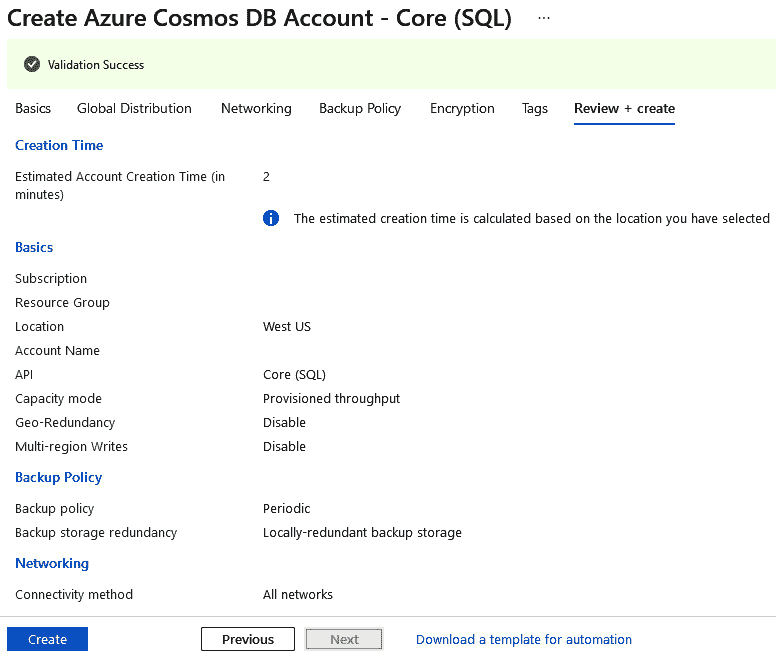


图 9.2 – 创建 Azure Cosmos DB 账户页面

1.  账户创建完成后，导航到**Azure Cosmos DB 账户** | **密钥**。复制**URI**和**PRIMARY KEY**值。

1.  打开命令行，使用以下命令创建控制台应用程序：

    ```cs
    dotnet new console --framework net6.0 --name EcommerceSample
    ```

1.  导航到 `EcommerceSample` 文件夹，并使用以下命令安装 Azure Cosmos DB SDK：

    ```cs
    dotnet add package Microsoft.Azure.Cosmos -s https://api.nuget.org/v3/index.json
    ```

1.  在此阶段，我们可以将文件夹在 VS Code 中打开。一旦我们在 VS Code 中打开文件夹，它将看起来如下所示：

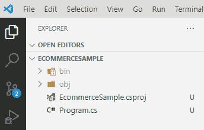


图 9.3 – VS Code 中的 EcommerceSample

1.  打开 `Program.cs` 文件，并将以下静态变量添加到 `Program` 类中，这些变量将保存 *步骤 3* 中复制的 **URI** 和 **主键** 值：

    ```cs
    string Uri = "YOUR URI HERE ";
    string PrimaryKey = "YOUR PRIMARY KEY HERE";
    ```

1.  现在，让我们添加代码来创建 `CosmosClient` 类的实例，并使用它来创建 Azure Cosmos DB 数据库。随后，此对象将被用于与我们的 Azure Cosmos DB 数据库进行通信。由于 `CosmosClient` 实现了 `IDisposable` 接口，我们将在 `using` 块内创建它，以便对象可以在 `using` 块之后自动释放。一旦运行此代码并导航到 `Ecommerce`，就会创建数据库。由于我们使用 Core (SQL) API 创建了 Azure Cosmos DB 账户，因此此数据库将支持使用 SQL 语法进行查询：

    ```cs
    using (CosmosClient cosmosClient = new CosmosClient(Uri,
     PrimaryKey))
    {
     DatabaseResponse createDatabaseResponse
    = await cosmosClient.CreateDatabaseIfNotExistsAsync
    ("ECommerce");
     Database database = createDatabaseResponse.Database;
    }
    ```

1.  现在，让我们在 `createDatabaseResponse` 之后添加代码来创建一个类似于 SQL 表的容器。由于我们正在使用 `CreateDatabaseIfNotExistsAsync` 来创建数据库，运行相同的代码不会引发任何异常：

    ```cs
    var containerProperties = new ContainerProperties
    ("Products", "/Name");
    var createContainerResponse = await 
    database.CreateContainerIfNotExistsAsync(
    containerProperties, 10000); 
    var productContainer = createContainerResponse.
    Container;
    ```

一旦运行此代码，我们可以在 Azure 门户中看到在 `Ecommerce` 数据库下创建了一个名为 `Products` 的容器：

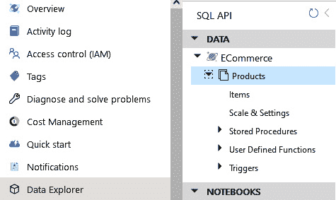

图 9.4 – 产品容器

容器是 Azure Cosmos DB 中的一个单元，它在多个区域中进行水平分区和复制。在前面的代码中，我们在创建容器时传递了 `ContainerProperties`，你可以看到其中一个值是 `Name`，这实际上就是一个分区键。

分区是 Azure Cosmos DB 的一个关键特性，它根据分区键将容器内的数据分割成多个逻辑分区，即具有相同分区键的所有项都属于同一个逻辑分区。使用分区键，Azure Cosmos DB 实现了数据库的水平扩展，因此满足了应用程序的可扩展性和性能需求。

选择分区键是一个关键的设计决策，因为它将极大地帮助数据库进行扩展并提高性能。此外，分区键不能更改，必须在创建容器时定义。在选择分区键时，以下几点可以牢记在心：

+   它应该具有最大数量的唯一值；唯一值的数量越多，分区效果越好。例如，如果我们正在创建一个用于产品的容器，产品 ID 或名称可以作为分区键，因为这两个属性可以唯一标识大多数产品。在底层，如果选择产品名称作为分区键，并且内部有 100 个产品，那么在 Azure Cosmos DB 中将表示为 100 个逻辑容器。在这里，产品类别也可以作为分区键，但在将其作为分区键选择之前，我们需要评估样本数据并根据需求做出决定。

+   如果没有明显的唯一选择，我们可以选择在过滤查询中最常用的字段，所以基本上是一个在`where`子句中经常使用的列。

    小贴士

    在实际应用中，创建 Azure Cosmos DB 账户应使用 ARM 模板或使用 Terraform 实现，这样模板可以轻松地与**持续部署**（**CD**）集成。

基于此，让我们向我们的产品容器添加一些数据并查询它：

1.  我们将根据以下示例 JSON 添加此实体。根据产品类别，可能会有不同的属性。

例如，如果产品类别是`Books`，则`Authors`和`Format`等字段中会有值；然而，如果类别是`Clothing`，则`Size`和`Color`等字段会有值。这种模式可以在我们的电子商务应用程序中重用：

```cs
{
  "Id": "Book.1",
  "Name": "Mastering enterprise application
      development Book",
  "Category": "Books",
  "Price": 100,
  "Quantity": 100,
  "CreatedDate": "20-02-2020T00:00:00Z",
  "ImageUrls": [],
  "Rating": [
    {"Stars": 5, "Percentage": 95},
    {"Stars": 4, "Percentage": 5}
  ],
  "Format": ["PDF","Hard Cover"],
  "Authors": ["Rishabh Verma","Neha Shrivastava",
      "Ravindra Akela","Bhupesh Guptha"],
  "Size": [],
  "Color": []
}
```

1.  现在，让我们创建`Product`。在 Azure Cosmos DB 的 Core (SQL) API 中，任何实体的必填字段之一是`id`字段，它类似于主键。因此，对于我们的父模型来说，定义`id`字段是必要的。这些类看起来如下所示：

    ```cs
    public class Rating{
        public int Stars { get; set; }
        public int Percentage { get; set; }
    }
    public class Product{
        [JsonProperty(PropertyName = "id")]
        public string ProductId { get; set; }
        public string Name { get; set; }
        public string Category { get; set; }
        public int Price { get; set; }
        public int Quantity { get; set; }
        public DateTime CreatedDate { get; set; }
        public List<string>  ImageUrls { get; set; }
        public List<Rating> Rating { get; set; }
        public List<string> Format { get; set; }
        public List<string> Authors { get; set; }
        public List<int> Size { get; set; }
        public List<string> Color { get; set; }
    }
    ```

1.  现在，让我们创建以下`Product`类的对象并将其插入到数据库中：

    ```cs
    Product book = new Product()
    {
        ProductId = "Book.1", Category = "Books", Price =
        100,
        Name = "Mastering enterprise application
        development Book",                    
        Rating = new List<Rating>() { new Rating { Stars =
        5, Percentage = 95 }, new Rating { Stars = 4,
        Percentage = 5 } },
        Format = new List<string>() { "PDF", "Hard Cover" 
        },
        Authors = new List<string>() { "Suneel", "Arun", 
          "Ravindra", "Bhupesh" }
    };
    ```

1.  现在，我们将使用`productContainer`对象调用`CreateItemAsync`方法，如下面的代码片段所示。（还有其他从数据库检索记录的方法，其中一种将在下一点中展示。）我们还应该确保没有已经存在具有相同`ProductId`值的对象：

    ```cs
    try
    {
        // Check if item it exists.  
        ItemResponse<Product> productBookResponse = await 
          productContainer.ReadItemAsync<Product>(
          book.ProductId, new PartitionKey(book.Name));
    }
    catch (CosmosException ex) when (ex.StatusCode == System.Net.HttpStatusCode.NotFound)
    {
        ItemResponse<Product> productBookResponse = await 
          productContainer.CreateItemAsync<Product>(book, 
          new PartitionKey(book.Name));
        Console.WriteLine($"Created item 
          {productBookResponse.Resource.ProductId}");
    }
    ```

一旦我们运行此代码，数据应该会被插入到`Ecommerce`数据库下的`Products`容器中。

1.  如果我们想要以不同于前一点提到的方式查询此记录，我们可以使用以下代码来查询数据库。正如您所看到的，语法与从 SQL 数据库查询数据非常相似：

    ```cs
    string getAllProductsByBooksCAtegory = "SELECT * FROM p WHERE p.Category = 'Books'";
    QueryDefinition query = new QueryDefinition(getAllProductsByBooksCAtegory);
    FeedIterator<Product> iterator = productContainer.GetItemQueryIterator<Product>(query);
    while (iterator.HasMoreResults)
    {
        FeedResponse<Product> result = await 
          iterator.ReadNextAsync();
        foreach (Product product in result)
        {
            Console.WriteLine($"Book retrived –
            {product.Name}");
        }
    }
    ```

同样，`ContainerClass`提供了可用于各种 CRUD 操作的所有相关方法。所有这些 API 都可以在以下位置找到：[`docs.microsoft.com/en-us/dotnet/api/microsoft.azure.cosmos.container?view=azure-dotnet`](https://docs.microsoft.com/en-us/dotnet/api/microsoft.azure.cosmos.container?view=azure-dotnet)。

在这个基础上，我们将设计电子商务应用程序所需的数据模型和相关数据服务层，以便由各种 API 使用。到目前为止，我们已经看到了 SQL 和 NoSQL 提供商。让我们看看我们还有哪些其他选项来持久化数据。

## Azure 存储

Azure Storage 是一个高度可用和可扩展的数据存储，支持以各种格式存储数据，包括文件。主要来说，Azure Storage 支持以下四种类型的数据：

+   **Azure Table**：一种支持持久化无模式数据的 NoSQL 实现。

+   **Azure Blob**：Blob 是适合于需要上传、下载或流式传输大量文件的未结构化数据。

+   **Azure 队列**：这允许您以任何可序列化的格式排队消息，然后由服务进行处理。队列非常适合具有大量服务间通信的场景，并作为消息的持久层。

+   **Azure 文件/Azure 磁盘**：一个文件数据存储，非常适合基于本地文件 API 构建的系统。

以下是一些使 Azure 存储成为应用程序开发重要组件的几个要点：

+   **高可用性**：存储在 Azure 存储中的数据提供了数据中心/区域之间的复制支持，这进一步确保了某个区域的硬件故障不会导致数据丢失。

+   **性能**：开箱即用的 CDN 集成支持，有助于从更靠近用户的位置（边缘服务器）缓存和加载数据（尤其是静态文件），从而进一步提高性能。此外，存储类型可以升级到高级存储，利用 SSD 进一步加快磁盘 I/O 并提高性能。

+   **完全托管**：硬件由 Azure 完全管理，包括任何更新/维护。

+   **安全性**：所有存储在磁盘上的数据都进行了加密，Azure 存储中对数据的访问进一步支持私有、公共和匿名模式。

+   **按量付费**：与所有其他 Azure 服务一样，Azure 存储也支持基于数据量/操作的按量付费模式。

### Azure 存储帐户

让我们创建一个简单的控制台应用程序，将文件上传到 Blob 并从 Blob 下载文件。要与 Azure 存储服务通信，先决条件是创建一个 Azure 存储帐户，该帐户提供对所有 Azure 存储服务的访问，并通过一个唯一的命名空间让我们能够通过 HTTP/HTTPS 访问 Azure 存储中存储的数据。要创建 Azure 存储帐户，请执行以下步骤：

1.  登录 Azure 门户，点击**创建资源**，然后选择**存储帐户**。这将打开**创建存储帐户**页面。填写以下屏幕截图中显示的详细信息，然后点击**审查 + 创建**：

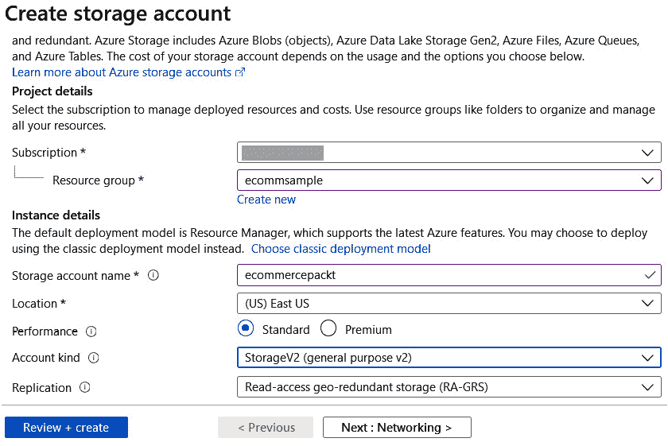

图 9.5 – 创建 Azure 存储帐户

对于标准层，有两个重要属性**帐户类型**和**复制**。对于**帐户类型**，我们有以下可能的值：

+   **StorageV2（通用 v2）**：帐户类型的最新版本，提供对所有存储类型的访问，例如文件、块和队列。这对于新创建的存储帐户来说更可取。

+   **存储（通用 v1）**：帐户类型的较旧版本，提供对所有存储类型的访问，例如文件、块和队列。

+   **BlobStorage**：仅支持 blob 存储的帐户类型。

另一个是**复制**，它支持在数据中心/区域之间复制存储数据。可能的值在以下屏幕截图中显示：

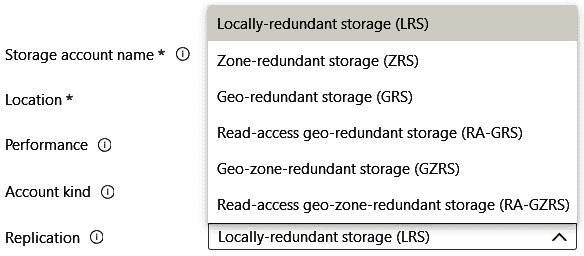

图 9.6 – Azure 存储账户中的复制选项

1.  一旦创建账户，导航到**存储账户** | **密钥**。复制**连接字符串**值。

1.  创建一个新的.NET 6 控制台应用程序并安装`Azure.Storage.Blobs` NuGet 包。

1.  要将内容上传到 Azure 存储，我们首先需要创建一个容器。我们将使用`Azure.Storage.Blobs.BlobContainerClient`类及其`CreateIfNotExistsAsync`方法来创建容器（如果不存在）。有了这个，更新`Program`类，如下面的代码片段所示：

    ```cs
       string connectionString = «CONNECTION_STRING";
       string containerName = «fileuploadsample";
       string blobFileName = «sample.png";
       // Upload file to blob            
       BlobContainerClient containerClient = new 
       BlobContainerClient(connectionString, 
       containerName);
       await containerClient.CreateIfNotExistsAsync(
         PublicAccessType.None);//Making blob private.
    ```

1.  接下来，我们需要将文件上传到容器，我们将使用`Azure.Storage.Blobs.BlobClient`，它接受连接字符串、容器名称和 blob 名称作为输入参数。对于此示例，我们将上传一个本地的`sample.png`文件到 blob，我们将使用`FileStream`类读取它，并将其传递给`Azure.Storage.Blobs.BlobClient`类的`UploadAsync`方法。在`Main`方法中容器创建后添加以下代码片段：

    ```cs
    BlobClient blobClient = new BlobClient(connectionString, 
    containerName, blobFileName);
    using FileStream fileStream = File.OpenRead(blobFileName); // blobFileName is relative path of the file.
    await blobClient.UploadAsync(fileStream, true);
    fileStream.Close();
    Console.WriteLine(blobClient.Uri.ToString());
    ```

在此阶段运行示例将文件上传到 blob，并在命令行中显示 blob URL。然而，如果我们尝试访问 URL，由于创建的 blob 是私有的，它将无法访问。要访问私有 blob，我们需要生成一个`Main`方法：

```cs
BlobSasBuilder sasBuilder = new BlobSasBuilder()
{
    BlobContainerName = containerClient.Name,
    Resource = "b", // c for container
    BlobName = blobClient.Name
};
sasBuilder.ExpiresOn = DateTimeOffset.UtcNow.AddHours(1); // Setting expiry time of the SAS link to 1 hour
sasBuilder.SetPermissions(BlobContainerSasPermissions.Read);
if (blobClient.CanGenerateSasUri)
{
    Uri blobSasUri = 
      blobClient.GenerateSasUri(sasBuilder);
    Console.WriteLine(blobSasUri.ToString());
}
Console.ReadLine();
```

在这里，我们使用`Azure.Storage.Sas.BlobSasBuilder`类来配置各种参数，例如权限和过期时间，以生成上传文件的 SAS URI。最后，前面代码的输出如下所示：

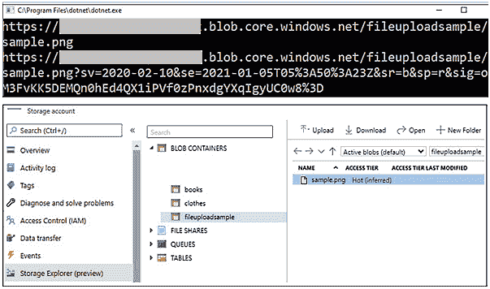

图 9.7 – Blob 上传输出和存储资源管理器

这是一个使用 Azure Storage 进行文件上传的小示例。这可以进一步扩展为一个 API，最终可用于文件上传和下载场景。对于我们的电子商务应用程序，我们将使用 Azure Blob 来存储产品的图片。

注意

关于 Azure 存储的更高级概念和示例，请参考以下链接：

[`docs.microsoft.com/en-us/azure/storage/common/storage-account-overview`](https://docs.microsoft.com/en-us/azure/storage/common/storage-account-overview)

[`github.com/Azure/azure-sdk-for-net/tree/master/sdk/storage/Azure.Storage.Blobs/samples`](https://github.com/Azure/azure-sdk-for-net/tree/master/sdk/storage/Azure.Storage.Blobs/samples)

在本节中，我们讨论了.NET 6 中可用的各种数据提供者。然而，一个简化数据持久化的重要库是 EF。让我们看看如何在.NET 6 应用程序中集成 EF。

# 使用 EF Core

EF Core 是一个 ORM，它被推荐用于任何使用关系数据库作为数据存储的 ASP.NET Core 6 应用程序。之前，我们看到了在 ADO.NET 中，我们必须创建`Connection`、`Command`和`Reader`对象。EF 通过提供抽象并允许开发者编写应用程序代码来简化这个过程，并且像任何其他 ORM 一样，EF 帮助开发者使用对象模型范式在数据库上执行各种操作。

配置 EF Core 就像安装所需的 NuGet 包，在`Program`类中注入所需的服务，然后在需要的地方使用它们。在这个过程中，需要定义的一个关键类是数据库上下文，它需要继承`Microsoft.EntityFrameworkCore.DbContext`类。让我们看看我们如何做到这一点，以及剩余的 EF Core 配置。

## 配置和查询

EF Core 中的`DbContext`类包含我们应用程序与数据库通信所需的所有抽象，因此集成 EF Core 的关键设置之一是定义我们的应用程序特定上下文类。这个类将主要以`DbSet`类型的公共属性的形式持有所有 SQL 表/视图，如下面的代码所示：

```cs
public virtual DbSet<Employee> Employees { get; set; }
```

在这里，`Employee`是代表我们数据库中表的 POCO 类。应用程序上下文类应该有一个参数化构造函数，它接受`DbContextOptions`或`DbContextOptions<T>`并将其传递给基类。

让我们基于 Razor Pages 和 SQLite 创建一个简单的 Web 应用程序，并使用 EF Core 读取数据。对于这个示例，我们将使用 SQLite 作为数据存储，选择一个简单的员工数据库，其中包含以下数据模型：

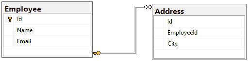

图 9.8 – 员工数据库模型

如果你之前没有使用过 Razor Pages，不要担心；它是一个基于页面的框架，可以用于在 ASP.NET Core 6 中构建数据驱动应用程序，并在*第十一章*中介绍，即*创建 ASP.NET Core 6 Web 应用程序*。

现在，按照以下步骤创建我们的应用程序：

1.  使用以下命令从命令行创建一个新的 Razor Pages 应用程序，这将创建一个名为`EmployeeEF`的新 Razor Pages 应用程序：

    ```cs
    dotnet new webapp --framework net6.0 --name EmployeeEF
    ```

1.  导航到`EmployeeEF`文件夹，并在 Visual Studio Code 中打开它，然后安装以下 NuGet 包：

    +   `Microsoft.EntityFrameworkCore.Sqlite`

    +   `Microsoft.EntityFrameworkCore.Design`

前一个包是 SQLite 的 EF Core 提供程序，后一个包用于使用 EF Core 迁移创建基于 C# POCOs 的数据库。

1.  现在，添加`Models`文件夹，并按照以下方式添加必要的 POCO 类。这些类代表来自*图 9.8*的数据库模式：

    ```cs
        public class Address
        {
         public int AddressId { get; set; }
         public int EmployeeId { get; set; }
         public string City { get; set; }
         public Employee Employee { get; set; }
        }
        public class Employee
        {
         public int EmployeeId { get; set; }
         public string Name { get; set; }
         public string Email { get; set; }
         public ICollection<Address> Address { get; set; }
        }   
    ```

1.  在这里，数据库表中的所有列都表示为具有相关数据类型的属性。对于如外键这样的关系，会在子类型中创建一个属性（称为 `ICollection`），同时在父类类型中创建另一个属性。例如，在前面的代码中，这通过 `public Icollection<Address> Addresses` 和 `public Employee Employee` 属性表示，这些属性定义了 `Employee` 和 `Address` 表之间的外键约束。任何名为 `ID` 或 `<class name>ID (EmployeeID)` 的属性都会自动被认为是主键。可以在 `OnModelCreating` 期间使用 Fluent API 或在 `System.ComponentModel.DataAnnotations` 中使用注解进一步定义约束。有关模型创建的更多示例和详细信息，请参阅 [`docs.microsoft.com/en-us/ef/core/modeling`](https://docs.microsoft.com/en-us/ef/core/modeling)。

1.  添加一个继承自 `Microsoft.EntityFrameworkCore.DbContext` 的类，并将其命名为 `EmployeeContext`。添加以下代码以定义我们的数据库上下文：

    ```cs
        public class EmployeeContext : DbContext
        {
            public DbSet<Employee> Employees { get; set;}
            public DbSet<Address> Addresses { get; set;}
             public EmployeeContext (DbContextOptions
             <EmployeeContext> options)
                : base(options)
            {}
            protected override void OnModelCreating
            (ModelBuilder modelBuilder)
            {
                modelBuilder.Entity<Employee>().ToTable
                ("Employee");
                modelBuilder.Entity<Address>().ToTable
                ("Address");
            }
        }
    ```

1.  在 `appsettings.json` 中添加连接字符串。由于我们使用 SQLite，指定数据源中的文件名应该足够。但是，这会根据提供程序而变化：

    ```cs
      "ConnectionStrings": {
        "EmployeeContext": "Data Source=Employee.db"
      }
    ```

1.  现在，在 `Program` 类中注入数据库上下文类，以便在整个应用程序中可用。在这里，我们还传递连接字符串并配置任何其他选项，例如重试策略和查询记录：

    ```cs
    builder.Services.AddDbContext<EmployeeContext>(options =>
    { 
     options.UseSqlite(builder.Configuration.GetConnectionString("EmployeeContext"));
    });
    ```

我们几乎完成了 EF Core 的设置。因此，现在让我们创建一些可以用于填充数据库的示例数据。

1.  为了这个目的，我们将在我们的数据库上下文中创建一个扩展方法并在启动时调用它。创建一个名为 `DbContextExtension` 的静态类，并向其中添加以下代码。此代码只是向数据库中添加一些记录：

    ```cs
        public static void SeedData(this EmployeeContext
        context)
        {
            SeedEmployees(context);            
        }
        private static void SeedEmployees(EmployeeContext
        context)
        {
            if (context.Employees.Any())
            {
                return;
            }
            var employees = new Employee[]
            {
                new Employee{EmployeeId = 1, Name =
                "Sample1", Email="Sample@sample.com"},
                new Employee{EmployeeId = 2, Name =
                "Sample2", Email="Sample2@sample.com"},
                new Employee{EmployeeId = 3, Name =
                "Sample3", Email="Sample3@sample.com"}
             };
            context.Employees.AddRange(employees);
            var adresses = new Address[]
            {
             new Address{AddressId = 1, City = "City1",
             EmployeeId = 1},
             new Address{AddressId = 2, City = "City2",
             EmployeeId = 1},
             new Address{AddressId = 3, City = "City1",
             EmployeeId = 2},
            };
            context.Addresses.AddRange(adresses);
            context.SaveChanges();
        }
    ```

1.  打开 `Program` 类并添加以下代码，该代码在应用程序启动时填充数据。由于这是开发环境，我们可以检查环境是否为开发环境并添加它。由于我们在插入之前检查员工表中的内容，因此应用程序的多次运行不会覆盖数据：

    ```cs
    using (var serviceScope = ((IApplicationBuilder)app).ApplicationServices?.GetService<IServiceScopeFactory>()?.CreateScope())
        {
          using (var context = 
            serviceScope?.ServiceProvider
            .GetRequiredService<EmployeeContext>())
          {
            context?.SeedData();
          }
        }
    ```

1.  现在，在 VS Code 终端中运行 `dotnet build` 以修复任何构建错误。为了从我们的模型生成数据库并填充数据库，我们需要在本地或全局安装 `dotnet-ef` 并在 VS Code 终端中运行迁移命令，如下所示，这将生成 `Migrations` 文件夹，然后是 `Employee.db` 文件，这是我们的 SQLite 数据库：

    ```cs
    dotnet tool install --global dotnet-ef --ignore-failed-sources //Installing dotnet ef.
    dotnet ef migrations add InitialCreate //Generate DB migrations.
    dotnet ef database update //Update database.
    ```

1.  现在，要读取 `Employee` 表，导航到 `Index.cshtml.cs` 并粘贴以下代码。在这里，我们注入 `EmployeeContext` 并从员工表中读取数据：

    ```cs
    public class IndexModel : PageModel
        {
            private readonly EmployeeContext context;
            public IndexModel(EmployeeContext context)
            {
                this.context = context;
            }
             public Ilist<Employee> Employees { get; set; 
             }
             public async Task OnGetAsync()
            {
                this.Employees = await this.context.
                Employees.Include(x => x.Address).
                AsNoTracking().ToListAsync();
            }
        }
    ```

1.  使用以下代码更新 `Index.cshtml`，该代码遍历 `IndexModel` 的 `Employees` 属性中填充的员工记录并显示它们：

    ```cs
    <table class="table">
    <tbody>
        @foreach (var item in Model.Employees)
        {<tr>
                <td>@Html.DisplayFor(modelItem =>
                item.EmployeeId)</td>
                <td>@Html.DisplayFor(modelItem =>
                item.Name)</td>
                <td>@Html.DisplayFor(modelItem =>
                item.Email)</td>
                <td>
                    @foreach (var address in item.Address)
                    {
                        @Html.DisplayFor(modelItem =>
                        address.City) @Html.DisplayName("
                         ")
                    }
                </td>
            </tr>
        }
    </tbody>
    </table>
    ```

一旦运行此代码，我们可以在浏览器中看到以下输出：

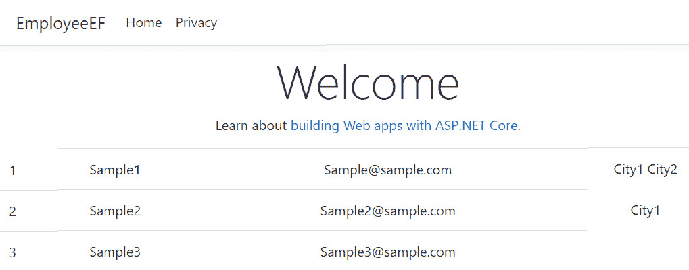

图 9.9 – 员工应用输出

类似地，`DbContext` 类中还有其他可用方法，例如 `Add()`、`Remove()` 和 `Find()`，用于执行各种 CRUD 操作，以及 `FromSqlRaw()` 方法用于执行原始 SQL 查询或存储过程。

这是一个非常简单的例子，其主要目的是展示 EF Core 在实际应用中的能力。我们可以使用存储库模式，其中包含所有 CRUD 方法的通用存储库和特定存储库来执行表上的专用查询。此外，可以使用工作单元模式进行事务处理。

## 代码优先与数据库优先

在前面的示例中，我们创建了新的 POCOs 并从它们中生成了一个数据库；这种从 POCOs 生成数据库的风格被称为 **代码优先方法**。正如定义所暗示的，我们首先定义了 POCOs，然后生成了数据库。

然而，很多时候，尤其是在迁移场景中或者有专门的数据库团队的情况下，我们需要从数据库表中生成 POCOs。EF Core 通过 **数据库优先方法** 支持这种场景，其中模型和应用程序数据库上下文类是从现有数据库生成的。

从数据库模型生成 POCOs 的这个过程被称为 `Scaffold-DbContext` 命令，它接受各种参数，例如数据库连接字符串和应用程序数据库上下文类的名称，然后生成所有必需的类，用于 EF Core。

其余的配置与代码优先方法保持一致。一个带有各种参数的示例脚手架命令如下所示：

```cs
Scaffold-DbContext "Data Source=.;Initial Catalog=Employee.DB;Trusted_Connection=True;" Microsoft.EntityFrameworkCore.SqlServer -Namespace Api.Data.Models -ContextNamespaceApi.Data -ContextDir Api.Data/Abstraction -Context EmployeeContext -Force
```

在这个命令中，我们正在读取一个数据库，`Employee.DB`，在 `Namespace Api.Data.Models` 内生成所有模型，在 `Api.Data/Abstraction` 内生成上下文，并将上下文命名为 `EmployeeContext`。在数据库优先方法中，类之间的关系使用 Fluent API 定义，而不是使用注解。

这里有一点需要注意，每次我们运行这个命令时，所有的 POCOs 都会被覆盖，包括应用程序上下文类。其次，这个命令生成一个包含 `protected override void OnConfiguring(DbContextOptionsBuilder optionsBuilder)` 方法的上下文类。只有当上下文类需要维护连接字符串和其他 EF Core 选项时，这个方法才是必需的。然而，在大多数实际应用中，连接字符串保存在 `appsettings.json` 中，EF Core 在 `Program` 类中配置，因此这个方法可以被删除。

这意味着每次我们使用 Scaffold 时都涉及清理，为了避免任何自定义，更好的方法是创建一个用于我们的应用程序数据库上下文的局部类，并在那里进行所有自定义，例如添加特定的存储过程模型或定义任何应用程序特定的约束。这样，每次我们 Scaffold 应用程序时，自定义都不会被覆盖，这仍然允许我们从数据库自动生成类。

选择数据库优先方法或代码优先方法是完全由开发团队决定的，因为两种方法都有优点和缺点，并且没有一种方法具有另一种方法所不具备的特定功能。

注意

`Scaffold-DbContext` 支持多个参数；例如，您可以为生成 POCOs 的架构指定一个模式。有关进一步阅读，请参阅 [`docs.microsoft.com/en-us/ef/core/managing-schemas/scaffolding?tabs=dotnet-core-cli`](https://docs.microsoft.com/en-us/ef/core/managing-schemas/scaffolding?tabs=dotnet-core-cli)。

基于这种理解，让我们创建将在下一节中用于我们企业应用程序的数据访问服务。

# 使用 Azure Cosmos DB 设计数据访问服务

由于 NoSQL 数据库都是关于快速访问和高可扩展性，因此 NoSQL 的架构是非规范化的，因此数据冗余的可能性很高。让我们将我们从 *第一章*，*设计和架构企业应用程序*，的需求映射到各种实体。以下图显示了架构中各种服务的快速回顾：

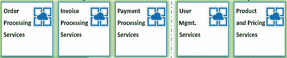

](img/Figure_9.10_18507.jpg)

图 9.10 – 电子商务应用程序中的服务

为了便于理解，在转向 POCOs 之前，我们将以 JSON 格式表示实体：

+   `Email` 字段用作分区键：

    ```cs
    {
      "Id": "1",
      "Name": "John",
      "Email": "John@xyz.com",
      "Address":[{"Address1":"Gachibowli","City":
          "Hyderabad","Country":"India"}],
      "PhoneNumber":12345
    }
    ```

+   `Name` 字段用作分区键。

+   `Id` 字段用作分区键：

    ```cs
    {
      "Id": "1",
      "UserId": "1",
      "Products": [{"Id":"1","Name":
          "T-Shirt","Quantity": 1,"Price": 10}],
      "OrderStatus" : "Processed",
      "OrderPlacedDate" : "20-02-2020T00:00:00Z",
      "ShippingAddress": {"Address1":"Gachibowli",
          "City":"Hyderabad","Country":"India"},
      "TrackingId": 1,
      "DeliveryDate":"28-02-2020T00:00:00Z"
    }
    ```

+   `Id` 字段用作分区键：

    ```cs
    {
      "Id": "1",
      "OrderId": "1",
      "PaymentMode": "Credit Card",
      "ShippingAddress": {"Address1":"Gachibowli",
         "City":"Hyderabad","Country":"India"},
      "SoldBy": {"SellerName": "Seller1",  "Email":
         "seller@ecommerce.com", "Phone": "98765432"},  
      "Products": [{"Id":"1", "Name": "T-Shirt", 
         "Quantity": 1, "Price": 10}]
    }
    ```

下面的截图显示了 `Product` 和 `Order` 的组合：

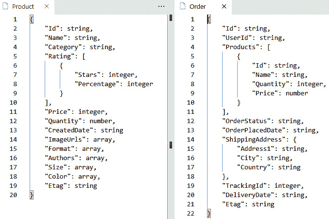

图 9.11 – 电子商务数据库模型的 Product 和 Order 架构

如您所见，所有 *1:N* 关系都通过将子项作为数组嵌入来处理。同样，`Invoice` 和 `User` 实体架构如图下截图所示：

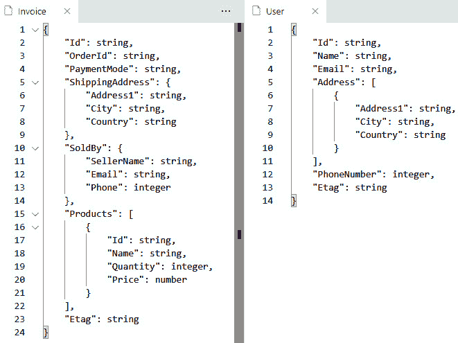

](img/Figure_9.12_18507.jpg)

图 9.12 – 电子商务数据库模型的 Invoice 和 User 架构

在我们的企业应用程序中，[`github.com/PacktPublishing/Enterprise-Application-Development-with-C-10-and-.NET-6-Second-Edition/tree/main/Enterprise%20Application`](https://github.com/PacktPublishing/Enterprise-Application-Development-with-C-10-and-.NET-6-Second-Edition/tree/main/Enterprise%20Application)，我们将有一个服务与 Azure Cosmos DB 数据库进行交互。此服务包含以下三个项目，接下来将进行解释：

+   `Packt.Ecommerce.Data.Models`

+   `Packt.Ecommerce.DataStore`

+   `Packt.Ecommerce.DataAccess`

第一个项目是`Packt.Ecommerce.Data.Models`，这是一个.NET Standard 2.1 库，包含我们与数据库通信的所有 POCOs。如前所述，所有 POCOs 都将有一个共同的`id`属性和前一小节中 JSON 模式中描述的其他属性。

小贴士

如果有示例 JSON，我们可以在 C#类生成工具中使用 JSON。

`Packt.Ecommerce.DataStore`是一个.NET Standard 2.1 库，是存储库层，包含一个通用存储库和特定实体的存储库。此项目中的一个重要类是`BaseRepository`，它具有以下方法，并且每个方法都调用`CosmosClient`类的相应方法：

+   `GetAsync(string filterCriteria)`: 此方法根据`filterCriteria`从容器中获取记录。如果`filterCriteria`为空，则检索该容器中的所有记录。

+   `GetByIdAsync(string id, string partitionKey)`: 此方法通过 ID 和分区键从容器中检索任何记录。

+   `AddAsync(Tentity entity, string partitionKey)`: 此方法允许我们将一条记录插入到容器中。

+   `ModifyAsync(Tentity entity, string partitionKey)`: 此方法允许我们在容器中`UPSERT`（如果记录存在则修改，否则插入）一条记录。

+   `RemoveAsync(string id, string partitionKey)`: 此方法允许从容器中删除一条记录。

由于在 Azure Cosmos DB 中，每个记录都由 ID 和分区键的组合唯一标识，因此所有这些方法都接受一个分区键和`id`。由于这是一个通用存储库，类的签名如下，这允许我们传递任何应用程序的 POCO 并对其对应的容器执行 CRUD 操作：

```cs
public class BaseRepository<TEntity> : IBaseRepository<TEntity>
```

```cs
where TEntity : class
```

所有这些方法都需要一个`Microsoft.Azure.Cosmos.Continer`的对象，我们创建一个`readonly`私有成员，并在类的构造函数中初始化，如下所示：

```cs
        private readonly Container container;
```

```cs
        public BaseRepository(CosmosClient cosmosClient,
```

```cs
        string databaseName, string containerName)
```

```cs
        {
```

```cs
            if (cosmosClient == null)
```

```cs
            {
```

```cs
                throw new Exception("Cosmos client is
```

```cs
                 null");
```

```cs
            }
```

```cs
            this.container = cosmosClient.GetContainer
```

```cs
            (databaseName, containerName);
```

```cs
        }
```

现在，`CosmosClient`将通过依赖注入集成到系统中，并在`static`类中进行配置。作为最佳实践，建议在整个应用程序的生命周期内只使用一个`CosmosClient`实例，以便更好地重用连接，因此我们将在我们的 ASP.NET Core 6 依赖注入容器中将它配置为单例。我们稍后会讨论这个问题。

回到存储库层，`BaseRepository` 在以下具体类中额外继承，每个存储库代表一个相应的容器：

+   `ProductRepository`

+   `UserRepository`

+   `OrderRepository`

+   `InvoiceRepository`

以 `ProductRepository` 为例，它将具有以下实现，其中我们通过 `Ioptions` 模式传递 `CosmosClient` 的单例实例和额外的属性：

```cs
    public class ProductRepository :
```

```cs
    BaseRepository<Product>, IProductRepository
```

```cs
    {
```

```cs
        private readonly IOptions<DatabaseSettingsOptions>
```

```cs
        databaseSettings;
```

```cs
        public ProductRepository(CosmosClient,
```

```cs
        IOptions<DatabaseSettingsOptions>
```

```cs
        databaseSettingsOption)
```

```cs
            : base(cosmosClient, databaseSettingsOption.
```

```cs
              Value.DataBaseName, "Products")
```

```cs
        {
```

```cs
            this.databaseSettings = databaseSettingsOption;
```

```cs
        }
```

```cs
    }
```

所有其他存储库都将遵循类似的架构。每个存储库都将实现自己的接口以支持依赖注入。

注意

这些存储库将随着我们应用程序实现的进展而发展和演变。

下一个项目是 `Packt.Ecommerce.DataAccess`，这是一个针对 .NET 6 的 Web API 项目，它将主要包含所有控制器以公开我们的存储库。每个存储库将与相应的控制器进行*1:1*映射。例如，将会有 `ProductsController` 以 REST API 的形式公开 `ProductRepository` 方法。所有控制器都将使用构造函数注入来实例化它们对应的存储库。在 `Packt.Ecommerce.DataAccess` 中一个重要的事情是 Azure Cosmos DB 数据库的配置。各种控制器的设计将与 `Packt.Ecommerce.Product` Web API 的设计非常相似，这在*第十章*中讨论，*创建 ASP.NET Core 6 Web API*。

首先，我们将在 `appsettings.json` 中有一个相应的部分，如下所示：

```cs
  "CosmosDB": {
```

```cs
    "DataBaseName": "Ecommerce",
```

```cs
    "AccountEndPoint": "",
```

```cs
    "AuthKey": ""
```

```cs
  }
```

注意

对于本地开发环境，我们将使用**管理用户密钥**，如这里所述：[`docs.microsoft.com/en-us/aspnet/core/security/app-secrets?view=aspnetcore-6.0`](https://docs.microsoft.com/en-us/aspnet/core/security/app-secrets?view=aspnetcore-6.0)。我们将设置以下值：

`{`

`  "CosmosDB:AccountEndPoint": "", //Cosmos DB End Point`

`  "CosmosDB:AuthKey": "" //Cosmos DB Auth key`

`}`

然而，一旦服务部署完成，它应该使用 Azure Key Vault，如*第六章*中所述，*在 .NET 6 中进行配置*。

我们将定义一个扩展类来保存依赖注入映射。以下是其片段：

```cs
    public static class RepositoryExtensions
```

```cs
    {
```

```cs
        public static IServiceCollection
```

```cs
        AddRepositories(this IServiceCollection services)
```

```cs
        {
```

```cs
            services.AddScoped<IproductRepository,
```

```cs
            ProductRepository>();
```

```cs
            return services;
```

```cs
        }
```

```cs
    }
```

类似地，所有存储库都将进行映射。然后，我们将在 `Program` 类中配置此设置，包括 Azure Cosmos DB 配置，通过添加以下代码：

```cs
builder.Services.AddOptions();
```

```cs
builder.Services.Configure<DatabaseSettingsOptions>(builder.Configuration.GetSection("CosmosDB"));
```

```cs
string accountEndPoint = builder.Configuration.GetValue<string>("CosmosDB:AccountEndPoint");
```

```cs
string authKey = builder.Configuration.GetValue<string>("CosmosDB:AuthKey");
```

```cs
builder.Services.AddSingleton(s => new CosmosClient(accountEndPoint, authKey));
```

```cs
builder.Services.AddRepositories();
```

一旦完成配置，此服务就准备好在其他服务中使用，例如 `Products`、`Orders` 和 `Invoice`。此库将具有执行各种实体 CRUD 操作的所有必要的 REST API。

这标志着创建了一个执行各种实体 CRUD 操作的数据访问服务的完成，并且所有操作都作为 API 公开。这个服务将从我们将在*第十章*“创建 ASP.NET Core 6 Web API”中开发的其它所有服务中调用。

# 摘要

在本章中，我们了解了 .NET 6 中可用的各种持久化选项，从与文件和目录一起工作的 API 到如 Microsoft SQL Server 和 Azure Cosmos DB 这样的数据库。

我们还了解了对象关系映射（ORM）及其重要性，以及在使用 Microsoft SQL Server 时如何使用 EF Core 来构建持久化层。在这个过程中，我们使用 Azure Cosmos DB SDK 为我们的电子商务应用程序构建了一个数据访问层。一些关键收获是我们对 SQL 与 NoSQL 之间的设计决策，以及我们如何通过应用逻辑和 UI 层来抽象数据层，这将帮助您构建可扩展的企业应用程序。

在下一章中，我们将探讨 RESTful API 的基础和 ASP.NET Core 6 Web API 的内部结构，并进一步为电子商务应用程序构建各种 RESTful 服务。

# 问题

1.  假设你正在将现有的 Web 应用程序迁移到使用 EF Core，但是数据库模式没有变化，现有的数据库可以直接使用。使用 EF Core 的首选模式是什么？

a. Database-first

b. Code-first

c. Both

**答案：a**

1.  如果我们正在为我们的电子商务应用程序构建一个推荐系统，并且我们正在使用 Azure Cosmos DB，那么在这种情况下哪种 API 是最佳推荐？

a. The Core (SQL) API

b. The Mongo API

c. The Cassandra API

d. The Gremlin (graph) API

**答案：d**

1.  我在基于 SQL API 的数据库中创建了一个容器来存储用户配置文件信息，并将 `Email` 定义为分区键。我的系统有 100 个唯一的电子邮件。我的容器将有多少个逻辑分区？

a. 1.

b. 0.

c. 100.

d. Azure Cosmos DB 不支持逻辑分区。

**答案：c**

# 进一步阅读

以下是一些链接，可以帮助您进一步了解本章的主题：

+   [`docs.microsoft.com/en-us/ef/core/saving/transactions`](https://docs.microsoft.com/en-us/ef/core/saving/transactions)

+   [`docs.microsoft.com/en-us/ef/core/performance/advanced-performance-topics`](https://docs.microsoft.com/en-us/ef/core/performance/advanced-performance-topics)

+   [`docs.microsoft.com/en-us/aspnet/core/security/gdpr?view=aspnetcore-6.0`](https://docs.microsoft.com/en-us/aspnet/core/security/gdpr?view=aspnetcore-6.0)

+   [`aws.amazon.com/products/databases/`](https://aws.amazon.com/products/databases/)
