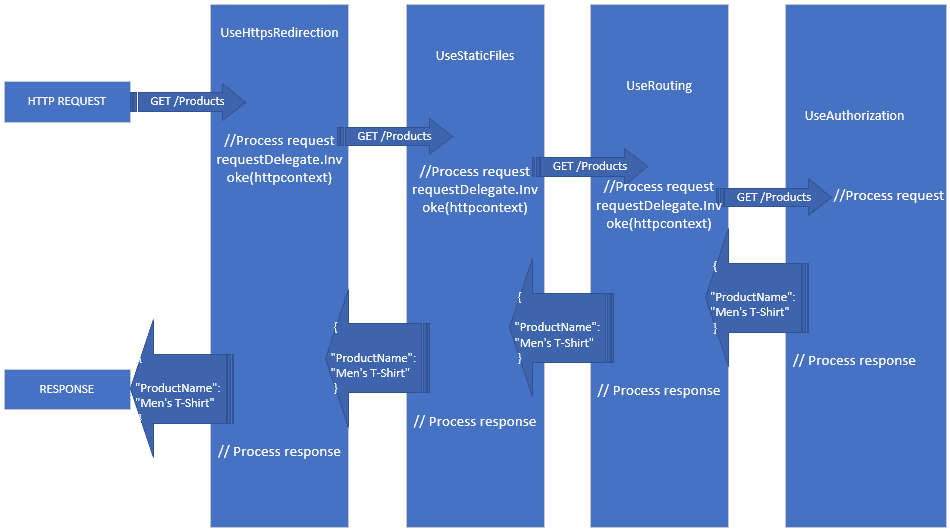
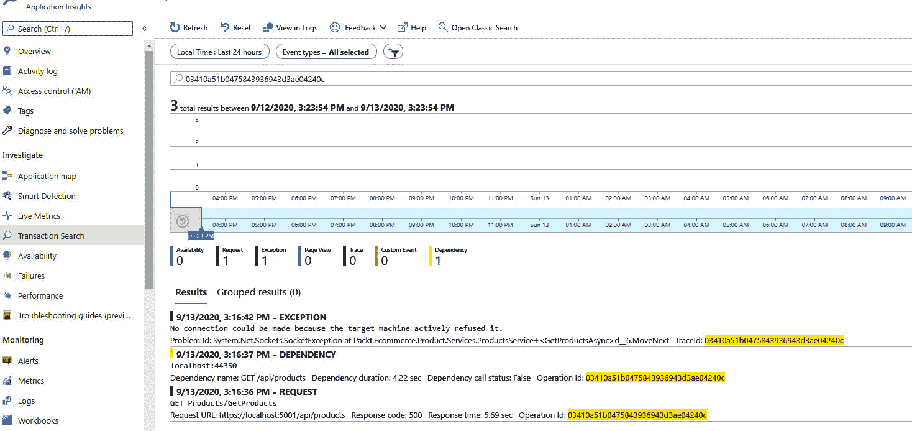
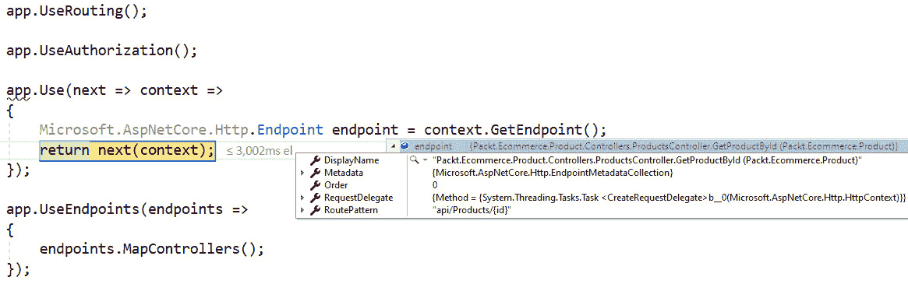
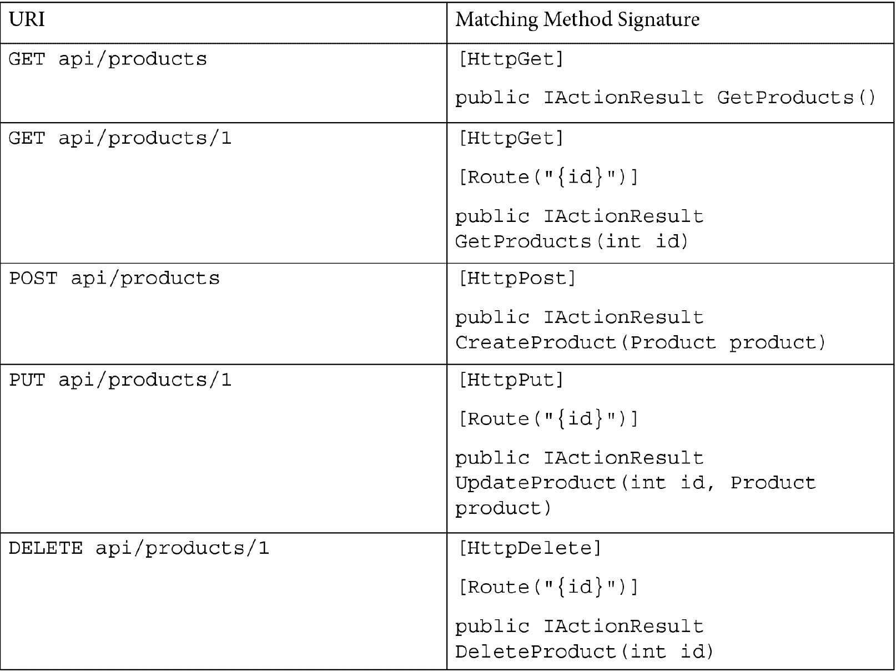
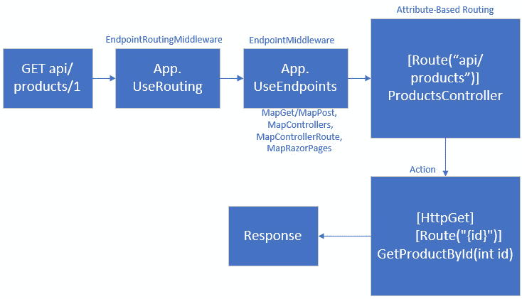
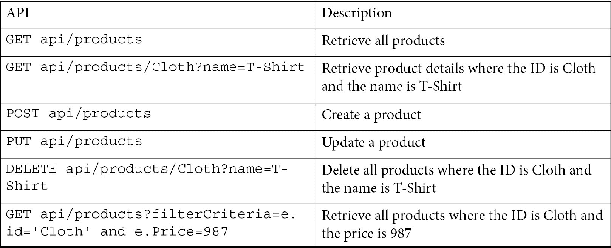
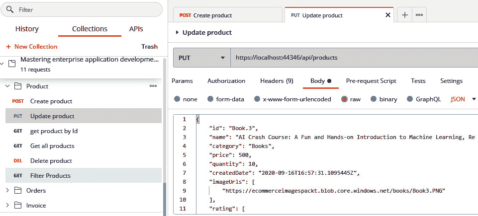
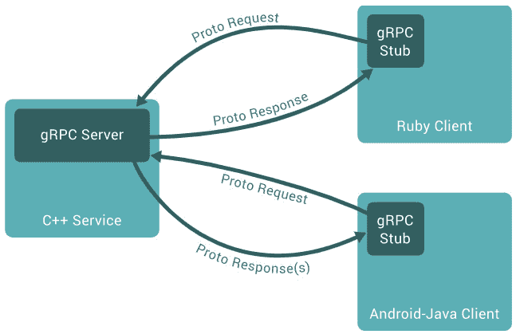
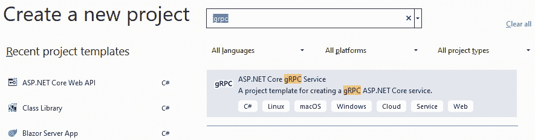
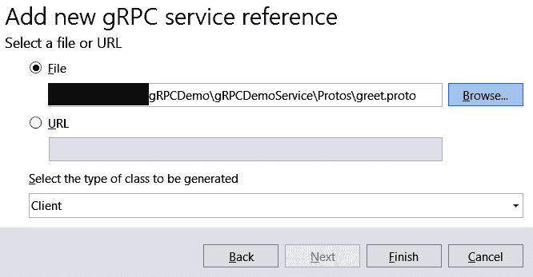

# *第十章*：创建 ASP.NET Core 6 Web API

近年来，Web 服务已成为 Web 应用程序开发的重要组成部分。随着需求的不断变化和商业复杂性的增加，松散耦合 Web 应用程序开发中涉及的各个组件/层非常重要，而与应用程序的核心业务逻辑解耦的方案则更为出色。这就是使用 RESTful 方法（其中 **REST** 代表 **REpresentational State Transfer**）的 Web 服务的简单性帮助我们开发可扩展的 Web 应用程序的地方。

在本章中，我们将学习如何使用 ASP.NET Core Web **应用程序编程接口**（**API**）构建 RESTful 服务，并且在这个过程中，我们将为我们的电子商务应用程序构建所有必需的 API。

我们将详细介绍以下主题：

+   REST 简介

+   理解 ASP.NET Core 6 Web API 的内部结构

+   使用控制器和操作处理请求

+   与数据层的集成

+   理解 **Google 远程过程调用**（**gRPC**）

# 技术要求

对于本章，你需要具备基本的 C#、.NET Core、Web API、**超文本传输协议**（**HTTP**）、Azure、**依赖注入**（**DI**）、Postman 以及 .NET **命令行界面**（**CLI**）知识。

本章的代码可以在以下位置找到：[`github.com/PacktPublishing/Enterprise-Application-Development-with-C-10-and-.NET-6-Second-Edition/tree/main/Chapter10/TestApi`](https://github.com/PacktPublishing/Enterprise-Application-Development-with-C-10-and-.NET-6-Second-Edition/tree/main/Chapter10/TestApi)。

更多代码示例，请参考以下链接：[`github.com/PacktPublishing/Enterprise-Application-Development-with-C-10-and-.NET-6-Second-Edition/tree/main/Enterprise%20Application`](https://github.com/PacktPublishing/Enterprise-Application-Development-with-C-10-and-.NET-6-Second-Edition/tree/main/Enterprise%20Application)。

# REST 简介

REST 是构建 Web 服务的架构指南。主要来说，它定义了一组在设计 Web 服务时可以遵循的约束。REST 方法的关键原则之一建议 API 应该围绕资源设计，并且应该是媒体和协议无关的。API 的底层实现与使用 API 的客户端是独立的。

以我们的电子商务应用程序为例，假设我们在 UI 中使用产品搜索字段搜索产品。应该有一个为产品创建的 API，在这里，产品只是电子商务应用程序上下文中的一个资源。对产品实体执行 `GET` 操作：

```cs
GET http://ecommerce.packt.com/products
```

API 的响应应该独立于调用 API 的客户端——也就是说，在这种情况下，我们正在使用浏览器在产品搜索页面上加载产品列表。然而，相同的 API 可以在移动应用程序中消费，而无需任何更改。其次，在这种情况下，为了内部检索产品信息，应用程序可能使用一个或多个物理数据存储；然而，这种复杂性被隐藏在客户端应用程序中，API 作为单个业务实体——产品——暴露给客户端。尽管 REST 原则并没有规定必须使用 HTTP 协议，但大多数 RESTful 服务都是建立在 HTTP 之上的。这里概述了基于 HTTP 的 RESTful API 的一些关键设计原则/约束/规则：

+   识别系统的业务实体，并围绕这些资源设计 API。在我们的电子商务应用程序中，我们所有的 API 都将围绕产品、订单、支付和用户等资源进行设计。

+   RESTful API 应该有一个统一的接口，有助于使它们独立于客户端。由于所有 API 都需要面向资源，每个资源都由 URI 唯一标识；此外，对资源的各种操作由 HTTP 动词（如 `GET`、`POST`、`PUT`、`PATCH` 和 `DELETE`）唯一标识。例如，使用 `GET` (`http://ecommerce.packt.com/products/1`) 应该用来检索一个产品。同样，使用 `DELETE` (`http://ecommerce.packt.com/products/1`) 应该用来删除一个产品。

+   由于 HTTP 是无状态的，REST 对 RESTful API 规定了一系列内容。这意味着 API 应该是原子的，并在同一调用中完成请求的处理。任何后续请求，即使是来自同一客户端（相同的 **Internet Protocol**（**IP**）地址），都被视为新的请求。例如，如果 API 接受身份验证令牌，它应该为每个请求接受身份验证。无状态的一个主要优点是服务器最终可以实现的可扩展性，因为客户端可以向任何可用的服务器发出 API 调用，并仍然收到相同的响应。

+   除了发送回响应之外，API 应该利用 HTTP 状态码和响应头来向客户端发送任何额外的信息。例如，如果响应可以被缓存，API 应该向客户端发送相关的响应头，以便它可以被缓存。`1xx` 表示信息，`2xx` 表示成功，`3xx` 表示重定向，`4xx` 表示客户端错误，`5xx` 表示服务器错误。

+   API 应该提供关于资源的信息，使得客户端能够轻松地发现它，而无需任何与资源相关的先验信息——也就是说，应该遵循**超媒体作为应用状态引擎**（**HATEOAS**）的原则。例如，如果有一个创建产品的 API，一旦产品创建成功，API 应该返回该资源的 URI，以便客户端可以用来稍后检索该产品。

有关检索所有产品列表（`GET /products`）和获取每个产品详细信息的信息，请参阅以下响应：

```cs
{
"Products": [
{
"Id": "1",
"Name": "Men's T-Shirt",
"Category": "Clothing"
"Uri": "http://ecommerce.packt.com/products/1"
}
{
"Id": "2",
"Name": "Mastering enterprise application development Book",
"Category": "books"
"Uri": "http://ecommerce.packt.com/products/2"
}
]
}
```

上述示例是实施*HATEOAS*原则的一种方式，但它可以设计得更加描述性，例如包含有关接受的 HTTP 动词和关系的响应信息。

## REST 成熟度模型

这些是 API 应该遵循的各种指南，以便使其成为 RESTful API。然而，并非所有原则都需要遵循才能使其完美地符合 RESTful；更重要的是，API 应该实现业务目标，而不是 100%符合 REST 规范。RESTful API 设计专家 Leonard Richardson 提出了以下模型来分类 API 的成熟度：

+   执行所有操作的 URI 属于这一类别。一个例子是基于**简单对象访问协议**（**SOAP**）的 Web 服务，它有一个单一的 URI，所有操作都是基于 SOAP 信封进行隔离的。

+   **级别 1—资源**：所有资源都是 URI 驱动的，每个资源都有专门的 URI 模式，这些 API 属于此成熟度模型。

+   使用相同 URI 但不同 HTTP 动词进行`GET`和`DELETE`操作属于此成熟度模型。大多数企业应用 RESTful API 都属于这一类别。

+   **级别 3—HATEOAS**：设计时包含所有附加发现信息（资源的 URI；资源支持的各种操作）的 API 属于此成熟度模型。很少有 API 符合此成熟度级别；然而，如前所述，重要的是我们的 API 应该实现业务目标，并且尽可能符合 RESTful 原则，而不是 100%符合但未实现业务目标。

下图说明了 Richardson 成熟度模型：

![图 10.1 – Richardson 的成熟度模型

![img/Figure_10.1_B18507.jpg]

图 10.1 – Richardson 的成熟度模型

到目前为止，我们已经讨论了 REST 架构的各种原则。在下一节中，让我们深入了解使用 ASP.NET Core Web API，我们将在我们的电子商务应用程序中创建各种 RESTful 服务。

# 理解 ASP.NET Core 6 Web API 的内部结构

**ASP.NET Core**是一个在.NET Core 之上运行的统一框架，用于开发 Web 应用程序（MVC/Razor）、RESTful 服务（Web API）以及最近基于 Web Assembly 的客户端应用程序（Blazor 应用程序）。ASP.NET Core 应用程序的基本设计基于**模型-视图-控制器**（**MVC**）模式，将代码分为三个主要类别，如下所示：

+   **模型**：这是一个**简单的普通 CLR 对象**（**POCO**）类，用于存储数据并在应用程序的各个层之间传递数据。层包括在*仓库*类和*服务*类之间传递数据，或者在与*客户端*和*服务器*之间来回传递信息。模型主要表示资源状态或应用程序的领域模型，并包含您请求的信息。

例如，如果我们想存储用户配置文件信息，这可以通过`UserInformation` POCO 类表示，并可以包含所有配置文件信息。这将进一步用于在仓库和服务类之间传递，也可以在发送回客户端之前将其序列化为**JavaScript 对象表示法**（**JSON**）/**可扩展标记语言**（**XML**）。在企业应用程序中，在*与数据层集成*部分创建我们的电子商务应用程序模型时，我们将遇到不同类型的模型。

+   **视图**：这些是表示 UI 的页面。我们从控制器检索的所有模型都绑定到视图上的各种**超文本标记语言**（**HTML**）控件，并向用户展示。视图在 MVC/Razor 应用程序中通常是常见的；对于 Web API 应用程序，过程以将模型序列化为响应结束。

+   使用`Microsoft.AspNetCore.Mvc.ControllerBase`类来定义控制器。

因此，在用 ASP.NET Core 开发的 Web 应用程序中，每当客户端（浏览器、移动应用等类似来源）发起请求时，它将通过 ASP.NET Core 请求管道，到达与数据存储交互的控制器，以填充模型/视图模型并将它们以 JSON/XML 形式作为响应发送回去，或者发送到视图中以进一步绑定响应并向用户展示。

如您所见，存在一个清晰的**关注点分离**（**SOC**），其中控制器不了解任何 UI 方面，并在当前上下文中执行业务逻辑，并通过模型进行响应；另一方面，视图接收模型并使用它们在 HTML 页面上向用户展示。这种 SOC 有助于轻松地进行单元测试，以及根据需要维护和扩展应用程序。MVC 模式不仅适用于 Web 应用程序，还可以用于任何需要 SOC 的应用程序。

由于本章的重点是构建 RESTful 服务，因此在本章中我们将关注 ASP.NET Core Web API，并在*第十一章* *创建 ASP.NET Core 6 Web 应用程序*中讨论 ASP.NET MVC 和 Razor Pages。

为了开发 RESTful 服务，有许多框架可供选择，但选择在.NET 6 上使用 ASP.NET Core 有以下一些优势：

+   **跨平台支持**：与 ASP.NET 不同，它曾经是.NET Framework 的一部分（与 Windows 操作系统耦合），ASP.NET Core 现在是应用程序的一部分，从而消除了平台依赖性，使其与所有平台兼容。

+   **高度可定制的请求管道**: 使用中间件和支持注入各种开箱即用的模块，例如日志和配置。

+   `IIS`和`HTTP.sys`。

    注意

    默认情况下，Kestrel 是 ASP.NET Core 模板中使用的 HTTP 服务器；然而，这可以根据需要覆盖。

+   **强大的工具支持**: 这包括**Visual Studio Code**（**VS Code**）、Visual Studio 和 DOTNET CLI，以及项目模板，这意味着开发者可以以非常少的设置开始实现业务逻辑。

+   **开源**: 最后，整个框架已经开源，可在[`github.com/aspnet/AspNetCore`](https://github.com/aspnet/AspNetCore)找到。

因此，我们现在知道为什么我们选择 ASP.NET Core 作为开发 RESTful 服务的框架。现在让我们看看一些关键组件，这些组件有助于请求的执行，并使用以下命令创建一个示例 Web API：

```cs
dotnet new webapi -o TestApi
```

在成功执行上述命令后，让我们导航到`TestApi`文件夹，并在 VS Code 中打开它，查看生成的各种文件，如下面的截图所示：

![Figure 10.2 – 在 VS Code 中测试 Web API 项目

![img/Figure_10.2_B18507.jpg]

Figure 10.2 – 在 VS Code 中测试 Web API 项目

在这里，你可以看到用于启动应用的`Program`类，以及用于运行 Web API 项目的设置文件，如`appsettings.json`，还有`WeatherForecast`，这是一个在控制器类中使用的模型类。接下来几节将逐一检查`TESTAPI`的各个组件。

## `Program`类

`Program`类用于在 ASP.NET Core 6 中启动 Web API 项目。接下来几步将查看这个类执行的活动：

1.  `Program`类是我们 Web API 的入口点，它告诉 ASP.NET Core 每当有人执行 Web API 项目时开始执行。主要来说，这是一个用于启动应用的类。与 ASP.NET Core 的早期版本应用不同，默认情况下我们没有`Startup`类——也就是说，`Program`类包含了我们所需的一切——为了保持代码最小化，我们进一步依赖于 C# 10 的顶级语句和全局 using 语句。

1.  由于这是入口点，我们需要确保所有组件，如 Web 服务器、路由和配置，都得到初始化和加载，这正是`WebApplication`类的`CreateBuilder`方法所帮助实现的。它主要创建一个`WebApplicationBuilder`对象，该对象可用于配置 HTTP 请求管道。

1.  `WebApplicationBuilder` 继承自 `IApplicationBuilder` 接口，这实际上只是一个封装了这些组件的对象，例如默认的 Kestrel HTTP 服务器，所有中间件组件，以及任何额外的服务——例如日志记录——这些服务被注入。最后，调用 `Build()` 方法来运行操作并初始化 `Host` 对象。调用 `Run()` 方法来保持 `Host` 对象的运行。

既然我们已经加载了包含所有默认组件的 `Host` 对象，并且它正在运行，让我们检查我们是否可以注入额外的 ASP.NET Core 类/应用程序特定的类（存储库、服务、选项）和中间件。考虑以下要点：

+   此 `WebApplicationBuilder` 对象用于注入任何 ASP.NET Core 提供的服务，以便应用程序可以使用这些服务。以下代码片段展示了企业应用程序可以注入的一些常见服务：

    ```cs
    var builder = WebApplication.CreateBuilder(args);
    builder.Services.AddAuthentication() // To enable 
    //authentication.
    builder.Services.AddControllers(); // To enable 
    //controllers like web API.
    builder.Services.AddControllersWithViews(); // To 
    //enable controller with views.
    builder.Services.AddDistributedMemoryCache(); // To enable distributed caching.
    // App insights.
    string appinsightsInstrumentationKey = builder.Configuration.GetValue<string>("ApplicationSettings:InstrumentationKey");
    builder.Services.AddApplicationInsightsTelemetry(appInsightInstrumentKey); // To enable application insights 
    //telemetry.
    ```

除了 ASP.NET Core 提供的服务之外，我们还可以注入任何特定于我们应用程序的自定义服务——例如，`ProductService` 可以映射到 `IProductService` 并在整个应用程序中可用。主要来说，这是我们可以使用来将任何内容集成到依赖注入容器中的地方，如 *第五章* 中所述，*.NET 6 中的依赖注入*。

此外，所有服务，包括 ASP.NET Core 服务和自定义服务，都可以集成到应用程序中，并作为 `IServiceCollection` 的扩展方法可用。

+   接下来，我们有一个 `WebApplication` 类的对象，可以用来集成所有需要应用到请求管道的中间件。此对象主要控制应用程序如何响应 HTTP 请求——即应用程序应该如何响应异常，如何响应静态文件，或者如何进行 URI 路由。所有这些都可以使用此对象进行配置。

此外，任何对请求管道的特定处理——例如调用自定义中间件或添加特定的响应头，甚至定义特定的端点——都可以使用 `WebApplication` 对象注入。所以，除了我们之前看到的之外，以下代码片段展示了使用 `WebApplication` 对象可以集成的几个常见额外配置：

```cs
var app = builder.Build();
// Endpoint that responds to /subscribe route.
app.UseEndpoints(endpoints =>
{
endpoints.MapGet("/subscribe", async context =>
{   
  await context.Response.WriteAsync("subscribed");
});
});
// removing any unwanted headers.
app.Use(async (context, next) =>
{
context.Response.Headers.Remove("X-Powered-By");
context.Response.Headers.Remove("Server");
await next().ConfigureAwait(false);
});
```

在这里，`app.UseEndpoints` 正在配置一个匹配 `/subscribe` URI 的响应。`app.UseEndPoints` 与路由规则协同工作，并在 *使用控制器和操作处理请求* 部分中解释，而 `app.Use` 则用于添加内联中间件。在这种情况下，我们正在从响应中移除 `X-Powered-By` 和 `Server` 响应头。

由于 ASP.NET Core 6 支持使用 `Program` 类，因此可以单独使用它来构建一个完全工作的 API；然而，对于企业应用程序来说，为了便于维护和更好的可读性，最好将 API 与控制器分离，因此在我们的企业应用程序中，我们将使用由 `MapControllers` 中间件支持的 API，并通过调用 `app.MapControllers()` 来配置。

总结来说，`Program` 类在启动应用程序和根据需要自定义应用程序服务和 HTTP 请求/响应管道方面发挥着至关重要的作用。

现在我们来看看中间件如何帮助定制 HTTP 请求/响应管道。

注意

ASP.NET Core 6 仍然支持使用 `Startup` 类，并且可以直接使用 `Configure` 和 `ConfigureServices` 方法。

## 理解中间件

我们已经提到了中间件一段时间了，现在让我们了解中间件是什么，以及我们如何构建一个中间件并在我们的企业应用程序中使用它。中间件是拦截传入请求、对请求执行一些处理并将它们传递给下一个中间件或按需跳过的类。中间件是双向的，因此所有中间件都会拦截请求和响应。假设一个 API 获取产品信息，在这个过程中，它会通过各种中间件。以图形形式表示，看起来可能像这样：




图 10.3 – 中间件处理

每个中间件都有一个 `Microsoft.AspNetCore.Http.RequestDelegate` 的实例。因此，使用这个实例，中间件会调用下一个中间件。所以，流通常会按照你希望中间件在请求上执行的处理逻辑来处理请求，然后调用 `RequestDelegate` 将请求传递给管道中的下一个中间件。

如果我们从制造业中找一个类比，那就像制造过程中的装配线，部件从工作站到工作站添加/修改，直到最终产品生产出来。在前面的图中，让我们将每个中间件视为一个工作站，因此它将经历以下步骤：

注意

下面每个中间件的解释只是为了我们理解而做的假设性解释；这些中间件的内部工作原理与这里所解释的略有不同。更多详情可以在这里找到：[`docs.microsoft.com/en-us/dotnet/api/microsoft.aspnetcore.builder?view=aspnetcore-3.1&viewFallbackFrom=aspnetcore-6.0`](https://docs.microsoft.com/en-us/dotnet/api/microsoft.aspnetcore.builder?view=aspnetcore-3.1&viewFallbackFrom=aspnetcore-6.0)。

1.  `UseHttpsRedirection`：一个 HTTP 请求到达 `GET/Products`，并检查协议。如果请求是通过 HTTP，则通过 HTTP 状态码发送重定向；如果请求是通过 HTTPS，则将其传递给下一个中间件。

1.  `UseStaticFiles`: 如果请求是针对静态文件（通常基于扩展名检测——**多用途媒体类型**（MIME）类型），这个中间件会处理请求并发送响应，或者将请求传递给下一个中间件。正如你所看到的，如果请求是针对静态文件，那么整个管道的其他部分甚至都不会被执行，因为这个中间件可以处理完整的请求，从而减少服务器上任何不需要的处理负载，并减少响应时间。这个过程也被称为**短路**，这是每个中间件都可以支持的。

1.  `UseRouting`: 请求将进一步检查，并识别可以处理该请求的控制器/操作。如果没有匹配项，这个中间件通常会以`404` HTTP 状态码响应。

1.  `UseAuthorization`: 在这里，如果控制器/操作需要可供认证用户使用，那么这个中间件将查找头中的任何有效令牌并相应地响应。

一旦控制器从服务/存储库中获取数据，响应将通过相同的中间件以相反的顺序处理——即首先`UseAuthorization`，然后是`UseHttpsRedirection`——并根据需要处理响应。

如前所述，所有中间件都是通过`Program`类安装的，并使用`WebApplication`类的对象进行配置。中间件执行的顺序将精确地遵循在`Program`类中配置的方式。

带着这种理解，让我们创建一个中间件，它将用于处理我们电子商务应用程序的 RESTful 服务的异常，这样我们就不需要在代码中添加`try…catch`块，而是在请求管道的开始处安装一个中间件，然后捕获任何异常。

### 构建自定义中间件

由于中间件将在所有 RESTful 服务中重用，我们将中间件添加到`Middlewares`文件夹中的`Packt.Ecommerce.Common`项目。

让我们首先创建一个 Poco 类，它代表错误情况下的响应。这个模型通常将包含一个错误消息，一个位于`Packt.Ecommerce.Common`项目的`Models`文件夹中的`ExceptionResponse`，并向其中添加以下代码：

```cs
public class ExceptionResponse
```

```cs
{
```

```cs
    public string ErrorMessage { get; set; }
```

```cs
    public string CorrelationIdentifier { get; set; }
```

```cs
    public string InnerException { get; set; }
```

```cs
}
```

现在，创建另一个 Poco 类，它可以保存发送内部异常行为的配置。这个类将使用`Options`模式进行填充，该模式在*第六章*中讨论过，*在.NET 6 中的配置*。因为它只需要保存一个设置，所以它将有一个属性。在`Options`文件夹中添加一个名为`ApplicationSettings`的类文件，然后向其中添加以下代码：

```cs
public class ApplicationSettings
```

```cs
{
```

```cs
    public bool IncludeExceptionStackInResponse { get; set; }
```

```cs
}
```

这个类将进一步扩展，以包含所有 API 中通用的任何配置。

导航到`Middlewares`文件夹，创建一个名为`ErrorHandlingMiddleware`的类。正如我们讨论的那样，任何中间件中的关键属性之一是`RequestDelegate`类型的属性。此外，我们将添加一个`ILogger`属性以将异常记录到我们的日志提供程序，最后，我们将添加一个`bool`类型的`includeExceptionDetailsInResponse`属性来保存一个控制是否屏蔽内部异常的标志。有了这个，`ErrorHandlingMiddleware`类将看起来如下：

```cs
public class ErrorHandlingMiddleware
```

```cs
{
```

```cs
private readonly RequestDelegate requestDelegate;
```

```cs
private readonly ILogger logger;
```

```cs
private readonly bool includeExceptionDetailsInResponse;
```

```cs
}
```

添加一个参数化构造函数，其中我们注入`RequestDelegate`和`ILogger`以用于我们的日志提供程序，以及`IOptions<ApplicationSettings>`以用于配置，并将它们分配给之前创建的属性。在这里，我们再次依赖于 ASP.NET Core 的构造函数注入来实例化相应的对象。有了这个，`ErrorHandlingMiddleWare`的构造函数将看起来如下：

```cs
public ErrorHandlingMiddleware(RequestDelegate, ILogger<ErrorHandlingMiddleware> logger, IOptions<ApplicationSettings> applicationSettings)
```

```cs
{
```

```cs
    NotNullValidator.ThrowIfNull(applicationSettings, 
```

```cs
      nameof(applicationSettings));
```

```cs
    this.requestDelegate = requestDelegate;
```

```cs
    this.logger = logger;
```

```cs
    this.includeExceptionDetailsInResponse = applicationSettings.Value.IncludeExceptionStackInResponse;
```

```cs
}
```

最后，添加一个`InvokeAsync`方法，该方法将包含处理请求的逻辑，然后使用`RequestDelegate`调用下一个中间件。由于这是一个作为我们逻辑一部分的异常处理中间件，我们所有要做的就是将请求包裹在一个`try…catch`块中。在`catch`块中，我们将使用`ILogger`将其记录到相应的日志提供程序，并最终发送一个对象`ExceptionResponse`作为响应。有了这个，`InvokeAsync`将看起来如下：

```cs
public async Task InvokeAsync(HttpContext context)
```

```cs
{
```

```cs
    try
```

```cs
    {
```

```cs
        if (this.requestDelegate != null)
```

```cs
        {
```

```cs
            // invoking next middleware.
```

```cs
           this.requestDelegate.Invoke(context)
```

```cs
             .ConfigureAwait(false);
```

```cs
        }
```

```cs
    }
```

```cs
    catch (Exception innerException)
```

```cs
    {
```

```cs
        this.logger.LogCritical(1001, innerException, 
```

```cs
          "Exception captured in error handling 
```

```cs
           middleware"); // logging.
```

```cs
        ExceptionResponse currentException = new 
```

```cs
          ExceptionResponse()
```

```cs
        {
```

```cs
            ErrorMessage = Constants.ErrorMiddlewareLog, 
```

```cs
         // Exception captured in error handling middleware
```

```cs
            CorrelationIdentifier = 
```

```cs
              System.Diagnostics.Activity.Current?.RootId,
```

```cs
        };
```

```cs
        if (this.includeExceptionDetailsInResponse)
```

```cs
        {
```

```cs
            currentException.InnerException = 
```

```cs
              $"{innerException.Message} 
```

```cs
                {innerException.StackTrace}";
```

```cs
        }
```

```cs
        context.Response.StatusCode = 
```

```cs
          StatusCodes.Status500InternalServerError;
```

```cs
        context.Response.ContentType = "application/json";
```

```cs
  await context.Response.WriteAsync(JsonSerializer.Serialize(innerException)).ConfigureAwait(false);
```

```cs
    }
```

```cs
}
```

现在，我们可以使用以下代码将此中间件注入到`Program`类中：

```cs
app.UseMiddleware<GlobalExceptionHandlingMiddleware>();
```

由于这是一个异常处理器，建议在`Program`类中尽早配置它，以便捕获所有后续中间件中的任何异常。此外，我们需要确保将`ApplicationSettings`类映射到配置，因此将以下代码添加到`Program`类中：

```cs
Builder.Services.Configure<ApplicationSettings>(this.Configuration.GetSection("ApplicationSettings"));
```

将相关部分添加到`appsettings.json`中，如下所示：

```cs
"ApplicationSettings": {
```

```cs
    "IncludeExceptionStackInResponse": true
```

```cs
  }
```

现在，如果我们的任何 API 中发生错误，响应将类似于以下代码片段所示：

```cs
{
```

```cs
"ErrorMessage": "Exception captured in error handling middleware",
```

```cs
"CorrelationIdentifier": "03410a51b0475843936943d3ae04240c ",
```

```cs
"InnerException": "No connection could be made because the target machine actively refused it.    at System.Net.Http.ConnectHelper.ConnectAsync(String host, Int32 port, CancellationToken cancellationToken)\r\n   at System.Net.Http.HttpConnectionPool.ConnectAsync(HttpRequestMessage request, Boolean allowHttp2, CancellationToken cancellationToken)\r\n   at System.Net.Http.HttpConnectionPool.CreateHttp11ConnectionAsync(HttpRequestMessage request, CancellationToken cancellationToken)\r\n   at System.Net.Http.HttpConnectionPool.GetHttpConnectionAsync(HttpRequestMessage request, CancellationToken cancellationToken)\r\n   at System.Net.Http.HttpConnectionPool.SendWithRetryAsync(HttpRequestMessage request, Boolean doRequestAuth, CancellationToken cancellationToken)\r\n   at System.Net.Http.RedirectHandler.SendAsync(HttpRequestMessage request, CancellationToken cancellationToken)\r\n   at System.Net.Http.DiagnosticsHandler.SendAsync(HttpRequestMessage request, CancellationToken cancellationToken)\r\n   at Microsoft.Extensions.Http.Logging.LoggingHttpMessageHandler.SendAsync(HttpRequestMessage request, CancellationToken cancellationToken)\r\n   at Microsoft.Extensions.Http.Logging.LoggingScopeHttpMessageHandler.SendAsync(HttpRequestMessage request, CancellationToken cancellationToken)\r\n   at System.Net.Http.HttpClient.FinishSendAsyncBuffered(Task`1 sendTask, HttpRequestMessage request, CancellationTokenSource cts, Boolean disposeCts, CancellationToken callerToken, Int64 timeoutTime)\r\n   at Packt.Ecommerce.Product.Services.ProductsService.GetProductsAsync(String filterCriteria) in src\\platform-apis\\services\\Packt.Ecommerce.Product\\Services\\ProductsService.cs:line 82\r\n   at Packt.Ecommerce.Product.Controllers.ProductsController.GetProductsAsync(String filterCriteria) in src\\platform-apis\\services\\Packt.Ecommerce.Product\\Controllers\\ProductsController.cs:line 46\r\n   at Microsoft.AspNetCore.Mvc.Infrastructure.ActionMethodExecutor.TaskOfIActionResultExecutor.Execute(IActionResultTypeMapper mapper, ObjectMethodExecutor executor, Object controller, Object[] arguments)\r\n   at Microsoft.AspNetCore.Mvc.Infrastructure.ControllerActionInvoker.<InvokeActionMethodAsync>g__Logged|12_1(ControllerActionInvoker invoker)\r\n   at Microsoft.AspNetCore.Mvc.Infrastructure.ControllerActionInvoker.<InvokeNextActionFilterAsync>g__Awaited|10_0(ControllerActionInvoker invoker, Task lastTask, State next, Scope scope, Object state, Boolean isCompleted)\r\n   at Microsoft.AspNetCore.Mvc.Infrastructure.ControllerActionInvoker.Rethrow(ActionExecutedContextSealed context)\r\n   at Microsoft.AspNetCore.Mvc.Infrastructure.ControllerActionInvoker.Next(State& next, Scope& scope, Object& state, Boolean& isCompleted)\r\n   at Microsoft.AspNetCore.Mvc.Infrastructure.ControllerActionInvoker.<InvokeInnerFilterAsync>g__Awaited|13_0(ControllerActionInvoker invoker, Task lastTask, State next, Scope scope, Object state, Boolean isCompleted)\r\n   at Microsoft.AspNetCore.Mvc.Infrastructure.ResourceInvoker.<InvokeFilterPipelineAsync>g__Awaited|19_0(ResourceInvoker invoker, Task lastTask, State next, Scope scope, Object state, Boolean isCompleted)\r\n   at Microsoft.AspNetCore.Mvc.Infrastructure.ResourceInvoker.<InvokeAsync>g__Logged|17_1(ResourceInvoker invoker)\r\n   at Microsoft.AspNetCore.Routing.EndpointMiddleware.<Invoke>g__AwaitRequestTask|6_0(Endpoint endpoint, Task requestTask, ILogger logger)\r\n   at Microsoft.AspNetCore.Authorization.AuthorizationMiddleware.Invoke(HttpContext context)\r\n   at Packt.Ecommerce.Common.Middlewares.ErrorHandlingMiddleware.InvokeAsync(HttpContext context) in src\\platform-apis\\core\\Packt.Ecommerce.Common\\Middlewares\\ErrorHandlingMiddleware.cs:line 65"
```

```cs
}
```

从前面的代码片段中，我们可以获取`CorrelationIdentifier`，即`03410a51b0475843936943d3ae04240c`，在我们的日志提供程序**Application Insights**中搜索该值，我们可以确定有关异常的更多信息，如图下所示：




图 10.4 – 在 Application Insights 中跟踪 CorrelationIdentifier

`CorrelationIdentifier`在生产环境中非常有用，尤其是在没有内部异常的情况下。

这就结束了我们对中间件的讨论。在下一节中，我们将探讨**控制器**和**操作**是什么，以及它们如何帮助处理请求。

# 使用控制器和操作处理请求

**控制器**是处理请求的基本块，用于使用 ASP.NET Core Web API 设计 RESTful 服务。这些是包含处理请求逻辑的主要类，包括从数据库检索数据、将记录插入数据库等。控制器是我们定义处理请求方法的类。这些方法通常包括验证输入、与数据存储通信、应用业务逻辑（在企业应用程序中，控制器还将调用服务类），最后使用 HTTP 协议以 JSON/XML 格式序列化响应并发送回客户端。

所有这些包含处理请求逻辑的方法都称为**操作**。HTTP 服务器接收到的所有请求都通过路由引擎交给操作方法。然而，路由引擎根据可以在请求管道中定义的某些规则将请求转移到操作。这些规则就是我们定义的路由。让我们看看如何将处理请求的 URI 映射到控制器中的特定操作。

## 理解 ASP.NET Core 路由

到目前为止，我们已经看到任何 HTTP 请求都会通过中间件，最终交给控制器或 `configure` 方法中定义的端点，但谁负责将请求交给控制器/端点，ASP.NET Core 如何知道触发哪个控制器和控制器内的哪个方法？这正是路由引擎的作用，这也是在添加以下中间件时注入的：

```cs
app.UseRouting();
```

```cs
app.UseEndpoints(endpoints =>
```

```cs
{
```

```cs
     endpoints.MapControllers();
```

```cs
});
```

在这里，`app.UseRouting()` 注入 `Microsoft.AspNetCore.Routing.EndpointRoutingMiddleware`，它用于根据 URI 进行所有路由决策。这个中间件的主要任务是设置 `Microsoft.AspNetCore.Http.Endpoint` 方法的实例，该实例包含特定 URI 需要执行的操作的值。

例如，如果我们试图根据产品 ID 获取产品详情，并且有一个具有 `GetProductById` 方法的控制器来满足这个请求，当我们对 `api/products/1` URI 进行 API 调用时，在 `EndpointRoutingMiddleware` 后的中间件中设置断点会显示有一个 `Endpoint` 类的实例可用，其中包含与 URI 匹配的操作信息以及应该执行的操作。我们可以在以下屏幕截图中看到这一点：



图 10.5 – 路由中间件

如果没有匹配的控制器/操作，这个对象将是 null。内部，`EndpointRoutingMiddleware` 使用 URI、查询字符串参数、HTTP 动词和请求头来找到正确的匹配项。

一旦确定了正确的操作方法，`app.UseEndPoints`的任务就是将控制权交给由`Endpoint`对象指定的操作方法并执行它。`UseEndPoints`注入`Microsoft.AspNetCore.Routing.EndpointMiddleware`以执行满足请求的适当方法。填充适当的`EndPoint`对象的一个重要方面是`UseEndPoints`内部配置的各种 URI，这些可以通过 ASP.NET Core 中可用的静态扩展方法实现。例如，如果我们只想配置控制器，我们可以使用`MapControllers`扩展方法，这些方法为`UseRouting`匹配的所有操作添加端点。如果我们正在构建 RESTful API，建议使用`MapControllers`扩展方法。然而，对于以下扩展，有许多这样的扩展方法被广泛使用：

+   `MapGet`/`MapPost`：这些是扩展方法，可以匹配特定的`GET`/`POST`动词模式并执行请求。它们接受两个参数，一个是 URI 的模式，另一个是当模式匹配时可以用来执行的请求委托。例如，以下代码可以用来匹配`/aboutus`路由并返回文本`欢迎使用默认产品路由`：

    ```cs
    endpoints.MapGet("/aboutus", async context =>
    {
    await context.Response.WriteAsync("Welcome to default products route");
    });
    ```

+   `MapRazorPages`：这个扩展方法在如果我们使用 Razor Pages 并且需要根据路由路由到适当的页面时使用。

+   `MapControllerRoute`：这个扩展方法可以用来匹配具有特定模式的控制器；例如，以下代码可以在 ASP.NET Core MVC 模板中看到，它根据模式匹配方法：

    ```cs
    endpoints.MapControllerRoute(
    name: "default",
    pattern: "{controller=Home}/{action=Index}/{id?}");
    ```

请求 URI 基于正斜杠(`/`)进行分割，并与控制器、操作方法和 ID 进行匹配。因此，如果您想匹配控制器中的方法，您需要在 URI 中传递控制器名称（ASP.NET Core 会自动添加`controller`关键字后缀）和方法名称。

可选地，可以将 ID 作为参数传递给该方法。例如，如果我在`ProductsController`中有`GetProducts`，您将使用绝对 URI `products/GetProducts` 来调用它。这种路由方式被称为**传统路由**，非常适合基于 UI 的 Web 应用程序，因此在 ASP.NET Core MVC 模板中可以看到。

这就结束了我们对路由基础知识的讨论；根据应用需求，ASP.NET Core 中有许多这样的扩展方法可以集成到请求管道中。现在，让我们看看基于属性的路由，这是一种推荐用于使用 ASP.NET Core 构建的 RESTful 服务的路由技术。

注意

路由的另一个重要方面，就像任何其他中间件序列一样，是注入非常重要，并且应该在`UseEndpoints`之前调用`UseRouting`。

## 基于属性的路由

对于 RESTful 服务，传统的路由违反了一些 REST 原则，特别是指出操作方法对实体执行的操作应基于 HTTP 动词的原则；因此，理想情况下，为了获取产品，URI 应该是`GET api/products`。

这就是基于属性的路由发挥作用的地方，其中路由是通过在控制器级别或操作方法级别使用属性来定义的，或者两者都使用。这是通过使用`Microsoft.AspNetCore.Mvc.Route`属性实现的，它接受一个字符串值作为输入参数，并用于映射控制器和操作。让我们以`ProductsController`为例，它具有以下代码：

```cs
[Route("api/[controller]")]
```

```cs
[ApiController]
```

```cs
public class ProductsController : ControllerBase
```

```cs
{
```

```cs
    [HttpGet]
```

```cs
    [Route("{id}")]
```

```cs
    public IActionResult GetProductById(int id)
```

```cs
    {
```

```cs
        return Ok($"Product {id}");
```

```cs
    }
```

```cs
    [HttpGet]
```

```cs
    public IActionResult GetProducts()
```

```cs
    {
```

```cs
        return Ok("Products");
```

```cs
    }
```

```cs
}
```

在这里，在控制器级别的`Route`属性中，我们传递的值是`api/[controller]`，这意味着任何匹配`api/products`的 URI 都将映射到这个控制器，其中`products`是控制器的名称。在方括号中使用`controller`关键字是一种特定的方式，告诉 ASP.NET Core 自动将控制器名称映射到路由。

然而，如果您想坚持特定的名称，而不管控制器名称如何，则可以使用不带方括号的名称。作为最佳实践，建议将控制器名称与路由解耦。因此，对于我们的电子商务应用程序，我们将在路由中使用精确值——也就是说，`ProductsController`将具有`[Route("api/products")]`的路由前缀。

`Route`属性也可以添加到操作方法中，并可以用来唯一地识别特定的方法。在这里，我们也在传递一个可以用来识别方法的字符串。例如，`[Route("GetProductById/{id}")]`将与`api/products/GetProductById/1` URI 相匹配，并且花括号内的值是一个动态值，可以作为参数传递给操作方法并与参数名称匹配。

这意味着在先前的代码中，有一个 ID 参数，并且花括号内的值也应该命名为`ID`，这样 ASP.NET Core 才能将 URI 中的值映射到`method`参数。因此，对于`api/products/1` URI，如果路由属性看起来像这样：`[Route("{id}")]`，则`GetProductById`方法中的 ID 参数将具有值为`1`。

最后，HTTP 动词由如`[HttpGet]`之类的属性表示，它将被用来将 URI 中的 HTTP 动词映射到方法。以下表格显示了各种示例和可能的匹配，假设`ProductsController`具有`[Route("api/products")]`：



表 10.1

如您所见，方法名称在这里是不重要的，因此除非在`Route`属性中指定，否则它不是 URI 匹配的一部分。

注意

一个重要的方面是，Web API 支持从请求中的各个位置读取参数，无论是请求体、头部、查询字符串还是 URI。以下文档涵盖了可用的各种选项：[`docs.microsoft.com/en-us/aspnet/core/web-api/?view=aspnetcore-6.0#binding-source-parameter-inference`](https://docs.microsoft.com/en-us/aspnet/core/web-api/?view=aspnetcore-6.0#binding-source-parameter-inference).

ASP.NET Core 中整个 API 路由的总结可以表示如下：



图 10.6 – ASP.NET Core API 路由

基于属性的路由更符合 RESTful 风格，我们将在我们的电子商务服务中采用这种路由方式。现在，让我们看看 ASP.NET Core 中可用的各种辅助类，这些类可以帮助简化 RESTful 服务的构建。

小贴士

路由中的 `{id}` 表达式被称为 **路由约束**，ASP.NET Core 提供了一系列这样的路由约束，也可以在这里找到：[`docs.microsoft.com/en-us/aspnet/core/fundamentals/routing?view=aspnetcore-6.0#route-constraint-reference`](https://docs.microsoft.com/en-us/aspnet/core/fundamentals/routing?view=aspnetcore-6.0#route-constraint-reference).

## ControllerBase 类、ApiController 属性和 ActionResult 类

如果我们回顾之前创建的任何控制器，你可以看到所有控制器都是继承自 `ControllerBase` 类。在 ASP.NET Core 中，`ControllerBase` 是一个抽象类，它提供了各种辅助方法，有助于处理请求和响应。例如，如果我想发送 HTTP 状态码 `400`（错误请求），`ControllerBase` 中有一个 `BadRequest` 辅助方法可以用来发送 HTTP 状态码 `400`；否则，我们必须手动创建一个对象并填充它为 HTTP 状态码 `400`。`ControllerBase` 类中有许多这样的辅助方法，它们是开箱即用的；然而，并非每个 API 控制器都需要从 `ControllerBase` 类继承。这里列出了 `ControllerBase` 类中的所有辅助方法：[`docs.microsoft.com/en-us/dotnet/api/microsoft.aspnetcore.mvc.controllerbase?view=aspnetcore-3.1&viewFallbackFrom=aspnetcore-6.0`](https://docs.microsoft.com/en-us/dotnet/api/microsoft.aspnetcore.mvc.controllerbase?view=aspnetcore-3.1&viewFallbackFrom=aspnetcore-6.0).

这引出了关于我们的控制器方法返回类型应该是什么的讨论，因为任何 API 在一般情况下都可能有至少两种可能的响应，如下所示：

+   带有 2xx 状态码的成功响应，可能响应资源或资源列表

+   带有 4xx 状态码的验证失败案例

为了处理此类场景，我们需要创建一个泛型类型，可以用来发送不同的响应类型，这就是 ASP.NET Core 的`IActionResult`和`ActionResult`类型发挥作用的地方，为我们提供了针对各种场景的派生响应类型。以下是`IActionResult`支持的一些重要响应类型：

+   `OkObjectResult`: 这是一个将 HTTP 状态码设置为`200`并将包含资源详细信息的资源添加到响应正文中的响应类型。对于所有响应资源或资源列表的 API 来说，这种类型非常理想——例如获取产品。

+   `NotFoundResult`: 这是一个将 HTTP 状态码设置为`404`且正文为空的响应类型。如果特定资源未找到，则可以使用它。然而，在资源未找到的情况下，我们将使用`NoContentResult`（`204`），因为`404`也将用于 API 未找到的情况。

+   `BadRequestResult`: 这是一个将 HTTP 状态码设置为`400`并在响应正文中包含错误消息的响应类型。这对于任何验证失败来说非常理想。

+   `CreatedAtActionResult`: 这是一个将 HTTP 状态码设置为`201`并可以将新创建的资源 URI 添加到响应中的响应类型。这对于创建资源的 API 来说非常理想。

所有这些响应类型都继承自`IActionResult`，`ControllerBase`类中提供了创建这些对象的方法；因此，`IActionResult`与`ControllerBase`结合将解决大多数业务需求，这就是我们所有 API 控制器方法的返回类型。

在 ASP.NET Core 中，另一个非常有用的类是`ApiController`类，它可以作为属性添加到控制器类或程序集，并为我们的控制器添加以下行为：

+   它禁用了传统路由，并强制使用基于属性的路由。

+   它会自动验证模型，因此我们不需要在每个方法中显式调用`ModelState.IsValid`。在插入/更新方法的情况下，这种行为非常有用。

+   它简化了从正文/路由/头部/查询字符串到参数的自动映射。这意味着我们不需要指定 API 参数是否将作为正文或路由的一部分。例如，在下面的代码片段中，我们不需要显式说明 ID 参数将作为路由的一部分，因为`ApiController`自动使用名为`[FromRoute]`的某种机制：

    ```cs
    [Route("{id}")]
    public IActionResult GetProductById(int id)
    {
      return Ok($"Product {id}");
    }
    ```

+   类似地，在下面的代码片段中，`ApiController`将根据推断规则自动添加`[FromBody]`：

    ```cs
    public IActionResult CreateProduct(Product product)
    {
    //
    }
    ```

+   `ApiController`添加的其他一些行为包括推断请求内容为 multipart/form 数据以及更详细的错误响应，具体请参阅[`tools.ietf.org/html/rfc7807.`](https://tools.ietf.org/html/rfc7807.)

因此，总的来说，`ControllerBase`、`ApiController`和`ActionResult`提供了各种辅助方法和行为，从而为开发者提供了编写 RESTful API 所需的所有工具，并允许他们在使用 ASP.NET Core 编写 API 时专注于业务逻辑。

在这个基础上，让我们在下一节设计我们电子商务应用的各个 API。

# 与数据层的集成

我们 API 的响应可能看起来像或不像我们的领域模型。相反，它们的结构可能类似于 UI 或视图需要绑定的字段；因此，建议创建一组独立的 POCO（Plain Old CLR Object）类，这些类与我们的 UI 集成。这些 POCO 被称为**数据传输对象**（**DTOs**）。

在本节中，我们将实现我们的 DTOs（数据传输对象）的领域逻辑，并将其与数据层集成，同时使用*第八章*中讨论的缓存服务，即*关于缓存的全部知识*，采用 Cache-Aside 模式进行集成，然后——最终——使用控制器和操作实现所需的 RESTful API。在这个过程中，我们将使用`HTTPClient`工厂进行服务间的通信，并使用`AutoMapper`库将领域模型映射到 DTOs。

我们将选择一个作为`Packt.Ecommerce.Product`一部分的产品服务，这是一个使用.NET 6 的 Web API 项目，并详细讨论其实现。在本节结束时，我们将实现以下屏幕截图中所突出的项目：

![Figure 10.7 – Product service and DTOs

![img/Figure_10.7_B18507.png]

图 10.7 – 产品服务和 DTOs

在所有 RESTful 服务中，都有一个类似的实现，根据需要对业务逻辑进行轻微修改，但以下各种服务的高级实现保持不变：

+   `Packt.Ecommerce.DataAccess`

+   `Packt.Ecommerce.Invoice`

+   `Packt.Ecommerce.Order`

+   `Packt.Ecommerce.Payment`

+   `Packt.Ecommerce.UserManagement`

首先，我们将在`appsettings.json`中有一个相应的部分，如下所示：

```cs
    "ApplicationSettings": {
```

```cs
    "UseRedisCache": false, // For in-memory
```

```cs
    "IncludeExceptionStackInResponse": true,
```

```cs
    "DataStoreEndpoint": "",
```

```cs
    "InstrumentationKey": ""
```

```cs
  },
```

```cs
  "ConnectionStrings": {
```

```cs
    "Redis": ""
```

```cs
  }
```

对于本地开发环境，我们将使用**管理用户密钥**（如[`docs.microsoft.com/en-us/aspnet/core/security/app-secrets?view=aspnetcore-6.0&tabs=windows`](https://docs.microsoft.com/en-us/aspnet/core/security/app-secrets?view=aspnetcore-6.0&tabs=windows)中所述）并设置以下值。然而，一旦服务部署，它将使用 Azure Key Vault，如*第六章*中所述，*在.NET 6 中的配置*：

```cs
{
```

```cs
  "ApplicationSettings:InstrumentationKey": "", //relevant 
```

```cs
                                                //key
```

```cs
  "ConnectionStrings:Redis": "" //connection string
```

```cs
}
```

让我们先为产品 API 创建 DTOs。

## 创建 DTOs

在产品服务方面，关键要求是提供搜索产品、查看与产品相关的额外详细信息，然后进行购买的能力。由于产品列表可能包含有限的信息，让我们创建一个 POCO（所有 DTO 都在`Packt.Ecommerce.DTO.Models`项目中创建）并命名为`ProductListViewModel`。这个类将包含我们希望在产品列表页面上显示的所有属性，并且应该看起来像这样：

```cs
public class ProductListViewModel
```

```cs
{
```

```cs
        [JsonProperty(PropertyName = "id")]
```

```cs
        public string Id { get; set; }
```

```cs
        public string Name { get; set; }
```

```cs
        public int Price { get; set; }
```

```cs
        public Uri ImageUrl { get; set; }
```

```cs
        public double AverageRating { get; set; }
```

```cs
}
```

如您所见，这些是在任何电子商务应用程序上通常显示的最小字段。因此，我们将采用这些字段，但想法是随着应用程序的发展而扩展。在这里，`Id`和`Name`属性是重要的属性，因为它们将被用于在用户想要检索有关产品的所有进一步详细信息时查询数据库。我们使用`JsonProperty(PropertyName = "id")`属性来注释`Id`属性，以确保在序列化和反序列化过程中属性名称保持为`Id`。这很重要，因为在我们 Cosmos DB 实例中，我们使用`Id`作为大多数容器的主键。现在让我们创建另一个 POCO，它表示产品的详细信息，如下面的代码片段所示：

```cs
public class ProductDetailsViewModel
```

```cs
{
```

```cs
        [Required]
```

```cs
        public string Id { get; set; }
```

```cs
        [Required]
```

```cs
        public string Name { get; set; }
```

```cs
        [Required]
```

```cs
        public string Category { get; set; }
```

```cs
        [Required]
```

```cs
        [Range(0, 9999)]
```

```cs
        public int Price { get; set; }
```

```cs
        [Required]
```

```cs
        [Range(0, 999, ErrorMessage = "Large quantity, 
```

```cs
         please reach out to support to process request.")]
```

```cs
        public int Quantity { get; set; }
```

```cs
        public DateTime CreatedDate { get; set; }
```

```cs
        public List<string> ImageUrls { get; set; }
```

```cs
        public List<RatingViewModel> Rating { get; set; }
```

```cs
        public List<string> Format { get; set; }
```

```cs
        public List<string> Authors { get; set; }
```

```cs
        public List<int> Size { get; set; }
```

```cs
        public List<string> Color { get; set; }
```

```cs
        public string Etag { get; set; }
```

```cs
}
```

```cs
public class RatingViewModel
```

```cs
{
```

```cs
        public int Stars { get; set; }
```

```cs
        public int Percentage { get; set; }
```

```cs
}
```

因此，在这个 DTO 中，除了`Id`和`Name`之外，另一个重要的属性是`Etag`，它将被用于实体跟踪，以避免在实体上并发覆盖。例如，如果有两个用户访问一个产品，并且用户 A 在用户 B 之前更新它，使用`Etag`，我们可以阻止用户 B 覆盖用户 A 的更改，并强制用户 B 在更新之前获取产品的最新副本。《AddProductAsync(ProductDetailsViewModel product)》方法在[`github.com/PacktPublishing/Enterprise-Application-Development-with-C-10-and-.NET-6-Second-Edition/tree/main/Enterprise%20Application/src/platform-apis/services/Packt.Ecommerce.Product/Controllers`](https://github.com/PacktPublishing/Enterprise-Application-Development-with-C-10-and-.NET-6-Second-Edition/tree/main/Enterprise%20Application/src/platform-apis/services/Packt.Ecommerce.Product/Controllers)遵循此模式。

另一个重要方面是我们正在使用 ASP.NET Core 内置的验证属性在我们的模型上定义所有约束。主要，我们将使用`[Required]`属性和任何相关属性，如[`docs.microsoft.com/en-us/aspnet/core/mvc/models/validation?view=aspnetcore-6.0#built-in-attributes`](https://docs.microsoft.com/en-us/aspnet/core/mvc/models/validation?view=aspnetcore-6.0#built-in-attributes)。

所有 DTO 都将作为`Packt.Ecommerce.DTO.Models`项目的一部分，因为它们将在我们的 ASP.NET MVC 应用程序中重用，该应用程序将用于构建我们电子商务应用程序的 UI。现在，让我们看看`Products`服务所需的合同。

## 服务类合同

在 `Packt.Ecommerce.Product` 中添加一个 `Contracts` 文件夹，并创建一个产品服务类的合同/接口，我们将参考我们的需求并根据需要定义方法。最初，它将包含所有基于该接口在产品上执行 **创建、读取、更新和删除**（**CRUD**）操作的方法，如下所示：

```cs
public interface IProductService
```

```cs
    {
```

```cs
        Task<IEnumerable<ProductListViewModel>> 
```

```cs
          GetProductsAsync(string filterCriteria = null);
```

```cs
        Task<ProductDetailsViewModel> 
```

```cs
          GetProductByIdAsync(string productId, 
```

```cs
            string productName);
```

```cs
        Task<ProductDetailsViewModel> 
```

```cs
          AddProductAsync(ProductDetailsViewModel product);
```

```cs
        Task<HttpResponseMessage> 
```

```cs
          UpdateProductAsync(ProductDetailsViewModel 
```

```cs
            product);
```

```cs
        Task<HttpResponseMessage> DeleteProductAsync(
```

```cs
          string productId, string productName);
```

```cs
    }
```

在这里，你可以看到我们在所有方法中返回 `Task`，从而坚持我们在 *第四章*，*线程和异步操作* 中讨论的异步方法。

## 使用 AutoMapper 的映射类

下一步，我们需要一种将领域模型转换为 DTO 的方法，这里我们将使用一个名为 `AutoMapper` 的知名库（请参阅 [`docs.automapper.org/en/stable/Getting-started.html`](https://docs.automapper.org/en/stable/Getting-started.html) 获取更多详细信息）来配置并添加以下包：

+   `Automapper`

+   `AutoMapper.Extensions.Microsoft.DependencyInjection`

要配置 `AutoMapper`，我们需要定义一个继承自 `AutoMapper.Profile` 的类，然后定义各种领域模型和 DTO 之间的映射。让我们在 `Packt.Ecommerce.Product` 项目中添加一个 `AutoMapperProfile` 类，如下所示：

```cs
    public class AutoMapperProfile : Profile
```

```cs
    {
```

```cs
        public AutoMapperProfile()
```

```cs
        {
```

```cs
        }
```

```cs
    }
```

`AutoMapper` 包含许多内置的映射方法，其中之一是 `CreateMap`，它接受源和目标类，并根据相同的属性名称进行映射。任何没有相同名称的属性都可以使用 `ForMember` 方法手动映射。由于 `ProductDetailsViewModel` 与我们的领域模型有一对一的映射，因此 `CreateMap` 对于它们的映射应该是足够的。对于 `ProductListViewModel`，我们有一个额外的字段 `AverageRating`，我们希望计算特定产品的所有评分的平均值。为了简化，我们将使用来自 `Linq` 的 `Average` 方法，并将其映射到平均评分。为了模块化，我们将将其放在一个单独的方法 `MapEntity` 中，如下所示：

```cs
private void MapEntity()
```

```cs
{
```

```cs
            this.CreateMap<Data.Models.Product, 
```

```cs
              DTO.Models.ProductDetailsViewModel>();
```

```cs
            this.CreateMap<Data.Models.Rating, 
```

```cs
              DTO.Models.RatingViewModel>();
```

```cs
            this.CreateMap<Data.Models.Product, 
```

```cs
              DTO.Models.ProductListViewModel>()
```

```cs
                .ForMember(x => x.AverageRating, o => 
```

```cs
                  o.MapFrom(a => a.Rating != null ? 
```

```cs
                  a.Rating.Average(y => y.Stars) : 0));
```

```cs
}
```

现在，修改构造函数以调用此方法。有关完整实现，请参阅 [`github.com/PacktPublishing/Enterprise-Application-Development-with-C-10-and-.NET-6-Second-Edition/blob/main/Enterprise%20Application/src/platform-apis/services/Packt.Ecommerce.Product/AutoMapperProfile.cs`](https://github.com/PacktPublishing/Enterprise-Application-Development-with-C-10-and-.NET-6-Second-Edition/blob/main/Enterprise%20Application/src/platform-apis/services/Packt.Ecommerce.Product/AutoMapperProfile.cs)。

设置 `AutoMapper` 的最后一步是将它注入为服务之一，我们将使用 `Program` 类的 `WebApplicationBuilder` 对象，使用以下代码行：

```cs
Builder.Services.AddAutoMapper(typeof(AutoMapperProfile));
```

如前所述，这将把 `AutoMapper` 库注入到我们的 API 中，然后这将允许我们将 `AutoMapper` 注入到各种服务和控制器中。现在，让我们看看 `HttpClient` 工厂的配置，该工厂用于调用数据访问服务。

## 服务间调用的 HttpClient 工厂

要检索数据，我们必须调用定义在 `Packt.Ecommerce.DataAccess` 中的数据访问服务公开的 API。为此，我们需要一个能够有效使用可用套接字的弹性库，允许我们定义断路器以及重试/超时策略。`IHttpClientFactory` 对于此类场景非常理想。

注意

`HttpClient` 中的一个常见问题是潜在的 `SocketException` 错误，这发生在 `HttpClient` 在连接到多个服务时将 `HttpClient` 作为静态/单例使用——这有其自身的开销。这些问题在 [`softwareengineering.stackexchange.com/questions/330364/should-we-create-a-new-single-instance-of-httpclient-for-all-requests`](https://softwareengineering.stackexchange.com/questions/330364/should-we-create-a-new-single-instance-of-httpclient-for-all-requests) 中进行了总结，现在这些都可以通过 `IhttpClientFactory` 解决。

要配置 `IHttpClientFactory`，请执行以下步骤：

1.  安装 `Microsoft.Extensions.Http`。

1.  我们将使用类型化客户端来配置 `IHttpClientFactory`，因此添加一个 `Services` 文件夹和一个 `ProductsService` 类，并从 `IProductService` 继承。目前，请保持实现为空。现在，在 `Program` 类中使用以下代码映射 `IProductService` 和 `ProductsService`：

    ```cs
    builder.Services.AddHttpClient<IProductService, ProductsService>()
           .SetHandlerLifetime(TimeSpan.FromMinutes(5))
           .AddPolicyHandler(RetryPolicy()) // Retry 
                                            // policy.
           .AddPolicyHandler(CircuitBreakerPolicy()); 
           // Circuit breakerpolicy
    ```

在这里，我们为 `ProductsService` 使用的 `HttpClient` 定义了 `5` 分钟的超时，并额外配置了重试和断路器的策略。

### 实现断路器策略

为了定义这些策略，我们将使用一个名为 `Polly` 的库（有关官方文档，请参阅[`github.com/App-vNext/Polly`](https://github.com/App-vNext/Polly)），它提供了开箱即用的弹性和错误处理能力。安装 `Microsoft.Extensions.Http.Polly` 包，然后向定义我们断路器策略的 `Program` 类中添加以下静态方法：

```cs
static IAsyncPolicy<HttpResponseMessage> CircuitBreakerPolicy()
```

```cs
{
```

```cs
    return HttpPolicyExtensions
```

```cs
        .HandleTransientHttpError()
```

```cs
        .CircuitBreakerAsync(5, TimeSpan.FromSeconds(30));
```

```cs
}
```

在这里，我们表示如果 30 秒内有 5 次失败，则会打开电路。断路器有助于避免在无法通过重试修复的严重故障时进行不必要的 HTTP 调用。

### 实现重试策略

现在，让我们添加我们的重试策略，它比在指定时间范围内退出的标准重试更智能。因此，我们定义了一个将在五次重试和 HTTP 服务调用上产生影响的政策，并且每次重试都会以 2 的幂次方的时间差。代码如下所示：

为了在时间变化方面添加一些随机性，我们将使用 C# 的 `Random` 类生成一个随机数并将其添加到时间间隔中。这种随机生成将如下所示：

```cs
private static IAsyncPolicy<HttpResponseMessage> RetryPolicy()
```

```cs
{
```

```cs
    Random random = new Random();
```

```cs
    var retryPolicy = HttpPolicyExtensions
```

```cs
        .HandleTransientHttpError()
```

```cs
        .OrResult(msg => msg.StatusCode == 
```

```cs
          System.Net.HttpStatusCode.NotFound)
```

```cs
        .WaitAndRetryAsync(
```

```cs
        5,
```

```cs
        retry => TimeSpan.FromSeconds(Math.Pow(2, retry))
```

```cs
         + TimeSpan.FromMilliseconds(random.Next(0, 100)));
```

```cs
    return retryPolicy;
```

```cs
}
```

在这里，`retry` 是一个整数，每次重试时都会增加一。为此，在 `Program` 类中添加一个具有前面逻辑的静态方法。

这完成了我们的 `HTTPClient` 工厂配置，`ProductsService` 可以使用构造函数注入来实例化 `IHttpClientFactory`，然后可以进一步用来创建 `HttpClient`。

在所有这些配置完成后，我们现在可以实施我们的服务类。让我们在下一节中查看它。

## 在服务类中实现

现在我们来实现 `ProductsService`，首先定义我们已构建的各种属性，并使用构造函数注入来实例化它们，如下面的代码块所示：

```cs
private readonly IOptions<ApplicationSettings> applicationSettings;
```

```cs
private readonly HttpClient httpClient;
```

```cs
private readonly IMapper autoMapper;
```

```cs
private readonly IDistributedCacheService cacheService;
```

```cs
public ProductsService(IHttpClientFactory httpClientFactory, IOptions<ApplicationSettings> applicationSettings, IMapper autoMapper, IDistributedCacheService cacheService)
```

```cs
{
```

```cs
    NotNullValidator.ThrowIfNull(applicationSettings, 
```

```cs
      nameof(applicationSettings));
```

```cs
    IHttpClientFactory httpclientFactory = 
```

```cs
      httpClientFactory;
```

```cs
    this.applicationSettings = applicationSettings;
```

```cs
    this.httpClient = httpclientFactory.CreateClient();
```

```cs
    this.autoMapper = autoMapper;
```

```cs
    this.cacheService = cacheService;
```

```cs
}
```

我们的所有服务都将使用我们在本章中定义的相同的异常处理中间件，因此在服务之间的调用过程中，如果另一个服务出现故障，响应将属于 `ExceptionResponse` 类型。因此，让我们创建一个私有方法，以反序列化 `ExceptionResponse` 类并相应地抛出异常。这是必需的，因为在使用 `IsSuccessStatusCode` 和 `StatusCode` 属性时，`HttpClient` 会表示成功或失败，所以如果出现异常，我们需要检查 `IsSuccessStatusCode` 并重新抛出它。让我们将此方法命名为 `ThrowServiceToServiceErrors` 并参考以下代码片段：

```cs
private async Task ThrowServiceToServiceErrors(HttpResponseMessage response)
```

```cs
{
```

```cs
    var exceptionReponse = await response.Content.ReadFromJsonAsync<ExceptionResponse>().ConfigureAwait(false);
```

```cs
    throw new Exception(exceptionReponse.InnerException);
```

```cs
}
```

现在我们来实现 `GetProductsAsync` 方法，在这个方法中，我们将使用 `CacheService` 从缓存中检索数据，如果缓存中没有数据，我们将使用 `HttpClient` 调用数据访问服务，并将 `Product` 领域模型映射到 DTO，然后异步返回。代码将如下所示：

```cs
public async Task<IEnumerable<ProductListViewModel>> GetProductsAsync(string filterCriteria = null)
```

```cs
{
```

```cs
    var products = await this.cacheService
```

```cs
      .GetCacheAsync<IEnumerable<Packt.Ecommerce
```

```cs
      .Data.Models.Product>>($"products{filterCriteria}")
```

```cs
      .ConfigureAwait(false);
```

```cs
    if (products == null)
```

```cs
    {
```

```cs
        using var productRequest = new 
```

```cs
          HttpRequestMessage(HttpMethod.Get, 
```

```cs
          $"{this.applicationSettings.Value
```

```cs
           .DataStoreEndpoint}api/products
```

```cs
           ?filterCriteria={filterCriteria}");
```

```cs
        var productResponse = await this.httpClient
```

```cs
         .SendAsync(productRequest).ConfigureAwait(false);
```

```cs
        if (!productResponse.IsSuccessStatusCode)
```

```cs
        {
```

```cs
            await this.ThrowServiceToServiceErrors(
```

```cs
              productResponse).ConfigureAwait(false);
```

```cs
        }
```

```cs
        products = await productResponse.Content
```

```cs
          .ReadFromJsonAsync<IEnumerable<Packt
```

```cs
          .Ecommerce.Data.Models.Product>>()
```

```cs
          .ConfigureAwait(false);
```

```cs
        if (products.Any())
```

```cs
        {
```

```cs
            await this.cacheService.AddOrUpdateCacheAsync
```

```cs
              <IEnumerable<Packt.Ecommerce.Data.Models
```

```cs
             .Product>>($"products{filterCriteria}", 
```

```cs
             products).ConfigureAwait(false);
```

```cs
        }
```

```cs
    }
```

```cs
    var productList = this.autoMapper.Map<List
```

```cs
      <ProductListViewModel>>(products);
```

```cs
    return productList;
```

```cs
}
```

我们将遵循类似的模式并实现 `AddProductAsync`、`UpdateProductAsync`、`GetProductByIdAsync` 和 `DeleteProductAsync`。这些方法中的唯一区别将是使用相关的 `HttpClient` 方法并相应地处理它们。现在我们已经实现了服务，让我们来实现我们的控制器。

## 在控制器中实现操作方法

让我们先将在上一节中创建的服务注入到 ASP.NET Core 6 DI 容器中，这样我们就可以使用构造函数注入来创建 `ProductsService` 的对象。我们将在 `Program` 类中使用以下代码来完成此操作：

```cs
builder.Services.AddScoped<IProductService, ProductsService>();
```

同时，确保所有必需的框架组件（如 `ApplicationSettings`、`CacheService` 和 `AutoMapper`）都已配置。

在 `Controllers` 文件夹中添加一个控制器，命名为 `ProductsController`，默认路由为 `api/products`，然后添加一个 `IProductService` 属性，并使用构造函数注入。控制器应实现五个操作方法，每个方法调用一个服务方法，并使用本章中讨论的各种现成辅助方法和属性，如 *The ControllerBase class, the* *ApiController attribute, and the ActionResult class* 部分。获取特定产品和创建新产品的代码块如下所示：

```cs
[HttpGet]
```

```cs
[Route("{id}")]
```

```cs
public async Task<IActionResult> GetProductById(string id, [FromQuery][Required]string name)
```

```cs
{
```

```cs
    // FromQuery supports reading parameters from query 
```

```cs
    // string, here the value of the query string parameter 
```

```cs
    // 'name' will be mapped to name parameter.
```

```cs
    var product = await 
```

```cs
      this.productService.GetProductByIdAsync(id, 
```

```cs
      name).ConfigureAwait(false);
```

```cs
    if (product != null)
```

```cs
    {
```

```cs
        return this.Ok(product);
```

```cs
    }
```

```cs
    else
```

```cs
    {
```

```cs
        return this.NoContent();
```

```cs
    }
```

```cs
}
```

```cs
[HttpPost]
```

```cs
public async Task<IActionResult> AddProductAsync(ProductDetailsViewModel product)
```

```cs
{
```

```cs
    // Product null check is to avoid null attribute 
```

```cs
    // validation error.
```

```cs
    if (product == null || product.Etag != null)
```

```cs
    {
```

```cs
        return this.BadRequest();
```

```cs
    }
```

```cs
    var result = await this.productService
```

```cs
      .AddProductAsync(product).ConfigureAwait(false);
```

```cs
    return this.CreatedAtAction(nameof(
```

```cs
      this.GetProductById), new { id = result.Id, name = 
```

```cs
      result.Name }, result); // HATEOS principle
```

```cs
}
```

方法实现是显而易见的，并完全基于本章 *Handling requests using controllers and actions* 部分讨论的基本原理。同样，我们将通过调用相应的服务方法并返回相关的 `ActionResult` 来实现所有其他方法（`Delete`、`Update` 和获取所有产品的 `Get`）。这样，我们将拥有以下表格中显示的 API 来处理与产品实体相关的各种场景：



表 10.2

小贴士

与 API 相关的另一个常见场景是拥有支持文件上传/下载的 API。上传场景是通过将 `IFormFile` 作为 API 的输入参数来实现的。这会将上传的文件序列化，并可以将其保存到服务器上。同样，对于文件下载，`FileContentResult` 也是可用的，可以将文件流式传输到任何客户端。这留给你作为一项活动来进一步探索。

对于测试 API，我们将使用 Postman ([`www.postman.com/downloads/`](https://www.postman.com/downloads/))。所有 Postman 集合都可以在 `Solution Items` 文件夹中的 `Mastering enterprise application development Book.postman_collection.json` 文件下找到。一旦安装了 Postman，导入集合的步骤如下：

1.  打开 Postman，然后点击 **文件**。

1.  点击 `Mastering enterprise application development Book.postman_collection.json` 文件，然后点击 **导入**。

成功导入后，Postman 的 **集合** 菜单中将显示该集合，如下截图所示：



图 10.8 – Postman 中的集合

这完成了我们的 `Products` RESTful 服务实现。本节开头提到的其他所有服务都是以类似的方式实现的，其中每个服务都是一个独立的 Web API 项目，并处理该实体的相关领域逻辑。

# 理解 gRPC

根据 `grpc.io`，gRPC 是一个高性能、开源的通用 RPC 框架。最初由 Google 开发，gRPC 使用 HTTP/2 进行传输，并使用 **协议缓冲区**（**protobuf**）作为接口描述语言。gRPC 是基于合同的二进制通信系统，并且可在多个生态系统中使用。以下来自 gRPC 官方文档（https://grpc.io）的图表展示了使用 gRPC 的客户端-服务器交互：



图 10.9 – gRPC 客户端-服务器交互

与许多分布式系统一样，gRPC 基于定义服务并指定具有可远程调用的方法的接口以及合同的想法。在 gRPC 中，服务器实现接口并运行 gRPC 服务器以处理客户端调用。客户端方面有存根，它提供了与服务器定义相同的接口。客户端以调用任何其他本地对象上的方法相同的方式调用存根以在服务器上调用方法。

默认情况下，数据合同使用 `.proto` 扩展。在 protobuf 中，数据以字段中包含的信息的逻辑记录结构化。在接下来的章节中，我们将学习如何在 Visual Studio 中为 .NET 6 应用程序定义 protobuf。

注意

请参阅官方文档了解有关 gRPC 的更多信息：[`grpc.io`](https://grpc.io)。要了解更多关于 protobuf 的信息，请参阅 [`developers.google.com/protocol-buffers/docs/overview`](https://developers.google.com/protocol-buffers/docs/overview)。

由于 gRPC 的 protobuf 与高性能、语言无关的实现和减少的网络使用相关联，许多团队正在探索在其构建微服务的努力中使用 gRPC。

在下一节中，我们将学习如何在 .NET 6 中构建 gRPC 服务器和客户端。

## 在 .NET 中构建 gRPC 服务器

在 .NET Core 3.0 首次出现后，gRPC 已成为 .NET 生态系统中的第一公民。现在在 .NET 中提供了完全托管的 gRPC 实现。使用 Visual Studio 2022 和 .NET 6，我们可以轻松地创建 gRPC 服务器和客户端应用程序。让我们使用 Visual Studio 中的 gRPC 服务模板创建一个 gRPC 服务，如下面的截图所示，并将其命名为 `gRPCDemoService`：



图 10.10 – gRPC Visual Studio 2022 项目模板

这将创建一个名为 `GreetService` 的示例 gRPC 服务解决方案。现在让我们了解使用模板创建的解决方案。创建的解决方案将引用 `Grpc.AspNetCore` 包。这将包含托管 gRPC 服务所需的库以及 `.proto` 文件的代码生成器。此解决方案将在 `Protos` 解决方案文件夹下创建一个 `GreetService` 的 proto 文件。以下代码定义了 `Greeter` 服务：

```cs
service Greeter {
```

```cs
  // Sends a greeting
```

```cs
  rpc SayHello (HelloRequest) returns (HelloReply);
```

```cs
}
```

`Greeter` 服务只有一个名为 `SayHello` 的方法，它接受输入参数 `HelloRequest` 并返回 `HelloReply` 类型的消息。`HelloRequest` 和 `HelloReply` 消息在同一个 proto 文件中定义，如下面的代码片段所示：

```cs
message HelloRequest {
```

```cs
  string name = 1;
```

```cs
}
```

```cs
message HelloReply {
```

```cs
  string message = 1;
```

```cs
}
```

`HelloRequest` 有一个名为 `name` 的字段，`HelloReply` 有一个名为 `message` 的字段。字段旁边的数字显示字段在缓冲区中的序号位置。proto 文件使用 `Protobuf` 编译器编译，以生成包含所有管道的存根类。我们可以从 proto 文件的属性中指定要生成的存根类的类型。由于这是一个服务器，它将配置设置为 **仅服务器**。

现在，让我们看看 `GreetService` 的实现。它将如下所示：

```cs
public class GreeterService : Greeter.GreeterBase
```

```cs
{
```

```cs
    private readonly ILogger<GreeterService> _logger;
```

```cs
    public GreeterService(ILogger<GreeterService> logger)
```

```cs
    {
```

```cs
        _logger = logger;
```

```cs
    }
```

```cs
    public override Task<HelloReply> SayHello(
```

```cs
      HelloRequest request, ServerCallContext context)
```

```cs
    {
```

```cs
        return Task.FromResult(new HelloReply
```

```cs
        {
```

```cs
            Message = "Hello " + request.Name
```

```cs
        });
```

```cs
    }
```

```cs
}
```

`GreetService` 继承自由 protobuf 编译器生成的 `Greeter.GreeterBase`。`SayHello` 方法被重写以提供实现，通过构造 `HelloReply` 来返回给调用者，正如在 proto 文件中定义的那样。

要在 .NET 6 应用程序中公开 gRPC 服务，需要通过在 `Program` 类中调用 `AddGrpc` 将所有必需的 gRPC 服务添加到服务集合中。通过调用 `MapGrpcService` 来公开 `GreeterService` gRPC 服务，如下面的代码片段所示：

```cs
app.MapGrpcService<GreeterService>();
```

这就是要在 .NET 6 应用程序中公开 gRPC 服务所需的一切。在下一节中，我们将实现一个 .NET 6 客户端来消费 `GreeterService`。

## 在 .NET 中构建 gRPC 客户端

如本节开头所述的 *理解 gRPC*，.NET 6 为构建 gRPC 客户端提供了非常好的工具。在本节中，我们将在控制台应用程序中构建一个 gRPC 客户端。以下是您需要遵循的步骤来完成此操作：

1.  创建一个名为 `gRPCDemoClient` 的 .NET 6 控制台应用程序。

1.  现在，右键单击项目，然后点击 **添加** | **服务引用…** 菜单项。这将打开 **连接服务** 选项卡，如下面的屏幕截图所示：


图 10.11 – gRPC 连接服务选项卡

1.  在 **添加服务引用** 对话框中选择 **gRPC**，然后点击 **下一步**。

1.  在 `greet.proto` 文件中的 `gRPCDemoService`，然后点击 `Client` 存根类：



图 10.12 – 添加 gRPC 服务引用

这也将添加所需的 `Google.Protobuf`、`Grpc.Net.ClientFactory` 和 `Grpc.Tools` NuGet 包到项目中。

1.  现在，将以下代码添加到 `gRPCDemoClient` 项目的 `Program` 类中：

    ```cs
        var channel = GrpcChannel.ForAddress("https://localhost:5001");
        var client = new Greeter.GreeterClient(channel);
        HelloReply response = await client.SayHelloAsync(new HelloRequest { Name="Suneel" });
        Console.WriteLine(response.Message);
    ```

在此代码片段中，我们正在创建一个指向 `gRPCDemoService` 端点的 gRPC 通道，并通过传递 gRPC 通道来实例化 `Greeter.GreeterClient`，这是一个 `gRPCDemoService` 的存根。

1.  现在，要调用该服务，我们只需通过传递`HelloRequest`消息在存根上调用`SayHelloAsync`方法。这个调用将从服务返回`HelloReply`。

到目前为止，我们已经创建了一个简单的 gRPC 服务和该服务的控制台客户端。在下一节中，我们将学习关于`grpcurl`的内容，它是一个通用的客户端，用于测试 gRPC 服务。

## 测试 gRPC 服务

要测试或调用 REST 服务，我们使用 Postman 或 Fiddler 等工具。`grpcurl`是一个命令行实用程序，帮助我们与 gRPC 服务交互。使用`grpcurl`，我们可以测试 gRPC 服务而无需构建客户端应用程序。`grpcurl`可以从[`github.com/fullstorydev/grpcurl`](https://github.com/fullstorydev/grpcurl)下载。

一旦下载了`grpcurl`，我们可以使用以下命令调用`GreeterService`：

```cs
grpcurl -d "{\"name\": \"World\"}" localhost:5001 greet.Greeter/SayHello
```

注意

目前，gRPC 应用程序只能托管在 Azure App Service 和**Internet Information Services**（**IIS**）中，因此我们没有在托管在 Azure App Service 上的演示电子商务应用中使用 gRPC。然而，在本章的演示中，有一个电子商务应用的版本，其中根据 ID 获取产品作为自托管服务中的 gRPC 端点公开。

# 摘要

在本章中，我们介绍了 REST 的基本原则，并为我们的电子商务应用设计了企业级 RESTful 服务。

在这个过程中，我们掌握了 ASP.NET Core 6 Web API 的各种 Web API 内部机制，包括路由和示例中间件，并熟悉了测试我们服务的工具，同时学习了如何使用控制器及其操作来处理请求，我们还学习了如何构建。我们还看到了如何在.NET 6 中创建和测试基本的 gRPC 客户端和服务器应用程序。你现在应该能够自信地使用 ASP.NET Core 6 Web API 构建 RESTful 服务。

在下一章中，我们将学习 ASP.NET MVC 的基础知识，使用 ASP.NET MVC 构建我们的 UI 层，并将其与我们的 API 集成。

# 问题

1.  以下哪个 HTTP 动词建议用于创建资源？

a. `GET`

b. `POST`

c. `DELETE`

d. `PUT`

**答案：b**

1.  以下哪个 HTTP 状态码代表`无内容`？

a. `200`

b. `201`

c. `202`

d. `204`

**答案：d**

1.  以下哪个中间件用于配置路由？

a. `UseDeveloperExceptionPage()`

b. `UseHttpsRedirection()`

c. `UseRouting()`

d. `UseAuthorization()`

**答案：c**

1.  如果一个控制器被`[ApiController]`属性注释，我需要在每个操作方法中显式调用`ModelState.IsValid`吗？

a. 是的——模型验证不是`ApiController`属性的一部分，因此你需要在每个操作方法中调用`ModelState.Valid`。

b. 不需要——模型验证作为`ApiController`属性的一部分处理，因此对于所有操作项自动触发`ModelState.Valid`。

**答案：b**

# 进一步阅读

+   [`docs.microsoft.com/en-us/dotnet/architecture/microservices/implement-resilient-applications/use-httpclientfactory-to-implement-resilient-http-requests`](https://docs.microsoft.com/en-us/dotnet/architecture/microservices/implement-resilient-applications/use-httpclientfactory-to-implement-resilient-http-requests)

+   [`docs.microsoft.com/en-us/aspnet/core/signalr/introduction?view=aspnetcore-6.0`](https://docs.microsoft.com/en-us/aspnet/core/signalr/introduction?view=aspnetcore-6.0)

+   [`docs.microsoft.com/en-us/aspnet/core/tutorials/web-api-help-pages-using-swagger?view=aspnetcore-6.0`](https://docs.microsoft.com/en-us/aspnet/core/tutorials/web-api-help-pages-using-swagger?view=aspnetcore-6.0)

+   [`docs.microsoft.com/en-us/aspnet/core/grpc/?view=aspnetcore-6.0`](https://docs.microsoft.com/en-us/aspnet/core/grpc/?view=aspnetcore-6.0)

+   [`docs.microsoft.com/en-us/odata/overview`](https://docs.microsoft.com/en-us/odata/overview)
