# 第十二章：*第十二章*：理解身份验证

到目前为止，我们已经构建了我们电子商务应用的**用户界面**（**UI**）和服务层。在本章中，我们将学习如何对其进行安全保护。我们的电子商务应用应该能够唯一地识别一个用户并对该用户的请求做出响应。建立用户身份的一个常用模式是提供用户名和密码。然后，这些信息将与存储在数据库或应用中的用户配置文件数据进行比较。如果匹配，将生成并存储一个包含用户身份的 cookie 或 token 在客户端的浏览器中，以便在后续请求中，将 cookie/token 发送到服务器并验证以服务请求。

**身份验证**是一个识别访问您应用程序受保护区域的用户或程序的过程。例如，在我们的电子商务应用中，用户可以浏览显示的不同页面和产品。然而，要下订单或查看过去的订单，用户需要提供用户名和密码来识别自己。如果用户是新的，他们应该创建这些信息以继续。

在本章中，我们将学习 ASP.NET Core 提供的与身份验证相关的功能，并了解实现身份验证的各种方法。在本章中，我们将涵盖以下主题：

+   理解身份验证的元素

+   ASP.NET Core Identity 简介

+   理解 OAuth 2.0

+   Azure Active Directory（**Azure AD**）简介

+   Windows 身份验证简介

+   理解保护客户端和服务器应用程序的最佳实践

# 技术要求

对于本章，您需要具备 Azure、**Entity Framework**（**EF**）、Azure AD B2C 和一个具有贡献者角色的活动 Azure 订阅的基本知识。如果您没有，您可以在 [`azure.microsoft.com/en-in/free/`](https://azure.microsoft.com/en-in/free/) 上注册一个免费账户。Visual Studio 2022 用于说明一些示例。您可以从 [`visualstudio.microsoft.com`](https://visualstudio.microsoft.com) 下载它。

# 理解 .NET 6 中身份验证的元素

ASP.NET Core 中的身份验证由身份验证中间件处理，它使用注册的身份验证处理程序执行身份验证。已注册的身份验证处理程序及其相关配置称为**身份验证方案**。

以下列表描述了身份验证框架的核心元素：

+   `Program.cs`。它们包含一个身份验证处理程序，并具有配置此处理程序的选择。您可以注册多个身份验证方案以进行身份验证、挑战和禁止操作。或者，您可以在您配置的授权策略中指定身份验证方案。以下是一个注册 `OpenIdConnect` 身份验证方案的示例代码：

    ```cs
    services.AddAuthentication(OpenIdConnectDefaults.AuthenticationScheme)
    .AddMicrosoftIdentityWebApp(this.Configuration.GetSection("AzureAdB2C"));
    ```

在前面的代码片段中，认证服务被注册为使用与 Microsoft 身份平台的`OpenIdConnect`认证方案。此外，配置文件中`AzureAdB2C`部分指定的必要设置被用于初始化认证选项。

本章的*Azure AD 简介*部分将涵盖有关`OpenIdConnect`和`AzureAdB2C`的更多详细信息。

+   **认证处理程序**: 认证处理程序负责认证用户。根据认证方案，它们要么构建一个认证票据（通常，这是一个带有用户身份的令牌/cookie），要么在认证失败时拒绝请求。

+   **认证**: 此方法负责构建带有用户身份的认证票据。例如，一个 cookie 认证方案会构建一个 cookie，而一个**JavaScript 对象表示法**（**JSON**）**Web 令牌**（**JWT**）承载方案会构建一个令牌。

+   **挑战**: 当一个未经身份验证的用户请求需要认证的资源时，此方法由授权调用。根据配置的方案，用户随后会被要求进行认证。

+   **禁止**: 当一个经过身份验证的用户尝试访问他们无权访问的资源时，此方法由授权调用。

现在，让我们了解如何使用 ASP.NET Core Identity 框架添加认证。

# ASP.NET Core Identity 简介

ASP.NET Core Identity 是一个基于成员的系统，它为您的应用程序提供了轻松添加登录和用户管理功能的方法。它提供 UI 和**应用程序编程接口**（**API**）来创建新用户账户、提供电子邮件确认、管理用户配置文件数据、管理密码（如更改或重置密码）、执行登录、注销等，并启用**多因素认证**（**MFA**）。此外，它允许您与外部登录提供者（如 Microsoft Account、Google、Facebook、Twitter 以及许多其他社交网站）集成。这样，用户可以使用他们现有的账户进行注册，而不是必须创建新的账户，从而增强用户体验。

默认情况下，ASP.NET Core Identity 使用 EF Code-First 方法在 SQL Server 数据库中存储用户信息，如用户名、密码等。此外，它允许您自定义表/列名称，并捕获额外的用户数据，例如用户的出生日期、电话号码等。您还可以自定义它以将数据保存到不同的持久存储中，例如 Azure Table Storage 或 NoSQL 数据库。它还提供了一个 API 来自定义密码散列、密码验证等。

在下一节中，我们将学习如何创建一个简单的 Web 应用程序并将其配置为使用 ASP.NET Core Identity 进行认证。

## 示例实现

在 Visual Studio 2022 中，创建一个新的项目，选择 **ASP.NET Core Web 应用程序** 模板，提供你的项目详细信息以继续，并更改 **认证类型**。你将找到以下选项供你选择：

+   **无**：如果你不需要你的应用程序进行认证，请选择此选项。

+   **个人账户**：如果你使用本地存储或 SQL 数据库来管理用户身份，请选择此选项。

+   **Microsoft Identity Platform**：如果你希望对 Azure AD 或 Azure AD B2C 进行用户认证，请选择此选项。

+   **Windows**：如果你的应用程序仅可在内网上使用，请选择此选项。

对于这个示例实现，我们将使用本地存储来保存用户数据。选择 **个人账户**，然后点击 **创建** 来创建项目，如图所示：

![图 12.1 – 认证类型

![图 12.1 – 图 12.1_B18507.jpg]

图 12.1 – 认证类型

或者，你可以使用 `dotnet` `SQLite` 作为数据库存储，如下所示：

```cs
dotnet new webapp --auth Individual -o AuthSample
```

要将 SQL 数据库配置为存储，请运行以下命令，确保应用迁移以在数据库中创建必要的表：

```cs
dotnet new webapp --auth Individual -uld -o AuthSample
```

现在，运行以下命令来构建和运行应用程序：

```cs
dotnet run --project ./AuthSample/AuthSample.csproj
```

你应该会看到以下类似的输出：

![图 12.2 – 参考的 dotnet run 命令输出

![图 12.2 – 参考的 dotnet run 命令输出

图 12.2 – 参考的 dotnet run 命令输出

在前面的屏幕截图中，注意控制台日志和应用程序可访问的 **统一资源定位符**（**URL**）及其端口号。

现在应用程序已经启动并运行，请在浏览器中打开 URL 并点击 **注册**。提供所需详细信息，然后点击 **注册** 按钮。你可能会在第一次尝试时看到以下错误信息：

![图 12.3 – 由于缺少迁移导致的运行时异常

![图 12.3 – 图 12.3_B18507.jpg]

图 12.3 – 由于缺少迁移导致的运行时异常

你可以点击 `Update-Database` 来应用迁移并重新运行应用程序。现在，你应该能够注册和登录到应用程序。接下来，让我们检查为我们创建的项目结构。

在 **依赖包** 下，你会注意到以下 NuGet 包：

+   `Microsoft.AspNetCore.Identity.UI`: 这是一个 Razor 类库，它包含了整个身份 UI，你可以通过浏览器进行导航——例如，`/Identity/Account/Register` 或 `/Identity/Account/Login`。

+   `Microsoft.AspNetCore.Identity.EntityFrameworkCore`: 这是由 ASP.NET Core Identity 用于与数据库存储交互的。

+   `Microsoft.EntityFrameworkCore.SqlServer`: 这是一个用于与 SQLDB 交互的库。

包可以在以下屏幕截图中看到：

![图 12.4 – AuthSample 项目的解决方案资源管理器视图

![图 12.4 – 图 12.4_B18507.jpg]

图 12.4 – AuthSample 项目的解决方案资源管理器视图

现在，让我们检查 `Program.cs` 的代码。

以下代码注册了启用身份验证功能的身份验证中间件：

```cs
app.UseAuthentication();
```

`ApplicationDbContext`通过提供包含在`appsettings.json`中指定的`sql database`连接字符串的`options`配置作为依赖服务进行注册，如下所示：

```cs
 var connectionString = builder.Configuration.GetConnectionString("DefaultConnection");
```

```cs
builder.Services.AddDbContext<ApplicationDbContext>(options => options.UseSqlServer(connectionString));
```

```cs
services.AddDefaultIdentity<IdentityUser>(options =>
```

```cs
options.SignIn.RequireConfirmedAccount = true)
```

```cs
.AddEntityFrameworkStores<ApplicationDbContext>();
```

`AddDefaultIdentity`方法注册了生成 UI 并使用`IdentityUser`作为模型配置默认身份系统的服务。

ASP.NET Core Identity 允许我们配置多个身份选项以满足我们的需求——例如，以下代码允许我们禁用电子邮件确认，配置密码要求，并设置锁定超时设置：

```cs
services.AddDefaultIdentity<IdentityUser>(options =>
```

```cs
{
```

```cs
  options.SignIn.RequireConfirmedAccount = false;
```

```cs
  options.Password.RequireDigit = true;
```

```cs
  options.Password.RequireNonAlphanumeric = true;
```

```cs
  options.Password.RequireUppercase = true;
```

```cs
  options.Password.RequiredLength = 8;
```

```cs
  options.Lockout.DefaultLockoutTimeSpan =
```

```cs
  TimeSpan.FromMinutes(5);
```

```cs
  options.Lockout.MaxFailedAccessAttempts = 5;
```

```cs
})
```

```cs
.AddEntityFrameworkStores<ApplicationDbContext>();
```

更多详情，请参阅[`docs.microsoft.com/en-us/aspnet/core/security/authentication/identity?view=aspnetcore-6.0`](https://docs.microsoft.com/en-us/aspnet/core/security/authentication/identity?view=aspnetcore-6.0)。

## 框架

为了进一步自定义 UI 和其他设置，您可以选择性地添加 Razor 类库中包含的源代码。然后，您可以修改生成的源代码以满足您的需求。要创建框架，在解决方案资源管理器中，右键单击**项目** | **添加** | **新建框架项** | **身份** | **添加**。

这将打开一个窗口，您可以在其中选择要覆盖的文件，如下面的截图所示：

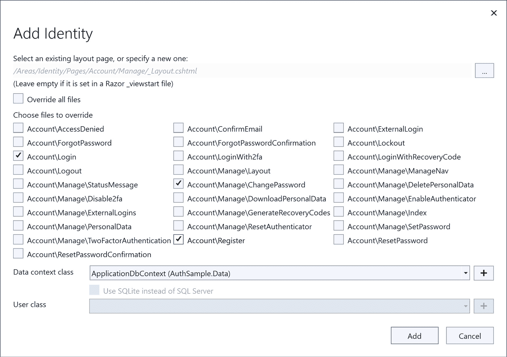

图 12.5 – 覆盖身份模块的对话框

您可以选择覆盖所有文件或仅选择您想要自定义的文件。选择您的数据上下文类，然后单击`Identity`文件夹——Razor 和相应的 C#文件都将被添加。以下截图说明了基于选择添加的文件：

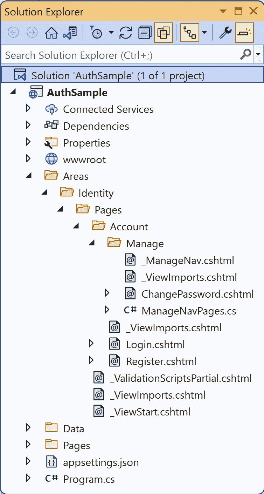

图 12.6 – AuthSample 项目的解决方案资源管理器视图

更多有关自定义的详情，请参阅[`docs.microsoft.com/en-us/aspnet/core/security/authentication/scaffold-identity?view=aspnetcore-6.0`](https://docs.microsoft.com/en-us/aspnet/core/security/authentication/scaffold-identity?view=aspnetcore-6.0)。

现在，让我们了解如何将 ASP.NET Core 应用程序与外部登录提供者集成。

## 与外部登录提供者集成

在本节中，我们将学习如何将 ASP.NET Core 应用程序与外部登录提供者集成，例如 Microsoft Account、Google、Facebook、Twitter 等。此外，我们还将探讨如何使用 OAuth 2.0 流程进行身份验证，以便用户可以使用他们现有的凭据注册并访问我们的应用程序。将 ASP.NET Core 应用程序与任何外部登录提供者集成的常见模式如下：

1.  获取用于从各自的开发者门户访问 OAuth API 进行身份验证的凭据（通常是客户端 ID 和密钥）。

1.  在应用程序设置或用户密钥中配置凭据。

1.  接下来，我们需要在**添加中间件支持**时将相应的 NuGet 包添加到项目中，以使用 OpenID 和 OAuth 2.0 流程。

1.  在`Program.cs`中，添加`AddAuthentication`方法以注册身份验证中间件。

### 配置 Google

要将 Google 配置为外部登录提供者，你需要执行以下步骤：

1.  在[`developers.google.com/identity/sign-in/web/sign-in`](https://developers.google.com/identity/sign-in/web/sign-in)创建 OAuth 凭据。

1.  在用户密钥中配置凭据。你可以使用`dotnet` CLI 将密钥添加到你的项目中，如下所示：

    ```cs
    dotnet user-secrets set "Authentication:Google:ClientId" "<client-id>"
    dotnet user-secrets set "Authentication:Google:ClientSecret" "<client-secret>"
    ```

1.  将`Microsoft.AspNetCore.Authentication.Google` NuGet 包添加到你的项目中，并将以下代码添加到`Program.cs`：

    ```cs
    services.AddAuthentication()
            .AddGoogle(options =>
            {
                IConfigurationSection googleAuthNSection =
                   Configuration.GetSection
                  ("Authentication:Google");
                options.ClientId =
                 googleAuthNSection["ClientId"];
                options.ClientSecret =
                 googleAuthNSection["ClientSecret"];
            });
    ```

1.  类似地，你可以添加多个提供者。

要了解如何与其他流行的外部身份验证提供者集成，你可以参考[`docs.microsoft.com/en-us/aspnet/core/security/authentication/social/?view=aspnetcore-6.0`](https://docs.microsoft.com/en-us/aspnet/core/security/authentication/social/?view=aspnetcore-6.0)。

完成前面的步骤后，你应该能够使用 Google 凭据登录到你的应用程序。这结束了本节关于在应用程序中使用 ASP.NET Core Identity 与外部登录提供者进行身份验证的内容。在下一节中，让我们看看 OAuth 是什么。

# 理解 OAuth 2.0

OAuth 2.0 是一种现代且行业标准的安全 Web API 协议。它通过为 Web 应用、单页应用、移动应用等提供特定的授权流程来简化流程，以便访问受保护的 API。

让我们考虑一个用例，其中你想要构建一个网络门户，用户可以从他们喜欢的应用程序（如 Instagram、Facebook 或其他第三方应用程序）同步和查看照片/视频。你的应用程序应该能够代表用户从第三方应用程序请求数据。一种方法涉及存储与每个第三方应用程序相关的用户凭据，并且你的应用程序代表用户发送或请求数据。

这种方法可能导致许多问题。以下是如何概述：

+   你需要设计你的应用程序以安全地存储用户凭据。

+   用户可能不习惯他们的凭据被第三方应用程序在你的应用程序中共享和存储。

+   如果用户更改了他们的凭据，它们需要在你应用程序中更新。

+   在安全漏洞的情况下，欺诈者可以无限制地访问第三方应用程序中用户的数据。这可能导致潜在的收入和声誉损失。

OAuth 2.0 可以通过解决所有这些关注点来处理所有上述用例。让我们看看它是如何做到这一点的，如下所示：

1.  用户登录到您的应用程序。为了同步图片/视频，用户将被重定向到第三方应用程序，并需要使用其凭据登录。

1.  OAuth 2.0 审查并批准应用程序获取资源的请求。

1.  用户带着授权码被重定向回您的应用程序。

1.  为了同步图片/视频，您的应用程序可以通过交换授权码并使用该令牌调用第三方应用程序的 API 来获取一个令牌。

1.  对于每个请求，第三方应用程序验证令牌并相应地响应。

在 OAuth 流程中，涉及四个方面：**客户端**、**资源所有者**、**授权服务器**和**资源服务器**。请参考以下截图：

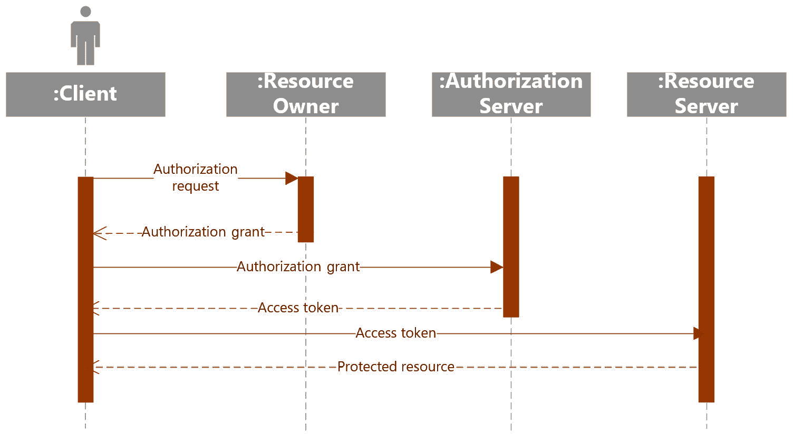

图 12.7 – OAuth2 流程

从前面的截图，我们可以看到以下内容：

+   **客户端**：这指的是从授权服务器获取令牌并代表资源所有者向资源服务器发出请求的应用程序。

+   **资源所有者**：这是一个拥有资源/数据并能够授予客户端访问权限的实体。

+   **授权服务器**：这验证资源所有者并向客户端发行令牌。

+   **资源服务器**：这是托管资源或与资源所有者相关的数据的服务器，使用载体令牌进行验证，并对来自客户端的请求进行响应或拒绝。

## 令牌

授权服务器验证用户并提供了 ID 令牌、访问令牌和刷新令牌，这些令牌被原生/网络应用程序用于访问受保护的服务。让我们更深入地了解它们：

+   **访问令牌**：这是授权服务器作为 OAuth 流程的一部分发行的，通常以 JWT 格式；一个包含发行者、用户、范围、过期时间等信息的基础 64 编码的 JSON 对象。

+   **刷新令牌**：这是授权服务器与访问令牌一起发行的，客户端应用程序在访问令牌过期之前使用它来请求新的访问令牌。

+   **ID 令牌**：这是授权服务器作为 OpenID Connect 流程的一部分发行的，可以用来验证用户。

    注意

    OpenID Connect 是建立在 OAuth2 之上的一个身份验证协议。它可以用来验证身份验证服务器上的用户身份。

## 授权类型

OAuth 2.0 定义了客户端获取令牌以访问受保护资源的方法——这些被称为**授权**。它定义了五种授权类型：授权码流程、隐式流程、代表流程、客户端凭据流程和设备授权流程。它们在此概述：

+   **授权码流**：这种流适用于 Web、移动和单页应用程序，其中您的应用程序需要从另一个服务器获取数据。授权码流从客户端将用户重定向到授权服务器进行身份验证开始。如果成功，用户会同意客户端所需的权限，并被带有授权码重定向回客户端。

在这里，客户端的身份是通过授权服务器配置的重定向**统一资源标识符**（**URI**）进行验证的。接下来，客户端通过传递授权码来请求访问令牌，并作为回报，获得访问令牌、刷新令牌和过期日期。客户端可以使用访问令牌来调用 Web API。由于访问令牌的寿命较短，在它们过期之前，客户端应通过传递访问令牌和刷新令牌来请求新的访问令牌。

+   **隐式流**：这是一个适合单页、基于 JavaScript 的应用程序的简化代码流版本。在隐式流中，授权服务器不是发出授权码，而是只发出访问令牌。在这里，客户端身份未经验证，因为没有必要指定重定向 URL。

+   **代表流**：这种流最适合客户端调用 Web API（例如，A）的情况，该 API 反过来需要调用另一个 API（例如，B）。流程是这样的：用户将带有令牌的请求发送到 A；A 通过提供 A 的令牌和凭据（如 A 的客户 ID 和客户密钥）从授权服务器请求 B 的令牌。一旦它获得了 B 的令牌，它就在 B 上调用 API。

+   **客户端凭据流**：这种流用于需要服务器到服务器交互的情况（例如，A 到 B，其中 A 通过其凭据（通常是客户 ID 和客户密钥）获取令牌以与 B 交互，然后使用获得的令牌调用 API）。此请求在 A 的上下文中运行，而不是在用户的上下文中。应授予 A 执行必要操作所需的权限。

+   **设备授权流**：这种流用于用户需要在没有浏览器的情况下登录设备的情况，例如智能电视、物联网设备或打印机。用户访问移动或 PC 上的网页进行身份验证，并输入设备上显示的代码以获取令牌并刷新设备的令牌以连接。

现在我们已经了解了 OAuth 是什么，在下一节中，让我们了解 Azure AD 是什么，如何将其集成到我们的电子商务应用程序中，以及如何将其用作我们的身份服务器。

# Azure AD 简介

Azure AD 是来自 Microsoft 的**身份和访问管理**（**IAM**）云服务。它为内部和外部用户提供了一个单一的身份存储库，因此您可以配置应用程序使用 Azure AD 进行身份验证。您可以将本地 Windows AD 同步到 Azure AD；因此，您可以为您的用户提供**单点登录**（**SSO**）体验。

用户可以使用他们的工作或学校凭证或个人 Microsoft 账户（如`Outlook.com`、Xbox 和 Skype）登录。它还允许您原生地添加或删除用户、创建组、进行自助密码重置、启用 Azure MFA 以及更多功能。

使用 **Azure AD B2C**，您可以自定义用户注册、登录和管理其个人资料的方式。此外，它还允许您的客户使用他们现有的社交凭证，如 Facebook 和 Google，来登录并访问您的应用程序和 API。

Azure AD 符合行业标准协议，如**OpenID Connect**，也称为**OIDC**和**OAuth 2.0**。OIDC 是在 OAuth 2.0 协议之上构建的身份层，用于验证和检索用户的个人资料信息。OAuth 2.0 用于授权，通过不同的流程（如隐式授权流程、代表流程、客户端凭证流程、代码流程和设备授权流程）获取对 HTTP 服务的访问权限。

Web 应用程序中典型的身份验证流程如下：

1.  用户尝试访问应用程序的安全内容（例如，**我的订单**）。

1.  如果用户未进行身份验证，则会被重定向到 Azure AD 登录页面。

1.  一旦用户提交了他们的凭证，Azure AD 就会进行验证，并将令牌发送回 Web 应用程序。

1.  一个 cookie 被保存在用户的浏览器中，并显示用户请求的页面。

1.  在后续请求中，会发送一个 cookie 到服务器，用于验证用户。

**Azure AD B2C**允许您的客户使用他们首选的社交、企业或本地身份来访问您的应用程序或 API。它可以扩展到每天数百万用户和数十亿次身份验证。

让我们尝试将我们的电子商务应用程序与 Azure AD B2C 集成。在高层面上，我们需要执行以下步骤来集成：

1.  创建 Azure AD B2C 租户。

1.  注册应用程序。

1.  添加身份提供者。

1.  创建用户流程。

1.  更新应用程序代码以进行集成。

    注意

    作为先决条件，您应该有一个活跃的 Azure 订阅，并具有贡献者角色。如果您还没有，您可以在[`azure.microsoft.com/en-in/free/`](https://azure.microsoft.com/en-in/free/)注册一个免费账户。

## Azure AD B2C 的设置

使用 Azure AD B2C 作为身份服务将允许我们的电子商务用户注册、创建他们自己的凭证或使用他们现有的社交凭证，如 Facebook 或 Google。让我们看看我们需要执行以下步骤来配置 Azure AD B2C 作为我们的电子商务应用程序的身份服务：

1.  登录到 Azure 门户，确保您位于包含您的订阅的同一目录中。

1.  在 **主页** 上，点击 **创建资源** 并搜索 **B2C**。然后，从选项列表中选择 **Azure Active Directory B2C**。

1.  选择 **创建新的 Azure AD B2C 租户**，如图下截图所示：

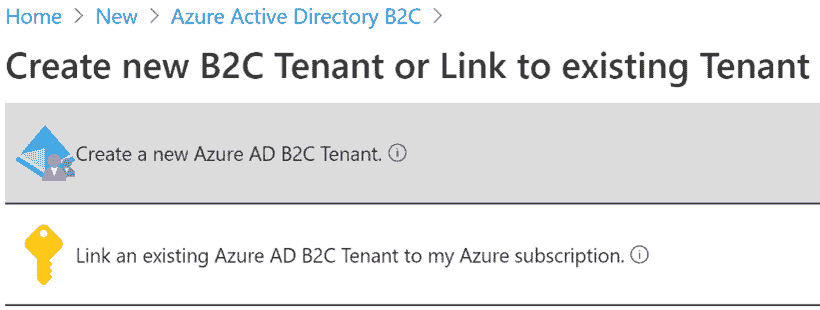

图 12.8 – Azure AD B2C

1.  提供所需的详细信息，然后点击 **审查 + 创建**。然后，完成以下字段：

**组织名称**：这是您的 B2C 租户的名称。

**内部域名**：这是您的租户的内部域名。

**国家/地区**：选择您的租户应部署的国家或地区。

**订阅** 和 **资源组**：提供订阅和资源组详细信息。

这些字段在以下截图中显示：

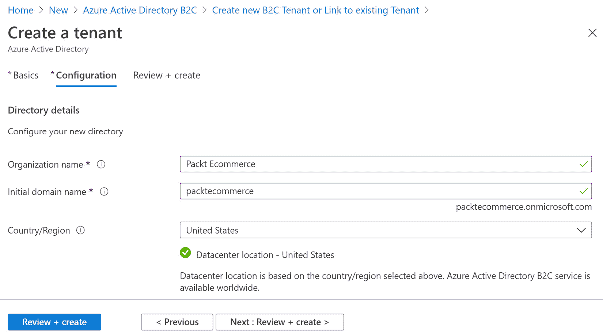

图 12.9 – 新的 Azure AD B2C 配置部分

1.  审查您的详细信息，然后点击 **创建**。创建新租户可能需要几分钟。一旦创建完成，您将在通知部分看到确认消息。在 **通知** 弹出窗口中，点击租户名称以导航到新创建的租户，如图下截图所示：


图 12.10 – Azure AD B2C 服务创建确认

1.  在以下截图中，请注意 **订阅状态** 显示为 **无订阅**。另外，一条警告信息指出您应该 **将订阅链接到您的租户**。您可以点击链接进行修复，否则可以跳转到 *步骤 9* 继续配置 Azure AD：


图 12.11 – 显示未链接订阅的警告信息

1.  链接将打开与 *步骤 3* 中相同的屏幕。这次，点击 **将现有 Azure AD B2C 租户链接到我的 Azure 订阅** 以继续，如图下截图所示：

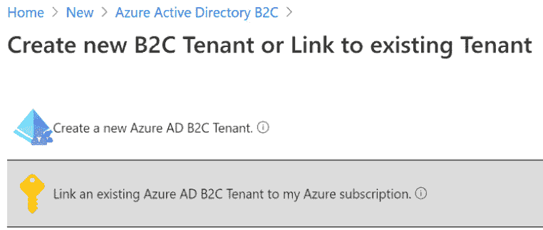

图 12.12 – 将 Azure AD B2C 租户链接到订阅

1.  从下拉列表中选择您的 B2C 租户订阅，提供一个 **资源组** 值，然后点击 **创建** 以链接订阅和租户，如图下截图所示：

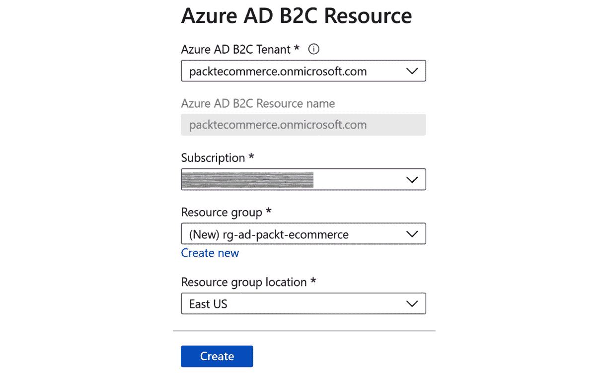

图 12.13 – 订阅选择

1.  您可以通过在 B2C 租户概览部分选择 **打开 B2C 租户** 链接来导航到您的 B2C 租户，继续配置的下一步，如下所示：

    +   您需要将应用程序注册到 Azure AD B2C 租户中，才能将其用作身份服务。

    +   您需要选择用户可以用来登录您应用的标识提供者。

    +   选择用户流程以定义用户注册或登录的体验，如下所示截图：

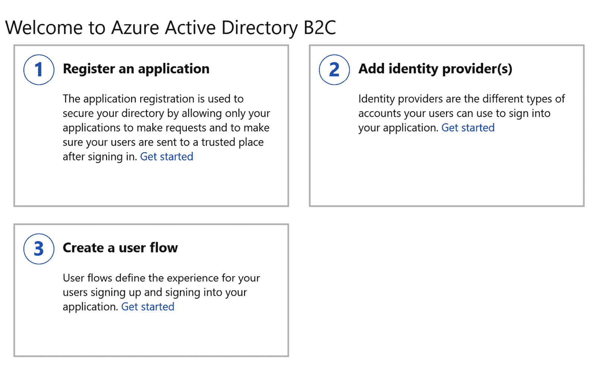

图 12.14 – 配置 Azure AD B2C 的三个步骤

1.  在 **管理** 下，点击 **应用程序注册** 并提供以下必要详细信息。然后，点击 **注册** 以创建 AD 应用程序：

**名称**：显示应用程序的显示名称。

**支持的账户类型**：选择 **任何标识提供者或组织目录中的账户**，这样我们就可以允许用户使用他们现有的凭据进行注册或登录。

**重定向 URI**：您需要提供用户在成功认证后将被重定向到的应用程序的 URL。目前，我们可以将其留空。

**权限**：选择 **授予 openid 和 offline_access 权限的管理员同意**。

以下截图说明了这些字段：

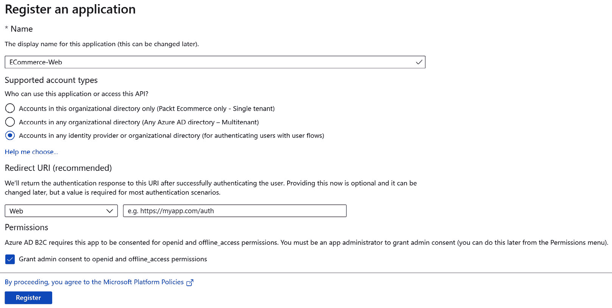

图 12.15 – 注册新的 Azure AD 应用程序

注意

为了本地设置和调试，我们可以使用 `localhost` 进行配置。这需要替换为您应用程序托管位置的 URL。

1.  现在，让我们在 **管理** 下的 **标识提供者** 中进行选择以进行配置，如下所示：

**本地账户**：此选项允许用户以传统的用户名和密码方式在我们的应用程序中注册和登录。以下截图说明了这一点：

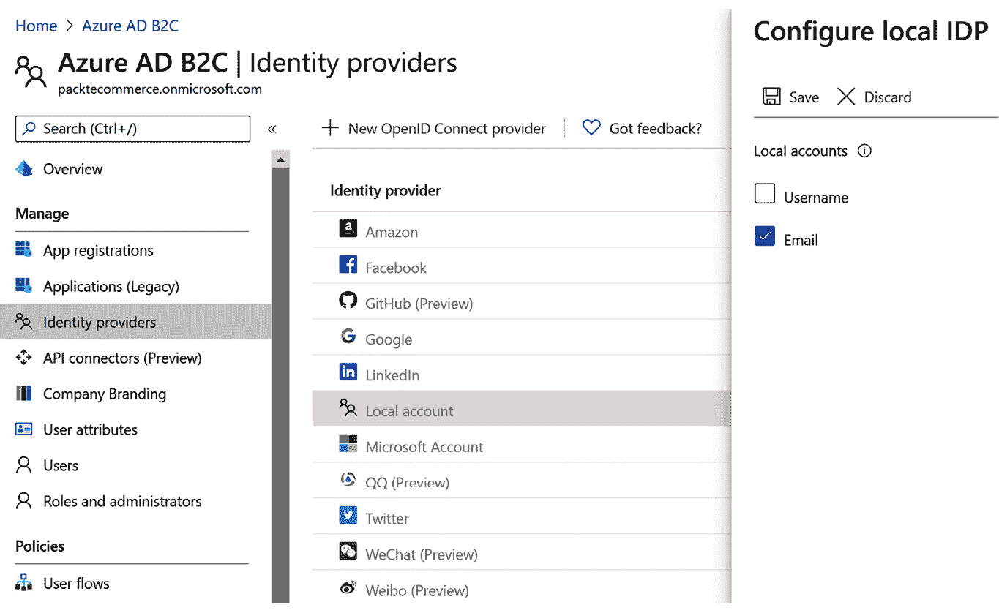

图 12.16 – 选择标识提供者

1.  让我们配置 Google 作为我们应用程序的标识提供者。您可以通过访问 [`docs.microsoft.com/en-in/azure/active-directory-b2c/identity-provider-google`](https://docs.microsoft.com/en-in/azure/active-directory-b2c/identity-provider-google) 中的步骤来获取客户端 ID 和密钥。您需要提供的详细信息如下所示：

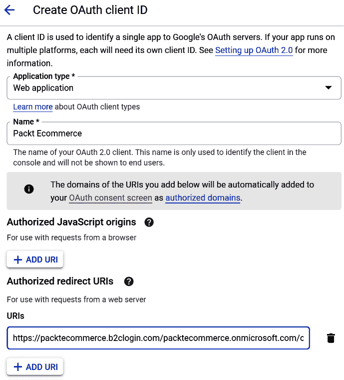

图 12.17 – Google：新的 OAuth 客户端

在您提供所需详细信息并选择保存后，将生成客户端 ID 和密钥，如下所示：


图 12.18 – Google OAuth 客户端

1.  一旦您创建了 **认证客户端**，请从 **标识提供者** 中点击 **Google**，然后提供 **客户端 ID** 和 **客户端密钥** 值以完成配置。请参考以下截图：

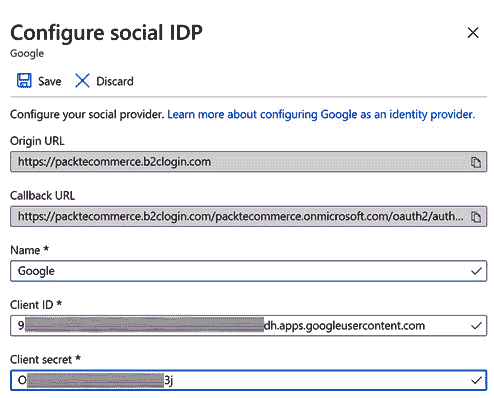

图 12.19 – 标识提供者配置

1.  让我们配置 Facebook 作为我们电子商务应用程序的另一个身份提供者。您可以按照 [`docs.microsoft.com/en-in/azure/active-directory-b2c/identity-provider-facebook`](https://docs.microsoft.com/en-in/azure/active-directory-b2c/identity-provider-facebook) 中概述的步骤进行操作。

1.  一旦您创建了 **客户端身份验证** 设置，请点击 **Facebook** 从 **身份提供者** 中，然后提供 **客户端 ID** 和 **客户端密钥** 值以完成配置。请参阅 *图 12.19* 了解概述。

1.  现在，让我们配置用户流程。用户流程允许您为您的用户配置和自定义身份验证体验。您可以在您的租户中配置多个流程并在您的应用程序中使用它们。用户流程允许您添加多因素认证（MFA）并自定义在注册时从用户那里捕获的信息——例如，他们的名字、国家、邮政编码，以及可选的，您是否希望将他们添加到声明中。您还可以自定义用户界面以获得更好的用户体验。要创建一个流程，请点击 **策略** 下的 **用户流程** 并选择一个流程类型，如图下截图所示：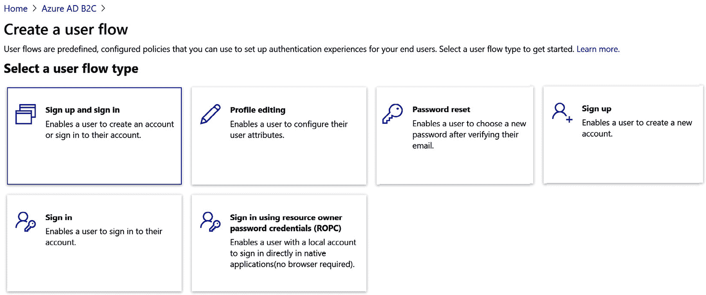

图 12.20 – 新用户流程

1.  提供必要的详细信息，然后点击 **创建** 保存：

**名称**：这是您流程的唯一名称。

**身份提供者**：选择您的身份提供者。

可选地，您可以选择额外的用户属性，如 **名称**、**邮政编码** 等，如图下截图所示：

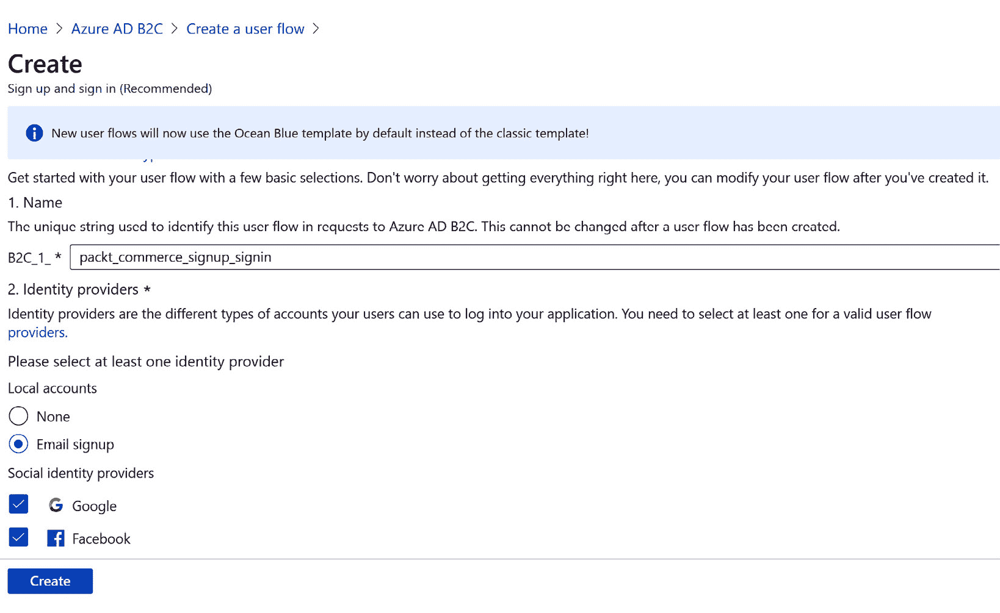

图 12.21 – 用户流程配置

您可以在 **用户属性和令牌声明** 部分选择额外的属性，如图下截图所示：

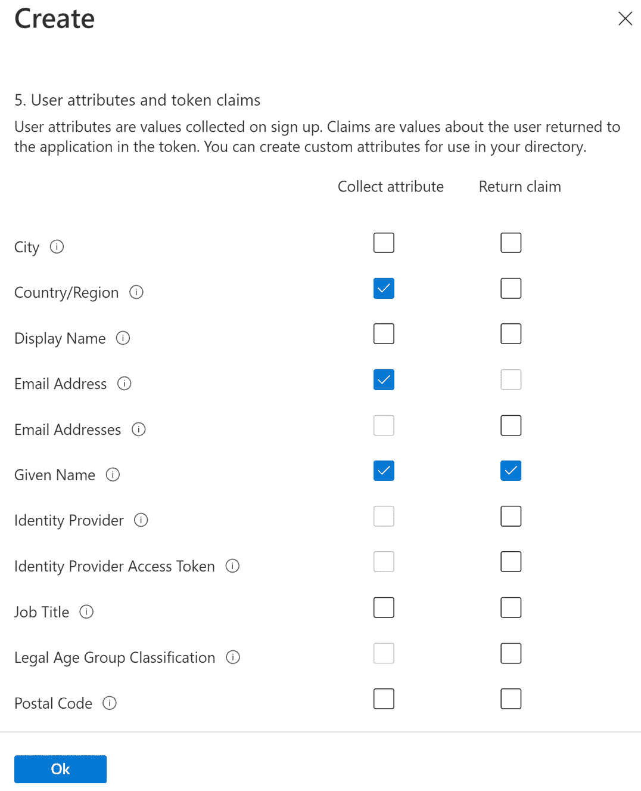

图 12.22 – 额外的属性和声明配置

1.  类似地，我们也应该设置密码重置策略。这对于本地账户是必需的。要创建一个，请在 **创建用户流程** 下选择 **密码重置** 并提供必要的详细信息。您可以参考 *图 12.20*。

1.  完成了 Azure AD B2C 的最小必要设置后，我们准备测试流程。选择创建的用户流程并点击 **运行用户流程**。您可以看到为您创建的注册和登录页面，如图下截图所示：

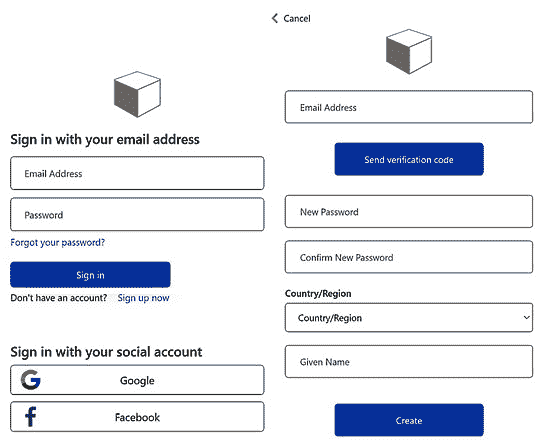

图 12.23 – 登录和注册屏幕

让我们看看在 `Packt.Ecommerce.Web` 中我们需要进行哪些更改以集成 Azure AD。

## 将我们的电子商务应用程序与 Azure AD B2C 集成

我们将在 Web 应用程序上配置身份验证以使用 Azure AD B2C。让我们对我们的应用程序进行必要的更改以集成到 B2C 租户，如下所示：

1.  将以下两个 NuGet 包添加到我们的`Packt.Ecommerce.Web`项目中：

`Microsoft.Identity.Web`: 这是集成到 Azure AD 所需的主要包。

`Microsoft.Identity.Web.UI`: 此包生成登录和注销的 UI。在`Program.cs`中，我们需要使用`OpenIdConnect`方案以及`Azure AD B2C`配置添加一个身份验证服务，如下所示：

```cs
services.AddAuthentication(OpenIdConnectDefaults.AuthenticationScheme).AddMicrosoftIdentityWebApp(Configuration.GetSection("AzureAdB2C"));
services.AddRazorPages().AddMicrosoftIdentityUI();
```

1.  在`Configure`方法中，在`app.UseAuthorization()`方法之前添加以下代码：

    ```cs
    app.UseAuthentication();
    ```

1.  我们需要将`AzureAdB2C`添加到`appsettings.json`中，如下所示：

`实例`: `https://<domain>.b2clogin.com/tfp`。将`<domain>`替换为您在创建 B2C 租户时选择的名称。

`客户端 ID`: 这是您在设置 Azure AD B2C 时创建的 AD 应用程序 ID。

`域`: `<domain>.onmicrosoft.com`。在此处，将`<domain>`替换为您在创建 B2C 租户时选择的域名。

更新`SignUpSignInPolicyId`和`ResetPasswordPolicyId`，如下所示：

```cs
"AzureAdB2C": {
    "Instance": 
    "https://packtecommerce.b2clogin.com/tfp/",
    "ClientId": "1ae40a96-60d7-4641-bb81-
      bc3a47aad36d",
    "Domain": "packtecommerce.onmicrosoft.com",
    "SignedOutCallbackPath": "/signout/B2C_1_susi",
    "SignUpSignInPolicyId": "B2C_1_packt_commerce",
    "ResetPasswordPolicyId": "B2C_1_password_reset",
    "EditProfilePolicyId": "",
    "CallbackPath": "/signin-oidc"
  }
```

1.  您可以为控制器或操作方法添加一个`[Authorize]`属性——例如，您可以将它添加到`OrdersController.cs`中的`OrdersController`，以强制用户进行身份验证才能访问`Orders`信息。

1.  最后一步是更新回复 URI。为此，请导航到您的租户中的**AD 应用程序**。在**管理**下的**身份验证**部分更新**回复 URI**，并设置隐式授权权限。

回复 URI 是用户在成功认证后将被重定向到的应用程序的 URL。为了设置应用程序并在本地进行调试，我们可以配置 localhost URL，但一旦您将应用程序部署到服务器，您将需要更新服务器的 URL。

在**隐式授权**下，选择**访问令牌**和**ID 令牌**，这是我们的 ASP.NET Core 应用程序所需的，如图下所示：


图 12.24 – 回复 URL 配置

现在，运行您的应用程序并尝试访问**订单**页面。您将被重定向到登录和注册页面，如图*图 12.23*所示。这标志着我们的电子商务应用程序与 Azure AD B2C 的集成完成。

Azure AD 提供了许多更多选项和自定义功能以满足您的需求。有关更多详细信息，您可以查看[`docs.microsoft.com/en-in/azure/active-directory-b2c`](https://docs.microsoft.com/en-in/azure/active-directory-b2c)。

注意

您可以使用 Duende Identity Server 来设置自己的身份服务器。这使用 OpenID Connect 和 OAuth 2.0 框架来建立身份。它通过 NuGet 提供，并且可以轻松集成到 ASP.NET Core 应用程序中。有关更多详细信息，您可以参考[`docs.duendesoftware.com/identityserver/v6`](https://docs.duendesoftware.com/identityserver/v6)。

在下一节中，我们将看看如何使用 Windows 身份验证。

# Windows 身份验证简介

ASP.NET Core 应用程序可以被配置为使用 Windows 身份验证，其中用户将使用其 Windows 凭据进行身份验证。当您的应用程序托管在 Windows 服务器上且您的应用程序仅限于内部网络时，Windows 身份验证是最佳选择。在本节中，我们将学习如何在 ASP.NET Core 应用程序中使用 Windows 身份验证。

在 Visual Studio 中，选择 `--auth Windows` 参数以使用 Windows 身份验证创建新的网络应用程序，如下所示：

```cs
dotnet new webapp --auth Windows -o WinAuthSample
```

如果您打开 `launchSettings.json`，您会注意到 `WindowsAuthentication` 设置为 `true`，而 `anonymousAuthentication` 设置为 `false`，如下面的代码片段所示。此设置仅在运行 **Internet Information Services Express**（**IIS Express**）的应用程序时适用：

```cs
"iisSettings": {
```

```cs
    "windowsAuthentication": true,
```

```cs
    "anonymousAuthentication": false,
```

```cs
    "iisExpress": {
```

```cs
      "applicationUrl": "http://localhost:21368",
```

```cs
      "sslPort": 44384
```

```cs
    }
```

```cs
  }
```

当您在 IIS 上托管应用程序时，需要在 `web.config` 中将 `WindowsAuthentication` 配置为 `true`。默认情况下，`web.config` 不会添加到 .NET Core 网络应用程序中，因此您需要添加它并进行必要的更改，如下面的代码片段所示：

```cs
<location path="." inheritInChildApplications="false">
```

```cs
    <system.webServer>
```

```cs
      <security>
```

```cs
        <authentication>
```

```cs
          <anonymousAuthentication enabled="false"/>
```

```cs
          <windowsAuthentication enabled="true"/>
```

```cs
        </authentication>
```

```cs
      </security>
```

```cs
    </system.webServer>
```

```cs
</location>
```

上述配置使每个端点都变得安全。即使我们在每个控制器或操作上设置 `AllowAnonymous`，也不会产生影响。如果您想使任何端点匿名访问，需要将 `anonymousAuthentication` 设置为 `true`，并设置您想要使其安全的端点的 `Authorize`。此外，您还需要将身份验证服务与方案 `Windows` 注册，如下所示：

```cs
services.AddAuthentication(IISDefaults.AuthenticationScheme)
```

这就是您需要在应用程序中启用 Windows 身份验证所需要做的全部。有关更多详细信息，您可以参考 [`docs.microsoft.com/en-us/aspnet/core/security/authentication/windowsauth?view=aspnetcore-6.0`](https://docs.microsoft.com/en-us/aspnet/core/security/authentication/windowsauth?view=aspnetcore-6.0)。

在下一节中，我们将探讨一些确保客户端和服务器应用程序安全的最佳实践。

# 理解确保客户端和服务器应用程序安全性的最佳实践

有几个最佳实践建议用于确保您的网络应用程序的安全性。.NET Core 和 Azure 服务使确保其采用变得容易。以下是一些您可以考虑的关键点：

+   为网络应用程序强制执行 HTTPS。使用 `UseHttpsRedirection` 中间件将请求从 HTTP 重定向到 HTTPS。

+   使用基于 OAuth 2.0 和 OIDC 的现代身份验证框架来保护您的网络或 API 应用程序。

+   如果您使用的是 Microsoft 身份平台，请使用如 MSAL.js 和 MSAL.NET 这样的开源库来获取或更新令牌。

+   配置强密码要求，并在连续登录失败尝试的情况下锁定账户——例如，连续五次失败尝试。这可以防止暴力攻击。

+   为特权账户如后台办公室管理员、后台办公室员工账户等启用多因素认证（MFA）。

+   配置会话超时，在注销时使会话无效，并清除 cookies。

+   在所有受保护端点和客户端上强制执行授权。

+   将密钥/密码存储在安全位置，例如密钥库中。

+   如果您正在使用 Azure AD，请分别注册每个逻辑/环境特定的应用程序。

+   不要以纯文本形式存储敏感信息。

+   确保适当的异常处理。

+   对上传的文件进行安全/恶意软件扫描。

+   防止跨站脚本攻击——始终对用户输入数据进行 HTML 编码。

+   通过参数化 SQL 查询和使用存储过程来防止 SQL 注入攻击。

+   防止跨站请求伪造攻击——在操作、控制器或全局上使用`ValidateAntiForgeryToken`过滤器。

+   在中间件中使用此策略强制执行**跨源请求**（**CORS**）。

虽然提供的一些最佳实践和指导是好的起点，但您需要始终考虑应用程序的上下文，并持续评估和增强您的应用程序，以解决安全漏洞和威胁。

# 摘要

在本章中，我们了解了什么是身份验证以及 ASP.NET Core 中身份验证的关键要素。我们探讨了 ASP.NET Core 框架提供的不同选项，并学习了如何使用 ASP.NET Core Identity 快速将身份验证添加到您的应用程序中。我们讨论了 OAuth 2.0 和授权流程，并了解了它们在您需要身份验证和连接到多个 API 服务时如何简化事情。

此外，我们还探讨了将 Azure AD 配置为您的身份服务，在您的应用程序中使用外部身份验证提供程序，如 Google 或 Facebook，以及在 ASP.NET Core 应用程序中使用 Windows 身份验证。我们通过讨论在开发服务器端和客户端应用程序时应该遵循的一些最佳实践来结束本章。

在下一章中，我们将了解授权是什么以及它是如何帮助控制对您资源的访问的。

# 问题

1.  从 JWT 中可以提取哪些信息？

a. 发行者

b. 过期

c. 范围

d. 主题

e. 以上所有

**答案：e**

1.  推荐用于单页应用的 OAuth 授权流程是什么？

a. 客户端凭据流程

b. 隐式流程

c. 代码授权流程

d. 代表流程

**答案：b 和 c**

1.  集成 Azure AD 所需的最小 NuGet 包是什么？

a. `Microsoft.AspNetCore.Identity`

b. `Microsoft.Identity.Web.UI`

c. `Microsoft.AspNetCore.Identity.UI`

d. `Microsoft.Identity.Web`

**答案：d**

# 进一步阅读

要了解更多关于身份验证的信息，您可以参考以下资源：

+   [`docs.microsoft.com/en-us/aspnet/core/security/authentication/?view=aspnetcore-6.0`](https://docs.microsoft.com/en-us/aspnet/core/security/authentication/?view=aspnetcore-6.0)

+   [`docs.microsoft.com/en-in/azure/active-directory-b2c`](https://docs.microsoft.com/en-in/azure/active-directory-b2c)
