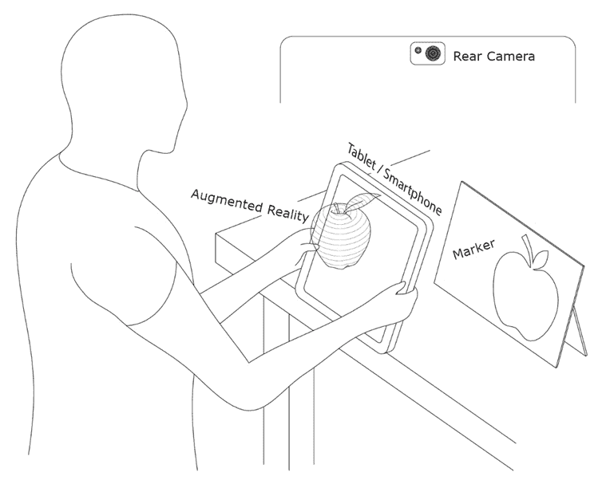
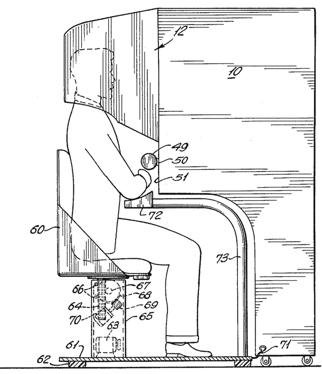
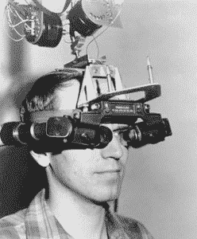
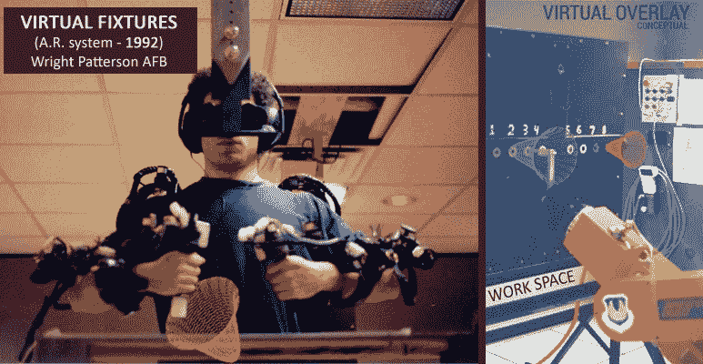
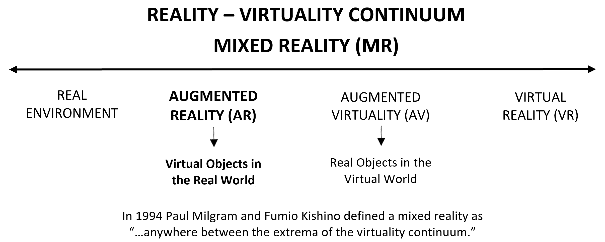

# AR 简介及其在企业中的应用

本书是为对新兴和交互式技术感兴趣的爱好者所写，他们从一开始就希望为任何市场领域构建 AR 应用，并了解开发它们的最新工具。不需要先前的 AR 经验。

本书的主旨是通过在不同企业环境中完成一系列项目，向您介绍不同的 AR 框架。虽然不需要特定的编程技能，但希望您具备一定的知识，以便理解每个示例中的代码。一些面向对象的编程技能会有所帮助，但不是必需的。本书是从零开始编写的，因此您将能够逐步跟随任何编码需求。

在本章中，我们将学习什么是**增强现实**（**AR**），并简要介绍其历史、类型以及工作原理。我们还将介绍本书中将使用的**软件开发工具包**（**SDKs**）。最后，我们将探讨 AR 的应用实例，特别是其在企业内部的应用。本章的主要目标是理解 AR 当前的应用情况，包括市场、技术、设备以及具有多种 AR 识别模式（如目标图像、云标记、基于 GPS、物体或人脸追踪和空间映射）的开发工具。你还将了解本书中将使用的主要 AR 工具及其主要功能的简要介绍。

到本章结束时，您将基本了解 AR 的工作原理及其不同的用途，以便更容易地跟随后续的技术章节。

本章将涵盖以下主题：

+   理解 AR

+   与 AR 协作

+   在企业中使用 AR

# 理解 AR

AR 是用来描述允许用户通过技术设备（智能手机、平板电脑或 AR 眼镜）的摄像头，通过该设备添加的虚拟图形信息来可视化部分真实世界的技术术语。该设备将虚拟信息添加到现有的物理信息中。通过这种方式，有形的物理元素与虚拟元素相结合，从而在实时中创建增强现实。以下图像显示了 AR 的工作原理：

一个用户在平板电脑上看到 AR 中的 3D 苹果

现在，我们将探讨 AR 的起点，并了解 AR 可以根据其功能如何划分。

# 简短历史——新现实的起点

AR 不是一项新技术。AR 的起点可以追溯到哲学家、愿景家和电影制作人 Morton Heilig 发明的机器，他在 1957 年开始构建一个原型，其外观类似于 90 年代非常流行的街机视频游戏机。以下图像显示了该原型的示意图：

发明工作原理的图示（此图像由 Morton Heilig 创作）

Morton 将他的发明命名为**Sensorama**，这是一种投影 3D 图像、添加环绕声、使座椅振动并创造向观众投掷空气的体验。我们今天可以感受到的最相似的经验是在 4D 电影院看电影，但这些体验是在 60 多年前创造的。

1968 年，哈佛电气工程教授 Ivan Sutherland 创造了一种将成为 AR 技术未来关键设备的装置，称为**人机载显示（HMD）**。与今天我们所知的 AR 眼镜截然不同，这个被称为**达摩克利斯之剑**的 HMD 是一个巨大的机器，悬挂在实验室的天花板上，当用户被放置在正确的位置时才会工作。在下面的图像中，你可以看到这个发明的外观：

达摩克利斯之剑（此图像由 OyundariZorigtbaatar 创作）[ ](https://commons.wikimedia.org/w/index.php?title=User:OyundariZorigtbaatar&action=edit&redlink=1)

1992 年，波音研究员 Tom Caudell 发明了 AR 这个术语，同时，AR 技术从另外两个作品中得到了推动。第一个 AR 系统来自美国空军工作的 L.B. Rosenberg，这是一个为用户提供如何执行某些任务的建议的设备，类似于虚拟向导。这可以在下面的图像中看到：

左侧的虚拟设备 AR 系统和其右侧的视图（此图像由 AR Trends 创作）

在这个领域的其他研究由哥伦比亚大学领导，那里的一组科学家发明了一种与打印机交互的 HMD。这个设备被命名为**Karma**（基于知识的维护辅助 AR），它投射一个 3D 图像来告诉用户如何为打印机充电，而不是查阅用户手册。

下面的图表是基于 Milgram 和 Kishino（1994 年）的连续高级计算机界面表示，其中我们可以看到从**现实环境**到**虚拟现实**的**混合现实（MR）**的不同子类别。位于**现实环境**附近的 AR 分为空间 AR 和透视 AR。然而，21 世纪移动设备的出现允许了一种不同的 AR 版本，我们可以通过设备屏幕和摄像头来显示它：

混合现实及其子类别

现在我们已经介绍了增强现实（AR）的初步概念，接下来让我们学习如何根据用于在现实世界中显示虚拟元素所使用的触发器来对这项技术进行分类。

# AR 背后的魔法

AR 可以通过多种方式创建；主要挑战是如何使现实世界与虚拟世界的结合尽可能无缝。根据用于触发虚拟元素在现实世界中出现的触发器，AR 可以分为以下几种：

+   **GPS 坐标**：我们使用 GPS 坐标、指南针和加速度计来确定用户的精确位置，包括他们正在看的方位点。根据用户指向的位置，他们将看到一些虚拟对象或从同一位置看到的其他对象。

+   **黑白标记器**：我们使用非常简单的图像，类似于黑白二维码，以在上面投影虚拟对象。这是最早的 AR 示例之一，尽管如今由于有更真实的方式来创建 AR 体验，它们的使用频率较低。

+   **图像标记器**：我们使用移动设备的摄像头定位预定义的图像（也称为目标或标记），然后在它们上方投影虚拟对象。这种类型的 AR 已经取代了黑白标记。

+   **实时标记器**：用户使用移动摄像头创建并定义自己的图像，以在其中投影任何虚拟对象。

+   **面部识别**：通过摄像头，我们捕捉面部运动以执行请求中的某些动作，例如，向虚拟头像做出面部表情。

+   **SLAM**：即**同时定位与地图构建**，这项技术通过特征点理解物理世界，从而使 AR 应用能够识别 3D 对象和场景，并即时跟踪世界，叠加数字交互增强。

+   **信标**：eBeacons、RFID 和 NFC 是使用无线电频率或蓝牙的识别系统，类似于 GPS 坐标，以触发 AR 元素。

现在，你对 AR 是什么以及它的来源有了更好的理解。我们通过查看第一代原型来介绍 AR 的基础知识，并根据触发虚拟图像的元素对不同的 AR 类型进行分类，以便它们出现在屏幕上。下一步是了解与之合作所需的内容。

# 与 AR 合作

AR 项目需要一些基本元素来履行其功能：

+   数字支持，主要是平板电脑、手机或眼镜。这些将是我们将用来识别我们所看到的内容并将信息融入 AR 的设备。

+   传感器，如摄像头、GPS、3D 扫描仪等，以感知现实。它们通常集成到移动设备中。

+   一种算法或应用程序，用于理解正在观察的现实，并使用相关信息进行解释和显示。

+   数字内容以丰富现实。这是你融入 AR 的所有信息。

结果是一个界面，其中现实通过位于所需空间中的附加信息进行观察。以下小节将介绍不同的 AR 库和 SDK，以及它们的工作原理。

# ARToolKit – 第一个 AR 库

ARToolKit 是世界上第一个开源软件库，它允许创建增强现实（AR）应用，在这些应用中，虚拟图像会与现实世界中的物体重叠。它利用视频跟踪功能来实时计算摄像机的位置以及相对于物理标记的朝向。一旦确定了真实摄像机的位置，虚拟摄像机就被放置在相同的位置，并在真实标记上叠加一个虚拟信息层，例如一个 3D 对象。ARToolKit 最初由加藤宏和华盛顿大学 HIT 实验室开发，并于 1999 年首次发布。它目前作为一个开源项目托管在 SourceForge 上，同时 ARToolworks 提供商业许可证：[`www.artoolkitx.org/`](http://www.artoolkitx.org/)。

# AR SDK 简介

现在，我们将介绍本书中将使用的 AR SDK。从 ARToolKit 的首次出现以来，AR SDK 已经发生了很大的变化。让我们介绍并描述本书中将使用的不同 SDK，以创建我们自己的 AR 体验：

+   Vuforia

+   EasyAR

+   ARCore

+   ARKit

让我们简要介绍一下它们。

# Vuforia

最初由高通开发，目前由 PTC 运营，Vuforia 是最古老且最知名的 AR SDK 之一，也是市场上最稳定和性能最好的软件之一。Vuforia 提供了各种功能，包括 2D 和 3D 跟踪、无标记 AR 以及称为 **Vumarks** 的标记。它提供了多个示例和额外功能，例如虚拟按钮、运行时图像目标创建和背景视频纹理操作。

# EasyAR

一个 AR 引擎，使我们能够以简单的方式创建 AR 解决方案，并提供多种 AR 功能，包括识别和跟踪在现实世界中先前选定的图像（如封面、照片或名片）的位置、旋转和缩放的技术。它允许我们映射真实地点并跟踪其中的物体，并包含定位和跟踪真实 3D 物体的位置和朝向的技术，而不是平面图像和功能，这允许我们在播放 AR 场景时拍摄视频。

# ARCore

第一个版本于 2018 年 2 月发布，是 Google 为 Android 和 iOS 创建 AR 应用的平台。它利用不同的功能，如运动跟踪，来估计移动设备相对于真实世界的位置和朝向；环境定位，以找到和跟踪水平表面，如地面、平板电脑或墙壁；以及光估计，将 3D 元素以逼真的方式放置到真实世界中。针对 Android 7.0 及以上版本，市场上并非所有设备都支持这项技术，尽管自第一个 SDK 版本以来，支持该技术的设备数量已大幅增加。

# ARKit

苹果公司在 2017 年发布了 ARKit 的第一个版本，与 Xcode 9 和 iOS 11 一起推出，将 AR 引入 iOS 设备。该框架包含在 Xcode 中，使用户能够在现实世界中放置虚拟内容。在官方发布几个月后，它增加了新的功能，如 2D 图像检测和面部检测。2018 年，随着 iOS 12 的发布，ARKit 2 推出，新增了 3D 对象跟踪、为场景添加逼真纹理以及创建多用户 AR 体验等功能。在撰写本书时，最新版本是 iOS 13，ARKit 3 承诺在当前状态下实现巨大改进，因为它将添加一种与虚拟元素交互的新方式，例如在检测到人站在虚拟对象前面时隐藏虚拟对象。它还允许用户通过手势与 3D 对象交互，并不仅捕捉面部表情，还能捕捉人的身体动作。

既然我们已经熟悉了本书中将使用的 AR 工具，让我们看看我们将如何将这些软件应用于不同的企业领域。

# 在企业中使用 AR

AR 可以在多个领域成为有价值的资产和技术。在本节中，我们将学习它在工业、营销、零售和旅游等领域的应用。在第一种情况下，我们将了解工业 4.0 如何将 AR 置于聚光灯下，因为它是生产、维护、培训等领域人机交互的自然界面。

本节的主要目标是让您在开始编码之前更好地了解如何在自己的项目中应用 AR。这样，您将能够根据自身需求调整本书中的示例。

让我们开始介绍 AR 在工业领域的应用。

# 在工业 4.0 中使用 AR

这种技术在工业领域的应用正在增长。其应用重点之一是能够为机器的故障做好准备，从而知道哪个部件已经损坏以及如何进行维修。这种 AR 的应用可以显著降低成本，因为它有利于在故障发生之前迅速采取行动。您还可以使用 AR 在实施之前可视化工厂或产品。这意味着您可以在将其变为实体之前完善要构建的内容。AR 在工业领域的应用有利于工业 4.0 的使能技术之一的应用，这些技术有助于提高公司的竞争力和生产力。

以下是一些示例：

+   智能助手

+   虚拟原型

+   物流与仓储管理

+   数字孪生

让我们更详细地看看这些示例。

# 智能助手

使用 AR 与维护过程管理平台结合，可以为工业机器的操作提供直接支持，从而缩短操作或维修任务的时间并提高准确性。以下是一些在这种情况下可以执行的任务：

+   跟随指导说明和工作流程

+   实时分配活动

+   检查清单和分配任务列表

+   创建干预的数字报告

+   自动检测 3D 对象

+   实时查看 3D 手册和工作单

+   通过视频通话拥有专家远程协作者

+   从机器中提取和显示实时数据

在这种情况下，使用增强现实（AR）技术通过降低成本和错误的可能性来提高商业生产力。

# 虚拟原型

AR 可以应用于实时可视化和配置 3D 工业工厂和设备。3D 模型可以在进行验证的工业环境中显示，也可以在展览会和活动等展览空间中展示。通过 AR，您可以在设备安装的位置可视化工业机械的全息图，以评估其尺寸、逃生空间和安全边缘。通过这样做，您可以优化生产流程。此外，将重型工业机械从世界的一个部分运送到另一个部分以在展览会上展示，成本非常高。使用 AR，您可以在展位中心看到您的产品就像它是真实的一样。

# 物流和仓库管理

通过连接到仓库管理系统的 3D 查看器或眼镜，仓库操作员可以直接在设备上接收商品存储的信息，这使得他们能够提高工作效率和质量，最终提高生产率。

# 数字孪生

多亏了 AR 技术，您可以为真实系统、产品或服务创建一个虚拟和动态的复制品，通过从传感器或自动化中获得的信息，模拟其行为。这样，它允许智能监控和分析，以及在复制品中实现模拟和实验，没有风险或成本，目的是提高真实系统的性能和有效性。

在这本书中，我们将学习如何通过创建一个带有 AR 引导和培训的原型自动化来使用 AR 进行制造。

# 在其他企业领域使用 AR

行业并不是 AR 技术唯一有价值的领域。这种技术的多功能性使其成为用户与最终产品或过程之间完美的沟通工具，并为它们添加了一个视觉和交互层，以吸引他们的注意力。无论是用来使产品更具吸引力，还是帮助用户通过附加信息理解一个过程，AR 在许多领域都可以成为一项宝贵的资产。让我们看看本书后面将要涵盖的其他企业领域，在这些领域中 AR 增加了价值。

# 制造业中的 AR

在这个领域，AR 有许多用途，如原型设计、生产和培训。在这些领域，AR 可以通过在现实世界之上可视化设计来帮助加快原型设计并降低成本，允许设计师、工人和潜在客户在模型周围和内部走动，并操纵其三维结构。

# AR 用于培训

AR 已成为教育和培训中的一个宝贵资产。它使我们能够在图像上或直接在房间内以三维形式可视化概念，这样我们可以更快、更动态地获取信息（只需用摄像头指向而不是翻阅书籍或在网上搜索信息），或者创建更深入的个人项目（使画作栩栩如生、在手工艺品上添加说明或额外信息、创建动画演示等）。

# AR 在营销中的应用

使用 AR，用户负责他们的体验并可以与之互动。现在，品牌已经超越了“哇”的效果，创造了功能性的体验来推广和销售他们的产品。这包括增强型目录，它在其平面图像上以 3D 形式展示产品；虚拟镜子，你可以在 AR 中试戴眼镜或配件；包装变得生动起来，解释制造过程中的元素；等等。

# AR 在零售中的应用

零售是 AR（增强现实）提供更广泛可能性之一的领域，从满足和吸引消费者以减少退货产品，到将产品与社交媒体或个性化购物体验相连接。这方面的例子包括在购买前尝试产品，以便用户可以在实际购买产品之前，将衣服、鞋子、眼镜甚至化妆品可视化到自己身上。通过这样做，他们可以借助 AR 看到家具、艺术品甚至墙面涂料在自己家中呈现的效果。

其他例子包括在购买产品之前查看有关产品的额外信息，如评论和评价，从商店接收地理位置信息及折扣，以及在超市或大型商店中，通过区域引导顾客到他们想要的产品。

# AR 在自动化中的应用

AR 是自然的人机界面和连接到**物联网（IoT）**和大数据的桥梁。它允许工人以简单和吸引人的方式可视化并交互工厂机器和传感器的数据，无论是使用移动设备还是 AR 头戴设备。

AR 在自动化中的应用可以从员工的面部识别到访问具体机器，到通过 AR 眼镜进行现场生产过程的实时监控或远程访问和控制。

# AR 在旅游中的应用

增强现实吸引人的地方在于它在现实世界之上显示的视觉内容。这使得这项技术非常适合增强旅行体验，从展示天际线信息到让博物馆中的动物栩栩如生，甚至实时翻译标志和指南。在旅游业中，AR 的一些最常见用途包括在陌生城市的街道上充当现场导游，用户可以在 AR 应用显示他们最感兴趣的景点的同时在城市中四处走动；当用户用摄像头指向地图时，在地图上显示景点和**兴趣点**（POIs）；在画作、雕塑或纪念碑上提供各种额外信息，以便当用户指向一幅画时，它可以显示关于作者、画作创作地点和时间或甚至通过 3D 模拟使其栩栩如生的视频。除了所有这些体验之外，当 AR 与其他沉浸式技术（如虚拟世界或 360 度视频）结合时，体验又向前迈出一步，使用户能够同时访问多个地方（例如，在博物馆网络中，在访问其中一个的同时，能够虚拟访问其他地方）。

在本节中，我们探讨了如何在不同领域使用增强现实（AR）的几个示例，从在建造之前可视化原型，到吸引客户或为艺术品增值。现在，你对 AR 在商业世界中的可能性以及如何根据每个行业的需要应用它有了更好的理解。

# 摘要

在本章中，我们通过学习什么是 AR、它的起源以及我们需要哪些软件和元素来创建它，首次了解了 AR。我们了解了本书中将使用的 SDK 的名称和主要功能，现在我们准备开始创建自己的 AR 项目。

在下一章中，我们将介绍 Unity 3D，这是一个 3D 工具，可以作为几乎所有 AR 项目的基础，因为大多数 AR SDK 都与它兼容。你将了解它是如何工作的，并创建一个简单的示例，这将是后续 AR 项目的基础。
