# 使用 EasyAR 进行 AR 营销

本章将向您介绍 EasyAR，这是一个易于使用且直观的 AR SDK，具有多种功能，可以单独使用，也可以像本章中那样集成到 Unity 3D 中。您将学习基于图像的 AR 是什么以及它是如何通过使用您自己的图像作为标记符与 EasyAR 一起工作的。您还将学习如何将自定义 3D 模型导入 Unity，以便通过图像标记符使用 AR 显示它。最后，您将创建一个增强型目录，您的家具将在此目录中栩栩如生。

本章有两个主要目标：学习 EasyAR 及其功能，并了解 AR 作为营销工具的可能性。如今，EasyAR 与 Vuforia 一样，是最多才多艺的 AR SDK 之一，可用于多种用途。在本章结束时，您将具备基本技能，以继续改进当前项目或通过探索 EasyAR 提供的其他功能来创建新的和改进的项目。正如您将看到的，AR 是一种非常强大的营销工具，可用于多种目的，例如影响用户、以更视觉和吸引人的方式展示产品，以及提供与 AR 体验集成的折扣和奖品。本章的目的是，到本章结束时，您将了解该领域 AR 的基本用法，以便之后可以探索其可能性。

重要！在本章中，我们将使用 Unity 3D，因此如果您还没有这样做，我们建议您首先阅读第二章，*Unity AR 开发入门*，以便熟悉其布局、命名约定和功能。

在本章中，我们将涵盖以下主题：

+   使用 AR 进行营销

+   理解 EasyAR

+   构建基于图像的 AR

+   使用自定义 3D 模型

+   创建 AR 目录

# 技术要求

本章的技术要求如下：

+   支持 Unity 3D 的计算机（请在此处查看最新要求：[`unity3d.com/es/unity/system-requirements`](https://unity3d.com/es/unity/system-requirements)）。本章的示例项目是在 Windows 10 x 64 计算机上开发的。

+   Unity 3D（本书中为 2019.1.2f1）。

+   Microsoft Visual Studio Community 2017（包含在 Unity 安装中）。

+   EasyAR SDK（本书中为 3.0.1）。

+   搭载 Android 4.2 或更高版本或 iOS 8.0 或更高版本的移动设备（EasyAR 要求：[`www.easyar.com/doc/EasyAR%20SDK/Getting%20Started/3.0/Platform-Requirements.html`](https://www.easyar.com/doc/EasyAR%20SDK/Getting%20Started/3.0/Platform-Requirements.html)）。项目已在三星 Galaxy A5（2017）和 Pocophone F1 上进行过测试。

本章的资源和相关代码文件可以在此处找到：[`github.com/PacktPublishing/Enterprise-Augmented-Reality-Projects/tree/master/Chapter05`](https://github.com/PacktPublishing/Enterprise-Augmented-Reality-Projects/tree/master/Chapter05).

本章中的项目已经使用 Windows 10 PC、三星 Galaxy A5（2017）和 Pocophone F1 安卓设备进行了测试。对于 iOS 开发，你还需要使用苹果电脑进行开发，因为 Unity 将构建一个 Xcode 项目。

# 使用增强现实进行市场营销

增强现实技术最初出现时，市场营销领域是它最先涉足的领域之一。这项技术的视觉冲击力使其对潜在客户极具吸引力，它可以从产生“哇”效果到解释产品的特性。

当增强现实技术刚开始时，它主要用于影响用户。一种接近全息术概念的新技术，让我们能够看到自己和他人被虚拟元素和角色所包围，这是一个很好的诱惑。大品牌开始在购物中心使用它，人们可以在大屏幕上看到自己和虚拟动物、恐龙或著名角色的形象。随着移动设备的普及，增强现实市场营销技术已经发生了变化：用户现在负责体验，可以与之互动。品牌现在可以超越“哇”效果，创造功能性体验来推广和销售他们的产品。这包括增强目录，在平面的图像上显示 3D 产品，虚拟镜子，你可以通过它购买在增强现实中所试戴的眼镜，以及能够解释制造过程中元素的包装等等。

增强现实在市场营销中取得成功的主要理念是它必须具有意义和吸引力，以确保用户会想要下载应用程序并使用它，并且在体验之后，他们会记住你的品牌，会回到你这里，或者会从你这里购买。

在本章中，我们将使用增强现实（AR）技术来创建一个家具目录，椅子将从其页面中栩栩如生地呈现出来。我们还将为用户提供更改这些椅子颜色的可能性。

当专注于使用移动设备查看目录页面时，我们希望我们的潜在客户能够从所有角度看到产品，以便他们能够更好地了解他们正在购买的产品，并对其产生更强的情感联系。在实时中定制产品的某些方面，如颜色，可以帮助激发对其的兴趣。

对于我们的项目，我们将使用来自欧洲座椅公司（[`www.euroseating.com/en/`](https://www.euroseating.com/en/））的真实目录页面和 3D 模型，该公司在全球 100 多个国家设有业务。使用他们的高质量 3D 模型和真实目录将帮助我们把这个项目可视化，使其成为一个可以在任何其他市场营销环境中使用的真实生活增强现实应用。

本章中将使用的模型和图像已由该公司发布，用于本书的上下文。

在我们开始这个项目之前，让我们快速了解一下 EasyAR 是什么以及如何将其集成到 Unity 中。

# 理解 EasyAR

EasyAR 是一个支持 Android、iOS、UWP、Windows、Mac 和 Unity 编辑器的多平台增强现实 SDK。一个 AR 引擎使我们能够以简单的方式创建 AR 解决方案，并提供多种 AR 功能，包括以下内容：

+   **平面图像跟踪**：一种识别和跟踪现实世界中先前选定的图像的位置、旋转和缩放的技术，例如书封面、照片或名片。

+   **表面跟踪（SLAM）**：一种检测表面并跟踪其中对象的技术。

+   **3D 对象跟踪**：一种定位和跟踪真实 3D 对象的位置和方向的技术，而不是平面图像。

+   **屏幕录制**：一个功能，允许我们在播放 AR 场景时录制视频。

EasyAR 的一些主要功能如下：

+   它具有直观的目标管理界面，因此可以在运行时生成目标，而无需我们从其网站上上传或下载任何内容，例如其他工具。

+   它支持本地和云端识别。

+   它支持不同目标和相同目标的多目标跟踪。

+   它支持 3D 跟踪，在真实环境中检测和跟踪具有丰富纹理的 3D 对象。

EasyAR 有一个基于 Web 的平台，用户可以通过它注册他们的项目并获得他们测试和发布应用程序所需的许可证。EasyAR SDK 有两种不同类型的版本：

+   EasyAR SDK Basic 免费用于商业用途，没有任何限制或水印。它基于图像目标提供 AR 能力，可以加载和识别多达 1,000 个离线目标，并支持多目标跟踪、表面识别、透明和流式视频播放以及二维码识别。我们需要明确指出，该应用程序是用 EasyAR 开发的。

+   EasyAR SDK Pro 包括 Basic 版的所有功能，以及 3D 对象跟踪、多类型目标检测和屏幕录制。Pro 版的价格为每个许可证密钥$499.00，但提供有限使用的免费试用版（每天最多 100 次）。功能比较、定价和付款详情列在 EasyAR SDK 产品页面[https://www.easyar.com/view/sdk.html](https://www.easyar.com/view/sdk.html)上。

对于我们的项目，基本许可证的功能就足够了。让我们开始使用 EasyAR 吧。

在我们开始使用 EasyAR SDK 之前，我们需要将其集成到 Unity 中（查看第二章[54a1260e-a741-4eb5-9c98-01350fcba94b.xhtml]，*Unity AR 开发简介*，*为 Unity 准备系统*部分，了解如何首次安装和使用 Unity）。

为了下载并将 EasyAR SDK 导入 Unity，请按照以下步骤操作：

1.  通过访问 EasyAR 的网页[`www.easyar.com/view/signUp.html`](https://www.easyar.com/view/signUp.html)创建账户。您需要接受开发者协议才能创建账户。

1.  创建账户后，您将收到一封确认邮件，以便您激活并登录。

1.  登录后，转到 EasyAR 下载页面（[`www.easyar.com/view/download.html`](https://www.easyar.com/view/download.html)），在右侧列的 Unity Packages 部分，选择 EasyARSense_3.0.1-final_Basic_Unity.zip 进行下载。此包包含引擎和不同用途的基本示例。解压以获取`.unitypackage`文件。

1.  现在，我们可以创建 Unity 项目。打开 Unity Hub，从顶部栏点击新建：

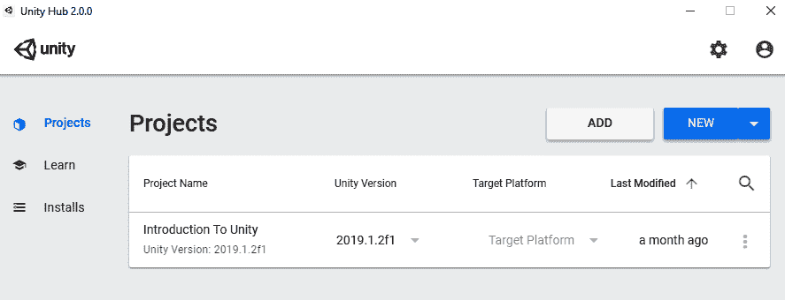

打开 Unity Hub 创建新项目

1.  给项目命名并指定位置，然后点击创建：

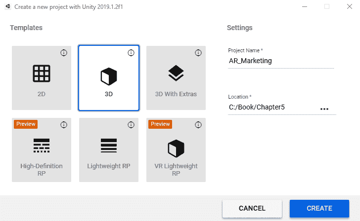

为项目命名和指定位置

1.  项目创建完成后，将 EasyAR 包导入 Unity。为此，解压压缩文件后，您可以直接双击生成的`.unitypackage`文件（最快的方式），或者从 Unity 内部，您可以通过点击 Assets|Import Package|Custom Package...并选择`.unitypackage`文件来完成。

1.  新窗口将显示 EasyAR 包内的所有文件。点击导入：


将 EasyAR SDK 导入 Unity

1.  正如您将看到的，四个新文件夹将出现在您的项目窗口中：EasyAR 和 Plugins，它们包括构建不同平台 EasyAR 所需的主要资源和代码，以及 Samples 和 StreamingAssets，它们包含示例资源和代码：

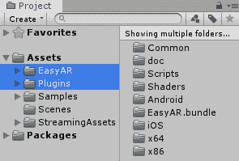

项目中已添加四个新文件夹

到目前为止，我们有一个包含 EasyAR 引擎和示例的新项目。在下一节中，我们将学习如何使用它来构建一个检测真实图像并在其上显示虚拟立方体的应用。

# 构建基于图像的 AR

您可以使用不同的技术构建 AR；最常见的一种是基于图像的 AR，它包括跟踪之前选定的图像（目标）并在其上叠加虚拟内容，同时考虑图像的位置、旋转和大小。这种跟踪需要使用不同的算法，这些算法通过设计的特征点区分图像，并将图像在相机流中定位到三维空间。别担心——EasyAR 会为您完成这项工作。您需要做的只是决定哪些图像将作为目标，以及哪些虚拟内容将叠加在其上。

为了创建这个项目，我们将使用 EasyAR 的 ImageTarget 示例项目作为参考，因为它已经包含了我们应用所需的所有组件。但在开始 AR 元素之前，我们将设置我们的项目文件夹：

1.  我们将要做的第一件事是创建我们的个人`资产`文件夹，`@MyAssets`，以区分我们导入到 Unity 中的其他资产。在这里，我们将添加所有外部资源，例如标记图像和 3D 模型。为此，在项目窗口上右键单击并选择创建|文件夹。将其命名为`@MyAssets`：

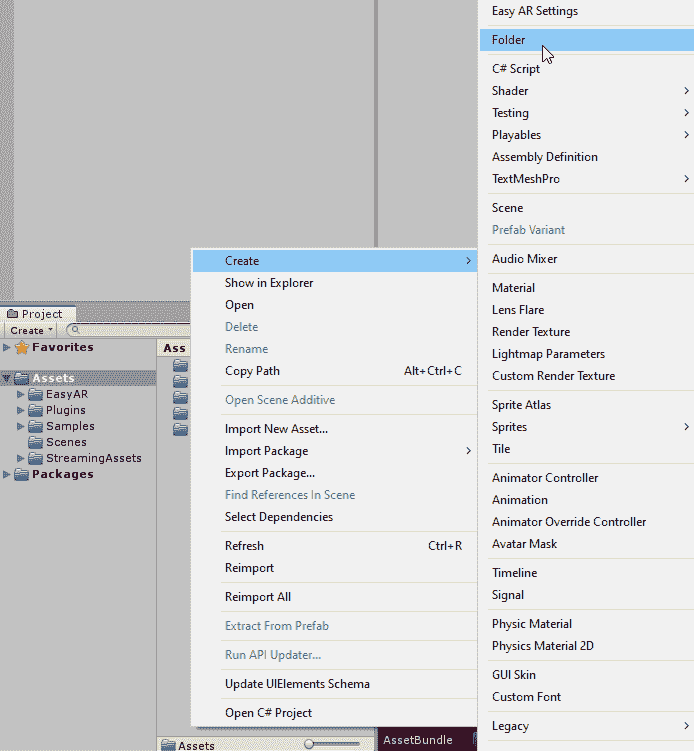

在主 Assets 文件夹下创建一个新的文件夹，并命名为`@MyAssets`

1.  在此内部创建三个其他文件夹，分别命名为`Images`、`Models`和`Scripts`：

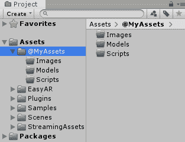

包含三个文件夹的@MyAssets 文件夹

注意：此项目目前在`Assets`文件夹下有六个文件夹。正如你所见，项目往往会迅速增长，在我们意识到之前，我们的资源就迷失在文件夹和文件的混乱之中。花几分钟时间为我们的项目文件夹创建一个基本结构总是一个好的做法。

1.  现在，我们可以创建我们的 AR 场景。正如我们之前提到的，我们将使用 EasyAR 的示例场景作为参考。为此，从项目窗口中，双击位于 Assets|Samples|Scenes 的 HelloAR_ImageTarget 场景以打开它：

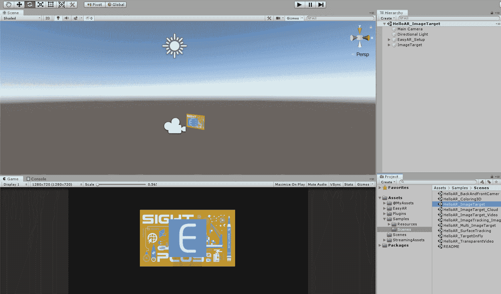

HelloAR_ImageTarget 示例场景

这里，我们有我们复制自己的 AR 项目所需的所有元素。

1.  现在，点击 File|Save As...并将场景保存到 Assets|Scenes 文件夹中，命名为`ARScene`：

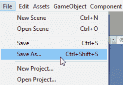

以另一个名称保存场景

通过这样做，我们已经创建了示例场景的副本。如果我们的场景发生任何问题，我们总是可以回到原始版本。

现在我们有了初始场景，我们可以查看每个组件并根据我们的需求进行定制。

# 理解我们的 AR 场景

一个 AR 场景有两个主要组件，这些组件是任何基于图像的 AR SDK 共有的：

+   **AR 相机**：将接收来自相机设备的输入并处理这些帧以搜索所选图像（目标）的相机对象。

+   **图像目标**：我们将虚拟元素放置其上的真实图像的表示。当相机在真实世界中找到此图像目标时，它将显示附加到其上的虚拟元素。

在 EasyAR 中，我们有三个主要元素（除了方向光之外）：

+   主相机，它是将渲染来自我们移动设备的图像的元素。

+   EasyAR_Setup，它负责应用的主要操作，例如初始化和操作 EasyAR 引擎，将物理相机设备附加到场景中的主相机元素，或通过 ImageTracker 实现图像目标检测和跟踪：

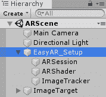

EasyAR_Setup 元素及其元素

+   ImageTarget，这是我们想要识别的图片的表示。它包含在真实世界中检测到或丢失时出现的虚拟元素。在这种情况下，ImageTarget 已经包含两个子项：一个 Quad，代表我们将要追踪的图片，和一个 Cube，我们将用它来最初测试场景。要识别的图片的值在 Image Target Controller 的检查器窗口中显示，如下面的截图所示：

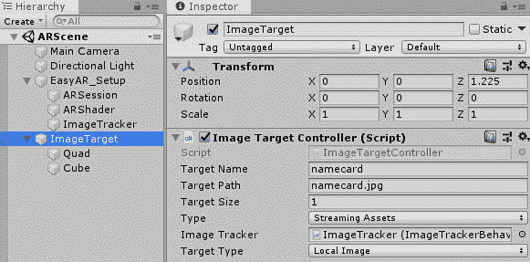

带有子项在左侧和组件值在右侧的 ImageTarget

Image Target Controller 中的参数如下：

+   目标名称：目标的名称。这不必是图片的名称。

+   目标路径：这是我们想要用作目标的图片的完整路径。它与`类型`选项直接相关。

+   目标大小：目标的大小。我们通常会将其设置为`1`。

+   类型：目标图片是否存储在项目的资源中（具体来说，是我们在项目窗口中已有的`StreamingAssets`文件夹）或者目标路径是否为绝对路径。

+   图像追踪器：这是将在相机流中搜索此 ImageTarget 的 ImageTracker。

+   目标类型：在这里，我们将使用第一个选项，本地图片，因为我们的图片将包含在项目内部。

现在我们已经看到了场景的主要元素，接下来我们需要做的是创建我们自己的目标。

# 准备目标

让我们创建我们的目标。我们首先需要将必要的图片和资源添加到我们的项目中。按照以下步骤进行操作：

1.  将位于`Images`文件夹中的`Target_Maia.jpg`图片从项目资源拖到`StreamingAssets`文件夹，并将`Target_Maia_texture.jpg`图片拖到我们的`@MyAssets/Images`文件夹，如下面的截图所示：

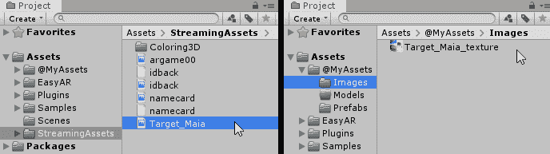

分别在各自文件夹中的`Target_Maia.jpg`和`Target_Maia_texture.jpg`图片

第一张图片将是我们的目标。我们将使用第二张图片，它比第一张小，来在编辑器中指导目标的大小。

我们不能重复使用`StreamingAssets`文件夹中的图片，因为该文件夹中的文件不会被 Unity 编辑器处理，因此不能像常规文件一样直接在场景中使用。

1.  在层次结构窗口中，选择 ImageTarget 并在检查器窗口中更改名称和路径值，如下面的截图所示：

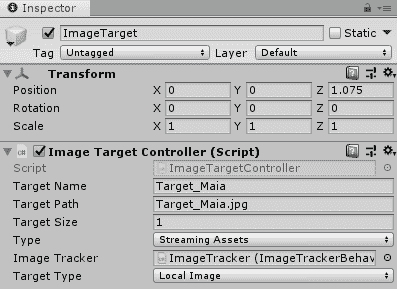

Image Target 行为参数

使用这些参数，我们告诉 ImageTracker 在项目的流媒体资源中寻找名为`Target_Maia.jpg`的目标。

注意：您可以使用`StreamingAssets`文件夹内的文件夹来组织您的目标。在这种情况下，您需要将文件夹添加到目标路径属性中（例如，`MyFolder/Target_Maia.jpg`）。

1.  ImageTarget 没有与之关联的图片，这意味着我们实际上在编辑器中看不到它。为了可视化我们的目标将看起来如何，特别是为了看到虚拟内容将如何覆盖真实图像（大小、位置），我们将使用 ImageTarget 的子对象中已有的四边形元素。在项目结束时，当我们不再需要它时，我们将删除这个四边形元素。将`@MyAssets/Images/Target_Maia_texture` 图片从项目窗口拖到四边形上，使其成为其纹理：

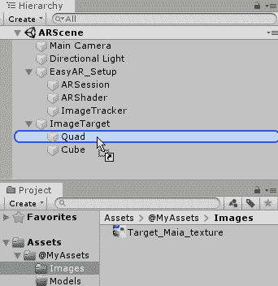

将 Target_Maia_texture 拖动到四边形

1.  现在，我们必须调整四边形的纵横比，使其与我们的图像的纵横比相匹配。我们将通过将 Y 缩放设置为`0.7`来实现这一点，如下面的截图所示：

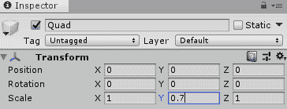

四边形的变换组件及其值

我们的场景已经准备好了。我们有了主相机、EasyAR_Setup，我们的 ImageTarget 中包含了我们要识别的图片的路径，以及四边形和立方体 作为子对象，这样当标记被识别时它们就会显示出来。接下来我们需要做的是获取 EasyAR 密钥来测试场景。

# 获取密钥

要测试当前场景，我们需要将密钥添加到 EasyAR GameObject 中。这个密钥由 EasyAR 生成以许可应用程序：

1.  前往 EasyAR 开发中心([`www.easyar.com/view/developCenter.html#license`](https://www.easyar.com/view/developCenter.html#license))，如果你还没有登录，请登录，然后点击添加 SDK 许可证密钥。

1.  在那里，选择 EasyAR SDK Basic，并填写以下详细信息：

+   应用程序名称: `AR Catalogue`

+   包标识符（iOS）: `com.banana.arcatalogue` （如果你打算在 iOS 上构建你的应用程序，则需要填写此信息）

+   包名（Android）: `com.banana.arcatalogue` （如果你打算在 Android 上构建你的应用程序，则需要填写此信息）

这些名称对应于 Unity 中的应用程序名称和包（*com.companyname.productname*）。

如果你将来想要更改这些名称，你将必须确保在密钥生成面板中更改它们，并将生成的密钥复制/粘贴回 Unity 中。

1.  在面板中选择创建的密钥，并将 SDK 许可证密钥（适用于 EasyAR SDK 3.x）复制到位于 Assets|EasyAR|Common|Resources 的 Easy AR Key 元素中：

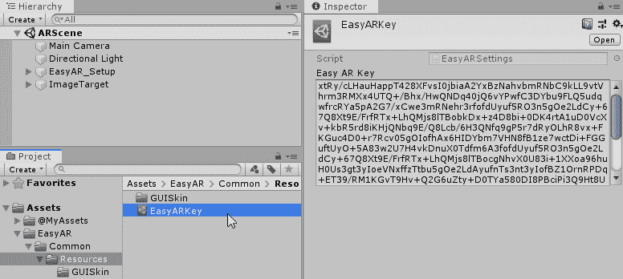

EasyARKey 设置脚本

一旦我们有了密钥，我们就可以测试场景了。

# 测试场景

现在，让我们测试场景：按*Ctrl* + *S* 保存所有内容，确保你的电脑连接了摄像头，然后在工具栏顶部点击播放按钮。系统应该会自动启动摄像头。如果你指向标记（无论是打印的还是显示在屏幕上的），你应该在游戏视图中看到背景中的四边形和从它弹出的立方体：

要以全屏模式查看场景，你可以在按下播放按钮之前，在游戏视图的右上角点击最大化。

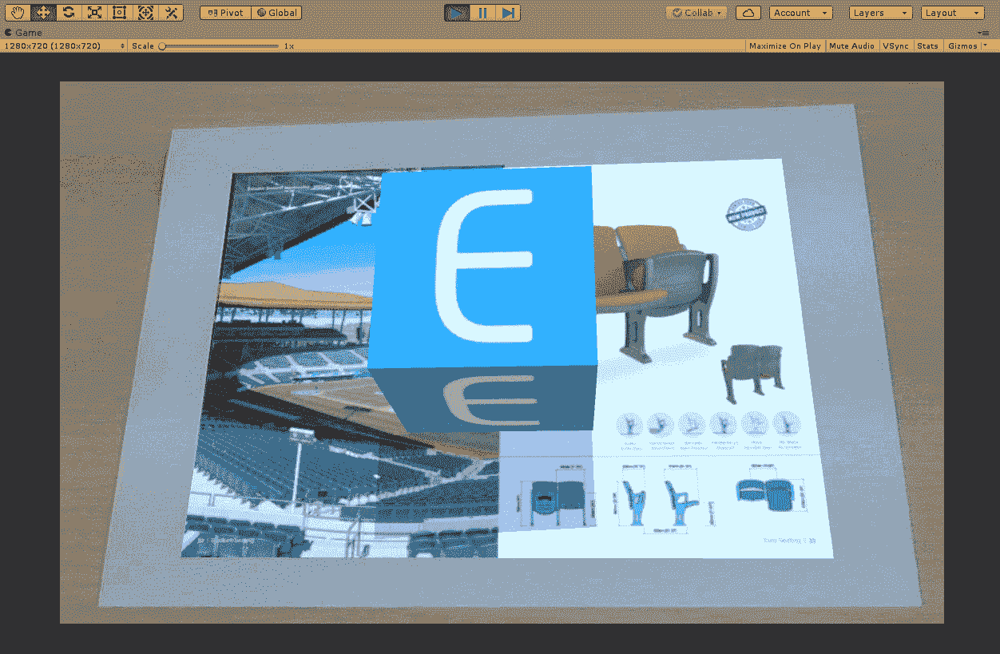

游戏窗口最大化，显示在目标上出现的立方体

再次点击播放按钮以停止模拟。

**重要！** 请记住，在模拟模式下，要停止模拟或对场景所做的任何更改，点击播放按钮后都不会被保存。

# 故障排除

如果你看不到 AR 场景，你可以转到“控制台”选项卡（它在底部栏或“游戏”视图旁边的标签上）并查看那里的信息。

如果一切正常，它应该只显示信息消息，即 EasyAR 成功初始化、其版本等信息。然而，如果出现 404 未找到的错误消息，这意味着目标没有正确设置。请检查所有步骤，特别是 ImageTarget 中的 Path 参数，确保它指向正确的文件。在以下屏幕截图中，目标名称是`Target_Maia2.jpg`而不是`Target_Maia.jpg`：


显示常见信息消息和错误的控制台

在任何情况下，你都可以尝试在 Unity 论坛([`forum.unity.com/`](https://forum.unity.com/))或 EasyAR 论坛([`forum-test.easyar.com/`](https://forum-test.easyar.com/))中调试错误。

测试场景的这一步不是必需的，尽管强烈推荐。将应用构建到设备上需要时间，因此建议先测试它，确保它按预期工作。

现在，让我们构建这个应用。

# 构建应用

要构建新的安卓应用，有一些步骤你始终必须遵循：

1.  你需要做的第一件事是选择平台。为此，点击文件|构建设置。

1.  点击“添加打开场景”将我们的当前场景添加到（空）将要构建到应用中的场景列表中。

1.  在“平台”下，选择 Android 并点击“切换平台”。等待 Unity 为所选平台重新编译资源： 

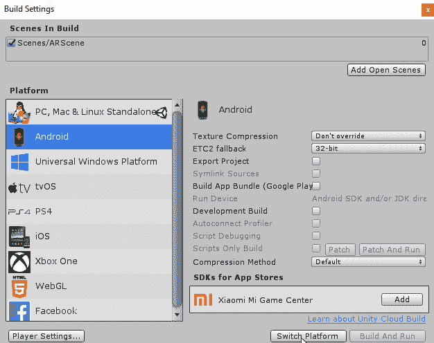

包含当前场景和已选择 Android 平台的“构建设置”窗口

1.  然后，点击“玩家设置...”以配置应用设置。在弹出的窗口中，我们暂时会更改一些设置：

+   公司名称: `Banana`

+   产品名称: `AR 目录`

这些名称与我们用于生成 EasyAR 密钥代码时使用的名称相同。

以下图像显示了包含新添加的公司名称和产品名称字段的“项目设置”窗口：

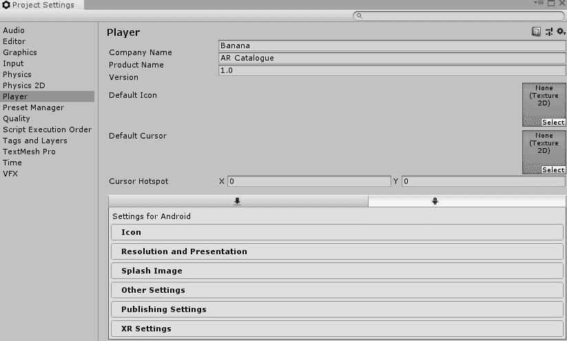

在项目设置中填写公司和产品名称

1.  然后，在“其他设置|识别”中，设置以下内容：

+   包名: `com.banana.arcatalogue`（确保它与 EasyAR 密钥生成中的名称匹配，否则应用在初始化时会报错，说包名不匹配密钥）

+   版本: `1.0`

+   最小 API 级别: `Android 5.0 'Lollipop' (API level 21)`

+   目标 API 级别: `自动（最高已安装）:`

根据 EasyAR 的文档，SDK 与 Android 4.2 及以上版本兼容，但出于性能原因，并且为了在用户设备上获得流畅的 AR 体验，我们建议将最低 API 级别设置为 5.0。

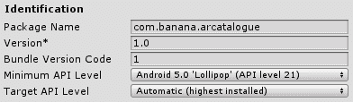

其他设置选项卡内的识别部分

1.  如果您在 Unity 外部安装了 Android SDK，在打开 Player Settings 之前，Unity 很可能告诉您它找到了 Android SDK，并询问您是否想使用它。如果是这种情况，请点击 是：

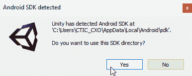

如果我们已经安装了 SDK，则使用已安装的 SDK

1.  关闭 Player Settings 窗口，使用 USB 线缆将您的移动设备连接到计算机，并确保您的设备已激活 USB 调试，以便可以直接从 Unity 将应用程序部署到其中。要激活此选项，一般步骤如下：

+   通过转到设置|关于设备启用开发者模式。

+   然后，连续点击七次构建号，直到出现一个通知，表明开发者选项可用。

+   前往开发者选项并激活 USB 调试，以允许计算机安装并启动应用程序。

**重要！** 如我们之前提到的，这些步骤是通用的。如果您有任何疑问，请尝试找到您设备的特定情况，因为选项的名称可能因制造商而异。

+   现在，在 Build Settings 窗口中点击 Build And Run，将您的 APK 命名为 `arcatalogue.apk`，然后点击保存。Unity 将立即开始编译，寻找 Android SDK (*如果它没有检测到，它将要求您选择其安装的文件夹*)* 并搜索合适的设备（如果设备没有正确连接或未激活 USB 调试，它将告诉您找不到设备）。然后，它将开始构建过程，直到将 APK 复制到设备并启动它。

+   一旦应用启动，将摄像头指向目标，以便看到立方体：

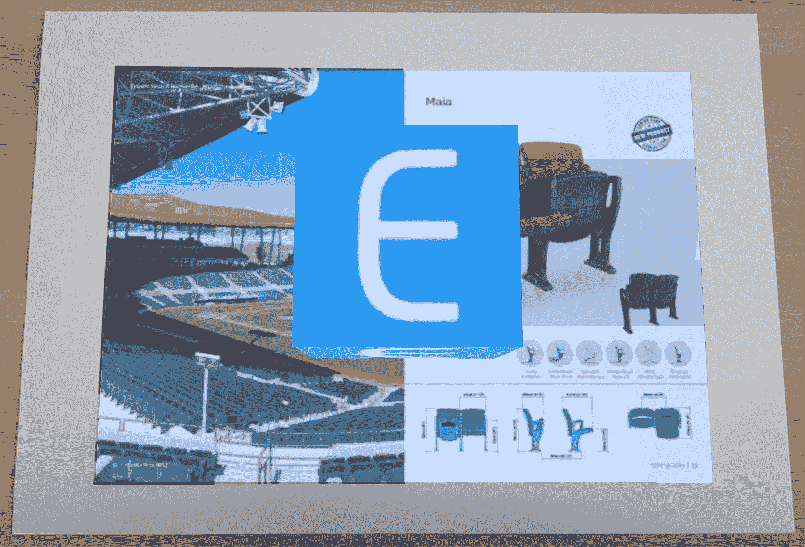

移动设备上目标上的立方体截图

如果由于任何原因，您不想/不能将 APK 建立到移动设备中，您可以使用 Build 而不是 Build And Run 来创建 APK 而不安装它。

当编译过程完成后，您将需要手动将生成的 APK 复制到您的设备并安装它。

注意：此过程仅适用于 Android 设备。要在 iOS 设备上编译应用程序，您必须从 Apple 计算机上构建和运行 Unity 项目，当构建过程完成后，它将自动启动 Xcode，构建过程将在其中结束（您将需要分配您的 Apple ID 才能在 iOS 设备上播放应用程序，就像您需要使用任何其他在 Xcode 中开发的 iOS 应用程序一样）。

在本节中，你学习了如何使用 EasyAR 检测图像并在其上显示虚拟立方体。现在，我们将用我们将导入到项目中的外部 3D 模型替换测试立方体。

# 使用自定义 3D 模型

在上一节中，我们学习了如何使用 EasyAR 创建一个简单的 AR 应用来显示立方体。在本节中，我们将将自己的 3D 模型导入到 Unity 中，以便在目标上可视化并玩弄其材质和纹理。

对于这个项目，我们将使用`fbx`，这是一种允许我们包含材质、纹理和动画的导出格式。要查看 Unity 接受的所有导出和本地 3D 格式的列表，请访问[`docs.unity3d.com/Manual/3D-formats.html`](https://docs.unity3d.com/Manual/3D-formats.html)。

在将模型包含到我们的项目中之前，我们将对我们的场景进行一些修改以改进它：

1.  在“层次”窗口中选择“方向光”。然后，在检查器窗口中，将阴影类型设置为无阴影。阴影非常消耗资源，在这种情况下，AR 体验将受益于没有阴影：

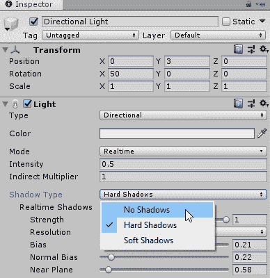

检查器窗口中的方向光属性

1.  现在，选择“ImageTarget”并更改其变换值，使其在 x 轴上旋转。这样，在场景中，物体将看起来是从地面弹出的：

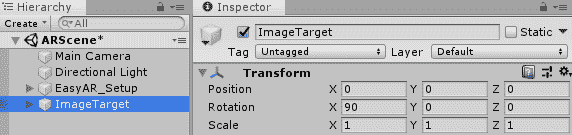

ImageTarget 变换值

1.  最后，选择“主相机”并旋转和移动它，使其指向目标：

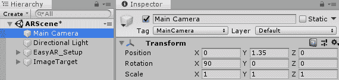

主相机变换值

现在，是时候包含 3D 模型了。让我们开始吧：

1.  在“层次”窗口中，通过右键单击“Cube”并选择“删除”，或者直接选择它并按键盘上的*Delete*键来从“ImageTarget”中删除“Cube”：

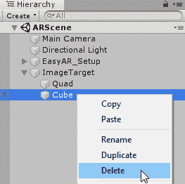

删除“Cube”模型

1.  将提供的代码资源中的`Models/Maia`文件夹拖动到项目窗口中的`@MyAssets/Models`。这将导入`.fbx`网格对象及其位于`textures`文件夹中的纹理文件，如下面的截图所示。

1.  将`maia.fbx`文件拖动到“ImageTarget”中。请记住确保它在“ImageTarget”内部，这样它就会在目标出现/消失时出现/消失。移动、旋转和缩放模型，直到它在目标上看起来很好：

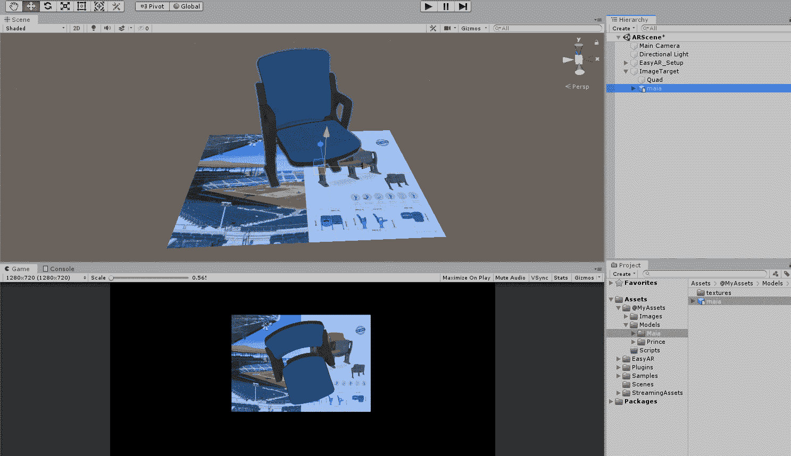

目标内的“maia”模型

1.  现在，点击工具栏顶部的播放按钮来测试当前场景。当目标被检测到时，座椅将出现：

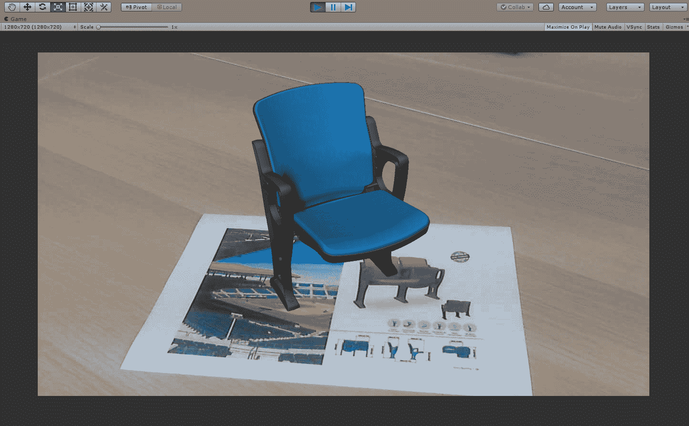

当目标被检测到时，座椅出现

1.  再次点击播放按钮停止模拟，然后保存场景（*Ctrl* + *S*）。将移动设备连接到计算机，按 *Ctrl* + *B*，或者转到文件|构建设置|构建并运行，以将应用程序构建到设备中。

现在我们已经有了基本 AR 场景，在下一节中，我们将通过添加另一把椅子和创建 UI 来允许用户与我们的家具进行交互来创建我们的 AR 目录。

# 创建 AR 目录

现在我们已经创建了基本场景，我们将创建一个小的 AR 目录：

+   我们将使用两个 ImageTargets 来展示两把不同的椅子。

+   我们将允许用户在查看椅子时更改椅子的颜色。

# 修改 AR 场景

在本节中，我们将通过添加一个新的 ImageTarget 来修改当前的 AR 场景。为此，我们将遵循与上一节相同的步骤：

1.  从项目资源中，将`Target_Prince.jpg`图像拖到`Assets/StreamingAssets`文件夹中。

1.  然后，将`Target_Prince_texture.jpg`图像拖到`Assets/@MyAssets/Images`文件夹中：

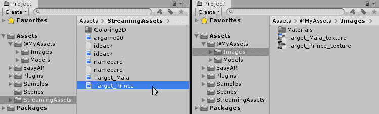

Target_Prince 和 Target_Prince_texture 在各自的文件夹中

1.  然后，将包含模型的`Prince`文件夹拖到`Assets/@MyAssets/Models`中：

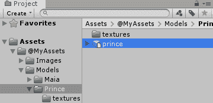

王子模型

1.  右键单击 ImageTarget 并选择复制，这样我们就可以将其用作新 ImageTarget 的模板：

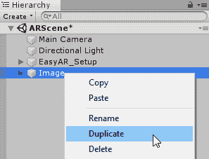

复制 ImageTarget

1.  将第一个 ImageTarget 重命名为`ImageTargetMaia`，当前的一个重命名为`ImageTargetPrince`，以便您可以区分它们。将它们在场景中移动，以便它们不会重叠。

1.  将以下目标名称和路径参数复制到检查器窗口中的 ImageTargetPrince 的图像目标控制器中：

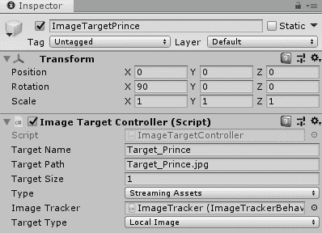

图像目标控制器参数

1.  将`Target_Prince_texture.jpg`图像从`Assets/@MyAssets/Images`文件夹拖到项目窗口中的 Hierarchy 窗口的 ImageTargetPrince 的 Quad 上，以便将其作为纹理应用。

1.  从 ImageTargetPrince 中删除 maia 模型（右键点击并删除）并将王子模型拖到那里。

1.  将王子模型移动、旋转和缩放，直到它在标记的中间位置，看起来很合适。

以下截图显示了我们的场景，其中包含两个 ImageTargets 及其相应的座位：

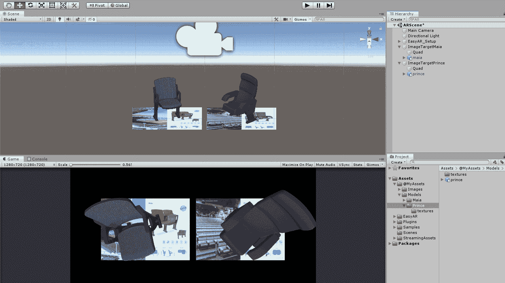

包含两个目标和模型的场景

1.  在测试我们的场景之前，让我们隐藏 Quad 对象，这样它们就不会出现在 AR 中，我们只能看到椅子。为此，选择两个 Quad 游戏对象（使用*Ctrl* + 左键点击进行多选）并取消选中它们的 Mesh Renderer 组件：

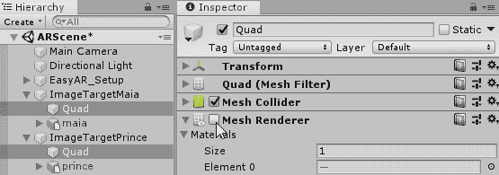

隐藏 Quad 游戏对象

1.  现在，按播放键以测试一切设置是否正确。用摄像头指向一个目标，然后指向另一个目标，以查看椅子。

1.  再次按播放键以停止模拟并继续进行更改。

1.  目前，EasyAR_Setup GameObject 的 ImageTracker 已被设置为一次只检测一个标记。让我们将此值增加到`2`，以便我们的用户可以一起看到两张椅子：

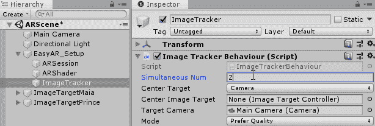

改变同时目标数量

现在，测试一下——你应该会看到两张椅子同时出现。

下一步，我们需要创建一个脚本，允许用户更改座椅的纹理。

# 创建控制器脚本

在本节中，我们将创建一个脚本，该脚本将控制场景并允许我们的用户更改座椅的纹理。让我们开始吧：

1.  在@MyAssets|Scripts 中，通过右键单击并选择创建|新 C#脚本创建一个新的 C#脚本。命名为`MainController`，然后双击它以在 Visual Studio 中打开：

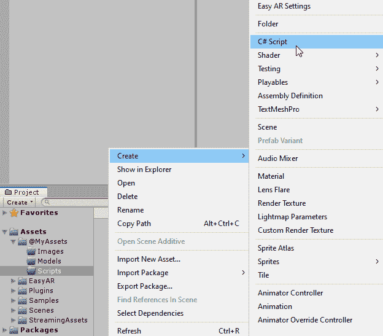

在@MyAssets/Scripts 文件夹中创建一个新的 C#脚本

1.  如果你按照第二章中介绍的步骤安装 Unity，即《AR 开发入门》，你将已经安装并配置了 Visual Studio，并且它将以默认代码打开脚本，如下面的截图所示：

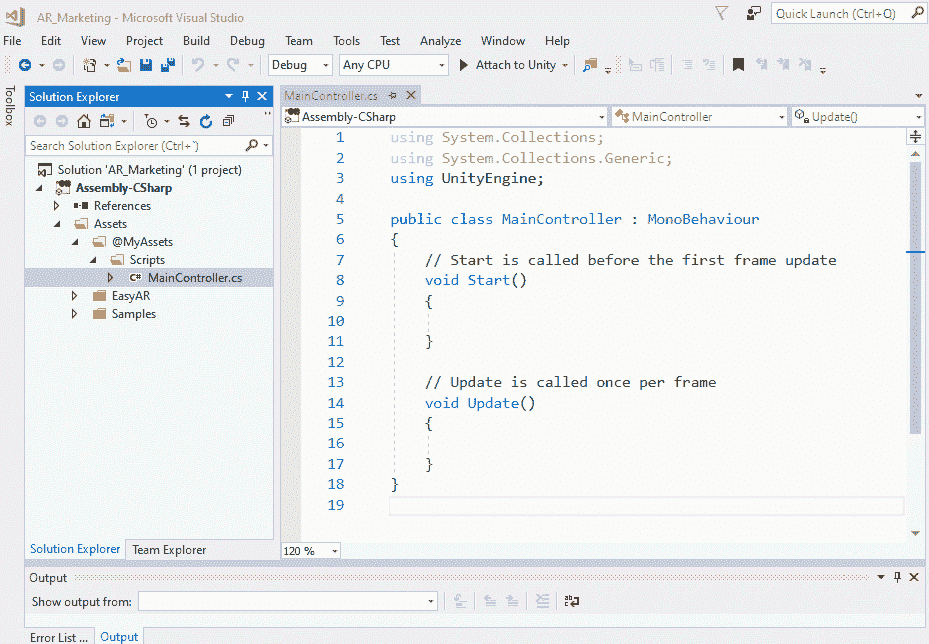

Visual Studio 中的 MainController 脚本

1.  如果你是在安装 Unity 之前安装了 Visual Studio 或者使用了其他程序如 MonoDevelop，你可以通过点击编辑|首选项|外部工具|外部脚本编辑器来配置 Unity 使用它打开脚本，如下面的截图所示：

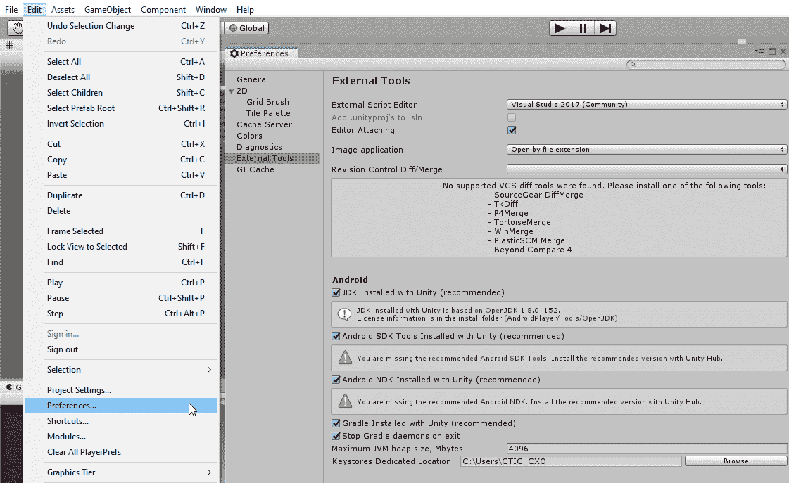

将 Visual Studio 分配为外部脚本编辑器的首选项窗口

1.  在脚本中，首先在类声明之后添加以下行：

```cs
public class MainController : MonoBehaviour
{
    public Material[] materials; 
 public Texture2D[] textures; 
... 
```

在这里，我们正在声明`materials`数组，这是我们存储两张椅子材质的地方。我们将用它来改变这些材质的纹理属性。`textures`数组将包含我们将应用到这些材质的实际图像（红色和蓝色）。这两个变量都是公开的，因为我们将从 Unity 编辑器初始化它们。

1.  在`Start()`方法内部，添加以下循环：

```cs
foreach (Material material in materials)
{
    material.mainTexture = textures[0];
}
```

通过这个循环，我们将`materials`数组中的每个材质分配给`textures`数组中的第一张图像。

1.  在`Update()`方法之后，我们将创建一个新的方法：

```cs
public void ChangeColor()
{
    foreach (Material material in materials)
    {
        if (material.mainTexture == textures[0])
            material.mainTexture = textures[1];
        else
            material.mainTexture = textures[0];
    }
}
```

此方法更改椅子的材质纹理（红色或蓝色）。它检查哪个纹理被选中，并将另一个分配给两张椅子。

1.  现在，回到 Unity 编辑器，将脚本拖到 EasyAR_Setup GameObject 上，以便脚本影响当前场景。

记住，只有当脚本附加到场景中的一个 GameObject（或多个）时，它才会被执行。否则，它只存在于项目窗口中，但不在实际场景中。

由于此脚本没有直接引用它附加到的元素，它可以应用于场景中始终处于活动状态的任何元素（因此它始终可用）。我们将其放在 EasyAR_Setup 中，因为它是一个满足此规则的根元素。

1.  展开脚本的两个变量，即材质和纹理，然后在材质中设置大小为`2`并选择 tela 和材质#5。这些是每个模型中对应布料的材质：

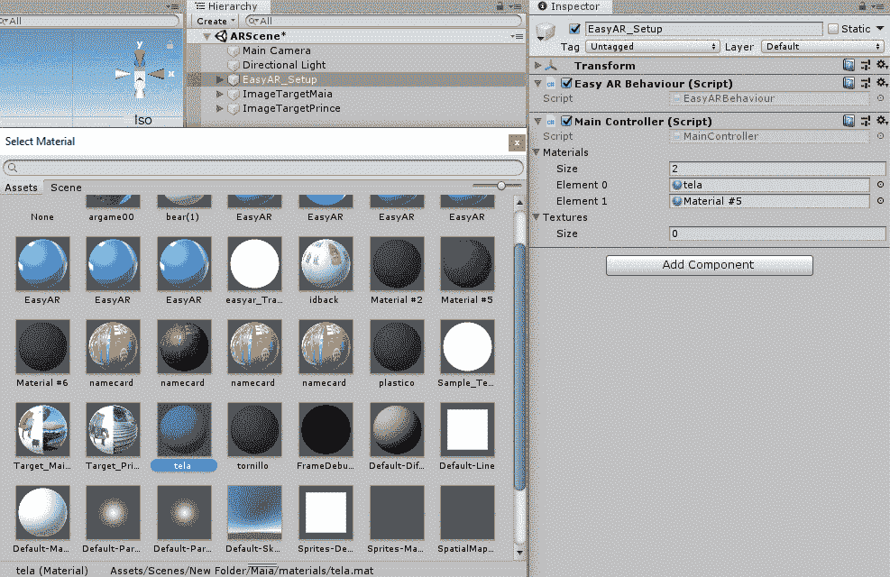

分配材质到变量

1.  在纹理中，将大小设置为`2`并选择红色和蓝色元素，即 Acapulco 3011 和 Acapulco PANTONE 2935 C：

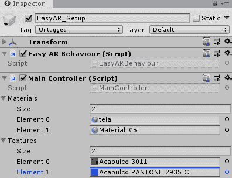

将纹理分配给变量

控制器脚本已准备就绪。现在，我们必须创建用户界面和按钮，该按钮将通过我们刚刚创建的`ChangeColor()`方法触发颜色变化。

# 创建界面

让我们创建一个简单的界面，以便我们的用户可以更改他们看到的 AR 对象的特性。让我们开始吧：

1.  首先，在层次结构窗口中右键单击并选择 UI|Canvas。Canvas 元素是 Unity 界面上的主要元素，包含所有其他元素：

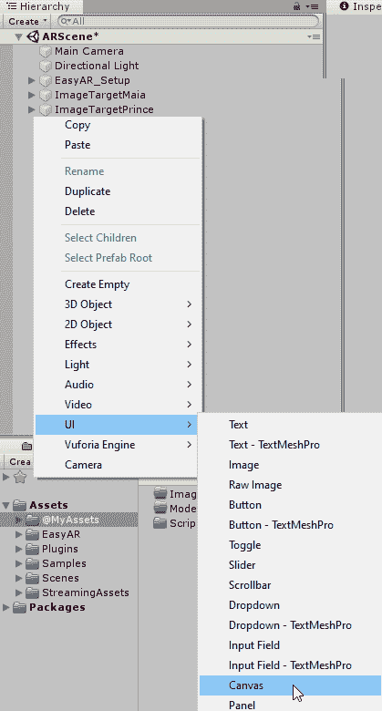

在场景中创建 Canvas 元素

1.  默认情况下，画布位于(0,0)点，朝后，覆盖整个 3D 场景，并且具有当前屏幕大小。在层次结构窗口中双击其名称，以便场景聚焦于它。

1.  在检查器窗口中，为 Canvas Scaler 包含以下值：

+   UI 缩放模式：按屏幕大小缩放。使用此参数，我们正在告诉画布根据不同的屏幕大小进行适应（在为不同移动设备编译时很有用）。

+   对于参考分辨率，我们将使用`1280` x `720`。

+   屏幕匹配模式允许我们根据屏幕的宽度和/或高度调整 UI 元素。值为`0.5`表示它将适应两者：

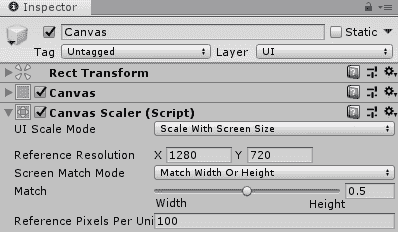

检查器窗口中的 Canvas Scaler 值

要操纵 UI 元素（移动、缩放等），在工具栏中选择它们的特定工具：


1.  我们将使用一个图标作为我们的颜色按钮。为此，将`circle_icon.png`图像导入到`Assets/@MyAssets/Images`。在项目窗口中选择它。然后，在检查器窗口中，修改其纹理类型，使其为 Sprite（2D 和 UI），以便在 UI 中使用。然后按应用以保存此更改：

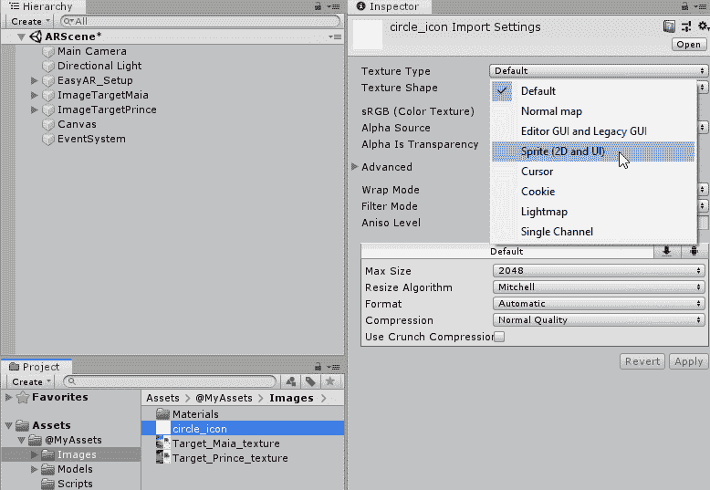

将 circle_icon 转换为精灵图像

1.  现在，在层次结构窗口中右键单击 Canvas 并选择 UI/Button：

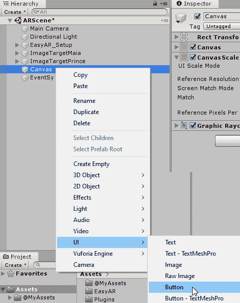

在 Canvas 元素内创建按钮

1.  我们不需要按钮附带的自带文本组件，因此右键单击它并删除它：

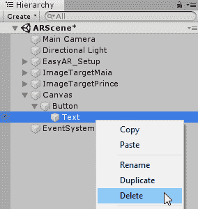

删除按钮的文本组件

1.  将按钮的名称更改为 `Color_button` 并将其之前导入到其 Image 组件中的图标分配给 Source Image。点击 Preserve Aspect 复选框以确保它始终是圆形的：

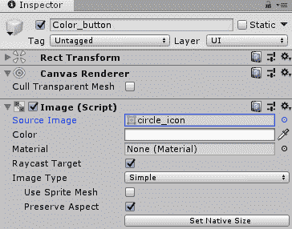

在检查器窗口中的 Color_button 图像组件

1.  现在，让我们将按钮放置在屏幕的右上角。对于 Rect Transform 组件，点击正方形并选择右上角选项以移动按钮的锚点：

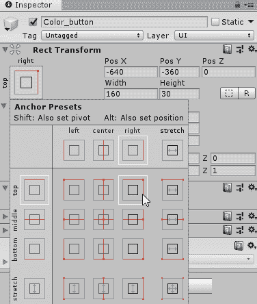

为按钮选择右上角锚点

1.  然后，将 PosX、PosY、Width 和 Height 值更改为调整按钮的位置和大小，如下所示：

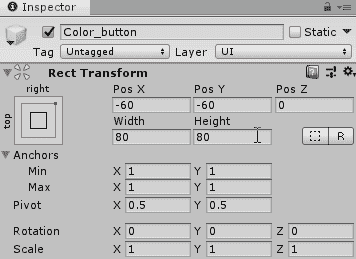

按钮的新 Rect Transform 值

1.  现在，在按钮被选中后，在检查器窗口的 Button 组件下，转到 `On Click ()` 方法并按 + 符号创建一个新动作：

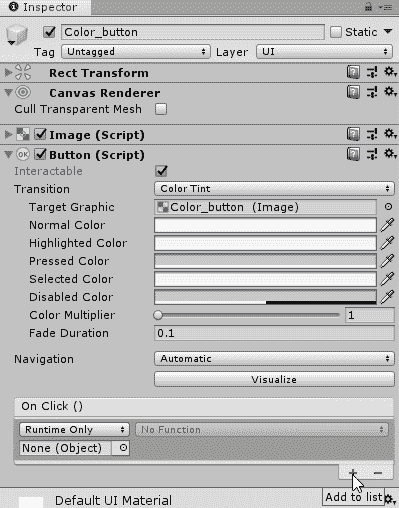

在 On Click() 方法中创建一个新动作

1.  从层次结构窗口中将 EasyAR_Setup 元素拖动到 None (Object) 框中，然后从右侧的下拉菜单中选择 MainController|ChangeColor。通过这样做，我们告诉 UI，每当 Color_button 被按下时，附加到 EasyAR_Setup GameObject 的 `MainController` 类的 `ChangeColor()` 方法将被执行：

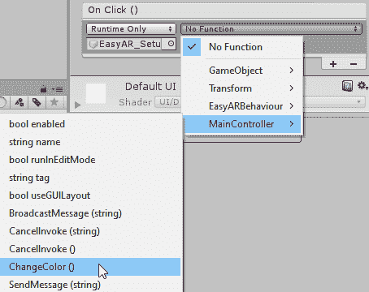

为 Color_button 选择 ChangeColor() 方法

1.  播放场景以测试它。你会看到当你点击 Color_button 时，椅子的纹理会改变。然而，还有一个小的细节：按钮不够直观，因为它不会改变自己的颜色。为了解决这个问题，我们将在 Visual Studio 中的代码中添加几行。

1.  返回 Visual Studio 并在 `MainController` 脚本中在文件开头导入 `UnityEngine` `UI` 库：

```cs
using UnityEngine.UI;
```

1.  在 `Start()` 方法之前添加以下变量：

```cs
public Image color_button;
private Color32 red = new Color32(159, 40, 40, 255);
private Color32 blue = new Color32(40, 74, 159, 255);
```

我们将使用第一个来分配 Unity 编辑器中的按钮（这就是为什么它是 `public` 的），以及两个颜色作为参考。

1.  在 `Start()` 方法中的循环段之后添加以下行以初始化按钮为 `红色`：

```cs
color_button.color = red;
```

1.  在 `ChangeColor()` 方法内添加以下行：

```cs
if (color_button.color == red)
 color_button.color = blue;
else
 color_button.color = red;
```

在这里，我们告诉按钮评估当前颜色，如果它是 `红色`，则将其更改为 `蓝色`，反之亦然。这样，按钮的颜色将与座椅的纹理同时改变。

1.  最后，在 Unity 编辑器中，将 Color_button GameObject 拖动到 `EasyAR_Setup` GameObject 上的 Color_button 变量以分配它：

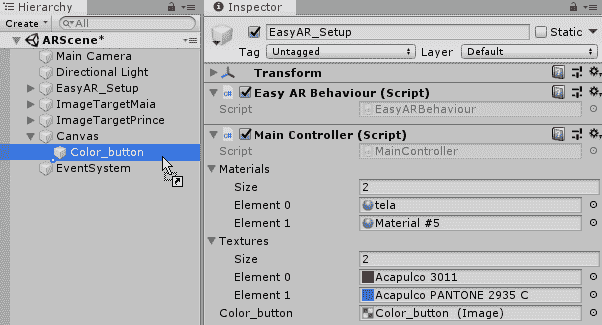

将 Color_button GameObject 拖动到主控制器的最后一个变量

1.  在编辑器中保存并测试场景，以查看按钮最初如何改变颜色以及每次按下时如何改变颜色。

1.  现在，在你的移动设备上构建并运行该应用，享受看到座位在 AR 中如何生动起来的过程：

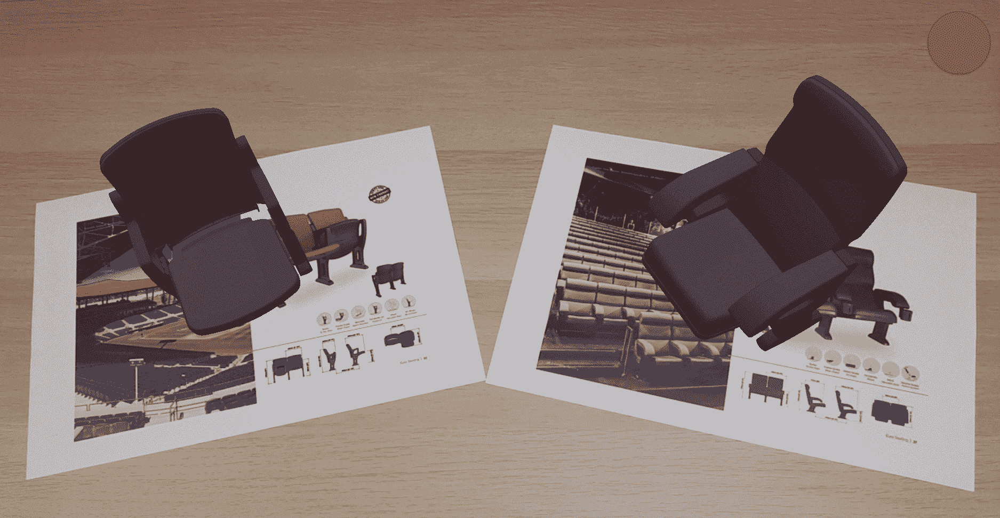

手机截图显示两个座位都是红色

你可以围绕座位移动相机，靠近它们，或将目标移动以查看它们的细节。你可以按颜色按钮来切换它们的纹理颜色。现在应用已经完成，你甚至可以删除场景中的四边形平面，因为它们不再需要。有了这个，你的项目就准备好了。

# 摘要

在本章中，你学习了如何使用 EasyAR SDK 创建 AR 目录。你学习了如何将 SDK 导入 Unity 并创建一个显示在 ImageTarget 上的场景。然后，你学习了如何从 Unity 外部导入模型并修改它们的一些功能，例如材质和纹理。然后，你将模型合并到初始场景中，使目录中的座位栩栩如生。最后，你添加了一个脚本和 UI 元素来控制模型的颜色。

到本章结束时，你已经掌握了使用 EasyAR 继续开发的基本技能，并尝试了其一些其他功能。为此，我们建议打开位于“资产 | 示例 | 场景”的其余样本场景并尝试它们，以了解它们是如何工作的。你还了解了如何使用 AR 创建用于营销的目录、杂志或类似产品。你现在可以改进这个项目，例如，将产品与电子商务链接起来，为消费者提供完整的体验并吸引他们购买你的产品。你现在可以使用基本工具来创建自己的 AR 营销体验。

在下一章中，你将学习如何使用另一个 SDK，Vuforia，将相同的座位模型放置在真实环境中，而不是使用 ImageTargets。你将学习如何使用 Vuforia 的地面平面功能在平坦的表面上放置和操作 3D 模型，例如在桌子上或地面上，以创建一个交互式零售体验。
