# 使用 Vuforia 的 AR 零售

在本章中，你将使用 Vuforia，这是最著名的 AR SDK 之一，它提供了广泛的选择（包括与图像目标一起使用和不使用图像目标、网络和本地识别等），以及可以直接下载和测试的示例。它还具备集成到 Unity 编辑器的优势，这使得使用它进行开发更加容易。

本章的第一个主要目标是向你介绍 Vuforia SDK 及其工作原理。在其众多功能中，你将学习如何使用空间识别和增强现实将 3D 对象放置在现实世界中，而无需预先打印的图像目标。你将学习如何使用 Vuforia 融合技术与 ARCore 结合或不结合使用，并掌握在 Unity 中使用 Vuforia 元素的能力。本章的第二个目标是向你展示 AR 在零售中的吸引人应用，展示潜在客户如何在自己的空间中查看家具、画作、装饰品等产品。通过这类应用，他们可以决定想要购买哪些元素，以及它们在自己家中将如何呈现，使他们更多地参与到购买过程中。

在本章中，我们将涵盖以下主题：

+   使用 AR 进行零售

+   探索 Vuforia

+   移动中的 AR – 使用地面平面

+   创建 AR 家具查看器

# 技术要求

本章的技术要求如下：

+   一台支持 Unity 3D 的计算机（请参阅最新的要求：[`unity3d.com/unity/system-requirements`](https://unity3d.com/unity/system-requirements)）。本章的示例项目是在 Windows 10 x 64 计算机上开发的。

+   Unity 3D（本书中为 2019.1.2f1 版）。

+   Microsoft Visual Studio Community 2017（包含在 Unity 安装中）。

+   Unity 3D 中包含的最新版本的 Vuforia（本书中为 8.3.8 版）。

+   一款支持 Vuforia Fusion 的移动设备（请参阅[`library.vuforia.com/content/vuforia-library/en/articles/Solution/ground-plane-supported-devices.html`](https://library.vuforia.com/content/vuforia-library/en/articles/Solution/ground-plane-supported-devices.html)）。

本章的资源和相关代码文件可以在以下位置找到：[`github.com/PacktPublishing/Enterprise-Augmented-Reality-Projects/tree/master/Chapter06`](https://github.com/PacktPublishing/Enterprise-Augmented-Reality-Projects/tree/master/Chapter06)。

# 使用 AR 进行零售

零售是 AR 提供更广泛可能性之一的领域，从满足和吸引消费者以减少退货产品，到将产品与社交媒体链接或个性化购物体验。以下是一些例子：

+   在购买之前尝试产品。这是用户在真正购买产品之前可视化衣服、鞋子、眼镜甚至化妆品的地方。

+   通过 AR 看看家具、艺术品或甚至墙面涂料在家中的样子。

+   在商店，在购买之前查看有关产品的额外信息，例如评论和评价。

+   在购物中心，接收来自其中商店的地理位置信息和折扣。

+   在超市或大型商店中，通过区域引导客户到他们想要的产品。

这个领域还允许我们在各种硬件上显示 AR，包括客户的移动设备、触觉屏幕和虚拟试衣间。因此，在过去的几年里，零售业的 AR 解决方案数量激增，尤其是在 ARKit（来自苹果）和 ARCore（来自谷歌）进入市场之后。这两款软件使我们能够利用移动设备的摄像头和传感器轻松识别环境，并在地面或桌子等平坦表面上放置虚拟元素。

在本章中，我们将利用 Vuforia Fusion，Vuforia SDK 的地形检测功能，该功能还可以与 ARCore 结合使用，在我们的周围环境中放置虚拟对象，而无需任何类型的打印目标，创建一个客户可以用来查看家具如何融入他们家庭的 AR 家具查看器。

对于我们的项目，我们将使用来自 Euro Seating 公司的真实目录页面和 3D 模型，该公司在全球 100 多个国家设有业务。[`www.euroseating.com/en/`](https://www.euroseating.com/en/)，一个座椅制造商。使用他们的高质量 3D 模型和真实目录将帮助我们把这个项目可视化为一个真实的 AR 应用，可以在任何其他营销环境中使用。本章中使用的模型和图像已由该公司转让，用于本书的上下文中。

我们将首先探索 Vuforia 以及如何将其集成到我们的 Unity 项目中。

# 探索 Vuforia

Vuforia 最初由高通公司开发，目前由 PTC 运营，是历史最悠久且最知名的 AR SDK 之一。它是市场上最稳定和性能最好的软件之一，与 ARKit 和 ARCore 一起，是 AR 开发者的首选之一。

Vuforia 提供了一系列功能，包括 2D 图像和 3D 对象跟踪、无需参考图像即可启动 AR 内容的无标记 AR（本章我们将使用）以及类似条形码的标记称为 Vumarks。它提供了多个示例和额外功能，如虚拟按钮、运行时图像目标创建和背景视频纹理操作。

与其他 AR 软件一样，Vuforia 需要在移动设备上部署时需要许可证。Vuforia 提供免费的开发密钥生成器，当应用处于生产阶段时，必须将其切换为部署密钥。您可以在他们的网页上查看其定价选项：[`developer.vuforia.com/pricing`](https://developer.vuforia.com/pricing)。

Vuforia SDK 可以下载用于 Android 和 iOS，并且也可以在 Unity 3D 平台上使用。自 Unity 2017.2 版本以来，它直接集成到 Unity 编辑器中，就像任何其他主要资源一样，并且必须在其中安装和激活。现在，我们将 Vuforia 集成到一个新项目中，并设置它以便可以在 Android 设备上构建。让我们开始吧：

1.  当您第一次在计算机上安装 Unity 时（见 第二章，*Unity AR 开发入门*），您应该选择了添加 Vuforia 模块选项。如果您没有安装它或者您不确定，请打开 Unity Hub，转到 安装 标签页，并检查您 Unity 版本底部的已安装模块：

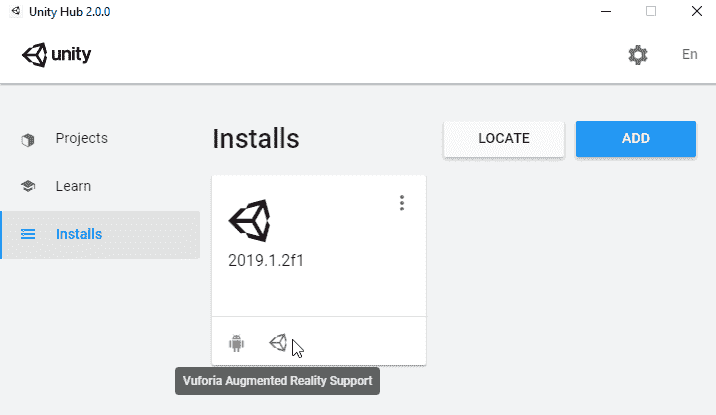

当前带有 Vuforia 支持的 Unity 安装

1.  如果 Vuforia 不在那里，点击右上角的按钮，然后点击 Add Modules。选择 Vuforia 并安装它：

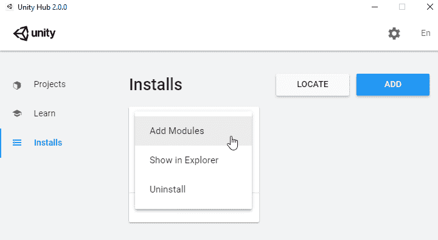

使用 Unity Hub 向当前 Unity 安装添加新模块

Vuforia 通常包含在稳定版本中；如果您正在尝试测试版或非常新的 Unity 版本，那么 Vuforia 可能不会出现在选项中，您可能需要安装一个旧版本才能使用它。

1.  现在，打开 Unity Hub。在 项目 标签页上，点击 NEW：

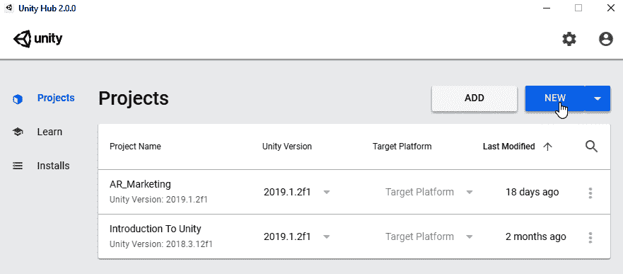

在 Unity Hub 中创建一个新项目

1.  填写 项目名称 和 位置字段，然后点击 CREATE：

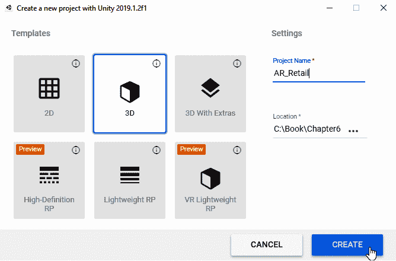

创建一个新的 3D 项目

1.  点击 *Ctrl* + *N* 或转到 文件|新建场景。现在，按 *Ctrl* + *S* 或转到 文件|保存。将文件命名为 `OnTheGo` 并将其保存在 `场景` 文件夹中：

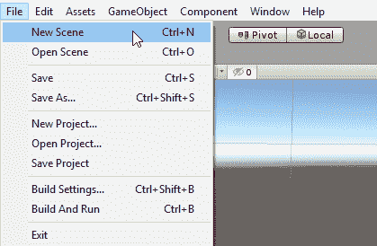

为当前项目创建一个新场景

1.  您还可以从 项目窗口中删除项目附带的项目 SampleScene：


SampleScene 不再需要

1.  AR 需要一个特殊的相机，该相机检索物理相机流并将其处理，以便我们可以将虚拟元素集成到真实图像流中。Vuforia 提供了一个名为 AR Camera 的资源，它可以为我们完成这项工作。删除现有的 Unity 主相机，在 Hierarchy 窗口中右键单击，并选择 Vuforia Engine|AR Camera：

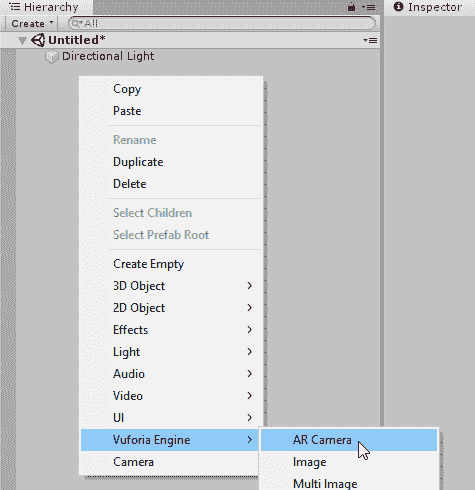

将 AR Camera 添加到场景中

1.  由于这是我们第一次在项目中使用 Vuforia，会出现一个消息提示我们导入 Vuforia 的资源。点击导入：


导入 Vuforia 及其资源到项目的消息

在 项目窗口的 `Assets` 文件夹内，将出现一个名为 `Vuforia` 的新文件夹。

1.  将方向光放置在 AR Camera 内部，以便光线随着相机移动。

1.  现在，我们必须在 Player Settings 中启用 Vuforia，以便我们可以在场景中使用它：

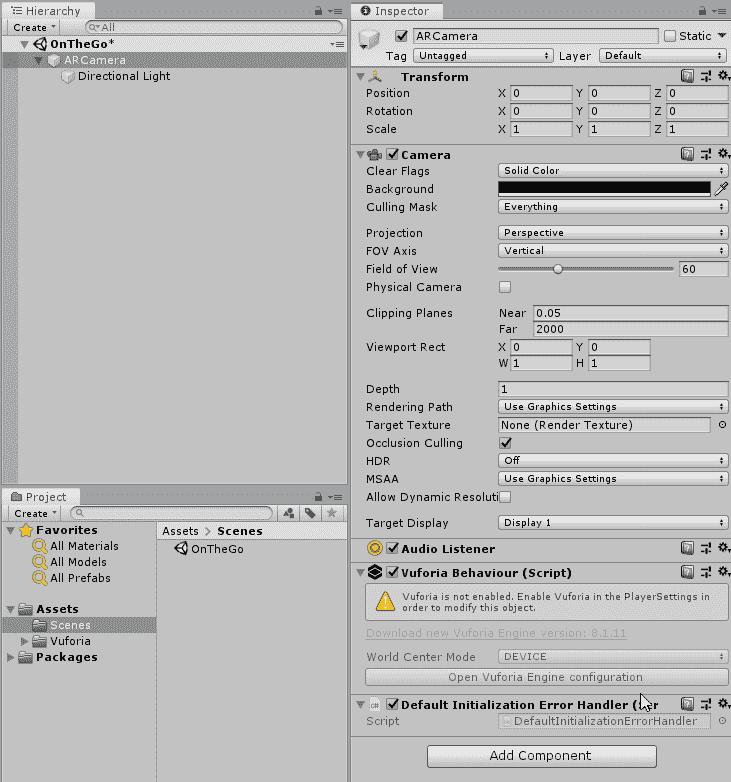

Vuforia 行为组件检测到 Vuforia 尚未启用

1.  按 *Ctrl* + *Shift* + *B* 或转到文件|构建设置...以打开构建设置窗口。

1.  在进行任何其他操作之前，点击“添加打开的场景”以将我们的场景包含在构建场景列表中。

1.  然后，通过点击 Android 并在右下角按下“切换平台”来切换平台。通过这种方式，我们将配置我们的项目，使其可以在 Android 设备上构建：

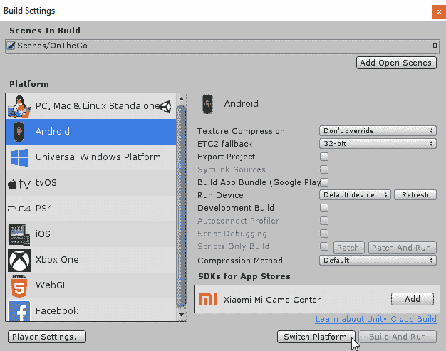

构建设置面板，允许我们添加新场景、切换平台和访问玩家设置

1.  现在，点击“玩家设置...”以打开一个新窗口。

1.  填写公司名称和产品名称（当我们将应用程序安装到设备上时应用程序将拥有的名称）。

1.  在最后一个选项卡“XR 设置”中，启用“Vuforia 增强现实支持”以允许在此项目中使用 Vuforia：

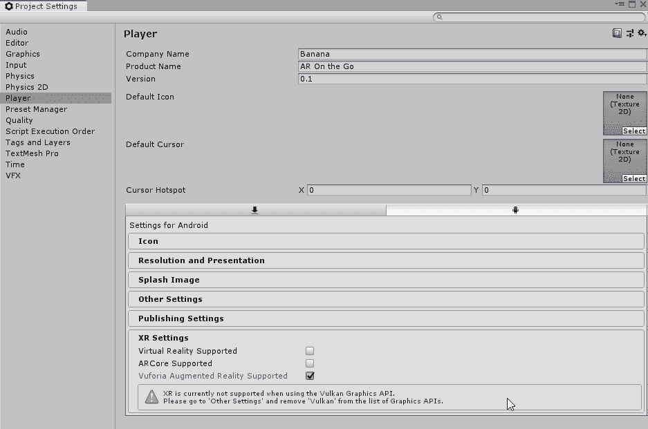

已填写公司名称和产品名称并激活 XR 设置中的 Vuforia 的玩家设置

1.  将会显示一条新消息，指出 Vulkan 图形 API 不支持 XR。要修复此问题，请打开“其他设置”选项卡并从图形 API 中删除 Vulkan：

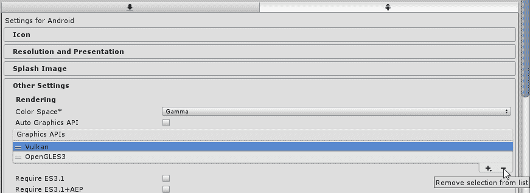

在“其他设置|渲染”下从图形 API 中删除 Vulkan

1.  在此之下，填写识别部分的“包名”和“最低 API 级别”：


在“其他设置|识别”下更新包名和最低 API 级别

目前，Vuforia 支持 Android 4.4 及以上版本和 iOS 11 及以上版本。然而，我们建议将最低 API 级别设置为 `5`，以确保运行应用程序的设备足够强大。您可以在以下位置检查 Vuforia 的最低要求：[`library.vuforia.com/articles/Solution/Vuforia-Supported-Versions`](https://library.vuforia.com/articles/Solution/Vuforia-Supported-Versions)。

1.  此步骤并非总是必需，但可能的情况是，与您的 Unity 版本一起安装的 Vuforia 版本不是最新版本。如果是这样，当选择 ARCamera 时，Vuforia 行为组件上将会出现一条消息，指出有新版本可用：

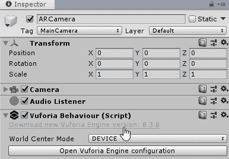

在 ARCamera 的 Vuforia 行为组件中链接到新的 Vuforia 版本

1.  点击链接下载可执行文件，并按照步骤进行安装：

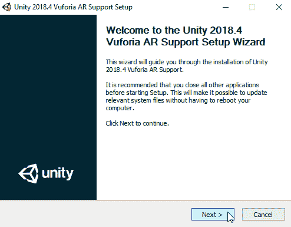

Vuforia AR 设置向导

1.  在更新 Vuforia 时，请确保您将其安装在 Unity 根目录中，通常在 `C:/Program Files/Unity/Hub/Editor/{unity_version_name}`，并在需要时关闭当前运行的 Unity 会话。如果出现要求您更新项目的消息，请点击“更新”。现在，Vuforia 将在您的项目中是最新的：

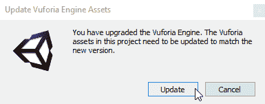

来自 Vuforia 引擎的更新消息

现在我们已经知道了如何将 Vuforia 集成到新项目中，我们将开始使用其地面平面功能来创建一个检测平坦表面并在其上放置 3D 内容的应用。

# 行走中的 AR – 使用地面平面

Vuforia 的主要功能，用于在用户的环境中实时放置虚拟对象，被称为**地面平面**.* 我们将使用此功能创建一个应用，将 3D 内容放置在现实世界的水平表面上，例如地板和桌子。

从 Vuforia 7 开始，SDK 引入了一种新功能，称为**Vuforia 融合**，以提高空间识别的性能，这取决于每个设备的特性，包括摄像头、传感器、芯片组和内部 AR 框架。Vuforia 融合试图检测集成框架，如 ARKit（iOS）或 ARCore（Android），它们提供最佳性能。如果没有找到，它将尝试使用 VISLAM 和 SLAM。

**同时定位与建图**（**SLAM**）算法同时估计对象的位置和周围环境的地图。**视觉惯性同时定位与建图**（**VISLAM**）是 Vuforia 的算法，它将**视觉里程计**（**VIO**）和 SLAM 结合起来以提高后者的性能。

尽管列表迅速增加，但并非所有设备都支持 Vuforia 的地面平面。一般来说，如果运行设备支持 ARCore 或 ARKit，它将工作。如果不支持，它将取决于内部 AR 启用技术。Vuforia 在其网页上保留了一份当前支持的设备列表：[`library.vuforia.com/articles/Solution/vuforia-fusion-supported-devices.html`](https://library.vuforia.com/articles/Solution/vuforia-fusion-supported-devices.html)。

在下一个子节中，我们将学习如何在 Vuforia 中启用 ARCore。如果你的设备不支持 ARCore，你可以直接跳到下一个子节。如果你计划将你的应用分发到支持和不支持 ARCore 的设备上，并且想要首先测试 Vuforia 的 VISLAM 性能，请跳过此步骤，在测试最终应用后进行此操作以查看差异。

# 在 Vuforia 中启用 ARCore

在本节中，我们将学习如何为 Vuforia 启用 ARCore；如果你的设备支持 ARCore，你将受益于与 Vuforia 一起使用它，因为生成的应用将更快、更精确地检测平坦表面。要在 Unity 中为 Vuforia 启用 ARCore，请按照以下步骤操作：

1.  从 Google 的存储库下载 ARCore 库的最新版本。全局链接是 `https://dl.google.com/dl/android/maven2/com/google/ar/core/<ARCORE_VERSION>/core-<ARCORE_VERSION>.aar`。您可以在 [`github.com/google-ar/arcore-unity-sdk/releases`](https://github.com/google-ar/arcore-unity-sdk/releases) 检查可用的最新版本。

在撰写此章节时，当前版本是 1.9.0，因此链接将是 [`dl.google.com/dl/android/maven2/com/google/ar/core/1.9.0/core-1.9.0.aar`](https://dl.google.com/dl/android/maven2/com/google/ar/core/1.9.0/core-1.9.0.aar)。

1.  在 Unity 中，在项目窗口中，右键点击 `Assets` 文件夹并按 Create|Folder。将其命名为 `Plugins` 并在它里面创建另一个名为 `Android` 的文件夹：

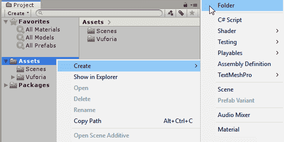

在 Assets 中创建一个新的文件夹

1.  将下载的 `.aar` 文件复制到 `Android` 文件夹内：

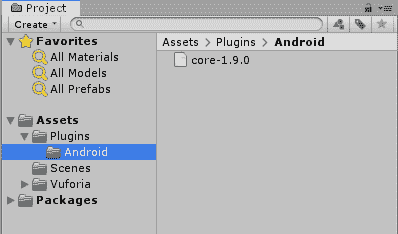

位于 Android 文件夹内的 ARCore 插件

1.  选择文件，并验证在检查器窗口中是否已选中“选择平台以用于插件”下的 Android：

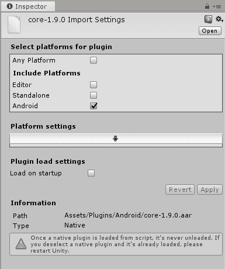

ARCore 库在检查器窗口中的属性

1.  选择 ARCamera 并点击打开 Vuforia Engine 配置按钮：

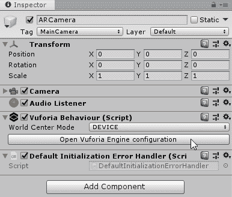

从 ARCamera 打开 Vuforia Engine 配置

1.  在设备跟踪器下，根据目标用户设备设置 ARCore Requirement 为 Optional 或 Required：

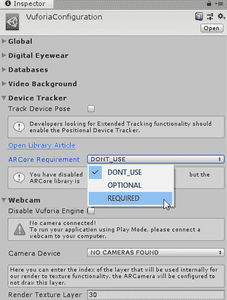

将 ARCore 设置为“可选”或“必需”

如果设置为“可选”，当使用地面平面时，Vuforia 将尝试使用 ARCore，如果设备不支持，它将切换到 Vuforia 的内部算法。如果设置为“必需”，则不支持 ARCore 的设备上的应用将无法工作。

现在我们已经配置了 ARCore，我们将创建一个 AR 场景来测试地面平面功能。

# 创建地面平面场景

本项目中的 AR 场景将包含以下元素：

+   ARCamera，它将检索物理摄像头的视频流并处理每一帧

+   地面平面查找器，负责搜索水平表面并在用户点击屏幕时将对象放置在其上

+   地面平面舞台，这是虚拟元素将要放置的父 GameObject

+   一个测试立方体，当用户点击屏幕时将出现在地面上

当我们在 Unity 中集成 Vuforia 时创建了 ARCamera 元素，所以让我们创建其余的元素以使地面平面功能正常工作：

1.  右键点击层次窗口并选择 Vuforia Engine|Ground Plane|Ground Plane Stage。这将为我们想要在 AR 中显示的内容创建父 GameObject。它用一个 100 厘米方形的视觉参考来帮助虚拟对象的现实世界比例。这个参考仅在 Unity 编辑器内可见：

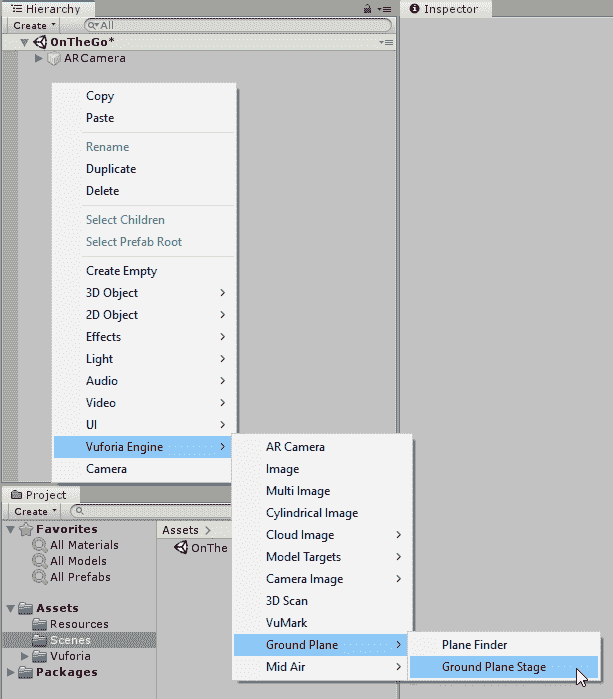

创建地面平面舞台元素

1.  地面平面舞台 GameObject 上有两个脚本附加到它：

+   锚点行为，它决定了虚拟对象是附着在地面上还是在空中

+   默认可追踪事件处理器，这是 Vuforia 的默认脚本，用于在目标被找到/丢失时显示/隐藏元素

1.  要创建一个虚拟对象进行测试，右键单击地面平面阶段并创建 3D Object|Cube。确保它作为地面平面阶段的子级出现，以便在适当的时候显示/隐藏：

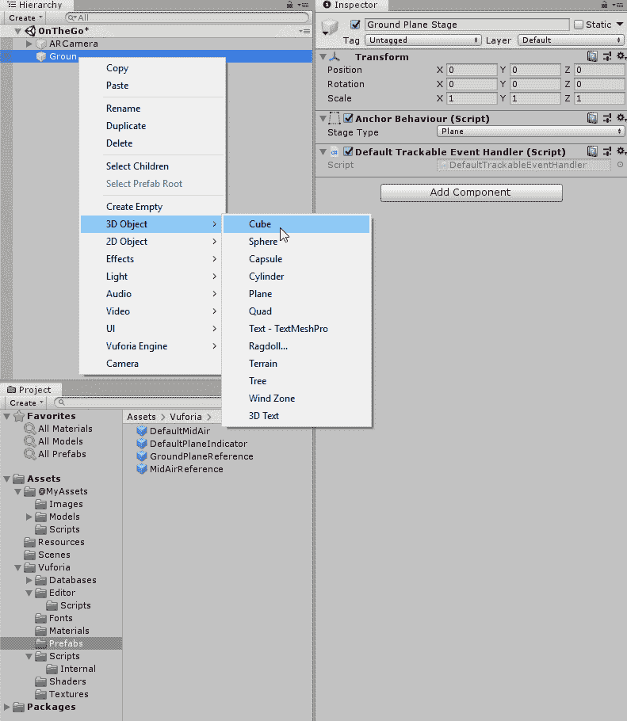

创建一个立方体作为地面平面阶段的子级

1.  缩小立方体，使其小于地面平面阶段的视觉参考。确保它在游戏视图中从 ARCamera 可见（如果不是，移动/旋转 ARCamera 或更理想的是地面平面阶段，直到它在视图中）：

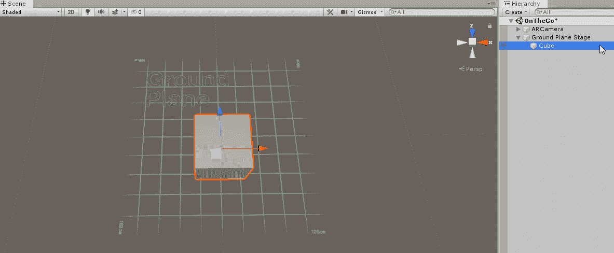

放置在地面平面阶段参考网格上的立方体

1.  在层次结构窗口外部右键单击，并选择 Vuforia Engine|地面平面|平面查找器：

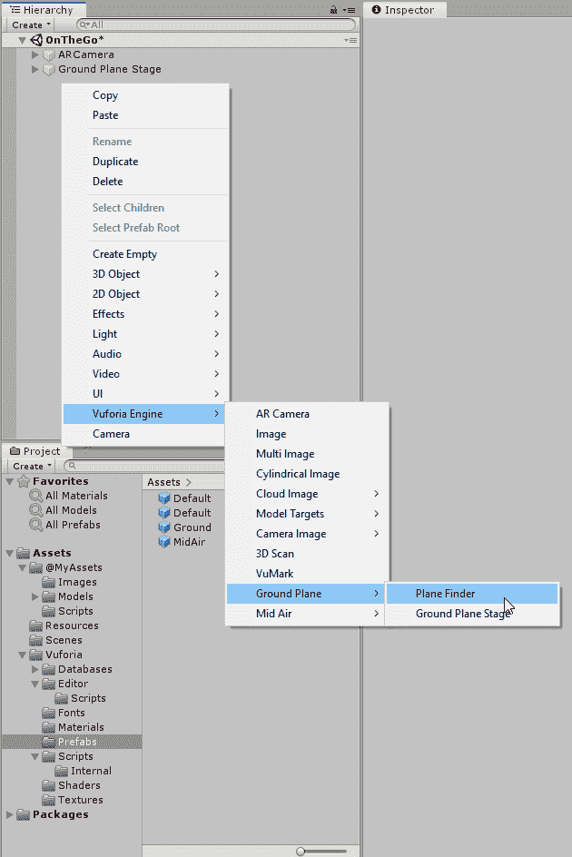

创建平面查找器以检测地面平面

1.  此 GameObject 附有三个脚本：

+   锚点输入监听器行为，负责监听用户的输入（屏幕上的点击）

+   平面查找器行为，用于查找水平表面放置内容

+   内容定位行为，用于定位真实世界的内容

1.  在内容定位行为脚本中，选择（或从层次结构拖动）地面平面阶段位于锚点阶段选择框内：

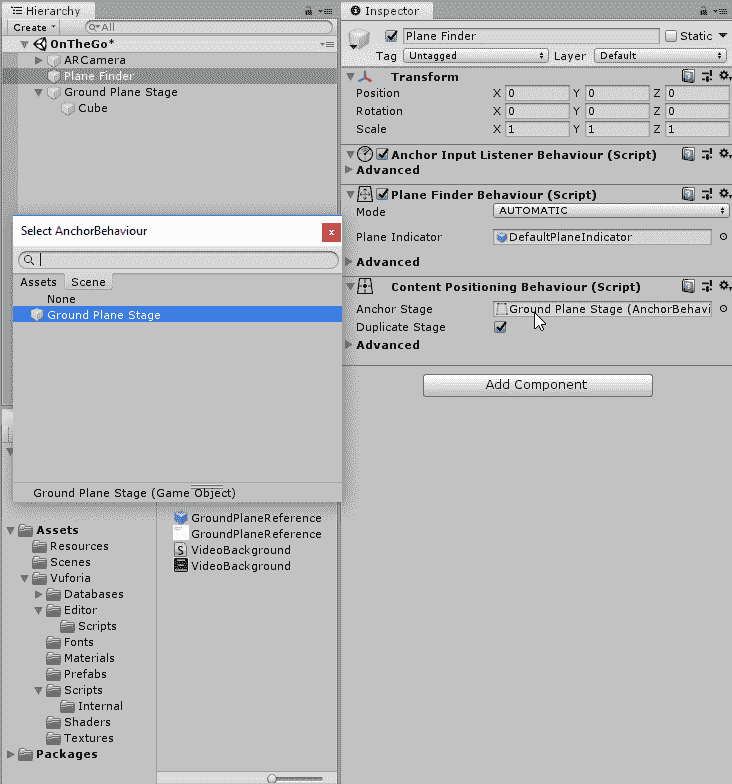

将地面平面阶段链接到平面查找器

1.  在继续之前，按*Ctrl* + *S* 保存当前场景。

现在我们已经配置了 AR 场景，我们将添加 Vuforia 密钥，这是在移动设备上构建 Vuforia 所必需的步骤。

# 获取密钥

Vuforia 要求应用在真实设备上运行时需要一个开发/部署密钥。为此，请按照以下步骤操作：

1.  前往 Vuforia 的开发者页面([`developer.vuforia.com/license-manager`](https://developer.vuforia.com/license-manager))，注册并登录。

1.  在许可证管理器选项卡上，选择获取开发密钥以获取开发期间使用的免费密钥。

1.  给它起一个你应用的名字，`AR On the Go`，阅读并接受条款和条件，然后按确认。

1.  选择你新创建的许可证并复制密钥数字。

1.  返回 Unity 编辑器并选择场景中的 ARCamera。

1.  在检查器窗口中单击打开 Vuforia Engine 配置以打开通用 Vuforia 配置：

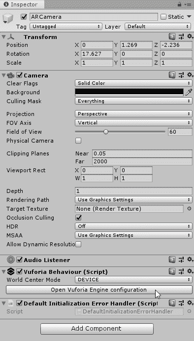

检查器窗口中的 ARCamera GameObject

1.  在此处，将你的密钥粘贴到应用许可证密钥字段中：

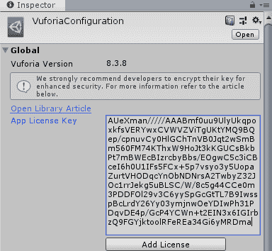

检查器窗口中的 Vuforia 配置选项

现在，我们已经在项目中包含了一个 Vuforia 开发密钥，这将使我们能够在真实设备上构建和安装我们的应用。

请记住，当你想要将应用程序上传到商店（Google 或 Apple）时，你必须根据 Vuforia 的计划购买一个部署密钥。你可以在[`developer.vuforia.com/pricing`](https://developer.vuforia.com/pricing)找到更新的价格。

在下一节中，我们将测试我们的应用程序在 Unity 中，以确保一切按预期工作。

# 测试应用程序

在 Unity 中开发项目时，在构建之前测试它是良好的实践，因为构建过程需要时间。这样，你可以检测基本问题和错误，并在实际尝试在手机上运行应用程序之前快速纠正它们。

Vuforia 目前不能作为一个独立的应用程序构建，但它有一个与 ARCamera 集成的脚本，用于测试目的。当你正在 Unity 编辑器中测试应用程序时，它将使用电脑的摄像头来模拟 AR。如果它没有检测到摄像头，它将使背景保持黑色并直接播放 AR。

另一方面，当你使用地面平面项目并想要测试应用程序时，Vuforia 无法使用设备的传感器来检测平坦的表面。相反，它提供了一个图像目标参考来模拟地面平面识别，当相机检测到该图像时，它将表现得像在手机上检测到一个平坦的表面。

要测试我们的应用程序，请按照以下步骤操作：

1.  在项目窗口中找到名为“`Emulator Ground Plane.pdf`”的 PDF 文件，位于 Vuforia|Databases|ForPrint|Emulator。打印它并将其放置在地面上（你也可以直接在电脑上打开 PDF 图像，尽管尺寸参考可能不准确）。

1.  在顶部的工具栏中按下播放按钮，并将网络摄像头指向图像。当软件检测到表面（在这种情况下为目标）时，你会看到一个视觉标记。在按下播放按钮之前，你可以点击游戏视图右上角的“播放时最大化”按钮，以便在屏幕上最大化显示图像：

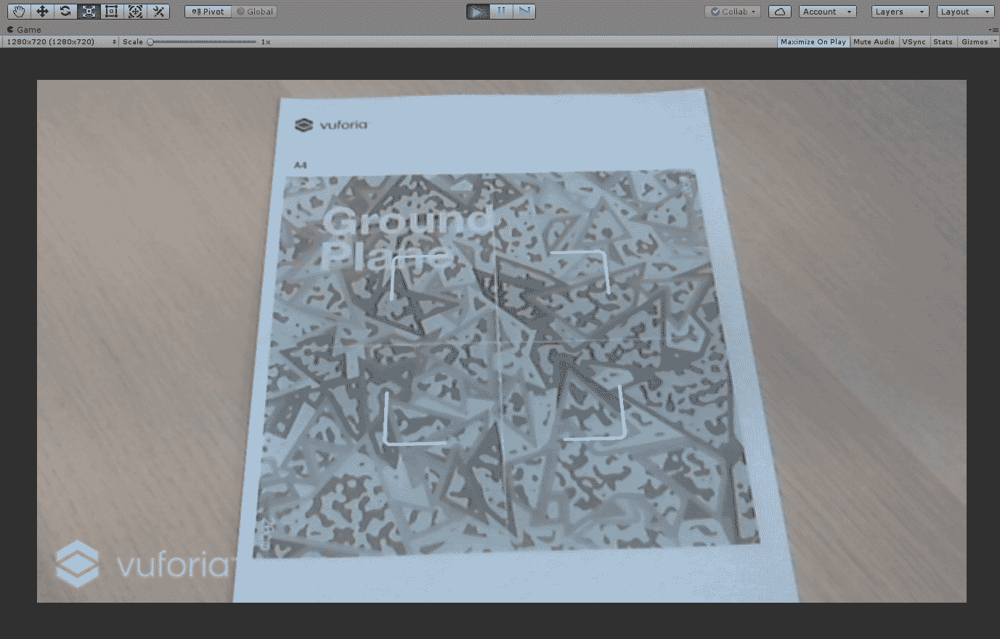

游戏视图检测地面平面模拟器图像

1.  点击游戏视图上的电脑屏幕以在手机上模拟屏幕触摸。立方体将出现在目标上方。其大小将取决于你在 Unity 编辑器中之前给出的尺寸（Unity 中的地面平面舞台为 100 厘米 x 100 厘米，而打印的模拟器为 20 厘米 x 20 厘米）：

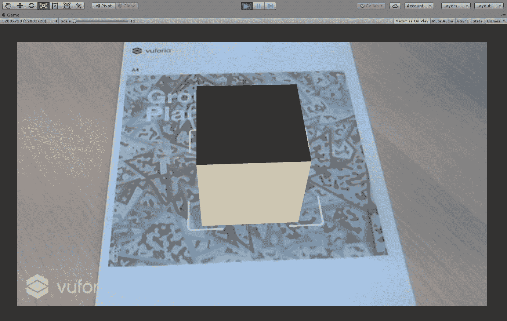

点击游戏视图时，立方体出现在地板上

如果一切按预期工作，我们可以更改立方体并开始塑造我们的 AR 应用程序，以在现实世界中显示家具。

# 创建 AR 家具查看器

现在我们有了 AR 场景的主结构，我们将定制应用程序以创建一个 AR 家具查看器，允许我们在现实世界中放置椅子。应用程序将让我们做以下事情：

+   在地面上放置一把椅子

+   复制椅子以创建类似电影院的场景

+   旋转椅子以调整其与环境的匹配

让我们开始吧！

# 向我们的项目中添加元素

我们将首先向我们的项目和场景添加新元素，包括 3D 模型和用户界面：

1.  在项目窗口的`Assets`文件夹中创建自己的文件夹，并将其命名为`@MyAssets`。然后，在它内部创建三个其他文件夹，分别命名为`Images`、`Models`和`Scripts`：

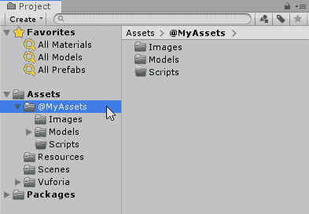

@MyAssets 内部的新文件夹

1.  现在，从项目的资源中，将模型和图像复制到项目窗口中相应的文件夹。

1.  在检查器窗口中，将`chair.png`和`cinema.png`图像的纹理类型更改为精灵（2D 和 UI），然后点击应用。这将允许我们稍后将其用作 UI 元素。其他图像将作为常规纹理应用于平面上：


检查器窗口中的 chair.png 图像导入设置

1.  将从 Assets|Models|Prince 文件夹中的王子模型拖动到层次结构窗口，作为地面平面舞台的子对象。

1.  删除立方体，因为我们不再需要它了。

1.  缩放它，旋转它，并移动它，直到它面向前方，在地面平面舞台上的合适大小（您可以在测试应用程序时稍后调整此大小）：

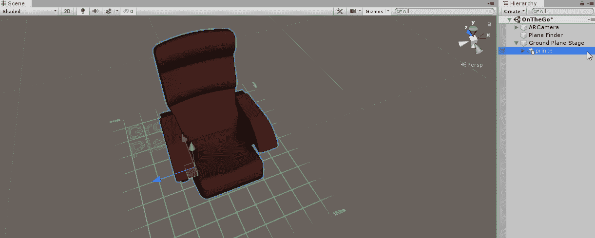

场景中王子模型作为地面平面舞台对象的子对象

1.  要创建 UI，在层次结构窗口中右键单击并选择 UI|按钮。它将自动将按钮封装在新的 Canvas 元素中，并将必要的 Event System 添加到场景中：

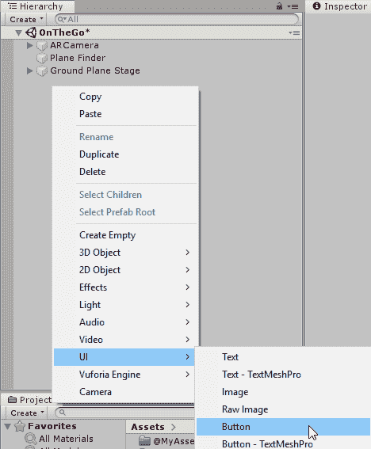

在层次结构窗口中创建按钮

1.  选择画布，并更改 Canvas Scaler 的参数，以便它根据设备的屏幕大小进行缩放：

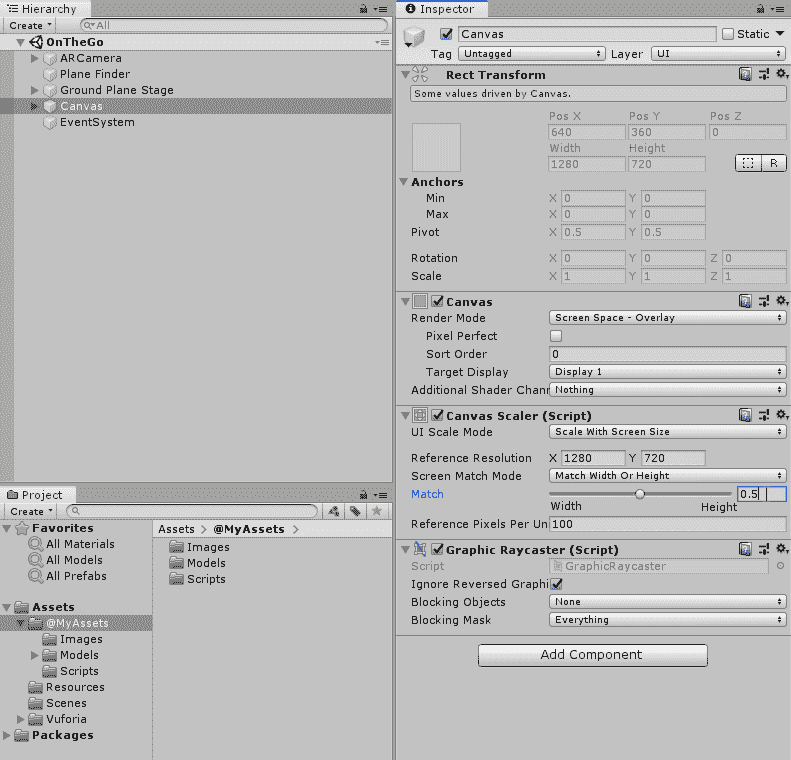

新的画布缩放器参数以适应 UI 的大小到屏幕大小

1.  选择按钮并删除其 Text GameObject。

1.  在检查器窗口中，将其名称更改为`chair_b`以进行识别，并使用 Rect Transform 组件来设置其位置和大小。将椅子图像添加到图像组件的源图像中：


自定义创建的按钮

这是切换单个椅子移动和添加多个椅子以形成电影院的按钮：

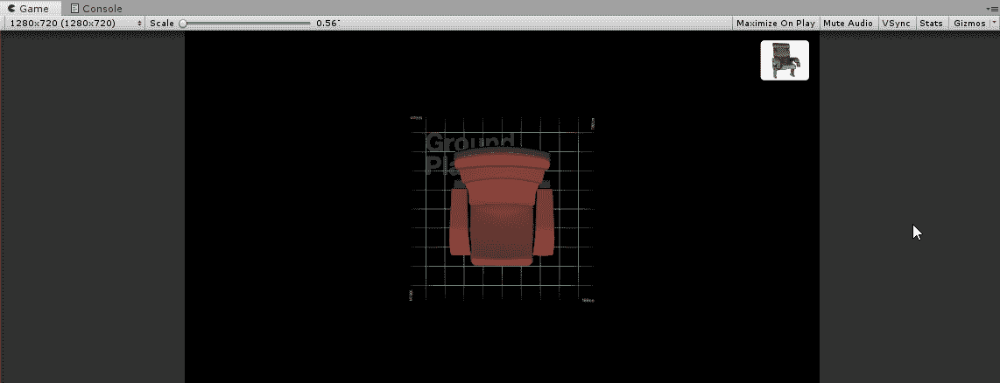

游戏视图中椅子和按钮的视图

现在，我们必须创建一个包含应用程序逻辑的脚本。

# 添加应用程序的逻辑

现在，让我们通过向项目中添加新脚本来创建应用程序的逻辑。这将负责在单个和多个椅子之间切换：

1.  在项目窗口的@MyAssets|Scripts 文件夹中，右键单击并选择创建|C#脚本。将其命名为`OnTheGoHandler.cs`：

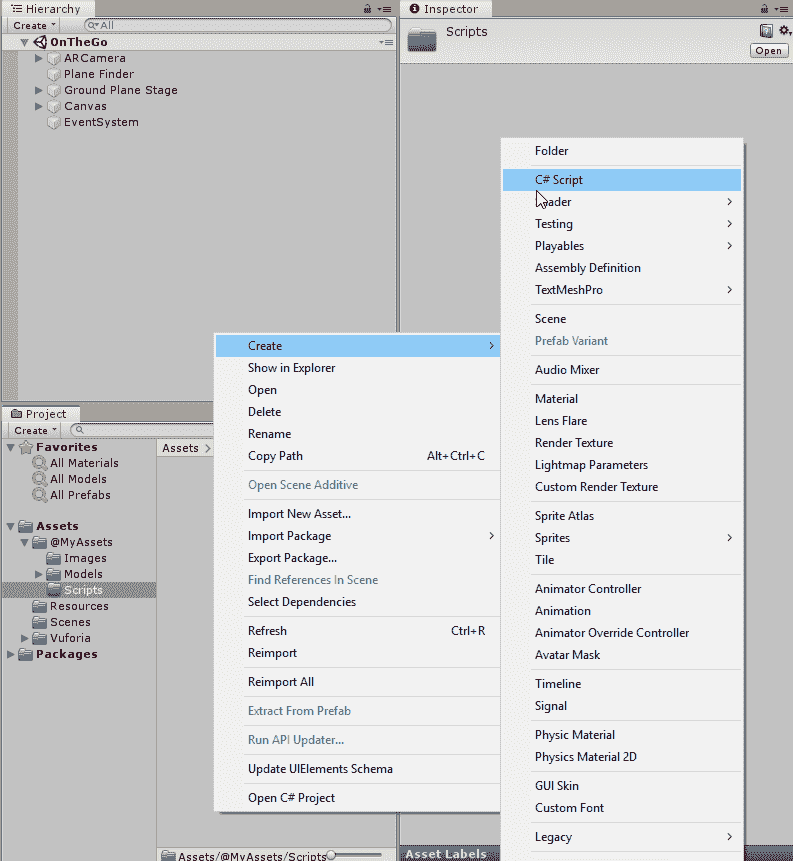

在项目窗口中添加新脚本

1.  双击它以在 Visual Studio 中打开：

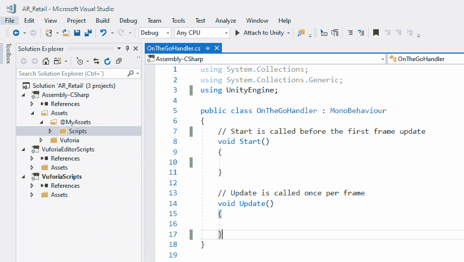

Visual Studio 中的 OnTheGoHandler 脚本

1.  在脚本顶部添加 `Vuforia` 库以使用其功能：

```cs
using Vuforia;
```

1.  在类中声明以下变量：

```cs
public GameObject chairButton;
public Sprite[] buttonSprites;
private ContentPositioningBehaviour contentPosBehaviour; 
private bool multipleChairs = false;
```

`chairButton` 变量将对应我们在 Unity 中创建的按钮。`buttonSprites` 数组将包含按钮的两个背景图像，我们将在这两者之间切换。`contentPosBehaviour` 变量来自 `Vuforia` 类，负责将我们的虚拟对象添加到现实世界中。我们将使用 `multipleChairs` 布尔值在两种状态（一把椅子或多把椅子）之间切换。公共变量将在 Unity 编辑器中初始化。

1.  在 `Start()` 方法中，添加以下代码：

```cs
contentPosBehaviour = GetComponent<ContentPositioningBehaviour>(); 
```

这将检索包含脚本的 GameObject 的 `ContentPositioningBehaviour` 组件。

1.  在 `Update()` 方法之后，创建一个新的方法：

```cs
public void SwitchMultipleChairs()
 {
     if (!multipleChairs) 
     {
         chairButton.GetComponent<UnityEngine.UI.Image>().sprite = buttonSprites[1];
         contentPosBehaviour.DuplicateStage = true;
         multipleChairs = true;
     }
     else
     {
         chairButton.GetComponent<UnityEngine.UI.Image>().sprite = buttonSprites[0];
         contentPosBehaviour.DuplicateStage = false;
         multipleChairs = false;
     }
 }
```

当此方法被调用时，它会检查当前状态是一把椅子还是多把椅子。相应地切换 UI 按钮的图像，并调整 `ContentPositioningBehaviour` 类的 `DuplicateStage` 参数以允许一个或多个相同的椅子实例。然后，它将 `multipleChairs` 设置为 `true` 或 `false` 以跟踪当前状态。

1.  在 Unity 编辑器中，将脚本拖到 Plane Finder 上。或者，在检查器窗口中，点击 Add Component|On The Go Handler：

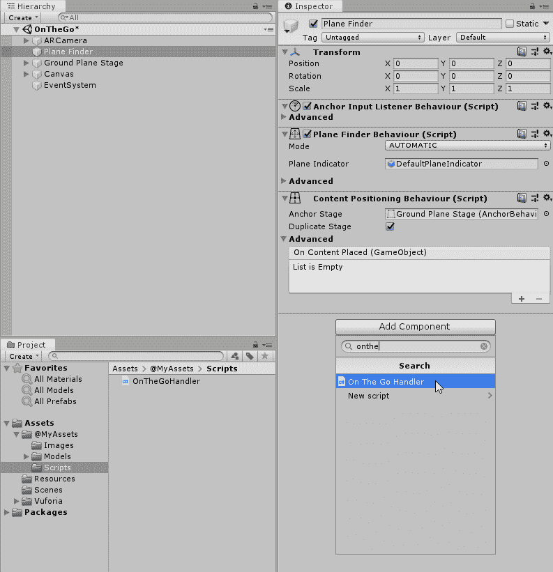

将创建的脚本添加到 Plane Finder GameObject

1.  在 On The Go Handler 脚本中，将按钮拖到 Chair Button 字段，并从 @MyAssets|Images 中按顺序选择两个精灵，椅子和电影院（见以下截图）。

1.  从内容定位行为下拉菜单中取消选中 Duplicate Stage，以便它从单个椅子开始：

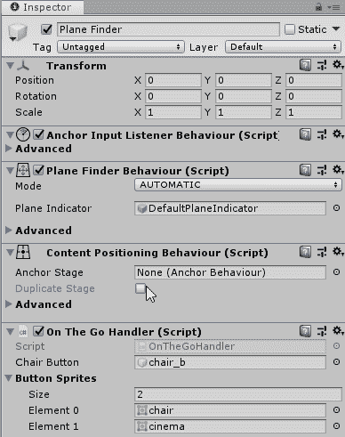

在检查器窗口中将相应的元素分配给 OnTheGoHandler 脚本

1.  最后，选择按钮，在 On Click () 方法中，在底部选择 Plane Finder 并选择 On The Go Handler|SwitchMultipleChairs 函数：

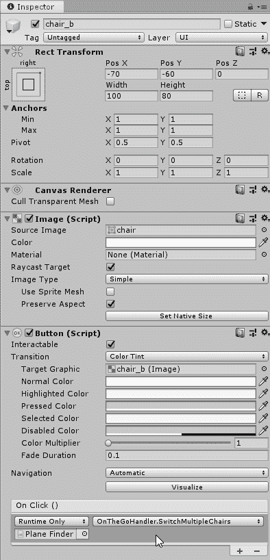

在检查器窗口中选择按钮的 OnClick() 方法行为

1.  在添加任何新功能之前，我们需要在移动设备上构建此应用。按 *Ctrl* + *Shift* + *B* 或转到 File|Build Settings...：

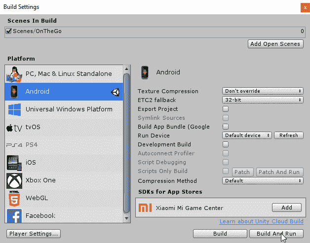

构建设置面板以在移动设备上构建和运行应用

1.  按 Build And Run，给你的 `.apk` 文件命名，并在移动设备上运行。将相机对准地面，直到出现一个小图标，标记地面水平：

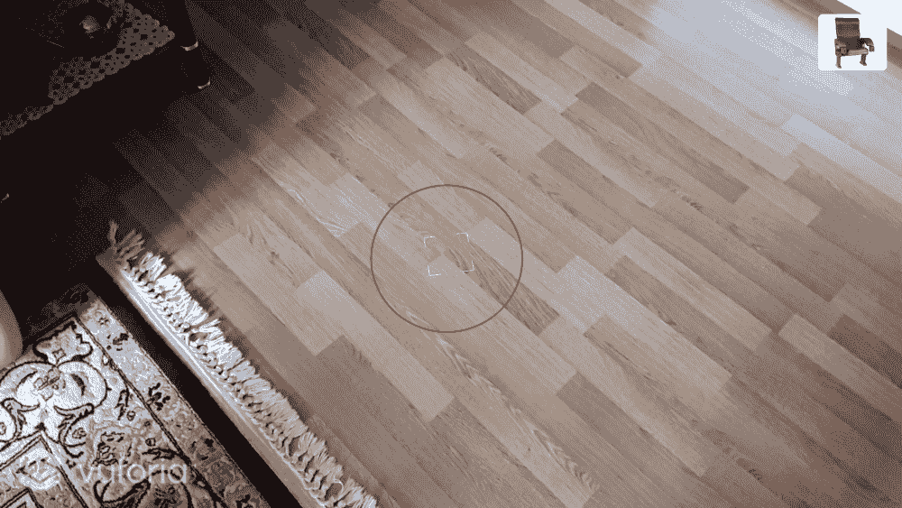

白色方块显示了虚拟对象将被放置的地面上的点

1.  四处走动并在屏幕上轻触以放置一把椅子。现在，你可以绕着虚拟椅子走动，从不同的角度观看它：

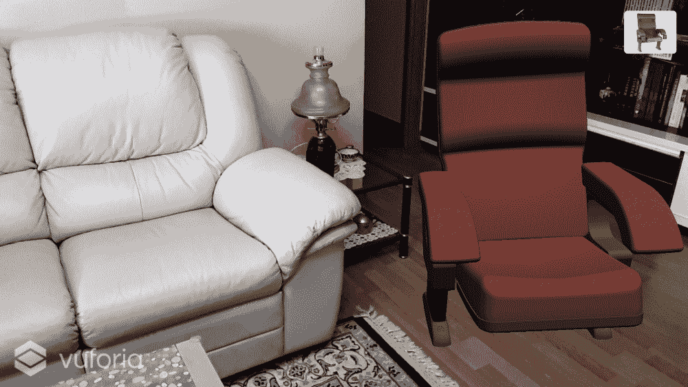

放置在真实环境中的虚拟红色椅子

1.  按钮切换到多椅子模式，移动相机，并将多个椅子放置在房间的各个角落：

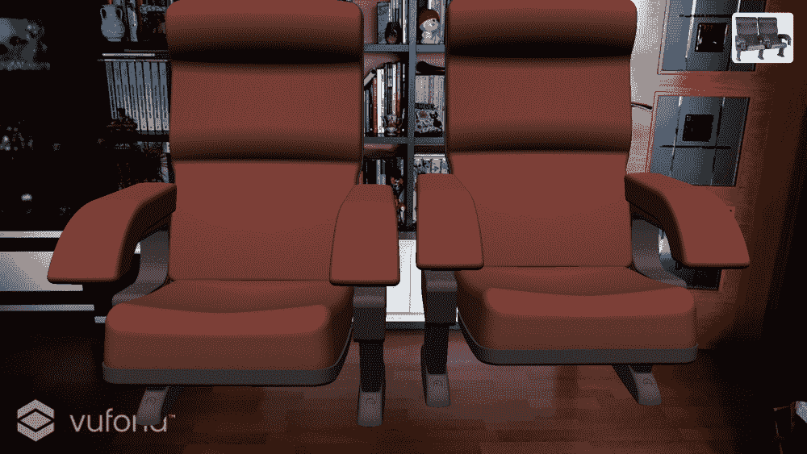

两个虚拟椅子，一个挨着一个

很可能，在您的第一次尝试中，椅子的大小不会如您所愿，或者阴影不会与真实情况相符。此外，椅子将始终朝前，因此您必须围绕房间移动，然后再将其放置在期望的位置。让我们改进这些小细节，使应用程序更具吸引力。

# 改进应用程序

现在，我们将改进当前应用程序，使其对用户更具吸引力：

1.  首先，尝试添加一个新的方向光（右键单击现有的一个并按复制），然后调整其旋转、强度和/或阴影类型。在这种情况下，我们放置了两个灯，旋转值分别为 (`-30`,`-20`,`0`) 和 (`30`,`20`,`0`)，并且没有阴影，创建了一个颜色较浅的椅子：

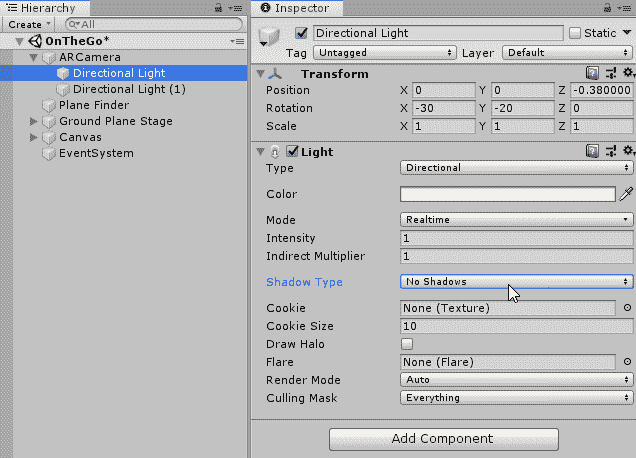

一个方向光的值

1.  现在，让我们使地板的视觉参考更加明显：选择 Plane Finder GameObject，并在检查器窗口中双击位于 Plane Finder Behaviour 脚本中的 DefaultPlaneIndicator 元素。这将打开原始元素：

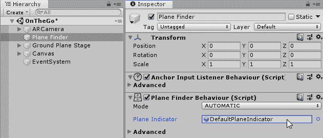

在检查器窗口中选择 DefaultPlaneIndicator

1.  从层次结构窗口中选择 DefaultIndicator 子项。然后，在检查器窗口中，将其大小增加到 `0.05` 并将默认图像更改为 reticle_ground_surface：

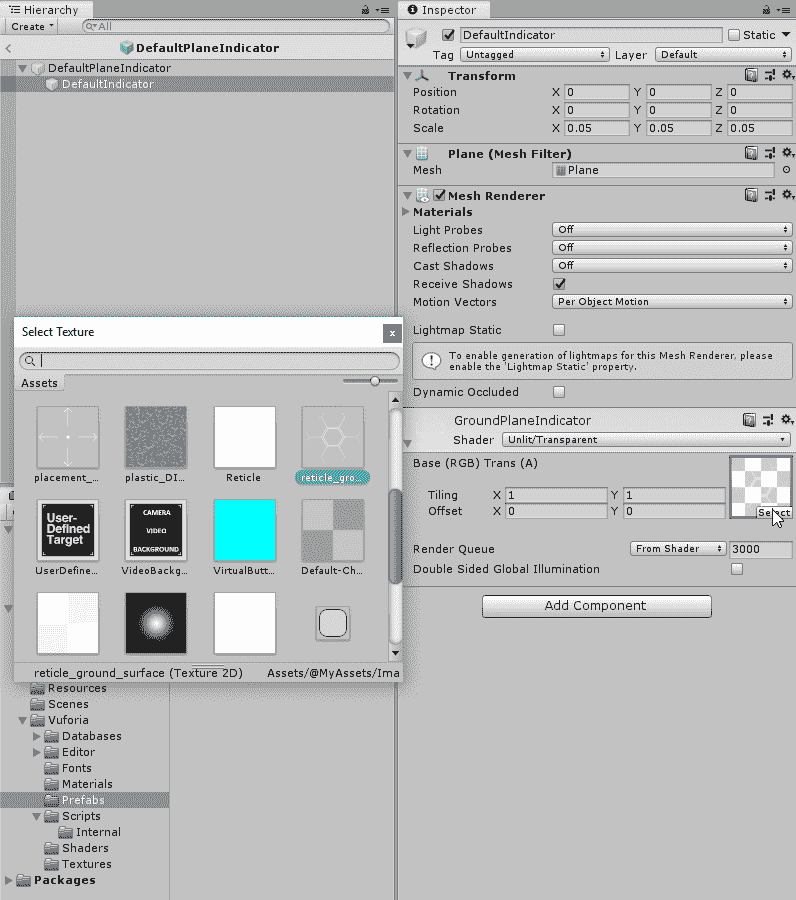

DefaultIndicator GameObject 的组件在检查器窗口中

1.  在场景窗口中右键单击王子 GameObject 并选择 3D Object|Quad，给椅子添加一个旋转指示器，以便我们在屏幕上使用两个手指时它会出现：

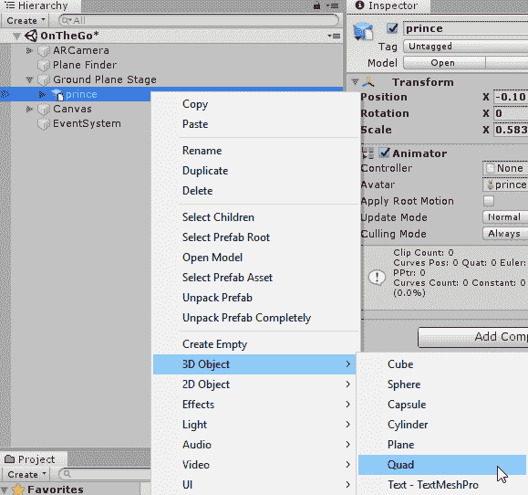

创建一个 prince GameObject 的 Quad 元素子项

1.  将 `placement_rotate` 图像从项目窗口拖到层次结构窗口中的旋转 GameObject 上，将其转换为纹理，并将材质的渲染模式设置为 Cutout：

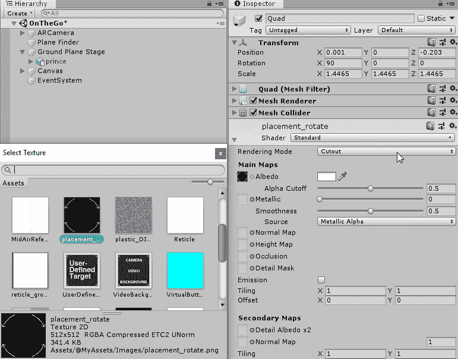

Quad 材料的属性在检查器中

1.  调整其位置和旋转，使其出现在地面舞台的中间：

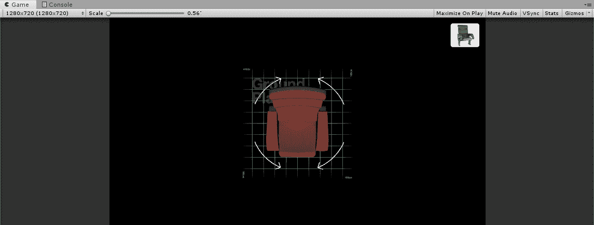

座位周围地面中间的 Quad

1.  现在，在 @MyAssets|Scripts 文件夹中创建另一个脚本。命名为 `ChairHandler.cs` 并将其附加到王子 GameObject：

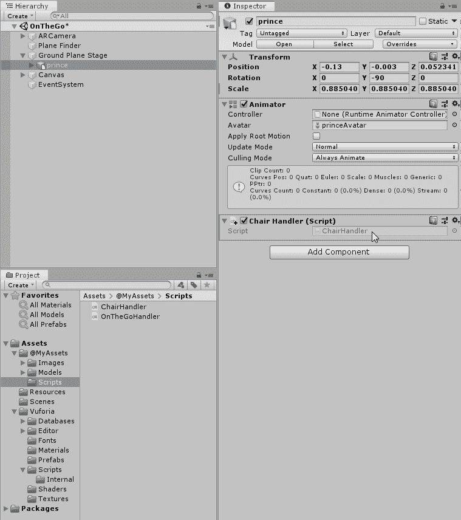

将新创建的脚本附加到其上的王子 GameObject

1.  双击脚本以在 Visual Studio 中打开它：

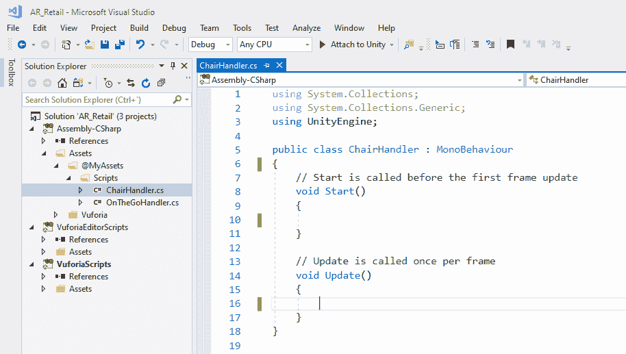

ChairHandler 脚本在 Visual Studio 中

1.  在课程开始时添加以下变量：

```cs
public GameObject rotateGO;
private float rotateSpeed = 0.8f;
```

第一个变量指的是我们之前创建的 Quad GameObject（带有旋转箭头图像）。第二个变量控制椅子的旋转速度。

1.  在 `Start()` 方法中，添加以下代码：

```cs
rotateGO.SetActive(false);
```

通过这种方式，我们隐藏了旋转箭头，直到椅子实际上在旋转。

1.  现在，在 `Update()` 方法中，添加以下代码：

```cs
Touch[] touches = Input.touches;
if (Input.touchCount == 2 && (touches[0].phase == TouchPhase.Moved || touches[1].phase == TouchPhase.Moved))
{
 rotateGO.SetActive(true);

 Vector2 previousPosition= touches[1].position - touches[1].deltaPosition - (touches[0].position - touches[0].deltaPosition);
 Vector2 currentPosition = touches[1].position - touches[0].position;
 float angleDelta = Vector2.Angle(previousPosition, currentPosition);
 Vector3 cross = Vector3.Cross(previousPosition, currentPosition);

 Vector3 previousRotation = transform.localEulerAngles;
 if (cross.z > 0)
 {
 transform.localEulerAngles = previousRotation - new Vector3(0, angleDelta * rotateSpeed, 0);
 }
 else if (cross.z < 0)
 {
 transform.localEulerAngles = previousRotation + new Vector3(0, angleDelta * rotateSpeed, 0);
 } 
}
else
{
 rotateGO.SetActive(false);
} 
```

上述代码检索来自屏幕的触摸。如果是两个触摸（两个手指触摸屏幕）并且至少有一个在移动，它执行以下操作：

+   使旋转图像可见。

+   获取触摸的位置。

+   计算最后手指位置和当前位置之间的角度，并相应地旋转椅子。当用户停止旋转椅子时，旋转图像再次隐藏。

1.  最后一步是将 Quad GameObject 从 Hierarchy 拖到 Inspector 窗口中 ChairHandler 脚本的 Rotate GO 字段。

1.  现在，你可以直接按 *Ctrl* + *B* 来构建和运行项目，或者通过 File|Build And Run 来做。正如你所看到的，地面上的标记现在更加明显了：

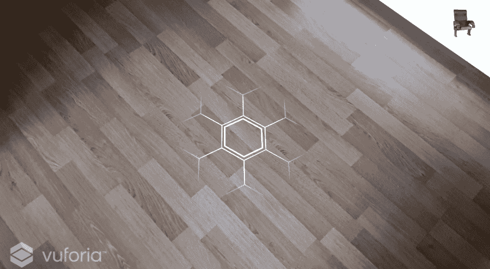

新的地面参考标记

1.  现在，你还可以旋转椅子，看看它放在那里的样子：

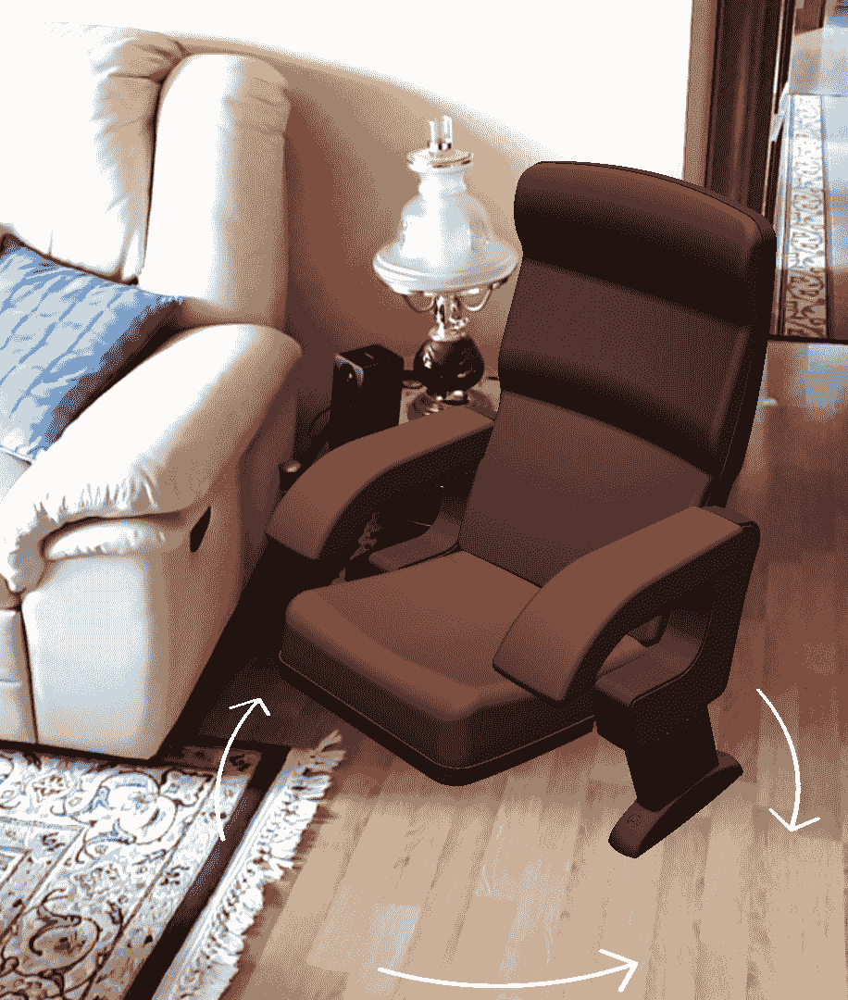

当用户用两只手指旋转椅子时出现的旋转箭头

这样，我们就完成了 AR 家具查看器。

# 摘要

在本章中，我们学习了 Vuforia 的一个功能：地面平面。我们创建了一个项目，将虚拟椅子放置在现实场景中，并允许我们通过触摸屏（旋转它们）和简单的 UI 按钮来操作它们（乘以它们）。

到现在为止，你将更好地理解 Vuforia 的工作原理，如何在 Unity 中创建 Vuforia 元素，以及如何在其中创建一个完全功能的地面平面示例。通过在这个项目开发过程中获得的技术，你可以通过添加新的 3D 模型、新的 UI 元素或更新当前脚本以在应用程序中包含更多功能来改进它。

你还可以更好地了解 AR 在零售领域的应用，以便你可以根据个人或专业需求调整当前项目。正如我们在本章开头提到的，以及我们一直在看到的，应用程序可以很容易地更改以显示其他类型的家具、装饰、地毯或任何你想要在表面上展示并从不同角度观察的产品。

在下一章中，我们将通过查看图像目标和在 Moverio AR 眼镜中部署应用程序来进一步探索 Vuforia 的可能性。

# 进一步阅读

从这里，你可以尝试使用 Vuforia 的“空中”选项，它不是将附着在地面上的物体放置在地面上，而是将它们放置在地面的距离之外。这对于在墙上放置物体，如画框、图片等，或者当与无人机等飞行物体一起工作时非常有用。它们的使用非常相似；你不需要创建“平面查找器”和“地面平面舞台”，而是创建一个“空中位置器”和“空中舞台”。

你还可以从 Unity 资产商店下载 Vuforia 核心示例（[`assetstore.unity.com/packages/templates/packs/vuforia-core-samples-99026`](https://assetstore.unity.com/packages/templates/packs/vuforia-core-samples-99026)），其中包含地面平面及其功能的完整示例。
