# 使用 Vuforia 和增强现实眼镜进行自动化增强现实

在本章中，我们将更深入地探讨 Vuforia，这是我们之前在第六章中介绍过的 SDK，即*使用 Vuforia 的零售增强现实*。您将学习如何使用该框架以及增强现实眼镜，更具体地说，是 Epson Moverio BT-350 型号，您还将学习如何使用 Vuforia 图像识别功能来创建一个应用，逐步引导操作员在工业工作中，以及如何修改场景以便将其集成到您的增强现实眼镜中。

重要提示：为了完成本章，您将需要拥有增强现实眼镜来在此基础上构建。尽管我们已经将内容结构化，以便您可以使用移动 Android 设备跟随大部分过程，但您只能在能够启动真实眼镜上的项目时，才能看到最终结果、移动设备视图中的差异以及增强现实透视设备提供的可能性。

本章有三个主要目标：首先，为了更全面地了解 Vuforia 的工作原理，以便您可以在本书的范围之外扩展和改进当前示例。第二个目标是了解增强现实在工业领域，特别是在自动化方面的可能性。您将看到，增强现实不仅是一种视觉上吸引人的技术，而且它还可以在工作过程中指导操作员，减少培训时间和操作过程中的可能错误。目标是为您提供必要的技能，以复制和调整当前项目以满足您的需求。最终目标是介绍一款增强现实头戴设备，例如爱普生 Moverio AR 眼镜，解释它们的工作原理，并轻松地将 Vuforia 与它们集成。

在工业领域使用增强现实眼镜而不是平板电脑可以是一个有价值的资产，因为它允许操作员在工作的同时双手空闲。以下图片展示了一副增强现实眼镜：

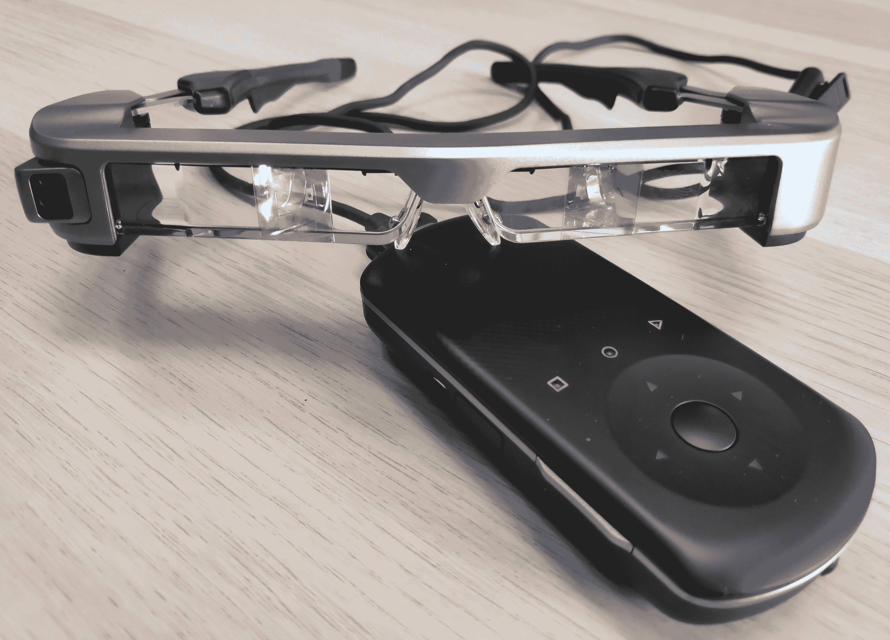

爱普生 Moverio BT-350 增强现实眼镜

本章将涵盖以下主题：

+   在自动化中使用增强现实

+   探索 Vuforia

+   在 Vuforia 中开发基于图像的增强现实

+   为增强现实眼镜创建工业指南

# 技术要求

本章的技术要求如下：

+   支持 Unity 3D 的计算机（请参阅最新要求[`unity3d.com/es/unity/system-requirements`](https://unity3d.com/es/unity/system-requirements)）。本章的示例项目是在 Windows 10 x64 计算机上开发的。

+   Unity 3D（本书中为 2019.1.2f1）。

+   微软 Visual Studio Community 2017（包含在 Unity 安装中）。

+   Unity 3D 中包含的 Vuforia 最新版本（本书中为 8.3.8）。

+   爱普生 Moverio BT-350 增强现实眼镜。

本章的资源和相关代码文件可以在以下位置找到：[`github.com/PacktPublishing/Enterprise-Augmented-Reality-Projects/tree/master/Chapter07`](https://github.com/PacktPublishing/Enterprise-Augmented-Reality-Projects/tree/master/Chapter07)。

其他增强现实眼镜（来自 Moverio 和其他公司）可能也会与这个例子兼容。然而，需要考虑一些因素，例如，它们的操作系统必须是 Android 4.1 或更高版本（由 Unity 3D v2019 要求）。

让我们从自动化中的增强现实开始吧。

# 在自动化中使用增强现实

第四次工业革命的到来，也被称为**工业 4.0**，极大地推动了增强现实（AR）在工业环境中的应用。工业 4.0 的核心是数字化和互联性，而诸如**增强现实**（**AR**）、**虚拟现实**（**VR**）、**物联网**（**IoT**）、**大数据分析**（**BDA**）、**增材制造**（**AM**）、**网络物理系统**（**CPS**）和**人工智能**（**AI**）等技术已成为这次工业革命的基础。

增强现实是物联网和大数据的自然接口和连接。它允许工人以简单且吸引人的方式可视化并交互工厂来自传感器和设备的数据，无论是使用移动设备还是增强现实头盔。

自动化中增强现实的应用可以从员工的面部识别到访问具体机器，再到通过增强现实眼镜进行现场生产过程的实时监控或远程访问和控制系统。

# 介绍场景和流程

对于这个项目，我们将创建一个可用于生产、维护和培训的逐步指南。执行任务的用户将获得如何正确执行任务的指导，以及访问如蓝图图纸或 PDF 文档等有用信息。

为了说明这一点，我们将以大众甲壳虫（汽车）为例。我们将使用三张图片作为目标（侧面、车尾闭合尾箱的视角，以及车尾打开尾箱的视角）来模拟一个从汽车侧面开始，然后移动到检查汽车发动机状态的操作员，同时从增强现实眼镜中接收信息。在真实环境中，这些图片将与真实的汽车（或工业设备）相对应。

我们将在本项目中使用的图像已从以下链接获取：

+   甲壳虫汽车的 3D 模型：[`sketchfab.com/3d-models/beetlefusca-version-2-2f3bea70178345c8b7cc4424886f9386`](https://sketchfab.com/3d-models/beetlefusca-version-2-2f3bea70178345c8b7cc4424886f9386)

+   蓝图：[`getoutlines.com/blueprints/6826/1968-volkswagen-beetle-sedan-blueprints`](https://getoutlines.com/blueprints/6826/1968-volkswagen-beetle-sedan-blueprints)

+   PDF 文件中的图像：[`getoutlines.com/blueprints/6943/1972-volkswagen-beetle-1500-sedan-blueprints`](https://getoutlines.com/blueprints/6943/1972-volkswagen-beetle-1500-sedan-blueprints)

在下一节中，我们将简要介绍 Vuforia，然后再开始开发指南项目。

# 探索 Vuforia

正如我们在第六章，“使用 Vuforia 的零售 AR”中讨论的那样，Vuforia 是自 2017.2 版本以来集成到 Unity 中的最古老和最知名的 AR SDK 之一。它提供了多个 AR 功能，如图像识别、地面平面识别、模型检测等。您可以在[`engine.vuforia.com/features.html`](https://engine.vuforia.com/features.html)找到所有可用功能。对于这个项目，我们将专注于图像识别。

在第六章，“使用 Vuforia 的零售 AR”，在“探索 Vuforia”部分，我们解释了在 Unity 项目中首次集成 Vuforia 的步骤。请遵循该部分中的*步骤 1-7*，但更改以下参数：

+   Unity 项目名称（*步骤 3*）: `AR_Automation`

+   场景名称（*步骤 4*）: `ARGuide`

+   产品名称（*步骤 6*，*玩家设置*）: `AR Guide`

最后，将灯光的旋转点或轴设置为 X:`20`，Y:`0`，和 Z:`0`，并将其放置在 ARCamera 内部（作为一个子级）以保持其方向性：

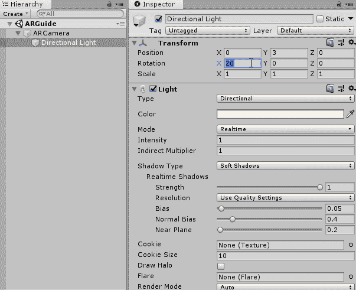

带有新值和 ARCamera 子级的方向光

现在我们已经在项目中准备好了 Vuforia 引擎，让我们开始 AR 创建过程。

# 在 Vuforia 中开发基于图像的 AR

Vuforia 最强大的功能之一是图像识别。Vuforia 引擎可以处理任何`.jpeg`或`.png`图像（我们的 AR 标记或目标）并提取其主要特征。它将稍后比较这些特征与来自移动设备或 AR 眼镜摄像头的实时图像，以在现实世界中找到该标记并将虚拟元素叠加在其上以创建 AR。在我们的案例中，我们将使用从 3D 模型中提取的三张甲壳虫汽车的图像。然而，图像可以来自任何来源，例如现实生活中的图片或计算机设计的图像。

下一节将展示我们如何在 Vuforia 中创建目标。

# 创建目标

当与图像一起工作时，Vuforia 提供了两种不同的选项：

+   *设备数据库*是通过对 Vuforia Target Manager 创建并通过本地项目下载和包含的图像目标组。

+   *云识别*指的是直接在线托管和管理图像目标组。

对于这个项目，我们将使用第一个选项。数据库，在 SDK 中也称为**数据集**，是一组目标。它们有助于大量目标的分类，以及内存和 CPU 的使用。数据库可以在运行时动态加载/卸载，并且所有加载的数据库中的目标都将添加到 AR 搜索中。在撰写本书时，数据库中目标数量的硬限制尚不存在，尽管 Vuforia 出于性能原因建议不要超过 1,000。

要创建我们自己的数据库和目标，我们必须登录到 Vuforia 开发门户并前往目标管理器，如下所示：

1.  前往目标管理器页面[`developer.vuforia.com/vui/develop/databases`](https://developer.vuforia.com/vui/develop/databases)。

1.  登录或注册（如果您没有账户）以进入页面：

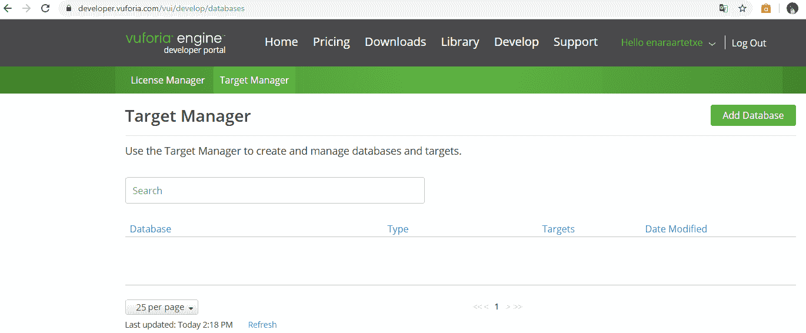

“目标管理器”页面

1.  点击右上角的“添加数据库”以创建新数据库。因为我们将使用 Beetle 图像作为目标，所以给数据库命名为`Beetle`：

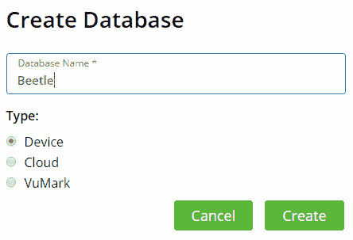

创建新数据库

1.  现在，点击创建的数据库，然后点击添加目标。

1.  点击浏览按钮，从项目的资源文件夹中的`Targets`文件夹选择`Side.jpg`图像。一旦上传，您将看到底部的名称字段将自动填充。给它一个宽度值为`1`并点击添加：

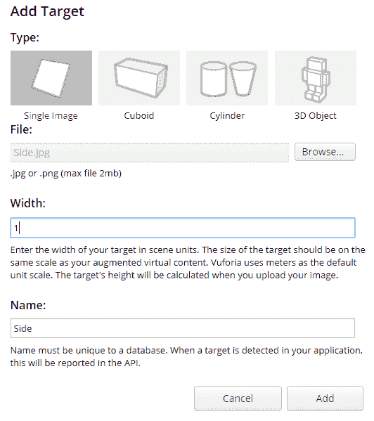

创建新目标

1.  目标将自动创建，旁边您将看到一些星星，如以下截图所示。这些星星表示图像将被 AR 软件识别的程度。四颗或五颗星星是好的目标。

如果您有任何疑问或想了解更多关于创建目标时出现的其他选项的信息，您可以查看[`library.vuforia.com/articles/Solution/How-To-Work-with-Device-Databases.html`](https://library.vuforia.com/articles/Solution/How-To-Work-with-Device-Databases.html)。

1.  使用`Back_closed.jpg`和`Back_open.jpg`图像以及相同的宽度`1`重复*步骤 4*和*步骤 5*，以便它们在 Unity 编辑器中具有相似的缩放：

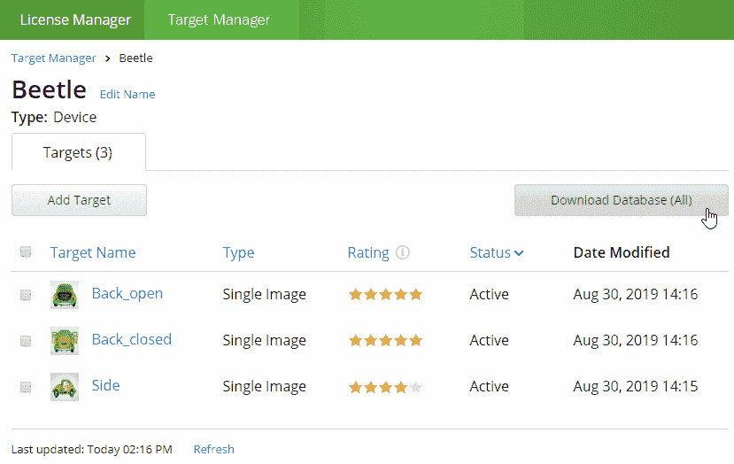

带有 Beetle 数据库及其目标的“目标管理器”页面

1.  创建了三个目标后，点击下载数据库（全部），选择 Unity 编辑器，然后点击下载。它将下载一个`Beetle.unitypackage`文件，我们将将其导入到项目中。

1.  双击`Beetle.unitypackage`文件将其导入 Unity。您也可以通过点击 Assets|导入包|自定义包…并选择文件来从 Unity 编辑器导入：

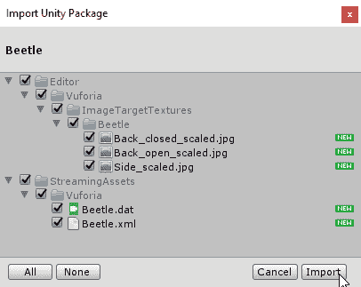

要导入到 Unity 中的目标数据库文件

1.  这将把数据库添加到一个新创建的`StreamingAssets/Vuforia`文件夹中，并将三个目标的压缩图像添加到`Editor/Vuforia/ImageTargetTextures/Beetle`文件夹中。

现在我们已经将数据库包含在我们的项目中，我们将按照以下步骤将三个目标添加到场景中：

1.  右键单击层次结构窗口，然后单击 Vuforia Engine|Image。这将在我们场景中创建一个 ImageTarget 对象：

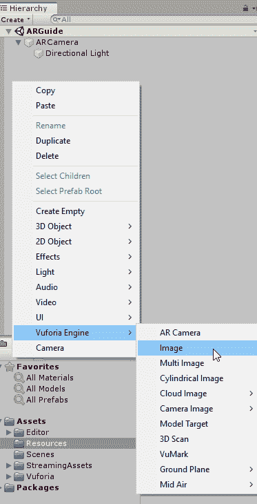

将 Vuforia ImageTarget 添加到场景中

1.  默认情况下，ARCamera 和 ImageTarget 将在同一位置，相机上不会显示任何内容。使用旋转选项卡，将相机在 X 轴上旋转`90`度，并向上移动`3`个单位，直到目标在视图中：

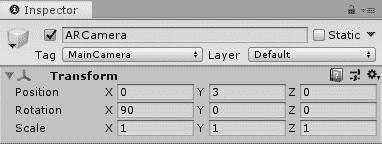

ARCamera 变换值

1.  创建其他两个 ImageTargets 并将它们移动到三个目标都在视图中。将它们命名为`Target_Side`、`Target_Close`和`Target_Open`，以便您可以区分它们：

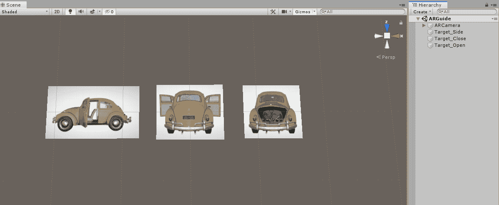

场景中的三个目标

1.  默认情况下，ImageTarget 代表第一个数据库中找到的第一个目标，按字母顺序排序。要更改它，请选择层次结构窗口中的`Target_Side`，然后在检查器窗口中，在 Image Target Behavior 组件下选择其图像。对`Target_Open`也做同样的操作。如果您愿意，可以使用缩放选项卡调整目标的大小，并将它们移动到看起来相似并占据整个相机宽度以获得更好的视图：


更改目标的图像引用

我们将在下一节学习如何添加测试立方体。

# 添加一些测试立方体

为了快速测试我们的场景，让我们创建三个不同的对象，以便在每个目标上方进行可视化：

1.  右键单击`Target_Side`并选择 3D Object|Cube。

1.  缩小它，以免完全隐藏目标。

1.  对于`Target_Close`，创建一个 3D Object|Sphere 而不是立方体，对于`Target_Open`，创建一个 3D Object|Capsule。

1.  也缩小它们，以便目标部分在视图中。由于这只是为了测试目的，我们不会向这些对象添加任何材质或纹理：

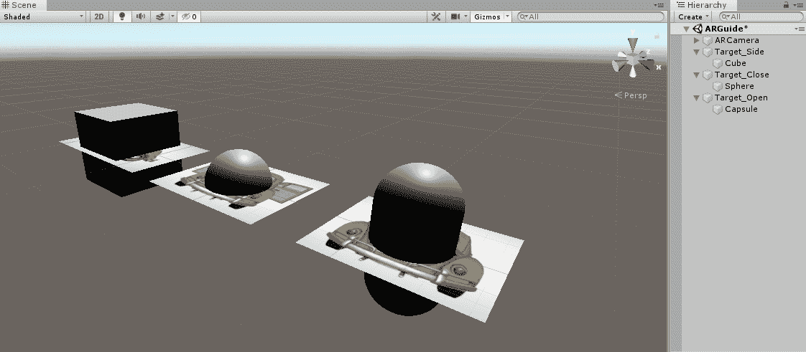

测试每个目标内的 3D 对象

现在，让我们获取我们的 Vuforia 密钥，以便我们可以测试应用。

# 获取密钥

为了测试应用或在设备上运行它，我们需要在 VuforiaConfiguration 对象中提供一个许可证密钥。由于我们已经登录到 Vuforia 页面创建目标，我们现在将获取所需的密钥。让我们开始吧：

1.  前往[`developer.vuforia.com/vui/develop/licenses`](https://developer.vuforia.com/vui/develop/licenses)的许可证管理页面。

1.  在许可证管理选项卡上，选择获取开发密钥以获取在开发期间使用的免费密钥。

1.  给它起一个应用的名字，`AR Guide`，阅读并接受条款，然后按确认。

1.  选择您新创建的许可证并复制密钥。

1.  现在，前往 Unity 编辑器并从场景中选择 ARCamera。

1.  在检查器窗口中点击“打开 Vuforia 引擎配置”按钮以打开通用 Vuforia 配置：

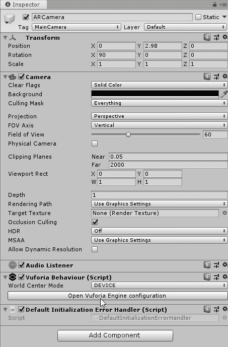

打开 Vuforia 引擎配置按钮

1.  将你的密钥粘贴到“应用许可证密钥”字段中：

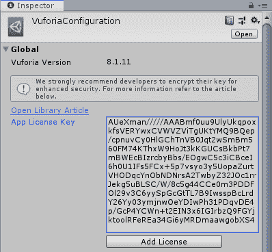

在检查器窗口中的 Vuforia 许可证密钥字段

现在，让我们测试应用以检查我们的 AR 场景是否已正确设置。

# 测试应用

一旦场景已配置并添加了密钥，点击顶部工具栏中的播放按钮并将摄像头指向三个目标图像。当你指向它们时，你将看到每个目标中出现的不同 3D 对象。

如果你选择在游戏视图的右上角最大化播放，你将能够更好地看到场景。

下一个图像显示了当摄像头指向它时，汽车侧方的立方体出现：

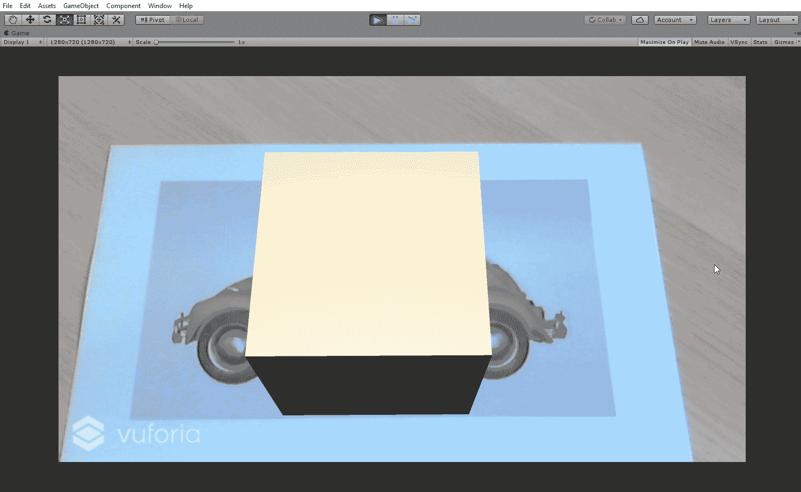

在游戏视图中，立方体对象出现在目标侧目标上方

你可以在项目窗口的`Assets/ Editor/Vuforia/ImageTargetTextures/Beetle`文件夹中找到这些图片。双击它们在电脑上打开，然后打印它们或直接使用摄像头指向它们。

现在我们已经设置了基本功能，让我们创建完整的应用。

# 为 AR 眼镜创建工业指南

现在我们已经准备好了基本设置，我们将创建一个指南，指导工人如何逐步进行汽车维护过程。应用将显示带有彩色图片和箭头的说明，这些箭头标记了他们需要查看的汽车部件。它还将提供一个帮助 PDF 文件，他们可以在需要时打开查阅。

应用的一般工作方式如下：

1.  当应用启动时，它将要求工人指向汽车的侧面以开始过程：

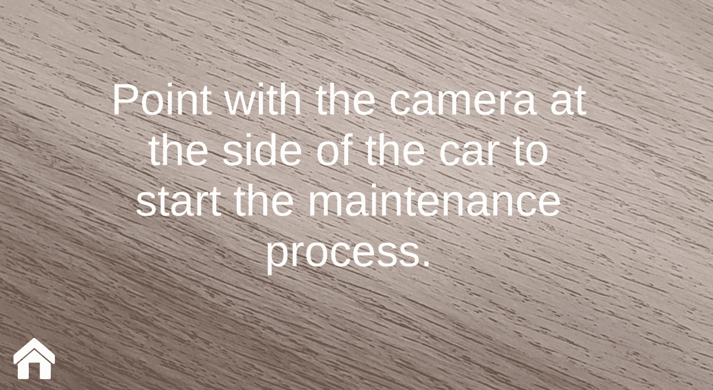

初始信息

1.  当用摄像头指向汽车侧面（目标侧）时，其蓝图将出现在其上方，用红色指示引擎中的问题：

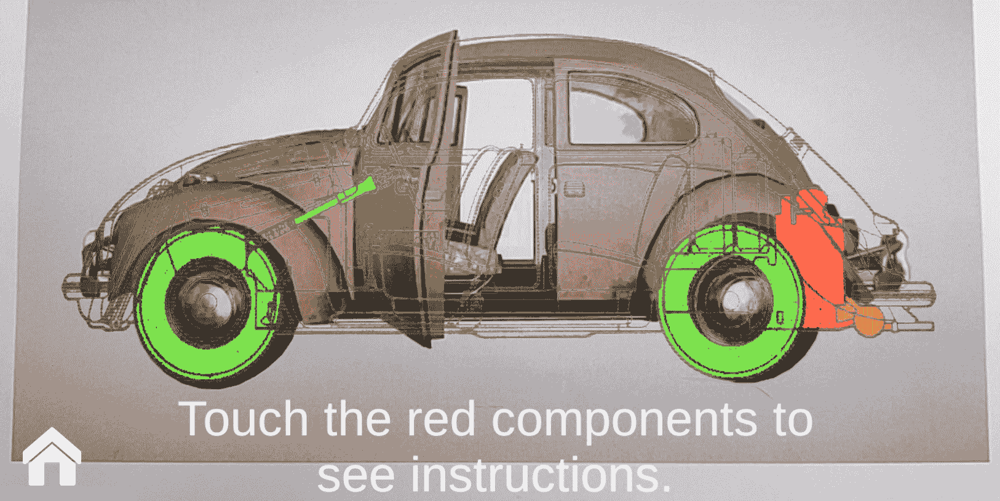

标记引擎的红色蓝图

1.  当操作员触摸红色方块时，应用将指示他们前往汽车的后面：

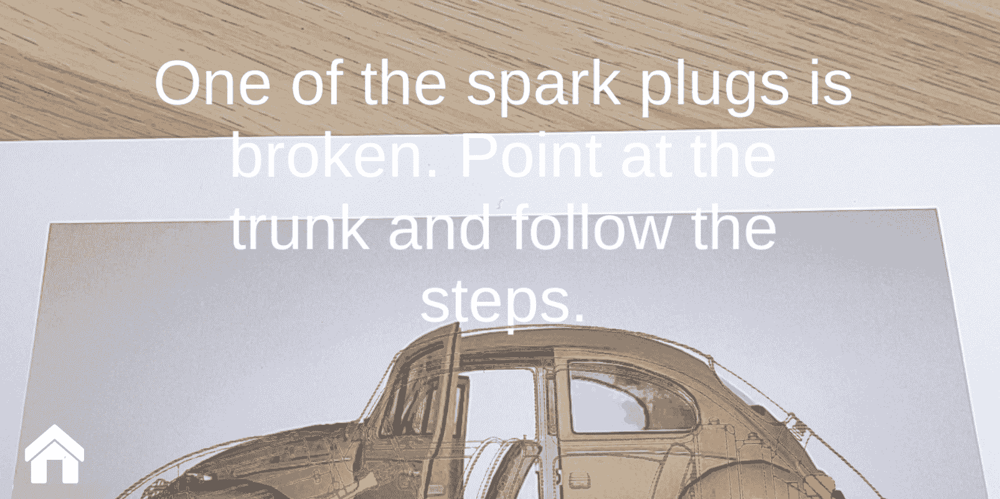

用户触摸引擎时的信息

1.  当用摄像头指向汽车后面（目标靠近）时，应用将通过闪烁的箭头指示打开行李箱：

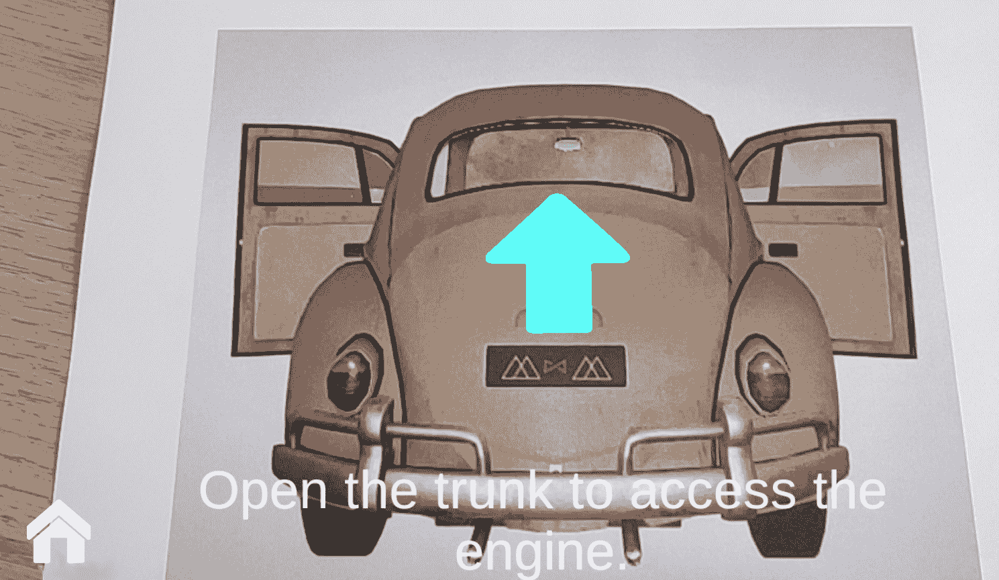

打开行李箱的信息

1.  一旦工人已经打开行李箱并指向引擎（目标打开），应用将指示用户需要移除并更换左上角的火花塞。

1.  在屏幕的一侧，将提供带有指令的帮助 PDF 文件，以防工人需要它们。

1.  当操作员完成更换部件后，他们将按下一个按钮以确认他们已完成任务：

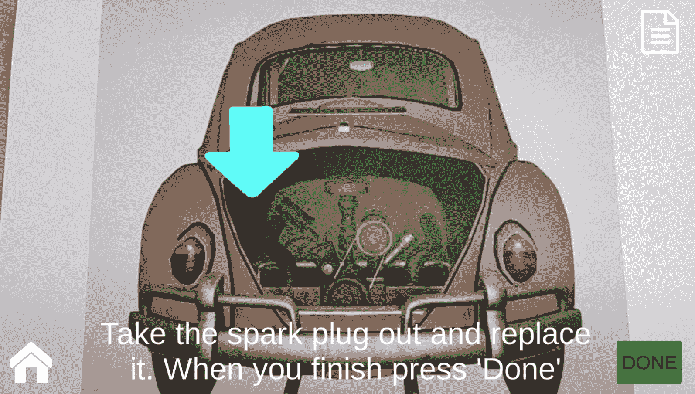

指向火花以替换的箭头和此步骤的 UI 按钮

注意：我们将使用的内容仅用于演示目的，并不对应此程序的真正指令。

在下一节中，我们将向我们的项目中添加所需的内容。

# 准备材料

对于这个项目，我们将使用一些需要导入到项目中并定制的媒体内容。我们必须将其放入项目中，然后在我们的场景中使用它。为此，请按照以下步骤操作：

1.  在项目窗口的`Assets`文件夹中创建一个新文件夹，命名为`@MyAssets`。然后，在它里面创建两个其他文件夹，分别命名为`Images`和`Scripts`：


在项目窗口中创建新文件夹

1.  从本章的资源中，将`arrow.png`、`blueprint.png`、`icon_file.png`和`icon_home.png`图像文件拖放到您刚刚创建的`Images`文件夹中。

1.  选择名为图标的图像，在检查器窗口中，将它们的纹理类型更改为 Sprite（2D 和 UI），这样我们就可以在 UI 中使用它们：

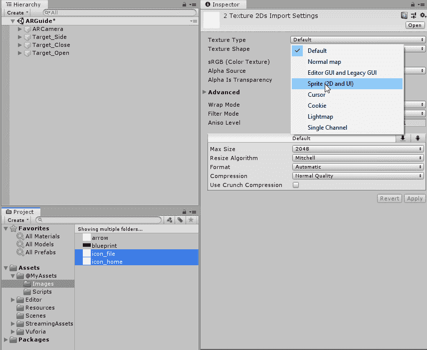

更改图标纹理类型

1.  在项目窗口的`Assets/StreamingAssets`文件夹中创建一个新的文件夹，命名为`PDF`，并将`WorkOrder_0021.pdf` PDF 文件拖放到其中：


StreamingAssets/PDF 文件夹中的 PDF 文件

# 添加 UI

对于这个项目来说，一个重要的事情是目标设备不是手机或平板电脑，而是 AR 眼镜。当使用眼镜时，场景视图被复制（每只眼睛）并且比平板电脑或手机小。因此，UI 及其元素的大小必须相应调整。

作为总结，对于本指南，我们需要以下元素：

+   **主信息**：占据屏幕大部分的文本，提供主要指令（指向汽车的侧面，前往后面等）。

+   **底部信息**：放置在屏幕底部的指示文本，提供与 AR 元素结合的次要指令（触摸红色元素以查看指令，打开行李箱，更换部件等）。

+   **PDF 按钮**：用于 PDF 格式的额外信息的按钮。

+   **主页按钮**：返回初始屏幕。

让我们一步步创建它们：

1.  首先在层次窗口中创建一个画布对象：

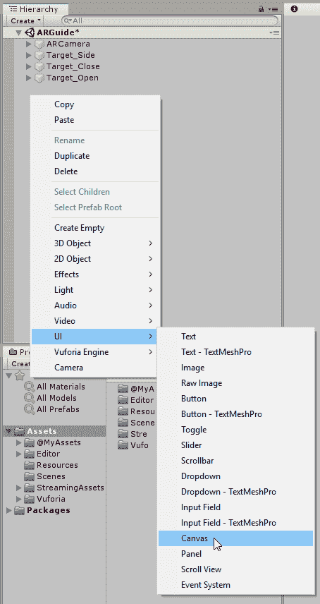

在场景中添加画布

当创建 Canvas 对象（任何其他 UI 元素的父对象）时，会自动创建一个事件系统对象，该对象负责与 UI 连接的用户事件。如果您在创建 Canvas 之前尝试创建任何 UI 组件（例如，文本、按钮等），Unity 将创建一个 Canvas 元素（及其 EventSystem 对象），并将新组件作为其子组件。

1.  在检查器窗口中，将画布组件的渲染模式从屏幕空间 - 覆盖更改为世界空间，并选择 ARCamera 作为事件相机。这样，画布就被放置在 3D 世界中，而不是固定，可以移动/缩放。在矩形变换组件中，输入图像的值，以便画布位于相机前面：

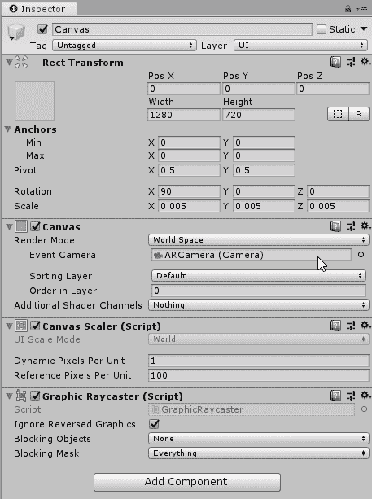

Canvas 游戏对象的值

1.  让我们创建主要消息。在层次结构窗口中右键单击画布元素，并选择 UI|Text。将其命名为`Main_message`：

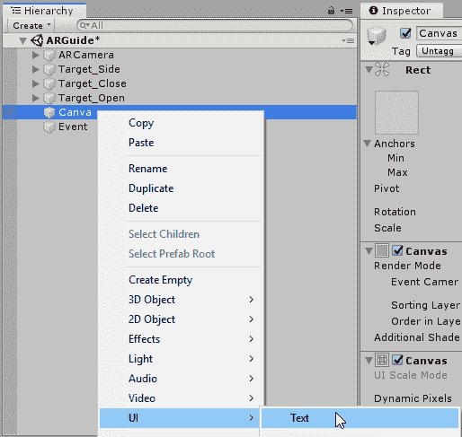

在画布元素内创建新文本

1.  在层次结构窗口中，更改矩形变换组件的值以匹配以下截图。移除默认文本，更改对齐方式使其在屏幕中居中，勾选最佳拟合复选框以便文本填充容器，将最大尺寸设置为`80`以确保足够大，并将颜色更改为白色：

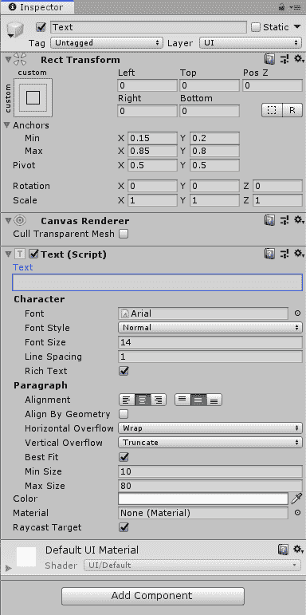

Main_message 中矩形变换和文本组件的值

1.  我们现在将创建一个次要信息面板。由于它与前面的面板非常相似，我们可以直接右键单击前面的面板并选择复制：

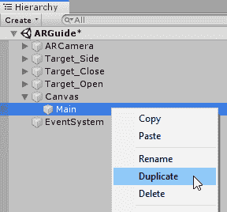

复制消息

1.  将其名称更改为`Bottom_message`，并更改其矩形变换值，使其位于屏幕底部：

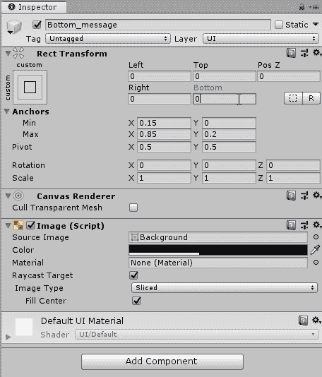

新消息的值

1.  要创建按钮，请右键单击画布元素并选择 UI|Button：


在画布上创建按钮元素

1.  从它上面移除文本，并将按钮名称更改为`Home_button`。

1.  在矩形变换中，选择将其锚定到左下角，并从图像中复制值以将其放置在屏幕左下角，并为其眼镜设置适当的大小：

1.  在图像组件中，选择`icon_home`图像作为源图像，并在按钮组件中更改按下颜色。这样，当按钮被点击时，它将从白色变为蓝色：

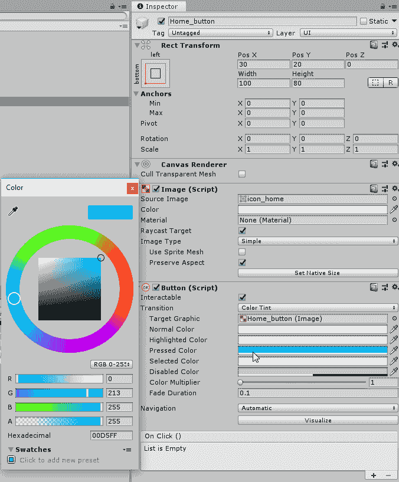

Home_button 在检查器中的值

1.  复制按钮以创建其副本，并将其命名为`File_button`。更改其矩形变换，以便您可以将其定位在屏幕右上角，并将其源图像更改为 icon_file，如下所示：

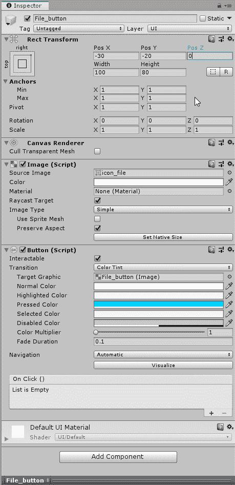

File_button 的值

1.  现在，从头开始创建最后一个按钮，命名为`OK_button`，并将其放置在屏幕的右下角。将其正常颜色更改为浅绿色：

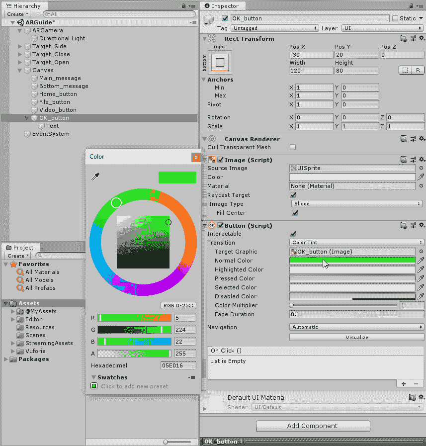

Ok_button 元素的值

1.  在按钮上右键单击 Text 子项，并更改 Rect Transform 和 Text 组件参数，使其与以下截图中的内容匹配：

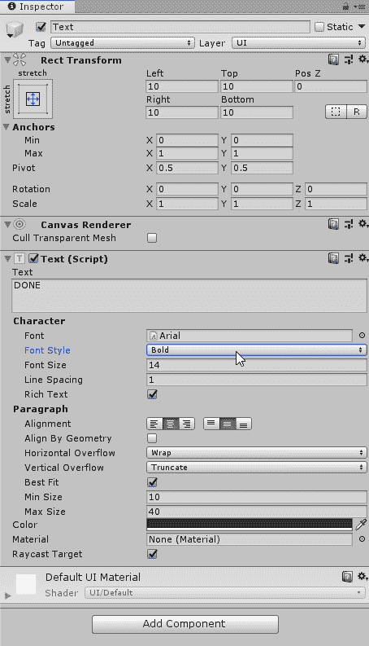

Ok_button 内部 Text 元素的值

1.  您的场景和游戏视图现在应该看起来像这样：

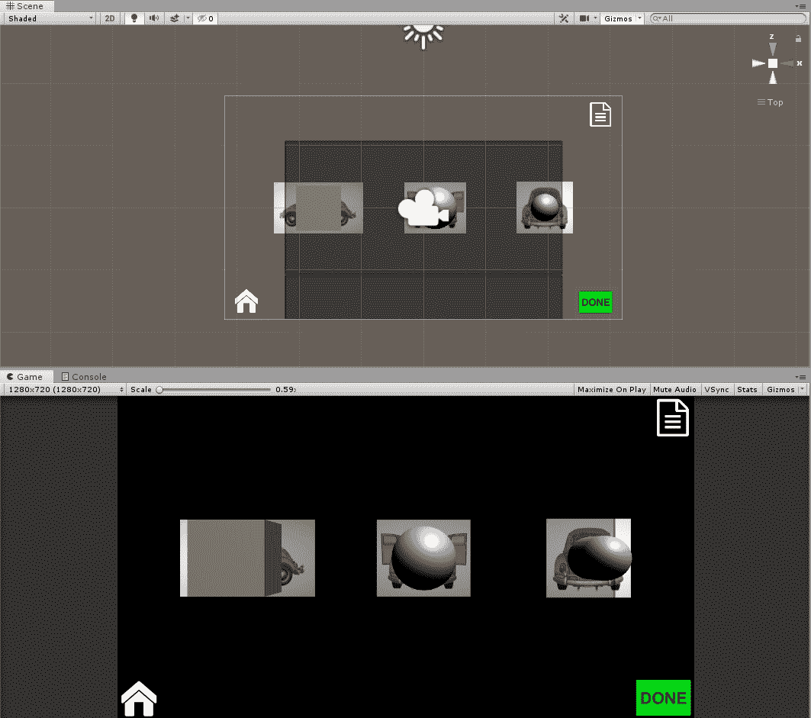

带有创建的 UI 的场景和游戏视图

注意，如果您在工具栏中按下播放按钮，您会看到当真实摄像头的视频流启动时，UI 消失了。不要担心这一点，因为我们将在本节的后面调整它。

现在 UI 元素已经准备好了，我们将添加虚拟元素，这些元素将在 AR 中显示，以及与它们相关的逻辑。

# 安装 AR 场景

我们将要做的第一件事是修改场景中每个目标附加的`DefaultTrackableEventHandler.cs`脚本。此脚本确定在现实世界中找到或丢失目标时要执行的操作；默认情况下，它显示和隐藏附加到该目标任何子项的 Renderer、Collider 和 Canvas 元素。

对于我们的应用程序，我们需要知道何时找到目标，为此，我们将在脚本中添加一个变量。

对于这个项目，我们只需要在脚本中做一点小的修改。然而，如果您想添加更多代码来控制目标何时被找到或丢失，最好创建一个新的类，该类继承自`ITrackableEventHandler`，例如`DefaultTrackableEventHandler`，这样您就始终有一个参考类可以返回，以防代码中出现问题。

在项目窗口中，双击此脚本，您可以在 Vuforia|Scripts 中找到它。当 Visual Studio 窗口打开时，我们需要将`public bool found = false;`变量添加到变量中：

然后，在`OnTrackingFound()`方法内部，在末尾添加`found = true;`。

在`OnTrackingLost()`方法内部，在末尾添加`found = false;`。

这样，我们就可以从任何其他类中使用这个变量来知道是否找到了目标。

回到 Unity 中，让我们开始添加 AR 元素。为此，首先，删除测试 3D 立方体、球体和胶囊。

现在，我们将查看第一个目标：

1.  在 Target_Side 上右键单击并创建一个 3D Object|Plane：

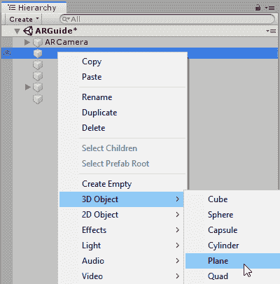

创建一个新的平面

1.  从项目窗口中，将蓝图图像拖到飞机上以使其成为其纹理：

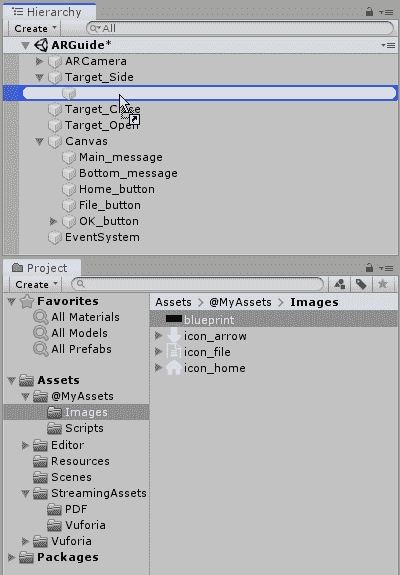

将蓝图图像作为飞机的纹理

1.  在检查器窗口中，将其名称更改为`Blueprint`。在底部材质面板中，将渲染模式更改为淡入，使其透明且平滑。现在旋转、缩放和平移平面，直到蓝图与下面的汽车匹配，如下面的截图所示：

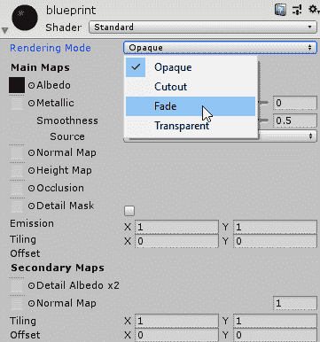

目标上方的蓝图及其在检查器窗口中的值

重要！保持 Y 位置值为`0.01`，以确保绘图位于目标上方，但不要离目标太远。这是为了确保 AR 正常工作，并且蓝图不会因为与目标分离太远而闪烁。

1.  现在，我们必须创建另一个覆盖发动机区域的平面，以便当用户触摸它时，它为他们提供方向。创建另一个名为`Engine`的 Blueprint 子平面。移动和调整其大小，直到它适合发动机区域（在蓝图上用红色标记）：

**重要！**将其保持在蓝图上方（Y 位置`0.015`或`0.02`）。

下一个图像显示了放置在发动机区域上的新灰色平面：

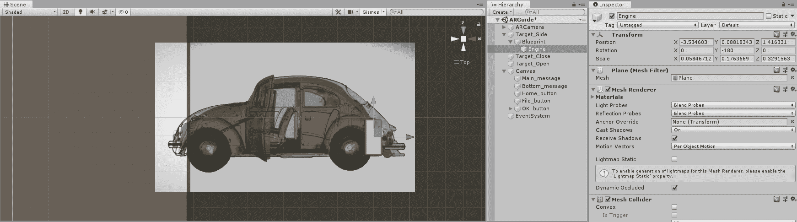

位于发动机区域上的新平面

现在，我们必须使这个平面不可见，因为它只起激活器的作用。在检查器面板中，通过点击右上角的齿轮并选择移除组件来移除其 Mesh Renderer 组件。现在，只有选择它时你才能看到平面：

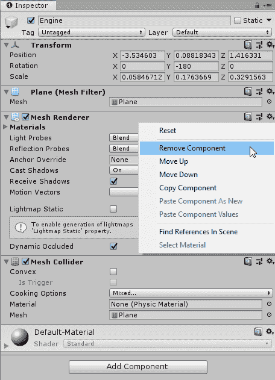

从平面上移除 Mesh Renderer 组件

让我们转到第二个目标。这个目标将显示一个箭头，指示用户打开树干：

1.  右键点击 Target_Close，创建一个新的 3D 对象|平面，并将其放置在树干中间。

1.  将箭头图像拖到平面上，使其成为其纹理。

1.  在检查器窗口中，将平面命名为`Arrow`。请记住将 Y 位置设置为`0.01`。在材质字段中，将渲染模式设置为淡入，并将 Albedo 颜色更改为浅蓝色：

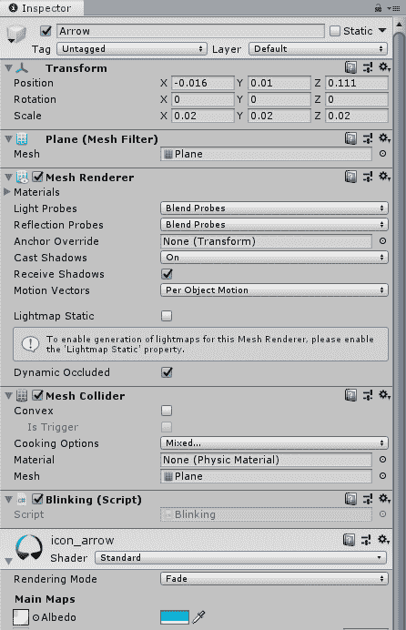

箭头平面的值

1.  要添加箭头的闪烁效果，在`@MyAssets/Script`文件夹中创建一个新的 C#脚本，并将其命名为`Blinking.cs`：

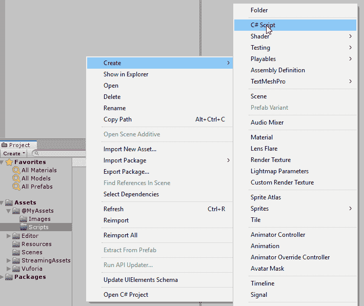

将新脚本添加到@MyAssets/Scripts 文件夹

1.  双击它以在 Visual Studio 中打开：

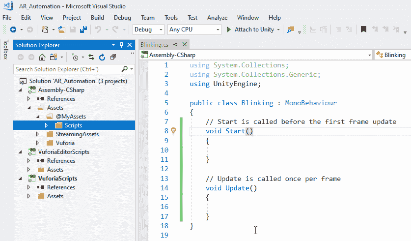

Visual Studio 中的闪烁脚本

1.  现在，添加以下行以创建闪烁效果。首先，声明以下变量：

```cs
private IEnumerator coroutine;
private bool blinking; 
```

`coroutine`是 Unity 中的一个特殊函数，它暂停执行并将控制权交回调用方法，直到满足某个条件，然后从上次停止的地方继续执行。我们将用它来每半秒闪烁一次。

1.  现在，在`Start()`方法内部，包含以下初始化行：

```cs
coroutine = BlinkingArrow(); 
blinking = false;
```

1.  在`Update()`方法之后添加`coroutine`：

```cs
private IEnumerator BlinkingArrow()
{
    while (true)
    {
        GetComponent<MeshRenderer>().enabled = false;
        yield return new WaitForSeconds(0.5f);
        GetComponent<MeshRenderer>().enabled = true;
        yield return new WaitForSeconds(0.5f);
    }
} 
```

`coroutine` 的常规暂停命令是 `yield return null;`，它暂停执行一帧。对于这个 `coroutine`，我们使用了 `yield return new WaitForSeconds(0.5f);` 来告诉 `coroutine` 在执行下一行之前等待半秒。使用此代码，我们使脚本附加到的 GameObject（箭头）的 `MeshRenderer` 组件每半秒出现和消失一次。

1.  在 `Update()` 方法内部，我们将使用 `coroutine` 以确保箭头仅在检测到目标时闪烁，否则隐藏。使用闪烁布尔值，我们将验证 `coroutine` 只启动一次：

```cs
if (GetComponentInParent<DefaultTrackableEventHandler>().found && !blinking)
{
    blinking = true;
    StartCoroutine(coroutine);
}
else if (!GetComponentInParent<DefaultTrackableEventHandler>().found && blinking)
{
    blinking = false;
    StopAllCoroutines();
    GetComponent<MeshRenderer>().enabled = false;
}
```

1.  在 Unity 编辑器中，回到检查器窗口，点击添加组件，并将闪烁脚本添加到箭头平面上：

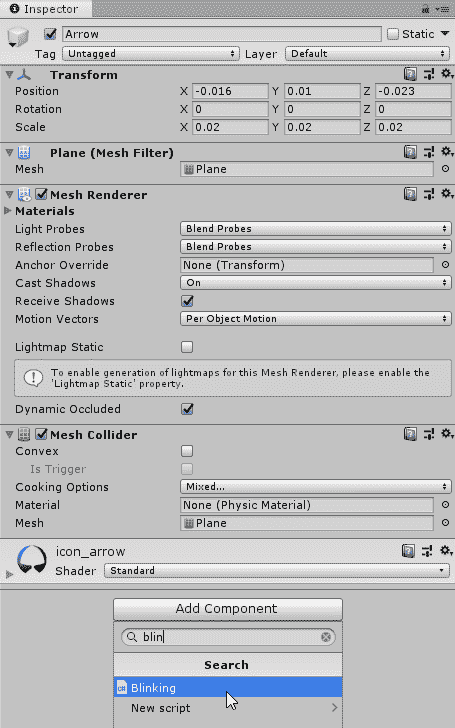

将新脚本添加到平面上

最后，让我们转到第三个目标，它将有一个另一个箭头：

1.  右键单击箭头游戏对象并按复制。

1.  然后，右键单击 Target_Open 游戏对象并粘贴它。

1.  移动和旋转它，直到它指向树干的左上角：

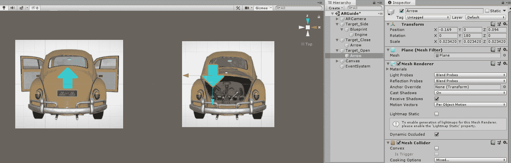

指向树干不同位置的两个箭头

目前，如果我们按下顶部工具栏上的播放按钮，当我们指向每个标记时，我们会看到蓝图和箭头出现。然而，我们需要将它们转换成逐步指南，只有当上一个步骤完成时才会显示指令。我们将在另一个脚本中添加该逻辑：

1.  在项目窗口中，在 `@MyAssets/Scripts` 文件夹中，右键单击并创建另一个 C# 脚本。

1.  将其命名为 `MainHandler.cs` 并双击它以在 Visual Studio 中打开：

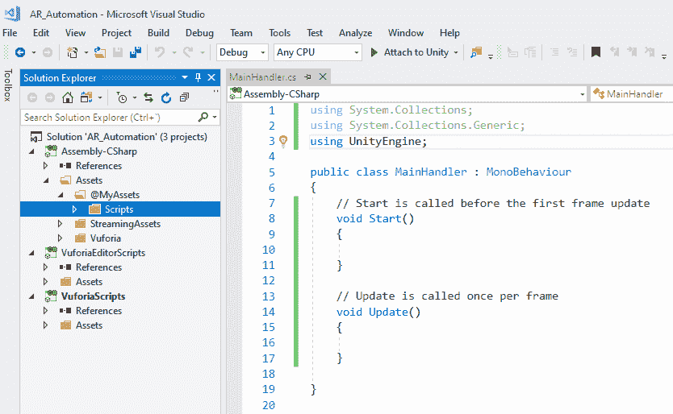

Visual Studio 中的 MainHandler 脚本

1.  首先向库中添加 Vuforia 的 `UnityEngine.UI`：

```cs
using Vuforia;
using UnityEngine.UI;
```

1.  然后，添加以下变量：

```cs
 public DefaultTrackableEventHandler targetSide;
 public DefaultTrackableEventHandler targetClose;
 public DefaultTrackableEventHandler targetOpen;

 public GameObject mainMessage;
 public GameObject bottomMessage;
 public GameObject fileButton;
 public GameObject okButton;
```

它们都是 `public` 的，因为我们将从 Unity 编辑器初始化它们。它们引用了我们将要与之交互的不同场景元素，包括目标对象和 UI 元素。

1.  现在，在变量之后添加此属性：

```cs
public bool Finished { get; set; }
```

它也是 `public` 的，因为当用户按下 Done 按钮时，我们也将从编辑器分配它。

1.  最后，添加以下私有变量，它是一个枚举，用于控制应用的每个状态：

```cs
private enum State
{
    Init = 0,
    Side = 1,
    Engine = 2,
    Close = 3,
    Open = 4,
    Plug = 5
}
private State state;
```

1.  现在，让我们在 `Update()` 方法之后添加一些方法。创建一个名为 `ShowElements()` 的新方法：

```cs
private void ShowElements()
{
}
```

它将在类内部私有使用，根据应用的状态显示或隐藏不同的组件。此方法还将控制每个步骤中显示信息的标记。

1.  我们将在 `ShowElements()` 内部创建一个 `switch` 调用：

```cs
switch (state)
{
    case State.Init:
    break;
    case State.Side:
    break;
    case State.Engine:
    break; 
    case State.Close:
    break;
    case State.Open:
    break;
    case State.Plug:
    break;
}
```

在这里，我们将告诉方法根据应用当前处于哪个状态执行不同的操作。

1.  在 `State.Init` 情况下，添加以下内容：

```cs
targetSide.gameObject.SetActive(true);
targetOpen.gameObject.SetActive(false);
targetClose.gameObject.SetActive(false);

mainMessage.SetActive(true);
bottomMessage.SetActive(false);
fileButton.SetActive(false);
okButton.SetActive(false);

mainMessage.GetComponentInChildren<Text>().text = "Point with the camera at the side of the car to start the maintenance process.";
```

在这里，我们只显示`targetSide`目标。为了确保用户无法看到其他两个目标的说明，我们只激活主要信息并添加文本到其中。

1.  在`State.Side`情况中，添加以下内容：

```cs
mainMessage.SetActive(false);
bottomMessage.SetActive(true);

bottomMessage.GetComponentInChildren<Text>().text = "Touch the red components to see instructions.";
```

当用户使用相机找到`targetSide`时，我们进入此状态，在此状态下，我们停用主要信息并显示底部信息。

1.  在`State.Engine`情况中，添加以下内容：

```cs
targetClose.gameObject.SetActive(true);

mainMessage.SetActive(true);
bottomMessage.SetActive(false);

mainMessage.GetComponentInChildren<Text>().text = "One of the spark plugs is broken. Point at the trunk and follow the steps.";
```

如果用户触摸了红色组件，我们将激活下一个目标并显示带有如何找到它的说明的主要信息。

1.  在`State.Close`情况中，添加以下内容：

```cs
targetSide.gameObject.SetActive(false);
targetOpen.gameObject.SetActive(true);

mainMessage.SetActive(false);
bottomMessage.SetActive(true);

bottomMessage.GetComponentInChildren<Text>().text = "Open the trunk to access the engine.";
```

用户已经找到了`targetClose`，因此我们停用前一个并激活下一个。我们还在底部添加了一条信息以打开树干。

1.  在`State.Open`情况中，添加以下内容：

```cs
targetClose.gameObject.SetActive(false);

fileButton.SetActive(true);
okButton.SetActive(true);

bottomMessage.GetComponentInChildren<Text>().text = "Take the spark plug out and replace it. When you finish press 'Done'";
```

在这里，我们激活两个按钮：`fileButton`用于查看 PDF，`okButton`用于完成流程。

1.  在`State.Plug`情况中，添加以下内容：

```cs
targetOpen.gameObject.SetActive(false);

mainMessage.SetActive(true);
bottomMessage.SetActive(false);
fileButton.SetActive(false);
okButton.SetActive(false);

mainMessage.GetComponentInChildren<Text>().text = "Well done, you can take a coffee now :)";
```

这是最后一步，因此我们将隐藏按钮和目标，只留下结束信息可见。

1.  现在，创建另一个名为`NextStep()`的方法：

```cs
private void NextStep()
{
    state++;
    ShowElements();
}
```

我们将调用此方法从一步转换到下一步。

1.  添加另一个名为`ResetInstructions()`的方法：

```cs
public void ResetInstructions()
{
    state = 0;
    ShowElements();
}
```

此方法为`public`，因为它将由编辑器通过 Home 按钮调用。它将转到应用初始状态。

1.  现在，让我们修改`Start()`方法，将其转换为在隐藏第二个和第三个目标之前等待 Vuforia 初始化的`coroutine`。否则，它可能无法识别它们：

```cs
IEnumerator Start()
{
    while (!VuforiaARController.Instance.HasStarted) //waits until Vuforia has instanciated the three markers
        yield return null;
    state = State.Init;
    ShowElements();
 }
```

1.  最后，在`Update()`方法中，输入从一步到下一步的逻辑转换。因此，当以下情况发生时，应用将从一个步骤跳转到下一个步骤：

+   在`Init`、`Engine`和`Close`状态下，应用检测相应的目标（侧面、关闭、打开）

+   在`Side`状态下，用户触摸屏幕上的汽车引擎区域

+   在`Open`状态下，用户触摸了完成按钮：

```cs
if ((state == State.Init && targetSide.found) || (state == State.Engine && targetClose.found) || (state == State.Close && targetOpen.found))
{
    NextStep();
}
else if (state == State.Side)
{
    if (Input.GetMouseButtonDown(0))
    {
        RaycastHit hit;
        Ray ray = Camera.main.ScreenPointToRay(Input.mousePosition);
        if (Physics.Raycast(ray, out hit))
            if (hit.transform.name == "Engine")
                NextStep();
    }
}
else if (state == State.Open && Finished)
{
    Finished = false;
    NextStep();
}
```

一旦我们完成了脚本，回到 Unity：

1.  将脚本从项目窗口拖到层次结构窗口中的 ARCamera 游戏对象。或者，点击 ARCamera，在检查器窗口中，点击添加组件并选择脚本。将场景中的元素填写到 Main Handler 脚本中的每个字段：

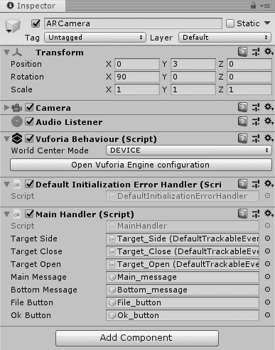

主处理程序及其在 ARCamera 游戏对象中的字段

1.  选择 Home_button。然后，在检查器窗口中，在点击（OnClick）面板中添加一个新事件，选择 ARCamera，然后选择 ResetInstructions()方法：

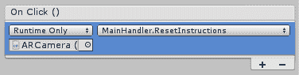

在“Home_button”的点击（Click）事件中

1.  选择 OK_button。然后，在检查器窗口中，在点击（OnClick）面板中添加一个新事件，选择 ARCamera，然后选择 Finished 属性。勾选复选框，以便每次按下按钮时，Finished 属性都将设置为 true：


在 OK_button 的 OnClick()事件中

现在我们已经准备好了主要功能，让我们配置场景，以便我们可以在眼镜中构建它。

# 配置眼镜的 AR

这个步骤非常重要，这样我们才能了解眼镜的工作原理*.*

如果在这个时候，我们在 Moverio 眼镜中编译应用程序，我们将在眼镜屏幕上看到视频流，就像我们使用手机一样。这不是使用 AR 的最佳方式；我们希望背景保持透明，只有 UI 元素和 AR 元素出现在屏幕上。

然而，为了看到眼镜中 AR 的效果和某些特性，我们将编译应用程序，然后进行相关修改。

打开 Moverio 眼镜，并通过 USB 将它们连接到你的电脑。

由于你已经定义了设置，切换到 Android 平台，并在介绍中将当前场景添加到建筑列表中，只需点击*Ctrl* + *B*或点击文件|构建和运行（如果你跳过了任何这些步骤，或者如果你不确定，请转到文件|构建设置…并检查是否一切正常）。给`.apk`文件命名并构建它。

正如我们讨论的那样，你将在眼镜上看到视频流，UI 将比预期的大。现在，先忘记 UI，看看视频流。如果你将视频流与背后的真实世界图像进行比较，你会发现视频流比真实世界小，并且略有偏移（考虑到相机放置在眼镜的一侧）。以下图片显示了这种偏移（考虑到图片只从眼镜的左侧屏幕拍摄，所以偏移比左右两侧结合时更大）：

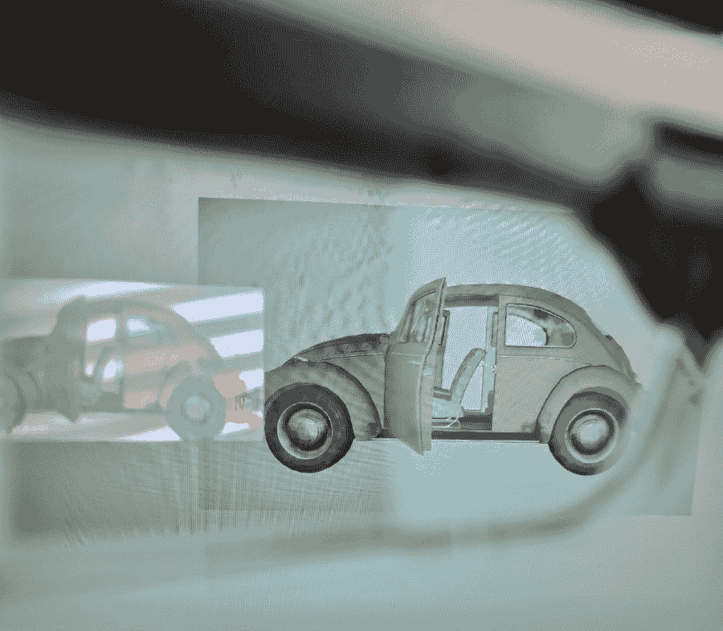

眼镜的 AR 视图

我们必须考虑到这一点，因为当我们移除视频流时，AR 元素在目标上看起来会更小，并且会有偏移。

因此，首先，让我们获取视频反馈。在 Vuforia 中这是一个非常简单的步骤，因为在最新版本中，他们已经将其从代码中移除，并将其放置在 Vuforia 引擎配置中的复选框中。按照以下步骤进行操作：

1.  选择 ARCamera 并在检查器窗口中点击打开 Vuforia 引擎配置。

1.  在视频背景组件中，取消选中启用视频背景：

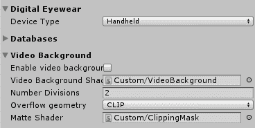

在 Vuforia 引擎配置中禁用视频流

1.  就这样！通过按*Ctrl* + *B*重新构建应用程序，你会看到这次视频没有出现，当你用眼镜指向侧面目标时，只会显示 AR 元素。你也会看到，没有视频流，UI 的大小是正确的。

在视频背景组件之前，还有一个数字眼镜组件。最初，当 Vuforia 首次启用 AR 眼镜时，场景的配置是通过这个组件进行的。然而，现在，它只对 HoloLens 用户有价值，以便为这些眼镜选择配置。

1.  最后，让我们使 AR 元素与眼镜可以看到的真实元素相匹配。不幸的是，目前还没有一个确切的方法来做这件事。因此，我们将通过试错法取出位移和尺寸参数，并将它们应用到其他元素上。对于这个项目，这些值如下：

+   位移：x 轴上 `+0.5f`

+   缩放：所有轴上 `*2.5`

而不是逐个应用它们，在您的 `@MyAssets/Scripts` 文件夹中创建一个新的脚本，命名为 `GlassesHandler.cs`，并在 Visual Studio 中打开它。在 `Start()` 方法内添加以下行：

```cs
foreach (Transform child in transform)
{
   Vector3 scale = child.localScale;
    scale *= 2.5f;
    child.localScale = scale;

    Vector3 position = child.position;
    position += new Vector3(0.5f, 0, 0);
    child.position = position;
}
```

位置、旋转和缩放参数不能直接添加；必须使用一个中间变量。

您的代码应该看起来像这样：

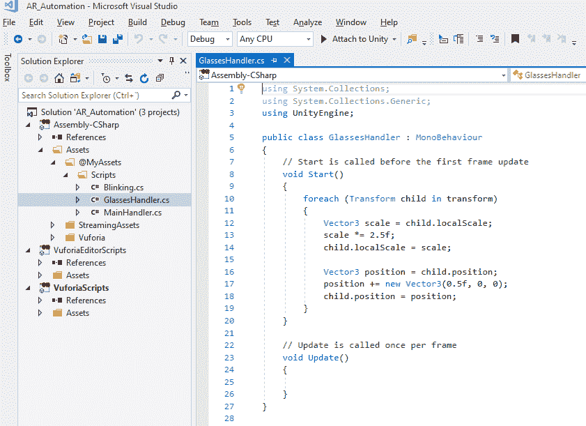

Visual Studio 中的 GlassesHandler 脚本

1.  将此脚本拖到三个目标之一，或者通过选择每个目标，在检查器窗口中按“添加组件”，然后选择脚本来添加它。

1.  按 *Ctrl* + *B* 构建您的应用程序，并查看元素现在是如何覆盖真实元素的。

为了完成我们的应用程序，我们将添加 PDF 功能来帮助操作员完成他们的工作。

# 添加 PDF 文件

PDF 文件是一个稍微有些困难的任务；由于 Unity 无法内部打开它们，必须使用外部应用程序。在本节中，我们将了解一个简单的调用，我们可以用它来打开 PDF 文件，但它也可以用于其他类型的扩展（如视频）以及通过 URL 打开服务器文件。

重要！首先，您必须在眼镜中安装一个可以打开 PDF 文件的程序，例如 Adobe Reader。请访问 Moverio 网站，了解如何找到和安装这些类型的应用程序。

如您所记得，我们没有将视频和 PDF 文件放置在 `@MyAssets` 文件夹中，而是在 `StreamingAssets/PDF` 文件夹中。这个文件夹是 Unity 中的一个特殊文件夹，其中的所有文件都将原样复制到目标设备，这意味着它们根本不会被 Unity 处理。我们不能直接从这个路径加载它们，因此我们将首先将它们复制到一个可访问的路径。

前往 Visual Studio，在 `MainHandler.cs` 脚本中，让我们添加一些代码来处理这些文件。按照以下步骤进行操作：

1.  添加 `System.IO` 库：

```cs
using System.IO;
```

1.  在开始处添加以下变量，以指示设备内 PDF 文件的路径：

```cs
private string originalPath;
private string savePath;
```

1.  在 `Start()` 方法内初始化它们：

```cs
originalPath = Application.streamingAssetsPath + "/PDF/WorkOrder_0021.pdf";
savePath = Application.persistentDataPath + "/WorkOrder_0021.pdf";
```

1.  添加以下 `coroutine`，它将 PDF 文件从 `StreamingAssets` 位置复制到可访问的路径并打开：

```cs
private IEnumerator OpenFileCoroutine()
{
    WWW www = new WWW(originalPath);
    yield return www;
    if (www.error != null)
        Debug.Log("Error loading: " + www.error);
    else
    {
        byte[] bytes = www.bytes;
        File.WriteAllBytes(savePath, bytes);
        Application.OpenURL(savePath);
    }
}
```

1.  最后，添加以下 `public` 方法来打开 PDF 文件：

```cs
public void OpenPDFFile()
{
    if (File.Exists(savePath))
        Application.OpenURL(savePath);
    else
        StartCoroutine(OpenFileCoroutine());
}
```

如果文件已存在于可访问的位置，它将打开它。否则，它将首先复制，然后从协程中打开它。

`Application.OpenURL()`无论给定路径是 URL 还是内部路径，都会打开它。

在 Unity 编辑器中，选择文件按钮，然后在检查器窗口中，将 OpenPDFfile()调用添加到其 OnClick()事件中：

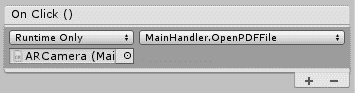

文件按钮的 OnClick()事件

最后再按一次*Ctrl* + *B*，以在眼镜中查看完整的应用程序。

# 摘要

在本章中，你学习了 Vuforia 的另一个功能，`ImageTargets`*，以及如何创建自己的图像目标并向其添加虚拟内容。你还学习了如何使用 Unity 界面和脚本来创建消息和按钮，以及顺序指令。

通过所有这些，你已经掌握了使用 Vuforia 创建可实施于安装、维护或培训流程的工业 AR 指南所需的技能。你还学会了如何使用 OpenURL 方法，其中包含 URL，通过它来定制步骤，甚至添加额外的 PDF 或视频和数据文件，这些文件可以是本地获取的（如本项目所示）或从远程服务器获取的。

现在，你可以利用这些知识来创建你自己的流程指南，并将当前项目作为模板。你也可以通过使用现实生活中的图片，将一些步骤链接到你的指令 PDF 文件，或者使用来自服务器的信号或信息触发从一步到另一步的变化来改进和扩展它。

正如你所见，该项目也易于在移动设备上部署，从这里，你可以尝试将其迁移到其他类型的眼镜上，看看结果。你也已经掌握了尝试其他 Vuforia 示例的技能，这些示例可以在 Unity Asset Store 中找到，由 PTC 发布：[`assetstore.unity.com/publishers/24484`](https://assetstore.unity.com/publishers/24484)。

在下一章中，我们将完全改变范围，学习如何使用 ARKit 为旅游行业创建一个 AR 门户，将用户带入一个虚拟的 3D 世界。
