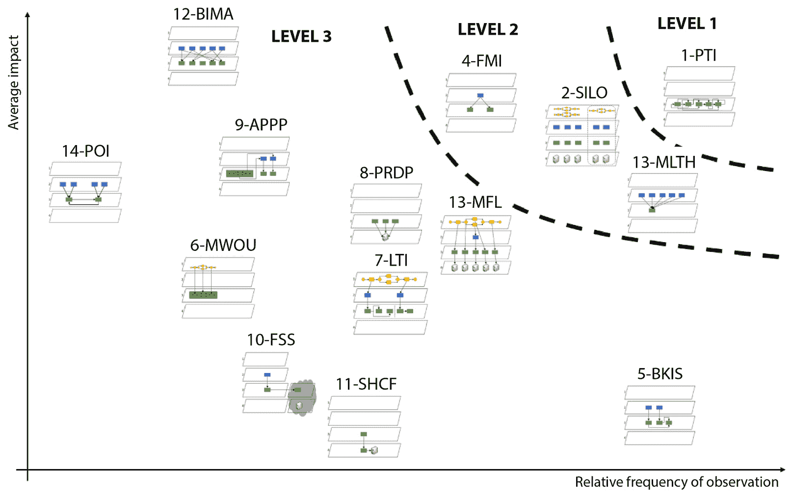
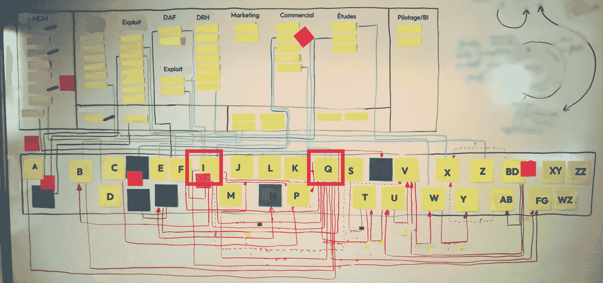

# 1

# 信息系统的不幸状态

在提出解决方案之前，分享对情况的彻底诊断是至关重要的。在信息系统和更广泛地，计算机使用的情况下，任何用户都知道“bug”这个术语，并经历过与故障相关的挫败感，有时这种挫败感具有很高的个人影响（个人数据丢失、收入后果等）。对于公司来说，IT 故障可能具有严重的后果，因为它们越来越依赖计算机来实现其业务运营，从而实现其财务目标。

在定义信息系统是什么以及解释其效率（或缺乏效率）如何计算之后，我们将尝试分类导致此类问题的原因。至于解决方案，这将是本书其余部分的主题。但到目前为止，我们必须了解信息系统出了什么问题，它是如何发生的，更重要的是，为什么会出现这种情况。

在本章中，我们将涵盖以下主要主题：

+   什么是信息系统？

+   为什么软件开发仍然是一门手艺，既有好的一面也有坏的一面？

+   如何评估信息系统的效率

+   如何分类可能发生在信息系统上的不同影响，以及它们的起因和后果

# 什么是信息系统？

在讨论信息系统状态之前，给出一个清晰的信息系统定义，甚至系统的定义可能是有用的。

**系统**是一组共同运作以实现共同目标的物品集合。这是系统与个体联合的基本区别：系统的各个部分共同朝着愿景努力。

**信息系统**（我们有时将其缩写为**IS**）进一步将此定义为一组共享信息以实现共同目标的物品集合。严格来说，信息系统不一定由软件组成，尽管本书中我们将讨论的大部分内容都是关于计算机化信息系统。即使在最复杂的信息系统中，也仍然存在一个不可忽视的信息部分，这部分信息不是软件包含的。这种情况我们将讨论，但本书的主要部分，我们将假设基于软件的信息系统，因为它们现在几乎在每家公司和组织中都很普遍。

因此，信息系统被理解为一系列旨在实现目标的软件工具。对于拥有系统的大多数公司来说，这个目标通常被设计为一个业务流程。需要注意的是，软件始终依赖于硬件，但这种依赖性越来越被隐藏在幕后，信息系统越来越被视为软件手段，通过有效地实施功能流程，组织在一起以实现商业目标。

## 信息系统简史

当处理一般主题，如信息系统的质量时，回顾过去并分析其向当前情况的演变总是很有趣。

如果我们遵循之前提出的定义，信息系统只有在至少两个实体协作时才会出现。在我们基于软件的信息系统假设中，这意味着至少有两台计算机已经连接。这意味着最初需要占用整个房间的计算机，尽管它们经常被称为“大型系统”（在这种情况下，组装的物品是计算机制、短期内存和长期内存），但不应该被视为系统。

让我们再向前推进一点时间，谈谈 IBM 的客户-服务器大型机：这些是我们可以认为是信息系统的第一批，因为它们有连接到中央计算机的客户工作站，信息在它们之间流动。该协议是专有的，这使得 IBM 能够提供这些系统的高质量服务（其中许多至今仍在运行）。由于协议的唯一实现由同一团队定义，因此兼容性和互操作性并不是一个大问题。这是遗产，但当系统运行良好且现代化风险很高时，企业逻辑上会选择不移动任何东西（这是信息系统管理的第一规则：如果它运行良好，就不要去动它）。

快进到九十年代，这是个人电脑（**PCs**）的时代。尽管全球都在努力保持机器之间的兼容性，但当时使用电脑的人都知道，如果某个软件不支持嵌入式显卡，那么这无疑是部分失败。当然，从那时起，事情有了很大的改善，**视频电子标准协会**（**VESA**）为显卡和屏幕制定了国际标准，如 VGA 或 VESA，以及许多其他规范，使得在当今时代更换 PC 的组件而不会破坏整个系统成为可能。然而，对信息系统造成的损失相当大：当单台机器的组件都难以组装时，我们怎能期望机器网络能良好地协同工作呢？专有格式、不同的编码、几乎完全缺乏强大的数据交换协议：所有这些都导致了困难的情况，只有高预算的公司才能在专家的帮助下操作复杂的计算机化系统，这些专家会对电子板上的跳线、编译器参数等任何东西都感到紧张。

幸运的是，随着互联网的扩张和其对标准化计算机之间交换的激进方法，Y2K 问题得到了解决。现在，每个遵守 TCP/IP、HTTP、Unicode 和其他互联网标准协议的计算机都可以与世界上任何地方的另一台计算机交换数据，无论其硬件和操作系统实现如何。这是 IT 历史上的一大步，也是我们今天“现代”信息系统根本定义的根源。

在此基础上增加了几层软件，以便于在系统中重用功能。它从低级开始，通过例程进行本地代码重用，然后是库和组件。随着网络容量的出现，这演变为分布式组件、Web 服务，最终是**面向服务的架构**（**SOA**）。这也是引入 n 层架构的时候，在软件应用内部建立了第一层责任分离，包括**图形用户界面**（**GUI**）管理、功能服务的展示、业务规则的实现和持久性管理。

最后一点，SOA，导致许多公司遭受了昂贵的失败，绝大多数尝试实施此类架构的努力都导致了重要的经济损失和项目的放弃。技术步骤太高，难以顺利运行，出现了更轻的替代方案来消除 SOA 方法的地方性困难：

+   **标准化消息中间件**：为了对抗在 SOA 上运营并使用它来锁定其客户的那些大型软件公司提出的专有交换协议

+   **REST 方法**：为了减轻 SOAP/WSDL Web 服务和所有相关规范的重量

+   **企业服务总线**：这项技术用于降低中间件的重要性，达到“哑管道”范式，其中参与系统的软件应用能够相互通信，而无需一个中心软件，该软件可能会成为单点故障

正如一些参考书籍（Sassoon, Longépé, 和 Caseau）所示，设计一个强大且具有进化能力的 IS 的最佳实践在 20 世纪 90 年代末就已经存在，尽管并不广为人知。但直到 21 世纪初，这些实践在社区中的份额才有所增加，SOA 和其他基于服务的途径蓬勃发展，导致在 2010 年代初出现了微服务架构。这套实践在撰写本文时仍被视为参考架构，尽管我们将看到，并非所有建议都应在没有对其在研究环境中有用性进行强烈分析的情况下应用。正如我们将看到的，服务的粒度是获得高效 IS 的关键。但到目前为止，我们将讨论软件构建的一般性，并试图理解这个所谓的“行业”的当前局限性。

# 软件构建——仍然是工艺

本书对信息系统精确定义的解释，以及其演变简史，已经给出。这个历史不仅非常简短，而且展示了许多最近的演变，其中大多数与之前的技术状态截然不同。这种非常快速的演变表明，信息系统设计不是一种可以被认为是稳定和完全理解的东西。

在软件信息系统设计和部署中，仍保留着大量的工艺。工艺有其优点：对细节的关注、定制化的功能、独特性以及更多。它也有许多缺点，如成本高、难以在受控方式下进化、依赖少数创作者等。这些缺点在现代公司中超过了其优点，因为信息系统已经成为运营的骨干。

精心构建的信息系统是从任意演化的系统中演变而来的，工匠的工作没有什么是可耻的，但今天的道路是走向信息系统的工业化方法。这正是本书的主题。

## 工艺与之前缺乏质量相对立

在 IT 的多个领域，工艺被用于与较老、更随意和自我组织的旧方法相对立。例如，许多 IT 会议在其名称中包含“工艺”一词，作为他们解决质量和异质问题的意愿的声明。

信息系统之所以长期存在，仅仅是因为系统的各个部分被随意组合并连接起来，而没有对整个系统本身进行任何反思。这种情况通常发生在所谓的“点对点集成”中，在这种集成中，不同软件模块之间的连接仅考虑了链接的源和目的地，而没有考虑所有存在的链接的映射，有时甚至复制了一个已经存在的链接或反转了两个模块之间功能依赖关系的初始预期方向。

这种在没有人考虑整个功能的情况下诞生的系统，几乎没有机会长期保持稳定。在仅创建少数几个连接的罕见情况下，系统可以正常运行，但我们都知道 IT 发展非常快，业务需求不断增加（“系统中唯一稳定的东西就是其需要进化”）。如果没有人对整个系统有一个全局的视角，那么其整体进化的理想发展就无从谈起。这将是纯粹的运气，而墨菲定律指出，如果软件系统中有可能出错，那么它肯定会发生。

软件工艺涉及不愿意让系统自行创建并错误发展，而是要额外关注软件质量和构建持久且可进化系统的方法。当应用于代码（这通常发生在代码中）时，软件工艺包括测试自动化、重构方法、质量指标监控以及许多其他超越最小实践的方法和技术。

我们可以争论这些实践与工艺相悖，但这仅在已经建立的行业中才是正确的，在这些行业中，工艺与标准化的工业生产相对立。在 IT 领域，工业化尚未发生。IT 运动中使用的“工艺”一词，甚至可以说，是进入软件领域工业化的第一步，因为这是第一次坚决的行动，旨在使代码干净，不让它变成 IT 术语中通常称为“一团糟”的东西。

或许看起来我反对工艺和工业化，但一个并不比另一个更好：它们只是领域发展的两个阶段——在我们的案例中，是软件。就我个人而言，在 38 年的编程生涯中，我始终追求干净利落，因此我认为自己是工匠；我的目标是这本书——以及我过去 15 年的架构师生涯——谦卑地帮助迈出一步，使软件摆脱其幼稚问题，成为一个成熟的行业。

作为一个附带说明，软件架构师之间讨论的一个主题是我们的工作领域是否能够成为行业。我倾向于认为，成为一名优秀的软件工程师所需的创造力将使软件生产完全工业化变得不可能，但许多事情应该被工业化以达到这个成熟、成人的阶段，届时 IT 将最终实现其全部价值。

## 关于“持续架构”一词

持续架构的概念是，在某些人类构建（主要是软件应用）中，架构并非一开始就确立，而是在对象的构建过程中逐渐显现。这个概念通常与敏捷方法一起使用，在敏捷方法中，软件构建是迭代的，而不是一次性完成一系列阶段，如“V 型循环”方法。敏捷软件开发不是一次性的设计/开发/测试步骤系列，而是在这些步骤上多次循环，每次都基于前一个周期逐步向最终愿景迈进，甚至在步骤中可能还会演变。

在这种情况下，每一步都涉及实现循环所需的最小设计活动，以保持简单的心态。因此，没有最终架构的完整愿景，这有时可能被视为敏捷方法的严重局限，但同时也是它们的优势，因为它们能够不断适应。尽管如此，这种做法也可能出错，这通常发生在项目参与者期望架构自然出现的情况下。这种混淆在软件开发中很常见，其中没有架构师参与，开发者认为个人最佳实践、善意和工艺将对结果产生积极影响。但现实是，这些实践将积极影响敏捷步骤的每个个体的结果，但不会将整体架构引导到任何合理的位置，因为没有长期的方向。

因此，理解持续架构确实存在，但需要积极参与才能逐步实现这一点非常重要。它自然发生在模块级别，在那里单个开发者会仔细精炼和重构代码。但要在系统级别工作，也需要同样的参与度。

## 工艺与工业化方法的对比

在上一节中，我们将手工艺与代码中缺乏质量意图相对立，从而展示了积极手工艺的积极面。在这里，我们将指出它与工业化相对时的局限性。手工艺承载着高度熟练的个人谨慎操作的想法，与质量相比，花费的时间并不重要。

尽管手工艺（在其崇高的意义上是对手工打磨、高质量工作的奉献）值得赞扬，但它也表明该领域的成熟度仍然较低。当达到成熟时，学科往往会将工作的不同步骤分开，自动化其中的一些步骤，标准化实践和工具，并总体上提高效率，甚至将质量提升到仅靠个人人类方法无法达到的高度。此外，工业化使整个过程规范化，并使遵循规范的人——而不仅仅是高技能的人——能够达到这一高水平的质量。

这就是所有行业（这也是我们为什么这样称呼它们的原因）所做的事情，这是人类工人试图达到的自然演变。在软件领域，可预测性、质量和上市时间是被追求的品质，而工业方法对于实现这些品质是必要的。

必须指出，非工业方法并没有什么错误。软件还不是一种行业。毕竟，桥梁已经存在了 4000 多年，所以这已经成为一种受控和成熟的作业方式是完全可以理解的。另一方面，软件构建只存在了几十年，仍然处于起步阶段。

但这里重要的信息是，尽管手工艺（尽管它有所有这些优点）是工业化的前一步，但现在的许多信息系统所有者真的渴望一个能够达到这一步的 IT 团队。对于他们中的某些人来说，竞争优势主要来自信息系统。有人说过“今天所有的公司都是软件公司”，这再次强调了信息系统的重要性以及达到更高质量水平的绝对必要性。

## 技术债务的概念

**技术债务**是一个通过隐喻来解释的概念，它说明了软件开发质量低下如何对未来的发展产生负面影响。在金融债务中，你必须支付定期的利息，这取决于你借入的金额。在软件隐喻的这一面，通过削减成本和降低整体质量来争取一些时间，只要低质量的模块保持活跃，就必须定期支付。修复错误和维护模块将花费一些时间，团队将无法为新功能投入价值对用户有意义的资源。模块的质量越低，“利率”就越高——在我们的案例中，就是维护所需的时间。在最坏的情况下，软件的质量如此之低，以至于所有可用的资金/开发时间都只用于支付债务的利息（保持应用程序运行），这意味着没有资金剩余来偿还债务/修复软件，更不用说支付具有更高价值的功能了。

这个概念将在*第四章*中详细讨论，但既然我们在谈论工艺，现在立即解释这两个概念之间的联系是很好的。

工艺通常被视为一种软件开发方法，其中技术债务保持在尽可能低的水平，有时几乎不存在。一位优秀的工匠开发者会以拥有零缺陷软件、100%的自动化测试覆盖率、完全自动化的集成和部署系统为荣。

与工艺相抵触的工业化方法主要导致整体质量的提高，但在处理技术债务方面也超越了这一点。与粗心开发让技术债务可能不受控制、失去控制相反，工业化方法管理技术债务。金融隐喻仍然适用：而不是完全拒绝任何债务，一个深思熟虑的运营商将仔细管理他们的资本，如果确实有利可图，就会借款。与工匠相比，工业化导向的开发者将更加意识到上市时间的重要性，如果这有助于他们在竞争对手之前接触到用户，就会采取受控的技术债务水平，从而带来部分受技术债务减少影响的利益。

## 软件与机械系统长期比较

软件行业与机械行业（在大多数已知案例中，尤其是汽车行业）的比较，已经成为双方竞争者的习惯立场，以至于这种比较已经变得陈旧。此外，比较并不一定具有逻辑性，这取决于它们是如何实现的。例如，在著名的“微软与通用汽车”的梗中，将一辆汽车与一个软件产品进行比较，从每一方都得出了一些奇怪的结论（“如果汽车行业像软件行业一样快速发展，我们将会拥有每加仑行驶 1000 英里的汽车”/“如果汽车行业像软件行业一样运作，汽车每行驶 1000 英里就会意外撞车”）。这种不恰当比较的潜在错误在于，两边的复杂性水平并不相同。如果你要比较一个在工业工厂中制造的单一汽车，其成本应该与信息系统中的一个功能性过程的单一操作进行比较，因为只有一个功能是单独操作的（例如，汽车是运输少数人，软件应用是计算工资等）。如果我们反过来，想要比较软件的内部操作与其可能的上十万行甚至数百万行代码，正确的比较应该是与汽车工厂本身进行比较，因为它具有必要的模块化来改变其汽车型号的生产，并且它还包含成千上万的函数和更多的运动部件来完成这样的移动任务。

简而言之，错误的比较可能会非常误导人，并且几乎没有实际意义。但是，将信息系统构建与汽车工厂的设计进行比较，例如，更接近每个系统的复杂性的现实，并且可以提供有趣的见解，只要你仔细地将其置于上下文中。正如之前所述，如果我们保持行业标准年龄的基准，将信息系统与桥梁进行比较可能是相关的。IT 活动，作为一个只有几十年历史的行业，如何达到一个已经发展了几千年的活动的成熟水平呢？

我们现在将停止这种比较，但在这本书中，你将了解到几个软件“行业”与更传统行业之间的比较，这些行业更值得这样的称号。我们将努力使比较尽可能有帮助和合理。再次强调，说 IT 尚未完全工业化并没有任何评判的意思：一些系统无疑是工业化的，而一些则不是。这不应该被用来反对任何人，因为行业需要许多人类世代才能达到目前的水平。基于软件的信息系统只是没有足够的时间做到这一点。这本书是关于帮助走向这个方向的方法，考虑到其他行业的实验，同时牢记比较有时可能会误导人，并且在使用时应注意其适用性。

既然我们已经确定了信息系统的定义以及它可能因为该领域尚未工业化而存在的许多幼稚问题，就需要一个合理的工程方法来评估这种不成熟。

# 信息系统的效率

工程学是关于以受控的方式制造事物；信息系统不会避开这个备受期待的转型，因为它们的效率可以提升。为了做到这一点，我们需要指标、衡量标准和一种方法来获取给定信息系统的结果。幸运的是，在这个专业领域，对此有一致意见，正如我们现在将要看到的。

## 系统效率的衡量

由于系统是一组朝着既定目标共同工作的项目，如前所述，衡量整体的效率意味着不仅仅是知道每个项目的效率指标并将它们以某种方式相加。常有人说，一个好的信息系统的价值远远超过其各个移动部件的价值，而最积极的影响来自于它们的相互作用。

评估信息系统效率的一个好方法就是衡量它在其支持的功能过程中帮助节省了多少时间和金钱。然而，这相当复杂去衡量，因为一个单独的信息系统通常运行多个过程，并且它们各自的重要性和成本都应该被评估。如果你考虑到过程也是部分由人操作的，并且效率的提高并不仅仅来自软件部分，而是来自功能团队使用应用程序的方式、他们的培训、投入硬件性能的投资等等，那么使用这些指标来评估整个系统的效率就会变得困难。此外，输出可能更接近于投资回报率的计算，而不是效率指标的计算。

正因如此，信息系统的效率通常通过更简单、更易实现的指标来评估，即用于维护的成本百分比。这个简单的比率使我们能够知道有多少钱被用于保持系统运行（这是一个运营成本），以及有多少钱被投入设计它并使其变得更好（这是一个投资成本）。由于功能特性是系统所要求的东西，为了保持其运行而进行的维护越多，与从系统中获得价值相关的钱就越少。当然，关于软件效率有许多观点，我们将在本书中一起浏览很多这些观点。但维护只是开始评估信息系统状态的最简单方法。

## 维护成本

维护可能是软件仍然最缺乏的领域。关于软件设计和开发的方法论已经出现，并开始帮助将手工艺转变为更工业化的方法。但设计和开发只是软件旅程的开始。一旦投入生产，应用程序就必须部署、修补（有时在运行时进行）、改进，并在长期内维护。这就是不良设计、技术债务和维护成本高昂显示出设计阶段缺陷的地方。

再次强调，情况并非全然糟糕。毕竟，有经过验证的方法可以在软件应用程序运行时对其进行升级，如果我们将其与在运行时更换汽车轮胎的机械对应物进行比较，这确实是一项了不起的成就。但分析信息系统维护的总成本表明，这仅仅是冰山一角，总体情况相当糟糕。

一项由 Gartner 在约 10 年前进行的基于 3700 家公司的研究表明，IT 预算的 72%用于维护。你读得没错：IS 的成本几乎有四分之三不是由设计和改进决定的，而是在生产过程中进行调整和保持其运行。再次想象一下，一旦你为房屋的建设支付了费用，每年只需支付三倍的费用来防止其倒塌！这表明了今天信息系统所处的悲惨状态。

你会发现关于这方面的许多其他研究，但 Gartner 的研究可能是最知名的。为了提供另一个证实观点，同一时期的一项研究显示，“大约 20%的技术支持项目是失败的，并且这个数字随着项目规模和复杂性的增加而增加。然而，失败的项目在执行开始之前往往表现出明显的失败迹象。”

好消息是，我们并非注定要继续这样下去。在汽车制造业的初期，与最初的制造成本相比，维护成本巨大。最初的汽车并非工业化生产，而是手工制造，其年度维护成本几乎与汽车本身相当，轮胎需要每隔几千公里更换一次，机油需要频繁添加，以至于除了汽油罐外，还必须有专门的油罐，而且发动机每隔几个月就需要由机械师进行检修。

现在，当你查看工业化产品的维护指标时，情况要好得多。一家值得信赖的公司生产的新车在首次进维修厂之前可以轻松行驶数万公里，而且随着发动机制造技术的改进，添加机油已经成为一件往事。另一个例子是机油滤清器，其标准化程度如此之高，以至于两种尺寸几乎覆盖了整个欧洲个人汽车市场。

在工厂中，由于财务收益高度依赖于维护统计数据，我们有数据可以量化维护成本。一般来说，工厂的成本可以分为三组，这些组的比例对于确定整个工厂的效率很重要：

+   **固定费用**：这些是与生产量无关的费用。通常，建筑成本（通过债务偿还或租赁，取决于公司是否拥有或租赁场地）并不取决于你生产多少。为了提高效率，你希望减少这些成本，但提高你的生产水平也会有所帮助，因为它将减少它们对你的收入的相对影响。

+   **增值相关费用**：这些是与你的生产直接相关的费用。你生产越多，你为供应商提供的商品支付的金额就越多。你会得到更多的收益，除非你以低于收入价格的价格销售，这在大多数国家都是被禁止的，而且通常是一个非常糟糕的商业决策。总的来说，这些费用被认为是好的费用，因为它们越高，带来的钱就越多！

+   **维护费用**：这些是你需要为生产工具持续平稳运行而计划的开支。维护费用是一头难以驯服的野兽，因为如果你为了小利而忽视它们，它们可能会反过来狠狠地咬你（在便宜的润滑油上节省一点，你的百万美元机器可能在几年后就会损坏）。维护成本有两个缺点。首先，与固定费用相反，维护费用会随着生产量的增加而增长（你的机器运行越多，它们需要的维护就越多，而且随着旧机器需要更多维护，这种增长是指数级的）。其次，与第二种费用相反，它们不会给你的产品增加可见的价值：如果你在销售的汽车中加入了更好的引擎，相关的价值会立即被感知；如果你购买更好的油来维护用于制造这些引擎部件的机器，没有任何客户会意识到这一点，更不用说为此付费了。

因此，我们理解为什么工厂经理非常关注维护成本：它们是“坏”开支，也是难以管理的开支。固定价格需要较少的关注，因为……好吧，它们是固定的！而且增值成本也不是什么大问题，因为，当它们增加时，这意味着你的业务正在增长。所以，维护是关键，大多数工厂经理的业绩将由所有者或他们的上司根据他们的维护指标来评判。如果你不控制维护，成本激增，你将被另一位经理取代。如果你对维护预算过于严格，可能会出现代价高昂的故障，而且，再次，他们将被认为是混乱的负责人。

统计数据帮助管理者通过将其与过去在类似情况下所做的事情进行比较，找到这个复杂方程的正确方法。例如，在重工业工厂，合理的成本分配被认为是以下这样：

+   **固定费用**：预算的 10%

+   **增值相关费用**：预算的 85%

+   **维护费用**：预算的 5%

当然，这些数字之间有一些可容忍的差异，但维护比率高于 7%必须得到证明，超过 10%则是对维护不再受控的强烈警报。

现在，让我们回到 Gartner 的研究，其中被调查的 3,700 位 IT 领导者中，用于“维持运营”的平均预算为 72%。再次，这种比较对于所谓的 IT 行业来说似乎很负面：糟糕了 10 倍！但是，必须考虑一些情况。首先，由于设计仅在大脑中进行，不需要像重工业那样昂贵的材料原型，因此 IT 中的成本自然和最优共享必然是不同的。此外，由于“作为服务”的物品的可用性，固定成本的比例正在变得越来越低。在几十年前，购买大型计算机对预算有很大的影响，尤其是在最初几年，它只部分使用时，云操作使我们能够按需购买计算机能力，这使得这些成本落入投资成本类别。

因此，我们可以认为这些数字并不直接可比。尽管如此，IT 行业在维护成本方面存在问题。作为工程师，我们立刻想到的问题是：这从何而来？下一节将有望向您展示，原因——大多数情况下——是容易确定的，因为当设计信息系统时，会犯一些通用的错误。这些错误是观察到的不足的根本原因。

# IT 系统禁止演变的例子

到目前为止，事情可能有点理论化。大多数信息系统都是没有明确的计划和全局、架构化的视野而创建的，这反映在整个系统的维护成本——以及总拥有成本——上。但在实践中这意味着什么呢？这是否很糟糕？

您可能听说过“意大利面盘”或“数据孤岛”这样的表达。在前一种情况下，IS 的模块之间交织得如此紧密，以至于无法触及系统的某个部分而不对另一个部分造成副作用。在这种情况下，演变变得复杂。第二个表达与 IS 的模块相关，这些模块彼此之间非常紧密地分离，无法共享公共数据。这通常会导致数据重复、质量损失，有时在整个系统中出现矛盾的过程。这些只是几个关于可能发生的通用问题的例子。

以下章节将深入探讨此类失误，并详细说明哪些反应链使信息系统变慢、操作困难，在最坏的情况下，甚至完全停止工作。作为一名近 10 年的架构师，然后是小型到大型公司的信息系统演变顾问，我观察到了足够多的阻碍信息系统的情况，能够创建一个分类，说明出了什么问题以及如何进行分析。这种与法国一个研究实验室分享的经验导致了多篇科学论文的发表，其中对这种分析进行了形式化处理，并记录了业务/IT 对齐反模式。其中一些将在接下来的章节中详细说明。

## 原因分类

下面的图表是从 2021 年发表的一篇科学文章中提取的——*《业务-IT 对齐反模式：从实证角度的思考》*——Dalila Tamzalit，LS2N / CNRS，以及我在 2022 年 6 月的 INFORSID 会议上展示的。

图 1.1 – 业务/IT 对齐反模式的分类

小图是识别不同不匹配模式的视觉代码，其含义将在下一章中变得更加清晰。现在，只需定义不同块的位置。

横轴表示在已研究的信息系统中找到该模式频率的表达。诚然，这些是有问题的信息系统（ISs），因为像我这样的顾问被雇佣来处理它们。然而，在几乎 100 个来自不同背景的组织/行业系统中积累了十年的经验表明，这在信息系统（ISs）中——遗憾的是——是非常普遍的，而高质量、快速发展和成本效益高的信息系统却极为罕见。这些系统只为那些需求有限的小公司或从一开始就知道他们的 IT 系统是其脊柱和大脑并相应投资的大公司和富有的公司所保留。

图表的垂直轴评估反模式对系统功能的影响。反模式的位置越高，它对 IS 的正确运行和/或进化的阻碍就越大。

这种分类模式的结果是，右上角的反模式（**级别 1**）影响最大，观察到的频率也最高。这种情况对应于业务流程直接在系统的软件层中实现。在*第三章*中，我们将考虑 IS 在四个不同层上的分解，但就目前而言，只需说这些层之间的良好对齐是质量的最重要来源，而四层图的重要性如此之大，以至于记录的 14 个反模式的符号都基于它。

如前图右上角所示的前三个反模式（**第 2 级**）比第一个稍微少一些，但造成了大量观察到的困难。它们对应以下三种情况：

+   **具有多种实现方式的特性**：这导致根据使用的软件不同，业务规则也不同，并由此产生明显的错误作为后果

+   **孤岛**：这些导致数据重复和额外的工作，以及由于同步或缺乏同步而导致的错误

+   **单体**：Heer，一个单独的软件应用程序集中了如此多的业务功能，其进化变得复杂，并成为整个系统的瓶颈，有时甚至成为阻塞点

剩余的 19 个反模式（**第 3 级**）观察较少且/或对信息系统的发展或正确运行的危险性较小，但了解它们可以帮助我们在系统图中发现它们并改善情况。

下面的图表（*自愿模糊以保护客户信息*）显示了信息系统快速地图如何帮助我们直观地找到“热点”。在这种情况下，两个接收了大量“硬耦合”（我们将在*第四章*）数据流的应用程序导致了进化问题，尤其是其中一个已经过时，另一个由于商业和监管原因难以进化：

图 1.2 – 一个信息系统手工绘制的地图，揭示了两个软件应用之间的高度耦合

这个图表背后的故事以及它为什么在这里展示，尽管不可读，是因为在设计这个信息系统地图时，一位非技术董事会成员走进房间，并立即指向两个带有大量红色电线指向它们的笔记，说：“我想我知道问题在哪里。”这让我们意识到我们不需要继续更精确地绘制地图，因为现有的分析已经足够清楚，我们可以开始对主要的耦合问题采取行动。还发现这两个应用程序也是最过时的。

研究所有可能引起信息系统问题的反模式组合超出了本书的范围，因为主题是这些系统的架构，我们将主要集中讨论如何从设计阶段开始避免这些问题。尽管如此，如果你对此好奇，欢迎阅读 *Business-IT Alignment Anti-Patterns: A Thought from an Empirical Point of View* 论文（参考 *进一步阅读* 部分），以获得关于分类的学术性和更正式的介绍。

## 阻塞信息系统的经典症状

在原因的背后，存在 ISs 的症状，包括一些（有时很多）这些反模式。如果你有经验，那么你肯定会熟悉其中的一些：

+   软件应用程序或流程的测试时间呈指数增长。发布时间增加，有时甚至长达数年

+   一个版本会影响那些对包含的进化或功能不感兴趣的客户或用户，因为它是在他们不使用的功能上

+   IS 模块的一些副作用无法解释（已确立的缺陷，但还有性能影响、不可预测的行为等）

+   内部信息系统的满意度低，参与外部/客户信息系统的应用程序市场份额流失

## 大型系统的更新率

当这种影响发生，并且随着时间的推移变得更大、更困难时，通常感知的解决方案是丢弃现有的 IS 并构建一个新的，这通常被称为**大爆炸方法**。这不仅是最昂贵的解决问题的方式，而且它还碰巧是最有风险的，因为现有遗留应用程序中发现的错误注定会在其中一些重新出现，或者被新的错误所取代，这使得达到令人满意的情况变得极其缓慢。甚至有很高的可能性，在重写过程的最后，新系统也将远远偏离预期的行为，因为在此期间业务需求已经再次发生变化。

这就是为什么始终逐步改进现有系统，依靠其良好的行为，并逐步改进给用户带来最多麻烦的模块总是更好的。

根据信息系统质量水平，可能会发生以下情况：

+   它可能处于如此精细的状态，以至于所有进化都可以实现，而不会对不相关的功能产生任何副作用

+   实施一个简单的新工作功能并部署它可能需要几天的工作

+   它可能存在一些耦合，使得实现它的时间更长，但并不更困难

+   它可能充满了问题，以至于实现新功能变得复杂，需要专门的项目管理和影响分析

+   它可能处于一种状态，进化几乎不可能，或者以整个系统更高不稳定性的代价为前提

ISs 的进化通常基于持续几年的阶段。经过 2 到 3 年，在最佳情况下 5 年，业务的未来变得如此难以预测，以至于规划底层 IS 的进化没有任何意义。在高度波动的活动中，甚至 2 年的计划也可能被认为太长。

当然，许多信息系统不能在短短几年内完全纠正，需要几个计划来重新调整它们。在这种情况下，方法与敏捷软件开发项目中的方法相同：首先实现一个步骤——尽管时间更长，通常在学期左右——以重新调整最紧迫的问题，此时目标将重新分析，然后进行后续的重新调整步骤，以此类推，采用持续改进的方法。

尽管在某些情况下（尤其是对那些不掌握与稳定化相关的困难的技术人员来说）非常有吸引力，但大爆炸方法很少是解决方案，如果你必须处理一个低效的信息系统，你很可能会计划逐步演变。当你在一个信息系统中进行这样的改变时，这很快就会对遗留模块有所帮助。尽管 IT 行业很快就会将旧技术视为垃圾（只需在浏览器中输入任何技术名称，然后跟“is dead”，你就会意识到这一点），但对待信息系统演变的负责任的方法是尊重遗留系统。它成为遗留系统的原因是它已经为很长时间提供了价值。

# 摘要

在本章中，我们讨论了什么是信息系统以及为什么，尽管在软件设计方面可以给予真正的手工艺技术所有可能的专业知识和关注，但将这些应用程序联系在一起的系统可能会出现许多问题，主要是在维护成本和随时间演变以及应对新的业务流程和功能请求的能力方面。许多症状可以提醒我们某个特定信息系统的状态，但它们都归结为一个主要原因：与其它实际产业相比，IT 尚未达到真正工业化领域的状态，因为它仍然是一项非常新的人类活动。

在下一章中，我们将讨论工业化原则如何应用于软件。这可以总结为两个行动：降低复杂性和标准化接口。

# 进一步阅读

+   Longépé, C. (2019). *信息系统城市化项目* – 第四版. Dunod/InfoPro. EAN 9782100802432\. [`www.dunod.com/sciences-techniques/projet-d-urbanisation-du-si-cas-concret-d-architecture-d-entreprise-0`](https://www.dunod.com/sciences-techniques/projet-d-urbanisation-du-si-cas-concret-d-architecture-d-entreprise-0).

+   Sassoon, J. (1998). *信息系统城市化*. Hermès. EAN 9782866016937\. [`www.fnac.com/a270920/Jacques-Sassoon-L-urbanisation-des-systemes-d-information`](https://www.fnac.com/a270920/Jacques-Sassoon-L-urbanisation-des-systemes-d-information).

+   Caseau, Y. (2011). *城市化、SOA 和 BPM* – 第四版. Dunod / InfoPro. EAN 9782100566365\. [`www.dunod.com/sciences-techniques/urbanisation-soa-et-bpm-point-vue-du-dsi`](https://www.dunod.com/sciences-techniques/urbanisation-soa-et-bpm-point-vue-du-dsi).

+   Gouigoux, J. P. & Tamzalit, D. (2021). *商业-IT 对齐反模式：从实证角度的思考*. 收录于 E. Insfran, F. González, S. Abrahão, M. Fernández, C. Barry, H. Linger, M. Lang, & C. Schneider 编著的《信息系统开发：信息系统（IS）开发与运维（DevOps）之间的边界跨越》（ISD2021 会议论文集）。西班牙瓦伦西亚：瓦伦西亚理工大学。 [`aisel.aisnet.org/isd2014/proceedings2021/managingdevops/3/`](https://aisel.aisnet.org/isd2014/proceedings2021/managingdevops/3/).
