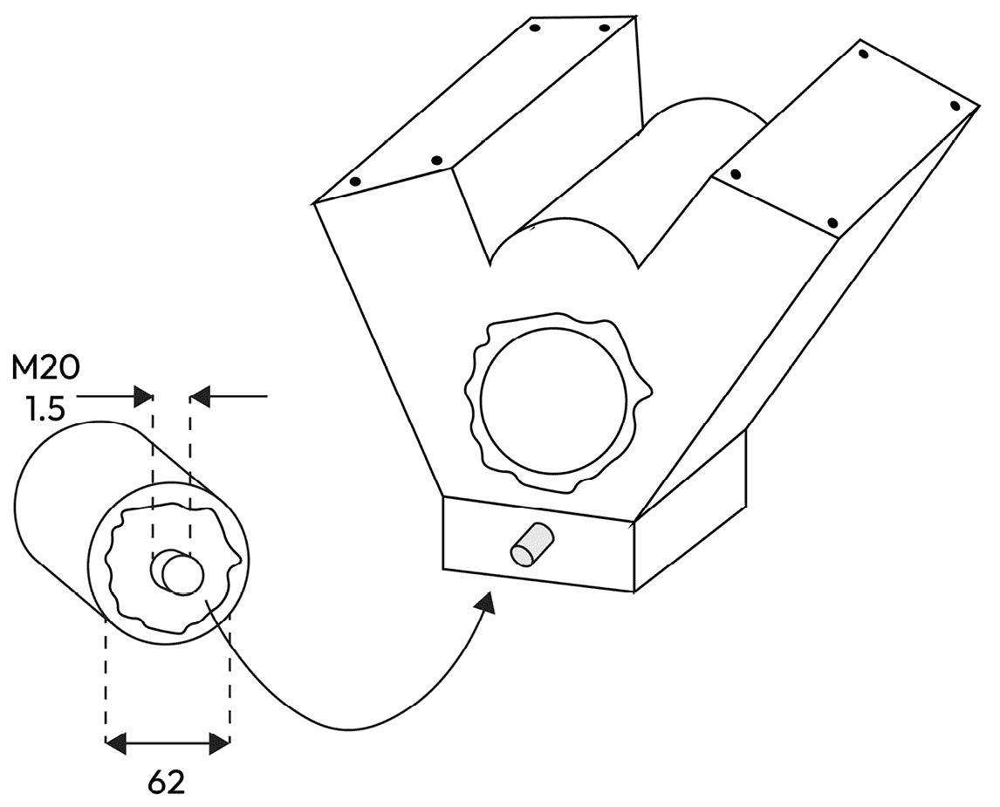

# 2

# 将工业原则应用于软件

本章解释了如何使信息技术成为一个真正的行业，这始于应用工业化的主要原则，即把复杂性切割成小块，然后标准化模块及其接口。我们将与城市发展进行比较，其中水管的标准化、电力的标准化和其他接口的标准化已经允许持续进化。

在本章中，我们将解释行业的概念，因为这个名称被非常频繁地使用，但并不一定每次都能精确理解其含义。我们还将了解通过将复杂问题切割成小问题，然后通过标准化使小问题变得简单和可重复，工业化的运作方式。我们还将了解从这种做法中可以得出什么好处，特别是在信息系统方面。

本章我们将涵盖以下主题：

+   什么是行业？

+   复杂性的管理

+   标准和规范的好处

+   信息系统中的城市主义隐喻

# 什么是行业？

在上一章中，我们将手工艺与工业化进行了比较，希望表明，虽然前者没有什么可羞愧的，但后者是其随时间自然演化的结果。所有行业都是从工匠开始的，随着工作越来越受控和可重复，最终可能成为真正的行业，工匠逐渐转化为工程师能力和工作。大多数人无需解释就能理解这一点，因为这在许多日常经验中都可以看到。例如，当一个人第一次尝试完成一项新任务（比如剪发）时，最初的尝试与随后的尝试不可比。经过一段时间，这个过程开始变得更加规律（头发被剪得很细，最初接受成为你的*小白鼠*的客户也不再抱怨）。经过足够的训练，一个人就会在该领域获得专业知识，并发展出一套常规（头发被剪到定义的长度和预期的形状，以一种可以在未来的剪发中精确复制的方式）。

尝试将工业化背后的东西形式化如何？换句话说，我们如何描述构成工业化的要素？正如我们所见，有一个可复制的概念，这意味着应该达到一个可测量的规范。此外，这个规范在所有领域的知识人士之间是共享的，这意味着它成为了一个标准。在我们的理发例子中，有剪发的名称，该领域的每个人都了解“修剪”或“缩短”的含义，这使得顾客不会带着他们没有预期的发型离开理发师。此外，从一位理发师到另一位理发师，一旦使用正确的词汇表达出来，就可以期待获得一个全球相似的结果。我们就是这样获得同质化的质量的。

在工业化过程中，就像在理发一样，也存在关注整体中各个小部分的概念。除非你想要看起来像名人，否则你不会将你的发型描述为整体，而是描述构成完整发型的各个小部分。例如（尽管从美学角度来看不是很好）：后面长，顶部短，侧面渐细。关注部分而不是整体，将复杂问题分解成简单的小问题，这些小问题可以简单地解决，这是工业化的基础，也是工程乃至整体问题解决的基础。

一个好的理发师可能是一位优秀的工匠，但一旦你可以在该领域的许多专业人士那里得到类似的发型，它就简单地变成了一个**行业**。在接下来的章节中，我们将应用这个定义来探讨信息技术领域，并展示工业化是如何发生的。为了做到这一点，我们首先需要更深入地了解实现该概念背后的真正含义。

## 工业化的两个根源——模块化和标准化

在简单介绍我们将应用于信息技术领域时所说的工业化概念之后，我们将更深入地探讨概念中的两个相关运动，即把大问题分解成小问题，这可以称为**模块化**（因为我们期望整个系统的小模块），以及用标准化的方法解决这些小问题以达到均匀的质量，这可以称为**标准化**。

## 模块化以降低复杂性

在解释复杂性的概念之前，让我们通过另一个例子来看看它与模块化的关系。这次，我们将通过分析汽车的各个模块来进行机械比较。现代汽车是工程学的杰作，将许多部件以复杂的方式组合在一起，以至于一个人单独构建这样的系统几乎是不可能的。当将汽车分解为模块时，肯定有明确、分离的模块，每个模块都有其目的：

+   发动机将为汽车提供动力

+   车身将保护驾驶员和乘客

+   轮胎和驱动系统将把动力转化为运动

+   底盘将以刚性的方式将其他模块固定在一起，等等

发动机本身仍然相当强大，但我们可以进一步将其分解为子模块：

+   注射系统会将气体引入气室

+   活塞会将爆炸转化为线性运动

+   曲轴将线性运动转化为旋转运动

+   润滑系统将确保系统不会因磨损、加热等原因而退化

再次，复杂性已经降低，如果我们进一步分解模块，润滑系统可以描述如下：

+   泵确保油液循环

+   油液起到冷却作用并允许无摩擦运动

+   油滤清器可以去除可能增加摩擦和磨损的小碎片，等等

这次，我们已经达到了如此低的复杂性水平，以至于几乎任何人都可以对这些模块采取行动：换油可以由任何知道在哪里倒油的汽车车主完成；更换油滤清器就像拧下旧的，然后拧上新的，放在同一个地方一样简单。

模块化，实际上是将复杂事物切割成更小部分以便于管理的艺术。如果模块化做得好，每一步都会降低复杂性。想象一下，如果我们把发动机分成左右两部分：我们肯定不会让它更容易观察和维护。确实，模块化不仅仅是系统的切割；它是在智能方式下切割的艺术，以便降低复杂性。但我们如何做到这一点呢？这就是工匠的经验和长期制造历史的帮助发挥作用的地方，提供了足够的专长来知道系统应该在何处，以及什么会使它更简单。最初的发动机肯定没有油滤清器，但经过一段时间，在行驶了几百公里后被迫从发动机中取出所有油，过滤它，然后再倒回发动机，很明显，在发动机油流中插入一个滤清器是明智之举。如果我们试图用一句话来总结这一点，模块应该在功能之后被切割。油滤清器之所以存在，是因为在润滑过程中，必须有一个过滤功能。将这个功能分配给一个模块是有意义的。

## 为了确保模块化，标准化是有帮助的

不同模块之间的关系、它们如何组合以及它们如何相互作用，这些都是必须考虑的其他标准。仅仅减少模块数量是不够的：如果想让整个系统正常运作，定义更小的模块是第一步，但一旦创建，它们必须重新组合以达到全局目标。这正是模块切割方式的重要性所在，我们之前已经解释过，它应该遵循功能划分。

但如何将它们重新组合呢？如果模块与功能对齐，我们如何确保它们能够很好地结合？实际上，这个问题解释起来很简单，但有时解决起来却极其困难，需要大型工程团队来完成：我们必须确保它们共享的公共功能完全相同。如果两个功能需要重新组装，这意味着它们有一个小的连接子功能是共同的，这通常被称为接口。这个接口必须在两边以类似的方式定义。

让我们再次以我们的油滤清器为例：它已经从润滑系统和其他发动机部分分离出来进行定义，但它也必须放回发动机系统中才能运行并参与更高层次的功能，即向汽车提供动力。为此，已经解释了油滤清器必须拧回到发动机中的位置，这就是需要接口的地方。这个接口只是一个螺纹：油滤清器将提供一个螺纹油，发动机在滤清器必须放置的位置提供一个螺纹凸起，当然，它有一个孔，允许油流入和流出滤清器。接口本身由功能定义：

+   它应该提供稳定的连接

+   它应该足够紧以防止漏油

+   它应该允许足够的流体循环，等等

我们向前迈出了一步，但为了达到工业化，还有另一步要做：接口必须标准化，这意味着所有前面的功能都应该以易于替换的方式指定，以便每个供应商只需了解接口就可以参与更高层次的模块。在我们的例子中，为了参与发动机系统，油滤清器必须遵守以下规定：

+   使用精确的螺纹直径（对于欧洲油滤清器，它是 20 毫米直径，螺纹步进为 1.5 毫米）

+   通过一个直径为 62 毫米的圆形接口确保了防漏油

+   基于流体循环保留碎屑的能力，以及因此滤清器使用的持续时间，由滤清器的体积决定，有两种标准尺寸，等等

这里是一个如何将油滤清器连接到汽车发动机的非常低级的示意图：油滤清器上的螺纹孔与发动机外部的带孔金属螺纹件相适配，以便于访问：

图 2.1 – 油滤清器在汽车发动机上的示意图位置

这就是我们要找的！如果我们现在回到解释，我们会发现模块非常标准化，可以在任何地方购买，它们将具有相同的接口，尽管它们的内部功能可能不同；组合在一起的模块将各自具有其功能，但为它们共同形成的全局系统提供更高层次、更复杂的功能。再走几步，由许多模块和子模块组成的整个系统将具有这种工业方法无法解决的问题的复杂性。

以另一个与我们日常经验更相关的例子来说明，小型电池和充电器目前正受到政府标准化推动的目标。这在欧洲共同体中尤为明显，USB-C 甚至被强推给像苹果这样的大规模反对者。大型公司几十年来一直在使用许多不同的非兼容连接器和充电器，导致电子系统的大量浪费和用户日常生活中的复杂性，迫使他们在许多不同的设备之间来回切换。这项法律已经在使公众为手机充电变得更加简单方面产生了一些效果。

谈及复杂性，我们不得不更精确地定义这个术语背后的含义，这正是我们将在下一节中要做的。

# 复杂性的管理

术语*复杂性*指的是由许多不同部分组成的某物的特性。它常常与*复杂性*混淆，后者意味着某物难以理解。大多数信息系统都是复杂的，而如何处理这种复杂性可以使它们变得复杂。

## 复杂性的不同类型

在谈论如何通过将大型、难以操作的系统切割成更小的、更容易处理的小系统来减少复杂性时，我们之前引入了复杂性的概念。在本节中，我们将回到这个复杂性的概念，并首先声明存在两种类型的复杂性，即**内在的**、功能性的和**可避免的**、**偶然的**。第一种来自功能本身，如果一个模块要提供这个功能，它不能做得少于这一点。第二种是在实现功能时添加的一切，这不能被视为功能本身的纯粹必要部分。当然，整个目标将是尽可能减少第二种，因为两者相加，而第一种根据定义不能减少。

在我们关于汽车发动机油滤清器的例子中，滤清器内部吸收纸的折叠是内在的复杂性，因为不同的纸张堆叠以及它们如何形成复杂的油流路径是滤清器工作的方式，在纸张的折叠处保留重金属颗粒，而油以更清洁、更纯净的特性到达滤清器的输出端。实际上，滤清器的金属外壳不能被视为过滤操作的参与者。当然——它有助于将纸张片固定在一起并便于操作，但它并不参与过滤：这是油滤清器中的偶然复杂性。

信息系统中充满了偶然的复杂性，考虑到如今最小的文本笔记应用也使用了数千行代码和数兆字节的内存，这仅仅开始显示出问题的严重性。

## 计算机科学作为处理复杂性的方法

考虑到计算机的设计初衷是提高生产力，复杂性达到如此高的水平可能听起来有些奇怪。毕竟，早期的计算机是为了大幅加速那些否则需要几天、几周甚至几个月的计算而建造的，并且需要仔细的双重检查以尽可能避免错误。由于最初设计的复杂性增加，投资于创建计算机的成本巨大（设计现代计算机和电子芯片是我们文明中最复杂的任务之一），但使用计算机快速产生大量问题的准确结果在很大程度上可以弥补投资。

目前计算机所做的许多工作都具有高度的技术复杂性：在游戏中显示来自 3D 建模的高分辨率实时图像、执行如离散傅里叶变换或蒙特卡洛模拟等长时间计算等。许多这些操作无法由人类或甚至大量人群以相同的精度和低错误率实现。因此，我们可以认为 IT 有助于降低复杂性。

## 信息系统与复杂性

但与此同时，尤其是对于像我这样在软件领域工作了 30 多年的人来说，这看起来就像是计算机实际上并没有带来那些巨大的功能进步，而这些进步本应是我们对计算能力大幅提升的预期。GPU 的速度快了数百万倍，但游戏体验仅提高了几倍。个人电脑的功率强了数百倍，但语音打字仍然远未完美，文字处理基本没有变化，新功能——大多数时候——充其量是无用的，最糟糕的是变成了臃肿的软件。

正好，随着计算机容量的增加，我们要求它们做更多的事情。虽然其中一些额外的操作带来了新的价值（如机械模型的优化、模拟复杂物理模型的能力等），但很多都是非增值特性（更大的屏幕、无限的颜色细微差别），这些特性确实增加了额外的舒适度，但在**业务线**（**LOB**）软件应用中，并没有为功能性价值带来任何东西。

总结来说，偶然的复杂性几乎与计算能力的增长同步，因此，剩余的计算能力在处理内在的、以业务为导向的复杂性方面带来的性能提升非常有限。

## “作为服务”的概念

幸运的是，关于信息系统的发展也有一些好消息，而“作为服务”的方法就是其中之一。 “作为服务”的方法意味着向用户提供有价值的东西，而不涉及物质部分。例如，**基础设施即服务**（**IaaS**）为您提供了内存和 CPU，而不涉及计算机的硬件部分；这由其他人处理，通常是云服务提供商。**软件即服务**（**SaaS**）为您提供可以简单通过网页浏览器调用的软件，而无需担心先决条件、安装、购买许可证等等。

如果我们将这种方法与之前提出的复杂性概念联系起来考虑，我们可以这样说，目标是通过对函数本身不提供，而只提供函数的结果，即所需的服务，来将偶然复杂性降低到几乎为零。如果周围的大部分工件都不存在；只获得了软件辅助程序的结果。例如，在 IaaS 中，整体基础设施本身并不是买家真正需要的：买家并不渴望占用空间的物理计算机、需要局部温度控制、机架等等，但必须经历这种偶然复杂性才能获得 CPU 能力、RAM 使用、存储空间或网络带宽和连接性。

“作为服务”的概念大大降低了信息系统感知的复杂性。当然，没有免费的午餐，整体复杂性仍然存在（甚至有所增加）。但这次不是模块与模块之间的分离，而是功能与功能之间的分离，在服务提供商处理的高技术复杂性和用户保留的低复杂性之间建立了一个清晰的界限。从后者到前者的财务转移可以用这样一个事实来解释：用户获得了专注于增值、面向业务复杂性的巨大优势。服务提供商如何从处理更高的技术复杂性中获得财务利益（对于一个普通用户来说可能是偶然的，但对于服务提供商来说是标准业务复杂性），这来自于他们是这方面的专家，为许多用户处理大量业务，并应用规模相关的成本节约。最终，每个人都从复杂性的清晰划分中受益，这也可以描述为责任和任务专业化的分离，正如之前所解释的那样，这与工业化是一致的。

## 链接到一个最小可行产品

许多使用敏捷方法工作的人都知道一张著名的图片，它展示了最小可行产品（MVP）的概念，这是 Henrik Kniberg 在 2010 年代中期创造的（[`blog.crisp.se/wp-content/uploads/2016/01/mvp.png`](https://blog.crisp.se/wp-content/uploads/2016/01/mvp.png)）：它展示了产品演化的第一行，从轮子到两个轮子相连，然后到两个轮子和车身，最后变成汽车。在这个过程中，笑脸一直皱着眉头，只有在最后一步才满意。在图片的第二行中，步骤被滑板（悲伤的笑脸）、自行车（中性的笑脸）、摩托车（相当高兴）和敞篷汽车（极度高兴的笑脸）所取代。

这已经被广泛研究，并且是对软件应用从最小可行产品（滑板）到完整项目（右侧的汽车）这一演变概念的绝佳描述。许多模仿版本并没有传达出太多的意义，因为它们遗漏了一些细节。例如，其中一些最终在两条线上结束于同一辆汽车，这完全错误，正如 Kniberg 故意在两个过程的最后展示了不同的汽车。整个故事在[`blog.crisp.se/2016/01/25/henrikkniberg/making-sense-of-mvp`](https://blog.crisp.se/2016/01/25/henrikkniberg/making-sense-of-mvp)上得到了完美的解释，我当然不会对其进行释义，而是尝试将其与之前关于“作为服务”方法的讨论联系起来。

那张著名的图片中提到的服务是什么？它有汽车吗？没有——拥有或驾驶汽车仅仅是服务本身的一个副作用，而这个服务是“从一个地方到另一个地方”。使用最小可行产品（MVP）将帮助我们尽快收集关于用户实际需求的反馈。现在，如果我们走向“作为服务”方法的极端，并将人的位移（以及可能的行李）作为唯一请求，科幻般的传送就会变得绝对完美！而且我们对可能性和价格更加合理；正如 Kniberg 所说，可能最基本的方法是向用户提供一张公交车票。

这也会是一个有价值的 MVP，但这是忘记了一个事实：MVP 并不意味着设计师没有考虑最终目标：我们提供滑板来收集反馈（例如，“稳定性很重要”），同时仍然想着我们最终想要一辆汽车，也许是因为最初表达的需求是自主旅行。

最重要的是什么——我们将会回到为什么最终汽车不一样的原因——那就是，在考虑反馈的同时，在这个例子中稳定性很重要，设计迅速演变为自行车，这辆自行车更稳定，更容易保持平衡。但这并不是收到的唯一反馈。例如，车辆没有覆盖并不是真正的问题，设计演变为自行车，然后是摩托车，没有风或雨的保护。最终，提出的汽车没有车顶：这不仅是因为它根本就没有被要求，而且因为驾驶时头发飘在风中的兴趣可能源于反馈循环。如果直接创造了汽车，也许客户就不会想到一个敞篷车顶。但要求持续的反馈已经显示出一种额外的期望特征（虽然不是需求，而只是一个“额外奖励”），否则可能无法检测到。

这就是公司在表达他们希望“取悦客户”的愿望时所谈论的内容。我们大多数工程师并不立即理解这一点，因为我们倾向于看到从初始规范中衍生出的一个优化解决方案的问题，但最好的解决方案为客户带来了他们甚至最初都没有考虑过的价值。而且你知道吗？由于所有公司通常都擅长创造预期的功能，这些意外和令人愉悦的功能将成为客户用来区分你的服务与竞争对手的服务的东西！

现在复杂性的概念应该已经清晰了，我们将提出一种如何减少复杂性的初步方法。

# 标准和规范的好处

本章的第一节*什么是行业？*开始讨论标准化以及它是模块化有意义所必需的。让我们想象相反的情况，一个系统被任意切割成几个更小的部分，没有考虑如何定义这些部分，它们如何相互作用，以及它们如何可以被改进的版本所替代。结果将是，模块不能在没有了解整体的情况下设计，也不能由现有的模块所替代，因为它们粘合到其余部分的方式可能已经不存在。至多，这只会使整个问题更容易解决；最坏的情况是，将一切重新组合起来的额外难度将大大超过一次性解决整个系统所带来的复杂性减少。

这就是为什么模块的切割界面及其标准化如此重要，为什么我们将用额外的例子在下一节中强调这一点。

## Docker、容器和 OCI

**Docker**技术是讨论规范和标准的一个很好的方式，因为它的名字本身就以一个工业概念的隐喻开头，这个概念通过标准化而繁荣，即货运和集装箱。

直到 20 世纪 50 年代，货物运输根本未实现标准化，用货物装满一艘船是一项相当精细的手艺：包装大小和重量各异，有的柔软，有的坚硬。将它们绑在一起以便在运输过程中不移动的方法在每个不同的运输中都是定制的。正确填充车辆极其困难，因为几乎没有机会让所有包装都能完美地占据所有空间，同时将脆弱和轻便的包装放在顶部，将沉重和坚固的包装放在底部。如果你再考虑负载平衡、湿度或温度效应，这些效应可能会从一个包装传递到另一个包装，以及偶尔出现的最后一分钟包装，它太重以至于无法放在其他包装的顶部，迫使码头工人卸下一部分货物并重新安排一切，你开始理解当时货物运输是多么复杂的一项工作。

见证马尔科姆·麦克莱恩，他在 1956 年设计了一种基于木箱的运输系统，这种木箱可以轻易地从卡车转移到火车和船上。仅在 10 年后，即 1967 年，这个伟大的想法被广泛使用，以至于**国际标准化组织**（**ISO**）定义了三种“容器”的标准尺寸。尽管道路/铁路/海上运输活动是一个庞大、全球性的业务，但在仅仅几十年后，地球上几乎每个运营商都使用标准尺寸的金属容器，这有助于优化整个物流链，并具有以下优点：

+   **装载便捷**：任何调度员都可以轻松地拿到一个容器，按照自己的节奏装载它，然后联系运输公司，让他们携带容器，而不用担心被拒绝，因为他们无法处理特定的形状。

+   **货物处理改进**：由于金属箱具有标准尺寸和带有处理孔的角落，因此不再需要更换用于压包（并可能损坏其内容）所需的工具。现在，抓取工具只需锁定容器的四个角落并抬起它们。处理速度也得到了提高，因为不需要逐个处理不同的包装：机器将一个容器（内部携带许多不同的包装）作为一个单一单元抬起。

+   **优化存储**：工业容器是简单的平行六面体形状的箱子。它们的堆叠几乎不浪费空间，只是墙壁的宽度。今天，大型船只的尺寸是根据容器进行优化的。

+   **可互换材料**：容器已经变得如此商品化，以至于几乎不存在产权问题。容器可以轻易地修复或被另一个容器替换。容器基本上从不空载。其中一些已经环游世界多次，而它们的最初买家再也没有见过它们。

Docker 的名称和标志清晰地阐述了这项技术的哲学：术语*docker*指的是在船上装载货物的任务，而 Docker 的标志展示了一只鲸鱼背上的集装箱。这个联系对于运输业来说非常明显，公司希望成为应用运输的工业集装箱的等同物。

正如工业运输集装箱一样，Docker 容器提供了基于标准的优势：

+   无论容器内部是什么（Java 进程、.NET Web、Python 脚本、NodeJS API 等等），外部接口都是完全相同的，人们只需简单地输入`docker run`命令，容器就可以启动并运行。

+   一旦应用被放入 Docker 镜像中，它就可以通过注册表发送到地球上的任何地方，并在任何国家以相同的方式执行。

+   **独立于底层架构**：Docker 容器不知道或关心它们是在 Windows 机器、Linux 服务器上还是在 Kubernetes 集群上运行。由于它们具有标准尺寸，它们可以适应任何地方。

在所有这些优秀特性的加持下，Docker 迅速成为了应用部署的事实标准。Docker 本身甚至可能成为最终标准，但存在一些不足，几年后出现了一个更高层次、更广泛的标准：**开放容器倡议**（**OCI**）创建了一个低门槛但不可否认的标准，每个容器技术（包括 Docker，以及其他虽然不太知名的技术）都必须遵守。

容器无疑使应用部署工业化并极大地改善了应用部署的方式。微服务的兴起与容器技术密切相关，因为使用旧的方法手动为每个应用设置依赖项和资源，部署大量小型应用将变得极其复杂。有些人甚至说，微服务架构的出现仅仅是因为 Docker 允许它们存在。

Docker 是技术如何规范特定软件相关功能（在这种情况下，应用部署）并产生巨大影响的一个例子，通过单一标准化方法，可以取代大量专有和手动方法。但这并不是行业里唯一发生这种情况的时候...

## IAM 的另一个例子

**身份和访问管理**（**IAM**）是 IT 领域的另一个领域，标准化在过去几十年中带来了巨大的帮助，并积极改变了困难的情况。还记得每个软件应用都有自己的用户管理和密码吗？更不用说处理组和授权管理方式的不同、不兼容，等等。这样的混乱...当第一个**单点登录**（**SSO**）方法出现时，该领域的每个人都感到很高兴，**中央认证服务**（**CAS**）在可用的软件中实现了它。身份和认证提供商使该领域对初学者来说更加复杂，但避免了成千上万的糟糕设计的 IAM 系统，用在线、始终可访问的身份取而代之。

**安全断言标记语言**（**SAML**）迅速成为标准，像 Shibboleth 这样的工具帮助以正确、开源的方式扩散处理能力。最近，**OpenID Connect**（**OIDC**）、OAuth 2.0、**JSON Web Token**（**JWT**）和其他标准化方法基本上结束了关于最佳识别、认证和授权账户方式的任何讨论，考虑到需要考虑的新功能，现在几乎覆盖了该领域的所有需求。Keycloak 是一个生产就绪的、基于标准的开源应用程序，可以作为标准之间的粘合剂，这意味着我们现在有了所有真正以标准方式处理身份和访问管理（IAM）的工具。这些好处如此之大，以至于尚未采用这些方法的公司在接下来的几年里将不得不采取措施这样做，因为安全问题将使停止在专有、脆弱的实现上处理 IAM 成为强制性的。

再次，由于标准和模块化分离的方法，IAM 的功能已经变成了商品：

+   识别涉及账户及其个人所有者的身份，以及所有相关的元数据。**轻量级目录访问协议**（**LDAP**）和**LDAP 数据交换格式**（**LDIF**）是这方面的标准，但**跨域身份管理系统**（**SCIM**）也可以使用，以及如 SCIM 企业配置文件这样的扩展，例如，以纳入组织结构图。JWT 可以用来以规范化的方式携带这些数据。

+   认证是关于证明账户身份的过程。当然，会想到 OIDC，但**快速身份在线**（**FIDO**）和**通用第二因素**（**U2F**）也是与认证相关的标准，它们引入了物理设备来改善认证管理。

+   授权——一旦通过身份验证证明了身份——就是处理软件（或者，记住信息系统主要但不仅仅是关于软件）中允许人们做什么的方式。**可扩展访问控制标记语言**（**XACML**）是这方面的一个基于 XML 的标准，但还存在更近期的方法，例如**开放策略代理**（**OPA**）。

总之，IAM 是工业化的配方一旦被应用后，信息系统如何积极进化的另一个例子：将这个复杂主题划分为明确的、单独的责任，然后对每个责任应用规范和标准。

本章的最后一部分将与其他可能高度复杂且使用大量标准的系统进行类比，即我们许多人居住的城市。我说的不是智能城市，在那里软件服务于城市管理，而是随着时间的推移在组织上出现的城市。

# 信息系统的城市主义隐喻

为什么我要花费这么多时间和使用这么多文字来谈论那些已经成为标准并对信息系统的易用性和进化能力产生了巨大影响的技术呢？好吧，因为为应用部署和身份访问管理（IAM）所做的一切都可以应用于软件系统中的任何功能。在你系统中需要操作的每个功能可能都没有一个不可否认的、国际认可的标准，但部署一个本地认可的标准将在你自己的信息系统范围内提供完全相同的益处。

这种通过将信息系统划分为区域并标准化它们之间接口来工业化的方法是保持其长期功能健康状态的最佳方法。根据上下文，你可能会听到“业务/IT 对齐”、“企业架构”或“信息系统的城市化”。第三个表达是指一个隐喻，其中信息系统被比作一个现代城市：

+   **组织遵循层级分区**：大区域专门用于住宅、商业或工业。在这些区域内，人们会发现定义区域较小部分的社区。最后，街区将社区内的建筑物连接在一起。在一个精心打理的信息系统中，人们会发现同样的层级，其中包含大型业务领域区域（例如，行政），在这些区域内会出现专业方向（比如说人力资源），最后是功能块（在我们的例子中，是招聘管理）。

+   **流体标准化是为了城市能够正确运行**：如果消防员必须适应城市不同地区的不同管道直径，当然会出现问题。同样的情况也适用于电力、水管、排水管等等。今天这听起来可能有些疯狂，因为所有这些都已经完美标准化了几十年，但在 20 世纪初，像巴黎这样的城市有多个不同的电力公司，其中一些运营 110 伏，一些运营 220 伏，一些使用**交流电**（**AC**），一些使用**直流电**（**CC**），一些频率为 50 Hz，一些频率为 60 Hz，而且大多数使用不同的插头格式。

+   一个大城市总是在不断发展，城市东部的在建工程旨在对西区的居民生活影响最小。同样的情况也适用于信息系统，其中变化是唯一的不变因素，对某一部分的影响应尽可能小，以免影响其他应用程序。城市建筑师提供全局的视野和演变方向，但城市的日常变化是有机的，并且可能因为标准化而发生。成熟的信息系统也可以做到这一点。

很遗憾，企业架构似乎并不十分普及。这部分的缘由在于这是一个复杂的活动；但也因为缺乏知识和信息的传播，而本书旨在谦逊地提供一种补救措施。我将在接下来的章节中尝试展示，信息系统中的工业化和标准化方法可以带来很多价值，并且可以极大地减少大多数信息系统的僵化和变革难度，而这些知识和实践远不如大多数 IT 架构师所认为的那样复杂。

# 摘要

本章详细解释了工业化和标准化的概念，然后解释了它们如何应用于软件和计算机科学领域。正如前一章所述，如今许多信息系统都难以进化，尽管工业化是计算机科学中的一个新兴领域，但它是一种显著提高其效率的方法。

在下一章中，我们将更加注重实践，从本章中——诚然是理论性的——材料开始，并解释如何在信息系统中实施工业方法。将要介绍的最知名的方法被称为“业务/IT 对齐”。简而言之，它指出 IT 的结构必须反映信息系统旨在帮助的业务流程的结构。
