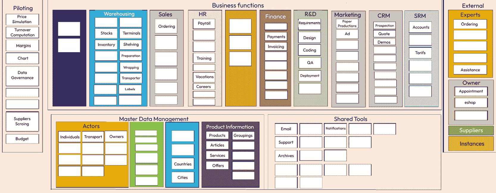
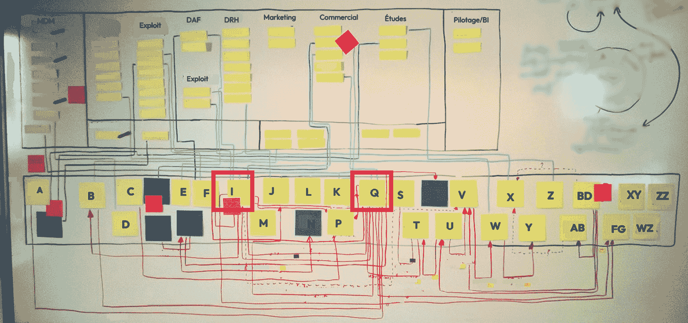

# 3

# 实现业务对齐

在解释了全球信息系统的普遍问题和第二章节关于工业化的一般理论之后，现在是时候介绍一些经过实战检验的方法了！尽管在书的第二部分之前，我们不会接触代码或部署软件，但这一章将更加应用性，并将展示所谓的业务/IT 对齐的原则。这一原则背后的思想是，软件系统应该尽可能地反映它旨在自动化的业务领域的结构。从某种意义上说，这是应用**康威定律**（将在后面解释）的反向，使用它来获得期望的结果。在实践中，了解地图以在地面上统治是很重要的，因此我们将使用基于**CIGREF**（即**Club Informatique des Grandes Entreprises Françaises**）等组织推动的四层图的信息系统映射技术。

本章将涵盖以下主题：

+   商业软件和对齐原则

+   康威定律应用于应用和系统

+   介绍 CIGREF 图

+   使用四层图

+   对齐模式和反模式

在描述了方法并绘制了与**TOGAF**（即**The Open Group Architecture Framework**）框架或其他方法的相似性之后，我们将将其应用于一个示例 IT 系统，以便你完成本章后真正从中受益。最后，我们将看到最佳实践，但也会看到业务对齐的反模式。就像任何其他方法一样，使用四层方法进行业务/IT 对齐有其优点和局限性。了解它们对于尽可能有效地应用该方法以及了解如何使用它来确定在研究的信息系统中何时何地存在对齐问题是特别重要的。

# 技术要求

如引言所述，本章将比前两章更实用，这两章是理论性的。这意味着有一个阅读前提——既然我们将讨论分析信息系统的方法，那么至少你应该对它们有先前的分析接触。当然，现在每个人都在使用它们，但你需要的不仅仅是使用它们的经验，特别是关于它们由哪些不同部分组成的某些知识。这里没有什么花哨的，但你需要理解软件和硬件之间的区别，以及信息系统通常是为了自动化业务流程而存在的，这些流程是由旨在达到目标的人力和计算机任务组成的集合。你还需要能够识别这样一个系统的不同部分。如果我们把它们称为系统而不是简单的软件应用，这是因为它们更复杂，由多个模块组成。你需要理解这一点，并能够说出系统由哪些部分组成。

你还需要能够对这些系统部分进行分类。它们是根据功能还是根据更具体、与 IT 相关的标准进行分类，比如它们在本地服务器上的位置与云中的位置？它们是自治的还是与其他功能大量通信，如果是的话，通过哪些接口和协议？这当然对我们大多数人来说只是常识或常识，但这是你需要能够阅读这一章的内容。这将帮助你指出关键问题。例如，当谈论系统部分之间的交互时，我们是在谈论业务依赖还是与 IT 相关的具体数据流？为了更好地理解这种差异，让我们回顾一些示例。业务依赖的一个例子是订单系统依赖于客户名单。确实，我们可以用我们的订单记录公司，但不知道购买列表中产品的客户，记录订单就没有太多意义。另一方面，与 IT 相关的数据流的一个例子是订单系统访问客户数据库以提出现有记录。

# 商业软件和对齐原则

到这本书的这一部分，这应该已经很清楚了，但回顾一下也无妨，我们只是在讨论专业信息系统。简而言之，我们把自己放在一个软件真正意味着商业的情境中：对公司至关重要的应用程序，帮助商业公司或非营利组织生产的信息系统等。以下的所有建议在小型系统中都没有意义，如果应用到简单的软件应用程序上，将会过于复杂。

话虽如此，假设是，既然有商业，那么对它的了解就很好；我们知道商业的参与者是谁，商业的赌注和目标是什么，正在实施哪种战略（即使它没有 100%明确定义，这在很多公司都发生过），等等。最后这一点至关重要；如果没有定义战略方向，就没有必要设计信息系统。

重要提示

应该强调的是，即使定义（即使不完全精确）商业战略也是分析企业架构和信息系统映射的绝对前提。作为一名拥有多年信息系统经验的分析师，我总是在第一次会议中意识到没有公司级战略时拒绝一个项目，并且我建议每个人都这样做。如果你正在阅读这一章，思考你将如何定义信息系统并意识到没有业务定义的战略，你最好现在就停止阅读，等到这些基本信息更加清晰时再回来。在这方面，请相信我——如果你在信息系统目标愿景（至少是全球范围内）清晰之前就意识到即将到来的步骤，你将会浪费很多时间，而且弊大于利。

为什么这一切如此重要？因为你要使用目标业务的定义来设计与之一致的信息系统。技术应该始终服务于用户，所以事先了解业务将推动信息系统的设计（再次强调，不需要一个完美详细的战略，但至少有一个愿景或方向）。这就是所谓的业务/IT 对齐，或者在本书的背景下，简单地说就是对齐。我们将看到，这是你获得一个稳定、有远见的信息系统的唯一方法，不受第一章中描述的问题的影响。但在我们更深入地探讨实现业务/IT 对齐的方法之前，让我们先看看其他非业务相关但由技术驱动的方法，了解它们的应用范围以及在设计复杂信息系统时的局限性。

## 技术建议的丛林

如果你是一位真正的软件专业人士，并且担心你交付成果的质量，你肯定读过很多关于帮助解决该问题并提高你的软件技能的技术方法。你听说过**V 循环**；用于组织软件团队的**敏捷方法**；**极限编程**；**测试驱动开发**；**行为驱动开发**实践；用于改进代码结构的编程模式；用于跟踪代码质量的特定于开发的**关键绩效指标**；以及更多，一个完整的章节都不足以描述它们。

虽然大多数内容都值得学习和借鉴，但它们的数量本身也显示了这种方法的局限性：它们只在特定的背景下才是正确的（否则，由于数量众多，有些人会反对另一些人），而且遗憾的是，大多数撰写关于这些方法的人常常忘记定义这个范围，因为他们对解释技术本身更感兴趣。技术帮助他们克服特定障碍越多，他们就越倾向于将其作为一项基本、不可或缺的建议来提出。在极端情况下，推荐这种实践的人甚至没有意识到操作背景的小规模，并将这种实践视为普遍适用的，鼓励他人无限制地使用它。

当然，这里需要读者的批判性思维，但与此同时，读者在逻辑上应该是了解作者专业领域知识较少的人，他们可能难以发现内容的局限性。“知识越多越反动”，互联网上充斥着刚刚学会新技巧的人，他们乐于将其作为解决一切问题的方案公之于众。这种热情是可以理解的，我当然也在我的博客或一般培训活动中这样做过，但这并不意味着没有解决方案，而且，再次强调，前进的道路是提高读者的批判性思维。

## 以 KISS、DRY 和 WET 为例

让我们以一些你肯定听说过的实践为例：**KISS**（**保持简单，傻瓜**）和**DRY**（**不要重复自己**）。第一个指出，在创建软件实现时，简单性应该始终占主导地位。这在敏捷方法中尤其如此，因为额外的功能或用户的反馈肯定会迫使代码重写。第二个意味着代码永远不应该重复，并且相似的代码块应该被放入一个独特的函数中，这个函数可以从代码中需要相同功能的不同位置调用。

在进行任何进一步的分析之前，我们应该注意到，这两项建议似乎存在某种相似性，或者至少是非常强的联系。毕竟，如果我们减少了代码重复，事情就会变得更简单（或者至少它们可能看起来是这样，但这将是以下主题的内容）。因此，我们可以质疑这两种方法的使用，但再次强调，软件工程还不是一门行业，所以每种手艺都有自己的工具和用途。这很公平……

但分析这两种方法的真正要点是它们的适用上下文。与大多数技术最佳实践一样，它们并不盲目适用于所有情况，其使用应仔细考虑。当然，当你发现同一个类中多次出现相同的简单函数时，统一它是合理的，但如果有两个不同软件应用中的类具有略微不同的警告标签，这种情况又如何呢？如果文本不相同，也许这是因为警告是在不同的情况下，因此我们应该分析它们被调用的条件。然而，由于软件模块不相同，变量不一定相同，因此分析触发警告对话框显示的情况的相似性将会很困难。那么耦合呢？如果我们决定只保留一个代码，哪个应用程序模块应该拥有它？或者我们应该创建另一个模块来存储对话框的代码？在这种情况下，两个应用程序的生命周期现在影响这个公共库的版本，这可能会成为一个问题？有时，统一代码可能弊大于利。

这种讨论带来了许多反思，并提出了一个新的良好实践，即缩写**WET**（与 DRY 相反），代表**写三遍一切**。实际上，暴露出的犹豫意味着，为了找到正确的决定，等待并收集更多关于使用上下文实际相似性的线索是有益的，该方法创造者建议在考虑统一之前先写三次代码。这是一个合理的方法，因为它避免了 DRY 原则的“非黑即白”的方法，并开启了一个对应实际真相的灰色区域：它取决于上下文。先写代码，然后写第二次并观察相似性，最后写第三次并分析统一带来的投资回报，这确实是一个合理的方法...但这是否意味着它成为每个程序员都应该遵守的法律？当然不是——再次强调，需要批判性思维，三次可能并不适用于你。也许你需要五次，也许你将决定限制是基于时间而不是基于出现的次数（例如，等待一年的维护期）。这取决于你，我怀疑选择三次部分是因为它为 DRY 原则提供了一个相当幽默的对比。

所有这些都意味着，在软件开发中使用的许多技术、与代码相关的方 法有时被当作硬性真理或普遍适用的最佳实践，但，大多数时候，它们只是适用于特定上下文的原则，并且（必须）根据其他上下文进行调整。

## 内部工具箱/框架的特定情况

在我们切换到之前解释的问题的解决方案（而且不用担心，有一些解决方案）之前，一个最常观察到的例子是，在没有彻底的上下文分析的情况下应用最佳实践可能导致不良情况，那就是定制公司框架的开发。在撰写本章的过程中，我偶然发现了一篇来自 Aaron Stannard（[`aaronstannard.com/dry-gone-bad-bespoke-company-framework/`](https://aaronstannard.com/dry-gone-bad-bespoke-company-framework/))的精彩文章，恰好完美地反映了我 25 年来有或没有框架编程的分析，创建了一些并诅咒自己这样做，崇拜一些其他框架并意识到它们为负责的软件带来了巨大的价值等。

Aaron Stannard 在这篇文章中解释了 DRY 原则应用过于严格对开发专用框架以统一编码的团队产生的严厉后果，最终他们得到的结果与预期的相反，包括样板代码减少、扩展能力和代码质量。

一些框架为软件应用和信息系统带来了巨大的价值，你将很容易找到它们：

+   每个人都知道它们，并且乐于使用它们。

+   新人认为这个框架有助于提高他们的生产力和速度。

+   所有用户都可以用很少的句子描述框架的功能。

+   该框架依赖性非常少，可以轻松使用。

+   这非常重要，以至于开发者会做到他们不喜欢的事情，只是为了保持它：编写文档。

相反，有些代码框架会阻碍编程过程：

+   它们是由少数专家创建的，其余团队不使用它们。

+   新人往往会直接编写等效的代码，并质疑框架是否有助于他们提高生产力。

+   他们有时做很多事情，以至于没有任何一个功能是稳定的。

+   他们带来了一些其他限制（仅操作一种类型的数据库、需要脚本模块、提升权限等）。

+   他们的功能存在于专家（通常是单个人，这对公司来说很危险）的脑海中，并且培训同事使用它是一项挑战。

在这两个光谱端之间知道自己的位置困难，与框架的创造者当然会对他们的“宝贝”有偏见的事实有关。他们总是会高估使用它节省的时间，或者忘记或高估维护它的时间，向团队中其他人传授它的时间，公司把重要依赖放在一个人手中的风险，等等。如果你必须评估框架的使用，你应该将这些因素放入电子表格中，并冷静地评估短期、中期和长期的回报率。

最后，现代编程平台现在已经带来了如此多的工具，以至于框架的存在本身都值得怀疑。例如，**.NET Core 框架**版本 8.0 拥有如此庞大的生态系统和**基类库**，十年前框架被创建的所有目的都简单地消失了：

+   对象/关系映射由**Entity Framework**负责

+   带有对象映射的 API 请求/响应由**ASP.NET Web API**和集成的**JSON**/**XML**序列化处理

+   监控由可以连接到任何第三方监听器的日志堆栈负责

+   一致的页面描述是通过**Blazor**完成的，包括样式处理

+   移动应用的部署是通过**Multi-platform App UI**（**MAUI**）实现的，它还与 Windows 前端统一，等等

因此，我对这个关于框架的建议是尽可能等待，在创建框架和尝试避免它（大多数时候，承认吧，你想要创建框架并不是因为它对你的业务有好处，而是因为它编写起来很有趣）。如果它必须到来，它就会到来，这就是新兴代码架构（如果你还没有听说过这个概念，我们很快就会回到这个概念）发挥作用的地方。

## 唯一稳定的指南：与用户的业务对齐

在这次漫长的离题之后，我们回到了最初对软件中何时应用最佳实践和所谓“原则”的难度的思考。然而，我们迫切需要关于信息系统架构的指导，因为风险太高，我们也看到了如果在这方面失败，对业务的影响有多么糟糕。那么我们如何知道？是否存在一个始终适用的合理且稳定的方法？一些我们确实能够真正依赖的、在设计对公司未来至关重要的信息系统结构时能够真正依赖的定律？是的，确实存在，而且它不是一项技术规则，而是一种技术决策的方法：始终将其与信息系统的业务联系起来。这是业务/IT 对齐的根源。

在本章中，我将重复这个规则，并以许多不同的方式解释它，因为它对于正确的信息系统架构至关重要——推动信息系统设计的是业务的架构。这一点对于概念尤其如此，为一家公司创建成功的软件骨架总是从对业务的完美理解开始。客户是什么？我们销售什么产品？公司应该计算机化的主要流程是什么？大多数这些问题听起来很平凡，但它们之所以如此，仅仅是因为人类大脑能够适应背景环境。

让我们首先来探讨一个非常基础的问题：什么是客户？对于公司里的任何一个人来说，这个问题显然得出了答案，以至于很少有人会提出这个问题，如果任何员工质疑它，听起来会相当荒谬。“客户是我们与之做生意的公司”。好吧，那么个人呢？是的，有时我们也会与个人打交道；这是 B2B 和 B2C 之间的区别。如果我们质疑“做生意”这个术语呢？我们谈论的是频率和数量？当然，任何数量都可能被考虑在内，一个人从你这里买一个简单的螺栓可能被认为是一个客户，就像一个公司每月购买数千个螺栓一样。但是时间呢？你会认为二十年前从你那里购买过产品的某个人仍然是客户吗？不，当然不会。那么一年前呢？是的，当然……在这种情况下，界限在哪里？十年？五年？决策，决策，决策！

关于这个先前的例子，你可能会发现一些公司，那里的经理在营销和商业之间对客户的精确定义并不一致……那么，你期望一个愚蠢的计算机如何来决定这个问题呢？残酷的事实是，如果你想用软件和数据流来替代一些任务，你必须让它绝对清晰，才能让它工作。这就是大多数信息系统失败的地方——它们没有以完美的业务视角来设计，让一些细节留给了人类对系统的实施或使用。当人类在计算机中补偿缺失的知识时，它可能在一开始还能工作一段时间，但迟早会出现问题。在最好的情况下，系统永远不会像预期的那样高效。在最坏的情况下，带着他们补偿性知识离开公司的人可能会使系统陷入停滞。

这个例子告诉我们什么？首先，在制作软件信息系统处理业务定义时，应该非常明确。其次，这些概念往往是业务规则，这意味着它们并不完全稳定，而是取决于业务如何运作。如果有一天你的老板决定客户名单不应该包括在过去三年内没有从你那里购买过任何东西的人，而之前这个期限是五年，那么客户的定义可能会随着时间的推移而改变。如果这种情况注定会时不时地发生，那么当然，限制其对信息系统的影响是至关重要的。将这个逻辑放入统一的一行代码中，或者更好一点，放入一个参数中，在这种情况下是一个很好的举措。

相反，将客户列表及其定义存储在单个表中将导致高度耦合，因为当“客户状态”发生变化时，定义（名称、地址、联系方式等）不会改变。如果从客户列表中删除一家公司意味着您必须从数据库中删除条目，那么这可能会影响其他仍需要这些数据的功能（例如，保证管理、会计师等）。我们将在*第九章*中回到这个例子，并详细介绍如何正确建模的一些细节，但就目前而言，请记住，业务思维必须始终指导您的软件概念如何运作。对齐不是从无中生有或双向产生的——它是由功能驱动的，软件应该盲目遵循业务领域本体。

事实上——这将是本节最后的要点——坚持业务领域现实甚至应该更进一步，特别是要随时间坚持。这意味着您的模型应该始终适应时间，因为业务总是变化的。变化是生活中唯一不变的因素；企业无法逃避这一点，反而高度依赖于它。随着不断变化的业务规则、越来越复杂的组织以及更高的功能复杂性，信息系统必须从一开始就设计来适应变化。时间管理非常重要，下一章将完全致力于此。

## 关于公司数字化转型的插曲

当我们谈论业务领域的软件表示时，我们不妨进一步探讨这一点，并观察软件是如何“吞噬世界”的（*《软件正在吞噬世界》*，马克·安德森，2011 年）以及为什么这种积极的数字化转型与之前讨论过的业务对齐概念相关。一个架构胜过千言万语，*图 3.1*和*图 3.2*应该解释数字化转型对我们运营方式产生的主要差异。

在数字化转型之前，人工操作员是业务运营的中心，并在现实世界和业务（或其部分，如我们之前所见）的计算机化视图中进行操作：

图 3.1 – 当人工操作员在业务运营中心时的架构

数字化转型带来了一种全新的方法，其中软件成为人类的主要操作工具，并在现实世界中代表人类用户进行操作。硬件和软件系统从人类界面和传感器接收命令和信号，将它们翻译，并将它们作为图形用户界面发送回人工操作员（以及具体现实，通过机械操作员或其他方式）：

图 3.2 – 数字化转型的架构

这有一个特定的后果，即 IT 现在处于中心位置，与现实世界和人类进行交互。根据你的观点，计算机帮助人类避免了直接交互带来的麻烦，或者它们使我们远离了与世界的直接互动以及与潜在偏见和现实错误表征相关的所有风险。社交网络是这些负面影响的最重要表现，作为软件工程师，你应该始终意识到这种风险，并相应地设计系统，因为它们对现实世界的影响现在已经确立，该领域的从业人员应该保持道德和负责任的态度。

希望这使数字转型和人与计算机之间的交互更加清晰。现在让我们集中讨论人类如何影响软件的组织方式，并讨论一个称为 Conway 定律的东西。

# Conway 定律应用于应用程序和系统

我们在本章的第一节中谈了很多关于所谓“软件定律”的局限性，所以你可能想知道为什么我现在会花几段篇幅来谈论一些乍一看可能相似的东西。没有什么能比这更不同了...Conway 定律是信息系统设计的真实、稳定的指南，因为它不提出建议，而是从多个观察中提炼出一个理论，并让一个人自己对其主题得出结论。

Melvin Conway 在 1967 年指出，“任何设计系统的组织都会产生一个结构与其沟通结构相复制的设计”。在我们的案例研究中，即信息系统，这意味着结果系统的架构将反映定义该系统的团队的结构性组织，这会意味着以下内容：

+   一个前端和后端之间有强烈分离的团队将产生一个系统，其中这两个软件功能确实是独立的

+   一个根据人们的业务领域知识分组的人将产生一个具有清晰业务对齐服务的信息系统

+   一个只有一个人的团队将产生一个非常紧密、类似单体系统的系统

+   一个部分之间没有或很少沟通的团队将创建一个系统，其中模块之间不能正确地相互操作

这个最后的例子可能看起来很极端，但遗憾的是，大多数信息系统都是这种情况，因为团队通常是以单一软件组件为出发点组成的，导致许多应用程序组成系统时，事先没有考虑到相互操作。因此，链接是在需要时以点对点的方式建立的，导致脆弱的链接和低效的系统。

自从康威的这一初始经验观察以来，同名的法则已经被验证了许多次，尽管它不能像数学法则那样被证明，但现在被认为是非常可靠的。它被认为是一个如此强大的法则，以至于系统设计者开始使用这个法则以结构化团队的方式，使最终系统呈现出期望的形状。在这种方法中，法则不仅被视为一个后果，而且被视为塑造系统所需的辅助工具。我所谈论的不仅来自我的个人经验，而且已经被正式化，命名为**逆康威机动**，因为许多其他软件工程师也有同样的方法。例如，马丁·福勒（Martin Fowler）提出了这个法则（[`martinfowler.com/bliki/ConwaysLaw.html`](https://martinfowler.com/bliki/ConwaysLaw.html)），甚至将其与**领域驱动设计**（**DDD**）联系起来。这将在下一章中进一步解释，该章节专门用于解释与设计信息系统部分相关的语义——与 DDD 中的通用语言概念相关——的重要性。

使用逆康威机动，可以通过影响设计该系统的团队之间的沟通和结构来影响系统的最终设计。这是实现我们自本章开始就讨论的非常需要的业务对齐的绝佳方法。通过定义与业务领域并行的团队，并给他们提供相互讨论的业务相关概念，最终形成的系统将由具有明确功能责任和模块间良好交互操作的模块组成，有利于系统的长期演变。

影响系统的对齐是很好的，但大多数时候，人们会遇到一个现有的对齐，唯一可能的是理解其状态。这就是我们需要一种方法来分析现有对齐的地方，这就是专门的图表方法有用的地方。

# 介绍 CIGREF 图

正如我们所见，业务对齐与与功能领域相关的词汇和概念的正确表达有很大关系。对于我们更习惯于模式的人来说，存在一种更图形化的方式来可视化这种对齐，这被称为**四层图**。

在法国（我的祖国），它被法国大型企业信息技术俱乐部（一个大型法国软件架构俱乐部）普及，但这是非常普遍的一种思维方式，并且没有人声称拥有这个想法，至少据我所知。这个概念相当简单，是关于将信息系统不同层级分开，每个层级都使用我将要介绍的层级来工作。在图的顶部，人们会找到系统所服务的业务流程，再下一层是为此所需的业务功能。这两个层级完全是功能性的，甚至与软件无关；一些任务和功能可以通过人类实现，而不会产生任何影响。底部的两个技术层级分别是软件和硬件，前者使用后者。指定系统（或更确切地说，其最外层结构）的这种方式可以概括如下：

图 3.3 – 四层图

让我们在接下来的几节中深入探讨每个层级，特别是展示每个层级的详细内容是如何表示的，因为这个方案只是象征性的，并不包含每个层级的实际内容。

重要提示

在本章的剩余部分（以及本书的后续部分），我们将经常通过它们的编号来引用这四个层级或水平，从顶部开始（**层级 1**、**层级 2**、**层级 3**和**层级 4**）。下一节将详细介绍**层级 1**，以此类推...

## 流程层级

业务流程是一系列旨在达到既定目标的任务。由于我们谈论的是 IT，其中当然至少有一些将是自动化的，但也可以有由人类激活的任务。流程用于结构化业务或任何组织的活动，**业务流程建模**（这是接受的名字）是关于表示这些以记录、更好地理解并提高实体的效率。

存在一种业务流程表示的标准，即 **BPMN**，代表 **Business Process Modeling and Notation**。这个标准目前是 2.0 版本。你肯定已经见过这种图表，它自己就能读：

图 3.4 – BPMN 示例

在这个公司新流程的非常简短且不详细的例子中，你会发现 BPMN 标准中最常用的组件：

+   任务是带有文本的盒子，通常以动词开头，描述所表示的活动。任务内的图标可能指定它是否是自动化的、有用户输入、完全是手工的等。

+   任务之间的箭头表示流程中的信息流，以及任务处理的顺序。

+   菱形框会介入这个信息流中，以包含诸如选择或并行活动等复杂性。

+   事件由圆圈表示。一个流程总会有一个开始和一个或多个结束。它也可以有中间事件，所有这些都可以反映事件类型，如基于时间的、基于消息的等。

小贴士

关于 BPMN 的更多信息，我强烈建议研究可从[`www.bpmb.de/index.php/BPMNPoster`](http://www.bpmb.de/index.php/BPMNPoster)获取的 BPMN 海报。

尽管 CIGREF 图的第一层主要基于 BPMN 图，因为它们是业务流程表示的标准和这一层的主要内容，但在这个层次中也可以找到一些附加信息，这些信息是相互关联的。例如，可以指定与业务领域相关的规则为**DMN**（**决策建模符号**），并将其添加到这一级，因为它们对业务流程本身有影响。顺便说一下，DMN 是 BPMN 标准中包含的一个“子规范”。

根据想要获得的内容，第一层地图可能非常粗糙，细节很少。这是一个我从一家动物遗传学公司那里得到的例子，该公司已经对其流程进行了完整的 ISO-9001 图示，只需知道哪些信息系统部分与哪些业务流程相关（出于保密原因有意模糊）：

图 3.5 – 流程图的示例

由于我的这位客户在流程本身上没有问题，在整个对齐项目中，其表示保持得很简单。这里的唯一微妙之处在于，运营流程已经与支持流程和试点流程分开。

相反，以下图是我为另一位客户创建的地图中第一层众多流程之一，这次是一个 IT 问题主要来自流程定义不足（当然，当目标不明确时，很难有一个高效的 IT 系统）的组织。在以下图中，文本的可读性不是目的，因为我只想让你看整体流程图：

图 3.6 – 详细流程

第一层当然是你的信息系统地图中最重要的一层，因为没有任何东西依赖于它。所有其他层都依赖于它，但流程层必须从头开始设计，纯粹基于业务领域知识。而且，正如所解释的，如果流程不清晰或设计不当，这当然会影响软件，随着时间的推移，也会影响整个信息系统的效率。

强调这一层的重要性很难过分。这并不意味着它必须用很多细节来绘制；这些细节只有在有人发现流程中的问题并需要深入了解以改进或纠正它时才是必要的。但第一层必须正确，并涵盖整个组织的范围。

## 功能层

CIGREF 地图的第二层表明了上述流程的任务可以使用哪些功能来实现。这仍然是一个功能层，但这次，组织不同，因为这个层的原子是关于谁可以做什么。

确实存在一些不随流程变化的函数。业务流程必须能够根据战略进行变化，但有些事情是稳定的。在我们的*图 3.3*示例中，欢迎新员工加入公司的一项任务是拍摄他们的照片。这可能对其他流程中的某些事情有用，但拍照这一行为是组织的一部分，可能由特定的人来完成，并需要专门的材料，如相机。因此，这是一个函数，必须在这一层进行登记。许多流程可能会指向它，但这个函数将在第二级地图的一个地方保持不变，与其稳定的属性一起。

其中一些最重要的属性与组织内部函数的组织有关。事情可能会变化，没有固定的标准，但至少有一个使用了数十年的好隐喻，并且取得了良好的效果，即创建信息系统与城市组织之间的平行关系（在法国，这种方法被称为“城市化”）。这个隐喻导致将 CIGERF 地图的第二层分解为三个深度的层次：

1.  **区域/区域**是这一层中的较大群体。它们对应于整个系统（或在我们的隐喻中，城市）的组织方式。在一个城市中，人们会发现商业、工业和居住区通常明显分开；在功能层中也应该找到同样的情况。

1.  **季度/邻里**是对系统本地组织的一种更细的划分，其中人们、企业，或者在我们的案例中，IT 功能可能会相互交流。

1.  **块/岛屿**是人们相互认识并经常互动的精细划分。在相应的 IT 定义中，这些包含使用相同工具或由相同团队操作的相关函数。

我经常被问及应该使用什么样的分解方法，至少对于最高层来说。这是一个难题，因为**业务能力地图**（**BCM**）（正如这个 CIGREF 地图的第二层经常被称呼）在大多数公司中实际上是不存在的。由于 ISO 9001 认证和相关方法的标准化，许多公司对自己的流程有清晰的了解。公司也可以追踪他们的软件层，至少对于他们被收费的最大块来说是这样。但在中间，这个 BCM 经常被遗忘，我们将在稍后看到，这是系统不匹配损失的原因。

这一层被遗忘的事实本身在很多信息系统的问题中就占据了很大一部分，因为领导者可能更倾向于过程层（目标）而投入较少的努力在业务连续性管理（如何实现它们）上。然而，正如谚语所说，没有计划的愿景只是愿望，而精心构建的系统功能组织是迈向成功的一大步。

在这个与城市发展相关的隐喻中，业务能力图被切割的方式与一个大城市的组成相关联；就像城市中有工业、商业和居住区一样，在信息系统中也将会有一个全球组织，通常在以下五个区域：

1.  **主数据管理**是信息系统最重要的数据被管理的地方（客户、产品等）。这些数据将被系统的许多部分和参与者使用。因此，它值得专门的治理（明确的责任定义、实践和工具等）并在地图的第二层拥有自己的专用区域。当对如此重要的数据缺乏明确的治理时，常常发生不同的小组会重复它们，这不仅成本高昂，而且在需要实现交换时可能会带来复杂的问题。

1.  **共享工具**不是数据，但仍然是将在信息系统和大多数流程任务的其他许多部分中引用的常用功能。它们通常被分类在专门的区域，在那里可以找到办公自动化工具、内容管理系统、身份和授权管理等等。

1.  **面向外部的功能**（有时称为“协作”）是关于与信息系统本身范围之外的功能进行互操作或交换的所有功能。这通常是人们会找到外联网或商业网站、与合作伙伴的联系等地方。

1.  **治理/试点**是那些曾经用于监督系统本身的功能所在的区域。报告功能将被放置在那里，以及关键绩效指标、高层管理功能等等。

1.  **面向业务的职能**是最后但同样重要的一个领域。这是公司组织与其核心价值和运营领域相对应的所有职能的地方。如果你是一家制造机械部件的公司，你将在这里找到所有与工程、生产、库存、销售、维护和安装相关的职能。如果你从事电子商务，将会有买卖职能、物流、网络运营、安全等。还将有一些支持核心业务的职能组，如人力资源、法律和行政职能，这些在大多数公司中都是通用的。当实体组织得很好时，这一区域的不同方向与组织结构图中的不同方向相对应是显而易见的（并且是良好一致性的证明）。相反，如果你很难判断某个特定的职能是否属于这样的方向或服务，这可能是一个缺乏一致性的迹象。

下一个图例是一个遵循五个区域原则的 BCM，主要部分按照组织结构图的方向进行分解。再次强调，这只是一个常见的模式，并不构成任何推荐。应根据个人判断调整 BCM 的分解以实现一致性。再次强调，就以下图表的文本可读性而言，文本内容并不重要，重要的是结构：

图 3.7 – BCM 示例

对于这个轶事，这五个区域也出现在法国政府的信息系统 BCM 中，四个支持区域围绕在中间，而面向业务的职能位于中间，在这个背景下，由法国政府组成的各个部门将其分开。我用黑色线条突出了这些分隔，因为这正是我想展示的（文本的可读性并不是目的所在）：

图 3.8 – 法国政府 BCM

我们将回到 CIGREF 第二层的重要性。正如所述，第一层表明了愿景以及公司为市场带来的价值，但第二层则是关于如何操作性地实施这一愿景，这正是无序信息系统所缺乏的地方。在我能够观察或帮助精炼的数十个信息系统中，业务连续性管理（BCM）总是最不受控制的层。这种对它的错误处理是信息系统无法令人满意的根本原因。

## 软件层

在 CIGREF 地图的下一两层中，我们进入了技术的领域。到目前为止，流程和功能完全是业务相关的，一个人完全可以使用它们来构建一个无计算机的信息系统。但今天我们并不是这样，这本书的分析主题也不是这个。我们将研究基于计算机的系统，至少部分是自动化的系统，而上面两层所依赖的两个技术层是关于用计算机实现功能的。它们的分离非常简单：第三层是所有“软”的东西，这意味着非物质的、虚拟的和非具体的，而第四层则将所有具体的东西分组。简单来说：如果你能触摸到它（计算机、网络电缆、设备、数据中心——即使墙壁不属于你），它将进入我们稍后将要覆盖的下一层。如果它是技术性的但不可“触摸”，例如软件应用、数据库、信息流、API 实现等，它属于 CIGREF 地图的第三层，我们马上会详细说明。

这个第三层在第一次实施时通常对公司来说相当容易：查看账单并询问人们他们使用什么软件，通常足以找出系统中软件的 80%最重要的用途。但是，即使详尽的参考不是目标，这也可能不足以两个原因。

首先，可能存在一些公司不知情的情况下购买的“隐藏”软件（这被称为**影子 IT**，可能是一个需要维护或强烈所有权的难题）。如果这些软件是战略性的，它们可能不会出现在地图上，而且如果使用它们的人突然离开，相关的功能在没有人的理解下崩溃，这也可能成为一个问题。如果你听说过某个公司在关键人物退休后出现软件问题，这就是我们要讨论的内容。

第二个问题是，软件不仅包括应用程序，还包括数据，而数据通常在系统中更难定位和追踪。当然，你可以通过它们的商业许可证或使用的 IP 和端口来定位数据库。但你会发现数据存在于许多其他地方，比如令人讨厌的 Excel 工作表。再次强调，谁没有听说过一份对公司来说如此重要的 Excel 工作簿，以至于每个人都听说过它？在我陪同的一家在业务/IT 对齐的公司中，有一个叫做“Serge 的 Excel 文件”，当我试图弄清楚公司文章和价格的真实来源时，每个人都向我提起过这个文件。结果发现，在这个近千人的公司中，根本没有任何产品信息管理的治理，而这个名叫 Serge 的人，在某个他急需信息的时候，承担了从商业、行政和工程收集数据并将其汇总到 Excel 工作簿中的任务，尽力追踪变化、新产品、停售日期、价格变动等。由于这不是他的主要工作，他几乎没有时间这样做，文件的内容既不完整也不免出错。但既然这是唯一可用的数据来源，每个人都迅速复制了 Serge 的文件或通过服务器链接引用它。管理者们从未考虑过这种对如此重要数据来源（也许甚至是一家商业公司的首要参考，连同客户名单）的脆弱方法。当 Serge 最终离开公司时，发生了什么？系统逐渐恶化，因为没有人负责维护这个单个人的、未记录的工作。信息变得混乱，订单开始出错，价格无法调整，因为大多数使用文件或在其上创建的连接器中的信息的人根本不知道数据从何而来，等等。

有些人可能会反对说，我所谈论的并不是第三层的一部分，而是与第二层相关，确实，主数据管理、数据治理和所有权必须在第二级详细说明。但在这个案例中，我想表明，糟糕的技术实现（这肯定属于第三层）以及对软件形式中的数据位置缺乏理解是问题的根源，这个问题直接影响到地图的第一层，并导致公司的两个主要流程——生产和销售——脱轨。

对这一第三层内容的分类实际上取决于许多因素。一些拥有强大内部 IT 和编程能力的公司倾向于由操作该技术的技术团队对应用程序和数据分组。我也见过其他人按技术对软件层进行分组，尽管他们的大部分技术是现成的，但他们的主要关注点是内部操作这些技术。在某些情况下，软件可以按编辑进行分类。还有许多其他分类方式。在下一个例子（再次为了保密原因而模糊处理）中，切割是使用功能域进行的，因为公司相当大，软件应用程序和数据的责任受到了业务方向和服务的影响（这是一个很好的实践，因为软件应该始终服务于功能）：

图 3.9 – 软件层

## 硬件层

如前所述，硬件层列出了并组织了从具体的信息系统到的一切。毕竟，计算机化系统的重要部分是数据和虚拟功能，它们极大地加速了过程，但我们绝不能忘记，即使在遥远的云位置没有人真正关心，所有这一切都是由电子在电子芯片和电路板中流动实现的，还有电源、电缆、硬盘和屏幕。

这个层现在非常标准化并且受到控制，在我分析过的数十个信息系统中，几乎没有一个因为硬件问题暴露出这种限制。事实上，这种情况如此罕见，在大多数我制作的 CIGREF 地图中，第四层非常薄，几乎没有细节，有时甚至根本不表示。例如，如果我们看我所展示的不同层的整体图景作为样本，那么硬件层就没有任何表示：

图 3.10 – 只有三层（文本的可读性并非目的）

幸运的是，公司老板们非常清楚的一件事会始终提醒我们这一层的存在，那就是他们的成本。即使机器越来越虚拟化，变得无形，财务成本仍然存在。随着时间的推移，信息系统和数据中心的环境影响最终也成为方程的一部分，使得这一层变得更加明显。

如果你必须绘制一个硬件层，你会发现很多优秀的绘图系统，它们可以区分服务器类型，可以提供专用图标和元数据，以便你可以单独列出硬件原子等。总的来说，再次强调，这是一个非常受控和标准化的层，这确实解释了为什么在谈论 IT 对齐时，我们很少需要在这个层上工作，除了引用它来完成软件成本和平衡第一、第二层预期的收益。

为了提供一个硬件层的例子，这里是一个公司在逐步外部化其 IT（橙色部分是直接由 IT 服务操作的服务器）中的这样一个层图的时间序列：

图 3.11 – 硬件层

由于这个层（当然不是层本身）的表示相对较低的重要性，我们不会进一步深入描述如何使用该图来映射硬件层。分组也很明显；大多数情况下，它们基于数据中心，物理位置在顶部，然后是独立的物理服务器，接着是虚拟机等。网络也用标准符号表示，总的来说，对于这个层，图是通用的。

# 使用四层图

CIGREF 映射的原则现在应该已经很清晰了，因此我们可以看到如何使用这项技术来提高对齐度，从而提高信息系统的效率。正如所说，在接管一个系统时采取的第一个行动就是创建它的映射。否则，简单地没有方法能够舒适地处理这样复杂的集合。这意味着当然，为现有状态的信息系统创建映射是首先要采取的行动，而 CIGREF 映射非常适合这个目的。但关于如何做到这一点仍然有很多问题。本节包含了一些经过实战检验的建议，关于如何使用映射技术。

作为一条重要提示，不要担心你在本章结束时还没有确切地知道如何使用 CIGREF 方法。现在，我将只向你展示如何绘制它以及如何在其中发现业务/IT 对齐的问题，但本书的其余部分将展示许多 CIGREF 映射在实际中用于许多不同目的的例子。这意味着它将有望变得更加清晰，它在分析和构建信息系统方面的强大功能，你不应该因为还不确切知道它在实践中将如何被使用而感到担忧。

## 我们应该映射什么？

首先，一个人永远不应该详细绘制整个系统。当然，有一个覆盖整个周界的粗略地图来了解我们正在处理什么是至关重要的，但只有需要关注的系统部分应该被详细绘制。这听起来可能很显然，但在我所指导的团队中，有很多次在解释了方法几周后，我意识到他们已经详细绘制了信息系统的每一部分。因此，这个建议需要被提出。

这似乎是一种自然的反应，特别是对于系统中有严重问题的团队来说，绘制一切，因为它给人一种恢复一点控制感的感觉。遗憾的是，这不仅是在创建地图时的浪费时间，而且在人们试图根据系统的演变调整图表时也是浪费时间。这不是系统绘图的用途。地图是用来预测演变并在尽可能多的方向上推动它的。因此，它只应该在我们正在工作的系统部分进行详细绘制。提前绘制是浪费，因为我们大多数情况下在开始处理这个系统部分时还得重新绘制。同样，绘制一切也是浪费时间，而且更多，因为（希望）系统中有一些部分我们永远不会处理，仅仅是因为它们已经运行得很好了！

再次，当解释时这听起来可能很显然，但当一个人开始绘制一个信息系统时，似乎会发生某种狂热的绘制过程，我见过很多受过良好教育且有经验的人意识到他们白费力气了（我最好的例子是一个拥有数千名员工的组织，其 IT 团队为建立进入内部餐厅的徽章绘制了一个流程图；当然，这个流程图从未被使用过，甚至除了它的创作者外没有人读过）。

以下方案从视觉上解释了地图应该如何随时间演变，只有当需要时才详细绘制系统的部分：

图 3.12 – 绘制演变

这个问题的另一个后果——而且更为微妙的是——那就是那些已经详细绘制的信息系统部分，在地图被用来改进它们之后，就不再需要更新了。在图 3.12 中，这就是第二步骤中已经细化的四分之一所发生的事情。在第四步骤中，它不再详细了。这听起来可能有些反直觉；的确，一旦对这部分进行了详细的工作，为什么就放弃它呢？同样的原因适用：如果这部分现在组织得很好，并且业务和 IT 之间已经达到一致，那么我们可能不会回到它这里，或者如果我们确实回到了这里，地图可能已经改变了。那么为什么还要浪费时间在上面呢？

## 如何开始绘制四层图

从一张空白的纸开始总是困难的；当 IT 问题影响到公司的活动时，这更加困难。为了简化开始映射活动，有时使用纸张或白板来给出系统的初步视图会更容易一些。我喜欢展示以下这个信息系统的“初稿”，因为这个系统是因为一个与之相关的轶事而被我分析：

图 3.13 – 使用 CIGREF

这家工业公司在稳定科学分析和将结果传达给客户的数据流方面遇到了困难。我们（IT 团队和我）开始花几个小时绘制四个主要流程、不完整但足够接近的 BCM 以及涉及其中的应用程序以及数据流。在那个阶段，我们正准备评估所绘制的交换频率以确定弱点。然后，公司的总监经过，看了我们做的几秒钟，指着代表应用程序的两个便签说：“嗯，问题显然在这里”。这个人没有任何技术或 IT 背景，但看到大量数据流会进出这两个实体，他立刻理解到它们阻碍了系统的效率，特别是其演进能力。经过进一步分析，发现其中一个应用程序已经过时，第二个应用程序存在复杂性问题。因此，系统被重新设计以改进，主要步骤是为第一个应用程序集成一个新应用程序，并为第二个应用程序创建一个超集 API，以更干净的方式公开旧功能。

这显示了良好信息系统映射的力量，因为它有助于所有参与者——而不仅仅是技术熟练的人——理解他们 IT 中的情况，现在几乎在所有地方，他们的主要工作工具就是 IT。

## 在对信息系统进行对齐时遇到的一个普遍困难

系统中几乎总是会发生的一个问题，并且会对其映射产生影响，那就是在第一层和第三层的依赖关系之间经常出现混淆。大多数功能人员倾向于认为他们的 IT 系统实现了与设计完全一致的过程；他们多么天真啊... 软件不一定是在内部制作的，当从货架上购买时，几乎不可能完美地符合公司的流程。当然，每个新的软件项目开始时，每个人都会发誓他们会遵守编辑的逻辑，调整他们的流程以保持解决方案通用，避免昂贵的特定定制。但大多数情况下，现实是 IT 最终会像在方孔中锤圆钉一样整合软件，结果不会整洁。

当职能人员用技术术语表达自己，而没有完全理解他们所说的话对系统的影响时，这种缺乏区分的情况也会发生。来吧，我们都有过经理或大老板谈论 ESB 或 ETL，好像他们自己能直接用 XML 编写 Camel 路由的经历！这种对 IT 简单性的过度自信，一旦绘制了 BPMN 并使职能作者确信它可以直接执行，就像一个已经存在端点的 WS-BPEL 架构一样，也会带来一些有趣的关于项目持续时间的说法。

让我们举一个例子，并想象你已经得到了一个像这样的 BPMN 架构（法文标签无关紧要；只需观察图表的结构以及所有任务都是手动的事实）：

图 3.14 – 手动流程

现在想象一下，由 IT 提供的实现此过程对应的数据流图，可能就像这样：

图 3.15 – 软件中的流程

任何技术专长都不需要意识到，流程中的任务与软件应用程序和数据库之间创建的数据流之间没有任何关系。因此，信息系统映射的大部分工作将是关于在任务和相应的数据流之间绘制关系。最终，你可能会发现其中一些流是不完整的，需要其他流来弥补数据不足。你可能会发现将过多数据带入甚至没有权限查看的软件中的流。你甚至可能会发现不再有已知用途的数据流。

要关联这两层，您将不得不创建一个强大的业务能力映射，因为第 2 层将用作流程及其软件实现之间的间接层。这就是为什么 BCM 如此重要的原因，如果您在信息系统中工作，您会意识到这通常缺失，仅仅是因为它不如流程和软件/硬件为人所知。然而，BCM 对于减少耦合并促进系统的演进至关重要，因为它提供了一种创建依赖关系的方法，而不会因为一旦设置就难以更改的技术实现而陷入困境，或者因为公司运营方式中的流程被修改而不得不更改 IT。在这种情况下，BCM 充当一个间接层，使得第 1 层的演进成为可能，同时对第 3 层的影响最小，反之亦然。

以下架构图总结了这一点，顺便说一下，我经常告诉我的学生，如果他们只记住我关于 IT 对齐课程中的一张幻灯片，那应该是这一张：

图 3.16 – 优秀的耦合

## 随时演进信息系统

当然，在映射现有信息系统状态之后，下一步是改进它，这需要有一个多步骤的战略来使其更加现实。再次强调，CIGREF 地图在这里提供帮助，通过清楚地说明每一步需要调整的内容，并展示如何处理依赖关系。如果通过将其插入到一个新的、改进的软件应用程序中来更改一个功能，所有依赖于这个功能的任务都需要进化以利用这一点，当然，除非有 100%的兼容性，在这种情况下，我们可以认为该功能本身没有改变。

这些步骤的最终目标是尽可能接近（且具有成本效益）一个现实且良好对齐的系统状态，这可以概括如下：

图 3.17 – 理想对齐

当然，这听起来可能很理想，而且，大多数时候，我们可能永远无法实现整个系统的对齐。但局部对齐是可以实现的，如以下图例所示，这是我从一个成功对齐其最重要的支持流程（即处理新员工，因为这是一家高结构性流动的公司）的客户那里导出的。通过这种方式，所需的努力可以减少到估计的十分之一，流程的持续时间将减少到最初测量时间的三分之一。这是通过自动化一些任务实现的，但正是对齐使得这种自动化成为可能，因为在此之前，流程完全是手工的，由于 IT 结构明显缺乏（该公司从事非技术业务，在 IT 上投入有限的预算，只有在达到几乎绝望的状态后，才意识到它对其活动的重要性）。以下图表因保密原因而模糊；我们旨在展示流程的流程：

.jpg)

图 3.18 – 应用对齐

我们将在下一章回到信息系统随时间演化的过程。现在，只需记住，CIGREF 地图必须用于建立实际情况，但也可以用于模拟一个期望的未来情况以及中间的每一步。

## 服务提供商的四层图方法

你可能会对在购买软件即服务时使用 CIGREF 地图的用途感到好奇，以及它是否意味着我们在硬件层不绘制任何内容。答案回到了你想要使用你的地图的方式，因为你不是出于拥有完整东西的乐趣而映射，而是因为你的用例需要你精确地了解你的信息系统在其细节中的工作方式。这意味着，如果你的兴趣在于软件匹配功能，你绝对不需要知道服务器在哪里物理上，在这种情况下，在第四层绘制任何内容都没有用；你只需将其留空。另一方面，假设你的一个担忧是关于你数据的位置性，因为你的董事会有一个关于数据主权的限制。在这种情况下，你将在第四层中指出支持软件的数据中心所在的精确区域。这样，就很容易发现任何位于允许区域之外的东西。

这回到了一个非常关键的忠告：只映射你真正需要的。很容易被带跑偏，映射很多实际上并不关心的事情。特别是，硬件层通常很容易映射，因为自动网络探索应用可以提供帮助，而且好的系统管理员通常在每个机器上部署了代理以进行安全和软件清单。因此，人们往往会有一个非常精确的第四层图，即使他们的问题是关于功能与软件的匹配。在这种情况下，你最好用几个通用块来替换整个硬件层——通常是使用的数据中心，包括你自己的服务器室——并用相关的成本标签它们，因为这（在这种情况下）是唯一能帮助你信息的信息。

谈到服务，可以从另一个角度提出一个等效的问题，即关于为软件编辑器或集成商提供软件服务的 CIGREF 表示。我们应该如何表示它？客户使用的云是否是编辑器信息系统的一部分？是否应该以特定的方式绘制？

再次强调，地图的有用性观念应该驱动我们对这一问题的响应。想象一下手头的问题——也就是您建立地图的原因——是因为您在内部功能和客户提供的功能之间有一个耦合问题。这可能是一个安全问题，因为一方面勒索软件可以轻易传播到另一方面。这也可能来自会计团队，他们不知道哪些机器和服务应该向客户收费，哪些成本应该保留在内部。也可能来自系统管理困难，例如关闭一个被认为是内部的服务器最终影响了您的生产。在这种情况下，正确的做法是绘制当前独特的信息系统，然后绘制目标地图，该地图由两个不同的信息系统和它们之间剩余的精确交互表示（例如，从生产信息系统向内部信息系统发送使用数据，以便会计可以为不同的租户建立账单）。

这通常是您在业务能力图（CIGREF 表示的第二层）的“外部面向功能”区域使用区域的地方。在生产信息系统中，您会在这个区域找到“按租户报告数据使用情况”或“按租户发送总 API 调用次数”的功能。而在内部信息系统中，您当然会在“业务”区域/“会计”区域找到处理这些数据并计算租户账单的功能。另一个例子是在“外部面向功能”区域可以找到的“请求租户访问阻止”或“存档租户”等功能。它们通常由内部信息系统调用，以指示生产信息系统客户未支付账单，至少应该被阻止，也许以后，完全移除。

两个系统之间的另一个链接例子，当然是当内部软件-生产工作流程产生了一个经过验证的、完整的、销售给客户的软件新版本时（这是软件编辑公司的主要角色）。必须存在某种链接，因为向客户租户展示此软件的信息系统将使用这个可交付成果在某个时候更新其服务。在保持非常低的耦合的同时建立这种链接的最好方法之一是创建一个容器注册库，该库将填充来自第一个系统（当然带有正确的标签）的镜像，并由第二个信息系统通过拉取它需要的镜像来消费，以在租户中公开。

唯一剩下的问题是注册表应该放在哪里，如果需要一个非常稳定的注册表，答案是在每一侧都放置一个：一个注册表在软件编辑公司的一侧集中管理所有持续集成的生产，另一个注册表作为图像缓存在另一侧。这使得集成公司作为持续部署的一部分更容易继续创建租户，即使第一个注册表不再可访问。这种清晰的分离甚至可以用来实现一些高级规则，例如“只有带有 STABLE 标签的容器图像应该投入生产”，通过仅在第二个 Docker 注册表中缓存这些图像。

有些人可能会争论说，由于在这种情况下两个系统之间存在调用，这可能意味着它们是一个单一的系统，应该这样表示。再次强调，地图的目的不是反映世界的全部现实，而是帮助你履行信息管理职责。如果你希望实现的是良好的关注点分离（出于安全考虑，应该是这样），那么你的地图应该反映你的目标，因为它将帮助你完成实现这一目标所需的一切。

最后，有人可能会反对这种观点，声称，如今，地球上每个信息系统都存在某种形式的连接，无论是通过互联网网络，它几乎覆盖了所有本地系统。此外，当公司收购其他公司时，它们会连接它们的信息系统，有时连接得如此紧密，以至于最终成为一个单一的系统。同样，这完全取决于你的策略，因此 CIGREF 地图应该简单地与愿景保持一致。

# 对齐的模式和反模式

几年的信息系统咨询使我观察到，大多数问题都与系统中的几个不匹配有关，而这些不匹配本身只属于几个模式。在有限业务领域工作了一段时间后，当我开始与农业合作社、化学风险评估公司、律师协会以及其他不同领域的公司合作时，我惊讶地发现，这些模式（或者更确切地说，反模式，因为它们会引起问题）无处不在。

法国 CNRS 的研究员 Dalila Tamzalit 与我合作，对这些反模式进行分类，并记录了一种寻找它们并利用信息以更好地对齐受其影响的信息系统的方法。这导致了 2021 年国际信息系统开发会议（可在[`aisel.aisnet.org/isd2014/proceedings2021/managingdevops/3/`](https://aisel.aisnet.org/isd2014/proceedings2021/managingdevops/3/)）上发表的一篇文章。你将在下一节中找到一些有助于管理业务对齐的信息摘要。

## 对齐的悲哀现实

首先，应该知道，大多数信息系统，如第一章中解释的那样，都存在一些基本问题，这些问题限制了它们的效率。从四层图的角度来看，这些问题可以总结如下：

图 3.19 – 常见问题

由于很少有任何 BCM，因此过程可能被很好地理解，但相应的实现通常是通过点对点的临时互操作性完成的，这很快就会使系统看起来像“意大利面盘”，数据流以一种不受控制的方式发生。

## 我们可以追求的目标

这一点已经提到，听起来可能合乎逻辑，但我们的目标并不是一个完全对齐的系统。为两个业务流程设计的一个良好系统可能就像以下这样简单，其中超过十个调整良好的数据流实现了全部的业务需求，使用相同数量的应用程序（在这个例子中，大多数已经存在，并且只是正确地连接），几乎不需要额外的硬件：

图 3.20 – 良好的对齐（出于保密原因，文本已模糊）

## 对齐中的主要反模式

现在目标已经明确，让我们回到我们的对齐反模式，并介绍其中主要的四个（我们只解释它们是什么，以及如何对抗和减少将在本书的其余部分进行讨论）：

1.  **纯粹的技术集成**发生在过程没有在第一层设计，而是直接在软件中实现的情况下。结果是，公司战略、基于领域的规则或甚至过程的简单优化都会导致软件的改变。这是听到“我们进化不够快，因为我们被 IT 拖累了”或“由于软件限制，无法实现这个业务功能”（及其变体“在整个软件链中添加这个新的数据属性，从界面到报告，将需要六个月，并需要四个应用程序的新版本”）的根本原因。

    这个反模式的象征性表示如下：

图 3.21 – 反模式编号 1：纯粹的技术集成

1.  **应用孤岛**出现在组织的两个部分在未相互沟通的情况下处理他们的 IT 需求时。结果系统在图中显示了这种结果，即两个独立的系统。可能有一些情况下，完全隔离被认为很重要（人力资源、财务、其他高度机密区域），但根据经验，总会有建立不同区域之间联系的时候。在这些情况下，这可能会成为残酷的现实，因为数据已经被完全复制，使用不同的格式，或者使用没有选择以简化互操作性的技术等。这种情况的主要风险是数据源简单地被向其他区域开放，这将导致重大的授权问题。在我所见过的最糟糕的案例中，一名实习生为了实施差旅费报销而将完整的 HR 数据提供给 ERP，这当然是一项重大的保密性违规，直到纠正之前，公司都面临着潜在的 GDPR 问题。

    这种反模式的符号表示如下：

图 3.22 – 反模式编号 2：孤岛

1.  **单体**是集中了大量功能的程序。这本身可能不是问题，因为一个特定的应用程序可能实现了业务领域所使用的所有内容。问题在于这些应用程序还实现了应该共享或已经在系统其他部分存在的功能。数据冗余是信息系统中的一个巨大问题，因为它们从未从一边对应到另一边，这使得很难知道哪个来源最接近真相，从而导致不良决策或错误的计算。

    这种反模式的符号表示如下：

图 3.23 – 反模式编号 3：单体

1.  **功能多重实现**是一个问题，因为不同的实现几乎不可能以兼容的方式工作。可以很容易地理解，如果一个财务预算总结在一个应用程序中以某种方式计算，而在第二个应用程序中以不同的方式计算，该应用程序应该做同样的事情，那么要采取明智的行动来管理公司是困难的。我在一家报纸公司见证的一个案例表明，根据查询的应用程序不同，读者数量会有所不同，差异如此之大，以至于在某些情况下，报纸公司没有额外的计算就无法知道他们是增加了还是减少了读者。

    这种反模式的符号表示如下：

图 3.24 – 反模式编号 4：功能多重实现

## 一些其他反模式及其提出的分类

只展示了四个最重要的反模式，整个**业务/IT 对齐反模式**（BITA，其建议的简称）如下：

图 3.25 – 反模式分类

要使用这种分类来改进现有信息系统的对齐，每个反模式都附带一张结构化的身份证，包含以下信息：

图 3.26 – 反模式的身份证

反模式出现以及——更重要的是——纠正它们的标准操作的完整解释也可以在之前引用的完整文章中找到。

你可以在 GitHub 上查看完整文章，它将展示在第一个 BITA（业务/IT 对齐反模式，简称 BITA）上可用的此类信息的数量：[`github.com/PacktPublishing/Enterprise-Architecture-with-.NET/blob/main/Business-IT%20Alignment%20Anti-Patterns%20A%20Thought%20from%20an%20Empirical.pdf`](https://github.com/PacktPublishing/Enterprise-Architecture-with-.NET/blob/main/Business-IT%20Alignment%20Anti-Patterns%20A%20Thought%20from%20an%20Empirical.pdf)

这个来自经验的分类使我们提出了一个结构化的方法来改进信息对齐，这可以用以下 BPMN 图来总结：

图 3.27 – 在信息系统中检测反模式的方法

我鼓励你尝试将这种方法应用到你的学习信息系统中，并反馈意见。这对学术界以及希望对其他读者也有帮助。

# 摘要

这相当长的章节展示了如何使用形式化的绘图技术来更好地理解信息系统，并记录它将遵循的演变。地图是控制特定地面的先决条件，而图式胜过千言万语，这使得这一步在任何信息系统架构活动中都是必须的。

由于 IT 是一个相当特定的环境，我们需要一种专门的方式来绘制信息系统的地图，这就是 CIGREF 地图的内容。它的四层布局有助于将面向业务的方面（流程和原子功能）与技术的方面（软件和硬件）分开。

这种表示信息系统的方式也有助于可视化其一致性，通过检查第三层（软件位）是否很好地调整到它所实现的第二层（业务能力图）。业务/IT 一致性是复杂信息系统质量的最重要指标和演变能力，这是一个必须追求的特征。

下一章将扩展当前章节，考虑时间的维度。我们已经在之前的章节中简要提到了这一点，解释说 CIGREF 地图可以用来记录信息系统当前的状态，也可以记录其应逐步达到的期望未来状态（大爆炸方法永远不是一种实用的替代方案）。但是，正如您将看到的，时间出现在信息系统的许多其他方面，并且可能是一个相当难以处理的参数。
