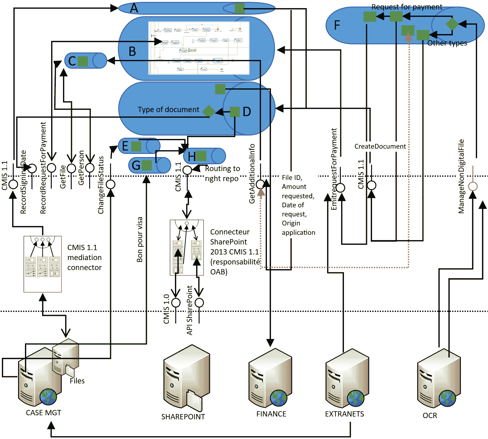
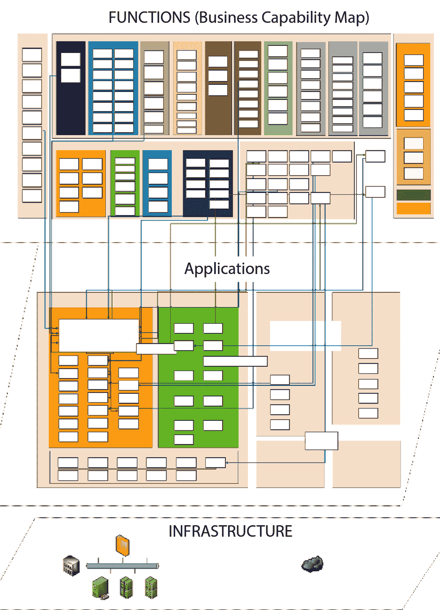
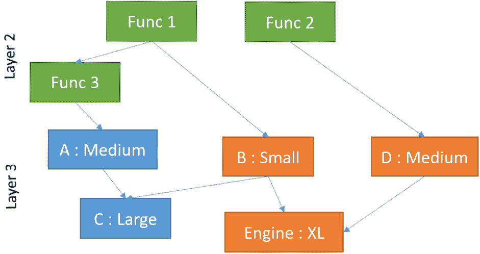
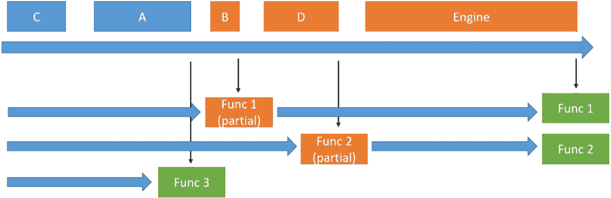
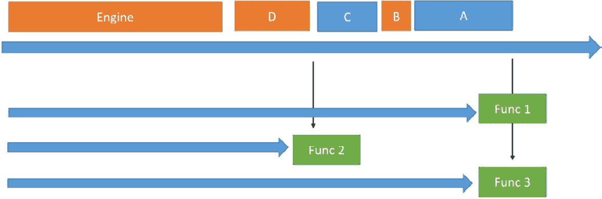
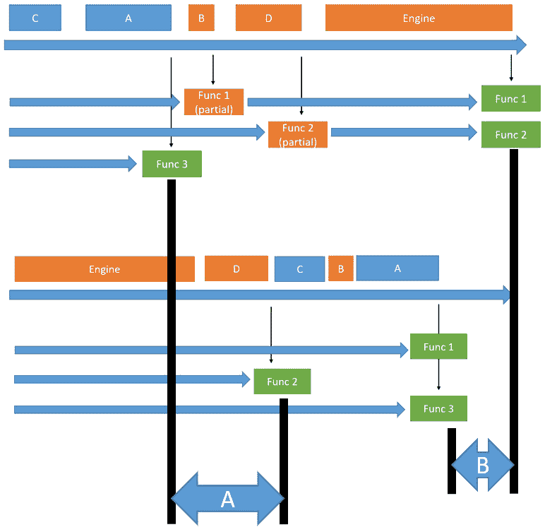
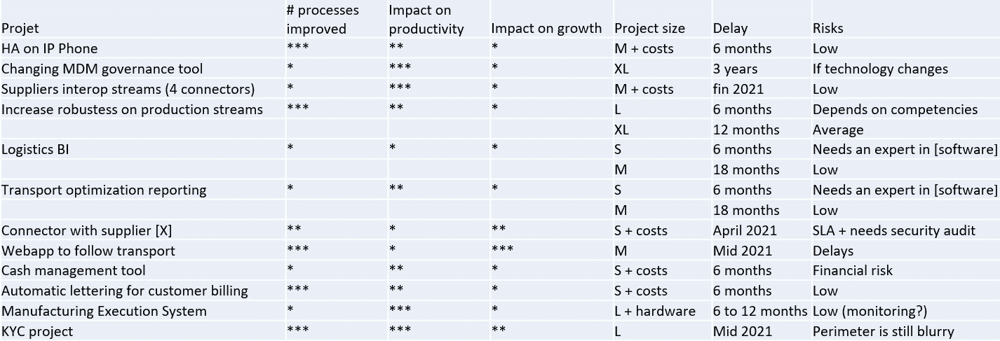

# 处理时间和技术债务

信息系统就像一个活生生的有机体：它总是移动和变化。然而，大多数系统都是“一次性”设计的，没有考虑到它们在时间上的适应性，而只是考虑了它们在设计时的处理业务需求的能力。许多 IT 问题都可以与时间相关联。

在上一章中，我们讨论了业务对齐以及基于业务关注点构建结构的重要性。这也必须应用于将时间作为良好信息系统的方程参数：如果业务功能是一次性/可丢弃的，其技术实现将不会比原型更复杂，快速编码并在使用后很快被丢弃。另一方面，对于将在生产中使用数十年的功能，你必须仔细打磨设计并完善实现，尽可能减少移动部件，因为一个好的架构师知道维护这样一个模块最终将比其初始开发成本高得多（例如，参见[`natemcmaster.com/blog/2023/06/18/less-code/`](https://natemcmaster.com/blog/2023/06/18/less-code/)关于这个问题的讨论）。代码的质量及其易于维护（因此是开发者害怕的活动——文档）将比快速交付功能以适应市场时间的重要性更大。

本章将分析信息系统时间适应性这个问题，因为大多数系统都是基于固定时间目标设计的，很少考虑到时间的演变。这就是为什么它们在时间上性能迅速下降，也是为什么当它们的构建时间过长时，结果甚至不符合表达的需求，因此出现了敏捷软件开发。将解释技术债务的概念，以及耦合的概念。希望到本章结束时，你将提高对需要**概念验证**（**PoC**）方法以及需要强大、可演进的、设计的批判性思维。

在本章中，我们将涵盖以下主题：

+   功能变化对系统时间的影响

+   敏捷方法旨在如何解决这个问题

+   技术债务的概念

+   信息系统的经验证蓝图方法

# 功能变化对系统时间的影响

在设计系统时，最难做到的一件事就是考虑时间。毕竟，要想象一个复杂事物在某一时刻的样子已经很困难了。考虑到时间需要额外的思考深度，这可能会使问题更加复杂。此外，随着时间的推移，系统的各个方面都会发生变化，但它也应该在功能运行时考虑到时间，就像另一个变量一样。

## 一些关于不当比较的有趣之处

下面是一些你可能在日常生活中听到的关于计算机行业以外的行业的句子：

+   维修工这周末更换了我的汽车引擎；现在它又可以再使用 10 年了

+   我用普通药片代替了商业品牌：它们更便宜，我没有注意到任何区别

+   由于我们开始定期维护锅炉，我们在整个冬天都没有出现任何故障

+   零件的尺寸略有变化，但我们只需在数控机床上更改参数；对于这样的小改动，不需要加工专家

现在，让我们尝试将其转移到 IT 行业，看看我们是否能在至少不露出一个苦笑或微笑的表情的情况下听到相同的表达：

+   我们在本周末更换了 ERP 系统；周一早上一切似乎运行得相当顺利

+   我使用了一些免费软件作为商业套件的替代品：更便宜，而且由于它与 100%兼容，一切工作都和以前一样

+   由于我们定期维护我们的信息系统，我们从未遇到过任何重大故障或错误

+   由于监管系统，业务人员需要调整系统，但由于这只是业务规则，他们不需要 IT 团队进行这样的小改动

这些句子听起来现实吗？如果你在信息系统方面有一点经验，你会知道它们并不现实，甚至听起来很幽默。没有什么比这些乌托邦式的句子更远离现实的了。相应的句子应该更像是以下这样：

+   管理层已经决定更换核心 ERP 系统；我们预计信息系统将有一个至少 6 个月的稳定期，并且最初的包括分析、部署和培训的项目肯定至少需要一年时间。

+   我转向开源软件以消除许可费用，但由于我必须调整大部分流程，我失去了一些功能，而且在这个技术领域专家很难找到，我不确定最终的总拥有成本是否会降低。

+   由于新的网络安全合规性规则，我们让整个 IT 团队推送更新到信息系统中的所有软件应用；我们希望大多数服务器都得到了覆盖，但我们知道员工的工作站仍然存在高水平的风险。

+   “新的 GDPR 将迫使我们必须发布一个全新的软件版本，并调整信息系统中的大部分数据流；IT 部门在接下来的 6 个月里肯定将把大部分非维护时间花在这上面。

这些版本看起来更加真实，但听起来像是对形势的绝望评估。这样的信息系统的灾难性容量是从哪里来的？正如在*第一章*中解释的那样，信息系统尚未实现工业化。但如果你更仔细地注意这些句子，你会意识到它们都包含时间演化的概念。这正是它们听起来很愚蠢的原因。如果时间从等式中去除，它们可能看起来还不错：

+   我们目前使用的 ERP 系统运行正常

+   我在使用免费软件，它按预期工作

+   我正在使用最新版本；目前一切似乎都很正常

+   我们已经设置了软件的初始规则（并且我们希望未来不需要更改它们）

简而言之，IT 可以工作并提供优质的服务，但大多数时候，这是时间流逝和 IT 必须进化以解决问题的时候。

## 软件世界的后果

上述比较可能看起来像是轶事，但它们反映了一些现实，因为变化是生活中唯一不变的因素，因此在信息系统也是如此。我听说的一个有趣的故事说，一个完全稳定的信息系统是可能的，但需要三个组件：一个人，一台计算机和一条狗。计算机做工作，人喂狗，狗保护计算机免受人的触碰。

再次强调，尽管这个笑话带有幽默的成分，但其中确实有一些真理：完美的系统之所以被认为是完美的，是因为它是稳定的（狗阻止人造成变化，从而造成混乱）。计算机可以做得完美，因为它不需要改变它被编程去做的事情。抛开幽默，时间和进化对信息系统的影响可以正式描述，并且与它们的不同类别相关联，所有这些我们都会在这里描述：

+   与信息技术中时间相关联的第一个概念——并且这个概念对于任何使用计算机的人来说都是众所周知的——就是软件升级的概念。随着时间的推移，无论在设计和发展过程中投入了多少质量努力，一款软件都必须经历定期的版本更新和至少安全补丁，以保持完全运行。一个软件应用本身就是一个复杂的系统，有时有成百万行代码。如果我们继续用机械工业来做比较（对于再次回到这个话题，我感到抱歉，这肯定来源于我在机械系统方面的学术背景），这意味着一个标准的行业级应用在复杂性上更接近商用飞机，而不是标准汽车。难怪它在其生命周期内需要升级和调整，就像客机需要重型维护一样。困难之处在于，大多数应用的设计方式并不像我们预期的那样模块化，意外的依赖性经常发生，使得应用作为一个统一的实体运行。如果你拿一款“拉法尔”战斗机来说，由于整个飞机都是按照这个限制来设计的，两个机械师可以在几小时内更换发动机。那么你的 ERP 软件呢？你能在几小时内切换授权引擎吗？当然不可能...这就是为什么大多数软件应用都有有限的预期寿命：经过多次版本升级后，整体质量总是下降，随着时间的推移，应用对业务的适应性也越来越差。当然，有些应用可以持续超过 10 年，有时甚至 20 年或更久。但如果你问用户，原因是不是因为软件完美无缺，他们是否喜欢它，你总是会得到同样的答案：这块软件之所以还在这里，仅仅是因为尝试移除它太过危险了！

+   时间对信息系统的影响的第二种类型并非来自软件部分，而是由于商业本身。正如本章开头所述，信息系统是活跃的实体，并且由于商业本身的演变而持续发展。新的战略、法规变化、大型公司重组、与被收购公司的融合、出售业务单元等等——有如此多的因素可以影响信息系统的使用，以至于它们几乎不可能长时间保持稳定，即使在非常稳定的商业领域也是如此。此外，在法律相关法规之上，许多商业规则是特定于公司的，这使得难以开发出真正能够达到“适合所有情况”状态的应用程序。即使有最好的意图保持事情简单，公司往往最终会调整他们购买的软件应用，或者通过专用连接器或定制代码将它们集成，以符合他们的业务方式，这仅仅是因为这样做成本更低（至少最初是这样），而不是重新组织相应的功能。但这是一种陷阱，也是时间再次介入游戏的地方：随着时间的推移，这种特定性将变得越来越昂贵。首先，每个新的主要版本的应用程序可能会使其失败，并且需要花费金钱来保持特定代码与新版本兼容。大多数情况下，这并没有完全预算，这意味着随着时间的推移，整体成本会不断增长，有时最终会花费比最初调整流程到软件上更多的钱。其中也有一部分心理学因素：功能专家会因为外部编辑的一些代码认为另一种方式更好而感到不高兴去调整他们的工作方式。他们对自己的工作了解多少呢？

+   信息系统中与时间相关的第三个联系既不在软件也不在功能上，而是在于软件如何适应业务功能。这可以通过集成、定制、调整应用程序参数、调整应用程序与其他软件部分交互的方式以及更多方式来实现。这里的联系稍微微妙一些，但所有这些方式基本上仍然是专家的工作。由于专家很少见，所以在软件项目的这个步骤中花费的时间往往比预期的要多。更改参数很快，但在一个复杂系统中分析所有可能的影响需要对其有很好的理解（我们在*第三章*中讨论了信息系统的地图需求）并且可能需要花费大量时间。这就是为什么 ERP 项目——一个众所周知的例子——在一家公司中花费了如此多的时间（尽管销售人员可能会告诉你关于它的所有事情，但在实践中，至少无法将其时间缩短到 6 个月以下）。这个后果的另一个结果是供应商锁定：随着越来越多的参数从默认值更改，随着越来越多的连接器或集成被添加到系统中，更改软件以适应其他供应商变得越来越困难。在一段时间后，应用程序已经深深嵌入到系统数据流中，定制新的应用程序将需要巨大的努力（尤其是由于文档不是这些项目的最佳资产），因此一些 IT 能力的发展停滞了。

所有这些后果都意味着使用信息系统的公司在某种程度上失去了其业务流程，因为 IT 以如此多的方式阻碍了发展，并可能阻止快速演变。当然，IT 有助于自动化流程，一旦实施，可以提供有趣的收益。但使其工作并保持其按时间工作所需的努力可能并不那么有趣（记住 Gartner 的统计数据，显示 70%的 IT 预算仅用于维护！）

最后，**技术债务**也是一个与时间流逝紧密相关的概念。实际上，它非常类似于熵，并且倾向于随着时间的推移而不断增长。但这个概念非常重要，所以我们将在本章稍后的单独部分对其进行分析。现在，我们将探讨敏捷实践如何帮助我们处理时间问题。

# 敏捷方法旨在解决时间问题的方法

敏捷与时间管理有很大关系，因此它可能有助于我们处理信息系统周围的时间问题。为了解释这一点，我们将回到敏捷是什么，然后观察它以解决我们需要驯服的时间复杂性的不同方式。

## 解释敏捷的隐喻

**敏捷**是关于考虑时间因素的。在 V 周期开发过程中，一切都被规划好，随着时间的推移，事情应该只会在流程中向前推进。敏捷方法认识到时间本身就是项目的一个因素，它无处不在：

+   由于质量不容妥协，增加资源并不能让软件项目更快完成（“五个厨师不可能在 10 分钟内而不是 50 分钟内烤好一个蛋糕”），因此，调整风险的唯一方法就是增加时间或减少功能范围（如果客户仍然希望最初请求的完整范围在项目结束时实现，这又回到了增加时间的问题）。

+   时间是组织敏捷项目时的一个主要决策：如果你使用敏捷工作，冲刺应该有多长？如果你使用看板方法，应该使用什么节奏？我们应该以多高的频率组织稳定冲刺？持续集成应该有多快才能有效？团队使用的时间节奏有多可持续？

+   填充冲刺是对可用时间的谈判，以及如何估算待办事项所需的时间，并将其加起来以填充冲刺。

我找到的最好的比喻之一，用来向我的客户或学生解释敏捷软件开发，也谈到了很多关于时间的内容。这个想法是将两种射箭的方式进行比较：通常的方式是瞄准目标，仔细考虑风力和目标距离，当一切准备就绪时，射箭并希望不会突然刮起一阵风，我们估计的角度是正确的，等等。猜猜看？如果目标足够远，在这些条件下命中靶心几乎就是一个运气的问题。这就是 V 周期的内容：在时间上仔细规划项目开发，尽可能考虑初始条件，最终启动项目，希望一切不会偏离目标……遗憾的是，总会有外部条件的变化，客户改变主意，团队生病，重要的依赖项没有按时发布，等等。

以敏捷的方式射击每一枪都能命中靶心，或者至少有相当高的概率：你必须握住手中的箭，逆风走向靶心，如果靶心移动，就纠正你的路径，最终在你足够接近时将箭射入靶心。当然，手里拿着箭走向靶心比箭射出后的飞行时间要长得多。但你确定这会比在风中射出多支箭，最终有一支射中靶心，哪怕不是正中心吗？区别在于项目的条件。如果一切都很稳定，没有外部依赖，并且你处于完全受控的环境中，那么提前规划一切可能比逐步调整要快一些。然而，绝大多数软件项目并不属于这种乌托邦式的情境。大多数项目都是在极其变化的环境中开发的，到处都是危险。

## 回到涌现架构的概念

在*第三章*中，我迅速提到了涌现代码架构，并说我将回过头来讨论这个话题。现在正是时候。既然我们讨论了敏捷开发，而且我们正处于关于时间的讨论中，让我们看看与涌现架构密切相关的东西。这个概念是关于在没有提前瞄准架构、没有模式和计划的情况下实现良好的架构，通过在软件项目的发展过程中细化架构，并在迭代开发的每一步中重构代码结构。没有提前瞄准……这让你想起了什么？这是我们之前用来解释敏捷方法达到软件项目目标的隐喻。再次强调，时间是允许我们在架构（其意义为提前结构化）和在工作之前无法了解复杂业务领域的不可能性之间达成协议的概念。这种对立及其解决方法如此重要，以至于需要一个专门的章节。

## 架构与敏捷方法之间的明显对立

十年前，当我开始理解敏捷软件的原则并将它们应用到我所带领的技术团队中时，我很难理解为什么一个典型的 Scrum 团队会包括开发者、测试员、产品负责人和 Scrum 大师。为什么没有架构师呢？因为那时我的名片上写着这个头衔，所以我对此感到个人受到了打击。这有点令人不安，因为在同一时间，我意识到敏捷与那时我们使用的老方法相比具有巨大的价值。

在与许多将这一概念带到法国的敏捷领导者讨论之后，我最终在 2013 年就如何将架构与敏捷方法结合起来进行了专题讲座（法语版本：[`www.infoq.com/fr/presentations/concilier-architecture-et-agilite/`](https://www.infoq.com/fr/presentations/concilier-architecture-et-agilite/))。在揭示了众多矛盾以及“象牙塔”建筑师在短迭代中会遇到的困难之后，我最终解释了一种可能的折衷方法，即如何协调“提前看到”和“在短迭代中行动并调整愿景”的效用。像大多数模式一样，这些模式不是被发明的，而是由许多人独立发现的，这个新兴架构的概念仅仅是任何试图消除之前所述矛盾的任何工作的结果。

再次强调，时间在这里是伟大的方程式解算器：**如果你将架构的时间范围设定为只有几个迭代，那么架构和短迭代并不对立**。这样，目标移动很大的可能性会大大降低，架构仍然是有用的，因为它有助于结构化这些少数迭代的开发。

这解决了建筑师面临的难题，因为他们的工作仍然是必要的，即使考虑到工作是要提前思考长远，也会有很大的变化。但话又说回来，即使在敏捷方法出现之前，那些在象牙塔中的建筑师（在没有掌握现实的情况下想象很长时间，并向团队提供计划……他们不会遵循的计划）在很大程度上被视为没有意义。

它还帮助我们理解新兴架构的概念，该概念指出，如果在每个冲刺结束时正确地进行重构，代码的最终结构将完全适合功能需求……就像完美的建筑愿景（在我们的比喻中，箭头在目标中心的远射）在纯理论中会做到的那样（但除了非常小的项目外，在现实中几乎不可能做到）。

除了时间之外，语义学也有助于消除之前暴露的矛盾。*架构*这个词被用于两种不同的方式：

+   建筑作为*项目新兴的全球形态*，是关于团队产生的代码结构

+   建筑作为*在应用程序中（甚至更高，在整个信息系统）构想结构*的行为，是关于通过最初思考和行动在系统上尝试达到这种结构化状态

这意味着这种理论上的矛盾可以被克服。但这并不意味着没有实际影响，我会向你展示一个例子，因为它将帮助我们回到将技术方面与业务方面对齐的观念。但在那之前，我将添加一个外部分析。

## 著名建筑师的地位

就像任何科学学科一样，我们软件架构师通过“站在巨人的肩膀上”节省了很多时间，在我们的情况下，这涉及到反思该主题真正专家建立的艺术水平。马丁·福勒无疑是软件架构领域最好的参考资料之一。关于“黑客、编码和修复”与“前期大设计”之间的对立问题，我强烈推荐阅读马丁·福勒在[`www.martinfowler.com/articles/designDead.html`](https://www.martinfowler.com/articles/designDead.html)上发表的优秀文章。标题*设计已死？*虽然挑衅性强，但隐藏的真正背景主题正是我们在这里讨论的。

马丁·福勒对架构的反对意见的回应仅仅是**只应用设计来增加系统演变的能力**。像往常一样，在两个极端之间没有“对或错”的答案，即**极限编程**（它明确承认其极端性）和**前期大设计**（它通常不承认甚至不承认其极端性，并迅速产生“象牙塔架构师”）。

这就是架构师的工作变成一门艺术的地方，因为他们需要运用良好的技能，在不强加不可移动的限制的同时，通过一些前期设计获得微妙的平衡，但仍提供真正有助于开发者长期快速生产功能的健康指导（而不是像马丁·福勒文章中描述的那样，被软件熵所阻碍）。

由于，在软件开发中，变化是唯一的不变因素，因此提前编写因功能变化而可能过时的内容是没有用的，但这并不意味着架构师的工作被取消了：相反，这是关于**简化未来的演变**。架构不是关于 UML 或代码框架，而是关于系统应该如何构建的指导方针：它的固定点是什么，它围绕哪些关节转动；我们应该在哪里关注质量，在哪里可以承担可丢弃的代码，因为业务发展如此迅速，投资于稳定性是没有意义的？有时，大量的架构努力正是为了适应一个需要频繁变更的重要模块。例如，使用**业务规则管理系统**（我们将在第五章中更详细地讨论这一点）。

同样的情况也适用于编码模式：仅仅因为代码能够正确运行，并且持续不断地重构你的代码，自然会形成代码中的模式，即使你事先并不知道这些模式（我告诉你了，工艺并没有消亡！）。如果你还没有在编码活动中亲身体验过这一点，那么一个很好的证据是，当你阅读大量的代码（尽管很少有人喜欢这样做，尽管大多数伟大的作家在成为作家之前都是饥渴的读者）或者当你跟随一群学生时，你会意识到这些模式经常被重新发现。这正是模式的定义，因为它们是普遍的，无论它们是如何被发现的，只要你正确地组织你的代码，上下文就会让你最终使用正确的模式来解决这个具体问题。

## 提前思考函数合约

在之前，我谈到了一个实际例子来阐述我们之前讨论过的长期架构和新兴架构之间的对立，让专家（马丁·福勒）发言。我提到的例子来自我的个人专业经验，是为实现功能流程的几个应用程序之间的复杂互操作场景而创建的图表。在项目开始时分析业务需求（或者更确切地说，是它们的初始表达，因为它们随着项目的发展而变化），我创建了以下流图：

图 4.1 – 数据流示例

根据*第三章*，你应该通常能够认识到函数和软件实现之间的双重性，特别是关于依赖关系应该指向第 2 层而不是直接指向第 3 层的基本建议，这将导致点对点互操作，从而创建软件解决方案的“硬耦合”（如果你不知道这个表达式的意思，我们很快就会回到这个话题）。

即使使用机器符号，底层实际上还是关于软件服务器，因此是第 3 层。中间区域也是软件层的一部分，因为它包含将 API 调用转换为专有调用的连接器，如果需要的话。顶层的编排层显示了由 API 合约表达的功能任务是如何组合起来创建细粒度过程的。它基本上可以被认为是 CIGREF 图中的第 2 层，带有一些第 1 层的触感。

我展示这个架构的原因有两个。首先，它说明了当架构走得太远时会发生什么，以及新兴架构如何有助于节省时间：我是在我还是一个年轻的建筑师时画的，当时并不完全了解新兴架构的概念，所以它走得太远了。当然，有一个项目愿景是有帮助的，但最终，几乎所有的连接器和数据流都没有按照我预想的方式工作，时间在这里被浪费了。

其次，这个架构提供了关于 CIGREF 地图第 2 层和第 3 层之间交互的更多细节，表明它们是关于 API 合同（我们不是在谈论带有代码的 API 实现，而是在谈论合同，即用精确的技术术语表达的功能能力的列表）。这尤其有趣，因为尽管技术实现并不是（完全）预期的，而且自从原始蓝图以来，流编排已经改变了很多次，**但结果却是 API 合同在** **很多年里都没有变化**。

我无法告诉你，在项目几年后意识到这一点给我带来了多大的满足感。当思考代码时，我的最初愿景是失败的，其中只有一小部分得到了实施。当思考编排时，由于流程和业务规则的变化，API 的粘合方式已经改变。但与业务知识人士设计的 API 合同在几年后仍然存在，基本上没有变化，并且它们与业务的极端一致性使得所有这些变化在代码或定制中产生了非常有限的影响。

简而言之，代码架构应该限制在几次迭代之内。但业务一致性架构是一项值得在项目初期就进行的投资，因为它的价值不会衰减。

这就是为什么先合同后 API 设计（再次强调，我说的不是 API 实现，而是仅仅定义合同）如此重要的原因：可以通过纯粹的功能知识建立合同，将每个技术方面都排除在外，从而确保定义业务模块及其依赖关系的基础非常稳定，这将作为软件实现后续的强大基础。

我们将在第八章和第九章回到“先合同后思考”这一概念，但在此，请记住时间范围对架构在两个意义上都有影响。对于技术架构，时间范围应该是有限的，以便“箭头能够达到目标。”但对于功能架构，时间范围没有限制，因为在这种情况下，我们所做的是了解目标在哪里。这是即使仅仅想到要击中它也是必须满足的前提！

# 技术债务的概念

技术债务可能是过去十年与 IT 管理最相关的讨论概念之一。作为本书的基本目标之一，软件质量是我们必须清楚地描述的内容。

## 技术债务的一般定义

如果你正在阅读这本书，你肯定对软件质量和如何正确构建事物感兴趣，因此你肯定对技术债务的概念有很好的理解，或者至少已经接触过它。尽管如此，我仍会给出一个快速的定义，以便你可以尝试将其形式化。

技术债务是什么？

技术债务是你允许进入项目的意外复杂性及其内在复杂性的增加。

让我们稍微分解一下。当你开发一个软件项目时，它总是旨在在给定的业务领域范围内产生一个功能。有一个内在的、确定的、稳定的复杂性，来自于你试图解决的领域：在信封上打印地址比优化国际机场的航班要简单得多。

*或者不是吗？作为一个旁注，请务必始终确切地知道我们在谈论什么，当业务需求被表达出来时，如果你不确定，不要犹豫，提出关于可以做什么和将要做什么的保留意见。用一句话简单地解释功能需求并不一定意味着目标本身很简单，而且可能隐藏着很多内容。在这个例子中，你应该立即产生一种反射，询问地址应该如何打印，如果支持不同的信封格式，国际地址是什么，如果有一些规范和标准需要遵守，数据将如何提供，等等...*

这种第一种复杂性通常被称为**内在复杂性**，因为它伴随着你想要解决的功能业务领域，而且无法逃避。除非你做得少于客户期望，否则你无法减少这种复杂性。这并不意味着你应该立即接受所有这些复杂性：记住敏捷方法将项目切割成小块，一次处理一块（“你是怎么吃大象的？一口一口吃”）。如果你的客户希望你处理完整的业务领域功能和复杂性，你只需添加所需数量的冲刺以达到所需的内在复杂性水平。这只会花费更长的时间，因此成本更高。

现在，让我们来谈谈第二种复杂性：意外复杂性。为此，让我们以第一个表达的功能需求为例，即打印信封上的地址。为了使内容简短，假设我们只需要在标准 A5 格式信封上打印四行标准地址，地址数据以我们想要的任何格式提供，并且硬件部分（用于信封的特殊打印机）由其他人负责。作为开发者，我们如何实现这个请求的功能？

想到的最简单的方法之一是使用 Office Word 应用程序的融合功能，从集成助手消耗 XML 数据，并保存文件供客户未来使用。

但实现一个函数的方法（方式！）不止一种，你可能会发现自己正在使用一个从头开始创建的 Java 应用程序来读取任何格式的地址、创建 PDF 文档并将其发送到打印机。这并不复杂，但已经有比第一个技术解决方案更多的移动部件...而且它们的维护是你的责任，而不是办公室编辑的责任！你将不得不处理 Java 运行时的版本兼容性问题。PDF 生成也可能有点棘手。也许开发者会在代码中留下一些 TODO，表明一些边缘情况需要在将来解决。最终，尽管不是极其复杂，但这个解决方案在技术复杂度上比我们最初提出的方案要复杂，尽管它在功能上达到了相同的目标。

我们所说的 delta 就是所谓的偶然复杂性，因为这是可以避免的复杂性——与功能性复杂性相反。有时人们会将它与技术复杂性混淆，但这并不是正确的说法。实现一个函数总是需要某种技术复杂性：具体的执行不能从无中来，并且必须有一些软件来执行函数。偶然复杂性，正如其名称所暗示的，是建立在实现功能性需求所需的最小必要努力之上的技术复杂度。因此，它被视为一个意外，因为事情本可以不这样做，而且它之所以存在，是因为外部的不愿原因。

## 技术债务的原因及其与时间的关系

这些不想要的原因是什么？嗯，它们如此之多，以至于很难一一列举：懒惰、没有足够的时间达到适当的质量、缺乏培训、我们都有的倾向，即使用一个众所周知的技术而不是一个更适合但需要首先学习的技术（“当你只有锤子时，每个问题看起来都像钉子”）、缺乏技术监控，结果是我们根本不知道还有更好的做事方式，还有更多。

在这些原因之上，还有一个更深层次的原因，即大多数技术专家实际上在内心深处*热爱*复杂性。我经常将开发者比作气体（没有恶意：我自己也是，几十年来都是，而且仍然会陷入这个陷阱）：他们总是会占据你给他们的所有空间。

*这与热力学有另一个相似之处，因为我正在将熵作为* *技术债务* *的隐喻。*

让我给你一个（并非完全不切实际）的例子。组建一个由软件专家组成的百万美元团队，要求他们创建一个计算两个整数之和的函数，你几乎可以肯定，没有人会提议简单地使用`Int32.Add`。他们会在假设你知道自己在做什么的情况下工作：既然你组建了如此庞大的团队和预算，你肯定有更高的目标，即创建一个高性能的函数，以几乎无限制的大小添加整数，在所有条件下都能产生可预测的结果。

这是因为开发者是工程师，很少是商人。如果他们是，团队中第一个联系的人会告诉你，你不需要其他雇佣人员，他们会自己承担整个工作，只需要五十万美元。接下来，他们会组装一个复杂的机器，它只是调用`Int32.Add`，让你等待几个月来隐藏它的极端简单性，然后之后将最终产品交付给你。

一个关键发现是始终给你的开发团队提供一些边界约束；否则，他们可能会添加意外的复杂性，有时甚至数量很大...而且总是很痛苦地知道你最好的客户业务流程被一个添加的“以防万一我们将来需要它”的过度热情的开发者引入的函数中的错误所阻塞。

技术债务的第一个原因对开发者来说非常关键，但等等——我们还得谈谈功能人员！

解释精确需求时的懒惰？与开发者的沟通不足？过度依赖他们来理解技术复杂性（之前，我谈到了一句业务需求的危险：它往往隐藏了请求者本身对需求的理解不足）？无法测试结果并调整功能需求？这个清单可以继续下去，还可以挑剔我们心爱的产品负责人。并不是因为他们自己不是技术人员，功能人员就不能造成意外的复杂性！

所有这些关于应该做什么的功能定义的变化，对技术实现产生了巨大的影响：我们改变代码的方式，就像更换汽车上的轮胎一样！函数之间存在联系，代码的整体复杂性在几行之后就会超出人类大脑的处理能力。因此，如果指示总是变化，结果无疑将是质量低劣的代码，为了节省时间而牺牲质量，充满了“临时”的解决方案（谁在骗谁？我们都知道它们会一直存在，直到应用程序的生命周期结束），为假设的同事留下`TODO`指示，以便神奇地出现并重构那些愚蠢的不完整代码成为美妙优雅的新版本，等等。我甚至没有提到那些将永远膨胀应用程序的无效代码，仅仅因为复杂性——以及缺乏文档——使得删除它并产生副作用的风险如此之大...

## 技术债务与时间的关系

为什么，为什么，为什么今天的软件行业中会有这么多垃圾代码？嗯...又是时间。技术债务是另一个与时间密切相关概念。尝试对上述症状进行根本原因分析，经过几个连续的“为什么”，你几乎总是会得到同一个答案：“时间不足。”缺乏初级培训？我们没有时间。缺乏产品所有者的可用性？他们没有时间。缺乏文档？我们没有时间...

时间以另一种方式出现在技术债务中：如前所述，技术债务，就像熵一样，总是增长的。而且，就像熵一样，可能会有一些特殊的地方，局部上的无序正在减少，但这总是通过消耗能量并在其他地方增加无序来实现的，这使得整个系统的熵增长。

技术债务是为什么在超过十年后仍然可以正常运行的应用软件如此之少的原因。旁观者可能会认为这是因为软件是一个快速变化的领域，但当你仔细想想，变化并不那么快。Java 是 90 年代的事情，.NET 在十年后出现，2010 年代见证了 JavaScript 在它本不应被用于的地方的使用，2020 年代标志着尝试一些新语言，但没有一种语言现在标志着它的时代——变化的速度并不那么快...那么，我们为什么改变软件这么快呢？简单地说，是因为它们充满了技术债务，我们不能再以高昂的成本来维护它们了！

这又是一个技术债务暴露时间的例子：随着时间的推移和技术债务的增长，它对项目造成的开发速度减慢的时间成本也在增加。这就是为什么我们称之为技术债务：就像金融债务一样，只要你还保留一些借来的资本，就必须支付利息。借入的资本越高（你的技术债务深度，这与你在开发过程中多次走捷径的次数有关），利息就越高（向你的应用程序添加功能所需额外的时间）。

既然我们在谈论债务水平与消耗软件开发时间的线性关系，这意味着存在一个比率，就像在金融贷款中一样。现在是一个分析这个比率更详细的好时机。

## 债务或高利贷？

我们中的许多人至少在一生中贷过款，用来买房子。与我们可以从中获得的优点相比，支付所获得金额的一小部分是合理的：贷款结束后拥有房子，不再支付租金，等等。根据经济环境（以及个人偏好在选择中也起着很大作用），可能有些情况下租房而不是买房更好，但从长远来看，积累一些资本总是胜出的。

然而，这只有在利率足够小的情况下才成立！如果你必须以每年 10%、20%甚至 50%的利率借钱，你会感到多么不舒服？在这种情况下，当然，没有人会借钱，因为 2 年后，贷款的成本就会和本金一样多：在这种情况下，你最好推迟 2 年购买，用现金支付。

除了有些情况下你不能这样做。当然，你可以租房子住而不是买房子。但是，当你需要钱吃饭或因为生活中发生的困难事件需要临时住所时怎么办？如果没有监管，银行可以随心所欲地提高利率，在某些情况下，你可能会被迫贷款，因为你的生活依赖于它。在这种情况下，当你情况改善时，你将不得不偿还这笔贷款，但利率如此之高，以至于它会吞噬你所有的储蓄，你最终会陷入另一个贷款的恶性循环。这是为了避免几个世纪以来，政府和甚至进行金融操作的个体行为者通过所谓的**高利贷利率**受到限制的情况。

如果你不了解这个金融术语，高利贷指的是以如此高的利率贷款，以至于实际上无法偿还本金。社会进步是为什么现在在大多数国家都是非法的，那里的最高利率是固定的。例如，在撰写本文时，法国的高利贷利率为 5.33%，这意味着银行不允许以高于这个价值的利率贷款。

现在，让我们回到技术债务，并评估我们借款的比率。这并不难找到，因为 Gartner 关于信息系统维护成本的研究已经被引用过两次：令人震惊的是，占 IT 预算的 70%！好吧，这并不包括技术债务的 70%利率，因为你还应该计算 IT 系统为公司带来的好处以及不这样做带来的成本。我将让你自己计算，因为这会根据你所在组织的具体情况而有所不同。但总的来说，你可能会得到一个数字，这个数字你无论如何都不会容忍从银行获得的金融贷款，而且这个数字将远远高于高利贷利率。

那么，我们为什么要容忍这种情况呢？这种情况的原因已经在前文中提到；现在是时候提出一些解决方案，以消除过度的技术债务。这就是我们在下一节将要做的。

## 技术债务的平衡方法

人们经常谈论与技术债务作斗争或压制它。这种说法并不准确，因为它意味着技术债务（以及因此产生的意外复杂性）应该降至零。这听起来像是一个很难实现的目标，因为完美需要花费很多钱：事实上，你的目标不应该是不再有任何技术债务，而应该是控制它，就像你不应该试图找到一个 0%的利率贷款（你永远找不到）而是找到一个合适的利率，这样可以让你的项目更具成本效益，平衡利率、贷款金额和期限等等。

因此，一点技术债务是可以接受的。如果你必须按时推出这个功能，以便在年度研讨会上向所有客户展示，谁会在意你当时没有为这次活动设置日志记录呢？真正重要的是，你已经将工单放入开发工具中，并且产品负责人同意在将功能投入生产之前，在即将到来的冲刺中完成它。如果他们违背承诺，试图推迟这个“技术”工单，并对它大吵大闹，提醒他们后果，发送一封电子邮件解释这将如何影响未来，要求他们书面同意承担责任，将其升级给大老板……无论需要做什么，都要确保这个功能回到正轨！否则，技术债务开始增长的责任将是你。

当然，最好的方法始终是简单地不让技术债务溜走。当然，说起来可能比做起来容易，但知道问题可能如何产生已经是一个很大的进步。记住，“技术债务”这个概念在 2000 年代并不为人所知或正式化；现在，甚至非技术经理在 IT 或软件开发领域工作也可能听说过它。这已经是一个很大的进步，并让你能够向他们做出有根据的论点，解释减少延迟、缺乏培训或文档和质量的时机将导致几个月后开发缓慢。再次强调，如果你是技术负责人或 CTO，控制技术债务是你的首要且最重要的职责之一。

但您可能处于一个软件应用程序的技术债务已经很高的境地——要么是因为您过去让它滑落了（真傻啊），要么是因为您负责的软件本身就已经处于糟糕的状态。首先，要清楚地表明——如果利益相关者并不完全了解——情况很糟糕：您不会想到糟糕的软件团队可以编造多少借口来掩盖他们无法交付的能力，而且您确实需要有能力改善这种情况。如果您接受了这份工作但并未迅速发出关于不稳定状况的警告，那么每个人都会认为软件没问题。而且您以后也无法对其状态发出警告，因为您是一个技术专家，逻辑上每个人都会认为您应该在此之前就看到它，尤其是如果它像您描述的那样一团糟。您甚至可能会发现一些不负责任的先前所有者发誓说，在将软件转交给您的团队之前，软件完全没问题！

在这种情况下，建立应用程序中技术债务的地图（使用 CIGREF 四层图，不要忘记技术债务甚至可能来自设计不良的过程或定义不明确的功能，以及不正确的治理）。可能有些地方一点技术债务是可以接受的。而有些地方则大部分维护时间和预算都被消耗，必须紧急处理。当评估纠正这些风险时，许多参与最初混乱的人会告诉您，影响将会非常高，试图纠正软件将不会奏效，甚至可能已经尝试过并失败了。在这种情况下，做出您最好的估计，并要求经理们做出决定并承担责任。当宣布重写相关功能将花费 10 万美元，并带来 20%的影响风险，额外增加 20 万美元时，在座的每个人肯定会皱眉...但如果您也解释说，这款软件在过去十年中每年已为公司造成 4 万美元的损失，因此已经浪费了 40 万美元，决策者会迅速进行计算并让您尝试。

这意味着您可能通过消除技术债务（在金融贷款的比喻中）来偿还部分资本，即使向经理们解释这种做法的好处通常很困难。毕竟，业务影响不是立即可见的，也没有客户抱怨软件不工作。所以，再次强调，您真的必须通过评估技术债务给您带来的时间成本，同时可以为客户的愉悦完成哪些功能，以及偿还债务并使应用程序达到良好质量水平所需的时间来构建一个强有力的论点，同时不要忘记影响分析——在“汽车行驶时更换引擎”总是存在风险。

## 大爆炸的诱惑

大爆炸方法怎么样？你知道的——把所有东西都扔掉，重新启动一个全新的、干净的产品。所有工程师的梦想... **如果你仔细想想，这并不是正确的做法。如果你无法阻止它发生，那么这是最好的结果。** 让我来解释一下：大爆炸方法，尽管它可能很有吸引力，但**永远**不是正确的选择。如果你的软件中存在技术债务问题，那是因为你的开发过程是错误的。所以，如果你开始另一个应用程序，希望它比前一个更好，但又不修复这个过程，你只会浪费几年时间，最终达到相同的状态。如果你知道过程中哪里出了问题，并且已经纠正了它，应用程序将会改进，所以再扔掉它也没有用了。

这是否意味着大爆炸永远不会发生？不，当然不是。即使这不是一个好主意，人们仍然会尝试去做... 并失败。但是一张干净的纸是如此吸引人，以至于即使在其他方面营销能力较差，应用程序所有者也会不遗余力地争取利益相关者的同意和预算。他们会通过承诺提高性能、提供更好的上市时间、未来功能的易于改进以及许多其他质量来做到这一点，以至于参与者最终会 wonder 为什么之前没有提出这个建议。而且，他们还是会失败。这不是我说的话，而是从这些类型的项目中拥有经验的人都会找到的经验之谈。

在任何规则中都有一些例外，确实有一些大爆炸项目是成功的。我注意到在那些大爆炸并非团队意图而是通过旧项目因自身重量而崩溃的事实中。在我居住的法国，我们有很多这样的大型政府项目，失败如此严重，以至于从项目中没有任何东西可以挽救，新的软件公司不得不从头开始。例如，“卢沃伊”项目（管理士兵的薪水），该项目浪费了数百万欧元。回到我之前提到的这些事件中的共同责任，这个项目中技术问题很多，但功能特性描述严重不足，几乎没有缩减项目规模，这导致了这场工业灾难。

### 耦合的不同类型

应用程序之间的耦合是我们将要讨论的关于时间的最后一个概念... 就像技术债务是必须存在的东西（技术复杂性，以实现功能复杂性）的略微过多一样，耦合是指从功能角度来看比所需更强的依赖关系。

让我们考虑一个例子：你想要向你的客户之一发送一份带有电子签名的合同。当然，合同模块将依赖于电子签名应用程序，以及提供你所需要关于该客户信息的模块（即他们的财务或法律联系电子邮件地址）。但是，有依赖关系，还有依赖关系...

假设第一个依赖关系设计得非常好，你只需通过在信息系统调用一个 API 来发送一份合同进行签名，然后它会处理所有事情。你甚至不需要知道哪家公司将实际完成这项工作，也不需要知道这如何具有法律约束力：你只需调用 API，如果它返回 OK（技术上称为`HTTP 200`），你就没问题了。这种依赖关系是一种低耦合的依赖关系：实现中可能会有变化，你的公司可能更倾向于选择另一个电子签名供应商，或者根据调用 API 的人将文档以不同的方式路由进行签署：你不必关心，因为你只需使用`POST`命令调用类似[`mycompany.com/document-sign`](https://mycompany.com/document-sign)这样的东西。这就是你所知道的一切；幕后发生的一切都不关你的事。你仍然依赖于函数的完成来签署你的合同，但这种依赖性非常灵活，你可能永远不需要改变调用函数的方式；你所承受的耦合度很低。

现在，让我们来看第二个依赖关系，并想象一下另一端的情况：你需要获取客户的财务或法律联系人的电子邮件地址，为此，你必须知道客户 ID。遗憾的是，这并不是你在服务内部使用的同一标识。因此，首先，你必须调用负责客户参考的服务来了解确切的使用标识。当你有了这些信息后，你必须深入到一个通过其 IP 号共享的文件夹中，并沿着文件夹结构向下走，从消费者被记录的年份开始（看起来像是你得到的标识符的前两个数字，但你并不确定），然后是一个名为`Contact`的文件夹，最后是一个包含联系类型的文件夹，即`FIN`代表财务和`JUR`代表法律。在那里，你最终会找到一个 Word 文档，你必须跳过一些无用的信息，直到你最终到达第 2 页，在那里你找到了你一直在寻找的电子邮件地址。

这听起来有些牵强，但这是我咨询生涯中遇到的一个真实世界的例子（诚然，尽管如此，这是我 15 年来在客户系统工作中见过的最差的信息系统之一）。而且我们还没有完成！一些客户有多个标识符；当他们在数据库中删除并重新输入时，他们的标识符被恢复了...但他们的数据在对应续签年份的文件夹中，而不是初始创建年份的文件夹中。在某个时候，`联系`文件夹被重命名为`CONTACTS`，这破坏了信息恢复自动化的几次尝试，并且联系类型的代码也发生了变化。最后，文件夹中的 Word 文档格式发生了变化，电子邮件地址不再位于同一位置，让人们怀疑新位置是否包含正确的数据，或者是否是关于新的电子邮件信息。所有这些无用的复杂性使得对电子邮件地址的依赖变得非常紧密（这又是我所见过的最糟糕的例子）。

当然，低耦合通常更好，但就像技术债务一样，有一些耦合是可以接受的，重要的是要控制它。可能有些地方，极端紧密的耦合并不是一个令人担忧的问题。例如，紧密耦合到一个预算结构通常不是什么大问题，因为这些结构是监管强加的，并且它们的变化频率以十年计算。所以，在这种情况下，你必须彻底审查你的流程和软件应用，这并不是什么大问题。另一方面，如果你使用的是供应商的商业依赖，而该供应商在你意识到你用他们的工具做了很多业务时提高他们的许可价格（你肯定知道这样的编辑器），你将希望有低耦合。在这种情况下，向你的 CEO/CFO 展示你通过一些参数更改和一个小型的迁移过程就能切换供应商，这将使你成为他们喜爱的 CTO 合作伙伴，因为他们将带着极其有力的论据和一条容易逃生的后路回到与供应商的谈判中。

最后，耦合也与时间有关。有很多种耦合方式，但有一种耦合是按时间顺序衡量的。如果你要在模块 A 中执行任务，需要来自模块 B 的信息，那么这种依赖是同步的（你肯定会发现它通过同步调用实现，例如 HTTP `GET`调用）。如果你的模块 A 在调用模块 B 中的函数后可以自由继续，那么这种依赖是异步的（你肯定会看到它，例如，一个返回回调 URL 的`POST` API，你可以在之后调用它来查看工作是否完成——或者更好的是，你可以注册一个 webhook，一旦工作完成就会通知你；这将发送另一个你可以联系以获取外部任务结果的 URL）。在*第十七章*中，我们将回到这种方法，并特别解释编排和协奏之间的区别以及何时使用每种方法——就像往常一样，没有对错之分，正确的技术取决于确切的功能需求和其上下文。理想情况下，在良好的信息系统中，两种方法都应使用，每种方法在其首选解决方案的上下文中使用。

到目前为止，你应该已经清楚地理解了技术债务及其对信息系统演变的影响。随着时间的推移和技术债务的累积，IT 组件在演变和有时仅仅是功能上会因技术债务而减速。我们能做些什么呢？嗯，这正是下一节的主题。

# 信息系统的经验证蓝图方法

在本节的最后，我想解释一个方法，我过去几年中一直在使用它来创建信息系统演变的蓝图，并与几家工业客户一起完善了它。里面没有什么特别之处，也没有特别创新，因为这仅仅是将常识应用于达到功能目标...但它足够正式，以至于我可以想象你在描述所使用的步骤时能找到价值。

完整的方法相当复杂，需要一本专门的书籍来详细说明，所以我将专注于本章的精确主题，即处理时间和技术债务。我将使用的例子将涉及从一个充满技术债务的单体软件应用中提取依赖项，但遗憾的是，它被用作客户公司业务的基石（是的，这是一个最坏的情况）。为了在限制对日常业务的影响的同时提取这个依赖项，不得不创建一个多年的计划蓝图。以下章节将解释如何完成这项工作，重点在于方法而不是具体行动，以维护客户的机密性。

## 所有这一切都始于...映射！

如*第三章*所述，我们必须从对问题的正式映射开始，CIGREF 地图建立在对研究边界的周围。由于问题在功能和软件层，过程完全没有表示，关于硬件基础设施的第四层只是略过，因为我们只需要相关机器的全球成本。结果是以下结构，其中你可以看到软件层中左上角的大白方块（这是我们研究的单体主题）：

图 4.2 – 地图中精确度的演变

这是一件非常重要的事情，我想再次强调：**只有与学习相关的部分被绘制在地图上**。还记得上一章中的这个图表吗？

图 4.3 – 具有减少内容的真实世界地图示例

这是因为，在 20 个左右软件应用中，它只是该公司整个信息系统的一小部分。至于业务能力地图，它更为详尽，但这仅仅是因为我们需要整个边界线用于另一个项目。正如你所见，只有少数这些功能与正在研究的软件应用相关（沿着层 2 和层 3 之间的线条）。

回到巨人的肩膀上，我将简单地回顾一下马丁·福勒关于类所提出的观点，这完全适用于函数和软件应用映射：马丁建议不要在 UML 图中绘制所有类，只绘制重要的类。然后他继续解释，图表的主要问题在于绘制它们的人试图使它们全面。图表应该帮助我们理解简洁明了的信息，而代码应该是全面信息的来源。

## 寻找原子操作

由于一次提取单体并为其新应用进行更改是不可能的（记住，“没有大爆炸……永远”），我们必须设计一种方法，逐步从应用中提取功能并将它们迁移，一步一步地，并尽量减少对新的、现代实现的影响。但顺序是怎样的？这就是地图将帮助的地方，它显示了模块及其依赖关系。从现在开始，我将使用任意架构来更好地解释方法，即使它们与这个项目发生的事情有所偏差。让我们想象一下，我们需要“拯救”的三个重要特性基于以下依赖关系的五个软件模块（注意，有功能实现——层 2 和层 3 之间的链接，以及技术耦合——层 3 内部的链接）：

图 4.4 – 函数及其实现的简单示例

一旦我们完成这个，我们就可以使用提供的信息来绘制两种时间顺序的方法（在这个部分中，时间关系最为明显）。第一种方法可能是，尽可能快地将第一个功能推出（市场时间策略）：

图 4.5 – 以市场时间优先级的场景

在这种情况下，重写具有功能（或功能）1 和 2 的引擎的责任最终被推迟，但至少功能 3 的新实现可以快速可用。这种方法的缺点是，由于它将技术债务推迟到以后，开发过程将保持缓慢，直到项目结束时功能将更难发布。

这需要另一种方法，其中首先解决技术债务。这种方法的优点是未来功能将快速流动。然而，这种替代方法的缺点是，我们将在一段时间后才能看到结果（正如之前解释的，这是你最好有一个强大的商业案例来说服利益相关者资助这项投资的地方）。这种第二种方法可以在以下图表中看到：

图 4.6 – 以 TCO 优先级的场景

为了总结每种方法的优缺点，最好是将两个图表叠加，这提出了主要差异，以下用字母 A 和 B 标注：

图 4.7 – 两种场景之间的图形差异

标记为`A`的 delta 显示了**初始**市场时间的差异。这在许多业务中都是一个重要的标准，因为客户需要真正相信你在前进。无论你与客户或内部用户的关系多么可靠——顺便说一句——很难让他们在没有展示你几个月来所做的工作的情况下离开，商业所有者知道这一点。在第一种场景中，功能 3 更早地进入市场，并可能参与整个项目的财务投资。在第二种场景中，第一个发布的功能不仅来得更晚，而且与之前的不同，这可能会根据用户最重视的内容产生很大差异。

标记为`B`的 delta 显示了在项目上花费的总时间差异：虽然场景 2 比场景 1 更慢地显示出初步结果，但它解决了项目开始时的更多技术债务，这将使剩余时间的发展更容易和更快。这是应该考虑的事情，因为开发团队的成本很高。根据项目的复杂性，这个 delta 可能变得非常重要（注意，在前面的图表中，刻度是完全任意的，并不代表任何有代表性的事物，因为它取决于你的项目）。

现在我们已经确定了两个基本场景，我们将深入探讨一些更现实的内容。

### 根据业务准则优先处理行动

这是一个常用的技巧，但提出两个极端的替代方案通常有助于让利益相关者选择一个中间的方法。有很大可能性，决策不会在之前解释的两个极端方法之间，而是在中间某个妥协点。但话又说回来，你如何调整光标？你可以使用哪些准则来进行这种调整？

对于任何有商业头脑的软件架构师来说，一些标准准则会立即浮现在脑海中，即总收入/营业额和盈利率。通常，我会让第三个准则是一个模糊的东西，利益相关者会根据对公司战略的重要性来评估它（他们对这一点比任何 IT 人员都了解得更多）。在项目这个阶段重要的是，这些准则应该快速评估，以“规划扑克”模式进行，并且数量应该有限。我为每个准则使用一到三颗星的水平，整个准则不超过三个。这通常足以找出最佳场景。

回到更现实的话题，这里有一个例子，是我为另一家我咨询过的公司创建的决策表（一些条目已被删除或重命名，因为它们可能会透露太多信息）：

图 4.8 – 通过所选准则优先处理项目

有趣的是，在这种情况下，你会注意到，准则并不是之前提出的“标准”准则。这里，我们有以下内容：

+   改善的流程数量（在地图的第一层）

+   对整体生产力的预估（这是一个工业生产公司）

+   对增长预估的影响（它们在一个快速整合的市场上运营，小公司被大公司收购，因此快速增长对繁荣至关重要）

此外，还增加了一个列到传统的项目估算权重和延迟估算中，即与项目相关的冲击和风险（这是一个合理的方法，并且应该适用于任何此类项目）。为了强调这样一个项目的易于阐述比完整性和对方法的精确尊重更为重要，以下是表格在直接在白板上分析 2 小时后的初始样子。

您可以在 GitHub 上找到这张白板图片：[`github.com/PacktPublishing/Enterprise-Architecture-with-.NET/blob/main/Whiteboard%20image.jpeg`](https://github.com/PacktPublishing/Enterprise-Architecture-with-.NET/blob/main/Whiteboard%20image.jpeg)

# 最后，关于时间、语义和对齐的几点话

为什么会有一个关于软件开发中时间重要性的完整章节？你可能想知道这个问题，我希望我已经说服了你，不是时间的的重要性，这在任何项目中都是不言而喻的，而是许多软件开发和信息系统设计中的问题应该通过时间管理的棱镜来观察。

经常发生的情况是，我们把它视为理所当然，因为它在我们无法采取任何行动的情况下悄然流逝，我们在设计活动中忘记了时间，没有考虑到未来的视角。有多少信息系统因为它们被设计来解决今天的问题，而没有考虑到业务将如何在未来发展而诞生不良？技术演变，当然，我们可以处理它们，有时我们做得比应该的更多，通过为下一个框架、未来的技术等做准备。但这不是问题！重要的是业务领域功能：它们也在变化，信息系统必须与业务保持一致，而不是与可能在几年后成为过时的技术演变保持一致。

当我们倾向于将概念视为稳定时，时间也常常被遗忘，仅仅是因为我们没有使用足够广泛的时间范围来解释它们。许多概念在表面上看似极其稳定的同时，实际上正在演变。在*第三章*中，我解释了“客户”这一概念是一个业务规则而不是一个稳定的实体：对于商业而言，客户可以是过去 12 个月内购买过东西的任何人，而对于营销而言，可以是过去 24 个月内购买过东西的任何人。也许维护部门会根据谁获得了运行保证来列出客户名单。这些规则，就像任何业务规则一样，会随着时间的推移而改变。在某个时候，也许大老板会厌倦商业和营销没有传达相同的客户数量和演变速度，并强迫他们采用一个共同的定义；也许保证期限会改变，这将影响客户维护名单。谁知道呢？有一点是肯定的：如果你没有考虑时间，你会遇到麻烦。

一个小故事——我希望你能从中发现时间的重要性——来结束这一章：我碰巧为一个组织提供建议，该组织通过与其他组织的合并，不得不更换他们的标志。由于这些组织在选举后都受到政治变化的影响，那里的人们希望使将来调整标志变得更加容易，因为这项操作非常耗时且无聊：标志必须从信息系统中产生文档的每个应用程序的每个消息模板中更改，而我们谈论的是数千个模板和数月的工作来调整标志。最初的方法是在每个地方传播服务器共享路径：这样，当文件被修改时，更改标志将自动在所有地方发生。幸运的是，我们有时间稍微思考一下，并决定将方法切换到通过内容协商公开不同格式的标志资源的 URL，并使用额外的 URL 查询参数来指示要发送标志的参考时间。这样，大多数只是创建文档的应用程序不必关心传递此参数，并将获得最新的标志位图资源；但对于少数法律约束的应用程序，它们必须能够在过去某个时间点与精确的像素完美形式融合信函，仍然可以这样做，而不会在旧信函上出现新标志，这会引起麻烦。如今，这个组织已经配备了一个具有存档功能的内容管理系统，现在以更好的方式解决了这个问题。技术进化以新的方式处理了功能需求。再次强调，这只是时间问题！

关于时间和技术债务在信息系统中的重要性，这里有一个最后的注意事项：可能存在比技术债务更糟糕的事情，我们称之为“功能债务”或更精确地说是“语义债务”。这将是第九章的主题。但就目前而言，我们将以一个非常理论性的内容结束这本书的理论部分：一个完美的信息系统！

# 摘要

在本章中，我们展示了时间如何影响信息系统分析中的每一件事，因为它是一个在使用过程中不断演变的活生生的实体。时间在我们的日常生活中如此普遍，以至于在构建信息系统时常常被遗忘，但它却是设计它的关键，使其能够经受时间的考验，并具有较低的 TCO。

敏捷方法是最早处理这种时间相关现实的方法之一，它彻底改变了软件的创建和处理方式。同样的方法可以应用于整个系统，即作为一个协同工作的应用程序集合，这意味着技术债务可以全局处理并保持受控。这种技术债务的概念命名并不准确，正如未来章节将展示的，语义学非常重要，因此我建议时刻牢记这一点，并在可能的情况下调整命名，正如本章所提出的。

本书剩余部分包含许多食谱，以帮助您减少这种技术债务或至少将其保持在可接受的水平。但在下一章中，我们将尝试想象一个完美的信息系统，几乎没有任何债务或耦合。
