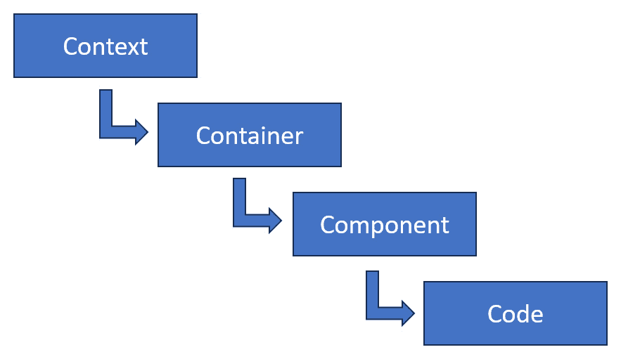
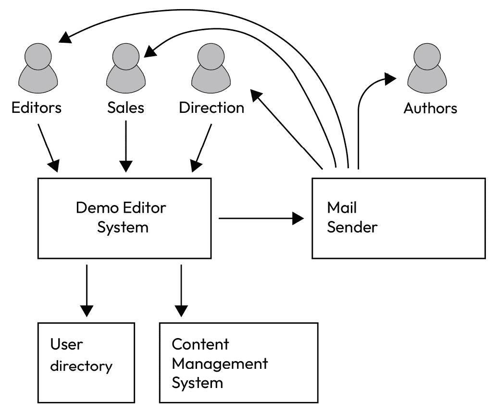
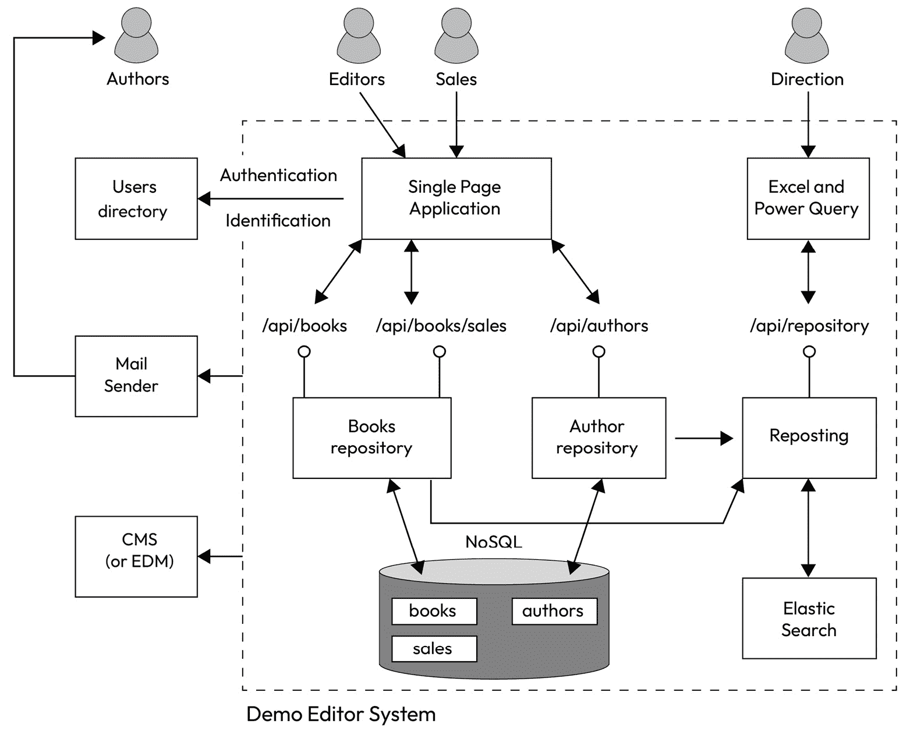
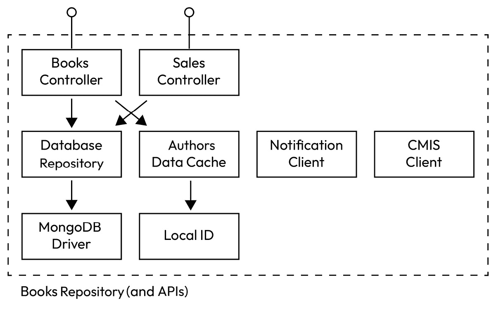
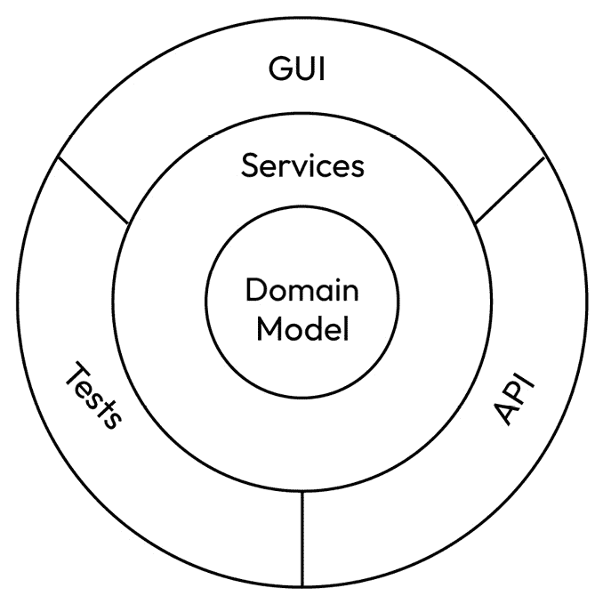
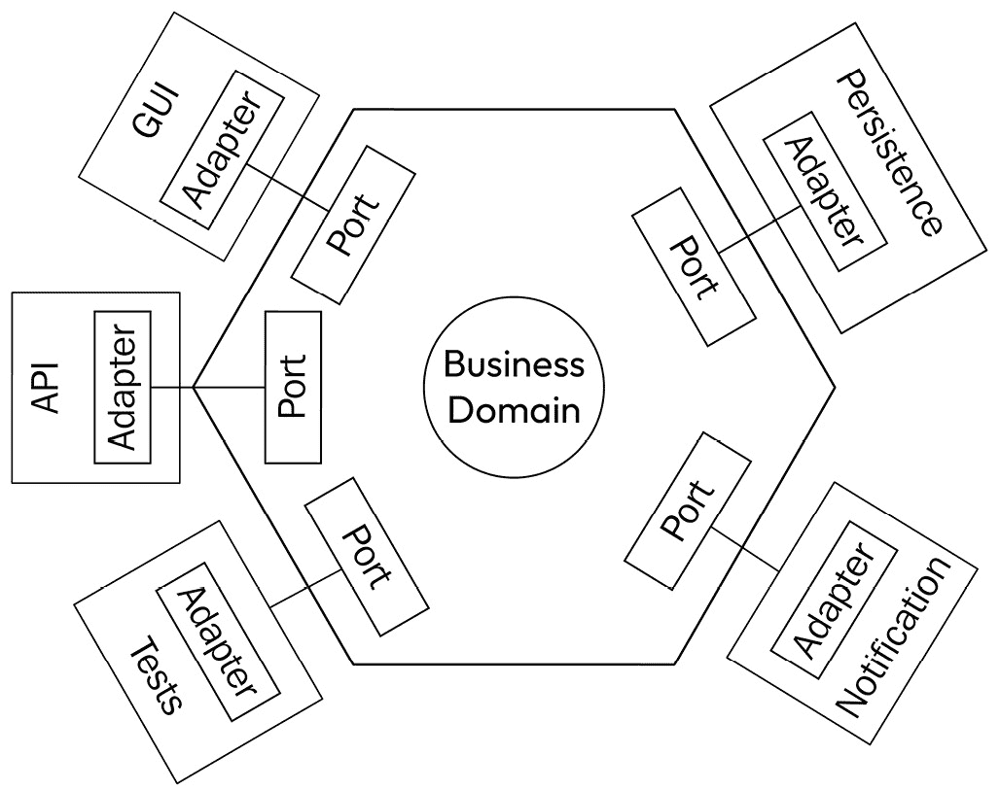

# 7

# C4 和其他方法

在上一章中，我们提供了一个关于我们将要构建的示例信息系统（以及应用程序软件模块）的商业目标的初步想法（作为一个实际练习来遵循本书中概述的原则）。谈到原则，在介绍演示系统时，我们还解释了面向对象编程中最重要的原则如何应用于我们系统的设计。

现在已经确定了高级原则，是时候深入理解我们的示例信息系统了，我们将利用这一点来展示专业人士使用的一些不同方法。正如我们将看到的，存在许多架构方法和软件表示，它们在许多方面都有重叠。事实上，其中一些非常接近，以至于它们实际上是作者标记他们个人方法的一种方式，而不是为架构工具带来额外的价值。这与 JavaScript 生态系统中的情况相同，那里有太多的框架。此外，每天都会变得更糟，因为每天都有新的团队认为他们可以通过提出另一个解决方案来解决问题。同样的事情也发生在架构方法上，我们最近被**清洁架构**、**六边形架构**、**洋葱架构**等等所淹没。

由于选择一种方法而不是另一种方法实际上并不重要，我们只会快速展示这些方法，以便您可以选择哪种方法更适合您的思维方式，或者简单地从许多方法中混合一些有趣的片段，因为这些只是一些众所周知的最优实践的新组合。在我们的示例信息系统的情况下，**C4 方法**听起来很有趣，可以提供一个如何设计它的初步方法，因此我将重点关注这种方法，以提供更多细节。C4 架构框架背后的理念是，从上下文级别到容器级别，然后是组件级别，最后是代码级别，关注 IT 系统。我们将随着在示例系统中应用它们来解释这四个级别。

就像在上一章中提到的**SOLID 原则**一样，我的目标不是深入解释这些方法，因为如果已经在免费和高质量的资源中提供了更详细的解释，那么写作就没有价值了。我的意图是提取这些方法如何有助于达到商业/IT 一致性，或者至少帮助表示与这个主题相关的问题。 

在本章中，我们将学习以下主题：

+   C4 方法

+   清洁架构

+   六边形架构

+   洋葱架构

# C4 方法

C4 方法涉及设计一个系统（或应用程序），具有四个不同粒度级别，从应用程序所处的上下文级别开始，到将展示应用程序不同过程的容器级别，再到展示组成过程的各个部分的组件层，最后到代码级别，在那里我们将找到用于创建应用程序的类和接口。以下是该方法的示意图：

图 7.1 – C4 方法中的级别

每个级别都详细说明了上一级的内容，并提供了更详细的应用视图。事实上，低级别的单元总是必须与上层的一个给定单元相关联，这也帮助正确地分担责任并保持低耦合度。

在接下来的章节中，我们将为我们的示例系统和软件模块绘制四个级别，以展示方法；同时，我们将开始设计我们的演示，比上一章允许的业务需求更深入。请注意，以下图示不一定是书中最后创建的系统所对应的精确图示；我真的很想展示完整和真实的设计过程，因此我会在设计样本应用程序的同时绘制这些图示。在我对最终结果有一个清晰和完整的看法之后再绘制这些图示——在我看来——不会那么具有教育意义，而且在某种程度上，我会感觉像是在作弊。

## 上下文级别

在上下文级别上，我们的系统将由之前详细说明的三个用户配置文件使用，即编辑者、销售人员以及 DemoEditor 的总监。我们将考虑用户列表已经存在于信息系统中的 Active Directory 或类似系统中。对于内容管理系统，我们将考虑它已经存在用于二进制文档管理。最后，我们还将考虑在整个系统中也提供了一个负责电子邮件发送的模块。它用于向系统中的参与者发送电子邮件，无论是验证某些数据还是通知他们某些事情。当然，作者也会在上下文中表示，即使他们没有直接使用内部信息系统。以下是上下文级别的示意图：

图 7.2 – 上下文级别图

我们可以对箭头的内容进行更详细的说明，但到目前为止，这个图示是自解释的，不同角色使用的功能在上一章中已经解释过了。我们在这个图示中最感兴趣的中心是**Demo Editor System**框，这是我们将在 C4 架构的下一级别详细说明的。

## 容器级别

在**容器级别**，我们展示了系统在构建块方面的使用情况。大多数情况下，这些块是分离的过程。在我们的案例中，由于我们决定拥有完全独立的服务，我们将拥有与 API 展示服务器一样多的容器。我稍微提前透露一下本书的技术章节，但我们将以 Docker 容器的形式部署系统，因此 C4 架构中的“容器”与 Docker 或其他类似技术中使用的部署单元的“容器”之间有一个完全匹配。

在下面的图中，虚线矩形内的框代表与 Demo Editor 系统对应的更高级别框的详细信息。我们仍然可以表示上下文级别的其他部分，但最佳实践是不详细说明它们，因为它们超出了我们的研究范围。我们可以详细说明流向它们的流（就像我们对**用户目录**箭头所做的那样，指向**单页应用程序**），但这不是强制的，如果我们还不想精确地描述这些数据流，我们也可以保留从整个系统指向的箭头（这就是邮件发送者和 CMS 子系统所做的那样）。

图 7.3 – 容器级别

顺便说一下，在这个反思层面，我们开始考虑数据流的内容可能是什么，在这个特定的情况下，我意识到，与其使用 CMS，电子文档管理可能更为合适。如果我们考虑这是一个外部系统，而不是我们正在设计的系统的一部分，那么实际上我们可能没有能力去改变它。然而，由于它与它有交互，我们可能能够影响与其通信所使用的协议，这正是我们的分析所关注的。从实际的角度来看，我在写作的时候还不知道（记住，我希望尽可能现实，我在写章节之前还没有完成练习），是否会有一个 Alfresco 容器、一个 Azure 存储，或者一个 SharePoint 365 网站来实现这个子系统。我所知道的是，我需要传递二进制文档并检索它们，这意味着像**内容管理互操作性服务**（**CMIS**）这样的流肯定会被指示（CMIS 是电子文档的互操作性标准）。

目前，我们还没有表达每个框内部的内容。我们只知道每个框都将作为软件应用拥有自己的生命周期，并代表一个过程和一个 Docker 容器（确实是一个好的实践，即每个容器只包含一个进程，以便所有事物都能很好地对齐）。如果我们稍微深入到开发细节中，那么为每个这些容器设置一个持续集成管道，以及逻辑上为每个容器设置一个 git 仓库，将是正确的。但我正在预测这本书的“动手”部分。现在，让我们深入到一个框中，即 **书籍存储库**，并展示它将如何使用 C4 方法中的第三级，即组件图来组成。

## 组件级别

在 **组件级别**，我们展示了可执行容器将使用哪些不同的模块和库来完成其业务需求。由于我们的书籍库将公开两个合同 API，我们需要一个 Web 服务器来支持控制器，一个客户端来调用持久化系统，可能还会与存储库模式一起使用，一个缓存组件来本地保存一些数据，等等。这就是以下图表所展示的内容，对应于 C4 架构的第三级：

图 7.4 – 组件级别

一个组件可能对应于不同平台上的不同工件名称。在 .NET 中，组件可能是程序集，而在 Java 中，它们将是 JAR 存档。无论如何，这种组件分解在基本上所有编程平台中都存在，即使它们以不同的形式出现。例如，在某些平台上，组件将对应于单独的文件，而在其他平台上，它们将更加抽象，例如通过使用命名空间。无论如何，都存在将代码级别内容分组为连贯组的方法，同时仍然比更高层级的容器具有更低的粒度，这些容器对应于由多个组件组成的整个过程。

## 代码级别

正如 C4 方法（可在 [`c4model.com/`](https://c4model.com/) 获取）的参考文档所述，只有在它们能增加价值的情况下才应使用图表。这也是我在介绍 `IDbRepository` 模式将被使用，也许还会使用 `UnitOfWork` 模式时强调的，但类组织结构尚不明确，因此现在尝试绘制图表是没有意义的。

此外，即使是为了教学目的，绘制这样的图表也不会带来太多价值，因为 C4 方法的第四级实际上与**UML**或**统一建模语言**中的类图相同。在接下来的章节中，如果我们需要，我们将使用这些详细图表，一旦我们进入实际制作系统的阶段。与此同时，我们已经完成了用于解释我们想要创建的示例系统的 C4 方法，现在我们将简要讨论其他软件架构设计方法，使用它们更好地表达我们正在分析的环境。

# 清洁架构、六边形架构和其他框架

在软件架构的背景下，接下来可能对你来说是个惊喜——选择哪种架构方法并不那么重要，只要你有一个方法（或者几个方法一起使用，顺便说一句，如果你能控制它们之间的交互并知道何时选择一个而不是另一个）。当然，这并不意味着在设计信息系统架构时你不需要应用某种方法。我在这个领域多年经验后的观点是，你应该找到并应用**你自己的**方法。

此外，如果你尝试了许多不同的现有方法，如六边形架构、清洁架构、洋葱架构以及其他以领域为中心的方法，你很快就会意识到，它们提供的不过是将相同的基本原则以不同的视觉方式呈现，这些基本原则与我们在这本书开头讨论的业务/IT 对齐以及从 SOLID 方法中提取的原则高度相关，即以下内容：

+   商业模式（*代表功能概念的**数据结构**和*转换成代码的业务规则**）应该是架构的核心。这样，它不依赖于任何东西，这允许轻松更改、快速自动化测试、缺乏外部版本控制约束，以及许多其他优势。最重要的是，它使团队能够专注于最重要的事情——业务对齐。

+   围绕这个业务核心的一切都应该使用某种间接方法来引入低耦合，使系统的任何模块的演进都更容易。一切皆依赖于业务核心模块，而它本身不依赖于任何其他东西。此外，如果需要，这些依赖关系很容易修改。

## 技术架构模式

在我们深入探讨方法细节之前，还有最后一件事——在这里，我将只讨论可以应用于整个信息系统设计的架构方法。有许多方法涉及单个应用程序的技术架构，它应该如何结构化，其源代码和信息流应该如何组织，应该存在哪些技术层，甚至在某些情况下，如何命名事物的建议。

例如，**N 层架构**（也称为**基于层的架构**）将描述每一组源代码应该如何调用另一组，从 GUI 到服务再到应用程序再到数据库。MVC、MVP 和 MVVM 架构稍微不那么线性，描述了每一组源代码将只与其中的一些进行通信，以简化应用程序的演变和维护（通常侧重于它们的视觉部分）。

这些架构理论上可以在整个信息系统的层面上使用，但这并不意味着更多，因为它们并没有说很多关于应用程序应该如何协同工作。N 层架构建议软件块应该通过应用层相互通信，但由于它没有强制执行，许多旧应用程序在数据库级别进行互操作，这在大多数情况下都是灾难性的耦合，也是当今绝大多数遗留系统无法演变的主要原因之一。MVC 应该适用于比仅仅视觉界面更高的层面，但尽管如此，它并没有达到整个信息系统的层面。这可能只是一个语义问题，但我个人倾向于将这些方法归类为模式而不是架构，因为它们来自经验而不是纯粹的反思（这里绝对没有价值判断——我们需要实验和智力方法来完整）。

由于这本书是关于整个信息系统架构的，我专注于适用于这种级别的架构方法的目的。恰好领域中心的方法通常对此作出回应，因为它们传达了业务领域的概念，如果你想要得到与业务一致的结果，这必须是第一个（也是唯一的）分解信息系统的途径。所有技术方法都可以在软件和硬件层上工作，但我们需要的是在业务能力映射层上工作的方法。

## 洋葱架构

**洋葱架构**将软件单元描绘为几个同心圆，中心正是业务**领域模型**！围绕它，你会找到服务（持久化等）然后是展示层（GUI、外部接口、测试等）：

图 7.5 – 洋葱架构

在洋葱架构中，一条主要规则是所有依赖都应该从外侧流向内侧层。这样，核心业务模型就不依赖于任何东西，这使得它容易进化，而外侧圈可以改变，前提是它们不影响业务（这通常比反过来更容易 – 想象一下，如果你的整个业务模型基于专有关系型数据库过程语言，并试图切换到另一个数据库引擎）。

虽然这种方法不坚持间接层的级别，但依赖反转原则（见前一章的解释）以及刚刚提到的规则使得接口对于实现持久化等功能是必要的。当然，对于更高一层也是如此。

## 六边形架构

**六边形架构**代表一个以六边形形状的软件单元，因此得名，其中六边形的左侧包含消耗内部（如 GUI 或自动化测试）的接口，右侧包含适配器以处理功能依赖（如持久化、通知服务等），而中间部分，正如你可能猜到的，是核心，包含业务实体和业务规则！

图 7.6 – 六边形架构

六边形架构强调端口和适配器来组织应用程序不同部分之间的通信，但这也是洋葱架构的一条规则，即使它没有以相同的方式展示。这有助于我们记住，接口和合同应该始终应用于依赖，以防止它们演变成硬耦合，这使得系统难以进化。

就“*六边形*”形状而言，这只是纯粹的杂乱！我的意图是画出业务域的三个“客户端”来强调方法名称与给定的技术约束或技术优势之间绝对没有关系。实际上，方法中解释说，六边形形状只是用来保留足够的空间来显示围绕中心形状的形状。这与圆圈（如之前提到的其他方法所用的）、椭圆形或正方形有何不同？如果六边形形状在概念上没有带来任何丰富性，那么我个人认为，它不应该出现在方法名称中。

这可能听起来像是对方法的无用抱怨，但这只是为了明确，它们的真正价值在于它们共同拥有的东西，而不是它们的差异。真正重要的是核心域的中心性，与业务对齐，以及依赖的控制，但所有这些已经在 SOLID 原则中存在。

## 清洁架构

**清洁架构**基本上是将之前提出的两种方法结合起来，同时提出一些额外的规则。从图形上看，它非常类似于洋葱架构，以同心圆的形式呈现，业务实体位于中间，围绕核心组织了多层，按照依赖关系应用的方向从内向外发展。

在这种方法中，你将找到之前在另外两种方法中几乎已经解释过的所有内容，包括领域模型必须摆脱任何技术依赖性，以解决其在系统中的极端重要性，并带来各种其他好处，如可测试性。

依赖反转也是推荐的，因为它与关注点分离相似。词汇略有不同，但通过在互联网上快速搜索，你会看到很多关于三种架构之间极端相似性的博客文章。清洁架构可能比其他架构更“指导”，但在写作时，不可能找到证明其中一种比另一种更好，甚至在结果上广泛不同的文档分析。

我个人的观点是，这三种方法（洋葱、六边形和清洁架构）在它们的工作方式和推荐方面非常接近，你可以使用其中一种而不影响产生的架构质量。

能够带来质量的是对这些方法存在的原因的深刻理解，特别是创建干净分离的模块并保持对依赖关系的控制的能力。没有对它们之间关系的严格规则来切割关注点和责任，最终会导致像意大利面一样的系统。

相反，遵循严格的原则，其中业务领域（最重要的部分）没有任何依赖，并且所有技术都是围绕它接口的，中间有一个间接层，这才是真正重要的。而且三种方法都有这个共同点。其余的都是纯粹细节，如果你考虑，例如，六边形形状并没有给方法带来任何东西，就像之前解释的那样，那么存在多种方法确实给人一种印象，即其中一些方法的存在仅仅是因为它们的作者想要有自己的方法。

# 摘要

在本章中，我们使用了 C4 方法从四个角度详细介绍了我们的演示应用程序，即它所使用的上下文、它所使用的容器以及它由哪些组件和代码组成。遵循此方法绘制的图表帮助我们解释了我们将要创建的示例信息系统的内容。我们还了解到，没有必要创建一个完全覆盖研究领域的图表，但只有这些图表具有价值。

此外，在过去几十年中涌现了许多架构方法。尽管它们在软件应用程序的设计中，以及信息系统设计中显然具有价值，但它们在某种意义上非常相似，即最近的方法大多是领域中心的；因此，它们的价值基本上可以总结为我们已经知道的两个原则，即 SOLID 原则和业务对齐原则，即首先考虑业务功能模型，并应用一种方法来减少对依赖的耦合。这两者都使得系统的演化变得更加容易。我毫不怀疑这些方法可能对软件组织具有额外的价值，并且它们确实可以帮助你超越纯粹技术导向的架构模式。然而，就整个系统而言，我认为在第章开头探讨的 C4 方法应该首先以自上而下的方式应用，将领域中心的方法作为组织 C4 方法的第三级（组件）的一种方式。

在*第八章*中，我们将开始更精确地定义我们的演示系统所基于的 API，因为这些实体无疑是实现自由发展的应用程序最重要的技术方面。在接下来的章节中，我们将首先解释服务导向的概念及其与 API 的关系。在*第九章*中，我们将采用基于语义的方法来定义我们的示例应用程序的业务领域，并将它们转化为实际的 API 合约。我们已经对业务领域进行了很多讨论——在接下来的两章中，我们将定义这些领域，以及它们在我们演示系统中的交互。
