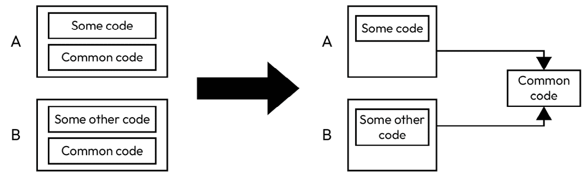
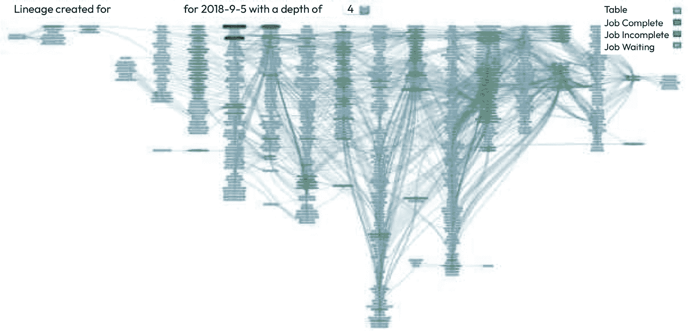
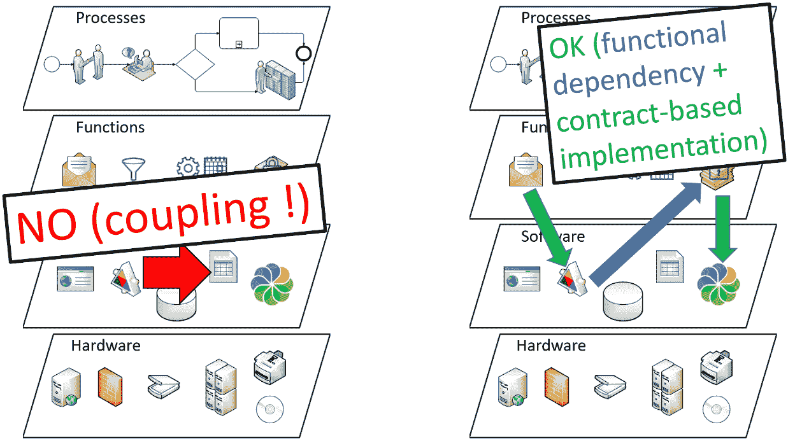
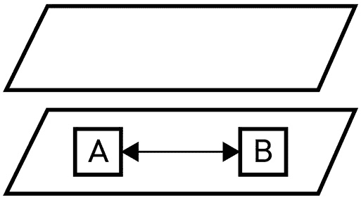
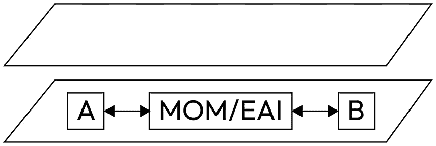
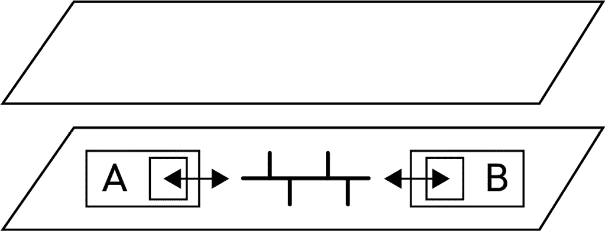
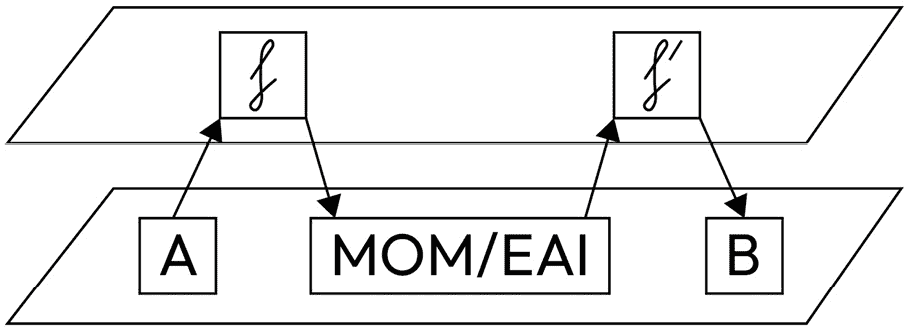
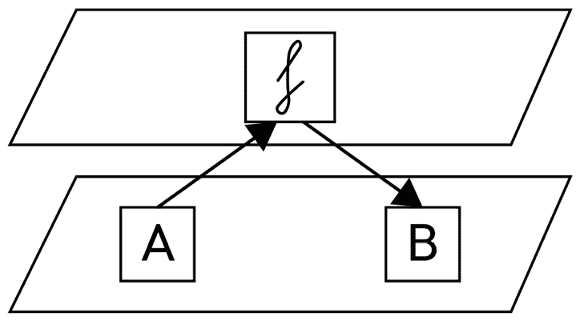
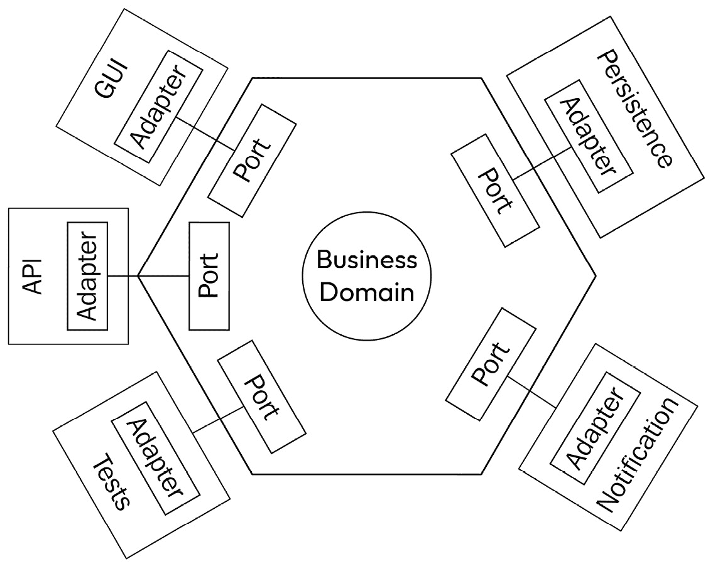
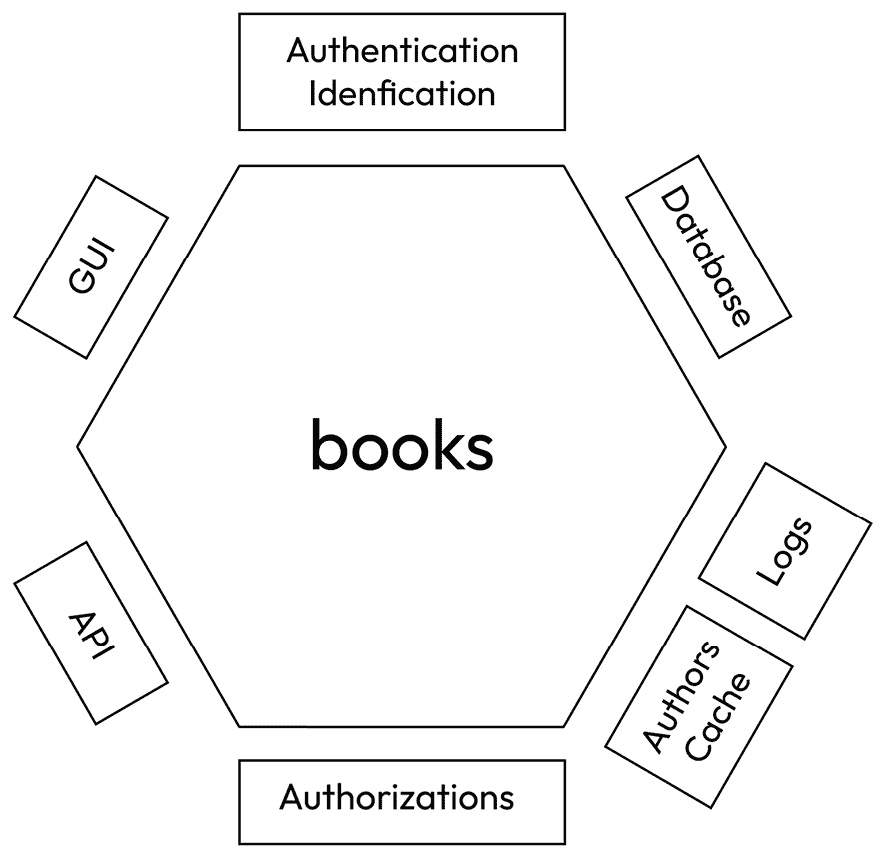

# 8

# 服务导向和 API

现在我们已经解释了许多原则和几种方法，我们将继续进入一些技术性更强的章节，这些章节将展示更多应用到我们的演示应用程序中的示例。在本章中，我们将从 IT 的角度解释“服务”的概念，并尝试将服务置于 IT 历史中，以便您更好地理解它们的目的以及它们为行业带来了什么。当然，仍然存在一些不足，但面向 Web 的架构和一般意义上的 Web 服务，当它们被正确设计时（遗憾的是，这远非普遍现象），为软件行业带来了巨大的价值。

在对服务的历史进行了考察之后，我们将详细阐述良好服务导向架构的特征（我之所以不使用“服务导向架构”这个表达，是有确切原因的，您很快就会明白），并解释它们当前的演变，即 REST API，如何对许多软件系统有益。

最后，我们将展示上一章中提到的架构模式如何应用于演示应用程序的服务定义。为此，我们当然会使用 REST API，因为它们是现代 IT 系统架构方法的核心理念。我们将回到在*第二章*中广泛讨论的标准概念，并解释哪些标准可以用于我们的演示系统。最后，我们将解释当没有标准存在或适用时我们可以做什么，这将成为下一章的过渡点。

在本章中，我们将涵盖以下内容：

+   查看服务导向的历史

+   服务的特征

+   应用到我们的演示系统中

# 查看服务导向的历史

首先，让我们从一点历史开始。这可能是因为我是一名老程序员，过去 37 年中一直在编程，其中 25 年在工业环境中，但我认为了解我们从哪里来总是很有趣，因为这解释了今天许多技术被创造的原因，以及它们仍然缺少什么。这样，我们不仅能够预见某些技术和软件实体的不足，还可以避免不充分利用它们的风险，正如它们的创造者所期望的。回顾技术的历史还有另一个优点：在沿着这条道路漫步时，你可能会偶然发现一个古老但仍然有趣的技术，它可能比新出现的技术更适合你的环境。这种情况并不经常发生，但当它发生时，如果你可以用一个经过实战考验的、比目前普遍使用的工具更简单的技术来解决你的 IT 问题，这可以在维护时间和性能上为你提供巨大的提升。例如，基于文件的互操作性可能对每天使用 Web API 的人来说显得可笑，但在特定情况下，异步操作更好、安全性不是问题、进程的独立性是一个优势、避免部署 Web 服务器可以节省时间的情况下，它们可以是一个完美的解决方案。

因此，让我们从互操作性技术开始这段旅程，并且特别开始于为什么我们需要它们。

## 长期期待的可重用性

使软件实体的两个部分相互互操作是一个几乎与编程本身一样古老的概念，因为它与可重用性相关。为了使一个常用函数不需要被输入两次，需要有一种方法将其从其他不同的代码部分中分离出来，并且以某种方式使其可以被这些代码片段调用。这可以很容易地如图*图 8.1*所示进行图解：



图 8.1 – 重复使用通用代码

代码重复是一个问题（尽管“不要重复自己”原则可能有其自身的不足，而且每个编程选择总是需要妥协），因此将一些代码放在公共部分通常是一种有价值的方向。有众多方法可以组织这一点，而且可重用性就像 IT 领域的格拉尔一样，多年来一直被追求，甚至几十年。

## 程序和避免额外打纸卡

首次尝试实现可重用性来自一个你们大多数人甚至都不太可能了解的时代，那时程序以穿孔纸卡的形式存在，这些纸卡上打有孔洞，为计算机提供指令。这实际上源于雅各德织机机制，在这些纸卡被用来控制半自动化机器中的布线，以在最终布料上形成特定的图案和编织图案。通过重复使用相同的卡片，可重复性已经实现，但在给定卡片上重复图案是通过多次以完全相同的方式打孔来完成的，这导致了一个漫长的手动过程，并涉及到出错的风险。此外，每个应用程序，由按精确顺序排列的带有穿孔纸卡的盒子组成，必须包含每一条单独的指令。由于卡片上可以容纳的指令数量是固定的，因此卡片在另一个堆栈中再次使用实际上是不可能的。即使可能，提取正确的卡片，使用它，然后将其放回堆栈的正确位置，对于涉及的两个应用程序来说都太危险了，尤其是关于复制纸卡，即使这是一个手动操作。

然后出现了使用例程并将代码发送回程序中给定地址以使其重复部分指令的想法。与臭名昭著但仍然值得尊敬的`GOTO`指令相关的概念诞生了，它为后续的程序节省了许多指令。但有一个问题：例程只能在单个程序内部使用。诚然，它有助于减少它们的大小。然而，当创建一个新的程序时，仍然需要输入相同的代码——我们谈论的是一个复制粘贴根本不存在的时代。因此，需要更好的东西。这就是我们将在接下来的章节中要探讨的内容。

## 库和程序间共享指令的能力

重复使用的下一个发展阶段是`.dll`文件的概念，或者说是`.jar`存档中的 Java 模块，它们仍然是重复使用的基石，当像微软的基类库这样的库成为所有.NET 程序员的证据时，通用性就不远了。对于这个最初在微软严格控制下开始，并逐渐发展到开源可用性的特定框架，历史是一份祝福，因为许多库只是一次性实现。另一方面，Java 最初是一个更开放的平台，但在 Oracle 收购 Sun 之后，它逐渐变得更加封闭。尽管事情开始有所统一（以牺牲更慢的进化为代价），Java 生态系统中仍然存在许多做同样事情的库。我记得在我使用.NET 五年后的第一次 Java 专业开发中感到震惊，因为没有一个 XML 解析库，而是有许多，每个库在某一件事上都是最好的：Xerces 擅长流分析；Xalan 被认为是加载 XML DOM 最快；有些其他库在处理 DTD 模式验证方面做得更好；等等。对于习惯于只有`System.Xml`的人来说，这真是一个巨大的惊喜和巨大的失望，因为它使得学习曲线突然比平台和语言的亲近性预期的陡峭得多。

无论如何，库无疑是编程平台中重复使用最普遍的方法，并且几乎存在于所有现代语言中，无论是 JavaScript、Python、C 还是 C++等等。尽管库也有它们的困难，不仅在于版本控制和向前兼容性领域，还在于复制文件时的便捷性，有时这会导致代码库中出现多个副本（这与重复使用的初始目标相悖），但它们仍然是必要时首选的方法。当然，就互操作性而言，它们有明显的不足，因为它们只能在它们自己的执行平台上使用：尽管可能存在桥梁，但 Java 库只能由 Java 程序使用，.NET 程序集只能由另一个.NET 程序集调用，等等。这是一个长期困扰 IT 工程师的问题，也是许多解决方案出现的地方。

## 尝试实现通用互操作性

解决上述限制的主要方法是创建包含编译后代码的库，这样机器代码就可以从任何调用者处使用，无论创建调用程序的编程语言是什么，只要它也以机器可读代码编译。那里的困难主要在于技术层面：调用这样的库并不像使用函数名和属性那样简单。此外，由于编译平台的原因，仍然存在限制。确实没有在 Linux 操作系统内执行 Windows 库或反之亦然的方法。

微软实际上通过引入由操作系统控制的组件的概念，在这个方向上尝试走得更远。这些可重用单元不是直接作为文件提供，而是作为操作系统本身所知的实体：它们的实际形式仍然是文件，具有`.dll`扩展名，但一旦注册，Windows 就会使函数对任何程序可用，即使它没有访问原始文件。除了作为应用程序定制的存储库之外，注册表还存储了**组件对象模型**（**COM**）所需的信息；实际上，它甚至从 Windows 3.11 开始就主要为了这个用途而开始其职业生涯。与 COM 一起，微软的一项名为动态数据交换（Dynamic Data Exchange）的技术允许应用程序组件相互插入。这就是你今天在 Word 文档中打开 Excel 工作表时看到菜单适应的原因。

在 COM 之后，出现了 COM+等扩展，然后是**分布式 COM**（**DCOM**），这是试图突破本地计算机的边界并引入组件的远程执行。这些并没有像这个组件领域最新创新——ActiveX——那样成功。ActiveX 是一种基于 COM 的技术，旨在使将图形组件集成到应用程序中变得更容易，而不仅仅是函数。甚至可以通过在浏览器中交付它们来将这些组件嵌入到 Web 应用程序中。在浏览器安全没有像今天这样扩展的时候，它提供了许多有趣的功能，但现在这项技术已经过时。

存在其他用于分布式组件的技术，例如企业 JavaBeans 和所有使用 CORBA 的平台，但它们与 DCOM 相同的局限性，并且没有展现出最初承诺的低耦合水平。版本控制留给了平台维护者，没有能力与表示层建立关系，以及其他不足之处使得这些技术如今纯粹是遗留技术，未来有限。

事实上，以组件形式实现的互操作性可能过于谦逊，以至于无法真正达到 ASCII、Unicode、HTTP 等广泛使用的技术如持久技术状态。组件最初是在单台机器的范围内开始的，并且从未找到一种方法走出这个范围。为了迈出下一步，需要一个完全通用的方法，这涉及到将互操作性和重用带到整个计算机网络中——而且为了值得这样做，这必须在所有网络中最大的网络，即互联网中。

## 尝试使用 Web 标准实现通用性

我们互操作历史的下一个里程碑涉及 Web 服务，在术语的一般接受意义上，意味着通过 Web 标准提供服务。由于 HTTP、TCP/IP、Unicode 和 XML 等基础已经可用，并提供了这样一个通用互操作技术所需的大部分基础，因此网络是进行这一步的明显方式。

第一次尝试实现 Web 服务（或者我们可以称之为*互联网上的可重用函数*）使用了诸如**简单对象访问协议（SOAP**）和**Web 服务描述语言（WSDL**）等技术，由于这些标准在领域内是独一无二的，它们简单地预占了*web service*这个术语，这成为了 SOAP 和 WSDL 兼容的表述所接受的行话。SOAP 旨在标准化通过 HTTP 请求和响应的 XML 内容，使它们看起来像函数调用，包括一个信封、具有类型的属性、可能的元数据等等。WSDL 是用来表达相关合同的标准，简而言之，是应该在 SOAP 消息中使用的语法。还有额外的标准，例如**通用描述、发现和集成（UDDI**），例如，但这些未能实现其目标，并迅速衰落。许多所谓的*WS-*标准也是如此——WS-Authentication、WS-Routing 以及添加到 Web 服务语法的其他语法，旨在允许补充功能。

这些解决方案在 2000 年代在行业中获得了很大的动力，并在 2010 年代初达到了顶峰。实际上，它们产生了一个整个架构，被称为**面向服务的架构（SOA**）。SOA 本应是一个通用术语，但它已经与特定的架构和软件相关联。此外，软件制造商大量投资于*SOA 工具*，使公司相信，中央中间件是他们实现互操作性的全部所需，而了解互操作性的专家知道，这仅仅是交易的一部分，语义和功能互操作性实际上比技术互操作性更关键、更复杂，而技术互操作性通常是过程中的最后一公里。

当然，这导致了对 SOA 的大量批评，2010 年代中期，许多文章宣布了 SOA 的死亡及其未能实现目标。与此同时，在行业中它的传播仍然非常广泛，许多技术因为 SOA 而得到了新生。

## 中间件中的步骤

特别是中间件应用在 SOA 架构中被推高，即使它们不是基于 SOAP 和 WSDL，也能适应它。**企业应用集成**（**EAI**）是一个古老的梦想，并假设集中的适配器使得系统中的许多应用程序能够相互通信，EAI 平台将每个消息从一种格式转换为目标格式。当然，其集中化的方面是一个**单点故障**（**SPoF**），相当大的缺点。如果你再加上每次任何应用程序更改其版本时都需要更新的 EAI 砖块，那么这些定制系统从未达到成熟也就不足为奇了。

**提取、转换、加载**（**ETL**）是一组数据处理工具，但它们可以被归类为中间件应用，尤其是由于在常见的信息系统中的应用程序之间有很多互操作性流实际上是纯粹的数据传输，而不是业务功能调用。当然，这是一种粗略的中间件，但数据质量比工具的复杂性更重要，一个良好的 ETL 可以在结构化信息流方面走得很远。然而，ETL 并不完全适应数字化转型，而且很容易失去对它们的控制。我咨询的一家公司有一个非常混乱的 ETL 作业系统，每晚有超过一千个作业启动，整个系统需要一个专门的工具来精确地编排这些作业，以便在早上结束时有干净的数据。随着新作业的不断添加，在低活动期间时间开始变得稀缺，在添加更多服务器功率和并行化可以并行化的内容之后，整个系统只有在办公室开门后才能完成工作。这当然成为一个重要的问题，必须通过激进的决定来解决。更糟糕的是，作业之间相互依赖且脆弱，以至于没有一个夜晚所有作业都通过，在操作期间需要运行一些纠正作业，或者对于风险最高的作业，简单地等待下一个夜晚，希望得到干净的数据。出于信息目的（并且希望它也能起到警告的作用，因为作业的数量使得图表几乎无法阅读），以下图表显示了作业的按时间顺序执行的图形。这个图表旨在概述复杂的作业；文本可读性不是目的。



图 8.2 – 复杂作业编排

**消息导向中间件（MOMs）**已经存在了一段时间，但得益于 SOA 和 AMQP、ActiveMQ、MSMQ 和 RabbitMQ 的引入，它们在消息传递的可靠性方面获得了市场关注度。即使在今天不再使用 SOAP Web 服务的架构中，MOM 仍然有助于确保系统内特别重要消息的全面传输功能。一些 MOM 支持者认为所有消息都应该通过中间件传递，防止应用程序直接相互通信，但这会影响性能，我们将展示消息的功能标准允许移除中介层。

就中介层而言，消息导向中间件（MOMs）从霍普和沃尔夫（[`www.enterpriseintegrationpatterns.com/`](https://www.enterpriseintegrationpatterns.com/)）定义的标准消息操作方式中受益良多，这种方式被称为**企业集成模式**（**EIP**）。EIP 定义了一些处理软件消息的标准模块，例如多路复用、基于内容的路由器、丰富化等。通过组合这些基本的消息转换或路由模块，MOM 能够处理几乎所有可能的功能场景。Apache Camel 是参考开源的 EIP 实现，并被广泛应用于许多中间件中。术语*砖块*特别适用于这些模式，因为它们可以用实际的、具体的乐高™砖块来解释：我经常使用这些来直观地解释软件系统架构的概念，特别是如何通过引入具有可组合动作的中介层，以最小的冲击使系统架构演变，每个动作都由简单的技术乐高™砖块组装处理，如图*8**.3*所示。3*:


Figure 8.3 – 使用乐高™砖块模拟的企业集成模式

**企业服务总线（ESB**）是 MOM 和 SOA 的自然演变，与互联网的原则相冲突。ESB 将我们讨论过的所有技术集成到一个不再有集中的系统中：网络（在 TCP/UDP 中）是唯一保持中心化的东西，其适应交付的能力被用来提高对节点故障的鲁棒性。同时，使用**存储和转发**模式来确保消息几乎永远不会丢失，因为它们被持久化，并且只有在下一个目的地确认它们在其控制下已持久化后才会被删除。ESBs 几乎拥有实现互联网规模系统互操作完整功能目标所需的一切。但仍然，它们失败了，或者至少没有像预期的那样成功，因为这是解决 IT 行业如此重要问题的理想解决方案。事实上，ESBs 添加了所有必要的功能，但这正是它们的厄运。由于它们可以做到一切，它们庞大、复杂的机器需要大量的专业知识来运行和维护。

## 最新的演变——REST API

然后出现了 REST，这是一种创建基于 Web 的 API 的更轻量级的方式，这再次彻底改变了生态系统。**表示性状态转移（REST）**在 2000 年之前就已经被定义，但在 2010 年代初才真正成名。到了 2020 年代，尽管遗留软件的部分很大，SOAP Web 服务仍在被利用，但没有任何新项目是基于这些旧技术开始的，几乎每个新的 API 项目都在使用 REST，或者至少采用了某种降级的、并非真正“RESTful”的方法。

简而言之，REST 是关于回归 HTTP 的基本机制，以允许在 Web 上进行函数调用。例如，与 SOAP 将操作代码发送到信封中不同，REST 使用 HTTP 动词，如`GET`、`POST`、`PUT`、`PATCH`和`DELETE`来指示服务器应该做什么。它不是发送函数调用，而是像 HTTP 处理更知名的 HTML 页面或通过 Web 提供的图像一样处理资源；只是这些资源在功能上是有方向的，比如客户或合同。这些业务实体每个都有 URL，就像网页或资源一样。它们的表示可以是 HTML，但更适合 XML 或 JSON，后者比其前身 XML 更轻量。超媒体、格式协商和头部也被用于等效的互操作功能。授权简单地留给任何 HTTP 调用中的等效功能，使用基本身份验证、Bearer 令牌等。简而言之，REST 将基于 Web 的互操作简化到了极致，消除了每一丝冗余，以专注于现有标准的纯粹和完整使用。实际上，REST 并不需要除 HTTP、JSON 或 XML、Unicode 等现有标准之外的其他任何东西。因此，它更多的是一种实践，而不是一种新的协议。

而且它确实有效……它实际上运作得如此之好，以至于互联网上的评论者毫不犹豫地谈论 SOA 2.0，甚至*正确的 SOA*。有些人引入了新的架构术语，如*面向 Web 的应用*，以将这种方法与原始 SOA 区分开来。REST 成功的最好证明是，没有编辑利用其名声来尝试强制实施专有实现：REST 之所以运作良好，是因为它没有添加任何东西，而是将任何软件层减少到零，因为一切都已经存在，工程师只需按照其预期的方式使用它即可。

## 我们缺少什么才能达到实际的服务重用性

这就是我们在撰写本书时的现状，毫无疑问，情况将继续发展，但我们已经达到了一个点，即基于实际的基于 Web 的互操作性，包括两个独立实体之间的互操作性，对于许多公司来说已经成为日常现实，这本身就是一个巨大的胜利。当然，我们总是可以更进一步，但主要道路已经铺好，现在剩下的任务主要是传播这种互操作方式的好做法，而不是想象一种克服任何当前缺点的新方法。

事实上，大部分剩余的问题都是由于缺乏功能数据交换的公认格式，导致存在中介连接器。如果我们想要达到一个理想的地方，在那里全球通用的互操作性不再是问题，而是一个过去的问题，我们就需要为每个数据流拥有一个无可争议的标准。这当然是不可能的，而且我们离这样的满意状态还非常遥远，但一些精确的、非常普遍的、技术上容易的交换形式目前已被涵盖。例如，认证和识别现在由 OpenID Connect、SAML、JSON Web Tokens、SCIM 以及一些其他规范很好地实现了。当然，有很多遗留软件甚至专家工程师没有使用这些，但总体趋势是它们是未来的方向，全球各地都接受这一点，并朝着这些规范努力，这些规范将成为未来的便利标准，就像 ASCII 和 Unicode 对于文本的二进制表示一样。还有一些其他领域被涵盖，或者至少有很好的、功能齐全的规范可以解决这个问题，例如 CMIS 用于电子文档交换或 BPMN 2.0 用于工作流建模。

但绝大多数的交换都没有被一个无可争议的标准所覆盖，大量的连接器仍在开发中，以建立应用程序之间的对应关系。这在当今全球 IT 领域是一个巨大的资源浪费，因为这些中介连接器并没有为顾客和最终用户增加任何额外的价值。但现实是，制定一个标准需要花费大量的时间，正如我们在*第二章*中看到的。尽管如此，让我们尝试关注积极的一面：现在这个运动正在活跃，情况每年都在改善，有一个强大的互操作性基础，其中技术问题现在已经得到解决。只剩下语义和功能互操作性需要处理。这将是下一章的主题，但在讨论这一点之前，我们需要回到“服务”这个概念本身，并解释一个好的服务应该如何定义。然后我们将使用这些原则来制定我们演示系统的第一个服务，使用上一章中展示的架构原则，并将它们应用于之前展示的演示应用程序，并在本书的其余部分对其进行更详细的开发。

# 服务的特征

**服务**是一个如此模糊的术语，以至于需要一个完整的章节来给出一个良好的概念理解——而不是一个单一的定义。

## 如同服务所解释的

“作为服务”这个表达在许多公式中被使用：**SaaS**代表**软件即服务**，**PaaS**代表**平台即服务**，**CaaS**代表**容器即服务**，等等。你有没有考虑过为什么如此不同的事物使用这个共同的名称？这本身可能就是对服务最好的定义：从其他事物中受益，而不必处理通常与之相关的外部性。酒店房间是一种服务，因为你可以享受到床和屋顶的好处，而不需要购买和维护一栋房子，甚至不需要打扫房间。SaaS 是一种服务，因为你可以使用软件（操作其界面、存储数据并检索它、实现复杂的计算、导出结果），而不需要安装软件、购买长期许可证、操作它、安装新版本等等。IaaS 是一种服务，因为它提供了你对基础设施的预期（CPU 功率、RAM、I/O、存储、网络带宽和使用），而不需要你担心购买服务器的硬件方面、操作它们、租用一些房间、整理电力和冷却、物理上保护它们、在出现故障时更新硬件等等。

解释**作为服务**的表达式是必要的，因为“服务”这个词本身非常通用，人们可能会有些困惑，为什么我们谈论**面向服务架构**，然后是 SOAP 网络服务的概念，然后是网络环境中的服务，等等。当我们在这本书中谈论服务时，我们真正指的是作为软件功能向用户提供的服务，而用户无需关注其实现：用户不需要知道使用的是哪个平台，服务器在哪里等等。他们只需要知道尽可能少的信息，即一个 URL 和定义交换语法的合同，以便与该服务进行互操作。

这让你想起了什么吗？仅仅依赖于某物的功能定义，而不考虑任何与软件相关的约束？这正是书中已经提到过的内容，特别是我们讨论了四层 CIGREF 图模型的部分：



图 8.4 – 使用 CIGREF 图解耦

当谈论提供**作为服务**的**功能**时，可以将其视为从第二层（业务能力图）获得某些内容，而无需担心它在第三层和第四层（技术层）如何实现。

## 完全去除中间件

**作为服务**的方法的一个优点是它允许我们完全去除中间件。实际上，我们真正想避免的是直接、点对点的互操作，这会导致大量的耦合，如下面的图所示：



图 8.5 – 点对点互操作

但中间件，虽然引入了一个间接层，却带来了两个问题。第一个问题是它引入了额外的软件复杂性，这可能很难维护。第二个问题是我们仍然处于 CIGREF 图的软件层，这意味着，如果没有进行标准化（没有标准化消息），我们可能会遇到两步耦合而不是简化它！以下方案表达了这种潜在的危险：



图 8.6 – 通过中间件进行互操作

企业服务总线（ESB）通常被提出作为避免集中实体的解决方案，但它们实际工作的方式仍然意味着存在（尽管是分布式的）可能导致耦合的软件代理：



图 8.7 – 与企业服务总线进行互操作

避免这种耦合的一种方法是从功能角度标准化消息：



图 8.8 – 与标准化解耦功能进行互操作

但如果我们达到了这样一个状态，即已经创建了一个功能标准，那么中间件实际上不再需要映射数据或转换任何格式，因为`f`和`f'`函数实际上是相同的（否则它们不会被包含在单一的数据流中）。中间件唯一的功能仍然是路由、认证以及一些可以通过 HTTP 简单实现的功能，而不需要任何中间件。因此，中间件简单地消失了，我们达到了之前所表达的理想情况：



图 8.9 – 间接解耦原理

在这里，唯一剩下的困难是一个功能性的，即描述与业务相关的需求。诚然，这可能是一件非常困难的事情，但主要区别在于这是我们需要在任何情况下克服的内在复杂性（否则软件将无法正确工作），而不是偶然的技术复杂性，它进入我们的设计阶段并增加了版本控制、维护等问题。这是解耦的本质，也是使系统更容易演化的关键。

再次强调，尽管我们应该尽可能努力实现这一点，并且这确实是一种创建低耦合互操作性的方法，但这种交互并不总是容易实现。MOM 和其他中间件系统在不久的将来不会退役，因为它们仍然是互操作复杂消息、应用调解以及在无法在信息系统中对消息进行完全标准化时确保交付鲁棒性的好选择。

## 外部互操作性最终成为现实

所有这些都可能听起来有点理论化，但正是这种方法使我们最终达到了这样一个阶段，即前面图示中的软件`A`和软件`B`之间的互操作性（*图 8.5*至*8.9*）不再依赖于中间件或其他阻碍其复杂化的工件。展示这一点最好的方式是提供一些实际例子。

在我之前工作的一家公司中，两个客户（一个区域委员会和一个城镇）希望以这种方式进行互操作，即当区域委员会将其列表中的关联添加时，城市会自动接收到信息并将其存储在其自己的数据库中，前提是它是注册的城市。这种方式需要一些重要的前期工作，这是我的雇主完成的，即定义法国协会的标准格式。由于我们对主题很了解，这仅花了几天时间，我们就将此格式提交给法国政府，以便在他们的开源 forge 中发布，因为他们没有为这个现有的标准。这个格式是两个客户之间的功能合同。他们同意，无论他们可能对其软件进行何种更改，协会 JSON 的内容始终如下（此提取高度简化并翻译成英语以提高可读性）：

```cs
{
    "name": "Old-time developers of Brittany",
    "registrationNumber": "FR-56-973854763",
    "organizationType": "uri:ORGANIZATIONS:ASSOCIATIONS",
    "creationDate": "2019-01-04T12:00:00Z",
    "representatives": [
        {
            "role": "accountant",
            "lastName": "Gouigoux",
            "firstName": "JP"
        }
    ],
    "legalAddress" : {
        "streetNumber": 282,
        "cityName": "Saint-Nazaire",
        "zipCode": "44600"
    }
}
```

事实上，区域委员会在这个项目之前已经是客户，所以他们已经在使用基于此格式的我们道德人参考软件。因此，在这一方面，我们只需要定制事件管理系统，以便在发生创建、修改或删除协会的事件时调用第二个客户的回调地址。这是通过以下语法完成的：

```cs
{
    "webhooks": [
        {
            "topic": "POST+*/api/organizations",
            "callback": "https://saint-nazaire.fr/referentiel_associations/modules/index.php?refOrga={registrationNumber},
            "method": "PUT",
            "filter": "organizationType=='uri:ORGANIZATIONS:ASSOCIATIONS' and zipCode=='44600'"
        }
        {
            "topic": "PUT+*/api/organizations/{registrationNumber}",
            "callback": "https://saint-nazaire.fr/referentiel_associations/modules/index.php?refOrga={registrationNumber},
            "method": "PUT",
            "filter": "organizationType=='uri:ORGANIZATIONS:ASSOCIATIONS' and zipCode=='44600'"
        }
        {
            "topic": "PATCH+*/api/organizations/{registrationNumber}",
            "callback": "https://saint-nazaire.fr/referentiel_associations/modules/index.php?refOrga={registrationNumber},
            "method": "PUT",
            "filter": "organizationType=='uri:ORGANIZATIONS:ASSOCIATIONS' and zipCode=='44600'"
        }
        {
            "topic": "DELETE+*/api/organizations/{registrationNumber}",
            "callback": "https://saint-nazaire.fr/referentiel_associations/modules/index.php?refOrga={registrationNumber}&setActive=false,
            "method": "PUT",
            "filter": "organizationType=='uri:ORGANIZATIONS:ASSOCIATIONS' and zipCode=='44600'"
        }
    ]
}
```

为了稍作解释，webhooks 是外部系统对由给定应用程序发出的事件的注册。在我们的案例中，当区域委员会的参考服务接收到新组织或现有数据变更的数据时，通过参考服务的 API 方法，会引发相关事件，上述定制文件提取将这些事件与提供的 URL 的调用相关联。这个 URL 是由第二个客户（圣纳泽尔市）使用 PHP（但具体技术不重要）公开的。例如，当我们对一个新组织应用`POST`操作时，回调 URL 会调用创建实体的标识符以及`PUT`动词。这也是我们引入事实的地方，即该城市只对关联（不是所有组织）感兴趣，特别是那些在其领土上的组织，使用`filter`属性。

随后，URL 实现可以自由地按其意愿工作，而不依赖于发射器。在某些操作中，给定标识符上发生事件的现实就足够了（例如，在区域议会信息系统中收到`DELETE`命令时，可以取消关联）。在其他情况下，例如创建关联时，JSON 内容——其精确语法由双方达成一致——将通过回调中获得的标识符通过`GET`操作检索（因为关联的所有信息都有用）或简单地读取回调调用体（因为最重要的数据被发送到那里，当然使用相同的合同语法）。

这个例子证明是一个成功的实验，因为每个客户都可以自由地以他们想要的方式发展他们的系统，改变技术或其他参数，而他们的合作伙伴甚至不需要知道这一点。在某个时候，城市可能会对其邮政编码区域外的关联感兴趣，只需简单地注册一个新的带有更新过滤器的 webhook 内容。这不会影响事件发射器，甚至不会影响其授权方案：如果城市要求在部门（法国的一个介于地区和城市之间的地理单位）之外被调用，事件就会被发送，但通过接收到的标识符读取信息最终只会导致`403 Forbidden` HTTP 状态码。这种特定的机制最初让我们决定在回调请求中永远不发送任何数据，以简化授权机制。但是，在某个时候，有人决定强制被调用实体始终以`GET`调用回复以获取新关联的名称和基本信息是一种带宽浪费。性能并不是问题，但在这种情况下，简单性比授权失误的风险更重要，因为这项数据在法国是公开的，而且很容易获得。

## 标准化实现互操作性

上述例子演示了一个特定数据模式（我们称之为*关键格式*，但我们将在本章末尾和下一章中更详细地讨论这一点）必须被设计出来以自由和松耦合的方式交换数据的情况。但更好的情况是，这种合同在行业中已经存在。这是另一个我有幸处理的实际案例，特别是，因为当时我工作的那家小公司迫使一家更大的公司遵守我们的工作方式，仅仅因为我们使用了公认的标准。让我更好地解释一下情况……

我们的旗舰应用程序，一种类型的 ERP，生成 PDF 文档和其他二进制文件，这些文件应该被存储。在相当长的一段时间里，这些文件会存储在数据库旁边的网络共享中，有时也会存储在通过 UNC 链接访问的专用服务器上。电子文档管理系统在几年后开始成为主流，我们需要调整我们的应用程序，使其能够使用这些系统来存储文档。对于这一点，自然的选择是内容管理互操作性服务规范，因为 OASIS 发布了一个功能齐全的 1.1 版本，支持多个元数据模式、分类、版本控制以及许多我们甚至不需要的功能。而且，这也恰好是这个功能领域唯一使用的标准，这使得架构决策变得非常简单。

因此，我们最终使用了标准操作中的几个操作（在第一步中，我们只需要创建文档，向它们添加元数据和二进制内容，然后通过对其元数据内容的查询检索文档），这花费了我们几周时间才将其添加到我们的应用程序中。客户非常满意，因为对软件的简单定制就能使文档出现在他们的 Alfresco 或 Nuxeo EDM 系统中，因为这些应用程序是原生 CMIS 1.1 兼容的。但真正证明这种规范性方法重要性的，是我们第一次遇到一个配备了专有 EDM 的客户：编辑，一家相当大的公司，在我们的共同客户的信息系统中占有重要地位，希望我们修改我们的应用程序以支持他们的专有网络服务，以便发送文档和元数据。在我们最初拒绝后，情况变得有些紧张，但我们很幸运，信息系统所有者是一个聪明的人，她完全理解低耦合的价值。她明智地询问，如果她必须选择另一个供应商来提供这项服务，一个合作伙伴需要付出多少努力。EDM 提供商表示，如果我们的公司被另一家公司取代，他们就不需要做任何事情。就我们公司而言，我解释说——在相反的假设中——我们可能需要重写一些代码以适应另一个专有协议。这对客户来说已经足够了，即使她不是技术专家，也能意识到这种操作方式有问题，并要求使用基于标准的、合同式的通信渠道。由于客户的反对，EDM 提供商别无选择，只能在自己的成本下在其产品中实现对 CMIS 标准的支持。

这在许多方面都证明是一次非常令人满意的经历：

+   首先，我必须承认，重新演绎大卫对抗歌利亚是我职业生涯中最令人自豪的时刻之一。

+   其次，我们没有在会议中添加任何东西到我们的软件中，因为它已经准备好支持 CMIS。

+   第三，客户赞赏我们在帮助他们达到更好、更具进化性的系统方面的专业知识，而不是像其他*合作伙伴*那样试图将他们推入供应商锁定的情况。

+   第四，互操作性项目在技术上非常容易领导，因为我们只需向合作伙伴提供我们需要的 API 调用 Postman 集合，他们就能从 CMIS 规范的角度验证它们。互操作性调用中没有“隐藏参数”，一切都是明确的，并且严格通过 OASIS 标准进行规范。我们只需在认证的情况下进行一次调整。

+   最后，即使最初不愿意的合作伙伴也承认，在项目结束时，这种方法有助于避免项目中的乒乓效应，即双方都拒绝对对方的非工作调用承担责任，最终导致时间全球损失，客户不满意。我真正相信 CMIS 支持将为他们的产品在未来的某个时候开辟新的机会。

## 保持完全兼容性

所有这些听起来像是一个美丽的梦想，到处都是粉红色的独角兽和彩虹，但使用国际标准和规范构建的伟大 API 并不能防止互操作性中的最后一种危险。实际上，情况正好相反，API 越干净、越易用，这种危险就越大。听起来很奇怪，不是吗？欢迎来到 Hyrum 定律([`www.hyrumslaw.com/`](https://www.hyrumslaw.com/))，它陈述了以下内容：

在一个 API 有足够多的用户的情况下，

无论你在合同中承诺了什么：

您系统的所有可观察行为

将会有人依赖。

您的 API 越成功，向前兼容性就越重要，因为不可能打破许多客户端的使用。但毕竟，这只是成功的一面，如果你的 API 在你的环境中是最常用的，这确保了很大的市场份额和显著的收入，这并不是一个坏价格。Hyrum 定律更为严厉，因为即使是你没有正式承诺的 API 的一些部分，也可能成为让你陷入麻烦的事情。例如，性能的突然变化可能会使你的最大客户无法继续使用你的 API。即使是较小的、非合同的修改也可能让你陷入这种麻烦。你知道吗？即使是移除一个错误，也可能让一些 API 用户不满意，因为——以一种扭曲的方式——他们的系统依赖于这种特定的行为来运行。这听起来可能很荒谬，但它比你想象的要普遍得多。毕竟，一些 API 用户按照它们的顺序而不是它们的标识符来消费响应属性是非常常见的。

在一定程度上，Hyrum 定律可以被认为是面向对象编程中 Liskov 替换原则的 API 等价物：即使一个类可以通过实现相同的接口来替换另一个类，但如果在函数调用具有相同的参数值时其行为不同，那么实际的兼容性（以及因此的可替换性）并未实现。

## 管理 API

即使这更多的是一个操作问题，管理大量的 API，包括所有授权访问问题、日志记录，以及可能对 API 消费进行计费、版本跟踪等问题，可能会构成一个严峻的挑战。一些专门的软件产品存在，通常被称为*API 网关*。它们通常以反向代理的形式实现，充当前端服务器，隐藏实际的 API 暴露。

根据您是否需要一个低耦合的系统或一个非常集成的系统，您可以使用 WSO²或 Ocelot（如果您使用 ASP.NET 实现 API 系统）等系统。

## 服务依赖反转

如果你记得上一章中的以下架构，你会回想起为了使卫星模块依赖于实现业务领域模型的主体模块，即使调用来自后者并前往前者，使用了端口和适配器模式：



图 8.10 – 六角架构

这仅仅是依赖倒置原则在架构中的应用，描述一个传统接口被一个模块调用，而无需知道这个接口背后使用了什么实现。在**面向对象编程（OOP）**的代码中，这通常是通过对象注入来实现的。

在面向服务的系统中，尤其是在使用 Web API 时，间接层是通过调用者使用的 URL 来完成的，而无需知道其背后是什么。如果对这个模块的依赖不是问题，那么调用可以是直接的。但如果业务领域模块调用 API，直接的依赖对于演化和找到反转依赖的方法来说并不是一个好的主意。

这通常是通过使用某种回调机制来完成的，其中领域模型模块从外部（在我们的例子中是依赖）被指示调用它应该调用的 URL，可能在其定制中，也可能在运行时初始化步骤中。在前面的 webhooks 的第一种解释中，这就是当城镇需要更改区域委员会应考虑通知城镇的事件过滤器时发生的情况：区域委员会依赖于城镇是不正常的，因为城镇是信息功能请求者。这就是为什么城镇向区域委员会提供回调 URL 的最佳方式是通过注册事件，可能通过`/subscribe` API 来实现。

这样，我们就达到了一个很好的责任分离，因为地区议会负责以下事项：

+   暴露一个 API，允许客户端从数据参照服务的持久化机制中创建、修改和删除组织

+   暴露一个 API，允许客户端（可能是其他客户端，也可能是相同的客户端）在组织中注册事件

+   当代码中出现事件时，在注册时调用这些客户端提供的 URL

+   在注册时应用提供的过滤器，仅发射请求的事件

在另一端，城镇负责以下事项：

+   在组织参照系上注册它需要观察的事件

+   提供一个可访问的回调 URL，并指向必要的实现

当这种基于事件机制的机制用于每次交互以提供非常低的耦合度时，术语是**事件驱动架构**（**EDA**）。在其最先进的形式中，EDA 添加了许多非常精确定义的责任，以允许以下操作：

+   不同的注册和发射机制认证和授权方法

+   通过在必要时重新应用调用并，如果需要，警告管理员，在尝试了一定次数后，事件已被存储以供稍后向某些已注册客户端发射

+   处理大量事件

+   处理大量已注册客户端

+   服务级别协议管理，以及其他许多功能

在正确的实现中，基于 EDA 的系统是软件系统中解耦的最成功成果，允许不同模块完全透明的演变和线性性能。但尽管它在理论上有很长的存在，实际实现却非常少。

现在已经从不同的角度介绍了并研究了“服务”的概念，我们将回到我们的示例信息系统，并将这些新知识应用到它上面。

# 应用到我们的演示系统中

现在您应该对“服务”的概念不再有任何秘密，是时候看看我们在演示系统中涵盖的一些实际应用，以加强本章的收获。鉴于我们追求的是现代的，选择显然是示例系统的不同模块将通过 REST API 相互交互。尽可能保持中间件尽可能透明。在某些情况下，我们可能需要一些连接器来进行调解，但除此之外，应用程序将与其他集中式 API 进行通信，这些 API 将单独实现（这将通过容器编排器中将要实施的服务概念来完成）。

## 需要分析的接口

首先，我们将从六角架构图开始，列出所有业务域模型及其依赖关系。上一章中使用的 C4 方法表明，我们需要至少三个业务域，即书籍、作者和销售。

例如，如果我们专注于书籍，那么依赖关系包括持久化机制、作者缓存模块、书籍的 GUI 系统、书籍的 API 控制器，以及一些技术卫星，如日志记录、身份和授权管理。这可以概括如下：



图 8.11 – 六角架构的示例

在敏捷方法方面，我并不是说这包含了我们旅程结束时将出现的所有接口。但为了使这个练习尽可能真实，我在写书的同时创建了这个示例信息系统，这样就不会有任何东西被隐藏起来，并且你可以跟随我推荐的精确设计方法，当然我也尽力遵循。

因此，现在我们已经列出了第一个接口，我们需要比仅仅一个名称更精确一些。它们将要做什么？它们将如何设计以提供干净、未来兼容的使用？最重要的是，这些选择将如何反映我从第一章开始就推动的业务/IT 对齐原则？

## 使用规范和标准

由于我已经谈了很多关于规范和标准至关重要的内容，如果不从它们开始，就无法精确定义接口，那将是一个可怕的信号。而且，当我们使用标准时，精确描述我们在上一节中讨论的接口是非常容易的，因为我们只需要命名它（并且可能引用将要使用的版本）并且所有标准的功能、格式、语义和其他操作都通过标准的文档立即明确定义。

例如，让我们从认证和识别服务开始。对于这个特定的接口，我们将使用基于 OAuth 2.0（RFC 6749）和 JSON Web Tokens（RFC 7519）的 OpenID Connect 协议，OAuth 2.0 本身的 JWT 配置文件是标准化的（RFC 7523）。再次强调，规范和标准的好处是它们极大地简化了我们的工作。如果我要用同样的精确度描述没有标准的接口使用，那么这一章将会更长。对于这个服务，引用几个 RFC（当然，在下一章中，使用这些规范的优秀实现）就足以使一切变得明确。

那么数据库接口呢，或者更准确地说，持久化接口呢？决定使用一个 NoSQL 文档型方法，因为它听起来最适应我们讨论的业务实体和我们要处理的数据量。关于 MongoDB 可能不是一个非常知名的事实，但大多数使用的协议都是开放标准，实际上也被许多其他 NoSQL 数据库实现所使用。如果你想要改进你本地的 MongoDB 数据库，你只需要更改连接字符串即可切换到 Atlas 服务或 Azure CosmosDB 实例，因为一切工作方式都是相同的。MongoDB Wire Protocol 规范是在 Creative Commons *Attribution-NonCommercial-ShareAlike 3.0*许可下发布的。使用的 BSON 格式([`bsonspec.org/#/specification`](https://bsonspec.org/#/specification))是公开文档化的，并且可以被任何软件实现。还有更多。除了对软件进行适当的适应以满足我们的需求，以及它易于创建免费数据库的事实之外，标准化方面是使 MongoDB 成为我们示例应用程序的一个合理选择的关键。

好的，现在转到授权问题！在软件授权管理方面存在两个主要规范，即`admin`角色拥有所有权限，`operator`可以根据投资组合读取和写入实体，而`reader`角色只能读取数据（例如）。然后，使用 OPA 可能不是正确的选择，因为它会添加很多开销。当然，真正的疑问，再次，是考虑时间。当然，到本书结束时，我们的示例应用程序将非常简单，使用 OPA 将是过度设计。然而，这个练习的目标是展示如果我们旨在一个真实、工业、自由发展的信息系统，我们应该如何工作。鉴于我们假设权利管理将会更复杂，我们将立即开始使用适应的接口，在我们的情况下意味着 OPA 1.0。

记录功能的情况有些不同，因为这并不是一个直接的功能，而是一个技术特性。然而，这并不意味着不应该使用相同的标准化方法。唯一的区别是，这种间接级别不会像其他规范那样在国际层面上标准化，而是将在平台上本地化。我们的示例应用程序主要使用.NET Core，因此我们将使用该技术的标准，而恰好有一个标准全局接口在`Microsoft.Extensions.Logging`中，称为`ILogger`，它也存在一个泛型类`ILogger<T>`。我们将在技术章节中返回来看如何使用它，也许我们甚至会通过使用像 Serilog 这样的语义日志系统来增加一些趣味。但就目前而言，只需说日志机制也将得到标准化即可。

值得注意的是，该领域的某些参与者目前正在努力实现第一级标准化，例如 Elastic 的 ECS 规范（详情请见[`www.elastic.co/guide/en/ecs/current/ecs-reference.html`](https://www.elastic.co/guide/en/ecs/current/ecs-reference.html)）。由于 Elastic 是观察平台的主要出版商之一，且该规范是开源的，我们可以对它作为标准的传播抱有一定的希望，尽管只有时间才能证明一切。

## 我在哪里可以找到规范和标准？

当我教授或咨询关于业务/IT 一致性，特别是关于需要参考规范和标准的问题时，这个问题总是在某个时候出现：*我们该如何搜索规范？* 我必须说，我对这个问题感到非常惊讶，原因有几个：

+   寻找它们就像任何互联网搜索一样简单，几乎所有这些规范都是公开的，为了实现它们的目标，需要尽可能的可见，因此找到它们在技术上绝对没有任何困难。这表明，大多数在 IT 行业工作的人（根据我培训或教授的人数，我确实有一些显著的统计数据）对自己的行业标准一无所知，这相当令人烦恼。我可以理解，不是很多人知道 BPMN 2.0，因为流程是一个特定的用例，并不是所有应用程序都需要工作流引擎。但为什么一些架构师不知道 OAuth 2.0，因为这在互联网上几乎无处不在，几乎所有软件应用程序在某个时候都需要某种形式的身份验证？

+   即使一些非专业人士也知道一些最著名的规范和标准提供者，例如 ISO 或 IETF。甚至**请求评论（RFC）**这个术语也被很多人所理解。当然，一些生产规范的 IT 特定组织，如 OASIS，可能不太为人所知。但另一方面，**万维网联盟（W3C）**是一个非常活跃且被广泛认可的机构。那么，为什么问这个问题的人没有本能地从这些组织开始，搜索他们所需的内容呢？

对于一些客户，我在某个时候甚至创建了一份白皮书，其中包含了我在当时工作的业务环境中（公共和政府机构）使用的近一百个规范和标准，因为这个问题总是反复出现，我希望有一个快速的答案，不仅告诉他们在哪里可以找到他们需要的东西，还提供给他们已经找到的答案。这有一个简单的原因：因为我发现真正的问题不是这些人不知道“在哪里可以找到规范”，而是这表明了他们对使用这些规范的能力存在疑虑。规范和标准可能因为数百页解释所有可能情况而显得有些令人畏惧。即使是简单的 RFC 也确实不易阅读。

但这个问题也有其他答案：

+   首先，找到合适的规范并开始使用它并不需要你阅读规范说明。实际上，只有当你需要实现其中大部分内容时，阅读它才会对你有益。

+   在大多数情况下，你会使用实现规范的组件，你所要做的就是确认它们是被认可、已经建立起来的模块。

例如，为了在我们的示例信息系统中使用 OpenID Connect，我们基本上不需要了解该协议本身，因为我们将依赖 Apache Keycloak，它以透明的方式为我们实现它。我们唯一需要处理的是选择身份提供者以及 Keycloak GUI 简化的一些自定义设置。

即使你必须深入研究规范的细节，大多数时候，你只需要理解其中的一小部分。例如，在我们的示例应用程序中，我们将在某个时候肯定需要实现某种对作者合同二进制文档的支持；这意味着我们当然会使用 CMIS 1.1，因为这是这个用例的公认标准。但因为我们只会发送文档，添加二进制和元数据，并查询文档作为回报，我们可能只使用整个规范中的 10%。

最后，一个好的规范通常已经相当广泛地传播并在国际上使用。所以，阅读完整的规范说明总是很有趣的，但让我们说实话：你在最初接触标准的方式主要是通过模仿在参考网站上找到的一些示例调用，并根据你的需求进行调整。只有当你达到一定程度的复杂性时，在 RFC 的全文中找到实施细节的精确细节才会变得容易一些。

## 对于其他接口的关键格式

对于这个主题的最后一部分，接下来出现的逻辑问题是：*当我们的环境中没有规范或标准时，我们该怎么办？*

对于这个问题，我总是首先本能地回答，“*你愿意打赌确实没有我可以向你展示的规范吗？*” 大多数时候，这个问题会回到之前的问题，只是表明提问者对规范感到不舒服，或者他们害怕这会很难（但实际上，规范反而让你摆脱了所有困难的设计方面）。因为，让我们面对现实，今天我们几乎为所有事情都有规范。好吧，在 IT 领域可能比机械领域少一些规范。但是，对于每个常见功能都有标准。你有一套通用的技术规范，用于国际数据传输中使用的每个实体，以及包括银行、保险、旅行等在内的每个常见的人类活动。甚至还有一个 ISO-Gender 规范（ISO/CEI 5218），用于以数字格式表示人类性别。

答案的第二个部分涉及当确实没有适用于你所在环境的规范时我们应该做什么。对这个问题的答案已经在本章中给出了一部分：然后你创建一个被称为**关键格式**的东西，它具有与真实规范相同的标准化目标，但仅限于你自己的环境。当然，目标是追求普遍性总是更好的。不仅因为，你永远不知道，但如果你投入足够的努力，并且其他人对此感兴趣，你的格式可能会成为规范（这是规范出现的方式：它总是从对业务领域极其了解的个人开始，他们努力将他们的知识转化为技术性的东西，然后其他参与者将其作为交换的合理基础达成一致）。而且因为追求普遍性将使你的关键格式尽可能接近规范，并带来尽可能多的优势。

对于这一点，规则是尽可能快地回归到现有的规范。当然，似乎不存在一个关于作者概念的国际化规范（尽管都柏林核心的`creator`属性允许我们从一个资源到创建该资源的个人或组织之间建立联系），但因为它指向个人，所以许多其他相关的规范会迅速适用，例如社会保险号码用于唯一标识，ISO 8601 用于创作日期，等等。同样的情况也适用于书籍：当然，我们可能找不到一个完美的标准来精确地满足我们样本应用的需求，特别是其持久化系统，但尽管如此，还是有关于语言的规范（ISO 639），以及用于注册书籍识别的国际公认标准代码，如**国际标准书号（ISBNs）**，以及我们将在系统中记录的书籍描述中几乎一切事物的标准。

现在，真正的问题是什么应该放入书中以及作者的关键格式？这是一个如此重大的问题，以至于需要单独用一章来阐述。好消息是，下一章将解释如何回答这个问题。

# 摘要

在本章中，我采用了简短的历史方法（详细的方法本身就可以写成一本书）来解释在面向服务中涉及的风险是什么，以及这个看似简单却难以定义的“服务”一词在过去几十年是如何被实施的。我们肯定还没有到达故事的结尾，但如今，似乎最好的方法就是使用带有中间件的 REST API，尽可能通过使用规范和标准来减少。这不仅避免了昂贵的转换连接器，因为互动中的每个人都使用同一种语言，而且还帮助我们了解我们的设计是否正确，因为联盟和专家已经对这个业务领域进行了很多思考。

标准化的 API 使得今天在不破坏它们的情况下改变重要信息系统的一些部分变得容易。它们允许进行国际银行业务、更高效的保险系统、简化出国旅行，以及许多工业 IT 世界的成就。

我们讨论了规范，还讨论了兼容性、服务的演变、服务将通过接口如何集成，以及更多内容。到本章结束时，我们回到了我们的示例应用程序，并展示了将用于实现它将公开的一些服务的规范。现在，一个难题仍然存在：当没有针对商业需求的标准化格式，而我们又需要创建一个关键的格式（当然，尽可能使用规范来定义其内部属性）时，我们如何确定这个格式的内容？我给出的最佳答案是使用**领域驱动设计**（**DDD**）。这正是下一章的主题。
