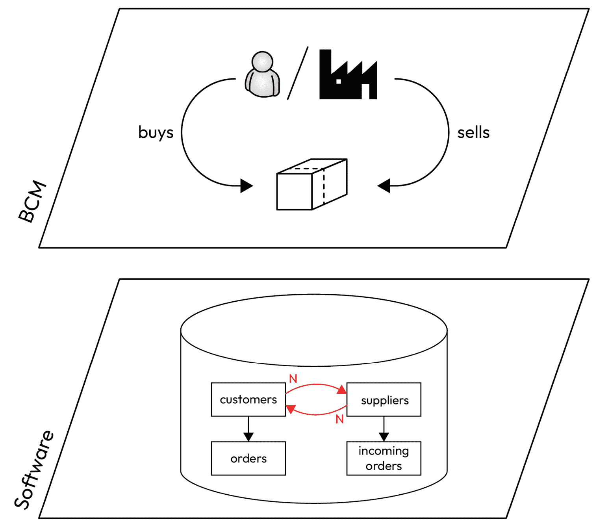
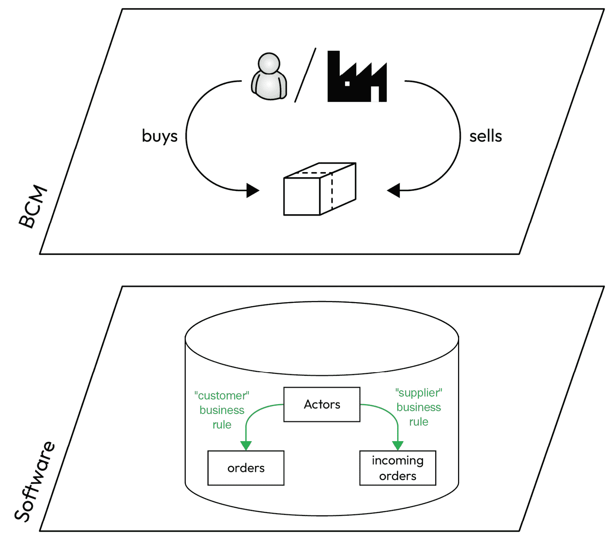
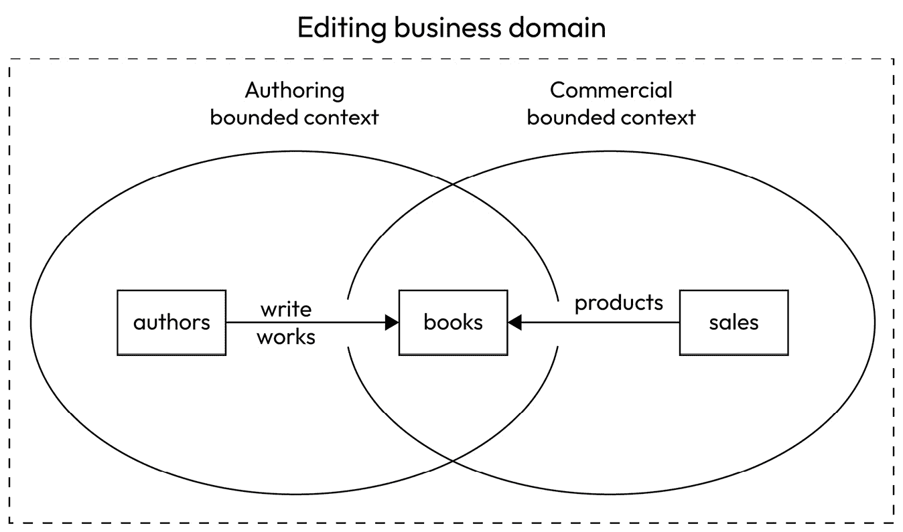
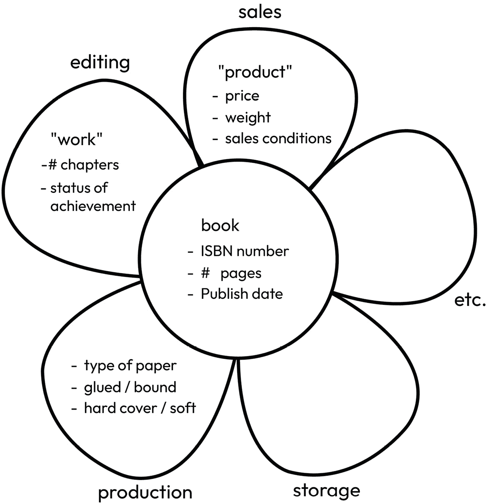
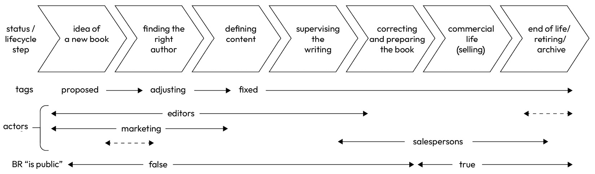

# 9

# 探索领域驱动设计和语义

上一章以提供一种处理关键格式和设计一个适应演变的、功能正确的实体的方法结束，当在这个精确领域没有标准时。这是我们本章的主题。

为了达到这个目标，一个非常重要的先决条件是始终以**功能**术语进行思考。我知道你们大多数人肯定有技术背景，可能会想知道我们何时才能最终接触到代码。让你们等待这么长时间而不进行任何技术操作是有意为之的，这也是本书阅读过程中提供的教学旅程的一部分。你们必须尽可能坚持功能和业务相关的概念，因为一旦将这种知识转化为软件，它就会变得固化，并且修改起来更加困难。我保证，从下一章开始，我们将开始做一些技术决策，然后，在接下来的几章中，我们将编写一些代码，以非常具体的方式展示这一切的含义。但就目前而言，让我们只关注业务功能，并像清洁架构所教导的那样，不考虑任何与技术相关的内容，仅仅从功能角度思考。这是我们构建正确信息系统的主要保证。实际上，如果你只从这本书中记住一件事，我希望那就是这个实践：从功能角度尽可能长时间地思考你的问题，然后才开始从技术角度思考如何处理它。尽可能推迟实施；考虑数据，而不是数据库；考虑模型和业务规则，而不是属性和方法。

如果你这样做，你很快就会对业务领域中使用的词汇有所疑问。技术方法有一个巨大的缺点，那就是限制了方法。但我们应该至少认识到，它迫使我们非常精确，因为计算机就像一箱石头一样愚蠢，它们强迫我们在信息指定上明确表达。考虑语义并使用称为**领域驱动设计**（**DDD**）的方法将帮助我们从功能角度进行精确思考，但不会依赖于任何可能阻碍我们未来发展的技术；这样，我们就能兼得两者之利。

一旦理解了这种方法的原则，我们再次回到我们的长期示例，并将 DDD 应用于我们的示例信息系统，以绘制其边界上下文并描述其通用语言（我们很快将解释这两个重要概念）。

最后，本章将解释所有这些如何应用于我们试图设计的清洁信息系统，以及服务与 API 概念的联系，这些联系我们在上一章中已经介绍。在那里，我们将讨论业务实体生命周期分析的重要性，并讨论信息系统架构的一些最近趋势。

在本章中，我们将涵盖以下主题：

+   功能问题的功能方法

+   语义的重要性

+   DDD

+   应用到清洁信息系统架构

+   链接到 API 和服务

# 功能问题的功能方法

如介绍中所述，使用功能方法来解决设计关键格式的问题至关重要。在四层 CIGREF 映射中，所有层都是上一层的后果。因此，在没有正确设计第二层（业务能力）中研究的上下文的情况下，就开始从第三层（软件）开始，这必然会导致软件出现故障。更糟糕的是，一旦变成软件，错误将在代码中修复，并且可能通过被整个信息系统或外部系统中的许多用户和机器使用的 API 共享，这几乎使得纠正设计错误变得不可能。

大多数 IT 问题都源于我们经常谈论的业务对齐不足，而现在，我们正处在问题的根源：业务实体的设计。当我们没有专门的规范可以依赖并避免复杂的推理过程，其中充满了可能导致重大后果的误解风险时，我们必须特别注意任何细节，在实践中，这意味着对业务领域专家的广泛和保证的访问。

标准通常用技术术语表达，以便非常精确和无可辩驳，但它以共享和公认的方式代表了一个功能概念。例如，RFC 7519 描述了 JSON Web Token 是什么，以及发行者、主题、过期时间以及所有其他属性的作用，但它以非常受限的方式（对之前引用的信息的`iss`、`sub`和`exp`有精确的定义）。这样，我们可以说规范既存在于 CIGREF 映射的 2 层和 3 层，又将它们联系在一起。这就是为什么规范和标准如此重要的原因，因为它们是业务/IT 对齐的具体行动者。以第二个例子来说，OpenAPI 也是规范和标准如何弥合功能方法和软件方法之间潜在差距的一个很好的说明，它提供了一份所有应在特定业务域的 API 上可访问的功能列表，同时，它还给出了关于这意味着在服务器之间交换的数据流中的精确 JSON 或 YAML 技术描述。

关键格式应通过结合其功能方面和技术表示来达到相同的结果。这就是为什么无论使用什么技术手段来描述它都很重要的原因。这些技术手段可以是 XML Schema 或 DTD，如果你正在使用 SOAP Web 服务；或者 OpenAPI，如果你正在设计 API 及其组件；甚至可以是一个简单的 Excel 文件，显示你打算在系统中传输的数据消息的确切名称和结构。唯一重要的是，它必须是技术性的书写，但不能具有技术限制性。

“技术上撰写，但技术上不具限制性”这个短语可能看似矛盾，所以让我来解释一下。规范的撰写技术很重要，因为它确保了精确性（没有人希望对重要事物有一个模糊的描述）。这就是为什么新的 API 必须用 OpenAPI 合同来描述。这样，就不会有关于属性如何书写的争论，无论是用大写字母还是不用，或者只使用第一个字母；例如，在 OpenAPI JSON 或 YAML 中的计算机化文本中书写，因此不可能有讨论。然而，同时，应注意关键格式（就像任何规范一样）绝不应受到任何技术问题的限制。我们都同意，如果规范的作者使用了某些会使规范难以与其他平台一起使用的 Java 原语，那么用于表示国家等的规范就没有任何意义。这将是一种有限的、技术性的实现方式，但绝对不是真正的规范。同样的原则也应适用于你的关键格式设计，它绝不应暴露出你的技术实现中的任何内容，即使是以功能方式表达。

顺便说一句，这也是在设计软件之前始终从功能角度出发的另一个原因。如果你在这个阶段强迫自己放弃数据库选择，例如，你会减少创建与你的数据库方向绑定的关键格式的可能性。我理解这听起来可能有点不切实际，你可能想知道有人如何将数据设计绑定到数据库上。好吧，魔鬼藏在细节中，不幸的是，有许多方式——有些比其他方式更微妙——会陷入这个陷阱：

+   人们可能会使用仅在某些数据库中可用而在其他数据库中不可用的类型来表示数据属性。例如，如果我们习惯于谈论`VARCHAR(n)`，那么在我们的数据设计中可能会暗示属性的大小有限制，尽管从功能角度来看并不合理。每个人都见过一个应用程序在姓氏过长时截断姓氏，尽管这会创建一个错误的数据值。

+   同样，日期格式也可能发生这种情况。参考 ISO 8601（也称为 ISO-Time）的规范在行政日期和瞬间之间做出了明确区分，但大多数数据库并没有。如果我们从 SQL 的角度思考，我们可能会错过这个基本区别。

+   标识符可能会受到众所周知的数据库机制的影响。基于计数的 SQL 数据库自动生成标识符相当实用，但这些标识符的可扩展性非常差，这是这些数据库缺乏分布的一个原因。**全局唯一标识符**（**GUIDs**）更好，并且通常被更现代的系统如 NoSQL 数据库所使用。然而，如果你需要为一个在健康信息系统中代表患者的实体分配一个唯一的标识符，这两种选择都将绝对不合适，因为在这个特定情况下，广泛认可的（有时是法律要求的）标识符是国家安全号码。

实际上，有很多其他情况，一些技术知识可能会浪费关键格式的设计，我因此养成了习惯，总是通过仅由产品所有者组成的团队来设计这些格式，甚至在一些情况下，我会检测到那些有技术背景的人并将他们排除在设计团队之外。尽管我仍然可能严重影响到这个过程，因为我有技术方法，但通常我帮助设计我在业务领域没有太多经验的临界格式，因此，扮演一个完全的初学者角色，对业务领域一无所知，然后只专注于这种理解。此外，我根据经验知道，早期技术思维可能会产生负面影响，所以我总是思考因为这一点可能会出什么问题。

有时，耦合可能非常微妙。例如，让我们以一个 URL 为例，如`https://demoeditor.com/library/books/978-2409002205`。它听起来像是一个很好的标识符，因为它仅基于规范（URL、书籍的 ISBN 和主机的 DNS）并且显然没有其他内容。然而，有人可能会争辩说，使用（`https://`）方案作为前缀已经暗示了我们将如何技术性地访问这些功能实体，在这种情况下，通过基于网络的 API。幸运的是，总有一个解决方案，在这种情况下，就是通过求助于`urn:com:demoeditor:library:books:978-2409002205`。

在本书的这一部分，你可能会希望相信，从功能的角度来看待问题总是最佳选择，而技术方面应该在之后考虑。话虽如此，我们需要一种方法来仅从功能的角度分析问题，这就是语义可以发挥作用的地方。

# 语义的重要性

在上一节中，我们展示了如何使用技术支持但不耦合的技术方法来定义精确的实体格式。然而，我们还没有涉及到功能分析本身，观察我们的示例 URN，`urn:com:demoeditor:library:books:978-2409002205`，我们可以在字符串的不同部分中找到需要进一步分析的内容：

+   `urn`：这是 URI 的方案。它在这里只是为了说明这是一个统一资源名称。

+   `com:demoeditor`：这是`demoeditor.com`的逆序，即我们示例公司的域名。信息的存在是为了作为前缀，以区分具有相同名称的另一个供应商的实体，并且它被逆序是为了保持从最粗略到最细粒度的逻辑阅读顺序。

+   `978-2409002205`：这是一个示例 ISBN。再次强调，一旦可能，并且这在关键格式中至关重要，我们就将其转换回现有的标准。几乎每一条信息都有规范！

+   `library`和`books`是 URN 中具有某些功能价值的部分，我们尚未解释它们的来源。现在我们先假设`library`是域（书籍和其他相关实体的管理单位）而`books`是用于描述`DemoEditor`管理的这些资源的名称。我们稍后会回到这个问题。

`x24b72`代替`books`，他们根本不会介意；而使用你信息系统中的术语引入误解，最终必然会在某个时刻造成问题。

让我给你讲一个关于这个的轶事：我在一家信息领域公司担任顾问，与他们进行的一次研讨会是关于围绕购买信息的个人设计一个关键格式。营销人员和销售人员都在场，在某个时刻，他们的声音开始升高，因为他们对使用的术语有不同的看法。他们的争论是关于**潜在客户**和**客户**之间的关系。营销人员解释说，客户是最佳的潜在客户，因为他们已经了解公司，而销售人员则回答说，商业管道在事实上的确很清晰，一个冷线索变成热线索，然后变成潜在客户，最后如果购买了东西，就变成了客户，从而——根据定义——失去了潜在客户的状态。实际上，他们两个都是对的，模型中只是缺少了某些东西：即“客户”和“潜在客户”不是实体的名称，而是商业规则。如果模型中包含产品提案的概念，那么事情就会变得清晰：特定产品的客户确实是同一公司目录中另一产品的绝佳潜在客户，但他们仍然不是第二个产品的客户。

阅读这些内容，你可能会说这种情况是无害的，并且没有造成伤害，因为讨论澄清了问题。这会导致忽视两件事。首先，这种误解在营销和商业之间造成了一些真正的紧张关系，以及不完整的未来销售报告，这些问题持续了几个月，直到我有机会在公司 CTO 组织的工作坊中发现问题。其次，当只有口头误解时，这确实是好的，但真正的问题是这个错误已经被固化到信息系统（记住，你应在了解第二层的分析背景之后再开始处理第三层）。如果这只是单个公司的错误，那倒不是什么大问题，但即使是 ERP 编辑（我将不提及任何名字）也会在他们的默认数据库模型中犯同样的错误！其中一些拥有名为`customers`和`suppliers`的数据表，这可能会引起很多麻烦。

图 9.1 – 错误的语义

当你合作的公司不仅是你的客户，也是你的供应商时，这种情况会发生什么？这在谈判市场中非常常见，而且通常人们不会犯这个错误。然而，在这个我将不提及的 ERP 系统中，编辑显然没有理解他们想要覆盖的所有市场，并试图提出一个通用的模型，该模型不适合任何可能发生这种情况的公司。当然，当你发现这个问题时，你认为顾问们是如何处理的？答案是：他们试图使用第三层技巧来弥补第二层的问题。我记得，顾问们首先创建了一个数据库触发器，当客户更改地址或银行坐标时，会将修改后的信息复制到`suppliers`数据表中。然后，几个月后，当问题发生时，他们实施了相同的触发器来修改`customers`数据表，当供应商是修改者时，创建了一个无限循环，导致数据库崩溃！

如果数据表是设计成一个单独的`actors`数据表（或者如果你只处理这类演员，可以是`individuals`或`organizations`），事情将会简单得多。客户的观念将简单地由一条业务规则产生，该规则指出，如果一个记录存在于指向此演员的`orders`数据表中，并且日期值不超过 18 个月，则该*演员*是一个*客户*。同样的规则也适用于供应商，即如果存在指向此演员的`incoming-orders`数据表中的记录，或者`equipment`数据表中的条目有一个保证所有者指向此演员，则该*演员*是一个*供应商*。

图 9.2 – 正确的语义

那些业务规则当然是纯粹任意的，但请注意，即使规则发生变化，实体模式也不会有任何改变。这可能是这个模型中最重要的东西。如果营销部门在某个时刻决定规则应该是客户列表只包含过去 12 个月内与我们有过业务往来的演员，而不是 18 个月，会发生什么？这标志着糟糕设计中的真正问题开始出现，因为你将不得不创建一个迁移程序来将客户从表中移除并激活存档程序。由于你可能有一些待处理的订单，风险是失去指向正确数据的指针，以及许多其他事情可能会出错。另一方面，如果有一个正确的模型设计，我们应该怎么做？嗯，简单地修改业务规则！如果它在代码中，你可以将`18`改为`12`并重新编译。如果你事先足够小心，这个业务规则可能在某个自定义属性中，你甚至不需要重新编译或部署任何东西。此外，如果你有一个生成客户列表的报表 API，那么你今天真是太幸运了：你修改了这个实现，而无需采取任何其他行动，系统的每个地方的行为都会改变！

你可能会认为这些例子太简单了，并且这种方法无法应对真实系统的复杂性；实际上，恰恰相反，因为这个方法是基于在软件模型中设计业务复杂性。例如，在前面的例子中，我们完全可以有一个不同的业务定义地址和信息系统的所有者可以决定地址不应该在客户和供应商之间共享，或者可能只在某些情况下共享。例如，一些地址将仅用于客户，如交货地址。没问题：我们会通过将地址与演员分开来调整模型，然后为它们添加“类型”信息，以便在演员是客户时，只有交货地址才能被指向。我们甚至可以添加一些授权规则来确保当演员被视为供应商时，这个地址甚至不会被读取！再次强调，良好的设计本应允许这一切顺利，但你必须获得这种清晰的设计。此外，这恰好是你架构师工作中最困难的部分之一——汇集领域专家并得出接近完美的结果。幸运的是，存在一些方法来结构化这项工作。是时候介绍 DDD 了。

# DDD

DDD（请注意，最后一个 *D* 并非指 *开发*，而是指 *设计*）是由埃里克·埃文斯创建并记录在其基础书籍《领域驱动设计：软件核心的复杂性处理》（2003 年发布，自那时起，它就广为人知为 *蓝皮书*）中的一种完整的功能设计方法。尽管这本书相当难读，但它对许多软件设计师产生了影响。通过其数百页的内容，这本书提供了大量关于数据建模和功能设计的最佳实践。它面向软件，但它所说的每一件事都可以在编写第一行代码之前提供帮助，并且它是在你甚至开始考虑通过 IT 解决方案自动化业务功能之前，理解你的业务功能的宝贵建议。

话虽如此，我们在这里的目标不是过多地谈论书籍，或者展开完整的方法。如果你想充分利用这部开创性作品的全部优势，你必须自己阅读它，或者观看埃里克·埃文斯在[`youtu.be/lE6Hxz4yomA`](https://youtu.be/lE6Hxz4yomA)上的出色演讲，专家在那里解释了该方法的核心要素，如下所示：

+   领域专家和软件专家的创造性协作

+   探索与实验

+   形成和重塑通用语言的模型

+   明确的上下文边界

+   专注于核心领域

我们现在要展示的是，如何将书中的一些工具用于帮助我们的关键格式设计，以实现良好的业务/IT 对齐。回到我们的样本公司，从一般的角度来看，我们正在做什么？有人可能会说，我们处于名为 *书版* 的业务领域。我们需要一个用于创作的子领域和一个用于销售的子领域。这两个可以被认为是核心领域，因为这是我们样本公司的主营业务：监督书籍的编写和销售。还有一些辅助子领域，如人力资源或会计：这些领域虽然不直接涉及公司的核心增值工作，但对于其正确运作却是绝对必要的。

这里的“版”一词指的是一般性的文学，但编辑和销售人员对于书籍的词汇并不相同：前者谈论的是 *作品*，而后者谈论的是 *产品*。尽管如此，这仍然是一个相似的实体。此外，他们也不会使用相同的属性。编辑将非常关注章节数量、写作进度以及其他类似的书籍属性，因为对于他们来说，书籍大多是一个正在进行中的作品（当他们去销售时，他们的工作基本上就完成了）。另一方面，销售人员将检查诸如书籍价格和可能甚至重量以计算运输费用等属性。再次强调，尽管如此，对于这两个角色都有兴趣的属性：页数、书籍的 ISBN、出版日期等等。

为了解决命名中的这些明显悖论以及在属性分离管理中可能遇到的潜在困难，DDD 提出了两个概念。

第一个概念是**通用语言**。DDD 认识到，对于同一功能实体，在不同的上下文中可以使用不同的名称，因此可以解释地方行话，同时保持信息系统所有参与者之间共享的唯一名称。在我们的例子中，这可能是“书籍”，这是一个足够重要且广泛接受的名称，可以用来指代编辑所说的“作品”和销售人员所说的“产品”。为了完全清楚，DDD 不推荐为每个概念找到一个单一的表达式并放弃所有其他表达，而是决定一个将由模型的所有参与者共享的表达式（因此有“通用”的称号）。地方行话不是被禁止的，因为它们通常在特定上下文内的快速沟通中很有用，但每次有轻微误解风险时，都应该使用*标准*表达式。

DDD 引入的第二个概念是**边界上下文**，它包含实体和业务规则的范围，在这个范围内，词汇是一致的。我们讨论了这种上下文，其中可以无障碍地使用替代词汇，前提是仅限于该上下文的参与者；这个上下文确实就是所谓的边界上下文。在完整的业务域中找到边界上下文很重要，因为它有助于定义交互在哪里，因此，在哪里对语言的完美清晰性最为重要。边界上下文可以与业务子域对齐，但这不是强制性的。正如我们将在下一章中看到的，还必须考虑实体生命周期的问题。

为了图形化地总结这一点，请参阅*图 9.3*中的我们版本域的边界上下文：

图 9.3 – 版本 DDD 中的边界上下文

由于我们对样本信息系统的设计和开发遵循**敏捷方法**，我们现在不会进一步深入设计，只会进行这一非常初步的步骤。一旦我们将这一层次的知识应用于创建数据参照的第一版（见*第十章*），我们将在需要时进一步深入。实际上，试图涵盖整个业务域会花费太多时间和篇幅，而且不会增加对方法理解的帮助。在我们继续之前，让我们回顾一下**数据参照**的知识。数据参照是一种专门用于处理特定功能实体数据的服务，但也包括元数据、数据历史、授权、治理以及许多其他功能，作为仅处理持久性的传统数据库的补充。数据参照是良好**主数据管理**的基础。

# 应用于清洁的信息系统架构

现在我们已经清楚了我们业务模型的语义和领域分解，我们可以向前迈出一大步（尽管技术问题将在下一章介绍）并开始设想这些实体将如何被引入 IT 系统。到目前为止，我们所说的所有内容都可以应用于非基于软件的信息系统。从本节开始，我们将承认在设计中不再存在这样的信息系统，并且*每个*公司现在都是一个软件公司。既然我们在谈论实体，并且它们的关键格式被认为是设计的，下一步就是讨论信息系统将如何操作（因此存储）它们。

## 在指代应用中使用实体

关于存储和操作功能实体的第一个问题就是它们的分解。由于复杂的业务属性可能有数百个属性来界定它们，当然有必要至少对它们进行分类，如果可能的话，创建一个树状结构来分类它们。实体总是有一些基础属性，这些属性被信息系统中的每个人使用，其余的数据属性大多与一个子域相关，或者至少，每个子域都可以被选为数据质量的理想维护者。这种分解通常用于将数据指代表示为花（参见*图 9.4*），花的中心包含共享数据，而围绕中心的瓣片包含与子域相关的数据。由于瓣片总是附着在中心，*图 9.4*显示，没有识别实体的核心数据，外围数据就没有意义。它还指出，瓣片可以是独立的，而且即使缺少一些瓣片，某些用户仍然可能觉得花是有用的。最后，这个隐喻表明，如果花的中心被丢弃，瓣片也会随之而去。

将此方法应用于我们的`book`实体应该是相当明显的，根据我们之前所说的：

图 9.4 – 指代的花的隐喻

虽然我们之前只讨论了两个主要的花瓣，但花周围可能还有一些其他的花瓣，例如关于书籍物理生产的那个，以及关于印刷单元存储的那个。再次强调，由于这本书是关于方法而不是关于为真正的图书编辑公司设计 IT 系统，我们不会深入这些细节；但当你真正设计一个实体花时，你绝对至少应该了解所有花瓣，即使你第一次分析中不能了解每个花瓣的所有细节。

## 管理实体的生命周期

此外，由于我们质疑存储的设计，因此包含时间是重要的，正如在*第四章*中解释的那样。一旦设计了一个实体，一个常见的错误就是认为我们需要存储和处理在此阶段出现的所有数据属性。然而，围绕实体的许多其他事物都会影响存储。时间当然是第一个，一个重要的实体通常需要在其整个生命周期中持久化所有状态，而不仅仅是最后已知的状态。在某些情况下，可能需要处理实体的版本和分支。实体的元数据（谁创建了它，它处于什么状态等）可能被视为历史的一个专用花瓣，但它通常是与实体相关联的完整数据集，对所有花瓣都可用，尽管它不是花朵的核心，因为并不总是需要这些元数据。

如果我们坚持时间，数据变化的可追溯性当然是显而易见的事情，但考虑时间不仅仅是每次修改时存储每个属性的更改：它还涉及到将实体的演变建模为业务知识的一个元素，并使其能够理解数据是如何变化的（例如，删除索引为 1 的数组元素并添加另一个实体），以及背后的功能原因是什么（例如，某人搬走并记录了他们的地址变更）。这就是所谓的**实体生命周期**。设计它比列出实体的属性更困难，因为它不是一个常规的设计活动，也因为引入时间的方式有很多，每一种都是相互补充的。例如，它可以用来思考实体在其生命周期中将经历的状态（创建、草案、有效等，直到达到存档状态）。然而，有时拥有一个更接近以重要实体为中心的业务流程的设计可能会更容易沟通。

*图 9**.5* 展示了如何在“书籍”实体上引入时间标准，以及如果我们从书籍生命周期中的不同步骤开始，从版本域的角度来看（当然，不是从读者的角度，因为这会导致一个完全不同的信息系统）生命周期会是什么样子：

图 9.5 – 书籍的生命周期

如您所见，图表的上半部分显示了在编辑公司中书籍在其生命周期内会发生什么。它总是从一个想法开始，即使这个阶段非常短暂，比如来自与潜在作者会议的想法。在这种情况下，流程将直接跳到第二阶段。在这里，阶段看起来相当线性，但这并不意味着它们必须如此。例如，当创建第二版时，写作和校对阶段将再次开始，但一般来说，这个图表有助于将实体视为不仅数据的总和，而且是一个信息系统中的活生生的对象。

实体随时间的变化，当然会影响其数据的许多方面，但也会影响适用于它的业务规则。在图表中，我只展示了这种影响的几个示例：

+   与书籍相关联的标签，用于对其进行分类，最初会发生变化，但很快就会固定，之后不能再变化，因为如果一本书的主题在销售人员开始在其沙龙、社交媒体或向经销商谈论它之后变化太多，就会产生问题。

+   在一本书的制作过程中，参与其中的角色当然会随着其生命周期而变化：市场营销将创造书籍的愿景，编辑将帮助作者创作，在内容经过审查和验证后，主要角色将变为销售人员，直到书籍达到存档阶段，此时编辑将再次对书籍进行一些工作。

+   已经提供了一个业务规则的示例，尽管在信息系统的重要实体中总是有许多这样的规则。在这个图表中，我展示了业务规则是*公开的*，只要书籍没有被审阅者验证，这就是错误的，之后，在特定情况下（此处未展示），一旦公开，一本书就不能再回到私有状态，因为人们已经了解它了。

编辑会在`book`实体实例上更改的`status`属性的概念。但它也可能与一条业务规则绑定，该规则指出一旦以下任务完成，一本书就可以变为*准备发布*状态：

1.  它的主要编辑或两位编辑已经对其投了票。

1.  作者已经签署了他们的合同，特别是财务修订条款。

1.  印刷公司已经批准了提供的文件。

业务规则也可以相互级联。例如，我们只能授权支付给作者，如果他们的银行详细信息已经验证少于三个月，这意味着验证拥有该账户的银行，这意味着反过来检查 SWIFT 号码是否正确，等等。

最后，所有这些都因某些业务规则可能在某个时刻稳定为数据而变得更加复杂。这出于性能原因，计算过程如此之长，以至于计算结果不总是最新的（这发生在读取值比重新计算其结果更频繁时）。也可能有一些功能上的原因，导致状态违反业务规则并最终固定，而没有返回的可能性（通常，当一个实体达到“存档”状态时就会发生这种情况：其内容随后从数据库中删除并放入存档，因此返回“活跃”状态是不可能的，因为数据现在只能由档案保管员访问）。在这种情况下，状态覆盖了业务规则本身（或者业务规则开始读取记录的状态，并在没有此状态覆盖的情况下继续计算）。

## 子域与时间的关系

这种生命周期概念同样重要，因为它有助于定义信息系统中重要的实体，以及子域。例如，一本书无疑是该领域的主要实体，因为我们已经展示过，它有一个生命周期。作者在信息系统中也有生命周期，因为他们在其中被创建时，他们的联系数据会发生变化，他们可能会写几本书，并在某个时间点，在一段不活跃时间后（在此期间，肯定存在一些监管业务规则，例如欧洲的 GDPR），将从数据库中删除。然而，标签并不是一个重要的实体，因为它们在书籍之外没有生命周期。当然，一个标签可能会消失，但这只会是这个类别中没有更多书籍的结果。决定作者地址绝对不是主要实体甚至更容易，因为它们永远不会存在于作者之外，并且它们将始终随着其父实体消失。

实体的定义本身可能会随着时间的推移而演变，这在敏捷方法中是完全自然的，因为我们知道事情会在时间中变得更加清晰，我们应该只为下一个版本中将要添加的变化做准备（同时了解足够的业务知识，以确保系统的兼容性和平稳演变）。子域的切割通常永远不会随时间演变。信息系统的拥有公司改变战略后，可能会出现额外的领域，但应该有一些非常重要的事情来证明这种低级变化是合理的。

现在我们已经看到了 DDD 的实际应用及其与正确结构化信息系统之间的关系，我们将更具体地讨论所有这些在 API 合同设计中的后果。

# 链接到 API 和服务

我们花了很多时间从实体的演变角度而不是数据角度来讨论实体，但这是故意的，因为我们通常花太多时间定义属性，而不是足够地思考整个业务实体，一个活生生的对象。现在这已经完成，让我们利用本章的最后部分回到我们在上一章详细说明的服务和 API 的概念。

## 在 API 中包含时间

将实体视为一个整体（包括其历史）思考的第一个后果之一是，相应 API 上的编写方法不应完全相同。作为读取方法，它们类似于以下内容：

+   `GET on /api/entity`: 这用于读取实体列表

+   `GET on /api/entity/{id}`: 这用于读取给定实体

然而，如果您想采取行动并能够访问历史记录，您应添加一些方法，如下所示：

+   `GET on /api/entity/{id}?valuedate={date}`: 这用于读取给定实体的特定日期状态

+   `GET on /api/entity/{id}/history`: 这用于读取给定实体的完整历史记录

应对 API 的编写部分进行修改，但有一个方法保持不变：

+   `POST on /api/entity`: 这始终是关于创建实体实例。（不要忘记遵循标准并发送`201` HTTP 状态码，以及包含刚创建的资源 URL 的`Location`响应头。）

然而，当你从完整生命周期角度思考时，API 的传统调用是有限的：

+   `PUT on /api/entity/{id}`: 这不应被允许，因为它会破坏最终一致性以及避免锁的能力，如前所述。

+   `DELETE on /api/entity/{id}`: 这也应进行调整，不是在其表述上，而是在其工作方式上。大多数时候，由于资源并没有真正被删除，而是通过达到`存档`或`禁用`状态使其不可用，因此可以使用等效的修改调用以相同的方式进行，并且更加明确。

此外，应使用一个现有但不太为人知的动词来对实体的状态进行操作：

+   `PATCH on /api/entity/{id}`: 这与请求体内容一起，遵循`RFC 6902`（JSON Patch），应用于以渐进的、最终一致的和无锁的方式（乐观锁和悲观锁已在*第五章*中解释）写入数据

+   `PATCH on /api/entity/{id}?valuedate={date}`: 在某些情况下也可以允许，当实体的历史记录并不严格遵循 API 服务器的订单流程时，应考虑价值日期。

我们将在下一章，*主数据管理*中回到这些定义，并展示它们的实现。

## 将 API 与子域对齐及其后果

如果你使用严格的服务架构，所有主要实体以及因此所有业务子域都应该有它们自己的流程。然而，由于我们说它们应该有自己的 API（次要实体将位于它们相关的域的主要实体之下；例如，地址将在`/api/authors/{id}/addresses`中），这相当于一个 API 始终应该有自己的流程。此外，如果你遵循一个流程在一个 Docker 容器中的规则，你将有一个一个 API 对应一个 Docker 服务的等效性（考虑到可伸缩性，因为服务是一组相同镜像的 Docker 容器）。

注意

Docker 是软件安装中容器化原则最知名的实现。这项技术允许部署自包含的**黑盒**软件实例，这些实例包含所需的所有依赖项，并保持与其他实例的隔离，同时不需要像虚拟化这样的重型机制。

如果你认为所有调用都应该通过 API 进行，因为它们是唯一业务规则管理和给定 API 的真相来源，那么这意味着除了 API 展示之外，没有人会访问应用层。在这种情况下，为什么还要费力去分离这两个层呢？在下一章中，我们将遵循这个简单的规则，并将 API 业务代码直接实现在 ASP.NET 控制器中。如果你想知道验证以及它们如何尽快完成，那么反序列化将处理所有这些中的大部分，而实现代码中的先决条件将完成剩余的部分。

当然，我们将为所有依赖项，如持久性和日志记录，保持分离。然而，在业务行为方面，所有内容都将由 API 代码本身处理，仅在一个大块中。这可能会给人一种不明显的印象，考虑到责任分离的明确原则，但这是在本书及其相关代码中故意这样做的。这并不意味着像[`timdeschryver.dev/blog/treat-your-net-minimal-api-endpoint-as-the-application-layer`](https://timdeschryver.dev/blog/treat-your-net-minimal-api-endpoint-as-the-application-layer)中解释的那样，将系统分层是没用的，但仅仅是因为一个健全且不断发展的信息系统的前几个版本完全可以从一个非常简单的受限 API 实现开始，将其留给未来的版本去发展到扩展的 API 内容和更复杂的实现。

## API 可测试性

关于 API 及其与实体的对齐的最后一件事：没有比一个漂亮的 Postman 收集更好的方式来手动测试 API 的内容，然后使用这些请求作为一组自动化测试的基础。当然，还有其他用于特定测试目的的工具，但根据我的个人经验，我还没有找到像 Postman 一样在 API 发现和测试方面如此通用的工具。

注意

Postman 是 API 测试的参考工具。一个收集是一组可以手动测试或自动、顺序测试的 HTTP 调用。

如果你能够收集你的客户、内部团队和合作伙伴（无论是外部还是公众）如何具体使用你的 API，并将他们的代码集成到你的 **质量保证** (**QA**) Postman 收集中，那么这绝对是确保非回归和向后兼容的最佳方式。当然，它不能取代单元测试和集成测试，但前者是开发工具，后者是 QA 工具。所有介于两者之间的内容都将完美地保持在 API 级别，这使得 API 成为你的交互级别，并且与你的模型测试接口统一，因为它与 API 对齐。无论你的互操作性水平如何，回归测试最好在 API 级别进行。

如果你完全遵循前面的原则，最终你会得到以下内容的完美对齐：

+   一个业务子域

+   一个主要实体

+   一个 API 合同（以 OpenAPI 格式）

+   一个用于实现此 API 的代码的 Git 仓库

+   一个用于交付此代码的过程

+   一个用于部署的 Docker 镜像

+   一个用于协调执行 API 调用的 orchestrator 服务

+   一个用于 API 测试的 Postman 收集

# 摘要

我们终于到达了这一点，我们将开始进入代码！前几章为理解创建一个具有进化能力、功能丰富的信息系统的多数约束奠定了基础。在本章中，我们看到了我们应该如何详细说明实体的数据及其生命周期，以创建一个干净且面向未来的架构。

DDD 和之前展示的基于语义的方法将有望帮助你找到在信息系统中结构化重要实体的最佳方式。正确的模式使得通过 API 暴露这些实体变得更加容易，并且功能价值更高。这种方法还允许系统以最平滑的方式进化，因为如果设计正确，技术进化与功能进化应该分离。这样，不仅信息系统在其当前形式上更好，而且它也将更容易进化。

在下一章中，我们将看到我们设计的功能实体将如何在技术层中得到实现。我们不会立即深入代码细节，而是从数据如何在逻辑服务器中组织开始，我们将讨论我们之前提到的实体生命周期如何在将要部署的软件应用中得到实现，以及为什么主数据管理和数据治理对于确保我们在这章中设计的这些功能正确的关键格式能够高效利用是重要的。
