# 第十章：主数据管理

在上一章中，我们向您展示了一种设计信息实体的方法，使它们没有任何技术耦合，努力使包含这些实体的信息系统在业务变化时能够自由发展。如果数据模型是业务代表的纯粹反映，那么它使得跟踪业务变化（变化是唯一不变的因素）变得容易得多，因为我们不会遇到一些技术约束，这会强迫我们妥协设计质量，从而影响整个系统的性能。

在本章中，我们将开始讨论将数据模型具体化（如果可以这样说关于软件，它主要是虚拟的）的实施。只有在第十六章到第十九章，我们才会编写我们称之为本书其余部分“*数据参照*”的代码。现在，我们将开始一些实际的软件架构，以欢迎数据模型，持久化相关的实体，等等。数据参照有很多责任，而在信息系统中处理这些基本资源的学科被称为**主数据管理**（**MDM**）。乍一看，这些责任可能看起来像是你会信任数据库的，或者甚至可以在基于资源的 API 中找到的。但本章应该让你相信，模型中还有很多其他事情，这证明了使用“数据参照”这样的新词的合理性。

除了定义数据参照的功能外，MDM 还涉及选择正确的架构，定义整个信息系统中的数据流，甚至实施数据治理，这包括确定谁对数据中的哪些行动负责，以保持系统处于良好状态。拥有干净且可用的主数据可能是系统质量的最重要因素。没有干净的数据就无法进行报告，而且大多数业务流程都依赖于数据参照的可用性。此外，一些监管原因，如会计或合规性问题，要求高质量的数据。

在展示了你可能在信息系统中遇到（或创建）的不同类型的数据参照之后，我们将以对数据可能存在的问题、使用模式、数据随时间可能的演变以及一些其他一般性主题的概述来结束本章，这些主题希望为你提供有关 MDM 架构的最新知识。

# 数据相关的责任

数据参照作为给定领域数据实体的唯一真实点的概念已经在全局范围内解释过了，但我们还没有正式描述其中包含的功能责任。本节将解释参照的每个主要责任和功能。查看以下子节中解释的责任，你可能会问为什么我们谈论数据参照而不是简单地使用更为人熟知的数据库表达方式，但我们在本章的第二部分将会看到，参照远不止于此。

## 持久性

**持久性**是我们谈论数据管理时首先想到的责任。毕竟，当我们信任信息系统的数据时，我们首先的要求是计算机一旦了解这些数据，就不会忘记它们。这个要求至关重要，因为即使是电力故障也不应该对其产生影响。这就是为什么发明了数据库，工程师们也走过了如此长的路来确保数据在内存和硬盘之间安全传输，双向都是如此。

持久性可能经常被简化为**CRUD**（代表**创建、读取、更新、删除**——数据上的四个主要操作），但与数据参照所包含的功能相比，这个概念过于局限。尽管它对于信息系统中低重要性数据的多数标准用途来说已经足够，但当我们谈论信息系统中的主要数据时，必须考虑持久性的其他方面。第一个方面在*第四章*中已经详细讨论过——即时间。当我们将时间纳入 MDM 方程时，存储所谓的“当前”数据状态（这通常只是对应业务现实的最后已知或最佳已知状态）突然变得复杂得多，这意味着至少要存储数据随时间变化的不同状态，并标明时间以追踪这些连续状态的历史。

如我们在*第五章*中所述，一个好的 MDM（Master Data Management）系统是一个“无所不知”的系统，它应该存储实际修改数据的命令，而不是状态，以便我们能够追溯这样一个实体的状态是如何演变的。这意味着数据库中将要写入的不是一个带有日期的状态，而是一个理想的“delta”命令，它导致从一个状态到另一个状态的变化——例如，修改我们样本信息系统中作者第一个地址的邮编。这样，我们不仅可以在业务实体的生命周期中的任何时间重新构建其实体的状态，而且还可以避免乐观/悲观锁、事务、数据协调、补偿等复杂性。

元数据也是简单 CRUD 方法的一个重要补充。实际上，在主数据的操作中，能够检索和操作与数据变化相关联的信息非常重要——例如，其作者、命令来源的机器的 IP 地址、引起这种变化的交互的标识符、交互的实际日期，也许还有如果作者已经规定的话，一个价值日期，等等。这允许进行可追溯性，这对于信息系统中的主要业务实体变得越来越重要。它还提供了对数据的强大洞察力。能够分析数据的历史将帮助您打击欺诈（例如，通过检查哪个实体经常更改其银行坐标，或者限制在一定时期内一个特定公司的代表可以更改的数量）。它还可以帮助解决一些越来越常见的监管问题，我们将在稍后讨论数据删除时看到这一点。

当谈到持久性时，我们通常会想到一个特定的实体（而且我，至少，之前只给出了这种原子操作的例子），但操纵大量数据的能力也是数据引用的一个重要责任。在大多数情况下，这转化为能够批量执行操作，但后果也涉及性能管理和处理引用范围事务的能力（这与以业务实体为中心的转换非常不同，数据引用应该帮助消除这种转换）。

## 标识符的问题

一旦创建了一个业务实体单元，如何识别它的问题就随之而来，因为持久性是指信息系统能够检索它所提供的数据的能力，这自然意味着必须存在一种确定性的方式来指向这个特定的实体。至少，应该存在一个系统级的标识符来做到这一点。它可以采取很多形式，但为了适用性，我们将考虑以下作为 URI，例如，`https://demoeditor.com/authors/202312-007` 或 `urn:com:demoeditor:library:books:978-2409002205`。这种标识符应该被任何参与信息系统的模块全球理解。它有点像领域驱动设计中的通用语言，但允许指向一个特定的实体而不是定义业务概念。

当然，可能存在本地标识符。例如，由 `urn:com:demo` **editor:library:books:978-2409002205** 指示的书籍可以存储在 MongoDB 数据库中，其技术 `ObjectID` 将是 `22b2e840-27ed-4315-bb33-dff8e95f1709`。这种标识符属于它所属的模块是本地的。因此，通常不是一个好主意让其他模块知道它，因为实现的变化可能会改变链接，并使他们无法检索他们指向的实体。

实体还可以有业务标识符，这些标识符本身不是本地的，但也不保证在信息系统中的任何地方都能被理解。通常通过`urn:com:demoeditor:library:books:978-2409002205`识别的书籍，只能通过其 13 位 ISBN `978-2409002205`检索；实际上，它是唯一系统标识符的可变部分。然而，还存在其他标识符。例如，同一本书也可以通过其 10 位 ISBN 检索，即`240900220X`。业务标识符也可以在信息系统中为特定用途创建。在我们的样本版公司中，可以想象给一本书应用一个序列号，以便在印刷站跟踪，在那里使用批量，单个整数可能比完整的 ISBN 更容易处理，而不会引起任何混淆，因为车间只印刷样本编辑的书籍。

在信息系统中，尤其是在具有遗留软件应用的信息系统中，经常会遇到额外的技术标识符。确实，这些系统通常坚持使用自己的标识符。例如，*DemoEditor*的会计系统可能通过其本地标识符`BK4648`来识别`urn:com:demoeditor:` **library:books:978-2409002205**`的书籍。ERP 系统如果将这本书作为第 786 个产品录入，可能有一个技术标识符`00000786`。等等。当然，理想的情况是所有软件应用都是现代的，并且能够处理外部提供的、符合 HTTP 标准的 URN。但这种情况很少见，甚至现代网络应用似乎也忘记了与其他应用互操作意味着无差别地使用它们提供的 URL。

为了提供优质的服务并考虑到信息系统这一现实，数据参照应该具备存储系统中参与的其他软件模块的业务标识符的能力。至少，这应该是一个与实体关联的标识符字典，每个值都由一个键指向，该键全局标识系统中的模块。例如，`urn:com:demoeditor:accounting` 可以是指向 `BK4648` 的键，而 `urn:com:demoeditor:erp` 可以指向 `00000786`。在定义键时，人们自然倾向于使用实现功能的特定软件的名称，这并不会太重要，因为标识符确实只针对这个软件。但仍然是一个好主意保持通用性，以备不时之需。仅举一个例子，在法国两个行政区域的合并中，这种区分证明非常有用。两个现有的财务管理软件应用在合并后竞争拥有一个独特的市场。结果，其中一个软件应用比另一个更可定制，并且可以处理外部标识符，这是将其保留为新唯一财务管理应用的一部分决策。然而，由于被废弃的软件使用的标识符以供应商标记为前缀，而保留的软件的键不是通用的而是使用了其名称，因此出现了诸如 `urn:fr:region:VENDOR1=VENDOR2-KEY` 这样一些奇怪的标识符关联。由于这两个品牌在法国是众所周知且相互竞争的公司，两个行政区域的合并导致了大量的团队调整和变革管理，这种额外的混淆很快变成了一个烦恼，以至于人们甚至无法确定他们应该使用哪个软件来操作财务数据。最终，切换到通用的键如 `urn:fr:region:FINANCE` 真的很有帮助，即使这听起来像是一个小小的技术举措。

我将以一个非常特殊的情况来结束对标识符的审查，这个情况是业务标识符的变化。标识符本质上是不变的，因为它们应该是一种确定性的方式来指向信息系统中的实体。一个全球标识符变化的文档案例是当社会保障号被指定给一个尚未出生的人时，通常是因为需要对胎儿进行手术。由于法国社会保障号的第一位数字使用 ISO 性别平等标准来指定所有者的性别，所以可能会发生这种情况：而不是使用 1（男性）或 2（女性），社会保障号以 0（未知）开头。然后，在个人出生后，标识符会改变为新标识符，因为第一个数字那时是已知的（或者在某些其他条件下可能是未知的——在这种情况下，规范指定该数字应为 9，以表示性别不确定）。这确实是一个非常特殊的情况，它引发了全局、系统范围内标识符的变化。然而，系统的架构必须能够处理*任何*现有的业务案例（这并不意味着不能对这些案例进行一些手动调整）才能被认为是“对齐的”。

## 单个实体读取责任

如果存储在某个地方的数据无法在之后被检索出来以供后续使用，那么坚持实际上什么也不是。这就是为什么读取数据是我们将要研究的数据引用的第二个责任。本节详细介绍了不同类型的读取操作，与持久化数据相比，它们在形式上实际上非常多样。

我们自然而然会想到的第一个读取行为是检索一个唯一的实体，直接使用其标识符。在 API 术语中，这可以总结为在创建实体时，在响应的`Location`头下发送的 URL 上调用一个`GET`操作。或者至少，这会发送数据的最新已知状态，因为可以通过添加参数来指定应该检索哪个时间版本的数据。这通常引发一个问题，即如何获取数据的状态，因为我们说过我们会存储变化，而不是状态。那里的响应可以是简单的或复杂的，取决于我们深入到什么程度。如果我们激进地应用唐纳德·克努特（Donald Knuth）提出的“*过早优化是万恶之源*”原则，那么只需指定可以通过应用它们到前一个状态来从变化中推断状态，并考虑这种递归使用数据的初始状态，即由唯一标识符指定的属性集合。

我非常清楚，大多数技术导向的人（因此至少 99%的正在阅读这本书的读者）总是会进一步思考，并思考如果每个`GET`操作都需要对实体进行数百次补丁迭代以找到其生命周期中某个点的状态，数据引用将不得不处理的巨大性能问题。我们至少会做的是缓存计算出的状态来改进这一点。但当你这么想的时候，绝大多数的读取操作都是请求实体的最佳已知状态，也就是最新的已知状态。因此，为了在保持良好性能的同时提高存储，缓存实体的最后已知状态是正确的选择。

当然，也有一些例外，正如这本书多次解释的那样，必须考虑业务合理的例外情况——不仅因为这是对齐的目标，而且主要是因为这些例外通常是对数据模型的大挑战，如果它能够在保持简单的同时容纳它们，这意味着这种设计是成熟的，并且有更大的正确性和稳定性机会。一个这样的例外可能是当数据经常使用`日期`参数值进行读取时。在这种情况下，提高性能可能意味着存储所有计算出的状态，但这会使用大量的存储，并且浪费了其中大部分，因为并非所有状态都会及时被调用。一个良好的折衷方案可能是只存储每 20、50 或 100 次更改计算出的状态。这样，我们就可以始终从一个现有的状态开始，并快速计算出指定的状态，因为我们只需要应用几个有限的补丁到数据上。根据业务约束，一些比其他更常用的状态可以作为缓存中保留的里程碑。例如，在金融应用中，通常很有趣的是保留财政年度变更前后的值。

另一个必须考虑的细节是实体生命周期中插入修改的可选可能性。我理解这听起来可能很奇怪，“重写历史”并插入可能对后续操作产生影响的更改，但有些情况下这是有意义的。例如，我见过这种情况在会计系统中发生，当出现错误并且重新应用计算规则以找到正确结果时，会在初始错误出现时插入纠正操作。再次强调，这是一个罕见的情况，它应该由严格的授权规则来限制，但为了全面性，这种情况必须被提及。

## 其他类型的读取责任

有时候，业务实体的全局唯一标识符是未知的或已被遗忘（这意味着未存储在其原始参照之外），在这种情况下，必须使用搜索与给定标准对应的实体的责任。这种责任通常被称为**查询数据**。根据请求中指定的标准，操作将返回一组结果，这可能是一个空集或包含对应数据的集合。可能会有查询属性的情况，使得结果总是包含零个或一个实体——例如，因为使用的约束是一个唯一的业务标识符。但也可以有结果特别众多的情况，这时一个额外的责任称为**分页**将非常有用，以减少带宽消耗。

分页可以是主动的（客户端指定他们想要的数据页）也可以是被动的（服务器限制数据量并提供客户端请求下一页数据的方式）。实现第一种方法的一个标准方式是使用`$skip`和`$top`属性，如`$filter`属性中指定的，该属性用于指定减少查询结果的约束，这在讨论数据检索性能时已被提及。这本书不是解释这个标准丰富性的地方，这个标准遗憾的是没有被像应该的那样频繁使用。大多数 API 实现者实际上选择使用他们自己的属性名，而没有意识到他们正在重新创建（例如，分页偏移量）已经被多次完成并且完全规范化的功能。对标准的缺乏兴趣，以及许多开发者遭受的“不是这里发明的”综合症，正在将我们的整个行业拖回。但关于这一点就足够抱怨了：已经有一个完整的章节专门讨论规范和标准的重要性，所以我们将通过向您介绍 OData 标准来结束这个话题，或者在这个案例中，GraphQL 语法也是如此，因为这两种方法可以被视为竞争（尽管它们是相互补充的，并且一个优秀的 API 会公开这两种协议）。

另一种阅读责任是报告：这有时可以直接由数据参照实现，但这相当罕见，因为报告通常是通过跨多个业务领域的数据来完成的。即使只有少数报告需求需要这种外部、共享责任实现，那么最好是将所有数据用于报告给这个实体。根据你使用的科技，这可能是一个数据仓库、一个 OLAP 立方体、一个数据湖或任何其他应用。再次强调，实现方式并不重要：只要你在接口上保持清晰，你就可以随时更改它们，对系统的影响有限。

在报告的情况下，可以使用不同的基于时间的方法来请求这些接口：

+   同步、按需调用始终是可能的，但通常由于性能原因不使用，至少在复杂的报告中是这样（这是“拉”模式）。实际上，如果报告系统需要等待所有源响应，然后在其一侧仅计算聚合，那么结果当然是尽可能新鲜的，但可能需要几分钟才能到来，这通常用户无法接受。

+   异步、定期的数据读取是最常用的模式。在这里，数据以一定的频率（每天一次或更频繁，有时每小时一次）收集，通常由 ETL 完成，并发送到数据仓库系统，在那里进行聚合和准备报告。这样，报告可以更快地发送给用户（有时，它们甚至可以在数据检索时直接生成并可供使用）。然而，缺点是数据可能不是最新鲜的，将光标移动到更快的数据发送会增加资源消耗。可以进行优化——例如，通过仅传输新或更新的数据来减少传输——但这只能在一定程度上提高更新整个数据仓库所需的最短时间。这种方法最大的技术缺点是，即使源数据没有变化，大部分计算也会重新进行，这是一种资源浪费。

+   在“推送”方法中进一步深入，可以使用 webhooks 将数据刷新注册到源数据变更的事件中。这样，只有在数据发生变化时才会重新进行计算，并且时间尽可能接近数据变化的事件，这意味着大部分时间报告都非常新鲜。处理大量事件是一个挑战，但将变化分组为最小包（或带有最大新鲜时间约束）可以帮助。

+   一种非常现代但技术要求很高的方法是，通过使用包含数据变化的队列消息的系统，以及一个用于在每个消息上应用细粒度计算的专用架构，来混合这些“推送”和“按需计算”策略。这种大数据方法的具体实现包括 Kafka 架构或 Apache Spark 集群。这里的目的是不详细说明这些方法，只是解释它们将收集源数据中的所有事件，然后智能地计算聚合数据中的后果（智能之处在于它们知道后果，只计算所需的，并且可以在集群的许多机器上平衡这些计算，并在最后分组结果）。它们甚至可以进一步到在聚合数据上生成最终报告，并将其提供给最终用户，实现完整的“推送”范式。

这四种方法在以下图中以象征性的方式表示：

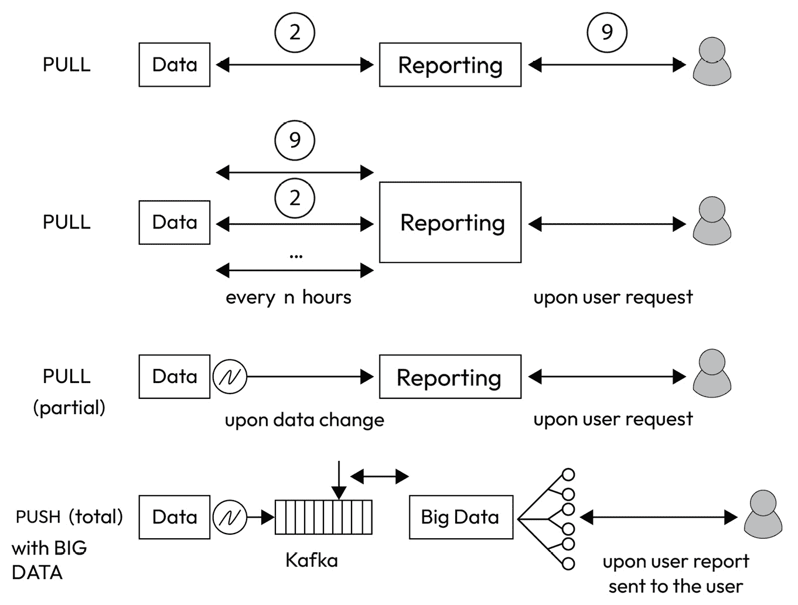

图 10.1 – 报告模式

为了详尽地说明这些额外的阅读责任，索引是另一个用于加速数据（以及一些简单的聚合）读取的功能。它并不像大数据和先前的报告方法那样深入数据转换，但它已经可以准备一些聚合（如总和、局部连接等）并通过简单的协议作为原始数据提供。SOLR 或 Elasticsearch 等索引引擎通常用于在数据检索速度上伴随数据参照。在这种情况下，数据参照本身专注于数据一致性和验证规则，然后处理索引系统中的参考数据，以便在快速读取操作中使其可用。

## 删除数据的复杂艺术

如果存储的是 delta 而不是状态，那么在资源上的 `POST`、`PUT` 和 `PATCH` 操作之间并没有太大的区别，因为它们都转化为实体状态的改变，资源创建的特殊情况是从完全空的状态的改变。但是，就 `DELETE` 操作而言，我们处于不同的情境。确实，我们可以盲目地应用相同的原理，并认为 `DELETE` 移除了实体的所有属性并将其恢复到初始状态，但这并不完全准确，因为实体仍然保留了一个标识符（否则将无法删除它）。这意味着它并不处于不存在时的状态，而且无法回到这种情况。

处理这种情况的最佳方式通常是使用日期的一个特定属性来表示它已不再活跃。当使用 `status` 属性来保持实体生命周期中计算出的位置时，此属性可以使用如 `archived` 这样的值来实现类似操作。这就是数据参照能够存储数据已被删除的事实，而实际上并未删除数据（这与之前关于数据参照及其对历史持久性的责任的说法不符）。当然，这会在参照中增加一些复杂性，因为它必须在每个允许的操作中考虑这一点。例如，读取某些不活跃的数据应该表现得就像数据不存在一样（在 API 访问的情况下，结果是 `404`），除非在特殊情况中，访问参照的用户具有 `archive` 角色，可以读取已删除的数据。随后自然会提出其他问题，例如重新激活数据并继续其生命周期的可能性（提示：这通常是一个坏主意，因为许多业务规则并未考虑到这种非常特殊的情况）。

但让我们在这里停止这种离题，回到数据保留的最初想法，即使在发出删除命令之后。这一功能背后的主要原因是监管性的，例如可追溯性，但也禁止出于其他目的（如网络攻击后的取证）删除数据。一个有趣的事实是，一些法规还规定了数据确实应该被删除（而不是仅仅被停用）的确切时间。例如，欧洲的 GDPR 规定，个人数据不应保留超过某些法律定义的期限，具体取决于它们所关联的过程。在为营销目的收集的个人数据（当然，是在用户同意的情况下）的情况下，延迟通常是 1 年。在此之后，如果没有更新存储同意，则应从收集这些数据的信息系统中删除数据。这意味着实际上在所有可能的地方（包括备份）删除数据。

## 与专用链接的关系

总是如此，魔鬼藏在细节中，处理数据时链接可能会成为一个问题。想象一下，我们使用一个链接在书籍和`作者`实体之间。这种 RFC 链接的最简单表达如下：

```cs
{
    „isbn13": „978-2409002205",
    „title": [
        {
            „lang": „fr-FR",
            «value»: «Open Data - Consommation, traitement, analyse et visualisation de la donnée publique»
        }
    ],
    "additionalIdentifiers": [
        {
            "key": "urn:com:demoeditor:accounting",
            "value": "BK4648"
        }
    ],
    "links": [
        {
            "rel": "self",
            "href": "https://demoeditor.com/library/books/978-2409002205"
        },
        {
            "rel": "author",
            "href": "https://demoeditor.com/authors/202312-007",
            "title": "JP Gouigoux"
        }
    ]
}
```

链接通常是从专用链接继承而来的——在我们的案例中，是一个包含其模式中额外重要信息的专用作者链接，例如，为了可读性目的，仅提取已更改的 JSON 部分：

```cs
{
    "rel": "author",
    "href": "https://demoeditor.com/authors/202312-007",
    "title": "JP Gouigoux",
    "authorMainContactPhone": "+33 787 787 787"
}
```

当你知道链接中包含的信息是经常在操作链接时使用的信息时，在链接中包含额外的信息是有用的，因为它避免了额外的往返到其他 API 以查找此信息的额外步骤。当然，应该有一个适当的平衡，在这里包含电话号码是可疑的，因为它可以被认为是易变数据，不会经常改变，但在编辑数据库的大量作者中的某些特定场合会改变。结果是，所有链接都应该（在这种情况下）更新，这需要相当大的工作量。当你知道这是一些不会改变的数据（例如，作者的名字不会经常改变）或出于监管原因不应更改的数据（例如，批准的版本不应修改，即使有进一步的版本出现）时，就没有这样的问题。

在处理链接时应注意的第一个问题是。第二个问题更为微妙：由于`title`属性（这不是通过继承添加的扩展属性，而是存在于标准 RFC 链接定义中）已被用来存储作者的通用名称，正如 RFC 中该属性的定义所预期的那样，删除一个作者将导致他们的名字仍然通过这些链接存在于书籍的数据参照中。这可能对存档原因很有趣（即使我们不再处理这位作者，例如，即使他们已经去世，书籍仍然以他们的名字命名）。然而，在某些其他监管环境中，这可能是一个棘手的问题：如果我们回到欧洲 GDPR“被遗忘权”的例子，这意味着当作者从数据库中删除时，我们还应该检查他们所写的所有书籍，并将`title`内容替换为类似`N/A (GDPR)`的东西。这就是在特定功能情况下`DELETE`操作可以如何工作！

## 所称的次要功能

尽管我们可能认为我们已经覆盖了数据参照的所有责任，因为我们已经通过了 CRUD 缩略词的四字母，但一个好的应用程序的范围要大得多。为了彻底，我们应该讨论所有通常被称为“次要”的功能，尽管它们是关键的，而且在某些情况下，与数据本身的持久性一样重要。

这些附加功能中的第一个是**安全性**。关于这一点的重要性不应再有疑问，但如果需要说服任何人，让我们强调这样一个事实：在安全分类中常用的四个标准都是关于数据的：

+   **可用性**：数据应可供授权人员使用，这意味着必须处理服务拒绝（以及其他情况）。尽管不可用数据是防止泄露或未经授权访问的好方法，但它仍然是首要标准，因为整个想法是以稳固的方式提供服务。可用性还意味着简单的失误不应该导致整个系统离线。

+   **诚信**：数据不应被任何人篡改，其正确性应得到保证——结果是，所有支撑服务的功能都必须得到保护（数据库、网络、源代码等）。

+   **机密性**：这是第一个标准的对应项，因为应禁止非授权请求者访问。它是授权管理系统的基础（关于这一点将在下一章中详细介绍）。

+   **可追溯性**：这个标准是一个较新的标准，但随着对 IT 系统监管的加强，它变得越来越重要；它规定数据的修改和使用应该存储在一个无法篡改的日志中，以便能够回溯过去发生的事情。在攻击发生后，可追溯性最为重要，可以用来了解漏洞在哪里以及攻击者做了什么。

**性能**和**健壮性**也是所谓的次要特性，在 MDM 中具有很高的重要性。它们与第一个标准（可用性）密切相关。确实，软件的健壮性是其能够以极大的信心及时回答请求的能力的基础，而性能是与数据的可用性相关联的质量。毕竟，如果某人在 5 分钟后收到了对数据请求的响应，他们不会认为该服务是可用的，尽管数据确实在某一点到达了……。数据的快速可用性往往推动了将现有的“手动”信息系统迁移到面向软件的方法。

处理这些特性是许多书籍的主题，所以我们现在就留在这里，因为这些确实是期望数据参照承担的责任。

## 元数据和特殊类型的数据

最后，数据参照不仅应该处理数据，还应该处理元数据。元数据是围绕数据实体本身的所有信息，有助于对这些实体的良好理解。这为数据提供了一些额外的丰富性，但请注意，元数据应该与数据本身有不同的生命周期。例如，存储关于数据历史的信息不是元数据，尽管它可以符合前面给出的元数据定义。正如现在多次被揭露的那样，数据参照跟踪其托管实体的每一个变化。因此，关于谁在何时更改了什么的信息是数据，而不是完整和正确数据参照的元数据。同样，更改日期、修改指标或读取频率可以直接从数据参照的操作序列中推导出来，因此它们也不是元数据。

元数据的一个好例子是与数值数据相关的单位。在实体的命名属性中有一个数字通常是不够的。当然，属性可以有一个描述其内容以及单位的名称（例如`populationInMillions`、`lengthInMillimeters`或`nbDaysBackupRotation`），但这并不使操作值变得更容易，而且，此外，这会使名称更长，当单位听起来很明显时可能会有些繁琐。在引用模式的某个地方有元数据声明说，*这个*实体的*这个*属性使用*这个*单位，这是一种更好的方式来传达数据的处理方式，并且还可以帮助在某些现代数据库引擎中直接计算不同单位尺度上的属性之间的公式，甚至当公式在单位定义方面不安全时提供一些警告，例如将米和秒相加。这些新服务器通常使用一个标准的单位定义，包括之前看到的`kN`单位与 M1K1S-2 相关联，但乘以 10³，名称为`kiloNewton`。

地理属性是数据库中通常数据添加元数据的另一个好例子。一般来说，经度和纬度在`lon`和`lat`属性中以双精度数字表示，但这并没有考虑到世界地图投影（这可能会在数字上产生一些差异）并且不会阻止像将两个数字相加这样的愚蠢计算。随着数据库或地理服务器能够理解添加到坐标数据中的元数据，现在可以计算距离，将坐标从一个投影系统转换到另一个投影系统，等等。

元数据是长久以来被遗忘的数据的表亲。除了 CMIS，即电子文档管理系统标准，其中它们享有第一公民权（支持在模式中实现的元数据组，这些模式可以应用于文档，在搜索时使用，有时甚至可以独立于支持的文档进行版本控制）之外，没有多少标准将它们正式化。这一演变完全取决于对以专业和整洁的方式完成工作感兴趣的工程师。只要在软件编程和信息系统的结构化中使用“快速且脏”的技巧，元数据将继续被忽视。当人们——希望是在阅读这本书以及一些其他在相同质量和长期方法上提供建议的书之后——决定耦合的负担太高，他们必须通过现代化他们的信息系统来解决这个问题时，元数据的使用应该自然增加，使其及时成为像其他任何实践一样标准和常见。

现在我们已经知道了数据引用应该如何定义，我们将深入探讨这是如何由软件系统提供的。

# 不同类型的数据引用应用

在本节中，我们不会讨论技术方面（这是下一节，即*一些架构选择*的作用），而是关于如何构建数据持久性的架构策略。

在上一章中，我们引入了“花朵”的隐喻来展示数据如何在实体内部组织。我们将遵循这个想法来表示如何在管理此类实体实例的数据参照中实现持久性。在我们深入主要架构之前，请记住，选择的主要标准始终应该是功能性的，在数据的情况下，这意味着您系统中的生命周期将主要驱使您做出这个或那个架构选择。同时，请记住，数据管理的*人员*方面与*技术*方面一样重要；治理、指定负责人员以及关于哪个团队拥有哪些数据的好沟通对于您组织正确使用数据是至关重要的。

## 集中式架构

集中式（或“唯一”）参照是其中最简单的一种（如图 *图 10.2* 所示），是每个人首先想到的，并且当它能够应用时，在信息系统中解决了许多问题：它包括为给定类型的实体（当然包括历史、元数据等）的每一比特数据拥有一个单一的存储机制。这样，系统中所有工作的服务都知道，当需要读取或写入某些内容时，他们必须将请求地址到一个单一的资源库服务，因为整个“花朵”都在一个众所周知的地方。

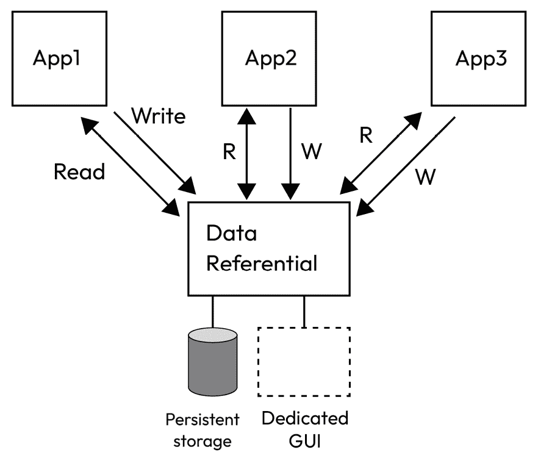

图 10.2 – 集中式数据参照架构

这种方法的优点是它简化了信息系统中每个人的工作。当然，这构成了一个**单点故障**（SPOF），如果实施应用程序出现故障，所有需要此参照信息的应用程序都将受到影响。但这只是一个技术问题，有众多经过实战检验的解决方案，例如数据库的主动/主动同步、应用服务器的扩展、硬件的冗余等。到目前为止，你也应该已经相信，功能方面始终比技术方面更重要。作为技术人员，我们倾向于关注低发生频率的问题，如硬件故障或锁定事务，而如今信息系统中的巨大问题则是数据的重复、输入的清洁度差以及其他需要紧急解决的问题。SPOF 可能在人员组织方面更为重要：集中式数据参照可能意味着一个团队甚至一个人负责管理这一组数据，过多的集中化总是可能带来一些缺点（如未考虑反馈、变化的相对不透明等）。

## 克隆架构

解决这种 SPOF 限制的一种方法是在本地复制一些重要应用程序所需的数据。在这种情况下，一些应用程序将在它们自己的持久化系统中保留“部分花”，并且它们有权选择如何管理数据的新鲜度与中央参照之间的比较，而中央参照仍然是全球唯一的真实版本。

当数据最初散布在信息系统周围时，通过遵守集中式业务规则同时保持数据存储的原样，这可以成为清理数据的第一步。其优势在于，对于遗留应用程序，没有任何变化：它们仍然在本地消耗数据，因此所有读取功能都像以前一样工作。经过一些努力，写入命令甚至可以保留在软件中——例如，通过使用数据库触发器来实现数据返回到唯一参照。然而，大多数情况下，尤其是如果应用程序是可组合的并且具有创建实体的唯一图形界面，将参照性 GUI 插入到该应用程序中而不是遗留形式会更简单。

这种方法的主要困难在于一致性：由于系统中存在多个数据副本，可能会出现差异，因此尽可能减少它们的时间和影响是很重要的。如果应用程序在功能隔间中很好地分离，这可能会变得非常简单，但如果应用程序分解的方式不佳，那么可能需要实现分布式事务，这可能会相当复杂。在这种情况下，最终一致性将是你的朋友，但它可能并不适用于所有地方。

克隆架构最有效形式如下，其中数据克隆（仅部分花朵，因为通常只有部分花瓣是有用的）基于数据参照中的事件，并且数据修改 GUI 已被来自集中式数据管理应用程序的 GUI 替换：

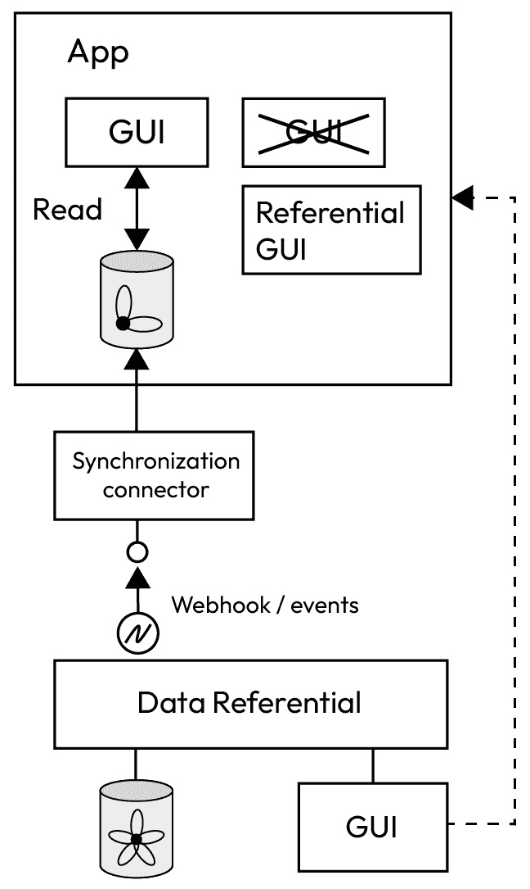

图 10.3 – 克隆数据参照，最有效形式

在这种形式中，有一个选项是为所有数据添加同步机制，在夜间补偿白天由于网络微故障或此类低频但仍存在的意外事件而可能被跳过的数据更改消息，如果不想为这个简单的流使用完整的 **消息导向中间件**（**MOM**）。

当同步连接器使用异步、通常是基于时间的机制来保持克隆数据库与参照信息相似时，这是一种对第一种形式的替代方案。在这种情况下，最佳做法是调用数据参照 API，因为它们提供最佳的信息质量：

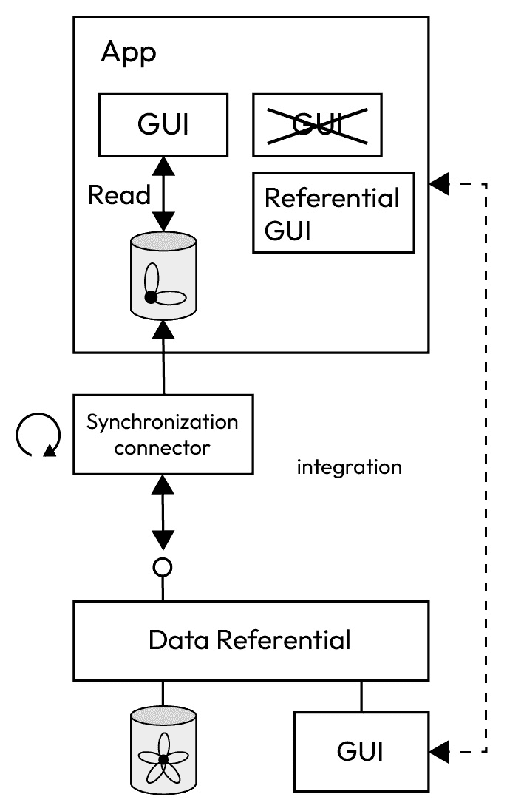

图 10.4 – 克隆数据参照，使用异步替代方案

一种常见的替代方案（但我真的不推荐）是让 ETL 执行同步，如图 *图 10*.5* 所示。这在那些投入大量资金用于 ETL 以保持数据与系统同步并使用此工具做一切事情的公司中很常见。当存在 API（每个好的数据参照都应该有一个）时，最好不要直接将我们与数据耦合。遗憾的是，许多公司仍然有这种类型的流，开始自己的“意大利面”信息系统，所有责任和数据流都纠缠在一起，定义不明确（有关更多解释，请参阅 *第一章*）。

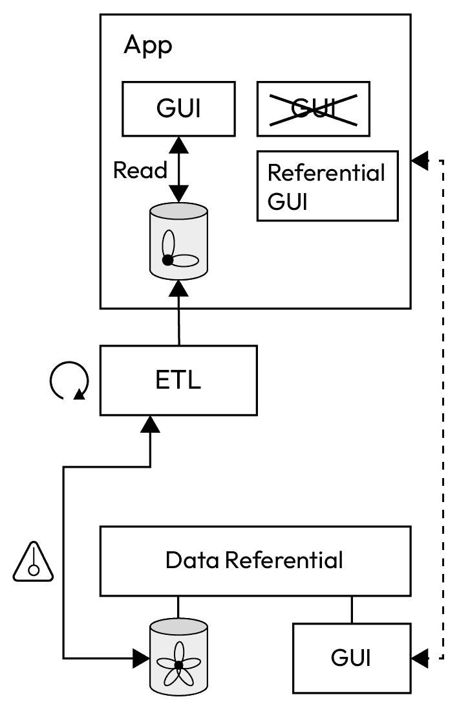

图 10.5 – 克隆数据参照，使用 ETL（不推荐）

如前所述，某些实现无法更改，必须依赖其遗留 GUI。在这种情况下，唯一可能的方法是依赖于数据库上的特定触发器来获取创建和修改命令，并将它们作为请求发送到 MDM 应用程序：

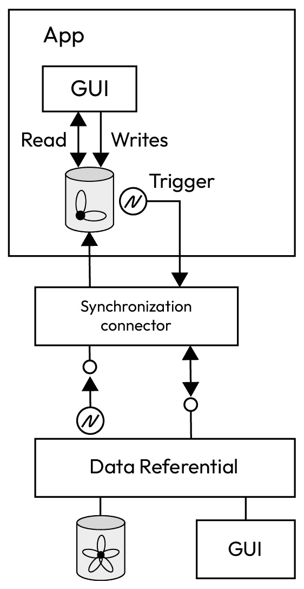

图 10.6 – 克隆数据参照，保留原有 GUI

这种方法中的困难在于，当数据引用由于某些业务规则而发生变化时，因为这种变化无法发送回 GUI。确实，大多数应用在将更改提交给服务器后，会保持数据的状态。即使是那些很少会监听其后台办公室返回数据的罕见应用，困难在于，在这次读取之前，完整的往返过程不会完成，而“更新”的数据将只是本地数据库中的最新数据，而不是随后从 webhook 回调返回的最新数据。当陷入这种困境时，最好向用户解释这是在达到集中引用架构之前的一种暂时情况，他们可以在稍后刷新他们的 GUI 以看到更改的效果。更好的是，学习如何使用新的集中引用，这始终会提供最新信息，代价是使用两个图形界面而不是一个（当这些是可以在两个浏览器标签中打开的 Web 应用时，这并不是一个很高的代价）。

重要注意事项

在*第八章*中，我们简要地讨论了企业集成模式。它们是我们之前讨论的理想砖块，用于构建同步连接器，尤其是在信息系统重组/数据引用结构化项目期间实施**消息导向的中介**（**MOM**）解决方案时。

## 集成和分布式架构

这种引用类型包括从一个中心视角（通常是 API）暴露数据，这些数据实际上被放置到信息系统的不同部分。通常，花朵的核心和一些花瓣位于专门用于持久化的数据引用中。但对于其他花瓣，持久化可以留在与之关联的商业应用中，因为认为它们对这些花瓣的内容了解得更深入。在这种最协作的形式中，引用暴露了信息系统中每个角色的全部数据，并共享花瓣的所有权：

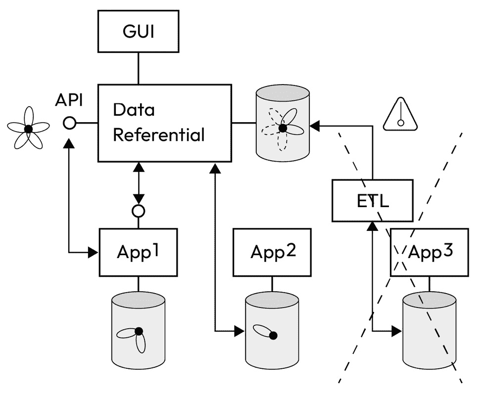

图 10.7 – 集成引用架构

数据引用可以通过其 API 生成并暴露整个数据花朵，但这意味着它必须从它不拥有的业务应用中消费不同的花瓣（基于新鲜度、变化率和性能，保留这些花瓣的本地缓存是实施选择之一，但这并不改变数据的所有权）。为了以新鲜内容暴露整个花朵，数据引用需要访问自己的数据库，以及业务应用数据（或者，再次强调，它可能保留的本地缓存）。

此外，一些应用程序，如 *图 10.7* 中的 `App2`，可能除了它们拥有的花瓣之外不需要任何东西（请注意，当然，根据定义，每个人都拥有花朵的核心）。一些应用程序，如 `App1`，可能需要一些额外的花瓣，在这种情况下，它们必须调用数据引用 API 来获取这些数据。

在 *图 10.7* 中，又做出了一项区别，以表明数据引用可能使用业务应用 API 来获取数据（最佳情况）或者可能求助于直接访问业务应用的数据库，这会导致更多的耦合，但有时这是唯一可行的方式。右侧显示的替代方案是危险的，不应应用：在这种情况下，`App3` 没有被提及，但这不是主要问题。真正的问题是使用 ETL 向引用数据库提供数据永远不应该做，因为这绕过了数据引用中的业务和验证规则。没有任何应用程序应该直接接触引用数据库，而只能是引用应用程序本身。实际上，这条规则非常重要，当在本地部署时，隐藏、混淆、拒绝访问或使用任何其他可能的方式防止任何人直接访问引用数据库是一种良好的实践。当这是一个“正常”数据库时，其耦合和其它不良后果已经足够糟糕；在如此重要的数据库上这样做是问题的根源。

当数据引用公开了一个实体上所有可能的数据（完整的“花朵”）时，该架构也被称为“统一”。在某些情况下，某些数据可能只对拥有它的应用程序有用，而对其他人没有任何用处。在这种情况下，“统一”这个术语并不合适，因为某些数据——自愿地——不可用，并且引用应该被视为“分布式”的。这种情况可以简化如下：

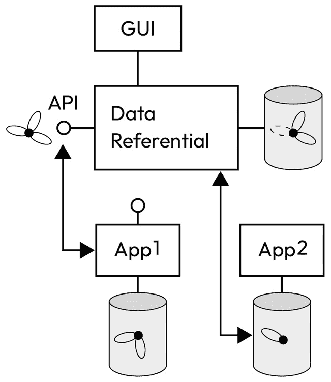

图 10.8 – 分布式引用架构

分布式引用架构的主要困难在于保持性能。当然，可以进行优化，例如我们提到的缓存机制或者在没有使用缓存时对不同的业务应用的调用并行化，但所有这些技术补充都伴随着一个不应被低估的成本，尤其是当我们知道这种情况是暂时的，目标是集中式架构时。常常发生的情况是，“暂时”的情况，本应更便宜，作为通向下一个架构的垫脚石，实际上却与直接实施目标架构的成本相当。大多数时候，决策来自对目标愿景的困难有很好的了解，但对中间步骤的困难则考虑不足，主要是因为这些不稳定的情况数量众多，因此不如最终架构那样得到良好的记录。

让我通过谈论数据的分页来给你一个例子，说明设置中间分布式系统可能有多困难。当使用 `$top=10` 查询属性调用数据引用 API 时，如果引用是分布式的并且从两个业务应用中整合数据，它将不得不向应用发出两个请求，但关键问题是，根据 `$order` 属性请求的数据的顺序，可能来自一个源的数据为零而来自另一个源的数据为 10 条，或者相反，或者介于这两种极端之间的任何情况。这意味着负责合并数据的网关将不得不从一个应用中取出 10 行数据，从另一个应用中取出 10 行数据，然后对这 20 行数据重新应用排序算法，最后将前 10 行发送给请求客户端，并丢弃随后的 10 行。

不要认为使用本地缓存会更简单，因为你除了要实现刚才提到的排序算法外，还必须在上面实现查询机制。想象一下，如果这需要更多应用程序来完成！有 5 个业务应用程序，你已经缓存了 50 行数据，实际上只使用了 10 行，这造成了 80%的资源浪费。你可能想到预先查询应用程序，以了解哪些会提供过滤值中的数据，但这意味着你已经开始查询一个应用程序，然后调整计数查询到其他应用程序，也许是为了实现优化不会减少查询次数，而只会减少检索的行数。选择一个枢纽应用程序本身就可能很困难，因为结果可能很微弱，因为我们无论如何都在处理减少的数据集（这是分页请求的目标）。等等！我们还没有谈到最糟糕的部分：当分页到第 10 页数据时（如果我们保持在每页 10 行的情况下，在 90 到 100 之间），你将无法简单地从每个 5 个应用程序中调用 10 行，因为可能有一个应用程序会占据从分页开始以来几乎所有的行，而其他一些应用程序在同一范围内将提供没有任何数据。这意味着你可能会在调用第 10 页时，第一个结果只来自一个应用程序！你现在看到了，不是吗？是的，我们将不得不查询 5 个应用程序以提取对应于聚合数据 90 到 100 范围的 10 行，这意味着 98%的巨大浪费……而且，这个悲伤的蛋糕上的樱桃是，如果一个应用程序不支持动态范围，你可能需要多次查询它，以组成所需数据的完整范围。当然，在某些实现中，可能可以保持数据库查询的游标状态，但这意味着你的应用程序现在是状态化的，这将导致一些其他技术限制，例如可扩展性。好吧，唯一能救我们的是，通常，用户会在第二页或第三页数据处停止，细化他们的`$filter`属性以获得更快的结果。

一致性问题也存在，但只要数据的切割遵循功能逻辑顺序，它们就更容易处理。这通常是这种情况，因为数据分布是在业务应用程序中完成的，所以他们有重复数据的风险（当然，除了花蕊，花蕊总是共享的）通常非常低。

## 其他类型的参照架构

“虚拟”数据参照是“分布式”参照的一个特例，其中中心部分本身不持有数据，因此没有持久性，依赖于周围的业务应用程序数据库。示意图如下：

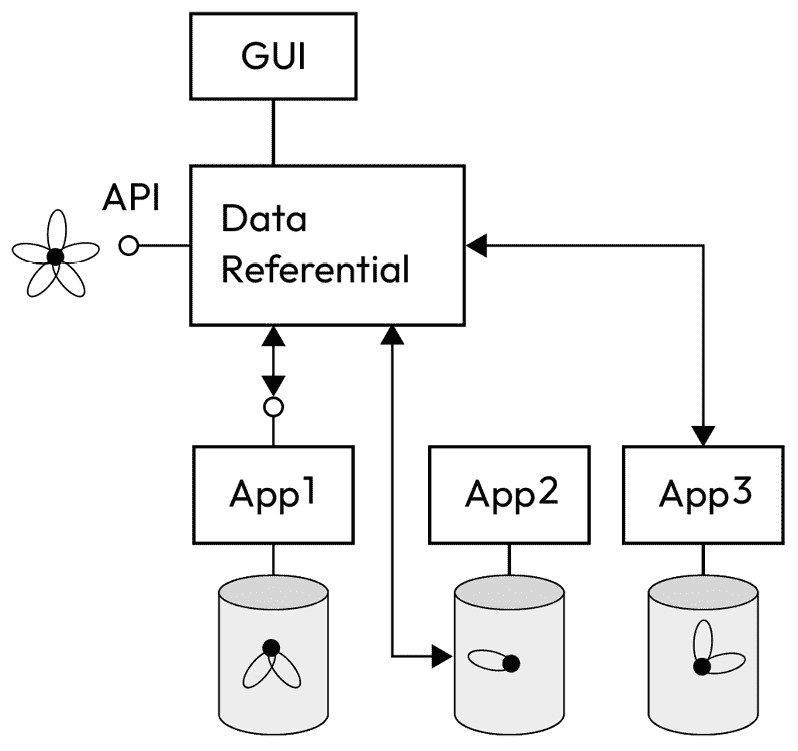

图 10.9 – 虚拟参照架构

其他，更为罕见的参照架构也存在，但在这里展示它们似乎并不真正有用。对于那些好奇的人，法国政府发布的文件名为*Cadre Commun d’Architecture des Référentiels*（参照架构的共同框架，可在互联网和法语中免费获取）不应成为限制，因为不同的可能性主要是通过图表展示的。

现在已经展示了架构模式，我们可以谈论实现本身，包括在创建数据参照时应该做出哪些技术选择以及如何做出选择。

# 一些架构选择

其中之一当然是数据库。顺便说一句，我甚至应该说持久化机制，因为数据库是一个非常著名的持久化机制，但还有其他，我们将在本节末尾看到。还有一些其他技术考虑因素需要处理——特别是关于数据流。

本节也将是一个机会，对 IT 中的教条进行一番抱怨，以及它们如何延迟了信息系统工业化的长期期待。许多技术选择仍然基于可用团队的知识，而不是当前功能问题的适宜性。这并不是说不应考虑能力，但有时应强迫那些几十年来没有改变思维方式的技术人员接受培训，因为他们可能因为简单地应用了错误工具到问题上而阻碍了信息系统的发展。你可能听说过谚语“如果你只有锤子，所有问题看起来都像钉子。”如果你团队中有这样的人，管理者的工作就是通过培训打开他们的眼界，无论是内部、外部、正式还是非正式的。

## 表格式与 NoSQL

在实施数据参照时，必须做出的第一个决定之一是选择哪种数据库范式。应该是表格式的还是面向文档的？SQL 还是 NoSQL？考虑到 99%的商业实体自然形状是具有许多层级的文档结构，如属性树和具有不同深度的数组，如果你想要达到业务/IT 的协调一致，那么显然的选择应该是一个适应你数据形状的 NoSQL 数据库：如果你管理的是业务实体，那么是文档型 NoSQL；如果你操作的是通过许多类型关系与其他实体相连的数据实体，导致一个可以通过许多路径遍历的实体网络，那么是图型 NoSQL，等等。

如果真正实现了业务/IT 对齐，并寻找一个与他们的数据形状紧密匹配的持久化机制，那么对于自然表格形式的业务实体，应该使用 SQL 表格数据库……但这几乎从未发生过！当然，有一些情况，就像在 NoSQL 领域中的一些键值对列表一样，但它们非常罕见。实际上，看起来 SQL 仍然被大量用于数据引用的主要原因仅仅是历史。当处理遗留软件时，这是一个合理的理由……毕竟，如果它以这种方式工作了多年，你最好不去碰它。但真正的问题是，在信息系统现代化项目期间设计的新数据引用也使用了非高效的方法。

我为什么说*低效*？为了解释这一点，需要回顾计算机科学和数据库的历史……在数据存储的早期，当使用随机访问控制器与旋转磁盘一起使用时，数据并没有在磁盘中随机化，而是放置在一系列的块中（最好放在硬盘的最外圈，因为线性速度更高，提供更快的读取）。为了快速访问正确的块，数据库引擎会强制数据行的尺寸，以便快速跳转到下一个，提前知道每行数据的总长度。顺便说一句，这也是为什么数据库中的旧类型字符串需要固定长度。这也是为什么数据必须以表格块的形式存储，结构化数据分解成许多表，其中行通过键相互关联，因为这是计算下一个块索引的唯一方法。

这些假设虽然代价高昂：由于数据是表格形式的，存储实体属性的多个值唯一的方法是在数据库中创建另一个表并将两行数据连接起来。其结果是，需要复杂的机制来处理全局一致性，例如事务。反过来，事务使得必须创建悲观锁和乐观锁的概念，然后管理事务的隔离级别（因为唯一的完全**ACID**事务，即可序列化事务，对性能有显著影响），然后是死锁管理以及许多其他复杂的事情。

当你思考并意识到硬盘控制器已经提供了数十年的随机访问（而且旋转磁盘的概念在 SSD 中根本不存在），很难理解为什么这种后果在今天仍然如此普遍。其中一个原因是变更管理，因为没有人喜欢改变。但如果有工作需要适应和接受变化，那肯定应该是开发者。我也能理解为什么 SQL 仍然在人们只把它当作持久化技术的研讨会中使用。最好是用整个团队都熟悉的工具开始一项重要工作，我不会建议从没有人知道的复杂技术开始。但在这种特定情况下，不使用 NoSQL 作为业务实体数据引用，会有两个问题：

+   首先，这是一个培训问题，因为这些技术已经存在十多年了，经验回报已经确立，有可信赖的操作员。

+   其次，实际上很少有技术像文档型 NoSQL 那样容易。以 MongoDB 为例——将一个完整的 JSON 实体写入兼容 MongoDB 的数据库就像以下这样简单（C#示例）：

    ```cs
    MongoDBConnection conn = new MongoDBConnection(ConnectionString);
    conn.Insert("Actors", "{ 'lastName': 'Gouigoux', 'firstName': 'Jean-Philippe', 'addresses': [ { 'city': 'Vannes', 'zipCode': '56000' } ] }");
    ```

    与基于 SQL 的表格型**关系型数据库管理系统（RDBMS**）（简称**关系数据库管理系统**）相对应的是以下内容：

    ```cs
    SQLConnection conn = new SQLConnection(ConnectionString);
    SQLTransaction transac = new SQLTransaction(conn);
    try {
        transac.Begin();
        SQLCommand comm = new SQLCommand(conn, "INSERT INTO ACTORS (lastName, firstName) VALUES (@lastName, @firstName)");
        Comm.Parameters.Add(new SQLParameter("@lastName", "Gouigoux"));
        Comm.Parameters.Add(new SQLParameter("@firstName", "Jean-Philippe"));
        string idActor = Comm.ExecuteGetId();
        comm = new SQLCommand(conn, "INSERT INTO ADRESSES (id, city, zipcode) VALUES (@id, @city, @zipcode)");
        Comm.Parameters.Add(new SQLParameter("@id", idActor);
        Comm.Parameters.Add(new SQLParameter("@city", "Vannes"));
        Comm.Parameters.Add(new SQLParameter("@zipcode", "56000"));
        Comm.Execute();
        transac.Commit();
    } catch (Exception ex) {
        transac.Rollback();
        throw new ApplicationException("Transaction was cancelled", ex);
    }
    ```

    我甚至没有提到创建表和列的**数据定义语言（DDL**）命令，这将增加很多行。MongoDB 不需要这些，因为它是无模式的，并且随着对象的添加，集合会创建为对象。

再次，有些情况下需要 SQL。报告工具非常多，使用这种语法，公开 SQL 端点以访问数据是一种好习惯，因为它简化了数据的消费。大数据工具甚至 NoSQL 数据库都有 SQL 端点。这是有价值的，因为有很多人在使用这种方式查询数据并计算复杂聚合方面很在行。然而，仅仅为了能够使用众所周知的查询语言而选择表格数据库来存储结构化数据是一个问题，因为它将导致很多不必要的复杂性。在你下一个数据引用中，请考虑使用 NoSQL，因为它会为你节省很多时间。如果你知道这类项目将是你下一个项目组合中的下一个，请开始为你的团队进行培训。只需要几天时间就能理解所有需要熟练掌握文档型 NoSQL 服务器（如 MongoDB）所需的知识，而且它们非常适合存储业务实体。

## CQRS 和事件溯源

当我们谈论这个问题时，你可能还想要放弃那些由同一过程处理读写操作的老旧数据流架构。毕竟，这两组操作在频率（大多数**业务线应用程序**（**LOB**）有 80%的读取和 20%的写入）、功能（读取不需要锁，写入需要一致性）和性能（独特的写入不太重要，大规模查询非常重要）上都有很大的不同，因此将它们分开似乎是合理的。

这就是**命令和查询责任分离**（**CQRS**）的含义：它将接收更改或创建数据命令的存储系统与准备好回答相同数据查询的系统分开。事件源与这种架构方法密切相关，因为它存储了一系列由写入命令生成的业务事件，并允许查询以高度可扩展的方式使用此存储来获取所需的聚合结果，从而允许在大数据上实现性能。

在某种程度上，CQRS 可以被看作是分布式和克隆方法之间的一种参考架构。它不是根据数据本身的标准来分离应用程序之间的数据，而是根据将要对其执行的操作类型（主要是写入或不同类型的读取）。同时，准备好的读取服务器可以被认为是“单一版本的真实数据”的克隆。由于单一版本的真实数据主要在持久化中，它们的数量可以无限增加，因此性能总是可以调整，无论查询多么复杂，以及数据量有多大。

再次强调，这不是详细讨论这些主题的地方，但它们必须在关于数据参考和 MDM 的章节中被引用，因为它们是实现高容量解决方案无可争议的最佳方法。

## 超越数据库的又一步——存储在内存中

让我们回到关于表格数据库系统起源的讨论，甚至更早一些。我们为什么实际上需要数据库和存储系统？主要是因为硬盘可以存储比 RAM 更多的数据，而且数据库无法适应少量的 RAM。因此，需要一个能够快速将数据写入磁盘（以便在硬件故障的情况下保持数据安全，数据库首先写入日志文件）并擅长从磁盘检索部分数据并将其放回内存以供应用程序使用的系统（这就是 SQL 部分，特别是`SELECT`和`WHERE`关键字的作用）。

当然，当计算机只有 640 千字节 RAM，数据库需要几个兆字节时，这是一个主要问题。但今天呢？当然，有巨大的数据库，但我们通常只有几个吉字节大小的数据库。至于服务器 RAM 呢？嗯，拥有数十吉字节的服务器非常普遍，而且很容易在线获得 192 GB RAM 的服务器。在这种情况下，为什么还需要在磁盘内外操作数据呢？当然，SSD 磁盘是一种内存，但它们仍然比 RAM 慢。此外，确实需要处理硬件故障下的持久性问题。但数据操作本身怎么办？将查询操作到 RAM 中不是会更快吗？

事实上，确实如此，并且存在一种很少使用且鲜为人知的技巧，称为“对象普遍性”，它充当内存数据库。我们不是在谈论存储在 RAM 磁盘或高速 SSD 上的文件，而是在应用的对象模型中直接使用数据。你可能会问，如果发生硬件故障，我们如何确保不丢失任何数据？嗯，正好像数据库一样：通过记录发送到系统的所有命令的基于磁盘的日志。那么区别在于，操作数据和提取、过滤和汇总结果的数据参考模型不是在磁盘上的某些表格上，而需要伴随索引以提高性能，而是在 RAM 中，并且是以二进制格式存在的，这是直接由你的应用程序使用的，这意味着没有什么能更快。通过这样做，SQL 中的请求被你选择的语言中的代码所取代——例如，使用 LINQ 查询的 C#。

实际上，对象普遍性从未达到更广泛的受众，但我所知道的所有使用过它的人都对其高价值深信不疑。就我个人而言，当我需要实现一个体积有限但具有以下要求的数据参考时，我总是选择这项技术：

+   需要高性能

+   非常复杂的查询，这些查询在 SQL 中很难编写

+   一个经常演变的数据模型

我参与过的最好的数据参考实现之一是在一个项目中，该项目计算高级金融模拟并使用遗传算法进行优化；性能提升巨大，能够编写极其复杂的数据操作案例使得整个项目对客户来说是一个明显的胜利，客户在第一次测试中就被模拟的速度所震惊——这个取代了旧平台的新平台只需几秒钟就能给出结果，而旧平台则需要几分钟。

另一个成功的实施例子是在处理低流动数据，如国家代码。在这个特定的例子中，人们对内存方法并不感到满意，尽管数据在磁盘上的日志中是安全的（我们甚至有备份，作为第三组数据以提高可靠性）。因此，用他们可以轻松反馈到数据参照中的某些数据测试这个相当创新的方法，使得第一次尝试这项技术更加舒适。测试进行得很顺利，但客户并没有将其扩展到其他数据。遗憾的是，我不知道更多关于这项技术使用的例子，这有点令人遗憾，因为潜力是巨大的。

尽管这个例子可能不是最好的，因为这项技术并没有取得成功，但信息仍然存在：为了尊重业务/IT 的协同，这是确保长期发展的最佳方式，始终优先考虑与您的业务需求和数据形状紧密匹配的技术。

在本书的最后部分，我们将再次讨论时间以及它如何影响我们对数据参照的处理，在我们的案例中。

# 数据随时间演变的模式

在*第四章*中，我们研究了在信息系统中对时间管理的重要性，以及时间处理对数据的主要影响。在 MDM 系统中处理的数据必须考虑时间因素，我们广泛地讨论了数据历史管理。但 MDM 本身的行为也应该根据时间来执行。

## 数据治理

**数据治理**是围绕数据参照管理建立功能责任的行为。谁负责哪些参照数据？谁可以操作和清理数据？谁决定模型的演变？如何通知受影响的团队和应用关于变更的信息？在操作数据时应该遵循哪些业务规则？数据应该在何时被删除或存档？这些都是治理问题，并且它们始终与时间相关。特别是，这些回应必须定期审查，就像业务流程一样，以便数据保持受控。

数据治理主要在 Cigref 地图的第二层处理，即业务能力地图，通常包含一个专门用于参照数据管理的区域。这就是您应该绘制不同的数据参照，并存储存储的实体的详细定义，以及版本以证明它们之间的兼容性或记录不兼容的变更。在这里，您至少应该找到两个主要数据治理角色的名称和联系方式：

+   **数据所有者**：此人是信息系统内数据质量和可用性的最终责任人。他们定义围绕数据的所有业务规则：数据必须如何操作，谁可以访问它，在什么条件下，等等。

+   **数据管理员**：在数据所有者的委托下，此人是负责数据的日常维护。他们根据数据所有者发布的数据操作规则，清理数据并确保其可用性和完整性，以及遵守授权规则。

数据治理的一个明显后果是，对于特定的数据参照有明确的职责。对于参照的共有责任是一个问题，因为可能会有竞争性的需求，这些需求在实体格式或提供的服务的不受控制的演变中发展。在最坏的情况下，IT 团队不知道该考虑谁作为决策者，并实施两个需求，使得数据参照越来越难以使用，并且不适合其目的。没有责任甚至更糟，因为实施属于 IT 团队，技术人员默认成为数据的所有者，这可能是有史以来最糟糕的举动，因为他们对与数据相关的业务风险了解得最差。当然，他们基本上知道数据是什么（毕竟，我们都在公司里知道客户或产品是什么）但同样，魔鬼在于细节，当 IT 团队负责定义数据时，没有人应该对组织只支持一个地址或产品与商品之间没有区别感到惊讶。这种错误永远不会由该领域的专家犯下，我们都知道一个糟糕的实体定义可以有多具破坏性。因此，由于没有人愿意承担责任，将这样的业务驱动决策留给 IT 团队是一个风险举动，每个人都应该对此保持警惕。

## 逐步实施独特的参照

在展示分布式和合并的数据参照架构时，已经指出，有时，这些走向集中参照（通常，这是最终目标）的中间步骤可能花费与直接进入目标状态一样多的时间，因为隐藏的努力或不太为人所知的缺点。相反，有时直接面对最终愿景是不可能的，而应该通过几个逐步步骤来实现这种收敛。这可能是由于信息系统耦合得太紧密，剧烈的变动可能会破坏它；大多数时候，问题在于人类接受变化的能力，而必须采取逐步的方法，以便组织本身能够调整。

在许多情况下，我作为顾问为那些需要成功管理他们的合并或收购其他公司的公司提供服务时，这种情况就发生了。为了成功管理合并或收购，他们需要将合并计划应用于两个信息系统，将它们合并为一个单一的系统。这类事情在大组织中通常需要数年（我见证的最快的是在不到 18 个月内完成的，但所有标志都是绿色的，这种情况很少发生）。正如您将在以下部分中看到的，这些计划需要许多步骤才能实现。

由于隐私原因，我将展示我为一个公共客户（法国两个地区委员会的融合）和一个由法国西部两个大型实体合并而成的农业合作社设计的两种渐进式转换的混合。他们都需要解决他们的信息系统处理（客户、代理商、潜在客户、农民、学生等）的个人和法律实体的 MDM。为了简化图表，我将考虑起点是两个实体各自都有一个综合数据参照，一些应用程序显示出克隆参照模式。这种情况通常发生在有许多需要参照数据的应用程序时：最重要的是直接连接到最高级的数据参照应用程序，而次要应用程序只是简单地克隆其主导业务应用程序中的内容。在以下方案中，我也大大减少了应用程序的数量，再次，出于简化的原因。我没有绘制它们与其他信息系统软件之间的关系，因为它们大多是具有高度互操作性的 ERP 系统。

### 第 1 步 – 相同的基础设施但没有链接

话虽如此，第一步可以概括如下：

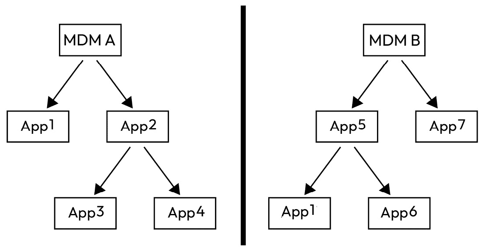

图 10.10 – 两个 MDM 系统的融合 – 第 1 步

这两家公司拥有完全独立的 MDM 系统，因此对于他们的“演员”，如果这是我们应该用来描述这些实体的名称，那么数据参照就是这样的。请注意，大多数应用程序在每个案例中都是不同的，除了`App1`，这是两家公司之间的一个共同 ERP（这并不意味着它们将是兼容的，因为版本可能不同，定制肯定会有，但这可以成为一个很好的候选，以便在某些时候将事物放在共同之处）。当然，第一步是连接两个内部网络，即使接下来将要展示的所有内容完全可以仅通过互联网通信来实现。

### 第 2 步 – 提供一个公共接口

第二步是为新融合实体的所有用户提供一个 API 来读取演员：

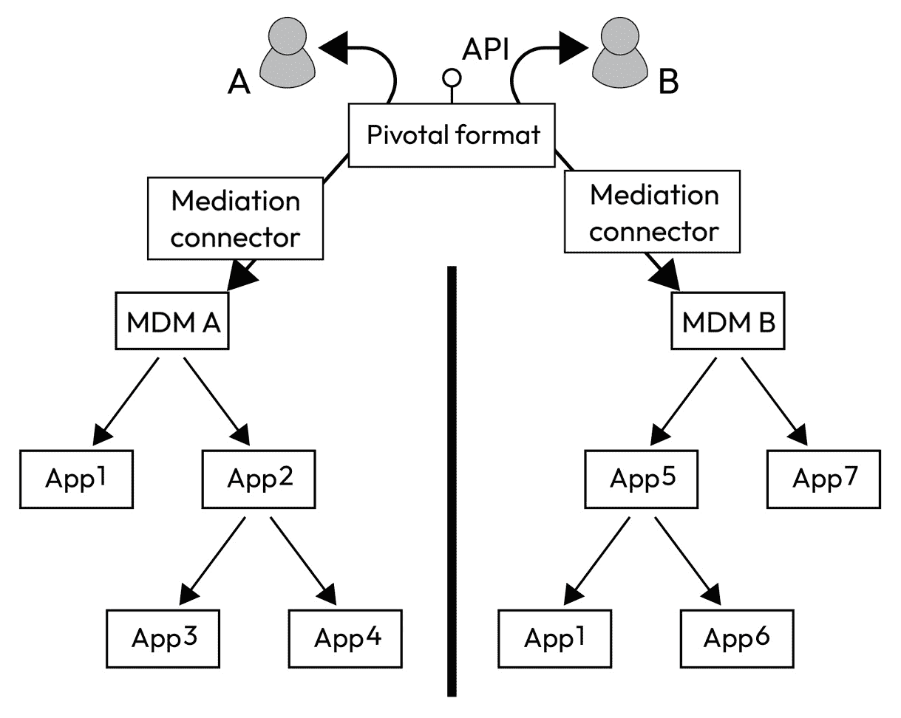

图 10.11 – 两个 MDM 系统的融合 – 第 2 步

注意这个图是如何对称的：选择一个中立的中心格式至关重要，因为使用其中一家公司的专有格式将对另一家公司（它将不得不更改所有连接器和映射代码）造成明显的劣势，这还会引起人为问题，因为在公司合并期间，尤其是当它们之前是竞争对手时，紧张局势总是加剧的。因此，我们花了很多时间为用户制作了一个漂亮的中心格式，使用了来自两边的最佳数据表示。在这一步，不仅读取是唯一可用的操作，而且没有任何一家公司可以读取另一家的数据！你可能会想知道这一步有多有用，因为目标是达到两家公司都有的唯一 MDM 系统，而现在它并没有改变任何事情。事实上，没有功能性效果确实更难，但准备一个共同的中心格式是适当共享数据的基础。此外，它为在融合过程中创建的所有新软件功能以标准化的、融合就绪的方式读取参与者提供了一种方法。这意味着我们不必回到这些新应用，当你知道整个项目中要处理数百个应用时，这是一个非常受欢迎的消息。最后，它开始了中介连接器的工作（同样，这是最好在 Apache Camel 或另一种企业集成模式中实现的事情），这是一项重要的工作，最好在项目早期开始。

### 第 3 步 – 将次要来源的数据与主要来源合并

从现在起，我们将只从公司 A 的角度来表示流之间的差异，但情况总是相反。下一步是开始从信息系统之一获取一些数据并将其传输到另一个系统中。这同样是非常进步的：目前只针对数据的读取操作进行了操作，如图所示，数据首先在发起请求的人的系统上读取，然后仅使用“来自屏障另一侧”的数据来完成。在任何时候，原始侧的数据都会获胜，除非修改日期清楚地表明来自另一个信息系统的数据更新。

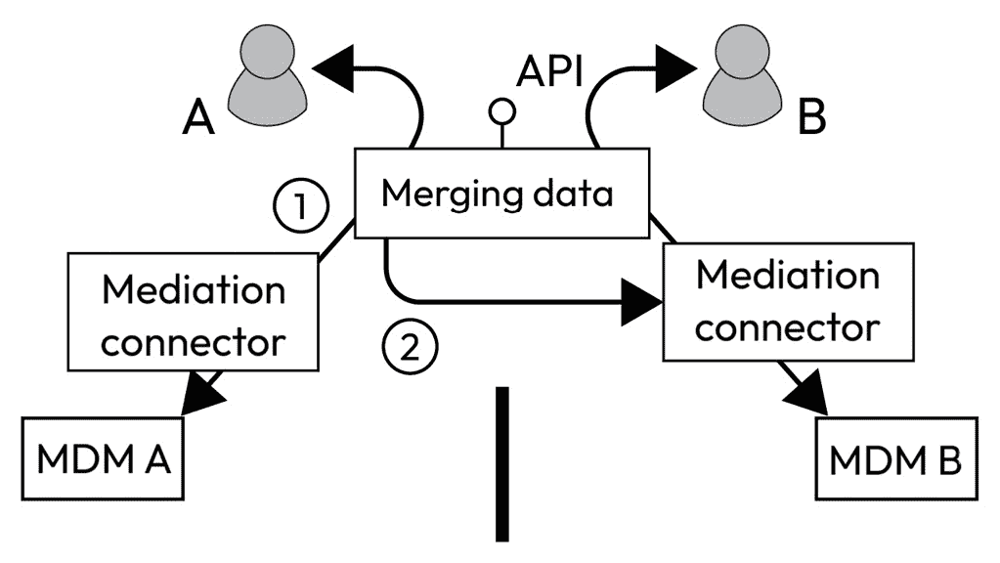

图 10.12 – 两个 MDM 系统的融合 – 第 3 步

为了使前面的步骤工作，有必要找到一种方法来寻找类似的角色，例如，使用他们的增值税号或其他商业标识符。

### 第 4 步 – 存储来自另一来源的标识符

由于这是一个复杂的操作来实现，一旦找到了对应关系，一方的技术标识符被存储在另一方，反之亦然，这将允许下次更快地访问。这是系统第一次在 MDM 系统中写入，但仅限于存储另一方的标识符：

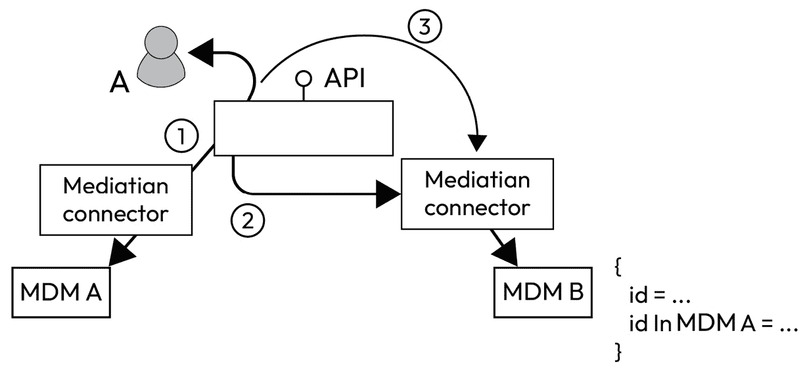

图 10.13 – 两个 MDM 系统的融合 – 第 4 步

然而，这开辟了共享数据的新方法，因为一旦提供了“写入”授权并且知道了“外部”标识符，每一方都能够与另一方共享信息。

### 第 5 步 – 向另一侧发送信息

每当一方上的行为者发生变化时，另一方都会得到通知。接收信息系统能够自由地以自己的节奏处理这些信息，也许第一次什么也不做，但随后选择哪些数据片段是有趣的并将它们存储起来，等等。在这个阶段，保持数据变更的来源是必要的，以避免启动一个信息循环，将数据变更的事件发送回初始信息系统，因为它的初始事件。为了简化，图表再次仅从 A 到 B 表示 – 如下所示：


图 10.14 – 两个 MDM 系统的融合 – 第 5 步

现在，由于初始写入已经开始，信息系统（和人）开始更好地相互信任，下一步就是推广数据的修改。

### 第 6 步 – 集中数据写入并扩展边界

这意味着双方开始使用集中的 API 进行写入，该 API 的实现是在双方推送数据，以便每个信息系统都能了解最新的数据。再次强调，使用数据取决于接收端是否知道行为者（或应该记录它），但在某些情况下，数据被简单地忽略，例如，当这涉及到一个只在另一家公司使用的供应商的变化时。至于潜在客户，数据是共享的，因为商业方法开始在这两个逐渐融合的公司部分之间统一。

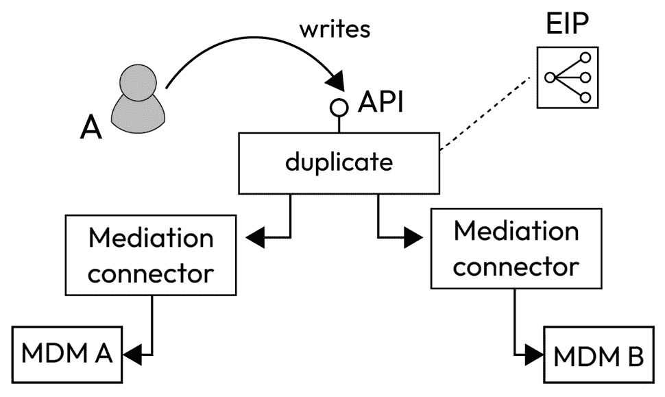

图 10.15 – 两个 MDM 系统的融合 – 第 6 步

在 MOM 实现中使用的企业集成模式是“重复消息”模式，将初始请求推动的数据发送到两个类似的消息中，并通过中介路由，等待两个确认消息返回，以便在其被调用的路由上发出自己的确认，从而有效地创建一个健壮的变更交付，双方都能收到。

### 第 7 步 – 统一访问

这段时间，旧的数据参照系统开始仅作为消息的守门人，检查它们是否与其信息系统的相关部分相关。但是，由于参与者现在主要是共享的，这并不是一个特别重要的功能，因此一些应用程序开始直接将它们的参与者消息注册到顶级数据参照中：

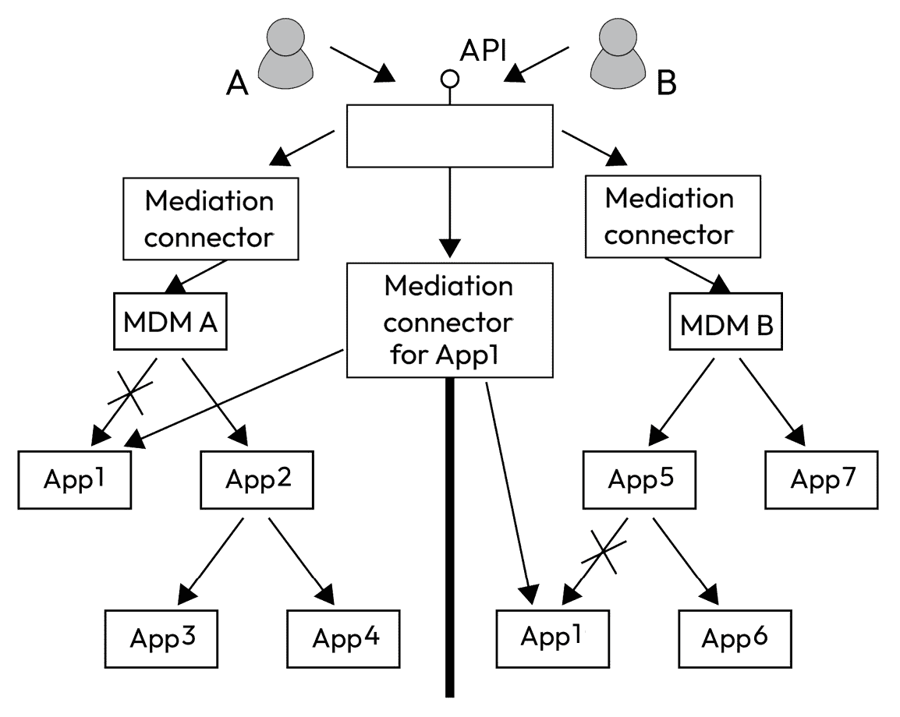

图 10.16 – 两个 MDM 系统的融合 – 第 7 步

`App1`（在双方都使用的 ERP）是开始这种新方法的绝佳候选者，因为连接到它的中介连接器可以直接在两个信息系统之间共享，从而实现首次共同部署，降低“门槛”的高度。由于这种方法工作得相当好，它为其他应用程序的启动提供了动力，并且很快在另一个应用程序上出现了专门的连接器，因为共同的枢纽格式已经演变，比之前的格式更容易，也覆盖了更多的业务案例。

### 第 8 步 – 消除不必要的调用

情况迅速演变成如下所示的方案，因为旧的 MDM 系统基本上已经没有更多的事情要做，因为所有数据都来自新的集中式系统：

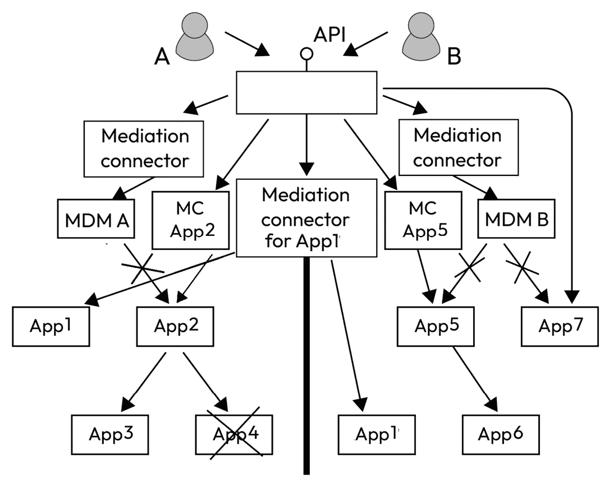

图 10.17 – 两个 MDM 系统的融合 – 第 8 步

此外，一些应用程序，如`App7`，有足够的时间进行演变，能够直接采用一些表示参与者的 JSON，而不需要借助中介连接器。还有一些应用程序开始在两个组织之间共同使用（这一点越来越明显地表明它们正在成为一个单一的组织），`App4`因`App6`的通用使用而消失。

### 第 9 步 – 移除不必要的中间应用程序

一些“低策略”应用程序仍然受业务应用程序（如`App3`）的控制，但这并不是问题，因为它们的父应用程序现在位于主数据参照之下，将为他们处理格式变化。这些应用程序没有看到系统有任何变化，这对用户来说是个好消息，因为用户根本未受到其他重大变化的影响。由此产生的信息系统开始看起来如下：

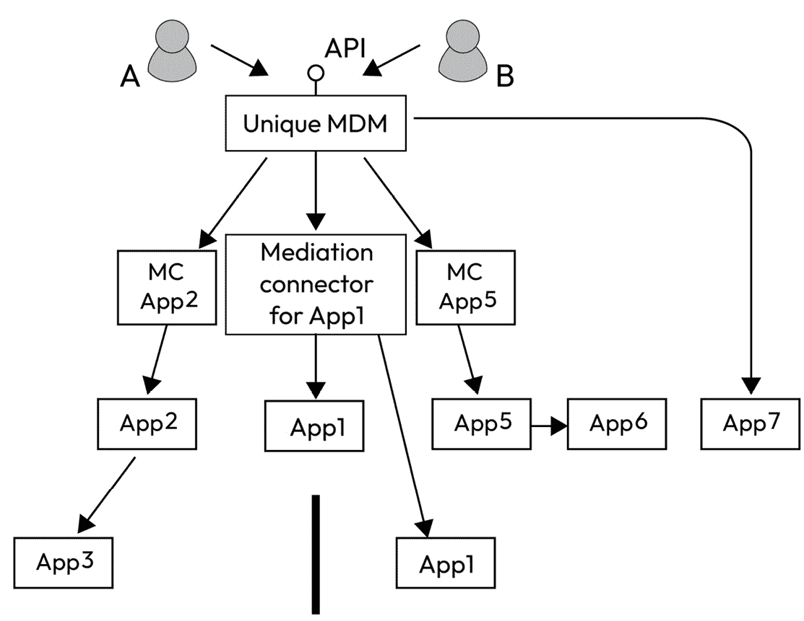

图 10.18 – 两个 MDM 系统的融合 – 第 9 步

由于`App6`被所有团队使用，两个原本分离的公司之间的障碍又降低了一步，达到了一个点，即它不再成为问题，因为它只分割了一些由专门团队在非融合过程中的某些特定情况下使用的次要业务应用程序。现在有一个独特的集中式 MDM 系统，其中一些重要应用程序作为本地参考，供次要应用程序克隆部分数据。这总共花费了许多年，但目标已经达成：合并双方使用的参与者，并以这种方式逐步进行，以至于业务从未受到技术选择的影响。

## 关注教条和无用的复杂性

我希望在这一章（以及本书整体）中已经说服你，对那些使用起来看似明显的技术和实践保持批判性的眼光。就像用于数据参考存储的 SQL 数据库，或基于硬盘的数据操作一样，在开发过程中有许多先入为主的观念，当纯粹从业务/IT 对齐的角度思考时，这些观念并不非常适合问题。

只举一个例子，就是数据验证。在大多数编程语言中，验证器与数据实体的字段或属性相关联，例如在 C#中通过属性。在我看来，这种方法非常错误，在我的实践中已经多次证明这是一个真正的痛点，因为几乎总是可以找到一个特定的情况，这些验证属性是不正确的。在业务标识符的情况下，产品所有者有时会坚持认为没有任何实体应该在没有这种值的情况下创建，然后大约一年后，他们会意识到存在这样一个特定的情况，即标识符尚未知道，我们仍然应该将实体保留在系统中。例如，这可能是一个医疗患者数据库，产品所有者会向你保证，没有社会保障号码的实体在考虑提供药物之前是没有意义的，这是绝对必要的……在坚持为了数据质量原因在这个字段上放置严格的`NOT NULL`验证器之后，同一个人几个月后可能会回来，当数据库处于生产状态且重大影响变更将产生巨大成本时，告诉你他们忘记了新生儿的特定情况，这个新生儿应该接受药物，但他们还没有社会保障号码。

在这个特定的例子中，我个人的习惯是永远不会将任何实体属性描述为强制性的，因为只有其使用的上下文才使其成为强制性的或不强制性的。添加一个阻止`null`值的业务规则或表单行为是如此简单，以至于在实体本身上不放置它根本不是问题。另一方面，当这种强制特性已经在你的信息系统最低层实现时，整理混乱和错误的原因是如此痛苦，以至于在我看来，永远不应该将字段称为“强制性的”（除了一个技术标识符的例外，否则一旦创建就无法唯一检索实体）。

重要提示

当我阅读像[`jonhilton.net/why-use-blazor-edit-forms/`](https://jonhilton.net/why-use-blazor-edit-forms/)这样的文章时，我很喜欢，作者在那里质疑技术中存在“太多的魔法”。实际上，确实如此，这样的批判性眼光是阅读给定技术的最佳方式，而不是众多仅仅解释如何使用函数而不深入探讨何时有用以及何时实际上更多的是危险而不是真正优势的博客文章。这篇文章对表单和数据定义中包含的验证确实有一个很好的观点。

顺便说一句，对于之前提到的标识符，同样适用于基数：如果你没有产品所有者绝对、明确和完全负责的承诺，即一个属性应该具有零或一基数，总是将其作为一个具有*N*基数的数组。最坏的情况会是什么？数组总是只填充一个项目？嗯，这其实并不重要，对吧？开发者会抱怨，在这些场合，他们必须输入`deliveryAddresses[0]`而不是`deliveryAddress`？向他们展示如何在所使用的语言中创建属性，问题就会解决。至于 GUI，我们将在没有对应处理数组中多个值的用例的情况下，简单地显示一条信息。只有当出现这个新的业务案例，我们需要处理多个数据时，我们才会调整 GUI，用列表代替单个文本区域，例如。但这种方法的好处是，这将顺利地进行，因为之前唯一的数据将简单地成为列表中的第一个，更重要的是，所有 API 的客户端都将保持兼容性，不会因为这种新的用途而损坏。他们甚至可以在不使用其他数据的情况下继续只使用列表中的第一个数据，只要他们不想使用其他数据并坚持旧的行为。由于所有客户端和服务器都可以根据自己的步伐在业务变化上前进，我们知道我们有一个低耦合。

这一点也适用于许多其他旨在帮助企业的技术方法，但最终可能会阻碍企业的发展。仅举最后一个例子，大多数关于数据鲁棒性的技术方法实际上与商业概念相悖。例如，出站模式([`microservices.io/patterns/data/transactional-outbox.html`](https://microservices.io/patterns/data/transactional-outbox.html))，只有在最终一致性不是选项时才应使用。但是，当你知道即使是银行也一直使用最终一致性（并且肯定会继续这样做），这大大限制了这些技术的实用性。当然，深入理解业务不如使用最新的技术或模式有趣，这些技术或模式可以将交易错误率降至最低。但从长远来看，这是唯一获胜的方式。

因此，再次强调，因为这是一个如此重要的信息，**首先考虑业务功能，然后找到适应它的技术**。为了做到这一点，最简单的方法是想象在没有计算机参与的情况下，业务参与者之间在现实世界中会发生什么。

# 摘要

在本章中，MDM 的原则已被应用，实施技术已被公开，不仅从架构的角度，还包括在构建数据参照时可能有用的技术选择。这些服务器应用的主要行为已被涵盖，并通过一些示例描述了它们随时间的变化。这应该使你相当了解如何实现自己的数据参照。

我们将在*第十五章*中回到 MDM 的主题，我们将深入到实施的最底层，使用实际的代码行以及用 C#设计和开发两个数据参照实现的示例，分别处理作者和书籍。这将是我们最终要完成的部分，我们将结合在第八章中学习的服务管理和 API 的原则，第九章中展示的实体的领域驱动设计，以及本章中描述的架构方法。

但在我们达到这一点之前，我们将研究理想信息系统中的另外两个部分，就像我们在 MDM 部分所做的那样。下一章将介绍业务流程建模以及我们如何使用**BPMN**（即，**业务流程建模符号**）和 BPMN 引擎在我们的信息系统中实现业务流程。下一章还将介绍其他一些主题，例如中间件、无代码/低代码方法以及编排与协奏曲的比较。
