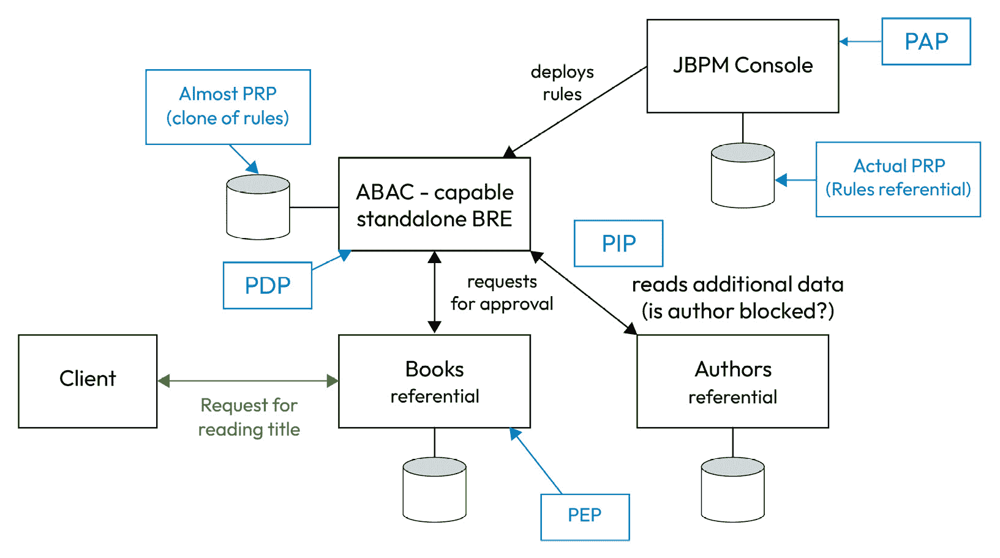

# 授权的外部化

上一章是关于业务规则管理的一般性内容。在本章中，我们将分析授权管理的特定案例，因为用户的权利和特权是许多应用程序中可以找到的常见业务规则使用之一。由于存在两个授权管理标准（如已在*第八章*中探讨），我们将快速解释第一个更完整的标准，即**XACML**（代表**可扩展访问控制标记语言**），因为它有助于理解它与**单一责任原则**（**SRP**）的关系；然后，我们将使用新的、更轻的标准**OPA**（代表**开放** **策略代理**）创建一个更完整的示例。

我们将以此结束本章（以及关于理想信息系统不同部分的四个章节系列），通过反思如何在实践中实施这种授权，这将开启对伴随我们至今的`DemoEditor`信息系统的分析和实施之路，通过示例说明所研究的概念，当然，这还将作为我们在上一章所学内容的实际应用示例。

在本章中，我们将涵盖以下主题：

+   BRMS 和授权管理

+   将授权应用于我们的同一信息系统中

# BRMS 和授权管理

如我在上一章中简要提到的，在`DemoEditor`示例信息系统中存在一个功能域，在这个域中，外部化的业务规则引擎会很有趣，而这个域就是授权。在解释澄清“权利”业务域的语义需求之前，先考察在软件应用程序中实现授权的主要范例，并解释与该功能相关的一个标准，该标准很好地分解了它所涉及的不同责任。

## 身份和授权管理的语义

如*第九章*中所述，语义是架构中所有事物的基石，我们将明确界定我们用于某些概念的术语，以避免错误地定义业务域模型。因此，明确定义**身份和授权管理**（**IAM**）的不同子域以及我们在其中如何命名事物是很重要的。让我们从与**识别**（你是谁）和**认证**（你如何证明你的身份）相关的概念开始：


图 13.1 – 识别和认证语义

一个首要的——并且非常重要的——观点是，授权应仅依赖于你的身份（当然，还有一些上下文元素，但我们会稍后讨论）以及你如何证明你的身份，而不是证明身份的方式。至少，这是我们目前将在信息系统上采取的做法。当然，我们可能在将来需要考虑某些身份验证方法比其他方法更安全，以及某些应用程序可能要求进行强多因素身份验证才能打开某些功能。但这个用例将通过向身份识别添加属性来处理，以考虑这一点。毕竟，即使在这种情况下，应用程序也不需要确切知道你进行了什么身份验证，而是知道它对提供的身份可以有多少信任。

在与 OAuth 关联的标准身份配置文件中已经存在一些类似的情况；例如，除了`email`属性外，联系配置文件还可以提供一个`email_validated`属性，该属性指定身份提供者已验证该标识用户确实控制了某个电子邮件地址。这是一种在不让身份消费者了解电子邮件是如何被验证的情况下增强对身份识别信任的方法。我们不会深入探讨身份验证，因为这个领域非常复杂，而我们想要精确建模的是授权领域。现在，我们只需记住，一个特定的用户可以通过不同的账户/方式来证明其身份进行身份验证。

接下来的重要方面是，用户可以属于不同的组，这最终将使他们在权利管理方面具有一些共同点。这些组可以形成一个层次树，以简化复杂的管理。请记住，我们仍然处于身份识别领域，因此属于一个组并不直接赋予你某些权利。组只是你身份的一部分，就像`lastname`或`firstname`等其他任何属性一样，例如从 OpenID Connect/JWT/OAuth 标准中举例。

现在我们来讨论 IAM 的另一半，即**授权**管理。主要语义如下：


图 13.2 – 授权语义

前面的图表当然只是一个例子，你可能有你自己的词汇来描述其中的术语。但这正是这种语义分析的目的；我知道有些人用“*profiles*”这个词来描述身份域中的人群组，有些人用“*group*”来讨论授权组，还有一些人用“*profile*”来代替“*role*”。但也有人使用其他词汇，重要的是不是谁是对的；只要没有建立标准，每个人都是。重要的是能够明确理解我们谈论的内容。在这本书中，一个组将是一个组织用户集的实体，这些用户在身份上相似，而一个角色将是一组经常一起使用的授权。

让我们更详细地解释一下权限的概念，它通过指向资源和一个操作（或多个，如果这在你的模型中更容易）来定义。例如，从数据引用服务中删除书籍可能是只有一些编辑有权利做的事情；然后我们会通过指向`book`资源和`DELETE`动词来设计相应的权限。使用基于 REST 的词汇当然是故意的——首先，它使解释我们想要表达的意思更加精确；其次，它允许在软件中精确地对齐将要发生的事情。在这种情况下，这个权限将与向`/api/books` API 发送`DELETE`动词的可能性相关联，因此它在书籍数据引用服务中得到了无任何混淆的实现。

当然，一些权限是相互关联的——高级编辑不仅能够删除书籍，还能创建、修改和阅读它们。这就是角色发挥作用的地方——将许多有意义的权限组合在一起。这也是语义也很重要的地方。命名编辑角色是一个困难的选择，因为我们倾向于将“编辑”这个词用于两件本质上不同的事情：当“编辑”用于识别组时，所有用户都属于这个组，而对于角色则使用像`book-editor`这样的名称。

语义在另一个领域也很重要——由于信息系统中有多个应用程序，并且每个应用程序（至少是数据引用服务）都处理特定的资源，因此在角色的名称中指定主要资源是很重要的；否则，它们会相互混淆。顺便说一下，这就是我们将如何将前两个模式分组的方式，展示“权利管理目标”的多样性相对于识别关注点的唯一性：


图 13.3 – 每个应用程序负责其授权

在我们更详细地讨论**授权**框中包含的内容之前，让我们对许多应用程序中处理 IAM 的方式以及如何使用它来实现业务/IT 的整洁对齐进行一次有用的偏离。

## IAM 实施的偏离

在大多数现有的信息系统中，身份验证仍然由许多应用程序直接处理，导致这里所表示的众所周知的反模式：


图 13.4 – IAM 在许多应用程序中的反模式

这些独特功能的多次实现是现有信息系统中观察到的最常见的不对齐模式之一。这不仅导致账户的重复，使得管理访问权限更加困难，还导致不同密码的重复，这对用户来说是一个痛点，并迅速引发安全问题，因为许多用户将在他们的业务应用程序中跨业务使用相似的密码，这使得密码泄露突然更具影响，因为攻击面增加了。

公司常用的一种方法来弥补这种困难是自动化“新来者”流程，并在信息系统的每个应用程序中实施某种工具，以自动创建账户。除非你只有遗留应用程序，并且没有现代化系统的意图（例如，因为活动将在几年内关闭），否则这始终是可能采取的最糟糕的行动，因为它往往会固化问题——既然你已经向系统中添加了另一个（可能成本高昂）的组件，你将更不愿意再次更改它。以下图表显示了这种方法的第二个反模式：


图 13.5 – 新来者耦合版本的过程

此图表显示了所有额外的问题：

+   该流程设计在上层功能层，但业务人员无法修改它，因为它的执行基于由**ETL**应用程序执行的任务，因此只能由技术人员修改，这造成了一些时间耦合（法规的变化将在业务需要时不会应用，而是在 IT 部门能够在其众多项目中抽出时间时应用）。

+   谈到 IT 需要做的许多事情，你是否注意到 BPMN 中的唯一参与者是**IT**？这是合理的，因为所有任务都设计为自动化，IT 被认为负责管理软件内的用户，仅仅因为他们是安装它或知道如何访问 API 的人。这是一个非常普遍的问题；而不是让功能管理员对其应用程序承担全部责任，他们完全依赖 IT 来做这件事。虽然这可以被认为是技术任务的正常情况，但在这个案例中，这是一个问题，因为信任 IT 添加用户并确定他们的默认权限可能会成为监管灾难的配方。毕竟，你怎么能责怪一个处理了会计紧急工单的实习生，他通过创建一个默认密码的用户来解决问题，却不知道在这个遗留应用程序中，用户默认拥有全部权限，这允许新来的用户在公司上班的第一天就访问公司的银行账户并将它们清空？

+   该流程直接在 ETL 应用程序内部实现，这是最大的不匹配反模式。如果你继续沿着这个方向前进，很快，公司的所有业务流程都将依赖于一个软件，而这个软件不仅是你的 IT 系统中的单点故障。如果它被停止使用怎么办？如果编辑突然提高价格怎么办？如果发生一般性故障怎么办？

+   在某些情况下，实施人员可能足够幸运，能够调用一个良好、向后兼容且文档齐全的 API，例如在`Application A`上，这允许进行某种解耦，甚至有可能在 BCM 中公开此 API。但在`Application B`中，API 直接与应用程序的库进行通信，这使得这种互操作性对版本变更非常脆弱。在`Application C`中，情况甚至更糟，因为找到的自动化创建账户的唯一方法是将行直接插入数据库。在下一个版本中，行为可能会变得完全不可预测，或者甚至在生产中推出时就会发生，因为你忘记在脚本中持久化的重要部分，等等。

之前的方法倾向于将这种反模式嵌入到系统中，其中每个应用程序都负责自己的标识甚至身份验证，而它应该只处理授权（这个反模式必须保留，因为应用程序处理资源，权限适用于这些资源）。相反，正确的做法是逐步采用以下正确的模式：


图 13.6 – IAM 责任的正确映射

在这种情况下，身份验证和认证责任由专门的软件实现（在我们的例子中，是一个 Apache Keycloak IAM 服务器，连接到 Microsoft AD 用户目录），而所有应用程序仍然负责它们各自管理的资源的授权，但它们指向这个唯一的身份验证特征，以应用正确的权限（再次强调，无需了解任何关于认证过程的信息）。当然，这不会在一天内完成；您需要逐步用支持外部化认证/识别的应用程序装备您的信息系统。如今，几乎所有现代企业级应用程序都这样做，如果它们是基于浏览器的，在某些情况下甚至可以使用前端来保护这些责任。而且由于您很可能会保留一些遗留应用程序，您最终会拥有一个“中途”的信息系统，如下所示，这已经好得多，也更易于处理：


图 13.7 – 完美对齐版本的新手流程

不要因为图中增加的复杂性而感到沮丧；这仅仅是因为我增加了更多的细节——特别是硬件层，之前并未展示过。在这个信息系统部分，可以在图的右侧看到许多优点，但我们将现在更详细地讨论它们：

+   现在可以将流程的实施专门化到任何工具上，并且它将不会与技术栈有任何耦合（除了调用 Apache Keycloak API 添加全局用户，但这极为罕见，因为这可以基于 LDIF 标准，并且软件更改对流程用户是不可见的）。

+   如果需要修改流程——例如，为在第一版中遗忘的遗留应用程序添加另一个步骤——这可以由决策者独立完成。在新版本中，这个额外任务将像现有的遗留会计系统任务一样工作——当基于用户的任务完成时，会向应用程序的功能管理员发送一封电子邮件，附带添加所需用户的流程链接。完成操作后，这个人会点击收到的电子邮件中的链接，以表示任务已完成，这也会关闭流程。

+   专门分配给 IT 部门的第一项任务仍然是手动的，因为需要填写一个表格（Apache Keycloak 的表格或——如这里所示——由 BPMN 引擎提供的表格，该表格会调用与 BCM 的“创建用户”功能关联的 Keycloak API）。如果 Keycloak 的 API 遵循 LDIF 标准，它可以被认为是与信息系统中的功能相关联的标准化唯一点，这使得在需要时替换 Keycloak 为其他软件变得更容易。

+   此外，Keycloak 充当实际用户目录的间接层。如果这需要更改为另一个目录，或者甚至使用身份联合和多个目录，这对与“创建用户”功能关联的 API 的任何用户来说都是透明的。

当然，遗留应用程序的问题不会完全消失，但至少，在这个配置中，遗留的影响会逐渐减少，并且正确的功能已经准备好以应有的方式为新和更现代的应用程序工作。此外，遗留应用程序被隔离到一个孤岛中，将来丢弃它将更容易。在这个例子中，我们可以从移除流程中的任务开始，然后抑制带有其本地耦合的识别和认证功能的旧应用程序。最后，我们必须验证那个使用不受支持或异类、难以维护的操作系统旧行服务器是否在系统中扮演任何其他软件角色。

## 基于角色的访问控制和基于属性的访问控制模型

在对 IAM 实现进行了相当长——但希望是有用的——的离题之后，我们将回到之前的地方，即在一个好的信息系统中，识别和认证功能对所有应用程序都是唯一的，但授权功能对每个资源都是重复的。确实，只有处理资源的应用程序才知道如何处理其上的权限。在我们的书籍数据参考服务示例中，我们看到一个名为`book-edition`的角色是有意义的。但在一个存档系统中呢？我们可能会在那里找到像`archivist`或`readonly-verifier`这样的角色，但`book-edition`就没有意义了。

这并不是说我们找不到应用程序之间的共同角色名称；相反——相似的名字应该仔细考虑，因为它们并不意味着相同的事情。这就是为什么即使它经常发生，将角色命名为“管理员”是如此危险。当然，每个人都知道这意味着什么——拥有这个角色的用户可以在软件中执行每个操作。但是，具体来说，“一切”的定义可能因软件而异。如果你在你的用户目录中添加一个名为“管理员”的组，这个组本应意味着这个组中的用户应该在每个应用程序中拥有完全权限，那么混淆就会增加。

我个人建议将这种情况限制在`domain-administrator`上，并安排您的 IT 部门永远不要成为应用程序的功能管理员，而只是它们安装的机器的管理员（这并不阻止他们间接地查看或操作数据，但这又是另一个应该通过合同标准和行政行为的完全可追溯性来解决的问题）。

为了解释这一点，前述图表的更好表示方式如下：


图 13.8 – 在权限上影响授权而不是资源

上一张图中的左侧并不那么详细，但这正是我们想要的。既然我们说授权应该基于身份，那么在实践中我们该如何做呢？最容易和最常用的方法之一如下：


图 13.9 – 纯基于角色的访问控制方法

当角色与组或直接与用户关联（或称为“映射”）时，这种基于权利管理的范式被称为**基于角色的访问控制**（**RBAC**）。这种方法的优点在于它非常容易实现。由于管理权利的人只看到角色，因此从他们的角度来看，图表甚至可以表示如下：


图 13.10 – 记录的 RBAC 方法

这也简化了开发者的工作，因为他们只要尊重与角色关联的基于文本的权利定义，就可以选择他们偏好的任何角色实现方法，甚至可以混合使用：


图 13.11 – RBAC 中的其他可能的角色实现

角色的文本定义可能会引起一些麻烦，因为文本的不精确性和知识随时间过时的可能性，它容易产生近似，尤其是如果编辑角色有高的人员流动率且/或没有清楚地记录其软件功能。

由于纯 RBAC 相当限制性，应用程序通常允许直接将细粒度权限映射到用户或组，如下所示：


图 13.12 – 作为 RBAC 改进的细粒度权限

这扩展了可能性，但同时也使得功能管理员在情况超过仅仅例外时，跟踪赋予不同用户的权利变得更加困难。随着用户数量的增加，使用组和角色变得越来越重要。将一些权利管理责任委托出去的诱惑也随之增加，但必须用严格的规则来实施，并仔细培训人员，因为事情可能会迅速变得混乱，拥有相同职位名称的用户最终会拥有不同的权利，这取决于谁赋予了他们这些权利。更糟糕的是，一些用户最终获得了对软件的完全权限，因为新的功能管理员并不完全理解权限管理系统是如何工作的。这又是另一个原因，不要将这项责任交给 IT 部门，尽管这可能很有诱惑力，因为他们将控制应用程序的技术部分。

另一种扩展 RBAC 功能更复杂的方法是转向所谓的**基于属性的访问控制**（**ABAC**）。在这个权利管理范式中，会设置一些规则，将标识符的属性与资源的属性相链接：


图 13.13 – ABAC 方法

这使我们能够，例如，克服在样本`DemoEditor`信息系统中使用 RBAC 时可能遇到的限制，如果作者只是添加了一个`book-edition`角色。实际上，这个角色要么会给他们阅读和编写书籍的权利，`books`资源但不限于特定的书籍。

这是 ABAC 的工作，它将使用的属性如下：


图 13.14 – 带有 BRMS 的 ABAC 实现

你会注意到权限仍然被表示出来——我们也可以包括角色——因为 ABAC 并不是排斥 RBAC，而是在其未来发展中与之相辅相成。

在这种情况下，技术上会发生以下情况：

+   应用程序会在`/api/books/978-2409002205`上调用`GET`动词。

+   这个请求会伴随着基于令牌的认证头。

+   JWT 令牌将包括提供作者内部标识符的自定义属性（或者另一种方法是将作者关联基于电子邮件或另一个标准属性）。

+   在接收到这个请求后，图书参考服务应用程序会调用授权中心 API，并向它提供它所知道的所有关于请求的信息——传入的 JWT 生成的身份，请求的图书属性等等。

+   授权应用程序会找到适用于该情况的规则——在这种情况下，对书籍的`GET`操作。

+   它首先会检查传入的用户是否有`author_id`，并且这个 ID 与给定书籍的作者之一相关联（查看`book_mainauthor_id`属性，如果需要，还可以查看`book_secondaryauthors_ids`属性数组）。

+   然后，它会检查最初的请求到书籍参考服务不包含像`$expand=release-information`这样的内容，因为作者将看不到这些数据。

+   它会意识到需要检查作者没有被阻止，并调用一个`GET`请求到`/api/authors/x24b72`。这将使用具有完全读权限的特权账户进行，因为我们认为 BRMS 由于其系统中的功能，有正当的“知情权”。

+   作为这种方法的替代方案，书籍参考服务可以提供书籍的扩展视图，就像调用`/api/books/978-2409002205?$expand=authors`一样。

+   对于大多数高级授权系统，这三个检查会并行进行以节省时间。

+   如果一切正常，BRMS 将向书籍参考服务的调用发送`200 OK` HTTP 响应。

+   然后，书籍参考服务会授予请求的访问权限。

当然，如果这些步骤中发生任何错误，请求将被拒绝，并返回`403 Forbidden`状态码。这可能发生在规则不被遵守的情况下，也可能发生在 BRMS 系统没有及时响应的情况下。这种行为是预期的，因为所谓的“优雅降级”意味着，出于安全原因，系统不会冒任何风险来披露数据或允许任何操作，如果它不确定这是否被允许。这意味着授权是系统中的另一个 SPOF（单点故障），应该按照这个请求的服务级别进行操作。

我犹豫是否要讨论**ReBAC（基于关系的访问控制**），它看起来是 RBAC 和 ABAC 范式的良好补充，但在撰写本文时，它尚未达到足够成熟的阶段。简而言之，ReBAC 的原则是基于实体之间的链接来管理授权；因此，它与 DDD 有很强的联系。例如，这种方法允许你轻松地给某位作者在其书籍上赋予写权限，同时保持其他作者的书籍只有只读权限。当然，这也可以用 ABAC 来实现，但 ReBAC 通过基于关系而不是简单地基于属性来运作，使其变得稍微简单一些。要了解更多关于 ReBAC 的信息，你可以从[`en.wikipedia.org/wiki/Relationship-based_access_control`](https://en.wikipedia.org/wiki/Relationship-based_access_control)开始，然后查看 OSO 关于这种模式的观点[`www.osohq.com/academy/relationship-based-access-control-rebac`](https://www.osohq.com/academy/relationship-based-access-control-rebac)。

OpenFGA（[`openfga.dev/`](https://openfga.dev/））也是一个值得关注的开源项目，如果你需要一个干净的外部授权管理系统，并且支持 ReBAC。尽管它还处于起步阶段，但该项目已经被引用为云原生计算基金会项目。如果你想了解它能为你的授权需求做什么，最好的开始方式之一是调整沙盒中提供的示例（[https://play.fga.dev/sandbox](https://play.fga.dev/sandbox)）。

## XACML 方法

现在我们已经讨论了不同组织形式的权利管理，我们将开始讨论更多关于实现的内容，到现在，你肯定已经开始思考我们有哪些规范和标准可供选择。由于我们已经讨论了实现 ABAC 的步骤，研究最完整的规范之一并解释它如何适应这些 ABAC 步骤将很有趣。

**XACML**（**可扩展访问控制标记语言**）指定了如何执行和管理访问控制。这是处理授权的最先进方法之一，它建立了五个不同的责任来实现这一点：

+   策略管理点是定义规则的地方

+   策略检索点是它们存储的地方

+   策略决策点是决定应该采取哪个决策的引擎

+   策略信息点是收集用于规则评估的必要附加属性的地方

+   策略执行点是应用决策结果的地方

这五个责任如何在单个或多个应用程序中分布，定义了系统的复杂程度。在最简单的方法中，所有五个责任都可以在最终必须应用执行点的数据引用服务中实现（因为数据引用服务是拥有数据的一方，所以不能外部化）。在这种模式下，数据引用服务不仅存储数据，还存储规则，执行它们，并根据结果决定应该做什么。唯一可能仍然被视为外部责任的情况是，如果引用服务需要一些外部数据，但它也可以很好地存储这些数据。在这种情况下，责任会受到以下影响：


图 13.15 – 所有授权责任集成到应用程序中

相比之下，这是我们之前讨论的责任组织形式中如何分配责任的方式：



图 13.16 – 授权责任完全分散到专用服务中

在这种非常干净（但当然，设置成本更高）的方法中，每个责任都是完全分离的，BRMS 和数据参考服务一起工作，以协调它们：

1.  在任何第一次交互之前，一个功能性的用户连接到 PAP 并设计规则（就像之前在 DMN 使用示例中所做的那样）。

1.  这些规则存储在相关的数据库中，即 PRP。

1.  参考书籍的服务接收初始请求。它不能自行做出决定，并将 PDP 委托出去。

1.  它将调用部署的 BRE 的调用上下文，以便从中获取决定。

1.  PDP 需要检索规则以便处理。它可以调用 PRP，但幸运的是，在我们的情况下，它有一个本地副本，我们假设使用了 JBPM 服务器，控制台部署了一个用于规则执行的独立运行时容器。

1.  PDP 可能还需要一些额外的信息，它可以通过 PIP 收集，以检索作者的`blocked`状态。

1.  PDP 将其规则决策引擎的结果发送回参考书籍的服务。

1.  与 PEP 一样，参考书籍的服务使用 PDP 发送的决定来允许（或不允许）访问其数据，并可能响应所呈现的 HTTP 响应。

在我们向您展示如何设置此配置的实际示例之前，让我再进行一次小插曲，这次是关于服务应该如何分离。

## 关于微服务粒度的小插曲

首先，让我们为一种不太复杂且更常见的情况绘制一个图表，其中每个数据参考服务除了 PEP 外还包含自己的 PRP 和 PDP。在这种情况下，PAP 通常是最低限度的，因为规则集成到代码中，不允许轻松管理，这意味着 PRP 仅仅是代码库本身。


图 13.17 – 数据克隆时的授权管理问题

你能发现潜在的问题吗？参考书籍的服务不持有作者的 PDP/PRP，这是合乎逻辑的，因为它对此不负责。然而，它仍然存储了作者数据的副本，以便快速响应如`/api/books/978-2409002205?$expand=authors`之类的 API 调用。这意味着，由于它不知道如何过滤这类数据，如果不小心处理，可能会造成机密数据的泄露。在四层图中，这个问题可以从一个奇怪的错位中看出，如下所示：


图 13.18 – 四层图中授权反模式的表示

这种不匹配源于数据存储应用程序信任了授权。这种方式，由于数据被重复，实际上存在两种可能不同的方式来对相同的数据应用授权！这种情况也可能发生在我们在 BRMS 中外部化数据时，因为运行时和 PAP 可能没有同步，但在这个情况下，优势远比实际缺点更重要。事实上，JBPM 控制台和 BRE 运行时容器之间的解耦带来了很多附加价值——控制台是一个复杂的服务器，而运行时容器非常轻量；将它们分开是更好的选择，因为错误更容易在第一个中发生，而第二个应该有出色的服务水平。当控制台用于部署独立服务器时，它可能会崩溃，但这不会成为问题。相反，运行时可以变得极其健壮，因为它去除了几乎所有不是立即执行函数所必需的代码。控制台部署规则集版本的事实使得可以根据性能需求创建所需数量的运行时服务器（因此，你也避免了单点故障问题，因为这项服务被许多其他服务所需要，并且应该非常稳定），而不会存在任何一致性问题，这会是一个大问题（想象一下向你的客户解释他们的租户数据访问权在每次新请求中都会变化）。

然而，这并不意味着应该尽可能地将所有责任添加到尽可能多的服务和不同的流程中。当然，这可能是有用的，但正如在信息架构中经常发生的那样，最重要的是找到正确的平衡点。互联网上关于微服务和单体应用哪种更好的无意义讨论已经太多了，你几乎可以通过查看文章标题来推测文章的质量。当然，对“什么才是最好的”的唯一正确回答是，“*这取决于*”，任何合格的软件架构师都知道这并不是一个“一刀切”的情况。


图 13.19 – 服务粒度优缺点

我意识到我每隔一章就会说这句话，但重复一遍是有价值的——在业务功能的粒度中，什么应该是优先考虑的？如果你知道授权规则很少改变，并且等待新版本发布不是问题，那么可以直接在相关参考服务的代码中实现业务功能粒度中应该优先考虑的部分；这将带来最佳性能，并且如果你有克隆数据，你只需处理数据安全的问题。如果有问题，考虑在有任何疑问时调用其他参考服务；这也会是刷新你部分克隆数据的一种方式。相反，如果你可以预见授权规则将频繁更改或存在外部情况，例如法规，那么考虑逐步从你的数据参考服务中提取责任。预见这类事情确实是在过度预测和采用过多 DRY（Don't Repeat Yourself）方法之间的一条细线，但这就是判断、长期的专业知识和从许多先前经验中吸取教训发挥作用的地方。

# 将授权应用于我们的示例信息系统

XACML 之前已经解释过了，但它是实施起来相当复杂的机制。此外，虽然存在几个产品，如 WSO²、Balana、Axiomatics 或 AT&T 的产品，但没有协议的参考实现。尽管这些产品在银行或保险等大型信息系统中都有自己的位置，但它们对于我们决定在示例中模拟的小型信息系统来说可能过大，因此我们将使用更轻量级且更接近主要互联网协议的方案。

## Open Policy Agent 的替代方案

Open Policy Agent 是一个由云原生计算基金会支持的项目，它提出了描述策略语法的良好解耦。简而言之，OPA 对于 XACML 就像 REST 对于 SOAP 一样——一个轻量级的替代方案，以 20%的复杂性完成 80%的工作。为了展示如何将授权责任外部化，我们不会安装完整的 XACML 服务器，而是将使用 Docker 来定制一个授权引擎。

OPA 使用名为`Rego`的声明性语言来描述应用于数据以做出决策的策略。然后它可以执行这些策略，提供 JSON 结果，这些结果可以在其他服务或如果你使用 OPA 实现作为组件的情况下被利用。

技术上，将会发送如下请求到 OPA，并且它会响应请求的访问是否应该被授权：

```cs
{
    "input": {
        "user": "jpgou",
        "operation": "all",
        "resource": "books.content",
        "book": "978-2409002205"
    }
}
```

在这个例子中，用户`jpgou`请求对书籍的`content`花瓣的完全访问权限，该书籍在系统中的 ISBN 号为`978-2409002205`。如果 OPA 服务器批准了这个请求，它将响应如下：

```cs
{
    "result": {
        "allow": true
    }
}
```

在再次深入研究技术之前，我们需要明确从功能角度我们想要实现什么。

## DemoEditor 的功能需求

让我们回到我们的 `DemoEditor` 示例，并描述从授权的角度应该做什么。当然，在一家出版社，作者有权限提供书籍内容并根据需要调整，但他们绝不应该能够阅读另一位作者书籍的内容，以避免剽窃甚至知识产权盗窃。由于有编辑负责作者，因此他们至少可以阅读他们管理的作者的书的内容，这是合乎逻辑的。另一方面，销售人员没有任何编辑责任，所以他们可能只知道一些关于书籍的信息来准备销售和订单，但没有理由了解任何关于编辑过程的信息。

在对 `DemoEditor` 权限管理中涉及的风险的简要描述中，很明显，纯 RBAC 将不足以满足需求，我们必须求助于 ABAC 来补充 RBAC，因为存在基于书籍属性的规则，即谁是作者，甚至其他信息，如作者与其编辑之间的联系。RBAC 本身是不够的，因为作者对自己书籍的权利比对其他作者书籍的权利更大，尽管他们都将从 `author` 授权配置文件中受益。

如下文将更详细地解释，我们还将添加一些规则，例如销售人员只能看到书籍达到一定状态后才能看到，或者另一个规则允许我们阻止不遵守编辑合同的作者的权利，并应拒绝其权限。为此，我们将使用我们在 *第九章* 中使用的相同隐喻，即为书籍的不同类别数据指定，就像将它们放在花朵的花瓣中，其中最核心的部分包含最重要的、定义实体的数据，如书籍的 ISBN 号码和标题。虽然根据授权规则定义这些花瓣可能很有吸引力，但重要的是要记住它们必须从功能约束中提取，而授权管理就是其中之一，但仍然只是其中之一。

## 创建授权策略

从定义授权策略开始，将允许我们同时做两件事：

+   解释我们打算实施哪种授权行为以及书籍的数据引用服务应该如何工作

+   探索一些 `Rego` 语法以及使用这种机制外部化授权时涉及的内容

当编写用于书籍数据引用服务授权管理的`policy.rego`文件（只是一个任意的名称）时，我们需要从包名开始，这允许我们在同一引擎中执行不同组的规则时将规则分开。文件的开始部分还包含一些导入特定关键字和函数（OPA 支持插件和语法扩展以简化其使用）或准备数据的说明（我们将在本章后面进一步讨论）：

```cs
package app.abac
import future.keywords
import data.org_chart
```

文件的主体部分通常从一个模式开始，其中主要授权属性，我们将称之为`allow`，被分解为几个更细粒度的决策策略。我们想要实现的是一个授权引擎，当暴露于某种访问类型时，将发送一个结果，表明是否应该授予这种访问。我们将在演示如何应用规则引擎时回到这部分，但现在，让我们继续政策定义文件，并展示我们讨论的行为将如何实现：

```cs
default allow := false
allow if {
    permission_associated_to_role
    no_author_blocking
    no_status_blocking
    authors_on_books_they_write
    editors_on_books_from_authors_they_manage
}
```

为了实施安全最佳实践，默认情况下禁止访问。这允许所谓的“优雅降级”——如果授权子系统出现问题，它将默认到最安全的情况。在我们的情况下，最安全的做法是不允许访问，因为当然，缺乏可用性比向那些本不应该看到这些数据的人披露数据的问题要小得多，这种事件可能带来的所有商业后果也是如此。这正是前面代码的第一行所涉及的内容——将`allow`属性的默认值设置为`false`。

第二个操作说明，为了使`allow`变为`true`，我们需要通过五个不同的决策，每个决策都需要评估为`true`。当然，这些决策的命名方式使得它们易于理解和调试（正确设置授权是一项挑战，但几乎永远不会在第一次尝试时就达到 100%正确）。文件的其他部分基本上将详细说明这五个主要决策，但在我们声明它们的工作方式之前，我们需要准备一些数据。确实，正如我们将在下一节中解释的，我们需要一些引用服务数据，以便引擎做出决策。例如，既然我们声明编辑应该能够访问他们指导的作者的书，那么引擎了解作者和编辑之间的链接将是一个明显的需求。其他一些信息，如书籍的状态属性，也将是有用的。所有这些数据将主要来自数据引用服务到引擎，但将是基本数据，我们可能在实际使用整个数据集来推断决策之前从中获取一些信息。

其中一条信息是当前用户拥有的角色。如前所述，我们将需要一些 RBAC（基于角色的访问控制）的片段，即使它不足以满足所有需求。这意味着用户将与一些角色相关联，其中一些是直接关联的，而另一些则是通过属于识别组的用户间接关联的。以下语法精确地表达了这一点：

```cs
user_groups contains group if {
    some group in data.directory[input.user].groups
}
user_group_roles contains role if {
    some group in user_groups
    some role in data.group_mappings[group].roles
}
user_direct_roles contains role if {
    some role in data.user_mappings[input.user].roles
}
user_roles := user_group_roles | user_direct_roles
```

组可以在一个名为 `directory` 的数据块中找到，通过查看由名为 `user` 的输入变量值指定的列表中的条目。一旦在这个列表中找到该用户，`groups` 属性将提供识别组的列表。然后，这些组将被用来检索与组关联的角色，利用一个名为 `group_mappings` 的集合。相同的逻辑也将应用于直接应用于用户的角色的集合，并且这两个角色列表将通过前面代码中显示的最后一个操作简单地合并。

我们还需要有关可能与用户关联的作者的信息。这对我来说还没有完全解释清楚，只是简要地提到，即使作者实际上不是组织的一部分，或者至少不是其员工，他们也会使用 `DemoEditor` 访问信息系统。这意味着，首先，必须为他们提供访问权限（我们将在实现相关函数时回到如何做到这一点）。这也意味着，在信息系统中应该有某种方式将这两个实体关联起来。一种相当常见的方法是使用经过验证的 `email` 属性将它们联系起来。目前，我们只需考虑用户信息包含在 `author` 实体中。检索关联的规则相当容易编写——它只是遍历作者列表，如果与作者关联的 `user` 是请求访问相关的用户，那么该作者就是我们正在寻找的：

```cs
user_author contains author if {
    some author in data.authors
    author.user == input.user
}
```

实际上，我们应该提到作者而不是仅仅一个作者，因为我们知道在功能上可能只有一个，但在技术上，我们甚至将使用一个列表，即使变量的名称仍然是单数形式，`user_author`。

同样的情况也适用于请求中提到的书籍，因为我们需要从数据列表中检索其 ID，以便能够根据书籍属性上的规则做出一些决策：

```cs
book contains b if {
    some b in data.books[input.book]
}
```

在作者的情况下，我们还需要检索他们作为作者所写的书籍列表，因为一些规则也适用于这一点：

```cs
author_books contains book if {
    some author in user_author
    some b in data.books
    b.editing.author == author.id
}
```

现在所有必要的数据都已收集，我们可以开始讨论规则本身，分别考虑五个规则单元，并将它们进一步分解。首先适用的规则是权限应由与请求关联的用户拥有。仅授予访问权限是不够的，但这仍然是一个必要的约束。为了知道用户是否应该被允许访问他们请求的资源，应该研究角色提供的所有访问。如果其中之一对应于请求的资源类型和操作，那么它就是一个匹配项，权限将被应用：

```cs
permission_associated_to_role if {
    some access in user_accesses_by_roles
    access.type == input.resource
    access.operation == input.operation
}
```

以下规则使得以下情况发生：如果某人获得了`books.content`、`books.sales`或`books.editing`（对应数据引用服务的花朵的一个花瓣），那么他们自动获得花朵核心的权利，这是合乎逻辑的，因为如果能够访问某些数据，但不能将其与特定实体关联，那么这不会非常有用：

```cs
permission_associated_to_role if {
    some access in user_accesses_by_roles
    "books" == input.resource
    access.operation == input.operation
}
```

由于我们有两个具有相同名称（`permission_associated_to_role`）的规则，而不是在同一组内具有不同名称的两个规则，因此在处理上存在很大差异，这意味着规则被认为是通过“或”运算符分开的（结果为真不需要所有条件都为真，例如之前为`allow`设置的），我们甚至还将添加第三个情况，即当访问提供的内容包含`all`作为操作时，这部分策略应该被授予。在这种情况下，无论请求的操作是`read`、`write`还是任何其他值，都将被授予（至少基于这个标准）：

```cs
permission_associated_to_role if {
    some access in user_accesses_by_roles
    access.type == input.resource
    access.operation == "all"
}
```

现在，问题应该是，`user_accesses_by_roles`是如何计算的？这次，它稍微复杂一些，有一个子决策会遍历一些树状层次结构，包括在提供的数据的`roles`实体中包含的配置文件及其相关访问。我们将在下一节中返回定义，但就目前而言，重要的是要知道我们将使用一个层次结构来设置经理在顶部，然后是销售人员和平面编辑，以及作者在其编辑之下。这种方法中有趣的部分将是如何使上面的角色在树中接收下面角色的所有权限。毕竟，如果销售人员有权利编写销售值，那么他们的经理至少应该有相同的权利。语法更难阅读，但不要担心这一点，因为 OPA 文档写得很好，而且有很多示例，即使是复杂的规则也有：

```cs
user_accesses_by_roles contains access if {
    some role in user_roles
    some access in permissions[role]
}
roles_graph[entity_name] := edges {
    data.roles[entity_name]
    edges := {neighbor | data.roles[neighbor].parent == entity_name}
}
permissions[entity_name] := access {
    data.roles[entity_name]
    reachable := graph.reachable(roles_graph, {entity_name})
    access := {item | reachable[k]; item := data.roles[k].access[_]}
}
```

当处理规定作者只能对其所写的书有权利的规则时，我们需要应用一个小技巧。像往常一样，我们首先将访问设置为`false`，以遵守安全最佳实践。如果我们可以在书籍作者的情况下跟随作者链接，或者简单地在这种情况下用户不是书籍作者，我们将将其设置为`true`。这听起来可能过于宽松，但请记住，这并不是完整的成果。在这种情况下，这仅仅是关于作者和他们的书籍之间链接的决策部分；如果我们处理的是编辑，这个规则根本不适用，但其他一些规则将适用，并且所有这些规则都需要一致，以便最终的总结性决策是积极的。结果是以下内容：

```cs
default authors_on_books_they_write := false
authors_on_books_they_write if {
    some role in user_roles
    role != "book-writer"
}
authors_on_books_they_write if {
    some role in user_roles
    role == "book-writer"
    some author in user_author
    some b in data.books
    b.editing.author == author.id
    b.id == input.book
}
```

到现在为止，你应该开始更熟悉`Rego`语法，但全球授权方案的第三部分仍然需要一些思考，因为它需要你遍历整个组织结构以检索编辑和“他们”的作者之间的链接，因为我们需要应用规则，即编辑只能对其管理的作者的书有权利：

```cs
default editors_on_books_from_authors_they_manage := false
editors_on_books_from_authors_they_manage if {
    some role in user_roles
    role != "book-edition"
}
book_author contains b.editing.author if {
    some b in data.books
    b.id == input.book
}
editors_on_books_from_authors_they_manage if {
    some role in user_roles
    role == "book-edition"
    some author in book_author
    some b in data.books
    b.editing.author == author
    b.id == input.book
    user_hierarchy_ok
}
foundpath = path {
    [path, _] := walk(org_chart)
    some author in book_author
    path[_] == author
}
user_hierarchy_ok if {
    some user in foundpath
    user == input.user
}
```

全球决策的第四部分更简单——它认为销售人员如果一本书不在已发布或存档状态，就不能看到这本书。同样，为了考虑到“或”方法，我们需要计算两次`readable_for_sales`属性，最初出于安全原因设置为`false`，分别对应允许销售人员访问的状态值：

```cs
default no_status_blocking := false
no_status_blocking if {
    some role in user_roles
    role != "book-sales"
}
default readable_for_sales := false
readable_for_sales if {
    book.status == "published"
}
readable_for_sales if {
    book.status == "archived"
}
no_status_blocking if {
    some role in user_roles
    role == "book-sales"
    readable_for_sales
}
```

决策的第五和最后一部分甚至更简单，我们不会解释代码，只解释规则——如果一个作者已被阻止，他们不能访问任何书籍：

```cs
default no_author_blocking := false
no_author_blocking if {
    some role in user_roles
    role != "book-writer"
}
no_author_blocking if {
    some role in user_roles
    role == "book-writer"
    some user in user_author
    user.restriction == "none"
}
```

语法完成之后，我们需要第二种类型的信息来做出决策。这就是决策数据的内容。

## 添加一些数据以便做出决策

在上一节中，我们已暗示了数据应提供（甚至从其他数据中推断）以便规则引擎能够做出决策的事实。接下来，我们将展示我们应该为我们的示例设置哪些类型的信息。首先，我们需要角色的定义（记住，角色是一组权利，每个权利由资源类型和操作类型组成）：

```cs
"roles": {
    "book-direction": { "access": []},
    "book-sales": { "parent": "book-direction", "access": [{ "operation": "all", "type": "books.sales" }]},
    "book-edition": { "parent": "book-direction", "access": [{ "operation": "all", "type": "books.editing" }]},
    "book-writer": { "parent": "book-edition", "access": [{ "operation": "read", "type": "books.editing" }, { "operation": "all", "type": "books.content" }]}
}
```

前面的 JSON 内容还定义了`parent`的概念，它创建了一个角色树，例如，`book-sales`和`book-edition`被放置在`book-direction`下，这意味着导演将自动获得默认授予销售人员的所有权限，以及授予编辑的权限，当然还包括直接在角色本身上描述的权限。

将有关书籍的一些数据发送，以便应用需要这些数据的特定规则。在以下示例中，我展示了一个列表，因为我测试了不同的组合。在实际使用中，我们可以简单地发送与请求 OPA 决定访问权限的唯一书籍相关的数据，以保持性能。以下是相关数据：

```cs
"books": {
    "978-2409002205": { "id": "978-2409002205", "title": "Performance in .NET", "editing": { "author": "00024", "status": "published" }},
    "978-0000123456": { "id": "978-0000123456", "title": ".NET 8 and Blazor", "editing": { "author": "00025", "status": "draft" }}
}
```

注意，前面的代码不是用 JSON 数组表达，而是作为一个结构。关于作者的数据也是如此：

```cs
"authors": {
    "00024": { "id": "00024", "firstName": "Jean-Philippe", "lastName": "Gouigoux", "user": "jpgou", "restriction": "none" },
    "00025": { "id": "00025", "firstName": "Nicolas", "lastName": "Couseur", "user": "nicou" }}
```

组织结构图允许我们定义谁是“大老板”（`frfra`），定义哪些销售人员编辑在他之下（我的例子中有三个人），最后，将两位作者放置在编辑之下，代号 `mnfra`：

```cs
"org_chart": {
    "frfra": {
        "frvel": {},
        "cemol": {},
        "mnfra": {
            "00024": {},
            "00025": {}
        }
    }
}
```

然后，我们模拟用户目录可能会发送的内容——例如，每个用户所属的组。这有点人为，因为我们通常会从通过身份验证传递的 JWT 令牌中提取这些信息，但这就是我们在代码中遇到困难时将要做的。现在，我们将保持以下树状结构的象征性：

```cs
"directory": {
    "frfra": {"groups": ["board"]},
    "frvel": {"groups": ["commerce", "marketing"]},
    "cemol": {"groups": ["commerce"]},
    "mnfra": {"groups": ["editors", "quality"]},
    "jpgou": {"groups": ["authors"]},
    "nicou": {"groups": ["authors"]}
}
```

当然，现在我们有了组，我们需要映射来将它们链接到角色，以实现真正的 RBAC 方法：

```cs
"group_mappings": {
    "board": { "roles": ["book-direction"] },
    "commerce": { "roles": ["book-sales"] },
    "editors": { "roles": ["book-edition"] },
    "authors": { "roles": ["book-writer"] }
}
```

由于我们决定尽可能完整，我们将允许——除了纯 RBAC 以外——也声明一些用户和角色之间的直接关联，而不需要组作为中介：

```cs
"user_mappings": {
    "frvel": { "roles": ["book-edition"] }
}
```

现在一切准备就绪，服务器可以输出一些结果（规则和数据），我们可以进行下一步，即设置一个真实的 OPA 服务器，用这两个文件给它提供数据，并尝试一些决策。

## 基于 Docker 的 OPA 服务器部署

使用 Docker 部署如此简单，不使用它来测试 OPA 就会麻烦不断。运行服务器的命令行非常简单：

```cs
docker run -d -p 8181:8181 --name opa openpolicyagent/opa run --server --addr :8181
```

服务器启动后，我们将开始调用将其中的策略定义推送到服务器：

```cs
curl --no-progress-meter -X PUT http://localhost:8181/v1/policies/app/abac --data-binary @policy.rego
```

使用另一个调用发送数据：

```cs
curl --no-progress-meter -X PUT http://localhost:8181/v1/data --data-binary @data.json
```

最后，我们能够使用以下代码中展示的简单请求来测试 OPA 服务器：

```cs
{
    "input": {
        "user": "jpgou",
        "operation": "all",
        "resource": "books.content",
        "book": "978-2409002205"
    }
}
```

当使用以下命令将此文本内容发送到使用 `POST` 的 API 时，OPA 服务器将以 JSON 格式发送结果，其余的命令负责检索我们感兴趣的响应部分：

```cs
curl --no-progress-meter -X POST http://localhost:8181/v1/data/app/abac --data-binary @input.json | jq -r '.result | .allow'
```

如果直接执行，这通常会发送 `true`，意味着请求的上下文由 OPA 服务器授权。如果你删除命令的最后部分并显示整个响应，你将得到如下内容，这对于调试非常有用，因为它显示了所有中间决策的值：

```cs
{
  "result": {
    "allow": true,
    "author_books": [
      [
        "978-2409002205",
        "Performance in .NET",
        {
          "author": "00024",
          "status": "published"
        }
      ]
    ],
    "authors_on_books_they_write": true,
    "book": [
      "978-2409002205",
      "Performance in .NET",
      {
        "author": "00024",
        "status": "published"
      }
    ],
    "editors_on_books_from_authors_they_manage": true,
    "foundpath": [
      "frfra",
      "mnfra",
      "jpgou"
    ],
    "no_author_blocking": true,
    "no_status_blocking": true,
    "permission_associated_to_role": true,
    "permissions": {
      "book-direction": [
        {
          "operation": "all",
          "type": "books.content"
        },
        {
          "operation": "all",
          "type": "books.editing"
        },
        {
          "operation": "all",
          "type": "books.sales"
        },
        {
          "operation": "read",
          "type": "books.editing"
        }
      ],
      "book-edition": [
        {
          "operation": "all",
          "type": "books.content"
        },
        {
          "operation": "all",
          "type": "books.editing"
        },
        {
          "operation": "read",
          "type": "books.editing"
        }
      ],
      "book-sales": [
        {
          "operation": "all",
          "type": "books.sales"
        }
      ],
      "book-writer": [
        {
          "operation": "all",
          "type": "books.content"
        },
        {
          "operation": "read",
          "type": "books.editing"
        }
      ]
    },
    "readable_for_sales": false,
    "roles_graph": {
      "book-direction": [
        "book-edition",
        "book-sales"
      ],
      "book-edition": [
        "book-writer"
      ],
      "book-sales": [],
      "book-writer": []
    },
    "user_accesses_by_roles": [
      {
        "operation": "all",
        "type": "books.content"
      },
      {
        "operation": "read",
        "type": "books.editing"
      }
    ],
    "user_author": [
      {
        "firstName": "Jean-Philippe",
        "id": "00024",
        "lastName": "Gouigoux",
        "restriction": "none",
        "user": "jpgou"
      }
    ],
    "user_direct_roles": [],
    "user_group_roles": [
      "book-writer"
    ],
    "user_groups": [
      "authors"
    ],
    "user_hierarchy_ok": true,
    "user_roles": [
      "book-writer"
    ]
  }
}
```

## 测试授权

这些示例授权并不复杂，但复杂程度足以手动处理起来困难。有许多具体案例提出了问题。例如，如果我说一位经理请求访问尚未出版的书籍的销售数据，你认为会发生什么？更重要的是，你认为应该发生什么？

此外，`Rego` 语法的学习曲线很陡峭。编写之前展示的规则花费了我几个小时，如果不是一整天，因为我不是一名专家，而且我不确定它们是否确实按照我预期的那样工作。

这就是为什么拥有优秀的测试人员至关重要，他们能够定义测试活动，找出所有边缘情况，与产品负责人/客户进行讨论等等，这将非常有帮助。这样的测试活动将使用 Gherkin 语法创建（见以下示例场景）。如果您使用像 SpecFlow 这样的工具，您可以创建许多这些场景并自动测试它们，以确保规则的语法修改不会破坏任何东西。一旦您的完整测试集准备就绪，您将获得一个报告，显示所有测试系列是否通过，最终让您放心，您考虑到的所有模式都是正确的。

为了在 Visual Studio 中安装 SpecFlow，请遵循 [`docs.specflow.org/projects/getting-started/en/latest/index.html`](https://docs.specflow.org/projects/getting-started/en/latest/index.html) 上的说明。然后，您需要创建一个类型为 `SpecFlow Project` 的项目。结果将是一些示例类，展示如何使用 SpecFlow，我们将根据我们的特定需求对其进行调整，即测试我们在 OPA 中设置的授权规则。在这里，我们将使用 xUnit 作为底层测试框架，但当然，您可以根据自己的喜好进行修改：


图 13.20 – 创建 SpecFlow 项目

创建的项目结构将基于一个名为 `Calculator` 的示例，并且第一个动作是将名称更改为符合我们自己的目的，即测试 OPA：


图 13.21 – SpecFlow 项目结构

在第一步中，`OPA.feature` 的内容被修改为以下 Gherkin 内容：

```cs
Feature: OPA
Scenario: An author has all rights to the content of their book
    Given book number 978-2409002205 with author id 00024 is in workInProgress status
    And user jpgou belongs to group authors
    And organizational chart is {"frfra":{"frvel":{},"cemol":{},"mnfra":{"00024":{},"00025":{}}}}
    And user jpgou is associated with author 00024 who has a level of restriction none
    When the user jpgou requests all access to the books.content petal of the book number 978-2409002205
    Then access should be accepted
Scenario: An author has no rights to the content of the book from another author
    Given book number 978-2409002205 with author id 00024 is in workInProgress status
    And user jpgou belongs to group authors
    And organizational chart is {"frfra":{"frvel":{},"cemol":{},"mnfra":{"00024":{},"00025":{}}}}
    And user jpgou is associated with author 00024 who has a level of restriction none
    When the user nicou requests read access to the books.content petal of the book number 978-2409002205
    Then access should be refused
Scenario: An author that has been blocked has no rights, even on their own books
    Given book number 978-2409002205 with author id 00024 is in workInProgress status
    And user jpgou belongs to group authors
    And organizational chart is {"frfra":{"frvel":{},"cemol":{},"mnfra":{"00024":{},"00025":{}}}}
    And user jpgou is associated with author 00024 who has a level of restriction blocked
    When the user jpgou requests all access to the books.content petal of the book number 978-2409002205
    Then access should be refused
Scenario: An editor has all rights to the content of the books from the authors they manage
    Given book number 978-2409002205 with author id 00024 is in workInProgress status
    And user jpgou belongs to group authors
    And user mnfra belongs to group editors
    And organizational chart is {"frfra":{"frvel":{},"cemol":{},"mnfra":{"00024":{},"00025":{}}}}
    And user jpgou is associated with author 00024 who has a level of restriction none
    When user mnfra requests all access to the books.content petal of the book number 978-2409002205
    Then access should be accepted
Scenario: An editor has no rights to the content of the books from the authors they do not manage
    Given book number 978-2409002205 with author id 00024 is in workInProgress status
    And user jpgou belongs to group authors
    And user mnfra belongs to group editors
    And organizational chart is {"frfra":{"frvel":{},"cemol":{},"mnfra":{"nicou":{}}}}
    And user jpgou is associated with author 00024 who has a level of restriction none
    When user mnfra requests all access to the books.content petal of the book number 978-2409002205
    Then access should be refused
Scenario: Refusing salesperson access to work-in-progress book
    Given book number 978-2409002205 with author id 00024 is in workInProgress status
    And user frvel belongs to the group commerce
    And organizational chart is {"frfra":{"frvel":{},"cemol":{},"mnfra":{"00024":{},"00025":{}}}}
    When the user frvel requests read access to the books.content petal of the book number 978-2409002205
    Then access should be refused
```

这种语法应该很容易阅读，即使对于非开发者来说也是如此；行为驱动开发的思想是，功能人员能够用这种语言表达他们的需求，这种语言称为 Gherkin（为了简单起见，我们在这里展示了比这更复杂的功能）。为了将这种 Gherkin 语法转换为自动化的 xUnit 测试，我们需要在场景的行和实现此测试部分的功能的 C# 函数之间建立对应关系。这是在 `OPAStepDefinitions.cs` 文件中完成的。例如，对于 `Given` 和 `And` 关键字（它们具有相同的概念），相应的函数将如下所示：

```cs
[Given("book number (.*) with author id (.*) is in (.*) status")]
public void AddBookWithStatus(string number, string authorId, string status)
{
    _books.Add(new Book() { Number = number, AuthorId = authorId, Status = status });
}
[Given("user (.*) belongs to group (.*)")]
public void AddUserWithGroup(string login, string group)
{
    _users.Add(new User() { Login = login, Group = group });
}
[Given("user (.*) is associated to author (.*) who has level of restriction (.*)")]
public void AddAuthor(string login, string authorId, string restrictionLevel)
{
    _authors.Add(new Author() { Login = login, Id = authorId, Restriction = restrictionLevel });
}
[Given("organizational chart is (.*)")]
public void SetOrganizationChart(string orgChart)
{
    _orgChart = orgChart;
}
```

在包含此函数的类的初始化部分，我们当然会有一个成员来存储书籍（以及为测试场景所需的其他实体所需的其他列表）：

```cs
private static HttpClient _client;
private static List<Author> _authors;
private static List<Book> _books;
private static List<User> _users;
private static string _orgChart;
private static string _result;
```

相应的类包含所有需要改变规则上下文的内容。正如您所看到的，作者的名字和姓氏尚未整合到模型中，因为我们有充分的信心认为它们不会影响规则引擎的输出：

```cs
public class Author
{
    public string Id { get; set; }
    public string Login { get; set; }
    public string Restriction { get; set; }
}
public class Book
{
    public string Number { get; set; }
    public string Status { get; set; }
    public string AuthorId { get; set; }
}
public class User
{
    public string Login { get; set; }
    public string Group { get; set; }
}
Some methods will be used to initiate the values for each scenario, and also for the entire feature:
[BeforeFeature]
public static void Initialize()
{
    _client = new HttpClient();
    _client.BaseAddress = new Uri("http://localhost:8181/v1/");
}
[BeforeScenario]
public static void InitializeScenario()
{
    _authors = new List<Author>();
    _books = new List<Book>();
    _users = new List<User>();
}
```

这将使我们能够在调用与 `When` 关键字关联的函数时，实现所谓的系统测试（我们想要验证的是 OPA 服务器，它应该已经启动并使用 `Rego` 内容进行了定制，并将监听我们设置中的端口 `8181`）：

```cs
[When("user (.*) request (.*) access to the (.*) petal of the book number (.*)")]
public void ExecuteRequest(string login, string access, string perimeter, string bookNumber)
{
    StringBuilder sb = new StringBuilder();
    sb.AppendLine("{");
    sb.AppendLine("    \"roles\": {");
    sb.AppendLine("        \"book-direction\": { \"access\": []},");
    sb.AppendLine("        \"book-sales\": { \"parent\": \"book-direction\", \"access\": [{ \"operation\": \"all\", \"type\": \"books.sales\" }]},");
    sb.AppendLine("        \"book-edition\": { \"parent\": \"book-direction\", \"access\": [{ \"operation\": \"all\", \"type\": \"books.editing\" }]},");
    sb.AppendLine("        \"book-writer\": { \"parent\": \"book-edition\", \"access\": [{ \"operation\": \"read\", \"type\": \"books.editing\" }, { \"operation\": \"all\", \"type\": \"books.content\" }]}");
    sb.AppendLine("    },");
    sb.AppendLine("    \"books\": {");
    for (int i=0; i<_books.Count; i++)
    {
        Book b = _books[i];
        sb.Append("        \"" + b.Number + "\": { \"id\": \"" + b.Number + "\", \"title\": \"***NORMALLY NO IMPACT ON RULES***\", \"editing\": { \"author\": \"" + b.AuthorId + "\", \"status\": \"" + b.Status + "\" }}");
        if (i < _books.Count - 1) sb.AppendLine(","); else sb.AppendLine();
    }
    sb.AppendLine("    },");
    sb.AppendLine("    \"authors\": {");
    for (int i = 0; i < _authors.Count; i++)
    {
        Author a = _authors[i];
        sb.AppendLine("        \"" + a.Id + "\": { \"id\": \"" + a.Id + "\", \"firstName\": \"***NORMALLY NO IMPACT ON RULES***\", \"lastName\": \"***NORMALLY NO IMPACT ON RULES***\", \"user\": \"" + a.Login + "\", \"restriction\": \"" + a.Restriction + "\" }");
        if (i < _authors.Count - 1) sb.AppendLine(","); else sb.AppendLine();
    }
    sb.AppendLine("    },");
    sb.AppendLine("    \"org_chart\": " + _orgChart + ",");
    sb.AppendLine("    \"directory\": {");
    for (int i = 0; i < _users.Count; i++)
    {
        User u = _users[i];
        sb.AppendLine("        \"" + u.Login + "\": {\"groups\": [\"" + u.Group + "\"]}");
        if (i < _users.Count - 1) sb.AppendLine(","); else sb.AppendLine();
    }
    sb.AppendLine("    },");
    sb.AppendLine("    \"group_mappings\": {");
    sb.AppendLine("        \"board\": { \"roles\": [\"book-direction\"] },");
    sb.AppendLine("        \"commerce\": { \"roles\": [\"book-sales\"] },");
    sb.AppendLine("        \"editors\": { \"roles\": [\"book-edition\"] },");
    sb.AppendLine("        \"authors\": { \"roles\": [\"book-writer\"] }");
    sb.AppendLine("    },");
    sb.AppendLine("    \"user_mappings\": {");
    sb.AppendLine("    }");
    sb.AppendLine("}");
    var response = _client.PutAsync("data", new StringContent(sb.ToString(), Encoding.UTF8, "application/json")).Result;
    string input = "{ \"input\": { \"user\": \"" + login + "\","
        + " \"operation\": \"" + access + "\","
        + " \"resource\": \"" + perimeter + "\","
        + " \"book\": \"" + bookNumber + "\" } }";
    response = _client.PostAsync("data/app/abac", new StringContent(input, Encoding.UTF8, "application/json")).Result;
    if (response != null)
    {
        _result = response.Content.ReadAsStringAsync().Result;
    }
}
}
```

测试执行的最后一部分是由与 `Then` 关键字关联的方法执行的，该方法运行断言以模拟自动化测试：

```cs
[Then("access should be (.*)")]
public void ValidateExpectedResult(string expectedResult)
{
    JsonTextReader reader = new JsonTextReader(new StringReader(_result));
    reader.Read(); // Get first element
    reader.Read(); // Read result attribute
    reader.Read(); // Get element for result
    reader.Read(); // Read allow attribute
    bool? actual = reader.ReadAsBoolean(); // Get boolean value for allow attribute
    if (actual is null)
        throw new ApplicationException("Unable to find result");
    bool? expected = null;
    if (expectedResult == "refused") expected = false;
    if (expectedResult == "accepted") expected = true;
    if (expected is null)
        throw new ApplicationException("Unable to find expected value");
    Assert.Equal(expected, actual);
}
```

您现在可以通过从菜单访问或使用 *Ctrl* + *E* + *T* 快捷键来显示测试资源管理器。测试可能最初不会显示，您可能需要运行解决方案生成来使它们出现。一旦它们显示出来，您可以逐个或同时运行场景，如果一切正常，它们应该确认规则按预期工作，并在圆圈上显示勾选标记：


图 13.22 – SpecFlow 测试的结果

六个场景对于这样一组复杂的策略来说并不多，在现实世界中，几十个这样的场景将受到欢迎，以形成一个强大的测试框架，使每个人都确信系统按预期完美工作。但再次强调，由于这不是本书的主要内容，我们将在这里停止对授权规则的自动化测试。顺便说一句，我展示了使用 SpecFlow 创建的自动化 BDD 测试，因为这是我习惯的框架，但根据您的需求和上下文，可能还有其他更合适的替代方案。重要的是，您是否使用 SpecFlow、Postman 或任何其他方法，但重要的是像授权这样重要的规则应该得到仔细验证。

## OPA 面临的挑战

OPA 是一种优秀的授权规则实现方法，但它仍然带来了一些挑战。

首先，正如之前讨论的那样，编写规则的复杂性。尽管我们试图将一些复杂的函数算法拟合到仅仅几个关键字中，这本身是相当逻辑的，但它确实限制了那些试图采用 OPA 和 `Rego` 语法的人，他们可能会因为许多错误的规则编写尝试而被阻碍。

我个人有过这样的经历，而且坦白说，我仍然不太明白以下规则是如何工作的：

```cs
permissions[entity_name] := access {
    data.roles[entity_name]
    reachable := graph.reachable(roles_graph, {entity_name})
    access := {item | reachable[k]; item := data.roles[k].access[_]}
}
```

我知道这是真的，因为我已经测试过了，我可以看到遍历树并选择路径上一些数据的观点，但是 `access` 的额外递归评估以及 `_` 关键字和 `reachable` 函数的使用，使得我很难自己编写，除非参考别人写的示例。这可能是因为缺乏实践，但我在近四十年的编程生涯中尝试过许多稀有语言，我仍然认为 `Rego` 可能是我遇到的最复杂的逻辑之一。尝试使用 OpenFGA 几次后，可能更容易提供等效的授权规则，但我不能对此做出承诺，因为我还没有在生产就绪的模块中使用这项技术。

幸运的是，一些文档，例如 [`www.openpolicyagent.org/docs/latest/policy-reference/`](https://www.openpolicyagent.org/docs/latest/policy-reference/) 展示了高级示例，我还在 [`www.fugue.co/blog/5-tips-for-using-the-rego-language-for-open-policy-agent-opa`](https://www.fugue.co/blog/5-tips-for-using-the-rego-language-for-open-policy-agent-opa) 找到了一些高级技巧，而像 `medium.com/@agarwalshubhi17/rego-cheat-sheet-5e25faa6eee8` 这样的链接则对这些复杂语法的工作原理提供了清晰的解释。

OPA 的另一个挑战可能来自这样一个事实：大量的 HTTP API 调用可能会导致性能问题。如果你的授权规则很复杂，那么你很可能会被迫逐个应用到业务实体上。那么，你将如何处理请求实体列表的调用呢？调用 API 成百上千次显然不是可行的选择。而对于本地 Docker 容器来说，这一点对于云服务（如 OSO [`www.osohq.com/`](https://www.osohq.com/)，它提供授权规则的 SaaS 解决方案）来说更是如此。

当然，最好的方法仍然是分页显示结果，这不仅对生态友好，有助于减轻资源压力，而且从人体工程学角度来看，为用户提供更少数据杂乱、更容易阅读和理解的屏幕。然而，在某些需要大量数据的情况下，多次调用 HTTP 服务器并不是一个优雅的选择。幸运的是，如果您使用 Go 语言，可以直接从您的代码中访问 OPA，或者甚至作为一个 WebAssembly 模块，这使得从许多平台在代码级别集成它成为可能（尽管目前并不容易）。

在授权管理方面，这里有一个需要注意的最终事项——在本章中，您已经看到了将要更真实地应用于后续章节中的语法和数据简化版本。例如，我使用了简单的标识符而不是 URN，一些属性被重复使用以简化规则执行，等等。我本可以展示最终形式的策略，但考虑到以下两个原因，我认为展示工作进展状态更好：

+   避免这种额外的复杂性使得集中精力研究授权规则主题变得更容易

+   在我们需要做出这些调整的精确时刻展示这些调整，希望也能使它们更容易理解，因为情况将展示简单方法可能导致的演变问题，并有助于解释变化

# 摘要

在本章中，我们展示了业务规则管理系统的作用，它在信息系统中的有用性，以及我们如何实现它，从功能示例开始，然后演示了与授权相关的另一个示例，授权是软件应用程序中最常用的业务规则集之一。

就像 BPMN 引擎一样，BRMS 引擎并不常用。事实上，在绝大多数情况下，业务规则都是通过代码表达式实现的，或者编译到应用程序中。这绝对是正常的，因为 BRMS 代表了一个重要的投资，而实现如此复杂的应用程序确实需要一个强大的业务案例，其中业务规则频繁变化或与严格的监管或营销约束相关，例如需要跟踪所有业务规则及其变化，能够模拟业务规则集新版本的影响，等等。因此，我们可以得出结论，这种方法目前仅限于非常罕见的情况。当然，随着我们渴望的信息系统设计的工业化，未来事情可能会发生变化，但到目前为止，BPMNs 和 BRMSs 几乎总是过度设计的工作。

由于理想系统的三个部分中有两个在大多数组织中不值得使用，这意味着这个理想系统实际上是非常乌托邦的。此外，即使是集中式的**主数据管理**（**MDM**）方法也很复杂。MDM 实践本身适用于每个业务领域，因此数据参考服务没有问题；它们设置起来并不复杂，正如我们将在*第十五章*中看到的那样，并且它们带来了大量的商业价值和优势。然而，理想系统追求的是通用的 MDM，能够动态地适应应用业务环境中的每个实体。这一步也超出了本书的范围，尽管为数据参考服务生成静态代码正在成为一种可行的选择，正如我们将在*第十五章*的结尾展示的那样。

此外，我们已经表明，理想信息系统的三个职责最终是相互交织的：

+   MDM 在其数据验证过程中使用业务规则

+   BRMS 需要从 MDM 获取数据以便应用业务规则并决定其输出值

+   BPMN 主要作为一个数据收集器，为 MDM 提供数据，同时也从 MDM 消耗数据

+   BPMN 也使用业务规则来确定在不同网关中的走向（有时，在给定任务期间计算一些额外的数据）

所有这些都证明，从技术上讲，这个由 MDM、BPMN 和 BRMS 三个通用服务器组成的组合并不那么可行，也没有实现完美的解耦。那么，为什么我们在*第五章*和最后三章中要讨论这样一个理想系统呢？答案再次在于业务/IT 的协同。理想系统并不是今天信息系统实践中可以实现的（当然，至少在接下来的几十年内也不可能实现），但它有一个巨大的优势，就是迫使架构师从三个通用、始终适用的功能职责的角度来思考。即使你使用一个独特的软件应用，了解如何分离数据管理、业务规则管理和业务流程执行，也能为解耦你的信息系统迈出重要的一步（例如，*n*-层架构根本无法实现解耦）。正如你将在接下来的章节中看到的，本着这些原则构建信息系统将帮助我们实现一个非常复杂的目标，即能够非常容易地修改重要的功能规则和行为，在大多数情况下，对实施没有显著影响。

在下一章中，我们将利用到目前为止所学的所有知识来设计`DemoEditor`的信息系统。在接下来的章节中，我们将最终动手实现这个信息系统的各个不同部分，使用 C#和.NET 作为编程平台，以及 Docker 作为部署架构。

# 第三部分：使用 .NET 构建蓝图应用程序

在理论部分和架构原则部分之后，我们将通过实现示例信息系统的某些重要部分来深入探讨该方法的技术方面。我们将创建一些实现 API 契约的 ASP.NET 服务，以及使用这些服务并实现一些业务流程的图形用户界面。由于一些功能已被外部化以提高工业级质量，我们还将展示如何以松耦合的方式与这些模块交互。将服务插入 Apache Keycloak IAM，使用如 OAuth 和 JWT 等标准，当然是一个重要步骤，但我们还将以标准方式展示电子文档管理系统，并讨论许多其他外部服务。最后，将展示业务流程的外部执行，包括编排和协奏范式。

本部分包含以下章节：

+   *第十四章*, *分解功能职责*

+   *第十五章*, *插入标准外部模块*

+   *第十六章*, *创建只写数据引用服务*

+   *第十七章*, *向数据引用服务添加查询*

+   *第十八章*, *部署数据引用服务*

+   *第十九章*, *设计第二个数据引用服务*

+   *第二十章*, *创建图形用户界面*

+   *第二十一章*, *扩展接口*

+   *第二十二章*, *集成业务流程*
