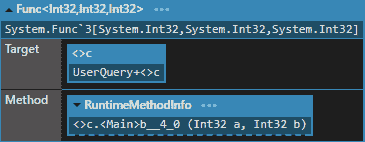
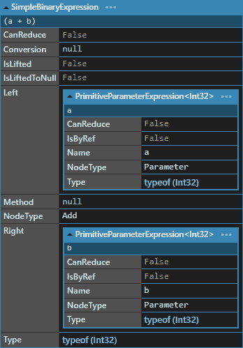
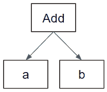
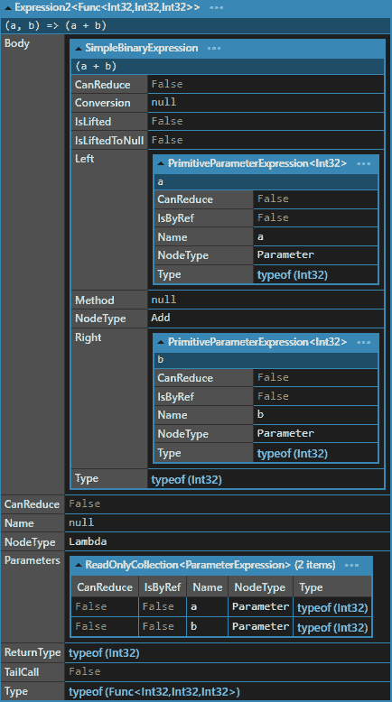
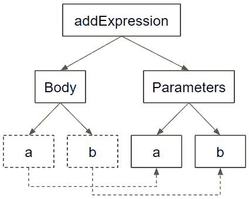
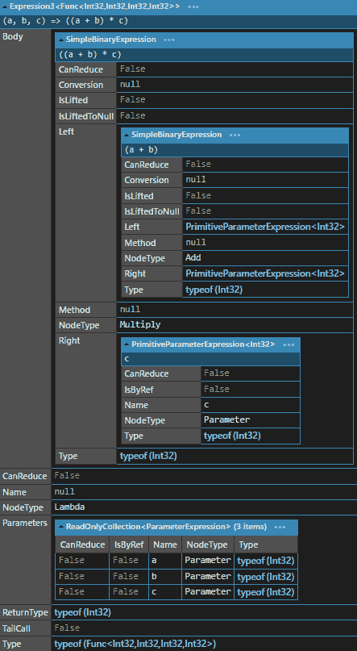
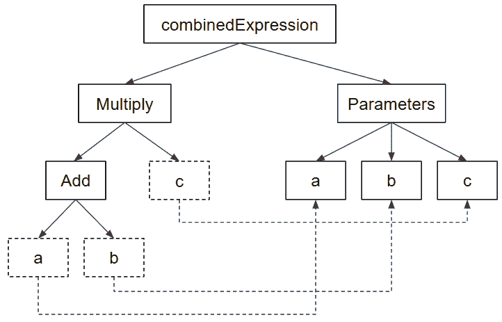

# 2

# 表达式和语句

欢迎来到我们旅程的第一个动手实践章节！在这一章中，我们将讨论表达式和语句、lambda 表达式和表达式树。这些是我们将要讨论的主题：

+   理解表达式和语句之间的区别

+   使用表达式编写清晰和声明性的代码

+   有效利用表达式成员、lambda 表达式、匿名方法和局部函数

+   使用表达式树在运行时操作表达式

在我们深入之前，我想告诉你我重视你的时间，所以大多数章节都会从评估任务开始。这些任务并不总是需要解决，目的是帮助你衡量你对这个主题现有理解的程度。如果你觉得这些任务很容易，你可能现在想跳过这一章。反之，如果你觉得这些任务相当具有挑战性，你可能想为这一章投入更多的时间和精力。在每个带有任务的章节结束时，你将找到解决方案部分来检查你的答案。现在你知道了情况，让我们检查为这一章设计的三个任务。

# 任务 1 – 命名并计算所有表达式和所有语句

在下面的代码片段中命名并计算所有表达式和所有语句：

```cs
Tower mainTower = new(position: new Vector2(5, 5));
for (int level = 1; level <= mainTower.MaxLevel; level++)
{
     double upgradeCost = 100 * Math.Pow(1.5, level - 1);
     Console.WriteLine($"Upgrading to level {level} costs {upgradeCost} gold");
     if (playerGold >= upgradeCost)
     {
                  mainTower.Upgrade();
                  playerGold -= upgradeCost;
     }
}
```

# 任务 2 – 使用表达式而不是语句

将以下代码重构为使用表达式而不是语句：

```cs
string GetTowerDamageReport(IEnumerable<Tower> towers)
{
      int totalDamage = 0;
      foreach (Tower tower in towers)
      {
           if (tower.IsActive)
           {
                totalDamage += tower.Damage;
           }
      }
      return $"Active towers deal {totalDamage} total damage";
}
```

# 任务 3 – 创建一个表达式树

创建一个表达式树，它是 lambda 表达式 `(baseDamage, level) => baseDamage * level`。然后编译并调用它。

如果你百分之百确定你知道所有三个任务的答案，那么你可以自信地跳过这一章。然而，你可能会错过一些有用的东西，所以与其完全跳过这一章，你可能会想把它留到以后。无论如何，如果你有任何问题，或者任何东西变得不清楚，你都可以随时回来阅读。

# 理解表达式和语句之间的区别

在其核心，C# 中的 **表达式** 只是一段代码，它评估为一个值。简单的表达式包括常量、变量和方法调用。另一方面，**语句** 是一个独立的代码单元，执行一个动作。本质上，它是一个可执行的指令。理解某物的最佳方式是通过实践。所以，我们不再拖延，通过例子来查看表达式和语句。

## 表达式的示例

考虑以下 C# 代码：

```cs
var pagesPerChapter = 20;
var totalBookPages = pagesPerChapter * 10;
```

在这个片段中，20、`pagesPerChapter`、`10` 和 `pagesPerChapter * 10` 都是表达式。这些代码片段中的每一个都会评估为一个值。

## 语句的示例

现在，让我们识别语句：

```cs
var pagesPerChapter = 20;
var totalBookPages = pagesPerChapter * 10;
```

在这里，`var pagesPerChapter = 20;` 和 `var totalBookPages = pagesPerChapter * 10;` 是语句。第一行指示程序声明一个 `pagesPerChapter` 变量并将其初始化为 20 的值。第二行指示程序将 `pagesPerChapter` 的值乘以 10 并保存到 `totalBookPages` 变量中。这两行都是独立的代码单元，执行动作，符合我们语句的定义。

## 表达式和语句之间的关键区别

虽然语句和表达式有时看起来很相似，但请记住，表达式产生一个值并且可以用在更大的表达式中。相比之下，语句执行一个动作，并作为方法或程序结构的一部分。

在 C#中，每个表达式都可以转换为语句，但并非每个语句都可以是表达式。例如，`x = y + 2` 是一个语句，其中 `y + 2` 是一个表达式。然而，一个 `for` 循环或一个 `if` 语句不能是表达式。

## 指导练习——在示例代码中找到表达式和语句

让我们锻炼一下你的知识。你能否在稍微复杂一点的代码片段中找到并计数所有表达式和语句？

```cs
int bookCount = 5;
for(int chapter = 1; chapter <= bookCount; chapter++)
{
     var wordCount = chapter * 1000;
     Console.WriteLine($"Chapter {chapter} contains {wordCount} words.");
}
```

在这里，我们有 8 个表达式和 4 个语句。具体来说：

+   `5`，`1`，`chapter`，`bookCount`，`chapter <= bookCount`，`chapter++`，`1000`，`chapter * 1000`，`chapter`，`wordCount` 和 `$"Chapter {chapter} contains {``wordCount} words."`

+   `int bookCount = 5;`，`for(int chapter = 1; chapter <= bookCount; chapter++)`，`var wordCount = chapter * 1000;` 和 `Console.WriteLine($"Chapter {chapter} contains {``wordCount} words.");`

理解表达式和语句之间的区别有助于你编写更好的、更清晰的代码。随着你继续学习 C#，你会习惯这些基础知识，并能够编写更好的软件。继续用这些知识探索，让我们继续探索函数式编程。

# 如何使用表达式编写清晰简单的代码

使用简短清晰的代码使其容易理解它在做什么。这也使得你和其他人以后更容易阅读。在 C#中使用表达式可以帮助我们做到这一点。让我们学习如何用表达式塑造我们的代码。

## 表达式的力量——提高可读性和可维护性

表达式支持不可变性的概念，这是函数式编程的基石。由于表达式会评估为一个值并且不会修改我们程序的状态，因此它们允许我们编写更少出错、更容易推理和简单测试的代码。

有一天，史蒂夫收到了他老朋友艾琳的电话，她是一位著名的儿童书作家。她开始注意到，标题较长的书籍似乎更受欢迎。为了测试她的理论，她收集了所有畅销书的标题，并要求史蒂夫开发一个程序来计算与流行度相关的平均标题长度。

初始时，史蒂夫以他习惯的方式创建了程序：

```cs
double averageLength = 0;
foreach (string title in bookTitles)
{
    int titleLength = title.Length;
    averageLength += titleLength;
}
averageLength /= bookTitles.Length;
```

然而，代码看起来很冗长，他决定练习函数式方法并重写代码。他将 `foreach` 循环替换为一个简单的 `Average` 表达式，该表达式计算平均字符数：

```cs
var averageLength = bookTitles.Average(title => title.Length);
```

几乎像魔法一样，所有这些计算都变成了单行代码。一行更函数式、更简洁的代码，使用表达式而不是语句。

## 将语句转换为表达式的技巧

在 C# 中拥抱函数式编程的一大步是将你的语句尽可能转换为表达式。正如我们刚才看到的，**LINQ**（代表 **Language INtegrated Query**）在这个转换中可以成为一个强大的工具。

在上一个示例中，我们使用了 LINQ 的 `Average` 方法。这些是针对任何 `IEnumerable<T>` 可用的扩展方法，允许我们通过简单、表达性强的代码在集合上执行复杂操作。

我们可以进一步利用其他 LINQ 方法，例如 `Where` 用于过滤，`OrderBy` 用于排序，以及 `Aggregate` 用于将集合缩减为单个值。

此外，即使没有 LINQ 方法，代码也可以转换为符合函数式方法的格式。例如，我们可以将 `if` 语句转换为条件运算符：

```cs
// If-else statement
string bookStatus;
if (pageCount > 300)
{
     bookStatus = "Long read";
}
else
{
     bookStatus = "Quick read";
}
// Conditional operator
string bookStatus = pageCount > 300 ? "Long read" : "Quick read";
```

此外，所有 `for`、`while`、`foreach` 等循环都可以用递归方法替换，运行时它们将是表达式。此外，我们可以使用 `Result` 类型而不是异常和高级函数，这些将在后面的章节中讨论。

## 指导练习 - 使用表达式重构代码

埃米莉向史蒂夫提出请求，希望他能帮助她创建一个程序，用于显示她 YouTube 视频的观看次数。然而，埃米莉的频道包含私有和公开的视频，她只对公开视频的观看次数感兴趣。

史蒂夫编写了一个程序，其中主要的计数方法看起来是这样的：

```cs
string GetPublicVideosViewsMessage(IEnumerable<Video> videos)
{
     int totalPublicViews = 0;
     foreach (Video video in videos)
     {
          if (video.IsPublic)
          {
               totalPublicViews += video.Views;
          }
     }
     return $"Public videos have {totalPublicViews} views";
}
```

然后，史蒂夫认为他应该利用这个机会提高使用函数式方法和表达式而不是语句的能力。因此，他使用表达式和 LINQ 方法对他的代码进行了修改，使代码更清晰、更简短。现在的新版本看起来是这样的：

```cs
string GetPublicVideosViewsMessage(IEnumerable<Video> videos)
{
     var totalPublicViews = videos
               .Where(v => v.IsPublic)
               .Sum(v => v.Views);
     return $"Public videos have {totalPublicViews} views";
}
```

这是我们的改变：

+   `if` 语句已被 `Where` 方法替换。此方法过滤掉不满足特定条件的元素 - 在这种情况下，`v.IsPublic` 为 `false` 的元素。

+   手动将每个视频的观看次数添加到 `totalPublicViews` 的循环已被 `Select` 方法替换。此方法将每个元素转换为另一个元素 - 在这种情况下，它将每个视频 (`v`) 转换为其观看次数 (`v.Views`)。

+   最后，`Sum` 方法将每个公开视频的观看次数相加，得到总数。

通过使用 LINQ 方法和表达式，生成的代码更清晰、更具声明性、更简洁。现在我们可以一眼看出代码的作用——计算所有公开视频的总观看次数——而不是它是如何做到的。这是 C# 中表达式的力量——它们允许编写更干净、更易于阅读的代码。

# Lambda 表达式、表达式成员和匿名方法

现代 C# 语法提供了一套强大的工具，可以优雅而简洁地表达复杂的功能。让我们更仔细地看看这些语言特性以及我们如何使用它们来使我们的代码更功能化、更易于阅读和维护。

## 什么是 lambda 表达式？

Lambda 表达式，由 `=>` 符号表示，是一种创建匿名函数的简洁方式。很可能，你在使用 LINQ 和类似的功能性编程结构时每天都在使用它们。

那么，让我们看看以下示例，其中我们定义一个 lambda 来平方一个数字：

```cs
Func<Book, int> getWordCount = book => book.PageCount * 250;
```

这定义了一个接受整数 `x` 并返回其平方的 lambda 表达式。然后我们可以这样使用这个函数：

```cs
int wordCount = getWordCount(book);
```

Lambda 表达式在参数类型和返回值方面提供了极大的灵活性。它们可以接受多个参数，返回复杂对象，甚至没有任何参数或返回值。

## Lambda 表达式中的多个参数

当然，C# 中的方法可以包含多个参数，lambda 表达式也是如此。在 LINQ 中，演示这一点的最简单方法之一是 `SelectMany`：

```cs
List<Publisher> publishers = GetPublishers();
List<Book> books = GetBooks();
var publisherBookPairs = publishers.SelectMany(
    publisher => books.Where(book => book.PublisherId == publisher.Id),
    (publisher, book) => new { PublisherName = publisher.Name, BookTitle = book.Title }
);
```

在这里，除了书籍集合和一个参数的 lambda 表达式 `publisher => books.Where(book => book.PublisherId == publisher.Id)` 之外，此方法还接受一个双参数的 lambda 表达式 `(publisher, book) => new { PublisherName = publisher.Name, BookTitle = book.Title }`。正如你所看到的，我们只需要添加括号就可以使用任意数量的变量。

## Lambda 表达式的演变

作为在线 C# 课程中的教师，我喜欢向我的学生展示 lambda 表达式的“演变”。首先你需要知道的是，这种表达式只是方法上的语法糖。让我们看看这个例子：

```cs
bool IsBookPopular(Book book)
{
     if (book.AverageRating > 4.5 && book.NumberOfReviews > 1000)
     {
          return true;
     }
     return false;
}
```

此方法计算一本书是否受欢迎，并以命令式方式（告诉如何做事情，而不是做什么）编写。为了使其更短，我们可以用 `return` 替换 `if`：

```cs
bool IsBookPopular(Book book)
{
     return book.AverageRating > 4.5 && book.NumberOfReviews > 1000;
}
```

为了让它更短，让我们使用表达式成员语法：

```cs
bool IsBookPopular(Book book) => book.AverageRating > 4.5 && book.NumberOfReviews > 1000;
```

如果我们尝试在 LINQ 的 `Where` 函数中使用相同的条件，它将看起来像这样：

```cs
books.Where(book => book.AverageRating > 4.5 && book.NumberOfReviews > 1000)
```

你看到相似之处了吗？这基本上是同一回事，因此我们可以将我们的函数用在 `Where` 方法中：

```cs
books.Where(book => IsBookPopular(book))
```

这里是另一个示例：

```cs
books.Where(IsBookPopular)
```

这是因为 `Where` 方法接受一个 `Func<T, bool>` 类型的参数，这基本上就是我们的 lambda 表达式。

现在让我告诉你，我们用来理解“lambda 表达式演变”的例子实际上并不是一个 lambda 表达式。Lambda 表达式是匿名方法的语法糖，我们在这里使用了表达式成员体。那么，让我们深入挖掘，了解这两个之间的区别。

## 理解匿名方法

正如其名所示，匿名方法是没有名称的方法。这种在它们被使用的地方直接编写无名称方法的能力，尤其是作为其他方法的参数，是函数式编程语言的一个重要特性。这里有一个有趣的事实：匿名方法是 C#中最古老的功能之一；它们是在 2.0 版本中引入的。

这里有一个简单的例子：

```cs
List<Video> videos = GetVideos();
videos.ForEach(delegate(Video video)
     {
         Console.WriteLine($"{video.Title}: {video.Views} views");
     });
```

在这个例子中，`delegate(Video video){...}`是一个匿名方法，正如你所见，它被直接用作`ForEach`方法的参数。

## 匿名方法是如何工作的？

匿名方法通过在编译时生成一个隐藏的方法来工作。编译器为该方法生成一个在 C#命名规则上下文中无效的唯一名称，确保不会与你的方法名称发生冲突。

## 何时使用匿名方法

当方法的逻辑不足以证明完整方法声明的合理性时，使用匿名方法特别合适。如果代码短小、易于理解，并且只在一个地方使用，匿名方法是一个不错的选择。

使用匿名方法的常见场景包括以下几种：

+   **使用 LINQ**：LINQ 大量依赖于委托和匿名方法，尤其是在过滤、排序或投影数据时

+   **事件处理**：在附加事件时，尤其是当事件处理代码简单时，可以使用匿名方法

+   **异步编程**：任务和线程经常使用匿名方法

## 实际示例 - 在实际代码中应用这些功能

另一天在街上，史蒂夫遇到了他的老朋友 Konstatos，他是一个小型游戏工作室的创始人，该工作室开发移动游戏。Konstatos 说他想分析一组他称之为“新鲸鱼”的玩家的行为。通常，在某个事物上花费比其他人多得多的人被称为“鲸鱼”。因此，他需要使用两个条件来获取这个子集的玩家：首先，他们必须在一年前或之后注册过游戏，其次，他们必须在此之后至少花费了 10,000 美元。

史蒂夫欣然同意，现在，在之前任务中大量练习之后，他想出了这个函数式解决方案：

```cs
List<string> GetWhales(IEnumerable<Player> players, DateTime date, decimal minSpend)
{
     return players
     .Where(p => p.JoinDate > date)
     .Where(p => p.Spend > minSpend)
     .Select(p => p.Nickname)
     .ToList();
}
```

注意，条件被分解为两个`Where`方法。你可以只用一个`Where`方法来完成：

```cs
List<string> GetWhales(IEnumerable<Player> players, DateTime date, decimal minSpend)
{
     return players
     .Where(p => p.JoinDate > date && p.Spend > minSpend)
     .Select(p => p.Nickname)
     .ToList();
}
```

然而，当`Where`方法内部包含两个条件时，认知负载更大，这也是为什么首选第一种方法的原因。此外，第一种方法在进一步修改代码时减少了对受影响行数的修改，更容易扩展（你只需在新行上添加新的`Where`方法），并且引起更少的合并冲突。

好的，既然我们已经看到了匿名方法，让我们看看表达式成员。

## 表达式成员

表达式成员是一种语法快捷方式，允许使用类似 lambda 的语法定义方法、属性和其他成员，其中成员体由`=>`运算符后的单个表达式定义。

考虑以下传统的计算版税的方法：

```cs
public int CalculateRoyalty(Book book)
{
    if(book.CopiesSold < 10000)
    {
        return book.CopiesSold * 0.2;
    }
    else
    {
        return book.CopiesSold * 0.3;
    }
}
```

现在，让我们将其转换为表达式成员：

```cs
public int CalculateRoyalty(Book book) =>
    book.CopiesSold < 10000
       ? book.CopiesSold * 2
       : book.CopiesSold * 3;
```

我们将方法简化为单行（一行编写的功能），简洁的行。这种简化的简洁性提高了可读性，特别是对于简单的方法和属性。重要的是要记住，代码使用表达式成员并不是必须的，才能被认为是函数式风格。在我的工作中，我坚持只存在单行表达式成员的规则。如果方法体开始包含两行或更多，使用常规语法编写方法会更好，这样可以减少合并冲突并提高可读性。

在下一节中，我们将探讨强大的表达式树概念，并揭示其在 C#中的实用性。但在那之前，花些时间吸收这些概念，看看您如何可以使用它们来编写更具有表现力和简洁的代码。

## 练习 – 实现 lambda 表达式和匿名方法

为了让你在函数式方法上更多练习，这里有一个挑战，要求使用表达式成员、lambda 表达式和匿名方法重构以下代码：

```cs
public bool IsVideoTrending(Video video)
{
     int viewThreshold = CalculateViewThreshold(video.UploadDate);
     return video.Views > viewThreshold;
}
private int CalculateViewThreshold(DateTime uploadDate)
{
     int daysOld = (DateTime.Now - uploadDate).Days;
     return 1000 * daysOld;
}
```

虽然这相当容易，但它可以帮助我们明确标准方法和 lambda 表达式之间的区别，使我们的代码更加函数式。

# 表达式树及其在运行时操作表达式的方法

表达式树在 C#中提供了一种独特的功能：能够将代码作为数据来处理，并在运行时对其进行操作。它们是 LINQ 功能的核心，允许我们使用相同的查询语法对内存对象和外部数据源进行查询。让我们探索这个迷人的特性。从高层次来看，表达式树是一种以树形格式表示某些代码的数据结构，其中每个节点都是一个表达式。表达式树由 lambda 表达式构建，允许您将 lambda 内的代码作为数据来检查。

为了说明这一点，考虑一个简单的 lambda 表达式：

```cs
Func<int, int, int> add = (a, b) => a + b;
```

现在，让我们将其重写为二元表达式：

```cs
ParameterExpression a = Expression.Parameter(typeof(int), "a");
ParameterExpression b = Expression.Parameter(typeof(int), "b");
ParameterExpression c = Expression.Parameter(typeof(int), "c");
BinaryExpression addExpression = Expression.Add(a, b);
```

代码中的差异可能并不显著，但让我们看看我们变量的内部表示。这是我们的`add`：



如您所见，它只有两个字段：`Target`，这是此方法所在的类，以及`Method`字段，包含方法信息。看起来并不多。现在，让我们看看`addExpression`：



如您所见，表达式具有`NodeType`为`Add`和两个部分：`Left`和`Right`。从视觉上看，它可以表示如下：



完全不吓人，对吧？如果是这样，让我们继续到表达式树。

## 构建和操作表达式树

手动构建表达式树可以更深入地理解其结构。让我们重新创建我们的加法表达式：

```cs
// Define parameters
ParameterExpression a = Expression.Parameter(typeof(int), "a");
ParameterExpression b = Expression.Parameter(typeof(int), "b");
// Define body
BinaryExpression body = Expression.Add(a, b);
// Combine them
Expression<Func<int, int, int>> addExpression = Expression.Lambda<Func<int, int, int>>(body, a, b);
```

这段代码创建了一个与之前相同的表达式树，但结构更清晰。lambda 由一个体 `(a + b)` 和一个参数列表 `(``a, b)` 组成：



现在，我们的表达式树有两个主要分支，`Body` 和 `Parameters`：



这看起来更像是树。然而，它里面只有一个操作，而真实的表达式树通常包含多个操作。让我们添加一个乘法操作：

```cs
// Define parameters
ParameterExpression a = Expression.Parameter(typeof(int), "a");
ParameterExpression b = Expression.Parameter(typeof(int), "b");
ParameterExpression c = Expression.Parameter(typeof(int), "c");
// Define bodies for addition and multiplication
BinaryExpression addBody = Expression.Add(a, b);
BinaryExpression multiplyBody = Expression.Multiply(addBody, c);
// Combine them
Expression<Func<int, int, int, int>> combinedExpression = Expression.Lambda<Func<int, int, int, int>>(multiplyBody, a, b, c);
```

这个例子更有趣，其内部表示更大：



这就是我们的修改后的视觉树看起来像什么：



希望你现在对表达式树的外观有了更好的理解。这将帮助我们前进到更复杂的例子。

## 创建和操作复杂表达式树

前几天，Irene 请求 Steve 和她的出版商见面。看起来出版商想要一个可以轻松过滤流行书籍的程序。Steve 高兴地同意了，并为他们的系统创建了一个高级过滤器作为表达式树。

过滤器检查一本书的标题是否包含特定的关键词，其页数是否超过特定的限制，以及其评分是否高于某个阈值。因此，表达式树有三个不同的表达式：

```cs
// Define parameters
ParameterExpression book = Expression.Parameter(typeof(Book), "book");
ParameterExpression keyword = Expression.Parameter(typeof(string), "keyword");
ParameterExpression minPages = Expression.Parameter(typeof(int), "minPages");
ParameterExpression minRating = Expression.Parameter(typeof(double), "minRating");
// Define body
MethodCallExpression titleContainsKeyword = Expression.Call(
    Expression.Property(book, nameof(Book.Title)),
    typeof(string).GetMethod("Contains", new[] { typeof(string) }),
    keyword
);
BinaryExpression pagesGreaterThanMinPages = Expression.GreaterThan(
    Expression.Property(book, nameof(Book.Pages)),
    minPages
);
BinaryExpression ratingGreaterThanMinRating = Expression.GreaterThan(
    Expression.Property(book, nameof(Book.Rating)),
    minRating
);
// Combine expressions with 'AND' logical operator
BinaryExpression andExpression = Expression.AndAlso(
    Expression.AndAlso(titleContainsKeyword, pagesGreaterThanMinPages),
    ratingGreaterThanMinRating
);
// Combine parameters and body into a lambda expression
Expression<Func<Book, string, int, double, bool>> filterExpression = Expression.Lambda<Func<Book, string, int, double, bool>>(
    andExpression,
    book, keyword, minPages, minRating
);
```

在他们的发布系统中，他们需要做的唯一一件事就是使用 `filterExpression` 创建一个用于过滤书籍的委托，并使用它：

```cs
var filter = filterExpression.Compile();
var popularBooks = books
    .Where(book => filter(book, keyword, minPages, minRating))
    .ToList();
```

表达式树的真正力量来自于它们在运行时可以被操作的能力。你可以动态地构建、修改，甚至编译和运行表达式树。这是运行时代码生成的一个强大工具，并为 LINQ 和 Entity Framework 等技术提供了基础。

## 使用表达式树查询数据 – LINQ 以及更多

LINQ 在底层使用表达式树来实现对不同类型数据的相同查询语法。当你对一个 `IQueryable<T>` 编写 LINQ 查询时，你实际上是在构建一个表达式树。然后，这个树被传递给查询提供者，它将其转换为适当的格式（例如，数据库的 SQL）。

这是一个 LINQ 查询的例子，它被 Entity Framework（一个在 C# 中与数据库交互的流行工具）转换为 SQL：

```cs
var youngCustomers = dbContext.Customers
    .Where(c => c.Age < 30)
    .Select(c => new { c.Name, c.Age });
```

当这个查询运行时，Entity Framework 会生成一个表达式树，将其转换为 SQL，发送到数据库，并将结果实体化回对象。

# 指导练习 – 构建和操作表达式树

为了帮助你更好地理解表达式树，让我们看看这个练习。我们的目标是创建一个表示 lambda 表达式`(x, y) => x * y`的表达式树。这代表一个乘法操作。之后，我们将编译并调用这个表达式，实际上执行两个数字的乘法。

让我们分解步骤：

1.  定义 lambda 表达式的参数。这些是`x`和`y`，它们都是`int`类型：

    ```cs
    ParameterExpression x = Expression.Parameter(typeof(int), "x");
    ParameterExpression y = Expression.Parameter(typeof(int), "y");
    ```

1.  构建 lambda 表达式的主体。这是`x *` `y`操作：

    ```cs
    BinaryExpression body = Expression.Multiply(x, y);
    ```

1.  现在，我们将参数和主体组合成一个 lambda 表达式：

    ```cs
    Expression<Func<int, int, int>> multiplyExpression = Expression.Lambda<Func<int, int, int>>(body, x, y);
    ```

1.  现在我们有了我们的表达式树，我们可以将其编译成一个委托：

    ```cs
    Func<int, int, int> multiply = multiplyExpression.Compile();
    ```

1.  使用两个数字调用代理：

    ```cs
    int result = multiply(6, 7); // This returns 42
    ```

太棒了！我们已经成功创建了一个表示 lambda 表达式的表达式树，编译并调用了它。这是理解 C#中的表达式树如何允许我们使用代码作为数据，开启强大、动态编程可能性的基本步骤。

用不同的 lambda 表达式不断练习这些步骤。掌握表达式树让你能够充分利用 C#的潜力，赋予你诸如动态代码生成和操作、高级查询能力等能力。继续努力，你做得很好！

# 问题集和练习

在阅读了关于表达式和语句、lambda 表达式和表达式树的内容后，Steve 给 Julia 写了一封电子邮件，询问获得更多实践经验的最佳方法。Julia 祝贺 Steve 并发送了一个包含五点的列表，据她理解，每个试图学习这个主题的人都应该做：

1.  `IEnumerable<T>`和一个表达式树形式的谓词，并返回过滤后的结果。使用它根据字符串的长度过滤字符串列表。

1.  **重构一个类**，将其传统方法版本转换为使用表达式成员的版本。比较这两个版本。

1.  **编写一个应用程序**，该程序在运行时接受一个数学表达式作为字符串，将其转换为表达式树，并对其进行评估。该应用程序应支持加法、减法、乘法和除法等操作。

1.  **设计一个迷你查询语言**用于内存中对象的查询。这种语言应支持基本操作，如过滤和排序。使用表达式树来实现它。

1.  **代码审查一个项目**。在 GitHub 上找到一个使用 C#的开源项目，并检查代码以确定这些功能（表达式成员、lambda 表达式和匿名方法）的使用位置。分析它们如何有助于代码的可读性和可维护性。

# 练习

在本节中，你将帮助 Steve 以函数式编程的方式开发并重构他的塔防游戏。

## 练习 1

在下面的代码片段中命名并计算所有表达式和所有语句：

```cs
Tower mainTower = new(position: new Vector2(5, 5));
for (int level = 1; level <= mainTower.MaxLevel; level++)
{
     double upgradeCost = 100 * Math.Pow(1.5, level - 1);
     Console.WriteLine($"Upgrading to level {level} costs {upgradeCost} gold");
     if (playerGold >= upgradeCost)
     {
                  mainTower.Upgrade();
                  playerGold -= upgradeCost;
     }
}
```

## 练习 2

将下面的代码重构为使用表达式而不是语句

```cs
string GetTowerDamageReport(IEnumerable<Tower> towers)
{
      int totalDamage = 0;
      foreach (Tower tower in towers)
      {
           if (tower.IsActive)
           {
                totalDamage += tower.Damage;
           }
      }
      return $"Active towers deal {totalDamage} total damage";
}
```

## 练习 3

创建一个表示 lambda 表达式 `(x, y) => x * y` 的表达式树，然后编译并调用它来乘以两个数字。

# 解答

## 练习 1

```cs
Tower mainTower = new(position: new Vector2(5, 5));
for (int level = 1; level <= mainTower.MaxLevel; level++)
{
     double upgradeCost = 100 * Math.Pow(1.5, level - 1);
     Console.WriteLine($"Upgrading to level {level} costs {upgradeCost} gold");
     if (playerGold >= upgradeCost)
     {
                  mainTower.Upgrade();
                  playerGold -= upgradeCost;
     }
}
```

表达式:

+   `new` `Vector2(5, 5)`

+   `5 (x-coordinate)`

+   `5 (y-coordinate)`

+   `new(position: new` `Vector2(5, 5))`

+   `1`

+   `level`

+   `mainTower.MaxLevel`

+   `level <=` `mainTower.MaxLevel`

+   `level++`

+   `100`

+   `1.5`

+   `1`

+   `level - 1`

+   `Math.Pow(1.5, level -` `1)`

+   `100 * Math.Pow(1.5, level -` `1)`

+   `level (in` `string interpolation)`

+   `upgradeCost (in` `string interpolation)`

+   `$"Upgrading to level {level} costs {``upgradeCost} gold"`

+   `playerGold`

+   `upgradeCost`

+   `playerGold >=` `upgradeCost`

+   `upgradeCost (``in subtraction)`

语句：

+   `Tower mainTower = new(position: new` `Vector2(5, 5));`

+   `for (int level = 1; level <=` `mainTower.MaxLevel; level++)`

+   `double upgradeCost = 100 * Math.Pow(1.5, level -` `1);`

+   `Console.WriteLine($"Upgrading to level {level} costs {``upgradeCost} gold");`

+   `if (playerGold >=` `upgradeCost)`

+   `mainTower.Upgrade();`

+   `playerGold -=` `upgradeCost;`

总计：22 个表达式和 7 个语句

## 练习 2

```cs
string GetTowerDamageReport(IEnumerable<Tower> towers) =>
     $"Active towers deal {towers.Where(t => t.IsActive).Sum(t => t.Damage)} total damage";
```

这个重构版本使用 LINQ 表达式来过滤活动塔并计算它们的伤害总和，一行完成，消除了显式循环和条件语句的需求。

## 练习 3

```cs
ParameterExpression baseDamage = Expression.Parameter(typeof(int), "baseDamage");
ParameterExpression level = Expression.Parameter(typeof(int), "level");
BinaryExpression multiply = Expression.Multiply(baseDamage, level);
Expression<Func<int, int, int>> damageCalc = Expression.Lambda<Func<int, int, int>>(multiply, baseDamage, level);
// Compile the expression
Func<int, int, int> calculateDamage = damageCalc.Compile();
// Calculate tower damage
int towerDamage = calculateDamage(10, 5);
Console.WriteLine($"Tower damage: {towerDamage}");
```

这个解决方案创建了一个表示 `(baseDamage, level) => baseDamage * level` 的表达式树，将其编译成函数，然后调用该函数来根据塔的基础伤害（10）和等级（5）计算塔的伤害。

# 摘要

在本章中，我们深入探讨了 C# 中的函数式编程，重点关注表达式和语句，以及 C# 提供的强大工具来提升你的代码。让我们总结一下关键要点：

+   我们学习了表达式和语句之间的区别。函数式编程通常更喜欢表达式，因为它们的风格简单直接。

+   我们研究了表达式成员，它们提供了一种更短、更干净的方式来编写方法和属性。

+   我们研究了 lambda 表达式和匿名方法。两者都有助于编写清晰、简洁和紧凑的代码。

+   我们简要介绍了表达式树，这是 C# 中的一个特殊功能，允许我们处理类似代码的数据。这对于 LINQ 中的数据查询等非常有用。

在整个过程中，我们的目标是理解不仅如何使用这些工具，还要了解为什么以及何时它们是有帮助的。

接下来，我们将学习纯函数，一个方法为什么是“纯”的，以及副作用意味着什么。
