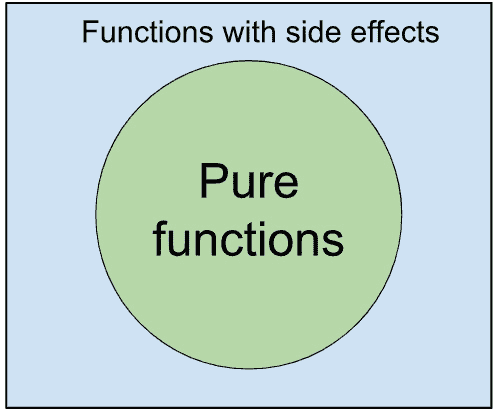

# 纯函数和副作用

欢迎来到*第三章*！在这里，我们将深入探讨 C#中纯函数的世界。这一章全部关于帮助你理解纯函数的概念、它们的实际应用以及如何在代码中有效地使用它们。

这里是一个快速概述，让你了解可以期待什么：

+   理解纯函数

+   副作用

+   最小化副作用的方法

+   使用`Pure`属性标记纯函数

在你浏览内容的过程中，注意可操作见解和基于数据的推荐。以学习的热情来阅读这一章；到结束时，你将有一个坚实的基础来编写高效且干净的 C#程序。

正如我在上一章中建议的，我建议你检查你的知识水平，看看以下三个任务。如果你对如何解决它们有任何疑问，最好是现在就阅读这一章。如果你百分之百确信你可以闭着眼睛解决它们，那么现在先处理不太熟悉的话题可能更有益。让我们直接进入正题！

# 任务 1 – 重构为纯函数

史蒂夫的塔防游戏根据全局难度修改器计算伤害。重构这个函数以使其成为纯函数：

```cs
public double _difficultyModifier = 1.0;
public double CalculateDamage(Tower tower, Enemy enemy)
{
     return tower.BaseDamage * enemy.DamageMultiplier * _difficultyModifier;
}
```

# 任务 2 – 隔离副作用

游戏从文件中加载敌人数据，处理它，并更新游戏状态。重构这个函数以隔离其副作用：

```cs
public void LoadAndProcessEnemyData(string filePath)
{
     string jsonData = File.ReadAllText(filePath);
     List<Enemy> enemies = JsonConvert.DeserializeObject<List<Enemy>>(jsonData);
     foreach (var enemy in enemies)
     {
                  enemy.Health *= GameState.DifficultyLevel;
                  GameState.ActiveEnemies.Add(enemy);
     }
     Console.WriteLine($"Loaded {enemies.Count} enemies");
}
```

# 任务 3 – 使用`Pure`属性

通过将其改为纯函数并标记为`Pure`属性来重构以下方法：

```cs
public string GenerateEnemyCode(string enemyType, int level)
{
     var code = enemyType.Substring(0, 3) + level.ToString();
     return new string(code.OrderBy(c => c).ToArray());
}
```

如果这些任务很容易，你可能想先阅读一些你不太熟悉的话题。如果你有任何问题或不确定正确答案，不用担心——接下来，我们将深入探讨纯函数和副作用的概念，同时使用上一章中的角色——朱莉娅和史蒂夫。

一周后，朱莉娅给史蒂夫打电话说，如果他想要继续学习函数式编程，他需要理解纯函数和副作用的逻辑。

朱莉娅：*纯函数是没有可观察副作用且具有确定输出值的函数——换句话说，没有在函数给定作用域之外发生的动作。这使得它们可预测且易于测试，同时也是高效软件开发的关键属性。在 C#代码中，我们通过使用不可变性和诸如`readonly`、`const`和`static`等关键字来实现这一点。此外，还有一个特殊的属性用于标记*纯函数*。*

史蒂夫：*哇！这一切都非常令人兴奋，但我什么都不懂。你能给我一些关于它的阅读材料吗？*

朱莉娅给了他文章，史蒂夫开始阅读。

# 理解纯函数

纯函数在函数式编程中非常重要。它们有两个主要特性：

+   **确定性输出**：对于任何给定的输入，纯净函数总是会生成相同的输出，这使得其行为极其可预测。这一特性简化了测试和调试的过程，因为给定相同的输入集，函数的输出始终是一致的。

+   **无可见的副作用**：纯净函数不会影响或被外部状态影响。这意味着它不会修改任何外部变量或数据结构，甚至不会执行 I/O 操作。函数的唯一效果是它执行的计算和它提供的输出。

这两个特性使得纯净函数类似于数学函数。一个数学函数，*f(x) = y*，产生一个结果，*y*，它仅依赖于输入，*x*，并且不会被函数外部的东西所改变或影响。在编程中，纯净函数可以被看作是一个自包含的单元，它将输入转换为输出，而不受外部世界的干扰。

通过遵循这些特性，纯净函数有助于创建更健壮、可维护且更不易出错的代码。让我们进一步探讨这些优点和纯净函数的实际应用案例。

## 纯函数的示例

考虑一个确定需要打印多少本书才能达到目标数量的函数：

```cs
public static int BooksNeededToReachTarget(int currentPrintCount, int targetPrintCount)
{
    return targetPrintCount - currentPrintCount;
}
```

这个函数总是以相同的输入给出相同的结果，并且不会改变它之外的东西。

另一个例子可以是过滤出特定类型的书籍：

```cs
public static List<string> GetTitlesOfGenre(List<Book> books, string genre)
{
    return books.Where(b => b.Genre == genre).Select(b => b.Title).ToList();
}
```

这个函数也是纯净的。如果你给它相同的书籍列表，它总是会返回相同的标题列表。

## 纯函数的优点

纯函数提供几个显著的优势：

+   **可预测性和易于测试**：由于它们的确定性，纯净函数高度可预测，这使得编写单元测试变得容易。对于特定的输入，你总是知道预期的输出，而且不需要模拟或设置外部依赖项进行测试。

+   **代码重用性和模块化**：当纯净函数按照单一职责原则设计，专注于特定任务时，它们变得高度可重用。由于它们不依赖于外部状态，你可以移动这些函数，而不用担心破坏代码或增强其模块化。

+   **易于调试和维护**：没有共享状态或副作用，调试纯净函数非常简单。如果有问题，通常在函数内部，这使得它容易发现和修复。纯净函数的隔离也促进了维护和更新，因为你可以更改一个函数，而不会影响代码的其他部分。

## 纯函数与非纯函数的比较

当分析纯函数和非纯函数时，每个函数的优缺点都变得明显。为了说明这一点，让我们以 Konstatos 的塔防手机游戏为例。在这款游戏中，不同的单位根据对每种塔的防御能力，从塔楼受到不同数量的伤害。每个单位类可以有一个包含这些伤害变化的字典：

```cs
private static Dictionary<TowerType, double> _damageModifiers = new Dictionary<TowerType, double>
{
    {TowerType.Cannon, 0.8},  // Takes 20% less damage from cannon towers
    {TowerType.Laser, 0.9}   // Takes 10% less damage from laser towers
};
```

为了确定塔对单位造成的伤害，单位类有一个看起来像这样的函数：

```cs
public double CalculateDamageFromTower(Tower tower)
{
    return tower.BaseDamage * _damageModifiers[tower.Type];
}
```

起初，你可能会认为这个函数是纯的。但因为它使用了可能会改变的后缀 `_damageModifiers` 变量，所以输出也可能改变，即使输入保持不变。这意味着函数依赖于它之外的东西，这对纯函数来说并不好。这可能导致错误，并使测试和修复问题变得更加困难。

这是我们如何使函数变得纯的方法：

```cs
public double CalculateDamageFromTower(Tower tower, Dictionary<TowerType, double> damageModifiers)
{
    return tower.BaseDamage * damageModifiers[tower.Type];
}
```

现在，通过直接将 `damageModifiers` 传递给函数，它不依赖于它之外的东西。这意味着如果你给它相同的输入，你总是会得到相同的输出。

你可能会想知道当函数本身已经可以看到它时，将字典传递给函数是否有意义。这是一个合理的观点。但这样做意味着函数不会秘密依赖于其参数之外的东西，这使得我们的代码更干净，更容易处理。

理解这两种函数之间的区别，并优先使用纯函数可以提高代码的质量。随着你更深入地学习 C# 中的函数式编程，这种理解将非常有价值。接下来，我们将讨论函数式编程中的副作用。

# 副作用

在开发他的塔防游戏时，Steve 注意到了一些意外的行为。单位从塔楼受到的伤害不一致。经过一番调查，他意识到伤害计算函数依赖于一个可能会不可预测地改变的全球变量——这是一个典型的副作用。

编程中的副作用指的是在执行函数之外发生的任何应用程序状态变化。这些变化可能包括修改全局或静态变量、改变函数参数的原始值、执行 I/O 操作，甚至抛出异常。副作用使函数的行为依赖于上下文，降低了可预测性，并可能增加错误。

## 常见副作用来源

在编写代码时，了解副作用可能来自哪里是很好的。副作用会使代码变得不可预测。让我们分析一些常见的来源。

### 全局变量

问题：使用全局变量可能导致意外的变化。如果一个函数改变了全局变量，它可能会影响程序的其他部分：

```cs
public static Dictionary<string, int> UserScores = new Dictionary<string, int>();
public static int UpdateUserScore(string userName, int scoreToAdd)
{
    if (UserScores.ContainsKey(userName))
    {
        UserScores[userName] += scoreToAdd;
    }
    else
    {
        UserScores[userName] = scoreToAdd;
    }
    return UserScores[userName];
}
```

`UpdateUserScore` 改变了 `UserScores` 字典。由于这个字典可以在任何地方访问，其他函数也可能改变它。这使得我们的函数变得不可预测。

解决方案：与全局变量相比，最好使用函数参数或将状态放在对象内部。例如，在这里，正如我们之前所做的那样，将字典作为参数传递以消除问题更好。

### `out`和`ref`参数

问题：在 C#中使用`out`和`ref`可以改变传递给函数的原始数据：

```cs
public static void UpgradeTower(ref Tower tower, int level)
{
    tower = new Tower();
    tower.Damage = level * 10;
    tower.Hitpoints = level * 150;
}
```

`UpgradeTower`方法不仅更新了`Damage`和`Hitpoints`值，而且还改变了引用，使其不再指向原始的`Tower`对象。当然，在现实生活中几乎不可能看到这样的代码；通常，它并不那么直接，而是隐藏在其他方法中。这段代码是一个简化且有些丑陋的真实代码版本，以展示使用`ref`参数背后的理念。

解决方案：而不是改变数据，返回一个新的值是一个好主意。在这里，我们可以将方法重命名为`GetLeveledUpTower`并使其返回一个新的塔。

### I/O 操作

问题：像保存到文件或数据库这样的操作会改变函数之外的数据：

```cs
public void SaveGameProgressToFile(string progressData, string filePath)
{
    File.WriteAllText(filePath, progressData);
}
```

`SaveGameProgressToFile`函数将游戏进度数据保存到文件。如果，例如，磁盘空间不足，这种动作可能会失败。因此，它是一个副作用，因为它依赖于我们函数之外的东西。

解决方案：将逻辑与像保存数据这样的动作分开是有帮助的。这使得代码更清晰，更容易理解。

### 异常处理

问题：考虑一个计算塔造成的伤害的函数：

```cs
public static double CalculateDamage(Tower tower, Unit unit)
{
    if (tower == null || unit == null)
    {
        throw new ArgumentException("The tower or unit is null.");
    }
    return tower.Damage * unit.DefenseModifier;
}
```

`CalculateDamage`函数如果塔或单位是`null`，则会抛出异常。抛出异常会改变我们程序的正常流程。如果没有处理，它可能会终止应用程序或导致意外行为。

解决方案：在这里，最好的做法是使用`Either`单子。然而，在我们讨论它之前，你可以使用一个名为`double?`的可空类型：

```cs
public static double? CalculateDamage(Tower tower, Unit unit)
{
    if (tower == null || unit == null)
    {
        return null;
    }
    return  tower.Damage * unit.DefenseModifier;
}
```

使用这个`CalculateDamage`方法，如果塔或单位是`null`，则方法返回`null`；否则，它计算伤害并返回。这样，我们避免了在常见场景中通过异常中断流程的副作用。然而，使用此方法的代码也必须修改，以便它可以处理返回`null`的情况。

了解异常可以是副作用的一个来源，有助于做出使我们的 C#代码更清晰和更可预测的设计选择。

## 副作用的后果

代码中存在副作用可能会导致各种问题：

+   **可预测性降低**：具有副作用的函数的可预测性较低，因为它们的输出可能会根据外部状态而改变。这种可预测性的降低使得仅通过查看函数本身更难理解其功能。

+   **测试和调试难度增加**：具有副作用的功能更难测试，因为它们需要正确的外部状态来产生预期的结果。调试也更加复杂，因为函数中的问题可能是由于外部状态的变化。

+   **并发问题**：当多个线程同时访问和修改共享状态时，可能会出现并发问题，导致意外结果。

虽然这看起来可能并不立即有问题，但随着时间的推移，这些后果往往会累积，使得你的项目开发和维护成本非常高。

# 减少副作用的方法

虽然现实世界中的应用程序中的副作用不可避免，但关键是要控制和隔离它们，以便使代码更易于管理和预测。本节重点介绍通过在 C# 中使用 `readonly`、`const`、`static` 和不可变性来最小化副作用的方法。

## 优先考虑不可变性

不变性是减少副作用的一种强大方式。不可变对象是在创建后其状态不能被改变的对象。在 C# 中，字符串就是一个不可变性的典型例子。对字符串的每一次操作都会产生一个新的字符串，而原始字符串保持不变。这个原则可以扩展到其他数据类型：

```cs
     Book originalBook = new Book("The Clean Coder", "Uncle Bob");
    /* Create a new book instance with the same title but a different author */
    Book updatedBook = originalBook with { Author = "Robert C. Martin" };
    // We can see that both copies exist
    Console.WriteLine(originalBook);
    Console.WriteLine(updatedBook);
```

在这个代码片段中，`originalBook` 被创建为一个具有特定标题和作者的 `Book` 实例，而 `updatedBook` 是使用 `with` 表达式创建的新 `Book` 实例。`with` 表达式用于创建一个新的记录，其某些属性是从现有记录修改而来的。在这里，它创建了一个新的 `Book` 值，其 `Title` 值与 `originalBook` 相同，但 `Author` 被设置为 `"Robert C. Martin"`。

这种方法保持了不可变性，因为 `originalBook` 保持不变，任何“修改”都会导致一个新的实例。

## 使用 `readonly` 和 `const`

`readonly` 和 `const` 是 C# 中的两个关键字，可以使字段和变量不可变，从而减少副作用的可能性。

`const` 变量是隐式静态的，应该在值的编译时已知且永远不会改变时使用：

```cs
public const string PublishingHouseName = "Progressive Publishers";
```

另一方面，`readonly` 变量可以是实例级别的或静态的，它们的值可以在运行时设置（例如，在构造函数内部），但之后不能更改：

```cs
public readonly string Isbn = GenerateIsbn();
```

## 使用函数式编程原则

函数式编程原则旨在帮助最小化副作用。除了纯函数和不可变性之外，如表达式代替语句、使用高阶函数和函数组合等原则也可以帮助实现这一目标。虽然我们已经熟悉了前者，但高阶函数和函数组合将在后面的章节中讨论。所以，让我们继续前进——应用这些原则可以大大提高代码的可预测性和可维护性。

## 封装副作用

当副作用不可避免时，隔离它们至关重要。例如，如果一个函数必须写入文件，那么这应该是它的唯一责任。所有其他逻辑应尽可能分离到纯函数中。这样，副作用就被包含在内，而其余的代码不受影响：



这里的想法是隔离副作用，使它们可预测、可见和管理。

最小化副作用策略对于构建可靠、高效和可维护的软件至关重要。通过实施这些策略，我们逐渐接近函数式编程范式，利用其优势和好处。

接下来，我们将讨论如何使用`Pure`属性来标记纯函数。

# 使用`Pure`属性标记纯函数

理解纯函数和副作用在我们代码中的作用对于在 C#中进行有效的函数式编程至关重要。但我们是怎样传达一个函数应该是纯的意图的呢？这就是`Pure`属性发挥作用的地方。

## 理解 C#中的 Pure 属性

在 C#中，`Pure`属性定义在`System.Diagnostics.Contracts`命名空间中，并作为声明性标签来指示一个方法是纯的。一个纯方法是指，给定相同的输入，它将始终返回相同的输出，并且不会产生任何可观察的副作用。

重要的是要注意，`Pure`属性主要用于在代码合约和静态检查工具中使用。运行时和编译器不强制执行方法的纯度，并且这个属性不会以任何方式改变方法的行为：

```cs
[Pure]
public static decimal CalculateRoyalty(decimal bookPrice, decimal royaltyPercent)
{
    return bookPrice * royaltyPercent / 100;
}
```

在这个例子中，我们有一个函数，它根据书籍的价格和版税百分比计算版税金额。它是一个纯函数，因为它总是对相同的输入返回相同的输出，并且没有可观察的副作用。

## 标记函数为纯的益处

使用`Pure`属性标记函数带来了一些好处：

+   **清晰性和意图**：通过将函数标记为纯的，你向其他开发者传达了你的意图，即这个函数应该保持无副作用。

+   `Pure`属性帮助识别代码中的潜在问题

+   **优化机会**：虽然 C#编译器目前没有利用这一点，但在某些语言和场景中，知道一个函数是纯的可以启用额外的编译器优化。

## 使用纯属性时的注意事项

当标记函数为纯时，请记住以下几点：

+   `Pure`属性不强制执行纯度。你可以将方法标记为纯的，它仍然可以有副作用。这个属性更多的是一种通信和分析工具。

+   `Pure`属性不能与 void 方法一起使用。

+   `Pure`属性对方法的运行时行为没有影响。它主要被某些静态分析工具使用，例如代码合约。

通过将函数标记为`Pure`属性，你对自己的函数行为做出了承诺，帮助他人（和工具）更好地理解你的代码。然而，记住属性只是一个工具，而不是万能的。确保函数纯度的责任仍然主要在于开发者。

# 练习

为了测试史蒂夫的理解，朱莉娅向他提出了三个与纯函数和副作用相关的编码挑战。“这些练习将有助于巩固这些概念，”她解释道。“试一试，如果有什么问题，请告诉我。”

## 练习 1

史蒂夫的塔防游戏根据全局难度修改器计算伤害。重构此函数以使其成为纯函数：

```cs
public static double difficultyModifier = 1.0;
public double CalculateDamage(Tower tower, Enemy enemy)
{
     return tower.BaseDamage * enemy.DamageMultiplier * difficultyModifier;
}
```

## 练习 2

史蒂夫的游戏从文件中加载敌人数据，处理它，并更新游戏状态。重构此函数以隔离其副作用：

```cs
public void LoadAndProcessEnemyData(string filePath)
{
     string jsonData = File.ReadAllText(filePath);
     List<Enemy> enemies = JsonConvert.DeserializeObject<List<Enemy>>(jsonData);
     foreach (var enemy in enemies)
     {
                  enemy.Health *= GameState.DifficultyLevel;
                  GameState.ActiveEnemies.Add(enemy);
     }
     Console.WriteLine($"Loaded {enemies.Count} enemies");
}
```

## 练习 3

通过将其转换为纯函数并标记为`Pure`属性来重构以下方法：

```cs
public string GenerateEnemyCode(string enemyType, int level)
{
     var code = enemyType.Substring(0, 3) + level.ToString();
     return new string(code.OrderBy(c => c).ToArray());
}
```

这些练习应该有助于巩固我们对所涵盖概念的理解。继续练习，继续实验，并记住——你写的每一行代码都是你在掌握 C#函数式编程旅程上迈出的一步。

# 解答

这里是本章练习的解答。

## 练习 1

一个纯函数不应该依赖于或修改其作用域之外的状态。因此，我们不应该依赖于全局的`difficultyModifier`值，而应该将其作为参数传递：

```cs
[Pure]
public double CalculateDamage(Tower tower, Enemy enemy, double difficultyModifier)
{
     return tower.BaseDamage * enemy.DamageMultiplier * difficultyModifier;
}
```

## 练习 2

为了隔离副作用，我们将纯逻辑与 I/O 操作和状态变更分开：

```cs
public interface IFileReader
{
     string ReadAllText(string filePath);
}
public interface IEnemyRepository
{
     void AddEnemies(IEnumerable<Enemy> enemies);
}
public interface ILogger
{
     void Log(string message);
}
public class EnemyProcessor
{
     private readonly IFileReader _fileReader;
     private readonly IEnemyRepository _enemyRepository;
     private readonly ILogger _logger;
     public EnemyProcessor(IFileReader fileReader, IEnemyRepository enemyRepository, ILogger logger)
     {
              _fileReader = fileReader;
              _enemyRepository = enemyRepository;
              _logger = logger;
     }
     public void LoadAndProcessEnemyData(string filePath, double difficultyLevel)
     {
              string jsonData = _fileReader.ReadAllText(filePath);
              List<Enemy> enemies = DeserializeEnemies(jsonData);
              List<Enemy> processedEnemies = AdjustEnemyHealth(enemies, difficultyLevel);
              _enemyRepository.AddEnemies(processedEnemies);
              _logger.Log($"Loaded {processedEnemies.Count} enemies");
     }
     [Pure]
     private List<Enemy> DeserializeEnemies(string jsonData)
     {
         return JsonConvert.DeserializeObject<List<Enemy>>(jsonData);
     }
     [Pure]
     private List<Enemy> AdjustEnemyHealth(List<Enemy> enemies, double difficultyLevel)
     {
              return enemies.Select(e => new Enemy
              {
                       Health = e.Health * difficultyLevel,
                  // Copy other properties...
              }).ToList();
     }
}
```

## 练习 3

这个有点棘手，因为函数已经是纯函数了。我们只需要添加`Pure`属性来向其他开发者和分析工具传达这种意图：

```cs
[Pure]
public string GenerateEnemyCode(string enemyType, int level)
{
     var code = enemyType.Substring(0, 3) + level.ToString();
     return new string(code.OrderBy(c => c).ToArray());
}
```

这些解答遵循函数式编程的原则，确保最小化副作用并使代码行为清晰。

因此，让我们来谈谈使用纯函数和最小化副作用的一些应该做和不应该做的事情。

这些是应该做的事情：

+   努力编写更多的纯函数，因为它们是可预测的，易于理解和测试

+   隔离副作用——也就是说，将它们与纯代码分开

+   使用`readonly`、`const`和`static`修饰符来提高不可变性并减少副作用

+   使用`Pure`属性来传达意图，有助于代码分析和维护

这些是不应该做的事情：

+   过度使用全局状态，因为它会导致高耦合并增加副作用的风险。

+   在函数内部修改输入。这种改变可能导致意外行为。

+   忘记`Pure`属性并不强制执行纯度。它是对开发者需要履行的承诺。

+   忽略上下文。有时，一个非纯函数可以提供更好的解决方案。

# 概述

深入 C#函数式编程的世界是一次令人兴奋的旅程，而我们才刚刚开始。在本章中，我们探讨了纯函数和副作用的关键概念以及它们在编写更干净、更可预测和可维护的代码中的相应角色。让我们巩固我们所学的知识，并规划未来的课程。

纯函数在软件这个不可预测的宇宙中像一座灯塔一样屹立着。它们有一个明确的契约——相同的输入总是产生相同的输出，并且它们不涉及它们作用域之外的状态。这种简单性使它们可预测、易于测试，并且更易于并行化和优化。

然而，现实世界充满了副作用——读写数据库、调用 API、修改全局变量——这个列表可以一直继续下去。副作用是不可避免的，但如果没有得到控制，它们可能会引发混乱，使得代码难以推理和测试。为了在函数式编程中减轻这个问题，我们必须用不纯的代码包裹纯函数，从而保护它们免受副作用的影响。

在下一章中，我们将讨论一种新的函数类型——诚实函数。我们将讨论它们是什么，如何在 C#中使用它们，以及可空引用可能带来的危险。
