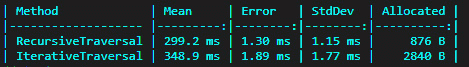

# 8

# 递归和尾调用

在本章中，我们将探讨递归的概念，这对于解决具有固有层次或重复结构的难题特别有效，例如目录遍历、解析嵌套数据格式或实现树形数据结构的算法。

随着我们深入递归，我们将探讨其两个主要组成部分：基本情况（base case）和递归情况（recursive case）。基本情况充当递归的停止信号，防止无限循环，而递归情况是函数向基本情况迈进的地方。除了这些情况之外，我们还将讨论以下主题：

+   递归类型：简单递归和尾递归

+   递归的挑战：栈溢出风险和性能考虑

+   C# 的递归特性：局部函数和模式匹配

+   高级递归模式：相互递归和记忆化

+   与迭代解决方案的比较：可读性和性能

+   异步编程中的递归：异步递归

像往常一样，我们从一个自我评估开始，以衡量你对递归当前的理解。以下任务旨在测试你对我们将要涵盖的概念的掌握。如果你发现这些任务具有挑战性，那么这一章将是非常有价值的资源。另一方面，如果你轻松地解决了这些任务，你仍然可以发现递归的新见解和应用，或者继续阅读下一章。

# 任务 1 – 递归敌人计数

史蒂夫的游戏具有敌人波次的层次结构，其中每个波次可以包含单个敌人和子波次。实现一个递归函数 `CountAllEnemies`，该函数遍历 `Wave` 对象（可以包含 `Enemy` 对象和 `Wave` 对象），并返回在该波次及其所有子波次（飞行、装甲、快速等）中找到的敌人总数：

```cs
public interface IWaveContent {}
public class Enemy : IWaveContent
{
    public string Name { get; set; }
}
public class Wave : IWaveContent
{
    public List<IWaveContent> Contents { get; set; } = new();
}
// Implement this method
int CountAllEnemies(Wave wave)
{
    // Your recursive logic here
}
```

使用包含混合 `Enemy` 对象和 `Wave` 对象的 `Wave` 测试你的方法，以确保它准确计算所有敌人，包括嵌套子波中的敌人。

# 任务 2 – 波次生成

使用与任务 1 相同的波次结构，史蒂夫希望在游戏进行过程中生成越来越复杂的波次。实现一个递归函数 `GenerateWave`，该函数根据当前级别数量创建具有嵌套敌人子波次的 `Wave` 对象。

```cs
public interface IWaveContent {}
public class Enemy : IWaveContent
{
     public string Name { get; set; }
     public EnemyType Type { get; set; }
}
public class Wave : IWaveContent
{
     public List<IWaveContent> Contents { get; set; } = new();
}
public enum EnemyType
{
     Normal,
     Flying,
     Armored,
     Boss
}
// Implement this method
Wave GenerateWave(int levelNumber)
{
     // Your recursive logic here
}
```

此函数应随着级别数量的增加创建更复杂的波形结构。请考虑以下指南：

+   每 5 个级别增加一个子波次。

+   每个波次或子波次中的敌人数量应随着级别数量的增加而增加。

+   随着级别的提升，引入更多样化的敌人类型。

每 10 个级别应包括一个 Boss 敌人。

使用不同的级别数量测试你的方法，以确保它生成适当的波形结构。

示例用法：

```cs
int currentLevel = 15;
Wave generatedWave = GenerateWave(currentLevel);
// Use the CountAllEnemies function from Task 1 to verify the total number of enemies
int totalEnemies = CountAllEnemies(generatedWave);
Console.WriteLine($"Level {currentLevel} wave contains {totalEnemies} total enemies");
// You can also implement a function to print the wave structure for verification
PrintWaveStructure(generatedWave);
```

# 任务 3 – 异步更新敌人状态

更新敌人的统计数据（如健康、速度或伤害）可能需要异步进行，特别是如果它涉及到从游戏服务器获取或同步信息。实现一个`UpdateAllEnemyStatsAsync`方法，该方法递归地遍历波次层次结构（包含敌人和子波次）并异步更新每个敌人的统计数据。

为了这个练习，使用`UpdateStatsAsync(Enemy enemy)`方法模拟异步更新操作，该方法返回`Task`。你的递归函数应在移动到下一个敌人之前等待每个统计数据更新的完成：

```cs
class Enemy
{
    public string Name { get; set; }
    // Assume other stat properties like Health, Speed, Damage
}
class Wave
{
    public List<object> Contents { get; set; } = new();
}
// Simulated asynchronous update method
async Task UpdateStatsAsync(Enemy enemy)
{
    // Simulate an asynchronous operation with a delay
    await Task.Delay(100); // Simulated delay
    Console.WriteLine($"Updated stats for enemy: {enemy.Name}");
}
// Implement this recursive async method
async Task UpdateAllEnemyStatsAsync(Wave wave)
{
    // Your recursive logic here
}
```

当你处理这些任务时，注意你如何将每个问题分解成更小的部分，以及你如何识别每个场景的基本情况和递归情况。这种初步的自我评估不仅会为你准备前面的概念，还会提供一个实际的应用背景。现在，让我们深入探讨递归。 

# 介绍递归

随着史蒂夫继续开发他的塔防游戏，他发现自己难以处理复杂的嵌套结构敌波。他打电话给朱莉娅，希望她可能有一些见解。

朱莉娅：*听起来你正在处理层次化的数据结构。你考虑过* *使用递归吗？*

史蒂夫：*递归？这不是函数调用自身吗？这对我来说一直有点令人困惑* *。*

朱莉娅：*没错，但它是一个处理嵌套结构的强大工具。让我们看看它如何帮助你* *的游戏。*

递归是一种编程技术，其中函数调用自身来解决问题。这就像将任务分解成相同类型的小任务。这种方法对于具有重复结构的任务非常有用，例如导航文件夹和文件、处理如树这样的数据结构或进行遵循模式的计算。

在递归中，有两个主要部分：基本情况和对递归情况。基本情况阻止递归无限进行。这是函数不再调用自身的地方。递归情况是函数调用自身，但使用原始问题的简化版本。

让我们将递归应用于一个实际例子。想象一下，我们需要计算一系列嵌套播放列表中视频的总观看次数，其中播放列表可以包含视频和其他播放列表。

我们可以这样编写一个递归函数来解决这个问题：

```cs
class Video : IContent
{
   public int Views {get; set;}
   // Other properties like title, duration, etc.
}
class Playlist : IContent
{
   public List<IContent> Contents; // Can contain both Videos and Playlists
}
int CountViews(IContent item)
{
   if (item is Video video)
   {
      // Base case: If the item is a video, return its view count.
      return video.Views;
   }
   if (item is Playlist playlist)
   {
      // Recursive case: If the item is a playlist, sum up the views of all contents.
      int totalViews = 0;
      foreach (var content in playlist.Contents)
      {
         totalViews += CountViews(content); // Recursively count views
      }
      return totalViews;
   }
   // In case the item is neither a Video nor a Playlist
   throw new ArgumentException($"Unsupported content type {item.GetType().Name}");
}
```

在这段代码中，`CountViews`是一个递归函数，它可以处理视频和播放列表。如果它遇到视频，它返回观看次数（基本情况）。如果它遇到播放列表，它遍历播放列表中的每个项目，并调用自身来计算观看次数，将所有观看次数加起来得到总数（递归情况）。

对于这类问题，递归非常强大，因为它简化了代码并使其更易于阅读，尤其是在处理嵌套或层次化数据时。然而，始终要有明确的基准情况，以防止函数无限期地调用自身。

# 递归思维

当管理复杂的视频层次结构，如将它们分类到类别和子类别中时，递归思维可以简化这个过程。递归思维意味着将一个大问题分解成相同问题的较小版本，直到它变得容易解决。

让我们以组织视频类别和子类别的树状结构为例。目标是遍历每个类别，访问其所有子类别，并组织每个类别中的视频。这项任务听起来很复杂，但递归通过一次处理一个类别（及其子类别）来简化了任务。

你可能会这样编写一个递归函数来完成这个任务：

```cs
class Category
{
    public List<Category> Subcategories;
    public List<Video> Videos;
    // Other properties like name, etc.
}
void OrganizeVideos(Category category)
{
    // First, go through each subcategory
    foreach (var subcategory in category.Subcategories)
    {
        OrganizeVideos(subcategory); // Recursive call to organize subcategories
    }
    // Now, organize the current category's videos
    // You can add sorting, filtering, or other logic here
    Console.WriteLine($"Organizing videos in category: {category.Name}");
}
```

在此代码中，`OrganizeVideos` 是一个递归函数。它查看一个类别，并为每个子类别调用自身，深入到层次结构的更深处。这是递归情况。在访问完所有子类别后，它然后在当前类别中组织视频。这就是你放置排序或组织逻辑的地方，但现在我们保持简单，使用一个 `print` 语句。

递归思维的美丽之处在于它如何简化对复杂层次结构的管理。你只需一次处理一个级别的视频组织，递归会为你处理层次结构的深度。就像之前的例子一样，有一个清晰的基准情况（在这种情况下，到达没有子类别的类别）可以确保递归不会无限期地进行。

现在，让我们看看一个示例，展示递归思维在解析嵌套 JSON 数据中的强大功能。考虑一个场景，我们需要处理表示图书出版系统目录的 JSON 字符串，并将其转换为相应的对象层次结构。这个例子将展示递归如何简化导航和构建复杂数据结构的任务。

假设我们有一个表示图书目录的 JSON 字符串，其中包含嵌套的流派和子流派：

```cs
{
  "catalog": {
    "name": "Book Catalog",
    "genres": [
      {
        "name": "Fiction",
        "subgenres": [
          {
            "name": "Mystery",
            "books": [
              {
                "title": "The Hound of the Baskervilles",
                "author": "Arthur Conan Doyle",
                «isbn": "9780141032435"
              },
              {
                "title": "Gone Girl",
                "author": "Gillian Flynn",
                «isbn": "9780307588371"
              }
            ]
          },
          {
            "name": "Science Fiction",
            "books": [
              {
                "title": "Dune",
                "author": "Frank Herbert",
                «isbn": "9780441013593"
              }
            ],
            "subgenres": [
              {
                "name": "Dystopian",
                "books": [
                  {
                    "title": "1984",
                    "author": "George Orwell",
                    «isbn": "9780451524935"
                  }
                ]
              }
            ]
          }
        ]
      },
      {
        "name": "Non-Fiction",
        "books": [
          {
            "title": "Sapiens: A Brief History of Humankind",
            "author": "Yuval Noah Harari",
            «isbn": "9780062316097"
          }
        ]
      }
    ]
  }
}
```

为了解析这个 JSON 字符串并创建相应的对象层次结构，我们定义了以下类：

```cs
class Catalog
{
    public string Name { get; set; }
    public List<Genre> Genres { get; set; }
}
class Genre
{
    public string Name { get; set; }
    public List<Book> Books { get; set; }
    public List<Genre> Subgenres { get; set; }
}
class Book
{
    public string Title { get; set; }
    public string Author { get; set; }
    public string ISBN { get; set; }
}
```

现在，让我们实现递归函数来解析 JSON 字符串并构建对象层次结构：

```cs
Catalog ParseCatalog(JsonElement json)
{
    Catalog catalog = new Catalog();
    catalog.Name = json.GetProperty("catalog").GetProperty("name").GetString();
    catalog.Genres = new List<Genre>();
    foreach (JsonElement genreJson in json.GetProperty("catalog").GetProperty("genres").EnumerateArray())
    {
        Genre genre = ParseGenre(genreJson);
        catalog.Genres.Add(genre);
    }
    return catalog;
}
Genre ParseGenre(JsonElement json)
{
    Genre genre = new Genre();
    genre.Name = json.GetProperty("name").GetString();
    genre.Books = new List<Book>();
    genre.Subgenres = new List<Genre>();
    if (json.TryGetProperty("books", out JsonElement booksJson))
    {
        foreach (JsonElement bookJson in booksJson.EnumerateArray())
        {
            Book book = ParseBook(bookJson);
            genre.Books.Add(book);
        }
    }
    if (json.TryGetProperty("subgenres", out JsonElement subgenresJson))
    {
        foreach (JsonElement subgenreJson in subgenresJson.EnumerateArray())
        {
            Genre subgenre = ParseGenre(subgenreJson);
            genre.Subgenres.Add(subgenre);
        }
    }
    return genre;
}
Book ParseBook(JsonElement json)
{
    Book book = new Book();
    book.Title = json.GetProperty("title").GetString();
    book.Author = json.GetProperty("author").GetString();
    book.ISBN = json.GetProperty("isbn").GetString();
    return book;
}
```

`ParseCatalog` 函数作为入口点，递归地为目录中的每个流派调用 `ParseGenre`。`ParseGenre` 然后，递归地为每个子流派调用自身，并为流派或子流派中的每本书调用 `ParseBook`。

使用递归，我们可以有效地导航 JSON 字符串的嵌套结构，处理在父元素（目录和类别）上下文中子元素（流派、子流派和书籍）的解析。与需要显式管理多层嵌套和检查子流派和书籍存在性的迭代解决方案相比，这种方法的结果代码更干净、更易于维护。

# 递归的类型

根据递归调用方式和其在函数中的位置，递归可以分为两种主要类型：简单递归和尾递归。

## 简单递归

简单递归发生在函数直接调用自身时。这种类型是最常见且最容易理解的。让我们用它来计算视频类别和子类别层次结构中的总视频数量：

```cs
class Category
{
    public List<Category> Subcategories;
    public List<Video> Videos;
    // Constructor and other members
}
int CountTotalVideos(Category category)
{
    // Start with the current category's videos
    int count = category.Videos.Count;
    foreach (var subcategory in category.Subcategories)
    {
       // Add counts from subcategories
        count += CountTotalVideos(subcategory);
    }
    return count; // Return the total count
}
```

在此代码中，`CountTotalVideos` 函数计算给定类别中的所有视频，包括其子类别中的视频。它首先计算当前类别中的视频数量。然后，它遍历每个子类别，对每个子类别调用自身，并将它们的视频计数添加到总数中。

## 尾递归

尾递归是递归的一个特殊情况，其中递归调用是函数中的最后一个操作。它很重要，因为许多编译器会优化它以避免增加调用栈，这使得函数更高效，并防止栈溢出错误。

让我们来看一个例子，我们将视频类别树扁平化为一个包含视频的单列表。这个任务可以从尾递归优化中受益。

首先，我们需要对我们的方法进行轻微的修改，以允许尾递归。而不是直接返回结果，我们传递一个累加器——一个收集结果的容器：

```cs
void FlattenCategories(Category category, List<Video> accumulator)
{
    accumulator.AddRange(category.Videos); // Add current category's videos to the accumulator
    foreach (var subcategory in category.Subcategories)
    {
        FlattenCategories(subcategory, accumulator); // Recursive call with the same accumulator
    }
}
```

要使用此函数，您可以从一个空列表开始，并将其传递进去：

```cs
List<Video> allVideos = new();
FlattenCategories(rootCategory, allVideos);
// Now, allVideos contains all videos from all categories and subcategories
```

此函数是尾递归的，因为它的最后一个操作是递归调用（或添加到累加器，这并不改变递归的本质）。然而，值得注意的是，并非所有编程语言或编译器都会自动优化尾递归。例如，在.NET 中，尾调用优化由 CLR 决定，并且可能并不总是应用。尽管如此，编写尾递归函数对于效率和清晰度来说是一种良好的实践，尤其是在支持优化的语言和环境中。

# 递归的挑战

在编程中使用递归时，通常会遇到两个主要挑战：栈溢出的风险和性能考虑。让我们通过我们的角色深入探讨这些挑战。

当 Steve 开始在游戏中实现递归函数时，他遇到了一些问题。

Steve：*Julia，当我有很多嵌套层时，我遇到了栈溢出错误。这是* *怎么回事* *？

Julia：*啊，你已经发现了递归的一个挑战。让我们来谈谈栈溢出的风险以及如何* *缓解它* *。

## 栈溢出风险

栈溢出发生在调用栈中存储的信息过多——这是跟踪每个函数在其执行中位置的内存部分。如果递归函数调用自己太多次而没有达到基本情况，就会发生这种情况。

例如，当计算所有类别和子类别的视频总数时，如果层次结构非常深或存在循环引用（某个类别以某种方式包含了自己），`CountVideos` 函数可能会无限期地调用自己：

```cs
int CountVideos(Category category)
{
    // Start with the count of videos in the current category
    int count = category.Videos.Count;
    foreach (var subcategory in category.Subcategories)
    {
        count += CountVideos(subcategory); // Recursive call
    }
    return count;
}
```

如果分类结构非常深，这可能会导致成千上万的嵌套调用，每个调用都会向调用栈添加一个帧，从而可能引发栈溢出错误。

## 默认栈大小和限制

在使用递归时，了解默认栈大小带来的限制至关重要。栈是用于存储方法调用、局部变量和其他信息的内存区域。每次递归调用都会向栈添加一个新的帧，消耗一部分可用的栈空间。如果递归深度变得过大，可能会耗尽栈，导致栈溢出异常。

在 .NET 中，默认栈大小根据架构的不同而有所不同：

+   32 位：1 MB

+   64 位：4 MB

重要的是要注意，这些默认大小可能会变化，并且可能根据特定的运行时环境和配置而有所不同。

为了了解栈大小对递归的影响，让我们以先前的 `CountVideos` 函数为例。如果分类层次结构非常深，对 `CountVideos` 的递归调用会迅速消耗可用的栈空间。例如，如果栈大小为 1 MB，并且假设平均栈帧大小为 32 字节（为了简化），最大递归深度大约为 32,000（1 MB / 32 字节）。超过这个深度将导致栈溢出异常。

为了减轻栈溢出的风险，您可以采用几种技术：

+   **尾递归优化**（**TCO**）：如果您的递归函数是尾递归的，编译器可能会优化它以避免向栈添加新的帧。然而，在 .NET 中，TCO 并不保证，并且取决于运行时的决定。

+   **迭代替代方案**：使用循环和数据结构（如栈或队列）将递归算法转换为迭代算法。与递归算法相比，迭代解决方案通常具有更小的栈占用。

+   通过 `System.Threading.Thread.MaxStackSize` 属性或配置运行时环境。

+   **限制递归深度**：在您的递归函数中实现最大深度限制，以防止过度递归。这可以通过传递一个深度计数器作为参数，并检查预定义的限制来完成。

下面是 `CountVideos` 函数中限制递归深度的示例：

```cs
int CountVideos(Category category, int depth, int maxDepth)
{
    if (depth > maxDepth)
    {
        // Recursion depth limit exceeded
        throw new StackOverflowException("Maximum recursion depth exceeded");
    }
    int count = category.Videos.Count;
    foreach (var subcategory in category.Subcategories)
    {
        count += CountVideos(subcategory, depth + 1, maxDepth);
    }
    return count;
}
```

在这个修改后的版本中，`CountVideos`函数增加了额外的参数：`depth`用于跟踪当前递归深度，`maxDepth`用于指定允许的最大深度。如果`depth`超过`maxDepth`，则会抛出`StackOverflowException`以防止进一步的递归。

## 性能考虑

递归有时可能不如迭代解决方案高效，尤其是在不优化递归调用的语言和环境中。主要原因包括多次函数调用的开销以及在非尾递归情况下，维护调用栈所需的额外内存。

再次强调，在最佳情况下，智能编译器可以优化它以避免栈溢出，并使其运行得像循环一样高效。然而，并非所有环境都支持这种优化，并且没有这种优化，尾递归在性能上并不比简单递归有优势。

为了减轻深度递归导致栈溢出的风险，有时可以将递归函数重构为使用迭代方法，或者确保递归有一个保证终止的条件。在性能方面，通常是在递归的可读性和优雅性与迭代的效率之间权衡。在某些情况下，使用迭代算法可能是一个更实际的选择，尤其是在处理非常大的数据集或在未优化尾递归的环境中。

# 利用 C# 功能进行递归

C# 提供了几个功能，可以使编写递归函数更容易，代码更简洁。其中两个功能是局部函数和模式匹配。

## 局部函数

局部函数允许你在另一个函数体内定义函数。这在需要将所有逻辑封装在单个方法中，并保持递归部分独立以提高清晰性和可维护性时特别有用。

下面是一个示例，展示了如何使用局部函数递归处理视频类别并计数视频：

```cs
void ProcessAndCountVideosInCategory(Category category)
{
    int videoCount = 0;
    // Local function for recursion
    void CountVideos(Category cat)
    {
        foreach (var subcategory in cat.Subcategories)
      {
            CountVideos(subcategory); // Recursive call
        }
        videoCount += cat.Videos.Count;
    }
    CountVideos(category); // Start the recursion with the top-level category
    Console.WriteLine($"Total videos: {videoCount}");
}
```

在这个例子中，`CountVideos`是一个在`ProcessAndCount VideosInCategory`中定义的局部函数。它用于遍历视频类别的层次结构，计算所有子类别中的视频数量。总数保存在`videoCount`变量中，由于 C#的闭包功能，局部函数可以访问这个变量。

## 模式匹配

模式匹配通过允许你更简单地检查类型和条件，使得处理复杂数据变得更容易。它在需要处理不同类型或场景的递归函数中特别有用。

让我们看看模式匹配如何简化我们处理视频类别的函数：

```cs
void ProcessVideoCategory(Category category)
{
    switch (category)
    {
        case Category c when c.HasSubcategories:
            foreach (var subcategory in c.Subcategories)
            {
                ProcessVideoCategory(subcategory); // Recursive call
            }
            break;
        // Additional cases for other types or specific conditions
    }
}
```

在这个例子中，使用模式匹配来检查`category`是否有子类别。如果有，函数会递归地处理每个子类别。这种方法使代码更易于阅读，并消除了需要多个`if`语句或类型检查的需求。

本地函数和模式匹配都是强大的工具，尤其是在处理递归时。它们不仅使您的递归逻辑更易于理解，而且使您的代码更有组织性和简洁性。

# 高级递归模式

在更复杂的场景中，可以通过相互递归和缓存等技术将递归进一步扩展。这些高级模式可以优化性能并管理需要在不同操作之间交替的任务。

## 相互递归

当两个或更多函数在循环中相互调用时，发生相互递归。这种模式在您有一个需要在不同类型任务之间切换的问题时特别有用。想象一个场景，其中一个函数组织视频元数据，另一个验证它。每个函数都将其作为其过程的一部分调用另一个函数。

在书籍创建过程中，书籍通常在被视为出版就绪之前经历细致的编辑和审查周期。这个过程本质上是一个迭代过程，依赖于每个阶段的检查，非常适合相互递归模型。在这里，我们探讨了一个场景，即书籍的手稿在内容和格式方面都进行了编辑，每个过程都可能揭示需要对另一个过程进行进一步修改的需求。

考虑这样一个系统，在稿件内容（如叙事结构、人物发展等）初步编辑后，它必须格式化以满足出版标准（包括字体一致性、页边距设置和页眉/页脚内容）。然而，格式化过程可能会引入或揭示需要重新编辑的内容问题，说明了这些阶段之间的动态相互依赖性。

这里是一个概念性的实现：

```cs
class Manuscript
{
    public string Title { get; set; }
    public bool ContentEdited { get; set; }
    public bool FormatEdited { get; set; }
    public List<string> ContentIssues { get; set; }
    public List<string> FormatIssues { get; set; }
    public Manuscript(string title)
    {
        Title = title;
        ContentEdited = false;
        FormatEdited = false;
        ContentIssues = new();
        FormatIssues = new();
    }
}
class PublishingWorkflow
{
    public void EditContent(Manuscript manuscript)
    {
        Console.WriteLine($"Editing content for: {manuscript.Title}");
        // Simulate content editing and issue detection
        manuscript.ContentEdited = true;
        manuscript.ContentIssues.Clear(); // Assume content issues are resolved
        // Check for formatting issues
        manuscript.FormatIssues.Add("Inconsistent chapter titles");
        // Check if formatting needs review due to content edits
        if (manuscript.FormatIssues.Any())
        {
            EditFormat(manuscript);
        }
    }
    public void EditFormat(Manuscript manuscript)
    {
        Console.WriteLine($"Editing format for: {manuscript.Title}");
        // Simulate format editing
        manuscript.FormatEdited = true;
        manuscript.FormatIssues.Clear(); // Assume format issues are resolved
        // Formatting might reveal content issues or areas for improvement
        manuscript.ContentIssues.Add("Chapter 3 exceeds length limit");
        // Loop back to content editing if new issues are identified
        if (manuscript.ContentIssues.Any())
        {
            EditContent(manuscript);
        }
    }
}
```

在这个例子中，`PublishingWorkflow` 类包含两个相互递归的函数：`EditContent` 和 `EditFormat`。`EditContent` 处理叙事和文本的修正，而 `EditFormat` 确保稿件符合出版商的格式标准。一个阶段发现的问题可能导致回到另一个阶段，反映了为出版准备稿件的现实世界的复杂性。

这种相互递归有效地捕捉了书籍编辑和格式化的循环性质，确保内容质量和展示标准都不会受损。它突出了稿件经历的迭代改进过程，体现了内容编辑和格式化专家之间的协作努力，以实现出版就绪的书籍。通过这个模型，出版工作流程被优化以实现彻底性和质量，确保读者收到精心制作且专业呈现的书籍。

## 缓存

记忆化是一种通过缓存昂贵函数调用的结果并在相同的输入再次出现时重用这些结果来加速递归函数的技术。这可以显著减少重复使用相同参数调用的函数的计算时间，例如计算类别观看统计。

让我们探讨如何将记忆化应用于优化计算斐波那契数的递归函数——这是一个常见的场景，它说明了记忆化在递归算法中的强大作用：

```cs
public class FibonacciCalculator
{
    private Dictionary<int, long> memo = new();
    public long Calculate(int n)
    {
        // Base cases
        if (n == 0) return 0;
        if (n == 1) return 1;
        // Check if the result is already in the cache
        if (memo.ContainsKey(n))
        {
            return memo[n];
        }
        // Recursively calculate the nth Fibonacci number
        long result = Calculate(n - 1) + Calculate(n - 2);
        // Cache the result before returning
        memo[n] = result;
        return result;
    }
}
```

在这个实现中，`FibonacciCalculator` 类使用字典来缓存斐波那契计算的成果。当调用 `Calculate` 方法时，在执行计算之前，它会检查给定 `n` 的结果是否已经被缓存。如果是，则立即返回缓存的结果，避免进一步的递归调用。如果不是，它将进行递归计算，并在返回结果之前将其缓存。

这种计算斐波那契数的记忆化方法比没有记忆化的简单递归解决方案要高效得多。没有缓存的情况下，递归计算第 `n` 个斐波那契数的时间复杂度是指数级的（具体为 `O(2^n)`），这是因为重复计算相同的值。换句话说，每次对 `Calculate(n)` 的调用都会导致两个额外的调用：`Calculate(n-1)` 和 `Calculate(n-2)`，每个都类似地分支。唯一的例外是基例，当 `n = 0` 或 `n = 1` 时。有了记忆化，复杂度降低到线性（`O(n)`），因为每个独特的斐波那契数直到 `n` 都只计算一次。

为了说明记忆化对递归函数调用效率的影响，让我们分析计算斐波那契数 `n = 13`、`n = 29` 和 `n = 79` 的具体案例，比较在有和没有记忆化时所需的函数调用次数。

对于 `n = 13`，总的函数调用次数将是 `F(13)` + `F(12)` + `F(11)` + `...` + `F(1)` + `F(0)`，这遵循斐波那契数列本身，导致我们得到 753 次调用。然而，如果我们使用记忆化，函数调用次数将只有 25。

对于 `n = 29`，我们必须调用我们的函数 1,664,079 次。另一方面，记忆化方法只需要 57 次调用。

最后，对于 `n = 79`，函数调用的次数会呈天文数字般增长，使得在这里计算确切的数字变得不切实际。它的数量级是万亿级别的。对于记忆化解决方案，只需要 157 次调用就足够了。

这种分析展示了记忆化在提升性能方面的强大作用，以及在使递归解决方案适用于复杂问题中的关键作用。通过利用记忆化，开发者可以在不承担额外计算成本的情况下使用递归。

总结来说，相互递归和记忆化是强大的技术，可以使你的递归解决方案更高效和强大。相互递归允许在相关任务之间优雅地交替，而记忆化通过避免重复计算来优化性能。

# 与迭代解决方案的比较

当管理视频播放列表或类似层次数据结构时，递归和迭代方法都有其适用之处。选择它们通常取决于可读性和性能考虑。让我们探讨这两种方法在视频管理系统中的比较。

## 可读性

递归自然适合可以将问题分解为更小、相似问题的场景。例如，使用递归遍历视频播放列表和子播放列表是直观理解的：

```cs
void TraversePlaylist(Playlist playlist)
{
    foreach (var item in playlist.Items)
    {
        switch (item)
        {
            case Video video:
                Console.WriteLine($"Video: {video.Title}");
                break;
            case Playlist subPlaylist:
                TraversePlaylist(subPlaylist); // Recursive call
                break;
        }
    }
}
```

这个递归函数清晰且反映了播放列表的层次结构。它易于阅读和理解，尤其是对于那些熟悉递归的人来说。

迭代解决方案，使用循环和数据结构如栈或队列，可以管理相同的任务，但通常需要更多的设置。播放列表遍历的迭代版本可能不那么直观：

```cs
void TraversePlaylistIteratively(Playlist playlist)
{
    Stack<Playlist> stack = new();
    stack.Push(playlist);
    while (stack.Count > 0)
    {
        Playlist current = stack.Pop();
        foreach (var item in current.Items)
        {
            switch (item)
            {
                case Video video:
                    Console.WriteLine($"Video: {video.Title}");
                    break;
                case Playlist subPlaylist:
                    stack.Push(subPlaylist); // Mimicking recursion
                    break;
            }
        }
    }
}
```

虽然有效，但迭代解决方案比递归方法更冗长，其逻辑不如递归方法直接。使用栈来模拟递归的调用栈也增加了复杂性。

## 性能

递归和迭代方法的性能特征可能因具体问题和实现而异。让我们检查包含 10 级子播放列表的视频播放列表的基准结果，每级有 10 个子播放列表：



这些结果提供了有趣的见解：

+   递归方法大约快 14%，平均执行时间为 299.2 毫秒，而迭代方法的平均执行时间为 348.9 毫秒。

+   递归方法在性能上略有较少的变化，误差和标准差值较小。

+   与常见的假设相反，递归方法分配的内存（876 字节）比迭代方法（2840 字节）少，后者多出三倍以上。

这些发现挑战了传统观念，即迭代解决方案总是更有效：

+   **速度**: 递归方法优于迭代方法，可能是因为编译器的优化或遍历任务的特定性质。

+   **内存使用**: 意想不到的是，递归方法使用的内存显著更少。这可能是由于高效的尾调用优化或其他编译器对递归调用的优化。

+   **一致性**: 递归方法在运行中的性能略更一致，这从较低的标准差中可以看出。

重要的是要注意，这些结果仅适用于这个特定的实现和数据集。可能影响结果的因素包括：

+   播放列表结构的深度和广度

+   遍历过程中执行的具体操作

+   编译器的优化能力

运行时环境

总结来说，虽然传统智慧通常出于性能原因倾向于迭代方法，但我们的基准测试表明，对于某些层次结构，递归方法可能更有效。这强调了实证测试的重要性，而不是仅仅依赖一般原则。在递归和迭代之间进行选择时，不仅要考虑代码的可读性和问题结构，还要进行针对你特定用例的性能测试。

# 异步编程中的递归

异步编程已成为开发响应式应用程序的基石，尤其是在处理 I/O 密集型操作，如网络请求时。当你将递归与异步编程结合使用时，你可以高效地处理诸如从外部 API 获取和处理数据或跨网络管理视频内容等复杂任务。

异步递归允许你在不阻塞主线程的情况下执行递归操作，确保你的应用程序保持响应。例如，当从外部 API 获取视频数据，其中视频被组织成可能包含子类别的类别时，你可以递归地处理每个类别及其子类别，而不会冻结 UI。

下面是如何编写一个异步递归函数来处理视频的示例：

```cs
async Task ProcessVideosAsync(Category category)
{
    foreach (var subcategory in category.Subcategories)
    {
        await ProcessVideosAsync(subcategory); // Recursive call
    }
    // Asynchronous processing of current category videos
    foreach (var video in category.Videos)
    {
        await ProcessVideoAsync(video);
    }
}
```

在这个示例中，`ProcessVideosAsync`通过对自己进行递归调用处理每个子类别，确保覆盖了类别层次结构的所有级别。然后，它异步地处理当前类别中的每个视频。`await`的使用确保在移动到下一个操作之前，每个操作都是完整的，从而保持了操作顺序，而没有阻塞。

## 深入解释异步递归的工作原理

要了解异步递归在底层是如何工作的，让我们深入了解.NET 中的异步编程模型，并探讨状态机的使用以及与`ThreadPool`的交互。

在.NET 中，异步方法是通过状态机实现的。当调用异步方法时，编译器生成一个状态机来跟踪方法的执行状态。方法中的每个`await`表达式都标记了一个方法可以暂停的点，允许在等待的操作完成时执行其他工作。

当进行异步递归调用时，为每个递归调用创建一个状态机。状态机由.NET 运行时管理，它协调它们的执行和恢复。

下面是`ProcessVideosAsync`方法的状态机可能的一个简化表示：

```cs
class ProcessVideosAsyncStateMachine
{
   // State machine fields
   Category category;
   IEnumerator<Category> subcategoryEnumerator;
   IEnumerator<Video> videoEnumerator;
   TaskAwaiter<Task> recursiveCallAwaiter;
   TaskAwaiter<Task> processVideoAwaiter;
   int state;
   // MoveNext method
   void MoveNext()
   {
      switch (state)
      {
         case 0:
            subcategoryEnumerator = category.Subcategories.GetEnumerator();
            state = 1;
            goto case 1;
         case 1:
            if (subcategoryEnumerator.MoveNext())
            {
               var subcategory = subcategoryEnumerator.Current;
               recursiveCallAwaiter = ProcessVideosAsync(subcategory).GetAwaiter();
               if (!recursiveCallAwaiter.IsCompleted)
               {
                  state = 2;
                  recursiveCallAwaiter.OnCompleted(MoveNext);
                  return;
               }
            }
            else
            {
               state = 3;
               goto case 3;
            }
         case 2:
            recursiveCallAwaiter.GetResult();
            goto case 1;
         case 3:
            videoEnumerator = category.Videos.GetEnumerator();
            state = 4;
            goto case 4;
         case 4:
            if (videoEnumerator.MoveNext())
            {
               var video = videoEnumerator.Current;
               processVideoAwaiter = ProcessVideoAsync(video).GetAwaiter();
               if (!processVideoAwaiter.IsCompleted)
               {
                  state = 5;
                  processVideoAwaiter.OnCompleted(MoveNext);
                  return;
               }
            }
            else
            {
               state = 6;
               goto case 6;
            }
         case 5:
            processVideoAwaiter.GetResult();
            goto case 4;
         case 6:
            // Asynchronous operation completed
            break;
      }
   }
}
```

在这种状态机表示中，`MoveNext` 方法封装了异步递归函数的逻辑。它使用 `switch` 语句来处理异步操作的不同状态。`await` 表达式通过 `TaskAwaiter` 和 `OnCompleted` 回调转换为异步延续。

当异步递归调用被 `await` 时，状态机被挂起，控制权返回给调用者。当 `await` 操作完成时，.NET 运行时会在 `ThreadPool` 线程上安排状态机的延续。

重要的是要注意，与同步递归调用相比，异步递归调用与 `ThreadPool` 的交互方式不同。异步递归调用不会消耗栈空间，而是由 `ThreadPool` 管理，`ThreadPool` 有有限的线程数。如果异步递归调用的数量超过了可用的 `ThreadPool` 线程数，`ThreadPool` 可能会创建额外的线程或将工作项排队，直到线程可用。

为了避免过载 `ThreadPool` 并确保资源利用效率，在使用异步递归时，请考虑以下最佳实践：

+   **限制递归深度**：与同步递归类似，拥有一个终止递归的基本情况至关重要，以防止过多的递归调用。实现最大深度限制或使用其他条件来控制递归深度。

+   使用 `SemaphoreSlim` 或 TPL Dataflow 来避免系统过载。

+   `CancellationToken`。这允许你在需要时优雅地取消递归操作，防止不必要的劳动和资源消耗。

+   使用 `try`-`catch` 块来处理异常，并考虑使用如 Polly 这样的库来实现重试和断路器策略。

通过理解异步递归在底层的工作原理并遵循最佳实践，你可以有效地利用异步编程与递归结合的力量，构建响应迅速且高效的程序。

异步递归是一种强大的技术，它允许你在不阻塞主线程的情况下执行递归操作，即使在处理复杂的分层数据结构或远程 API 调用时，也能使你的应用程序保持响应。通过结合异步编程的优势和递归的优雅性，你可以为各种场景编写更高效、更易于维护的代码。

# 同步与异步递归

当涉及到实现递归算法时，我们可以在使用同步或异步方法之间进行选择。每种方法都有其自身的特点、优势和权衡。让我们通过遍历文件系统层次结构的示例来比较同步和异步递归代码。

这里是一个同步递归的例子：

```cs
void TraverseDirectory(string path)
{
    foreach (var file in Directory.GetFiles(path))
    {
        // Perform some operation on the file
        ProcessFile(file);
    }
    foreach (var subDirectory in Directory.GetDirectories(path))
    {
        // Recursively traverse subdirectories
        TraverseDirectory(subDirectory);
    }
}
```

在这个例子中，`TraverseDirectory` 函数接收一个目录路径作为输入，并递归遍历其子目录。对于遇到的每个文件，它调用 `ProcessFile` 函数对文件执行某些操作。该函数会阻塞，直到所有文件和子目录都被处理。

现在，让我们考虑相同示例的异步版本：

```cs
async Task TraverseDirectoryAsync(string path)
{
    var files = await Task.Run(() => Directory.GetFiles(path));
    foreach (var file in files)
    {
           // Perform some asynchronous operation on the file
           await ProcessFileAsync(file);
    }
    var subDirectories = await Task.Run(() => Directory.GetDirectories(path));
    foreach (var subDirectory in subDirectories)
    {
           // Recursively traverse subdirectories asynchronously
           await TraverseDirectoryAsync(subDirectory);
    }
}
```

在异步版本中，`TraverseDirectoryAsync` 函数使用 `async` 和 `await` 关键字来启用异步执行。它使用 `Task.Run` 在单独的线程上执行文件系统操作（`Directory.GetFiles` 和 `Directory.GetDirectories`），允许调用线程继续执行而不会阻塞。

假设 `ProcessFileAsync` 函数对每个文件执行某些异步操作，例如读取其内容或进行 API 调用。使用 `await` 关键字等待每个异步操作的完成，而不会阻塞调用线程。

现在我们来比较一下每种方法的优缺点：

+   **响应性**：异步递归的主要优点是它允许在递归操作执行期间调用线程保持响应。在同步示例中，线程会阻塞，直到所有文件和子目录都被处理，这可能导致 UI 冻结或应用程序无响应。另一方面，异步递归允许线程在等待异步操作完成的同时继续执行其他任务。

+   **性能**：异步递归可以通过允许多个操作并发执行来提高性能。在异步示例中，文件系统操作和文件处理可以并行进行，可能减少总体执行时间。然而，实际的性能提升取决于所执行操作的性质和可用的系统资源。

+   **资源利用**：异步递归可以通过在等待 I/O 密集型操作完成的同时允许系统处理其他任务来帮助优化资源利用。在同步示例中，线程会阻塞，无法用于其他目的，直到递归操作完成。异步递归通过允许线程为其他任务释放出来，从而更好地利用系统资源。

+   `async`、`await` 和 `Task` 添加了一个额外的抽象层，并需要理解异步编程概念。错误处理和异常传播在异步代码中也变得更加复杂。

## 异步递归的场景

异步递归在涉及 I/O 密集型任务或长时间运行的 CPU 密集型操作的场景中特别有益。以下是一些示例：

+   **文件系统操作**：遍历大型文件系统层次结构并在文件上执行 I/O 操作（如读取或写入数据）可以从异步递归中受益。它允许应用程序在异步执行文件操作时保持响应。

+   **网络操作**：涉及发起网络请求或 API 调用的递归算法可以利用异步递归来防止阻塞调用线程。异步递归允许并发执行网络操作，从而提高整体性能。

+   **数据库操作**：递归查询或涉及与数据库交互的操作可以使用异步递归实现。它允许应用程序在等待数据库操作完成的同时继续执行其他任务。

+   **复杂计算**：执行复杂计算或计算的递归算法可以从异步递归中受益，特别是如果计算可以并行化。异步递归可以帮助将工作负载分配到多个线程或任务，从而可能提高整体执行时间。

重要的是要注意，并非所有递归算法都适合异步执行。异步递归在涉及 I/O 密集型任务或可以高效并行化的递归操作时最为有效。在递归操作主要是 CPU 密集型且无法并行化的情况下，同步递归可能更合适。

理解同步递归和异步递归之间的区别可以帮助你编写更高效的代码。

# 练习

为了帮助 Steve 将递归概念应用到他的塔防游戏中，Julia 准备了三个编程挑战。让我们看看你是否能帮助 Steve 解决这些问题！

## 练习 1

Steve 的游戏具有敌人波的层次结构，其中每个波可以包含单个敌人和子波。实现一个递归函数`CountAllEnemies`，该函数遍历一个`Wave`对象（可以包含`Enemy`对象和`Wave`对象），并返回该波及其所有子波中找到的敌人总数：

```cs
public interface IWaveContent {}
public class Enemy : IWaveContent
{
     public string Name { get; set; }
}
public class Wave : IWaveContent
{
     public List<IWaveContent> Contents { get; set; } = new();
}
// Implement this method
int CountAllEnemies(Wave wave)
{
     // Your recursive logic here
}
```

使用包含`Enemy`对象和`Wave`对象混合的`Wave`来测试你的方法，以确保它准确计算所有敌人，包括嵌套子波中的敌人。

## 练习 2

使用与任务 1 相同的波形结构，Steve 希望在游戏进行过程中生成越来越复杂的波形。实现一个递归函数`GenerateWave`，该函数根据当前关卡编号创建一个具有嵌套结构（敌人和小波）的`Wave`对象。

```cs
public interface IWaveContent {}
public class Enemy : IWaveContent
{
     public string Name { get; set; }
     public EnemyType Type { get; set; }
}
public class Wave : IWaveContent
{
     public List<IWaveContent> Contents { get; set; } = new();
}
public enum EnemyType
{
     Normal,
     Flying,
     Armored,
     Boss
}
// Implement this method
Wave GenerateWave(int levelNumber)
{
     // Your recursive logic here
}
```

此函数应随着关卡编号的增加创建更复杂的波形结构。请考虑以下指南：

+   每过 5 个关卡，增加一个子波。

+   每个波或子波中的敌人数量应随着关卡编号的增加而增加。

+   随着关卡的推进，引入更多样化的敌人类型。

+   每 10 个关卡应包括一个 Boss 敌人。

使用不同的级别数字测试你的方法，以确保它生成适当的波结构。

示例用法：

```cs
int currentLevel = 15;
Wave generatedWave = GenerateWave(currentLevel);
// Use the CountAllEnemies function from Task 1 to verify the total number of enemies
int totalEnemies = CountAllEnemies(generatedWave);
Console.WriteLine($"Level {currentLevel} wave contains {totalEnemies} total enemies");
// You can also implement a function to print the wave structure for verification
PrintWaveStructure(generatedWave);
```

## 练习 3

更新敌人的统计数据（如健康、速度或伤害）可能需要异步完成，特别是如果它涉及到从游戏服务器获取或同步信息。实现一个 `UpdateAllEnemyStatsAsync` 方法，该方法递归遍历波层次结构（包含敌人和子波）并异步更新每个敌人的统计数据。

为了进行这个练习，使用 `UpdateStatsAsync(Enemy enemy)` 方法模拟异步更新操作，该方法返回 `Task`。你的递归函数应在移动到下一个敌人之前等待每个敌人统计数据更新的完成：

```cs
class Enemy
{
     public string Name { get; set; }
     // Assume other stat properties like Health, Speed, Damage
}
class Wave
{
     public List<object> Contents { get; set; } = new();
}
// Simulated asynchronous update method
async Task UpdateStatsAsync(Enemy enemy)
{
     // Simulate an asynchronous operation with a delay
     await Task.Delay(100); // Simulated delay
     Console.WriteLine($"Updated stats for enemy: {enemy.Name}");
}
// Implement this recursive async method
async Task UpdateAllEnemyStatsAsync(Wave wave)
{
     // Your recursive logic here
}
```

通过处理这些任务，你将提高你的递归思维能力，管理复杂数据结构，并有效地利用异步编程技术。

# 解决方案

现在，让我们深入探讨这些练习的解决方案。像往常一样，这些解决方案代表了问题可以解决的一种方式。它们提供只是为了帮助你验证你的工作，并提供对递归问题不同方法的见解。

## 练习 1

```cs
int CountAllEnemies(Wave wave)
{
     int count = 0;
     foreach (var content in wave.Contents)
     {
                  switch (content)
                  {
                      case Enemy:
                          count++;
                          break;
                      case Wave subWave:
                          count += CountAllEnemies(subWave);
                          break;
                  }
     }
     return count;
}
```

这个解决方案展示了递归在导航嵌套波结构中的基本应用。它逐步计算敌人数量，并在遇到子波时进一步深入。

## 练习 2

```cs
public Wave GenerateWave(int levelNumber)
{
     Wave wave = new Wave();
     wave.Contents = new List<IWaveContent>();
     // Base number of enemies increases with level
     int baseEnemyCount = 5 + levelNumber;
     // Add normal enemies
     for (int i = 0; i < baseEnemyCount; i++)
     {
                  wave.Contents.Add(new Enemy { Name = "Normal Enemy", Type = EnemyType.Normal });
     }
     // Add flying enemies every 3 levels
     if (levelNumber % 3 == 0)
     {
                  int flyingEnemyCount = levelNumber / 3;
                  for (int i = 0; i < flyingEnemyCount; i++)
                  {
                      wave.Contents.Add(new Enemy { Name = "Flying Enemy", Type = EnemyType.Flying });
                  }
     }
     // Add armored enemies every 4 levels
     if (levelNumber % 4 == 0)
     {
                  int armoredEnemyCount = levelNumber / 4;
                  for (int i = 0; i < armoredEnemyCount; i++)
                  {
                      wave.Contents.Add(new Enemy { Name = "Armored Enemy", Type = EnemyType.Armored });
                  }
     }
     // Add a boss every 10 levels
     if (levelNumber % 10 == 0)
     {
                  wave.Contents.Add(new Enemy { Name = "Boss Enemy", Type = EnemyType.Boss });
     }
     // Add a sub-wave every 5 levels
     if (levelNumber > 5 && levelNumber % 5 == 0)
     {
                  Wave subWave = GenerateWave(levelNumber - 2);
                  wave.Contents.Add(subWave);
     }
     return wave;
}
```

为了使用和测试这个函数，Steve 可以实现一个辅助方法来打印波结构：

```cs
public void PrintWaveStructure(Wave wave, string indent = "")
{
     foreach (var content in wave.Contents)
     {
                  if (content is Enemy enemy)
                  {
                      Console.WriteLine($"{indent}{enemy.Type} Enemy");
                  }
                  else if (content is Wave subWave)
                  {
                      Console.WriteLine($"{indent}Sub-wave:");
                      PrintWaveStructure(subWave, indent + "  ");
                  }
     }
}
// Usage
int currentLevel = 15;
Wave generatedWave = GenerateWave(currentLevel);
Console.WriteLine($"Wave structure for level {currentLevel}:");
PrintWaveStructure(generatedWave);
int totalEnemies = CountAllEnemies(generatedWave);
Console.WriteLine($"Total enemies in the wave: {totalEnemies}");
```

这个解决方案展示了如何使用递归生成复杂的游戏结构。随着级别数字的增加，波变得更加具有挑战性，有更多的敌人、不同类型的敌人和嵌套的子波。函数的递归性质允许在游戏进展过程中轻松扩展并创建复杂的波模式。

## 练习 3

```cs
async Task UpdateAllEnemyStatsAsync(Wave wave)
{
     foreach (var content in wave.Contents)
     {
              switch (content)
              {
                  case Enemy enemy:
                      await UpdateStatsAsync(enemy);
                      break;
                  case Wave subWave:
                      await UpdateAllEnemyStatsAsync(subWave);
                      break;
              }
     }
}
```

这种 `async` 递归解决方案遍历波中的每个内容项，直接更新敌人的统计数据，并通过递归调用深入子波。使用 `await` 确保在每个波和子波内顺序处理更新，保持顺序并确保在继续之前完成完整性。

通过完成这些练习，你已经练习了将递归应用于解决不同问题。无论是计算嵌套结构中的项目数量，确定层次结构的深度，还是异步执行批量操作，递归都是你的软件开发工具包中的一个强大工具。

# 概述

在本章关于递归的整个过程中，我们探讨了递归如何让我们以干净和优雅的方式解决复杂问题。通过将任务分解成更小、更易于管理的部分，递归提供了一种直接的方法来解决自然具有层次结构或重复性的问题，例如将书籍组织成流派和子流派或处理书籍元数据。

我们首先理解了递归的本质，区分了基本情况与递归情况，并强调了始终要有清晰的基例以防止无限循环的重要性。然后，通过实际示例，我们展示了递归如何简化代码并提高可读性，尤其是在处理嵌套或分层数据结构时。

利用 C#的本地函数和模式匹配等特性，我们探讨了语言的能力如何增强我们的递归函数，使它们更易于阅读和维护。还介绍了高级递归模式，如相互递归和记忆化，展示了递归如何高效地扩展以处理更复杂的场景。

总之，本章旨在帮助你更深入地理解递归、其原理以及在现实世界场景中的实际应用，例如在图书出版系统中遇到的情况。随着你继续前进，你将学习到柯里化和部分应用以及它们在现实世界场景中的应用。
