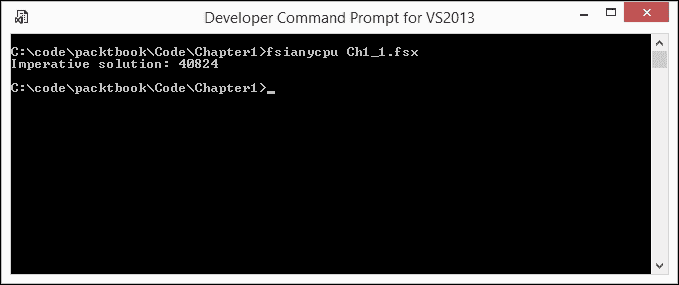
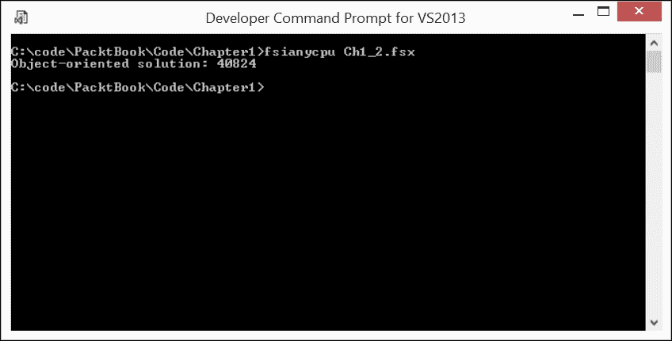
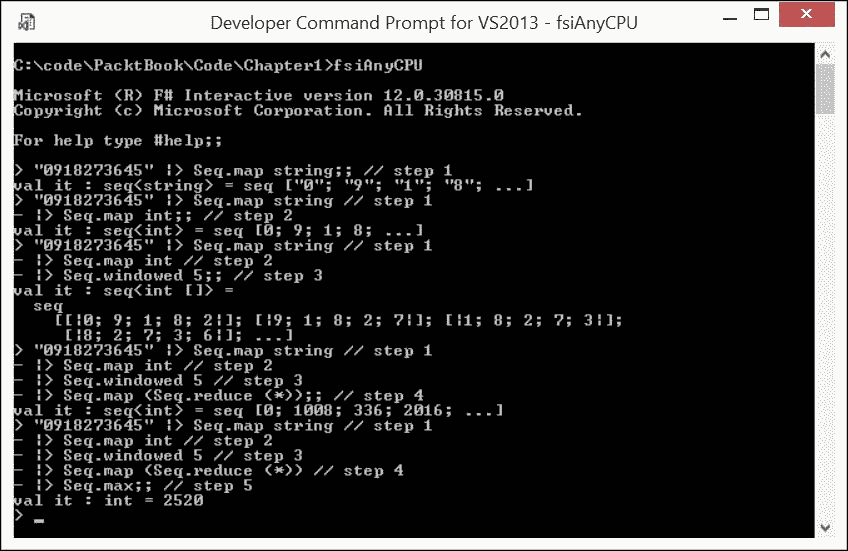
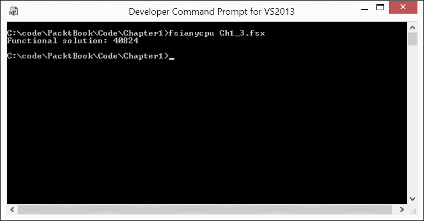

# 第一章. 开始函数式思考

> *一个手持链锯的人走进一家五金店，对店员说：“两周前，你告诉我这个工具可以让我在一小时内砍倒 30 棵树。但我只能砍倒一棵。我想退货。”店员说：“让我看看。”然后启动了链锯。参观者吓得跳回去尖叫：“这是什么声音？！”- *一个古老的笑话**

我的故事开头的笑话与本章的主题非常相关：为了获得使用任何工具的预期好处，你应该知道如何正确使用该工具。此外，错误使用的高级工具可能甚至比正确使用相应的简单工具还要低效。在钉木板时，锤子比显微镜更有效。

第一章，*开始函数式思考*，应有助于你培养一种解决日常软件工程问题的方法，这些问题通常与函数式范式相关。这意味着通过动词而不是名词来呈现解决方案，避免使用可变实体来传递状态，避免依赖副作用，并最小化代码中的移动部件数量。

在本章中，我们将涵盖以下主题：

+   F#的多范式特性

+   通过解决以下示例问题来比较 F#范式：

    +   一种命令式单体解决方案

    +   一种面向对象的解决方案

    +   一种函数式解决方案

+   函数式范式的特性

我将以一个关键概念列表来结束本章，这些概念需要保留和识别，以及在你函数式解决方案中可以重用的技能。

# F#与编程范式之间的关系

本章以及其他章节将教会你如何从函数式范式的角度看待任何给定的软件问题。这种观点可能与你练习其他编程方法时已经形成的范式观点有显著差异。这种对所需范式转变的假设是一个备受期待的场景，考虑到所谓的**TIOBE 编程社区指数**（[`www.tiobe.com/tiobe_index?page=index`](http://www.tiobe.com/tiobe_index?page=index)）的编程语言流行度因素，它可以被认为是编程语言流行度的指标。

在撰写本文时（2016 年 2 月）：

+   TIOBE 指数的获胜排名#1 由 Java 编程语言获得，它与面向对象编程范式紧密相关

+   排名#2 属于 C 编程语言，它可以被认为是代表传统的命令式过程式编程范式

+   与函数式编程范式相关的编程语言仅在 TIOBE 指数排名中位于 21 到 50 的范围内，其中 F#以适度的排名#36

尽管如此，如果你已经读到这一点，我可以安全地假设你对 F#的兴趣并不仅仅是因为它的流行，而这种流行是由不属于本书范围的因素驱动的。对我来说，作为一个应用数学和计算机科学高级学位的持有者，在 F#生态系统内编写工程程序代码具有类似探索数学问题的美丽解决方案或分析伟大棋局的美学品质。

认真地说，我个人最重视函数式编程范式的益处，包括函数式代码的可读性和可维护性。典型的单体命令式 C 代码的这些品质可能相当差。然而，这些代码品质是否自动赋予任何掌握了 F#语法的人？当然不是。

除了学习 F#语法之外，前面的观点意味着需要获得某些技能，以便以惯用的方式使用这种编程语言。F#确实是一种多范式编程语言。它允许程序员采用许多编程范式。程序代码的函数式布局方式可以与命令式单体编程方式并行使用，或者当与环境的互操作性很重要时，可能会出现面向对象的方法。然而，F#声称自己是函数式优先的编程语言。这意味着 F#的天然编程范式是函数式；如果以函数式方式使用，该语言将带来最多的好处。在这种情况下：

> "它使用户和组织能够用简单、可维护和健壮的代码来解决复杂的计算问题" - ([`fsharp.org/`](http://fsharp.org/)).

你可能会想知道什么是惯用用法，以及是否总是可以使用它。通过对应编码示例的比较研究来展示惯用 F#使用的方法是最好的。让我拿一个任意简单的问题，并按照命令式、面向对象，最后是函数式范式来解决它。然后，我将比较解决方案以突出函数式方法的特点。为了使这种比较完全公平，所有三种情况下的实现编程语言都将使用 F#。

# 一个需要解决的问题示例

我将使用 Project Euler 的第 8 题的略微修改版作为问题（[`projecteuler.net/problem=8`](https://projecteuler.net/problem=8)）：

```cs
The four adjacent digits (9989) being highlighted in the 1000-digit numbers that have the greatest product are as following: 
9 x 9 x 8 x 9 = 5832\. 

73167176531330624919225119674426574742355349194934 
96983520312774506326239578318016984801869478851843 
85861560789112949495459501737958331952853208805511 
12540698747158523863050715693290963295227443043557 
66896648950445244523161731856403098711121722383113 
62229893423380308135336276614282806444486645238749 
30358907296290491560440772390713810515859307960866 
70172427121883998797908792274921901699720888093776 
65727333001053367881220235421809751254540594752243 
52584907711670556013604839586446706324415722155397 
53697817977846174064955149290862569321978468622482 
83972241375657056057490261407972968652414535100474 
821663704844031
9989

0008895243450658541227588666881 
16427171479924442928230863465674813919123162824586 
17866458359124566529476545682848912883142607690042 
24219022671055626321111109370544217506941658960408 
07198403850962455444362981230987879927244284909188 
84580156166097919133875499200524063689912560717606 
05886116467109405077541002256983155200055935729725 
71636269561882670428252483600823257530420752963450 

Find the five adjacent digits in the same 1000-digit number that has the greatest product. What is the value of this product? 

```

## 命令式单体解决方案

让我先以直接的单体命令式方式来接近解决方案：将表示数字的 1000 个字符字符串转换为字符数组，然后将其转换为跨越所有 996 组五个相邻数字的循环，计算每个组的数字乘积并保持当前最大值。当前最大值的最终值将是解决方案；就这么简单。

为了从输入数字中移除，让我们将其放入一个单独的源代码文件`HugeNumber.fs`中，使用 F#的`#load`指令将其拉入解决方案脚本。F#源文件`HugeNumber.fs`如下所示：

```cs
[<AutoOpen>] 
module HugeNumber 
let hugeNumber = 
    "73167176531330624919225119674426574742355349194934\ 
    96983520312774506326239578318016984801869478851843\ 
    85861560789112949495459501737958331952853208805511\ 
    12540698747158523863050715693290963295227443043557\ 
    66896648950445244523161731856403098711121722383113\ 
    62229893423380308135336276614282806444486645238749\ 
    30358907296290491560440772390713810515859307960866\ 
    70172427121883998797908792274921901699720888093776\ 
    65727333001053367881220235421809751254540594752243\ 
    52584907711670556013604839586446706324415722155397\ 
    53697817977846174064955149290862569321978468622482\ 
    83972241375657056057490261407972968652414535100474\ 
    82166370484403199890008895243450658541227588666881\ 
    16427171479924442928230863465674813919123162824586\ 
    17866458359124566529476545682848912883142607690042\ 
    24219022671055626321111109370544217506941658960408\ 
    07198403850962455444362981230987879927244284909188\ 
    84580156166097919133875499200524063689912560717606\ 
    05886116467109405077541002256983155200055935729725\ 
 71636269561882670428252483600823257530420752963450" 

```

此文件将被所有问题解决方案的变体使用。

然后，实现命令式解决方案的 F#脚本`Ch1_1.fsx`将如下所示：

```cs
// Imperative monolithic solution a-la C/C++ 
#load "HugeNumber.fs" 
let number = hugeNumber.ToCharArray() 
let mutable maxProduct = 0 
let charZero = int('0') 
for i in 0..995 do 
  let mutable currentProduct = 1 
for j in 0..4 do 
  currentProduct <- currentProduct * (int(number.[i + j]) -      charZero) 
if maxProduct < currentProduct then 
  maxProduct <- currentProduct 
printfn "%s %d" "Imperative solution:" maxProduct 

```

`#load "HugeNumber.fs"`这一行将外部代码文件`HugeNumber.fs`中的`string`值`HugeNumber.hugeNumber`引入到本脚本的作用域中。

下一行`let number = hugeNumber.ToCharArray()`将此`string`值转换为包含 1000 个单独字符的数组，每个字符代表一个单独的数字。

下一行`let mutable maxProduct = 0`引入了一个用于携带五个相邻数字最大乘积的运行总账的可变`int`值。

下一行`let charZero = int('0')`只是一个辅助值，用于将数字的字符码转换为 0 到 9 范围内的实际`int`值。它实际上代表整数`48`，而不是像一些人可能期望的`0`。但是，由于十进制数字的字符`'0'`到`'9'`在转换为`int`后都有相邻的值，所以从`char`数字`x`转换为`int`的结果中减去`charZero`将正好得到整数`x`。关于这个问题的更多细节将在本章进一步讨论。

以下七行 F#代码是实现的精髓：

```cs
for i in 0..995 do 
  let mutable currentProduct = 1 
for j in 0..4 do 
  currentProduct <- currentProduct * (int(number.[i + j]) -     charZero) 
if maxProduct < currentProduct then 
  maxProduct <- currentProduct 

```

此脚本部分执行以下操作：

+   外部数值`for`循环遍历数字数组从最左边的到最右边的五个相邻字符数字块，保持块序列号（`0,1,2,...,955`）在计数器值`i`中。

+   绑定`let mutable currentProduct = 1`提供了一个可变的占位符，用于当前块数字的乘积。

+   内部数值`for`循环遍历长度为 5 的子数组，通过将中间结果乘以具有连续编号`j`的每个数字的`int`值来计算`currentProduct`，使用表达式`(int(number.[i + j]) - charZero)`。例如，如果当前数字是`5`，则`int('5') - int('0') = 5`。

+   一个`if`语句关闭外部循环确保`maxProduct`始终包含已遍历块的最大乘积；因此，当循环完成迭代时，`maxProduct`包含所求的值。

最后，`printfn "%s %d" "Imperative solution:" maxProduct`这一行将最终结果输出到系统控制台。

使用**F#交互式环境**（**FSI**）运行整个脚本将得到以下解决方案：



在 F#交互式环境中运行命令式解决方案脚本

在介绍其他解决问题的方法之前，我有几个要点想强调：

+   该解决方案表示详细的“如何做”指导。

+   该解决方案已用低级计算机概念表达，例如语句、循环和全局值

+   值在执行过程中发生变化，表示状态的变化

+   解决方案代码看起来并不结构化，它只是流动

## 面向对象的解决方案

现在，让我转向以面向对象的方式解决相同的问题。这种方法的典型做法是在自定义类的实例内部隐藏实现细节，并使用它们自己的方法来操作它们。为此，我将使用 F# 的 `type` 功能，它代表 .NET 对象类型的概念，也称为 **类** ([`docs.microsoft.com/en-us/dotnet/articles/fsharp/language-reference/classes`](https://docs.microsoft.com/en-us/dotnet/articles/fsharp/language-reference/classes) )。以下代码（脚本 `Ch1_2.fsx` ）展示了该问题的面向对象解决方案：

```cs
// Object-oriented solution a-la C# with Iterator pattern 
#load "HugeNumber.fs" 

open System 
open System.Collections.Generic 

type OfDigits(digits: char[]) = 
    let mutable product = 1 
    do 
        if digits.Length > 9 then // (9 ** 10) > Int32.MaxValue 
            raise <| ArgumentOutOfRangeException 
              ("Constrained to max 9 digit numbers") 
        let charZero = int '0' in 
        for d in digits do 
            product <- product * ((int d) - charZero) 
        member this.Product 
            with get() = product 

type SequenceOfDigits(digits: string, itemLen: int) = 
    let collection: OfDigits[] = 
       Array.zeroCreate(digits.Length -itemLen + 1) 
    do 
      for i in 0 .. digits.Length - itemLen do 
        collection.[i] <- OfDigits(digits.[i..
           (i+itemLen-1)].ToCharArray()) 
    member this.GetEnumerator() = 
        (collection :> IEnumerable<OfDigits>).GetEnumerator() 

let mutable maxProduct = 1 
for item in SequenceOfDigits(hugeNumber,5) do 
    maxProduct <- max maxProduct item.Product 

printfn "%s %d" "Object-oriented solution:" maxProduct 

```

此解决方案将操作两个类的对象。第一个类名为 `OfDigits`，代表数字序列的实体，其乘积是我们关注的主题。可以通过 `OfDigits` 类型构造函数 `OfDigits(digits: char[])` 从一定大小的 `char` 元素数组创建 `OfDigits` 的实例，这些数组用作 `OfDigits` 类型构造函数的参数。

在创建实例时，每个实例都与表示其数字乘积的 `product` 字段相关联。无法一次性初始化 `product` 的原因在于：为了表示为正整数值，乘积可以由九位或更少的数字组成（因为 10 个或更多 9 的乘积将超过最大 32 位 `int` 值 2147483647）。为了验证这一点，`product` 被保持为 `mutable`，并初始时获得 `1` 的值，如下所示：

```cs
let mutable product = 1 

```

然后，在长度有效性检查之后，`OfDigits` 构造函数通过执行计算来向字段提供真实值：

```cs
let charZero = int '0' in 
for d in digits do 
  product <- product * ((int d) - charZero) 

```

此值可以通过实例属性 `Product` 访问，如下所示：

```cs
member this.Product with get() = product 

```

另一个类用于实现面向对象的解决方案，它代表一个可以表示任意长度数字字符串的实体，并将其表示为类型 `OfDigits` 的通用集合，允许枚举以遍历它并找到具有最大 `Product` 属性的成员。

为了实现这一目的，名为 `SequenceOfDigits` 的类被配备了构造函数参数，该参数携带输入数字的数字字符串和单个 `OfDigits` 实例参数的 `itemLen` 长度。在 `SequenceOfDigits` 实例构建期间，所有 `OfDigits` 实例都作为集合字段数组的元素创建。`GetEnumerator()` 实例方法允许您通过向上转换为 `System.Collections.Generic.IEnumerable<OfDigits>` 接口类型并将调用委托给后者的 `GetEnumerator()` 方法来枚举此数组，如下所示实例方法定义：

```cs
member this.GetEnumerator() =  (collection :> IEnumerable<OfDigits>).GetEnumerator() 

```

在拥有前面两个类的情况下，构建原始问题的解决方案相当简单：你从`hugeNumber`构建一个五位`OfDigits`元素的`SequenceOfDigits`实例，并使用`for...in`循环遍历它，保持最大乘积计数，类似于以下代码中所示的操作式解决方案：

```cs
let mutable maxProduct = 1 
for item in SequenceOfDigits(hugeNumber,5)
  do  maxProduct <- max maxProduct item.Product 

```

最后，将结果放置在系统控制台上。使用 F# FSI 运行整个脚本会得到面向对象解决方案的结果，如下面的截图所示：



在 F#交互式环境中运行面向对象解决方案脚本

对于那些熟悉面向对象解决问题方式的人来说，你们可能会预期第二个解决方案与第一个有所不同：

+   它的结构明显不同，相关类的定义与这些类的使用分离

+   类隐藏了实现的细节，只允许通过公开的属性和方法使用

+   解决方案遵循一个众所周知的设计模式，即**迭代器**模式

+   构建脚手架所需的努力远远超过实际解决方案所需的努力

## 函数式解决方案

最后，让我转向这本书所针对的解决方案方式，即函数式。让我们将其视为一系列数据转换。让我们从求解的解决方案开始，逆向查看，回到数字的输入字符串，如下所示：

+   所求的解决方案是`max`聚合函数应用于所有五位数字序列乘积序列的结果。

+   所有五位数字序列乘积的序列是函数应用的结果，该函数将每个五位数字序列实例从此类序列映射到五位数字序列数字的乘积的 reduce。

+   所有五位数字序列的序列可以通过将 F#核心库的窗口函数`Seq.windowed<'T>`应用于后者来生成。换句话说，这意味着从左侧复制前五个数字，将其放入输出中，然后将源序列向右移动一个数字，取第一个五个数字的副本并将其放在输出中的第一组之后，再次将源序列向右移动一个数字，取前五个数字，依此类推，直到无法再从源中取出前五个数字。序列的输出序列是所求的函数应用结果。

+   最后，所有初始数字的序列只是通过单个数字分割的初始字符串，每个数字都转换为对应的`int`类型，从 0 到 9。

每个前一步描述了我想要应用于单个输入参数以获得单个结果要应用哪种转换。每个后续步骤都取前一步的结果并将其作为自己的输入。

让我向您展示我通常如何借助 FSI 提供的**读取-评估-打印循环**（**REPL**）模式和缩小任务维度，从类似前面一个的数据转换草图推导出工作代码。向解决方案逐步进展的过程在*图 1.3*中显示，我在此过程中逐渐开始添加转换步骤，以重现前面草图中的数据转换过程，该过程针对仅由 10 个数字组成的字符串`"0918273645"`：

1.  输入字符串通过与同名的 F#运算符**管道传递** `|>` 作为`Seq.map string`的第二个参数传递。结果是 10 个字符串的序列，每个字符串代表一个单独的数字。

1.  第 1 步的结果通过`|>`作为`Seq.map int`的第二个参数传递。现在，结果也是一个序列，但它是一个包含 10 个`int`数字的序列，每个数字代表一个单独的数字。

1.  第 2 步的结果通过`|>`作为`Seq.windowed 5`的第二个参数传递。结果是六个数组的序列，每个数组代表第 2 步结果的五个连续数字，每次将序列的起始位置向右移动一个位置。

1.  第 3 步的结果通过`|>`作为`Seq.map (Seq.reduce (*))`的第二个参数传递。第一个参数是高阶函数`Seq.reduce`，它将它的参数（一个包含五个数字的数组）转换为这些数字的乘积，这要归功于乘法运算符（`*`）。这个转换步骤的结果是六个数字，每个数字代表相应数字数组元素的乘积。

1.  第 5 步的结果传递到`Seq.max`聚合函数中，该函数产生所求的最大乘积，等于`2520(7 * 3 * 6 * 4 * 5)w`：



使用 REPL 逐步获得较小问题解决方案的增量过程

现在，在相当有信心认为所考虑的解决方案是好的之后，我可以将前面的步骤 1 到 5 与另一个 F# **函数组合**运算符`>>`结合起来，该运算符只是将函数的结果作为参数粘接到右侧函数的左侧，形成一个非常紧凑的 F#脚本，如下所示，该脚本在文件`Ch1_3.fsx`中提供：

```cs
#load "HugeNumber.fs" 
hugeNumber |> (Seq.map (string >> int) >> Seq.windowed 5 
>> Seq.map (Seq.reduce (*)) >> Seq.max 
>> printfn "%s %d" "Functional solution:") 

```

前面的完整问题解决方案代码与我在几个 REPL 步骤中运行的较小问题解决方案之间的唯一区别是输入值维度。最终的代码使用了与命令式和面向对象解决方案相同的方式，从同一源文件`HugeNumber.fs`中取出的 1000 位`hugeNumber`。

使用 FSI 完整运行脚本产生以下图所示的函数式解决方案结果：



在 F# Interactive 中运行函数式解决方案脚本

尽管附带注释有些冗长，但函数式解决方案所达到的代码质量相当出色：

+   它甚至不利用携带中间状态的单一值

+   它只包含一个绝对必要的算术乘法运算符，用于乘法计算

+   它非常简洁

+   它几乎字面地反映了原始的“做什么”考虑

+   它仅使用六种核心 F# 库函数以某种方式组合，我们可能坚信这些函数的实现是错误-free 和高效的

前面的要点反映了典型的小规模问题惯用函数式解决方案的所有属性。现在我将逐一解释这些属性。

# 参与数据实体的不可变性

不使用可变程序实体的方法的积极品质是众所周知的：

+   在构造时给定正确的状态，不可变实体在其整个生命周期内不能被无效化

+   不可变实体易于测试

+   它们不需要克隆或复制构造函数

+   不可变实体自动是线程安全的

我必须指出，F# 并不是 100% 严格关于使用不可变实体。正如你可能已经注意到的，我之前在我的命令式和面向对象的解决方案中使用了值，改变了状态。但语言要求程序员额外努力引入可变状态（通过 `let` 绑定的 `mutable` 修饰符或通过 `ref` 单元，尽管 F# 4.0 几乎消除了对后者的需求）。

此外，语言引入的大多数数据结构也是不可变的，这意味着典型的数据转换会产生一个新的不可变实例的数据结构，从现有的数据结构中。在处理大量内存实例时，这需要程序员有一定的谨慎，但正如我的经验所教导的，开发者很容易习惯这个特性。

# 用动词而不是名词思考

将数据转换的过程视为动词而不是名词，对于函数式方法来说是非常典型的，因为在我们的大脑中，函数与动作而不是对象直观地相关联。你可能注意到脚本 `Ch1_3.fsx` 中的单个数据项 `hugeNumber`。其余的都是以某种方式组合的少数库函数，它们将 `hugeNumber` 数据项转换成控制台输出的一行。这种函数组合的方式允许阅读此代码的人完全忽略在表达式中每个出现操作符 >> 的数据转换的中间结果。

这种组合的不那么明显的推论是，F# 编译器有机会执行所谓的融合，或者说是通过合并一些相邻的数据转换步骤来优化代码的方式。例如，当相邻步骤融合在一起时，数据遍历的量可能会减少。

# “什么”胜过“如何”

功能解决方案心智过程的这一特性，通过一个例子更容易展示。我在这里引用了 F#早期的一些伟大例子，这些例子之前被几位内部人士使用过。想象一下，你自己在星巴克喝美式咖啡。

“如何”的方法是给出详细的说明，例如：

1.  喝一杯烤咖啡

1.  烹制两杯浓缩咖啡

1.  用热水冲泡，以产生一层奶泡

1.  将其放入 12 盎司大小的杯中

“什么”的方法就是简单地问“我可以来一杯高杯美式咖啡吗？”

第二种方法显然更加简洁，并且最大限度地减少了得到与预期结果偏差的结果的机会。如果你现在回顾我们前面的三个解决方案，你应该会注意到这个特性。

# 泛化胜过专业化

函数范式的另一个显著特性是泛化。通过这种方式，我的意思是，当具体问题可以通过应用相应参数化的通用解决方案来解决时，更倾向于选择通用解决方案而不是具体解决方案。让我们转向我们的样本问题，以证明泛化的证据。调整功能解决方案以适应不同长度的数字序列（例如，8 而不是 5），对组进行另一种数学运算（例如，求和而不是乘积），另一种聚合属性（例如，最小值而不是最大值）只是对应函数参数值的更改。在其他方法中，代码需要更改多少的比较将留给你作为练习。

# 在隐藏它们之上，最小化移动部件

与面向对象的方法相比，这一特性特别与函数式方法相关。回想一下 F#脚本文件`Ch1_2.fsx`，它涉及自定义类封装实现细节，并在构造函数、迭代器和聚合属性之外暴露它们。与面向对象的方法相比，函数式方法是扁平的，不隐藏任何东西；它只是组合了一些已知部分。

# 产生定制部分胜过将部分还原为已知部分

函数范式与其他范式区分开来的一个惊人的特性是，在操作数据结构级别上产生定制部分的需求有限。通常，函数式编程新手倾向于为每种数据转换的情况实现自己的函数。这种幼稚的疾病通常以从实践中发现几乎任何对典型数据结构的转换都可以表示为`filter`、`map`和`fold`操作的组合而告终。我将专门用大量内容来讨论这一现象。

# 懒惰的数据收集胜过急切的数据收集

让我将你的注意力转向之前提到的面向对象和函数式解决方案在内存消耗方面的比较。面向对象的解决方案急切地创建并实体化 996 个`OfDigits`对象集合；也就是说，其内存消耗是问题维度的线性函数。与此相反，函数式解决方案在任何时刻的`max`聚合中不需要超过一个`OfDigits`实例，根据`max`聚合函数的需求惰性逐个产生相同的 996 个对象，因此内存消耗是恒定的，并且（几乎）与问题维度无关。这是一个相当复杂的特点。如果你想象初始条件突然改变，`hugeNumber`真的很大，那么面向对象的解决方案可能会因为缺乏所需的内存而变得不可应用，而函数式解决方案，由于对此因素不敏感，将继续工作。概括这个观察结果，函数式范式允许你解决更大规模的问题，而不是通过利用数据操作的惰性方式来采取其他方法。从这个方法中产生的有趣推论是，可以操作无限长度的数据序列的技术，这些序列不需要在内存中完全实体化。

# 摘要

以下是在完成本章学习后你应该掌握的关键概念和技能列表：

避免使用可变状态，并在不可变值和数据结构上实现数据转换。以动词而非名词来思考编程解决方案。避免用高度详细的行为性“如何”语句来表述解决方案；相反，使用“做什么”的方法。进行泛化：优先选择参数化的通用解决方案，而不是具体的解决方案。努力最小化解决方案中的移动部分，而不是将这些移动部分隐藏到类中。尝试通过一些众所周知的功能来表述解决方案，而不是深入到创建自定义解决方案中。当适用时，优先选择惰性数据集合（序列）而非急切的数据集合。

掌握函数式思维方式的这个过程可以概括为以下三个 R——**保留**、**识别**和**重用**。你越早学会识别我将在本书中详细介绍的惯用函数式设计模式，并且越早将这些模式反复应用于日常编码活动中，你将越成为一名优秀的函数式程序员。

在接下来的章节中，我将向您介绍 F# 在特定开发场景中的许多惯用用法。这些重复的使用将代表真正的函数式编程设计模式。请记住，许多这些模式仅在一定程度上与传统**面向对象设计模式**([`en.wikipedia.org/wiki/Design_Patterns`](https://en.wikipedia.org/wiki/Design_Patterns))相关，以及其他**软件工程**架构设计模式([`www.amazon.com/Patterns-Enterprise-Application-Architecture-Martin/dp/0321127420`](http://www.amazon.com/Patterns-Enterprise-Application-Architecture-Martin/dp/0321127420))。

在下一章中，我将为您提供一个全方位的高层次视角，涵盖 F# 语言特性和组成部分及其起源和演变。
