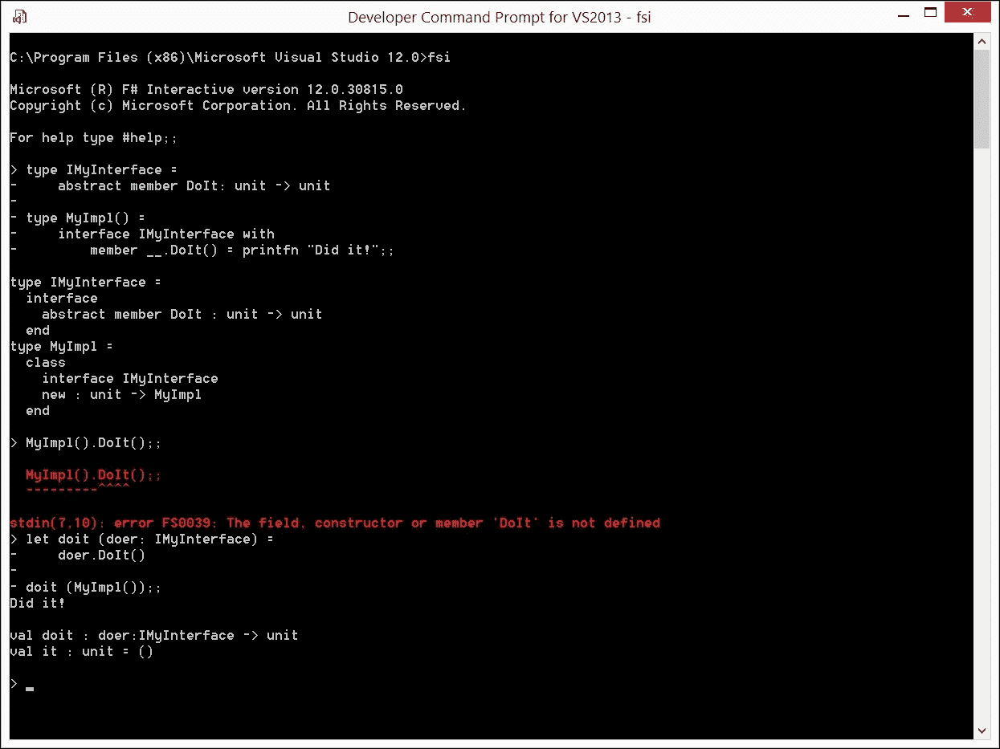

# 第二章. 解构 F# 的起源和设计

本章从历史的角度回顾 F# 特性，尽可能追溯到它们的起源。回顾包括：

+   F# 发展时间线

+   前身继承的语言特性

+   .NET 强制语言特性

+   F# 内在语言特性

虽然 F# 是一种以函数优先的编程语言，但同时，你也不应忘记它是一个多范式工具，如果需要的话，它允许结合不同的范式。另一个你应该记住的重要方面是，F# 是为 .NET 平台设计的，因此某些语言特性是由底层实现机制和互操作性要求塑造的。本章的目标是以一种让你能够理解 F# 设计的起源和逻辑的方式，将语言分解成组件。

# F# 的发展

媒体开始提及 ([`developers.slashdot.org/story/02/06/08/0324233/f---a-new-net-language`](http://developers.slashdot.org/story/02/06/08/0324233/f---a-new-net-language)) F# 编程语言是在 2002 年夏季，作为微软剑桥研究院的一个研究项目 ([`research.microsoft.com/en-us/labs/cambridge/`](http://research.microsoft.com/en-us/labs/cambridge/)) )，旨在创建一个在 .NET 平台上运行的 OCaml 语言 ([`ocaml.org/`](https://ocaml.org/)) 的方言。计算机科学家 Don Syme ([`research.microsoft.com/en-us/people/dsyme/`](http://research.microsoft.com/en-us/people/dsyme/)) 负责设计和首次实现。

## 前身

微软剑桥研究院的 F# 项目并非从零开始。F# 属于 ML ([`zh.wikipedia.org/wiki/ML_(编程语言)`](https://zh.wikipedia.org/wiki/ML_(编程语言))) 编程语言家族。它的前身包括标准 ML ([`zh.wikipedia.org/wiki/Standard_ML`](https://zh.wikipedia.org/wiki/Standard_ML)) ) 和 **OCaml**。此外，F# 在微软剑桥研究院最初还有一个双胞胎项目，名为 SML.NET，旨在将 **标准** **ML** ( **SML** ) 带到 .NET 平台。

## F# 版本 1

第一次发布是在 2004 年 12 月，被标记为微软研究院项目。这意味着在当时，它并没有成为微软产品的地位，尽管它提供了与 Visual Studio 2003 和 Visual Studio 2005 测试版的集成。

## F# 版本 1.1

2005 年 10 月发布的这个版本标志着将面向对象特性引入语言，这标志着 F# 成为一个真正的多范式语言的里程碑。

> “在这个版本中，对 F# 语言本身的重大补充是我们所说的“F# 对象和封装扩展”。这结合了我认为 .NET 面向对象范例的最佳特性与 F# 核心的函数式编程模型。这意味着 F# 已经成为一门混合了函数式/命令式/面向对象的编程语言。” —— Don Syme 在 2005 年 8 月 23 日的博客中提到。*[`blogs.msdn.com/b/dsyme/archive/2005/08/24/455403.aspx`](http://blogs.msdn.com/b/dsyme/archive/2005/08/24/455403.aspx)*

另一个使 1.1 版本显得沉重的特性是引入了 F# Interactive，也称为 FSI，这是一个提供 F# 脚本能力和通过频繁使用 REPL 进行代码开发的工具。这个版本适用于 Visual Studio 2005 的最终版本。

在 1.1 版本的重要里程碑之后，该语言继续频繁发布并引入新的主要功能。2007 年 10 月 17 日，微软公司正式宣布将 F# 从研究转向产品开发组织，旨在将 F# 产品化，使其成为 .NET 平台上完全集成到 Visual Studio 的另一门一流编程语言。经过一年的密集工作，2008 年 12 月宣布 F# 将作为 Visual Studio 2010 的组成部分发布。

## F# 版本 2

2010 年 2 月，宣布即将包含在 Visual Studio 2010 中的 F# 版本将升级到 2.0。不久之后，2010 年 4 月，F# 2.0 正式发布，作为 Visual Studio 2010 的一部分，同时也是 Visual Studio 2008 的匹配安装版本，以及其他平台的独立编译器。F# 2.0 版本的重要里程碑反映了 F# 1.x 近 5 年的发展历程，在此期间，在函数式编程的基础上增加了面向对象的功能，如活动模式、序列表达式、异步和并行计算，以及显著的库改进。此外，值得一提的是，与 Visual Studio 的集成为在 Microsoft 平台上使用 F# 的开发者提供了世界级的工具，如调试、IntelliSense 和项目系统。此时，F# 2.0 已完全准备好用于企业级软件开发。

此外，与原始版本相比，F# 版本 2.0 界定了语言发展的一个阶段，通常被认可为成熟的 F#。

## F# 版本 3

另一个半年的 F# 发展历程在 2011 年 9 月带来了 F# 3.0 的预览版本。这个版本宣称目标是信息丰富的编程。

> "编程理论和实践中的一个日益增长的趋势是编程与丰富信息空间之间的交互。从数据库到网络服务，再到语义网和基于云的数据，将编程与异构的、连接的、结构丰富的、流式传输和不断发展的信息源集成的需求不断增长。大多数现代应用程序都将一个或多个外部信息源作为基本组件。为这些源提供强类型访问是强类型编程语言的关键考虑因素，以确保在信息访问中低阻抗不匹配。" *微软研究技术报告 MSR-TR-2012-101* ([`research.microsoft.com/apps/pubs/?id=173076`](http://research.microsoft.com/apps/pubs/?id=173076) )。

为了实现这一目标，该语言获得了查询表达式，这是一个非常强大的类型提供者机制，以及针对主要企业信息交换技术的众多类型提供者参考实现。F# 3.0 在 2012 年 9 月作为 Visual Studio 2012 的一部分发布，又过了一年。

第二年，即 2013 年，标志着围绕 F# 的活动激增，这表明该语言达到了一些关键质量。Xamarin ([`xamarin.com`](https://xamarin.com) ) 宣布支持 F#，实现了多平台移动开发，并在机器学习、云编程、金融时间序列、数值库和类型提供者等领域发生了多次突破性发展。

这个时期也标志着强大的跨平台开放工程社区的努力，实际上将 F# 转变为一个不再根本依赖于微软的开源跨平台共享实现。微软与 F# 的关联仅限于 Visual F#，也称为 *Visual Studio 的 F# 工具*，即使在这一点上，微软也转向了启用社区贡献和开放工程。

## F# 版本 4

2014 年底宣布的 F# 4.0 提供了一些新功能：类型构造函数被转换为第一类函数，可变值可以被闭包捕获，还有高维数组、列表的切片语法、核心运行时库中的规范化集合等。

带着超过十多年的语言激动人心的历史演变的视野，我现在转向对语言特性的剖析。在本章中，这些特性将仅简要概述，将惯用用法的完整细节推迟到后面的章节。

# 前驱语言继承的特性

F# 从 ML 和 OCaml 继承了与其函数优先性质相关的核心特性。这意味着它表达计算的主要方式是通过函数的定义和应用。

## F# 函数是一等实体

定义和应用函数的能力是许多编程语言的共同特征。然而，F# 与 ML 和其他函数式编程语言一样，将函数视为类似于数值值。F# 中处理函数的方式远远超出了通常与存储程序计算机概念相关的限制：

+   函数可以用作其他函数的参数；在这种情况下，后者是高阶函数

+   函数可以从其他函数返回

+   函数可以从其他函数计算得出，例如，使用函数组合运算符

+   函数可以是通常与数据相关的结构元素

## 函数是无副作用的

使用函数的计算主要以*评估表达式*的形式为主，而不是*向变量赋值*。表达式不带有存储在可重写内存中不断变化的值的污名。当函数`triple x`应用于参数值`3`时，它评估一些内部表达式并返回`9`。我们确信这个结果是连贯的，可能被反复重现，并且只有当参数值从`3`变为其他值时，结果才会从`9`变为其他值。

## 函数可以柔性和部分评估

柔性化是一种将多参数函数的评估转换为一系列单参数函数等价评估的方法。部分评估绑定了一个或多个柔性化函数的第一个参数，有效地产生了一个具有较少（非绑定）参数的新函数。

## 函数可能是匿名的

为什么要在传递给高阶函数或从其返回的函数上命名？为了简洁起见，F# 允许使用不会在其他地方调用的通用 `fun` 和 `function` 函数定义形式，因此省略了名称。

## 函数可能是递归的

递归函数([`en.wikipedia.org/wiki/Recursive_function`](https://en.wikipedia.org/wiki/Recursive_function) )实现的常用例子是将问题分解为几个维度更小的相同问题，即分而治之算法([`en.wikipedia.org/wiki/Divide_and_conquer_algorithms`](https://en.wikipedia.org/wiki/Divide_and_conquer_algorithms) )，这样就可以应用相同的解决函数。这种分解一直持续到解决方案变得简单，然后较小的解决方案被组合回原始大小的解决方案中。

## 函数可以引发异常

并非每个表达式都能始终返回一个结果值；这种情况最典型的例子是零除以一个数。另一个典型例子是无效的参数值，它不允许返回结果。在这种情况下，不是返回结果，而是抛出一个异常。

## 函数可以引用外部值

使用外部值将它们冻结在函数定义中，从而创建所谓的**闭包**。

## F# 是一种静态类型语言

表达式及其组成部分具有由 F#编译器推断的唯一类型。一般来说，不会发生隐式类型转换。F#编译器检查程序并捕获可能在动态类型语言运行时发生的错误。

## F#类型推断提供类型泛化

编译器执行的类型分配算法通常允许程序员在上下文明确确定类型的情况下省略类型声明。它找到对值绑定和表达式评估最一般的类型。

## F#支持参数多态

一个函数可能允许通用的参数类型；例如，计算`int`、`int64`或`bigint`列表元素总和的函数实现可能相同。

## F#从 ML 继承了各种聚合数据结构

继承的数据结构包括以下内容：

+   一个元组或代数积类型的值，允许你表示异构类型的值

+   一个列表或相同类型的零个或多个值的有限序列

+   通过类似于 ML 数据类型的机制定义的区分联合或自定义代数和类型，特别是允许递归类型定义（例如，二叉树）

+   表示某种类型值的缺失或存在的选项

+   一个类似于元组但组件被命名的记录

+   当然是一个数组

+   一个序列，作为 ML 中数据类型的扩展实现，具有懒加载的值构造函数

## F#支持模式匹配

模式匹配是数据结构分解的强大机制，允许你将数据聚合分解成组件或根据数据聚合的特定结构/属性定义处理。

## F#支持数据引用

数据引用是在 ML 中引入的，以支持可变存储和更广泛地支持命令式编程。F#为了与 ML 向后兼容而不保留地继承了这一特性。`ref`类型的值允许你实现可变性，改变状态并表示全局变量。

## 函数默认是非递归的

在这方面，F#遵循 OCaml，因此递归函数绑定应该带有`rec`属性。`let rec`立即将函数名放入作用域中，以覆盖外部作用域中可能的重复。如果没有`rec`属性，`let`只在主体完全定义后将其放入作用域，这使得在函数体内部引用不可用，或者在最坏的情况下，无意中使用了外部作用域中无意中覆盖的名称。

## 模块

遵循 ML 和 OCaml，F#提供模块作为将相关值、函数和类型组合在一起的方式。实际上，模块类似于 C#的静态类，为开发者提供了将相关实体分组、维护和扩展的手段。

# .NET 强制的语言特性

除了从语言前辈那里继承的特性外，F# 还引入了众多特性，以便与 .NET 平台进行互操作性。

## F# 遵循 .NET 公共语言基础设施

F# 代码的运行时安排由 .NET **公共** **语言** **基础设施**（**CLI**）定义，并且与 C# 或 VB.NET 的相同。F# 编译器读取 F# 源代码文件并生成名为 MSIL 的汇编语言中间代码，并将其打包为二进制 .NET 程序集。在代码执行阶段，MSIL 根据需要转换为机器代码，或 **即时**（**JIT**）。与其他 .NET 语言的互操作性是通过 F# 生成的程序集与 C# 或 VB.NET 生成的程序集没有差异来实现的。同样，JIT 编译器负责目标硬件平台，提供可移植性。CLI 还承担了内存管理的负担，使 F# 程序受到 .NET 垃圾收集的影响。

## F# 具有名义类型系统

这与 OCaml 和 ML 的结构化对象系统有显著差异。显然，这个设计决策是由存在于 .NET 对象系统内并与该系统交互的必要性所决定的，而 .NET 对象系统是名义的。

## F# 完全拥抱 .NET 面向对象

F# 允许你从两个方向遵循 .NET 的面向对象范式：一方面是使用现有的 .NET 框架和面向对象库，另一方面是将 F# 代码以 .NET 库、框架和工具的形式贡献出来。

所有 F# 实体都继承自单个根类型 `System.Object` 或 `obj`。因此，它们自带一些可覆盖和可定制的常用方法。对于自定义的 F# 实体，如区分联合，编译器会生成这些常用 `obj` 方法的实现。

除了使用 .NET 类之外，F# 允许你创建自己的自定义类，这些类由 *数据* 组成，形式为 **字段**，以及以 **方法** 和 **属性** 的形式操作这些字段的 *函数**。名为 **构造函数** 的特殊方法初始化每个类的实例，并将某些值分配给字段。类可以通过类型参数进一步参数化，从而获得泛型。一个类可以继承自单个 **基类** 并实现许多 **接口**。子类可以通过 *重写* 基类的属性和方法来修改其行为。自定义类可以从 .NET 生态系统的其他部分使用。

## F# 需要调用显式接口的方法

F# 在这方面与其他 .NET 语言不同，因此让我用一个简短的代码示例来解释这一点（`Ch2_2.fsx`）：

```cs
type IMyInterface = 
    abstract member DoIt: unit -> unit 

type MyImpl() = 
    interface IMyInterface with 
        member __.DoIt() = printfn "Did it!" 

MyImpl().DoIt() // Error: member 'DoIt' is not defined 

(MyImpl() :> IMyInterface).DoIt() 

// ... but 
let doit (doer: IMyInterface) = 
    doer.DoIt() 

doit (MyImpl()) 

```

前面的 `MyImpl` 类实现了 `MyInterface` 接口。然而，尝试使用该实现会隐式失败，就像 `MyImpl` 完全没有该方法一样。只有将 `MyImpl` 实例显式上转换为 `MyInterface` 后，实现才变得可访问。

我脑海中浮现出的这个设计决策的合理性是这样的：它将消除需要实现多个具有类似名称方法的接口时的歧义。如果我们考虑典型的接口使用，如前面的 `doit` 函数中的 `doer` 参数类型为 `IMyInterface`，这个问题就会变得不那么令人烦恼。在这种情况下，编译器会隐式地将 `MyImpl` 转换为 `IMyInterface` 以使用 `MyImpl`。前面脚本的执行在以下屏幕截图中展示了这一细微差别：



## 对象表达式

F# 提供了一种实现接口的方法，无需为该目的创建自定义类型。以下代码展示了如何使用对象表达式（[`msdn.microsoft.com/en-us/library/dd233237.aspx`](https://msdn.microsoft.com/en-us/library/dd233237.aspx)）从前面的代码中实现 `IMyInterface`，然后是使用实现（`Ch2_3.fsx`）：

```cs
// Define interface 
type IMyInterface = 
    abstract member DoIt: unit -> unit 

// Implement interface... 
let makeMyInterface() = 
    { 
        new IMyInterface with 
            member __.DoIt() = printfn "Did it!" 
    } 

//... and use it 
makeMyInterface().DoIt() 
makeMyInterface().DoIt() 

```

## 反射

F# 完全支持 .NET 反射，允许在运行时访问程序代码的元数据信息。从 F# 以及其他 .NET 语言中都可以进行运行时应用程序的反射，获取类型元数据和装饰源代码的属性。此类练习的最终目标通常是修改已执行代码的运行时行为。例如，目标可能是动态添加新组件或解决依赖关系。

F# 核心库包含在 `Microsoft.FSharp.Reflection` 命名空间中用于运行时分析和构建 F# 特定类型和值的综合工具（[`msdn.microsoft.com/en-us/visualfsharpdocs/conceptual/microsoft.fsharp.reflection-namespace-%5Bfsharp%5D`](https://msdn.microsoft.com/en-us/visualfsharpdocs/conceptual/microsoft.fsharp.reflection-namespace-%5Bfsharp%5D)）。

## 扩展类和模块

F# 允许以非常不显眼的方式扩展类和模块（[`docs.microsoft.com/en-us/dotnet/articles/fsharp/language-reference/type-extensions`](https://docs.microsoft.com/en-us/dotnet/articles/fsharp/language-reference/type-extensions)）。第一种形式通常被称为**内建扩展**，类似于 C# 中的**部分类**。不幸的是，在 F# 中，这种形式的类扩展不能跨越源文件、命名空间或程序集的边界。

另一种形式的扩展，称为**可选扩展**，可以轻松地通过源文件进行。其目的显然是增强任何模块。尽管这种增强应用范围更广，但这种增强在反射中不可见，并且不能在 C#或 VB.NET 之外从 F#中使用。我们将在本书的后面部分仔细研究这些增强方法。

## 枚举

F#中的枚举([`msdn.microsoft.com/en-us/library/dd233216.aspx`](https://msdn.microsoft.com/en-us/library/dd233216.aspx) )模仿 C#枚举，允许你创建命名的数值常量。由于这些不是判别联合，它们在模式匹配中的使用有限。此外，当操作二进制标志的组合时，它们可能很有用。

## 结构

F#中的结构([`msdn.microsoft.com/en-us/library/dd233233.aspx`](https://msdn.microsoft.com/en-us/library/dd233233.aspx) )是用值类型表示的轻量级类。因此，它们的实例可以放在栈上，它们比引用类型占用更少的内存，并且可能不需要参与垃圾回收。

## 事件

F#事件([`msdn.microsoft.com/en-us/library/dd233189.aspx`](https://msdn.microsoft.com/en-us/library/dd233189.aspx) )允许与 CLI 的.NET 事件进行互操作性。然而，F#在 CLI 之上更进一步，提供了在观察者-可观察和发布-订阅场景中的强大聚合、过滤和分区功能。

## 可空类型

可空类型([`msdn.microsoft.com/en-us/library/dd233233.aspx`](https://msdn.microsoft.com/en-us/library/dd233233.aspx) )解决了由于惯用的`option`类型使用而在 F#中通常不存在的`null`值相关的问题。一般来说，在内部场景中，F#允许使用相应`option`类型的`None`情况来覆盖值的缺失。然而，当`option`类型不能使用时，F#代码与 C#和 VB.NET 代码的互操作性以及从 F#进行低级数据库操作可能需要使用可空类型来表示值的缺失。

## 与托管代码的互操作性

仅使用 F#代码的 C#和 VB.NET 可以访问在 F#中实现的公共方法，但 F#特定的数据类型或函数则不在作用域内。幸运的是，相反方向的访问更容易，因为 F#是 C#和 VB.NET 特性的超集。

## 与非托管代码的互操作性

当涉及到与遗留代码的互操作性或使用用 C/C++编写的库的这些不常见情况时，F#遵循 C#使用**P/Invoke**或**COM Interop**。

# 内在的 F#语言特性

除了从 F#的前身继承的特性外，F#语言还拥有自己一套显著的创新功能。这些功能的概述将在接下来的章节中讨论。

## 意识到缩进的语法

是的，这是正确的；F# 编译器对源代码中的缩进非常敏感([`msdn.microsoft.com/en-us/library/dd233191.aspx`](https://msdn.microsoft.com/en-us/library/dd233191.aspx) )，因此正确的代码格式不仅仅是美观问题。为什么？首先，编译器强制执行了代码的可读性改进，其次，这种设计选择显著减少了 F#源代码中的噪声量，因为块标记（如 C#中的花括号）不存在，总体上使得 F#源代码比等效的 C#代码短得多。

## 度量单位

此功能([`msdn.microsoft.com/en-us/library/dd233243.aspx`](https://msdn.microsoft.com/en-us/library/dd233243.aspx) )允许您用关联的单位装饰值，并通过编译器静态验证单位使用是否正确，同时根据操作数的单位推断与表达式值关联的单位。让我们看看以下示例。

在这里，我定义了两个度量单位：`<m>` 表示米（距离）和 `<s>` 表示秒（时间）。了解如何从加速度和距离中找到速度，我定义了一个 `fallSpeed` 函数来找到物体从给定的 `height` 参数下落并撞击地面时的速度，如下面的代码所示（`Ch2_1.fsx`）:

```cs
[<Measure>] type <m> // meters 
[<Measure>] type <s> // seconds 
let fallSpeed (height: float<m>) = 
  2.0 * height * 9.81<m/s²> |> sqrt 

```

现在使用这个函数，很容易发现一个不小心从帝国大厦顶部掉下来的水瓶以每秒 86.46 米的速度撞击了纽约市第五大道的人行道，希望没有伤害到在入口附近闲逛的游客中的任何一位。以下代码表示了前面的示例：

```cs
let empireStateBuilding = 381.0<m> 
fallSpeed empireStateBuilding 

```

注意，编译器只允许将 `<m>` 装饰的浮点数作为 `fallSpeed` 的参数。此外，该函数正确地推断出结果速度的单位是每秒米。不错吧？但说真的，考虑一下这篇 1999 年的 CNN 文章，标题为 *“度量错误导致 NASA 探测器损失”* ([`www.cnn.com/TECH/space/9909/30/mars.metric.02/`](http://www.cnn.com/TECH/space/9909/30/mars.metric.02/) )。如果存在单位检查，就不会发生 1.25 亿美元的卫星损失。不幸的是，NASA 和洛克希德·马丁公司用于卫星飞行控制的软件系统各自运行在自己的度量系统中，集成测试未能发现这一缺陷，直到实际飞行开始之前。

## 赋值运算符重载

F#允许对现有运算符进行重载([`msdn.microsoft.com/en-us/library/dd233204.aspx`](https://msdn.microsoft.com/en-us/library/dd233204.aspx) )以及创建新的单目和中缀运算符。它允许根据操作数的具体类型提供单目（前缀）和中缀操作的多种实现。例如，有理分数算术的实现可能使用三种加法操作版本，分别由中缀运算符`+`表示，适用于将分数加到整数、整数加到分数以及分数加到分数。重载具有积极的一面，可以简洁地表达操作某些领域对象的语义。但这个特性在适度时是好的，因为过度重载可能会损害代码的可读性。

## 内联函数

内联函数([`msdn.microsoft.com/en-us/library/dd548047.aspx`](https://msdn.microsoft.com/en-us/library/dd548047.aspx) )代表一种特定的编译技术。通常，具有非泛型类型参数的编译函数与单个 MSIL 相关联，并且每个函数引用都被编译成对该代码的调用并返回评估结果。然而，在.NET 类型系统中，无法为泛型参数编译 MSIL。F#通过静态评估每个特定函数调用的参数并创建针对此特定函数调用非泛型参数类型的 MSIL，提供了一种聪明的解决方案。通过遵循概述的技术，F#在.NET 类型系统非常有限的支持下实现了函数参数泛化。

## 类型约束和静态解析的类型参数

在非常有限的设计和实现情况下，只需要有真正通用的函数类型参数。通常，需要添加自定义组合的独特附加属性来为 F#编译器提供一种方式，以便在静态上检查类型泛化是否足够具体以完成任务。在大多数此类情况下，类型推断足够智能，可以从静态上下文中推导出此类约束，但有时可能希望开发者提供一些额外的约束。提供额外静态约束的过程和详细情况由以下链接描述：[`msdn.microsoft.com/en-us/library/dd233203.aspx`](https://msdn.microsoft.com/en-us/library/dd233203.aspx)。本书在第十章中对此问题进行了审查，*类型增强和泛型计算*。

## 活动模式

活动模式（[`msdn.microsoft.com/en-us/library/dd233248.aspx`](https://msdn.microsoft.com/en-us/library/dd233248.aspx)）通过允许在模式匹配规则中使用自定义函数，极大地增强了模式匹配的能力。换句话说，模式匹配可以针对任何所需的复杂程度进行专门化。活动模式对于掌握 F#至关重要，我将在接下来的章节中投入大量关注于它们。

## 计算表达式

计算表达式（[`msdn.microsoft.com/en-us/library/dd233182.aspx`](https://msdn.microsoft.com/en-us/library/dd233182.aspx)）是一个相当高级的主题。它们提供了用于表示复杂嵌套计算的工具，这些计算通过看似简单的语法糖进行排序和绑定。F#语言的一些自身特性是通过计算表达式实现的，即序列表达式、查询表达式和异步计算。F#还允许你编写自定义的计算表达式，提供了巨大的扩展能力。

## 查询表达式

查询表达式（[`msdn.microsoft.com/en-us/library/hh225374.aspx`](https://msdn.microsoft.com/en-us/library/hh225374.aspx)）代表了语言提供的计算表达式形式，用于处理语言集成查询，也称为 F#中的 LINQ。它们是解决我之前提到的信息丰富编程的机制的一部分，允许从多种来源和多种形式中消费数据，并能够统一地操作这些数据。例如，从 OData 服务、使用 WSDL 定义的 Web 服务或 SQL 服务器获取的数据可以在一定程度上进行转换，而不必考虑其来源的具体细节。

## 异步工作流

F#中的异步工作流（[`msdn.microsoft.com/en-us/library/dd233250.aspx`](https://msdn.microsoft.com/en-us/library/dd233250.aspx)）以与查询表达式类似的方式呈现，由语言提供的计算表达式形式展示，并展示了该机制的强大和通用性。它们允许你在高抽象级别上针对隐式提供的线程池执行异步代码，从而无需关注异步计算的安排细节。作为结果，编写 F#的异步代码几乎与同步代码一样简单。

## 元编程

元编程 ([`msdn.microsoft.com/en-us/library/dd233212.aspx`](https://msdn.microsoft.com/en-us/library/dd233212.aspx) ) 是一种极其强大且令人兴奋的技术，它允许程序编写其他程序。它可能采取不同的形式，发生在不同的级别：在原生机器代码级别，在 MSIL 级别，甚至在 F#或另一种编程语言的源代码级别。几年前，我对这个特性非常兴奋，并就此主题撰写了一系列简短的文章：**F# 元编程第一部分：即时编译一些原生代码** ([`infsharpmajor.wordpress.com/2012/03/04/how-hard-is-to-jit-some-native-code-from-f/`](https://infsharpmajor.wordpress.com/2012/03/04/how-hard-is-to-jit-some-native-code-from-f/))，**F# 元编程第二部分：动态合成可执行 F#代码** ([`infsharpmajor.wordpress.com/2012/04/01/how-to-dynamically-synthesize-executable-f-code-from-text/`](https://infsharpmajor.wordpress.com/2012/04/01/how-to-dynamically-synthesize-executable-f-code-from-text/))，以及**F# 元编程第三部分：即时创建 MSIL** ([`infsharpmajor.wordpress.com/2012/04/12/creating-msil-from-f-on-the-fly/`](https://infsharpmajor.wordpress.com/2012/04/12/creating-msil-from-f-on-the-fly/))。

然而，通常当开发者考虑 F#元编程时，会涉及到不同的程序级别，即 F#，但与称为**引用表达式**的语言特性相关联的半编译形式。当 F#编译器遇到特定的 F#代码时，它不会将这段代码作为程序的一部分，而是将其编译成一个表示 F#表达式的特殊对象。这个特性的强大之处在于，以这种方式编译后，F#表达式可以被进一步转换为适合在完全不同的环境中执行的形式，例如，以 JavaScript 的形式在网页浏览器中，或者在某种**图形处理单元**（**GPU**）中，原则上可以到达大量的不同计算平台。

## 类型提供者

类型提供者 ([`msdn.microsoft.com/en-us/library/hh156509.aspx`](https://msdn.microsoft.com/en-us/library/hh156509.aspx) ) 也代表了元编程功能。然而，类型提供者并不像将某种形式的源代码转换为可执行形式那样做完全不同的事情。一个典型的类型提供者将某种类型的数据源表示为一系列具有方法和属性的类型，这些类型可以无缝地被使用，就像人类编写的类型或库一样。值得注意的是，提供的类型具有与手动编写的类型相同的品质。它们可以进行静态检查，通过 Intellisense 进行内省，由 F#编译器推断。

例如，SqlClient 类型提供者([`fsprojects.github.io/FSharp.Data.SqlClient/`](http://fsprojects.github.io/FSharp.Data.SqlClient/))允许 F#开发者以类型安全的方式访问 Microsoft SQL 服务器完整的功能集。

类型提供者另一个极其强大的用例是 F#与其他编程语言之间的互操作性。这个领域的重大成功之一是 F# R 类型提供者([`bluemountaincapital.github.io/FSharpRProvider/`](http://bluemountaincapital.github.io/FSharpRProvider/))，它允许从 F#访问大量用于统计计算的 R 编程语言库。与**R 类型提供者**结合使用大大促进了 F#在机器学习和数据科学领域的应用。

# 摘要

本章使你熟悉了根据起源和设计动机分解的 F#特性。你现在更好地理解了每个语言特性从何而来，哪些特性来自机器学习流派，哪些语言设计决策是由托管.NET 平台决定的，F#的独特特性是什么，以及它们被纳入语言的原因。

拥有了这些知识，你现在准备好吸收主要内容了。在下一章中，我将转向 F#的核心特性：函数及其用法。
