# 第三章 基本函数

在本章中，我将介绍使用函数范式构建的程序代码的核心元素，即**函数**。函数的概念确实无处不在。在我们周围的世界中，它可能意味着很多事物，从某物的目的到依赖关系，以及以某种方式工作。但在这里，我将通过计算机编程的棱镜来考虑它，其中函数通常意味着基于输入计算结果的方法。这次考察将包括以下内容：

+   函数的概念、函数定义和类型签名、纯函数、引用透明性以及副作用

+   函数参数和参数：特殊类型`unit`、参数数量和类型、返回值和类型、柯里化、部分函数应用

+   高阶函数、函数作为参数和返回值、匿名函数、函数作为数据类型组成部分以及函数作为接口

+   闭包、可变值和引用单元格

+   类型推断和函数组件的推断类型与显式类型

+   递归函数基础

+   运算符作为函数

+   函数组合和组合子

由于我的最终目标是让你接受与 REPL 开发风格和 F#惯用语的内在精神，我将通过 FSI 运行每个提到的功能，以展示原因和结果。

# F#中函数的概念

让我们从我们在学校代数课上听到的函数的直观定义开始：函数是一种关系，对于每个有效输入都产生一个单一一致的结果。这样的定义足以反映函数和关系的共性和差异。在数学中，函数是一种关系，尽管并非每个关系都是函数，因为关系可能代表相同单个输入的多个结果。在下面的图中，左侧的关系**Rij**非常适合表示函数，因为集合**I**中的任何元素都映射到集合**J**中的唯一一个元素。然而，同一图右侧的关系**Rxy**不能表示函数，因为至少存在一个**X**中的元素，它映射到**Y**中的多个元素，这由红色的映射箭头所示。

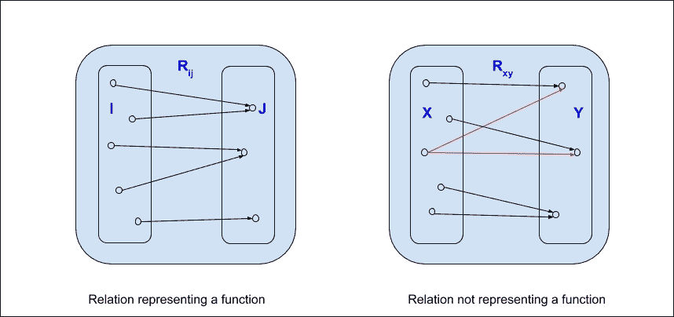

关系和函数

另一个非常重要的问题是映射的一致性。任何函数，当被反复给出相同的输入时，必须产生相同的结果。

遵循我们的直觉，在编程语言中，包括 F#，一个函数代表一种计算，其结果是通过对有效输入进行转换来确定的。与任何具体的计算一样，它消耗一些内存和一定的时间来完成，并携带某种行为。而这种行为，计算的方式，以及转换的方式，反过来是由函数定义决定的。

## 函数定义

通常，F# 函数具有一个名称，有参数（s），返回某种类型的结果，并且有一个主体。以下图展示了这些组件的耦合。函数类似于一个不透明的盒子，对输入进行某种转换以产生输出。它隐藏了转换是如何具体执行的细节，只向世界声明了目的和签名，换句话说，输入和输出的类型。如果函数的定义可用，函数可以被转换成一个白色透明的盒子，拆开不透明的盒子，揭示实现的细节。然而，定义可能可用也可能不可用；后一种情况对于库和模块来说是典型的（记住移动部件的隐藏）。我故意使用了输入而不是参数（s）；我稍后会展示多参数的函数可以用单参数的函数来表示：

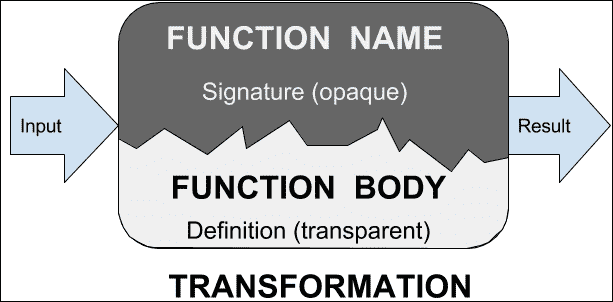

函数组件及其目的

这些函数组件通过绑定函数值的方式，由语言语法连接在一起，如下面的伪代码所示：

```cs
let function-name parameter-list [: return-type] = body-expression 

```

前面的绑定并不是在 F# 中定义函数的唯一方式；它可能为特殊情况携带一些额外的元素。我将在稍后介绍这些缺失的细节。

使用前面的语法，例如，我们可以定义 F# 函数来计算给定半径的圆的面积，如下面的代码所示（`Ch3_1.fsx`）：

```cs
let circleArea radius = System.Math.PI * radius * radius 

```

在这里，`System.Math.PI` 是 .NET `System.Math` 类的一个字段，表示圆的周长与其直径的比值。

使用 FSI 以半径参数的 `5.0` 作为参数值执行这样定义的函数，得到以下结果：

```cs
> circleArea 5.0;; 
val it : float = 78.53981634 
> 

```

值得注意的是，F# 没有引入任何关键字来返回函数结果。结果只是函数内部计算出的最后一个表达式的值。

## 函数类型签名

让我们在 FSI 中输入 `circleArea` 函数的唯一名称，如下面的代码所示：

```cs
> circleArea;; 
val it : (float -> float) = <fun:it@7> 

```

FSI 的响应表示 `circleArea` 函数的类型签名（`float -> float`），这意味着它是一个接受类型为 `float` 的参数并返回类型为 `float` 的结果的函数。这个函数类型签名非常简单。随着我们深入探讨，我们将检查更复杂的函数签名示例。我会向你展示阅读和理解它们对于函数式程序员来说是一项绝对必要的技能。

另一个细心的读者可能已经注意到的细节是：F# 编译器是如何得出`radius`的类型是`float`的结论的？目前，请相信我，编译器是根据名为`类型推断`的确定性过程推断出以下内容的。它在减少 F# 代码中的错误数量以及代码简洁性方面发挥着重要作用。F# 实现了一种非常具体的静态类型推断方式，称为**Hindley-Milner 类型推断算法**([`en.wikipedia.org/wiki/Type_inference`](https://en.wikipedia.org/wiki/Type_inference) )。我将在本章的后面部分对类型推断给予充分的关注。

## 纯函数

计算机函数实现可能具有或不具有更抽象函数概念的关键属性：在给出相同的参数（s）时重复返回相同的结果的一致性。之前定义的`circleArea`函数显然具有这种属性。它不依赖于其参数和定义之外的任何东西，并且不会改变任何东西，只是简单地返回一个幂等结果。具有这些有用属性的函数被认为是**纯函数**，或**引用透明**([`en.wikipedia.org/wiki/Referential_transparency`](https://en.wikipedia.org/wiki/Referential_transparency) )；否则，它们依赖于某些东西或具有副作用，因此是**非纯函数**。

让我演示一个简单的非纯函数，以下代码（`Ch3_1.fsx`）中：

```cs
let opaque arg = 
  System.DateTime.Now.Second * (if arg % 2 = 0 then 2 else 1) 

```

在 FSI 中运行上一行代码会得到以下结果：

```cs
> opaque 15;; 
val it : int = 46 
> opaque 15;; 
val it : int = 49 
> opaque 16;; 
val it : int = 112 
> opaque 16;; 
val it : int = 6 

```

因此，通过简单地观察其后续使用重复参数的调用，`opaque` 杂质变得明显。

# 函数参数和参数

在以下代码（`Ch3_1.fsx`）给出的示例函数定义中：

```cs
let circleArea radius = 
  System.Math.PI * radius * radius 

```

`radius` 标识符代表函数**参数**，即函数期望转换的值的名称。在函数使用时提供的参数值代表函数**参数**，如下所示，当我们应用以下代码行中的函数时：

```cs
circleArea 15.0 

```

`15.0` 是上一行函数的参数。

## 元组预览

在这一点上，为了揭示关于函数参数的更多细节，需要某种概念，这在逻辑上属于完全不同的语言功能，具体来说是数据类型。我正在谈论**元组**。由于似乎不可能构建一个理想的直线故事线，我将在这里提供必要的预览，然后在后续章节中重新探讨元组的问题。

**元组**（[`msdn.microsoft.com/en-us/library/dd233200.aspx`](https://msdn.microsoft.com/en-us/library/dd233200.aspx)）是一种不可变的 F#数据类型，它表示一个括号内、逗号分隔的、有序的任意值组合。也就是说，组合至少包含一对值。这些值的类型完全任意，它们是否相同无关紧要。

一个元组的例子如下：

```cs
let dateParts = (2016,"Feb",29) 

```

元组的构成值也可以用表达式表示，如下面的代码所示：

```cs
let (perimeter,area) = 
  (System.Math.PI * 2\. * r, System.Math.PI * r * r) 

```

我将通过介绍元组类型签名来结束这个简短的预览。它是由按照既定顺序排列的构成类型组成的，并由`*`符号分隔。因此，按照这种安排，前面代码中显示的`dateParts`元组的类型是`int*string*int`。

## 特殊类型 unit

函数领域还有一个组成部分，它来自计算机编程函数和数学函数之间的区别。这是唯一目的在于表示参数和/或结果缺失的特殊类型，即`unit`。这种类型是最简单可以想象的，只有一个值，由一对没有任何内容的括号表示。以下是其表示形式：

```cs
() 

```

尽管如此，`unit`在表示缺失指示符方面发挥着重要作用。这种缺失可能表现为以下函数定义，它可以是一个生成 0 到 1000 之间随机数的穷举法（`Ch3_1.fsx`）：

```cs
let getNextRandom () = (%) System.DateTime.Now.Ticks 1000L 

```

如果你考虑前面的绑定，那么在`getNextRandom`后面有`()`是唯一区分表示计算过程的函数绑定和表示单个计算结果的值绑定的方法。

事实上，如果我用 FSI 运行这两个绑定变体，差异应该是值得记忆的：没有`unit`参数时，`getNextRandom`绑定到一个不可变的`int64`值；否则，它绑定到一个具有（`unit -> int64`）签名的函数，并且每次被反复调用后，它都会返回不同的结果。以下截图捕捉了这个区别：

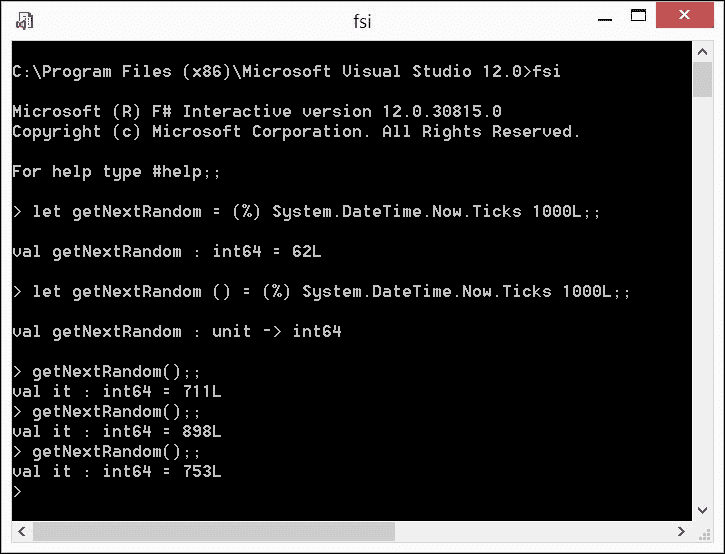

单位参数区分了值绑定和函数绑定

当`unit`是函数返回的表达式的值时，也有一个类似有趣的案例。直观上应该会提示你，如果一个函数返回空值，或者说`()`，那么它的目的可能是引起副作用。让我们稍微改变`getNextRandom`的定义，如下面的代码（`Ch3_1.fsx`）所示：

```cs
let getNextRandom () = 
  printfn "%d" ((%) System.DateTime.Now.Ticks 1000L) 

```

现在，函数签名变为（`unit -> unit`），调用它，仅输出 0 到 999 之间的随机数，返回类型为`unit`。

## 柔性函数和部分函数应用

让我们定义一个简单的函数，`myPrintFunC`，它接受一个`string`和一个`int`作为参数，并返回`unit`，如下面的代码所示：

```cs
let myPrintFunC header value = printfn "%s %d" header value 

```

`myPrintFunC` 的类型是 (`string -> int -> unit` )。

另一个几乎相同且简单的函数是 `myPrintFunT`，它也接受一个 `string` 和一个 `int` 作为参数，并返回 `unit`，但参数的打包方式如下所示：

```cs
let myPrintFunT (header,value) = printfn "%s %d" header value 

```

`myPrintFunT` 的类型是 (`string*int -> unit` )。

应用 `myPrintFunC` `"The Answer is" 42` 输出 `The Answer is 42`。同样，应用 `myPrintFunT ("The Answer is", 42)` 也输出 `The Answer is 42`。那么，为什么会有这么大的争议呢？

基本的区别在于这些函数接受参数的方式：`myPrintFunC` 的参数是柯里化的，但 `myPrintFunT` 的参数是打包的。

由于熟悉元组，你不会对 `myPrintFunT` 中的 `let t = ("The Answer is", 42)` 输出相同的结果：`The Answer is 42` 感到惊讶。`myPrintFunT` 的签名让我们想起了类型为 `string*int` 的单一函数参数。

`myPrintFunC` 的情况更有趣。其签名中的箭头 `->` 是右结合操作，因此我可以将其签名重写为 (`string -> (int -> unit)` )，对吗？但是等等；(`int -> unit` ) 不不正是表示一个接受 `int` 参数并返回 `unit` 的函数吗？是的，它确实如此。所以，回到 `myPrintFunC`，为什么我不能将其视为一个接受 `string` 参数并返回一个新的中间函数的函数，该中间函数再接受 `int` 参数并返回 `unit` 呢？最后，函数在 F# 中是一等公民，所以返回值可以是函数类型。现在让我们回到以下代码：

```cs
(myPrintFunC "The Answer is") 42 

```

这仍然返回 `The Answer is 42`。为了使机制完全透明，让我们在 FSI 中逐步执行前面的转换步骤：

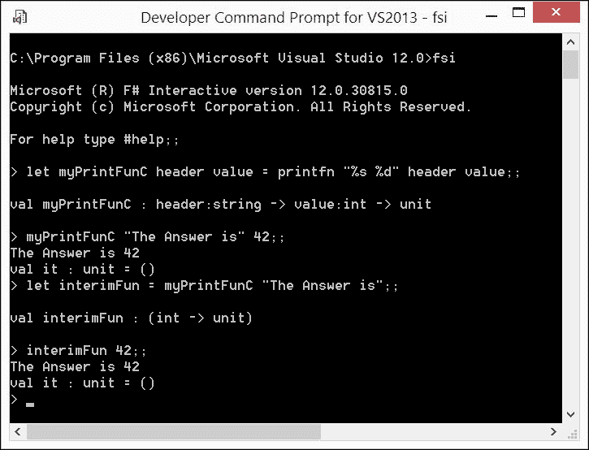

部分函数应用

如前述截图所示，`myPrintFunC` 函数最初定义为具有两个参数。当它仅应用于第一个参数时，它返回另一个函数，`interimFun`，它只有一个参数，如果将其应用于第二个参数，将返回与原始函数应用于两个参数时完全相同的结果。正如预期的那样，结果是 `The Answer is 42`；道格拉斯·亚当斯的粉丝已经知道了这一点。

向你表示祝贺；你刚刚掌握了函数式编程中极其重要的技术之一，即 **部分函数应用**。部分应用通过简单地省略一个或多个后续函数参数来实现。

因此，**柯里化**建立在部分函数应用的原则之上。任何以柯里化形式定义的多参数函数定义只是柯里化过程的语法糖，隐式地将原始定义转换为函数的组合，每个函数包含一个参数。柯里化是 F# 的默认特性；它使得部分函数应用随时可用。

## 函数参数的数量和类型以及返回值

我想要重申之前关于 F#函数参数和返回值的发现，以便给你留下一个非常简单的心理模型，那就是：

### 注意

所有 F#函数都有一个单一参数并返回一个单一结果。

没有参数和/或没有返回值的函数使用`unit`值代替省略的实体。

具有多个参数和多个返回值的函数可以通过将参数和返回值合并成一个元组来适应前面的模型。

以柯里化形式具有多个参数的函数通过将第一个参数作为输入并返回一个新函数，该函数具有部分应用的这个参数，从而通过重复转换适应单个参数模型。

关于前面原则的更细致的细节来自.NET 方面，当我们不仅处理原始的 F#函数，还处理.NET 库和我们的自定义类型的静态和实例方法时。这些内容将在后面的章节中介绍。

# 高阶函数

我在很多场合提到过，函数在 F#中是一等实体，因为它们可以用作其他函数的参数，或者可以从其他函数作为结果返回。这正是高阶函数的指示。一个高阶函数可能有一个函数作为参数，它可能返回另一个函数作为结果，或者它可能同时执行这两件事。

在 F#中，所有函数都被视为函数值；这种处理方式允许你在任何使用值的环境中不区分函数和其他类型的值。我将在这里介绍一些这样的环境，即作为另一个函数的参数、从函数返回的值以及数据结构的一部分。

## 匿名函数

在某些情况下，定义一个没有显式名称的函数是有意义的。通常，这种能力对于被高阶函数操作的函数来说是非常有用的。需要一种简洁的方式来设置参数或结果，而不涉及完整的函数定义。为什么需要这样呢？首先考虑的是，名称可能需要用于未来的引用。如果一个函数通过名称定义，并且这个名称在程序代码的其他位置被多次引用，那么这个有名称的函数就非常有意义。相反，如果一个函数作为高阶函数的参数定义，并且从未在这个单一出现之外使用，那么这个名称就是多余的。另一个考虑因素是函数值的用法；例如，将一个函数作为另一个函数的参数使用可能不需要为前者命名。

定义匿名函数的语法如下：

```cs
fun parameter-list -> expression 

```

在这里，`parameter-list` 代表成对或柯里化的参数名称，可选地带有显式的参数类型。请注意，使用 `fun` 关键字定义的匿名函数代表一个 **lambda 表达式** ([`msdn.microsoft.com/en-us/library/dd233201.aspx`](https://msdn.microsoft.com/en-us/library/dd233201.aspx) )。lambda 表达式具有匿名函数表示的值。理解这一点对于理解 F# 中函数的一等公民待遇非常重要。

## 函数作为参数

函数作为参数可能是函数式程序中最常见的用法。典型的 F# 库实现为高度优化的高阶函数集合，可以通过提供特定的函数作为参数来针对任何具体任务进行调整。例如，可以使用 `Array2D.init` 库函数创建一个 5x5 的平方标量矩阵，其对角线元素为 1。**Array2D.init** ([`msdn.microsoft.com/en-us/library/ee353720.aspx`](https://msdn.microsoft.com/en-us/library/ee353720.aspx) ) 是一个高阶函数，其签名是 (`int->int->(int->int->'T)->'T[,]` )，其中签名的内部部分代表所谓的 **初始化器** 或根据索引设置矩阵各个元素的函数。以下匿名函数可以用来根据索引初始化对角矩阵的元素：

```cs
fun x y -> if x = y then 1 else 0 

```

以下屏幕截图展示了在 FSI 中通过将前面的函数插入到表达式 (`Ch3_2.fsx` ) 中来完成此任务，如下所示：

```cs
Array2D.init 5 5 (fun x y -> if x = y then 1 else 0) 

```

观察正在构建并显示的所求矩阵：

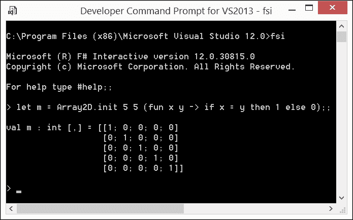

使用匿名函数作为高阶函数的参数

## 函数作为返回值

正如我在函数定义部分提到的，函数的返回值只是最后一个表达式的值。为了返回一个函数，我们可以在宿主函数的最后一个表达式中使用：要么是一个匿名函数定义，要么是部分函数应用。

让我们通过进行更难的练习来探讨这个问题。通常，有一个函数可以让你精确测量被其他函数包裹的任意计算的执行时间是非常有帮助的。此外，将环境信息嵌入到测量结果中也是非常有用的。

因此，我将实现一个高阶函数`stopWatchGenerator`，它接受另一个函数`f`作为自己的参数，该函数具有参数`x`，并返回一个由匿名函数表示的函数值，该匿名函数具有完全相同的签名。这个匿名函数只是用这个以毫秒精度测量的计算持续时间包装了计算(`f x`)。它将测量的持续时间传达给输出设备，并附带主可执行文件的名字。所以，对于 32 位 FSI，它将是`[fsi]`；对于 64 位 FSI，它将是`[fsiAnyCPU]`；对于自定义可执行文件，它将是可执行文件的名字。有时，这样的实用工具可以非常有帮助，对吧？

实现如下面的代码所示(`Ch3_3.fsx`)：

```cs
let stopWatchGenerator (f:('a->'b)) (x: 'a) : (('a->'b)->'a->'b) = 
  let whoRunsMe = 
    System 
    .Diagnostics 
    .Process 
    .GetCurrentProcess() 
    .MainModule 
    .FileName 
    |> System.IO.Path.GetFileNameWithoutExtension 
    |> sprintf "[%s]:" in 
  fun f x -> 
    let stopWatch = System.Diagnostics.Stopwatch() in 
    try 
      stopWatch.Start() 
      f x 
    finally 
      printf "Took %dms in %s\n" 
      stopWatch.ElapsedMilliseconds 
      whoRunsMe 

let whatItTakes f x = (stopWatchGenerator f x) f x 

```

请注意，我故意为`stopWatchGenerator`的参数`f`（这是一个接受泛型类型`'a`的参数并返回泛型类型`'b`的结果的函数）和`x`（它是类型`'a`的值），以及`stopWatchGenerator`的返回类型（它是一个接受类型`('a->'b)`和`'a`的两个柯里化参数的函数，并返回类型`'b`的结果的函数）指定了显式类型。

你的头开始转了吗？这是正常的，请放心，你会逐渐习惯这些看似复杂的操作，并且很快会发现它们就像苹果派一样简单。

函数`stopWatchGenerator`使用`fun` lambda 表达式返回所需的匿名函数，该表达式创建.NET `System.Diagnostics.Stopwatch()`的实例，并在评估目标表达式(`f x`)的周围包装其开始和读取。

函数`whatItTakes`只是函数评估阴影计时安排的一个方便缩写。

下面的截图显示了使用生成的函数的两个示例：

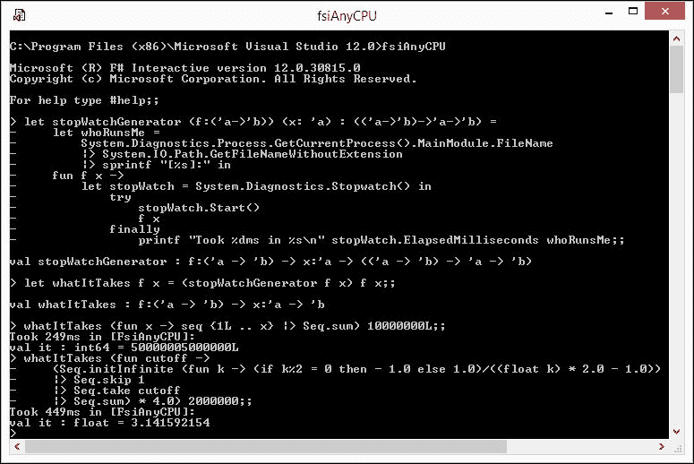

返回另一个函数的函数的实际应用

第一个用例检查了生成并累加前 1000 万个正数所需的时间，如下面的代码所示：

```cs
> whatItTakes (fun x -> seq {1L .. x} |> Seq.sum) 10000000L;; 
Took 242ms in [fsianycpu]: 
val it : int64 = 50000005000000L 
> 

```

第二个用例演示了通过应用**Gregory 级数**([`mathworld.wolfram.com/GregorySeries.html`](http://mathworld.wolfram.com/GregorySeries.html))方法，使用任意系列长度来计算一定精度的π的方法，如下面的代码所示：

```cs
> whatItTakes (fun cutoff -> 
  (Seq.initInfinite (fun k -> (if k%2 = 0 then - 1.0 else  1.0)/((float k) * 2.0 - 1.0)) 
  |> Seq.skip 1 
  |> Seq.take cutoff 
  |> Seq.sum) * 4.0) 2000000;; 
Took 361ms in [fsianycpu]: 
val it : float = 3.141592154 
> 

```

如结果所示，Gregory 级数并不是计算π的最佳公式；然而，它可以用来展示函数值的强大功能。

## 函数作为数据类型组成部分

现在，你可能会有一个狡猾的问题：“原始类型值可以组合成更复杂类型；例如，一些`int`值可以存储在一个`int`数组中。如果函数真的是一等值，它们应该允许类似的组合。那么，构建一个函数数组怎么样？”

我的回答是：“当然，为什么不呢？”让我们考虑以下函数定义（`Ch3_4.fsx`）：

```cs
let apply case arg = 
  if case = 0 then 
    sin arg 
  elif case = 1 then 
    cos arg 
  elif case = 2 then 
    asin arg 
  elif case = 3 then 
    acos arg 
  else 
    arg 

```

`apply`函数接受两个参数，如果第一个参数`case`在`0`到`3`的范围内，它将对第二个参数`arg`应用相应的数学库三角函数。否则，它只返回未更改的`arg`值，这是一个平淡无奇的实现。让我们通过以下代码将函数排列成数组来增加一些趣味：

```cs
let apply' case arg = 
  try 
    [|sin; cos; asin; acos|].[case] arg 
  with 
    | :?System.IndexOutOfRangeException -> arg 

```

我使用了 F#的`try...with`结构来筛选出需要特定函数应用的情况值实例，以及那些只返回`arg`回声的实例。

这是通过`[|sin; cos; asin; acos|]`结构实现的，它具有（`float -> float`）`[]`签名。这意味着正好符合预期，或者是一个相同类型的函数数组（接受类型为`float`的单个参数并返回类型为`float`的结果）。每个数组元素位置都与特定的函数实例相关联，通过`[case]`索引器，或者`[|sin; cos; asin; acos|]``.[0]`返回`sin`，`[|sin; cos; asin; acos|]``.[1]`返回`cos`，依此类推。`[|sin; cos; asin; acos|].[case]`表达式的值是一个函数，其中情况值在`0`到`3`的有效范围内。因此，它可以应用于`arg`，得到相应的结果。超出有效范围的情况值将引发`System.IndexOutOfRangeException`异常，并通过简单地返回`arg`的回声值来捕获和处理。我必须承认，像上面那样滥用异常机制是糟糕的编码实践，但请原谅我在演示一些完全无关的功能时在玩具示例中使用它。

## 函数是接口

考虑到 F#作为以函数优先的语言，同时支持.NET 的面向对象类型系统，值得探讨函数与接口之间的关系。原版的《设计模式：可复用面向对象软件的基础》（[`www.informit.com/store/design-patterns-elements-of-reusable-object-oriented-9780201633610`](http://www.informit.com/store/design-patterns-elements-of-reusable-object-oriented-9780201633610)）在其引言中指出了以下可复用面向对象设计的原则：

> *针对接口编程，而不是针对实现。*

从这个角度来看，函数是接口的精髓。在面向对象的世界里，接口必须在其实施之前被显式声明，以便另一个实现可以被替换，而在函数式编程领域，这种声明是多余的。只要两个或多个函数具有相同的签名，它们就可以在代码中互换使用。函数签名相当于接口。

我之前的函数数组示例清楚地展示了如何通过更改数组元素索引值来实现实现的更改。

# 闭包

正如我之前提到的，函数的结果取决于参数。这种依赖是否详尽？当然不是。函数定义存在于一个词法上下文中，并且可以在将参数转换为结果的过程中自由使用该上下文中的某些实体。让我们考虑以下代码示例 (`Ch3_5.fsx` )：

```cs
let simpleClosure = 
  let scope = "old lexical scope" 
  let enclose() = 
    sprintf "%s" scope 
  let scope = "new lexical scope" 
  sprintf "[%s][%s]" scope (enclose()) 

```

前面的 `enclose()` 函数除了 `unit` 没有任何参数。然而，返回的结果取决于在函数定义时词法作用域中的自由值 `scope`。将 `scope` 值绑定到 `"old lexical scope"`。这个值被捕获，由 `enclose()` 定义“封闭”。这两个部分一起构成了一个名为 **闭包** 的特殊实体。这个过程在以下图中以示意图的形式展示：

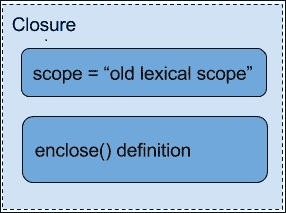

闭包的一个示例

因为它们是封闭的，所以自由值不会改变。在以下示例中，值 `scope` 在后来被新的值 `"new lexical scope"` 覆盖。然而，这并不会改变闭包中捕获的值。这反映在以下图中，显示了在 FSI 中运行最后一个示例，其中旧的和新的作用域共存：

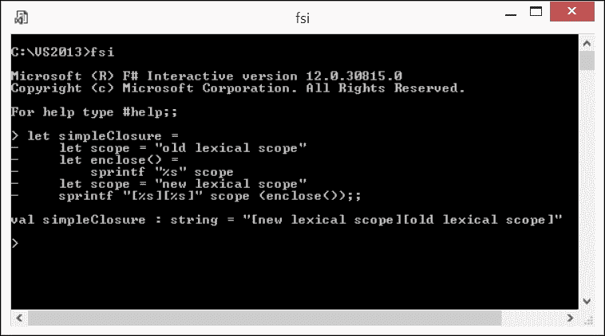

简单闭包的实际应用

这里，我提供了另一个闭包的示例，这次演示了匿名函数定义创建的闭包中状态的捕获和更新 (`Ch3_5.fsx` )：

```cs
let trackState seed = 
  let state = ref seed in 
  fun () -> incr state; (!state, seed) 

```

在这个片段中，`trackState` 函数将其自己的参数捕获到一个闭包中，并伴随着匿名函数，每次调用时都会增加这个闭包中隐藏的局部计数器。接下来的图示展示了两个独立的闭包，`counter1()` 和 `counter2()`，它们分别由不同的 `trackState` 调用创建，使用不同的种子跟踪它们自己的状态：

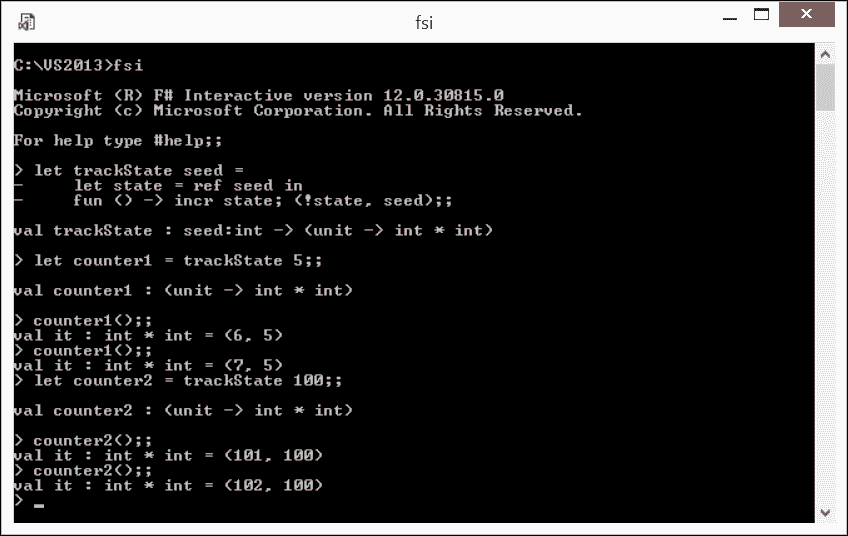

代表对象的闭包

这个示例突出了闭包如何被用来表示内部字段，即使语言实际上并不支持对象。在这方面，正如一个编程寓言所说，**闭包是穷人的对象** ([`c2.com/cgi/wiki?ClosuresAndObjectsAreEquivalent`](http://c2.com/cgi/wiki?ClosuresAndObjectsAreEquivalent) ) 确实。

## 可变值

在函数式优先语言的精神下，F# 的值默认是不可变的。然而，该语言提供了使用可变值的设施。

可变变量可以使用值绑定的 `let mutable` 语法和 `<-` 赋值运算符来创建，以改变之前绑定的值。使用 `let mutable` 绑定的可变值存储在栈上。

直到 F# v4.0，不允许在闭包中捕获可变值编写代码，但从语言的 v4.0 版本开始，这种限制已经被取消。

## 引用单元格

对于可变值，有一个来自 OCaml 的引用单元格的替代设施。这些值使用特殊的 `ref` 函数和 `let` 绑定在堆上分配。引用单元格的底层值可以通过解引用运算符 `!` 来访问。引用的值可以通过特殊的赋值运算符 `:=` 来修改。

可变值和引用单元格之间存在细微的区别：可变值是通过值复制的，而引用单元格是通过引用复制的。让我提供一个代码片段来说明这个问题 (`Ch3_6.fsx`)：

```cs
let mutable x = "I'm x" 
let mutable y = x 
y <- "I'm y" 
sprintf "%s|%s" x y 

let rx = ref "I'm rx" 
let ry = rx 
ry := "I'm ry" 
sprintf "%s|%s" !rx !ry 

```

下图通过在 FSI 中运行前面的代码片段来演示这种差异：可变值 `x` 和 `y` 是独立的，因此改变 `y` 的值从与 `x` 的值相同到不同的值并不会以任何方式影响 `x`；它们的值保持不同。

然而，`rx` 和 `ry` 引用了同一个对象，所以通过 `ry` 引用更改底层对象时，同时也会将 `rx` 引用的先前对象更改为 `ry` 引用的同一个对象：

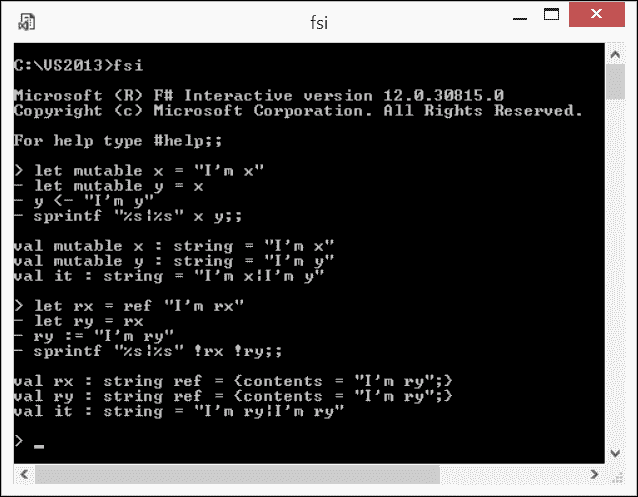

可变值和 ref 值之间的区别

# 类型推断

我已经在本章前面概述了类型推断。这是 F#（以及许多其他语言：首先是 C#）的一个特性，源于其静态类型属性。通过遵循从上到下、从左到右的自然代码流方向，F# 编译器能够推导出代码中存在的值的类型，包括函数类型。这种能力反过来又允许你从 F# 代码中省略显式类型声明。最终，代码可以更快地编写，相当简洁，如果编译成功，在类型上是一致的。

在编写 F# 代码时，依赖类型推断不是强制性的。在以下场景中添加显式声明可能特别有意义：

+   当类型无法推断且编译器提示显式声明时

+   如果代码的作者认为在某些情况下提供显式类型声明可以简化代码理解并提高其可读性

推断值类型的最明显方式是在绑定期间，根据等号右侧表达式的类型进行推断，如下面的代码所示 (`Ch3_7.fsx`)：

```cs
let s = "I'm a string" 
let dict = 
  System.Collections.Generic.Dictionary<string, string list>() 

```

对于 `s`，这是右侧字面量的类型，或 `string`。对于 `dict`，这是在绑定右侧构建的 `Dictionary<string, string list>` 类型的实例。在前面提到的类似情况下，添加 `s` 和 `dict` 的显式声明只会给代码添加不必要的噪音。

另一个相当明显的情况是在某些情况下根据函数体的定义推断函数签名，如下面的代码所示 (`Ch3_7.fsx`)：

```cs
let gameOutcome isWin = "you " + if isWin then "win" else "loose" 

```

在这里，由于 `isWin` 在 `if` 之后使用，这一事实允许 F# 编译器推断其类型为 `bool`；返回类型显然是 `string`，因此 `gameOutcome` 函数的签名可以推断为 (`bool->string`)。简单，对吧？

类型推断失败的情况可能并不简单，以下（相当天真）的片段（`Ch3_7.fsx` ）可以说明：

```cs
let truncator limit s = 
  if s.Length > limit then 
    s.Substring(0, limit) 
  else 
    s 

```

在这里，F# 编译器对 `s.Length` 和 `s.Substring` 抱怨，如下所示：

> *基于程序点之前的信息在不确定类型的对象上进行查找。在程序点之前可能需要一个类型注解来约束对象的类型。这可能允许查找被解决。*

将函数定义更改为 `let truncator limit (s: string) =` 会使 F# 编译器再次满意。

此外，如果我不那么天真，至少对边界情况进行一些检查，就像在以下代码的略微增强定义中所示（`Ch3_7.fsx` ）：

```cs
let truncator' limit s = 
  if not (System.String.IsNullOrEmpty s) && s.Length > limit then 
    s.Substring(0, limit) 
  else 
    s 

```

然后，编译器可以从 `System.String.IsNullOrEmpty` 库函数的参数使用中推断出 `s` 的类型为 `string`；不再需要显式类型声明。

在静态约束泛型类型的领域中，类型推断变得更加重要。让我们考虑一个 `logAndTrash` 函数的略微复杂示例，它接受一个可丢弃的 `ss` 集合，将每个 `s` 项作为单独的文本行写入 .NET `StringBuilder`，丢弃集合，并返回最终的 `StringBuilder` 值，以便在其他地方稍后使用，如下所示代码（`Ch3_7.fsx` ）：

```cs
let logAndTrash ss = 
  let log = System.Text.StringBuilder() 
  for s in ss do 
    sprintf "%A" s|> log.AppendLine |> ignore 
  (ss :> System.IDisposable).Dispose() 
  log 

```

F# 编译器非常体贴，能够推断出 `logAndTrash` 函数相当复杂的签名，其字面意思是如下所示：

```cs
'a -> System.Text.StringBuilder 
  when 'a :> seq<'b> and 'a :> System.IDisposable 

```

或者用简单的话来说，这是一个接受泛型类型 `'a` 的值的函数，并返回一个 `StringBuilder` 实例的函数，其中 `'a` 必须是任何泛型类型 `'b` 的序列，并且同时是可丢弃的。

之前代码示例中展示的类型推断案例总结如下。

### 提示

在 F# 中，值、函数和具有约束的泛型的类型可以在许多代码上下文中明确推断，包括但不限于-字面量、构造实例、在特定表达式部分的使用、库或自定义函数或方法的签名。

# 递归函数基础知识

在本章中，我想向您介绍递归函数的基础知识，并将更详细的考虑留给更高级的上下文。在此阶段，我想展示 F# 默认将函数视为非递归处理与使用 `let` 绑定修饰符 `rec` 显式声明递归函数时的强制递归处理有何不同。

看一下以下这个有些牵强的片段 (`Ch3_8.fsx` ):

```cs
let cutter s = 
  let cut s = 
    printfn "imitator cut: %s" s 
  let cut (s: string) = 
    if s.Length > 0 then 
      printfn "real cut: %s" s 
      cut s.[1..] 
    else 
      printfn "finished cutting" 
  cut s 

```

这里提供的 `cutter` 函数返回一个非空字符串，其目的是从左侧开始，逐个符号地切割，直到参数消失。在 `cutter` 函数体内，有两个 `cut` 内部函数的定义，其中第二个定义显然覆盖了第一个定义。此外，在第二个 `cut` 定义中，它通过将参数从左侧缩短一个字符来自身调用，这是一个明显的**递归**案例（[`en.wikipedia.org/wiki/Recursion`](https://en.wikipedia.org/wiki/Recursion)）。

以下屏幕截图显示了将前面的代码输入到 FSI 中并执行，产生了一些输出：

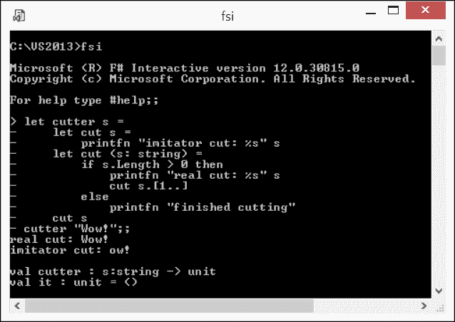

函数定义的默认非递归作用域

然而，显然，这段代码并没有按预期工作，因为为了自引用，当出现 `cut s.[1..]` 时，第二个 `cut` 定义在词法上并不完整。第二个 `cut` 定义没有覆盖第一个 `cut` 定义模仿的实例，因此第二个（真实）`cut` 的单个输出后面跟着模仿 `cut` 的单个输出，计算在这里完成。哎呀，这离预期的输出相差甚远！

在下面的屏幕截图中，`cut` 的第二个定义被 `rec` 修饰符点缀：

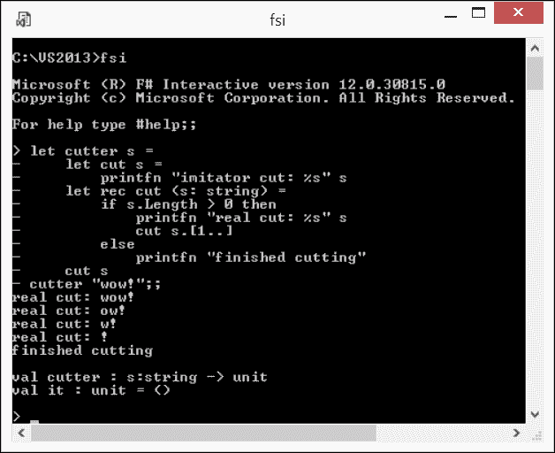

函数定义的强制递归作用域

现在，`cut` 的第二个定义立即覆盖了第一个定义，允许第二个内部 `cut` 函数真正地调用自身，这反映了输出变化；现在，实现的行为正如预期：所有执行过的切割都是真实的。

因此，到目前为止，你应该能够理解 `rec` 修饰符使函数值立即可用以供引用，无需等待函数定义在词法上完整，从而使得函数能够引用自身。

# 运算符作为函数

抽象地思考，什么是运算符？它可以被视为一个或两个参数的函数，这些参数只有一个简洁的名称，由一个或非常少数量的符号表示。F# 热切地支持这种抽象。例如，看看以下表达式：

```cs
(%) 10 3 = 10 % 3 

```

在等号（`=`）的左侧，调用 `(%)` 函数，参数为 `10` 和 `3`。在等号（`=`）的右侧，仅存在一个 `10 % 3` 表达式。在 FSI 中评估整个表达式，其值为 `true`，因为等号（`=`）左右两侧的子表达式确实相同。

此外，等号（`=`）本身也是一个运算符。在 FSI 中使用以下表达式评估等号（`=`）本身 `=(=);;` 将揭示以下函数签名：

```cs
('a -> 'a -> bool) when 'a : equality 

```

前面的签名意味着（`=`）是一个接受两个泛型类型 `'a` 支持相等性的参数并返回 `bool` 值的函数。

### 注意

有关 F# 核心运算符的描述，请参阅**核心.运算符模块 (F#)** ([`msdn.microsoft.com/en-us/library/ee353754.aspx`](https://msdn.microsoft.com/en-us/library/ee353754.aspx))。那些想要定义自己的运算符的人，如果适度进行，这不是一件坏事，我推荐阅读**运算符重载 (F#)** ([`msdn.microsoft.com/en-us/library/dd233204.aspx`](https://msdn.microsoft.com/en-us/library/dd233204.aspx))。

# 函数组合

函数组合可能是函数程序员需要掌握的最基本技能。尽管这可能听起来很简单，但这实际上是关于将一些函数组合成一个更强大的组合。这听起来可能接近我之前提到的更高阶函数，确实如此。函数组合就是专注于构建函数应用链，从而从更简单的一组中实现更强大的数据转换。

## 组合子

如果按照定义，用于组合的函数只是某种黑盒，只能消耗参数并产生结果，那么函数组合究竟是如何进行的呢？这是正确的；函数、参数和应用的单一操作都是组合所需的所有内容（记住最小化移动部件）。尽管如此，组合仍然是由函数执行的。那些仅通过其参数或值（其中一些可能是函数值）来产生结果，而不涉及任何外部上下文的函数被称为**组合子**。在应用数学中有一个完整的分支，即**组合逻辑**([`en.wikipedia.org/wiki/Combinatory_logic`](https://en.wikipedia.org/wiki/Combinatory_logic))，它特别关注组合子的学习。这可能采取非常任性的形式；那些想要深入研究的人，我建议你们在 Google 中搜索“idiot bird combinator”字符串并跟随链接。

### `id` 组合子

组合子的最简单代表是 `id`。在 FSI 中输入 `(id);;` 可以揭示这个函数签名 `('a -> 'a)`。换句话说，这个组合子接受任何值，并简单地返回它，没有任何转换。

### 前向管道 |>

这个组合子是惯用 F# 的主要工作马。在 FSI 中输入 `(|>);` 可以揭示这个函数签名 `('a -> ('a -> 'b) -> 'b)`。换句话说，这个组合子将其第二个参数，即函数 `('a -> 'b)`，应用于其第一个参数 `'a`，从而得到结果 `'b`。

此外，可能看起来顺序并不那么重要；然而，实际上它确实很重要。涉及的一个因素是类型推断，它在管道函数组合（记住从左到右）中工作得更好。

### 后向管道 <|

在 FSI 中输入`(<|);` ;可以揭示这个函数签名：`(('a -> 'b) -> 'a -> 'b)`。换句话说，这个组合器将其第一个参数`('a -> 'b)`应用于第二个`'a`，得到结果`'b`。乍一看，这个组合器可能显得有些多余。然而，当它变得有用的重要情况之一是消除参数周围的括号，并最终提高代码的可读性。

### 前向组合 >>

这个组合器将函数组合在一起。在 FSI 中输入`(>>);;`可以揭示这个函数签名`(('a -> 'b) -> ('b -> 'c) -> 'a -> 'c)`。换句话说，拥有两个函数和一个参数，它将第一个函数应用于参数，然后将第二个函数应用于第一个应用的结果。

### 后向组合

这个组合器也将函数组合在一起，但它以不同的方式做这件事。在 FSI 中输入`(<<);` ;可以揭示这个函数签名`(('a -> 'b) -> ('c -> 'a) -> 'c -> 'b)`。换句话说，拥有两个函数和一个参数，它将第二个函数应用于参数，然后第一个函数应用于第一个应用的结果。有时，这样的应用顺序可能对提高可读性或其他原因来说很方便。

# 摘要

我预计这一章已经将你的直觉引向了 F#函数式第一性质所基于的一些概念。

从任何相关的代码上下文中识别和提炼这些基石，你现在已经准备好吸收主要内容。在下一章中，我将转向存在于每一个数据转换中的 F#编程技术的基石，即*模式匹配*。
