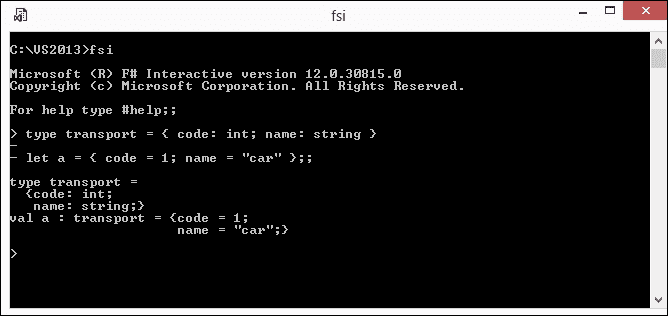
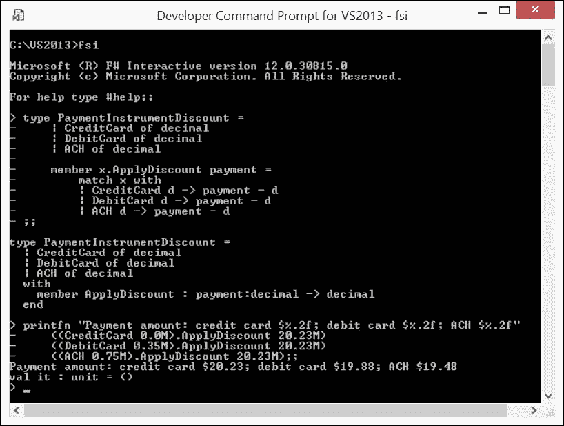

# 第五章  代数数据类型

在本章中，我将转向 F# 的特性，这些特性在主流编程语言（如 C#）中几乎缺失，在计算机科学中统称为**代数数据类型**([`en.wikipedia.org/wiki/Algebraic_data_type`](https://en.wikipedia.org/wiki/Algebraic_data_type) )。它们通过组合其他类型（原始或进一步组合）将原始数据类型提升到更高的类型级别，如下所示：

+   **元组**和**记录**代表**产品代数数据类型**

+   代表**求和代数类型**的**区分联合**

我将像下面这样为这些复合类型的每个方面进行覆盖：

+   类型组合

+   类型相等性和比较

+   类型分解

+   类型增强

我将重新探讨模式匹配作为一种类型分解工具，它通常可以应用于 `match` 构造之外。

# 将数据与代数数据类型结合

通常，传统程序员会通过面向对象范式来考虑数据组合的问题。

每个人通常都会直观地理解**原始数据类型**是基本、内置的类型，由编译器或库支持：`int64`、`string`、`bigint`（尽管如果严格来看，`string`可能被视为`char`数组，而`bigint`则被视为**记录**）。

程序员接下来学到的是，原始类型的实例可以聚合到集合中，如**数组**或**列表**。然而，这些集合是单态的。也就是说，所有集合成员的类型必须相同。这相当有限，不是吗？

面向对象范式通过**类**扩展了原始类型。类仅代表一个自定义类型，它通过封装隐藏了数据组合的细节，并仅向公共属性提供可见性。通常，.NET 库提供了大量的此类复合类型，例如，`System.DateTime`。

F# 当然也支持以这种方式构造复合数据类型。然而，每次需要复合类型时都遵循繁琐且容易出错的**纯旧 C**（**POCO**）方式，这与 F# 简洁且无错误的代码承诺不符。出路在哪里？欢迎来到代数数据类型！

# 产品代数数据类型

在最简单的情况下，考虑我使用**集合积**的类比来组合类型 `A` 和 `B`；结果将是一个数据对集合，其中第一个对成员是类型 `A`，第二个成员是类型 `B`，整个组合是 A 和 B 的笛卡尔积。

F# 提供了两种产品代数数据类型，即**元组**和**记录**。

## 元组

我已经在之前的章节中提到了元组；现在我将更深入地探讨这个主题。

### 元组组合

元组是由两个或更多任意类型的值组合而成的。元组值元素的类型可以是任何类型：原始类型、其他元组、自定义类和函数。例如，看看以下代码行（`Ch5_1.fsx`）：

```cs
let tuple = (1,"2",fun() ->3) 

```

这表示由三个元素组成的元组，其类型为 `int* string * (unit -> int)`。

为了属于同一类型的元组，两个元组值必须具有相同数量的元素，并且这些元素在出现顺序上具有相似的类型。

### 元组的等价性和比较

如果每个元素类型都支持等价约束，F# 会自动实现元组的结构等价。元组相等当且仅当它们的元素成对相等，如下面的代码所示（`Ch5_1.fsx`）：

```cs
let a = 1, "car" 
a = (1, "car") 

```

前面的等式表达式值为 `true`。然而，对于绑定在 `tuple` 上的以下表达式的值，编译器会报错（`Ch5_1.fsx`）：

```cs
tuple = (1,"2",fun() ->3) 

```

编译器会抱怨 `(unit -> int)` 类型，它是构成元组第三个元素的函数，不支持 `'equality'` 约束。F# 函数值没有定义等价关系。

F# 默认提供了元组的结构比较，它基于从左到右的字典序元素对之间的比较，前提是所有元素类型都满足 `'comparison'` 约束，如下面的代码所示（`Ch5_1.fsx`）：

```cs
a < (2,"jet") 

```

前面的表达式值为 `true`。

### 使用模式匹配进行元组分解

本章是履行我在第四章中关于数据结构解构工具中模式匹配的承诺的完美地方，即*基本模式匹配*。以下代码片段演示了如何将值绑定功能从 `match` 构造中提取出来（`Ch5_1.fsx`）：

```cs
let (elem1, elem2) = a 
printfn "(%i,%s)" elem1 elem2 

```

在这里，`elem1` 和 `elem2` 实际上获取了元组 `a` 的第一个和第二个元素的值，这通过 `(1,car)` 输出得到了反映。

在特定的元组解构模式中不感兴趣的元组元素可以使用熟悉的 `match-all `_` 模板省略，如下面的代码（`Ch5_1.fsx`）所示：

```cs
let (_,_,f) = tuple in 
f() 

```

这个片段突出了如何从元组值中的第三个元素获取并调用一个函数；前两个元组元素通过 `_` 模板简单地被忽略。

### 元组扩展

元组类型没有显式的名称。这一事实实际上使得正常的 F# 类型扩展变得不可能。尽管如此，仍然有一些空间可以进行一些巧妙的操作。这个操作利用了与其他 .NET 语言进行互操作的需求。

**文档** ([`msdn.microsoft.com/en-us/library/dd233200.aspx`](https://msdn.microsoft.com/en-us/library/dd233200.aspx) ) 指出，元组的编译形式表示类 **Tuple** ([`msdn.microsoft.com/en-us/library/system.tuple.aspx`](https://msdn.microsoft.com/en-us/library/system.tuple.aspx) ) 的相应重载。鉴于这一事实，我可以增强编译表示，并使用增强方法通过类型转换来实现，如下面的代码所示（`Ch5_1.fsx`）：

```cs
let a = 1,"car" 
type System.Tuple<'T1,'T2> with 
  member t.AsString() = 
    sprintf "[[%A]:[%A]]" t.Item1 t.Item2 
(a |> box :?> System.Tuple<int,string>).AsString() 

```

在这里，我增强了一个具有类型 `System.Tuple<'T1,'T2>` 的两个泛型元素的元组，并添加了 `AsString` 实例方法，这允许以非常独特的方式呈现元组值。然后，给定 `int*string` 元组的实例，我使用 `box` 函数将其提升到 `obj` 类型，然后立即使用 `:?>` 操作符将其下转换为 `System.Tuple<int,string>` 类型，随后在欺骗性构建的 `System.Tuple<int,string>` 类实例上调用 `AsString` 增强方法，得到预期的结果，即 `[[1]:["car"]]`。

总结一下，我可以得出结论，元组代表了一种简单的代数数据类型，非常适合简单的设计。在数据组合中使用元组而不是自定义类型是 F# 习惯用法的一个典型例子。

## 记录

记录代表了 F# 另一个原生的产品代数数据类型。它解决了元组异常简单导致的一些缺陷。元组最不利的特性是元组与结构上相似的另一种具体元组类型的绑定缺失。对于 F# 编译器来说，`(1,"car")` 和 `(10,"whiskey")` 没有区别，这把区分实例类型的负担放在了程序员身上。如果能够为结构相似但语义不同的类型提供显式名称，那会很好。同时，为了停止仅仅依赖于元素位置，给元组元素添加唯一名称也会很有帮助。当然，欢迎来到 F# **记录**！

### 记录组合

F# 记录可以被视为具有显式命名类型和标签元素的元组。参考前面脚本 `Ch5_1.fsx` 中给出的元组示例，它可以重写如下（`Ch5_2.fsx`）：

```cs
type transport = { code: int; name: string } 
let a = { code = 1; name = "car" } 

```

将前面的代码片段放入 FSI 后，你会得到以下截图所示的结果：



定义 F# 记录类型和实例

前面的截图直观地展示了在明确标注整体及其部分时，记录相对于元组的优势。

有趣的是，记录字段的命名使得不需要坚持某种特定的字段列表顺序，如下面的代码所示（`Ch5_2.fsx`）：

```cs
let b = { name = "jet"; code = 2 } 

```

没有任何问题，值 `b` 被识别为类型 `transport` 的绑定。

在构造之后，F# 记录实际上是不可变的，类似于元组。语言提供了使用 `with` 修饰符从现有实例创建记录的另一种形式，如下面的代码所示 (`Ch5_2.fsx` ):

```cs
let c = { b with transport.name = "plane" } 

```

这将转换为 `transport { code = 2; name = "plane" }` 的实例。注意使用了“完全限定”的字段名，`transport.name`。我这样写是为了突出如何解决歧义，因为不同的记录类型可能有同名字段。

### 记录的等价性和比较

没有惊喜。F# 默认情况下，为记录提供类似于元组的结构等价性和比较，但显式类型声明在此方面提供了更多的灵活性。

例如，如果不需要结构等价性而需要引用等价性，对于记录来说这不是问题，其类型定义可以装饰有 `[<ReferenceEquality>]` 属性，如下面的代码片段所示 (`Ch5_2.fsx` ):

```cs
[<ReferenceEquality>] 
type Transport = { code: int; name: string } 
let x = {Transport.code=5; name="boat" } 
let y = { x with name = "boat"} 
let noteq = x = y 
let eq = x = x 

```

以下屏幕截图说明了如果在 FSI 中运行此代码会发生什么：


F# 记录的引用等价性

注意，在用 `ReferenceEquality` 属性装饰 `Transport` 类型之后，两个结构上相等的记录 `x` 和 `y` 将不再被认为是相等的。

### 注意

值得注意的是，使用 `[<CLIMutable>]` 属性装饰记录类型使底层记录成为标准可变 .NET CLI 类型，用于互操作性场景；特别是还提供了默认的无参数构造函数和元素可变性。有关更多详细信息，请参阅 **Core.CLIMutableAttribute 类 (F#)** ([`msdn.microsoft.com/en-us/visualfsharpdocs/conceptual/core.climutableattribute-class-%5Bfsharp%5D`](https://msdn.microsoft.com/en-us/visualfsharpdocs/conceptual/core.climutableattribute-class-%5Bfsharp%5D) )。

### 使用模式匹配进行记录分解

使用模式匹配解构记录类似于解构元组，并且可以与或不与 `match` 构造一起工作。从简洁性的角度来看，后者更可取，如下面的代码所示 (`Ch5_2.fsx` ):

```cs
let  { transport.code = _; name = aName } = a 

```

这将丢弃 `a` 的 `code` 字段，因为它不感兴趣，并将它的 `name` 字段与 `aName` 值绑定。同样的效果可以用更短的代码实现：

```cs
let { transport.name = aname} = a 

```

如果只需要单个字段值，那么简单的 `let aName' = a.name` 也可以。

### 记录增强

为 F#记录显式声明类型允许大量扩展。一个实现线程安全可变**单例**属性的记录类型扩展的示例可以在**SqlClient 类型提供程序代码**中找到（[`github.com/fsprojects/FSharp.Data.SqlClient/blob/c0de3afd43d1f2fc6c99f0adc605d4fa73f2eb9f/src/SqlClient/Configuration.fs#L87`](https://github.com/fsprojects/FSharp.Data.SqlClient/blob/c0de3afd43d1f2fc6c99f0adc605d4fa73f2eb9f/src/SqlClient/Configuration.fs#L87)）。一个精炼的片段如下所示（`Ch5_3.fsx`）：

```cs
type Configuration = { 
  Database: string 
  RetryCount: int 
} 

[<CompilationRepresentation(CompilationRepresentationFlags.ModuleSuffix)>]  
[<AutoOpen>] 
module Configuration = 
  let private singleton = ref { Database  = "(local)"; RetryCount = 3 } 
  let private guard = obj() 

  type Configuration with 
    static member Current 
    with get() = lock guard <| fun() -> !singleton 
    and set value = lock guard <| fun() -> singleton := value 

printfn "Default start-up config: %A" Configuration.Current 

Configuration.Current <- { Configuration.Current with Database =    ".\SQLExpress" } 

printfn "Updated config: %A" Configuration.Current 

```

在这里，`Database`和`RetryCount`被保留为 F#记录的字段，该记录作为一个线程安全的静态属性，由`singleton`私有引用支持。这种模式的美丽之处在于，在任何时刻，都可以通过编程方式更改配置，同时保持单例线程安全。

# 求和代数数据类型

与之前覆盖的乘积代数数据类型相比，求和代数数据类型使用*集合求和*操作来组合新类型。这种类型的最简单情况是一个由一些单个值组成的*枚举*。更通用的情况是，一个将许多不同类型称为*变体*的类型。每个变体贡献一组可能的值，这些值是通过*变体构造函数*创建的。所有变体的所有可能值与集合求和（并集）结合构成求和类型。

与乘积类型相比的另一个对比是，在所有可能的变体中，只有一个可以是求和类型实例的值，而**所有**字段构成了乘积类型的值。

这可能听起来很复杂，但概念相当简单。让我们深入探讨。

## 区分联合

求和代数数据类型是在 F#中通过名为*区分联合*（**DU**）的本地数据类型引入的。区分联合的极致灵活性使它们能够方便地表示世界上几乎所有的事物。正因为这个原因，F#程序员使用区分联合来构建他们在解决各种问题时提出的特定领域语言。区分联合为任意复杂度的实体提供有意义的命名，以及静态类型的好处，对于清晰表示任何规模的问题都是必不可少的。

### 区分联合组成

区分联合组成的方式遵循其最自然的呈现方式：它是一系列称为*构造函数*的变体案例列表，彼此之间由 OR 符号（`|`）分隔。每个案例反映单个变体（案例）。例如，看看以下定义（`Ch5_4.fsx`）：

```cs
type ChargeAttempt =  
  | Original 
  | Retry of int 

```

这可以自然地反映与信用卡执行收费相关的支付处理领域部分。`ChargeAttempt` 可以用一个具有两种情况的区分联合来表示：`Original`，表示信用卡在第一次尝试时成功收费，以及 `Retry`，表示在最终成功之前有几次不成功的尝试。`Retry` 反映了总的收费尝试次数，例如，以下代码（`Ch5_4.fsx`）中的 `Retry 4`：

```cs
let cco = Original 
// equivalent let cco = ChargeAttempt.Original 
let ccr = Retry 4 
// equivalent let ccr = ChargeAttempt.Retry(4) 

```

在前面的代码片段中，`cco` 是一个类型为 `ChargeAttempt` 的值，具有 `Original` 情况值；`ccr` 也是一个类型为 `ChargeAttempt` 的值，但它具有 `Retry 4` 的情况值。

#### 空构造函数情况

*空构造函数*情况变体代表最简单的案例形式。它只是一个纯标签，没有任何关联的额外类型。我们已经在前面的代码中使用了这种情况变体，它位于单独的标签 `Original` 之后。

#### 单构造函数情况

*单构造函数*情况代表一个只有一个情况的区分联合。这是一个非常有用且普遍的模式，它结构化了底层问题的领域，并促进了类型安全。例如，我需要表示一个具有电电压和光亮度等特性的电灯泡。使用单构造函数情况，可以这样实现（`Ch5_4.fsx`）：

```cs
type Brightness = Brightness of int 
type Voltage = Voltage of int 
type Bulb = { voltage: Voltage; brightness: Brightness } 

let myBulb = { voltage = Voltage(110); brightness= Brightness(2500)} 

```

读取前面代码的人会立即接触到需要操作的关键实体。此外，将前面的数值值包装到区分联合的单构造函数情况中，创建了一个额外的类型安全层。也就是说，数字 `2500` 被包装到构造函数 `Brightness(2500)` 中，只能用于 `Brightness` 类型的 `brightness` 字段。

### 区分联合的相等性和比较

如以下代码所示（`Ch5_4.fsx`），区分联合提供了结构化相等性和比较，无需额外操作：

```cs
let lamp1br = Brightness(2500) 
lamp1br = Brightness(2500) // true 
lamp1br < Brightness(2100) // false 

```

### 带模式匹配的区分联合分解

区分联合与模式匹配非常匹配，因此使用模式匹配分解区分联合非常容易，如下所示（`Ch5_4.fsx`）：

```cs
match myBulb.brightness with 
| Brightness(v) -> v 
// retrieves back 2500 wrapped upon construction 

```

### 区分联合增强

与 F# 记录类似，区分联合可以严重增强。让我们考虑以下现实生活中的增强示例。在电子支付领域，支付金额可能会根据选择的支付工具而打折。折扣的数量可能预先设置为以下（以下整个设置和具体数字都是虚构的）：

+   对于信用卡，折扣为零

+   对于借记卡，折扣是 $0.35

+   对于 ACH，折扣是 $0.75

折扣是支付服务配置的一部分，可能因一次营销活动而异。

根据支付工具应用折扣可以通过以下区分联合增强实现 (`Ch5_5.fsx`):

```cs
type PaymentInstrumentDiscount = 
  | CreditCard of decimal  
  | DebitCard of decimal 
  | ACH of decimal 

  member x.ApplyDiscount payment = 
    match x with 
    | CreditCard d -> payment - d 
    | DebitCard d -> payment - d 
    | ACH d -> payment - d 

```

在这里，特定的折扣金额通过区分联合案例构造函数与每个支付工具案例相关联：`CreditCard`（信用卡）、`DebitCard`（借记卡）或`ACH`（自动清算所）。除了不同的案例，该类型还共享`ApplyDiscount`单例方法，该方法根据所选支付工具的当前折扣计算原始支付金额的折扣金额。以下图显示了在 FSI 中运行前面的脚本的结果，其中显示了每种覆盖支付工具的$20.23 支付金额的折扣支付金额：



增强 F#区分联合

# 摘要

在本章中，你将熟悉极其重要的 F#特性，这些特性代表代数数据类型。对于每种类型，涵盖了组合、分解、标准自定义等性和比较以及增强等主题。最后，你应理解为什么 F#与原生代数数据类型的组合优于自定义 POCO。

在下一章中，我将转向代表数据和计算二元性的激动人心的 F#序列主题。
