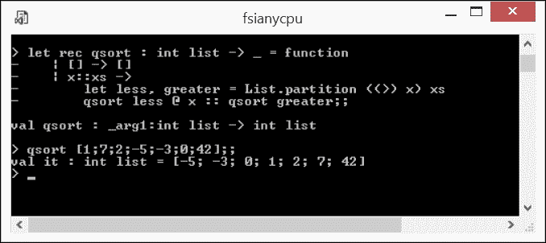
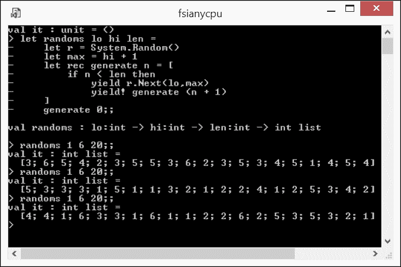
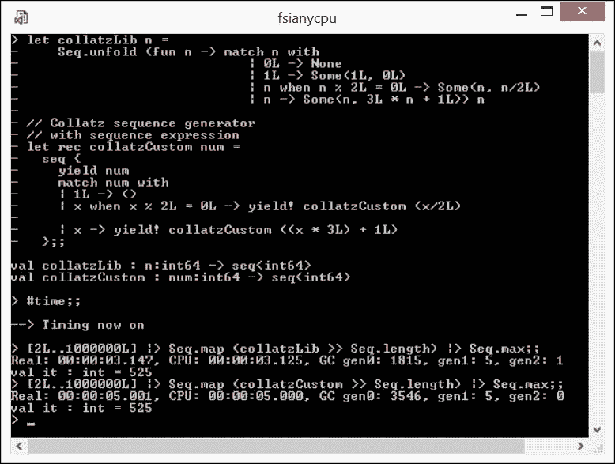
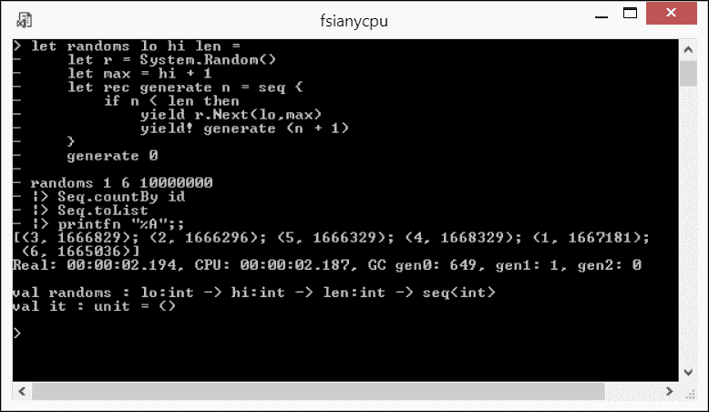

# 第八章。数据压缩 – 数据转换模式

在上一章处理了函数定义和应用的先进模式之后，我想回顾一下在第六章 *序列 - 数据处理模式的核心* 中刚刚略微触及的主题，即与序列相关的内容。在那里，我声称相当庞大的 `Collection.seq` 库吸收并实现了少数几个通用数据处理模式。然后我根据这些模式重新分组了库成员。

本章将进一步探讨这些数据转换模式，这些模式不仅适用于序列，也适用于其他数据集合。本章的目标是帮助您掌握使用少量典型多态转换类别中的函数来表达数据处理需求的能力，这些类别由少量组合子组成，并通过操作最适合当前任务的数据集合类型来实现。这种方法允许您统一覆盖最广泛的具体数据转换。坚持上述方法对于 F# 程序员实践者至关重要，因为它有效地抑制了没有充分理由而开发冗长自定义解决方案的趋势，并总体上增加了 F# 程序的积极属性，如简洁性、正确性和性能。

在本章中，我们将检查：

+   F# 4.0 中数据转换库的规范化如何反映在底层转换模式共性上。这些共性具有多态性，适用于库旨在处理的各种数据集合。

+   在 第六章 *序列 - 数据处理模式的核心* 中收集的转换模式如何在各种数据集合中展现出来。

这将是一次漫长的旅程，所以请和我一起坚持，保持冷静和水分充足。

# F# 4.0 的核心数据转换库

F# 4.0 带给 FSharp.Core 运行时的一项增强是 **规范化的数据集合模块** ([`blogs.msdn.microsoft.com/fsharpteam/2014/11/12/announcing-a-preview-of-f-4-0-and-the-visual-f-tools-in-vs-2015/`](https://blogs.msdn.microsoft.com/fsharpteam/2014/11/12/announcing-a-preview-of-f-4-0-and-the-visual-f-tools-in-vs-2015/) )。这个发展非常有趣：

+   证实了数据处理模式在数据处理平台间的共性。例如，`map` 或 `filter` 函数可以在 F# 等函数式编程语言中找到，在 **LINQ** 等查询工具和 **PowerShell** 等脚本引擎中也可以找到，仅举几例。

+   认识到属于这些模式的具体函数是多态的，并且可能被统一应用于不同的数据集合类型。F# 4.0 成功地将这种多态性应用于最常用的数据集合类型，即 `Array`、`List` 和 `Seq` 模块。

总体而言，这个库为 F# 4.0 数据处理功能增加了 95 个针对不同集合类型的优化函数实现。这一增加使得之前提到的三个集合模块中的单个函数总数达到了 309 个（截至 2016 年 4 月），这无疑是一个相当大的成果。然而，对于一个随机开发者来说，在没有认识到一些形成性原则的情况下，要凭记忆和回忆这种安排是非常具有挑战性的。

考虑到大多数函数都统一应用于三种基础集合类型（其中一些函数自然不适用于某些具体集合；例如，`toList` 不适用于 `List` ），这仍然留下了 117 个（截至 2016 年 4 月）*不同的函数名称* 仅用于基础数据集合。而且别忘了与较少使用的数据集合相关的某些函数，例如 `set`、`IDictionary` 或 `Array2D` 。你应该如何处理这种多样性？

幸运的是，数据转换模式只有少数几种。识别底层模式通常会对相关库函数施加顺序，使得每种模式只关联十几个函数。这样的分类数量更容易回忆。

在本章的其余部分，我们将检查这些隐藏的模式及其相应的凝聚函数组。提供的惯用代码示例有助于模式的保留、识别和重用。

# 数据转换模式

关于数据转换库丰富性的一个好问题是：这种压倒性的多样性最初是从哪里来的？为什么 F# 的设计者将如此多的函数（多达一百多个）包含到基础数据集合的 *核心* 库中？

我认为这个问题没有单一的“正确”答案。然而，从考虑典型的 **ETL - 提取、转换、加载** ([`en.wikipedia.org/wiki/Extract,_transform,_load`](https://en.wikipedia.org/wiki/Extract,_transform,_load) ) 企业数据处理流程中，可能会得到一些线索。在可变集合和任意变化的状态的世界中，这个操作可以表达如下：

```cs
void PerformETL() 
{ 
    ExtractData(); 
    TransformData(); 
    LoadData(); 
} 

```

这种类似于 C# 的伪代码展示了数以亿计的可能数据转换如何被隐藏在几行不透明的代码背后。我们无法对这些细节做出任何评论，除非我们仔细研究上述每个组件的实现，找出它们的功能、如何获取数据以及如何与其他相关组件共享修改状态。

现在，让我们以更函数式的方式表达语义上相似的系列活动如下：

```cs
let performETL params : unit = 
    let inputCollection = extractData params 
    let outputCollection = transformData inputCollection 
    loadData outputCollection 

```

前面的代码片段比它的命令式兄弟讲述了一个更好的故事。我们可以立即看出`extractData`是一个基于某些输入参数`params`的集合生成函数，这些参数从某种持久存储中产生初始的`inputCollection`函数。这个集合作为输入参数传递给转换函数`transformData`，该函数的结果是输出集合`outputCollection`。最后，这个集合被传递给数据加载函数`loadData`，并最终存储回持久存储。鉴于与持久存储的通信是以一种*幂等*的方式实现的，并且涉及的函数是引用透明的，这个转换链可以被任意次数地重放，并得到相同的结果。

我们甚至可以更进一步，将最后一个代码片段重写如下：

```cs
let performETL params : unit = 
  params  
   |> extractData 
   |> transformData 
   |> loadData 

```

现在我们真正处理代码，转换不可变数据。这段代码不依赖于内部状态的副作用。其组件具有更好的可组合性，并且如果需要，可以轻松扩展。最后，这段代码现在更加优雅，更容易阅读和理解。

你可能会问，这篇相当简单的文章如何与重要的库成员的多样性相关？

首先，有一些典型的转换与计算机科学中广泛接受的数据处理算法捕获方式相对应。例如，如果我们打算提供一个库函数来将集合拆分为一对分区，我们无法将其做得与以下伪签名中的高阶函数有很大不同：

```cs
partition: predicate:('T -> bool) -> source:'T collection 
           -> ('T collection * 'T collection) 

```

在这里，`predicate`是一个函数，它接受一个类型为`'T`的单个集合成员，并返回`bool`，其中`true`表示输入元素将进入结果元组的第一个集合，而`false`表示它将进入第二个集合。`source`参数表示要拆分的输入集合。我故意将“泛型”`collection`放入前面的签名中，我将在稍后解释原因。结果是包含`source`元素，通过`predicate`值被分割成两个集合的元组。

许多计算机科学中已知的算法几乎可以简洁地使用上述`partition`函数实现。例如，著名的**快速排序**([`en.wikipedia.org/wiki/Quicksort`](https://en.wikipedia.org/wiki/Quicksort))代表了广泛的**分而治之**([`en.wikipedia.org/wiki/Divide_and_conquer_algorithms`](https://en.wikipedia.org/wiki/Divide_and_conquer_algorithms))算法类别。让我们看看如何优雅地使用`partition`实现**快速排序**，如下面的代码片段所示（`Ch8_1.fsx`）：

```cs
let rec qsort : int list -> _ = function 
   | [] -> [] 
   | x::xs -> 
       let less, greater = List.partition ((>) x) xs 
       qsort less @ x :: qsort greater 

```

`qsort`函数（有些简化地）将非空输入列表参数分成两组：一组只包含列表头部小于`x`的元素，另一组包含其余元素。结果是将`x`前置的列表`qsortgreater`附加到列表`qsortless`上。太棒了！让我们看看以下截图中的 FSI 是如何实现的：



使用分区函数实现快速排序

现在让我回到我为什么在前面`partition`函数的签名中使用`collection`的原因。巧合的是，这也是促使库成员多样化的考虑因素之一，那就是**性能**。你可以打赌，为了有效，`partition`应该分别针对`array`和`list`集合实现，从而产生一对函数，每个函数都属于其各自的模块，如下所示：

```cs
List.partition: predicate:('T -> bool) -> list:'T list 
           -> ('T list * 'T list) 
Array.partition : predicate:('T -> bool) -> array:'T[] 
           -> 'T[] * 'T[] 

```

沿着这个思路，一个有趣的观点是 F# 4.0 核心库中缺少`Seq.partition`函数。这个现象的根本原因在于性能。我建议那些好奇的人查阅**相关的 F#设计规范**([`github.com/fsharp/FSharpLangDesign/blob/5cec1d3f524240f063b6f9dad2f23ca5a9d7b158/FSharp-4.0/ListSeqArrayAdditions.md#regular-functional-operators-producing-two-or-more-output-collections`](https://github.com/fsharp/FSharpLangDesign/blob/5cec1d3f524240f063b6f9dad2f23ca5a9d7b158/FSharp-4.0/ListSeqArrayAdditions.md#regular-functional-operators-producing-two-or-more-output-collections) )以及一个更普通的**StackOverflow 问答网站上的解释**([`stackoverflow.com/a/31750808/917053`](http://stackoverflow.com/a/31750808/917053) )，以了解确切的原因。

总结起来，F#语言设计者在定义和实现 F#核心库的数据转换函数时，一直在寻找以下因素的平衡：

+   良好的覆盖面，这是多年函数式编程实践提炼出的典型用例

+   不要使库的大小超过合理的极限

+   将每个库提供的函数优化到极致，以至于任何自定义实现的相同功能都显得毫无意义

带着这种整体的观点，让我转向具体覆盖模式。在函数表示模式可以简洁表达的情况下，我将在下一行提供评估结果作为注释，以节省空间。

## 生成模式

这种模式很容易识别：它代表了一个从没有任何集合的状态到创建了一个集合的状态的过渡。生成模式由具有通用签名结构的库函数表示，如下所示：

```cs
name: <zero or more input parameters> -> collection<'T> 

```

这个通用签名导致了一些具体的使用案例，具体取决于结果集合的具体形状。

### 生成一个空集合

要生成一个泛型类型的空集合，核心库函数 `empty` 存在，允许您为任何基本集合类型生成强类型空集合，如下所示 (`Ch8_2.fsx` ):

```cs
let el = List.empty<string> 
// val el : string list = [] 
let ea = Array.empty<float> 
// val ea : float [] = [||] 
let es = Seq.empty<int -> string> 
// val es : seq<(int -> string)> 
// es;; 
// val it : seq<(int -> string)> = seq [] 

```

同样，也可以使用每个基本集合类型的相应常量表达式来实现 (`Ch8_2.fsx` ):

```cs
let ell: string list = [] 
// val ell : string list = [] 
let eal: float[] = [||] 
// val eal : float [] = [||] 
let esl: seq<int -> string> = seq [] 
// val esl : seq<(int -> string)> = [] 
// esl;; 
// val it : seq<(int -> string)> = [] 

```

### 生成单个元素集合

这个属于生成模式简单任务可以通过核心库函数 `singleton` 实现，该函数适用于每个基本集合类型。它不需要显式声明集合元素类型，因为它可以从为单个集合元素提供的类型字面量中轻松推断出来，如下面的代码所示 (`Ch8_2.fsx` ):

```cs
let sl = List.singleton "I'm alone" 
// val sl : string list = ["I'm alone"] 
let sa = Array.singleton 42.0 
// val sa : float [] = [|42.0|] 
let ss = Seq.singleton (fun (x:int) -> x.ToString()) 
// val ss : seq<(int -> string)> 
// ss;; 
// val it : seq<(int -> string)> = seq [<fun:ss@24>] 

```

再次，这也可以通过使用每个基本集合类型的相应常量表达式来实现，如下所示 (`Ch8_2.fsx` ):

```cs
let sll = ["I'm alone"] 
// val sll : string list = ["I'm alone"] 
let sal = [| 42.0 |] 
// val sal : float [] = [|42.0|] 
let ssl = seq [fun (x:int) -> x.ToString()] 
// val ssl : seq<(int -> string)> = [<fun:ssl@24>] 

```

### 生成一个已知大小的集合

生成模式的任务由两种不同的情况表示：集合中所有元素都具有相同值的情况和它们可以具有不同值的情况。

#### 生成一个已知大小的集合 - 所有元素具有相同的值

F# 4.0 核心库提供了具有以下签名的函数来复制每个基本集合类型：

```cs
List.replicate: count:int -> initial:'T -> 'T list 
Array.replicate: count:int -> initial:'T -> 'T[] 
Seq.replicate: count:int -> initial:'T -> seq<'T> 

```

以下是一些使用示例 (`Ch8_2.fsx` ):

```cs
let fl = List.replicate 3 "blah" 
// val fl : string list = ["blah"; "blah"; "blah"] 
let fa = Array.replicate 3 42 
// val fa : int [] = [|42; 42; 42|] 
let fs = Seq.replicate 3 42.0 
// val fs : seq<float> 
// fs;; 
// val it : seq<float> = seq [42.0; 42.0; 42.0] 

```

如我之前讨论的，这可以通过使用字面量和理解表达式来实现，如下所示 (`Ch8_2.fsx` ):

```cs
let fll = ["blah";"blah";"blah"] 
// val fll : string list = ["blah"; "blah"; "blah"] 
let fal = [| for i in 1..3 -> 42 |] 
// val fal : int [] = [|42; 42; 42|] 
let fsl = seq { for i in 1..3 do yield 42.0 } 
// val fsl : seq<float> 
// fsl;; 
// val it : seq<float> = seq [42.0; 42.0; 42.0] 

```

除了 `replicate` 之外，F# 核心库为 **数组** 集合专门提供了 `create` 和 `zeroCreate` 函数，如下所示 (`Ch8_2.fsx` ):

```cs
Array.create: count:int -> value:'T -> 'T[] 
Array.zeroCreate: count:int -> 'T[] 
let fac = Array.create 3 "blah" 
// val fac : string [] = [|"blah"; "blah"; "blah"|] 
let fazc: string[] = Array.zeroCreate 3 
// val fazc : string [] = [|null; null; null|] 
let fazci = Array.zeroCreate<int> 3 
// val fazci : int [] = [|0; 0; 0|] 

```

注意，`zeroCreate` 按设计不会向 F# 编译器提供任何有关目标数组类型的线索。因此，为了避免在将目标数组类型委托给类型推断时出现的臭名昭著的 `error FS0030: Value restriction` 错误消息，可以在值本身上添加类型注解，例如 `string[]` 对于 `fazc`，或者可以在函数名称本身上添加类型参数，例如前述代码中的 `fazci` 的 `<int>`。 

#### 生成一个已知大小的集合 - 元素可能具有不同的值

如果集合的元素需要具有不同的值怎么办？F# 核心库为我们提供了每个基本集合类型的 `init` 函数，其签名如下：

```cs
List.init: length:int -> initializer:(int -> 'T) -> 'T list 
Array.init : count:int -> initializer:(int -> 'T) -> 'T[] 
Seq. init: count:int -> initializer:(int -> 'T) -> seq<'T> 

```

以下是一些使用示例 (`Ch8_2.fsx` ):

```cs
let vl = List.init 4 ((*) 2) 
// val vl : int list = [0; 2; 4; 6]  
let va = let src = "closure" in Array.init src.Length (fun i -> src.[i]) 

// val va : char [] = [|'c'; 'l'; 'o'; 's'; 'u'; 'r'; 'e'|] 
let vs = Seq.init 3 id  
// val vs : seq<int> 
// vs;; 
// val it : seq<int> = seq [0; 1; 2] 

```

注意，`initializer` 被赋予了每个元素的隐式索引，这将其转换为元素值。这种转换可以非常简单，例如 `vs`，或者非常复杂，例如 `va`，其中它围绕 `src` 封闭，实际上将 `string` 转换为其字符的字符数组。

与相同值元素的情况类似，为了生成列表和数组，`init`的替代方案可能是字面量，对于所有三种基本集合类型，替代方案可能是理解表达式。以下是一些示例 - `vll`和`val`用于字面量，其余用于具有（`vlcy`，`vacy`，`vscy`）或没有使用（`vlc`，`vac`，`vsc`）`yield`构造的理解表达式，如下所示（`Ch8_2.fsx`）：

```cs
let vll = [0; 2; 4; 6] 
// val vll : int list = [0; 2; 4; 6] 
let vlc = [ for i in 0..3 -> i * 2 ] 
// val vlc : int list = [0; 2; 4; 6] 
let vlcy = [ for i in 0..3 do yield i * 2 ] 
// val vlcy : int list = [0; 2; 4; 6] 
let ``val`` = 
    let src = "closure" in 
    [| src.[0]; src.[1]; src.[2]; src.[3]; src.[4]; src.[5]; src.[6] |] 
// val val : char [] = [|'c'; 'l'; 'o'; 's'; 'u'; 'r'; 'e'|] 
let vac = 
    let src = "closure" in 
    [| for i in 1..src.Length -> src.[i - 1] |] 
// val vac : char [] = [|'c'; 'l'; 'o'; 's'; 'u'; 'r'; 'e'|] 
let vacy = 
    let src = "closure" in 
    [| for i in 1..src.Length do 
       yield src.[i - 1] |> System.Char.ToUpper |] 
// val vacy : char [] = [|'C'; 'L'; 'O'; 'S'; 'U'; 'R'; 'E'|] 
let vsc = seq { for i in 0..2..6 -> i} 
// vsc;; 
// val it : seq<int> = seq [0; 2; 4; 6] 
let vscy = seq { for i in 0..2..6 do yield 6 - i } 
// vscy;; 
// val it : seq<int> = seq [6; 4; 2; 0] 

```

注意，在理解表达式中初始化集合元素值的表达式可以是任意复杂的；例如，在`vacy`的情况下，它从`src`闭包中按元素位置索引取值，并将相应的`char`数组元素转换为大写字母。

在进一步处理其他用例之前，让我更深入地探讨理解表达式。它们比迄今为止展示的更强大。我已在第六章 *序列 - 数据处理模式的核心* 中提到过这一点，当时在讨论序列表达式可能包含多个`yield`以及`yield!`出现的情况。当为列表和数组创建理解表达式时，你可以自由使用此功能，并且可以根据你的喜好使用递归。为了证明这一点，让我通过一个快速示例演示所有这些功能，构建一个生成器，用于在`lo`和`hi`之间的范围内生成伪随机整数的列表，长度为`len`，如下所示（`Ch8_2.fsx`）：

```cs
let randoms lo hi len = 
    let r = System.Random() 
    let max = hi + 1 
    let rec generate n = [ 
        if n < len then 
            yield r.Next(lo, max) 
            yield! generate (n + 1) 
    ] 
    generate 0 

```

在以下屏幕截图中给出了通过模拟三次 20 投掷骰子的结果，用于 FSI 中的`randoms`烟雾测试：



使用伪随机数生成器模拟投掷骰子的系列

### 生成未知大小的集合

有时，你可能会遇到需要生成一个在生成过程中要找到大小的集合的情况。在这种情况下，以下 F#核心库函数`unfold`会提供帮助，如下所示：

```cs
List.unfold<'T,'State> : generator:('State -> ('T * 'State) option) -> state:'State -> 'T list 
Array.unfold<'T,'State> : generator:('State -> ('T * 'State) option) -> state:'State -> 'T[] 
Seq.unfold   : generator:('State -> ('T * 'State) option) -> state:'State -> seq<'T> 

```

我已经在 第六章 中提供了一个非常简单的这个函数工作原理的例子，*序列 - 数据处理模式的核心*；在这里，我将其内部工作原理描述得淋漓尽致。`unfold` 函数逐个产生结果集合元素。对于每个元素，`generator` 函数将一个 `'State` 值作为输入参数，并以 **option** 值的形式产生结果。如果返回的 `option` 是 `Some('T * 'State)` 的形式，其中包含当前生成的集合元素值 `'T` 和下一次迭代的 `'State` 值，则此返回值表示序列展开将继续。否则，当 `generator` 函数返回 `None` 时，这意味着集合展开已经完成。

让我为这个用例提供一个充满例子的例子：所谓的**柯尔萨茨猜想**([`en.wikipedia.org/wiki/Collatz_conjecture`](https://en.wikipedia.org/wiki/Collatz_conjecture) )。让我们考虑一个由简单规则构建的整数序列，该规则是将一个元素 `n` 移动到下一个元素 `nn`：如果 `n` 是偶数，则 `nn` 是 `n` 除以 `2`；否则，它是 `3 * n + 1`。这个猜想本身是，对于任何初始的 `n`，这个由德国数学家洛塔尔·柯尔萨茨命名的序列最终会达到 `1`。例如，

42 -> 24 -> 12 -> 6 -> 3 -> 10 -> 5 -> 16 -> 8 -> 4 -> 2 -> 1

到目前为止，还没有找到任何起始数字会导致柯尔萨茨序列中有无限数量的元素。

首先，我从一个依赖于 `unfold` 库函数的柯尔萨茨序列生成器 `collatzLib` 函数的惯用实现开始，如下所示（`Ch8_2.fsx`）：

```cs
let collatzLib n = 
    Seq.unfold (fun n -> match n with 
                            | 0L -> None 
                            | 1L -> Some(1L, 0L) 
                            | n when n % 2L = 0L -> Some(n, n/2L) 
                            | n -> Some(n, 3L * n + 1L)) n 

```

注意我用来将值 `1` 传递给集合的技巧，如果生成继续超过它，会导致循环 `...1 -> 4 -> 2 -> 1...`。对于 `1L` 的状态，我生成了具有 `1L` 作为当前值和不可能的标记值 `0L` 的 `Some` 选项。对于标记值，生成器产生 `None`，并且集合增长终止。另一个预防措施是在 `int64` 数字域中操作，因为即使是一些不是很大的初始数字也可能将 `'State`` 超出 `int` 域，这是我在生成器开始花费可疑地长时间完成时，从默认的 **unchecked** 转换到 **checked** F# 算术时发现的。

到目前为止，一切顺利。我很快就要尝试这个实现了。但你们中的一些人可能已经提出了这个问题：如果可以用序列表达式来实现，这有什么意义呢？答案已经在本章的开头给出了——**性能**。为了实验性地证明这个陈述，让我放下不使用 `unfold` 库函数的自定义柯尔萨茨序列生成器实现（`Ch8_2.fsx`）：

```cs
let rec collatzCustom num =  
    seq { 
        yield num 
        match num with 
        | 1L -> () 
        | x when x % 2L = 0L ->yield! collatzCustom (x/2L) 
        | x ->yield! collatzCustom ((x * 3L) + 1L) 
        } 

```

现在，让我们运行 `collatzLib` 和 `collatzCustom` 以比较它们之间的差异。为此，让我们找出初始数字在 2 到 1000 之间最长的 Collatz 序列集合。这个练习是 **Project Euler 问题 14** ([`projecteuler.net/problem=14`](https://projecteuler.net/problem=14) ) 的变体。编写性能测量代码并不像这里所示的那样困难（`Ch8_2.fsx`）。

```cs
[2L..1000000L] |> Seq.map (collatzLib >> Seq.length) |> Seq.max 

```

让我们比较前面代码的性能与这个代码（`Ch8_2.fsx`）的性能：

```cs
[2L..1000000L] |> Seq.map (collatzCustom >> Seq.length) |> Seq.max 

```

通过运行时间。比较如下截图所示：



比较基于库函数和自定义实现的性能

要记住的教训是，使用基于库的 `collatzLib` 函数的运行时间仅占使用自定义实现的 `collatzCustom` 函数所需时间的 **63%**。

### 小贴士

除非你需要速度并且绝对确信你的自定义实现会提高性能，否则不要浪费时间重新实现 F# 核心库函数提供的功能！

### 生成无穷大小的集合

最后，我在生成模式下的最后一个用例中达到了：无穷大小的集合。显然，当我们考虑这个情况时，底层集合类型只能是唯一的序列，因为我们还不能依赖无穷的内存资源。用于生成无穷长度序列的 F# 核心库函数签名如下：

```cs
Seq.initInfinite: initializer:(int -> 'T) -> seq<'T> 

```

它与 `init` 并没有太大的区别；它只是缺少设置集合大小的输入参数。与 `initInfinite` 库函数并列的是自定义的无穷大小序列实现，使用序列表达式。

我已经在 第六章，*序列 - 数据处理模式的核心* 中涵盖了无穷大小序列的模式，并在那里提供了一些示例，以及在第七章 第七章。高级技术：函数回顾 中提供了一些高级示例，所以在这里我不会重复。这个用例结束了生成数据转换模式涵盖的多样性。

## 聚合模式

聚合模式可以通过以下活动识别，当遍历集合以得到类型为 `'T'` 的值时，类似于集合元素的类型 `'T'`，它携带了所有遍历元素的一些累积影响。

### 泛型聚合

泛型聚合数据转换模式的签名方便地类似于表示聚合的成对具体库函数：`reduce` 和 `reduceBack`，如下所示：

```cs
List.reduce: reduction:('T -> 'T -> 'T) -> list:'T list -> 'T 
List.reduceBack: reduction:('T -> 'T -> 'T) -> list:'T list -> 'T 
Array.reduce: reduction:('T -> 'T -> 'T) -> array:'T[] -> 'T 
Array.reduceBack: reduction:('T -> 'T -> 'T) -> array:'T[] -> 'T 
Seq.reduce: reduction:('T -> 'T -> 'T) -> source:seq<'T> -> 'T 

```

如果你还记得 第七章，*高级技巧：函数回顾*，前面的代码几乎与 `folds` 一样通用；区别在于，通过 `fold` 在集合中传递的状态可以是任何任意类型，不一定与集合元素类型相同，而 `reduce` 处理的是相同类型。用 `fold` 实现 `reduce` 很容易，但反过来则不然。

`reduce` 函数将 `reduction` 操作从集合的开始应用到结束；如果我用 `r` 表示 `reduction` 函数，那么对于 `reduce` 在数组集合 `c` 上的特殊情况，它将等同于这里所示的表达式：

```cs
...r (r (r c.[0] c.[1]) c.[2]) c.[3]... 

```

相反，`reduceBack` 从集合的右侧应用 `reduction` 操作；如果我用 `r` 再次表示 `reduction` 函数，那么对于 `reduceBack` 在 `n+1` 个元素的数组集合 `c` 上的特殊情况，它将等同于这里所示的表达式：

```cs
... (r c.[n - 3] (r c.[n - 2] (r c.[n - 1] c.[n])) ... 

```

很容易注意到，对于具有**结合性** ([`en.wikipedia.org/wiki/Associative_property`](https://en.wikipedia.org/wiki/Associative_property) ) 的 `reduction` 操作，`reduce` 和 `reduceBack` 在同一集合上的结果将是相同的，这可以通过以下简单测试得到证实 (`Ch8_3.fsx` ):

```cs
// associative operation min 
List.reduce min [1;2;3;4;5] 
// val it : int = 1 
List.reduceBack min [1;2;3;4;5] 
// val it : int = 1 

// non-associative operation (-) 
List.reduce (-) [1;2;3;4;5] 
// val it : int = -13 
List.reduceBack (-) [1;2;3;4;5] 
// val it : int = 3 

```

我想指出正在发生的不对称性：库中没有现成的 `reduceBack` 用于序列。

所有其他库聚合函数只是可以用 `reduce` 表达的聚合的特殊实现。在考虑它们之前，我想指出另一个模式：不是在原始元素类型 `'T` 上执行聚合，而是将每个集合元素投影到其他类型 `'U` 并在 `'U` 上进行聚合。

### 直接聚合

这个聚合库函数组的成员直接在集合元素类型 `'T` 上执行聚合，例如具有以下签名的库成员：

```cs
List.average : list:^T list -> ^T     
    when ^T : (static member ( + ) : ^T * ^T -> ^T)  
    and  ^T : (static member DivideByInt : ^T*int -> ^T)  
    and  ^T : (static member Zero : ^T) 
Array.average : array:^T[] -> ^T     
    when ^T : (static member ( + ) : ^T * ^T -> ^T)  
    and  ^T : (static member DivideByInt : ^T*int -> ^T)  
    and  ^T : (static member Zero : ^T) 
Seq.average : source:seq<(^T)> -> ^T     
    when ^T : (static member ( + ) : ^T * ^T -> ^T)  
    and  ^T : (static member DivideByInt : ^T*int -> ^T)  
    and  ^T : (static member Zero : ^T) 
List.max : list:'T list -> 'T when 'T : comparison 
Array.max : array:'T[] -> 'T  when 'T : comparison 
Seq.max : source:seq<'T> -> 'T when 'T : comparison 
List.min : list:'T list -> 'T when 'T : comparison 
Array.min : array:'T[] -> 'T  when 'T : comparison 
Seq.min : source:seq<'T> -> 'T when 'T : comparison 
List.sum : list:^T list -> ^T  
    when ^T : (static member ( + ) : ^T * ^T -> ^T)  
    and  ^T : (static member Zero : ^T) 
Array.sum : array: ^T[] -> ^T  
    when ^T : (static member ( + ) : ^T * ^T -> ^T)  
    and  ^T : (static member Zero : ^T) 
Seq.sum : source:seq<(^T)> -> ^T  
    when ^T : (static member ( + ) : ^T * ^T -> ^T)  
    and  ^T : (static member Zero : ^T) 

```

根据签名，你可能会注意到，库的聚合函数在聚合有意义的情况下对集合类型 `'T` 引入了静态约束。例如，显然，如果 `'T` 不支持比较，则不能在类型 `'T` 上执行最大聚合。

### 投影聚合

投影聚合库函数，不是在原始集合元素上执行聚合，而是首先将它们从类型 `'T` 投影到其他类型 `'U`，然后才在 `'U` 值上执行聚合。以下是签名：

```cs
List.averageBy : projection:('T -> ^U) -> list:'T list  -> ^U     
    when ^U : (static member ( + ) : ^U * ^U -> ^U)  
    and  ^U : (static member DivideByInt : ^U*int -> ^U)  
    and  ^U : (static member Zero : ^U) 
Array.averageBy : projection:('T -> ^U) -> array:'T[] -> ^U     
    when ^U : (static member ( + ) : ^U * ^U -> ^U)  
    and  ^U : (static member DivideByInt : ^U*int -> ^U)  
    and  ^U : (static member Zero : ^U) 
Seq.averageBy : projection:('T -> ^U) -> source:seq<'T>  -> ^U     
    when ^U : (static member ( + ) : ^U * ^U -> ^U)  
    and  ^U : (static member DivideByInt : ^U*int -> ^U)  
    and  ^U : (static member Zero : ^U) 
List.maxBy : projection:('T -> 'U) -> list:'T list -> 'T 
    when 'U : comparison 
Array.maxBy  : projection:('T -> 'U) -> array:'T[] -> 'T 
    when 'U : comparison 
Seq.maxBy : projection:('T -> 'U) -> source:seq<'T> -> 'T 
    when 'U : comparison 
List.minBy : projection:('T -> 'U) -> list:'T list -> 'T 
    when 'U : comparison 
Array.minBy : projection:('T -> 'U) -> array:'T[] -> 'T 
    when 'U : comparison 
Seq.minBy : projection:('T -> 'U) -> source:seq<'T> -> 'T 
    when 'U : comparison 
List.sumBy : projection:('T -> ^U) -> list:'T list -> ^U  
    when ^U : (static member ( + ) : ^U * ^U -> ^U)  
    and  ^U : (static member Zero : ^U) 
Array.sumBy : projection:('T -> ^U) -> array:'T[] -> ^U  
    when ^U : (static member ( + ) : ^U * ^U -> ^U)  
    and  ^U : (static member Zero : ^U) 
Seq.sumBy : projection:('T -> ^U) -> source:seq<'T>  -> ^U  
    when ^U : (static member ( + ) : ^U * ^U -> ^U)  
    and  ^U : (static member Zero : ^U) 

```

在考虑投影聚合时，应该提到一点复杂性——虽然 `averageBy` 和 `sumBy` 返回类型为 `'U` 的结果，但 `maxBy` 和 `minBy` 返回 `'T`。请参考以下代码示例，它突出了提到的细节 (`Ch8_3.fsx` ):

```cs
List.sumBy (fun x -> -x) [1;2;3] 
// val it : int = -6 
List.minBy (fun x -> -x) [1;2;3] 
// val it : int = 3 

```

### 计数聚合

聚合数据转换模式的剩余两个函数执行集合元素的计数。

第一项是那个古老的`length`函数：

```cs
List.length: list:'T list -> int 
Array.length: array:'T[] -> int 
Seq.length: source:seq<'T> -> int 

```

这里没有隐藏的惊喜。只需认识到`Seq.length`遍历`source`序列，并且当应用于无限长度的序列时，最终会崩溃。

另一个，`countBy`，更复杂一些：

```cs
List.countBy projection:('T -> 'Key) -> list:'T list 
    -> ('Key * int) list 
    when 'Key : equality 
Array.countBy : projection:('T -> 'Key) -> array:'T[] 
    -> ('Key * int)[] 
    when 'Key : equality 
Seq.countBy projection:('T -> 'Key) -> source:seq<'T> 
    -> seq<'Key * int> 
    when 'Key : equality 

```

这个高阶函数对每个元素值`'T`应用`projection`，将其转换为`'Key`值，计算投影到每个唯一`'Key`的元素数量，最后将分布作为元组集合（`'Key'`, 数量）返回。让我做一个相当有趣的观察。在本章的开头，在*生成已知大小的集合*中，我们实现了一个伪随机数序列生成器`randoms`。让我们看看通过构建一系列长投掷并分箱每个得分，期望分箱大小的偏差在统计上不显著，来模拟抛掷骰子的“随机性”。

以下代码片段模拟了抛掷一百万次骰子；因此，每个六进制结果应该有大约 166,600 次命中。让我们看看... (`Ch8_3.fsx` ):

```cs
randoms 1 6 10000000 
|> Seq.countBy id 
|> Seq.toList 
|> printfn "%A" 

```

在 FSI 中运行前面代码的结果如下所示：



使用`countBy`检查伪随机数生成器的质量

根据前面截图显示的结果，我的直觉是，底层的伪随机数生成器在模拟骰子方面还不错。而且它还相当快：生成和分箱一百万次试验的系列只用了 2 秒多。

## 包装和类型转换模式

属于这种数据转换模式的库函数分为两组如下：

+   那些包装整个集合，改变其行为的操作

+   简单地将集合从一种基本类型转换为另一种类型的操作

### 集合包装模式

属于这个模式的函数只有三个。它们都只适用于序列，并且具有以下签名：

```cs
Seq.cache: source:seq<'T> -> seq<'T> 
Seq.delay: generator:(unit -> seq<'T>) -> seq<'T> 
Seq.readonly : source:seq<'T> -> seq<'T> 

```

我已经在第六章中介绍了`Seq.cache`函数，*序列 - 数据处理模式的核心*，并在第七章的质数生成器示例中也使用了它，*高级技术：函数回顾*，所以我就不再多花时间在这上面了，让我们继续到下一对。

`Seq.delay` 允许你推迟对包装的 `generator` 函数的急切评估。评估将推迟到包装器被枚举时。在下面的代码片段中，存在一个急切列表解析，如果被评估，将立即打印 `"Evaluating eagerList"`，然后返回 `strings` 列表。然而，由于被包装进 `Seq.delay`，它不会评估，直到包装器本身被具体化（`Ch8_4.fsx`）：

```cs
let eagerList = [ 
    printfn "Evaluating eagerList" 
    yield "I" 
    yield "am" 
    yield "an" 
    yield "eager" 
    yield "list" 
] 
// Evaluating eagerList 
// val eagerList : string list = ["I"; "am"; "an"; "eager"; "list"] 
let delayedEagerList = Seq.delay(fun () -> ([ printfn "Evaluating 
                                              eagerList" 
                                            yield "I" 
                                            yield "am" 
                                            yield "an" 
                                            yield "eager" 
                                            yield "list" 
                                        ] |> Seq.ofList)) 
// val delayedEagerList : seq<string> 

delayedEagerList |> Seq.toList 
// Evaluating eagerList 
// val it : string list = ["I"; "am"; "an"; "eager"; "list"] 

```

前一个脚本中的注释行展示了之前描述的预期行为实际上正在发生。

`Seq.readonly` 在原始集合周围构建了一个包装序列，这不允许你通过类型转换重新发现和修改它。在下面的代码片段中，通过向上转换和向下转换，可以创建一个后门，并使用它帮助修改原始可变集合（`Ch8_4.fsx`）：

```cs
let src = [|1;2;3|] 
let srcAsSeq = src :> seq<_> 
let backdoor = srcAsSeq :?> int array 
backdoor.[0] <- 10 
printfn "%A" src 
// [|10; 2; 3|] 

```

现在，如果 `src` 被包装进 `Seq.readonly`，尝试将序列向下转换为 `int []` 将会引发类型转换异常，如下面的代码所示（`Ch8_4.fsx`）：

```cs
let srcAsROSeq = src |> Seq.readonly 
let tryBackDoor = srcAsROSeq :?> int array 
// System.InvalidCastException: Unable to cast object of type 'mkSeq@541[System.Int32]' to type 'System.Int32[]'. 

```

### 类型转换模式

属于类型转换模式的库函数提供了基集合类型之间的对称转换，如下所示：

```cs
List.toSeq list:'T list -> seq<'T> 
List.ofSeq: source:seq<'T> -> 'T list 
List.toArray: list:'T list -> 'T[] 
List.ofArray : array:'T[] -> 'T list 
Array.toSeq: array:'T[] -> seq<'T> 
Array.ofSeq: source:seq<'T> -> 'T[] 
Array.toList: array:'T[] -> 'T list 
Array.ofList: list:'T list -> 'T[] 
Seq.toList: source:seq<'T> -> 'T list 
Seq.ofList: source:'T list -> seq<'T> 
Seq.toArray: source:seq<'T> -> 'T[] 
Seq.ofArray: source:'T[] -> seq<'T> 

```

这些函数非常直接，不需要额外的注释。

除了这些之外，还有一个函数可以将松散类型化的序列从旧式预泛型 `System.Collections` 命名空间转换为类型化序列：

```cs
Seq.cast: source:IEnumerable -> seq<'T> 

```

这种转换在 F# 与旧式 Microsoft 系统之间的互操作性场景中很常见，以便将它们转换为 F# 友好的强类型序列。作为一个例子，让我们看看下面的代码片段（`Ch8_4.fsx`）：

```cs
let s = System.Collections.Stack() 
s.Push(1) 
s.Push('2') 
s.Push("xyzzy") 
s |> Seq.cast<_> |> printfn "%A" 
// seq ["xyzzy"; '2'; 1] 

```

在这里，你可以看到松散类型化的 `Stack` 集合被转换为强类型化的 F# 序列并打印出来。输出显示包含不同类型的 F# 序列：`string`、`char`、`int`。但是序列是强类型化的，对吧？你能确定前面序列的类型吗？

## 选取模式

这种数据转换模式可以通过根据某些特征（s）从集合中分离一个或多个元素来识别。这些特征可能非常多样：元素的位置、与标准匹配的元素值，仅举几例。

区分选取转换模式与其他模式的真正特征如下：*选取结果始终是单个元素或单个包含从零到原始集合所有元素的集合；选取是原样提供的，没有任何额外的投影*。

这种看似广泛的转换类实际上只有少数几个子类：基于位置的选取、搜索和过滤。

基于位置的 **选取** 将元素选取标准与原始集合中元素的位置绑定；例如，选取集合的前 10 个元素。

**搜索**和**过滤**确实是普遍的数据集合转换。尽管这两个转换非常相似，但它们之间有一个细微的区别，如下所述。

过滤通常与将源集合逐个元素地复制到结果集合相关，筛选出所有不符合给定标准的元素。

转到搜索，它通常与一个更复杂的过程相关。搜索的初始状态由原始集合、最初为空的搜索结果和搜索条件组成。搜索过程也会逐个元素遍历原始集合，应用搜索条件并塑造搜索结果。然而，搜索可能不仅包含匹配条件，还可能包含某种停止条件，也许还有一些排名。一个典型的搜索例子是这样的：“找到满足条件（s）的任何集合元素”。

基于此差异，我将搜索放在一个单独的选取模式中，但将过滤视为 *元素组选择* 模式的一部分。

### 基于位置的选取模式

构成此模式的 F# 核心库函数可以进一步分为两组：单个元素选择和元素组选择。

#### 单个元素选择

这组函数通过元素在集合中占有的位置确定单个所需元素。位置可以通过输入参数显式请求，也可以通过相关函数名隐式请求。为了理解我的意思，请比较“给我第三个元素”与“给我最后一个元素”。单个元素选择返回所需的元素或表示不存在这样的元素：

```cs
List.head: list:'T list -> 'T 
Array.head: array:'T[] -> 'T 
Seq.head: source:seq<'T> -> 'T 

List.tryHead: list:'T list -> 'T option 
Array.tryHead: array:'T[] -> 'T option  
Seq.tryHead: source:seq<'T> -> 'T option 

List.last: list:'T list -> 'T 
Array.last: list:'T list -> 'T 
Seq.last: source:seq<'T> -> 'T 

List.tryLast: list:'T list -> 'T option 
Array.tryLast: list:'T list -> 'T option 
Seq.tryLast: source:seq<'T> -> 'T option 

List.item: index:int -> list:'T list -> 'T 
Array.item: index:int -> array:'T[] -> 'T 
Array.get: array:'T[] -> index:int -> 'T 
Seq.item: index:int -> source:seq<'T> -> 'T 

List.tryItem: index:int -> list:'T list -> 'T option 
Array.tryItem: index:int -> array:'T[] -> 'T option 
Seq.tryItem: index:int -> source:seq<'T> -> 'T option 

List.nth: list:'T list -> index:int -> 'T // obsolete 
Seq.nth: index:int -> source:seq<'T> -> 'T // obsolete 

List.exactlyOne: list:'T list -> 'T 
Array.exactlyOne: array:'T[] -> 'T 
Seq.exactlyOne: source:seq<'T> -> 'T 

```

注意这个组中的成员如何通过指示不成功的选择方式来区分。有些简单地抛出异常，而另一些则将选择结果包装在一个 `option` 中，其中 `None` 表示所寻求的元素不存在：（`Ch8_5.fsx`）

```cs
List.head<int> [] 
// System.ArgumentException: The input list was empty. 
List.tryHead<int> [] 
// val it : int option = None 

```

关于以 `try...` 开头的函数名：这些函数允许减轻请求的元素可能缺失的风险，并很好地处理这种不幸的情况。

### 提示

使用选择操作的命令式形式时请谨慎。如果你绝对不确定请求的元素是否存在且不变，则退回到 *try* 形式。

还要注意，对于支持元素索引的数据集合，通常简单的索引使用就完成了专用库函数的工作，如下面的代码所示（`Ch8_5.fsx`）：

```cs
let ll = [1;2;3;4] 
List.head ll = ll.[0] 
//val it : bool = true 

```

#### 元素组选择

此集合转换子模式根据一系列标准安排从集合中获取一组元素：它可以是一个元素计数器，一个查看元素值的谓词，一个不希望出现的值集合，或者排除重复值：

```cs
List.take: count:int -> list:'T list -> 'T list 
Array.take: count:int -> array:'T[] -> 'T[] 
Seq.take: count:int -> source:seq<'T> -> seq<'T> 

List.takeWhile: predicate:('T -> bool) -> list:'T list -> 'T list 
Array.takeWhile: predicate:('T -> bool) -> array:'T[] -> 'T[] 
Seq.takeWhile: predicate:('T -> bool) -> source:seq<'T> -> seq<'T> 

List.truncate: count:int -> list:'T list -> 'T list 
Array.truncate: count:int -> array:'T[] -> 'T[] 
Seq.truncate: count:int -> source:seq<'T> -> seq<'T> 

List.skip: count:int -> list: 'T list -> 'T list 
Array.skip: count:int -> array:'T[] -> 'T[] 
Seq.skip: count:int -> source:seq<'T> -> seq<'T> 

List.skipWhile: predicate:('T -> bool) -> list:'T list -> 'T list 
Array.skipWhile: predicate:('T -> bool) -> array:'T[] -> 'T[] 
Seq.skipWhile: predicate:('T -> bool) -> source:seq<'T> -> seq<'T> 

List.tail: list:'T list -> 'T list 
Array.tail: array:'T[] -> 'T[] 
Seq.tail: source:seq<'T> -> seq<'T> 

List.filter: predicate:('T -> bool) -> list:'T list -> 'T list 
Array.filter: predicate:('T -> bool) -> array:'T[] -> 'T[] 
Seq.filter: predicate:('T -> bool) -> source:seq<'T> -> seq<'T> 

List.except: itemsToExclude:seq<'T> -> list:'T list -> 'T list when 'T : equality 
Array.except: itemsToExclude:seq<'T> -> array:'T[] -> 'T[] when 'T : equality 
Seq.except: itemsToExclude:seq<'T> -> source:seq<'T> -> seq<'T> when 'T : equality 

List.choose: chooser:('T -> 'U option) -> list:'T list -> 'U list 
Array.choose: chooser:('T -> 'U option) -> array:'T[] -> 'U[] 
Seq.choose: chooser:('T -> 'U option) -> source:seq<'T> -> seq<'U> 

List.where: predicate:('T -> bool) -> list:'T list -> 'T list 
Array.where: predicate:('T -> bool) -> array:'T[] -> 'T[] 
Seq.where: predicate:('T -> bool) -> source:seq<'T> -> seq<'T> 

Array.sub: array:'T[] -> startIndex:int -> count:int -> 'T[] 

List.distinct: list:'T list -> 'T list when 'T : equality 
Array.distinct: array:'T[] -> 'T[] when 'T : equality 
Seq.distinct: source:seq<'T> -> seq<'T> when 'T : equality 

List.distinctBy: projection:('T -> 'Key) -> list:'T list -> 'T list when 'Key : equality 
Array.distinctBy: projection:('T -> 'Key) -> array:'T[] -> 'T[] when 'Key : equality 
Seq.distinctBy: projection:('T -> 'Key) -> source:seq<'T> -> seq<'T> when 'Key : equality 

```

### 提示

注意，*元素组选择* 模式的组成部分是普遍存在的 `filter` 函数。

与之前实现索引切片的集合子模式类似，这是另一种元素组选择的方法（`Ch8_5.fsx`）：

```cs
[|10;20;30;40;50;60|].[2..4] 
// val it : int [] = [|30; 40; 50|] 

```

你可能也会注意到，更通用的 `filter` 函数伴随着更具体的过滤情况，例如 `takeWhile`、`skipWhile`，或者就像这里所示（`Ch8_5.fsx`）的 `where` 同义词：

```cs
let numbers = [1;2;3;4;5;6;7;8] 
List.filter (fun x -> (%) x 2 = 0) numbers = List.where (fun x -> (%) x 2 = 0) numbers 
// val it : bool = true 

```

## 搜索模式

F# 4.0 核心库提供了一套非常规范化的函数，构成了 **搜索** 模式，其中函数的名称确实包含了函数工作的详尽特征。

所有名称中包含 `...find...` 的函数都执行搜索第一个出现的单个元素，而 `...findIndex...` 则执行相同的搜索，但返回该元素在集合中的序号。

名称中包含 `...Back...` 的函数在元素的自然顺序的反方向进行搜索。

与已经检查过的选择模式组类似，搜索模式的库函数实现了两种表示 *"未找到"* 搜索结果的方法：那些没有 `try...` 前缀的，如果搜索返回空结果，则抛出异常；而那些带有 `try...` 前缀的，在这种情况下返回 `None` 选项；否则，它返回包含在 `Some...` 选项中的找到的元素，如下所示：

```cs
List.find: predicate:('T -> bool) -> list:'T list -> 'T 
Array.find: predicate:('T -> bool) -> array:'T[] -> 'T 
Seq.find: predicate:('T -> bool) -> source:seq<'T> -> 'T 

List.tryFind: predicate:('T -> bool) -> list:'T list -> 'T option 
Array.tryFind: predicate:('T -> bool) -> array:'T[] -> 'T option 
Seq.tryFind: predicate:('T -> bool) -> source:seq<'T> -> 'T option 

List.findIndex: predicate:('T -> bool) -> list:'T list -> int 
Array.findIndex: predicate:('T -> bool) -> array:'T[] -> int 
Seq.findIndex: predicate:('T -> bool) -> source:seq<'T> -> int 

List.tryFindIndex: predicate:('T -> bool) -> list:'T list -> int option 
List.tryFindIndexBack: predicate:('T -> bool) -> list:'T list -> int option 

List.findBack: predicate:('T -> bool) -> list:'T list -> 'T 
Array.findBack: predicate:('T -> bool) -> array:'T[] -> 'T 
Seq.findBack: predicate:('T -> bool) -> source:seq<'T> -> 'T 

List.tryFindBack: predicate:('T -> bool) -> list:'T list -> 'T option 
Array.tryFindBack: predicate:('T -> bool) -> array:'T[] -> 'T option 
Seq.tryFindBack: predicate:('T -> bool) -> source:seq<'T> -> 'T option 

List.findIndexBack: predicate:('T -> bool) -> list:'T list -> int 
Array.findIndexBack: predicate:('T -> bool) -> array:'T[] -> int 
Seq.findIndexBack: predicate:('T -> bool) -> source:seq<'T> -> int 

List.pick: chooser:('T -> 'U option) -> list:'T list -> 'U 
Array.pick: chooser:('T -> 'U option) -> array:'T[] -> 'U  
Seq.pick: chooser:('T -> 'U option) -> source:seq<'T> -> 'U 

List.tryPick: chooser:('T -> 'U option) -> list:'T list -> 'U option 
Array.tryPick: chooser:('T -> 'U option) -> array:'T[] -> 'U option 
Seq.tryPick: chooser:('T -> 'U option) -> source:seq<'T> -> 'U option 

```

让我们通过以下列出的小工具来展示其作用（`Ch8_5.fsx`）：

```cs
List.find (fun x -> (%) x 2 = 0) <| [1;3;5] 
// System.Collections.Generic.KeyNotFoundException: 
// Exception of type 'System.Collections.Generic.KeyNotFoundException' was thrown. 
List.tryFind (fun x -> (%) x 2 = 0) <| [1;3;5] 
// val it : int option = None 
List.find (fun x -> (%) x 2 <> 0) <| [1;3;5] 
// val it : int = 1 
List.tryFind (fun x -> (%) x 2 <> 0) <| [1;3;5] 
// val it : int option = Some 1 
List.findIndex (fun x -> (%) x 2 <> 0) <| [1;3;5] 
// val it : int = 0 
List.tryFindIndex (fun x -> (%) x 2 <> 0) <| [1;3;5] 
// val it : int option = Some 0 
List.findBack (fun x -> (%) x 2 <> 0) <| [1;3;5] 
// val it : int = 5 
List.tryFindBack (fun x -> (%) x 2 <> 0) <| [1;3;5] 
// val it : int option = Some 5 
List.findIndexBack (fun x -> (%) x 2 <> 0) <| [1;3;5] 
// val it : int = 2 
List.tryFindIndexBack (fun x -> (%) x 2 <> 0) <| [1;3;5] 
// val it : int option = Some 2 

```

与这种非常逻辑的安排略有不同的是 `(try)pick` 函数组。属于此组的函数将搜索和转换功能结合起来：`chooser` 函数应用于类型 `'T'` 的每个元素，产生 `None`，直到第一个元素以某种方式匹配 `chooser` 内部表达的选择标准。然后，`Some` 将潜在的、不同类型的 `'U'` 包裹起来并返回，并且高阶函数返回类型为 `'U'` 的结果。如果 `chooser` 找不到任何合适的元素，则 `pick` 抛出异常，而 `tryPick` 返回 `None`（`Ch8_5.fsx`）：

```cs
[(9,"Nine");(42,"FortyTwo");(0,"Zero")] 
|> List.pick (fun (x,y) -> if x = 42 then Some y else None) 
// val it : string = "FortyTwo" 
[(9,"Nine");(42,"FortyTwo");(0,"Zero")] 
|> List.tryPick (fun (x,y) -> if x = 42 then Some y else None) 
// val it : string option = Some "FortyTwo" 
[(9,"Nine");(42,"FortyTwo");(0,"Zero")] 
|> List.pick (fun (x,y) -> if x = 14 then Some y else None) 
// System.Collections.Generic.KeyNotFoundException: 
// Exception of type 'System.Collections.Generic.KeyNotFoundException' was thrown. 
[(9,"Nine");(42,"FortyTwo");(0,"Zero")] 
|> List.tryPick (fun (x,y) -> if x = 14 then Some y else None) 
// val it : string option = None 

```

请注意上述函数如何通过在遍历集合时同时应用这两个动作，在一定程度上融合了选择和转换。

## 分区模式

**分区** 模式的 F# 核心库元素消耗单个集合，通常返回多个结果集合，如下所示：

```cs
List.chunkBySize: chunkSize:int -> list:'T list -> 'T list list 
Array.chunkBySize: chunkSize:int -> array:'T[] -> 'T[][] 
Seq.chunkBySize: chunkSize:int -> source:seq<'T> -> seq<'T[]> 

List.groupBy : projection:('T -> 'Key) -> list:'T list -> ('Key * 'T list) list when 'Key : equality 
Array.groupBy: projection:('T -> 'Key) -> array:'T[] -> ('Key * 'T[])[]  when 'Key : equality 
Seq.groupBy : projection:('T -> 'Key) -> source:seq<'T> -> seq<'Key * seq<'T>> when 'Key : equality 

List.pairwise: list:'T list -> ('T * 'T) list 
Array.pairwise: array:'T[] -> ('T * 'T)[] 
Seq.pairwise: source:seq<'T> -> seq<'T * 'T> 

List.partition: predicate:('T -> bool) -> list:'T list -> ('T list * 'T list) 
Array.partition: predicate:('T -> bool) -> array:'T[] -> 'T[] * 'T[] 

List.splitAt: index:int -> list:'T list -> ('T list * 'T list) 
Array.splitAt: index:int -> array:'T[] -> ('T[] * 'T[]) 

List.splitInto: count:int -> list:'T list -> 'T list list 
Array.splitInto: count:int -> array:'T[] -> 'T[][] 
Seq.splitInto: count:int -> source:seq<'T> -> seq<'T[]> 

List.windowed: windowSize:int -> list:'T list -> 'T list list 
Array.windowed: windowSize:int -> array:'T[] -> 'T[][] 
Seq.windowed: windowSize:int -> source:seq<'T> -> seq<'T[]> 

```

以下是一些先前函数的简单用法示例（`Ch8_6.fsx`）：

```cs
List.chunkBySize 2 ['a'..'g'] 
// val it : char list list = [['a'; 'b']; ['c'; 'd']; ['e'; 'f']; ['g']] 

List.groupBy (fun n -> n / 3) [1..7] 
// val it : (int * int list) list = [(0, [1; 2]); (1, [3; 4; 5]); (2, [6; 7])] 

List.pairwise [1..2..10] 
// val it : (int * int) list = [(1, 3); (3, 5); (5, 7); (7, 9)] 

["angle";"delta";"cheese";"America"] 
|> List.partition (fun (x:string) -> (System.Char.ToUpper x.[0]) = 'A') 
// val it : string list * string list = 
//  (["angle"; "America"], ["delta"; "cheese"]) 

["angle";"delta";"cheese";"America"] 
|> List.splitAt 2 
// val it : string list * string list = 
//  (["angle"; "delta"], ["cheese"; "America"]) 

["angle";"delta";"cheese";"America"] 
|> List.splitInto 3 
// val it : string list list = 
//   [["angle"; "delta"]; ["cheese"]; ["America"]] 

["angle";"delta";"cheese";"America"] 
|> List.windowed 2 
// val it : string list list = 
//   [["angle"; "delta"]; ["delta"; "cheese"]; ["cheese"; "America"]] 

```

## 重新排序模式

这组 F# 核心库函数代表了 **重新排序** 数据转换模式，通过多种形式的排序、反转和排列来改变集合中元素的位置：

```cs
List.rev: list:'T list -> 'T list 
Array.rev: array:'T[] -> 'T[] 
Seq.rev: source:seq<'T> -> seq<'T> 

List.sort: list:'T list -> 'T list when 'T : comparison 
Array.sort: array:'T[] -> 'T[] when 'T : comparison 
Seq.sort: source:seq<'T> -> seq<'T> when 'T : comparison 

List.sortDescending: list:'T list -> 'T list when 'T : comparison 
Array.sortDescending: array:'T[] -> 'T[] when 'T : comparison 

List.sortBy: projection:('T -> 'Key) -> list:'T list -> 'T list when 'Key : comparison 
Array.sortBy: projection:('T -> 'Key) -> array:'T[] -> 'T[] when 'Key : comparison 
Seq.sortBy: projection:('T -> 'Key) -> source:seq<'T> -> seq<'T> when 'Key : comparison 

List.sortByDescending: projection:('T -> 'Key) -> list:'T list -> 'T list when 'Key : comparison 
Array.sortByDescending: projection:('T -> 'Key) -> array:'T[] -> 'T[] when 'Key : comparison 
Seq.sortByDescending : projection:('T -> 'Key) -> source:seq<'T> -> seq<'T> when 'Key : comparison 

List.sortWith: comparer:('T -> 'T -> int) -> list:'T list -> 'T list 
Array.sortWith: comparer:('T -> 'T -> int) -> array:'T[] -> 'T[] 
Seq.sortWith : comparer:('T -> 'T -> int) -> source:seq<'T> -> seq<'T> 

List.permute : indexMap:(int -> int) -> list:'T list -> 'T list 
Array.permute : indexMap:(int -> int) -> array:'T[] -> 'T[] 
Seq.permute: indexMap:(int -> int) -> source:seq<'T> -> seq<'T> 

Array.sortInPlace: array:'T[] -> unit when 'T : comparison 
Array.sortInPlaceBy: projection:('T -> 'Key) -> array:'T[] -> unit when 'Key : comparison 
Array.sortInPlaceWith: comparer:('T -> 'T -> int) -> array:'T[] -> unit 

```

以下是一些重新排序转换的示例（`Ch8_7.fsx`）：

```cs
List.sort [1;8;3;6;4;-2] 
// val it : int list = [-2; 1; 3; 4; 6; 8] 
List.sortDescending [1;8;3;6;4;-2] 
// val it : int list = [8; 6; 4; 3; 1; -2] 
List.sortBy (fun x -> x.GetHashCode()) ["Fourteen";"Zero";"Forty Two"] 
// val it : string list = ["Zero"; "Forty Two"; "Fourteen"] 

```

考虑到一些函数通过修改输入集合来执行重新排序。这些函数限于`ArraysortInPlace`，`sortInPlaceBy`和`sortInPlaceWith`。

## 测试模式

这是一个非常直接的模式。**测试库函数而不是转换输入集合**，总是返回`bool`结果：如果某些属性存在，则返回`true`，否则返回`false`。它们可能检查给定的集合是否包含给定的元素，是否存在具有该值的元素，将给定的谓词转换为`true`，是否所有元素都将给定的谓词转换为`true`，或者输入集合是否为空，如它们的签名所示：

```cs
List.contains: value:'T -> source:'T list -> bool when 'T : equality 
Array.contains: value:'T -> array:'T[] -> bool when 'T : equality 
Seq.contains: value:'T -> source:seq<'T> -> bool when 'T : equality 

List.exists: predicate:('T -> bool) -> list:'T list -> bool 
Array.exists: predicate:('T -> bool) -> array:'T[] -> bool 
Seq.exists: predicate:('T -> bool) -> source:seq<'T> -> bool 

List.exists2: predicate:('T1 -> 'T2 -> bool) -> list1:'T1 list -> list2:'T2 list -> bool 
Array.exists2: predicate:('T1 -> 'T2 -> bool) -> array1:'T1[] -> array2:'T2[] -> bool 
Seq.exists2: predicate:('T1 -> 'T2 -> bool) -> source1:seq<'T1> -> <'T2> -> bool 

List.forall: predicate:('T -> bool) -> list:'T list -> bool 
Array.forall: predicate:('T -> bool) -> array:'T[] -> bool 
Seq.forall: predicate:('T -> bool) -> source:seq<'T> -> bool 

List.forall2: predicate:('T1 -> 'T2 -> bool) -> list1:'T1 list -> list2:'T2 list -> bool 
Array.forall2: predicate:('T1 -> 'T2 -> bool) -> array1:'T1[] -> array2:'T2[] -> bool 
Seq.forall2: predicate:('T1 -> 'T2 -> bool) -> source1:seq<'T1> -> source2:seq<'T2> -> bool 

List.isEmpty: list:'T list -> bool 
Array.isEmpty: array:'T[] -> bool 
Seq.isEmpty: source:seq<'T> -> bool 

List.compareWith: comparer:('T -> 'T -> int) -> list1:'T list -> list2:'T list -> int 
Array.compareWith: comparer:('T -> 'T -> int) -> array1:'T[] -> array2:'T[] -> int 
Seq.compareWith: comparer:('T -> 'T -> int) -> source1:seq<'T> -> source2:seq<'T> -> int 

```

表示此模式的函数意图如此明显，以至于我甚至没有提供它们的用法示例；这些示例可以在 F#核心库文档中轻松找到。

## 迭代模式

这又是一种非常直接的数据转换模式。实际上，**迭代模式并不引入任何明显的转换**，而是仅仅表示集合的遍历。它的成员函数总是返回`unit`。在每次单独的遍历步骤中，对当前元素执行的操作都隐藏在`action`函数之后。

这种数据转换的方式会让我们鲜明地联想到命令式和面向对象范式，因为`action`有效地隐藏了正在发生的事情，并且也必须利用一些副作用才能在实际中发挥作用。那些大量（滥用）迭代数据转换模式的 F#程序通常表明，它们的作者仍然受制于一种非函数式思维方式。

表示迭代模式的函数的签名如下：

```cs
List.iter: action:('T -> unit) -> list:'T list -> unit 
Array.iter: action:('T -> unit) -> array:'T[] -> unit 
Seq.iter: action:('T -> unit) -> source:seq<'T> -> unit 

List.iter2: action:('T1 -> 'T2 -> unit) -> list1:'T1 list -> list2:'T2 list -> unit 
Array.iter2: action:('T1 -> 'T2 -> unit) -> array1:'T1[] -> array2:'T2[] -> unit 
Seq.iter2: action:('T1 -> 'T2 -> unit) -> source1:seq<'T1> -> source2:seq<'T2> -> unit 

List.iteri: action:(int -> 'T -> unit) -> list:'T list -> unit 
Array.iteri: action:(int -> 'T -> unit) -> array:'T[] -> unit 
Seq.iteri: action:(int -> 'T -> unit) -> source:seq<'T> -> unit 

List.iteri2: action:(int -> 'T1 -> 'T2 -> unit) -> list1:'T1 list -> list2:'T2 list -> unit 
Array.iteri2: action:(int -> 'T1 -> 'T2 -> unit) -> array1:'T1[] -> array2:'T2[] -> unit 
Seq.iteri2: action:(int -> 'T1 -> 'T2 -> unit) -> source1:seq<'T1> -> source2:seq<'T2> -> unit 

```

注意，该模式的库成员函数展示了一定程度的规范化。操作可能涉及元素（`iter`，`iter2`），或者元素和索引（`iteri`，`iteri2`），也可能涉及单个集合（`iter`，`iteri`）或一对集合（`iter2`，`iteri2`）。

与测试模式一样，在互联网上找到这些函数用法的示例并不成问题。

## 映射模式

映射构成了数据转换的核心，将一个或多个输入元素映射到单个结果，然后将此投影应用于整个输入集合（产生结果集合），如下成员函数签名所示：

```cs
List.map: mapping:('T -> 'U) -> list:'T list -> 'U list 
Array.map: mapping:('T -> 'U) -> array:'T[] -> 'U[] 
Seq.map: mapping:('T -> 'U) -> sequence:seq<'T> -> seq<'U> 

List.map2: mapping:('T1 -> 'T2 -> 'U) -> list1:'T1 list -> list2:'T2 list -> 'U list 
Array.map2: mapping:('T1 -> 'T2 -> 'U) -> array1:'T1[] -> array2:'T2[] -> 'U[] 
Seq.map2: mapping:('T1 -> 'T2 -> 'U) -> source1:seq<'T1> -> source2:seq<'T2> -> seq<'U> 

List.mapi: mapping:(int -> 'T -> 'U) -> list:'T list -> 'U list 
Array.mapi: mapping:(int -> 'T -> 'U) -> array:'T[] -> 'U[] 
Seq.mapi: mapping:(int -> 'T -> 'U) -> source:seq<'T> -> seq<'U> 

List.mapi2: mapping:(int -> 'T1 -> 'T2 -> 'U) -> list1:'T1 list -> list2:'T2 list -> 'U list 
Array.mapi2: mapping:(int -> 'T1 -> 'T2 -> 'U) -> array1:'T1[] -> array2:'T2[] -> 'U[] 
Seq.mapi2: mapping:(int -> 'T1 -> 'T2 -> 'U) -> source1:seq<'T1> -> source2:seq<'T2> -> seq<'U> 

List.map3: mapping:('T1 -> 'T2 -> 'T3 -> 'U) -> list1:'T1 list -> list2:'T2 list -> list3:'T3 list -> 'U list 
Array.map3: mapping:('T1 -> 'T2 -> 'T3 -> 'U) -> array1:'T1[] -> array2:'T2[] -> array3:'T3[] -> 'U[] 
Seq.map3: mapping:('T1 -> 'T2 -> 'T3 -> 'U) -> source1:seq<'T1> -> source2:seq<'T2> -> source3:seq<'T3> -> seq<'U> 

List.collect: mapping:('T -> 'U list) -> list:'T list -> 'U list 
Array.collect: mapping:('T -> 'U[]) -> array:'T[] -> 'U[] 
Seq.collect: mapping:('T -> 'Collection) -> source:seq<'T> -> seq<'U>  when 'Collection :> seq<'U> 

List.indexed: list:'T list -> (int * 'T) list 
Array.indexed: array:'T[] -> (int * 'T)[] 
Seq.indexed: source:seq<'T> -> seq<int * 'T> 

```

注意，属于映射模式的函数组已经相当规范化。名称类似于`map`（`map`，`map2`，`map3`）的函数将单个、一对或三对输入集合的元素映射到单个结果集合的元素。名称类似于`mapi`（`mapi`，`mapi2`）的函数还向投影添加了元素序号作为额外的输入参数。

`collect` 函数不采用相同的方法。相反，它将输入集合的每个元素投影到匹配的集合中，然后将所有这些元素匹配的集合展平成一个单一的结果集合。这有点复杂，所以我最好提供一个例子。

假设我们有一个单词数组，并希望将其转换为构成输入单词的字符列表（`Ch8_7.fsx`）：

```cs
"Je ne regrette rien".Split([|' '|]) 
|> Seq.collect (fun x -> x.ToCharArray()) 
|> Seq.toList 
// val it : char list = 
//  ['J'; 'e'; 'n'; 'e'; 'r'; 'e'; 'g'; 
//   'r'; 'e'; 't'; 't'; 'e'; 'r'; 'i'; 'e'; 'n'] 

```

`indexed` 函数是一个辅助函数；它将任何集合转换为包含元组的集合，每个元组结合了原始元素的序号和元素本身（`Ch8_7.fsx`）：

```cs
"Je ne regrette rien".Split([|' '|]) 
|> Seq.indexed 
// val it : seq<int * string> = 
//  seq [(0, "Je"); (1, "ne"); (2, "regrette"); (3, "rien")] 

```

## 折叠模式

我已经多次提到 `fold` 函数作为函数式编程中最通用和最通用的数据转换模式的表示。由于它已经被相当详细地介绍过了，这里我将不会深入细节，而只是列出以下成员函数签名所展示的这种极其通用的 **折叠** 模式的多种变体：

```cs
List.fold<'T,'State> : folder:('State -> 'T -> 'State) -> state:'State -> list:'T list -> 'State 
Array.fold<'T,'State> : folder:('State -> 'T -> 'State) -> state:'State -> array: 'T[] -> 'State 
Seq.fold<'T,'State> : folder:('State -> 'T -> 'State) -> state:'State -> source:seq<'T> -> 'State 
List.fold2<'T1,'T2,'State> : folder:('State -> 'T1 -> 'T2 -> 'State) -> state:'State -> list1:'T1 list -> list2:'T2 list -> 'State 
Array.fold2<'T1,'T2,'State>  : folder:('State -> 'T1 -> 'T2 -> 'State) -> state:'State -> array1:'T1[] -> array2:'T2[] -> 'State 
Seq.fold2<'T1,'T2,'State> : folder:('State -> 'T1 -> 'T2 -> 'State) -> state:'State -> source1:seq<'T1> -> source2:seq<'T2> -> 'State 
List.mapFold<'T,'State,'Result> : mapping:('State -> 'T -> 'Result * 'State) -> state:'State -> list:'T list -> 'Result list * 'State 
Array.mapFold<'T,'State,'Result> : mapping:('State -> 'T -> 'Result * 'State) -> state:'State -> array:'T[] -> 'Result[] * 'State 
Seq.mapFold<'T,'State,'Result> : mapping:('State -> 'T -> 'Result * 'State) -> state:'State -> source:seq<'T> -> seq<'Result> * 'State 

List.foldBack<'T,'State> : folder:('T -> 'State -> 'State) -> list:'T list -> state:'State -> 'State 
Array.foldBack<'T,'State> : folder:('T -> 'State -> 'State) -> array:'T[] -> state:'State -> 'State 
Seq.foldBack<'T,'State> : folder:('T -> 'State -> 'State) -> source:seq<'T> -> state:'State -> 'State 

List.foldBack2<'T1,'T2,'State> : folder:('T1 -> 'T2 -> 'State -> 'State) -> list1:'T1 list -> list2:'T2 list -> state:'State -> 'State 
Array.foldBack2<'T1,'T2,'State> : folder:('T1 -> 'T2 -> 'State -> 'State) -> array1:'T1[] -> array2:'T2[] -> state:'State -> 'State 
Seq.foldBack2<'T1,'T2,'State> : folder:('T1 -> 'T2 -> 'State -> 'State) -> source1:seq<'T1> -> source2:seq<'T2> -> state:'State -> 'State 

List.mapFoldBack<'T,'State,'Result> : mapping:('T -> 'State -> 'Result * 'State) -> list:'T list -> state:'State -> 'Result list * 'State 
Array.mapFoldBack<'T,'State,'Result> : mapping:('T -> 'State -> 'Result * 'State) -> array:'T[] -> state:'State -> 'Result[] * 'State 
Seq.mapFoldBack<'T,'State,'Result> : mapping:('T -> 'State -> 'Result * 'State) -> source:seq<'T> -> state:'State -> seq<'Result> * 'State 

List.scan<'T,'State>  : folder:('State -> 'T -> 'State) -> state:'State -> list:'T list -> 'State list 
Array.scan<'T,'State> : folder:('State -> 'T -> 'State) -> state:'State -> array:'T[] -> 'State[] 
Seq.scan<'T,'State> : folder:('State -> 'T -> 'State) -> state:'State -> source:seq<'T> -> seq<'State> 

List.scanBack<'T,'State> : folder:('T -> 'State -> 'State) -> list:'T list -> state:'State -> 'State list 
Array.scanBack<'T,'State> : folder:('T -> 'State -> 'State) -> array:'T[] -> state:'State -> 'State[] 
Seq.scanBack<'T,'State> : folder:('T -> 'State -> 'State) -> source:seq<'T> -> state:'State -> seq<'State> 

```

除了书中散布的多个 `fold` 使用示例和互联网上随时可用的示例之外，我在脚本 `Ch8_8.fsx` 中还提供了一些额外的示例。

## 合并/分割模式

我们对 F# 4.0 核心库中捕获的数据转换模式的漫长旅程已经到达了最后一站。在这里，位于 **合并/分割** 模式下的函数要么将一些集合合并成一个，要么通过分割一个集合成多个来执行相反的操作：

```cs
List.append: list1:'T list -> list2:'T list -> 'T list 
Array.append: array1:'T[] -> array2:'T[] -> 'T[] 
Seq.append: source1:seq<'T>  -> source2:seq<'T> -> seq<'T> 

List.concat: lists:seq<'T list> -> 'T list 
Array.concat: arrays:seq<'T[]> -> 'T[] 
Seq.concat: sources:seq<'Collection> -> seq<'T> when 'Collection :> seq<'T> 

List.zip: list1:'T1 list -> list2:'T2 list -> ('T1 * 'T2) list 
Array.zip: array1:'T1[] -> array2:'T2[] -> ('T1 * 'T2)[] 
Seq.zip: source1:seq<'T1> -> source2:seq<'T2> -> seq<'T1 * 'T2> 

List.zip3: list1:'T1 list -> list2:'T2 list -> list3:'T3 list -> ('T1 * 'T2 * 'T3) list 
Array.zip3: array1:'T1[] -> array2:'T2[] -> array3:'T3[] -> ('T1 * 'T2 * 'T3)[] 
Seq.zip3: source1:seq<'T1> -> source2:seq<'T2> -> source3:seq<'T3> -> seq<'T1 * 'T2 * 'T3> 

List.unzip: list:('T1 * 'T2) list -> ('T1 list * 'T2 list) 
Array.unzip: array:('T1 * 'T2)[] -> ('T1[] * 'T2[]) 

List.unzip3 list:('T1 * 'T2 * 'T3) list -> ('T1 list * 'T2 list * 'T3 list) 
Array.unzip3 array:('T1 * 'T2 * 'T3)[] -> ('T1[] * 'T2[] * 'T3[]) 

```

`append` 函数是合并模式的最简单形式，因为它将一对集合合并成一个单一的集合。第二个参数集合的元素紧随第一个参数集合的元素之后，出现在结果集合中。

`concat` 函数是 `append` 的泛化，适用于任何数量的输入集合，只需将其包装成序列。

最后，连接器（`zip`、`zip3`）将两个或三个集合转换成对应元组的单一集合。解连接器（`unzip`、`unzip3`）执行相反的操作，将元组集合转换成集合的元组。请注意，库不提供 `seq` 的解连接器。

# 概述

这是一个漫长的章节，但它是进入数据转换的通用模式和它们在 F# 4.0 核心库中的反映的必要步骤。你获得的知识将支持通过提示你围绕保留的几个参考点构建 F# 代码来构建任意数据转换的惯用蓝图的过程。当你将手头的任务在心理上分解为这里涵盖的模式的函数组合时，高质量的库函数总是可供你快速组合，从而得到一个无错误且性能充足的解决方案。

下一章将继续数据转换主题，探讨 F# 数据查询和数据解析的主题。
