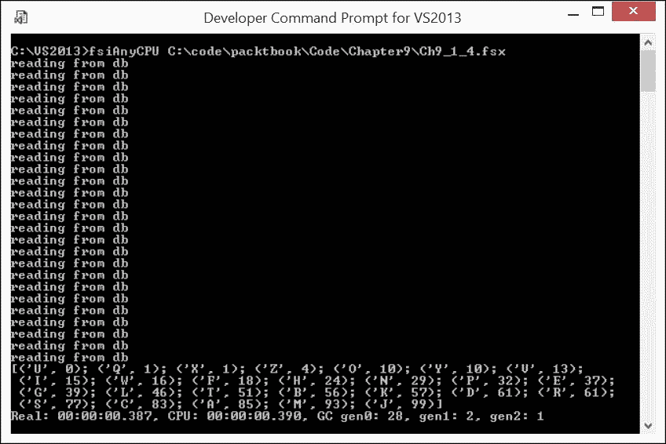
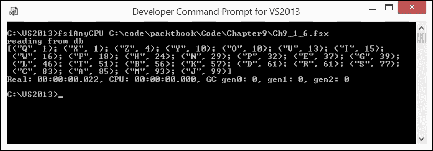
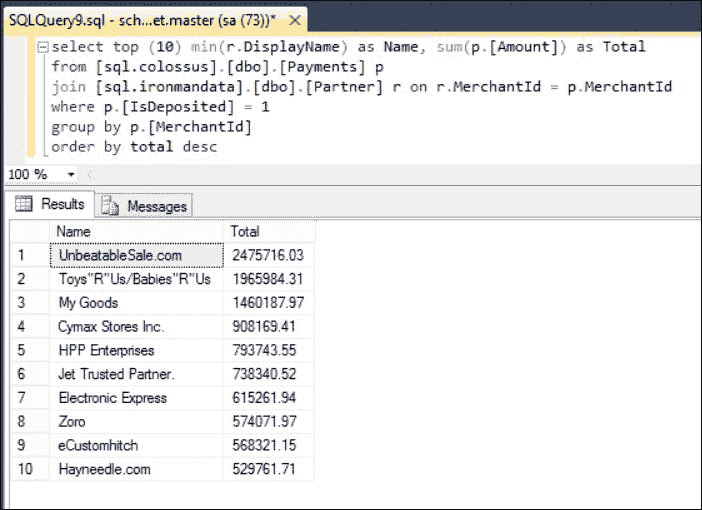
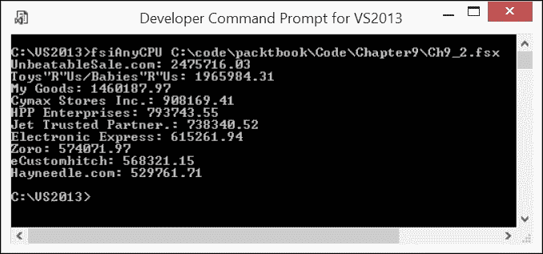

# 第九章。更多数据处理

到目前为止，所有涵盖的 F# 数据转换模式都处理的是内存中的集合。也就是说，重要的数据处理用例，如查询企业内部已持久化的数据和从企业外部摄取数据，尚未被考虑。

本章涵盖了这些数据转换场景和相关编码模式：

+   查询外部数据。我将从使用 F# 查询表达式查询数据开始。我们将看到我们在第八章 “数据处理 - 数据转换模式” 中提炼出的相同转换模式，与核心库函数成员完全适用于查询数据库或 Web 服务中呈现的外部数据。探索查询表达式在组合方面的极限也将很有趣。

+   从外部源解析数据。我们已经花费了大量时间考虑由主动模式增强的模式匹配。然而，我并不觉得有必要使用一些高级技术，例如解析器组合器。我将展示一些来自实战的生产质量数据解析示例，这些示例仅通过一点自定义编码即可实现。

# 数据查询

到目前为止，本书中数据集合的来源要么是集合生成器，要么是文件系统。让我转向更现实的业务数据源，其中数据存储在数据库中。为了访问和转换此类数据，F# 提供了 **查询表达式** ([`msdn.microsoft.com/visualfsharpdocs/conceptual/query-expressions-%5bfsharp%5d`](https://msdn.microsoft.com/visualfsharpdocs/conceptual/query-expressions-%5bfsharp%5d) )。

**查询表达式**代表一种嵌入到语言中的具体类型的**计算表达式**。它们允许通过查询外部源将数据带入内存，并将传入的数据转换为所需的形状。

F# 查询表达式类似于序列表达式：两者都产生数据序列。然而，在最终数据投影塑造产生的数据序列之前，查询表达式可能应用于各种类似我们在 **LINQ** ([`en.wikipedia.org/wiki/Language_Integrated_Query`](https://en.wikipedia.org/wiki/Language_Integrated_Query) ) 中所见到的数据转换。查询表达式可以被视为 F# 中的 LINQ 支持。

## 在查询表达式之前，F# 和 LINQ

按照时间顺序，查询表达式是在 F# 3.0 中引入的。在那之前，F# 允许你通过 **.NET 3.5 Enumerable** 扩展方法（[`msdn.microsoft.com/en-us/library/system.linq.enumerable_methods(v=vs.110).aspx`](https://msdn.microsoft.com/en-us/library/system.linq.enumerable_methods(v=vs.110).aspx)）访问 LINQ 机制。让我们看看以下脚本，它找出按字典顺序排列的英文字母序列中的最后一个元音字母（`Ch9_1_1.fsx`）：

```cs
let isVowel = function 
              | 'A' | 'a' | 'E' | 'e' | 'I' | 'i' 
              | 'O' | 'o' | 'U' | 'u' -> true 
              | _ -> false 

let alphabet = seq { 'A' .. 'Z' } 

alphabet |> Seq.filter isVowel |> Seq.sortDescending |> Seq.head 
// val it : char = 'U' 

```

如果我们回想一下 F# 中的 `alphabet` 序列是 `IEnumerable`，那么这个任务可以通过 LINQ 扩展方法（`Ch9_1_2.fsx`）来完成：

```cs
open System.Linq 
let isVowel = function 
              | 'A' | 'a' | 'E' | 'e' | 'I' | 'i' 
              | 'O' | 'o' | 'U' | 'u' -> true 
              | _ -> false 
let alphabet = seq { 'A' .. 'Z' } 
alphabet.Where(isVowel).OrderByDescending(fun x -> x).First() 
// val it : char = 'U' 

```

使用 LINQ 扩展方法的 *流畅接口* 作为 F# 管道操作符 `|>` 的粗略替代，我们实现了定义之间的几乎一对一对应。同样的结果是通过组合 `Seq` 库函数 `filter-sortDescending-head` 和通过组合 LINQ 扩展方法 `Where-OrderByDescending-First` 来实现的。

## 介绍 F# 查询表达式

你可能会问，为什么我如此关注上述相似性？那是因为查询表达式不过是类似于我们在 第六章 中观察到的序列表达式的 *语法糖*。查询表达式使用 F# 计算表达式魔法将函数应用链表达为 SQL 类似操作的线性序列，这些操作在内置的计算表达式构建器 `query { ... }` 中进行。这种方法与 `seq { ... }` 生成 F# 序列的工作方式相似。上一节中给出的 `Ch9_1_2.fsx` 脚本可能使用查询表达式作为（`Ch9_1_3.fsx`）：

```cs
let isVowel = function 
              | 'A' | 'a' | 'E' | 'e' | 'I' | 'i' 
              | 'O' | 'o' | 'U' | 'u' -> true 
              | _ -> false 

let alphabet = seq { 'A' .. 'Z' } 

query { 
    for letter in alphabet do 
    where (isVowel letter) 
    sortByDescending letter 
    select letter // may be omitted 
    head 
} 
// val it : char = 'U' 

```

在分析前面的查询表达式时，你可能注意到已经熟悉的 **ETL** 数据转换过程，这在 第八章 中已经考虑过，*数据处理 – 数据转换模式*：给定一个集合，对其成员进行一个或多个修改，最终投影查询结果。作为计算表达式 `query` 提供了相邻行之间的神奇粘合剂。它使得数据以类似函数通过 `>>` 组合器链式连接的方式从一个查询操作符流向另一个查询操作符。

## 查询操作符

虽然查询操作符的数量 ([`msdn.microsoft.com/en-us/visualfsharpdocs/conceptual/query-expressions-%5Bfsharp%5D`](https://msdn.microsoft.com/en-us/visualfsharpdocs/conceptual/query-expressions-%5Bfsharp%5D) ) 相对于 F# 核心库中集合函数的数量来说要少得多——只有大约 40 个——但查询操作符很好地融入了，在适用的情况下，数据转换模式的层次结构中（另一个类似的 *分类* 我设法发现的是以下一个：[`weblogs.asp.net/dixin/understanding-linq-to-objects-2-query-methods-and-query-expressions`](https://weblogs.asp.net/dixin/understanding-linq-to-objects-2-query-methods-and-query-expressions)）。在括号中提供的与先前分类中类似名称的映射如下所示：

+   **聚合模式** (*聚合*): 包括 `count`、`averageBy`、`averageByNullable`、`minBy`、`maxBy`、`minByNullable`、`maxByNullable`、`sumBy` 和 `sumByNullable`

+   **搜索模式**：这包括 `find` 函数

+   **选择模式** (*限制*): 这包括 `last`、`lastOrDefault`、`head`、`headOrDefault`、`nth`、`exactlyOne`、`exactlyOneOrDefault`、`take`、`takeWhile`、`skip`、`skipWhile`、`distinct` 和 `where`

+   **分区模式** (*分组*): 这包括 `groupBy` 和 `groupValBy`

+   **重新排序模式** (*排序*): 这包括 `sortBy`、`sortByDescending`、`sortByNullable`、`sortByNullableDescending`、`thenBy`、`thenByDescending`、`thenByNullable` 和 `thenByNullableDescending`

+   **测试模式** (*量词*): 这包括 `exists` 和 `all`

+   **映射模式** (*投影*): 这包括 `select`

+   **合并/拆分模式** (*卷积*): 这包括 `zip`、`join`、`groupJoin` 和 `leftOuterJoin`

很好！然而，到目前为止，考虑的都是在内存集合中的旋转。那么我们如何包含查询内存外的数据？F# 在这方面提供了相当大的灵活性；因此，让我们逐步进行，以便探索可用的方案之丰富性和多样性。

## LINQ 提供者的作用

在使用 LINQ 时，经常被偶尔用户忽略的重要细节是查询机制对数据集合的性质是无关的。可能存在一个层，它抽象了位于 **IQueryable<'T>** ([`msdn.microsoft.com/en-us/library/bb351562(v=vs.110).aspx`](https://msdn.microsoft.com/en-us/library/bb351562(v=vs.110).aspx) ) 接口背后的具体数据源的细节，而我们尚未触及这个接口。不涉及这一层，你就只能依靠我们熟悉的 `IEnumerable<'T>` 接口了。

这两个接口都确保了延迟执行。然而，`IEnumerable<'T>` 只是将与查询表达相关的数据集合引入内存，这些查询是通过相关外部手段表达的，并受进一步的 **LINQ-to-Object** 内存操作的约束。

相比之下，`IQueryable<'T>` 通过名为 **LINQ provider** 的组件允许 **LINQ-to-Something**（例如 **LINQ-to-SQL, LINQ-to-OData, LINQ-to-WMI** 等）工作。它确保 LINQ 查询被翻译成 *Something* 部分的具体替代品所理解的语言，然后由 *Something* 执行翻译后的查询，仅将匹配的数据集合带回内存。对于那些对 *Something* 可能扮演什么角色感兴趣的人，我推荐查看代表性的、虽然有些过时的 - **LINQ-to-Everywhere - LINQ 提供器列表** ([`blogs.msdn.microsoft.com/knom/2009/04/27/linq-to-everywhere-list-of-linq-providers/`](https://blogs.msdn.microsoft.com/knom/2009/04/27/linq-to-everywhere-list-of-linq-providers/) )。

上一段落中有两个关键点必须正确理解。首先，*LINQ 提供器完全抽象了查询翻译和执行的细节*。对于直观清晰的 **LINQ-to-SQL** 案例，这种翻译相当直接。翻译后的 SQL 查询将在参与数据库引擎的侧执行，仅通过网络发送服务器端查询执行的结果。对于像 **LINQ-to-CRM** ([`linqtocrm.codeplex.com/`](http://linqtocrm.codeplex.com/)) 这样的例子，需要进一步挖掘以了解这个特定的 LINQ 提供器到底做了什么。

其次，待翻译的 LINQ 查询不应包含无法用翻译查询执行引擎表达的内容。这种违规可能通过提供器实现中的功能选择性或从上下文中无意中捕获不相关的元素而发生。这意味着如果提供器实现，例如，不支持排序操作，那么包含排序部分的 LINQ 查询将被底层提供器拒绝。此外，有时翻译查询执行引擎的能力可能不同，同一个 LINQ-to-SQL 查询可能由 Microsoft SQL 引擎成功执行，但在 MySQL 引擎上却失败得非常惨重。

考虑到 LINQ 提供器的角色，我们首先转向无 LINQ 提供器的 F# 查询案例。

## 通过 `IEnumerable<'T>` 进行外部数据查询

对于这个用例，让我找一个你可以轻松复制的例子。作为微软平台上的用户，我将使用微软提供给开发者的传统测试数据库，即 **Adventureworks 2014** ([`msftdbprodsamples.codeplex.com/releases/view/125550`](https://msftdbprodsamples.codeplex.com/releases/view/125550) )。它已经安装在 Visual Studio 2013 伴随的 **localdb** 微软 SQL 引擎下。

在这个数据库中有一个 `[Person].[Person]` 表，其中包含除了其他信息之外的人名。让我通过以下查询来对这个表执行一个简单的分析任务：

```cs
select count(distinct [FirstName]) from [Adventureworks2014].[Person].[Person] 

```

这使我能够发现数据库包含 1018 个独特的个人姓氏。让我们找出这些名字是如何按照英语字母表中的第一个字母分布的。

要访问数据库，我将使用原生 .NET `System.Data.SqlClient` 库的简单 `Reader` 对象。最初（并且相当简单）的方法是将完整的独特姓氏列表通过网络发送到内存中。以下脚本实现了这种方法（`Ch9_1_4.fsx`）：

```cs
open System.Data 
open System.Data.SqlClient 

let alphabet = seq { 'A' .. 'Z' } 

let connStr = @"Data Source=(localdb)projectsv12;Initial Catalog=Adventureworks2014;Integrated Security=true;" 
let dbConnection = new SqlConnection(connStr) 
dbConnection.Open() 

let dbCommand = new SqlCommand("select FirstName from [Person].[Person]",dbConnection) 
let names = seq { 
                printfn "reading from db"  
                use reader = dbCommand.ExecuteReader(CommandBehavior.Default) 
                while reader.Read() do yield reader.GetString(0) } 
let distribution = 
    query { 
        for letter in alphabet do 
            let howMuch = 
                query { 
                    for name in names do 
                    where (name.StartsWith(string letter)) 
                    distinct 
                    select name 
                } |> Seq.length 
            sortBy howMuch 
            select (letter, howMuch) 
    } 

distribution |> Seq.toList |> printfn "%A" 

```

这里有两个查询表达式：第一个遍历 `alphabet` 中的每个 `letter`，将获取完整数据集的任务委托给嵌套的第二个查询，然后在内存中过滤掉除了以当前 `letter` 值开头的名字之外的所有内容，丢弃重复项并找到名字的数量。外部查询根据找到的频率将这个数字放入其位置，并返回所寻求的投影 `(letter, howMuch)` 作为 `distribution` 序列。在 FSI 中实现它，我可以观察到目标名字的分布。以下截图展示了运行脚本 `Ch9_1_4.fsx` 的计时结果，其中 FSI 只从给定的文件路径获取源脚本代码：



外部 SQL 查询：第 1 版

你可能会注意到，在运行过程中，脚本从 `[Person][Person]` 数据库表中完整读取了姓氏列表 26 次，这显然是过度杀鸡用牛刀，这种方法可以显著改进。

例如，我们可以参数化我们的 SQL 命令，并返回的不是所有名字，而是每个特定字母的独特名字，这将显著减少与数据库之间的流量。以下代码（`Ch9_1_5.fsx`）展示了重构后的脚本以反映这种改进方法：

```cs
open System.Data 
open System.Data.SqlClient 

let alphabet = seq { 'A' .. 'Z' } 

let connStr = @"Data Source=(localdb)projectsv12;Initial Catalog=Adventureworks2014;Integrated Security=true;" 
let dbConnection = new SqlConnection(connStr) 
dbConnection.Open() 

let dbCommandR l = 
    new SqlCommand( 
        (sprintf "%s%s%s" "select distinct FirstName from [Person].[Person] where FirstName like '" l  
          "%'"), dbConnection) 

let names l = seq { 
                printfn "reading from db"  
                use reader = (dbCommandR l).ExecuteReader(CommandBehavior.Default) 
                while reader.Read() do yield reader.GetString(0) } 

let distribution = 
    query { 
        for letter in alphabet do 
            let howMuch = names (string letter) |> Seq.length 
            sortBy howMuch 
            select (letter, howMuch) 
    } 
#time "on" 
distribution |> Seq.toList |> printfn "%A" 

```

你可能会注意到，现在不需要嵌套的 `query {...}` 组了，因为大量工作已经通过网络委托给了 SQL 引擎。以下截图显示了重构后的脚本的计时结果：


外部 SQL 查询 - 第 2 版

你可能会观察到由于网络流量量的显著减少，性能几乎提高了四倍。

将最小化流量趋势推向极致，尽可能将工作分配给 SQL 服务器，我可能会让所有工作都推到 SQL 服务器的一侧，只留下为 F# 查询获取远程数据的初步任务，例如在此处显示的脚本的第三个版本 (`Ch9_1_6.fsx`)：

```cs
open System.Data 
open System.Data.SqlClient 

let connStr = @"Data Source=(localdb)projectsv12;Initial Catalog=Adventureworks2014;Integrated Security=true;" 
let dbConnection = new SqlConnection(connStr) 
dbConnection.Open() 

let dbCommandF = 
    new SqlCommand("select SUBSTRING(FirstName, 1, 1),count(distinct FirstName) as "count" 
                    from [Adventureworks2014].[Person].[Person] 
                    group by SUBSTRING(FirstName, 1, 1) 
                    order by count",dbConnection) 

let frequences = seq { 
                printfn "reading from db"  
                use reader = dbCommandF.ExecuteReader(CommandBehavior.Default) 
                while reader.Read() do yield (reader.GetString(0), reader.GetInt32(1)) } 

let distribution = 
    query { 
        for freq in frequences do 
        select freq 
    } 
#time "on" 
distribution |> Seq.toList |> printfn "%A" 

```

注意现在所有脏活累活都由 SQL 服务器完成，这是完全正常的，因为 Microsoft SQL Server 是一款致力于数据存储和处理的软件杰作，而且它的工作做得非常好（当然，前提是你不进行有害的干扰）。运行最终脚本重构的结果在以下截图中展示。不要错过整个数据交换仅通过一次往返完成的证据：



外部 SQL 查询：版本 3

哇，这个优化真是太棒了！与版本 1 相比，版本 3 大约 *提高了 17.6 倍的性能*。现在你的收获教训难以忘记。

### 小贴士

企业开发要求底层技术确保有足够的远程负载分发能力。这种能力可以通过 F# `query` 以及其他方式实现。

## 通过 IQuerable<'T> 进行外部数据查询

我希望在前一节中取得的显著性能结果之后，无需再向你证明将 LINQ 查询执行转发到远程方的能力有多么重要。然而，不要期望这可以理所当然地获得。这个方向可能有一个陡峭的学习曲线，我们很快就会注意到。

让我们以我最近在 **Jet.com Inc.**（[`jet.com/about-us`](https://jet.com/about-us)）工作中遇到的一个 100% 真实任务为例。我将构建一个仪表板的后端，实时显示 Jet.com 的 *高薪合作伙伴*（那些向 Jet.com 客户发货并完成订单获得最大赔偿金额的商家）。

我将访问 Jet.com 质量保证环境中有限的数据，因此这些数字不会那么能说明真实的高薪合作伙伴。

仪表板后端所需的数据分布在两个数据库中：`SQL.Colossus` 负责存储 `Payments` 表中的支付数据，而 `SQL.IronmanData` 负责存储 `Partner` 表中的合作伙伴数据。

如果数据位于支持跨数据库查询的相同 SQL 引擎中，那么为我提供所需数据的 T-SQL 脚本可能如下所示（`Ch9_2.fsx`，顶部注释部分）：

```cs
select top (10) min(r.DisplayName) as Name, sum(p.[Amount]) as Total 
from [sql.colossus].[dbo].[Payments] p 
join [sql.ironmandata].[dbo].[Partner] r on r.MerchantId = p.MerchantId 
where p.[IsDeposited] = 1 
group by p.[MerchantId] 
order by total desc 

```

在 SQL Server Management Studio 中针对目标环境执行后，这会产生以下截图所示的结果：



用于向 Jet.com 高薪合作伙伴仪表板提供 SQL 查询

让我尝试使用 F# 查询表达式 `query{...}` 表达类似的 T-SQL 查询。为了访问 LINQ-to-SQL，我将使用比上一节中使用的 **ADO.NET** 更高级的 F# 机制来获取对数据的强类型访问。这种机制被称为 F# **类型提供程序**。具体来说，我将使用 **SQLDataConnection (LINQ to SQL) 类型提供程序**([`fsharp.org/guides/data-access/#sql-data-access`](http://fsharp.org/guides/data-access/#sql-data-access))，这是 F# 标准发行版的一部分，自 F# v3.0 以来一直针对 Microsoft Windows。

### 注意

对于那些对这个主题完全不熟悉的你们，可以遵循这个**MSDN 演练**([`msdn.microsoft.com/visualfsharpdocs/conceptual/walkthrough-accessing-a-sql-database-by-using-type-providers-%5bfsharp%5d`](https://msdn.microsoft.com/visualfsharpdocs/conceptual/walkthrough-accessing-a-sql-database-by-using-type-providers-%5bfsharp%5d))来更好地理解本节的内容。

可以放入仪表板后端核心的 F# 脚本如下（`Ch9_2.fsx`）：

```cs
#r "FSharp.Data.TypeProviders" 
#r "System.Data" 
#r "System.Data.Linq" 

open Microsoft.FSharp.Data.TypeProviders 
open System.Linq 

[<Literal>] 
let compileTimeCsusCS = @"Data Source=(localdb)projectsv12;Initial Catalog=Colossus.DB;Integrated Security=SSPI" 
let runTimeCsusCS = @"Data Source=***;Initial Catalog=SQL.Colossus;User ID=***;Password=***" 
[<Literal>] 
let compileTimeImCS = @"Data Source=(localdb)projectsv12;Initial Catalog=SQL.Ironman;Integrated Security=SSPI" 
let runTimeImCS = @"Data Source=***;Initial Catalog=SQL.IronmanData;User ID=***;Password=***" 

type Colossus = SqlDataConnection<compileTimeCsusCS> 
type IronManData = SqlDataConnection<compileTimeImCS> 

let pmtContext = Colossus.GetDataContext(runTimeCsusCS) 
let imContext = IronManData.GetDataContext(runTimeImCS) 

let mostPaid = 
    fun x -> query { 
                for payment in pmtContext.Payments do 
                where (payment.IsDeposited.HasValue && payment.IsDeposited.Value) 
                groupBy payment.MerchantId into p 
                let total = query { for payment in p do sumBy payment.Amount} 
                sortByDescending total 
                select (p.Key,total) 
                take x 
             } 

let active = (mostPaid 10) 
let activeIds = active |> Seq.map fst 

let mostActiveNames = 
    query { 
        for merchant in imContext.Partner do 
        where (activeIds.Contains(merchant.MerchantId)) 
        select (merchant.MerchantId,merchant.DisplayName) 
    } |> dict 

active 
|> Seq.map (fun (id, total) -> (mostActiveNames.[id],total)) 
|> Seq.iter (fun x -> printfn "%s: %.2f" (fst x) (snd x)) 

```

考虑到安全要求，我没有透露任何关于 Jet.com 基础设施的信息，除了一些（不一定与真实名称相符）的数据库和表名。

当涉及到类型提供程序时，重要的是要意识到提供程序本身在编译时工作，为涉及的 SQL 表的字段提供类型化访问。为了做到这一点，它需要在编译时访问 SQL 架构信息。这种对前面脚本中结构信息的访问是通过 `compileTimeCsusCS` 和 `compileTimeImCS` 连接字符串为 `Colossus.DB` 和 `SQL.Ironman` 数据库提供的。

注意，从类型提供程序对本地 SQL 引擎的编译时访问与应用数据无关。它只是检索有关 SQL 架构的系统数据。这些架构在结构上类似于在生产 SQL 数据引擎上承载应用数据的那些架构。因此，提供的 `Colossus` 和 `IronManData` 类型是基于 `localdb` SQL 引擎构建的，而 `pmtContext` 和 `imContext` 运行时数据上下文是基于生产服务器（通过 `runTimeCsusCS` 和 `runTimeImCS` 运行时连接字符串）构建的。

`mostPaid` 函数表示用于查找任何给定数量的高薪合作伙伴及其总存入支付的查询。正如我们可能预期的，这个函数的签名是 `mostPaid : x:int -> System.Linq.IQueryable<string * decimal>`，它将被 LINQ-to-SQL 提供程序转换为普通的 T-SQL，并在 SQL 服务器端执行。

另一个有趣的时刻是，在 Jet.com 的 Microsoft Azure 生产环境中，如图 *SQL 查询为付费最高的 Jet.com 合作伙伴仪表板提供数据* 的跨数据库查询等操作无法正常工作，因此我将访问过程分为三个阶段：

+   在第一阶段，`active` 代表一个包含 `(merchantId, paymentAmount)` 元组的集合，其中相关合作伙伴 ID 列表 `activeIds` 可以轻松投影

+   在第二阶段，另一个查询 `mostActiveNames` 仅检索属于付费最高的合作伙伴的合作伙伴显示名称，并将它们打包到字典中

+   最后，`active` 经历了一次转换，其中 ID 被替换为 `mostActiveNames.[id]` ，从而得到仪表板所需的最终数据形状。

运行前一个脚本并使用 FSI 的结果在以下屏幕截图中展示；正如预期的那样，它们与之前的结果相同：



通过 IQueryable<'T>在 F#中查询的实际操作

## 可组合查询

将较小的 F#子查询组合成更大的查询不是很好吗？换句话说，这意味着将多个可查询对象组合成一个 LINQ 查询，该查询被翻译成 SQL 并在数据库引擎端执行。

这听起来很有希望，并引起了一些个人开发者及团队的注意。

### 注意

英国爱丁堡大学的一个团队投入了最多的努力，该团队由如 Philip Wadler 等函数式编程权威人士领导。他们的成果可以在 **FSharpComposableQuery**  ([`fsprojects.github.io/FSharp.Linq.ComposableQuery/index.html`](http://fsprojects.github.io/FSharp.Linq.ComposableQuery/index.html) ) 项目主页上找到，提供 NuGet 包、源代码、教程，甚至还有关于该主题的一些理论论文。Philip Wader 在 SkillsMatter 网站上给出了一篇介绍视频演示：**语言集成查询的实用理论** ([`skillsmatter.com/skillscasts/4486-a-practical-theory-of-language-integrated-query`](https://skillsmatter.com/skillscasts/4486-a-practical-theory-of-language-integrated-query) )。

此外，几年前，Loïc Denuzière 在 **这篇博客文章** ([`fpish.net/blog/loic.denuziere/id/3508/2013924-f-query-expressions-and-composability`](http://fpish.net/blog/loic.denuziere/id/3508/2013924-f-query-expressions-and-composability) ) 中提出了一种替代的、更轻量级的可组合查询方法，Loïc Denuzière 的资料可以在 [`fpish.net/profile/loic.denuziere`](http://fpish.net/profile/loic.denuziere) 找到。该方法基于将部分 F#查询表达式拼接在一起以构建更复杂的查询。我将基于这种方法探索可组合 LINQ 查询。

在我们开始编写代码之前，我必须指出基于 LINQ-to-SQL 的 F# 查询的一个重大限制：无法执行跨数据库和跨引擎查询，因为**所有子查询都必须共享相同的 LINQ 上下文**！这个因素可能成为拥有众多 **OLTP** 和 **OLAP** 数据库的企业的一个拦路虎。

为了将 `Ch9_2.fsx` 脚本中的 T-SQL 查询重构为可组合查询，我在仪表板用例讨论中覆盖了上述内容，我已经将 `Partner` 表的副本移动到 `SQL.Colossus` 数据库。它现在可以与 `Payments` 表共享相同的 LINQ 上下文。

组合方法基于引入一个特殊的 `PartialQueryBuilder` 类，它：

+   引入额外方法 `Run` 的标准 `Linq.QueryBuilder` 子类

+   使用 `Source` 方法增强 `Linq.QueryBuilder`

所有这些措施都允许你使用替代表达式构建器 `pquery` 编写子查询，这些查询被包裹在引号中而不是被评估。这些引号被嵌入到普通查询中，并统一评估。

在以下脚本中，它依赖于这些功能，为了简洁起见，我省略了编译时和运行时连接的分离（`Ch9_3.fsx`）：

```cs
#r "FSharp.Data.TypeProviders" 
#r "System.Data" 
#r "System.Data.Linq" 

open Microsoft.FSharp.Data.TypeProviders 
open System.Linq 

[<Literal>] 
let runTimeCsusCS = @"Data Source=***;Initial Catalog=SQL.Colossus;User ID=***;Password=***" 

type Colossus = SqlDataConnection<runTimeCsusCS> 

let pmtContext = Colossus.GetDataContext(runTimeCsusCS) 

```

然后是定义 `pquery` 的实用部分：

```cs
type PartialQueryBuilder() = 
    inherit Linq.QueryBuilder() 
    member __.Run(e:  Quotations .Expr<Linq.QuerySource<'T,IQueryable>>) = e 

let pquery = PartialQueryBuilder() 

type Linq.QueryBuilder with 
    [<ReflectedDefinition>] 
    member __.Source(qs: Linq.QuerySource<'T,_>) = qs 

```

最后，组合查询如下：

```cs
let mostPaid = pquery { 
                    for payment in pmtContext.Payments do 
                    where (payment.IsDeposited.HasValue && 
                           payment.IsDeposited.Value) 
                    groupBy payment.MerchantId into p 
                    let total = pquery { for payment in p do sumBy 
                                         payment.Amount} 
                    sortByDescending total 
                    select (p.Key,total) 
                    take 10 
                         } 

let dashboard = pquery { 
                    for merchant in pmtContext.Partner do 
                        for (id,total) in %mostPaid do 
                        where (merchant.MerchantId = id ) 
                        select (merchant.DisplayName, total) 
                       } 

query { for m in %dashboard do 
           select m } |> Seq.iter (fun x -> printfn "%s: %.2f" (fst x) (snd x)) 

```

注意 `mostPaid` 如何被拼接到 `dashboard` 中，从而创建了一个无缝的组成，反过来，`dashboard` 被拼接到最终的查询中。

在 FSI 中运行脚本产生以下结果：


使用组合查询获取仪表板数据

你可能会想知道是否有方法可以检查查询组合是否真的发生了。幸运的是，这并不难做到。只需向 LINQ 上下文中添加以下属性即可，如下所示：

```cs
pmtContext.Payments.Context.Log <- new System.IO.StreamWriter( 
   @"C:usersgenedownloadspmtlinq.log", AutoFlush = true) 

```

再次运行前面的脚本后，LINQ 日志文件现在包含 SQL 引擎执行的 SQL 代码：

```cs
SELECT [t0].[DisplayName] AS [Item1], [t3].[value] AS [Item2] 
FROM [dbo].[Partner] AS [t0] 
CROSS JOIN ( 
    SELECT TOP (10) [t2].[MerchantId], [t2].[value] 
    FROM ( 
        SELECT SUM([t1].[Amount]) AS [value], [t1].[MerchantId] 
        FROM [dbo].[Payments] AS [t1] 
        WHERE ([t1].[IsDeposited] IS NOT NULL) AND (([t1].[IsDeposited]) = 1) 
        GROUP BY [t1].[MerchantId] 
        ) AS [t2] 
    ORDER BY [t2].[value] DESC 
    ) AS [t3] 
WHERE [t0].[MerchantId] = [t3].[MerchantId] 
ORDER BY [t3].[value] DESC 
-- Context: SqlProvider(Sql2008) Model: AttributedMetaModel Build: 4.0.30319.33440 

```

注意如何将脚本 F# 查询中的所有 `IQueryable` 零部件塑造成单个 SQL 语句。

# 数据解析

数据解析对企业来说绝对至关重要。作为 Jet.com 的企业级 F# 开发者，我每天都在遇到这种数据转换模式。每个 **LOB** 应用程序与第三方系统（**ERP**、**银行** 或 **承运商**）集成的案例都涉及到在摄取边缘的数据解析。尽管有大量承诺提供优质数据、及时性、完整性的集成技术，但无论什么名字...时间一次又一次地，我被我的承包商强迫处理平面固定格式文件、CSV 文件和 Excel 文件。这就是今天令人厌烦的现实。

在这个战场上，武器装备从基于 **Regex** 和 F# 活动模式的逐个案例手编解决方案到针对整个 incoming 数据类别的相当通用的解决方案不等。一些半通用的解决方案的典型例子是将以 CSV 文件和 Excel 文件形式存在的发票持久化到 SQL 服务器中，以便进行进一步的处理、对账和未来的审计。我将展示如何实现高质量解析 incoming 数据，以处理将作为 Excel 文件摄入的承运人发票消化到 SQL 服务器的用例。

## 用例 - 激光船发票

LaserShip 是电子商务通常用于当日快递交付的“最后一英里”配送公司之一。Jet.com 使用 LaserShip 服务以及其他承运人服务。

LaserShip 以 Excel 文件的形式提供其发票信息。为了对账和审计的目的，将 LaserShip 发票加载到 SQL 服务器中是可取的。

## 接近解析任务

当出现类似 ETL 任务时，我通常采用以下模式来处理：

1.  定义将承载加载数据的 SQL 表的架构。为来自承运人的数据添加额外的字段（s），允许您将任何数据块引用回其原始的承运人文件。此外，添加合成和/或自然键字段以及合理的约束。示例 SQL 表架构已以 T-SQL 脚本 `SCHEMA_LaserShip.sql` 的形式提供。

1.  使用 **Excel Provider** ([`fsprojects.github.io/ExcelProvider/`](http://fsprojects.github.io/ExcelProvider/)) 的帮助来摄入文件。调整类型提供程序设置以抑制默认的字段类型解释并强制将字段作为字符串提供。LaserShip 向其客户提供由 LaserShip 分发的 Excel 文件模板，已作为 Excel 文件 `Lasership Invoice Format.xlsx` 提供。

1.  对于在源中表示可能被省略的字段，例如 **可空** 值。省略的值应使用 `System.DBNull.Value` 单例填充。为每个字段类型创建或重用一组解析函数，返回装箱的解析值或 `System.DBNull.Value` 。

1.  将文件内容解析到匹配数据库字段的 `System.Data.DataTable` 实例中，使用泛型解析函数解析值。包含从真实发票摘录的示例发票，其中已删除个人数据，已作为 Excel 文件 `LaserShip20160701.xlsx` 提供。

1.  使用 ADO.NET **SqlBulkCopy** ([`msdn.microsoft.com/en-us/library/system.data.sqlclient.sqlbulkcopy(v=vs.110).aspx`](https://msdn.microsoft.com/en-us/library/system.data.sqlclient.sqlbulkcopy(v=vs.110).aspx)) 将填充的 `DataTable` 实例加载到 SQL 服务器中。

## LaserShip 解析器实现

之前概述的方法是通过脚本 `Ch9_4.fsx` 实现的。由于脚本长度不适合书籍格式，因此不会在这里完整给出。相反，我将在本节中仅重现脚本中最重要的摘录以及我的注释：

```cs
#r @"C:...packagesExcelProvider.0.8.0libExcelProvider.dll" 

```

上面的行确保可以从脚本中访问 NuGet 包 **Excel Provider 0.8.0** ([`www.nuget.org/packages/ExcelProvider`](https://www.nuget.org/packages/ExcelProvider) )：

```cs
type LaserShip = ExcelFile< @"C:codePacktBookCodeChapter11lasership invoice format.xlsx", HasHeaders=true, ForceString=true> 

```

上面的行非常重要。它由引用的 F# Excel 类型提供者在**编译时**进行处理。使用给定文件路径的类型提供器到达表示数据模板的 Excel 文件 `lasership invoice format.xlsx`。我们通过定义 `HasHeaders` 和 `ForceString` 静态 `bool` 参数来调整类型提供器设置。类型提供器会即时生成提供的类型 `LaserShip`，这将允许通过名称访问发票行的任何单元格：

```cs
let asNullableString = 
    function 
    | null -> box System.DBNull.Value 
    | (s: string) -> s.Trim() 
                     |> function 
                        | "" -> box System.DBNull.Value 
                        | l -> box l 

```

之前对 `asNullableString` 函数的定义实现了从 Excel 数据单元格到其 `obj` 表示的惯用类型转换，这种表示适合放入不进行静态类型检查的 `System.Data.DataTable` 内存中的数据表。如果 Excel 中的数据省略了作为参数传递给函数的单元格，则返回值将是适合放入以 T-SQL 描述的数据库字段类型的 `System.DBNull.Value` 值，例如 `NVARCHAR(...) NULL`。脚本定义了类似于 `asNullableString` 的函数，用于 Excel 文件中的每种类型，在需要强类型检查的地方：`asNullableDate`、`asString`、`asNullableMoney` 以及其他：

```cs
let headers = ["invno";"JobNumber";"TDate";...;"SourceId";"RowKey";] 

```

之前的绑定对于将内存中的数据表列与数据库表列关联到 `SQLBulkCopy` 是必要的：

```cs
let loadLaserShip excelPath = 
    (new LaserShip(excelPath)).Data  

```

这个函数定义非常重要，因为它执行从由给定 `excelPath` 参数指定的 Excel 文件中摄入发票数据到由提供的类型 `LaserShip` 购得的内存占位符 `Data`：

```cs
let fillDataTable sourceId (rows: IEnumerable<LaserShip.Row>) = 
    let dt = new DataTable() 
    do headers |> Seq.iter(fun h-> dt.Columns.Add(new DataColumn(h))) 
    for row in rows do 
        let dr = dt.NewRow() 
        dr.Item(0) <- unbox (row.invno |> asString "invno") 
         .  .  .  .  . 
        dr.Item(36) <- unbox (row.PickupDate |> asNullableString) 
        dr.Item(37) <- sourceId 
        dt.Rows.Add(dr) 
    printfn "loaded %d rows" dt.Rows.Count 
    dt 

```

之前对 `fillDataTable` 函数的定义是脚本的核心。你可能注意到它有趣的参数类型：`rows: IEnumerable<LaserShip.Row>`。换句话说，`rows` 是另一个提供的类型 `LaserShip.Row` 的序列，代表发票工作表的单一行。在函数内部，创建了一个新的 `DataTable` 实例，并通过从 `headers` 中获取列名来提供。然后，将摄入的 Excel 文件的每一行解析到 `dt` 中，注意数据的有效性。最后，返回加载的数据表 `dt`。

一个小但非常重要的细节：上面的 `sourceId` 参数仅仅引用了另一个跟踪已处理发票的表。它已经被写入内存数据表的每一行，因此在数据上传后，这个引用将在持久化到 SQL 服务器的数据中可用，以描述数据的原始来源。更详细的内容超出了此处讨论的范围。

最后，另一个重要的函数 `loadIntoSQL` 实现了将大量数据上传到 SQL 服务器。其定义如下：

```cs
let loadIntoSQL tableName connStr (dataTable: DataTable) = 
    use con = new SqlConnection(connStr) 
    con.Open() 
    use bulkCopy = new SqlBulkCopy(con, DestinationTableName = tableName) 
    bulkCopy.WriteToServer(dataTable) 
    printfn "Finished write to server" 

```

使用提供的连接字符串 `connStr` 值打开数据库连接 `con`。使用创建的连接和给定的 SQL 表名，创建并使用 `SqlBulkCopy` 实例将内存中的 `dataTable` 持久化到相关的 SQL 服务器表。

前面的脚本可以进一步泛化到只有与具体文件类型相关的数据部分是可变的程度。这个可变部分可以被集成到通用的 Excel 文件解析器中。这可以在不到一百行代码内实现。

# 摘要

本章总结了数据转换模式的话题。大部分内容都是关于使用 F# 查询表达式查询持久化数据。你应该能够掌握查询工作在内存集合和网络位置的数据引擎之间的分配的细微差别。

我们还触及了数据解析的重要问题，展示了几个简单的模式，这些模式可以帮助你借助 F# 类型提供者摄取任意 Excel 文件，这些内容将在第十一章“F# 专家技巧”中进一步介绍。

在下一章中，我将专注于 F# 中的类型特殊化（增强）和类型泛化的双重模式。
