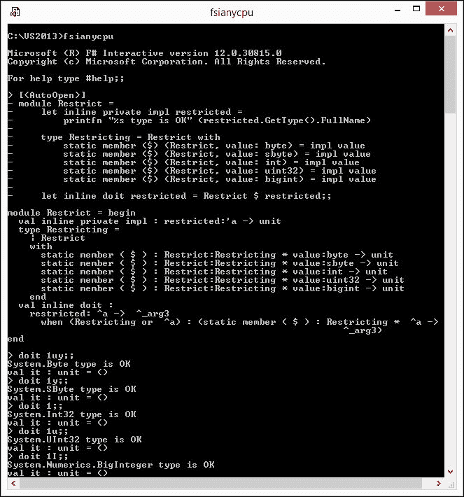
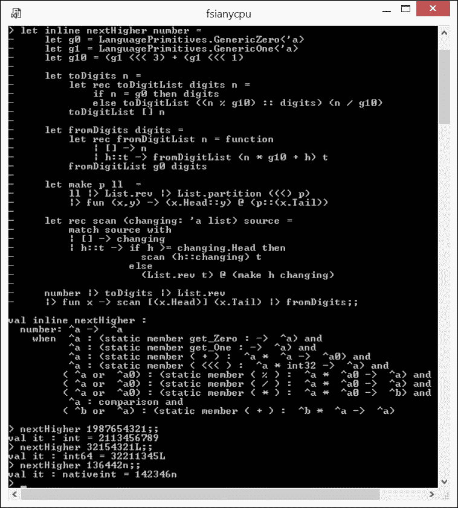
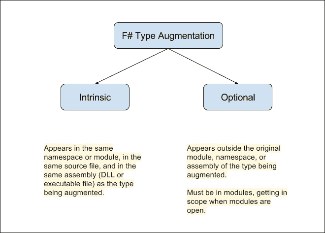
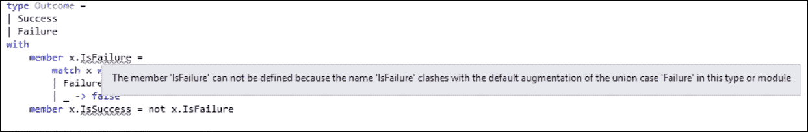

# 第十章。类型扩展和泛型计算

到这本书的这一部分，很容易注意到使用模式和相应语言特征之间的直接联系。例如，第五章，*代数数据类型*，清楚地表明了 F#的本地代数类型是自定义类的替代品。基于代数数据类型的实现质量和速度的提高反映了该功能使用的回报。

在本章中，我将考虑某些语言特性，它们的使用回报并不明显。尽管如此，这些特性在 F#中无处不在。我的意思是代码泛化与代码特殊化的矛盾。

我们将要涵盖以下主题：

+   代码泛化技术，或使相同的函数代码适用于多个函数参数类型

+   代码特殊化技术，或通过使用标准功能使函数代码比通常更具体

上述每个模式都承诺带来某些好处：改进的性能、更简洁的代码和更好的静态类型控制。本章的目标是向您展示如何识别这些模式适用的场景，并应用它们，以实现预期的收益。

# 代码泛化

让我先声明一下，F# **自动泛化**([`msdn.microsoft.com/visualfsharpdocs/conceptual/automatic-generalization-%5bfsharp%5d`](https://msdn.microsoft.com/visualfsharpdocs/conceptual/automatic-generalization-%5bfsharp%5d))函数的参数，在可能处理多种类型的多重性时。

到目前为止，我们主要处理的是数据集合的泛化。也就是说，序列对其元素类型一无所知。这就是为什么我们能够编写操作任意泛型类型序列的函数。F#的类型推断发现并携带了这一属性。

假设我们自豪地实现了自己的列表反转函数，如下所示(`Ch10_1.fsx`):

```cs
let reverse ls = 
    let rec rev acc = function 
    | h::t -> rev (h::acc) t 
    | []   -> acc 
    rev [] ls 

```

那么，我们可能会注意到 F#编译器推断出它的`reverse : ls:'a list -> 'alist`签名，其中`'a`表示该函数可以应用于任何类型的列表元素。如果我们决定检查`reverse`函数与不同参数类型的确切行为，我们可能会观察到其行为对于以下参数是一致的(`Ch10_1.fsx`):

```cs
reverse [1;2;3] 
// val it : int list = [3; 2; 1] 
reverse ["1";"2";"3"] 
// val it : string list = ["3"; "2"; "1"] 

```

即使我们要稍微滥用类型系统并混合不同的装箱类型(`Ch10_1.fsx`):

```cs
reverse [box 1.0; box 2.0M; box 3I] 
//val it : obj list = [3 {IsEven = false; 
//                        IsOne = false; 
//                        IsPowerOfTwo = false; 
//                        IsZero = false; 
//                        Sign = 1;}; 2.0M; 1.0] 

```

`reverse`函数在参数列表元素类型方面表现得真正通用。

好的，现在让我们做一些看似相似但实际上非常简单的事情，比如将参数左移一位(`Ch10_1.fsx`):

```cs
let twice x  = x <<< 1 

```

突然，F#编译器推断出非常具体的`twice : x:int -> int`函数签名。发生了什么？显然，有一些类型允许这种将值加倍的特殊方式，例如`int64`。有趣的是，让我们看看当我们跟随函数定义使用它时会发生什么，如下所示（`Ch10_1.fsx`）：

```cs
let twice x = x <<< 1 
twice 10L 
//val twice : x:int64 -> int64 
//val it : int64 = 20L 

```

现在 F#编译器似乎改变了关于`twice`函数签名的看法，这次推断出参数和结果类型为`int64`。这个操作是不可逆的，这意味着尝试跟随前面的评估使用`twice 10`现在会被这个诊断拒绝：*这个表达式预期具有类型* `int64` *但在这里它具有类型* `int` 。

发生了什么？为什么泛化似乎失败了？

## 静态解析的类型参数

正如我们刚才注意到的，F#编译器为（`<<<`）运算符推断了一个单态类型。向多态迈进的一步是假设能够以某种方式表达它 - 同时保持在只允许这种类型作为`twice`参数与运算符（`<<<`）一起工作的.NET 类型系统中。换句话说，编译器应该处理一个**类型约束**。

问题在于这种约束不能在 F#编译目标语言**MSIL**中表达。也就是说，最新的**.NET CLI 标准** ([`www.ecma-international.org/publications/files/ECMA-ST/ECMA-335.pdf`](http://www.ecma-international.org/publications/files/ECMA-ST/ECMA-335.pdf) )在 *II.10.1.7 泛型参数* 节中通过是一个**值类型**或**引用类型**来约束类型，对于具有**默认构造函数**的具体引用类型。这是.NET 类型系统的问题，而不是 F#语言或编译器的问题。

**F# 4.0 语言规范** ([`fsharp.org/specs/language-spec/4.0/FSharpSpec-4.0-latest.pdf`](http://fsharp.org/specs/language-spec/4.0/FSharpSpec-4.0-latest.pdf) )在第 *5.2.3* 节中暗示了编译器的观察行为：

> *重载运算符的使用不会产生泛化代码，除非定义被标记为内联。例如，看看下面的函数：* `let f x = x + x`
> 
> *它产生了一个 f 函数，只能用来添加一种类型的值，例如 int 或 float。确切类型由后续约束决定*。

幸运的是，F#编译器可以使用**静态解析类型参数**的机制在编译时强制执行这些（以及一些其他）类型的约束。对于我们的(`<<<`)操作符，这个类型参数将具有特殊的“帽子”前缀`^a`，假设在编译点类型是静态已知的（与`'a`相对，假设类型可以是任何东西）。由于这种静态多态函数需要根据与约束相匹配的特定静态解析类型进行特定的编译方式，F#编译器通过**内联**来实现这一目标，正如语言规范所暗示的。

## 函数内联

让我将内联机制应用于这个失败的`twice`函数，如下所示（`Ch10_1.fsx`）：

```cs
let inline twice' x = x <<< 1 
// val inline twice' : 
//     x: ^a ->  ^a when 
//        ^a : (static member ( <<< ) :  ^a * int32 ->  ^a) 

```

注意自动推断的内联`twice`函数签名如何携带所需的类型参数`^a`的约束，该约束在编译时静态解析：类型`^a`必须有一个操作符(`<<<`)，其签名是`^a * int32 -> ^a`。

太好了，现在`twice`看起来像是一个多态函数，允许例如以下评估（`Ch10_1.fsx`）：

```cs
twice' 5    // int32 argument 
twice' 5u   // uint32 argument 
twice' 5L   // int64 argument 
twice' 5UL  // uint64 argument 
twice' 5y   // sbyte argument 
twice' 5uy  // byte argument 
twice' 5s   // int16 argument 
twice' 5us  // uint16 argument 
twice' 5I   // biginteger argument 
twice' 5n   // nativeint argument 

```

同时，它禁止以下评估（`Ch10_1.fsx`）：

```cs
twice' 5m //The type 'decimal' does not support the operator '<<<' 
twice' 5.0 // The type 'float' does not support the operator '<<<' 
twice' "5"// The type 'string' does not support the operator '<<<' 
twice' '5' // The type 'char' does not support the operator '<<<' 

```

在我们仅仅给函数定义添加了`inline`限定符之后，编译器就提供了所有上述的便利。但你应该意识到，编译器实际上将内联函数的实现注入到 MSIL 中，并对其进行调整以适应具有静态解析的具体类型的参数。内联是一种编译方法，允许减轻.NET CLR 的限制。

## 静态约束

如同之前 F#编译器对`twice`函数的推断，参数`x`可以是任何类型`^a`，只要`^a : (static member (<<<) : ^a * int32 -> ^a).`这个条件，要么由 F#编译器推断，或许，也可能是程序员有意施加的，被称为**静态约束**([`msdn.microsoft.com/en-us/visualfsharpdocs/conceptual/constraints-%5Bfsharp%5D`](https://msdn.microsoft.com/en-us/visualfsharpdocs/conceptual/constraints-%5Bfsharp%5D)）。大约有十几种参数类型约束种类。你可以查看**文档**([`docs.microsoft.com/en-us/dotnet/articles/fsharp/language-reference/generics/constraints`](https://docs.microsoft.com/en-us/dotnet/articles/fsharp/language-reference/generics/constraints)）以获取它们的完整列表。

可以使用`and`构造来组合约束，如下面的代码片段所示（`Ch10_2.fsx`）：

```cs
let inline constrained (param: ^a 
    when ^a: equality and ^a: comparison) = () 

type Good = Good 

[<NoEquality; NoComparison>]type Bad = Bad 

Good |> constrained 
// Compiles just fine 
Bad |> constrained 
// Error: type Bad does not support comparison constraint 

```

在这里，我们有两种区分联合：`Good`，默认情况下是**公平的**和**可比较的**，而`Bad`，通常也是公平的且可比较的，但在这里它被装饰了`[<NoEquality; NoComparison>]`属性。由于`constrained`函数要求其泛型`param`参数既是公平的又是可比较的类型，因此`constrained Good`可以编译，而`constrained Bad`则不能。

## 显式或推断约束？

几年前，我尝试创建 F# 泛型代码。当时，我的思路是这样的：如果需要创建一个可以处理有限几种参数类型的泛型函数，正确的做法是对后者进行适当的显式约束。我甚至在 **StackOverflow** ([`stackoverflow.com/q/16737675/917053`](http://stackoverflow.com/q/16737675/917053) ) 上询问了惯用的方法。以下是我想要引用的**其中一个答案**([`stackoverflow.com/a/16738811/917053`](http://stackoverflow.com/a/16738811/917053) )：

> *显式约束是一种表达*你想做什么*的方式。还有什么比*做它*并且让编译器静态证明该参数对于操作是有效的更好的方法吗？*

这是一个启发性的观察，不是吗？

然而，如果你仍然想根据某些外部考虑因素显式限制泛型函数的有效参数类型列表，那么你可以使用以下方法，这是我在**另一个答案**([`stackoverflow.com/a/16739483/917053`](http://stackoverflow.com/a/16739483/917053) )中提到的，该方法基于辅助类型的重载静态方法（`Ch10_2.fsx`）：

```cs
[<AutoOpen>] 
module Restrict = 
    let inline private impl restricted = 
        printfn "%s type is OK" (restricted.GetType().FullName) 

    type Restricting = Restrict with 
        static member ($) (Restrict, value: byte) = impl value 
        static member ($) (Restrict, value: sbyte) = impl value 
        static member ($) (Restrict, value: int) = impl value 
        static member ($) (Restrict, value: uint32) = impl value 
        static member ($) (Restrict, value: bigint) = impl value 

    let inline doit restricted = Restrict $ restricted 

```

前面的代码片段中有三个组件：

+   **私有**函数`impl`，它对一个泛型受限参数类型`'a`执行所需操作；换句话说，对没有任何约束的参数执行操作

+   辅助类型`Restricting`，它有一个单一的区分联合情况`Restrict`，通过在所需的类型集合（`byte`、`sbyte`、`int`、`uint32`、`bigint`仅为了说明）上重载的静态成员`$`来增强

+   用户界面函数`doit`，其受限参数已被其他两个部分静态约束

让我们看看以下脚本（`Ch10_2.fsx`）中前面代码的工作原理：

```cs
doit 1uy 
doit 1y 
doit 1 
doit 1u 
doit 1I 
doit 1L // does not compile 
doit 1.0 // does not compile 
doit 1.0m // does not compile 
doit '1' // does not compile 

```

前五个与受限类型匹配的用例可以正常编译；最后四个用例没有按照预期的诊断编译：

> *没有重载匹配`op_Dollar"`方法*

下面的截图展示了前五个用例的成功执行：



显式约束泛型代码的执行

## 内联作用域

F# 中的内联不仅限于模块级别的函数。使用内联静态和实例方法完全没问题。例如，在下面的代码片段中，我们有类型 `Bar`，它有一个静态方法 `doIt` 和类型 `Foo`，它是在任何泛型类型 `^T` 上定义的，该类型有一个静态成员 `doIt`，具有匹配的签名，并且 `inline` 成员 `Invoke` 调用 `^T` 的 `doIt` 方法，如下所示（`Ch10_2.fsx`）：

```cs
type Bar() = 
  static member doIt() = 42 

type Foo< ^T when ^T: (static member doIt: unit -> int)>(data: ^T []) = 
  member inline this.Invoke () = (^T : (static member doIt : unit -> int) ()) 

let result = (Foo([|Bar()|]).Invoke()) 
// val result : int = 42 

```

前面的示例所展示的一个复杂问题是，从 F# 外部访问静态或实例 `inline` 方法，例如，使用普通的 C# -> F# 互操作性场景。记住，正常的 MSIL 无法支持这样的约束。

为了解决这个微妙的问题，上面 `Invoke` 方法实现的编译后的 MSIL 只会抛出异常。函数的实际内联体仅从 F# 在其程序集元数据中保持可访问。

## 内联优化

内联与代码优化之间的关系相当微妙。通常，很难预测通过内联泛化的后果。

然而，有时，通过内联可以实现巨大的性能提升。一个臭名昭著的例子是 F# 处理 `System.DateTime` 的相等性，其中 `datetime1 = datetime2` 表达式的编译涉及到装箱。看看下面的代码片段（`Ch10_2.fsx`）：

```cs
open System 
#time "on" 
let x, y = DateTime.MinValue, DateTime.MaxValue 
for i = 0 to 10000000 do x = y |> ignore 
//Real: 00:00:00.421, CPU: 00:00:00.406, GC gen0: 115, gen1: 2, gen2: 1 

```

在这里，仅使用 `=` 运算符，我们可以观察到一定的垃圾回收活动。

然而，假设我们只是内联重新定义的相等运算符 `==`，如下面的代码片段所示（`Ch10_2.fsx`）：

```cs
open System 
#time "on" 
let inline eq<'a when 'a :> IEquatable<'a>> (x:'a) (y:'a) = x.Equals y 
let inline (==) x y = eq x y 
for i = 0 to 10000000 do x == y |> ignore 
//Real: 00:00:00.022, CPU: 00:00:00.015, GC gen0: 0, gen1: 0, gen2: 0 

```

然后，我们实现了完全没有垃圾回收活动，并且性能提高了令人印象深刻的 *19(!)* 倍。

## 编写泛型代码

我希望通过另一个非平凡泛型函数的例子来总结编写泛型代码的主题，这个函数是我作为一个“函数式编程”面试**样本**实现的（[`infsharpmajor.wordpress.com/2013/05/03/if-google-would-be-looking-to-hire-f-programmers-part-4/`](https://infsharpmajor.wordpress.com/2013/05/03/if-google-would-be-looking-to-hire-f-programmers-part-4/)）：给定一个任意正数，找到一个由相同数字组成的下一个更大的数。如果不存在这样的数，则返回原始数字。

我们将解决方案作为一个泛型函数来处理，允许参数为任何整型，或者仅由数字组成的任何东西，无论是 `byte`、`BigInteger` 还是 `nativeint`。

基线方法是将数字拆分为数字列表，生成所有数字排列的列表，将数字重新组合成数字，对数字列表进行排序，最后选择给定参数的下一个元素。显然，这个“解决方案”的时间和空间复杂度都很糟糕，所以让我们改进它：

+   优化解决方案的第一个有用观察是，如果给定数字中存在一对相邻的数字，其中左侧的数字严格小于右侧的数字，则解决方案存在。

+   下一个有用的观察是，如果我们从右到左以宽度为 2 的滑动窗口扫描给定数字的数字列表，那么第一个与第一个观察结果匹配的数字对将是变化的位置。它左边的所有内容（如果有的话）必须保持不变。

+   最后一个有用的观察是取与第二个观察结果匹配的数字对。包括对数字对的右侧元素在内的右侧子列表是从右到左排序的。必须替换数字对的左侧元素的数字必须是子列表中的最小较大数字。我们刚刚替换的左侧元素应该放置在某个位置，以保持子列表的顺序。

现在，如果我们连接（如果非空）变化数字左侧的子列表，然后是替换数字，然后是适应变化数字后的反转子列表，并将结果数字列表转换为数字，这将产生一个具有出奇好的时间复杂度`O(n)`和空间复杂度`O(n)`的解决方案，其中 n 是原始数字中的数字数量。解决方案代码片段如下（`Ch10_3.fsx`）：

```cs
let inline nextHigher number = 
    let g0 = LanguagePrimitives.GenericZero<'a> 
    let g1 = LanguagePrimitives.GenericOne<'a> 
    let g10 = (g1 <<< 3) + (g1 <<< 1) 

    let toDigits n = 
        let rec toDigitList digits n = 
            if n = g0 then digits 
            else toDigitList ((n % g10) :: digits) (n / g10) 
        toDigitList [] n 

    let fromDigits digits = 
        let rec fromDigitList n = function 
            | [] -> n 
            | h::t -> fromDigitList (n * g10 + h) t 
        fromDigitList g0 digits 

    let make p ll  = 
        ll |> List.rev |> List.partition ((<) p) 
        |> fun (x,y) -> (x.Head::y) @ (p::(x.Tail)) 

    let rec scan (changing: 'a list) source = 
        match source with 
        | [] -> changing 
        | h::t -> if h >= changing.Head then 
                    scan (h::changing) t 
                  else 
                    (List.rev t) @ (make h changing) 

    number |> toDigits 
           |> List.rev |> fun x -> scan [(x.Head)] (x.Tail) 
           |> fromDigits 

```

让我们通过以下截图中的 FSI 运行一些使用案例来观察这个效果：



非平凡函数的泛型实现

考虑到 F#编译器为`nextHigher`推断的静态约束表达式的复杂性，如前一个截图所示。从您脑海中想出一个如此复杂的表达式确实是一项挑战。让编译器真正地做它的工作吧。

# 类型增强

一般化的对立面是专业化，它与 F#中的**类型增强**相关联。值得注意的是，官方的**F# 4.0 语言规范**([`fsharp.org/specs/language-spec/4.0/FSharpSpec-4.0-latest.pdf`](http://fsharp.org/specs/language-spec/4.0/FSharpSpec-4.0-latest.pdf) )没有使用**类型扩展**来引入这个术语。尽管如此，*类型增强*表达式实际上是普遍存在的，并且与*类型扩展*可以互换使用。我个人认为，*增强*是一个更好的同义词，因为它表示通过添加、定制甚至删除功能来对现有事物进行专业化。因此，我们将坚持使用它。

以下图显示了 F#中可用的两种类型增强方式。它们使用相同的语法，但表示不同的用例。内省增强定制您的代码，而可选增强可能定制代码之外的类型：



类型增强的 F# 风格

但为什么你需要首先自定义自己的代码呢？这正是某些 F# 特定使用模式发挥作用的地方。这些模式可以在 F# 核心库内部以及第三方扩展中反复看到。它们解释了裸类型是如何首先创建的，然后获得一个携带一些辅助函数的关联模块，最后类型是如何通过一些静态方法进行扩展的。我们可以将 **复数类型的定义** ([`github.com/fsprojects/powerpack-archive/blob/master/src/FSharp.PowerPack/math/complex.fs`](https://github.com/fsprojects/powerpack-archive/blob/master/src/FSharp.PowerPack/math/complex.fs)) 视为这种模式的体现：

+   在 `complex.fs` 文件的第 **13** 行 (`source line 13`) ([`github.com/fsprojects/powerpack-archive/blob/master/src/FSharp.PowerPack/math/complex.fs#L13`](https://github.com/fsprojects/powerpack-archive/blob/master/src/FSharp.PowerPack/math/complex.fs#L13))，裸类型 `Complex` 被定义为具有自定义的 `equality` 和 `comparison` 属性，并且是值类型

+   在 `complex.fs` 文件的第 **39** 行 (`source line 39`) ([`github.com/fsprojects/powerpack-archive/blob/master/src/FSharp.PowerPack/math/complex.fs#L39`](https://github.com/fsprojects/powerpack-archive/blob/master/src/FSharp.PowerPack/math/complex.fs#L39))，模块 `Complex` 被定义为包含一系列辅助函数，特别是涵盖了复数中的所有数学运算

+   最后，在 `complex.fs` 文件的第 **99** 行 (`source line 99`) ([`github.com/fsprojects/powerpack-archive/blob/master/src/FSharp.PowerPack/math/complex.fs#L99`](https://github.com/fsprojects/powerpack-archive/blob/master/src/FSharp.PowerPack/math/complex.fs#L99))，类型 `Complex` 通过静态运算符提供，用于表示通过先前定义的辅助函数表示的复数数学

前面的定义可能被认为是一个非常整洁的惯用内联增强模板。

让我带您了解一些类型增强的典型用例。

## 通过移除进行增强

初看起来，通过移除进行增强可能听起来像是自相矛盾。然而，并非如此；请耐心等待。看看以下代码片段 (`Ch10_4.fsx`):

```cs
type Outcome = 
| Success 
| Failure 
with 
    member x.IsFailure = 
        match x with 
        | Failure -> true 
        | _ -> false 
    member x.IsSuccess = not x.IsFailure 

```

在这里，我的意图是隐藏在区分联合类型 `Outcome` 的属性背后的模式匹配。然而，突然间，这段看似无害的代码无法编译，如下面的截图所示：



F# DU 实现细节泄露

F# 编译器在 `IsFailure` 属性名下方伴随一条红色波浪线，并显示一个令人惊讶的消息（参考前面的截图），提示编译器默认为每个 `<Name>` 区分联合的使用情况添加了 `Is<Name>` 私有属性，通过定义同名属性，我们使这个细节泄露出来。

我们能否有效地从`Outcome`定义中移除默认的编译器生成的增强？恰好我们可以使用.NET 属性来实现这一点，这个属性专门为此目的而设计：**DefaultAugmentation** ([`msdn.microsoft.com/visualfsharpdocs/conceptual/core.defaultaugmentationattribute-class-%5bfsharp%5d`](https://msdn.microsoft.com/visualfsharpdocs/conceptual/core.defaultaugmentationattribute-class-%5bfsharp%5d) )。

如果我们只是用`[<DefaultAugmentation(false)>]`属性装饰`Outcome`类型定义，那么一切都会回到直观预期的行为，并且上述属性名冲突就会消失。

## 通过添加来增强

现在让我来做完全相反的事情，通过添加特性来增强类型。我将使用来自 Jet.com 技术实践的真实的（当然，简化后的）案例。

想象一下 Jet 的电子商务平台支持以下交易类型（`Ch10_4.fsx`）：

```cs
type Sale = 
    | DirectSale of decimal 
    | ManualSale of decimal 

type Refund = 
    | Refund of decimal 

```

当我们为了支付或分析目的而汇总这些交易时，非常希望您能够操作代表任何有效交易混合的集合。但是，我们能否在类型化集合中混合不同的类型呢？

傻瓜式的暴力方法可能会利用任何.NET 类型都是`System.Object`子类型的事实。因此，以下集合可能是完全可行的（`Ch10_4.fsx`）：

```cs
let ll: obj list = [box (DirectSale 10.00M); box (Refund -3.99M)] 

```

然而，这种方法抹去了 F#的一个主要优势，即静态类型安全，这意味着不幸的是，从 F#编译器的角度来看，以下集合也是完全可行的：

```cs
let ll': obj list = [box (Refund -3.99M); box 1; box "Anything"] 

```

一个核心的面向对象开发者会继续依赖继承，引入类似于这里所示的`Transaction`超类（`Ch10_4.fsx`）：

```cs
type Transaction = 
  | Sale of Sale 
  | Refund of Refund 

let ll: Transaction list = [Sale (DirectSale 5.00M); Sale (ManualSale 5.00M); Refund (Refund.Refund -1.00M)] 

```

这是一个可接受的方法，但从潜在的未来扩展的角度来看，它不够灵活。而且总体来说也很尴尬。

还有其他想法吗？是的，类型增强来拯救！好吧，从某种意义上说。

让我定义一个虚拟的**标记接口** `ITransaction`，如下所示：

```cs
type ITransaction = interface end 

```

现在，不幸的是，F#不允许您在已定义的类型之后添加接口。但我们可以仍然定义我们的交易，按照以下方式增强标准的 DU（`Ch10_4.fsx`）：

```cs
type Sale = 
    | DirectSale of decimal 
    | ManualSale of decimal 
    interface ITransaction 

type Refund = 
    | Refund of decimal 
    interface ITransaction 

```

此外，我们可以使用 F#支持函数逆变参数的惯用技巧：

```cs
let mixer (x: ITransaction) = x 

```

现在我们可以按照以下方式表示所寻求的集合：

```cs
let ll: list<_> = [mixer(DirectSale 10.00M); mixer(Refund -3.99M)] 

```

到目前为止，一切顺利。现在`ll`是强类型的`ITransaction`列表，但它可以携带任何当前（以及如果需要的话，未来）的交易类型。如果需要将它们解装回具体的交易，混合在一起并不是一个大问题，如下所示（`Ch10_4.fsx`）：

```cs
#nowarn "25" 

let disassemble (x: ITransaction) = 
    match x with 
    | :? Sale as sale -> (function DirectSale amount -> (sprintf 
"%s%.2f" "Direct sale: " amount, amount) 
    | ManualSale amount -> (sprintf "%s%.2f" "Manual sale: " amount,
amount)) sale 
    | :? Refund as refund -> (function Refund amount -> (sprintf
"%s%.2f" "Refund: " amount, amount)) refund 

```

（在上面的脚本开头神秘地关闭编译器警告“25”是为了说明类型匹配的方式。F#编译器假设可能有比前面`match`表达式包含的更多“实现”`ITransaction`的类型。我知道我已经涵盖了那里所有的案例，所以这个警告只是一个噪音。）

配备了这些工具，执行例如将具体交易列表聚合到单一付款中的操作就变得容易了 (`Ch10_4.fsx` ):

```cs
[mixer(DirectSale 4.12M);mixer(Refund -0.10M);mixer(ManualSale 3.62M)] 
|> List.fold (fun (details, total) transaction -> 
    let message, amount = disassemble transaction in 
    (message::details, total + amount)) 
    ([],0.00M) 
|> fun (details,total) -> 
    (sprintf "%s%.2f" "Total: " total) :: details 
|> List.iter (printfn "%s") 

```

在 FSI 中运行前面的脚本将产生以下截图所示的结果：


通过标记接口增强 DU

# 摘要

本章展示了在适当的情况下如何处理代码泛化与/或特殊化的问题。

在下一章中，我们仅仅会触及到高级 F# 模式的表面，因为它们的详细覆盖可能需要另一本书来阐述。
