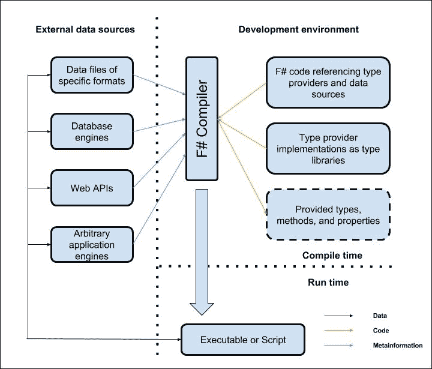
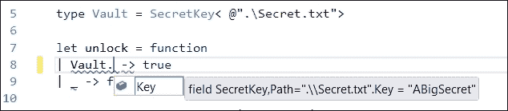
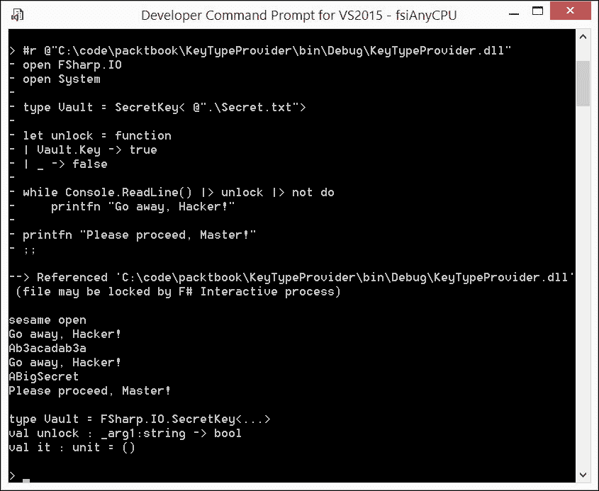
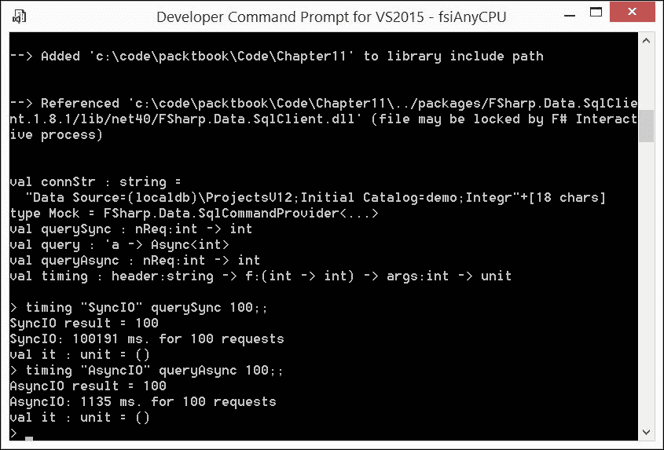
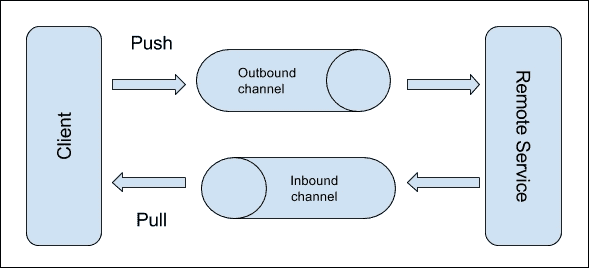
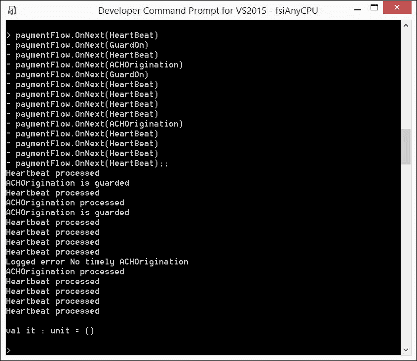
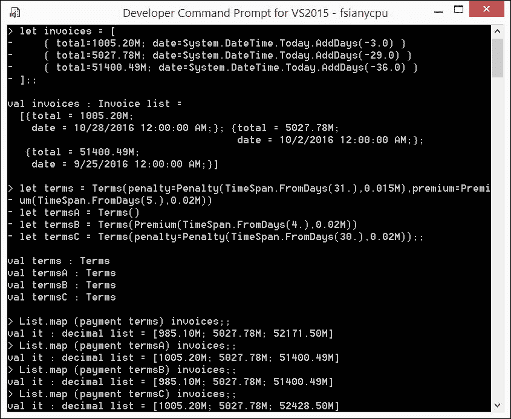

# 第十一章：F#专家技巧

到目前为止，本书主要介绍了构成成功 F#惯用用法核心的常规 F#功能。这些相关用法模式的共同特征是它们简单直接。对于任何中级 F#实践者来说，掌握它们是必不可少的。

在本章中，我将跳出常规空间，其中表达式总是产生结果，计算是顺序进行的，代码必须先编写才能被后续使用。我将向您介绍一些专家级别的 F#技巧，这是在非函数范式中被认为过于复杂且容易出错的令人兴奋的使用模式领域。

在本章中，我将从 F#惯用用法的角度介绍以下主题：

+   类型提供者

+   并发编程

+   响应式编程

+   元编程

我将通过提供简要概述和从企业实战中摘取的简洁用法示例来逐一介绍这些主题。我将尝试表明，这些功能并非真正令人费解，通常为开发者提供强大的安全网。然而，请不要期待对这些主题进行深入探讨。将本章内容视为成为熟练掌握这些 F#使用模式的路线图，作为刺激和实际应用提示。

# 关于自定义计算表达式的说明

我决定不在本书中涵盖任意的**F#计算表达式**([`docs.microsoft.com/en-us/dotnet/articles/fsharp/language-reference/computation-expressions`](https://docs.microsoft.com/en-us/dotnet/articles/fsharp/language-reference/computation-expressions) )，尽管 F#本身在诸如*序列表达式*（在第六章中介绍，*序列 - 数据处理模式的核心*）、*查询表达式*（在第九章中介绍，*更多数据处理*）和*异步表达式*（将在本章中讨论）等重要的语言特性之下内置了这种机制。尽管自定义计算表达式在某些情况下可以编写非常优雅的代码，但我感觉在这里介绍这个特性可能会让我们偏离我们追求的实用性道路。

### 注意事项

对于那些对 F#计算表达式有深入理解和掌握兴趣的人来说，可以参考 Scott Wlaschin 关于此主题的出色详细阅读材料：**“计算表达式”系列** ([`fsharpforfunandprofit.com/series/computation-expressions.html`](https://fsharpforfunandprofit.com/series/computation-expressions.html) )。

# 探索类型提供者

坦白说，我认为**类型提供者**是 F# 中最激动人心、最强大和最实用的特性之一。在我看来，应用类型提供者的能力是使用 F# 进行企业级软件开发的最强有力的论据之一。

## 功能回顾

F# 中的类型提供者代表了一种相当独特的**实用**模式，以强类型方式操作各种数据源。这种操作是通过从数据源特征派生出的类型、方法和属性来完成的，这些类型、方法和属性在编译时以完全自动化的方式构建。开发者不需要编写和/或维护这些自动提供的**数据操作**手段。

自动代码生成的想法本身和金字塔一样古老，但使其与众不同的因素是它的通用性、易用性和无痛苦的使用体验。那些曾经与**SqlMetal** ([`msdn.microsoft.com/en-us/library/bb386987(v=vs.110).aspx`](https://msdn.microsoft.com/en-us/library/bb386987(v=vs.110).aspx) ) 或 **WSDLTool** ([`msdn.microsoft.com/en-us/library/7h3ystb6(v=vs.100).aspx`](https://msdn.microsoft.com/en-us/library/7h3ystb6(v=vs.100).aspx) ) 作斗争的人会非常欣赏类型提供者的方式。

事实上，*创建*一个具有生产质量的实用类型提供者可能需要大量的技能和努力。然而，一旦创建，类型提供者组件就可以无限制地使用，因此使用的好处远远超过了构建的痛苦。

值得一提的是，自从 F# 3.0 中引入类型提供者以来，许多有价值的数据源种类已经被涵盖。自从在**《Twelve F# type providers in action》**（[`blogs.msdn.microsoft.com/dsyme/2013/01/30/twelve-f-type-providers-in-action/`](https://blogs.msdn.microsoft.com/dsyme/2013/01/30/twelve-f-type-providers-in-action/)）中提到的类型提供者构建的初期浪潮以来，可用的提供者已经变得更加成熟，提供了流畅且顺畅的使用体验。

言归正传；让我们首先看看 F# 类型提供者工作原理的大致情况。这将在以下图中展示：



F# 类型提供者的工作原理

不假装涵盖所有潜在的外部数据源，我在这里提到了以下几种：

+   在企业开发中经常使用的多种特定格式的文件（Excel、逗号分隔、JSON 等等）

+   数据库引擎（Microsoft SQL Server、Oracle、MySQL 等等）

+   实现不同协议和数据展示格式的各种 Web API

+   可以远程控制以实现所需处理并给出输入数据的各种应用程序引擎（Python、R、MatLab 等等）

魔法从编译时开始，当开发者引用在 F#应用程序中预期从给定数据源提供的代码类型时：对数据库的给定查询的结果，某些 Excel 文件的表格数据，某些数据的聚类结果；你叫它什么。F#编译器需要相应的类型提供者以库包的形式可用。在编译时从给定数据源获取所需的元数据，类型提供者与 F#编译器一起构建提供类型、方法和属性，允许你以强类型方式即时处理外部数据。

例如，**SQLClient 类型提供者**([`fsprojects.github.io/FSharp.Data.SqlClient`](http://fsprojects.github.io/FSharp.Data.SqlClient) )使用编译时连接字符串，在**编译期间**连接到给定的数据引擎实例，并使用 T-SQL 中给定查询的文本，利用某些系统存储过程来查找与即将返回的结果集的列相关联的类型。这种类型信息转化为与查询关联的即时构建的类型。因此，如果我们是在 Visual Studio 下编译，我们将获得与编译器提供的类型相关的 F#序列的结果集字段的 Intellisense。

如果在运行时对**其他**具有与编译查询中参与表类似的表架构的数据引擎执行相同的查询，提供的数据库访问类型仍然适用于数据转换。

重要的是要理解，数据库模式与提供的类型相关的查询之间的对应关系是在静态类型审查下保持的；如果这个方程式的任何一部分（无论是查询表达式还是涉及的架构）发生变化，代码将无法编译。

这既是缺陷也是祝福，因为它可以可靠地保护应用程序代码和数据层之间的潜在错误。然而，在编译时需要访问 SQL 数据引擎的必要性使得构建、持续集成等安排变得复杂。

个人而言，我是上述类型提供者的忠实粉丝，并发现一个有趣的现象，那就是人们往往没有意识到编译时和运行时之间的区别，实际上限制了可能性。

### 小贴士

一些开发者时不时地会问，是否可以在运行时更改与提供的类型相关的查询。显然，答案是绝对的**不**可以，因为这需要你更改已经生成的特定类型的代码。同时，在运行时更改连接字符串以访问数据要处理的目标数据引擎是完全可以（并且是预期的）。通常，后者可以通过提供具有运行时连接字符串作为参数的类型构造函数来实现。

我将在本章后面使用这个类型提供者进行演示，所以你将有机会检查你的理解。

## 演示问题

在选择类型提供者主题的示例问题时，我最初怀疑是否可行深入探讨类型提供者创建过程，或者这本书的格式是否限制我只能使用现有的类型提供者。我甚至征求了一群同事的意见，看看是否可以实施一个不超过 20 行 F# 代码的实用类型提供者。结果证明是肯定的，多亏了上述 SQLClient 类型提供者的作者之一，他指出了这个提供者带来的有趣问题：SQL 代码与 F# 代码之间的关系。

从关注点分离的角度来看，将属于应用程序的 T-SQL 查询作为字面量嵌入到 F# 代码中并不是一个完美的提议。理想情况下，最好将这些查询与 F# 代码分开，存放在一个单独的 SQL 脚本目录中，并为每个查询指定一个 `.sql` 文件。但如果我们需要在编译时将这些文件的內容作为字符串字面量表示在应用程序代码中，这种安排又如何可能呢？

哈哈！出路就是再使用另一个类型提供者！

一个内部“文件读取器”类型提供者可以在编译时将相应的 *提供* 类型与存储在该处的 SQL 查询文本关联起来，作为字面量字段与每个 SQL 查询文件相关联。这个字面量字段在文本中与字面量字符串常量没有区别。这种优雅的方法确实很棒！

考虑到这种在编译时和运行时考虑之间的清晰划分背后的明显教学价值，我决定提出类似的东西。

想象一下，我们想要用密钥来保护应用程序的执行，但又不想让密钥值出现在源代码的任何地方。相反，密钥可能被保存在某种类型的密钥库中，并在构建期间与应用程序相关联。这种保护的不足之处很明显，因为密钥值仍然会出现在编译后的应用程序程序集的某个地方。但这不是练习的重点。要求是：源代码中不应有任何密钥值。

## 演示解决方案

我们的解决方案是创建一个类型提供者，给定一个指向包含密钥的外部存储库的引用，它会提供一个具有从存储库中提取的 `string` 密钥值的类型，并将其作为字面量字段存储。这意味着这样的字段可以用作 `match...with` F# 表达式中的案例值，而不会以任何方式泄露底层值。此外，你还会对内部类型提供者的工作原理有一个牢固的理解，以及一个在不确定类型提供场景中发生什么活动时可以回忆的粘性模式。

我已经准备好开始实现。在 2016 年编写类型提供者比 2012 年首次向大众推出该功能时容易得多。感谢惊人的 F# 社区的开源努力，他们共同组装并打包了一个 SDK，以 NuGet 包的形式提供 F# 类型提供者的创建，即 **FSharp.TypeProviders.StarterPack** ([`www.nuget.org/packages/FSharp.TypeProviders.StarterPack`](https://www.nuget.org/packages/FSharp.TypeProviders.StarterPack)）。请耐心等待。只需执行以下步骤：

1.  创建一个新的 Visual Studio 项目以创建名为 **KeyTypeProvider** 的 F# 库。

1.  删除两个具有 `.fs` 和 `.fsx` 扩展名的生成文件。

1.  使用 **包管理控制台**，将类型提供者启动包 NuGet 包添加到刚刚创建的项目中，输入 `Install-Package FSharp.TypeProviders.StarterPack` 命令，并观察项目添加了一堆源代码文件（`ProvidedTypes.fsi`、`ProvidedTypes.fs` 和 `DebugProvidedTypes.fs`）。

1.  添加一个名为 `KeyTypeProvider.fs` 的新 F# 源代码文件，并将其放置在上一条项目符号中列出的注入文件列表的最后一个文件之下（记住，F# 源代码文件被引入编译器的顺序非常重要）。

就这样；我们准备好将类型提供者代码编织到后面的文件中。我将相应的代码片段放置如下（`KeyTypeProvider.fs`）：

```cs
namespace FSharp.IO.DesignTime 

#nowarn "0025" 

open System.Reflection 
open System.IO 
open Microsoft.FSharp.Core.CompilerServices 
open ProviderImplementation.ProvidedTypes 

[<TypeProvider>] 
type public KeyStringProvider(config : TypeProviderConfig) as this =  
    inherit TypeProviderForNamespaces() 

    let nameSpace = "FSharp.IO" 
    let assembly = Assembly.LoadFrom(config.RuntimeAssembly) 
    let providerType = ProvidedTypeDefinition(assembly, nameSpace,
        "SecretKey", baseType = None, HideObjectMethods = true) 

    do 
        providerType.DefineStaticParameters( 
            parameters = [ ProvidedStaticParameter("Path", 
                typeof<string>) ], 
            instantiationFunction = fun typeName [| :? string as path 
              |] -> 
                let t = ProvidedTypeDefinition(assembly, nameSpace,
                  typeName, baseType = Some typeof<obj>,
                  HideObjectMethods = true) 
                let fullPath = if Path.IsPathRooted(path) then path  
                  else Path.Combine(config.ResolutionFolder, path) 
                let content = File.ReadAllText(fullPath) 
                t.AddMember <| ProvidedLiteralField("Key",
                    typeof<string>, content)
                t
            ) 

        this.AddNamespace(nameSpace, [ providerType ]) 

[<assembly:TypeProviderAssembly()>] 
do() 

```

这不是 exactly 20 行代码，但相当接近。我将只概述前面代码片段中各个部分的目的。

### 注意

愿意对这类代码进行修改的各位可以参考 **教程：创建类型提供者** ([`docs.microsoft.com/en-us/dotnet/articles/fsharp/tutorials/type-providers/creating-a-type-provider`](https://docs.microsoft.com/en-us/dotnet/articles/fsharp/tutorials/type-providers/creating-a-type-provider)），作为辅助工具。

在引用相关库之后，我们的 `KeyStringProvider` 类型提供者类型（是的，类型提供者有自己的类型，当然）的定义紧随 `[<TypeProvider>]` 属性之后，并从 `TypeProviderForNamespaces` 类型继承，该类型定义在这些自动插入的代码文件中的其他地方。

下面的三行代码定义了提供类型的名和位置：`FSharp.IO.SecretKey` 和运行时程序集。

下面的`do`表达式的主体是实现的核心。它定义了提供的类型将有一个单一的`Path`静态参数，其类型为`string`，最重要的是，在实例化时，提供者将读取由`Path`引用的文件中的文本，并将摄入的字符串作为提供类型字面静态字段`Key`的值。是的，我同意本地文本文件不是最可靠的密钥库，但这个设计选择是为了简洁；密钥的保存方式与主题完全无关。这部分原则上可以用任何其他方式实现。

最后的`do()`表达式被`[<assembly:TypeProviderAssembly()>]`属性装饰，这只是类型提供者特定的.NET 程序集加载机具的标记。

我们完成了。构建我们的项目应该在目标`bin`目录中产生`KeyTypeProvider.dll`。我们的类型提供者已经准备好投入使用。

我为这个目的创建了一个简短的 F#脚本（`Ch11_2.fsx`）：

```cs
#r @"C:\code\packtbook\KeyTypeProvider\bin\Debug\KeyTypeProvider.dll" 
open FSharp.IO 
open System 

type Vault = SecretKey< @".\Secret.txt"> 

let unlock = function 
| Vault.Key -> true 
| _ -> false 

while Console.ReadLine() |> unlock |> not do 
    printfn "Go away, Hacker!" 

printfn "Please proceed, Master!" 

```

为了使这个脚本编译，你需要将`Secret.txt`文件（在`Vault`的类型声明中使用我们提供的类型`FSharp.IO.SecretKey`引用）放入项目目录中，与文件系统中的前面脚本并排。一旦我们这样做，Visual Studio 中的 Intellisense 就开始工作，这在下面的图中有所体现：



将本地文件内容打包为类型的静态字段字面值

注意，类型提供者在编译时通过 Intellisense 揭示了秘密的内容（`ABigSecret`字符串行）。尽管如此，秘密根本不存在于源代码中。此外，将秘密作为`Vault.Key`的`function`表达式的案例，并且没有来自 F#编译器的任何反对意见，这清楚地表明编译器完全接受它是一个真正的字面字符串！

现在，是时候看看所有这些在类型提供者开发环境之外的表现了，在一个单独的 FSI 会话中。结果如下面的截图所示，完全符合预期。每次当你对类型提供者模式的适用性和它应该帮助你整理问题的能力感到困惑时，就回想一下这个有趣的 F#类型提供者应用程序。



在 FSI 脚本中使用 SecretKey 类型提供者

总结来说，F# 类型提供者代表了一种相当独特的自动类型生成习惯用法，这可能会在生产力以及代码质量上带来显著的提升。

# 探索并发计算

在许多年学术兴趣增加之后，功能编程重新受到工业界的关注，这在很大程度上是由于电子技术的实现能力。一方面，当代计算机的能力使得三十年前被认为是纯科学的计算机科学发现，由于计算速度和容量的巨大增加，现在变得非常实用。另一方面，在硅层面上，科学已经达到了进一步加速单个处理器核心操作的物理极限。因此，实际的计算速度提升是通过将一定量的计算分配给一组紧密协作的处理器来实现的。

## 特性回顾

事实上，这个充满活力的新世界——廉价的多人核心处理器，无法承担昂贵、易出错、精神负担沉重的编程方法。它要求有比计算机科学在计算能力广泛增长时代开发的编程原语更高层次的并发驯服抽象。

这些原语在揭示并发计算背后的主要问题中发挥了作用——这种计算比我们习惯的顺序计算要少确定性得多。如果顺序计算中的非确定性通常与实现前者的环境物理环境的缺陷有关，那么并发计算中的非确定性是内在的。这意味着，在多个并发执行的计算之间进行同步的编程原语的易出错操作提供了许多自毁前程的方式。

自我强加的非确定性的最突出例子是**死锁**（[`en.wikipedia.org/wiki/Deadlock`](https://en.wikipedia.org/wiki/Deadlock)），当并发程序部分在共享资源上缺乏适当的同步时，在某些条件下可能会相互锁定。

更为复杂（并且可能更加危险）的情况是，并发代码可能在极其罕见的情况下出现异常行为。这可能是非常危险的，因为这种条件可能不会在质量保证和用户验收测试期间自行出现。然后，带有“炸弹”的缺陷代码基本上被发布到生产环境中，并且完全符合墨菲定律，在最不合适的时候发生爆炸。

功能编程对提高并发程序质量的承诺对行业来说如此宝贵，以至于许多主流编程语言都增加了附加的功能特性。

在我们深入了解 F#如何驯服并发非确定性之前，让我们看看在常见的并发伞下，需要认识到的独特方面：

+   **同步与异步**：前者在评估下一个表达式之前，不会开始评估前一个表达式。后者允许你在一些半评估的表达式之间切换。

+   **并发与并行**：并行假设使用多个处理单元同时评估多个表达式，而并发可能是一个处理单元对几个表达式的异步部分评估。

+   **交互式与响应式**：前者驱动外部环境，而后者响应外部环境的需求。

F#提供了一种使用**异步表达式/工作流**（[`docs.microsoft.com/en-us/dotnet/articles/fsharp/language-reference/asynchronous-workflows`](https://docs.microsoft.com/en-us/dotnet/articles/fsharp/language-reference/asynchronous-workflows)）的统一机制来驯服并发。简而言之，异步表达式，即前面提到的计算表达式的特定形式，是以这种形式编写的：

```cs
async { expression } 

```

它具有`Async<'T>`的泛型类型。反过来，`Async`类提供了一组函数，这些函数在几种情况下触发前面表达式的实际异步评估。

这确实是一个非常优雅且直接的机制。它允许你在熟悉的功能组合形式下隐藏评估将并发进行的这一事实。例如，考虑以下无害的代码片段：

```cs
[ for i in 91..100 -> async { return i * i }] // Async<int> list 
|> Async.Parallel // Async<int []> 
|> Async.RunSynchronously // int []  

```

它执行了一个相当复杂的函数组合，中间类型以行注释的形式呈现，其中第一行使用列表推导表达式产生一个`Async<int>`的`list`，然后借助`Async.Parallel`组合器扩展成`Async<int[]>`的并行计算，这些并行计算随后通过另一个`Async.RunSynchronously`组合器将它们异步计算的表达式合并到结果的`int[]`数组中，得到 10 个数字：

```cs
val it : int [] = 
  [|8281; 8464; 8649; 8836; 9025; 9216; 9409; 9604; 9801;
    10000|] 

```

我不会尝试向你证明前面的代码片段能够让你展示出通过计算并行化带来的性能提升。前面的评估如此简单，以至于并行代码片段实际上必须比仅仅顺序计算的类似代码要**慢**。

```cs
[for i in 91..100 -> i * i] 

```

这是因为与直接的顺序列表推导评估相比，并行 CPU 异步安排应该会引入额外的开销。

然而，当我们进入企业开发领域所珍视的领域时，一切都会改变，即开始处理并行 I/O。I/O 并行化带来的性能提升将是下一个演示问题的主题，该问题展示了由 F#异步计算所启用的设计模式。

## 演示问题

让我构建一个 I/O 密集型应用程序，这将允许演示当应用 F#并行 I/O 异步模式时，可以实现的真正惊人的加速。一个很好的用例是 SQL Server，它具有扩展能力，允许你在与 F#作者和博客作者通常提供的多个并发 Web 请求演示相比时，实现有说服力的改进。

作为异步并发工具，我将使用`FSharp.Data.SqlClient`类型提供者的`SqlCommandProvider`功能（[`github.com/fsprojects/FSharp.Data.SqlClient/blob/master/src/SqlClient/SqlCommandProvider.fs`](https://github.com/fsprojects/FSharp.Data.SqlClient/blob/master/src/SqlClient/SqlCommandProvider.fs)），它允许使用`AsyncExecute()`方法进行异步查询。

我将创建同步和异步的相同任务，从 SQL Server 提取数据，然后执行性能比较，以检测和测量 F#异步 I/O 使用模式应用所获得的好处。

## 演示解决方案

为了简洁起见，SQL 相关部分将非常简单。在 Visual Studio 2013 或任何其他可用的 Microsoft SQL Server 安装中，针对`(localdb)\ProjectsV12`数据库引擎实例执行以下 T-SQL 脚本，前提是它满足类型提供者的**系统要求**（[`fsprojects.github.io/FSharp.Data.SqlClient/`](http://fsprojects.github.io/FSharp.Data.SqlClient/)），将从零开始创建必要的数据库组件（`Ch11_1.sql`）：

```cs
CREATE DATABASE demo --(1) 
GO 

Use demo  
GO  

SET ANSI_NULLS ON 
GO 

SET QUOTED_IDENTIFIER ON 
GO 

CREATE PROCEDURE dbo.MockQuery --(2) 
AS 
BEGIN 
  SET NOCOUNT ON; 
  WAITFOR DELAY '00:00:01' 
  SELECT 1 
END 
GO 

```

在这里，标记为`(1)`的部分创建并准备使用`demo`数据库的实例，而标记为`(2)`的部分将`dbo.MockQuery`存储过程放入此数据库。这个没有输入参数的存储过程实现了一个非常简单的查询。具体来说，首先，它引入了 1 秒的时间延迟，模拟了一些数据搜索活动，然后返回一个包含整数`1`作为执行结果的单一数据行。

现在，我将转向注释演示解决方案的 F#脚本（`Ch11_1.fsx`）：

```cs
#I __SOURCE_DIRECTORY__ 
#r @"../packages/FSharp.Data.SqlClient.1.8.1/lib/net40/FSharp.Data.SqlClient.dll" 
open FSharp.Data 
open System.Diagnostics 

[<Literal>] 
let connStr = @"Data Source=(localdb)\ProjectsV12;Initial Catalog=demo;Integrated Security=True" 

type Mock = SqlCommandProvider<"exec MockQuery", connStr> 

let querySync nReq = 
    use cmd = new Mock() 
    seq { 
        for i in 1..nReq do 
            yield (cmd.Execute() |> Seq.head) 
        } |> Seq.sum 

let query _ = 
    use cmd = new Mock() 
    async { 
        let! resp = cmd.AsyncExecute() 
        return (resp |> Seq.head) 
    } 

let queryAsync nReq = 
    [| for i in 1..nReq -> i |] 
    |> Array.map query 
    |> Async.Parallel 
    |> Async.RunSynchronously 
    |> Array.sum 

let timing header f args = 
    let watch = Stopwatch.StartNew() 
    f args |> printfn "%s %s %d" header "result =" 
    let elapsed = watch.ElapsedMilliseconds 
    watch.Stop() 
    printfn "%s: %d %s %d %s" header elapsed "ms. for" args       "requests" 

```

### 提示

考虑到上述 F#代码直接使用将无法编译，因为排版引入了几行换行。相反，请使用书中附带的代码部分作为工作 F#代码的来源。

在加载类型提供者包并打开所需的库之后，带有`[<Literal>]`属性的`connStr`值表示了设计时和执行时的 SQL 服务器连接字符串。如果使用其他版本的数据库引擎，此行可能需要修改。

下一行通过引入由`SqlCommandProvider`提供的类型`Mock`，展示了类型提供者魔法，确保了对由存储过程调用`exec MockQuery`表示的包装查询结果的静态类型访问，该调用是通过我们的`connStr`连接字符串进行的。

以下`querySync`函数确保了由提供的`Mock`类型实例表示的`cmd`命令的顺序执行。给定`nReq`次数，它产生一系列查询结果（每个都是结果集的单行中的`1`），然后使用`Seq.sum`聚合这个序列。如果我们评估`querySync 10`表达式，我们可能期望得到一个略高于 10 秒的延迟，以返回一个单一的数字，`10`。

到目前为止，一切顺利。下面的`query`函数接受任何参数并返回一个类型为`Async<int>`的异步计算。我将这个函数放在`queryAsync`函数包裹的复合表达式中，有效地代表了`querySync`的并发变体。具体来说，`nReq`数字的数组被映射成相同大小的`Async<int>`数组，然后通过`Async.Parallel`全部展开，完成后通过`Async.RunSynchronously`重新连接，最终通过`Array.sum`聚合成一个单一的数字。

最后一个部分是一个高阶的**计时**函数，它只是测量并输出`f args`计算持续时间的毫秒数。

好吧；现在，是时候对我们的脚本进行测试了。我将代码放入 FSI 中，并测量`querySync`和`queryAsync`执行 100 次的时间。您可以在下面的屏幕截图中看到测量结果：



测量同步与异步 SQL 查询

你和我一样印象深刻吗？结果显示，在 SQL 查询的情况下，I/O 并行化允许性能提高大约 100 倍！

这个演示非常令人信服，我强烈建议您掌握并使用这个以及其他 F#惯用并发模式在实际工作中。

# 探索反应式计算

反应式计算是并发计算范围的一部分。它们只是强调了一个稍微不同的问题，即通用事件的处理。事件的处理可能是真正并发的，当同时发生的一个或多个事件被处理而没有任何形式的序列化，或者如果新事件在处理完前一个事件之前不被处理，则可能是真正顺序的。

## 功能审查

通常，类似于并发的**事件处理**视图在具有**用户界面**（**UI**）组件的系统开发中根深蒂固，当来自输入设备的数据处理缓慢或反映图形 UI 组件视觉状态的数据时，这种处理简单是不可接受的，因为它会创建一个糟糕的**用户体验**（**UX**）。

这一切都很不错，但让我们集中关注一个与 UI/UX 不直接相关的方面，即正在进行的**事件处理**的概念性考虑。由于这个考虑与 F#相关，我将限制审查的范围在.NET 边界内。

从历史上看，交互式操作系统（如 Windows）的发展提出了**回调**（[`en.wikipedia.org/wiki/Callback_(computer_programming)`](https://en.wikipedia.org/wiki/Callback_(computer_programming)））的概念，这考虑到了**事件**和**事件处理器**。这是反应式编程最低的概念层次，其中开发者的责任是为每个事件类提供处理器。

反应式计算的下一个抽象层次是面向对象编程，这体现在**观察者设计模式**（[`en.wikipedia.org/wiki/Observer_pattern`](https://en.wikipedia.org/wiki/Observer_pattern)）上。现在，开发者可以将特定的事件类型处理流程视为名为**Observable**的事件类型（换句话说，**主题**）源与零个或多个对处理此主题事件感兴趣的部分（名为**观察者**）之间的交互。观察者通过动态**注册**和**注销**到相应的 Observable 来表明对主题的兴趣。一旦出现属于主题的下一个事件，当时注册的相应观察者都会收到处理事件的提醒，然后继续等待下一个事件。

最后，反应式计算的概念精髓在计算机科学家**Erik Meijer**（[`en.wikipedia.org/wiki/Erik_Meijer_(computer_scientist)`](https://en.wikipedia.org/wiki/Erik_Meijer_(computer_scientist)））领导的团队的开创性工作中得到了体现，他创建了**.NET 的 Reactive Extensions (Rx)**（[`msdn.microsoft.com/en-us/library/hh242985(v=vs.103).aspx`](https://msdn.microsoft.com/en-us/library/hh242985(v=vs.103).aspx)）。

Rx 背后的关键思想是通过引入一个基本的`IObservable`接口来集中处理**推送**与**拉取**数据序列，这个接口与`IEnumerable`相反，因为它暴露了事件数据流。这与“正常”数据序列在被枚举后可以通过高阶函数进行拉取式组合，并使用 LINQ 进行查询类似——而可观察的事件序列（事件流）可以通过高阶函数进行接收式组合，并由 LINQ 进行处理。

F#支持上述所有三种抽象，并且与.NET 平台上的其他编程语言相比，还有一些改进。

### 注意

这个主题已经得到了很好的记录，我建议您参考有关`Microsoft.FSharp.Control`命名空间组件和`Reactive Extensions (Rx)`的 F#特定文档以获取详细信息：**事件模块**（[`msdn.microsoft.com/visualfsharpdocs/conceptual/control.event-module-%5bfsharp%5d`](https://msdn.microsoft.com/visualfsharpdocs/conceptual/control.event-module-%5bfsharp%5d)）。**可观察模块**（[`msdn.microsoft.com/visualfsharpdocs/conceptual/control.observable-module-%5bfsharp%5d`](https://msdn.microsoft.com/visualfsharpdocs/conceptual/control.observable-module-%5bfsharp%5d)）。**反应式扩展**（[`msdn.microsoft.com/en-us/data/gg577609.aspx`](https://msdn.microsoft.com/en-us/data/gg577609.aspx)）。

我不会重复前面的文档内容，而是将 F#反应式计算功能付诸实践，实现一个相关的实际任务。我会尽量使实现自包含。

## 演示问题

让我们考虑以下**集成模式**（[`www.enterpriseintegrationpatterns.com/patterns/messaging/`](http://www.enterpriseintegrationpatterns.com/patterns/messaging/)），这在企业中相当典型：通过两个点对点通道进行文档消息交换。我们是外部服务的客户端，该服务通过一对专用通道与我们通信。如果我们需要发送文档消息，我们只需将其推入出站通道，远程服务就会以某种方式消费它。如果服务向我们发送消息（s），它们会被投递到入站通道。当我们从入站通道拉取文档消息时，它就会从那里移除。以下图示说明了这种交互。



企业双向文档交换

那些参与企业 LOB 开发的人可能已经识别出典型的**电子数据交换（EDI）**（[`en.wikipedia.org/wiki/Electronic_data_interchange#Peer-to-Peer`](https://en.wikipedia.org/wiki/Electronic_data_interchange#Peer-to-Peer)）对等案例。通常，提供商在选择特定的传输协议时相当保守，并倾向于坚持“老而金”的技术，如**SSH 文件传输协议（SFTP）**（[`en.wikipedia.org/wiki/SSH_File_Transfer_Protocol`](https://en.wikipedia.org/wiki/SSH_File_Transfer_Protocol)），这是一种合理低成本的集成方式，当数据安全是要求时。由于企业可能需要与多个远程服务提供商进行 EDI，这种安排的数量可能相当可观。

然而，我并不打算专注于构建一个可配置的库，该库允许通过几行代码添加新的 EDI 提供商。相反，我将解决语义层，这通常位于架构考虑之外，即可能需要在双向文档消息交换中强制执行的关系，对于 SFTP 传输，这转化为将格式化文件推送到或从服务提供商那里拉取。

为了更具体一些，我提供给您一个来自 **Jet.com** ([`jet.com/`](https://jet.com/) ) 财务领域的真实案例，我在那里目前以编写 F# 代码为生。让我们考虑支付系统作为客户端，银行作为服务提供商。服务的大致内容是执行付款建议并将汇款交付给 Jet.com 与其建立临时“我欠你”关系的法律实体和自然人账户：供应商和批发商、市场商人、有未报销业务费用的员工等等。

现在，让我们假设我们已经围绕 SFTP 构建了我们的通信代码，将付款推送到银行，获取回执、原始凭证等，所有重试都到位，所有轮子都在平稳运转。我们做得好吗？

结果表明答案实际上是“并不真的”。在这个时候，我们默默地假设银行的实现没有问题，基于一系列谬误，例如“这是关于金融的”，“如果银行有错误，它将无法生存”，“它太大，不允许失败”等等。然而，银行的软件只是软件，容易受到各种人为错误的影响。我们可能期望它的可靠性总体上高于一个随机初创公司最小可行产品代码，该代码构成一个实现热门商业想法的 Web 应用程序，在几次黑客马拉松期间在车库中编写。另一方面，每个银行的软件发布都包含下一个“最后一个错误”，不是吗？

有一次，Jet 的银行客户端软件没有考虑到以下场景：如果银行正确接受并执行每笔付款建议，但偶尔不向我们传达延迟的最终付款状态，会发生什么？付款接收者都对汇款现金进入他们的账户以及没有通信错误感到满意。如果我们假设我们的交付付款建议的成功结果，这个错误可能永远存在！这是一个低概率场景，但并非绝对不可能。事实上，在 Jet 的支付安排中，一个类似的缺陷在一段时间内未被注意到，直到市场报告开始显示延迟付款的数量不断增加。这真是尴尬！

我们能否通过主动处理我们的“拉”数据传输部分来解决这个问题？继续阅读以了解潜在解决方案的概述。

## 演示解决方案

一种（过于简化的）潜在解决方案是将“心跳”事件流与受保护的事件流混合。由于将单个特定类型的事件的保护泛化到任何类似类型的事件并不具有挑战性，让我考虑一个单一的保护事件类型以简化问题。

在这个受保护事件流混合中，我们设定了一个阈值，即在保护事件开始和实际发生受保护事件之间，认为多少次心跳是健康的。例如（具体的数字并不一定与实际情况相符），我们可以说如果 ACH 付款正在发送，并且随后有三个心跳事件后，`ACHOrigination` 事件仍未收到，这应该是问题的迹象，并且必须通知相关责任人员。

现在，让我使用反应式扩展（`Ch11_3.fsx`）实现前面的内容：

```cs
#I __SOURCE_DIRECTORY__ 
#r "../packages/FSharp.Control.Reactive.3.4.1/lib/net45/FSharp.Control.Reactive.dll" 
#r "../packages/Rx-Core.2.2.5/lib/net45/System.Reactive.Core.dll" 
#r "../packages/Rx-Interfaces.2.2.5/lib/net45/System.Reactive.Interfaces.dll" 
#r "../packages/Rx-Linq.2.2.5/lib/net45/System.Reactive.Linq.dll" 

open System.Reactive.Subjects 

type PaymentFlowEvent = 
| HeartBeat 
| ACHOrigination 
| GuardOn 

type GuardACHOrigination(flow: Subject<PaymentFlowEvent>, alerter: Subject<string>) = 
    let threshold = 3 
    let mutable beats = 0 
    let mutable guardOn = false 

    member x.Guard() = 
        beats <- 0 
        guardOn <- false 
        flow.Subscribe(function 
            | HeartBeat -> if guardOn then beats <- beats + 1; 
                printfn "Heartbeat processed"; 
                if beats > threshold && guardOn
                    then alerter.OnNext "No timely ACHOrigination" 
            | ACHOrigination -> beats <- 0; 
                guardOn <- false 
                printfn "ACHOrigination processed" 
            | GuardOn -> beats <- 0; guardOn <- true;
                printfn "ACHOrigination is guarded") 

let paymentFlow = new Subject<PaymentFlowEvent>() 
let alerter = new Subject<string>() 
let notifier = alerter.Subscribe(fun x -> printfn "Logged error %s" x) 

ignore <| GuardACHOrigination(paymentFlow,alerter).Guard() 

```

在从相应的 NuGet 库加载一系列所需组件后，我引入了反映先前提到的三种事件混合的 `PaymentFlowEvent` 类型。

接下来，`GuardACHOrigination` 类结合了由参数 `flow` 设置的 `PaymentFlowEvent` 事件流，该参数也称为 `Subject`，`alerter` 用于执行通知，以及将这些部分组合在一起的业务逻辑。**Subject** ([`msdn.microsoft.com/en-us/library/hh242970(v=vs.103).aspx`](https://msdn.microsoft.com/en-us/library/hh242970(v=vs.103).aspx) ) 是可观察序列和观察者的组合，在先前的实现中扮演着核心角色。

`Guard()` 方法接受 `flow`，并借助其 `Subscribe` 方法，在流通过事件类型 `PaymentFlowEvents` 的每个实例到达时设置简单的状态机跟踪正在发生的事情。鉴于异常已被识别，诊断通知被推入 `alerter`。

现在，我创建了所需的各个部分：`paymentFlow` 代表感兴趣的的事件流，`alerter` 用于在 `Guard()` 中接收通知，`notifier` 用于对 `alerter` 的通知事件采取行动，最后，使用 `GuardACHOrigination(paymentFlow,alerter).Guard()` 启动一切。

很好；现在是我们将事件流推入构建好的安排中，并观察 FSI 中的反应性行为的时候了。下面的截图反映了代码行为完全符合预期：及时的保护事件顺利通过，过期的保护事件触发警报，未受保护的事件被忽略：



使用 F# 反应式代码保护事件流

在反应式方式中应用 F# 的演示模式是企业从业者应该掌握的重要工具技能。

# 探索引言和元编程

我想要在 F# 使用的先进模式中涵盖的最后一个功能是**代码引用** ([`docs.microsoft.com/en-us/dotnet/articles/fsharp/language-reference/code-quotations`](https://docs.microsoft.com/en-us/dotnet/articles/fsharp/language-reference/code-quotations) )。这个特性非常令人费解，它允许你像处理数据一样处理程序代码，并在需要时以及以需要的方式评估这些“程序作为数据”的部分。

## 功能回顾

从更操作的角度来看这个特性，一个程序片段可能被表示为一个表达式树，它代表代码但不从这个表示中生成代码。这允许在表达式树被评估时具有任意执行行为。它可以被评估为 F# 代码，或作为生成 JavaScript 代码的源，甚至作为 GPU 执行的代码，或以任何其他可行的方式。

引用表达式的酷之处在于它们是类型化的，可以从部分拼接在一起，或者使用主动模式分解成部分，以及其他特性。不深入细节，我想展示的是，如果需要，F# 通过允许你以编程方式调整程序代码并评估调整后的代码，提供了这一额外的灵活性层。为此，我将使用**F# 引用评估器** ([`fsprojects.github.io/FSharp.Quotations.Evaluator/index.html`](http://fsprojects.github.io/FSharp.Quotations.Evaluator/index.html) )。

该特性的能力非常简短地演示如下 (`Ch11_4.fsx` )：

+   获取所需的库支持：

    ```cs
            #I __SOURCE_DIRECTORY__ 
            #r 
             "../packages/FSharp.Quotations.Evaluator.1.0.7/lib
             /net40/FSharp.Quotations.Evaluator.dll" 
            open FSharp.Quotations.Evaluator 

    ```

+   创建一个可变的引用 `divider` 值：

    ```cs
            let mutable divider = Quotations.Expr.Value (5) 

    ```

+   创建并编译一个将 `divider` 拼接到其中的函数：

    ```cs
            let is5Divisor = <@ fun x -> x % %%divider = 0 @> 
               |> QuotationEvaluator.Evaluate 

    ```

+   将编译的 `is5Divisor` 函数应用于几个参数：

    ```cs
            is5Divisor 14 // false 
            is5Divisor 15 // true 

    ```

+   更改拼接的 `divider` 值：

    ```cs
            divider <- Quotations.Expr.Value (7) 

    ```

+   注意，`is5Divisor` 的工作方式没有改变：

    ```cs
            is5Divisor 14 // false 

    ```

+   将拼接的 `divider` 值重新编译到另一个函数中：

    ```cs
            let is7Divisor = <@ fun x -> x % %%divider = 0 @> 
               |> QuotationEvaluator.Evaluate 

    ```

+   应用新编译的 `is7divisor` 函数：

    ```cs
            is7Divisor 14 // true 

    ```

在对引用的工作原理有了些了解之后，现在让我将这个特性应用到一个大型的演示问题中。

## 演示问题

在寻找演示问题时，我再次转向金融领域。让我们看看基于支付及时性的发票总额调整问题。提前支付未结发票可能会节省一些费用，而延迟支付可能会产生罚款。当供应商或供应商设定支付条款时，可以设置任何组合的溢价和/或罚款：既无溢价也无罚款，只有溢价，只有罚款，以及溢价和罚款都有。有一个安排可以让你轻松自然地处理这种多样性会很好。换句话说，寻求一个调整——为此，当应用于发票总额和支付日期时，找出与支付条款一致的实际支付金额。

## 演示解决方案

这里是实现所寻求的调整对象的脚本 (`Ch11_4.fsx` )：

```cs
#I __SOURCE_DIRECTORY__ 
#r "../packages/FSharp Quotations.Evaluator.1.0.7/lib/net40/FSharp.Quotations.Evaluator.dll" 
open FSharp.Quotations.Evaluator 
open System.Collections.Generic 
open System 

type Adjustment = 
| Absent 
| Premium of TimeSpan * decimal 
| Penalty of TimeSpan * decimal 

type Terms(?premium: Adjustment, ?penalty: Adjustment) = 
    let penalty = defaultArg penalty Absent 
    let premium = defaultArg premium Absent 

    member x.Adjust() = 
        match premium,penalty with 
        | Absent,Absent -> None 
        | Absent,Penalty (d,m) -> Some(<@ fun ((date:DateTime),amount) -> if DateTime.UtcNow.Date - date.Date > d then Decimal.Round(amount * (1M + m),2) else amount @> |> QuotationEvaluator.Evaluate) 
        | Premium(d,m),Absent -> Some(<@ fun ((date:DateTime),amount) -> if DateTime.UtcNow.Date - date.Date < d then Decimal.Round(amount * (1M - m),2) else amount @> |> QuotationEvaluator.Evaluate) 
        | Premium(d',m'),Penalty (d,m) -> Some(<@ fun ((date:DateTime),amount) -> 
            if DateTime.UtcNow.Date - date.Date > d then Decimal.Round(amount * (1M + m),2) 
            elif DateTime.UtcNow.Date - date.Date < d' then Decimal.Round(amount * (1M - m'),2) 
            else amount @> |> QuotationEvaluator.Evaluate) 
        | _,_ -> None 

```

首先要注意的是，必要的库已被加载。

然后定义`Adjustment`类型，它可以是`Absent`或`Premium`/`Penalty`，其结构为`System.TimeSpan*decimal`元组，其中`TimeSpan`部分定义了发票开具日期和付款日期之间的时间量，而`decimal`设置了调整乘数。对于`Premium`，元组被解释为“如果发票开具日期和付款日期之间的天数小于或等于`TimeSpan`，则应付款项应减少`decimal`乘数”。对于`Penalty`，它是“如果发票开具日期和付款日期之间的天数大于或等于`TimeSpan`，则应付款项应增加`decimal`乘数”。

`Terms` 类型捕获了`Adjust`方法中的调整项。使用 F#引言，它为每个可能的项组合定义了支付调整函数，然后它要么实现规定的调整，要么不实现。

现在，为了看到它是如何工作的，我们需要一个测试平台。让我们定义一个表示发票的记录：

```cs
type Invoice = { total:decimal ; date:System.DateTime; } 

```

让我们也定义一个测试发票列表：

```cs
let invoices = [ 
    { total=1005.20M; date=System.DateTime.Today.AddDays(-3.0) } 
    { total=5027.78M; date=System.DateTime.Today.AddDays(-29.0) } 
    { total=51400.49M; date=System.DateTime.Today.AddDays(-36.0) } 
] 

```

现在确定应付款项金额的函数现在基于条款，发票可能看起来如下：

```cs
let payment (terms: Terms) invoice = let adjust = terms.Adjust() in if adjust.IsSome then (adjust.Value) (invoice.date, invoice.total) else invoice.total 

```

现在，是时候定义可能的条款的完整种类了：

```cs
let terms = Terms(penalty=Penalty(TimeSpan.FromDays(31.),0.015M),
  premium=Premium(TimeSpan.FromDays(5.),0.02M)) 
let termsA = Terms() 
let termsB = Terms(Premium(TimeSpan.FromDays(4.),0.02M)) 
let termsC = Terms(penalty=Penalty(TimeSpan.FromDays(30.),0.02M)) 

```

最后，我们可以在以下屏幕截图中观察到，在将每个支付条款应用于相同的发票组后，所有这些是如何结合在一起的：



使用 F#引言

# 摘要

在本章中，我们测试了高级 F#使用类别的一些特性。我希望我能够证明，即使是对于高级特性，F#仍然保持着“用简单的代码解决复杂问题”的承诺。

现在是进一步关注构成本书标题的主题的好时机。到目前为止的内容并没有以任何方式跨越与**四人帮书籍**（[`en.wikipedia.org/wiki/Design_Patterns`](https://en.wikipedia.org/wiki/Design_Patterns)）内容通常相关联的传统设计模式视图。在下一章中，我将通过观察“经典”设计模式和原则的功能优先视角来证明所采取的方法。
