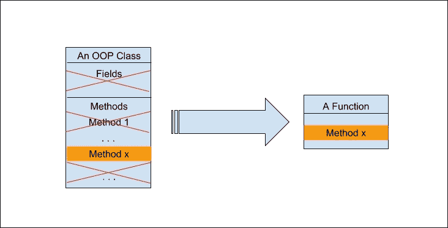
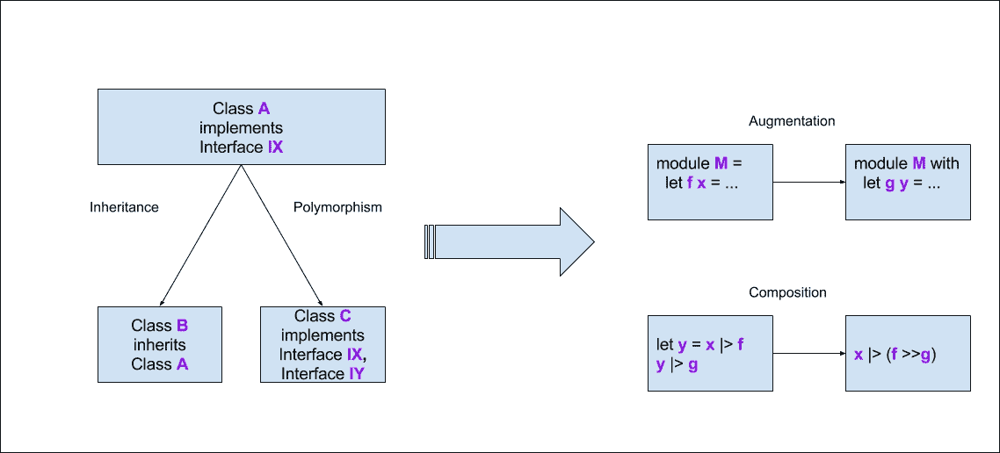
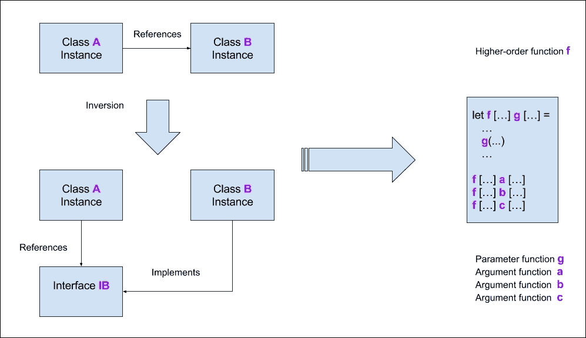
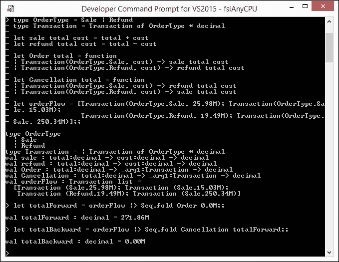
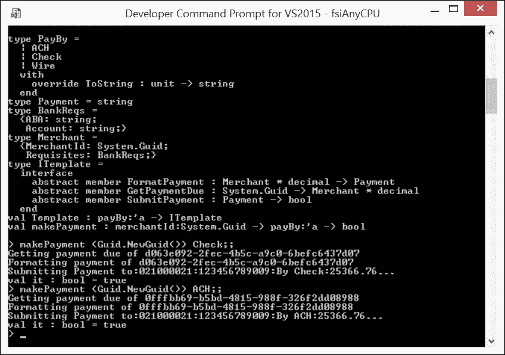
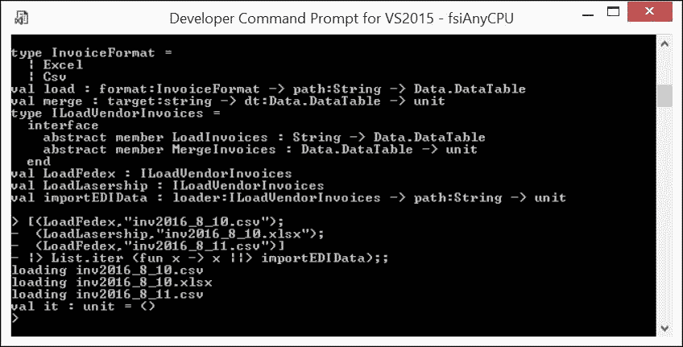

# 第十二章。F#和面向对象原则/设计模式

前几章旨在发展和磨练你对函数式编程使用模式的品味，偶尔会关注与面向对象安排的比较。这一章是为那些有面向对象背景并且可能焦急地期待着这本书开始细致地将**23 个原始的四人帮面向对象设计模式** ([`en.wikipedia.org/wiki/Design_Patterns`](https://en.wikipedia.org/wiki/Design_Patterns))）逐个移植到 F#的人准备的。

我可能让你失望，因为到目前为止所涵盖的所有主题都表明，坚持书中提倡的 F#的函数优先特性可能会使一些模式变得无关紧要、固有或普遍。换句话说，原始模式可能演变成与面向对象世界中的角色相比不那么根本的东西。

类似的转变也适用于面向对象的原则，统称为**SOLID** ([`en.wikipedia.org/wiki/SOLID_(object-oriented_design)`](https://en.wikipedia.org/wiki/SOLID_(object-oriented_design)))）。也就是说，从函数式编程的角度来看，这些原则可能变得要么是默认的、无关紧要的，或者只是受到尊重，而不需要开发者付出太多的额外努力。

本章的目标是简要展示前述段落中概述的演变案例。在本章中，我们将探讨以下主题：

+   如何在以函数优先的范式内将面向对象（OOP）的 SOLID 原则进行演变，以及这五个支柱中每一个具体发生了什么变化

+   一些具体的设计模式（命令、模板、策略）如何减少其作用，或者仅仅等同于函数优先范式的一些片段

我不会尝试进行详尽无遗的综述。最终，这本书旨在发展函数优先范式的技能和技术，而不是 F#支持的任何其他范式。

# SOLID 原则的演变

让我们考虑函数式编程范式如何演变这个以粗体字母**SOLID**命名的面向对象设计的基本原则。

## 单一职责原则

**单一职责原则** ([`en.wikipedia.org/wiki/Single_responsibility_principle`](https://en.wikipedia.org/wiki/Single_responsibility_principle))（**SRP**），代表**SOLID**中的字母"S"，在面向对象术语中是：

> *"一个类不应该有超过一个改变的理由"*

换句话说，如果一个类的实现需要响应两个或更多独立的功能性修改，这将是其设计中违反**单一职责原则**（**SRP**）的证据。在面向对象世界中遵循这一原则意味着设计由许多精简的类组成，而不是较少但更庞大的类。

如果我们将函数视为一个没有封装数据且只有一个方法的类退化情况，那么这不过是单一职责原则（SRP）的精髓。以下图展示了这一转换：



在函数式编程中尊重单一职责原则

当我们用惯用的 F#进行编程时，我们将单一目的的函数组合在一起。换句话说，SRP 在 F#中自然得到提升和强制执行。

## 开放/封闭原则

**开放/封闭原则** ([`en.wikipedia.org/wiki/Open/closed_principle`](https://en.wikipedia.org/wiki/Open/closed_principle) ) ( **OCP** )，代表**SOLID**中的字母"O"，指出：

> *"软件实体（类、模块、函数等）应当对扩展开放，但对修改封闭"*

在纯面向对象领域，这种属性是通过**继承**赋予的，无论是直接的**实现继承**（即用子类替换超类）还是**多态实现**（即给定接口的另一种实现，它对自己封闭于修改，但开放于额外实现其他接口）。这两种形式的 OCP 在 F#的面向对象方面几乎是清晰、亲切的；然而，它们在 F#中并不构成习惯。F#中函数式首选的扩展机制是类型增强和组合。以下图作为备忘单，因为我们已在书中对这些扩展方法投入了大量关注：



在函数式编程中尊重开放/封闭原则

上图以非常引人入胜的方式展示了在函数式首选习惯中，扩展机制是如何简单、简洁且切中要害的。

## Liskov 替换原则

**SOLID**中的字母"L"来自**Liskov 替换原则** ([`en.wikipedia.org/wiki/Liskov_substitution_principle`](https://en.wikipedia.org/wiki/Liskov_substitution_principle) ) ( **LSP** )，该原则指出：

> *"程序中的对象应当可以用其子类型实例替换，而不会改变该程序的正确性"*

如此表述的**LSP**纯粹关注于面向对象继承，这似乎与惯用的 F#无关。然而，我至少要提到以下三个严格遵循此原则的 F#函数式首选习惯：

+   **引用透明性**：如果一个函数是纯函数并且给定一个类型`T`的参数产生一个确定的结果，那么给定一个类型`S`的相应实例作为参数，其中`S`是`T`的子类型，它必须确实产生相同的结果

+   **F# 函数参数类型替换**：基于前面讨论的要点，如果我们有一个从类型 `'T` 继承的类型 `'S`，那么 `'S` 的一个实例可以用作 `'T` 对应实例的替代；因此，对于以下函数 `f`：`'T -> 'R`，表达式 `f('S())` *不需要任何强制转换*，如下代码片段所示 (`Ch12_1.fsx` )：

```cs
        type T = interface end // base 
        type S() = interface T // an implementation 
        let f (x: T) = () // a function upon base 
        f(S()) // application does not require coercion! 

```

+   **不可变性**：如果我们构建了一个有效的不可变实例 `'S`，则不能通过将其用作 `'T` 实例的替代来利用其不可变性而使其无效

## 接口隔离原则

在 **SOLID** 原则中代表字母 "I" 的 **接口隔离原则** ([`en.wikipedia.org/wiki/Interface_segregation_principle`](https://en.wikipedia.org/wiki/Interface_segregation_principle) ) ( **ISP** ) 声称：

> *"许多特定于客户端的接口比一个通用接口更好"*

换句话说，一个客户端与之关联的接口不应引入客户端未使用的依赖。**ISP** 只是 SRP 在接口上的应用。惯用的 F# 通过无状态和自然隔离的函数（代表包含恰好一个方法的接口）完全支持 ISP。

## 依赖倒置原则

**SOLID** 原则中的字母 " **D** " 代表 **依赖倒置原则** ([`en.wikipedia.org/wiki/Dependency_inversion_principle`](https://en.wikipedia.org/wiki/Dependency_inversion_principle) ) ( **DIP** )，该原则指出：

> *"依赖抽象，不要依赖具体实现"*

下图展示了在面向对象编程（OOP）中如何实现 **DIP**：如果类 `A` 的一个实例引用了类 `B` 的一个实例，这违反了 DIP 的直接依赖。这个问题可以通过使类 `A` 依赖于接口 `IB` 来解决。到目前为止，一切顺利，但必须有人实现 `IB`，对吧？让它成为类 `B` 的一个实例，现在它是 `IB` 的一个依赖，因此发生了依赖反转。

很容易注意到，在惯用的 F# 中，依赖倒置的作用就像一个普通的更高阶函数：例如，函数 `f` 有一个参数函数 `g`，它在定义 `f` 时被使用。当调用 `f` 时，任何符合 `g` 签名的参数函数 `a`、`b` 或 `c` 都可以扮演 `g` 的角色：



在函数式编程中遵循依赖倒置原则

# 减少模式

类似于 **SOLID** 原则，在惯用的以函数式编程为第一语言的 F# 上下文中，许多面向对象的设计模式要么减少（有时减少到消失），要么显著变形。让我们快速看一下这种转换的一些实例。我将使用我从代码库中提取的样本，这些样本用于实现 Jet.com 的支付应用程序。样本被简化以符合书籍格式。

## 命令设计模式

**命令设计模式** ([`zh.wikipedia.org/wiki/命令模式`](https://zh.wikipedia.org/wiki/命令模式) ) 在面向对象编程中代表了一种行为设计模式，其中所有在稍后执行动作所需的信息都被封装在一个对象中。但是等等；这难道不是与函数的定义完全一致吗？没错；几乎任何使用高阶函数遍历数据结构并对其每个元素应用低阶函数的 F# 习惯用法都可以被视为命令模式的实例。映射、折叠，无论你叫它什么——所有这些都属于这个类别。按照命令模式的规定行事是函数式优先的 F# 中的一个普遍习语。

让我们考虑一个例子：一个参与电子商务市场的商家的订单流程由一系列交易组成，每个交易代表**销售**或**退款**。通过取订单流程的任何连续元素序列，可以找到其运行余额。现在，使事情更有趣的因素是，一些订单在引入后的一段时间内可能被取消，从而被取消。我们负责为市场财务部门跟踪运行总账。

F# 的函数式优先特性允许我们有一个非常干净、习惯用法式的解决方案。我开始于两个核心领域对象，代表订单类型和客户交易，结合订单类型及其商品成本（`Ch12_2.fsx`）：

```cs
type OrderType = Sale | Refund 
type Transaction = Transaction of OrderType * decimal 

```

我继续使用两个核心函数，根据订单类型计算总数：

```cs
let sale total cost = total + cost 
let refund total cost = total - cost 

```

配备了这些知识，现在是时候在模式的意义上定义我们的**命令**了。`Order`和`Cancellation`都将接受一个运行总账和一笔交易，并返回一个相应调整后的新运行总账（注意，`Cancellation`在总账方面与`Order`相对应）：

```cs
let Order total = function 
| Transaction(OrderType.Sale, cost) -> sale total cost 
| Transaction(OrderType.Refund, cost) -> refund total cost 
let Cancellation total = function 
| Transaction(OrderType.Sale, cost) -> refund total cost 
| Transaction(OrderType.Refund, cost) -> sale total cost 

```

我完成了！让我通过在 FSI 中应用一个示例订单流程来演示构建的代码的实际效果。结果在下面的屏幕截图中展示，其中一系列`orderFlow`交易通过订单产生`totalForward`为 271.86 美元，然后通过取消操作，最终产生预期的运行总账`totalBackward`为 0.00 美元：



命令模式作为习惯用法 F# 折叠

## 模板设计模式

**模板设计模式** ([`zh.wikipedia.org/wiki/模板方法模式`](https://zh.wikipedia.org/wiki/模板方法模式) ) 在面向对象编程中定义了一个算法或程序的共同骨架，其中组件可以被重写，但总体结构保持不变。再次强调，通过将函数作为一等对象来实现这一效果是微不足道的。例如，传递函数作为参数将工作得很好，因此这个模式就变得无关紧要了。

惯用 F# 的方法甚至比这更丰富，它允许函数连贯地参与接口，并以对象表达式的形式提供任何具体的实现。

让我们转向从 Jet.com 支付应用程序的企业代码库中提取的相应代码示例。在 Jet.com 市场中参与支付的合作伙伴的支付过程包括三个连续的步骤：

1.  根据商户 ID 获取支付需求和应付金额。

1.  格式化特定支付方式的支付。

1.  向银行提交支付建议以执行。

模板将前面的部分保持在一起，允许你同时更改每个部分以适应情况。正如前一个示例所示，我首先定义了一些核心领域实体 (`Ch12_3.fsx` ):

```cs
open System 
type PayBy = ACH | Check | Wire 
             override x.ToString() = 
                match x with 
                | ACH -> "By ACH" 
                | Check -> "By Check" 
                | Wire -> "By Wire" 
type Payment = string 
type BankReqs = { ABA: string; Account: string} 
type Merchant = { MerchantId: Guid; Requisites: BankReqs } 

```

在这里，`PayBy` 代表一种特定的支付工具（支票/`ACH`/电汇），格式化的 `Payment` 只是一个类型缩写，`BankReqs` 代表商户的银行要求，以便账户接受存入的支付，而 `Merchant` 将商户 ID 和银行要求连接起来。

现在我定义了一个模板作为接口，它反映了支付流程的部分连贯性 (`Ch12_3.fsx` ):

```cs
type ITemplate = 
    abstract GetPaymentDue: Guid -> Merchant*decimal 
    abstract FormatPayment: Merchant*decimal -> Payment 
    abstract SubmitPayment: Payment ->bool 

```

这部分相当直接；`GetPaymentDue` 从相关持久存储中检索给定商户的要求和应付金额，`FormatPayment` 执行所需的支付建议格式化，而 `SubmitPayment` 负责将建议交付给 Jet 的银行。请注意，我故意没有在这里指定支付格式，因为这个细节可能需要延迟到实现阶段。

然后，在这里，我为 `ITemplate` 提供了一个具体的（模拟）实现。尽管如此，你可以看到这种安排提供了很大的灵活性；特别是，我将特定的支付工具作为实现的一个参数 (`Ch12_3.fsx` ):

```cs
let Template  payBy = 
    { new ITemplate with 
        member __.GetPaymentDuemerchantId = 
          printfn "Getting payment due of %s" 
          (merchantId.ToString()) 
        (* mock access to ERP getting Accounts payable due for
            merchantId *) 
        ({ MerchantId = merchantId; 
          Requisites = {ABA="021000021"; 
          Account="123456789009"} }, 25366.76M) 
        member __.FormatPayment (m,t)  = 
          printfn "Formatting payment of %s" 
          (m.MerchantId.ToString()) 
        sprintf "%s:%s:%s:%s:%.2f" "Payment to" m.Requisites.ABA 
          m.Requisites.Account (payBy.ToString()) t 
        member __.SubmitPayment p = 
          printfn "Submitting %s..." p 
          true 
     } 

```

最后，我使用模板将所有内容封装到函数中 (`Ch12_3.fsx` ):

```cs
let makePaymentmerchantIdpayBy  = 
    let template = Template payBy in 
template.GetPaymentDuemerchantId 
    |>template.FormatPayment 
    |>template.SubmitPayment 

```

如往常一样，为了看到这段代码的实际效果，我转向 FSI，展示了以下截图中的模拟支付结果。出于使图示适应单页书的考虑，我省略了完整的脚本源代码：



模板模式在 F# 中的惯用表达消失

## 策略模式

**策略模式** ([`en.wikipedia.org/wiki/Strategy_pattern`](https://en.wikipedia.org/wiki/Strategy_pattern) ) 简单来说，就是通过实现一系列算法并在运行时相互替换来调整算法的行为。再次强调，还有什么比将函数作为一等公民的功能优先设置更适合这个目的呢？

为了说明策略模式的使用，我将使用来自 Jet.com 支付系统的一个另一个用例。在其运输操作中，Jet.com 使用多个承运人，由于运输量巨大，它通过电子方式处理承运人发票。这种处理的核心是将每个承运人的发票加载到一个临时数据表中，然后以**upsert**（[`en.wikipedia.org/wiki/Merge_(SQL)`](https://en.wikipedia.org/wiki/Merge_(SQL)））的方式合并这个数据表的内容。

我通过首先概述核心行为的实现来实施这个**EDI**（[`en.wikipedia.org/wiki/Electronic_data_interchange`](https://en.wikipedia.org/wiki/Electronic_data_interchange)）接口的实现（`Ch12_4.fsx`）：

```cs
open System 
open System.Data 
type InvoiceFormat = 
| Excel 
| Csv 
let load (format: InvoiceFormat) (path: String) = 
    let dt = new DataTable() in 
    (* IMPLEMENTATION GOES HERE *) 
dt 
let merge (target: string) (dt: DataTable) = 
    (* IMPLEMENTATION GOES HERE *) 
    () 

```

前面的代码片段表明，支持的发票格式是`Excel`或`CSV`，并且有两个通用函数可用于将发票加载到数据表中，这些发票以任何可接受的格式交付到某个位置，并将填充的数据表与相应持久存储的现有内容合并。

到目前为止，一切顺利；这两个函数可能通过一个接口来访问，该接口的实现将针对每个支持的承运人具体化（`Ch12_4.fsx`）：

```cs
type ILoadVendorInvoices = 
    abstract LoadInvoices: String ->DataTable 
    abstract member MergeInvoices: DataTable -> unit 

```

现在，我为 Jet.com 用于订单运输的两个承运人——联邦快递（FedEX）和 LaserShip——提供了前面接口的具体实现（`Ch12_4.fsx`）：

```cs
let LoadFedex = 
    { new ILoadVendorInvoices with 
        member __.LoadInvoices path = load Csv path 
        member __.MergeInvoicesdataTable = 
            merge "Fedex" dataTable 
    } 
let LoadLasership = 
    { new ILoadVendorInvoices with 
        member __.LoadInvoices path = load Excel path 
        member __.MergeInvoicesdataTable = 
            merge "Lasership" dataTable 
    } 

```

现在请跟我来；我们有两个`ILoadVendorInvoices`类型的对象，每个对象封装了自己的承运人特定信息。然而，我们可以统一地使用它们进行 EDI，如下面的函数所示（`Ch12_4.fsx`）：

```cs
let importEDIData (loader: ILoadVendorInvoices) path = 
    loader.LoadInvoices path |>loader.MergeInvoices 

```

真是太美了；现在我们可以使用`LoadFedex`和`LoadLasership`的实例来精确地切换 EDI 处理的模式，这正是策略模式所规定的。让我们转向 FSI 进行演示。以下截图显示了结果：



使用 F#惯用语法表达的策略模式

# 摘要

本章强调了功能优先的方法并不盲目地与面向对象编程的原则和模式相矛盾。有时它也支持并增强了它们。

我将把本书的最后一章奉献给功能优先代码的故障排除主题，因为它有一些特定的内容。
