# 第一章. 在 F# 中执行常见优化

今天，F# 已经成为一等公民，从 Visual Studio 2010 开始成为编程语言支持的内置部分。F# 是一种具有独特特征的编程语言：它是一种函数式编程语言，同时具有面向对象编程（OOP）支持。从开始，F# 就在 .NET 上运行，尽管我们也可以在跨平台上运行 F#，例如 Android（使用 Mono）。

虽然在执行计算时，F# 通常比 C# 或 VB 运行得更快，但其自身的性能特征以及一些不太明显的坏习惯和微妙之处可能会导致性能瓶颈。这些瓶颈可能比 C#/VB 对应版本更快，尽管一些瓶颈可能具有相同的性能特征，例如使用 .NET API。本书的主要目标是识别 F# 中的性能问题，测量并优化 F# 代码以更高效地运行，同时尽可能保持函数式编程风格。

### 注意

作为先决条件，需要具备基本的 F# 知识（包括函数式编程概念和基本面向对象编程）以开始理解性能问题和 F# 的优化。

有许多方法可以定义 F# 性能特征并测量它们，但理解运行 F# 代码的机制，尤其是在 .NET 之上，是至关重要的，这也是性能特征本身的一部分。这包括识别并发问题的方法和语言结构等方面的其他方面。本章将描述 F# 代码的优化，并将涵盖以下主题：

+   理解 F# 代码的本质

+   常见瓶颈概述

+   常见的误解并发问题

+   .NET 工具概述，包括 Visual Studio，以帮助理解运行中的代码

+   在 F# interactive 中立即测试 F# 代码

+   F# 调试简介

# 理解 F# 代码的本质

理解 F# 代码的本质非常关键，在我们开始测量其运行时间和有效性之前，这是一个确定性的先决条件。我们可以通过运行时间来测量运行中的 F# 代码，但要完全理解为什么它可能运行得快或慢，我们必须首先考虑一些基本概念。

在我们深入探讨之前，我们必须满足基本要求和设置。

在设置好要求后，我们需要设置 Visual Studio 2015 的环境设置。我们必须设置这一点，因为我们需要保持 Visual Studio 默认设置的连续性。设置应设置为 **常规**。

这些是步骤：

1.  从 Visual Studio 的主菜单中选择 **工具** 菜单。

1.  选择 **导入和导出设置...**，将显示 **导入和导出设置向导** 屏幕：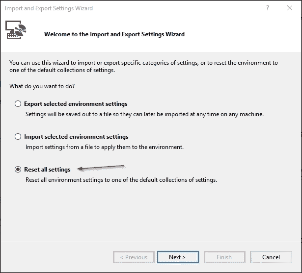

1.  选择 **重置所有设置** 然后点击 **下一步** 以继续。

1.  选择 **否，仅重置我的设置覆盖我的当前设置** 然后点击 **下一步** 以继续

1.  选择 **常规** 然后点击 **完成**：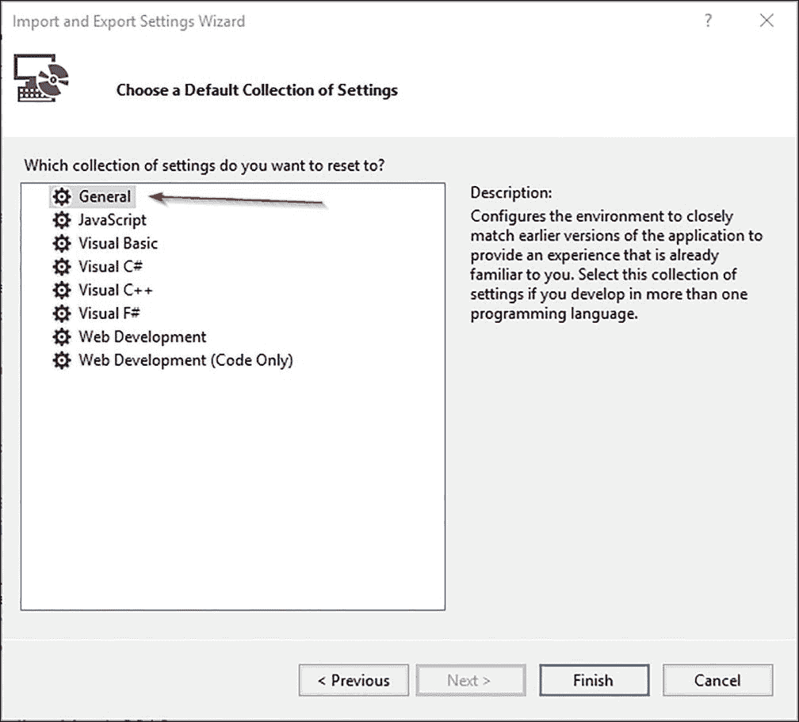

设置完成后，我们将有一个一致的布局，可用于本书的整个过程中，包括菜单位置和 Visual Studio 的外观和感觉。

现在，我们将通过介绍常见的 F# 运行时概览来深入了解 F# 运行时，这将为我们提供一些关于 F# 性能的见解。

## F# 运行时特性

Visual Studio 2015 的发布与 .NET 4.6 以及其他工具（包括 F# 编译器）的发布同时进行。Visual Studio 2015 中 F# 的编译器版本是 F# 4.0。

与 Visual Studio 2013 中的 F# 3.0 相比，F# 4.0 没有大的差异或显著的新特性。

它的运行时特性本质上与 F# 4.0 相同，尽管有一些细微的性能改进和错误修复。

更多关于 F# 4.0 的新信息（描述为发布说明）请访问：

[`github.com/Microsoft/visualfsharp/blob/fsharp4/CHANGELOG.md`](https://github.com/Microsoft/visualfsharp/blob/fsharp4/CHANGELOG.md)

### 注意

在撰写本书时，Visual Studio 中的 F# 在线离线 MSDN 库没有 F# 4.0 发布说明文档，但您始终可以访问 F# 的 GitHub 仓库以检查最新更新。

这些是 F# 作为托管编程语言的一部分的常见特性：

+   F# 必须符合 .NET CLR。这包括兼容性、编译后生成的 IL 以及对 .NET BCL（基本类库）的支持。因此，F# 函数和库可以被其他 CLR 兼容语言（如 C#、VB 和托管 C++）使用。

+   调试符号（PDB）具有与其他 CLR 兼容语言相同的格式和语义。这很重要，因为 F# 代码必须能够从其他 CLR 兼容语言中进行调试。

从托管语言的角度来看，使用 CLR 分析器等工具测量 F# 的性能与测量其他语言相似。但从 F# 的独特视角来看，以下是一些 F# 的独特特性：

+   默认情况下，F# 中的所有类型都是不可变的。因此，可以安全地假设它是固有的线程安全的。

+   F# 具有独特的集合库，默认情况下是不可变的。也可以安全地假设它是固有的线程安全的。

+   F# 具有强大的类型推断模型，当没有具体类型进行推断时，它会自动进行泛化。

+   F# 中的默认函数通过创建一个从 F# 的 `FSharpFunc` 派生的内部类来内部实现。这个 `FSharpFunc` 实质上是一个委托，F# 使用它来应用诸如柯里化和部分应用之类的函数式语言结构。

+   在 IL 中使用**尾调用递归优化**时，F# 编译器可能会生成 `.tail` IL，然后 CLR 会识别这一点并在运行时进行优化。更多内容请参阅第七章，*语言特性和结构优化*。

+   F# 有内联函数作为选项。更多内容请参阅第七章，*语言特性和结构优化*。

+   F# 有一种用于组合函数的计算工作流程。这将在第八章中更详细地描述，*优化计算表达式*。

+   F# 的异步计算不需要 `Task<T>` 来实现。

### 注意

虽然 F# 的异步操作不需要 `Task<T>` 对象，但它可以很好地与 C# 和 VB 中的 async-await 模型一起工作。C# 和 VB 中的 async-await 模型受到了 F# 异步操作的影响，但其语义行为在更多方面与 `Task<T>` 的使用不同。更多内容请参阅第四章，*F# 并发介绍*。

所有这些特性不仅独特，而且当用于与 C# 和 VB 交互时，也可能有性能影响。

## F# 代码与其生成的程序集之间的关系

F# 程序集（通常在 Windows 上运行的 .NET 中的 DLL 或可执行 EXE）在编译后与 C#/VB 程序集相同。编译器的最终产品是一个 .NET 程序集。

一个程序集可以包含多个命名空间，每个命名空间可以包含多个模块、类或两者的混合文件。

下表描述了 F# 代码与编译后的代码（程序集）之间的关系：

| **F# 代码** | **描述** | **编译后的代码** |
| --- | --- | --- |
| 项目 | F# 项目的组织。它可能包含 F# 脚本（FSX）和 F# 源文件（FS）。在概念布局中，一个项目可能包含多个命名空间，这些命名空间跨越多个 FSX 和 F# 脚本文件。 | 可执行 EXE 或 DLL 类库的程序集 |
| 命名空间 | 模块和类的逻辑组织，有助于在组织、公司或功能内部进行组织。例如：包含许多与浏览器/服务器通信相关的类的 `System.Web` 命名空间，包括 HTTP 和 HTTPS。 | 命名空间可能跨越不同的程序集，而不仅仅是单个程序集的命名空间 |
| 模块 | F# 中的模块等同于 C# 中的静态类或模块，或 VB 中的模块。一个 F# FS 文件可以包含多个模块，尽管不建议这样做。 | 生成程序集的一部分 |
| 类和接口 | 一个文件可以在不同的命名空间下包含多个类和接口。建议每个文件不要超过一个命名空间，因为这也有助于减少编译时间，当它尝试解析引用时。 | 生成程序集的一部分 |

## 不可变性与可变性的比较

F# 的类型和集合类型实现是不可变的。在这个意义上，不可变意味着它是只读的，我们只能用初始值初始化对象，之后不能更改它。

可变性意味着一旦我们初始化了一个对象，之后就可以对其进行更改。这就是为什么有时人们称其为 *可变对象值* 而不是 *变化对象值* 的原因。

例如，考虑以下内容：

```cs
let anynumber = 0 

```

默认情况下，`anynumber` 是不可变的，其值始终为 `0`。

要将变量标记为可变，F# 有 `mutable` 关键字，我们可以在 `let` 声明中使用 `mutable`，如下例所示：

```cs
let mutable anymutablenumber = 0 

```

然而，更改值需要使用 F# 中的 `<-` 符号，例如：

```cs
anymutablenumber <- anymutablenumber + 1 

```

由于 F# 的本质是函数式的，一个符号可以既是数据又是函数。符号的内容是只读的，其中的函数也是如此。

不可变性还有一个优点：它可以在多个线程或甚至并行的情况下很好地扩展，无论是值还是函数。不可变性的保证意味着它是无副作用的。因此，可以并行生成多个符号，因为执行的结果将保证具有相同的结果。这通常被称为 **线程安全**。

事实上，F# 同时支持函数式和面向对象编程（包括对面向对象固有可变状态的支持），这可能导致以下所述的瓶颈。

# 常见瓶颈概述

F# 虽然可能存在一些微妙的问题，但仍然有常见的瓶颈。

为了能够快速理解 F# 中的瓶颈因素，我们将把 .NET 的共享通用瓶颈分为托管瓶颈（也存在于 C#/VB 中），以及 F# 独有的瓶颈（这包括在使用 F# 与其他语言一起使用时）。

以下是从明显到不那么明显的托管 .NET 瓶颈：

+   字符串连接，例如使用 `String.Concat` 而不是 `StringBuilder`。这通常被忽视，因为缺乏对字符串不可变性的认识。

+   使用非泛型集合，例如 `ArrayList`。

+   错误处理副作用，例如异常和 I/O。

+   可变对象的使用，包括类型转换。

+   将要序列化和反序列化的复杂对象，例如：通过 HTTP 发送包含 `DataTables` 的 `DataSet`。

+   忽略性能分析。

副作用意味着所有我们与之交互的正式计算之外（通常称为 *外部世界*）的元素，这包括改变全局状态。外部世界可以是我们无法完全确定作为最终结果的全部事物。外部世界的例子包括：

+   I/O：这被包括在内，因为它被视为外部世界的一部分，因为你无法确定或保证你传递给 I/O 的任何工作都能成功完成。例如，当向打印机发送命令以打印文档时，我们无法保证打印操作 100%成功。甚至在打印机接收到数据并开始打印文档之前，我们甚至无法保证将数据发送到打印机的过程是成功还是失败。

+   全局静态可变变量：一个快速示例是当我们定义一个`public static`变量在 ASP.NET 的作用域内。任何值的变化都将始终改变 ASP.NET 应用程序任何用户的条件。

+   当被调用时总是返回不同结果的功能或属性，例如`DateTime.Now`。

### 注意

`DateTime.Now`将始终返回不同的结果，这是预期的，因为每次调用或实例化时结果*必须*改变。它不是没有副作用的，但它仍然预期总是返回不同的结果。

副作用不仅仅是面向函数式编程的开发者需要考虑的，因为现在我们中的许多人已经越来越意识到这一点。没有绝对的无副作用计算，因为我们应该学习和能够正确地处理它们。例如，甚至将屏幕打印到控制台也是一种副作用，因为它涉及到 I/O 操作，并且会改变外部世界的状态。

以下是 F#的独特瓶颈：

+   数据结构和集合使用不当

+   不正确地使用自动泛化和其他语言结构

+   实现并发问题时出现的不正确，例如虽然原始意图是异步，却混合了同步和异步

+   当需要与其他语言的类库（如 C#/VB）交互时，性能可能会变慢

+   在 F#中扩展`MailboxProcessor`

+   确定何时应该进行**尾调用优化**

+   在类型提供者实现中解析类型时的响应缓慢

+   实现计算工作流时的性能缓慢

# 常见的被误解的并发问题示例

我们中的许多人，在处理并发问题时，有时会试图用锤子敲打每一个钉子。对于实现并发的所有问题，并没有一劳永逸的解决方案。

也建议了解并发，因为随着过去 7 年中现代微处理器（或简称处理器）发布的许多核心模型，并发现在变得更加相关。这一事实也正在成为一种趋势，因为最新处理器的时钟速度在过去 3 年中通常被限制在 3.2 GHz。

微软的 Visual C++架构师 Herb Sutter 撰写了一篇非常详尽的以白皮书形式著名的文章，名为*The Free Lunch Is Over*：

[`www.gotw.ca/publications/concurrency-ddj.htm`](http://www.gotw.ca/publications/concurrency-ddj.htm)

让我们先了解什么是并发以及 F#支持哪些并发。

## F#并发简介

在我们深入探讨 F# 中的并发之前，我们应该了解并发的定义。

并发是计算机科学的主要学科之一，它仍然是计算的主要问题之一。

简单来说，并发是指独立进程单元或部分有序进程单元的顺序组合，这些进程单元可以并行或非并行执行，但不是按顺序执行。这里的 *顺序* 指的是按顺序排列。

下图展示了顺序（非并发）的概念在实际中的应用：

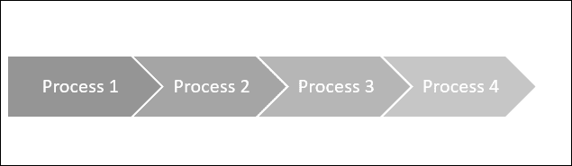

如前图所示，**进程 1** 到 **进程 4** 是按顺序一步一步执行的。**进程 2** 必须等待 **进程 1** 完成后才能开始，**进程 3** 和 **进程 4** 也是如此。

这个顺序也被称为同步进程，或者简单地称为同步。

下图是一个并行并发组合（并行和同步进程）的示例说明：

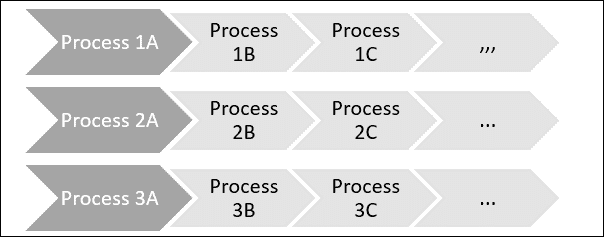

**进程** **1A**、**2A** 和 **3A** 并行运行，尽管每个并行通道都有其自己的进程顺序，这些进程是顺序运行的。

平行这个词意味着它不仅是在并行中同时执行，而且平行还意味着它可能运行在多个处理器或多个核心上，这在具有多个核心的现代处理器中很常见。

## 异步的定义

异步的简单定义就是 *非同步*。这意味着如果我们有一个异步流程，进程不是同步运行的。

这些是异步流程的启示：

+   进程不是按顺序运行的。例如，如果第一个进程是异步运行的，下一个进程不必等待第一个进程完成。

+   必须有一种方式来调度并告诉调度器异步进程已完成。通常，异步进程通常与阻塞 I/O 或某些长时间计算有关。

+   起初，进程可能看起来是顺序的，但下一个运行的进程可能根本不是顺序的。

这是一个异步的示例案例：一位顾客将在餐厅用餐。流程如下：

1.  *顾客 A* 订购了一些食物或饮料，订单由 *服务员 X* 记录。通常，大多数餐厅都有不止一个服务员，但为了说明，目前为 *顾客 A* 提供服务的服务员是 *服务员 X*。

1.  然后 *服务员 X* 将顾客的订单列表交给 *厨师 Y*。

1.  *厨师 Y* 接受订单，并检查他是否正在忙碌。如果他正在忙碌，订单将被注册为他的烹饪队列的一部分。否则，他将开始烹饪订单。

1.  服务员不必等待厨师完成烹饪。他可以随后为刚刚到达的其他顾客提供服务，或者可能还有顾客想要添加更多食物或饮料。

1.  *厨师 Y*完成了对*顾客 A*的烹饪，然后通知*服务员 X*，告知他的*顾客 A*的烹饪已完成。或者他可以通知所有服务员，告知*顾客 A*的烹饪已完成。这种通知告知过程已完成的概念通常称为回调。

1.  *服务员 X*（或任何其他服务员）将完成的食品递送给*顾客 A*。

使用通知来通知过程完成的异步模型称为**异步回调**。

在执行结束时（或未来）返回的结果称为**Future**。在许多过程并行执行并具有后续结果的情况下，它也是未来。

这是 MSDN 库中 Future 的官方文档：

[`msdn.microsoft.com/en-us/library/ff963556.aspx`](https://msdn.microsoft.com/en-us/library/ff963556.aspx)

对于 I/O 操作，例如打印文档，我们无法确定打印是否成功，因此没有结束过程的通告。我们可以在 I/O 上实现异步操作，而这一事实没有可观察到的通告，这就是为什么这种异步模型被称为异步*火和忘*模型。

## 被误解的并发问题

许多开发者，即使是经验丰富的开发者，仍然认为并发和并行编程是不同的。实际上，并行编程只是并发学科中的一个成员，与异步和同步处理模型的区分一起。

这也是被误解最多的并发概念或问题之一，关于我们如何处理并发的问题还有很多。

这些是一些常见的误解并发问题的组织样本案例：

1.  假设所有并发问题都可以通过并行编程来解决。

    事实：并非所有并发问题都可以通过并行性轻松解决。

1.  假设所有异步实现都是异步的。

    事实：这取决于我们如何实现异步；有时异步结构的执行是同步执行的。

1.  忽略阻塞线程，如 I/O。

    事实：应该异步处理阻塞 I/O 线程；否则，当前线程将无限期地等待，直到 I/O 线程完成。

1.  同步锁是阻塞的。

    事实：锁不是阻塞线程。

1.  依赖于 CPU 速度。

    事实：CPU 速度的提高变得越来越不是问题。现代 CPU 的研究和开发正集中在多核 CPU 上。

下面提到了一些并发问题的样本案例：

第一案例的案例样本如下：

+   **对集合进行排序或排序**：排序默认是顺序过程，它需要迭代集合的所有元素。因此，使用并行性是无用的。

+   **数据分组**：数据分组隐式地是顺序过程之一；使用并行性也是相当无用的。

+   **打印报告**：打印是 I/O 的一部分，而 I/O 本身不支持并行性。除非 I/O 是 I/O 并行的一部分，否则在这个上下文中使用并行性是无效的。

第二种情况的示例案例如下：

+   混合包含 F#异步的`Parallel.For`。默认情况下，`Parallel.For`使用多个核心或 CPU 运行并不意味着它是异步的，因为它不能保证并行运行。

+   使用`Thread.Sleep`而不是`Async.Sleep`来表示*等待*操作。`Thread.Sleep`的调用将使流程同步，因为`Sleep`方法只是将当前线程同步地挂起作为*延迟*。

### 注意

存储 I/O 中的 RAID 数组是 I/O 中并行性的最佳示例之一。它将数据并行存储在多个磁盘上。由于数据是并行存储在多个磁盘的部分（而不是整个数据存储到一个磁盘），因此它比常见的 I/O 更快。

第三种情况与所有 I/O 操作相关，包括向打印机发送数据和将大量数据保存到磁盘。这些操作总是阻塞线程。

对于`lock`的情况，微软已经发布了官方声明，指出 C#和 VB 在.NET 中使用的`lock`执行时不会受到任何中断，并且它只锁定一个对象，直到它完成同步锁中的代码块执行。它仍然允许其他线程在没有等待持有锁的线程完成的情况下运行。

这是 MSDN 中 C#和 VB 的官方线程同步：

[`msdn.microsoft.com/en-us/library/ms173179.aspx`](https://msdn.microsoft.com/en-us/library/ms173179.aspx)

建议始终在线检查.NET 类库的 MSDN 库，因为这是始终更新的。

## .NET 和 F#中并发支持的介绍

F#的并发支持基于.NET BCL（基础类库）中现有的并发支持功能。这也是设计上的考虑，因为 F#运行在.NET CLR 之上，可以使用.NET BCL。F#还有其独特的特性，除了语言特性之外，还带来了更多功能（例如，异步计算）。

.NET 并发部分的 BCL 对以下内容提供基本支持：

+   线程

+   锁

+   互斥锁

从.NET 4.0 开始，我们有了**任务并行库**（**TPL**）。这个库使得并发支持变得更加容易。TPL 包括以下内容：

+   数据并行（例如：`Parallel.For`和`ForEach`）

+   任务并行

+   异步任务（这也是 C#/VB 的 async-await 的基础）

+   并行 LINQ（通常缩写为 PLINQ）

要获取.NET 中并发支持的更完整参考，请访问 [`msdn.microsoft.com/en-us/library/hh156548(v=vs.110).aspx`](https://msdn.microsoft.com/en-us/library/hh156548(v=vs.110).aspx)。

### 注意

.NET 在 Win32 API 中还没有对纤维 API 的支持。微软目前没有明确的纤维支持计划。

F#具有其独特的并发支持特性。它们是：

+   异步工作流或计算

+   MailboxProcessor

+   并行异步

+   并行异步结合 I/O

F# 中关于并发支持的更多信息可在 第四章，*F# 并发简介*和 第五章，*F# 高级并发支持*中找到。

现在是深入一些代码的时候了。要开始编写 F# 代码，我们可以使用 F# 和 Visual Studio 的组合。这包括 F# 的 IDE 支持。

# Visual Studio 中 F# 工具的概述

F# 自 Visual Studio 2010 起得到支持，在 Visual Studio 2015 中，支持得到了改善，语法着色比 Visual Studio 2010 更好，不仅限于 IDE。这种 F# IDE 支持官方称为 *Visual F#*。

此工具作为开源项目由 Microsoft 提供，可以从 GitHub 下载：[`github.com/Microsoft/visualfsharp/`](https://github.com/Microsoft/visualfsharp/)。

F# 编译器本身也是开源的，并且可以从 GitHub 获取（包括设计提案讨论）：[`github.com/fsharp`](https://github.com/fsharp)。

工具在 Microsoft 的治理下，但欢迎社区贡献，因为它可在 GitHub 上找到。所有工具、编译器和语言规范的社区参与都在 F# 软件基金会（FSSF）的治理之下。

我们还可以直接支持 FSSF。有关 FSSF 的更多信息，请访问 [`fsharp.org/`](http://fsharp.org/)。

### 注意

F# 社区项目也由 FSSF 管理，并欢迎贡献。FSSF 是一个独立实体，与 Microsoft 无关。

Visual Studio 2015 中的 Visual F# 主要有以下功能：

+   项目模板支持，包括 NuGet 包的添加和同一解决方案文件中其他项目的引用。其他项目可以是 VB 或 C# 项目，而不仅仅是 F#。

+   在单独的文件中支持 `AssemblyInfo`。此功能自 Visual Studio 2015 起可用。之前它仅在 C# 和 VB 项目中可用。

+   F# 编译器，FSC，用于将 F# 编译成 .NET 可执行文件和以 DLL 形式的库。

+   F# 编译器、MSBuild 基础设施和 Intellisense 的集成。

+   F# 库，是 F# 函数式编程结构的基础，以及 F# 独特的并发特性，如异步工作流和 `MailboxProcessor`。它还包含许多有用的函数，以进一步与 C#/VB 交互，包括与 .NET 代理的交互。

+   在 IDE 中对 F# 交互式（FSI）提示符的交互式支持。

关于 F# 工具的更多信息，这是官方 MSDN 图书馆的链接：

[`msdn.microsoft.com/visualfsharpdocs/conceptual/visual-fsharp`](https://msdn.microsoft.com/visualfsharpdocs/conceptual/visual-fsharp)

建议首先查阅 GitHub 上的 Visual F# 文档，然后结合在线 MSDN 图书馆的 F# 部分。

微软计划重建所有在线 MSDN 图书馆以使用 GitHub 参与模式，因此开发者可以向修改或修正任何文档页面提交拉取请求。Visual F# 也正在重新设计，但还有一些页面仍然留在 Visual F# GitHub 仓库中。

要始终检查 GitHub 上 F# 文档的最新开发情况，请访问 [`github.com/Microsoft/visualfsharpdocs`](https://github.com/Microsoft/visualfsharpdocs)。

## 对 F# 交互式支持

F# 交互式是一个解释你的 F# 代码并立即运行的工具。它还会处理并显示结果、类型和语法错误。代码可以在交互式提示符中运行，或者从源代码中取出然后运行到 F# 交互式中。

### 注意

解释代码、执行它并查看结果的概念称为 REPL。**REPL** 是 **Read-Eval-Print-Loop** 的缩写，它最初作为系统的命令行提示符提供。这个 REPL 概念并没有什么新意，因为像 Python 这样的其他编程语言在 F# 之前已经有了 REPL。

与 C# 和 VB 相比，F# 交互式是第一个自 Visual Studio 2010 起拥有交互式 REPL 支持的。不幸的是，F# 交互式还没有 Visual Studio 的 Intellisense 支持。

使用 F# 交互式有两种方式：

+   在 Visual Studio IDE 中

+   在命令提示符中

F# 交互式在 Visual Studio IDE 中的最常见用法。

我们必须设置 **F# 交互式** 窗口以便显示，才能使用 F# 交互式。

显示 **F# 交互式** 窗口的步骤如下：

1.  从 Visual Studio 主菜单中打开 **视图** 菜单。

1.  选择 **其他窗口..** 然后选择 **F# 交互式**。

将在 Visual Studio 中显示 **F# 交互式** 的窗口，并准备好解释我们的 F# 代码：

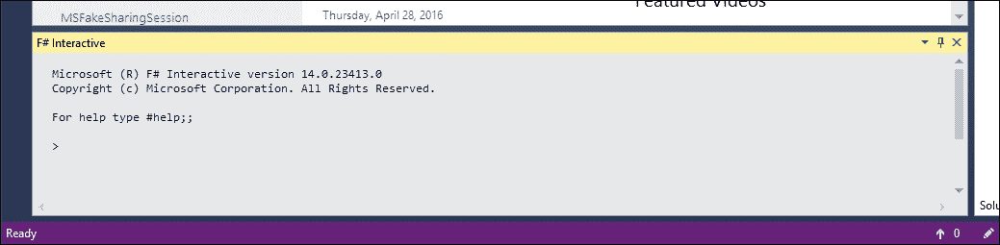

作为入门，输入 `#help` 后跟 `;;` 作为要评估的结束语句。我们现在可以看到一些其他选项：

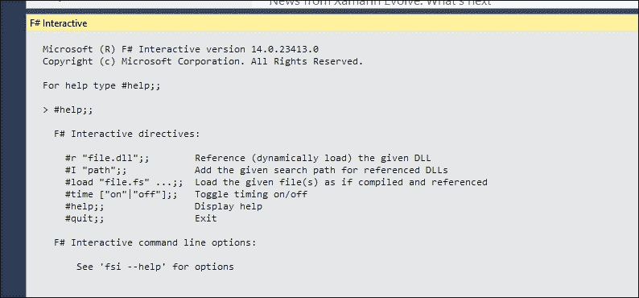

F# 交互式不仅可以解释和运行 F# 代码，还可以作为一种查看计算即时结果的方式。

输入 `5 * 25;;` 并按 *Enter*。

我们现在可以看到该计算的结果：

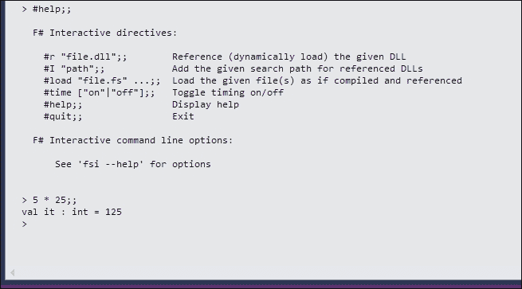

当我们打开 F# 源代码文件时，我们也可以在 Visual Studio 编辑器中执行代码。

例如，使用 F# 教程项目模板创建一个新的项目：

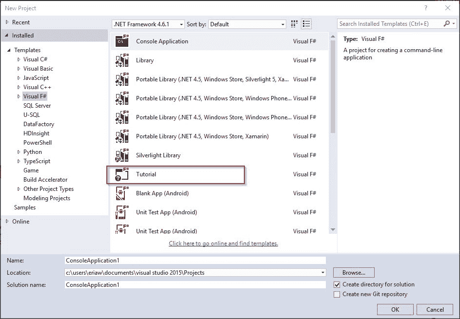

你可能会发现你的 Visual Studio 显示与之前的截图不同。实际上，上述显示取决于我们拥有的 Visual Studio 版本。对于 Visual Studio Enterprise，我们有更多模板可供使用，例如创建 UML 的 **模型项目**。

为了 F# 的目的，F# 项目的项目模板对于社区版及以上版本是相同的。

创建项目后，F# 项目包含 `Tutorial.fsx`。

在我们使用 F# 交互式之前，我们应该打开显示行号的选项。也建议始终打开此选项，因为它将提供更容易导航到我们编写的代码：

1.  前往 **工具** 菜单并选择 **选项**。它可在 **选项** 对话框中的 F# 选项中找到：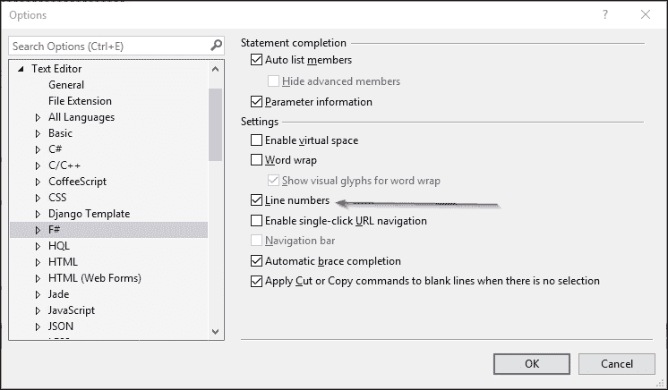

1.  现在双击 `Tutorial.fsx`，并突出显示第 **44** 到 **61** 行：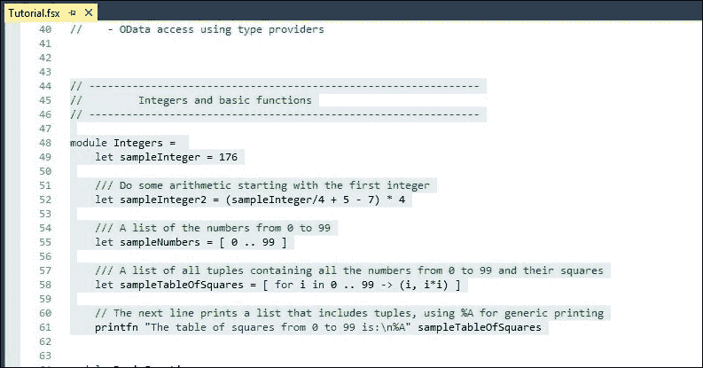

1.  然后按 *Alt* + *Enter*。F# 解释代码。我们可以在 **F# 交互式**中看到解释的结果：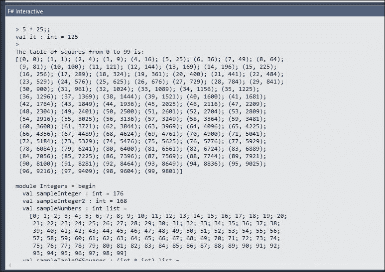

我们已经尝试了在 Visual Studio IDE 中使用 F# 交互式。现在让我们从命令提示符使用 F# 交互式。

### 注意

我们也可以使用 *Ctrl* + *Alt* + *F* 来激活或打开 **F# 交互式**。

要从命令提示符使用 F# 交互式，我们直接从命令提示符调用可执行文件 FSI。

运行 FSI 的最佳方式是从 Visual Studio 的开发者命令提示符。此开发者命令提示符位于 Windows 桌面菜单栏的“开始”菜单中的 `Visual Studio 2015` 文件夹下。

选择它，现在我们有 **VS2015 开发者命令提示符**：

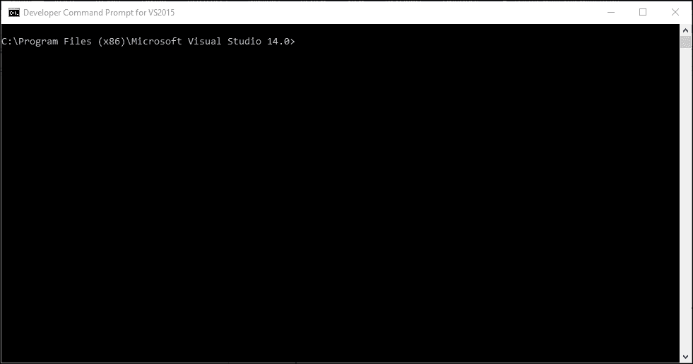

输入 `FSI` 并按 *Enter* 键。

我们可以尝试编写一些代码来评估，例如：

```cs
let anynumber = 5 * 25;; 

```

按 *Enter*。立即结果将显示：

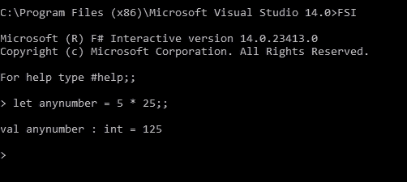

要退出 FSI，输入 `#quit;;` 并按 *Enter* 键。

从命令提示符使用 F# 交互式更快捷，但也不太用户友好，因为我们不能轻松地评估多行代码。在 Visual Studio IDE 中评估它更容易。

### 注意

为了简单和易用，本书的其余部分将始终在 Visual Studio IDE 中使用 FSI。

有关 F# FSI 的更多信息，请参阅 MSDN 库中的 FSI 参考 [`msdn.microsoft.com/visualfsharpdocs/conceptual/fsharp-interactive-%5bfsi.exe%5d-reference`](https://msdn.microsoft.com/visualfsharpdocs/conceptual/fsharp-interactive-%5bfsi.exe%5d-reference)。

FSI 也可以进行配置。我们可以通过利用 `Microsoft.FSharp.Compiler.Interactive` 命名空间中的 FSI 类库来进一步配置 FSI。有关此库的更多信息，也可以在之前提到的 F# FSI 网址找到。

# F# 调试简介

理解运行中的 F# 代码的一个关键方面是调试 F# 代码。我们必须能够调试 F# 代码，尤其是当我们有包含数百个 F# 代码文件的大型项目时，更不用说每个代码文件可能包含太多的代码行。例如，需要检查超过 2,000 行的运行中的 F# 代码。

以下是一些调试功能的优点：

+   通过插入断点来隔离错误并集中关注它，可以简化错误或错误的修复。开发者因为可以更快地修复错误/错误而提高了生产力。

+   调试还可以提供关于任何从函数返回的值的正确性的有洞察力的信息。

+   通过检查其他引用库的结果，调试还可以用于进一步跟踪错误。我们可能使用引用库不正确，或者引用库本身也可能存在错误。

Visual Studio 2015 中的 Visual F# 也具有调试功能。当它在 Visual Studio 2008 中作为附加组件引入时，它并不像现在这样强大，但现在调试体验要好得多。它已经很好地集成到 Visual Studio 扩展性模型中，例如，在调试模式下提供更快的执行速度和条件断点。

它与 C#/VB 调试器不同，因为尽管 F# 是一种强类型和严格类型的语言，但目前它不支持在 Visual Studio 2015 调试器的立即窗口中评估表达式。

### 注意

一些经验丰富的 F# 开发者可能会争论说，这个额外的调试功能根本不是什么大问题，因为 F# 作为一种编程语言，有强制类型限制和正确性的趋势。但对于大多数其他开发者，尤其是那些从 C#/VB 跳转到 F# 的开发者来说，整体的调试体验仍然缺少一些功能。

目前这些是 Visual Studio 2015 中 F# 和 C#/VB 调试器的不同之处：

| **功能** | **F#** | **C#/VB** |
| --- | --- | --- |
| 断点插入 | 是。 | 是 |
| 断点中的条件 | 是。 | 是 |
| 断点中的编辑条件 Intellisense | 不支持，因为 Intellisense 尚未链接到 Visual Studio 2015 IDE 扩展性和 F# 编译器的整个基础设施。有一个计划在 Visual Studio 2015 之后的下一个 Visual Studio 版本中实现此功能。 | 是 |
| 轻量级辅助灯泡 | 不可用。有一个计划在 Visual Studio 2015 之后的下一个 Visual Studio 版本中实现此功能，但具体的计划发布日期尚不明确。 | 是 |
| 立即窗口中的表达式评估 | 不可用。 | 是 |
| 本地值 | 是。 | 是 |
| 自动监视值 | 是。 | 是 |

除了之前表格中的功能外，在 Visual F# 中使用断点进行的基本调试与 C#/VB 中的调试基本上是相同的。

让我们拿一些代码来调试。为了快速获取一些代码，我们可以使用 CodePlex 上的 F# 3.0 示例，地址为：

[`fsharp3sample.codeplex.com/`](http://fsharp3sample.codeplex.com/)

下载代码示例的 ZIP 文件后，将其解压到一个文件夹中，并在 Visual Studio 中打开`SampleProject.sln`解决方案文件。

### 注意

在使用整个示例代码之前，您可以首先阅读`Readme.txt`。当在**解决方案资源管理器**中打开时，此说明指南位于`Solution Item`文件夹中。

现在，您的屏幕应该看起来像这样：

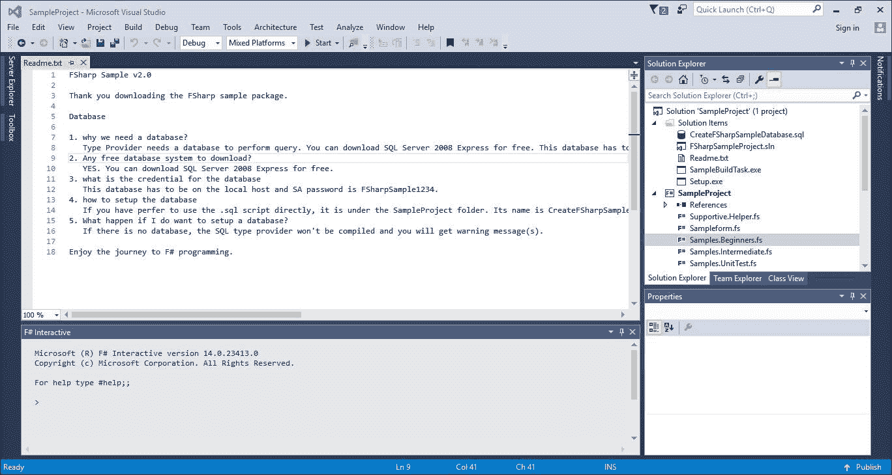

F# 3.0 中的一些示例已经不再有效。您必须注册 Azure DataMarket 才能访问 Azure DataMarket 的 F#类型提供者。

如果我们尝试在不更改代码的情况下重新构建解决方案，将会出现一些编译错误，并且其中一个示例类型提供者，ESRI DataMarket，无法正常工作。

基于那些无效的类型提供者条件，为了成功构建此示例解决方案，您必须遵循以下步骤：

1.  在 Azure DataMarket 上注册。您需要自己的 Azure 账户密钥才能访问 Azure DataMarket。

1.  ESRI 示例自 2014 年以来一直无法正常工作。请在`Samples.TypeProviders.AzureMarketPlace.fs`文件中从第 135 行到第 157 行注释掉这些行。

1.  重新构建解决方案。这将编译整个解决方案，并在后台为我们解决类型提供者。

1.  现在，打开`Samples.Beginners.fs`文件。通过单击行号将调试器断点放在第 19 行和第 20 行。

1.  要添加断点，您只需在行号左侧的高亮列上切换，如下所示：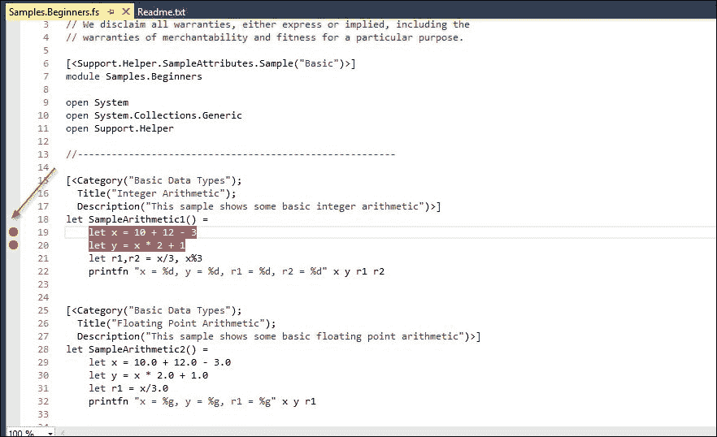

1.  我们也可以通过右键单击并选择**断点..**然后选择**插入断点**来添加断点。

1.  通过启动**构建解决方案**来编译代码。然后按*F5*键运行。将显示**F# 微型示例探索**窗口：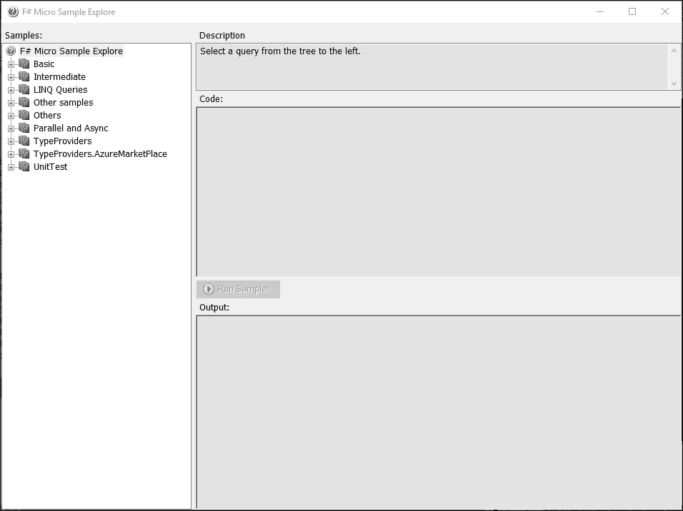

    这个示例实际上展示了众多 F#功能，从基本语言结构、度量单位、类型提供者到 LINQ，再到异步和并行等并发性。

1.  现在，展开左侧的**基本**节点，选择**基本数据类型**，然后选择**整数算术**的最后节点，如图所示：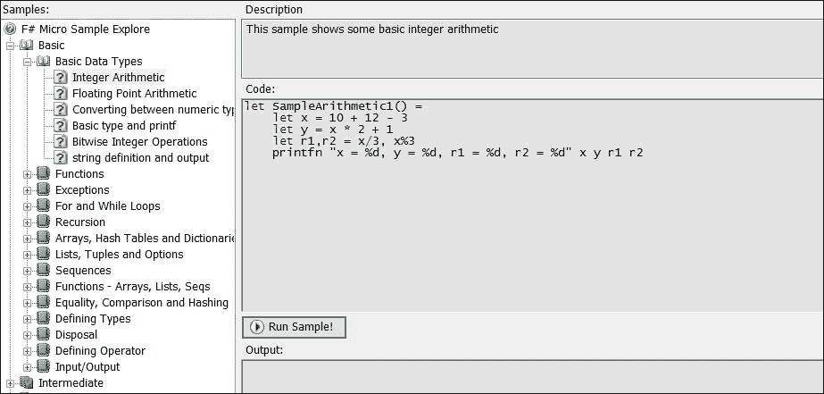

1.  返回到`Samples.Beginner.fs`的源代码，我们可以看到节点名称也与代码中用于分类的属性名称相同：

    ```cs
          [<Category("Basic Data Types"); 
            Title("Integer Arithmetic"); 
            Description("This sample shows some basic integer arithmetic")>] 
          let SampleArithmetic1() = 
              let x = 10 + 12 - 3  
              let y = x * 2 + 1  
              let r1,r2 = x/3, x%3 
              printfn "x = %d, y = %d, r1 = %d, r2 = %d" x y r1 r2 

    ```

1.  点击**运行示例！**按钮，Visual Studio 将在断点处停止执行：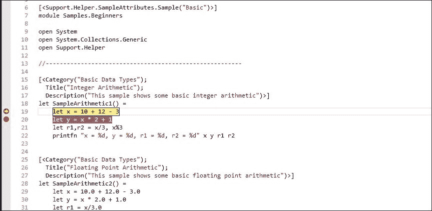

    现在，我们可以轻松地调试我们的代码。我们还可以通过检查**局部变量**窗口中的值来查看当前作用域中的变量或符号的值。

1.  按*F10*键跳过，现在我们看到`x`和`y`的评估值：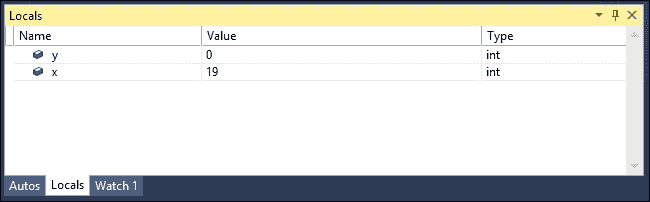

在**Locals**窗口和**Watch1**窗口中显示的监视表达式中的任何局部变量始终具有变量的名称、值和类型。显示的类型使用 F#关键字，而不是完整的类型名称。

例如，显示的是`int`而不是如**Locals**中所示`System.Int32`。

如果我们在**Watch1**窗口中还有另一个`global`或`static global`变量，我们也可以检查其他值。这些值可以包含来自表达式的即时值，例如`DateTime.Now`。

不幸的是，我们必须使用`System.DateTime`的全命名空间来编写代码，因此我们必须将表达式写成`System.DateTime.Now`：

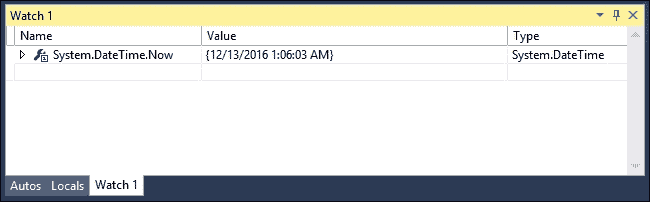

这种需要完整命名空间的要求证明了与 C#/VB 的对应版本相比，Visual F#中的调试器支持仍需要改进。键入完整对象名称可能会出错，因为 F#监视器尚不支持 Intellisense。

在完成调试和错误修复后，建议将编译模式更改为**发布**模式。**发布**模式将生成更小的 F#编译代码，并且执行速度更快，因为它不包含附加到编译代码的调试符号和其他调试信息。

在**调试**和**发布**模式之间来回切换相当简单。我们只需在 Visual Studio 工具栏的下拉菜单中更改模式即可：

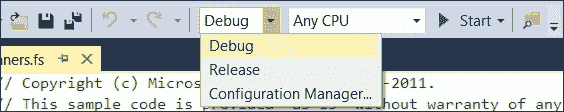

除了发布模式文件大小更小之外，编译的 DLL 或 EXE 文件名没有明显的区别。

总结一下，以下是在**调试**模式和**发布**模式之间的区别：

| **元素** | **调试** | **发布** |
| --- | --- | --- |
| 调试符号（PDB） | 包含 | 不包含。 |
| 编译代码大小 | 包括 PDB 文件在内，比发布模式大 | 比调试模式小。 |
| 代码优化 | 未优化，因为它专注于调试，并且也是同步的 | 是的，但代码将无法轻松调试，因为代码是针对执行优化的。在.NET 4.6 和 Windows 10 中，它通过使用提前编译（AOT）模型而不是即时编译（JIT）进一步优化为本地代码。 |
| 编译符号可用性 | `DEBUG` | 不适用。 |
| 执行 | 比发布模式慢，因为没有优化 | 快速，因为它针对运行时进行了优化，并且没有调试符号开销。 |

关于 AOT 和 JIT 的更多信息，请参阅 MSDN 库中的[`msdn.microsoft.com/en-us/library/dn807190(v=vs.110).aspx`](https://msdn.microsoft.com/en-us/library/dn807190(v=vs.110).aspx)。

# 摘要

我们讨论了执行常见性能优化的介绍，从 F# 和 .NET 的性能特性到最常用的优化概念，如并发。我们还具备使用 Visual Studio 进行调试以开始排查性能问题的基本知识。但调试运行中的 F# 代码仍然是性能优化的一小部分，因为调试仅提供了我们代码中对象值和状态的了解。

F# 工具本身的调试支持不足以全面理解性能问题的细节，因为大多数详细的性能优化需要我们测量代码的基准。为了客观地衡量优化，性能测量的内容将在第二章，*性能测量*中描述。
