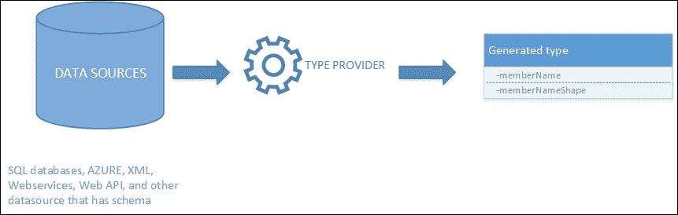
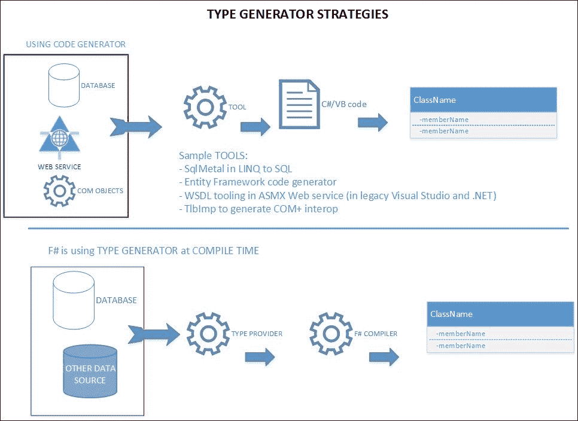
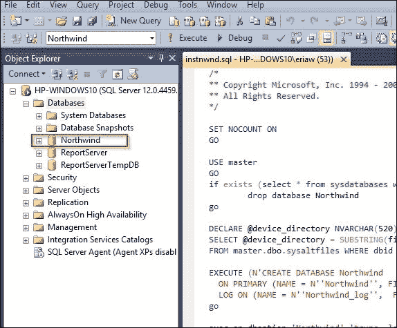
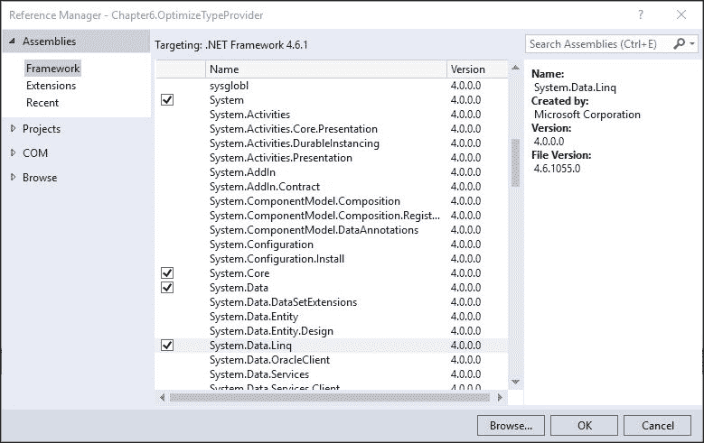
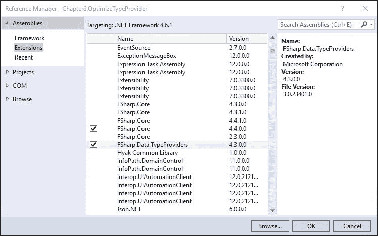
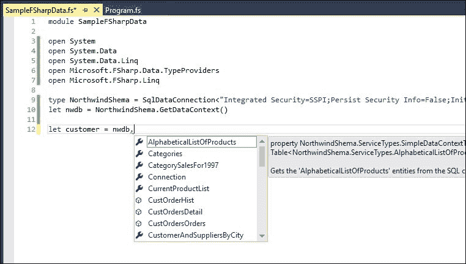
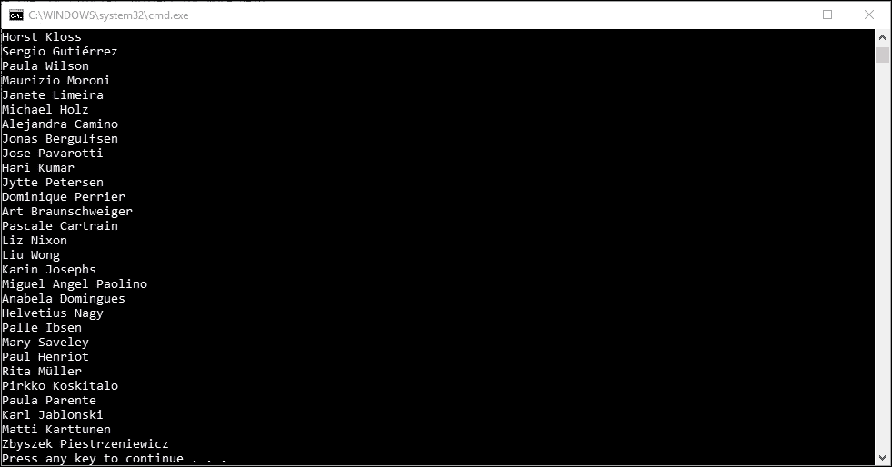
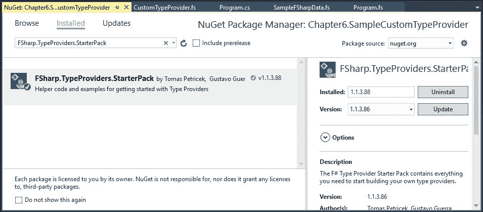

# 第六章。优化类型提供者

我们现在对 F# 的基本和高级并发特性有了基本的了解。我们也拥有了足够的工具知识，因此对 Visual Studio 中的工具支持有了足够的了解。基于这些知识，我们还可以在实现和使用其他 F# 语言特性时进行性能优化。

在本章中，我们将专注于将之前的知识应用于优化类型提供者。类型提供者是 F# 的一个独特特性；它在 F# 3.0 中被引入。

### 注意

类型提供者在 F# 3.0 版本发布时被引入，与 Visual Studio 2012 的发布同时进行。重要的是要知道 F# 3.0 是 Visual Studio 2012 的火车版本的一部分，而不是 Visual Studio 2013 的部分。许多外部文章（包括一些博客）错误地假设 F# 3.0 与 Visual Studio 2013 一起提供了类型提供者。与 Visual Studio 2013 一起发布的 F# 版本是 F# 3.1，而不是 F# 3.0。

在优化之前，了解类型提供者是什么以及拥有或使用它的主要目标或目的也很重要。了解类型提供者背后的概念将使我们了解在使用和实现类型提供者时，哪些优化部分对我们是可用的。这种洞察力还将帮助我们避免在处理类型提供者实现时的陷阱。

我们现在讨论以下优化类型提供者的主题：

+   F# 类型提供者概述

+   实现类型提供者的最佳实践

+   优化生成类型提供者

+   类型提供者实现中的常见陷阱

# F# 类型提供者概述

在我们深入优化 F# 类型提供者之前，让我们先从概念上介绍什么是类型提供者。

### 注意

从现在起，我们将描述 F# 类型提供者，省略 *F#* 前缀。仅使用类型提供者也很常见，因为类型提供者是 F# 的一个独特特性。

基本上，类型提供者是一种生成器类型。它生成用于特定目的的代码中的类型（类）。其中一些类在运行时仍然可用；而另一些则不可用（被擦除）。

类型提供者特性始于 F# 3.0 版本发布，它是 F# 3.0 版本的主要主题：解决数据操作问题。在数据操作问题中具体的 *问题* 是在关注语法的正确性和类型安全的同时，如何处理数据的元数据信息。在这个意义上，类型安全不必是严格的或甚至强大的，它也可以作为擦除类型作为对象存在。

使用类型提供者实现，我们期望当我们使用数据时，关于数据本身的信息（元数据）在我们使用它时即可获得。例如，拥有 SQL Server 数据库的类型提供者将使我们能够在使用类型提供者时获得表和列的元数据。这些元数据信息在开发类型时立即可用，因为类型提供者将 SQL Server 数据库元数据的模式信息转换为可立即使用的类型和属性。

这是 MSDN 库中 F#类型提供者文档的起点：

[`docs.microsoft.com/en-us/dotnet/articles/fsharp/tutorials/type-providers/index`](https://docs.microsoft.com/en-us/dotnet/articles/fsharp/tutorials/type-providers/index)

在简单定义中，*类型提供者是一种结合了语言和库功能，用于描述表示数据的信息，包括类型及其属性*。这也是类型提供者的独特卖点之一：能够立即将数据的类型元数据呈现到语言中。

类型提供者将在编译时立即提供类型解析，这与其他执行类型生成的代码生成器的实现不同。在 F#与其他.NET 托管编程语言（如 C#和 VB）相比，这也是其独特之处。

在长定义中，类型提供者是一个设计时组件，它提供了一个类型计算空间。因此，Intellisense 可以立即使用。所有类型在设计时都是强类型的，如果使用生成类型提供者策略而不是擦除策略（将所有生成的类型视为对象，例如.NET BCL 中的`System.Object`），则可以在运行时继续使用。

因此，以下就是类型提供者的目标：

1.  为了提供更多关于从外部源访问的数据的信息。

1.  为了提供更多元数据信息，作为语言的一部分立即可用，就像具有属性的类型一样。

1.  为了使提供的类型作为强类型可用，以便在编辑器中使用。这是可能的，因为提供的类型在编辑器中可用之前，首先被处理和编译；因此，它也可以被推断。

1.  为了使提供的类型在编译时显式可用。这是至关重要的，因为类型提供者必须在编译时可用，因为结果类型提供者必须立即可用，以便我们在 Visual Studio 的编辑器中键入时使用，这与第 3 点相关。

第 3 点至关重要，因为类型提供者在我们在编辑器中键入代码的同时进行其处理（只要我们首先编译我们的引用并提供类型提供者初始化）。这为 F#类型提供者带来了强大而独特的优势。

以下类型提供者的独特优势：

1.  在编写代码时（在 IDE 编辑会话中），类型解析立即在编辑器中可用。

1.  由于类型解析在编辑器中立即可用，类型推断也立即可用，这使得我们可以使用 Visual Studio 的 Intellisense 来访问生成的类型（无论是使用擦除还是生成）。这与类型提供者的第三个目标密切相关：提供的类型是强类型的。

1.  提供的类型不仅包括属性，还包括必要的额外方法。

1.  在提供类型生成时不会生成代码。

1.  实现的类型提供者与其他托管编程语言兼容，尽管类型提供者的实现本身不能在 F# 项目之外完成。

第 2 点至关重要，因为如果类型解析没有正确提供属性和方法，并且如果提供的元数据与类型提供者的意图不匹配，那么这个类型提供者不是一个好的类型提供者，生成的类型可能无法按预期工作。

第 3 点很重要，因为生成的类型立即可用，无需我们重新构建整个项目（或相关生成的代码项目）。

我们可以得出结论，F# 类型提供者可以用以将信息海洋驯服为更有意义的数据，通过直接在我们的代码编写体验中应用约定的模式和元数据，这也在 Microsoft Visual F# 的文档中经常提到，并且特别由 F# 创造者 Don Syme 在 Build 2011 会议演示会话中介绍。

关于 Don Syme 在 Build 2011 上的 F# 3.0 讲座的更多信息，这是 Channel 9 上的演示文稿着陆页：

[`channel9.msdn.com/Events/Build/BUILD2011/SAC-904T`](https://channel9.msdn.com/Events/Build/BUILD2011/SAC-904T)

下图展示了 F# 类型提供者的抽象图：



自 F# 3.0 以来，F# 本身就内置了类型提供者实现，位于 `FSharp.Data.TypeProviders` 命名空间和 `FSharp.Data.TypeProviders.dll` 集合中。

### 注意

如果要在 F# 以外的项目中使用，我们必须使用 `Microsoft.FSharp.Data.TypeProviders` 命名空间，因为编译后的名称是 `Microsoft.FSharp.Data.TypeProviders`。此命名空间名称与 `FSharp.Data.TypeProviders` 作为集合的名称无关。

还有其他类型提供者，大多数 F# 以外的类型提供者都受 F# Foundations 的管理，作为社区项目。所有这些社区项目都托管在 GitHub 上，我们都被鼓励做出贡献。

这些是我们 2016 年上半年拥有的 F# 类型提供者生态系统：

+   F# 数据（用于 CSV、HTML、世界银行）

+   F# 数据工具箱（用于 Twitter 和 SAS）

+   FSharp.Management（用于 WMI、注册表、PowerShell 和 Windows 文件系统）

+   Azure 存储类型提供者

要了解 F# Foundations 下这些社区项目的最新发展，请访问：[`fsprojects.github.io/`](http://fsprojects.github.io/)。

我们可以得出结论，在某些常见场景中，类型提供者是最佳选择：

+   以强类型 JSON 的形式从外部源访问数据，该 JSON 由 Web API 返回。例如，世界银行数据。

+   从预定义的模式访问数据。例如，定义良好的 XML 及其衍生品，如 XML DataSet（XSD）和 XSL。

+   使用预定义的数据格式访问数据，该格式已定义和记录。访问数据的方式有一个预定义的协议和自己的查询方言。例如，使用 WMI 协议及其自己的查询语言 WQL 从 Windows Management Instrumentation 查询（通常称为 WMI 查询）返回数据。

让我们深入了解为什么类型提供者的第三个优势很重要，以及与其他类型生成器的比较。

## 比较类型提供者与其他类型生成器

F#类型提供者不是高级类型生成器的唯一示例。类型生成器在现代软件平台生态系统中（包括工具）很常见，例如.NET/Visual Studio、Java/Eclipse 和 Mono/Xamarin Studio。

与其他类型生成器模型相比，F#类型提供者中的类型生成器不使用代码生成器。它们依赖于编译时编译器和工具基础设施。提供的类型不仅立即可用，而且通过简单地重新构建项目，对外部更改具有灵活性。

这与许多使用代码生成策略的类型生成器形成对比。

以下图表说明了这两个类型生成器的抽象工作原理：



例如，Entity Framework 6（使用数据库优先和模型优先），LINQ to SQL 中的`SqlMetal`，`TLBIMP`以生成 COM 互操作对象，以及旧版 Web 服务引用（在 Visual Studio 2010 之前）都是使用代码生成器实现的。

Entity Framework 6 的第一个数据库和模型严重依赖代码生成器来确保从底层数据库映射为类的类型可用性，这是正常且有意为之，因为数据库与映射对象之间的映射是手动的，包括约束映射的构造。

设计模式模型使用 EDMX 和 CSDL/SSDL 文件的组合，这些文件完全作为代码生成，我们不应直接修改 CSDL 文件，因为它总会被 EDMX 文件中的更改覆盖。

与之前版本 Visual Studio（在 VS 2010 之前）中遗留的 Web 服务的 WSDL/ASMX 也是同样的情况。生成的 ASMX 文件也使用了代码生成，它们有自己的翻译，将 C#/VB 代码映射到 SOAP 报头封装中。生成的 WSDL/ASMX 映射代码紧密相连，并且高度集成，我们不应该直接修改 ASMX，因为我们通常关注 `asmx.cs` 或 `asmx.vb` 文件背后的代码。对 ASMX 引用的修改将始终覆盖 WSDL 文件生成的引用，这相当繁琐，并且可能存在错误，因为 Web 服务的代码生成依赖于具有原始 ASMX 的项目。

## 与其他托管编程语言的互操作性

类型提供者与在 .NET CLR 上运行的其它托管编程语言完全兼容。不仅因为它在 CLR 上作为托管语言实现，而且它本质上是一个 CLR 兼容的程序集。

但有一个注意事项：当直接在其他托管语言中使用 F# 类型提供者时，它将不会提供 Intellisense 功能。为什么？因为 F# 类型提供者提供的类型是基于特定的属性 `[<assembly:TypeProviderAssembly>]`，而这个属性在 Visual Studio IDE 重建项目时由 F# 编译器处理。

在这个程序集范围内，这个属性很重要，因为它在告诉 F# 编译器，*由 F# 类型提供者提供的类型是在编译时添加的*。

需要知道的是，只有 F# 编译器才有能力将额外的类型元数据作为使用 `TypeProviderAssembly` 属性提供的最终类型的一部分添加进来。这意味着我们无法直接在其他托管语言中使用 F# 类型提供者，因为它们的编译器必须有能力识别类型提供者相关的程序集，并且整个编译器基础设施必须与 F# 编译器基础设施相匹配。

我们可以通过将使用类型库作为库/程序集引用的 F# 代码添加到我们的 C#/VB 项目中，简单地添加引用。

# 理解类型提供者的构建块

一个具有非常好的文档和强大约定的预定义数据源，如 SQL Server 数据库和 **Windows Management Instrumentation**（**WMI**），是具有类型提供者实现的最佳示例之一，因为所有必要的数据描述和访问方式都详细记录在文档中。

关于 WMI 的更多信息，请参阅 MSDN 库。

[`msdn.microsoft.com/en-us/library/aa394572(v=vs.85).aspx`](https://msdn.microsoft.com/en-us/library/aa394572(v=vs.85).aspx)

让我们来看看类型提供者实现的最低要求。

## 类型提供者的最低要求

我们已经讨论了类型提供者获取数据时某些限制的重要性。现在让我们总结一下最低要求。

一个成功的类型提供者应具备以下特点：

1.  提供的类型不得是静态编码的，它应该能够根据定义的参数立即适应。例如，数据库服务器的连接字符串，然后用于为 SQL 表及其列提供的类型提供配置。

1.  与第一点相关，必须指定用作基本配置的参数。因此，任何类型提供者都没有默认的无参数构造函数，因为必须指定配置。

1.  即使提供的类型不需要是强类型的，架构映射或类型和属性映射也必须定义为强类型的。

1.  映射必须精心设计，以免添加无关的类型信息，因为这会给类型实例化添加开销。然而，对于擦除类型提供者，映射属性和方法可能是可选的。

1.  提供的类型始终是一个具有设置器和获取器的类型，因此它不是一个标准的 F# 类型；它实际上是一个类。与前面的观点相关，类的属性应尽可能简单，并且类应只包含属性，而不是属性和方法。

第二点至关重要且非常重要。幸运的是，F# 默认要求我们始终使用具有参数的构造函数的类型提供者。参数本身不能为 `null`；否则，类型提供者无法成功生成具有元数据的类型，并且总是会引发破坏性异常和不良结果。

架构映射的第三点定义了如何实现类型提供者提供的类型。这也被定义为实现类型提供者的一般策略。

## 类型提供者实现策略

类型提供者实现策略分为以下两种概念策略：

+   **生成类型提供者**：生成的类型在运行时也是可用的；因此，提供的类型的类型元数据信息始终在运行时可用。程序集可以被其他程序集引用，因为类型信息元数据被保留。引用也与其他托管编程语言完全兼容，因为提供的类型的类型元数据被完全解析，并且程序集本身在正常的 .NET CLR 兼容的之上完全可用。

+   **已删除类型提供者**：提供的生成类型元数据在运行时被删除。这意味着提供的类型元数据信息在运行时不可用。已删除类型提供者的后果非常明显：所有生成的类型在运行时都将始终被类型化为对象类型。这在生成半结构化数据类型提供者时很有用，当结果类型提供者元数据的重点小于结果数据时。这种已删除类型策略也是实现专注于对象行为（方法和继承方法）而不是对象属性的类型提供者的推荐策略。专注于对象的行为意味着我们只关心对象能做什么，而不是它的属性和属性。

这两种策略也被定义为如何实现类型提供者，因为必须在首先选择它，因为它将影响返回的类型。

所有返回的提供类型都作为程序集结果。已删除类型和生成类型提供者需要更多的实现工作，因为它们需要更仔细地规划如何返回生成的类型。

下一节将更深入地概述选择策略。

### 选择类型提供者实现策略

在我们深入探讨并开始规划类型提供者的实现之前，我们应该选择这两种策略中的一种。没有结合这两种策略的策略，因为这又将定义返回的提供类型。

在此 MSDN 库中，微软已经提供了选择已删除和生成类型提供者之间原因的高级概述：

[`docs.microsoft.com/en-us/dotnet/articles/fsharp/tutorials/type-providers/creating-a-type-provider`](https://docs.microsoft.com/en-us/dotnet/articles/fsharp/tutorials/type-providers/creating-a-type-provider)

但不幸的是，关于选择已删除类型提供者的原因的解释并不十分清楚。查看以下定义：

> *当你正在编写一个为如此之大且相互连接的信息空间提供程序时，该信息空间在技术上无法生成真实.NET 类型。*

这个定义看起来很简单，但不足以快速理解。术语*如此之大*应该有更详细的解释，以及*相互连接*。

为什么？定义可能有模糊的含义/语义。这些是模糊的语义：

+   数据*如此之大*在什么意义上？是数据量还是数据数量？

+   相互连接的含义是什么？是数据本身连接还是数据来自多个来源？

术语大数据和相互连接将作为我们决定使用已删除类型提供者的详细原因的一部分进行解释。

已删除类型提供者最适合以下情况：

1.  你不必太关心返回数据的格式和结构。这也适用于非结构化数据。一些常见情况是，如果元数据不是很重要，或者数据本身是非结构化的。例如，为 Twitter 流提供类型提供者，因为它主要是非结构化的。

1.  数据量太大：你不必关心数据的类型和结构，因为要映射的数据量非常大，尝试生成强类型和严格类型提供的结果并不切实际，甚至可能不高效。例如，从世界银行或 NASA 哈勃图像中返回的半结构化数据，这些数据集非常大，每行数据项的体积本身就已经非常大。从 NASA 哈勃图像的角度来看，一张图片的大小可以从 100 MB 到超过 500 MB 不等，一个数据流可以包含数百张图片。在这种情况下，这也与第 1 点相关，因为大多数图片都是非结构化的；因此，它符合第 1 点和第 2 点。这也与术语*非常大*具有相同的语义；在数据量上非常大，*不是数据数量*。

1.  你不必关心数据的格式，因为数据格式本身经常变化。这在从社交媒体查询数据时很常见。例如，使用 Facebook API 从 Facebook 查询数据相当具有挑战性，因为 Facebook 几乎每年都会更改其 API 规范。选择生成类型提供者不适合这种情况，因为生成类型提供者隐式地要求我们在类型上具有紧密耦合，从而生成相应的组件。

1.  你查询的数据包含重关系，这些关系不仅通过正常的 JOIN 子句或 SQL EQUI JOIN 子句与自身链接，还可能包含递归关系。当我们通过检查数据内容并从中提取部分内容来定义非结构化数据中的结构时，这种情况很常见。例如，来自 Twitter 流的一条推文可能包含可能链接的标签，这些链接可能是松散链接，或者可以归类为更高级别的类别。这与 MSDN 文档中类型提供者教程中定义的*互联*相同。

### 注意

当我们定义大型数据集时，我们可以争论其大小。但在今天这个普遍存在廉价大容量存储和高速度互联网（宽带）的时代，每行数据超过 100 MB 的分析需求仍然非常大，即使仅仅是读取也需要花费大量时间。这一点至关重要，因为存储速度无法跟上内存和 CPU 的速度，因为读取的数据量很大，在将其放入内存之前需要花费很长时间来处理。此外，类型提供者通常在处理要在代码中表示的数据时表现最佳，这会增加 CPU 时间或 I/O 开销，因为查询大量数据并将其处理成具有从数据源映射过来的属性的类型的活动。

更多关于 SQL EQUI JOIN 子句的定义（包括各种 SQL `LEFT`/`RIGHT JOIN`），请访问 MSDN 库：

[`msdn.microsoft.com/en-us/library/ms177634.aspx`](https://msdn.microsoft.com/en-us/library/ms177634.aspx)

理解类型提供者的基本概念相当困难，因为你必须理解类型是如何提供的以及类型是如何构建的。通过同时查看文档和尝试类型提供者的示例，更容易理解这个概念。

我们强烈推荐大家，为了使用类型提供者的示例，我们应该使用 F#内置的类型提供者`FSharp.Data.TypeProvider`。这也非常有用，因为内置的类型提供者是微软支持的。

擦除类型提供者的缺点如下：

+   返回的类型提供者可能被解析为一个对象。这是故意的，因为提供的类型具有擦除性质。

+   从擦除类型提供者生成的程序集在 F#项目环境中可用。这意味着你不能将擦除类型提供者引用到其他非 F#项目，如 C#或 VB 项目，除非你结合擦除类型的属性，使用正常的 CLR 对象而不是 F#记录类型来具有生成属性。

擦除和生成类型提供者的组合相当常见，以便实现混合两种策略最佳优势的实现。我们将看到，这在下一节实现我们自己的自定义类型提供者中是相关的，本章后面部分。 

F#擦除类型提供者实现的一个好例子是 Forkmann 提供的`FSharp.Extras`库。

该库的最新版本没有包含原始的类型提供者版本，但它仍然存在于 GitHub 仓库的`VS2012`分支下。这个`VS2012`分支的库支持以下类型提供者：

+   Regex（正则表达式模型使用.NET BCL 正则表达式）

+   XML

+   Excel

+   注册表

+   JSON

我们已经掌握了擦除类型提供者的推理；让我们来看看生成类型提供者的推理。

生成型类型提供器功能更强大，但这种更大的功能也带来了自己的代价：它需要更多的工作来构建，并且也比擦除类型提供器更严格。

现在，让我们看看 F# 中现有的类型提供器（内置）。

## F# 中内置类型提供器的示例用法

让我们尝试现有的 F# 类型提供器并将其付诸实践。

以下是在 F# 4.0 中 `FSharp.Data.TypeProviders` 支持的现有 F# 类型提供器的列表（包括提供服务的类型）：

+   SQL Server 数据库 (`SqlDataConnection`)

+   实体框架 (`SqlEntityConnection`)

+   OData (`ODataService`)

+   WSDL 服务 (`WsdlService`)

+   EDMX 或实体数据模型设计文件 (`EdmxFile`)

在所有内置类型提供器支持中，最容易使用的是 SQL Server 数据库支持，使用 `SqlDataConnection`。

### 使用 SqlDataConnection 类型提供器的快速示例

我们现在将使用 F# SQL Server 数据库类型提供器通过引用 F# 类型提供器的 DLL 程序集 `FSharp.Data.TypeProviders` 来使用 `SqlDataConnection`。

### 注意

SQL Server 类型提供器的名称被提及为 SQL 数据库提供器，这是误导性的。此类型提供器只能用于 SQL Server 数据库，而不能用于其他 SQL 兼容数据库，如 Oracle、IBM DB2。在本书的其余部分，现有的 F# SQL 类型提供器将始终被称为 SQL Server 数据库类型提供器，以保持清晰。

在使用 `FSharp.Data.TypeProviders.SqlDataConnection` 之前，以下是一些要求：

1.  确保已安装 SQL Server 2008 R2（或更高版本）。我们需要这个版本，因为我们将要访问 SQL Server 数据库。建议在您的机器上安装实例。

1.  确保正确安装了 .NET 4.6。这很重要，因为 F# 4.0 中的 `FSharp.Data.TypeProviders` 程序集依赖于 .NET 4.5 或更高版本。

1.  在修改 F# 目标编译器之前，请检查 .NET Framework 目标版本。在 Visual Studio 2015 中，建议使用 F# 4.0 与 .NET 4.6 一起工作，而不是 .NET 4.5。

第 3 点相当微妙，但非常重要：`FSharp.Data.TypeProviders`、F# 工具、F# 编译器基础设施、Visual Studio 2015 中的 .NET Framework 版本紧密耦合。例如，`FSharp.Data.TypeProviders` 支持 .NET 4.5 或更高版本，但 Visual Studio 2015 中的所有 F# 项目默认情况下都针对 .NET 4.6，F# 4.0 编译器也是如此。

虽然 `FSharp.Data.TypeProviders` 可以在 Visual Studio 2013 中的 F# 3.0 项目中使用，但将 `FSharp.Data.TypeProviders` 返回到 Visual Studio 2015 以在 Visual Studio 2013 中使用可能会在编译时产生兼容性问题。

与 F# 3.0 编译器相比，F# 4.0 编译器可能会产生不同的警告。强烈建议使用 4.0 版本，因为它有错误修复，特别是自 2.0 版本以来长期存在的问题的修复。

在 GitHub 上查看 F# 4.0 发布说明 [`github.com/Microsoft/visualfsharp/blob/master/CHANGELOG.md`](https://github.com/Microsoft/visualfsharp/blob/master/CHANGELOG.md)。

为了快速开始，我们需要一个在 SQL Server 上部署的示例数据库。我们可以使用最初为 SQL Server 2000 创建的流行 Northwind 示例数据库。从以下官方微软下载链接下载 SQL Server 2000 示例数据库安装程序：

[`www.microsoft.com/en-us/download/details.aspx?id=23654`](https://www.microsoft.com/en-us/download/details.aspx?id=23654)

安装安装程序。然后，转到安装程序的安装路径，在 SQL Server Management Studio 中打开文件，`instnwnd.sql`，并运行脚本执行它。

如果数据库创建执行成功，则 Northwind 数据库将在 Management Studio 的 **对象资源管理器** 左侧可用，如下面的截图所示：



这些是在 Visual Studio 中所需的步骤：

1.  创建一个新的 F# 类库项目或控制台项目。不要创建其他类型的 F# 项目，例如 Silverlight 或 Android，因为它们与 .NET Framework 4.6 的 F# 类型提供程序不兼容。

1.  添加对 `System.Data`、`System.Data.Linq` 和 `System.Linq` 的引用。`System.Linq` 的物理 DLL 程序集文件名为 `System.Core.dll`，`System.Data` 对象的文件名为 `System.Data.dll`。`System.Data.Linq` 可在 `System.Data.Linq.dll` 中找到。

1.  添加对 `FSharp.Data.TypeProviders` 的引用。如果你想要专注于 F# 交互式（脚本），则可以使用 `#r` 指令手动注册 DLL。

1.  确保内置的 `System.Data`、`System` 和 `Linq`、`System.Data.Linq` 正确引用（作为 `System.Data.dll` 和 `System.Core.dll`）。

    为了确保正确的引用，在 **Assemblies** 下的 **Framework** 部分添加 `System.Core`、`System.Data`、`System.Data.Linq` 的引用：

    

    在 **Assemblies** 下的 **Extensions** 部分添加对 `FSharp.Data.TypeProviders` 的引用：

    

这是因为 F# 内置类型提供程序程序集不是 .NET Framework 4.6 运行时分布的一部分。

创建一个新的 F# 源代码文件，并将其命名为 `SampleFSharpData`。默认情况下，F# 会将其视为一个新文件，该文件具有与同一名称的模块声明。

在模块声明之后输入以下代码：

```cs
open System 
open System.Data 
open System.Data.Linq 
open Microsoft.FSharp.Data.TypeProviders 
open Microsoft.FSharp.Linq 

type NorthwindSchema = SqlDataConnection<"Integrated Security=SSPI;Persist Security Info=False;Initial Catalog=Northwind;Data Source=localhost"> 
let nwdb = NorthwindShema.GetDataContext() 

```

在 `NorthwindSchema` 的类型声明之后，确保你已经指定了 `SqlDataConnection` 的连接字符串。

### 注意

这个 `SqlDataConnection` 与 `SqlConnection` 无关，后者是 ADO.NET 的 `System.Data.SqlClient` 命名空间的一部分。`SqlDataConnection` 是 F# 内置类型提供程序的一部分。

为了快速看到类型提供器的效果，构建或重新构建项目。在新的一行上输入以下内容：

```cs
let customer = nwdb.Customers 

```

在输入 `nwdb` 后的 `*dot*` 时刻，Visual Studio 将显示 `nwdb` 的属性和方法。这些属性实际上是连接的数据库 Northwind 的表名。

这是 Visual Studio Intellisense 的显示，显示属性：



现在，让我们继续利用 SQL Server 类型提供器通过查询客户数据。将代码修改如下：

```cs
let customer = nwdb.Customers 
let customerNameData =  
    query { for c in customer do 
            select c.ContactName } 

let displayAllCustomerName () = 
    for c in customerNameData do 
        Console.WriteLine(c) 
    () 

```

让我们调用 `displayAllCustomerName` 函数。在主 `EntryPoint` 中，将 `EntryPoint` 修改为以下代码：

```cs
[<EntryPoint>] 
let main argv =  
    //printfn "%A" argv 
    SampleFSharpData.displayAllCustomerName()  
    0 // return an integer exit code 

```

在 `customerNameData` 的代码中，它包含了一个 LINQ 查询计算表达式的评估结果。

这个 LINQ 查询计算实际上是 F# 中 LINQ 计算的实现。这个查询计算始于 F# 3.0 在 Visual Studio 2012 中的发布。有关 F# LINQ 查询计算的信息，请参阅以下链接：

[`docs.microsoft.com/en-us/dotnet/articles/fsharp/language-reference/query-expressions`](https://docs.microsoft.com/en-us/dotnet/articles/fsharp/language-reference/query-expressions)

让我们重新构建项目以确保重新引用正确，并且再次检查依赖项。在不进行调试的情况下运行代码，我们将显示所有客户名称：



我们还可以执行额外的查询，例如通过将它们转换为 F# 中的 LINQ 来添加 `WHERE` 和 `ORDER BY` 子句。例如：

```cs
let displayCustomerNameStartsWith prefix = 
    let customerStartWith = 
        query { for c in customer do  
                where (c.ContactName.StartsWith(prefix)) 
                sortBy c.ContactName 
                select c.ContactName} 
    for c in customerStartWith do 
        Console.WriteLine(c) 
    () 

```

`WHERE` 子句实现为 `where`，而 `ORDER BY` 实现为 `sortBy`。

现在，让我们在我们的另一个项目中使用不同的语言，例如 C#，来使用我们的示例。这个示例也很简单，但非常强大，因为我们将在 C# 中使用我们的库，该库使用 F# 类型提供器，尽管我们无法直接看到 F# 类型提供器编译添加提供的 Intellisense。

在我们使用 F# 样例类型提供器的代码与 C# 一起使用之前，我们需要执行以下步骤：

1.  创建一个 C# 控制台项目。

1.  添加我们之前创建的包含 `SampleFSharpData` 模块的 F# 类库项目的引用。

1.  添加 `System.Data.Linq` 程序集的引用。

1.  重新构建项目。这很重要，因为您需要确保添加的引用可以正常工作。

在 `Program.cs` 的 `main` 方法中，添加对 `displayCustomerNameStartsWith` 方法的调用。`main` 方法应该编写如下：

```cs
    class Program 
    { 
        static void Main(string[] args) 
        { 
            SampleFSharpData.displayCsutomerNameStartsWith("Maria"); 
        } 
    } 

```

运行它，我们将得到与之前 F# 项目相同的结果。

要检查 `nwdb` 的 `NorthwindSchema` 实例推断出的属性，我们可以使用以下代码进行测试：

```cs
        var customerData = from cust in SampleFSharpData.nwdb.Customers 
                           orderby cust.ContactName 
                           select cust; 
        foreach (var item in customerData) 
        { 
            Console.WriteLine("Customer name = " + item.ContactName + "; Company =" + item.CompanyName); 
        } 

```

现在，我们可以看到并证明 F# 类型提供程序的使用也可以在其他托管编程语言中使用，尽管不能直接使用。这个互操作性示例也是 F# 类型提供程序优势第 5 点的证明。

理解 `SqlDataConnection` 的实现也很重要，因为 `SqlDataConnection` 是一个生成类型提供程序的示例，因为生成的类型可以使用可用的完整元数据信息（属性和方法）。

想要了解更多关于使用 `FSharp.Data.TypeProviders.SqlDataConnection` 的信息，请访问此 MSDN 图书馆：

[`msdn.microsoft.com/en-us/visualfsharpdocs/conceptual/sqldataconnection-type-provider-%5bfsharp%5d`](https://msdn.microsoft.com/en-us/visualfsharpdocs/conceptual/sqldataconnection-type-provider-%5bfsharp%5d)

`SqlDataConnection` 本身是开源的，并且与其他 `FSharp.Data.TypeProviders` 功能一起提供。`FSharp.Data.TypeProviders` 的 GitHub 仓库可在 [`github.com/fsprojects/FSharp.Data.TypeProviders`](https://github.com/fsprojects/FSharp.Data.TypeProviders) 找到。

现在，让我们通过在下一节中实现自己的类型提供程序在各种场景中更深入地了解类型提供程序。

# 实现自己的类型提供程序

我们已经对类型提供程序有了足够的了解，包括其构建块和类型提供程序的本质，以及随着我们深入理解类型提供程序实现的本质，包括实现策略。

为了简化体验和我们的类型提供程序构建思维模式，从现有示例中快速使用它的实际经验已被证明非常有用。我们通过使用 F# 4.0 内置类型提供程序功能 `FSharp.Data.TypeProvider` 的示例，增加了我们对类型提供程序工作原理的直觉。

再次实现自己的类型提供程序相当繁琐，尤其是当我们选择生成类型提供程序作为我们的策略时。

以下是自己实现类型提供程序的一般步骤：

1.  声明你的类型提供程序。类型提供程序必须是 `public`。

1.  使用 `TypeProviderAttribute` 标记你的类型提供程序。你可以简单地使用缩写 `TypeProvider`。此属性位于 `Microsoft.FSharp.Core.CompilerServices`。

1.  实现 `ITypeProvider` 接口。此接口位于 `Microsoft.FSharp.Core.CompilerServices` 命名空间中。

1.  实现 `IProvidedNamespace` 接口。此接口位于 `Microsoft.FSharp.Core.CompilerServices` 命名空间中。

1.  实现自己的代码来处理类型提供程序的静态参数。

1.  实现自己的代码，根据使用的静态参数提供类型、构造函数、方法、属性和字段。

`TypeProviderAttribute` 为 F# 编译器提供提示，以便查找作为类型提供程序意图的必要类。

`ITypeProvider` 接口是基本且重要的，因为它在 `TypeProviderAttribute` 标记的类型提供程序提示之后，为 F# 编译器提供了类型提供程序实现的主要入口点。

这里是 `ITypeProvider` 成员和添加的描述（以供澄清）：

| **抽象方法** | **简要说明** |
| --- | --- |
| `ApplyStaticArguments` | 将此类型提供程序的静态参数应用于接受静态参数的提供类型。 |
| `Invalidate` | 当提供类型的初始类型解析中的类型解析语义发生变化时触发的事件。它具有 `IEvent` 类型。 |
| `add_invalidate` | 添加 `Invalidate` 的事件处理程序。它与 C# 事件处理程序添加的 `+=` 语法具有相同的语义。 |
| `remove_invalidate` | 移除 `Invalidate` 的事件处理程序。它与 `-=` 语法具有相同的语义。 |
| `GetInvokerExpression` | 由编译器调用，以请求一个表达式树来替换给定的 `System.Reflection.MethodBase`。这也很重要，因为 `GetInvokerExpression` 将用作我们提供反射信息的入口点，这些信息是我们将作为提供类型的一部分生成的。 |
| `GetGeneratedAssemblyContents` | 获取给定逻辑程序集的物理内容。 |
| `GetNamespaces` | 返回此类型提供程序注入类型的命名空间名称。这将是所有提供类型的命名空间。这就是为什么它返回一个 `IProvidedNamespace` 的数组。 |
| `GetStaticParameters` | 获取此类型提供程序的所有静态参数。 |

要了解类型提供程序中静态参数的上下文，让我们回到使用 `SqlDataConnection` 的示例：

```cs
type NorthwindSchema = SqlDataConnection<"Integrated Security=SSPI;Persist Security Info=False;Initial Catalog=Northwind;Data Source=localhost"> 

```

`< >` 括号中的字符串参数是 `SqlDataConnection` 类型提供程序的静态参数。在 `SqlDataConnection` 的情况下是必需的，因为我们需要在实例化 `SqlDataConnection` 类型提供程序时立即应用数据库连接字符串。

F# 将使用无效化事件来触发类型解析验证，我们可以根据需要添加许多事件处理程序。

### 注意

*警告*：强烈建议只使用 F# 事件处理程序和 F# 语法和语义，而不是 C#/VB 事件处理程序。

这至关重要，因为 F# 事件处理程序默认支持隐式柯里化。否则，可能会出现不希望的结果，包括意外的内存泄漏！

提供类型、构造函数、方法、属性和字段的代码实现是繁琐的，不仅需要实现 `ITypeProvider` 和 `IProvidedNamespace` 的所有成员。我们必须深入了解 `.NET` 命名空间中 `System.Reflection` 和 `System.Reflection.Emit` 的内部工作原理。这是至关重要的，因为类型、构造函数、方法、属性和字段都与反射相关。

幸运的是，Microsoft 和 F# Foundation 已经提供了一个入门包库，以简化从开始创建类型提供者的过程。此 NuGet 包库的名称为 `FSharp.TypeProviders.StarterPack`，我们可以简单地通过从 NuGet 添加它来使用此库。

为了确保入门包的有效性，请使用 [`www.nuget.org`](http://www.nuget.org) 提供的源，因为这是包含常用 .NET NuGet 包的官方 NuGet 仓库。

要使用此 NuGet，请在您的项目中添加此 NuGet 包并接受许可协议。如果您已成功安装，Visual Studio 将在**已安装**选项卡下显示 NuGet 包，如下面的截图所示：



现在，让我们通过查看此入门包的内部工作原理来更深入地探讨构建类型本身。

## 构建类型的构建块

C# 或 VB 中的类型或类基本上是任何对象实例的蓝图。它包含类的定义，包括方法、属性、构造函数以及其他元数据，例如应用于类型及其属性、方法和构造函数的属性。

.NET BCL 在 `System.Reflection` 和 `System.Reflection.Emit` 命名空间中为我们提供了反射 API。我们可以通过排列对反射 API 的调用来创建类型的构建块，但这些对反射 API 的调用必须具备足够的知识，不仅包括普通的方法/属性，还包括 F# 委托，`FSharpFunc`。

尽管由于在调用 .NET BCL 的 `Delegate` 类时的语义相似，实际使用的类不同。通常，为了与其他托管语言保持高互操作性，我们应该使用 .NET 的 `Func` 和 `Action` 而不是 `FSharpFunc`。

作为一条普遍的规则，强烈建议使用 Func 和 Action 而不是 F# FSharpFunc，以提供对类型提供者用户的**高度兼容性**。保持高兼容性标准非常重要；否则，所使用的类型提供者将始终需要从 `FSharpFunc` 转换为普通的 `Func` 和 `Action`，这种转换将在使用提供的类型时增加开销。

通过查看和检查类型提供者入门包，我们发现它已将代码组织成以下三个文件：

+   `ProvidedTypes.fsi`：此文件包含类型和函数声明

+   `ProvidedTypes.fs`：此文件包含代码实现

+   `DebugProvidedTypes.fs`：此文件包含用于模拟类型提供者的运行和调试的辅助工具

我们可以通过添加对跨目标擦除类型提供者或更广泛的 .NET **可移植类库**（**PCL**）的支持来进一步简化我们自定义类型提供者的开发，同时我们专注于保持 `ProvidedTypesContext.Create()` 的工厂方法（基于工厂设计模式）的单一点。

为了支持这种跨目标擦除类型提供程序，我们从 GitHub 仓库添加这三个文件：

+   `AssemblyReader.fs`：此文件充当读取 .NET 汇编的代理，包括 .NET PCL 汇编

+   `AssemblyReaderReflection.fs`：此文件充当处理汇编反射的辅助函数库

+   `ProvidedTypesContext.fs`：此文件包含类型提供程序的工厂方法入口，包括 `ProvidedTypesContext.Create()` 方法的起点

在添加上述先决文件后，请确保 `Program.fs` 在项目中的最后文件位置。

这个整洁的库提供了基本块：类型提供程序基类、反射元数据类型辅助工具，以及与类型提供程序策略交互的辅助工具。这个类和函数的库也用作我们生成类型元数据的基础设施，因为我们需要在实现类型生成器之前准备必要的元数据生成基础设施。这种基础设施规划至关重要，因为类型是由汇编块、参数、方法、构造函数和属性构建的。

### 注意

在撰写本书时，NuGet 包中 `FSharp.TypeProviders.StarterPack` 分发的文件和当前 GitHub 仓库中的文件存在微妙但关键的区别。如果我们只遵循 NuGet 包文件，当前的 NuGet 库要求我们手动连接汇编反射。补充本章的示例源代码已经正确包含了 NuGet 和 GitHub 上的最新版本。强烈建议始终使用源代码中的先决文件，而不是使用 NuGet 分发的文件。

### 构建类型元数据基础设施

让我们先关注类型和函数声明，首先关注类型提供程序基类。它非常高效，因为它为我们提供了 `ITypeProvider` 和 `IProviderNamespace` 的实现。

类名为 `TypeProviderForNamespaces`。该类型具有针对自定义属性的编译器指令检查。这是必需的，因为类型可能有一个可能会干扰 F# 编译器在尝试处理类型提供程序类型解析的自定义属性。

让我们看看 `TypeProviderForNamespaces` 的签名定义文件（FSI）（我已经省略了 `FX_NO_LOCAL_FILESYSTEM` 编译器常量检查）：

```cs
/// A base type providing default implementations of type provider functionality when all provided  
/// types are of type ProvidedTypeDefinition. 
type TypeProviderForNamespaces = 

    /// Initializes a type provider to provide the types in the given namespace. 
    new : namespaceName:string * types: ProvidedTypeDefinition list -> TypeProviderForNamespaces 

    /// Initializes a type provider  
    new : unit -> TypeProviderForNamespaces 

    /// Invoked by the type provider to add a namespace of provided types in the specification of the type provider. 
    member AddNamespace : namespaceName:string * types: ProvidedTypeDefinition list -> unit 

    /// Invoked by the type provider to get all provided namespaces with their provided types. 
    member Namespaces : seq<string * ProvidedTypeDefinition list>  

    /// Invoked by the type provider to invalidate the information provided by the provider 
    member Invalidate : unit -> unit 

    /// Invoked by the host of the type provider to get the static parameters for a method. 
    member GetStaticParametersForMethod : MethodBase -> ParameterInfo[] 

    /// Invoked by the host of the type provider to apply the static argumetns for a method. 
    member ApplyStaticArgumentsForMethod : MethodBase * string * obj[] -> MethodBase  

    /// AssemblyResolve handler. Default implementation searches <assemblyname>.dll file in registered folders  
    abstract ResolveAssembly : ResolveEventArgs -> Assembly 
    default ResolveAssembly : ResolveEventArgs -> Assembly 

    /// Registers custom probing path that can be used for probing assemblies 
    member RegisterProbingFolder : folder: string -> unit 

    /// Registers location of RuntimeAssembly (from TypeProviderConfig) as probing folder 
    member RegisterRuntimeAssemblyLocationAsProbingFolder : config: TypeProviderConfig -> unit 

```

让我们看看 `TypeProviderForNamespaces.fs` 文件实现（基于前面 FSI 中定义的签名）。

我们现在来看构造函数的实现。构造函数签名在 FSI 中通过这些 `new` 函数的概念进行标记：

```cs
/// Initializes a type provider to provide the types in the given namespace. 
new : namespaceName:string * types: ProvidedTypeDefinition list -> TypeProviderForNamespaces 

/// Initializes a type provider  
new : unit -> TypeProviderForNamespaces 

```

这些构造函数定义如下实现：

```cs
new (namespaceName:string,types:list<ProvidedTypeDefinition>) = new TypeProviderForNamespaces([(namespaceName,types)]) 
new () = new TypeProviderForNamespaces([]) 

```

其余的实现代码严格基于签名约定。例如，`Invalidate` 的实现与以下签名相匹配：

```cs
member this.Invalidate() = invalidateE.Trigger(this,EventArgs())  

```

`Invalidate` 符合 `unit -> unit` 的签名。

现在，让我们讨论 `TypeProviderForNamespaces` 中 `ITypeProvider` 接口实现的细节。F# 语言规范要求我们显式声明接口实现，并且必须正确缩进使用的接口实现。

以下代码表示 `ITypeProvider` 接口的实现：

```cs
interface ITypeProvider with 

```

`ITypeProvider` 接口实现的有趣部分是 `GetInvokerExpression` 方法的实现。此方法实现为递归地（使用相互递归机制）从调用它的方法中获取表达式（作为抽象语法树的表达式树）。尽管递归不是必需的，但在该方法的实现中使用递归是更好的选择。

以下代码是 `GetInvokerExpression` 的实现：

```cs
        member __.GetInvokerExpression(methodBase, parameters) = 
            let rec getInvokerExpression (methodBase : MethodBase) parameters = 
                match methodBase with 
                | :? ProvidedMethod as m when (match methodBase.DeclaringType with :? ProvidedTypeDefinition as pt -> pt.IsErased | _ -> true) -> 
                    m.GetInvokeCodeInternal false parameters 
                    |> expand 
                | :? ProvidedConstructor as m when (match methodBase.DeclaringType with :? ProvidedTypeDefinition as pt -> pt.IsErased | _ -> true) ->  
                    m.GetInvokeCodeInternal false parameters 
                    |> expand 
                // Otherwise, assume this is a generative assembly and just emit a call to the constructor or method 
                | :?  ConstructorInfo as cinfo ->   
                    Expr.NewObjectUnchecked(cinfo, Array.toList parameters)  
                | :? System.Reflection.MethodInfo as minfo ->   
                    if minfo.IsStatic then  
                        Expr.CallUnchecked(minfo, Array.toList parameters)  
                    else 
                        Expr.CallUnchecked(parameters.[0], minfo, Array.toList parameters.[1..]) 
                | _ -> failwith ("TypeProviderForNamespaces.GetInvokerExpression: not a ProvidedMethod/ProvidedConstructor/ConstructorInfo/MethodInfo, name=" + methodBase.Name + " class=" + methodBase.GetType().FullName) 
            and expand expr =  
                match expr with 
                | NewObject(ctor, args) -> getInvokerExpression ctor [| for arg in args -> expand arg|] 
                | Call(inst, mi, args) -> 
                    let args =  
                        [| 
                            match inst with 
                            | Some inst -> yield expand inst 
                            | _ -> () 
                            yield! List.map expand args 
                        |] 
                    getInvokerExpression mi args 
                | ShapeCombinationUnchecked(shape, args) -> RebuildShapeCombinationUnchecked(shape, List.map expand args) 
                | ShapeVarUnchecked v -> Expr.Var v 
                | ShapeLambdaUnchecked(v, body) -> Expr.Lambda(v, expand body) 
            getInvokerExpression methodBase parameters 

```

`GetInvokerExpression` 的相互递归实现分为以下两个部分：

+   第一部分是用于识别包装对象，例如 `ProvidedMethod` 和 `ProvidedConstructor`。

+   第二部分是将第一部分的表达式转换为实际的方法或构造函数调用。

对于第一部分，需要递归，因为 `methodBase` 参数最初被类型化为 `ProvidedMethod` 或 `ProvidedContructor`，然后它将使用通过 `parameters` 传递的参数调用底层方法或构造函数。

这很重要，而且效率很高，因为我们不需要迭代地遍历所有方法实现类型，这种递归实现意味着它将根据需要提供详细粒度的期望方法调用者信息（无论是构造函数、方法还是 lambda），而不需要在命令式的 `while` 或 `for` 循环中添加断点。

然后，让我们看看反射元数据辅助类提供的汇编、参数、静态参数、构造函数和属性在 `ProvidedTypes.fsi` 中的签名。

#### 实现汇编以提供基本汇编

首先，我们需要定义汇编。这至关重要，因为这是我们首先要关注的地方，因为所有由类型提供者生成的类型都必须有一个汇编作为提供者的宿主。处理汇编生成的声明签名在 `ProvidedAssembly` 中实现。以下是 `ProvidedAssembly` 的签名：

```cs
type ProvidedAssembly = 
    /// Create a provided generated assembly 
    new : assemblyFileName:string -> ProvidedAssembly 

    /// Emit the given provided type definitions as part of the assembly  
    /// and adjust the 'Assembly' property of all provided type definitions to return that 
    /// assembly. 
    /// 
    /// The assembly is only emitted when the Assembly property on the root type is accessed for the first time. 
    /// The host F# compiler does this when processing a generative type declaration for the type. 
    member AddTypes : types : ProvidedTypeDefinition list -> unit 

    /// <summary> 
    /// Emit the given nested provided type definitions as part of the assembly. 
    /// and adjust the 'Assembly' property of all provided type definitions to return that 
    /// assembly. 
    /// </summary> 
    /// <param name="enclosingTypeNames">A path of type names to wrap the generated types. The generated types are then generated as nested types.</param> 
    member AddNestedTypes : types : ProvidedTypeDefinition list * enclosingGeneratedTypeNames: string list -> unit 

    static member RegisterGenerated : fileName:string -> Assembly 

```

`ProvidedAssembly` 的实现如下：

```cs
type ProvidedAssembly(assemblyFileName: string) =  
    let theTypes = ResizeArray<_>() 
    let assemblyGenerator = AssemblyGenerator(assemblyFileName) 
    let assemblyLazy =  
        lazy  
            assemblyGenerator.Generate(theTypes |> Seq.toList) 
            assemblyGenerator.Assembly 
    let theAssemblyBytesLazy =  
      lazy 
        assemblyGenerator.GetFinalBytes() 

    do 
        GlobalProvidedAssemblyElementsTable.theTable.Add(assemblyGenerator.Assembly, theAssemblyBytesLazy) 

```

想了解更多关于 .NET 汇编的信息，请访问：

[`docs.microsoft.com/en-us/dotnet/articles/standard/assembly-format`](https://docs.microsoft.com/en-us/dotnet/articles/standard/assembly-format)

#### 实现方法和构造函数的参数

处理汇编之后的下一步是检查 `ProvidedParameter` 的实现（一些注释已被移除）：

```cs
type ProvidedParameter = 
    inherit ParameterInfo 
    new : parameterName: string * parameterType: Type * ?isOut:bool * ?optionalValue:obj -> ProvidedParameter 
    member IsParamArray : bool with get,set 

/// Represents a provided static parameter. 
type ProvidedStaticParameter = 
    inherit ParameterInfo 
    new : parameterName: string * parameterType:Type * ?parameterDefaultValue:obj -> ProvidedStaticParameter 

    /// Add XML documentation information to this provided constructor 
    member AddXmlDoc            : xmlDoc: string -> unit     

    /// Add XML documentation information to this provided constructor, where the computation of the documentation is delayed until necessary 
    member AddXmlDocDelayed   : xmlDocFunction: (unit -> string) -> unit    

```

我们首先讨论参数，因为参数解析必须仔细定义，因为参数是方法和构造函数的一部分。

#### 实现生成的构造函数

为了使我们的类型提供者支持构造函数，我们必须处理 `ConstructorInfo` 的反射类型构造。这种处理是通过 `ProvidedConstructor` 实现的，它是 `ConstructorInfo` 的包装器，同时也扩展了 `ConstructorInfo`。

以下代码是 `ProvidedConstructor` 的实现：

```cs
type ProvidedConstructor =     
    inherit ConstructorInfo 

    /// Create a new provided constructor. It is not initially associated with any specific provided type definition. 
    new : parameters: ProvidedParameter list -> ProvidedConstructor 

    /// Add a 'System.Obsolete' attribute to this provided constructor 
    member AddObsoleteAttribute : message: string * ?isError: bool -> unit     

    member AddXmlDoc          : xmlDoc: string -> unit    

    member AddXmlDocDelayed   : xmlDocFunction: (unit -> string) -> unit    

    member AddXmlDocComputed   : xmlDocFunction: (unit -> string) -> unit    

    member InvokeCode         : (Quotations.Expr list -> Quotations.Expr) with set 

    /// FSharp.Data addition: this method is used by Debug.fs 
    member internal GetInvokeCodeInternal : bool -> (Quotations.Expr [] -> Quotations.Expr) 

    /// Set the target and arguments of the base constructor call. Only used for generated types. 
    member BaseConstructorCall : (Quotations.Expr list -> ConstructorInfo * Quotations.Expr list) with set 

    member IsImplicitCtor : bool with get,set 

    member AddDefinitionLocation : line:int * column:int * filePath:string -> unit 

    member IsTypeInitializer : bool with get,set 

```

#### 实现生成的属性

现在，我们可以使用相同的构造函数处理技术来实现作为 `ProvidedMethod` 实现的方法的处理。以下代码是 `ProvidedMethod` 实现的签名：

```cs
type ProvidedMethod =  
    inherit MethodInfo 

    /// Create a new provided method. It is not initially associated with any specific provided type definition. 
    new : methodName:string * parameters: ProvidedParameter list * returnType: Type -> ProvidedMethod 

    member AddObsoleteAttribute : message: string * ?isError: bool -> unit     

    member AddXmlDoc            : xmlDoc: string -> unit     

    member AddXmlDocDelayed   : xmlDocFunction: (unit -> string) -> unit    

    /// Add XML documentation information to this provided constructor 
    member AddXmlDocComputed   : xmlDocFunction: (unit -> string) -> unit    

    member AddMethodAttrs       : attributes:MethodAttributes -> unit 

    member SetMethodAttrs       : attributes:MethodAttributes -> unit 

    member IsStaticMethod       : bool with get, set 

    member InvokeCode         : (Quotations.Expr list -> Quotations.Expr) with set 

    /// FSharp.Data addition: this method is used by Debug.fs 
    member internal GetInvokeCodeInternal : bool -> (Quotations.Expr [] -> Quotations.Expr) 

    member AddDefinitionLocation : line:int * column:int * filePath:string -> unit 

    /// Add a custom attribute to the provided method definition. 
    member AddCustomAttribute : CustomAttributeData -> unit 

    member DefineStaticParameters     : parameters: ProvidedStaticParameter list * instantiationFunction: (string -> obj[] -> ProvidedMethod) -> unit 

```

#### 实现生成的构造函数

类型/类的性质之一是属性的可用性（或在面向对象领域中的属性）。因此，我们需要处理属性的生成，属性的处理是在 `ProvidedProperty` 类中实现的。这个类扩展了 `PropertyInfo`，并且它还具有与 `ProvidedMethod` 非常相似的功能。

以下代码是 `ProvidedProperty` 的实现：

```cs
type ProvidedProperty = 
    inherit PropertyInfo 

    /// Create a new provided type. It is not initially associated with any specific provided type definition. 
    new  : propertyName: string * propertyType: Type * ?parameters:ProvidedParameter list -> ProvidedProperty 

    member AddObsoleteAttribute : message: string * ?isError: bool -> unit     

    /// Add XML documentation information to this provided constructor 
    member AddXmlDoc            : xmlDoc: string -> unit     

    member AddXmlDocDelayed   : xmlDocFunction: (unit -> string) -> unit    

    member AddXmlDocComputed   : xmlDocFunction: (unit -> string) -> unit    

    /// Get or set a flag indicating if the property is static. 
    /// FSharp.Data addition: the getter is used by Debug.fs 
    member IsStatic             : bool with get,set 

    /// Set the quotation used to compute the implementation of gets of this property. 
    member GetterCode           : (Quotations.Expr list -> Quotations.Expr) with set 

    /// Set the function used to compute the implementation of sets of this property. 
    member SetterCode           : (Quotations.Expr list -> Quotations.Expr) with set 

    /// Add definition location information to the provided type definition. 
    member AddDefinitionLocation : line:int * column:int * filePath:string -> unit 

    /// Add a custom attribute to the provided property definition. 
    member AddCustomAttribute : CustomAttributeData -> unit 

```

在 `ProvidedProperty` 的实现中，我们必须处理属性的所有特征特性和语义：

+   属性设置器。

+   属性获取器。

+   属性的定义位置：这一点非常重要，因为属性的定义位置包含了属性所属类型的详细信息。

属性及其设置器和获取器方法的可见性在 `ProvidedTypes.fs` 文件中的以下重写方法中进一步处理：

```cs
override __.GetAccessors _nonPublic  = notRequired "nonPublic" propertyName 
override __.GetGetMethod _nonPublic = if hasGetter() then getter.Force() :> MethodInfo else null 
override __.GetSetMethod _nonPublic = if hasSetter() then setter.Force() :> MethodInfo else null 

```

方法 `hasGetter()` 和 `hasSetter()` 实际上充当着迷你辅助函数。这些函数的实现是为了检查属性中 getter 和 setter 的可用性。

再次强调，`ProvidedTypes.fsi` 签名文件非常重要，因为它在我们为他人设计类库时，将提供更有意义的信息。

要了解有关此 FSI 签名文件的更多信息，请访问：

[`docs.microsoft.com/en-us/dotnet/articles/fsharp/language-reference/signatures`](https://docs.microsoft.com/en-us/dotnet/articles/fsharp/language-reference/signatures)

我们将在第七章中更详细地描述 F# FSI 的意义，*语言特性和构造优化*。

现在，让我们看看方法提供者 `ProvidedMethod` 的实现。

基本上，`ProvidedMethod` 类扩展了 `MethodInfo` 类。因此，`MethodInfo` 的所有操作和属性在 `ProviderMethod` 中也都是可用的。`ProviderMethod` 的附加功能是通过以下设计考虑实现的：

+   处理方法的 XML 注释文档：这是在 `AddXmlDoc`、`AddXmlDocDelayed` 和 `AddXmlDocComputed` 方法中实现的。

+   特殊方法属性的处理，`ObsoleteAttribute`：这不仅是一个非常实用的功能，而且是一个必要的功能，用于警告方法的消费者该方法不应再使用。这种废弃方法处理是在`AddObsoleteAttribute`中实现的。

+   处理方法声明上的`static`修饰符检测：这非常重要，因为静态方法的生成与普通方法不同，处理应该是明确的。静态检测是在`IsStaticMethod`中实现的。

如果我们回顾`ProvidedProperty`和`ProvidedConstructor`的实现，前面的设计考虑也适用于`ProvidedProperty`和`ProvidedConstructor`，包括构造函数的静态修饰符的处理，尽管 F#不支持直接作为 F#语言结构规范一部分的静态构造函数。

`ObsoleteAttribute`还可以进一步调整，以在方法使用时强制编译错误。这个属性很有用，并且强烈建议标记不应再使用的功能，特别是如果该方法有错误。

有关`ObsoleteAttribute`的详细用法信息，请访问 MSDN 库中的[`msdn.microsoft.com/en-us/library/system.obsoleteattribute(v=vs.110).aspx`](https://msdn.microsoft.com/en-us/library/system.obsoleteattribute(v=vs.110).aspx)。

我们不会深入探讨`ProviderMethod`类型的完整实现。我们可以对某些方法进行优化。例如，我们可以优化`GetInvokeCodeInternal`方法，这是`ProviderMethod`方法操作的一部分。

以下是`GetInvokeCodeInternal`的原始实现：

```cs
member __.GetInvokeCodeInternal isGenerated = 
    match invokeCode with 
    | Some f ->  
        // FSharp.Data change: use the real variable names instead of indices, to improve output of Debug.fs 
        let paramNames =  
            parameters 
            |> List.map (fun p -> p.Name)  
            |> List.append (if not isGenerated || isStatic() then [] else ["this"]) 
            |> Array.ofList 
        QuotationSimplifier(isGenerated).TranslateQuotationToCode f paramNames 
    | None -> failwith (sprintf "ProvidedConstructor: no invoker for '%s'" (nameText())) 

```

我们可以进一步优化`GetInvokeCodeInternal`的前置代码，以使用 PLINQ 而不是 F#的`List.map`的非并行映射。

要在我们的代码中使用 PLINQ，我们必须添加对`System.Linq`的引用，以便告诉 F#编译器识别`System.Linq`命名空间内的类。我们可以在公开命名空间声明的开头插入`System.Linq`命名空间的导入，因此`ProvidedTypes.fs`文件中的命名空间声明将类似于以下代码：

```cs
open System 
open System.Text 
open System.IO 
open System.Reflection 
open System.Linq 
open System.Linq.Expressions 
open System.Collections.Generic 
open Microsoft.FSharp.Quotations 
open Microsoft.FSharp.Quotations.Patterns 
open Microsoft.FSharp.Quotations.DerivedPatterns 
open Microsoft.FSharp.Core.CompilerServices 

```

现在，我们可以使用 PLINQ 提供的并行支持。为了优化使用 PLINQ 的映射，将`GetInvokeCodeInternal`的方法体代码更改为以下内容：

```cs
    member __.GetInvokeCodeInternal isGenerated = 
        match invokeCode with 
        | Some f ->  
            // FSharp.Data change: use the real variable names instead of indices, to improve output of Debug.fs 
            let parallelizedSeq = System.Linq.Enumerable.Select(Seq.ofList parameters, fun p -> p.Name).AsParallel() 
            let paramlist = List.ofSeq parallelizedSeq 
            let paramNames =  
                paramlist 
                |> List.append (if isStatic() then [] else ["this"]) 
                |> Array.ofList 
            QuotationSimplifier(isGenerated).TranslateQuotationToCode f paramNames 
        | None -> failwith (sprintf "ProvidedConstructor: no invoker for '%s'" (nameText())) 

```

我们已经优化了方法提供者以使用 PLINQ，使参数到参数名称的映射运行更快，因为我们不关心参数名称的顺序。`AsParallel`的调用实际上是一个扩展方法。这个扩展方法属于`ParallelQuery`类。

将参数（作为 F#列表）转换为序列将增加一点开销，但当我们将原始的`List.map`映射更改为使用 PLINQ 的`Select`查询时，这种开销得到了高度补偿，因为`Select`方法与`List`中的映射具有相同的语义，现在映射是并行执行的。

关于`ParallelQuery`类的更多信息，请访问：[`msdn.microsoft.com/en-us/library/system.linq.parallelquery(v=vs.110).aspx`](https://msdn.microsoft.com/en-us/library/system.linq.parallelquery(v=vs.110).aspx)。

关于`ParallelQuery`的泛型参数化版本，请访问：

[`msdn.microsoft.com/en-us/library/dd383736(v=vs.110).aspx`](https://msdn.microsoft.com/en-us/library/dd383736(v=vs.110).aspx)

虽然没有指定泛型类型，但我们调用前面的`AsParallel`时使用的`ParallelQuery`类被推断为调用`ParallelQuery.AsParallel`的泛型版本。类型推断在这里承担了必要的类型信息流的繁重工作。

强烈建议始终从实现类型提供程序的基础设施开始，从准备程序集、参数、方法、构造函数和属性开始，包括其他 CLR 类型元数据信息，例如添加对属性和调试符号的支持。

反射的繁重工作应该谨慎进行。在下一节中，我们可以开始实现具有最小元数据支持的简单自定义类型提供程序。

### 类型提供程序的基本最小实现

现在，在我们完成所有必要的类型元数据支持的基础设施实现之后，让我们创建一个非常简单的类型提供程序。

最简单的方法是创建一个擦除类型提供程序作为基本示例。

让我们创建一个名为`BasicProvider`的示例：

```cs
namespace ProviderImplementation 

open System.Reflection 
open Microsoft.FSharp.Quotations 
open Microsoft.FSharp.Core.CompilerServices 
open ProviderImplementation.ProvidedTypes 

[<TypeProvider>] 
type BasicProvider (config : TypeProviderConfig) as this = 
    inherit TypeProviderForNamespaces () 

    let ns = "StaticProperty.Provided" 
    let asm = Assembly.GetExecutingAssembly() 
    let ctxt = ProvidedTypesContext.Create(config) 

    let createTypes () = 
        let myType = ctxt.ProvidedTypeDefinition(asm, ns, "MyType", Some typeof<obj>) 
        let myProp = ctxt.ProvidedProperty("MyProperty", typeof<string>, IsStatic = true, getterCode = (fun args -> <@@ "Hello world" @@>)) 
        myType.AddMember(myProp) 
        [myType] 

    do 
        this.AddNamespace(ns, createTypes()) 

[<assembly:TypeProviderAssembly>] 
    do () 

```

让我们深入了解`BasicProvider`。

以下为`BasicProvider`的特性以及反射元数据：

+   `BasicProvider`类型声明带有`TypeProviderAttribute`标记，这是通过使用仅`TypeProvider`的缩写名称来识别的。

+   `BasicProvider`类继承自`TypeProviderNamespaces`。这个类在启动包的`ProvidedType.fs`文件的帮助程序中可用。

+   提供的类型有一个名为`MyProperty`的属性，其类型为`String`，并且具有静态修饰符。这意味着这是一个静态属性。我们也可以通过将`IsStatic`设置为`false`来将此属性设置为非静态。

+   `TypeProviderAssembly`的属性集作用域声明意味着这个类型的程序集是`TypeProviderAssembly`的一部分，因此项目也是如此。

所有这些特性都与我们在上一节中描述的类型提供程序实现的要求相匹配，即类型提供程序的最小要求。

我们已经实现了一个非常简单的自定义类型提供程序。从本质上讲，它对命名空间、程序集、公共属性和公共方法有基本的支持。

# 实现类型提供程序时常见的陷阱

现在，我们对类型提供程序有了足够的了解，不仅包括使用示例类型提供程序和实现自定义类型提供程序的概念，还包括可能存在的陷阱。在本节中，类型提供程序中的常见陷阱被简化为带有简单解释的列表。

实现类型提供器时的常见陷阱相当微妙，但这些都是重要的：

+   类型提供器策略必须首先规划。规划还应包括基础设施，以简化元数据生成，无论它采用擦除或生成策略。*不要* 总是假设我们总能立即提供生成类型提供器。未能使用命名空间提供类型解析将导致不理想的结果，包括擦除类型元数据。

+   反射应使用懒实现而不是急实现。这种懒评估不应与异步反射结合，因为可能会发生跨线程异常，并且也可能导致死锁，因为没有保证反射将返回一个完全 CLS 兼容的 CLR 类型，从类型到成员（属性和方法）。

+   当我们需要为每个提供的类型提供属性和成员作为结果时，鼓励使用任何类型的 TPL 或 PLINQ，特别是如果我们必须将类型映射到其他类型，例如属性的名称。

+   不建议对非 CLI 兼容类型实现类型提供器，例如与 COM+ 相关的类型或通过 .NET SDK 的 `TLBIMP` 生成的类型。尽管生成的类型可能不为空，但可能会出现跨线程异常或甚至无效对象引用。

+   *不要* 在处理委托时使用 TPL/PLINQ。因为这可能会导致内存泄漏，因为委托解析最好以同步方式处理。这一点相当微妙但很重要，因为没有保证委托是单播（普通委托）还是多播。

+   当使用具有度量单位的类型作为生成方法的属性和参数的类型时，应避免 F# 单位度量实现。因为在 F# 中，任何具有 *度量单位* 的类型在运行时总是被擦除。

关于使用单位度量的最后一点相当微妙，因为许多 F# 开发者往往会忘记 F# 单位度量是一个擦除的泛型类型。

# 摘要

我们对类型提供器有了解，对内部工作原理有洞察，同时优化并避免类型提供器实现的陷阱。我们现在已经掌握了选择擦除和生成类型提供器背后的策略。我们能够优化所有内部语言结构，而不仅仅是了解函数式编程风格，这一点非常重要。

正因如此，我们现在将访问 第七章 语言特性和结构优化中的语言语法和语义优化。
