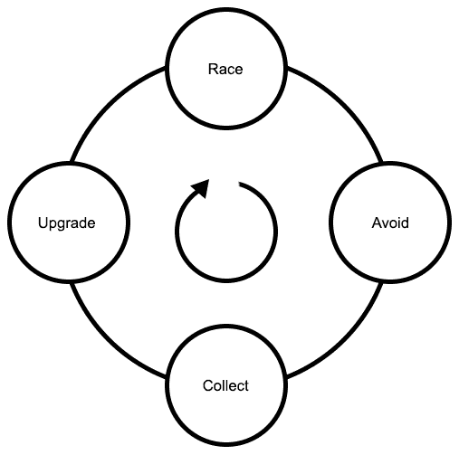
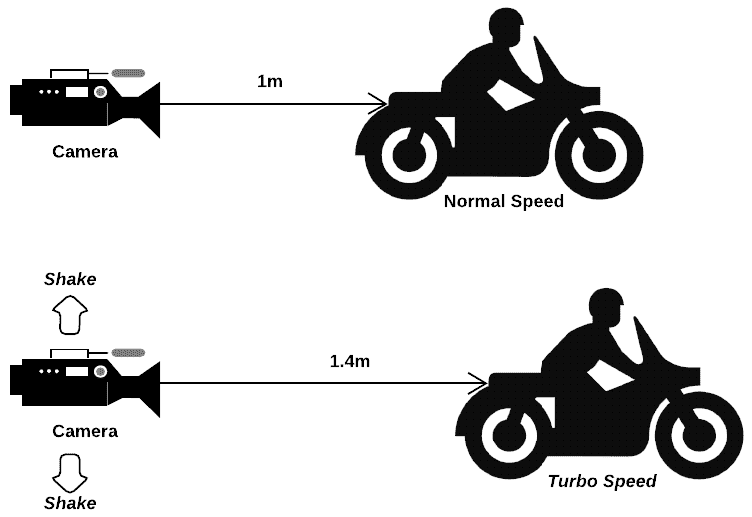
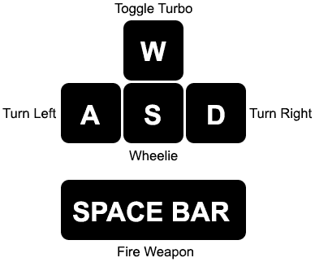
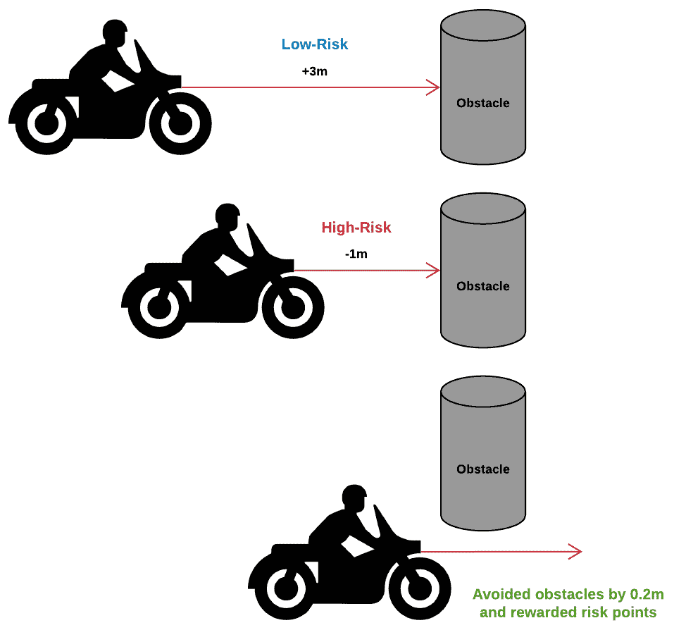

游戏设计文档

在我们开始编写代码之前，我们需要完成游戏开发周期中的一个关键步骤，那就是创建一个**游戏设计文档**（**GDD**）。GDD 是我们整个项目的蓝图；它的主要目的是将游戏核心概念的整体愿景记录在纸上，并在漫长的生产周期中为多学科开发团队提供指导。

GDD 可以包括以下元素的详细描述：

+   核心视觉、动画和音频成分列表

+   概要、角色传记和叙事结构

+   市场调研材料和货币化策略

+   说明和图解系统与机制描述

在大多数情况下，游戏设计师负责编写和维护 GDD，而游戏程序员负责在文档中实现所描述的系统和方法。因此，程序员和设计师在整个制定 GDD 的过程中必须相互反馈。如果双方不能合作，游戏设计师将编写出在合理时间内无法实现系统的方案。或者程序员会浪费时间编写有缺陷设计的游戏系统代码。

考虑到这本书的重点是编程而不是游戏设计，我将展示一个简化和简短的 GDD 版本，用于我们在本书中将要工作的游戏项目。*文档部分还将包括一些针对不熟悉分析 GDD 流程的人的提示和注意事项。*

由于篇幅原因，我没有提及艺术家、动画师和音频工程师在起草 GDD 过程中的参与。但他们的参与是至关重要的，因为他们需要知道他们需要生产多少资产来实现游戏的总体愿景。

在本章中，我们将涵盖以下主题：

+   游戏概要和核心机制概述

+   核心游戏循环和目标解释

+   游戏成分和系统列表

# 第四章：设计文档

以下游戏设计文档被划分为几个部分，代表整个项目中的各个独立兴趣点。例如，游戏的概要部分可能对那些专注于游戏叙事元素的人来说很有兴趣。同时，关于最低要求和系统的部分则面向程序员。但无论我们的专业是什么，阅读整个设计文档并在开始工作之前对项目有一个完整的心理模型都是良好的实践。

## 游戏概述

**刀锋赛车手**（*暂定名称*）是一款未来主义街机赛车游戏，玩家试图控制一辆超高速摩托车穿越障碍赛道，以最高分到达终点线。赛道建立在铁路系统之上，玩家可以在轨道之间操控车辆以避开障碍。在路径上，轨道系统在战略位置生成拾取物品，为玩家提供速度和护盾加成。只有反应敏捷的玩家才能以最快的时间穿过终点线，而不损坏他们的摩托车。

**暂定名称**是项目生产期间使用的临时名称。它不是最终的，当项目准备发布时可以更改。

## **独特卖点**

以下是一些潜在的独特卖点：

+   国际排行榜，全球玩家可以竞争，将自己的名字列入榜单之首

+   市场上最具挑战性的赛车游戏

+   该游戏可以在任何设备上玩，从手机到 PC

如果与发行商合作，在 GDD（游戏设计文档）中拥有独特的卖点很好。这展示了你对最终产品的愿景以及你将如何进行市场推广。请注意，上述示例是占位符，并非最终结论。

## **最低要求**

以下是目前目标平台的最低要求：

**对于移动设备**：

+   **操作系统**：Android 10

+   **型号**：三星 S9

**对于 PC**：

+   **操作系统**：Windows 10

+   **显卡**：Nvidia GTX 980

    *^(*我们将支持与指定 GTX 卡同一代的等效 ATI 卡。)*

在项目初期就指定最低平台要求对游戏程序员非常有好处。资源有限的平台将要求对游戏的可视资产和代码库进行更多优化，以确保所有目标设备上都能以稳定的帧率运行。

## **游戏简介**

2097 年。人类已经掌握了地球，现在将目光投向了太阳系边缘之外，希望面对新的挑战和发现新的世界。随着全球和平的降临，那些尚未离开地球的人们体验到了一种新的集体无聊。得益于技术和生物黑客技术，过去的所有挑战都已消失。任何人都可以不费吹灰之力成为顶尖运动员、美丽和有才华的人。

感受到全球人口不断增长的不安情绪，古怪的技术企业家和千亿富翁 Neo Lusk 决定发明一项新的运动，这项运动涉及超高速摩托车，其速度是大多数人类难以驾驭的。为了使其更具挑战性，他设计了一种独特的赛道系统，包括轨道和障碍物。

这种新的运动激发了全球人民的热情，数百万人决定参加。但很少有人能够控制这些高科技自行车，并在致命的障碍布局中操控它们。只有那些真正具有钢铁般的神经和像刀刃一样敏锐的反射能力的人才能掌握这项运动，但到目前为止，世界都在等待知道谁将成为第一个被加冕为冠军的人。

尽管我们当前的项目是一个街机赛车游戏，这种类型通常故事性不强但游戏性很强，但仍然有一些叙事元素为游戏世界提供一些背景信息是好的。这激发了玩家的想象力，并为游戏赋予了整体意义。即使是经典的街机游戏，如《吃豆人》和《导弹命令》，也都有一定程度的叙事成分，产生了一种你在虚拟世界中扮演角色的感觉。

## 游戏目标

核心目标（即玩家目标）的列表如下：

+   主要目标（即**胜利状态**）是顺利通过终点线，没有任何致命的碰撞。

+   次要目标是通过在避障时采取冒险的赛道来获得“风险”分数，以获得最佳成绩。

+   作为一项额外目标，玩家可以通过收集分布在赛道上的特定数量的收集物品（即**拾取物**）来获得额外分数。*这个目标针对的是“完美主义者”。*

+   游戏的最终目标是获得最高分，同时以最快的速度完成比赛。

一个好的游戏设计师会始终设计几个目标来满足各种类型的玩家，以尽可能长时间地保持他们的参与度。例如，具有“完美主义者”心态的玩家不仅仅想要完成游戏，而是通过实现每一个可能的目标和收集每一个可收集物品来完整地完成游戏。

玩家可以通过以下行为在实现核心目标时失败（即**失败状态**）：

+   主要的“失败状态”是在玩家由于致命碰撞而没有到达终点线时触发的。

+   如果激活了检查点游戏模式，玩家会因为未能及时通过每个检查点而失败。

在游戏早期就明确定义所有可能的“失败条件”也是一个好的实践，因为这有助于分析我们需要处理多少种不同的胜利和失败状态。

## 游戏规则

游戏关卡是一个开放环境，玩家控制一辆在由四条轨道组成的轨道系统上高速行驶的摩托车。玩家可以横向操控车辆以避开障碍物或捕获沿轨道生成的“拾取”物品。玩家必须在最短的时间内到达沿路径设置的检查点，同时通过避开障碍物来避免损坏车辆，从而到达终点线。玩家可以通过选择风险较高的赛道，如转弯避开几乎与之碰撞的障碍物来获得分数。玩家还可以通过按正确顺序捕获一定数量的“拾取”物品来获得额外分数。

## 游戏循环

以下图示展示了核心游戏循环：

图 2.1 – 核心游戏循环图

游戏在其核心游戏循环中有四个支柱：

+   **种族**：玩家与时间赛跑，向终点线冲刺。

+   **避开**：玩家必须在尽可能快的同时避开障碍物，并冒险以获得分数。

+   **收集**：玩家可以在比赛中收集赛道上放置的物品和奖励。

+   **升级**：在比赛期间或之后，玩家可以使用收集到的物品升级车辆。

## 游戏环境

每个级别的首要设置是一个未来派的荒凉太空，有四条横跨地平线的轨道。铁路两侧有金属灯柱和障碍物。天空多云，持续的雾气遮蔽了地平线，而暴风雨时常发生。在轨道上，有各种障碍物和玩家需要避开或捕获的物品。关卡设计侧重于惩罚行动缓慢的玩家，并奖励那些快速行驶且敢于冒险的玩家。

## 摄像机、控制、角色（3Cs）

3Cs（**摄像机**、**控制**和**角色**）是 AAA 行业中在如**Ubisoft**等工作室使用的行业标准术语。它基本上表明，玩家体验的核心是由摄像机、玩家角色和控制方案之间和谐关系的平衡所定义的。如果玩家感觉到角色对输入的反应符合预期，同时摄像机无缝地定位在最佳角度，那么整体体验将更加沉浸。让我们详细看看 3Cs。

### 摄像机

主摄像机将以第三人称视角跟随车辆从后方移动。在转弯时，摄像机将自动调整并旋转到车辆方向最近的轨道对面。在涡轮加速时，摄像机将后退并轻微震动，以传达难以跟随车辆快速移动的感觉。当摩托车减速回到正常速度时，摄像机与摩托车之间的距离将迅速恢复到默认距离，如下图所示：

图 2.2 – 摄像机位置示意图

在当前的游戏版本中，将不会有第一人称或后视摄像头。

### 角色

在本节中，我们将定义主要玩家控制的角色。

#### 角色描述

主要可玩角色是人类飞行员，他驾驶一辆未来派摩托车车辆，在铁路系统上运行，并且限于以非常高的速度从一个轨道转向另一个轨道。考虑到主要可玩角色在整个游戏过程中始终在车辆驾驶舱内，我们可以将车辆和飞行员在游戏环节中视为一个可玩角色。游戏将不会有其他可玩的人形角色或可控制车辆类型。

#### 角色度量

以下部分概述了主要角色/车辆度量：

+   **最小速度**：500 km/h

    *车辆在比赛中始终在移动，永远不会完全停止。

+   **最大速度**：6,500 km/h

    *车辆只能以最大速度维持几秒钟，其操控能力将降至最低。

+   **最大健康值**：100%

    *车辆有一个以百分比计算的损伤计。

+   **攻击伤害**：*取决于武器。

    车辆没有默认的武器系统，但有一个升级槽位。

+   **操控**：*取决于当前速度。

    当车辆达到最高速度时，其操控能力会降低。

#### 角色状态

以下部分概述了主要角色/车辆状态：

+   **空闲**：车辆的空闲状态是一个动画周期，显示了底盘因引擎轰鸣而振动，以及尾灯闪烁。

+   **加速**：加速状态具有车轮转动的动画周期。

+   **减速**：减速动画会减慢车轮并闪烁尾灯。

+   **转向**：转向状态具有车辆倾斜并向最近轨道方向移动的动画。

+   **制动**：**制动动画会使车辆倾斜并在前进轨迹上向侧面滑动。此状态仅在玩家越过终点线后激活。

+   **震动**：**随着车辆在最高速度时操控能力的降低，震动动画的强度会增加。

+   **翻转**：当车辆与路障障碍物碰撞时，翻转动画会将车辆向前翻转。

+   **滑动**：滑动动画将车辆转向并向前滑动。

从一开始，设计和编程团队就定义游戏中每种可玩的可控角色、设备或车辆的类型非常重要。主要是因为为汽车或两足人形角色实现 3Cs 需要不同的方法。就像在现实世界中，驾驶和行走是不同类型的有特定机械复杂性的体验。

### 控制器

以下部分概述了主要控制器方案，即键盘：

图 2.3 – 键盘输入键图

由于简单性的原因，我们将仅支持键盘作为本书游戏项目的首选输入设备。

## 游戏成分

下文概述了核心游戏成分：

+   **摩托车** 是游戏中的主要车辆，可以由玩家或 **AI**（**人工智能**）控制。

+   **收集物** 是在轨道上生成并由玩家通过与之碰撞来拾取的物品。每种类型的物品都将具有独特的形状，并将在轨道上方漂浮几英寸。

+   **障碍物** 是在轨道上生成的环境成分。某些类型的障碍物实体可能会损坏车辆，而其他障碍物则会阻挡车辆并导致其撞车。

+   **武器** 是可以附加到玩家车辆上的可用槽位的组件。玩家的武器组件基于激光，并允许他们摧毁障碍物。

+   **无人机** 是在飞行模式中飞行的机器人实体，它们用激光束攻击玩家。

### 超级摩托车

| **名称** | **描述** | **升级槽** | **操控性** | **最高速度** |
| --- | --- | --- | --- | --- |
| 毒液 | 初级赛车手的入门级模型。 | 1 | 80% | 1,900 km/h |
| 银弹 | 中级赛车手的高级模型 | 2 | 60% | 4,000 km/h |
| 死亡骑士 | 最先进的模型，只有顶尖玩家才能访问。 | 4 | 40% | 6,500 km/h |

摩托车的操控性由车辆对玩家输入的响应速度来定义。随着速度的增加，整体稳定性会降低。因此，摩托车在转弯时会开始滑动，并且需要更长的时间来稳定并对玩家的命令做出反应。

### 收集物

| **名称** | **描述** | **效果** | **价值** |
| --- | --- | --- | --- |
| 可收集物品 | 一个可收集物品按顺序生成在轨道的长度上。 | 增加风险分数 | 10 风险点 |
| 加速 | 此物品在指定位置生成在轨道上。 | 填充涡轮表 | 10% 涡轮加速 |
| 损伤修复 ^(* 即健康恢复) | 此物品在特定位置生成在轨道上。 | 修复损伤 | 10% 的健康值 |

### **障碍物**

| **名称** | **描述** | **效果** | **伤害** |
| --- | --- | --- | --- |
| 轨道屏障 | 一个又高又平的屏障，可以阻挡轨道，但碰撞时会破碎。 | 造成伤害但不会停止车辆 | 20% 的健康值 |
| 路障 | 一段短栅栏通过使车辆向前翻滚并撞车来阻止车辆。  | 停止车辆 | 10o% 的健康值 |

### 武器装备

| **名称** | **描述** | **效果** | **范围** |
| --- | --- | --- | --- |
| 激光射手 | 单个射线投射武器 | 摧毁范围内的所有物体 | 10 米 |
| 等离子炮 | 多个射线投射武器 | 摧毁范围内的所有物体和 60 度视野内的物体 | 20 米 |

## 游戏系统

下文概述了核心游戏系统：

+   **铁路系统** 铁路系统允许玩家的车辆在四条独立的轨道上横向行驶。每条轨道都可以在其长度上生成障碍物和收集物。

+   **风险系统** 风险系统奖励那些敢于冒险的玩家，例如在最高速度下及时避开障碍物。所给的分数基于玩家避开障碍物时车辆与障碍物之间的距离。安装在自行车前方、范围为 5 米的传感器会持续监控当前赛道上的任何障碍物。一旦检测到潜在的碰撞，传感器就会计算障碍物与车辆之间的距离。分数是根据玩家避开障碍物时的距离来确定的。

下图展示了前向传感器：

图 2.4 – 前向传感器检测障碍物的示意图

+   **涡轮加速系统**

    **涡轮加速系统**（**TBS**）允许车辆达到其最高速度。要激活系统，玩家必须通过拾取涡轮加速物品来填充涡轮表。TBS 系统在**抬头显示**（**HUD**）上有一个量表，允许玩家可视化可用的涡轮加速量。当 TBS 激活时，车辆操控性降低，更容易受到伤害。

+   **车辆升级系统**

    玩家的车辆有物品槽位，允许他们安装武器和其他升级。根据车辆类型的不同，槽位数量会有所变化。

游戏机制和系统之间的区别有时会引起混淆。在这本书中，我将定义游戏系统为一组游戏机制和元素。例如，武器拾取是元素，但在战场上拾取它们并在库存菜单中选择正确的武器以赢得战斗的动作是单独的机制。但所有这些元素都是整个武器系统的独立组成部分。

## 游戏菜单

在本节中，我们将概述游戏菜单：

**主菜单**：主菜单将在游戏开始时可用。菜单选项如下：

+   **开始比赛**：此选项加载比赛赛道场景。

+   **分数**：此选项显示最新的前 10 名分数。

+   **退出**：此选项关闭游戏窗口。

**游戏内菜单**：游戏内菜单仅在比赛中可访问。菜单选项如下：

+   **重新开始比赛**：从比赛开始处重新开始

+   **退出比赛**：将玩家送回大厅场景

## 游戏 HUD

以下部分概述了游戏的**抬头显示**（**HUD**）：

头戴式显示器（HUD）仅在比赛中显示，并将包括以下界面组件：

+   **涡轮表**

+   **速度表**

+   **伤害表**

+   **倒计时计时器**

+   **赛道进度条**

通常，游戏菜单和 HUD 的最终设计是在生产后期阶段完成的。主要是因为游戏的整体设计、艺术风格和结构在生产早期阶段可能会改变几次，因此，菜单的流程和 HUD 组件的布局会不断变化。

# 摘要

在本章中，我们花时间回顾了本书游戏项目的当前设计文档草案。这个 GDD 的草案可能并不完整或完美，但通常游戏项目都是从设计文档不完整和想法阶段开始的。所以，我们花时间来审查它仍然是好的。我们不会实现本书中描述的每一个系统、机制和成分，因为我们的主要目标是通过对游戏进行构建来学习设计模式，而不一定是构建一个完整的游戏。

尽管游戏设计不是本书的主要内容，但学会像设计师一样思考是一种只能帮助任何人成为更好的游戏程序员的技能。阅读设计文档有助于我们理解游戏愿景、结构、机制和范围。在做出软件架构决策时，这些都是需要记住的事情。

下一章包括对基本 Unity 编程基础的一个简要介绍。如果你已经是一位经验丰富的程序员，你可以跳到书中的实践部分。但如果你是初学者，我建议在实施即将到来的章节的设计模式之前先阅读这个简介。

# 进一步阅读

如需更多信息，你可以参考以下书籍：

+   由 Jesse Schell 所著的《*游戏设计艺术*》

+   由 Marc Saltzman 所著的《*游戏设计：圣贤的秘密*》

+   由 Scott Rogers 所著的《*提升游戏设计水平：游戏设计指南*》

+   由 Katie Salen 和 Eric Zimmerman 所著的《*游戏设计基础：游戏规则*》
