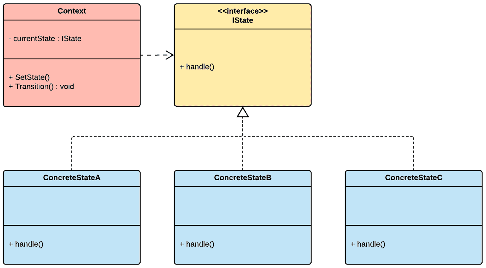
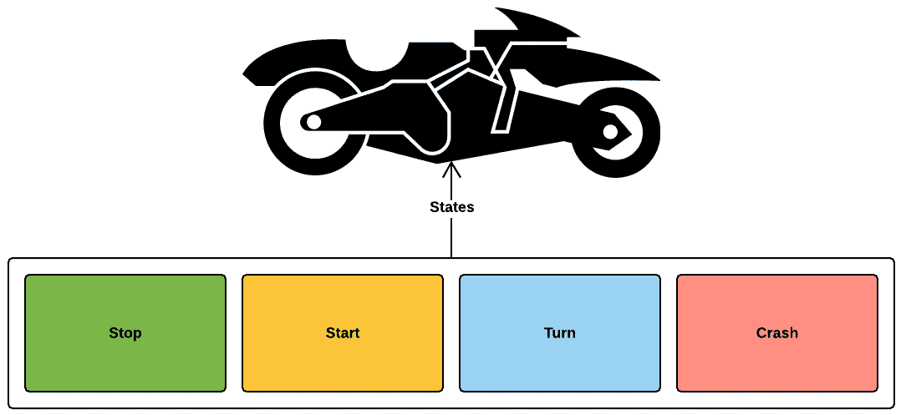
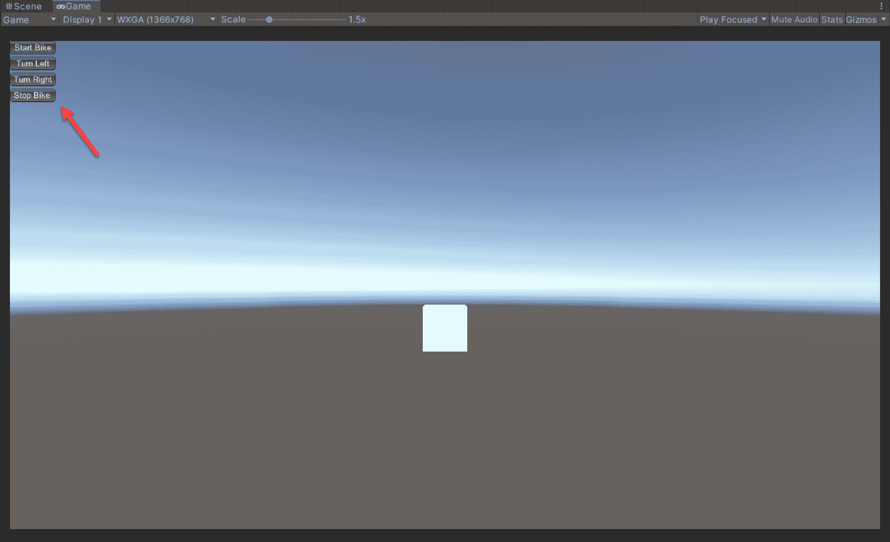
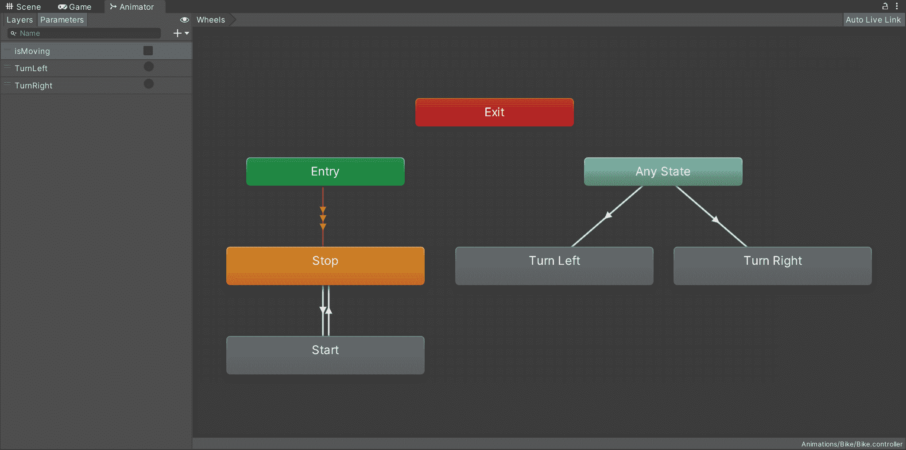

使用状态模式管理角色状态

在视频游戏中，实体根据玩家输入或事件不断从一个状态转换到另一个状态。一个敌人角色可能会从空闲状态转换到攻击状态，这取决于它是否看到玩家在地图上移动。玩家角色会不断从一个动画转换到另一个动画，以响应玩家的输入。在本章中，我们将回顾一个允许我们定义实体的单个状态及其状态行为的模式。

首先，我们将使用传统的状态模式来管理我们主要角色的单个有限状态。在我们的赛车游戏项目中，主要角色是一辆摩托车，因此它有一套机械行为和动画。随着我们对状态模式的实现进展，我们很快就会看到其局限性，我们将通过引入 FSM（有限状态机）概念来克服这些局限性。

我们不会手动编写 FSM，而是探索 Unity 原生动画系统中的原生状态机实现。因此，本章将提供两种方法，介绍状态模式的核心概念，以及如何重新利用 Unity 的动画系统来管理角色状态和动画。

在本章中，我们将涵盖以下主题：

+   状态模式概述

+   将状态模式实现为管理主要角色状态

# 技术要求

本章是实践性的。你需要对 Unity 和 C#有基本的了解。

本章的代码文件可以在 GitHub 上找到，地址为[`github.com/PacktPublishing/Game-Development-Patterns-with-Unity-2021-Second-Edition/tree/main/Assets/Chapters/Chapter05`](https://github.com/PacktPublishing/Game-Development-Patterns-with-Unity-2021-Second-Edition/tree/main/Assets/Chapters/Chapter05)。

查看以下视频以查看代码的实际运行效果：[`bit.ly/36EbbHe`](https://bit.ly/36EbbHe)

# 状态模式概述

我们使用状态设计模式来实现一个系统，允许对象根据其内部状态改变其行为。因此，上下文的变化将导致行为的变化。

状态模式在其结构中有三个核心参与者：

+   `Context` 类定义了一个接口，允许客户端请求改变对象的内部状态。它还持有当前状态的指针。

+   `IState` 接口为具体状态类建立了一个实现合同。

+   `ConcreteState` 类实现了 `IState` 接口，并公开了一个名为 `handle()` 的方法，`Context` 对象可以调用此方法来触发状态的行为。

现在我们来回顾一下这个模式定义的图表，但是在实际实现的环境中：



图 5.1 – 状态模式的 UML 图

要更新一个对象的状态，客户端可以通过`Context`对象设置预期的状态并请求转换到新状态。因此，上下文总是知道它所处理的对象的当前状态。然而，它不需要熟悉每个具体的州类。我们可以添加尽可能多的州类，而无需修改`Context`类中的一行代码。

例如，这种方法比在单个类中定义所有状态并使用 switch case 管理它们之间的转换具有更好的可扩展性，正如我们可以在以下伪代码示例中看到：

```cs
public class BikeController
{
  ....  
    switch (state)
    {
        case StopState:
            ...
            break;
        case StarState:
            ...
            break;
        case TurnState:
            ...
            break;
}
```

现在我们已经对状态模式的结构有了基本的了解，我们可以开始定义我们主要角色的状态和行为，在这个案例中，是自行车，正如我们将在下一节中看到的。

# 定义角色状态

在我们的游戏中，将在状态之间转换最多的实体是我们的赛车。它处于玩家的控制之下；它与环境中的几乎所有元素互动，包括障碍物和敌机。因此，它将不会长时间停留在同一状态。

以下图表展示了我们自行车的有限状态列表：



图 5.2 – 说明自行车有限状态的图表

现在让我们定义一些对于所列状态的一些预期行为：

+   **停止**：在这个状态下，自行车没有移动。它的当前速度为零。它的档位设置为空档。如果我们决定在那个状态下发动机应该开启，但以怠速模式运行，我们可以在自行车底盘上添加一个振动的动画来显示发动机正在运行。

+   **启动**：在这个状态下，自行车以全速行驶，车轮转动以匹配前进运动。

+   **转向**：在转向状态下，自行车根据玩家的输入向左或向右转向。

+   **碰撞**：如果自行车处于碰撞状态，这意味着它着火了，并且侧翻在地。车辆将不再对玩家的输入做出反应。

这些只是对我们车辆潜在状态的未经打磨的定义。我们可以根据需要细化到非常具体，但就我们的用例而言，这已经足够了。

必须记住，每个状态的定义都包含了行为和动画的描述。在下一节中编写和审查我们实现状态模式时，这些要求将是必须考虑的。

# 实现状态模式

在本章的这一部分，我们将实现状态模式，明确的目标是封装我们在上一节中定义的每个车辆有限状态的预期行为。

我们将专注于编写简洁的骨架类，以简明扼要和清晰。这种方法将使我们能够专注于模式的结构，而不会被实现细节所拖累。

还需要注意的是，本书中展示的状态模式版本可能有些不寻常，因为它与传统方法有些偏差。因此，它应该被视为适应 Unity 项目上下文和特定用例的状态模式的排列组合。

## 实现状态模式

我们将分几个步骤回顾我们的代码示例：

1.  让我们先写下每个具体状态类将实现的接口：

```cs
namespace Chapter.State
{
    public interface IBikeState
    {
        void Handle(BikeController controller);
    }
}
```

我们应该注意，我们在`Handle()`方法中传递了一个`BikeController`的实例。这种方法允许状态类访问`BikeController`的公共属性。这种方法可能略偏离传统，因为通常是将`Context`对象传递给状态。

然而，没有任何阻止我们将`Context`对象和`BikeController`实例传递给状态类。或者，我们可以在初始化每个状态类时设置`BikeController`的实例引用。

然而，对于这个用例来说，这样做更简单。

1.  现在我们有了接口，让我们来实现上下文类：

```cs
namespace Chapter.State
{
    public class BikeStateContext
    {
        public IBikeState CurrentState
        {
            get; set;
        }

        private readonly BikeController _bikeController;

        public BikeStateContext(BikeController bikeController)
        {
            _bikeController = bikeController;
        }

        public void Transition()
        {
            CurrentState.Handle(_bikeController);
        }

        public void Transition(IBikeState state)
        {
            CurrentState = state;
            CurrentState.Handle(_bikeController);
        }
    }
}
```

如我们所见，`BikeStateContext`类公开了一个属性，指向自行车的当前状态；因此，它知道任何状态变化。因此，我们可以通过其属性更新我们实体的当前状态，并通过调用`Transition()`方法进入该状态。

例如，如果我们想通过让每个状态类声明链中的下一个状态来将状态链接在一起，这种机制是有益的。然后，我们可以通过简单地调用`Context`对象的`Transition()`方法来遍历链接的状态。然而，对于我们的用例来说，这种方法是不必要的，因为我们将会调用重载的`Transition()`方法，并简单地传递我们想要转换到的状态。

1.  接下来是`BikeController`。这个类初始化`Context`对象和状态，并且触发状态变化：

```cs
using UnityEngine;

namespace Chapter.State {
    public class BikeController : MonoBehaviour {

        public float maxSpeed = 2.0f;
        public float turnDistance = 2.0f;

        public float CurrentSpeed { get; set; }

        public Direction CurrentTurnDirection {
            get; private set;
        }

        private IBikeState 
            _startState, _stopState, _turnState;

        private BikeStateContext _bikeStateContext;

        private void Start() {
            _bikeStateContext = 
                new BikeStateContext(this);

            _startState = 
                gameObject.AddComponent<BikeStartState>();
            _stopState = 
                gameObject.AddComponent<BikeStopState>();
            _turnState = 
                gameObject.AddComponent<BikeTurnState>();

            _bikeStateContext.Transition(_stopState);
        }

        public void StartBike() {
            _bikeStateContext.Transition(_startState);
        }

        public void StopBike() {
            _bikeStateContext.Transition(_stopState);
        }

        public void Turn(Direction direction) {
            CurrentTurnDirection = direction;
            _bikeStateContext.Transition(_turnState);
        }
    }
}
```

如果我们没有将自行车的行为封装在单独的状态类中，我们可能会在`BikeController`中实现它们。这种方法可能会导致控制器类膨胀，难以维护。因此，通过使用状态模式，我们使我们的类更小，更容易维护。

我们还将把`BikeController`的原始职责，即控制自行车的核心组件，归还给它。它的存在是为了提供一个控制自行车的接口，公开其可配置属性，并管理其结构依赖。

1.  以下三个类将成为我们的状态；它们相当直观。注意，每个都实现了`IBikeState`接口。让我们从`BikeStopState`开始：

```cs
using UnityEngine;

namespace Chapter.State
{
    public class BikeStopState : MonoBehaviour, IBikeState
    {
        private BikeController _bikeController;

        public void Handle(BikeController bikeController)
        {
            if (!_bikeController)
                _bikeController = bikeController;

            _bikeController.CurrentSpeed = 0;
        }
    }
}
```

1.  下一个状态类是`BikeStartState`：

```cs
using UnityEngine;

namespace Chapter.State
{
    public class BikeStartState : MonoBehaviour, IBikeState
    {
        private BikeController _bikeController;

        public void Handle(BikeController bikeController)
        {
            if (!_bikeController)
                _bikeController = bikeController;

            _bikeController.CurrentSpeed = 
                _bikeController.maxSpeed;
        }

        void Update()
        {
            if (_bikeController)
            {
                if (_bikeController.CurrentSpeed > 0)
                {
                    _bikeController.transform.Translate(
                        Vector3.forward * (
                            _bikeController.CurrentSpeed * 
                            Time.deltaTime));
                }
            }
        }
    }
}
```

1.  最后，还有`BikeTurnState`，它可以使自行车向左或向右转弯：

```cs
using UnityEngine;

namespace Chapter.State
{
    public class BikeTurnState : MonoBehaviour, IBikeState
    {
        private Vector3 _turnDirection;
        private BikeController _bikeController;

        public void Handle(BikeController bikeController)
        {
            if (!_bikeController)
                _bikeController = bikeController;

            _turnDirection.x = 
                (float) _bikeController.CurrentTurnDirection;

            if (_bikeController.CurrentSpeed > 0)
            {
                transform.Translate(_turnDirection *
                                    _bikeController.turnDistance);
            }
        }
    }
}
```

1.  对于我们的最终类`BikeController`，它引用了一个名为`Direction`的枚举，我们将在下面实现它：

```cs
namespace Chapter.State
{
 public enum Direction
 {
 Left = -1,
 Right = 1
 }
}
```

我们现在已经准备好了所有配料，可以测试我们的状态模式实现。

## 测试状态模式实现

要快速测试你在 Unity 实例中状态模式的实现，你需要遵循以下步骤：

1.  将我们刚刚审查的所有脚本复制到你的 Unity 项目中。

1.  创建一个新的空场景。

1.  向场景中添加一个 3D GameObject，例如一个立方体，确保它对主摄像机可见。

1.  将`BikeController`脚本附加到 GameObject 上。

1.  还将以下客户端脚本附加到 GameObject 上：

```cs
using UnityEngine;

namespace Chapter.State
{
    public class ClientState : MonoBehaviour
    {
        private BikeController _bikeController;

        void Start()
        {
            _bikeController =
                (BikeController)
                FindObjectOfType(typeof(BikeController));
        }

        void OnGUI() 
        {
            if (GUILayout.Button("Start Bike"))
                _bikeController.StartBike();

            if (GUILayout.Button("Turn Left"))
                _bikeController.Turn(Direction.Left);

            if (GUILayout.Button("Turn Right"))
                _bikeController.Turn(Direction.Right);

            if (GUILayout.Button("Stop Bike"))
                _bikeController.StopBike();
        }
    }
}
```

一旦你开始场景，你应该在你的屏幕上看到以下 GUI 按钮，你可以使用它们通过触发状态变化来控制 GameObject：



图 5.3 – 代码示例的截图

在本书的下一节中，我们将回顾状态模式的优点，但也会讨论其局限性。

# 状态模式的优缺点

以下使用状态模式的优点：

+   **封装**：状态模式允许我们将一个实体的状态行为实现为一个组件集合，当它改变状态时，可以动态地分配给对象。

+   **维护**：我们可以轻松实现新状态，而无需修改长的条件语句或臃肿的类。

然而，当我们使用状态模式来管理一个动画角色时，它确实有其局限性。

这里是一个潜在局限性的简短列表：

+   **混合**：在原生形式中，状态模式不提供混合动画的解决方案。当你想要在角色的动画状态之间实现平滑的视觉过渡时，这种限制可能会成为一个问题。

+   **转换**：在我们的模式实现中，我们可以轻松地在状态之间切换，但我们没有定义它们之间的关系。因此，如果我们希望根据关系和条件定义状态之间的转换，我们可能需要编写更多的代码；例如，如果我想让空闲状态转换到行走状态，然后行走状态转换到奔跑状态。这会根据触发器或条件自动和顺畅地来回转换。在代码中这样做可能会很耗时。

然而，上述限制可以通过使用 Unity 动画系统和其原生状态机来克服。我们可以轻松定义动画状态，并将动画剪辑和脚本附加到配置的每个状态上。但它的更重要特性是，它允许我们通过可视化编辑器定义和配置状态之间的一系列转换，条件触发器，正如我们在这里看到的：



图 5.4 – Unity 动画系统编辑器的截图

呈现的矩形代表单个动画状态，箭头表示关系和转换。深入探讨如何使用 Unity 动画超出了本书的范围。本章的目标是在 Unity 引擎的上下文中介绍状态模式。正如我们所见，Unity 为我们提供了一个原生解决方案，我们可以利用它来管理我们角色的动画状态。

必须记住，这个工具不仅限于动画人形角色。我们可以用它来处理机械实体，如汽车，甚至背景元素，如自动售货机；因此，任何具有状态、动画和行为的东西。

在下一节中，我们将审查在使用状态模式之前需要考虑的替代模式短名单。

关于 Unity 动画系统的更多信息，您可以在以下链接的官方文档中阅读：

[`docs.unity3d.com/Manual/AnimationSection.html`](https://docs.unity3d.com/Manual/AnimationSection.html)。

# 审查替代方案

下面的列表是相关或作为状态模式替代方案的模式的列表：

+   **黑板/行为树**：如果你计划为 NPC 角色实现复杂的 AI 行为，我建议考虑黑板或行为树等模式。例如，如果你需要实现具有动态决策行为的 AI，那么行为树（BT）是一个更合适的方法，因为它允许你使用动作树来实现行为。

+   **有限状态机（FSM）**：在讨论状态模式时，经常出现的一个问题是有限状态机（FSM）与状态模式之间的核心区别。简短的回答是，状态模式关注封装对象的状态相关行为。然而，FSM 在基于特定输入触发器在有限状态之间转换方面涉及更深。因此，FSM 通常被认为更适合实现类似自动机的系统。

+   **备忘录（Memento）**：备忘录与状态模式类似，但具有一个额外功能，使对象能够回滚到之前的状态。这种模式在实现需要能够撤销对其自身所做的更改的系统时可能很有用。

# 摘要

在本章中，我们能够利用状态模式来定义和实现我们主要角色的状态化行为。在我们的案例中，这个角色是一辆车。在特定代码示例的上下文中审查其结构后，我们看到了它在处理动画实体时的局限性。然而，Unity 为我们提供了一个原生解决方案，允许我们使用复杂的状态机和可视化编辑器来管理动画角色的状态。

然而，这并不意味着在 Unity 中状态模式本身是无用的。我们可以轻松地将其用作构建状态化系统或机制的基础。

在下一章中，我们将定义我们赛车游戏的全球状态，并使用事件总线来管理它们。
