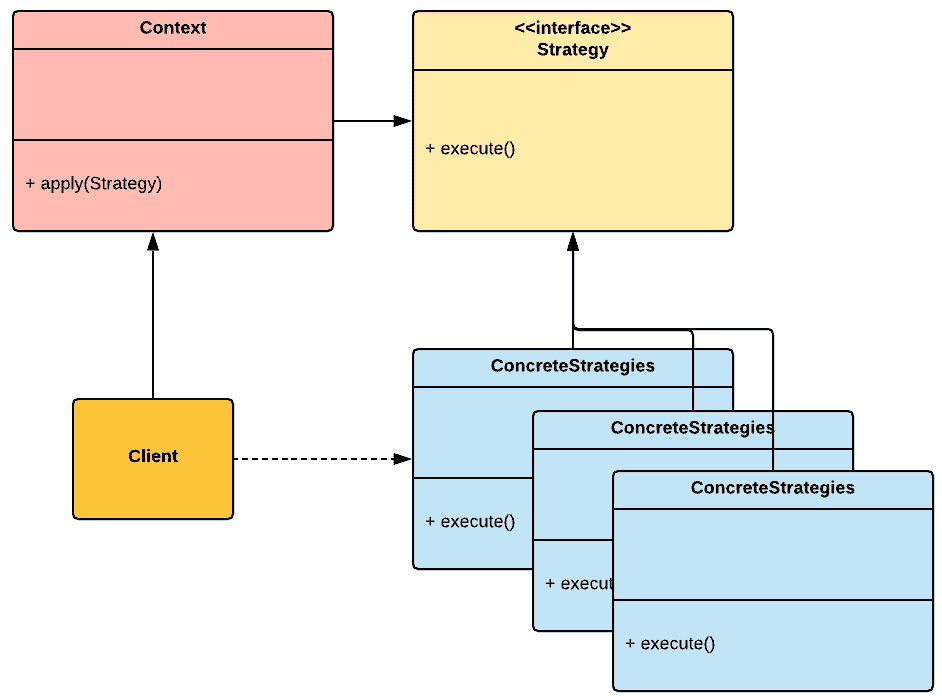
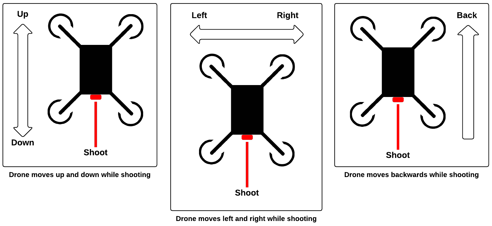
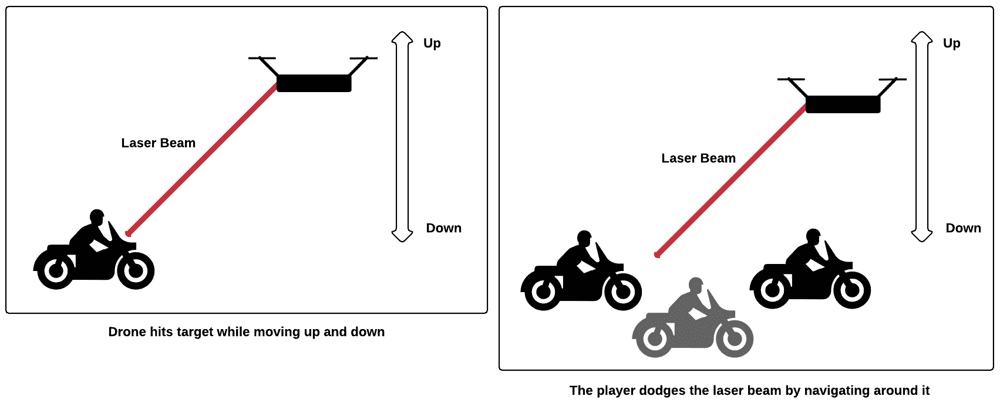
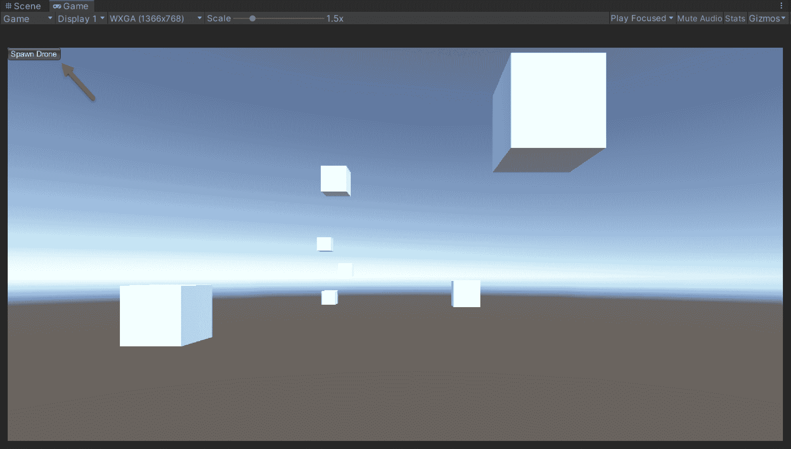

使用策略模式实现无人机

在本章中，我们将实现绕着赛道飞行并射击激光束攻击玩家的敌机无人机。它们是小小的讨厌的机器人害虫，将测试玩家的反应能力。我们的无人机将有一种单一的攻击方式，即以 45 度角发射连续的激光束。为了创造自主智能的错觉，无人机可以在运行时分配三种不同的攻击动作。每个动作都是一个可预测运动的重复序列。单独来看，无人机的行为可能看起来很机械，但当我们把它们放在赛道特定位置上时，它们可能看起来像是在制定策略以战胜玩家。

因此，我建议我们使用策略模式来实现各种无人机行为。选择这个模式的主要原因是因为它允许我们在运行时为对象分配特定的行为。但首先，让我们分析一下模式的规范和我们的敌机无人机的设计意图。

为了简洁和清晰，本章包括简化的代码示例。如果你希望在一个实际游戏项目中查看模式的完整实现，请打开 GitHub 项目中的 `FPP` 文件夹。你可以在 *技术要求* 部分找到链接。

在本章中，我们将涵盖以下主题：

+   策略模式的概述

+   实现敌机无人机攻击行为

# 技术要求

本章是实践性的，因此你需要对 Unity 和 C# 有基本的了解。

本章的代码文件可以在 GitHub 上找到，地址为 [`github.com/PacktPublishing/Game-Development-Patterns-with-Unity-2021-Second-Edition/tree/main/Assets/Chapters/Chapter11`](https://github.com/PacktPublishing/Game-Development-Patterns-with-Unity-2021-Second-Edition/tree/main/Assets/Chapters/Chapter11)。

查看以下视频以查看代码的实际效果：[`bit.ly/2TdeoL4`](https://bit.ly/2TdeoL4)[.](https://bit.ly/2TdeoL4)

# 理解策略模式

策略模式的主要目标是推迟在运行时决定使用哪种行为的决策。这是因为策略模式允许我们定义一组封装在称为策略的单独类中的行为。每个策略都是可互换的，并且可以被分配给目标上下文对象以改变其行为。

让我们通过这个 UML 图来可视化模式的关键元素：



图 11.1 – 策略模式的 UML 图

下面是这个模式的关键角色的分解：

+   **上下文** 是使用各种具体策略类并通过策略接口与它们交互的类。

+   **策略** 接口对所有具体策略类都是通用的。它公开了一个方法，`上下文` 类可以使用它来执行策略。

+   **具体策略**类，也称为**策略**，是算法/行为变体的具体实现，这些变体可以在运行时应用于`上下文`对象。

目前，这些概念可能听起来非常抽象，但在实践中，它们很容易理解，正如我们将在本书后面看到的。

策略模式是一种行为软件设计模式；其最接近的亲戚是状态模式。我们可以使用两者来封装一组行为在单独的类中。当你想在运行时选择一个行为并将其应用于对象时，你应该使用策略模式。你还可以在想要对象在内部状态改变时改变其行为时使用状态模式。

## 策略模式的优缺点

策略模式的一些优点如下：

+   **封装**: 这种模式的一个明显优点是它强制算法的变体被封装在单独的类中。因此，这有助于我们避免使用长条件语句，同时保持代码结构化。

+   **运行时**: 这种模式的主要优点是实现了一种机制，允许我们在运行时交换对象使用的算法。这种方法使我们的对象更加动态和易于扩展。

以下是一些策略模式的潜在缺点：

+   **客户**: 客户类必须了解它们所实现的算法的个体策略和变体，以便知道选择哪一个。因此，客户负责确保对象在其生命周期内表现如预期。

+   **混淆**: 由于策略模式和状态模式在结构上非常相似，但意图不同，因此在选择使用哪一个以及在使用上下文时可能会产生混淆。在大多数情况下，这不是问题，但如果你在与程序员团队合作，根据对主题知识的不同了解水平，一些同事可能不理解你选择的模式。

我认为与同事定期就架构、模式和最佳实践进行开放讨论是至关重要的。如果你能作为一个团队就使用特定设计模式时的共同方法达成一致，你最终将拥有更一致的整体架构和更干净的代码。

## 何时使用策略模式

当我被分配实现敌人角色的行为时，我首先考虑的选项是状态模式或**有限状态机**（**FSM**），因为大多数情况下，角色是有状态的。

但有时，如果满足以下条件，我可能会使用策略模式：

+   我有一个具有相同行为多个变体的实体，并且我希望将它们封装在单独的类中。

+   我希望在运行时为实体分配特定的行为变体，而无需考虑其当前内部状态。

+   我需要将一种行为应用到实体上，以便它可以根据在运行时定义的选择标准完成特定的任务。

第三个点可能是我选择使用策略模式而不是状态模式来实现本章中介绍的敌方无人机的主要原因。无人机的行为是机械的；它有一个单一的任务：攻击玩家。它不会根据内部状态的变化对其动作进行任何修改。它只需要在运行时分配攻击行为，以完成攻击玩家的任务，这使得它成为当前设计中策略模式的合适候选者。

重要的是要注意，策略模式的潜在用例不仅限于实现敌方角色。例如，我们可以用它来封装各种加密算法，以便根据目标平台应用保存的文件。或者，如果我们正在制作一款幻想游戏，我们可以用它来封装玩家可以应用于目标实体的魔法家族的各个行为。因此，这种模式的潜在用例很广泛，可以应用于各种上下文，从核心系统到游戏玩法机制。

在下一节中，我们将回顾敌方无人机的设计意图。

# 设计敌方无人机

我们游戏中的敌方无人机并不非常聪明；背后没有运行人工智能。这些是具有机器人行为的机器人，在视频游戏中，敌人具有可预测的自动化行为并在循环中运行是很常见的。例如，在原始《超级马里奥兄弟》中的 Goombas 只是朝一个方向走；他们没有意识到马里奥的存在，也不会对他做出反应。他们只是在运行一个算法，使他们沿着路径徘徊，直到撞到障碍物。单独来看，他们并不构成威胁，但如果将它们编队或定位在地图上导航困难的位置，它们就会变得难以躲避。

我们将使用相同的方法来设计我们的敌方无人机。单独来看，它们很容易被打败，因为它们不能根据玩家的动作改变行为，但在编队中，它们可能很难躲避。

我们的无人机有三种不同的攻击动作；每个动作都围绕一组特定的动作进行，这些动作是可预测的，但在无人机编队时仍然难以反击。

让我们来看看每个动作：

+   **上下摆动动作**：在上下摆动动作中，无人机以高速上下移动，同时发射激光束。

+   **穿梭动作**：对于穿梭动作，无人机以高速水平移动，同时射击。穿梭动作限制在轨道两条轨道之间的距离内。

+   **回退动作**：对于回退动作，无人机在射击的同时向后移动。无人机的最高速度可以与玩家的自行车相匹配，但只能向后移动有限的时间。

以下图示展示了前面的机动：



图 11.2 – 无人机攻击机动的示意图

敌人无人机有一件武器：一个向前发射的 45 度角激光束。以下图示展示了无人机的激光武器：



图 11.3 – 无人机武器攻击的示意图

如我们所见，玩家必须通过高速绕过无人机来避免攻击。如果被光束击中，自行车的正面护盾将损失一定量的能量。如果护盾耗尽，车辆将在下一次被击中时爆炸，游戏结束。

在下一节中，我们将把这个设计转换成代码。

# 实现敌人无人机

在本节中，我们将编写策略模式的基本实现和无人机敌人的单个攻击行为。本节中的代码在某些方面可能看起来过于简化。然而，最终目标不是实现完整的敌人无人机，而是理解策略模式的基本原理。

## 实现敌人无人机的步骤

让我们先实现策略模式的主要组成部分：

1.  我们的第一个元素是策略接口；我们所有的具体策略都将使用它：

```cs
namespace Chapter.Strategy
{
    public interface IManeuverBehaviour
    {
        void Maneuver(Drone drone);
    }
}
```

注意，我们正在将`Drone`类型的参数传递给`Maneuver()`方法。这是一个我们稍后会回顾的重要细节。

1.  接下来是我们的`Drone`类；它将使用我们的具体策略，因此在策略模式的整体结构中，我们将将其视为我们的`Context`类：

```cs
using UnityEngine;

namespace Chapter.Strategy {
    public class Drone : MonoBehaviour {

        // Ray parameters
        private RaycastHit _hit;
        private Vector3 _rayDirection;
        private float _rayAngle = -45.0f;
        private float _rayDistance = 15.0f;

        // Movement parameters
        public float speed = 1.0f;
        public float maxHeight = 5.0f;
        public float weavingDistance = 1.5f;
        public float fallbackDistance = 20.0f;

        void Start() {
            _rayDirection = 
                transform.TransformDirection(Vector3.back) 
                * _rayDistance;

            _rayDirection = 
                Quaternion.Euler(_rayAngle, 0.0f, 0f) 
                * _rayDirection;
        }

        public void ApplyStrategy(IManeuverBehaviour strategy) {
            strategy.Maneuver(this);
        }

        void Update() {
            Debug.DrawRay(transform.position, 
                _rayDirection, Color.blue);

            if (Physics.Raycast(
                transform.position,
                _rayDirection, out _hit, _rayDistance)) {

                if (_hit.collider) {
                    Debug.DrawRay(
                        transform.position, 
                        _rayDirection, Color.green);
                }
            }
        }
    }
}
```

这个类中的大多数代码行都是用于射线投射调试信息；我们可以安全地忽略它们。然而，以下部分是理解的关键：

```cs
public void ApplyStrategy(IManeuverBehaviour strategy)
{
    strategy.Maneuver(this);
}
```

`ApplyStrategy()`方法包含了策略模式的核心机制。如果我们仔细观察，我们可以看到，相关的方法接受一个`IManeuverBehaviour`类型的具体策略作为参数。这里事情变得非常有趣。一个`Drone`对象可以通过`IManeuverBehaviour`接口与其接收到的具体策略进行通信。因此，它只需要调用`Maneuver()`在运行时执行策略。因此，一个`Drone`对象不需要知道策略的行为/算法是如何执行的——它只需要了解其接口。

现在，让我们实现具体策略类：

1.  以下类实现了弹跳机动：

```cs
using UnityEngine;
using System.Collections;

namespace Chapter.Strategy {
    public class BoppingManeuver : 
        MonoBehaviour, IManeuverBehaviour { 

        public void Maneuver(Drone drone) {
            StartCoroutine(Bopple(drone));
        }

        IEnumerator Bopple(Drone drone)
        {
            float time;
            bool isReverse = false;
            float speed = drone.speed;
            Vector3 startPosition = drone.transform.position;
            Vector3 endPosition = startPosition;
            endPosition.y = drone.maxHeight;

            while (true) {
                time = 0;
                Vector3 start = drone.transform.position;
                Vector3 end = 
                    (isReverse) ? startPosition : endPosition;

                while (time < speed) {
                    drone.transform.position = 
                        Vector3.Lerp(start, end, time / speed);
                    time += Time.deltaTime;
                    yield return null;
                }

                yield return new WaitForSeconds(1);
                isReverse = !isReverse;
            }
        }
    }
}
```

1.  以下类实现了编织机动：

```cs
using UnityEngine;
using System.Collections;

namespace Chapter.Strategy {
    public class WeavingManeuver : 
        MonoBehaviour, IManeuverBehaviour {

        public void Maneuver(Drone drone) {
            StartCoroutine(Weave(drone));
        }

        IEnumerator Weave(Drone drone) {
            float time;
            bool isReverse = false;
            float speed = drone.speed;
            Vector3 startPosition = drone.transform.position;
            Vector3 endPosition = startPosition;
            endPosition.x = drone.weavingDistance;

            while (true) {
                time = 0;
                Vector3 start = drone.transform.position;
                Vector3 end = 
                    (isReverse) ? startPosition : endPosition;

                while (time < speed) {
                    drone.transform.position = 
                        Vector3.Lerp(start, end, time / speed);

                    time += Time.deltaTime;

                    yield return null;
                }

                yield return new WaitForSeconds(1);
                isReverse = !isReverse;
            }
        }
    }
}
```

1.  最后，让我们实现回退机动：

```cs
using UnityEngine;
using System.Collections;

namespace Chapter.Strategy
{
    public class FallbackManeuver : 
        MonoBehaviour, IManeuverBehaviour {

        public void Maneuver(Drone drone) {
            StartCoroutine(Fallback(drone));
        }

        IEnumerator Fallback(Drone drone)
        {
            float time = 0;
            float speed = drone.speed;
            Vector3 startPosition = drone.transform.position;
            Vector3 endPosition = startPosition;
            endPosition.z = drone.fallbackDistance;

            while (time < speed)
            {
                drone.transform.position = 
                    Vector3.Lerp(
                        startPosition, endPosition, time / speed);

                time += Time.deltaTime;

                yield return null;
            }
        }
    }
}
```

你可能已经注意到，每个类的代码相当相似，甚至在某些部分重复。这就是我们使用策略模式的原因之一——我们希望封装类似行为的变体，以便更容易单独维护。但同样，想象一下，如果我们试图在一个类中实现跳跃、穿梭和回退行为，我们的`Drone`类会多么混乱。我们可能会发现自己在一个充满条件语句的膨胀的`Drone`类中。

我不建议使用协程来动画化非人类实体。相反，我建议使用如 DOTween 之类的 Tween 引擎，因为你可以用更少的代码来动画化对象，并获得更好的效果。我们在这章中使用协程是为了避免外部依赖，并使我们的代码易于移植。要了解更多关于 DOTween 的信息，请访问 [`dotween.demigiant.com`](http://dotween.demigiant.com/)。

## 测试敌方无人机实现

现在是时候进行有趣的部分了——测试我们的实现。这将会很容易，因为我们需要做的只是将以下客户端类附加到 Unity 场景中的一个空`GameObject`上：

```cs
using UnityEngine;
using System.Collections.Generic;

namespace Chapter.Strategy {
    public class ClientStrategy : MonoBehaviour {

        private GameObject _drone;

        private List<IManeuverBehaviour> 
            _components = new List<IManeuverBehaviour>();

        private void SpawnDrone() {
            _drone = 
                GameObject.CreatePrimitive(PrimitiveType.Cube);

            _drone.AddComponent<Drone>();

            _drone.transform.position = 
                Random.insideUnitSphere * 10;

            ApplyRandomStrategies();
        }

        private void ApplyRandomStrategies() {
            _components.Add(
                _drone.AddComponent<WeavingManeuver>());
            _components.Add(
                _drone.AddComponent<BoppingManeuver>());
            _components.Add(
                _drone.AddComponent<FallbackManeuver>());

            int index = Random.Range(0, _components.Count);

            _drone.GetComponent<Drone>().
                ApplyStrategy(_components[index]);
        }

        void OnGUI() {
            if (GUILayout.Button("Spawn Drone")) {
                SpawnDrone();
            }
        }
    }
}
```

在你的 Unity 实例中，如果你在项目中包含了前面几节中编写的所有脚本，当你启动它时，你应该在屏幕上看到一个名为“Spawn Drone”的单个按钮，如下面的截图所示：



图 11.4 – 在 Unity 中运行的代码示例

如果你点击场景的主按钮，一个代表无人机实体的新立方体应该出现在一个随机位置，同时执行一个随机选择的攻击机动。

## 审查敌方无人机实现

在前面的代码示例中，客户端类充当一个生成器，随机分配一个策略给一个新的无人机实例。这对于现实世界的用例来说可能是一个有趣的方法。但是，我们还可以使用许多其他方法来选择分配给无人机的策略。这可以基于仅在运行时才知道的特定规则和因素。因此，它不仅限于随机性，还可以是确定性和基于规则的。

# 审查替代解决方案

本章中展示的代码示例有一个明显的问题。我们将攻击机动行为封装到不同的策略类中，但每个机动不过是一个在循环中运行的单一动画。因此，在一个由包括动画师在内的制作团队构建的实际游戏项目中，我不会通过使用协程或甚至一个 Tween 动画引擎在代码中动画化敌方无人机。相反，我会要求一个动画师在一个外部创作工具中创作一些详细的攻击机动动画，然后将它们作为动画剪辑导入 Unity。然后我会使用 Unity 的本地动画系统和其状态机功能来动态地将攻击机动动画分配给无人机。

如果我决定无人机可以在内部状态改变时切换攻击，那么使用这种方法，我将在动画质量和从一种攻击行为平滑过渡到另一种攻击行为之间的灵活性方面获得提升。因此，我会放弃将每个攻击行为封装到策略类中的想法，而是将它们定义为有限状态。这种切换不会在设计中引起重大变化，因为驱动有限状态机（FSM）、状态和策略模式的概念是紧密相关的。

尽管本章中展示的策略模式实现是有效的，但在管理实体的动画集时，首先考虑使用 Unity 的动画系统原生的功能是明智的。但想象另一种用例，其中我们需要实现运动检测算法的变体，并在运行时将它们分配给无人机。在这种情况下，策略模式将是构建该系统的绝佳选择。

您可以在[`docs.unity3d.com/2021.2/Documentation/Manual/AnimationOverview.html`](https://docs.unity3d.com/2021.2/Documentation/Manual/AnimationOverview.html)上阅读 Unity 原生动画系统的官方文档。

# 摘要

在本章中，我们使用了策略模式来实现游戏中的第一个敌人成分，一个会飞的、激光射击的无人机。通过使用这种模式，我们将无人机攻击动作的每个变体封装在单独的类中。这种方法通过避免拥有充满冗长条件语句的臃肿类，使我们的代码更容易维护。现在，我们可以快速编写新的攻击动作变体或调整现有的动作。因此，我们为自己提供了创造性和快速测试新想法的灵活性，这是游戏开发的重要部分。

在下一章中，我们将开始着手构建武器系统，并探索装饰者模式。
