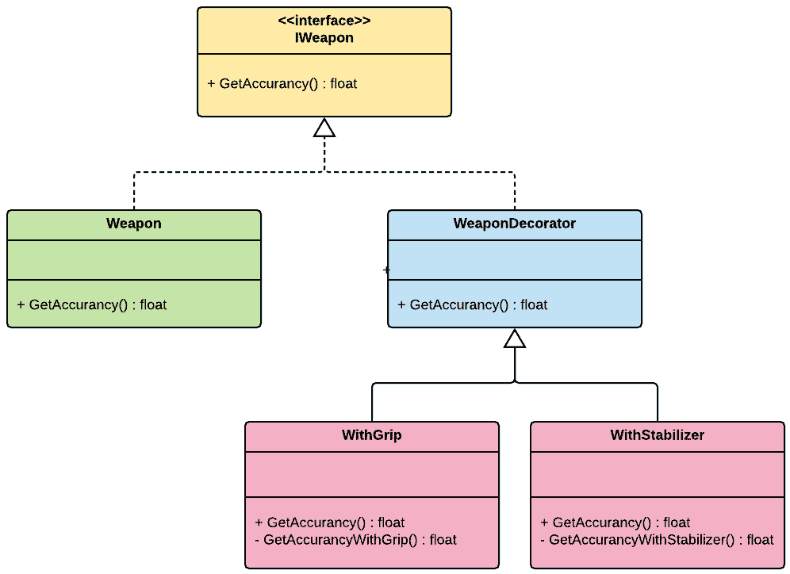
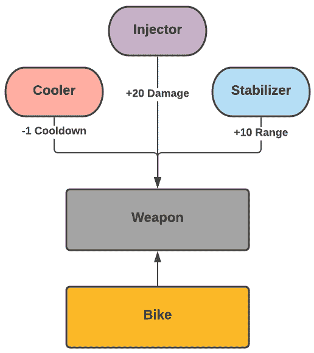
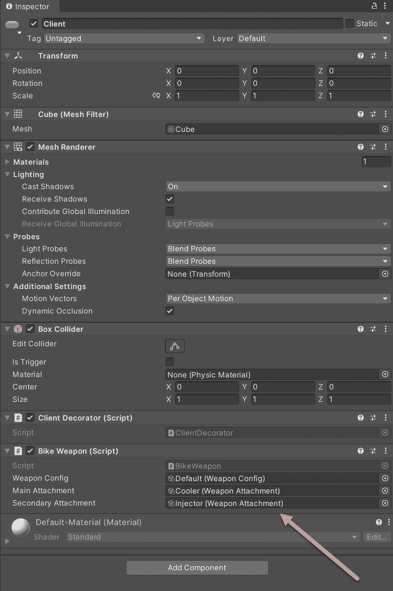
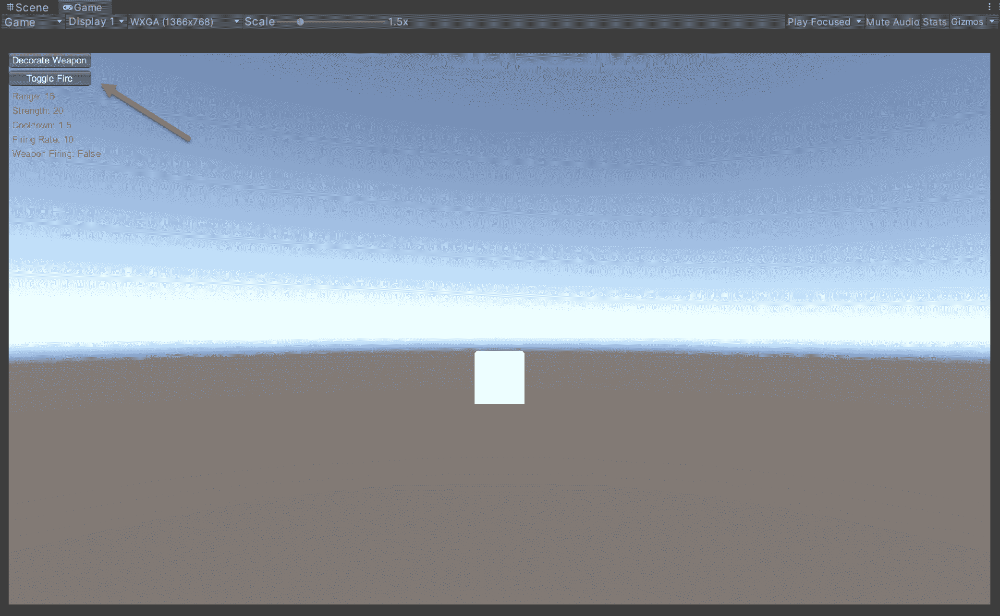

使用装饰器实现武器系统

在本章中，我们将构建一个可定制的武器系统。在整个游戏中，玩家将能够通过购买增强特定属性（如射程和强度）的附件来升级其自行车的初级武器。初级武器安装在自行车的正面，并有两个扩展插槽，玩家可以使用这些插槽构建各种组合。为了构建这个系统，我们将使用装饰器模式。这并不令人惊讶，因为它的名字暗示了它的用途，正如我们将在本章中进一步看到的。

本章将涵盖以下主题：

+   装饰器模式背后的基本原理

+   带有附件的武器系统的实现

# 技术要求

你需要具备 Unity 和 C#的基本理解。

我们将使用以下 Unity 引擎和 C#语言概念：

+   构造函数

+   ScriptableObjects

如果你对这些概念不熟悉，请参阅第三章，《Unity 编程简明指南》。

本章的代码文件可以在 GitHub 上找到：[`github.com/PacktPublishing/Game-Development-Patterns-with-Unity-2021-Second-Edition/tree/main/Assets/Chapters/Chapter12`](https://github.com/PacktPublishing/Game-Development-Patterns-with-Unity-2021-Second-Edition/tree/main/Assets/Chapters/Chapter12)。

查看以下视频以查看代码的实际效果：[`bit.ly/3r9rvJD`](https://bit.ly/3r9rvJD)。

在本书的代码示例中，我们经常使用**ScriptableObjects**，因为我们希望为我们的设计师建立一个创作工作流程，以便他们可以创建新的武器附件或配置现有的附件，而无需修改任何一行代码。对于非程序员来说，使系统、成分和机制易于配置是一种良好的实践。

# 理解装饰器模式

简而言之，装饰器是一种模式，它允许在不改变现有对象的情况下向其添加新功能。这是通过创建一个包装原始类的装饰器类来实现的。通过这种机制，我们可以轻松地附加但也可以从对象中移除新的行为。

在深入探讨主题之前，让我们回顾以下图表以可视化装饰器的结构：



图 12.1 – 装饰器模式的 UML 图

`IWeapon`接口建立了一个实现合同，它将在装饰对象及其装饰器之间保持一致的方法签名。`WeaponDecorator`包装目标对象，并通过增强或覆盖其行为来装饰它。

在过程中，**装饰**对象的方法签名和整体结构不会被修改，只是其行为或属性值。因此，我们可以轻松地从对象中移除装饰，并使其恢复到初始形式。

大多数关于这种模式的教科书示例都高度依赖于类构造函数。然而，原生的 Unity API 基类，如`MonoBehaviour`和`ScriptableObject`，并不使用构造函数的概念来初始化对象的实例。相反，对于 MonoBehaviours，引擎负责初始化附加到 GameObject 上的类。任何初始化代码都应实现于`Awake()`或`Start()`回调中。

因此，我们面临着找到一种方法来适应装饰器模式，使其能够使用核心 Unity API 功能，同时不失其主要优势的挑战。

## 装饰器模式的好处和缺点

以下是一些装饰器模式的好处：

+   **子类化的替代方案**：继承是一个静态的过程。与装饰器模式不同，它不允许在运行时扩展现有对象的行为。你只能用具有相同父类且具有所需行为的另一个实例来替换一个实例。因此，装饰器模式是子类化和过度继承的更动态的替代方案，并克服了继承的限制。

+   **运行时动态性**：装饰器模式允许我们通过向对象附加装饰器来在运行时向其添加功能。但这同时也意味着反向操作是可能的，你可以通过移除装饰器来将对象恢复到其原始形式。

以下是一些装饰器模式的潜在缺点：

+   **关系复杂性**：如果对象周围有多个装饰器层，跟踪初始化链和装饰器之间的关系可能会变得非常复杂。

+   **代码复杂性**：根据你如何实现装饰器模式，它可能会增加你的代码库的复杂性，因为你可能需要维护几个小的装饰器类。但是，何时以及如何成为实际的缺点是非常具体的，并不是恒定的。在我们即将审查的代码示例中，这不是一个问题，因为每个装饰器都是一个保存为可配置资源的`ScriptableObject`实例。

装饰器模式是结构设计模式家族的一部分；其成员包括适配器模式、桥接模式、外观模式和享元模式。

## 何时使用装饰器模式

在本章中，我们正在实现一个带有附件的武器系统。我们需要考虑一些规范，如下所示：

+   我们需要能够将多个附件附加到武器上。

+   我们需要在运行时能够添加和删除它们。

装饰器模式为我们提供了一种满足这两个核心需求的方法。因此，当实现一个需要以动态方式支持向单个对象添加和删除行为时，这是一个值得考虑的模式。

例如，如果我们被分配去工作在一个**CCG**（可收集卡牌游戏），我们可能需要实现一个机制，让玩家可以通过堆叠在基础卡牌上的神器卡来增强基础卡牌的能力。另一个用例是想象需要实现一个衣柜系统，玩家可以用配件装饰他们的盔甲以增强特定的属性。

在这两种情况下，使用装饰器模式可能是构建这些类型机制和系统的良好起点。现在我们已经对装饰器模式有了基本的了解，我们将在编写代码之前回顾我们的武器附件系统设计。

# 设计武器系统

默认情况下，我们游戏中的每款自行车都配备了前置枪，可以发射激光束。玩家可以使用这种武器摧毁可能挡路的障碍物，而且非常熟练的玩家可以在做轮滑动作的同时射击飞行无人机。玩家还可以购买各种附件来增强自行车武器的基线属性，如下面的图所示：



图 12.2 – 武器附件系统图

让我们回顾一下玩家可能购买的潜在附件的简短列表：

+   **注入器**：一种等离子体注入器，可以增强武器的伤害能力。

+   **稳定器**：一种减少当自行车达到最高速度时产生的振动的附件。它稳定了武器的射击机制并扩大了其射程。

+   **冷却器**：一种水冷系统，附着在武器的射击机构上。它提高了射速并减少了冷却时间。

这些示例是潜在附件变体的高级概念。这些附件中的每一个都修改或换句话说，“装饰”了武器的特定属性。

在实现我们的系统时，还需要记住的一个要求是，我们的武器将有两个最大扩展槽位用于附件。玩家必须能够在调整他们的车辆设置时动态地添加和移除它们。

现在我们已经很好地概述了我们的系统设计的要求，是时候将其转化为代码了，我们将在下一节中这样做。

# 实现武器系统

在本节中，我们将实现我们武器系统的核心类。但是请注意，为了简洁起见，我们不会编写武器的核心行为。我们希望保持对理解装饰器模式如何工作的关注。但如果您想查看这个代码示例的更高级版本，请查看本书 GitHub 仓库中的`FPP`文件夹。链接可以在*技术要求*部分找到。

## 实现武器系统

我们需要执行许多步骤，因为我们有很多代码要一起审查：

1.  首先，我们将实现 `BikeWeapon` 类。因为它相当长，我们将将其分成三个部分：

```cs
using UnityEngine;
using System.Collections;

namespace Chapter.Decorator
{
    public class BikeWeapon : MonoBehaviour
    {
        public WeaponConfig weaponConfig;
        public WeaponAttachment mainAttachment;
        public WeaponAttachment secondaryAttachment;

        private bool _isFiring;
        private IWeapon _weapon;
        private bool _isDecorated;

        void Start() 
        {
            _weapon = new Weapon(weaponConfig);
        }
```

第一部分是初始化代码。请注意，我们在 `Start()` 方法中设置了武器的配置。

对于类的第二个部分，它只是 `GUI` 标签，将帮助我们进行调试：

```cs
void OnGUI()
{
    GUI.color = Color.green;

    GUI.Label (
        new Rect (5, 50, 150, 100), 
        "Range: "+ _weapon.Range);

    GUI.Label (
        new Rect (5, 70, 150, 100), 
        "Strength: "+ _weapon.Strength);

    GUI.Label (
        new Rect (5, 90, 150, 100), 
        "Cooldown: "+ _weapon.Cooldown);

    GUI.Label (
        new Rect (5, 110, 150, 100), 
        "Firing Rate: " + _weapon.Rate);

    GUI.Label (
        new Rect (5, 130, 150, 100), 
        "Weapon Firing: " + _isFiring);

    if (mainAttachment && _isDecorated)
        GUI.Label (
            new Rect (5, 150, 150, 100), 
            "Main Attachment: " + mainAttachment.name);

    if (secondaryAttachment && _isDecorated)
        GUI.Label (
            new Rect (5, 170, 200, 100), 
            "Secondary Attachment: " + secondaryAttachment.name);
}
```

然而，正是在最后一个部分，事情开始变得有趣：

```cs
        public void ToggleFire() {
            _isFiring = !_isFiring;

            if (_isFiring)
                StartCoroutine(FireWeapon());
        }

        IEnumerator FireWeapon() {
            float firingRate = 1.0f / _weapon.Rate;

            while (_isFiring) {
                yield return new WaitForSeconds(firingRate);
                Debug.Log("fire");
            }
        }

        public void Reset() {
            _weapon = new Weapon(weaponConfig);
            _isDecorated = !_isDecorated;
        }

        public void Decorate() {
            if (mainAttachment && !secondaryAttachment)
                _weapon = 
                    new WeaponDecorator(_weapon, mainAttachment);

            if (mainAttachment && secondaryAttachment)
                _weapon = 
                    new WeaponDecorator(
                        new WeaponDecorator(
                            _weapon, mainAttachment), 
                                    secondaryAttachment);

            _isDecorated = !_isDecorated;
        }
    }
}
```

`Reset()` 方法通过用默认武器配置初始化一个新的 `Weapon` 来将武器重置为其初始配置。这是一种快速简单的方法来移除我们在 `Decorate()` 方法中设置的附件。这并不总是最佳方法，但在本例的上下文中它是有效的。

然而，`Decorate()` 方法是魔法发生的地方，装饰者模式机制被触发。你可能注意到，我们可以通过在构造函数中链式调用它们来堆叠附件，就像我们在这里看到的那样：

```cs
            if (mainAttachment && secondaryAttachment)
                _weapon = 
                    new WeaponDecorator(
                        new WeaponDecorator(
                            _weapon, mainAttachment), 
                                    secondaryAttachment);
```

这是一个装饰者和构造函数允许我们做的的小技巧。当开始实现其他类时，它的工作原理将变得更加明显。

1.  下一个要实现的是 `Weapon` 类。请注意，它不是一个 `MonoBehaviour`。因此，我们将使用其构造函数来初始化它：

```cs
namespace Chapter.Decorator
{
    public class Weapon : IWeapon
    { 
        public float Range
        {
            get { return _config.Range; }
        }

        public float Rate
        {
            get { return _config.Rate; }
        }

        public float Strength
        {
            get { return _config.Strength; }
        }

        public float Cooldown
        {
            get { return _config.Cooldown; }
        }

        private readonly WeaponConfig _config;

        public Weapon(WeaponConfig weaponConfig)
        {
            _config = weaponConfig;
        }
    }
}
```

与 `BikeWeapon` 不同，`Weapon` 类不实现任何行为；它只是武器可配置属性的表示。这是我们将会用附件装饰的对象。在其构造函数中，我们传递一个 `WeaponConfig` 对象的实例。正如我们稍后将看到的，这是一个 `ScriptableObject`。

1.  我们需要在装饰器类和武器之间有一个公共接口，因此我们将实现一个名为 `IWeapon` 的接口：

```cs
namespace Chapter.Decorator
{
    public interface IWeapon
    {
        float Range { get; }
        float Duration { get; }
        float Strength { get; }
        float Cooldown { get; }
    }
}
```

1.  现在我们有一个标准接口，它定义了我们能够装饰的一组属性，我们可以实现一个 `WeaponDecorator` 类：

```cs
namespace Chapter.Decorator
{
    public class WeaponDecorator : IWeapon
    {
        private readonly IWeapon _decoratedWeapon;
        private readonly WeaponAttachment _attachment;

        public WeaponDecorator(
            IWeapon weapon, WeaponAttachment attachment) {

            _attachment = attachment;
            _decoratedWeapon = weapon;
        }

        public float Rate {
            get { return _decoratedWeapon.Rate 
                         + _attachment.Rate; }
        }

        public float Range {
            get { return _decoratedWeapon.Range 
                         + _attachment.Range; }
        }

        public float Strength {
            get { return _decoratedWeapon.Strength 
                         + _attachment.Strength; }
        }

        public float Cooldown
        {
            get { return _decoratedWeapon.Cooldown 
                         + _attachment.Cooldown; }
        }
    }
}
```

注意 `WeaponDecorator` 是如何将自己包裹在一个具有相似接口的对象实例周围，在这个例子中，是 `IWeapon` 接口。它从不直接修改它所包裹的对象；它只是用 `WeaponAttachment` 的属性装饰其公共属性。

请记住，在我们的代码示例中，我们只是在修改武器的属性值。这与我们的设计相吻合，因为附件不会改变武器的核心机制。相反，它们只是通过附件槽增强特定的属性。

最后一个需要注意的细节是，我们在 `BikeWeapon` 类中定义了武器的行为，其行为由 `Weapon` 对象实例中设置的属性决定。因此，通过装饰 `Weapon` 对象，我们正在修改自行车武器的行为。

1.  以下步骤是我们开始偏离传统 Decorator 模式实现的地方。我们不是定义单独的具体装饰器类，而是将实现一个名为 `WeaponConfig` 的 `ScriptableObject`。这种方法将允许我们编写单独的附件并通过检查器配置它们的属性。然后，我们将使用这些附件资产来装饰武器，如下所示：

```cs
using UnityEngine;

namespace Chapter.Decorator
{
    [CreateAssetMenu(fileName = "NewWeaponAttachment", 
        menuName = "Weapon/Attachment", order = 1)]
    public class WeaponAttachment : ScriptableObject, IWeapon 
    {
        [Range(0, 50)]
        [Tooltip("Increase rate of firing per second")]
        [SerializeField] public float rate;

        [Range(0, 50)]
        [Tooltip("Increase weapon range")]
        [SerializeField] float range;

        [Range(0, 100)]
        [Tooltip("Increase weapon strength")]
        [SerializeField] public float strength;

        [Range(0, -5)]
        [Tooltip("Reduce cooldown duration")]
        [SerializeField] public float cooldown;

        public string attachmentName;
        public GameObject attachmentPrefab;
        public string attachmentDescription;

        public float Rate {
            get { return rate;  }
        }

        public float Range {
            get { return range; }
        }

        public float Strength {
            get { return strength;  }
        }

        public float Cooldown {
            get { return cooldown; }
        }
    }
}

```

重要的是要注意，`WeaponAttachment` 实现了 `IWeapon` 接口。这使其与 `WeaponDecorator` 和 `Weapon` 类保持一致，因为这三个类都共享相同的接口。

1.  在最后一步，我们将实现名为 `WeaponConfig` 的 `ScriptableObject` 类。我们用它来创建各种配置，以便我们可以用附件来配置我们的 `Weapon` 对象：

```cs
using UnityEngine;

namespace Chapter.Decorator
{
    [CreateAssetMenu(fileName = "NewWeaponConfig", 
        menuName = "Weapon/Config", order = 1)]
    public class WeaponConfig : ScriptableObject, IWeapon
    {
        [Range(0, 60)]
        [Tooltip("Rate of firing per second")]
        [SerializeField] private float rate;

        [Range(0, 50)]
        [Tooltip("Weapon range")]
        [SerializeField] private float range;

        [Range(0, 100)]
        [Tooltip("Weapon strength")]
        [SerializeField] private float strength;

        [Range(0, 5)]
        [Tooltip("Cooldown duration")]
        [SerializeField] private float cooldown;

        public string weaponName;
        public GameObject weaponPrefab;
        public string weaponDescription;

        public float Rate {
            get { return rate;  }
        }

        public float Range {
            get { return range; }
        }

        public float Strength {
            get { return strength;  }
        }

        public float Cooldown {
            get { return cooldown; }
        }
    }
}
```

我们现在拥有了武器附件系统的所有关键成分，现在是时候在 Unity 引擎中测试它们了。

## 测试武器系统

如果你希望在自己的 Unity 实例中测试我们刚刚审查的代码，你需要遵循以下步骤：

1.  将我们刚刚审查的所有类复制到你的 Unity 项目中。

1.  创建一个空的 Unity 场景。

1.  将一个新的 GameObject 添加到场景中。

1.  将以下客户端脚本附加到新的 GameObject：

```cs
using UnityEngine;

namespace Chapter.Decorator
{
    public class ClientDecorator : MonoBehaviour
    {
        private BikeWeapon _bikeWeapon;
        private bool _isWeaponDecorated;

        void Start() {
            _bikeWeapon = 
                (BikeWeapon) 
                FindObjectOfType(typeof(BikeWeapon));
        }

        void OnGUI() 
        {
            if (!_isWeaponDecorated) 
                if (GUILayout.Button("Decorate Weapon")) {
                    _bikeWeapon.Decorate();
                    _isWeaponDecorated = !_isWeaponDecorated;
                }

            if (_isWeaponDecorated)
                if (GUILayout.Button("Reset Weapon")) {
                    _bikeWeapon.Reset();
                    _isWeaponDecorated = !_isWeaponDecorated;
                }

            if (GUILayout.Button("Toggle Fire"))
                _bikeWeapon.ToggleFire();
        }
    }
}
```

1.  将我们在上一节中实现的 `BikeWeapon` 脚本添加到新的 GameObject 中。

1.  在 **Assets** | **Create** | **Weapon** 菜单选项下，创建一个新的 **Config** 并按你的意愿进行配置。

1.  在 **Assets** | **Create** | **Weapon** 菜单选项下，创建几个具有各种配置的 **Attachment** 变体。

1.  现在，你可以在 `Inspector` 中的 `BikeWeapon` 组件属性中添加 `WeaponConfig` 和 `WeaponAttachment` 资产，如下面的截图所示：



图 12.3 – BikeWeapon 组件属性

当你启动你的场景时，你应该在屏幕的左上角看到以下按钮，如下面的截图所示：



图 12.4 – Unity 中代码示例的实际截图

你现在可以通过按按钮来测试武器附件系统，并根据你的意愿进行调整，同时观察随着装饰器设置的修改，武器统计数据的变化。

## 检查武器系统

我们的 Decorator 实现是非传统的，因为我们混合了原生 C# 语言特性，如构造函数，同时在尝试利用 Unity API 的最佳部分。通过将装饰器类转换为可配置的 `ScriptableObject` 资产，我们获得了使我们的武器附件可由非程序员编写和配置的能力。而且，在底层，我们的附件系统建立在稳固的设计模式基础之上。

因此，我们努力在可用性和可维护性之间取得平衡。然而，正如我们将在下一节中看到的，总有其他方法。

设计模式是指导原则，而非命令。因此，尝试不同的模式实现方式是完全可以接受的。本章中的代码示例是实验性的，因为它并不是传统装饰器模式的实现。但我们鼓励读者继续在本书中展示的模式上进行实验，并找到在 Unity 中使用它们的新方法。

# 审查替代方案

在本章所展示的使用案例的背景下，我们本可以使用装饰器模式以及可脚本化的对象来实现武器系统。我们可以遍历一个已获取的武器附件列表，并将它们的属性应用到`Weapon`类上。虽然我们会失去链式装饰的能力，但我们的代码将会更加直接。

在我们的案例中，使用装饰器模式的核心好处是它为我们提供了一个结构化和可重复的系统实现方法。然而，作为结果，我们也给我们的代码库增加了额外的复杂性。

# 摘要

在本章中，我们实现了一个可编写和可配置的武器附件系统。非程序员将能够创建和调整新的附件，而无需编写一行代码。因此，我们可以专注于构建系统，而设计师则可以专注于平衡工作。装饰器模式已被证明是游戏开发中的一个实用模式，因此它应该成为程序员工具箱中的一个模式。

在下一章中，我们将探讨空间分区模式——这是在构建大型地图游戏时理解的一个重要主题。
