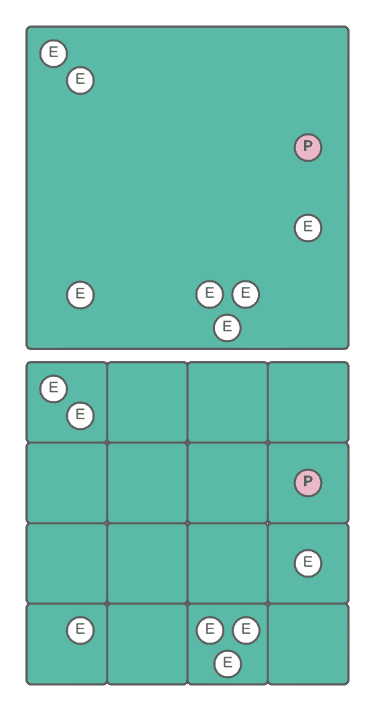
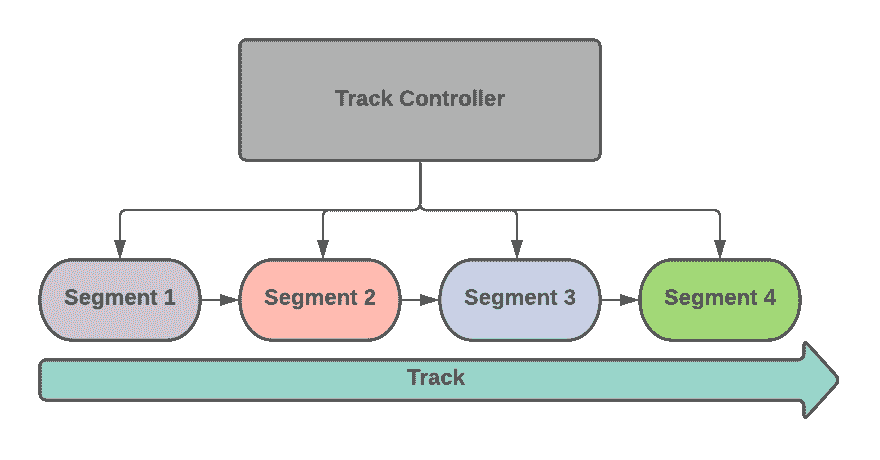
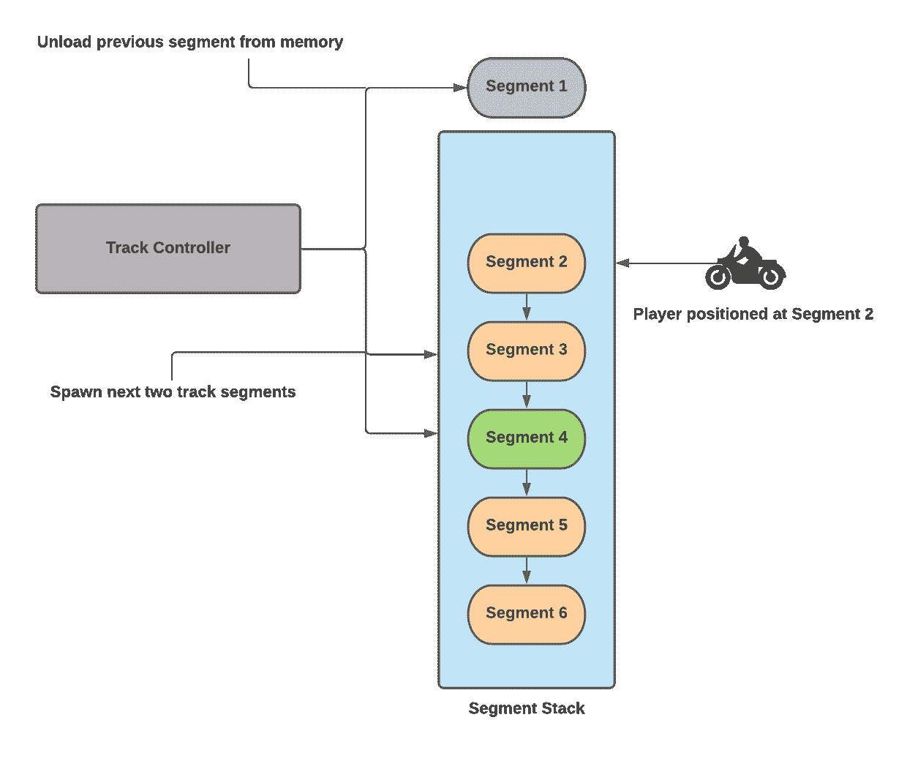

使用空间分区实现关卡编辑器

本章，我们将探讨空间分区概念。与前面的章节不同，主要主题不是传统上定义为软件设计模式，而更多是一个过程和技术。但由于它为我们提供了一种可重用和结构化的方法来解决重复出现的游戏编程问题，我们将将其视为本章中的设计模式。

本章我们将采取的方法与前面的章节不同，原因如下：

+   我们将采取一种放手的态度；换句话说，我们不会尝试实现代码示例，而是将审查一些代码片段。

+   我们不会试图忠实于任何学术定义，而是将使用空间分区的通用概念来构建我们的赛车游戏关卡编辑器。

空间分区的最简单定义是一个过程，它通过将对象按其位置在数据结构中整理，提供了一种高效定位对象的方法。本章中我们正在实现的关卡编辑器将使用栈数据结构构建，我们将保持特定顺序的栈中的对象类型是赛道段。这些赛道段将根据它们与玩家在地图上的位置的关系以特定的顺序生成或删除。

所有这些都可能听起来非常抽象，但使用 Unity **应用程序编程接口**（**API**）实现这一点相当简单，正如我们将在本章中看到的那样。

本章中我们正在实施的系统过于复杂，无法简化为一个骨架代码示例。因此，与前面的章节不同，这里展示的代码并不是为了复制或用作模板。我们反而建议您查看 Git 项目`/FPP`文件夹中的完整代码示例，该链接可在本章的*技术要求*部分找到。

本章，我们将涵盖以下主题：

+   理解空间分区模式

+   设计关卡编辑器

+   实现关卡编辑器

+   审查替代解决方案

# 第十六章：技术要求

我们还将使用以下特定的 Unity 引擎 API 功能：

+   栈

+   可脚本化对象

如果不熟悉这些概念，请参阅第三章，《Unity 编程简明指南》。

本章的代码文件可以在 GitHub 上找到，链接如下：[`github.com/PacktPublishing/Game-Development-Patterns-with-Unity-2021-Second-Edition/tree/main/Assets/Chapters/Chapter13`](https://github.com/PacktPublishing/Game-Development-Patterns-with-Unity-2021-Second-Edition/tree/main/Assets/Chapters/Chapter13)。

栈是一种线性数据结构，具有两个主要操作：**Push**，在栈顶添加一个元素，和**Pop**，从栈顶移除最近添加的元素。

# 理解空间分区模式

空间划分模式的名字来源于称为空间划分的过程，它在计算机图形学中起着至关重要的作用，并且常用于光线追踪渲染实现中。这个过程通过将对象存储在空间划分数据结构（如 **二叉空间划分**（**BSP**）树）中来组织虚拟场景中的对象；这使得对大量 **三维**（**3D**）对象进行几何查询更快。在本章中，我们将使用空间划分的一般概念，而不必忠实于它在计算机图形学中通常的实现方式。

使用以下图表以非常高级和概念化的方式可视化空间划分：



图 13.1 – 一个说明地图上空间划分的图表

第一个例子表示地图上没有进行任何划分的敌人位置。如果我们想快速查找玩家相对于敌人的位置，这可能是一个挑战。当然，我们可以使用射线投射来计算实体之间的距离，但随着敌人数量的增加，这可能会变得低效。

图表的下一部分显示，如果我们划分地图，现在我们可以轻松地可视化敌人相对于玩家位置的集群。在代码中，我们现在可以快速查找哪个敌人离玩家最近，以及它们最大的集群在哪里，因为我们不需要每个敌人的确切位置，只需要它们与玩家的一般地理关系，知道它们在网格的哪个近似单元格中就足够了。

**BSP** 是一种 3D 编程技术，它通过一系列超平面递归地将空间划分为凸对。该方法使用二叉树数据结构实现。约翰·卡马克（John Carmack）曾著名地使用 BSP 开发过如 *Doom* 和 *Quake* 等游戏。

## 何时使用空间划分模式

3D 编程超出了本书的范围，但空间划分描述的最重要收获是它提供了一种以最佳方式组织场景中大量对象的方法。因此，如果你发现自己需要一种快速查询场景中大量对象的同时跟踪它们的空间关系的方法，请记住空间划分的原则。

在下一节中，我们将回顾关卡编辑器的整体设计并检查其技术要求。

# 设计关卡编辑器

当在一个多学科游戏开发团队工作时，游戏程序员的职责不仅限于实现酷炫的游戏机制和功能。我们经常被要求构建资产集成管道和编辑工具。在制作周期早期，我们可能需要实现的最常见工具是为我们团队的水平设计师定制的自定义关卡编辑器。

在编写任何代码之前，我们需要记住，我们的游戏在核心游戏系统中没有集成随机性。这是一个技能游戏，玩家的主要目标是通过记住每条赛道的复杂性并尽可能快地到达终点线来达到排行榜的顶端。

因此，基于这些核心设计支柱，我们不能使用像基于特定规则和约束生成随机障碍的程序生成地图这样的解决方案。因此，我们团队的水平设计师将不得不手动设计每条赛道的布局。

这把我们带到了我们最大的挑战：在我们的游戏中，一辆自行车以非常高的速度在 3D 世界中直线行驶。如果我们希望比赛持续超过十几秒，我们将在内存中需要大量的资产，并且我们的设计师将不得不在编辑器中处理编辑大量水平的工作。

这种方法在编辑阶段和运行时都不高效。因此，我们不会将整个赛道作为一个单一实体来管理，而是将其划分为段，每个段可以单独编辑，然后按照特定的顺序组装成一个单一的赛道。

下一个图示说明了这个高级概念：



图 13.2 – 赛道段顺序图

从这个系统中，我们获得了两个关键的好处，如下所述：

1.  我们的水平设计师可以通过创建新的段并在各种布局中编排它们来创建新的赛道。

1.  我们不需要将整个赛道内容加载到内存中，只需在玩家当前位置的适当时刻生成所需的段。

下一个图示说明了赛道控制器如何使用堆栈数据结构来管理根据玩家当前位置卸载哪些赛道以及生成哪些赛道：



图 13.3 – 段堆叠图

在实施此系统时，我们必须牢记我们游戏中的两个显著特点，如下所述：

1.  自行车始终保持在初始位置不动。是赛道段向玩家移动。因此，速度和移动的感觉是通过模拟来实现的，并提供了视觉错觉。

1.  玩家只能看到前方。没有后视窗或回望摄像头。这种摄像机视角的限制意味着我们可以在赛道段位于玩家视野之后立即卸载它们。

总结来说，通过一个单一的系统，我们解决了我们项目中的两个潜在的核心问题。首先，我们正在建立一个水平设计流程，最后，我们有一个机制可以动态加载我们的水平，并在设计中嵌入一定的优化。

当设计本书中构建的赛车游戏时，我受到了微型电动玩具赛车的启发。这个玩具的一个独特之处在于你可以以各种配置组装单个轨道段。有时思考新的独特轨道布局比实际驾驶玩具车更有趣。

# 实现关卡编辑器

在本节中，我们将回顾一些代码，这些代码将实现我们关卡编辑器的核心组件。与前面的章节不同，我们不会尝试使这段代码可运行或可测试。相反，我们将回顾实现，以了解我们如何使用空间划分的一般思想来为设计师构建一个功能性的关卡编辑器，同时优化我们在运行时加载关卡的方式。

下一个部分中展示的代码将进行审查，但不会编译，因为它不是一个完整的自包含示例。

## 实现关卡编辑器的步骤

1.  首先，我们将编写一个名为`Track`的`ScriptableObject`类，如下所示：

```cs
using UnityEngine;
using System.Collections.Generic;

namespace Chapter.SpatialPartition
{
    [CreateAssetMenu(fileName = "New Track", menuName = "Track")]
    public class Track : ScriptableObject
    {
        [Tooltip("The expected length of segments")] 
        public float segmentLength;

        [Tooltip("Add segments in expected loading order")] 
        public List<GameObject> segments = new List<GameObject>();
    }
}
```

通过这个`ScriptableObject`类，我们的关卡设计师将能够通过将段添加到列表中并按特定顺序排列它们来设计新的赛道变体。每个赛道资产都将被送入`TrackController`类，该类将自动按设计师的顺序生成每个段。

对于玩家来说，这个过程是无缝的，因为它在后台运行，段在它们进入摄像机的视野之前就已经生成。因此，从玩家的角度来看，整个关卡看起来就像已经加载完毕。

1.  接下来是`TrackController`类。在其中，我们将实现段加载机制，但由于它是一个庞大的类，我们将将其拆分并分部分查看，如下所示：

```cs
using UnityEngine;
using System.Linq;
using System.Collections.Generic;

namespace Chapter.SpatialPartition
{
    public class TrackController : MonoBehaviour
    {
        private float _trackSpeed;
        private Transform _prevSeg;
        private GameObject _trackParent;
        private Transform _segParent;
        private List<GameObject> _segments;
        private Stack<GameObject> _segStack;
        private Vector3 _currentPosition = new Vector3(0, 0, 0);

        [Tooltip("List of race tracks")] 
        [SerializeField]
        private Track track;

        [Tooltip("Initial amount of segment to load at start")] 
        [SerializeField]
        private int initSegAmount;

        [Tooltip("Amount of incremental segments to load at run")] 
        [SerializeField]
        private int incrSegAmount;

        [Tooltip("Dampen the speed of the track")] 
        [Range(0.0f, 100.0f)] 
        [SerializeField]
        private float speedDampener;

        void Awake()
        {
            _segments = 
                Enumerable.Reverse(track.segments).ToList();
        }

        void Start()
        {
            InitTrack();
        }
```

第一部分仅仅是初始化代码，是自我解释的，但代码的后续部分则更有趣：

```cs
void Update()
{
    _segParent.transform.Translate(
        Vector3.back * (_trackSpeed * Time.deltaTime));
}

private void InitTrack()
{
    Destroy(_trackParent);

    _trackParent = 
        Instantiate(
            Resources.Load("Track", typeof(GameObject))) 
            as GameObject;

    if (_trackParent)
        _segParent = 
            _trackParent.transform.Find("Segments");

    _prevSeg = null;

    _segStack = new Stack<GameObject>(_segments);

    LoadSegment(initSegAmount);
}
```

如我们所见，在`Update()`循环中，我们将轨道父对象移动到玩家附近以模拟移动。在`InitTrack()`方法中，我们实例化一个轨道`GameObject`，它将作为轨道段的容器。但函数中有一行重要的代码是段加载机制的关键组成部分，这里进行了说明：

```cs
_segStack = new Stack<GameObject>(_segments);
```

在这一行，我们将段列表注入到一个新的栈容器中。正如本章开头所提到的，空间划分技术的一个关键部分是将环境对象组织在数据结构中，以便更容易查询。

在下一个代码片段中，我们将看到我们如何使用栈数据结构按正确顺序加载段：

```cs
        private void LoadSegment(int amount)
        {
            for (int i = 0; i < amount; i++)
            {
                if (_segStack.Count > 0)
                {
                    GameObject segment = 
                        Instantiate(
                            _segStack.Pop(), _segParent.transform);

                    if (!_prevSeg) 
                        _currentPosition.z = 0;

                    if (_prevSeg)
                        _currentPosition.z =
                            _prevSeg.position.z 
                            + 
                            track.segmentLength;

                    segment.transform.position = _currentPosition;

                    segment.AddComponent<Segment>();

                    segment.GetComponent<Segment>().
                        trackController = this;

                    _prevSeg = segment.transform;
                }
            }
        }

        public void LoadNextSegment()
        {
            LoadSegment(incrSegAmount);
        } 
    }
}
```

`LoadSegment()`私有方法是系统的核心。它接受一个特定数量的段落作为参数。这个值将决定在调用时它将加载多少个段落。如果有足够的段落剩余在堆栈上，它就会从顶部弹出一个并初始化它，位于之前加载的段落后面。它继续这个循环过程，直到加载了预期的数量。

你可能会问自己：*我们如何销毁玩家后面的段落？* 我们有多种方法可以计算或检测一个实体是否在另一个实体后面，但就我们的上下文而言，我们将使用一种双重解决方案。每个段落预制体在其边缘加载了一个名为段落标记的实体；这由两个柱子和一个不可见的触发器组成。

一旦自行车通过触发器，段落标记就会删除其父`GameObject`，正如我们在这里看到的：

```cs
using UnityEngine;

public class SegmentMarker : MonoBehaviour
{
    private void OnTriggerExit(Collider other)
    {
        if (other.GetComponent<BikeController>()) 
            Destroy(transform.parent.gameObject);
    }
}
```

当具有`BikeController`组件的实体从一个段落标记的触发器中退出时，它请求销毁其父`GameObject`，在这种情况下将是一个`Segment`实体。

当具有`BikeController`组件的实体从一个段落标记的触发器中退出时，它请求销毁其父`GameObject`，在这种情况下将是一个`Segment`实体。

如`TrackController`类的`LoadSegment()`方法所示，每次我们从堆栈顶部弹出一个新的段落时，我们都会将其附加到一个名为`Segment`的脚本组件上，正如我们在这里看到的：

```cs
segment.transform.position = _currentPosition;

segment.AddComponent<Segment>(); 

segment.GetComponent<Segment>().trackController = this;
```

因为我们将`TrackController`类的当前实例传递给其`trackController`参数，所以`Segment`对象可以回调`TrackController`类，并在它被销毁之前请求加载下一个段落序列，正如我们在这里看到的：

```cs
using UnityEngine;

public class Segment : MonoBehaviour
{
    public TrackController trackController;

    private void OnDestroy()
    {
        if (trackController) 
            trackController.LoadNextSegments();
    }
}
```

这种方法创建了一个循环机制，在特定间隔自动加载和卸载一定数量的段落。使用这种方法，我们管理在给定时间内场景中生成的实体数量。理论上，这将导致更一致的帧率。

这种方法的另一个好处，它与游戏玩法更相关，是段落标记可以作为检查点系统的地标。检查点通常用于有时间限制的赛车游戏模式中，玩家必须在特定时间内到达赛道上的几个点。

一个基于检查点的赛车游戏的优秀例子是 1987 年的*Rad Racer*。

## 使用关卡编辑器

你可以通过在 Git 仓库中打开`/FPP`文件夹来玩关卡编辑器，然后执行以下操作：

+   在`/Scenes/Gyms`文件夹下，你应该找到一个名为`Segment`的场景。在这个场景中，你可以编辑和创建新的段落预制体。

+   在**`Assets-> Create-> Track`**菜单下，你可以选择创建新的轨道资产。

+   最后，你可以通过在**`Scenes/Main`**文件夹下打开`Track`场景来修改和附加新的轨道到`TrackController`类。

随意改进代码，更重要的是，享受乐趣！

## 审查关卡编辑器实现

本章中的实现是更复杂系统代码的简化版本，但如果您花时间审查 Git 项目 `/FPP` 文件夹中的高级版本关卡编辑器，我们会看到一些改进，例如以下内容：

+   **段**：有一个用于段落的创作流程，它使用 ScriptableObjects。

+   **对象池**：`TrackController` 类正在使用对象池来优化单个段加载时间。

我没有在章节中包含这些优化，以保持代码示例简短和简单，出于教育目的。

# 审查替代方案

在实际的生产环境中，如果时间允许，我会以不同的方式构建我们的游戏关卡编辑器。我会设计一个自上而下的轨道编辑器，允许关卡设计师绘制轨道并在其上拖放障碍物。设计师随后可以将他们的作品以序列化格式保存。

然后，使用空间分区原理，`TrackController` 类会自动将轨道分成若干段，并将它们放入对象池中。这种方法将自动化生成单个段的过程，同时优化生成过程。

因此，设计师无需作为预制件编写单个段，他们可以在编辑器中可视化整个布局的同时设计新的轨道。

当我构建工具和设置集成管道时，我的最终目标始终是自动化。我总是试图通过自动化来摆脱工作，这样我就不会浪费时间在手动任务上。

# 摘要

在本章中，我们采取了放手的态度，审查了如何使用空间分区模式的大致思想构建基本关卡编辑器。我们的目标不是忠实于模式的标准化定义。相反，我们将其作为构建我们系统的起点。我鼓励您花时间审查 `/FPP` 文件夹中的代码，并将其重构以使其更好。

在下一章中，我们将审查一些值得了解但具有通用用例的替代模式。因此，与前面的章节相比，用例将具有更广泛的范围，而不仅仅是针对游戏机制或系统。我们将首先解决适配器模式。正如其名称所暗示的，我们将使用它来在两个不兼容的系统之间集成适配器。
