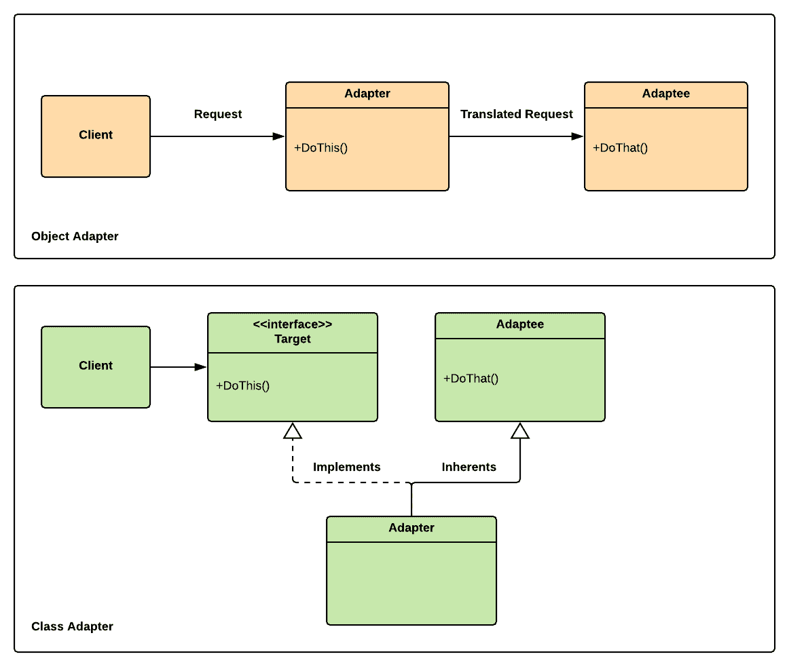

使用适配器适配系统

在一个充满各种类型电缆和插头的世界中，我们都已经习惯了适配器的概念。适配器模式将是那些你容易掌握的模式之一，因为它与我们在技术领域的真实世界经验完美相关联。适配器模式的名字完美地揭示了其核心目的；它通过在充当适配器的代码之间添加一个接口，为我们提供了一种无缝使用旧代码与新代码的方法。

本章将涵盖以下主题：

+   理解适配器模式

+   实现适配器模式

本章中展示的示例是骨架代码。为了学习目的而简化，以便我们可以专注于模式的结构。它可能没有足够优化或上下文化，不能直接用于你的项目。

# 技术要求

以下章节是实践性的，因此你需要对 Unity 和 C#有一个基本的了解。

本章的代码文件可以在 GitHub 上找到：[`github.com/PacktPublishing/Game-Development-Patterns-with-Unity-2021-Second-Edition/tree/main/Assets/Chapters/Chapter14`](https://github.com/PacktPublishing/Game-Development-Patterns-with-Unity-2021-Second-Edition/tree/main/Assets/Chapters/Chapter14) [](https://github.com/PacktPublishing/Game-Development-Patterns-with-Unity-2021-Second-Edition/tree/main/Assets/Chapters/Chapter14)

查看以下视频，看看代码是如何在行动中应用的：

[`bit.ly/3wBHqkX`](https://bit.ly/3wBHqkX)

# 理解适配器模式

如其名所示，适配器模式适配两个不兼容的接口；就像插头适配器一样，它不会修改它调整的内容，而是将一个接口与另一个接口连接起来。当处理无法重构的脆弱遗留代码时，或者当你需要向第三方库添加功能但不想修改它以避免升级时，这种方法可能是有益的。

这里是两种实现适配器模式的主要方法的快速概述：

+   **对象适配器**：在这个版本中，模式使用对象组合，适配器作为被适配对象的包装器。如果我们有一个没有我们需要的方法的类，但我们不能直接修改它，这很有帮助。对象适配器采用原始类的方 法并将其适配到我们所需要的。

+   **类适配器**：在这个模式的版本中，适配器使用继承来适配现有类的接口以适应另一个接口。当我们需要调整一个类以便它可以与其他类一起工作，但不能直接修改它时，这很有用。

在我们的代码示例中，我们将使用类适配器的一种变体，因为它更具挑战性。如果我们理解了类适配器版本，那么我们可以推断出对象适配器版本的理解。

让我们看看对象适配器和类适配器的并排图；核心差异微妙，但相似之处明显：



图 14.1 – 重放系统图

正如你所见，在两种情况下，**适配器**类都位于**客户端**和适配实体（**适配者**）之间。但是，类适配器通过继承与适配者建立关系。相比之下，对象适配器使用组合来包装适配者的一个实例以进行适配。

在这两种情况下，我们正在适配的实体没有被修改。客户端也不知道我们在适配什么；它只知道它有一个一致的接口来与适配对象通信。

组合和继承是定义对象之间关系的方法；它们描述了它们如何相互关联。而这种关系结构的不同部分决定了对象适配器和类适配器之间的差异。

另一点需要说明的是，适配器有时会与外观模式混淆。我们必须理解，它们之间的核心区别在于，外观模式为复杂系统建立了一个简化的前端接口。但适配器适配不兼容的系统，同时为客户端保持一致的接口。

这两种模式相关，因为它们都是结构型模式，但具有完全不同的目的。

**组合**是面向对象编程（OOP）的核心概念之一；它指的是将简单类型组合成更复杂类型的概念。例如，摩托车有轮子、发动机和把手。因此，组合建立了一个“拥有”关系，而继承则建立了一个“是”关系。

## 适配器模式的好处和缺点

以下是一些适配器模式的好处：

+   **无需修改即可适配**：适配器模式的主要优点是它提供了一种标准方法来适配旧代码或第三方代码，而无需对其进行修改。

+   **可重用性和灵活性**：此模式允许在新系统上以最小的更改继续使用旧代码；这具有立即的投资回报。

以下是一些适配器模式的潜在缺点：

+   **持久遗产**：使用旧代码与新系统兼容的能力是成本效益的，但从长远来看，可能会成为一个问题，因为随着旧代码变得过时且与 Unity 或第三方库的新版本不兼容，它可能会限制你的升级选项。

+   **轻微开销**：因为，在某些情况下，你需要在对象之间重定向调用，这可能会带来轻微的性能损失，通常太小，不会成为问题。

适配器是结构型模式家族的一部分，包括外观（Facade）、桥接（Bridge）、组合（Composite）、享元（Flyweight）和装饰器（Decorator）。

## 何时使用适配器模式

在 Unity 中，适配器的一个潜在用例是当你有一个从 Unity Asset Store 下载的第三方库，你需要修改其一些核心类和接口以添加新特性。但是，每次从库所有者那里拉取更新时，更改第三方代码都会带来合并问题。

因此，你发现自己处于一个选择等待第三方库所有者集成所需更改或修改他们的代码并添加缺失特性的情况。这两种选择都有其风险与回报。但适配器模式通过允许我们在现有类之间放置适配器，从而提供了一个解决这个困境的方法，这样它们就可以在不直接修改它们的情况下一起工作。

让我们想象我们正在为一个项目编写代码库，该项目使用的是从 Unity Asset Store 下载的库存系统包。该系统非常出色；它将玩家的购买或赠送的库存项目保存到安全的云后端服务。但有一个问题，它不支持本地磁盘保存。这种限制已经成为我们项目中的一个问题，因为我们需要本地和云保存以实现冗余。

在这种情况下，我们可以轻松地修改供应商的代码并添加我们需要的特性。但是，当它们发布下一个更新时，我们必须将我们的代码与他们的代码合并。这种方法可能是一个容易出错的流程。相反，我们将使用适配器模式并实现一个包装器，它将保持对库存系统的统一接口，同时添加本地保存支持。在这个过程中，我们不需要修改任何现有的类。因此，我们将能够避免更改供应商的代码，同时仍然让您的本地保存系统处理库存项目的保存。

我们将在下一节中实现这个用例的示例。但总的来说，适配器模式在需要相互接口但不希望修改现有代码的不兼容系统的情况下非常有用。

# 实现适配器模式

代码示例将会很简单；我们不会尝试编写一个完整的本地磁盘保存系统，因为这不是本章的重点。相反，我们将编写系统的框架，以便专注于适配器模式的使用，并且不会因为无关的实现细节而受阻。

## 实现适配器模式

首先，我们将实现一个占位符类，它将模拟上一节场景中展示的第三方库存系统：

1.  我们虚构的提供者提供的`InventorySystem`类有三个方法，`AddItem()`、`RemoveItem()`和`GetInventory()`。所有这些方法都是硬编码为使用云存储，我们无法修改它们：

```cs
using UnityEngine;
using System.Collections.Generic;

namespace Chapter.Adapter
{
    public class InventorySystem
    {
        public void AddItem(InventoryItem item)
        {
            Debug.Log(
                "Adding item to the cloud");
        }

        public void RemoveItem(InventoryItem item)
        {
            Debug.Log(
                "Removing item from the cloud");
        }

        public List<InventoryItem> GetInventory()
        {
            Debug.Log(
                "Returning an inventory list stored in the cloud");

            return new List<InventoryItem>();
        }
    }
}
```

1.  接下来是将在这种情况下充当适配器的类。它增加了将库存项目保存到本地磁盘的能力。但它还暴露了新的功能，允许合并和同步玩家的本地和云库存：

```cs
using UnityEngine;
using System.Collections.Generic;

namespace Chapter.Adapter {
    public class InventorySystemAdapter:
        InventorySystem, IInventorySystem {

        private List<InventoryItem> _cloudInventory;

        public void SyncInventories() {
            var _cloudInventory = GetInventory();

            Debug.Log(
                "Synchronizing local drive and cloud inventories");
        }

        public void AddItem(
            InventoryItem item, SaveLocation location) {

            if (location == SaveLocation.Cloud)
                AddItem(item);

            if (location == SaveLocation.Local)
                Debug.Log("Adding item to local drive");

            if (location == SaveLocation.Both)
                Debug.Log(
                    "Adding item to local drive and on the cloud");
        }

        public void RemoveItem(
            InventoryItem item, SaveLocation location) {

            Debug.Log(
                "Remove item from local/cloud/both");
        }

        public List<InventoryItem> 
            GetInventory(SaveLocation location) {

            Debug.Log(
                "Get inventory from local/cloud/both");

            return new List<InventoryItem>();
        }
    }
}
```

注意，通过继承第三方的`InventorySystem`类，我们可以访问其所有属性和方法。因此，我们可以在添加自己的同时继续使用其核心功能。我们在过程中没有修改任何东西，只是在适配它。

1.  我们将向我们的新库存系统提供一个接口：

```cs
using System.Collections.Generic;

namespace Chapter.Adapter
{
    public interface IInventorySystem
    {
        void SyncInventories();

        void AddItem(
            InventoryItem item, SaveLocation location);

        void RemoveItem(
            InventoryItem item, SaveLocation location);

        List<InventoryItem> GetInventory(SaveLocation location);
    }
}
```

使用此接口的客户不会意识到它正在与另一个系统进行通信。适配者（Adaptee）也不知道我们在适配它。就像充电适配器一样，手机和电缆不知道它们连接的是哪个插头，只知道电流正在通过系统并为电池充电。

1.  为了完成我们的实现，我们需要添加一个`enum`来暴露保存位置：

```cs
namespace Chapter.Adapter
{
    public enum SaveLocation
    {
        Disk,
        Cloud,
        Both
    }
}
```

1.  对于我们的最后一步，我们将实现一个占位符`InventoryItem`类：

```cs
using UnityEngine;

namespace Chapter.Adapter
{
    [CreateAssetMenu(
        fileName = "New Item", menuName = "Inventory")]
    public class InventoryItem : ScriptableObject
    {
        // Placeholder class
    }
}
```

## 测试适配器模式实现

要测试你在 Unity 实例中的实现，将我们刚刚审查的所有类复制到你的项目中，并将以下客户端类附加到一个新 Unity 场景中的空 GameObject 上：

```cs
using UnityEngine;

namespace Chapter.Adapter
{
    public class ClientAdapter : MonoBehaviour
    {
        public InventoryItem item;

        private InventorySystem _inventorySystem;
        private IInventorySystem _inventorySystemAdapter;

        void Start()
        {
            _inventorySystem = new InventorySystem();
            _inventorySystemAdapter = new InventorySystemAdapter();
        }

        void OnGUI()
        {
            if (GUILayout.Button("Add item (no adapter)"))
                _inventorySystem.AddItem(item);

            if (GUILayout.Button("Add item (with adapter)"))
                _inventorySystemAdapter.
                    AddItem(item, SaveLocation.Both);

        }
    }
}
```

我们现在可以构建一个新的库存系统，该系统使用由第三方提供的旧功能。我们可以继续从第三方网站自信地拉取库更新，而无需担心合并问题。我们的系统可以在我们继续适配他们的同时增加功能，如果有一天我们想从我们的代码库中移除他们的系统并只使用我们自己的，我们可以通过更新`adapter`类开始弃用过程。

# 摘要

在本章中，我们将适配器模式添加到我们的工具箱中。这是一种非常有用的模式，应该放在我们的口袋里。对于专业程序员来说，最大的挑战之一是处理由外部供应商或其他团队在组织内部开发的不可兼容的系统。采用一致的方法来适配现有的类只能是有益的，尤其是在时间成为问题，直接重用旧代码用于新目的更快的时候。

在下一章中，我们将回顾适配器的近亲——外观模式（Facade pattern），我们将使用它来管理代码中的日益增长的复杂性。
