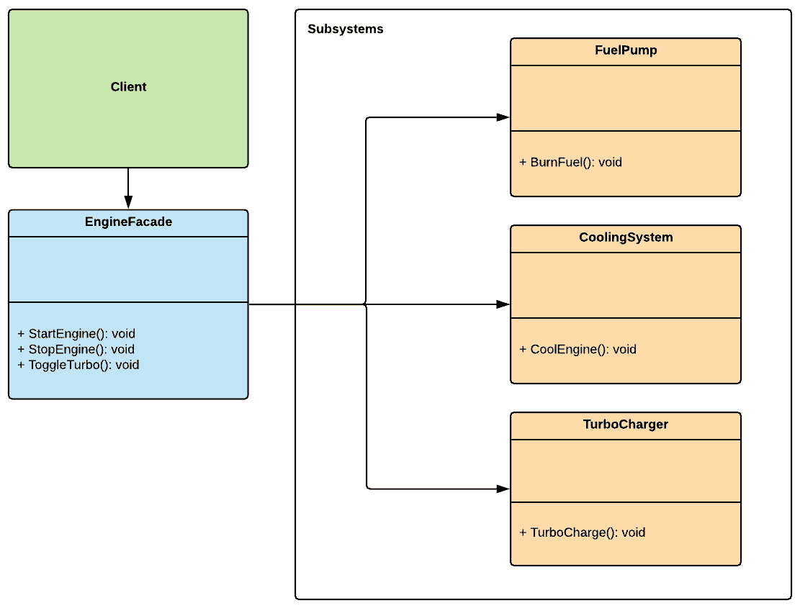

使用外观模式隐藏复杂性

外观模式是一个容易理解的模式，因为其名称暗示了其目的。外观模式的主要目的是提供一个简化的前端接口，抽象出复杂系统的复杂内部工作。这种方法对游戏开发有益，因为游戏由各种系统之间的复杂交互组成。作为一个用例，我们将编写代码来模拟车辆引擎核心组件的行为和交互，然后提供一个简单的接口来与整个系统交互。

本章将涵盖以下主题：

+   理解外观模式

+   设计自行车引擎

+   实现自行车引擎

+   使用外观模式的基本车辆引擎实现

由于简单和简洁的原因，本节包括了一个引擎实现的简化版本。此代码示例的完整实现可以在 GitHub 项目的`/FPP`文件夹中找到——链接可在*技术要求*部分找到。

# 第十九章：技术要求

这是一个实践性章节，因此你需要对 Unity 和 C#有基本的了解。

本章的代码文件可以在 GitHub 上找到，链接为[`github.com/PacktPublishing/Game-Development-Patterns-with-Unity-2021-Second-Edition/tree/main/Assets/Chapters/Chapter15`](https://github.com/PacktPublishing/Game-Development-Patterns-with-Unity-2021-Second-Edition/tree/main/Assets/Chapters/Chapter15)。

观看以下视频，查看代码的实际效果：

[`bit.ly/36wJdxe`](https://bit.ly/36wJdxe)

# 理解外观模式

外观模式的名称类似于建筑的立面——正如其名所示，它是一个外部面，隐藏着复杂的内部结构。与建筑结构相反，在软件开发中，外观模式的目标不是美化；相反，它是为了简化。正如我们将在以下图中看到的那样，外观模式的实现通常限于一个类，该类作为一组相互作用的子系统的简化接口：



图 15.1 – 外观模式的统一建模语言（UML）图

如前图所示，`EngineFacade`充当引擎各个组件的接口，因此当在`EngineFacade`上调用`StartEngine()`时，客户端对幕后发生的事情一无所知。它不知道构成引擎的组件以及如何访问它们；它只知道它需要知道的内容。这类似于当你转动汽车点火钥匙时发生的情况——你看不到引擎盖下发生了什么，你也不需要知道；你唯一关心的是引擎是否启动。因此，外观模式在代码中也提供了这种相同级别的抽象，保持系统引擎盖下的细节。

外观模式属于结构模式类别。这个分类中的模式关注于类和对象是如何组合成更大的结构的。

## 优点和缺点

下面是外观模式的一些**优点**：

+   **简化对复杂代码体的接口**：一个坚实的外观类将隐藏复杂性，同时提供一个简化的接口与复杂的系统交互。

+   **易于重构**：在背后修改组件的同时，由于系统的接口对客户端保持一致，因此隔离在外观背后的代码更容易重构。

下面是一些需要注意的**缺点**：

+   **使其更容易隐藏混乱**：使用外观模式在干净的面向用户界面后面隐藏混乱的代码，从长远来看可能会损害模式的核心优势，但这个模式确实提供了一种方法来掩盖一些代码问题，直到你有时间重构它们。然而，期望以后有足够的时间来修复问题是自身的一个陷阱，因为我们很少有时间正确地重构事物。

+   **过多的外观**：在 Unity 开发者中，全局可访问的管理器类作为核心系统的外观很受欢迎；他们通常通过结合单例和外观模式来实现它们。不幸的是，滥用这种组合很容易，最终导致代码库中包含过多的管理器类，每个类都依赖于其他类才能正常工作。因此，调试、重构和单元测试组件变得非常困难。

外观模式建立了一个新的接口，而适配器模式则适配一个旧接口。因此，在实现看似和听起来相似的模式时，牢记它们在目的上不一定相同是至关重要的。

# 设计自行车发动机

我们的目标不是为自行车实现一个实际的汽油发动机的完整模拟；这将花费太长时间，并且需要深入了解真实世界发动机的物理和机械原理。但我们将尝试以最小程度模拟高速车辆发动机的一些标准组件。因此，首先，让我们分解我们发动机每个部分的预期行为，如下所示：

+   **冷却系统**：冷却系统负责确保发动机不过热。当涡轮增压器被激活时，冷却系统在涡轮增压器工作期间关闭。这种行为意味着如果玩家过度使用涡轮增压器，这可能会导致发动机过热，进而导致发动机停止或爆炸，自行车将停止移动。

+   **燃油泵**：该组件负责管理自行车的燃油消耗。它知道剩余的汽油量，并在汽油耗尽时停止发动机。

+   **涡轮增压器**：如果涡轮增压器被激活，车辆的极速会增加，但冷却系统会暂时关闭，以便发动机的电路可以传递动力到充电器。

在下一节中，我们将为这些组件中的每一个实现一个骨架类，并建立一个发动机`Facade`类，以便客户端可以启动和停止发动机。

当涡轮增压器被激活时关闭冷却系统的设计意图是为了创造一种风险与回报的感觉。玩家必须平衡想要更快行驶的愿望与发动机过热的潜在后果。

# 实现自行车发动机

正如我们将看到的，Facade 模式很简单，所以我们将保持以下代码示例简单直接。首先，我们将为组成自行车发动机的核心组件编写类，如下所示：

1.  我们将从燃油泵开始；这个组件的目的是模拟燃油消耗，以便它知道剩余的燃油量，并在燃油耗尽时关闭发动机。以下是所需的代码：

```cs
using UnityEngine;
using System.Collections;

namespace Chapter.Facade
{
    public class FuelPump : MonoBehaviour
    {
        public BikeEngine engine;
        public IEnumerator burnFuel;

        void Start()
        {
            burnFuel = BurnFuel();
        }

        IEnumerator BurnFuel()
        {
            while (true)
            {
                yield return new WaitForSeconds(1);
                engine.fuelAmount -= engine.burnRate;

                if (engine.fuelAmount <= 0.0f) {
                    engine.TurnOff();
                    yield return 0;
                }
            }
        }

        void OnGUI()
        {
            GUI.color = Color.green;
            GUI.Label(
                new Rect(100, 40, 500, 20), 
                "Fuel: " +  engine.fuelAmount);
        }

```

```cs
    } 
}
```

1.  接下来是冷却系统，它负责防止发动机过热，但如果涡轮增压器被激活，则会关闭。代码如下所示：

```cs
using UnityEngine;
using System.Collections;

namespace Chapter.Facade {
    public class CoolingSystem : MonoBehaviour {

        public BikeEngine engine;
        public IEnumerator coolEngine;
        private bool _isPaused;

        void Start() {
            coolEngine = CoolEngine();
        }

        public void PauseCooling() {
            _isPaused = !_isPaused;
        }

        public void ResetTemperature() {
            engine.currentTemp = 0.0f;
        }

        IEnumerator CoolEngine() {
            while (true) {
                yield return new WaitForSeconds(1);

                if (!_isPaused) {
                    if (engine.currentTemp > engine.minTemp)
                        engine.currentTemp -= engine.tempRate;
                    if (engine.currentTemp < engine.minTemp)
                        engine.currentTemp += engine.tempRate;
                } else {
                    engine.currentTemp += engine.tempRate;
                }

                if (engine.currentTemp > engine.maxTemp)
                    engine.TurnOff();
            }
        }

        void OnGUI() {
            GUI.color = Color.green;
            GUI.Label(
                new Rect(100, 20, 500, 20), 
                "Temp: " +  engine.currentTemp);
        }
    }
}
```

1.  最后，当涡轮增压器被激活时，它会增加自行车的极速，但为了使其工作，它需要暂时关闭冷却系统。以下是实现这一功能的代码：

```cs
using UnityEngine;
using System.Collections;

namespace Chapter.Facade
{
    public class TurboCharger : MonoBehaviour
    {
        public BikeEngine engine;

        private bool _isTurboOn;
        private CoolingSystem _coolingSystem;

        public void ToggleTurbo(CoolingSystem coolingSystem)
        {
            _coolingSystem = coolingSystem;

            if (!_isTurboOn)
                StartCoroutine(TurboCharge());
        }

        IEnumerator TurboCharge()
        {
            _isTurboOn = true;
            _coolingSystem.PauseCooling();

            yield return new WaitForSeconds(engine.turboDuration);

            _isTurboOn = false;
            _coolingSystem.PauseCooling();
        }

        void OnGUI()
        {
            GUI.color = Color.green;
            GUI.Label(
                new Rect(100, 60, 500, 20), 
                "Turbo Activated: " +  _isTurboOn);
        }

```

```cs
    }
}
```

1.  现在我们已经准备好了发动机的核心组件，我们需要实现一个类，允许客户端无缝地与之交互。因此，我们将实现一个名为`BikeEngine`的 Facade 类，它将为客户端提供一个接口来启动和停止发动机以及切换涡轮增压。

```cs
using UnityEngine;

namespace Chapter.Facade
{
    public class BikeEngine : MonoBehaviour
    {
        public float burnRate = 1.0f;
        public float fuelAmount = 100.0f;
        public float tempRate = 5.0f;
        public float minTemp = 50.0f;
        public float maxTemp = 65.0f;
        public float currentTemp;
        public float turboDuration = 2.0f;

        private bool _isEngineOn;
        private FuelPump _fuelPump;
        private TurboCharger _turboCharger;
        private CoolingSystem _coolingSystem;

        void Awake() {
            _fuelPump = 
                gameObject.AddComponent<FuelPump>();

            _turboCharger = 
                gameObject.AddComponent<TurboCharger>();

            _coolingSystem = 
                gameObject.AddComponent<CoolingSystem>();
        }

        void Start() {
            _fuelPump.engine = this;
            _turboCharger.engine = this;
            _coolingSystem.engine = this;
        }
```

这个类的第一部分是初始化代码，这部分是自解释的，但以下部分是重要的：

```cs
        public void TurnOn() {
            _isEngineOn = true;
            StartCoroutine(_fuelPump.burnFuel);
            StartCoroutine(_coolingSystem.coolEngine);
        }

        public void TurnOff() {
            _isEngineOn = false;
            _coolingSystem.ResetTemperature();
            StopCoroutine(_fuelPump.burnFuel);
            StopCoroutine(_coolingSystem.coolEngine);
        }

        public void ToggleTurbo() {
            if (_isEngineOn) 
                _turboCharger.ToggleTurbo(_coolingSystem);
        }

        void OnGUI() {
            GUI.color = Color.green;
            GUI.Label(
                new Rect(100, 0, 500, 20), 
                "Engine Running: " +  _isEngineOn);
        }
    }
}
```

如我们所见，`EngineFacade`类公开了自行车发动机提供的可用功能，同时，它也隐藏了其组件之间的交互。如果我们想启动发动机，我们只需要调用`StartEngine()`方法。如果我们没有像我们刚刚实现的那样有一个 Facade 模式，我们就必须单独初始化每个发动机组件，并知道每个组件的设置参数和要调用的方法。Facade 模式允许我们将所有复杂性隐藏在干净的接口后面。

但假设我们希望添加另一个发动机组件，例如一个硝基喷射器；在这种情况下，我们只需要修改`BikeFacade`类，并公开一个新的公共方法，以便我们可以触发喷射器。

## 测试发动机 Facade

我们可以通过向一个空的 Unity 场景中的 GameObject 添加以下客户端脚本来快速测试我们刚刚实现的代码：

```cs
using UnityEngine;

namespace Chapter.Facade
{
    public class ClientFacade : MonoBehaviour
    {
        private BikeEngine _bikeEngine;

        void Start()
        {
            _bikeEngine = 
                gameObject.AddComponent<BikeEngine>();
        }

        void OnGUI()
        {
            if (GUILayout.Button("Turn On"))
                _bikeEngine.TurnOn();

            if (GUILayout.Button("Turn Off"))
                _bikeEngine.TurnOff();

            if (GUILayout.Button("Toggle Turbo"))
                _bikeEngine.ToggleTurbo();
        }
    }
}
```

在客户端类中，我们看到它并不了解引擎的内部工作原理，这就是我们使用外观模式时想要达到的效果。客户端类唯一知道的是，它可以调用由`BikeEngine`类提供的公共方法来启动和停止引擎，以及切换涡轮增压功能。换句话说，就像现实生活中一样，我们不需要打开引擎盖来启动引擎；我们转动点火钥匙，组件就会开始协同工作，而我们不需要知道它们是如何相互作用的。

在下一节中，我们将回顾在决定使用外观模式之前需要考虑的备选解决方案。

在这个代码示例的更高级版本中，引擎将计算当前的每分钟转速（RPM）——也称为引擎速度——并且我们可以将其连接到一个由换挡输入调节的齿轮系统，玩家可以通过这个系统来控制自行车的速度。因此，我们可以在任何时候轻松地提高现实感水平。

# 审查备选解决方案

在考虑使用外观模式之前，有几个备选方案需要考虑，具体取决于你实际上想要实现什么。这些方案在此列出：

+   **抽象工厂模式**：如果你只想从客户端代码中隐藏子系统对象的初始化方式，你应该考虑使用抽象工厂模式而不是外观模式。

+   **适配器**：如果你打算编写一个“包装器”来覆盖现有的类，目的是连接两个不兼容的接口，那么你应该考虑使用适配器模式。

# 摘要

尽管外观模式有时被用来隐藏混乱的代码，但当你按照预期使用它时，它可以通过隐藏子系统背后的复杂交互，通过单一的前端界面来增强代码库的可读性和可用性。因此，它对于游戏编程来说是一个非常有益的模式，但需要谨慎且带有良好的意图来使用。

在即将到来的章节中，我们将探讨一个名为服务定位器（Service Locator）的模式，我们将使用它来管理全局依赖项并公开核心服务。
