# *第一章*：你好，Unity

在我们开始使用 Unity 开发游戏之前，我认为首先了解 Unity 本身是很好的。许多人，尤其是对游戏和游戏开发感兴趣的人，都知道 Unity 是一个广泛使用的游戏引擎，您可能玩过许多使用 Unity 开发的游戏。但您可能不熟悉如何使用 Unity 来开发游戏。例如，有多个不同的 Unity 版本可供选择，那么您如何选择适合您的版本呢？Unity 提供了不同的订阅计划，但哪个订阅计划适合您的具体情况？

如果您之前从未使用过 Unity，那么首先学习如何使用 Unity 编辑器是必要的。除了 Unity 编辑器之外，Unity 引擎还提供了哪些功能来帮助游戏开发者开发游戏？了解 Unity 中的功能也很重要。如果您是.NET 开发者，那么您可能熟悉 Visual Studio。您需要了解如何使用 Visual Studio 来开发 Unity 游戏。但开发 Unity 游戏与开发.NET 应用程序是不同的。

我问的问题太多了吗？不用担心——这一章将帮助您解答这些问题。

在本章中，我们将介绍如何选择正确的 Unity 版本，并提供通过 Unity Hub 或 Unity 安装程序下载和安装 Unity 的概述。然后，我们将为您的情况选择正确的订阅计划。到这时，您应该已经安装了 Unity 并打开了 Unity 编辑器。

如果您刚刚开始使用 Unity 编辑器，您可能不知道如何使用它。我们将首先探索 Unity 编辑器，然后讨论 Unity 提供的不同功能。然后，我们将介绍 Unity 中的.NET 配置文件和 Unity 提供的脚本后端。最后，我们将展示如何使用 Visual Studio 来开发 Unity 游戏。

在本章中，我们将涵盖以下关键主题：

+   开始使用 Unity 编辑器

+   在 Unity 中处理不同的功能

+   .NET/C#和 Unity 中的脚本

+   使用 Visual Studio 构建 Unity 游戏

# 技术要求

在开始之前，我强烈建议您首先检查您的系统是否可以运行 Unity 编辑器。以下表格给出了运行 Unity 编辑器的最低要求：

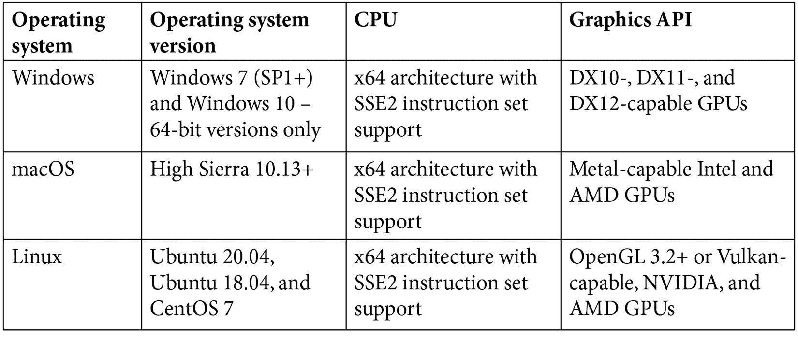

# 开始使用 Unity 编辑器

无论您是独立游戏开发者还是为公司团队工作，在安装或下载 Unity 之前，您需要做两件事：

+   选择适合您的 Unity 版本。

+   选择适合您的订阅计划。

因此，在介绍如何安装 Unity 和探索 Unity 编辑器之前，让我们首先介绍 Unity 版本和订阅计划。我们希望您通过阅读这些内容，可以找到适合您的版本并选择一个合适的订阅计划。

## 选择适合您的 Unity 版本

现在，Unity 每年提供两个不同的版本。它们如下所示：

+   Tech Stream 版本

+   **长期支持**（**LTS**）版本：

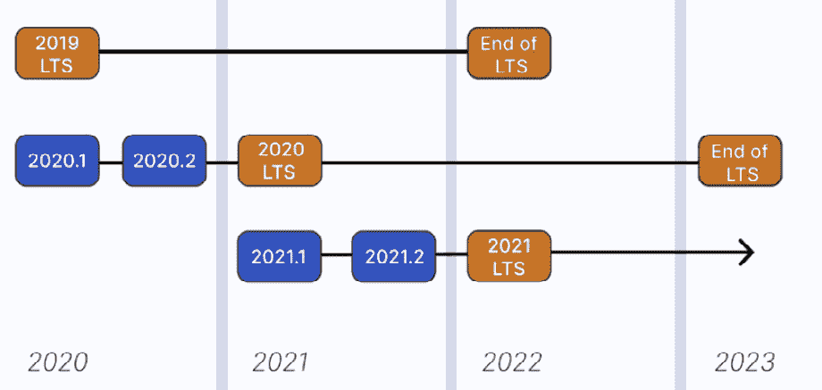

图 1.1 – Unity 版本发布

您可能不确定在您的项目中使用哪个版本的 Unity 最佳，因此我将解释这两个不同的版本，以便您了解如何选择适合您的版本。

LTS 版本为开发者提供最大稳定性和对其项目的全面支持，并且是每年最后一个技术流版本。LTS 版本没有新功能或 API 变更。LTS 版本的更新解决崩溃，修复错误和任何小问题。正如我在本节开头提到的，每年，Unity 会发布 LTS 版本的新版本，每个版本从发布之日起支持 2 年。

因此，如果您正在寻找性能和稳定性，或者您的项目已经处于生产状态或开发过程中，使用最新的长期支持版本是一个好主意，以确保最佳性能和稳定性。

注意

在撰写本文时（2022 年 4 月），有两个长期支持版本发布，分别是 Unity 2020 LTS 和 Unity 2019.4。Unity 2020 LTS 是最新的长期支持版本，具有与 Unity 2020.2 技术流版本相同的特性集。另一方面，Unity 2019.4 现在是遗留的长期支持版本。

技术流版本为想要探索最新进行中特性的开发者提供了一个选项，他们可以使用这些版本为未来的项目做准备。与长期支持版本不同，技术流版本每年发布两次（通常在第一季度和第四季度发布），并且只支持到下一个技术流版本正式发布。

因此，如果您正在为您的下一个项目做准备或正在做原型设计和实验，您应该尝试技术流版本。

注意

在撰写本文时（2022 年 4 月），最新的技术流版本是 Unity 2021.2。

通过阅读本节，我希望您已经了解了 Unity 版本发布的情况，并且应该能够根据您的具体情况选择正确的 Unity 版本。

在撰写本书时，我选择了最新的 LTS 版本，Unity 2020.3。

## 选择适合您的订阅计划

Unity 是一个广泛使用的游戏引擎，许多独立游戏开发者使用 Unity 来开发他们的游戏。但从技术上讲，Unity 不是一个免费的游戏引擎。在本节中，我将介绍 Unity 提供的几种不同的订阅计划。希望您阅读本节后，能够选择适合您情况的订阅计划。

Unity 提供了一系列计划，从为个人学习者提供的免费个人计划到大型组织使用的企业计划：

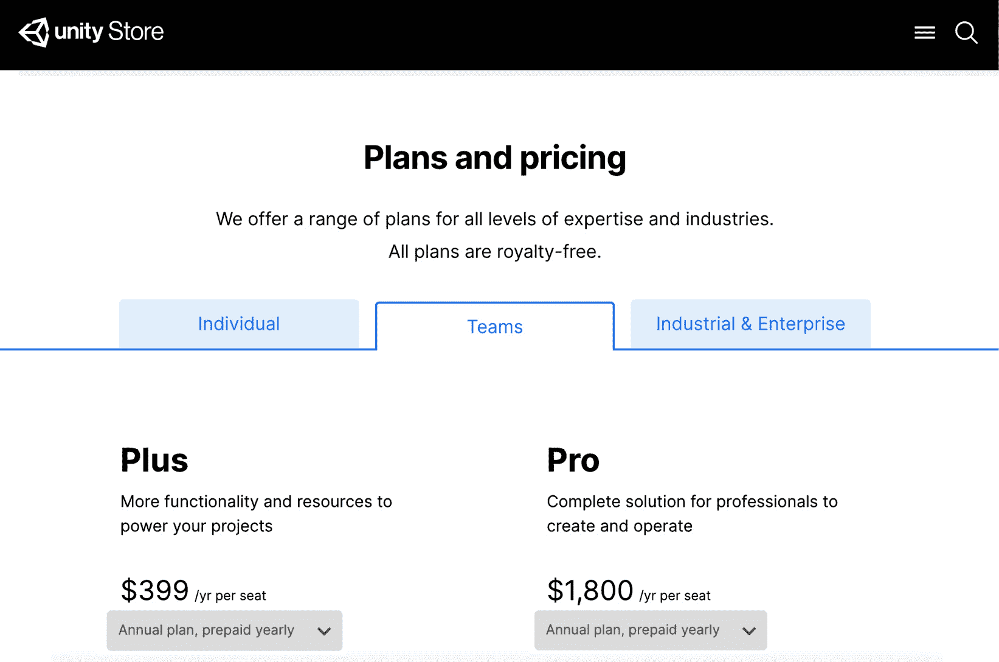

图 1.2 – 计划和定价页面

由于每个 Unity 计划有不同的资格要求，您应选择适合您项目的正确计划。接下来，我将介绍订阅计划：

+   **个人计划** 是免费的，包括 Unity 的所有基本功能。如果您作为个人工作，并且在过去 12 个月内从您的 Unity 项目中获得的收入或资金少于 10 万美元，您可以选择此计划。此外，如果您是学生或教育工作者，您还可以获得额外的好处，但在那之前，您需要加入 **GitHub 学生开发者包** 以进行验证。

+   **专业计划** 是一个付费计划，提供更多功能性和培训资源，例如高级云诊断和启动画面定制。如果您在过去 12 个月内使用 Unity 获得的收入超过 10 万美元但少于 20 万美元，您应该选择此计划。

+   **专业计划** 也是一个付费计划。与 Plus 计划相比，您可以通过使用专业计划从 Unity 获得更多技术支持。如果您的组织在过去 12 个月内从任何来源获得的收入超过 20 万美元，您必须使用专业计划或 **企业计划**。

+   **企业计划** 专门针对至少有 20 名成员的团队，并且提供的支持比专业计划更多。例如，Unity 的客户成功经理将被分配到您的组织，以提供指导、协调资源和作为内部倡导者。

希望这一部分对您选择适合您情况的正确 Unity 计划有所帮助。接下来，让我们下载并安装 Unity 编辑器！

## 下载和安装 Unity 编辑器

下载和安装 Unity 编辑器有两种不同的方法。下载和安装 Unity 的第一种和推荐的方法是使用 **Unity Hub**。

Unity Hub 是一个管理工具，可以用来管理您所有的 Unity 项目和 Unity 安装。我们可以采取以下步骤来安装 Unity Hub 和 Unity 编辑器：

1.  要安装 Unity Hub，请访问 [`unity3d.com/get-unity/download`](https://unity3d.com/get-unity/download) 上的 **下载 Unity** 页面：

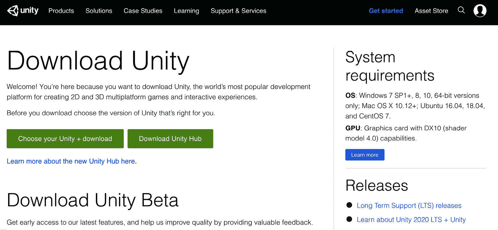

图 1.3 – 下载 Unity 页面

如您在前一张截图的 **系统要求** 部分所见，Unity Hub 支持 **Windows**、**Mac OS X**、**Ubuntu** 和 **CentOS**。

1.  安装 Unity Hub 非常简单；您只需选择 Unity Hub 安装的文件夹。然后，点击 **安装** 按钮：

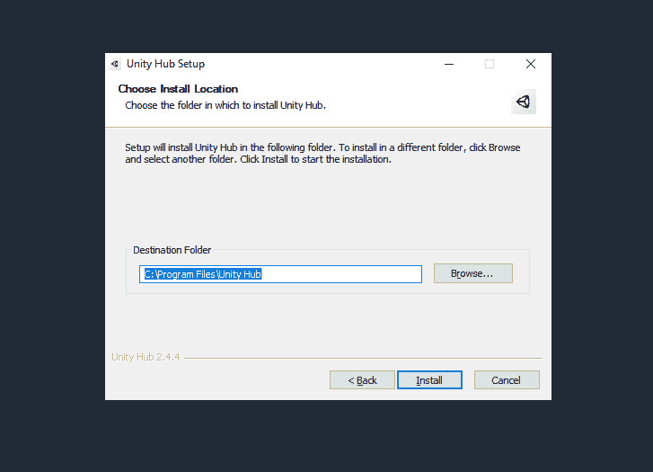

图 1.4 – Unity Hub 安装

1.  安装 Unity Hub 后，选择 **运行 Unity Hub** 选项，然后点击 **完成** 按钮以启动 Unity Hub：

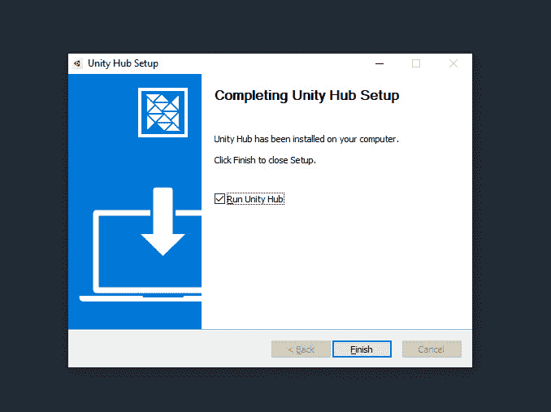

图 1.5 – 完成 Unity Hub 安装

我在撰写本文时使用的是 Unity Hub 的最新版本（*版本 3.0.0*）。如果您使用过 Unity Hub 的早期版本，您会发现新版本的 Unity Hub 的启动页面完全不同。

1.  你需要一个 Unity 账户才能访问 Unity 编辑器和 Unity Hub。如果你还没有 Unity 账户，那么你需要创建一个新的：

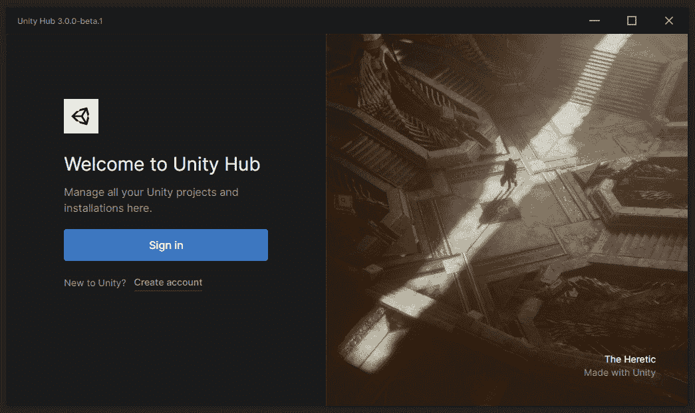

图 1.6 – Unity Hub

1.  当你首次登录 Unity Hub 时，你将被要求添加一个有效许可证，如以下截图顶部所示。点击 **管理许可证** 按钮以打开 **许可证** 设置面板：

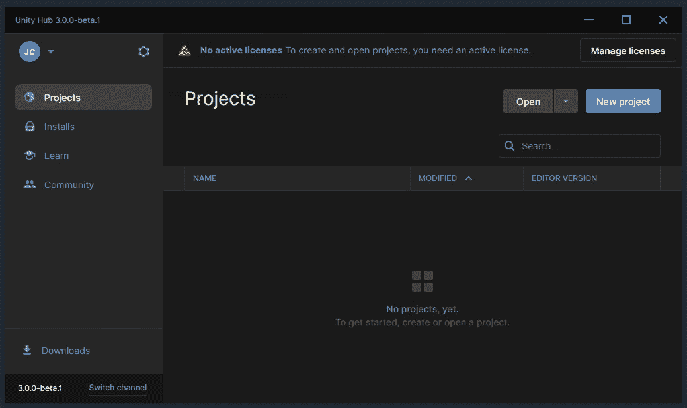

图 1.7 – 点击管理许可证按钮

1.  有两个按钮可供你添加新的许可证。你可以点击右上角的 **添加** 按钮，或者点击 **添加许可证** 按钮：

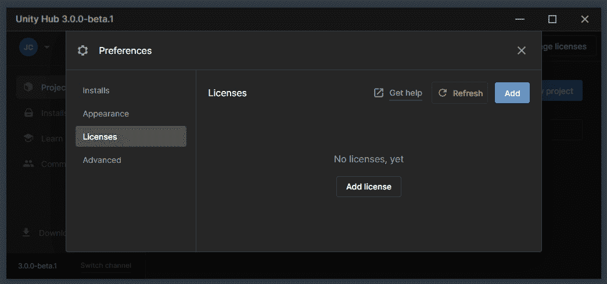

图 1.8 – 许可证设置面板

然后，你有不同的选项来激活许可证。我们已经在上一节讨论了不同的 Unity 订阅计划：

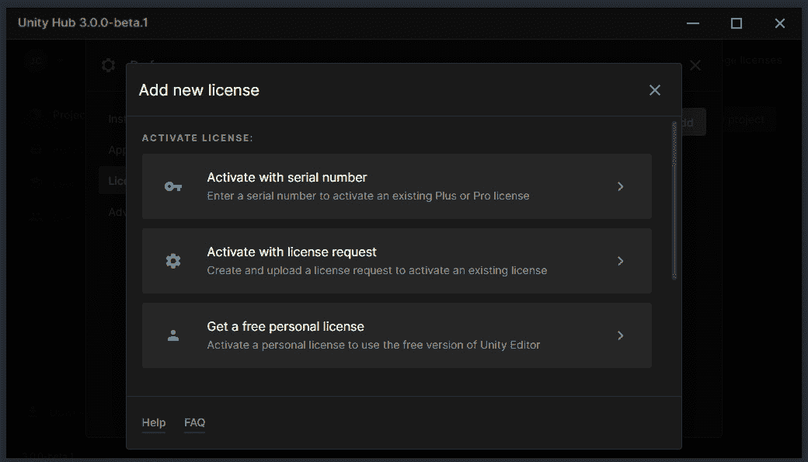

图 1.9 – 添加新许可证

1.  添加新的许可证后，我们可以开始探索 Unity Hub。从 **项目** 视图，你可以找到由 Unity Hub 跟踪的 Unity 项目的列表。你还可以通过点击 **项目** 视图右上角的 **新建项目** 按钮创建一个全新的项目，或者通过点击 **打开** 按钮导入现有项目：

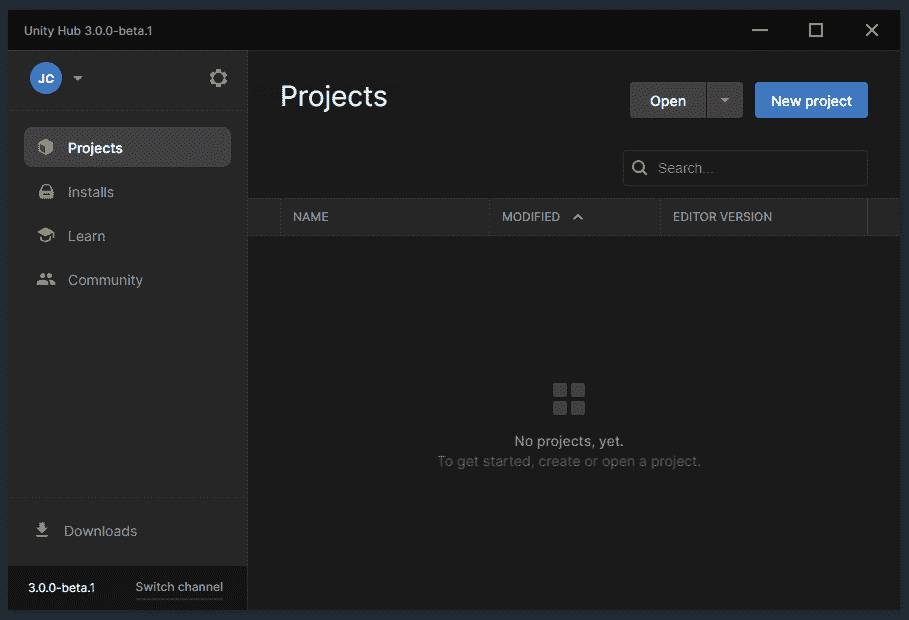

图 1.10 – 项目视图

1.  要安装 Unity 编辑器，请打开 **安装** 视图，在那里你可以管理多个版本的 Unity 编辑器的安装：

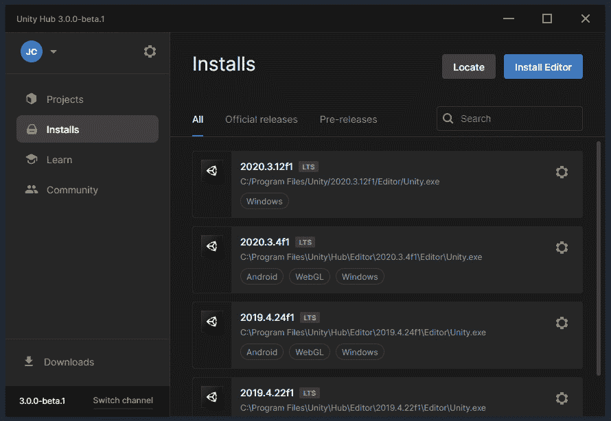

图 1.11 – 安装视图

Unity Hub 安装并管理着一系列的 Unity 编辑器。类似于 **项目** 视图，你可以下载并安装新的 Unity 编辑器，或者导入一个未被 Unity Hub 管理的现有 Unity 编辑器，例如我们使用 Unity 安装程序安装的 Unity 编辑器。

1.  通过点击 **安装编辑器** 视图中的 **安装编辑器** 按钮打开 **安装 Unity 编辑器** 面板。然后，你将看到每个发布版本的最新版本：

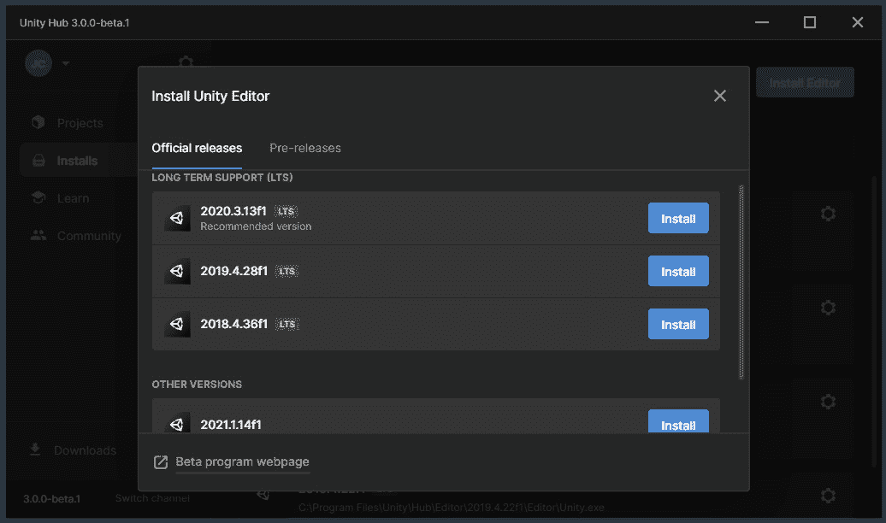

图 1.12 – 安装 Unity 编辑器

注意

Unity 2018 LTS 已达到其支持周期的结束，因此你不应该安装它。

我们将使用 Unity 2020 LTS 版本的最新版本，因此我们需要在此处安装 Unity **2020.3.13f1**：

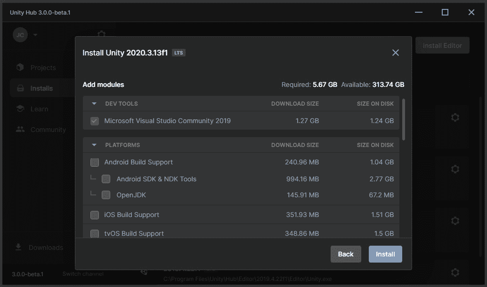

图 1.13 – 安装 Unity 2020.3.13f1

然后，我们需要选择需要安装的模块。如前一个截图所示，**Microsoft Visual Studio Community 2019** 将默认安装，这将作为我们在 Unity 中开发游戏的 **集成开发环境**（**IDE**）。

注意

如果您想更改安装位置，您可以在**首选项**面板的**安装**设置中更改它。

下载并安装完成后，我们就准备好开始探索 Unity 编辑器了！

有时，您可能需要一个通过 Unity Hub 无法获取的特定版本，例如一些较旧的 Unity 版本。在这种情况下，您还可以通过第二种方式安装 Unity 编辑器，即通过**Unity 安装程序**。您可以使用 Unity 安装程序下载 Unity 的早期版本：

![Figure 1.14 – Unity 下载存档页面

![Figure_1.14_B17146.jpg]

图 1.14 – Unity 下载存档页面

现在，按照以下步骤通过 Unity 安装程序安装 Unity 编辑器：

1.  要下载 Unity 的早期版本，您应该访问 Unity 下载存档页面[`unity3d.com/get-unity/download/archive`](https://unity3d.com/get-unity/download/archive)。

1.  点击**下一步**按钮，并选择您想要下载和安装的 Unity 组件。Unity 安装程序应该类似于以下截图：

![Figure_1.15 – Unity 安装程序

![Figure_1.15_B17146.jpg]

图 1.15 – Unity 安装程序

1.  Unity 编辑器默认选中；为了构建不同平台的游戏，您还需要选择相应的**构建支持**组件。例如，如果您想为运行在 Android 设备上的 Android 游戏构建，您需要下载并安装**Android 构建支持**组件：

![Figure_1.16 – 选择组件

![Figure_1.16_B17146.jpg]

图 1.16 – 选择组件

1.  点击**下一步**按钮，然后您需要选择**下载和安装位置**：

![Figure_1.17 – 选择下载和安装位置

![Figure_1.17_B17146.jpg]

图 1.17 – 选择下载和安装位置

1.  在指定下载和安装这些文件的位置后，点击**下一步**按钮下载 Unity：

![Figure_1.18 – 下载和安装

![Figure_1.18_B17146.jpg]

图 1.18 – 下载和安装

下载和安装完成后，Unity 编辑器图标将出现在您的桌面上。

## 探索 Unity 编辑器

我们需要做的第一件事是使用 Unity Hub 创建一个新的 Unity 项目。正如我在上一节中提到的，我们将通过点击**项目**视图右上角的**新建项目**按钮来创建一个全新的项目。

![Figure_1.19 – 创建新项目

![Figure_1.19_B17146.jpg]

图 1.19 – 创建新项目

如前一张截图所示，我们可以为这个新项目选择不同的 Unity 编辑器版本，Unity 为我们提供了一些内置的项目模板，例如**2D**、**3D**、**HDRP**和**URP**模板。您还可以从 Unity 下载并安装更多模板，例如**VR**模板和**AR**模板。在**项目设置**部分，您可以设置项目的名称和项目位置。

在这里，我们将选择默认的 `UnityBook`。然后，点击 **创建项目** 按钮。之后，您之前选择的 Unity 编辑器将启动并为您打开一个新项目：

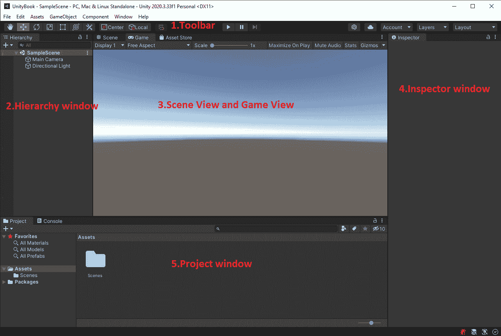

图 1.20 – Unity 编辑器

如前一张截图所示，Unity 编辑器布局为您组织了最重要的窗口。具体来说，默认布局将编辑器界面分为五个关键区域。从上到下，它们如下所示：

1.  **工具栏**

1.  **层级窗口**

1.  **场景视图和游戏视图**

1.  **检查器窗口**

1.  **项目窗口**

接下来，我将按顺序介绍这些 UI 区域。

### 工具栏

工具栏始终位于 Unity 编辑器界面的顶部，它由几个控制组组成：

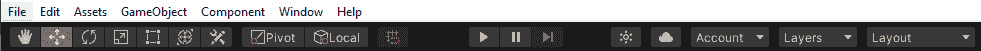

图 1.21 – 工具栏

从左到右，工具栏中的第一个工具是 **变换工具集**。变换工具用于 **场景** 视图，允许您在场景中平移并移动、旋转和缩放单个 GameObject：

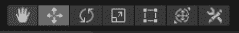

图 1.22 – 变换工具集

下一个工具是 ** Gizmo 处理位置切换集**，它用于定义 **场景** 视图中任何变换工具 Gizmo 的位置：

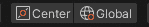

图 1.23 – Gizmo 处理位置切换集

然后，您可以在中间找到 **播放、暂停和单步按钮**。您可以在 **游戏** 视图中使用这些按钮：

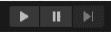

图 1.24 – 播放、暂停和单步按钮

在右侧，让我们首先看看 **Unity Plastic SCM** 按钮，它允许您直接在 Unity 编辑器中访问 Plastic SCM 版本控制和源代码管理工具。您可以点击 **云** 按钮打开 **Unity 服务** 窗口，在那里您可以访问 Unity 提供的许多云服务，例如 **云构建** 服务、**分析** 服务和 **广告** 服务。

您也可以从 **账户** 下拉菜单访问您的 Unity 账户。右侧还有两个其他下拉菜单，即 **图层** 和 **布局**；您可以使用 **图层** 下拉菜单控制 **场景** 视图中哪些对象出现，并使用 **布局** 下拉菜单更改或创建新的 Unity 编辑器布局：

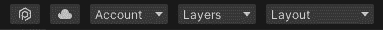

图 1.25 – Unity Collaborate 和 Unity Services 按钮，以及 Unity 账户、图层和布局下拉菜单

### 层级窗口

第二个区域是**层次结构**窗口。如图所示，Unity 编辑器中的**层次结构**窗口以**场景**的形式显示所有内容；场景中的事物，如**主摄像机**、**方向光**和 3D 立方体，被称为**游戏对象**。

我们还可以在**层次结构**窗口中组织游戏世界中所有的对象：

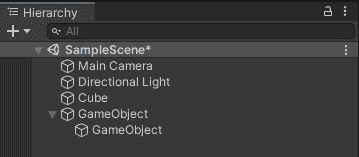

图 1.26 – 层次结构窗口

在场景中创建新的游戏对象非常简单。你只需要在**层次结构**窗口上右键单击，就会弹出一个菜单，你可以从中选择要创建的对象：

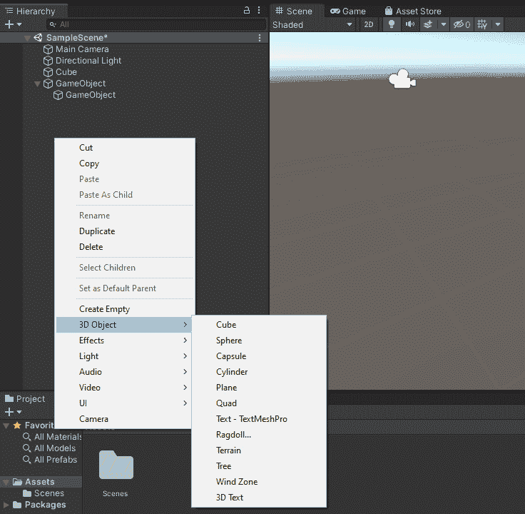

图 1.27 – 创建新的游戏对象

值得注意的是，Unity 使用父子层次结构来组织游戏对象，因此你可以创建一个对象作为另一个对象的子对象。如果你想创建一个新的游戏对象作为另一个游戏对象的子对象，那么你只需要首先选择父游戏对象，然后右键单击以创建子游戏对象：

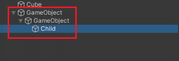

图 1.28 – 父子层次结构

创建父子层次结构的另一种方法是直接将现有的游戏对象拖动到**层次结构**窗口中的父游戏对象上：

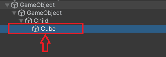

图 1.29 – 父子层次结构

如前图所示，我们将名为**Cube**的游戏对象拖动到名为**Child**的游戏对象上以创建父子层次结构。

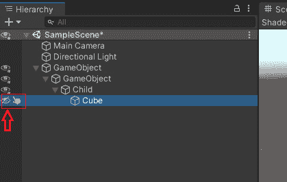

图 1.30 – 隐藏和显示游戏对象

**层次结构**窗口的另一个功能是，它允许你在**场景**视图中隐藏和显示游戏对象，而不会改变它们在**游戏**视图或最终应用程序中的可见性。

### 场景视图和游戏视图

默认 Unity 编辑器布局的中心是**场景**视图和**游戏**视图，这是 Unity 编辑器中最重要的窗口。**场景**视图是你正在创建的游戏世界的交互式视图：

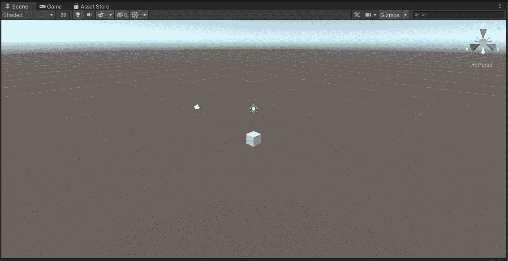

图 1.31 – 场景视图

你可以使用**场景**视图来操纵游戏对象，并从不同的角度查看它们。此外，**场景**视图中还有一些有用的工具，例如位于**场景**视图右上角的**场景**Gizmo 工具：

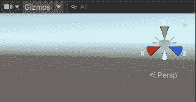

图 1.32 – 场景 Gizmo 工具

它显示了场景视图相机的当前方向，并允许你快速修改视图角度和投影模式。

如果你想修改场景视图相机的设置，你可以点击**Gizmos**按钮旁边的**相机**按钮以打开**场景相机**设置窗口：

![图 1.33 – 场景相机设置

![Figure_1.33_B17146.jpg]

Figure 1.33 – The Scene Camera settings

在这里，您可以调整**场景**视图相机的某些设置，例如**视野**和**相机速度**。

可视网格是您可以在**场景**视图中使用的另一个有用工具，可以帮助您通过将 GameObject 移动到最近的网格位置来对齐 GameObject：

![Figure 1.34 – Toggle the visibility of the grid]

![img/Figure_1.34_B17146.jpg]

Figure 1.34 – 切换网格的可见性

如您在前面的屏幕截图中所见，您还可以将 GameObject 移动到沿**X**、**Y**或**Z**轴投影的网格上。

我想介绍的最后一个有用的**场景**视图工具是**绘制模式**：

![Figure 1.35 – The draw mode in the Scene]

![Figure_1.35_B17146.jpg]

Figure 1.35 – The draw mode in the Scene

如果您的项目使用 Unity 的内置渲染管线，这很有用，因为场景中的不同绘制模式可以帮助您理解和调试其中的光照。

在默认布局中，**游戏**视图也出现在与**场景**视图相同的区域。您可以通过点击**游戏**按钮从**场景**视图切换到**游戏**视图：

![Figure 1.36 – Click the Game button to switch to the Game view]

![img/Figure_1.36_B17146.jpg]

![Figure 1.36 – 点击游戏按钮切换到游戏视图]

**游戏**视图代表您最终发布的游戏。**游戏**视图的内容是从您游戏中的相机渲染的。在**游戏**视图中，您不能像在**场景**视图中那样随意修改观看角度和投影模式。您需要修改相机对象设置以实现此功能：

![Figure 1.37 – The Game view]

![img/Figure_1.37_B17146.jpg]

![Figure 1.37 – The Game view]

您可以直接在**游戏**视图中运行您的游戏，通过在工具栏上点击**播放**按钮。需要注意的是，在**播放**模式下，您所做的任何更改都是临时的，并在退出时重置；因此，在播放模式下进行大量更改不是一个好主意。

我想介绍**游戏**视图中三个工具，即**纵横比**、**播放时最大化**和**统计信息**。

**纵横比**下拉菜单在您为不同纵横比的不同屏幕开发游戏时非常有用。您可以选择不同的值来测试您的游戏在这些屏幕上的外观，并且您甚至可以通过点击菜单底部的**加号**按钮添加自定义值：

![img/Figure_1.38_B17146.jpg]

Figure 1.38 – The Free Aspect drop-down menu

第二个功能称为**播放时最大化**，当您进入播放模式时，它可以最大化**游戏**视图以进行全屏预览：

![img/Figure_1.39_B17146.jpg]

Figure 1.39 – The Maximize On Play button

第三个功能称为**统计信息**。这个功能很有用，因为它可以显示关于您游戏音频和图形的**渲染统计信息**。因此，您可以在播放模式下使用它来监控您游戏的表现：

![img/Figure_1.40_B17146.jpg]

图 1.40 – 统计窗口

在**场景**视图中，你可以查看和调整你正在创建的游戏世界。在**游戏**视图中，你可以看到你的最终游戏。因此，这个区域在编辑器中非常重要。接下来，让我们看看与场景中特定 GameObject 相关的 UI 区域。

### 检查器窗口

如果你想要修改 GameObject 或 GameObject 上的组件的属性，你需要使用**检查器**窗口。

你可以在**场景**视图或**层次结构**窗口中选择一个 GameObject，然后你将在**检查器**窗口中看到它的属性和组件：

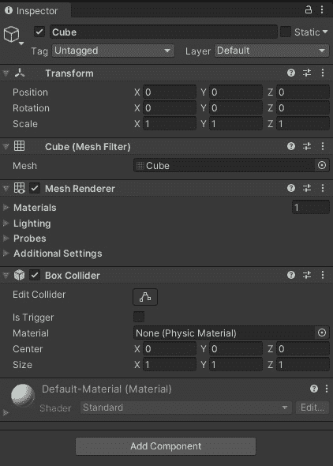

图 1.41 – GameObject 的检查器窗口

你可以直接在**检查器**窗口中修改这些属性，该窗口还提供了一些有用的工具，可以帮助你修改你的 GameObject。

例如，如果你想复制 GameObject 上组件的值，你可以在组件上右键单击，然后会弹出一个菜单；从那里，你可以选择**复制组件**命令：

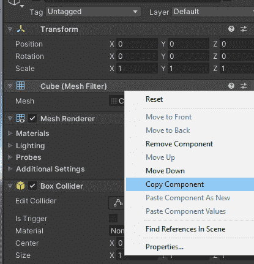

图 1.42 – 复制组件

不仅可以在**场景**视图中检查 GameObject，还可以在**项目**窗口中检查数字资源。你可以在**项目**窗口中选择一个数字资源，然后**检查器**窗口将显示控制 Unity 在运行时导入和使用该资源的设置的设置：

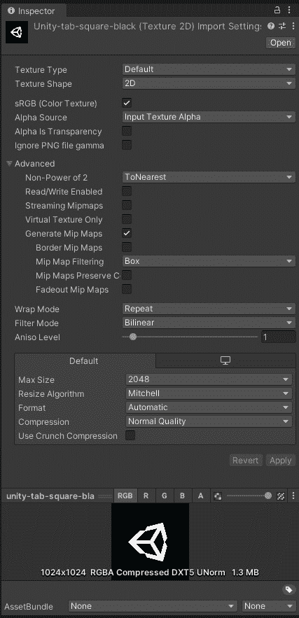

图 1.43 – 资源的检查器窗口

在本节中，我们学习了如何通过**检查器**窗口查看和修改 GameObject 和资源的属性。

### 项目窗口

我将要介绍的最后一个窗口是文件夹中的`assets`文件：

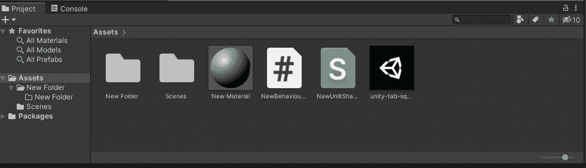

图 1.44 – 项目窗口

**项目**窗口是导航和查找游戏内资源的主要方式。它提供了两种搜索资源的方式，按类型或标签：

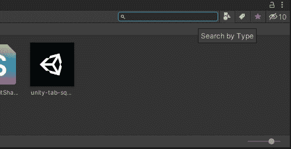

图 1.45 – 通过类型搜索资源

在 Unity 编辑器中导入外部数字资源或直接创建资源非常容易。你只需在项目窗口上右键单击，就会弹出一个菜单，你可以从中创建一个新的资源或导入现有的资源：

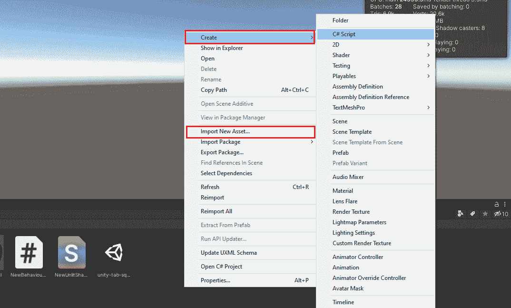

图 1.46 – 创建资源

希望通过阅读本节，你现在对 Unity 编辑器有了很好的理解。接下来，我将介绍什么是游戏引擎，以及 Unity 作为游戏引擎提供了哪些重要功能。

# 在 Unity 中处理不同的功能

现在，Unity 不再仅仅是一个游戏引擎，而是一个在各个行业中广泛使用的创意工具。然而，Unity 仍然保留了其游戏引擎的根源，并且仍然是最受欢迎的游戏引擎之一。要学习如何使用 Unity 开发游戏，你必须首先了解 Unity 作为游戏引擎为游戏开发者提供了哪些功能。

实际上，几乎所有的游戏引擎都为游戏开发者提供了类似于 Unity 的功能模块。所以，第一个问题是，游戏引擎究竟是什么？

## 什么是游戏引擎？

**游戏引擎**这个术语在游戏行业中广泛使用，但并非每个人都了解这个术语的含义，尤其是新游戏开发者。所以，我将解释什么是游戏引擎，同时介绍 Unity 中的相应功能。

游戏引擎不仅仅是计算机图形渲染器。当然，渲染是游戏引擎的一个重要功能，但创建游戏的过程远比仅仅渲染复杂得多。

作为一名游戏开发者，您需要导入不同类型的**数字资产**，例如 3D 模型、2D 纹理和音频，而且这些数字资产中的大多数都不是在游戏引擎内部创建的。因此，游戏引擎应该提供管理数字资产的功能。除了数字资产之外，您还需要使用**脚本**来添加游戏逻辑，以引导这些资产执行正确的行为，例如角色交互。

**UI**是游戏中的另一个重要组成部分，甚至有些游戏玩法是基于 UI 的。因此，一个好的游戏引擎应该提供易于使用且功能强大的 UI 工具包，以开发游戏的用户界面。

您可以使用其他软件来开发动画文件并将它们导入到游戏引擎中，但为了使动画文件在游戏中正确播放和控制，游戏引擎需要提供**动画**功能。

同时，**物理**效果是现代游戏中常见的功能，因此一个强大的游戏引擎应该提供物理功能，以便游戏开发者不需要从头开始实现物理效果。

毫无疑问，将**视频和音频**添加到您的游戏中可以使您的游戏更加生动有趣。特别是音频，合适的背景音乐和一些适当的声音效果可以使您的游戏感觉完全不同。即使只是一个原型，背景音乐和声音效果也可以使游戏更加完整和更加专业。因此，尽管许多人经常在谈论游戏引擎时忽略视频和声音的功能，但我认为没有视频和音频功能的游戏引擎不是一个好的游戏引擎。

正如您所看到的，游戏引擎中有很多功能供游戏开发者开发他们的游戏。游戏引擎整合了创建游戏的各个方面，以创建完整的游戏用户体验。因此，在游戏开发中，您将处理不同的功能。例如，您可能需要适当地管理数字资产并为您的游戏引擎创建适当的数字资产以优化运行时的性能，或者您可能需要了解如何使用您所使用的游戏引擎提供的脚本功能来为您的游戏开发逻辑。

作为最受欢迎的游戏引擎之一，Unity 也提供了上述功能。在接下来的小节中，我将介绍 Unity 中的这些功能。

## Unity 中的功能

与其他优秀的游戏引擎一样，Unity 也为游戏开发者提供了许多功能。您将在接下来的章节中了解这些功能。

### 图形

我要介绍的第一个功能是 Unity 中的 **图形**。您可以使用 Unity 的图形功能在各种平台上创建美观、优化的图形：

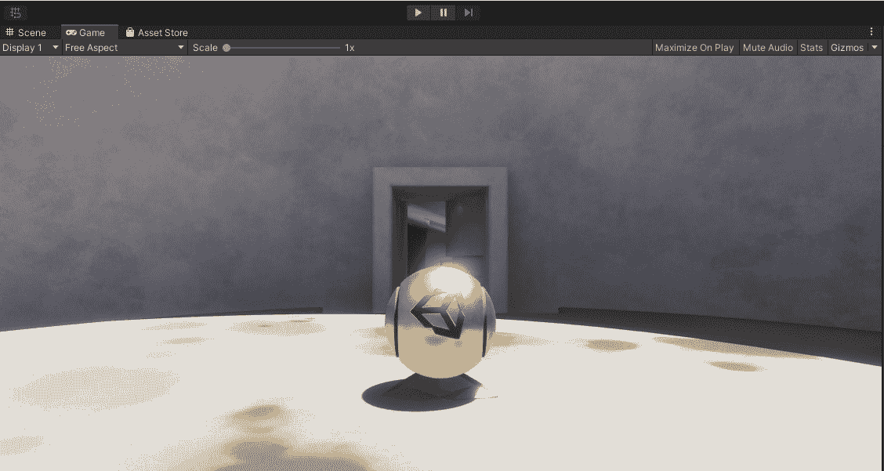

图 1.47 – Unity HDRP 模板场景

渲染管线执行一系列操作，将场景内容渲染到屏幕上。Unity 中有三种可用的渲染管线：

+   **内置渲染管线**，这是 Unity 中的默认渲染管线。您无法修改此渲染管线。

+   **通用渲染管线**（**URP**），它允许开发者针对不同平台自定义和创建优化的图形。

+   **高清晰度渲染管线**（**HDRP**），它专注于高端平台上的尖端、高保真图形。

此外，您还可以通过使用 Unity 中的 **可脚本化渲染管线 API** 来创建自己的渲染管线。我们将在*第八章*，“Unity 中的可脚本化渲染管线”中详细介绍它。

### 脚本

**脚本**是 Unity 的另一个基本功能。您需要脚本来实现游戏中的游戏逻辑。

Unity 引擎内部使用原生 C/C++ 构建，但它提供了 C# 脚本 API，因此您不需要学习 C/C++ 就可以创建游戏。在接下来的章节中，您将了解更多关于脚本的概念。

### UI

UI 对于游戏非常重要，Unity 为游戏开发者提供了三种不同的 UI 解决方案：

+   **即时模式图形用户界面**（**IMGUI**）

+   **Unity UI**（**uGUI**）包

+   **UI 工具包**

IMGUI 是 Unity 中相对较旧的 UI 解决方案，不建议用于构建运行时 UI。UI Toolkit 是最新的 UI 解决方案；然而，它仍然缺少您可以在 uGUI 包和 IMGUI 中找到的一些功能。uGUI 包是 Unity 中成熟的 UI 解决方案，在游戏行业中得到广泛应用。我们将在*第三章*，“使用 Unity UI 系统开发 UI”中详细介绍 uGUI 包。

### 动画

动画可以使您的游戏更加生动。Unity 提供了一个强大的动画功能，称为 **Mecanim**，它允许您重定向动画，在运行时控制其权重，并从动画播放中调用事件。

我们将在*第四章*，“使用 Unity 动画系统创建动画”中介绍 Unity 的动画系统。

### 物理引擎

**物理模拟**是某些类型游戏中的必备功能，某些游戏玩法甚至完全基于物理模拟。Unity 中有不同的物理引擎实现，您可以根据游戏需求选择一个。

我们将在 *第五章* 中介绍 Unity 的物理引擎实现，*使用 Unity 物理系统*。

### 视频 和 音频

优秀的背景音乐、音效和视频可以使您的游戏脱颖而出。这是一个不容忽视的功能。Unity 提供了 **视频和音频** 功能，允许您的游戏在不同的平台上播放视频，并支持实时混音和全 3D 空间音效。

我们将在 *第六章* 中更详细地讨论视频和音频，*在 Unity 项目中集成音频和视频*。

### 资产

您可以将您的数字资产文件导入到 Unity 编辑器中，例如 3D 模型和 2D 纹理。Unity 提供了一个资产导入管道来处理这些导入的资产。您还可以自定义导入设置来控制 Unity 在运行时如何导入和使用这些资产。

我们将在 *第十章* 中介绍 **资产管理** 和 **序列化**，*Unity 和 Azure 中的序列化系统和资产管理*。

我们简要介绍了游戏引擎需要提供的功能以及 Unity 提供的功能。接下来，让我们介绍 .NET/C# 和 Unity 中的脚本。

# .NET/C# 和 Unity 脚本

Unity 是一个用 C/C++ 编写的游戏引擎，但为了使游戏开发者更容易开发游戏，Unity 提供了 C#（发音为 C-sharp）作为脚本编程语言，以便在 Unity 中编写游戏逻辑。这是因为与 C/C++ 相比，C# 更容易学习。此外，它是一种“托管语言”，这意味着它会自动为您管理内存 – 分配和释放内存，防止内存泄漏等。

在本节中，我们将介绍 .NET/C# 和 Unity 中的脚本。

## Unity 中的 .NET 配置文件

Unity 游戏引擎使用 **Mono**，一个开源的 ECMA CLI、C# 和 .NET 实现，用于脚本。您可以在 GitHub 上跟踪 Unity 对 Mono 的分支开发：[`github.com/Unity-Technologies/mono/tree/unity-master-new-unitychanges`](https://github.com/Unity-Technologies/mono/tree/unity-master-new-unitychanges)。

Unity 提供了不同的 .NET 配置文件。如果您使用的是 Unity 的旧版本，即在 Unity 2018 之前，您可能会发现它在 **Player** 设置面板中提供了两个 API 兼容性级别（**编辑** | **项目设置** | **Player** | **其他设置**），即 **.NET 2.0 子集** 和 **.NET 2.0**。首先，如果您使用的是 Unity 的旧版本，那么我强烈建议您更新您的 Unity 版本。其次，Unity 中的 **.NET 2.0 子集** 和 **.NET 2.0** 配置文件与微软的 .NET 2.0 配置文件紧密一致。

如果您使用的是 Unity 的现代版本，即 Unity 2019 或更高版本，您会发现 Unity 支持另外两个 .NET 配置文件，即 **.NET Standard 2.0** 和 **.NET 4.x**：

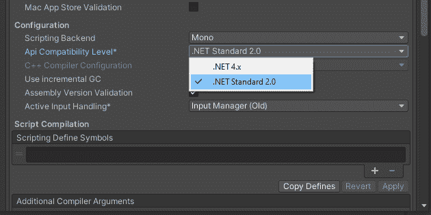

图 1.48 – Api 兼容性级别设置

注意

.NET Standard 2.0 配置文件的名字可能有点误导，因为它与 Unity 旧版本中的**.NET 2.0**和**.NET 2.0 子集**配置文件无关。

.NET Standard 是.NET API 的正式规范，所有.NET 平台都必须实现。这些.NET 平台包括.NET Framework、.NET Core、Xamarin 和 Mono。你可以在 GitHub 上找到.NET Standard 仓库：[`github.com/dotnet/standard`](https://github.com/dotnet/standard)。

另一方面，Unity 中的.NET 4.x 配置文件与.NET Framework 的.NET 4 系列配置文件（.NET 4.5、.NET 4.6、.NET 4.7 等）相匹配。

因此，在 Unity 中使用.NET Standard 2.0 配置文件是个不错的选择，而且你应该只为了兼容性原因选择.NET 4.x 配置文件。

## Unity 中的脚本后端

除了.NET 配置文件外，Unity 还提供了两种不同的**脚本后端**，分别是**Mono**和**IL2CPP**（代表**中间语言到 C++**）：

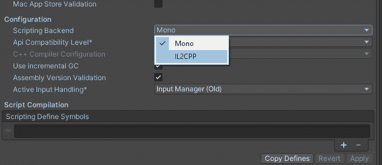

图 1.49 – 脚本后端设置

你可以在相同的设置面板中更改项目的脚本后端，该面板可以通过访问**编辑** | **项目设置** | **玩家** | **其他设置**找到。

两种脚本后端之间的关键区别在于它们如何编译你的 Unity 脚本 API 代码（C#代码）：

+   Mono 脚本后端使用**即时编译**（**JIT**）编译，在运行时按需编译代码。它将你的 Unity 脚本 API 代码编译成常规.NET DLL。而且，正如我在前面的章节中提到的，Unity 使用一个支持 C#的 Mono 运行时的实现来执行脚本。

+   或者，IL2CPP 脚本后端使用**即时编译**（**AOT**）编译，在运行前编译整个应用程序。它不仅将你的 Unity 脚本 API 代码编译成.NET DLL，还将所有托管程序集转换为标准 C++代码。此外，IL2CPP 的运行时是由 Unity 开发的，它是 Mono 运行时的替代品：

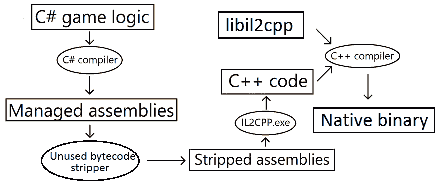

图 1.50 – IL2CPP 脚本后端

如*图 1.50*所示，IL2CPP 不仅将 C#代码编译成托管程序集，而且还进一步将程序集转换为 C++代码，然后编译 C++代码成原生二进制格式。

显然，与 Mono 相比，IL2CPP 编译代码需要更多的时间，那么为什么我们还需要 IL2CPP 呢？

好吧，首先，IL2CPP 使用 AOT 编译，编译时间较长，但当你为特定平台发布游戏时，二进制文件是完整指定的，这意味着与 Mono 相比，代码生成得到了极大的改进。

其次，值得注意的是，当为**iOS**和**WebGL**构建时，IL2CPP 是唯一的脚本后端。除了 iOS 和 WebGL，Unity 在 Unity 2018.2 中增加了对**Android 64 位**的支持，以符合**Google Play** **商店**政策，该政策要求从 2019 年 8 月 1 日起，你在 Google Play 上发布的应用需要支持 64 位架构：

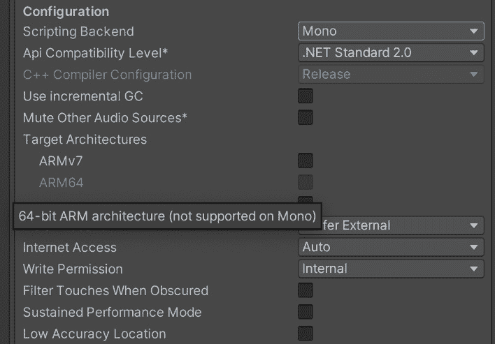

图 1.51 – Android 64 位 ARM 架构不支持 Mono 脚本后端

如前述截图所示，Android 64 位 ARM 架构不支持 Mono 脚本后端。在这种情况下，你必须选择 IL2CPP 脚本后端。

因此，无论我们是为了更好的代码生成还是针对某些特定的平台或架构使用 IL2CPP，花费更多的时间进行编译仍然是 IL2CPP 的缺点。那么，我们应该如何优化 IL2CPP 的编译时间呢？我认为以下提示会有所帮助：

+   不要删除之前的`build`文件夹，并在与文件夹相同的目录下使用 IL2CPP 脚本后端构建你的项目。这是因为我们可以使用增量构建，这意味着 C++编译器只重新编译自上次构建以来已更改的文件。

+   将你的项目和目标构建文件夹存储在**固态硬盘**（**SSD**）上。这是因为当选择 IL2CPP 时，编译过程会将 IL 代码转换为 C++并编译它，这涉及到大量的读写操作。一个更快的存储设备将加快这一过程。

+   在构建项目之前，请禁用防病毒软件。当然，这取决于你的安全策略。

好吧，我希望通过阅读本节，你现在对 Unity 的脚本系统有了大致的了解，例如 Unity 中的.NET 配置文件、两个脚本后端以及一些 IL2CPP 的优化技巧。

在下一节中，你将学习如何设置你的开发环境并使用广泛使用的 Visual Studio 在 Unity 中开发游戏。

# 使用 Visual Studio 构建 Unity 游戏

在开始编写任何代码之前，选择合适的发展工具非常重要。微软的**Visual Studio**不仅是一个广泛使用的 IDE，而且当你在 Windows 或 macOS 上安装 Unity 时，它还是默认安装的开发环境：

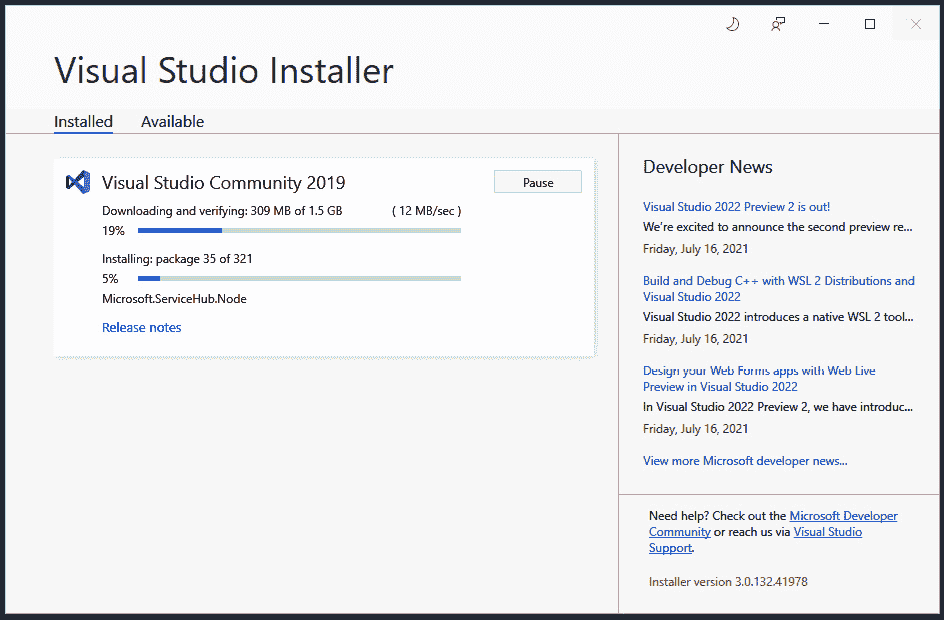

图 1.52 – Visual Studio 安装程序

在安装 Visual Studio 时，**Visual Studio Tools for Unity**也会被安装。这是一个免费扩展，它为在 Unity 中编写和调试 C#提供支持。

如果你没有通过 Unity Hub 安装 Visual Studio，请确保你已安装此扩展。你可以在**Visual Studio 安装程序**中检查：

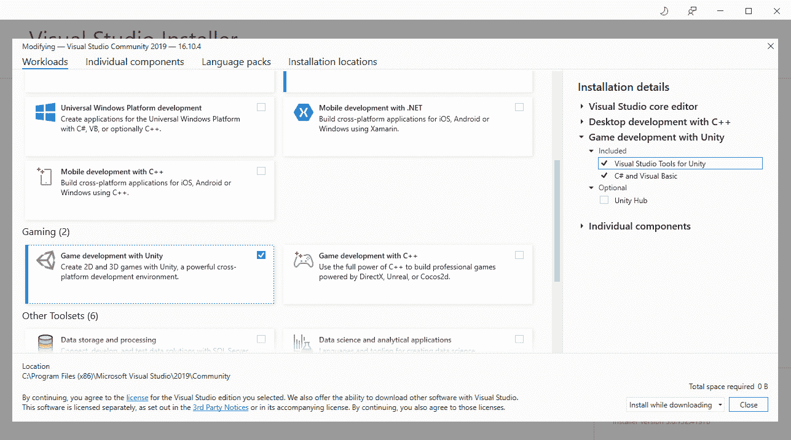

图 1.53 – 安装 Visual Studio Tools for Unity

安装 Unity 编辑器和 Visual Studio Community 2019 后，你可以在 Unity 编辑器的**首选项**窗口中检查**外部脚本编辑器**设置：

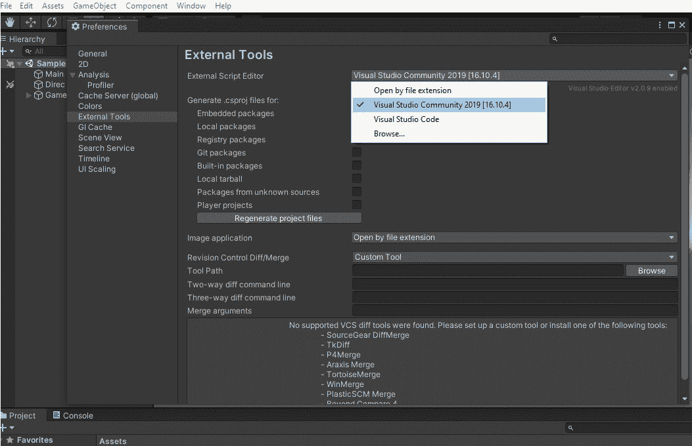

图 1.54 – 外部脚本编辑器设置

此外，您还可以通过修改此设置来选择其他脚本编辑器，例如**Visual Studio Code**和**JetBrains Rider**。

然后，我们可以在 Unity 编辑器中创建一个名为`NewBehaviourScript`的新 C#脚本文件，并双击它以在 Visual Studio 中打开：

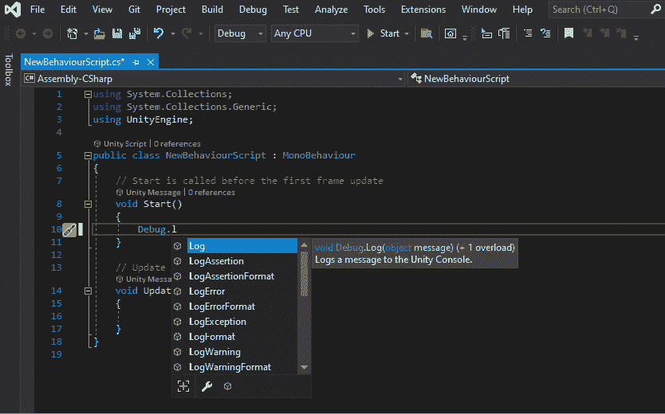

图 1.55 – Unity API 的 IntelliSense

如前述截图所示，脚本文件中默认有两个内置方法，即`Start`和`Update`。Visual Studio 支持 Unity API 的**IntelliSense**，因此我们可以快速编写代码：

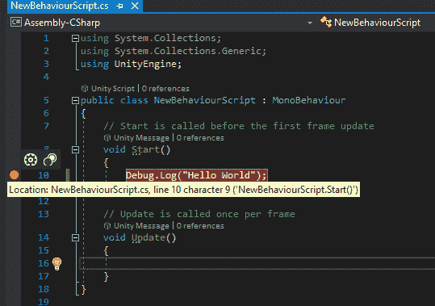

图 1.56 – 调试您的代码

在 Visual Studio 中调试您的代码也非常容易。在前述截图中，我在`Start`方法内设置了断点，并在 Visual Studio 中点击了**附加到 Unity**按钮：

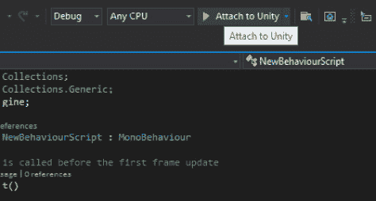

图 1.57 – 点击“附加到 Unity”按钮

为了运行此代码，我将此脚本附加到场景中的 GameObject 上，并在 Unity 编辑器中点击**播放**按钮以在**游戏**视图中运行游戏。

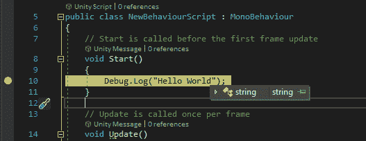

图 1.58 – 调试器在断点处停止

然后，调试器将在断点处停止，您可以看到游戏当前的状态。

# 摘要

在本章中，我们首先选择了适合您需求的 Unity 发布和订阅计划。然后，您学习了如何使用 Unity Hub 安装和管理 Unity 编辑器，并探索了 Unity 编辑器的五个重要区域——工具栏、**层次结构**窗口、**场景**视图和**游戏**视图、**检查器**窗口和**项目**窗口。然后，您被介绍到 Unity 编辑器的工具栏和 Unity 提供的窗口。我们还讨论了游戏引擎是什么，并探索了 Unity 为开发者提供的不同游戏开发功能。然后，我们介绍了 Unity 中的.NET 配置文件和 Unity 提供的脚本后端；您现在应该知道 Mono 脚本后端和 IL2CPP 脚本后端的区别。最后，我们演示了如何为 Unity 编辑器设置 Visual Studio 以编写代码。

在下一章中，我们将从 Unity 脚本的基本概念详细介绍开始，例如 GameObject、组件，以及一些特殊且重要的组件，如**Transform**。我们还将向您介绍脚本实例的生命周期。然后，我们将讨论如何通过脚本创建对象以及如何通过 C#代码访问 GameObject 或组件。还将介绍 Unity 脚本的一些最佳实践。最后，我们将介绍 Unity 中的**包**和**包管理器**。
