# *第四章*：使用 Unity 动画系统创建动画

不论是 2D 游戏还是 3D 游戏，如果你想使游戏生动有趣，良好的动画是必不可少的。作为一个非常流行的游戏引擎，Unity 提供了易于使用且功能强大的动画开发工具。在本章中，我们将探讨 Unity 中的动画系统，有时也称为**Mecanim**，以使你的游戏中的场景和角色不是静态的，而是动态的。然后，我们将通过两个示例演示如何在 Unity 中实现 3D 和 2D 动画。最后，我们将介绍如何提高 Unity 动画系统的性能。

本章我们将涵盖以下关键主题：

+   探索 Unity 动画系统的概念

+   在 Unity 中实现 3D 动画

+   在 Unity 中实现 2D 动画

+   提高 Unity 动画系统的性能

到本章结束时，你将能够创建 Unity 中的 3D 和 2D 动画，以及了解如何通过 C#代码控制动画以及如何优化动画性能。

# 技术要求

在开始之前，我建议你首先从 Unity Asset Store 下载**Unity-Chan! Model**：[`assetstore.unity.com/packages/3d/characters/unity-chan-model-18705`](https://assetstore.unity.com/packages/3d/characters/unity-chan-model-18705)。

这个可爱的 3D 女孩模型资产由 Unity Technologies Japan 制作，所有开发者都可以下载并使用它来制作游戏。

本资产包含以下内容：

+   美丽的纹理 3D 模型

+   "Unity-Chan!"原始着色器

+   31 个动画

+   31 个静态姿势

+   由混合形状制成的 12 种表情

+   一个示例移动场景和其他示例场景

现在，让我们开始吧！

# 探索 Unity 动画系统的概念

动画是游戏开发的一个重要方面。在本节中，我们将首先学习 Unity 动画系统的基础概念。具体来说，我们将介绍以下概念：

+   Animation Clips 是什么以及如何在 Unity 中创建一个 Animation Clip

+   如何创建 Animator Controller 来管理一组角色动画

+   如何使用 Avatar 系统与动画绑定一起工作

+   Animator 组件是什么以及如何使用它将动画分配给 GameObject

让我们继续前进！

## Animation Clips

Unity 中的动画可以从简单的立方体旋转到复杂的角色动作，它们都是基于**Animation Clips**的，这些 Clips 用于在 Unity 中存储基于关键帧的动画。

我们可以在 Unity 编辑器中手动创建一个 Animation Clip 文件，通过**Animation**窗口实现一些简单的传统关键帧动画效果，例如简单的移动、旋转等。

以下步骤展示了如何在场景中动画化一个 GameObject：

1.  在**Hierarchy**窗口（右侧）中右键单击，从弹出菜单中选择**3D Object | Cube**以在场景中创建一个新的**Cube**对象。

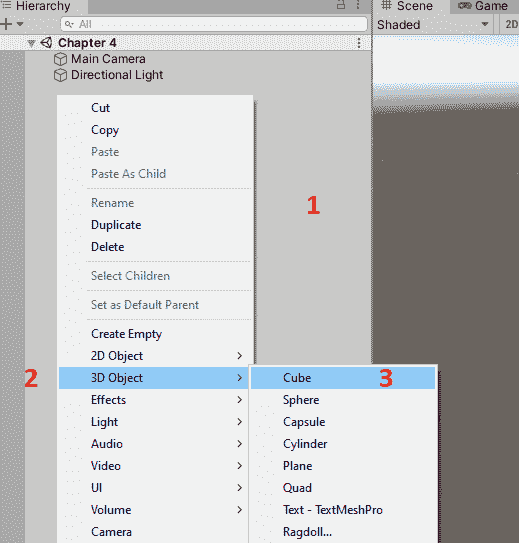

图 4.1 – 在场景中创建一个新的 Cube 对象

1.  在场景视图中选择**Cube**对象。然后导航到**窗口 | 动画 | 动画**以打开**动画**窗口。除了从菜单中打开此窗口外，我们还可以使用*Ctrl + 6*快捷键打开它：

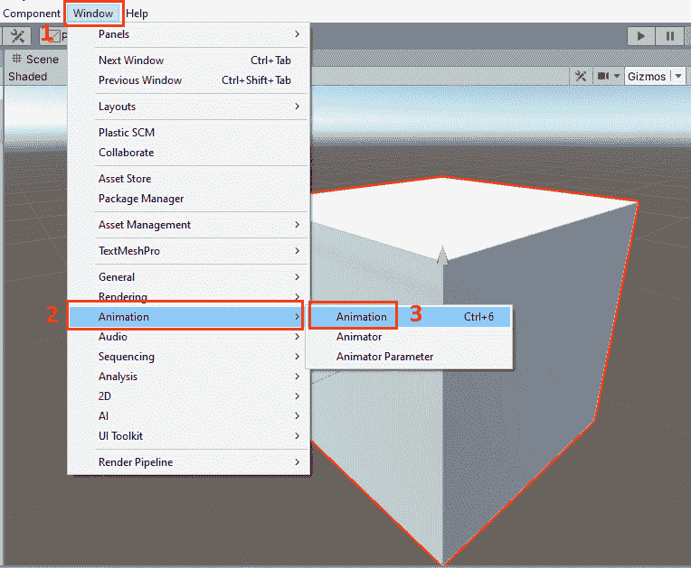

图 4.2 – 打开动画窗口

1.  在**动画**窗口中点击**创建**按钮以创建一个新的动画剪辑：

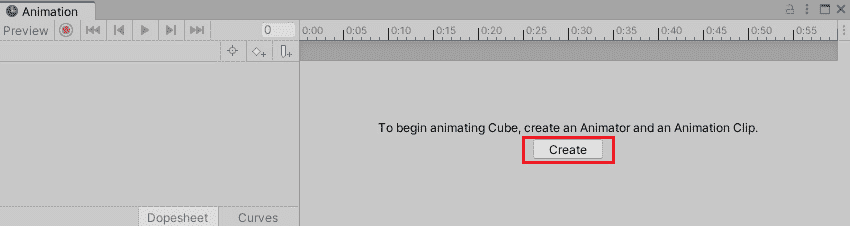

图 4.3 – 动画窗口

1.  点击**添加属性**按钮以显示可以动画化的可用属性列表。如图*图 4.4*所示，我们不仅可以修改**位置**和**旋转**，还可以修改其他组件的属性。在这里，我们可以通过点击旁边的**+**按钮将**缩放**添加为将被动画化的属性：


图 4.4 – 添加属性

1.  当添加属性时，默认创建两个关键帧：第一个关键帧和第二个关键帧分别位于时间轴上的**0:00**和**1:00**。因此，我们需要创建第三个关键帧来改变`0.5`，如图*图 4.5*所示：

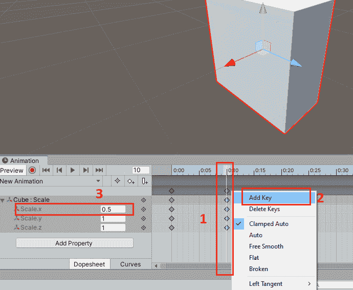

图 4.5 – 添加关键帧

1.  为了预览动画，点击**播放**按钮播放动画剪辑。你会看到立方体的体积迅速缩小然后缓慢增大。


图 4.6 – 播放动画剪辑

我们还可以使用**录制模式**在 Unity 中创建动画剪辑，如下步骤所示：

1.  创建新的 GameObject 和打开**动画**窗口的步骤与之前相同。所以，让我们直接开始如何使用录制模式为场景中的球体对象创建动画剪辑。我们可以点击录制按钮以启用关键帧录制模式，如图*图 4.7*所示：

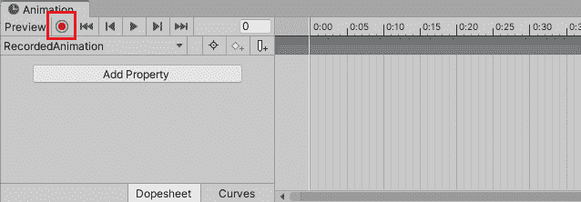

图 4.7 – 启用关键帧录制模式

1.  点击录制按钮后，它将进入录制模式。现在，我们可以通过在时间轴上拖动来修改我们想要的时间点：

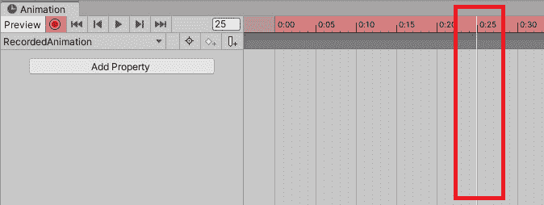

图 4.8 – 在时间轴上拖动

在录制模式下，无论你是在场景中移动、旋转还是缩放目标 GameObject，Unity 都会自动将当前时间点的关键帧添加到动画剪辑中。在这里，我们可以将 GameObject 从其原始位置（0, 0, 0）移动到新的位置，比如（1, 0, 0）。你可以在下面的图中看到 Unity 为球体对象创建了关键帧：

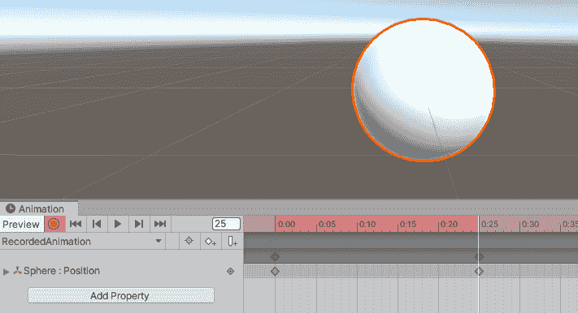

图 4.9 – Unity 创建关键帧

1.  最后，再次点击录制按钮退出录制模式，并点击**播放**按钮播放我们刚刚创建的动画剪辑：

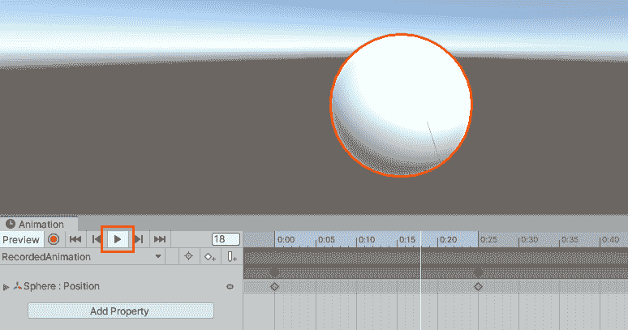

图 4.10 – 播放动画剪辑

此外，将外部动画资产导入 Unity 编辑器也可以自动创建动画剪辑文件。

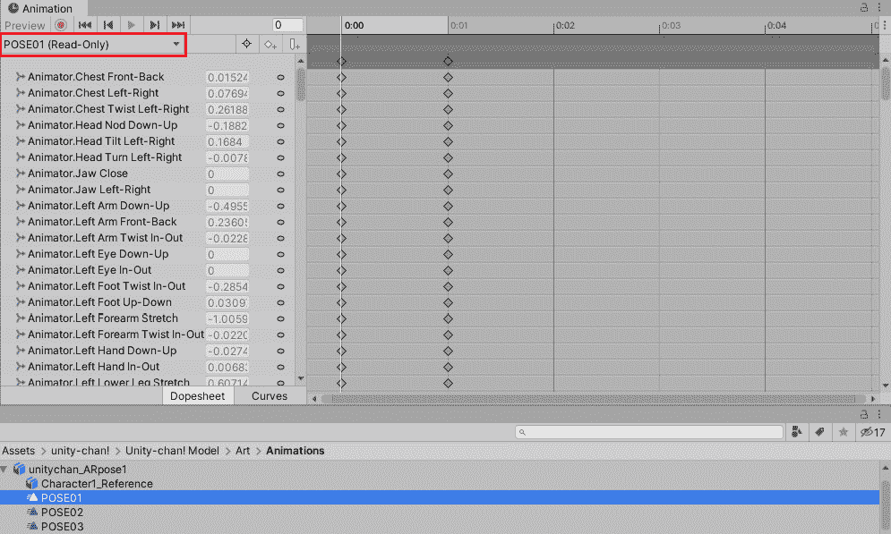

图 4.11 – 导入动画资产后自动创建的动画片段

通用**FBX**文件、**Autodesk® 3ds Max® (.max**)文件、本地**Autodesk® Maya® (.mb 或.ma**)文件和**Blender™ (.blend**)文件等动画文件需要在 Unity 项目中导入后才能被 Unity 使用。动画文件导入后，Unity 将生成动画片段文件。我们可以通过在 Unity 编辑器中双击动画片段文件来打开**Animation**窗口以查看动画片段，如图*图 4.11*所示。

现在您已经了解了什么是动画片段以及如何在 Unity 中创建一个新的动画片段，让我们继续下一个概念：Animator Controller。

## Animator Controller

想象一下我们的游戏角色拥有多个动画。例如，假设一个角色可以跑和攻击——管理这两个动画对于角色来说非常重要。在 Unity 项目中，我们使用**Animator Controller**资产来安排和维护角色或其他动画 GameObject 的动画集。

一个**Animator Controller**将引用它使用的动画片段，并使用所谓的**状态机**来管理各种动画状态及其之间的转换。

我们可以导入我们之前下载的**Unity-Chan!模型**资产。

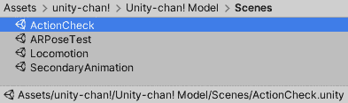

图 4.12 – Unity-Chan!模型 ActionCheck 场景

此资产提供了多个演示场景；我们选择打开`Assets/unity-chan!/Unity-chan! Model/Scenes`文件夹。

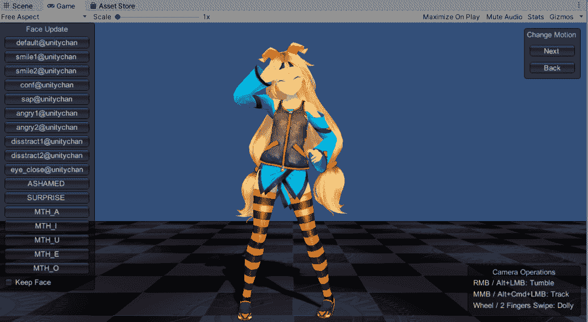

图 4.13 – Unity-Chan!模型

如*图 4.13*所示，Unity-Chan!模型已在场景中设置。如果我们打开此模型使用的 Animator Controller 文件，我们可以看到此模型使用的所有动画片段以及**Animator**窗口中显示的状态机中的动画片段之间的转换，如图*图 4.14*所示。

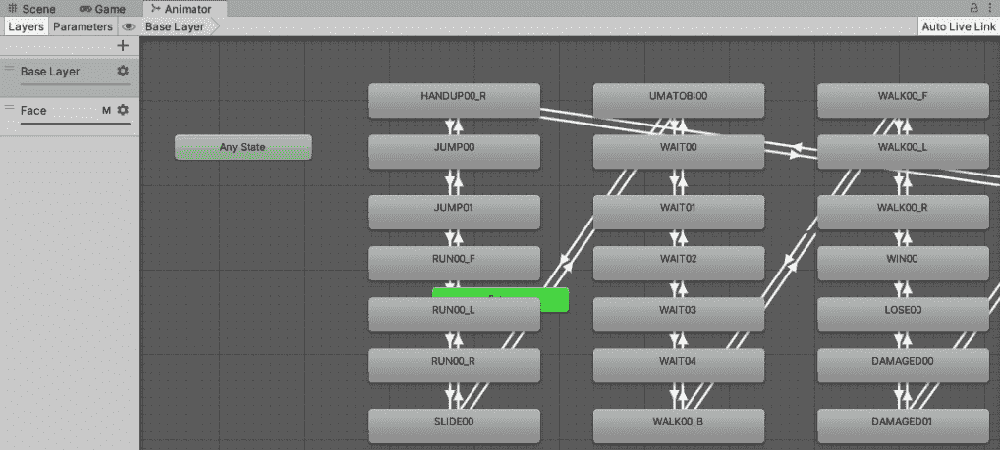

图 4.14 – Animator Controller

我们还可以按照以下步骤在 Unity 编辑器中手动创建**Animator Controller**资产：

1.  选择**项目**视图，右键单击以打开菜单。

1.  选择**创建 | Animator Controller**以创建一个新的**Animator Controller**资产：

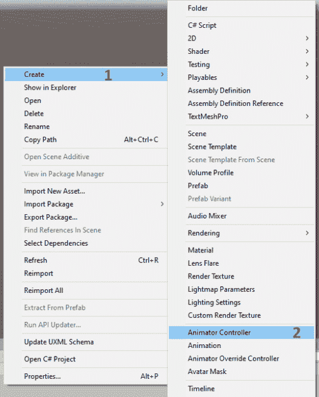

图 4.15 – 创建新 Animator Controller

1.  双击我们刚刚创建的**Animator Controller**资产以打开**Animator**窗口。

1.  在这里，直接将**POSE01**动画片段拖入**Animator**窗口以创建一个新的状态。在状态机中，状态由一个方框表示，因为**POSE01**动画片段是我们拖入的第一个动画，所以我们可以看到这个动画连接到了 Animator Controller 的入口点，这表明这个动画将是默认动画。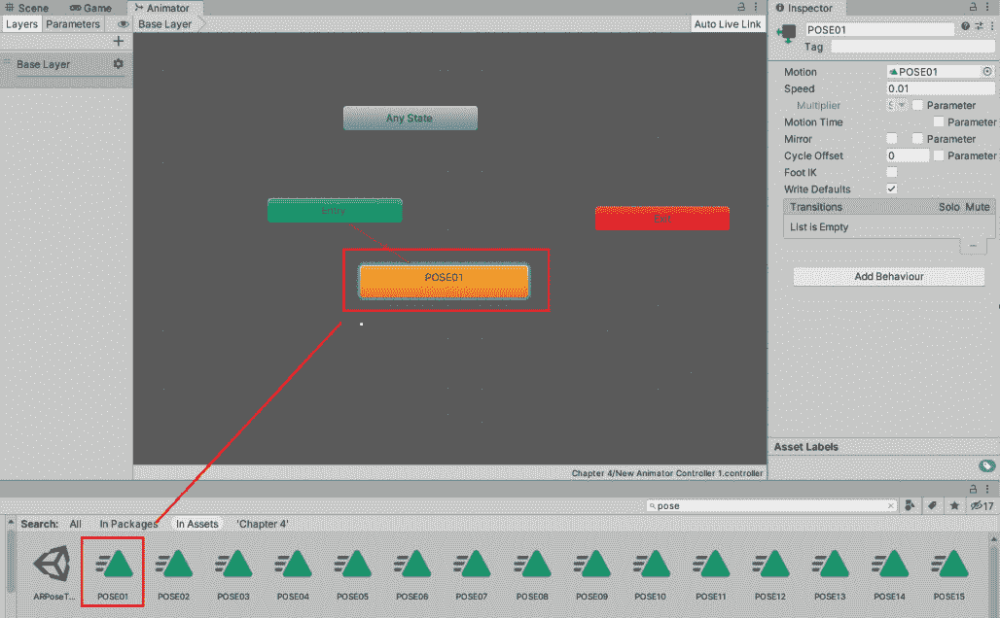

图 4.16 – 创建新状态

1.  通过将**POSE02**动画片段拖入**Animator**窗口来创建第二个状态。

1.  选择 **POSE01** 状态，右键单击以打开菜单，然后选择 **创建过渡** 以在 **POSE01** 和 **POSE02** 之间创建过渡。

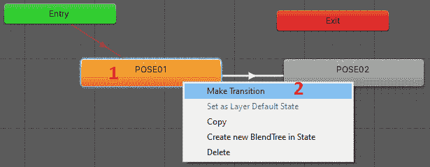

图 4.17 – 创建过渡

现在，我们已经创建了一个动画控制器资产，并将一些动画剪辑添加到了状态机中。

## Avatar

与我们之前为 Unity 内置的 Cube 模型创建的动画不同，从外部工具导入到 Unity 编辑器的模型可能更复杂。例如，Unity-Chan! 模型是一个类似人类的模型。在 Unity 中，模型由 **三角形** 网格表示，而三角形由 **顶点** 组成。当模型被动画化时，顶点的位置将被修改。显然，当许多顶点组成一个模型时，单独移动每个顶点是一个低效的操作。因此，计算机动画中的一种常见技术是在动画过程中不单独移动每个三角形，而是在动画之前对模型进行蒙皮。这种技术称为 **骨骼动画** 或 **骨架**。

Unity 使用一个名为 **Avatar** 的系统来识别动画模型是否为人类布局以及模型的哪些部分对应于头部、身体、手臂、腿部等。

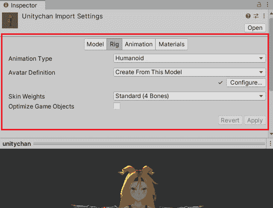

图 4.18 – 导入设置

我们可以通过在 Unity 编辑器中点击模型来打开 Unity-Chan! 的 **导入设置** 窗口。如图 4.18 所示，我们可以在窗口的 **骨架** 选项卡中指定其骨架类型，在这种情况下，该模型的 **动画类型** 是 **人类**。动画系统将尝试将模型的现有骨骼结构与 **Avatar** 骨骼结构相匹配。如果骨骼结构可以成功映射，则将自动创建一个 **Avatar** 资产，如图 4.19 所示。

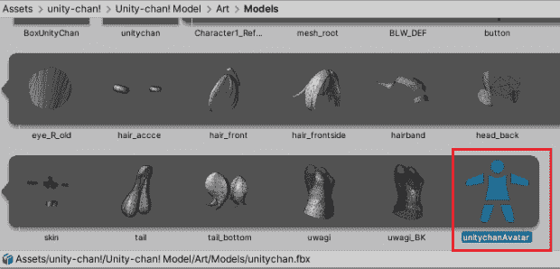

图 4.19 – unitychanAvatar

注意

**骨骼** 是 **骨骼动画** 中相互连接的部件的分层集合。**蒙皮** 使得三角形的每个顶点都依赖于骨骼。

另一方面，如果动画系统无法自动将模型的现有骨骼结构与 **Avatar** 骨骼结构相匹配，我们需要手动配置 **Avatar**。此外，即使骨骼结构可以成功映射，有时我们可能想要手动调整以达到更好的效果。在这种情况下，我们也可以通过配置 **Avatar** 资产来修改它。


图 4.20 – 配置 Avatar

按照以下步骤进行配置：

1.  点击模型以打开其 **导入设置** 窗口。

1.  在窗口的 **骨架** 选项卡中点击 **配置** 按钮以打开 **Avatar 检查器** 窗口。

1.  按照如图 4.20 所示，在 **Avatar 检查器** 窗口中配置骨骼。

### Avatar 遮罩

在我们将模型骨骼与 Unity 的 Avatar 系统骨骼结构之间创建映射之后，我们可以播放这个角色的动画。然而，有时我们可能不想动画化角色的所有骨骼。一个常见的例子是行走动画可能涉及角色摆动手臂，但如果他们拿起电话打电话，他们的手臂应该握住电话而不是在行走时摆动。在这种情况下，我们希望将动画限制在特定的身体部位，Unity 提供的**Avatar Mask**资产可以帮助我们实现这个目标。

我们可以通过选择**资产 | 创建 | Avatar Mask**来创建一个新的**Avatar Mask**资产，如图*图 4.21*所示。

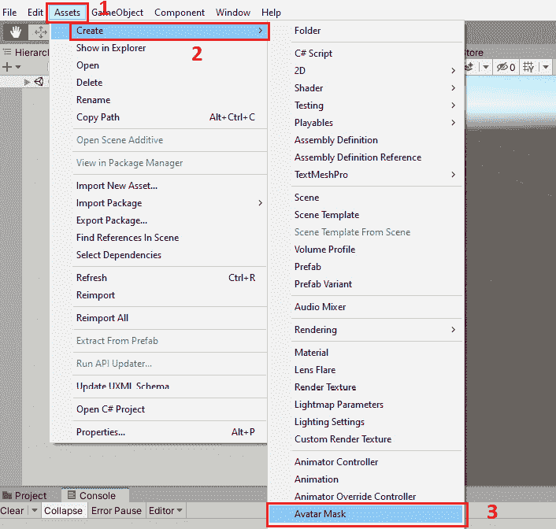

图 4.21 – 创建 Avatar Mask

在创建一个新的**Avatar Mask**资产后，我们可以配置它以定义动画的哪些部分应该被遮罩。如图*图 4.22*所示，**Avatar Mask** **检查器**窗口允许我们点击一个类人身体图来选择或取消选择某些部分进行遮罩。在这里，我们遮罩了 Unity-Chan!的一个手臂，这意味着某些动画在运行时不会影响这个手臂。

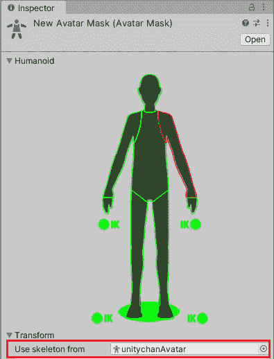

图 4.22 – Avatar Mask

为了让这个 Avatar Mask 资产生效，我们需要将其应用到 Animator Controller 上。

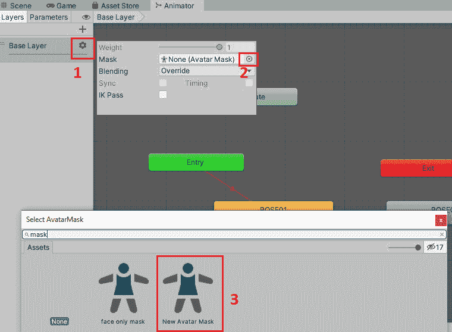

图 4.23 – 应用 Avatar Mask 资产

在这个例子中，我们将按照以下步骤将此 Avatar Mask 资产应用到我们之前创建的 Animator Controller 中：

1.  双击**新 Animator Controller**文件以打开**Animator**窗口。

1.  点击**基础层**项的齿轮图标以打开**层设置**面板。

1.  然后，点击**Mask**字段旁边的单选按钮，并从弹出的**选择 AvatarMask**窗口中选择新的**Avatar Mask**资产来应用，如图*图 4.23*所示。

这样，我们就可以将动画限制在特定的身体部位。

接下来，我们将探讨 Unity 动画开发解决方案中的另一个重要概念，即**Animator**组件。通过使用 Animator，我们可以在游戏中使用这个 Animator Controller 资产。

## 动画组件

在前面的章节中，我们探讨了 Animation Clips、Animator Controllers 和 Avatar 在 Unity 中的使用。然而，仅仅创建 Animation Clips、Animator Controllers 和 Avatar 资产是不够的，以在游戏场景中动画化角色。我们仍然需要 Animator 组件将动画分配给场景中的 GameObject。

注意

Animator Controllers 和 Animator 组件名称相似但功能不同。Animator 组件使用关联的 Animator Controller 将动画应用到 GameObject 上。

如果你在一个 GameObject 上看到 Animator 组件，你会发现它将汇集我们之前讨论的所有各种资产。它是 Unity 动画解决方案中绑定系统的根，因此非常重要。


图 4.24 – Animator 组件

在这里，我们可以将 Unity-Chan!模型拖入场景以创建一个新的角色 GameObject，并将 Animator 组件添加到 GameObject 中，如图 4.24 所示。这是 Animator 组件的配置方式：

+   Animator 组件需要引用 Animator Controller，它定义了要使用的动画剪辑。我们可以将我们在*Animator Controller*部分创建的 Animator Controller 分配给它，名称为**新 Animator Controller**。

+   由于 Unity-Chan!模型是一个人形模型，因此需要为这个 Animator 组件提供相应的 Avatar 资产。

+   Animator 组件的**应用根运动**设置决定了是否将根节点的位置或旋转的任何更改应用于动画。

+   Animator 组件的**更新模式**设置决定了 Animator 组件的更新模式。有三个不同的选项，即**正常**、**动画物理**和**未缩放时间**。


图 4.25 – 更新模式设置

+   最后的设置是**裁剪** **模式**，它决定了 Animator 组件的动画是否应在屏幕外播放。有三个不同的选项，即**始终动画**、**裁剪更新变换**和**完全裁剪**。


图 4.26 – 裁剪模式设置

阅读本节后，我们对 Unity 动画系统的概念有了了解。我们将在下一节中使用这个系统创建 3D 动画！

# 在 Unity 中实现 3D 动画

在前面的章节中，我们已经介绍了 Unity 动画系统中的某些重要概念，例如**动画剪辑**、**Animator 控制器**、**Avatar**和**Animator 组件**。在本节中，你将学习如何使用这些概念为 3D 模型实现动画。

## 导入动画资产

首先，我们需要知道如何从`/Assets/unity-chan!/Unity-chan! Model/Art/Animations`文件夹将动画资产导入 Unity，如图下所示：

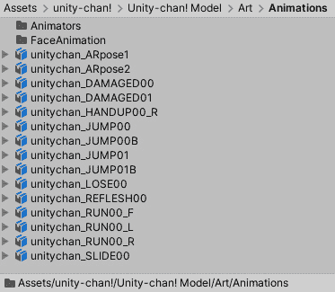

图 4.27 – 动画文件夹

在这里，我们可以从**项目**窗口中选择一个动画资产以打开其**导入设置**窗口。

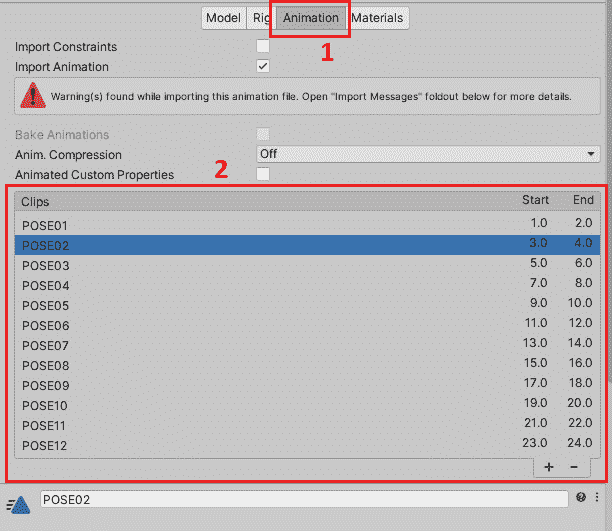

图 4.28 – 动画导入设置

如图 4.28 所示，在**检查器**窗口中点击**动画**以切换到**动画**选项卡，你可以看到包含在动画资产中的所有动画剪辑。

### 动画压缩

此外，在**动画**选项卡中，我们还可以找到与导入相关的设置。

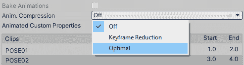

图 4.29 – 动画压缩设置

如 *图 4.29* 所示，有一个名为 **动画压缩** 的设置，其默认值为 **关闭**，这意味着 Unity 在导入时不会减少关键帧的数量。在这种情况下，Unity 将保持最高精度的动画，但代价是动画文件大小很大。如果减少动画的大小，无论是在我们的硬盘上还是在内存中，都很重要，我们可以考虑其他两个 **动画压缩** 选项，即 **关键帧减少** 和 **最佳**。

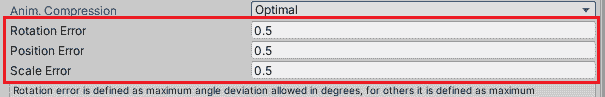

图 4.30 – 最佳

如果值为 `0.5`；值越小，精度越高。

如果选择 **最佳** 选项，Unity 将决定如何压缩动画剪辑。

### 动画事件

我们还可以修改单个动画剪辑的属性。在列表中选择一个动画剪辑后，我们可以向下滚动以查看该特定动画剪辑的设置。


图 4.31 – 动画剪辑的设置

如前图所示，动画剪辑有一个添加动画事件的选项，这允许我们在时间轴的指定点调用脚本中的函数。

为了创建一个新的动画事件，首先，我们需要在时间轴上定位我们想要添加事件的位置，然后点击左上角的 **添加事件** 按钮。时间轴上会创建一个小白标记，表示新事件。

在创建新事件后，我们还需要按照以下步骤进行配置：

1.  如 *图 4.32* 所示，有多个字段需要填写，我们在附加到 GameObject 的脚本中的 `PrintStringFromAnimationEvent` 函数中输入了名称 `PrintStringFromAnimationEvent`。其他几个字段可以为这个函数传入不同类型的参数，例如 `Float`、`Int` 和 `String`。

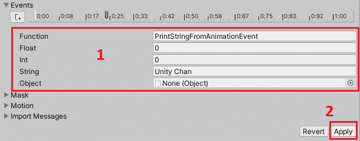

图 4.32 – 添加动画事件

1.  设置事件后，请记住点击 **应用** 按钮以使事件配置生效。

同时，我们需要实现一个函数，其名称必须与已填入函数字段的名称完全匹配，即 `PrintStringFromAnimationEvent`：

```cs
    public void PrintStringFromAnimationEvent(string
      stringValue)
    {
        Debug.Log("PrintStringFromAnimationEvent is called
          with a value of " + stringValue);
    }
```

这个函数将接受一个字符串类型的参数；一旦这个动画事件被触发，这个函数将被调用，并且字符串值将在 **控制台** 窗口中打印出来，如图所示：

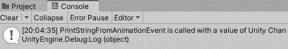

图 4.33 – 在控制台窗口中打印字符串值

现在我们已经了解了如何将动画资产导入 Unity 以及如何设置动画事件，让我们将注意力转向设置动画控制器！

## 配置动画控制器

在导入动画资源后，我们需要设置一个 Animator Controller 来引用将在我们的游戏中使用的这些 Animation Clips。实际上，当我们之前介绍它时，我们已经创建了一个 Animator Controller，并引用了两个将使用的 Animation Clips。然而，我们没有配置这个 Animator Controller；例如，我们没有配置如何在这两个动画之间切换。在本节中，我们将探讨如何配置 Animator Controller 并使用 C#代码在不同动画之间切换。

### 调整动画速度

我们可以通过在**Animator**窗口中选择状态来查看 Animator Controller 中特定状态的设置。

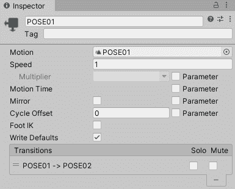

图 4.34 – 动画状态的设置

有多个设置，例如`1`。如果设置为`0.5`，则`2`的播放速度将使**运动时间**的播放速度是正常速度的两倍，播放时间是正常的一半。

### 动画器参数

如我们在*图 4.35*中看到的，还有其他需要使用参数的设置。这些参数被称为**动画参数**，它们是在 Animator Controller 中定义的变量，可以从 C#脚本中访问和分配值。因此，它们是使用 C#代码控制动画的重要部分。为了添加新参数和编辑现有参数，我们应该通过点击右上角的**Parameters**按钮切换到**Animator**窗口的**Parameters**部分。

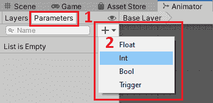

图 4.35 – 参数部分

如前图所示，参数可以是以下四种类型之一：

+   **浮点型**

+   **整型**

+   **布尔型**

+   **触发器**

作为演示，我们可以添加一个名为**SpeedMultiplier**的新参数。然后，我们再次打开**POSE01**动画状态的设置，并在**Multiplier**设置之后勾选**Parameter**复选框，你将看到新创建的**SpeedMultiplier**参数出现。

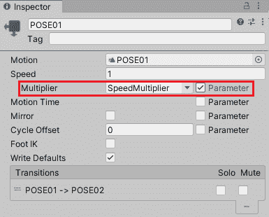

图 4.36 – SpeedMultiplier 参数

如我们之前提到的，这些参数可以使用 C#代码访问和分配值。因此，我们可以创建一个新的脚本来访问和设置`SpeedMultiplier`参数的值，如下面的代码片段所示：

```cs
using UnityEngine;
public class AnimationParametersTest : MonoBehaviour
{
[SerializeField] 
private Animator _animator;
[SerializeField] 
private float _speedMultiplier;
    // Start is called before the first frame update
    void Start()
    {
        if(_animator == null)
        {
            _animator = GetComponent<Animator>();
        }
        _animator.SetFloat("SpeedMultiplier",
          _speedMultiplier);
    }
}
```

在这里，我们创建一个新的 C#脚本名为`AnimationParametersTest`，并获取 Animator 组件的引用，然后通过调用 Animator 组件的**SetFloat**方法来设置参数的值，因为此参数的类型是 float。同样，Animator 组件也有**SetInteger**、**SetBool**和**SetTrigger**方法，用于设置不同类型参数的值。

### 配置过渡

动画参数也可以用来实现动画切换。我们可以使用动画过渡来连接两个动画状态并在它们之间切换。然而，默认情况下，动画过渡将自动在两个连接的动画状态之间切换，但我们在开发游戏时显然更喜欢能够控制动画的切换。

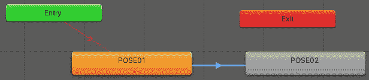

图 4.37 – 动画过渡

我们可以设置一个过渡，仅在特定条件为真时发生，并且可以使用动画参数来确定这些条件是否满足，因此我们可以在这里使用它们来控制动画的切换。

以下步骤展示了如何从 C#代码中添加一个新参数、设置条件以及控制不同动画的切换：

1.  切换到名为**Run**的`bool`变量参数；其默认值为**false**，如图下截图所示。

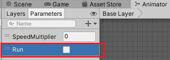

图 4.38 – 新参数

1.  选择要应用条件的过渡；这里我们选择从**POSE01**到**POSE02**的过渡。

1.  在**Go To Run**到这个过渡中，如图*图 4.39*所示。

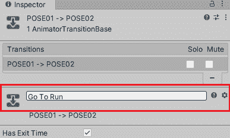

图 4.39 – 命名过渡

1.  在同一窗口的底部，列出了此过渡的所有条件。通过点击**+**按钮，为这个**Go To Run**过渡添加一个新条件，如图所示：

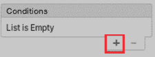

图 4.40 – 添加新条件

1.  添加新条件后，我们还需要选择一个参数，其值被视为条件。这里的参数是**Run**。当**Run**参数的值为**true**时，可以认为条件已满足。

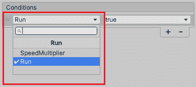

图 4.41 – 选择参数作为条件

1.  然而，**Run**参数的默认值是**false**。因此，为了从**POSE1**切换到**POSE2**，创建一个 C#脚本，设置值如下：

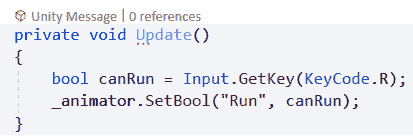

图 4.42 – C#代码片段

`Input.GetKey`方法会在用户按下由`KeyCode`标识的键时返回`true`；否则，它将返回`false`，然后我们使用这个值来设置**Run**参数的值。因此，我们可以通过按键来控制动画的切换。

在阅读本节后，我们已经学会了如何在 Unity 中实现 3D 模型的动画以及如何通过 C#代码控制动画。接下来，我们将讨论如何实现 2D 资源的动画。

# 在 Unity 中实现 2D 动画

在本节中，我们将使用我们之前探索的工具在 Unity 中实现 2D 动画。

2D 动画的实现与 3D 动画的实现不同。2D 动画的常见实现技术是使用**Sprite Animations**，这些是为 2D 资源创建的动画片段。

创建精灵动画有许多方法；我们可以在 Unity 编辑器的**动画**窗口中直接创建它们，或者在像 Aseprite 这样的流行动画精灵编辑器或 Piskel 这样的免费在线精灵编辑器等外部工具中创建它们。

在这里，我们使用由外部工具创建的精灵动画。您可以从 Unity Asset Store 在此处下载此资产：[`assetstore.unity.com/packages/2d/characters/free-pixel-mob-113577`](https://assetstore.unity.com/packages/2d/characters/free-pixel-mob-113577)。

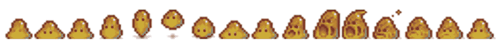

图 4.43 – 精灵表

下载资产后，我们可以发现此图像包含许多不同的精灵，如图*图 4.43*所示。我们称之为**精灵表**，它是一个包含连续精灵的图像，通常用于 2D 资产的动画。

注意

如果一个图像包含一组非连续的精灵图像，我们称之为**精灵图集**，它通常用于实现 UI。

然后，我们应该通过以下步骤将此图像文件导入到 Unity 编辑器中：

1.  如*图 4.44*所示，由于此图像包含一系列精灵图像，我们在**导入设置**窗口中将**精灵模式**设置为**多个**：

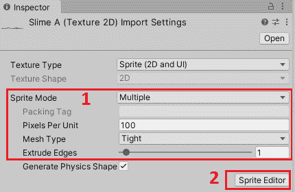

图 4.44 – 精灵表的导入设置

1.  点击**精灵编辑器**按钮，在 Unity 中打开**精灵编辑器**。**精灵编辑器**提供了允许我们修改精灵表的工具，例如将精灵表切割成单个精灵。

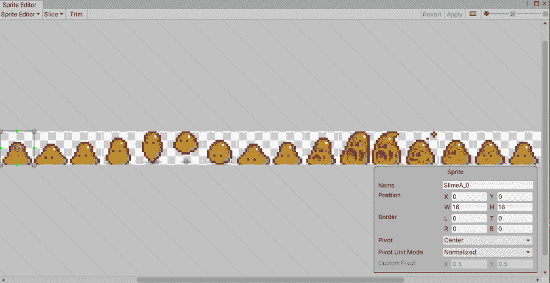

图 4.45 – Unity 中的精灵编辑器

1.  通过点击`16`，将`1`的值更改，然后点击下拉菜单底部的**切片**按钮，并关闭**精灵编辑器**，如图下所示截图：

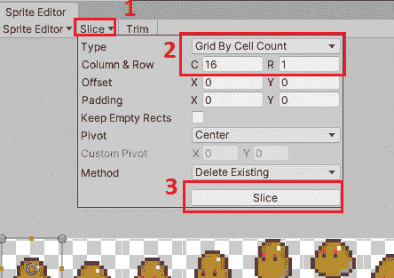

图 4.46 – 通过单元格计数网格

1.  然后，我们可以在**项目**窗口中选择此**精灵表**资产以展开它，您将看到其中所有的单个精灵：

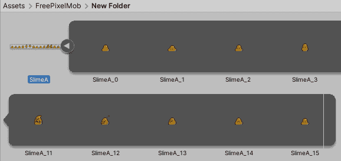

图 4.47 – 精灵表中的精灵

到目前为止，我们已经导入了资产并创建了这些精灵。下一个问题是，我们如何使用这些精灵在 Unity 中创建动画剪辑？答案并不复杂。我们只需要选择组成我们想要创建的动画剪辑的精灵并将它们拖入场景。Unity 编辑器将自动创建动画剪辑并询问我们选择存储动画剪辑文件的文件夹，如图下所示截图：

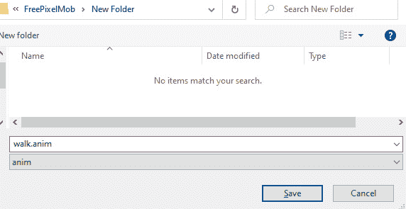

图 4.48 – 创建动画剪辑文件

在这个例子中，我们从精灵表中选择了前八个精灵并将它们拖动到 Unity 编辑器的场景视图中。然后，我们将动画剪辑文件重命名为`walk`并保存。

Unity 将创建动画剪辑文件，正如我之前提到的，还将创建一个新的 Animator Controller 资产。在场景中还会创建一个新的 GameObject，并附加 Animator 组件，它引用 Animator Controller，如图 *图 4.49* 所示。


图 4.49 – 场景中的新 GameObject

现在，我们可以通过在 Unity 编辑器中点击 **播放** 按钮来运行游戏并播放动画，我们可以看到 **行走** 动画正在播放！

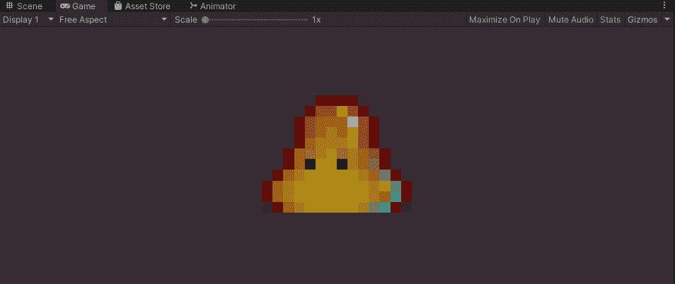

图 4.50 – 播放行走动画

阅读本节后，您已经学会了如何为 2D 资产实现动画；接下来，我们将分享一些提高动画性能的技巧。

# 提升 Unity 动画系统的性能

在 Unity 中，动画的实现可能会导致过度的内存使用和 CPU 开销。在本节中，我们将讨论如何避免由动画引起的性能问题。具体来说，我们将首先介绍 **Unity 性能分析器** 工具及其如何用于查看与动画相关的性能指标，然后我们将探讨如何减少动画的 CPU 开销和内存占用。

## Unity 性能分析器

首先，我们应该学习如何使用工具来查看和定位性能瓶颈，而不是依赖于主观猜测和经验。当然，经验的重要性不言而喻，但使用工具将帮助您更快地定位问题。

Unity 编辑器为开发者提供了一个性能分析器工具，我们可以使用它来查看游戏的详细内存使用情况和实时 CPU 开销。

为了查看关于动画 CPU 开销的性能数据，我们应该遵循以下步骤：

1.  点击 **窗口 | 分析 | 性能分析器** 打开 **性能分析器** 窗口。

1.  在 **性能分析器** 窗口中点击 **CPU 使用率** 模块区域，以查看 CPU 开销的性能数据，例如 **Animator.Update** 消耗的 CPU 时间，如图 *图 4.51* 所示。

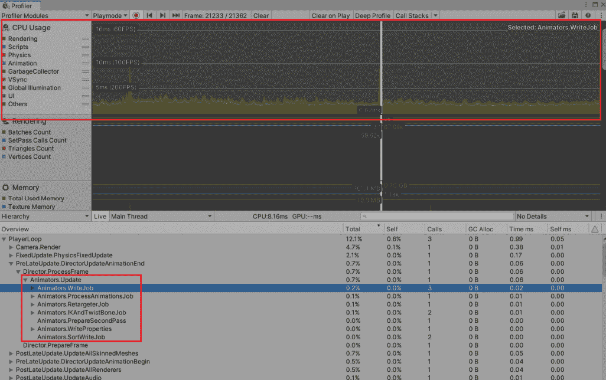

图 4.51 – Unity 性能分析器

1.  Unity 性能分析器还允许我们切换到 **层次结构** 视图和 **时间轴** 视图，在某些情况下这会更加直观。

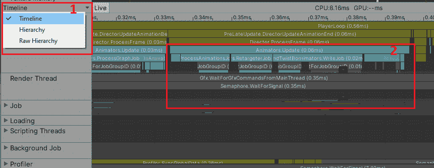

图 4.52 – 性能分析器窗口中的时间轴视图

除了 **CPU 使用率** 模块外，我们还可以在 **内存** 模块中查看游戏的详细内存消耗。

1.  在 **性能分析器** 窗口中点击 **内存** 模块区域，以查看内存消耗的性能数据。默认显示模式是 **简单** 模式，内存消耗在 **性能分析器** 窗口中按类型计数。例如，**纹理** 的内存使用量约为 106.3 MB，**网格** 的内存使用量约为 4.5 MB，如图所示：

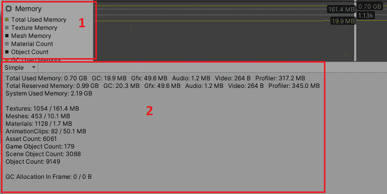

图 4.53 – 性能分析器窗口中的内存数据

1.  与**简单**模式相比，**详细**模式功能更强大。我们可以通过在上左角的下拉菜单中选择**详细**来从**简单**模式切换到**详细**模式。

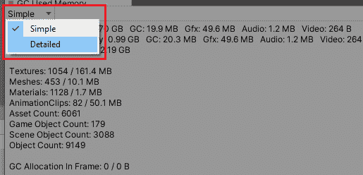

图 4.54 – 切换到详细模式

**详细**模式不会像**简单**模式那样实时显示内存消耗数据。相反，我们需要手动点击**取样本****播放模式**按钮来在当前时间采样游戏内存。

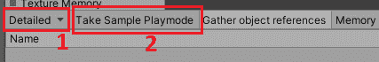

图 4.55 – 取内存样本

根据游戏中创建的对象数量或消耗的内存量，采样时间将不同。但一旦采样完成，我们将看到详细的内存开销；例如，在下面的屏幕截图中，有 82 个动画剪辑占用了 50.1 MB 的内存。

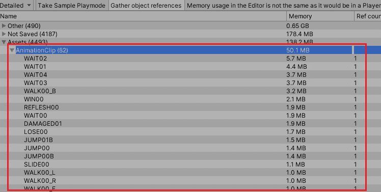

图 4.56 – 分析器窗口中的详细内存数据

从前面的介绍中，我们可以看到动画的优化应主要关注 CPU 负载和内存消耗。因此，当使用 Unity 的动画系统实现动画时，以下两个最佳实践需要考虑。

## 动画师剔除模式

为了减少动画的 CPU 负载，我们应该将**动画师**窗口的**剔除模式**属性设置为**剔除更新变换**或**完全剔除**。


图 4.57 – 动画师剔除模式

通过将其设置为**剔除更新变换**，当动画师在屏幕上不可见时，Unity 将禁用动画系统的一些功能，如重定向、逆运动学（IK）变换。如果设置为**完全剔除**，当动画师在屏幕上不可见时，Unity 将完全禁用动画。因此，可以减少 CPU 负载的目标可以达成。

## 动画压缩

另一个最佳实践是在动画导入设置窗口中将**动画压缩**设置为以节省内存。

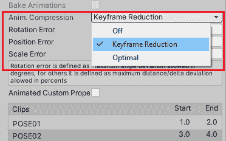

图 4.58 – 动画压缩

通过将其设置为**关键帧减少**，Unity 将在导入时减少关键帧，并在将动画存储在文件中时压缩关键帧。如果设置为**最优**，Unity 将决定如何压缩，无论是通过减少关键帧还是使用密集格式。

# 摘要

在本章中，我们首先介绍了 Unity 动画系统的一些最重要的概念，例如动画剪辑、动画控制器、Avatar 和动画组件。然后，我们演示了如何在 Unity 中实现 3D 动画，包括如何将动画资产导入 Unity 编辑器、如何在动画剪辑上创建动画事件、如何设置动画参数通过 C# 代码控制动画等。

我们还讨论了如何在 Unity 中实现 2D 动画。2D 动画的实现方式与 3D 动画不同。2D 动画的一种常见实现技术是使用精灵动画，这些动画剪辑是为 2D 资产创建的。

最后，我们探讨了在 Unity 中实现动画的一些最佳实践，以优化由动画系统引起的性能问题。

在下一章中，我们将学习 Unity 中的物理系统，同时，我们也会介绍如何在 Unity 中优化物理性能。
