# *第六章*：在 Unity 项目中集成音频和视频

在前面的章节中，我们已经讨论了如何使用 C#脚本在 Unity 中开发游戏逻辑，如何高效实现 UI，如何实现动画，以及如何将物理模拟集成到您的游戏中。然而，在游戏开发中，声音这一特性常常被忽视。正确使用音效可以增强游戏的沉浸感，与游戏背景相匹配的背景音乐可以触发玩家的情感共鸣。有时，在游戏中播放视频也是增加游戏乐趣的一种方式。毫无疑问，将视频和音频添加到您的游戏中可以使您的游戏更加生动有趣。

在本章中，我们将介绍以下关键主题：

+   Unity 音频系统和视频系统中的概念

+   使用音频和视频进行脚本编写

+   使用 Unity 开发 Web 应用程序时需要注意的事项

+   提高音频系统的性能

到本章结束时，您将能够正确且高效地在 Unity 中实现音频和视频，为您的游戏增添更多真实感和乐趣。

现在，让我们开始吧！

# 技术要求

您可以在以下 GitHub 仓库中找到完整的代码示例：[`github.com/PacktPublishing/Game-Development-with-Unity-for-.NET-Developers`](https://github.com/PacktPublishing/Game-Development-with-Unity-for-.NET-Developers)。

# Unity 音频系统和视频系统中的概念

Unity 提供了视频和音频功能，允许您的游戏在不同的平台上播放视频，并支持实时混合和全 3D 空间音效。在本节中，我们将介绍 Unity 音频系统和视频系统的重要概念。

## 音频剪辑

为了能够在 Unity 中播放音频，我们首先需要将音频文件导入 Unity 编辑器。音频数据将被保存在 Unity 中的一个**音频剪辑**对象中。您可以从以下链接下载并导入**超科幻游戏音频武器包 Vol. 1**：[`assetstore.unity.com/packages/audio/sound-fx/weapons/ultra-sci-fi-game-audio-weapons-pack-vol-1-113047`](https://assetstore.unity.com/packages/audio/sound-fx/weapons/ultra-sci-fi-game-audio-weapons-pack-vol-1-113047)。您可以在以下屏幕截图中看到这一点：

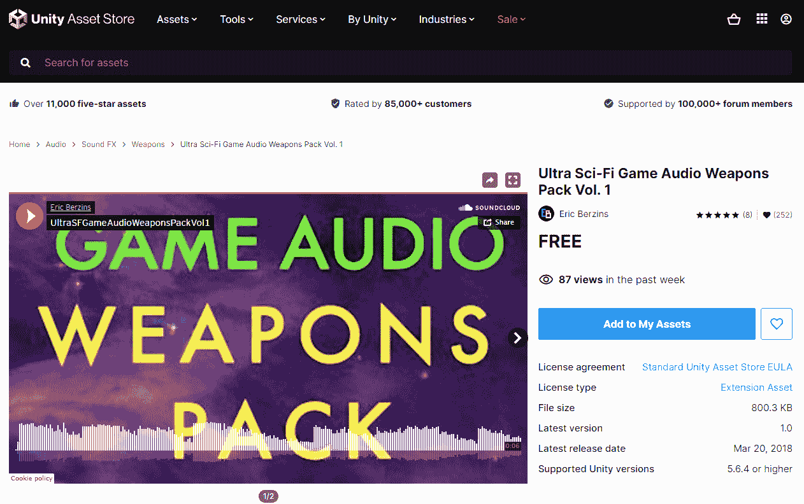

图 6.1 – 超科幻游戏音频武器包 Vol. 1

本包中包含的音频文件格式为`.wav`。除了可以导入 Unity 的`.wav`文件外，Unity 还支持导入以下格式的文件：

+   `.aif`

+   `.mp3`

+   `.ogg`

+   `.xm`

+   `.mod`

+   `.it`

+   `.s3m`

在导入这些音频文件后，我们可以选择其中一个打开**导入**设置，如图*图 6.2*所示：

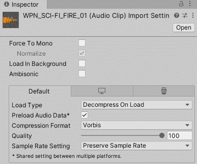

图 6.2 – 音频导入设置

如您在**导入**设置中看到的，Unity 支持单声道和多声道音频资源，最多可达八个声道。Unity 还提供了许多导入选项。让我们介绍一些重要的选项。

### 加载类型

Unity 为游戏开发者提供了三种不同的方式在运行时加载音频资源。我们可以通过修改**导入**设置窗口中的**加载类型**属性来决定 Unity 如何加载这个音频文件。

![图 6.3 – 加载类型]

![img/Figure_6.03_B17146.jpg]

图 6.3 – 加载类型

三种方法如下：

+   **加载时解压缩**：这是**加载类型**的默认值。如果音频文件较小，例如 UI 声音或脚步声，我们应该选择此选项。这是因为，在这种情况下，音频文件将以原始大小解压缩并解码到内存中。优点是它将以最小的 CPU 使用率准备好按需播放。

+   **内存中压缩**：与**加载时解压缩**形成对比，通过选择此方法，Unity 将压缩的音频数据存储在内存中，并在播放音频时需要 CPU 进行解压缩和解码。

+   **流式传输**：这与前两种方法完全不同。如果我们选择这种方法，Unity 不会将音频数据加载到内存中，而是从磁盘流式传输。这种方法使用的内存最少，但代价是 CPU 和磁盘使用率最高。

### 压缩格式

除了刚刚介绍的**加载类型**属性外，**压缩格式**属性对于音频资源也非常重要。Unity 支持多种音频压缩格式，根据不同的目标平台有不同的格式可供选择。例如，如果目标平台是**Windows**，以下格式可用：

![图 6.4 – Windows 上的压缩格式]

![img/Figure_6.04_B17146.jpg]

图 6.4 – Windows 上的压缩格式

另一方面，如果目标平台是**Android**，除了之前的格式外，它还支持 MP3 格式。

![图 6.5 – Android 上的压缩格式]

![img/Figure_6.05_B17146.jpg]

图 6.5 – Android 上的压缩格式

我们将在这里探讨不同的压缩格式：

+   **PCM**：**脉冲编码调制**（**PCM**）是一种无损、未压缩的格式，是计算机中数字音频的标准形式。它提供高质量，但文件大小非常大。如*图 6.6*所示，当选择**PCM**格式时，此音频文件的导入大小等于其原始大小。

![图 6.6 – PCM 格式]

![img/Figure_6.06_B17146.jpg]

图 6.6 – PCM 格式

+   **Vorbis**: 这是**压缩格式**的默认值。**Vorbis**是一种非常有效的音频压缩格式。与**PCM**音频相比，这种压缩产生的文件更小，但质量较低。如果我们选择**Vorbis**选项，导入的音频文件大小将远小于其原始大小。有一个**质量**滑块，允许我们调整压缩质量。

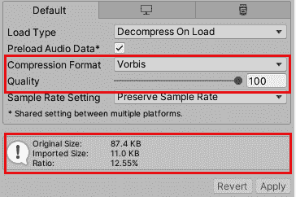

图 6.7 – Vorbis 格式

+   **ADPCM**：**ADPCM**代表**自适应差分脉冲编码调制**。虽然名称与 PCM 相似，但它是一种有损压缩格式。但与 Vorbis 不同，在 Unity 中无法调整其压缩比。压缩文件大小将始终比 PCM 小 3.5 倍。

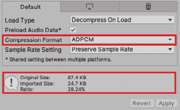

图 6.8 – ADPCM 格式

+   **MP3**：这在移动平台上可用，例如 Android。MP3 格式与 Vorbis 类似，是一种非常有效的音频压缩格式。还有一个**质量**滑块，允许我们调整压缩质量。

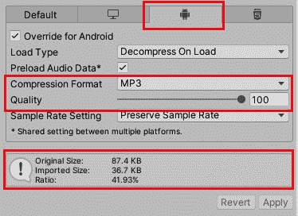

图 6.9 – MP3 格式

在我们设置这些音频文件的导入设置后，它们可以作为音频剪辑导入到 Unity 编辑器中。


图 6.10 – 音频剪辑

如*图 6.10*所示，我们可以在**项目**窗口中找到这些音频剪辑，音频剪辑的图标将显示其波形。

## 音频源

为了在游戏场景中播放我们刚刚创建的音频剪辑，我们还需要设置一个**音频源**。然后这个音频剪辑可以被拖到音频源或从 C#脚本中使用。

让我们按照以下步骤首先创建一个音频源：

1.  在**层次结构**窗口中右键单击以打开菜单。

1.  选择**创建空对象**以在场景中创建一个新的 GameObject。提醒一下，作为音频源的 GameObject 不一定是静态对象。在许多情况下，音频源需要移动，例如模拟游戏中发射炮弹的效果。但为了简单起见，我们不会在此为该 GameObject 添加移动逻辑。


图 6.11 – 创建音频源对象

1.  选择这个新创建的 GameObject，并单击**添加组件**按钮以打开组件列表。

1.  选择**音频** | **音频源**以向此 GameObject 添加**音频源**组件。

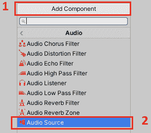

图 6.12 – 添加音频源组件

现在我们已经在游戏场景中创建了一个新的**音频源**组件。这个**音频源**组件的属性如*图 6.13*所示。

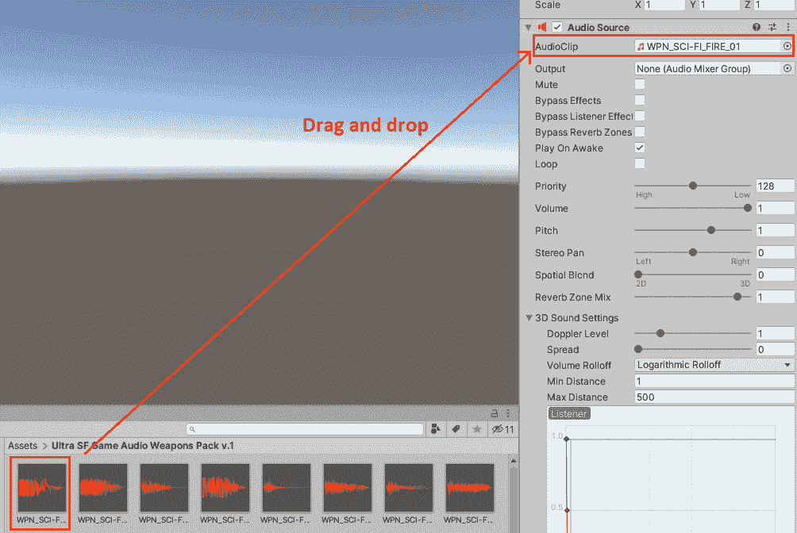

图 6.13 – 音频源的属性

我们将在这里探讨其中的一些：

+   **AudioClip**: 在这里，我们发现**音频源**的第一个属性是对**音频剪辑**的引用。我们可以在编辑器中直接将**音频剪辑**资产拖拽到这个字段。

+   **Output**: 我们不需要设置这个属性，因为默认情况下，这个音频源的输出会被场景中的音频监听器拾取。只有当你想要将声音输出到音频混音器组时，才需要设置这个属性。

+   C#脚本中的`Play`方法。

除了音频源之外，为了在场景中发出声音，还需要一个音频监听器来接收来自源的声音。接下来，我们将讨论**音频监听器**。

## 音频监听器

通常来说，你不需要担心场景中缺少**音频监听器**，因为当创建场景时，默认情况下，音频监听器会附加到场景中的主相机上，如图所示。

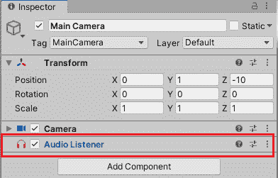

图 6.14 – 音频监听器

在现实生活中，声音是由听者听到的，**音频监听器**是 Unity 中听者的表示。如果你在游戏场景中正确设置了**音频源**，音频剪辑可用，但在运行游戏时你听不到声音，那么你可以首先检查场景中是否有音频监听器。通常，监听器是附加到相机上的。

要听到声音，我们需要确保有一个音频监听器可用，但同时也应注意的是，场景中不能有超过一个音频监听器，否则你将在**控制台**窗口中看到以下警告信息。所以，请确保场景中始终只有一个音频监听器。

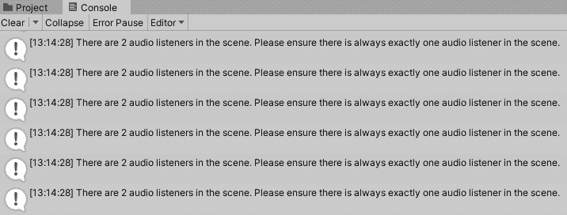

图 6.15 – 请确保场景中始终只有一个音频监听器

在介绍了 Unity 中关于音频的一些重要概念之后，接下来让我们讨论与 Unity 中视频相关的概念。

## 视频剪辑

与音频剪辑类似，我们还需要将外部视频文件导入到 Unity 编辑器中，以生成视频剪辑。Unity 支持视频文件的典型文件扩展名，例如以下这些：

+   `.mp4`

+   `.mov`

+   `.webm`

+   `.wmv`

导入视频文件后，我们可以选择打开**导入设置**，如图 6.16 所示：


图 6.16 – 视频剪辑的导入设置

默认情况下，**转码**选项是禁用的，这意味着 Unity 将使用默认设置导入这个视频文件。如果我们启用这个选项，Unity 将允许我们修改这些设置，如图 6.17 所示，我们将会介绍其中的一些。在**导入设置**窗口的底部，我们还可以通过点击播放按钮直接预览视频。

现在，让我们检查并启用**转码**选项，并探索一些这些导入设置。


图 6.17 – 视频导入设置

+   **尺寸**：默认情况下，Unity 不会调整原始视频的大小，但如果你想在 Unity 中调整视频文件的大小，你可以更改**尺寸**选项。你将找到一个预设列表，例如**半分辨率**，你也可以自定义新的大小。

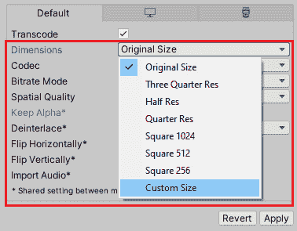

图 6.18 – 尺寸选项

+   **编解码器**：Unity 提供了将视频剪辑资产转码为以下视频编解码器之一的选项：**H264**、**H265**和**VP8**，如以下图所示。**自动**是**编解码器**的默认值。当然，你也可以自己选择视频编解码器。**H264**是最佳的本机支持的硬件加速视频编解码器。

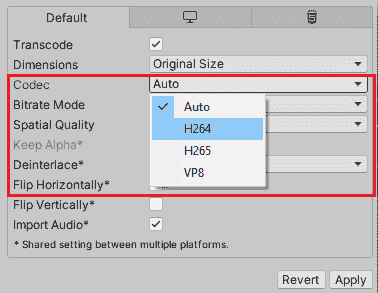

图 6.19 – 编解码器选项

+   **保持透明度**：如你在*图 6.19*中看到的，在这种情况下**保持透明度**不是一个选项。这是因为此选项只能在视频文件包含透明通道时勾选。如果你的视频文件包含透明通道，并且你希望在游戏中播放视频时保持透明通道，则勾选此选项。

+   **水平翻转**：正如其名所示，如果此选项被启用，Unity 将水平翻转视频，将左侧切换到右侧。

+   **垂直翻转**：与**水平翻转**类似，如果此选项被启用，Unity 将垂直翻转视频，使其上下颠倒。

+   **导入音频**：如果你的原始视频文件包含音频轨道，那么你可以通过勾选此选项来决定是否导入视频的音频轨道。

设置导入设置后，我们可以点击**应用**来转码视频。转码过程可能需要一些时间。


图 6.20 – 转码视频

现在我们已经将视频文件导入到 Unity 编辑器中，接下来我们需要设置一个视频播放器来播放视频剪辑。

## 视频播放器

按照以下步骤创建一个视频播放器：

1.  在**层次**窗口中右键单击以打开菜单。

1.  选择 `VideoPlayer`。

1.  选择这个新创建的 GameObject，并点击**添加组件**按钮以打开组件列表。

1.  选择**视频** | **视频播放器**以向此 GameObject 添加**视频播放器**组件。

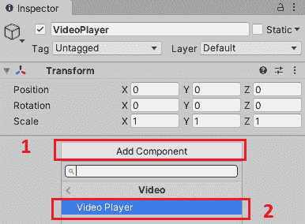

图 6.21 – 添加视频播放器组件

现在我们已经在游戏场景中创建了一个新的**视频播放器**。此**视频播放器**的属性如*图 6.22*所示：

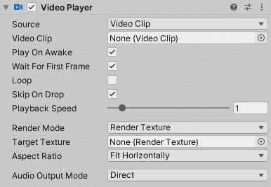

图 6.22 – 视频播放器组件属性

接下来，我们将探索一些这些属性：

+   **源**：在 Unity 中，**视频播放器**可以从视频剪辑资产或从 URL 播放视频。默认情况下，**视频播放器**需要一个视频剪辑资产作为视频源，但在这里我们也可以选择将 URL 作为视频源。


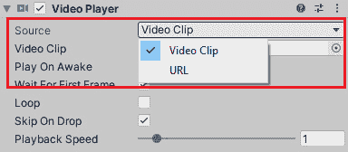

图 6.23 – 选择视频源类型

+   在 C#脚本中的`Play`方法来触发在运行时其他点的视频播放。

+   **回放速度**：我们可以通过调整这个滑块来增加或减少回放速度。默认值是 1。

### 渲染模式

这是一个非常重要的设置，因此我们将详细解释它。如果您刚刚设置了视频播放器，将视频剪辑资产拖动到**源**属性，并播放游戏，您会发现没有任何事情发生。这是因为视频播放器中**渲染模式**的默认值是**渲染纹理**，这意味着您应该首先创建并分配一个渲染纹理到视频播放器的**目标纹理**属性。然后视频播放器将输出视频到这个渲染纹理，正如您在*图 6.24*中可以看到的：


图 6.24 – 设置目标纹理属性

然而，在这个阶段，我们只将视频渲染到渲染纹理中，视频没有在游戏场景中播放。为了在游戏场景中播放此视频，我们可以在场景中创建一个新的**原始图像**UI 元素，并将此渲染纹理分配给**原始图像**UI 元素。


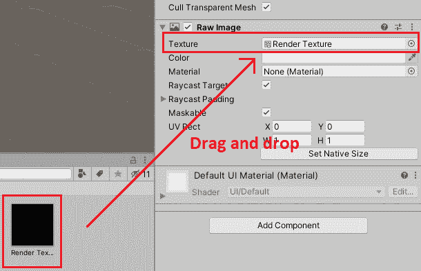

图 6.25 – 原始图像 UI 元素

现在，让我们再次播放游戏，视频按预期播放。


图 6.26 – 播放视频

我们还可以更改**渲染模式**。正如您在*图 6.27*中可以看到的，其他选项包括以下内容：

+   **相机远平面**，在相机场景后渲染视频内容，允许开发者更改 alpha 通道的值以使视频内容透明，可以用作背景视频播放器。

+   **相机近平面**，在相机场景前渲染视频内容，允许开发者更改 alpha 通道的值以使视频内容透明，可以用作前景视频播放器。

+   **材质覆盖**：在 Unity 中，材质用于描述模型的表面外观。如果选择此模式，视频内容将通过目标材质的用户指定属性传递，而不是在屏幕或渲染纹理上绘制。此模式通常用于在 Unity 中制作 360 度全景视频。

+   **仅 API**，它不会渲染视频内容，但允许开发者通过 API 访问视频内容。


图 6.27 – 渲染模式列表

例如，我们将选择**相机远平面**作为**渲染模式**。在这里，我们不需要提供渲染纹理，而是需要一个相机，正如您在下面的图中可以看到的，它允许我们修改**Alpha**值。


图 6.28 – 相机远平面

如果我们玩游戏，这次视频会再次播放。

![Figure 6.29 – 播放视频]

![img/Figure_6.29_B17146.jpg]

![Figure 6.29 – 播放视频]

在本节中，我们学习了 Unity 音频和视频系统的一些概念。现在，让我们探索如何在 Unity 中编写 C# 代码来控制音频和视频。

# 音频和视频脚本化

在本节中，我们将探讨如何通过 C# 脚本与音频和视频系统进行交互。与上一节类似，我们也将分别介绍 **Audio Source** 和 **Video Player** 的 C# 方法。我们首先从 **Audio Source** 的 C# 方法开始。

## AudioSource.Play

我们将要介绍的第一个函数是 `AudioSource` 的 `Play` 函数。`Play` 函数的签名如下：

```cs
public void Play();
```

调用此函数播放音频剪辑非常简单直接。然而，如果您需要处理更复杂的场景，例如延迟播放音频剪辑，您可以调用 `PlayDelayed` 函数，该函数将以指定的秒数延迟播放剪辑。

注意

`Play` 函数有一个重载版本，它需要一个 `delay` 参数。然而，现在它已被弃用。建议开发者使用 `PlayDelayed` 函数而不是旧的 `Play` (`delay`) 函数。

以下为 `PlayDelayed` 函数的函数签名：

```cs
public void PlayDelayed(float delay);
```

它需要一个参数，`delay`，该参数以相对于 44.1 kHz 参考速率的样本数指定。

现在，让我们创建一个新的 C# 脚本，首先获取场景中音频源的引用，并通过调用 `Play` 函数播放分配给它的音频剪辑：

```cs
using UnityEngine;
public class AudioPlayer : MonoBehaviour
{
[SerializeField] 
private AudioSource _audioSource;
    private void Start()
    {
        if(_audioSource == null)
        {
            _audioSource = GetComponent<AudioSource>();
        }
    }
    public void OnClickPlayAudioButton()
    {
        _audioSource.Play();
    }
}
```

然后，我们将这个新创建的脚本拖放到场景中的 Audio Source GameObject 上，将其附加到 GameObject 作为新的组件。

![Figure 6.30 – 将脚本附加到 GameObject]

![Figure 6.30_B17146.jpg]

![Figure 6.30 – 将脚本附加到 GameObject]

在这里，我们可以手动拖动 `GetComponent<AudioSource>()` 函数来在代码中获取 **AudioSource** 组件。

接下来，我们将在场景中创建一个 UI 按钮，并将按钮绑定到 `OnClickPlayAudioButton` 函数，以便当按钮被点击时，**Audio Source** 将播放音频剪辑。

![Figure 6.31 – 创建一个按钮]

![img/Figure_6.31_B17146.jpg]

![Figure 6.31 – 创建一个按钮]

现在我们可以运行游戏并点击按钮来播放场景中的音效。此功能在实现音频效果时非常有用；例如，当玩家开枪时，可以播放子弹的声音，等等。

## AudioSource.Pause

音频源可以用来播放背景音乐。在某些情况下，我们可能希望背景音乐暂停，例如当玩家进入不同的场景或触发新的剧情时。在这种情况下，我们可以考虑使用 `Pause` 函数来暂停播放背景音乐剪辑。

`Pause` 函数的函数签名非常简单，如下所示：

```cs
public void Pause();
```

我们可以为之前创建的 `AudioPlayer` 类创建另一个函数：

```cs
    public void OnClickPauseAudioButton()
    {
        _audioSource.Pause();
    }
```

由于我们之前下载的资产包只包含短时长的声音效果，为了演示暂停背景音乐的功能，我们可以从 Unity Asset Store 下载并导入**Free Music Tracks For Games**，链接如下：[`assetstore.unity.com/packages/audio/music/free-music-tracks-for-games-156413`](https://assetstore.unity.com/packages/audio/music/free-music-tracks-for-games-156413)。


Figure 6.32 – 游戏免费音乐轨道

然后替换由`AudioSource`引用的声音效果剪辑为新背景音乐剪辑。接下来，我们将创建另一个 UI 按钮并将按钮绑定到新创建的`OnClickPauseAudioButton`函数。

现在，我们可以运行游戏。如果你点击第一个按钮，背景音乐将播放；如果你点击第二个按钮，我们可以暂停音乐。

`AudioSource`还提供了一个`UnPause`函数来取消暂停已暂停的播放，以及一个`isPlaying`属性来检查当前音频剪辑是否正在播放。

以下是`UnPause`函数的签名：

```cs
public void UnPause();
```

我们可以使用它们来实现更灵活的暂停和继续音乐播放功能，如下代码片段所示：

```cs
    public void OnClickPauseAudioButton()
    {
        if(_audioSource.isPlaying)
        {
            _audioSource.Pause();
        }
        else
        {
            _audioSource.UnPause();
        }
    }
```

这样，我们可以点击第二个按钮来暂停音乐播放，再次点击以继续播放音乐。

## AudioSource.Stop

在某些情况下，你可能希望游戏中的背景音乐停止并从头开始播放，而不是暂停并继续播放。`AudioSource`的`Stop`函数在这里是一个合适的解决方案。

`Stop`函数的签名也非常简单，如下代码片段所示：

```cs
public void Pause();
```

让我们在 C#脚本中创建另一个函数来停止背景音乐并从头开始播放：

```cs
   public void OnClickStopAndPlayAudioButton()
    {
        if(_audioSource.isPlaying)
        {
            _audioSource.Stop();
        }
        else
        {
            _audioSource.Play();
        }
    }
```

我们还将创建第三个 UI 按钮并将按钮绑定到`OnClickStopAndPlayAudioButton`函数。

运行游戏并点击此按钮，背景音乐开始播放。再次点击停止背景音乐，如果第三次点击，背景音乐将从开头重新播放。

## VideoPlayer.clip

默认情况下，`VideoPlayer`组件将播放它所引用的视频剪辑。然而，我们通常需要能够在游戏运行时更改视频，而不是创建许多不同的 Video Player 实例。因此，我们可以通过 C#代码直接修改`VideoPlayer`的剪辑属性：

```cs
using UnityEngine;
using UnityEngine.Video;
public class VideoManager : MonoBehaviour
{
[SerializeField] 
private VideoPlayer _videoPlayer;
[SerializeField] 
private VideoClip _videoClip;
    void Start()
    {
        if (_videoPlayer == null)
        {
            _videoPlayer = GetComponent<VideoPlayer>();
        }
    }
    public void OnClickChangeVideoClip()
    {
        _videoPlayer.clip = _videoClip;
    }
}
```

在此情况下，我们创建一个新的 C#脚本名为`VideoManager`，该脚本将获取目标`VideoPlayer`组件的引用以及视频剪辑资产的引用。还有一个名为`OnClickChangeVideoClip`的函数，该函数将被绑定到 UI 按钮上以更改正在播放的视频剪辑。

与设置音频源相比，设置视频播放器稍微复杂一些，因为我们还需要为**Video Player**选择一个**渲染模式**选项。为了简单起见，这里我们选择**相机近平面**选项，并使用场景中的**主相机**来渲染视频剪辑的每一帧，如图*图 6.33*所示。

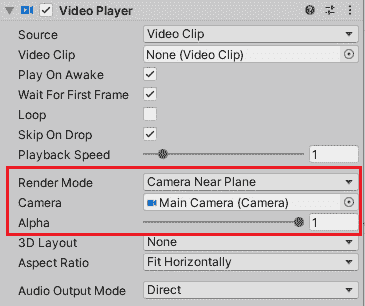

图 6.33 – 视频播放器

然后，我们还需要将新创建的脚本**VideoManager**分配给同一个 GameObject。


图 6.34 – 视频管理器

如您在*图 6.34*中看到的，我们不仅将**Video Player**的引用分配给了**VideoManager**脚本，还将一个视频剪辑资源引用分配给了它。

第三件事是创建一个新的 UI 按钮，并将按钮与之前提到的`OnClickChangeVideoClip`函数绑定。


图 6.35 – UI 按钮

让我们在编辑器中运行游戏并点击按钮来更改视频剪辑。

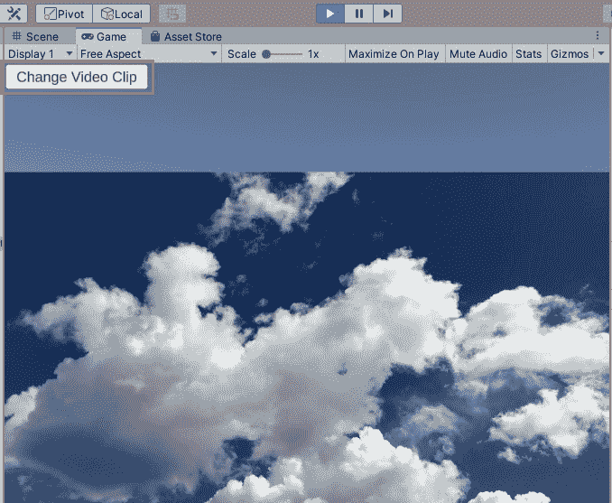

图 6.36 – 更改视频剪辑

如*图 6.36*所示，视频播放器组件的视频剪辑已更改为我们想要播放的视频剪辑。

## VideoPlayer.url

有时，从视频剪辑资源播放视频并不是一个好主意。例如，我们不希望因为包含视频文件而增加游戏的大小，或者我们想要开发基于 WebGL 的游戏，而 WebGL 不支持视频剪辑资源。那么，使用 URL 提供视频资源就成为一个明显的解决方案。因此，让我们添加另一个名为`OnClickSetVideoURL`的功能，以便让游戏场景中的 Video Player 播放 URL 指向的视频：

```cs
[SerializeField] private string _videoURL;
…
    public void OnClickSetVideoURL()
    {
        _videoPlayer.url = _videoURL;
    }
```

我们还需要创建一个新的 UI 按钮，并将按钮与`OnClickSetVideoURL`函数绑定。

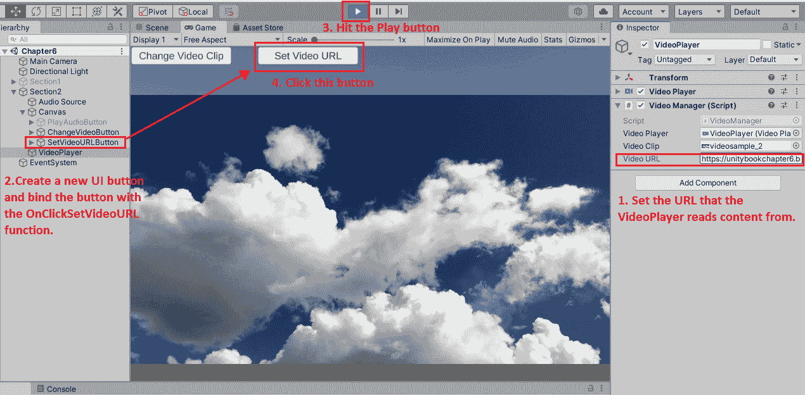

图 6.37 – 设置视频 URL

运行游戏并点击**设置视频 URL**按钮来播放 URL 中的视频，如图所示。

注意

Unity 不支持从 YouTube 播放视频，因此您可以将视频资源托管在其他平台上，例如 Azure 云。

## VideoPlayer.Play

在前两个示例中，无论我们设置视频剪辑资源还是视频 URL，视频播放器都会自动播放视频。这是因为我们默认启用了**唤醒时播放**选项，如图*图 6.38*所示。

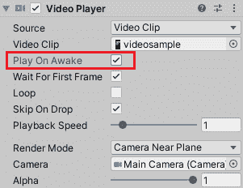

图 6.38 – 在唤醒时播放

通常，我们更喜欢能够自己控制何时播放视频。因此，禁用此选项并使用脚本中的 C#代码来控制播放是一个好主意，如下面的代码块所示：

```cs
    public void OnClickPlay()
    {
        _videoPlayer.Play();
    }
```

在这里，我们将创建第三个 UI 按钮，并将按钮与`OnClickPlay`函数绑定。

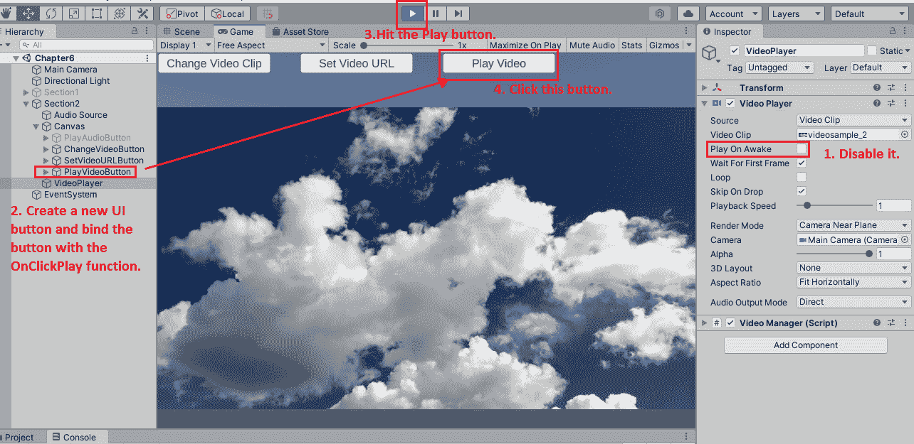

图 6.39 – 播放视频

这次，如果我们运行游戏并点击**视频播放器**的**播放**功能来播放视频，如图*图 6.39*所示。

## VideoPlayer.frame 和 VideoPlayer.frameCount

谈到控制视频播放，视频进度条是一个有用的功能。我们也可以在 Unity 中实现视频进度条。接下来，让我们讨论如何使用**视频播放器**的`frame`和`frameCount`属性来实现视频进度条。

`frameCount`属性是只读的，它提供了当前视频内容中的帧数。另一方面，`frame`属性可以修改，并提供了当前帧的帧索引。因此，我们首先创建一个 UI 滑块，然后根据`frame`和`frameCount`的值修改**视频播放器**组件的滑块值，如图*图 6.40*所示。


图 6.40 – 创建滑块

我们还需要修改 C# 脚本来获取滑块的引用并根据`frame`和`frameCount`的值更新滑块的值：

```cs
using UnityEngine;
using UnityEngine.Video;
using UnityEngine.UI;
public class VideoManager : MonoBehaviour
{
    [SerializeField] private VideoPlayer _videoPlayer;
    [SerializeField] private VideoClip _videoClip;
    [SerializeField] private string _videoURL;
    [SerializeField] private Slider _progressBar;
    void Start()
    {
        if (_videoPlayer == null)
        {
            _videoPlayer = GetComponent<VideoPlayer>();
        }
    }
    private void Update()
    {
        _progressBar.value = (float)_videoPlayer.frame /
          (float)_videoPlayer.frameCount;
    }
    public void OnClickChangeVideoClip()
    {
        _videoPlayer.clip = _videoClip;
    }
    public void OnClickSetVideoURL()
    {
        _videoPlayer.url = _videoURL;
    }
    public void OnClickPlay()
    {
        _videoPlayer.Play();
    }
}
```

在这种情况下，我们使用`UnityEngine.UI`命名空间，因为我们需要从我们的代码中访问 UI 滑块。并且我们实现了`Update`函数来更新滑块的值。

让我们再次运行游戏并播放视频。

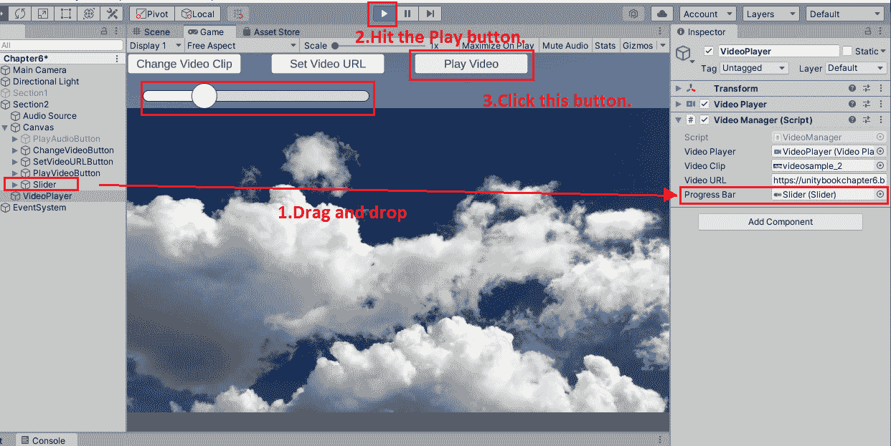

图 6.41 – 进度条

我们可以看到，随着视频的播放，进度条也会更新。

在本节中，我们探讨了并演示了如何使用 C# 代码来控制音频和视频，例如如何播放音频和视频，暂停音频和视频，以及通过 C# 代码实现进度条。

然而，如果你使用 Unity 开发 Web 应用程序，那么你可能会遇到其他问题。让我们继续探索。

# 使用 Unity 开发 Web 应用时需要注意的事项

Unity 是一个跨平台的游戏引擎，这意味着我们可以将使用相同代码库和资源的游戏部署到不同的平台，包括 WebGL。然而，如果你使用 Unity 为 Web 平台开发游戏，这里有一些关于实现视频播放器的注意事项。

## URL

首先，`VideoPlayer.clip`属性在 WebGL 上不受支持，这意味着你可以通过在编辑器中播放视频剪辑资产中的视频内容来实现你的视频播放器解决方案。然而，一旦你构建并部署你的 Web 应用程序到服务器并运行它，即使所需的视频资产已打包并部署在一起，视频也不会播放。


图 6.42 – WebGL

如*图 6.42*所示，当我们运行 Web 应用程序并点击**播放视频**按钮时，什么也不会发生。

在这种情况下，我们必须通过`VideoPlayer.url`属性提供视频源。如果视频文件已托管在另一个云平台上，则可以直接使用上一节中介绍的方法播放 URL 指向的视频。此外，`VideoPlayer.url`还支持本地绝对或相对路径。因此，我们也可以构建和部署视频文件和其他游戏内容。需要注意的是，在这种情况下，我们不再使用 Unity 的视频剪辑资产，而是直接使用原始视频文件，并将这些视频文件放在名为`StreamingAssets`的文件夹中。

注意

**StreamingAssets**是 Unity 项目的一个特殊文件夹名称。此文件夹中的文件以原始格式可用。

在这里，我们可以在项目的根目录下创建一个新的文件夹，将其重命名为**StreamingAssets**，然后将原始视频文件放入此文件夹。

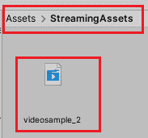

图 6.43 – StreamingAssets 文件夹

如*图 6.43*所示，视频文件保持其原始格式，并未转换为 Unity 视频剪辑资产。

接下来，让我们创建另一个 C#脚本，以演示如何使**视频播放器**加载此视频文件并在浏览器中播放：

```cs
using System.IO;
using UnityEngine;
using UnityEngine.Video;
public class VideoManagerForWeb : MonoBehaviour
{
    [SerializeField] private VideoPlayer _videoPlayer;
    [SerializeField] private string _videoFileName;
    void Start()
    {
        if (_videoPlayer == null)
        {
            _videoPlayer = GetComponent<VideoPlayer>();
        }
    }
    public void OnClickSetVideoURL()
    {
        _videoPlayer.url =
          Path.Combine(Application.streamingAssetsPath,
          _videoFileName);
    }
}
```

在此脚本中，我们通过`Application.streamingAssetsPath`属性在运行时获取文件夹的路径，并将该路径分配给`VideoPlayer`的`url`属性。

现在，我们不是在编辑器中运行游戏，而是构建并部署它作为一个网络应用程序，然后在浏览器中运行。


图 6.44 – 在浏览器中播放视频

这次视频在浏览器中按预期播放。

## 帧率

当使用 Unity 开发 WebGL 应用程序时，您还应注意视频的**帧率**。在 Unity 中，帧率以每秒帧数的形式表示。

让我们打印出我们在编辑器中使用的示例视频的长度、帧数和帧率信息。


图 6.45 – 帧率

如您在此处所见，本视频的帧数为 213 帧，视频长度为 7.1 秒，帧率为 30 FPS。

然而，由于 WebGL 平台底层的实现，即`HTML5 <video>`的 JavaScript API 没有公开帧率信息，帧率始终假设为 24 FPS，即使视频的实际帧率为 30 FPS。因此，视频的帧/秒始终为 24，这在实现 WebGL 的视频进度条时应该注意。

在本节中，我们讨论了由于 Web 平台的一些限制，使用 Unity 开发视频功能时需要注意的事项。接下来，我们将探讨如何使用 Unity 提供的性能分析工具定位由音频引起的性能问题以及如何解决这些问题。

# 提高音频系统的性能

在游戏开发中，音频的重要性往往被忽视。有时这也反映在性能优化上。游戏开发者通常在其他性能领域投入更多精力，例如图形渲染的性能优化。但随着游戏变得越来越复杂，音频也可能导致性能问题，例如更大的内存使用等。在本节中，我们将探讨如何在 Unity 中优化音频性能。

## Unity 分析器

首先，我们应该学习如何使用 Unity 分析器工具来查看和定位由 Unity 中的音频系统引起的性能瓶颈：

1.  点击**窗口** | **分析** | **分析器**或使用键盘快捷键*Ctrl* + *7*（在 macOS 上为*command* + *7*）打开**分析器**窗口。

1.  点击**音频**模块区域在**分析器**窗口中查看音频系统的性能数据。您可以了解正在播放的音频源数量、正在使用的音频剪辑数量以及音频使用的内存量等信息，如图*图 6.46*所示：

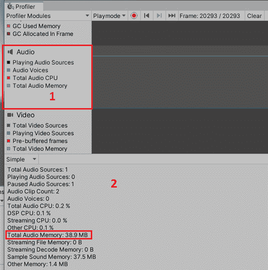

图 6.46 – 音频分析器

如*图 6.46*所示，**总音频内存**的值为 38.9 MB，这非常糟糕，因为目前只有一个是音频源正在播放声音。因此，我们可以点击标记为**简单**的下拉菜单并切换到**详细**视图。

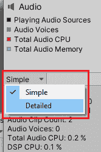

图 6.47 – 切换到详细视图

1.  我们可以获取有关音频系统的更多信息，并识别占用 38.9 MB 内存的具体音频资产。


图 6.48 – 详细视图

接下来，我们将介绍如何减少此音频资源占用的内存。

## 使用强制单声道来节省内存

如果我们检查这个音频资产，我们会发现音频资产是立体声的，如图*图 6.49*所示。

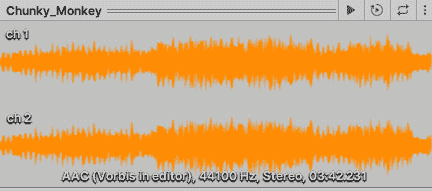

图 6.49 – 音频剪辑

然而，由于游戏场景中只有一个音频源，这意味着声音从一个点发出，因此在这里使用立体声的效果会丢失，但内存消耗是单声道的两倍。因此，如果游戏不需要立体声且需要减少内存开销，我们只需在音频剪辑的导入设置中启用**强制单声道**选项，将立体声音频剪辑转换为单声道音频剪辑即可。

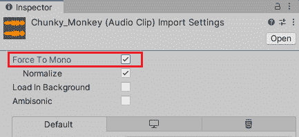

图 6.50 – 启用强制单声道

然后让我们再次播放音频。这次我们发现这个音频剪辑的内存消耗已从 38.9 MB 降至 20.2 MB，几乎减半。


图 6.51 – 内存消耗已降低

在本节中，我们介绍了如何使用 Unity 的 Profiler 工具查看音频系统的性能数据，并探讨了如何优化音频系统的性能。

# 摘要

在本章中，我们首先介绍了 Unity 提供的音频和视频功能，然后探讨了 Unity 音频系统和视频系统中最重要的一些概念，例如**音频剪辑**资源、**音频源**组件、**音频监听器**组件、**视频播放器**组件等等。我们还讨论了如何在 Unity 中创建一个新的脚本以与 Unity 的音频系统和视频系统交互。

然后，我们演示了如何为 Web 平台实现视频，因为 WebGL 不支持 Unity 的**视频剪辑**资源，并且由于底层实现原因，视频帧率始终假设为 24 FPS。这些需要注意。

最后，我们探讨了如何查看和定位由 Unity 音频系统引起的性能瓶颈。

在下一章中，我们将介绍 Unity 中计算机图形学的数学原理。
