# *第七章*：理解 Unity 中计算机图形学的数学

数学是游戏开发中经常讨论的一个主题。尽管 Unity 为游戏开发者提供了许多辅助函数来减少在 Unity 中使用数学的复杂性，但仍然需要具备一些关于计算机图形学的基本数学知识，例如坐标系、向量、矩阵和四元数。

在本章中，我们将探讨以下关键主题：

+   从坐标系开始

+   处理向量

+   使用变换矩阵

+   处理四元数

到本章结束时，你将具备计算机图形学的数学知识，并知道如何在脚本中正确地使用向量、矩阵、四元数和欧拉角。

现在，让我们开始吧！

# 从坐标系开始

像许多文件一样，大多数模型文件都是二进制文件。当游戏引擎，如 Unity，需要渲染一个模型时，模型的日期，如模型的顶点数组和顶点数组的索引，将通过游戏引擎的渲染管道提取和处理。

注意

你可以在[`www.khronos.org/opengl/wiki/Rendering_Pipeline_Overview`](https://www.khronos.org/opengl/wiki/Rendering_Pipeline_Overview)找到更多关于计算机图形学中渲染管道的信息。

图形渲染管道主要包含两个功能：一个是将对象的 3D 坐标转换为屏幕空间中的 2D 坐标，另一个是为屏幕上的每个像素着色。最后，3D 模型将在 2D 屏幕上渲染。

在渲染管道的过程中，将涉及大量的坐标系转换工作，正如你在*图 7.1*中看到的。因此，这是一个重要的主题，我们将在本节中介绍有关坐标系的信息：

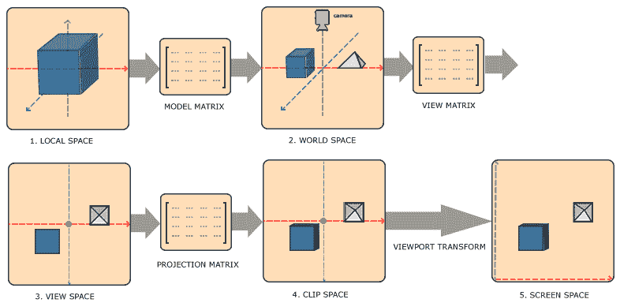

图 7.1 – 坐标变换过程（CC BY 4.0）

## 理解左手坐标系和右手坐标系

坐标系是一种几何系统，通常使用数字来确定空间中某点的位置。

在数学中，有许多不同类型的坐标系，例如**数轴坐标系**、**笛卡尔坐标系**和**极坐标系**。在计算机图形学中，**笛卡尔坐标系**是最常用的。


图 7.2 – 坐标系

笛卡尔坐标系在我们的日常生活中也非常常见，即使用 *x* 轴、*y* 轴和 *z* 轴来描述物体的坐标信息。当用于描述 3D 空间时，笛卡尔坐标系可以是**左手坐标系**或**右手坐标系**。正如它们的名称所暗示的，我们实际上可以通过使用左手和右手来区分这两种坐标系。

![Figure 7.3 – 坐标系统 (CC BY-SA 3.0)

![img/Figure_7.03_B17146.jpg]

Figure 7.3 – 坐标系统 (CC BY-SA 3.0)

如*Figure 7.3*所示，我们可以通过可视化拇指指向*x*轴、食指指向*y*轴和中指指向*z*轴来区分左手坐标系和右手坐标系。

![Figure 7.4 – Unity 中的左手坐标系

![img/Figure_7.04_B17146.jpg]

Figure 7.4 – Unity 中的左手坐标系

如果我们在 Unity 编辑器中查看，我们可以看到 Unity 使用的是左手坐标系，如图*Figure 7.4*所示。

## 本地空间

坐标空间是 3D 位置和变换存在于坐标系中的空间，例如**本地空间**和**世界空间**。在 Unity 中，我们经常使用本地空间或世界空间。本地空间与**父子关系**的概念相关，这意味着它使用 GameObject 层次结构中父节点的原点和轴。父 GameObject 的位置、旋转和缩放将影响由其定义的本地空间。因此，这在处理单个 GameObject 的变换时不是很有用，但在处理一组 GameObject 时非常有用。

例如，在*Figure 7.5*中，这五个立方体对象都是名为**LocalSpace**的 GameObject 的子对象：

![Figure 7.5 – LocalSpace 父对象

![img/Figure_7.05_B17146.jpg]

Figure 7.5 – LocalSpace 父对象

我们可以看到，`0`。现在，让我们将此父对象沿*y*轴向下移动 2 个单位，并围绕*y*轴旋转 45 度。

![Figure 7.6 – LocalSpace 父对象

![img/Figure_7.06_B17146.jpg]

Figure 7.6 – LocalSpace 父对象

如*Figure 7.6*所示，所有这些立方体都沿*y*轴向下移动了 2 个单位，并围绕*y*轴旋转了 45 度。然而，如果我们查看**Inspector**窗口中单个立方体的位置和旋转，我们可以看到这些值没有改变。这是因为，目前，它们位于由父对象定义的本地空间中，单个立方体相对于其父对象的位置和旋转没有改变。

![Figure 7.7 – 本地空间子对象

![img/Figure_7.07_B17146.jpg]

Figure 7.7 – 本地空间子对象

我们可以通过 C#代码在运行时更改子对象的本地位置、本地旋转和本地缩放，如下所示：

```cs
public class LocalSpaceTest : MonoBehaviour
{
    private Vector3 _localPosition = new Vector3(-2, 0, 0);
    private Vector3 _localScale = new Vector3(1, 2, 1);
    private Transform _transform;
    private void Start()
    {
        _transform = gameObject.transform;
        _transform.localPosition = _localPosition;
        _transform.localScale = _localScale;
    }
}
```

将此脚本附加到名为**Cube (1)**的子对象上并运行游戏。我们可以在下面的屏幕截图中看到，相对于父对象，子对象沿*x*轴移动了 2 个单位，沿*y*轴相对于父对象放大了 2 倍：

![Figure 7.8 – 更改本地位置和本地缩放

![img/Figure_7.08_B17146.jpg]

Figure 7.8 – 更改本地位置和本地缩放

在本节中，我们讨论了本地空间。接下来，我们将探索世界空间。

## 世界空间

与由父 GameObject 定义的局部空间不同，世界空间是整个场景的坐标系。场景的中心是世界空间的起点。

让我们在场景中创建一个新的 Cube 对象，这次，这个新立方体不是其他 GameObject 的子对象。

![Figure 7.9 – World space![Figure 7.09 – World space 图 7.9 – 世界空间如*图 7.9*所示，当立方体的位置为`0`时，立方体位于场景的中心。如果我们将立方体位置中的*x*值从`0`改为`1`，那么立方体将在世界空间的*x*轴上前进 1 个单位。![Figure 7.10 – Moving in world space![Figure 7.10 – Moving in world space 图 7.10 – 在世界空间中移动我们也可以在 C#脚本中修改 GameObject 在世界空间中的位置、旋转和缩放。以下代码片段展示了如何进行此操作：```csusing UnityEngine;public class WorldSpaceTest : MonoBehaviour{    void Start()    {        transform.position = new Vector3(0, 1, 0);    }}````position`属性是变换的世界空间位置。除了直接修改`position`或`rotation`属性外，我们还可以调用以下方法来同时修改对象的`position`和`rotation`属性：```cspublic void SetPositionAndRotation(Vector3 position, Quaternion   rotation);```我们可以看到，此方法需要一个`Vector3`类型的参数和一个`Quaternion`类型的参数。我们将在*与向量一起工作*和*与四元数一起工作*部分分别介绍向量和四元数。## 屏幕空间如本节开头所述，坐标系可以用来确定空间中的点。这不仅指 3D 空间，也指 2D 空间。屏幕空间是由观众屏幕定义的空间。这意味着屏幕空间将内容投影到屏幕上。在屏幕空间中，坐标是 2D 的；（**0,0**）是左下角，而（screen.width, screen.height）是右上角，如以下截图所示：![Figure 7.10 – Moving in world space![Figure 7.11 – Screen space 图 7.11 – 屏幕空间 2D 元素通常在屏幕空间中描述，最常见的是 UI。屏幕空间的另一个常见用途是获取鼠标输入的位置。原因很明显：鼠标在屏幕上移动。以下代码片段演示了如何在 C#脚本中获取鼠标的位置：```csusing UnityEngine;public class ScreenSpaceTest : MonoBehaviour{    void Update()    {        Vector2 mousePosition = Input.mousePosition;        Debug.Log($"Mouse Position: {mousePosition}");    }}````Input`类的`mousePosition`属性将返回屏幕空间中的当前鼠标位置，前面的代码将打印鼠标位置到**控制台**窗口，如*图 7.12*所示：![Figure 7.12 – Mouse position![Figure 7.12 – Mouse position 图 7.12 – 鼠标位置在获得鼠标的屏幕空间位置后，我们可以使用 Unity 的`Camera`类提供的方法将屏幕空间位置转换为世界空间位置。此外，Unity 允许我们创建一个从相机通过屏幕点延伸到游戏世界的射线。这可以帮助我们处理游戏中的一种常见情况，即我们需要知道玩家在 3D 游戏世界中点击了什么，尽管玩家实际上只能点击 2D 屏幕。一些方法的签名如下：```cspublic Ray ScreenPointToRay(Vector3 pos);public Vector3 ScreenToWorldPoint(Vector3 position);```正如我们刚才提到的，`ScreenPointToRay`方法非常有用，因为它从相机返回一个指向世界空间中鼠标位置的`Ray`实例。我希望你仍然记得我们在上一章中介绍的物理系统中的 Collider 组件，因为我们可以使用这个方法向 Collider 发射射线并获取 Collider 的详细信息，并且它还可以用于在 Unity 编辑器的场景视图中绘制线条以帮助调试。接下来，我们将修改之前的代码以实现一个可以检测鼠标点击位置是否有碰撞体，并在有碰撞体的情况下在场景视图中绘制红线的功能：```cs    Ray _ray;    private void FixedUpdate()    {      _ray =        Camera.main.ScreenPointToRay(Input.mousePosition);      if (Physics.Raycast(_ray, out RaycastHit hit, 50))      {          Debug.DrawLine(_ray.origin, hit.point,            Color.red);        }    }```如代码片段所示，我们调用`ScreenPointToRay`方法从场景中主相机的位置创建一个指向鼠标方向的射线，然后通过调用`Physics.Raycast`使用这个射线检测场景中的碰撞体，最后调用`Debug.DrawLine`在场景视图中绘制一条红线，如下面的截图所示：

图 7.13 – 绘制红线

在*图 7.13*中，顶部是游戏视图，即游戏运行窗口，底部是场景视图，即调试窗口。

我们在本节中介绍了坐标系。接下来，我们将讨论另一个非常重要的主题：向量。

# 与向量一起工作

在游戏开发中，我们使用向量来定义方向和位置。如图所示，我们画一条线连接两个点来表示一个向量。在这种情况下，向量从原点开始，即图上的点**B (0, 0)**，到点**A (6, 2)**：

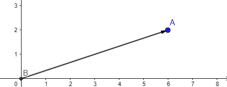

图 7.14 – 2D 位置

我们可以看到这个向量由两个分量组成，即*x*和*y*。它们代表沿*x*轴和*y*轴从原点起测量的距离。因此，这个向量可以用来定义点`(x*x+y*y)`的位置。

在 Unity 中，我们将使用 Vector2 结构来表示 2D 向量和点。Vector2 的长度属性返回这个 2D 向量的长度值。

3D 向量与 2D 向量类似，但我们也需要考虑*z*轴的值。3D 向量的长度是`(x*x+y*y+z*z)`的平方根。

Unity 还提供了 `Vector3` 结构来表示 3D 向量和点。如果你查看场景中 GameObject 的检查器窗口，你会发现在对象的 **位置**、**旋转** 和 **缩放** 属性都是 Vector3 类型，如下面的图所示：


图 7.15 – GameObject 的变换

## 向量加法

由于向量可以用来描述位置，它们也可以用来描述随时间变化的位置。一个移动的物体有一个速度，这是物体在给定方向上的速度。

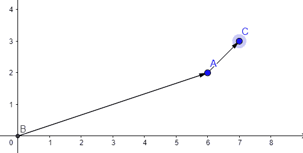

图 7.16 – 向量加法

如 *图 7.16* 所示，假设一个物体当前位于点 **A**，并且它的速度是每分钟 (1, 1)，这意味着物体将在 *x* 轴和 *y* 轴上各移动 1 个单位。因此，我们将它的当前位置向量与其速度向量相加，以计算 1 分钟后它将到达的位置：

`(6, 2) + (1, 1) = (7, 3)`

这个物体在 1 分钟后的新位置是 (7, 3)。

## 如何减去向量

向量减法和向量加法非常相似。我们可以反转第二个向量的方向并使用向量加法。让我们仍然使用之前的例子。假设一个移动的物体当前位于点 A，并且它的速度是每分钟 (-1, -1)，这意味着物体将在 *x* 轴和 *y* 轴上各移动 -1 个单位。

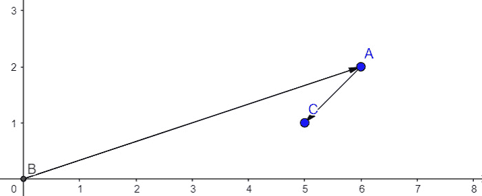

图 7.17 – 向量减法

让我们再次将它的当前位置向量与其速度向量相加，以计算 1 分钟后它将到达的位置：

`(6, 2) - (1, 1) = (6, 2) + (-1, -1) = (5, 1)`

这个物体在 1 分钟后的新位置是 (5, 1)。

在 Unity 中，我们可以使用 C# 代码进行向量加法和向量减法，如下所示：

```cs
    private void Start()
    {
        var vector1 = new Vector3(1, 1, 1);
        var vector2 = new Vector3(1, 2, 3);
        var addVector = vector1 + vector2;
        var subVector = vector1 - vector2;
        Debug.Log($"Addition: {addVector}");
        Debug.Log($"Subtraction: {subVector}");
    }
```

在前面的代码片段中，我们创建了两个 3D 向量 `(1, 1, 1)` 和 `(1, 2, 3)`。然后，我们分别对它们进行加法和减法操作，并将结果打印到 **控制台** 窗口。

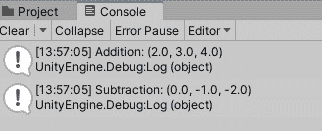

图 7.18 – 向量加法和向量减法

为了在 Unity 中移动对象，需要了解向量的知识。但有时我们不必在代码中直接计算向量加法或减法的结果。这是因为 Unity 为我们提供了 `Transform.Translate` 函数来移动对象。当然，我们仍然需要传递一个向量参数来提供速度：

```cs
    private void Update()
    {
        transform.Translate(_speed * Time.deltaTime *
          Vector3.forward);
    }
```

前面的代码片段演示了如何通过调用 `Transform.Translate` 函数来移动对象。

## 点积

除了向量加法和向量减法之外，在游戏开发中常用的 3D 向量操作还包括**点积**操作和**向量积**操作。我们将在本节和下一节中分别介绍它们。

首先，我们将探索 Unity 中的点积。点积或标量积接受两个向量并返回一个单一的标量值。

假设有两个 3D 向量，分别命名为*vector1*和*vector2*；点积的计算过程非常简单，如下所示：

`标量值 = (x1 * x2) + (y1 * y1) + (z1 * z2)`

在游戏开发中，向量点积操作经常被用来判断这两个向量是否垂直。如果它们的点积操作结果是 0，则两个向量是垂直的。如果结果是正数，则两个向量之间的角度小于 90 度。如果结果是负数，则两个向量之间的角度大于 90 度。

接下来，我们可以在 Unity 编辑器中创建两个 3D 向量来演示如何使用向量点积操作。

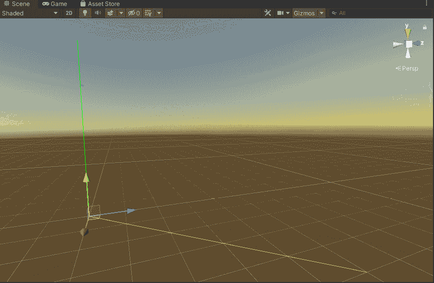

图 7.19 – 编辑器中的两个 3D 向量

如*图 7.19*所示，绿色线代表第一个向量，它是(0, 5, 0)，黄色线代表另一个向量，它是(5, 0, 5)。这两个向量点积操作的结果如下：

`0 = (0 * 5) + (5 * 0) + (0 * 5)`

同时，我们可以在*图 7.19*中看到这两个向量是垂直的。

如果第一个向量是(0, 5, 5)，这两个向量点积操作的结果如下：

`25 = (0 * 5) + (5 * 0) + (5 * 5)`

如*图 7.20*所示，这次两个向量不是垂直的，夹角小于 90 度：

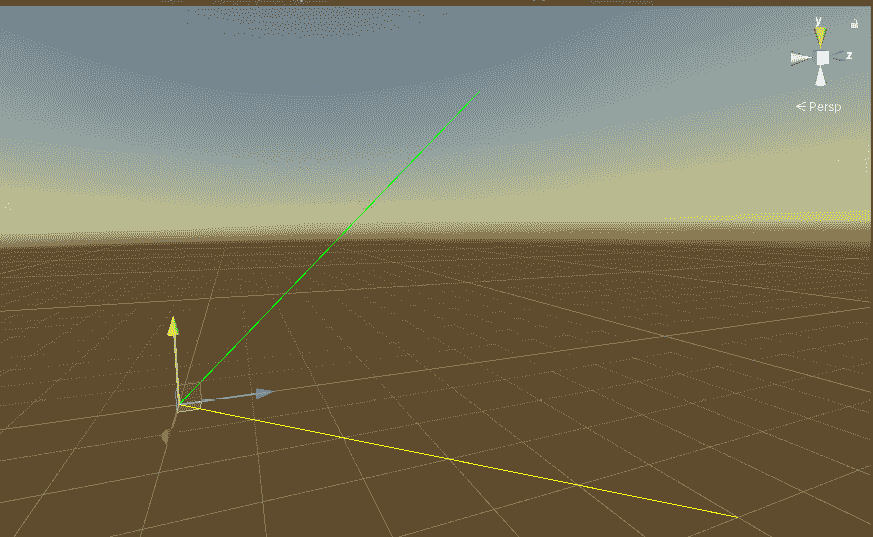

图 7.20 – 编辑器中的两个 3D 向量

如果第一个向量是(0, 1, -1)，这两个向量点积操作的结果如下：

`-5 = (0 * 5) + (1 * 0) + (-1 * 5)`

如*图 7.21*所示，这次两个向量不是垂直的，夹角大于 90 度：


图 7.21 – 编辑器中的两个 3D 向量

Unity 为我们提供了一个函数来计算两个 3D 向量点积的结果，如下所示：

```cs
public static float Dot(Vector3 lhs, Vector3 rhs);
```

这是一个静态函数，我们可以在我们的 C#代码中直接调用它：

```cs
public class VectorTest : MonoBehaviour
{
    private Vector3 _vectorA = new Vector3(0, 1, -1);
    private Vector3 _vectorB = new Vector3(5, 0, 5);
    private void Start()
    {
        var result = Vector3.Dot(_vectorA, _vectorB);
        Debug.Log(result);
    }
}
```

## 向量积

另一方面，向量积接受两个向量，但返回的是另一个向量，而不是单一的标量值。这个向量垂直于原始的两个向量。


图 7.22 – 向量积（CC BY-SA 4.0）

与点积相比，叉积的计算过程更为复杂。前图展示了这一过程。

Unity 还提供了一个有用的函数来计算两个 3D 向量的叉积结果，如下所示：

```cs
public static Vector3 Cross(Vector3 lhs, Vector3 rhs);
```

这是一个静态函数，我们可以在我们的 C#代码中直接调用它：

```cs
    void FixedUpdate()
    {
        var vector1 = new Vector3(0, 1, 0);
        var vector2 = new Vector3(1, 0, 1);
        Debug.DrawLine(Vector3.zero, vector1, Color.green);
        Debug.DrawLine(Vector3.zero, vector2,
          Color.yellow);
        var resultVector = Vector3.Cross(vector1, vector2);
        Debug.DrawLine(Vector3.zero, resultVector,
          Color.cyan);
    }
```

在此代码片段中，我们计算了向量 1 和向量 2 的叉积结果，同时，我们还在 Unity 编辑器中绘制了这三个向量，如图所示：


在本节中，我们介绍了向量并探讨了如何在 Unity 脚本中正确使用向量。接下来，让我们继续探讨计算机图形学中的另一个重要概念，即矩阵。

# 与变换矩阵一起工作

在游戏开发中，**变换矩阵**也是一个常用术语。具体来说，我们使用变换矩阵来编码变换，包括平移、旋转和缩放变换。

Unity 为我们提供了 C#中的`Matrix4x4`结构体来表示标准的 4x4 变换矩阵。

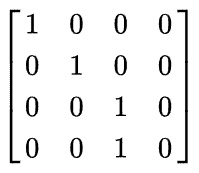


图 7.25 – 平移矩阵（CC BY 4.0）

让我们创建一个 C#脚本，并在 Unity 中直接使用矩阵来演示如何移动一个对象：

```cs
using UnityEngine;
public class MatrixTest : MonoBehaviour
{
    void Start()
    {
        var translationMatrix = new Matrix4x4(
            new Vector4(1, 0, 0, 0),
            new Vector4(0, 1, 0, 0),
            new Vector4(0, 0, 1, 0),
            new Vector4(3, 2, 1, 1)
        );
        var newPosition =
          translationMatrix.MultiplyPoint
(transform.position);
        transform.position = newPosition;
    }
}
```

如此代码片段所示，我们使用了四个`Vector4`实例来创建一个`Matrix4x4`结构体的实例。需要注意的是，我们用来创建矩阵的每个`Vector4`代表矩阵的一列，而不是一行。因此，代码创建了一个如图所示的矩阵：


图 7.26 – 创建矩阵

然后，我们通过调用`Matrix4x4`的`MultiplyPoint`函数来计算对象的新位置，其中参数是对象的原位置。最后，我们将对象的位置设置为这个新向量。


图 7.27 – 改变对象的位置

如果我们在原点创建一个对象并运行此脚本，结果将是对象移动到点 (3, 2, 1)，如图 *图 7.27* 所示。

## 旋转矩阵

同样，矩阵也可以用来旋转一个对象，即旋转矩阵。这次，我们也在 C# 脚本中创建 `Matrix4x4` 的实例，但不是调用其构造函数，而是调用此函数：

```cs
public static Matrix4x4 Rotate(Quaternion q);
```

`Rotate` 函数是 `Matrix4x4` 的静态函数，它创建并返回一个旋转矩阵。此函数需要一个四元数类型的参数。我们将在下一节介绍四元数。

现在，让我们编写一些代码来使用 `Matrix4x4` 旋转对象：

```cs
        var rotation = Quaternion.Euler(0, 90, 0);
        var rotationMatrix = Matrix4x4.Rotate(rotation);
        var newPosition =
          rotationMatrix.MultiplyPoint(transform.position);
        transform.position = newPosition;
```

此代码将点从其原始位置移动到绕 *y* 轴旋转 90 度的位置。

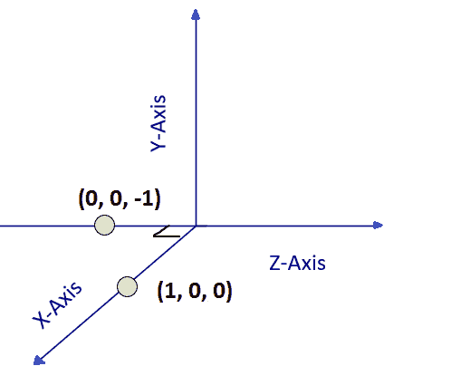

图 7.28 – 旋转矩阵

让我们将此对象的原始位置设置为 (1, 0, 0)，然后运行代码。此对象的新位置应该是 (0, 0, -1)，如图中所示。

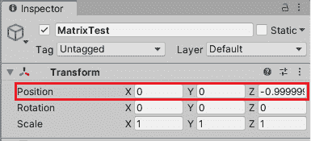

图 7.29 – 实际结果

运行代码后，我们可以看到实际结果与我们预期的相符。

## 缩放矩阵

当我们缩放一个向量时，我们将保持其方向不变，并通过我们想要缩放的量来改变其长度。我们还可以使用缩放矩阵将一个点从原点缩放出去。你可以想象一个模型由许多顶点组成。当我们缩放一个模型时，我们实际上是在扩展或收缩构成它的顶点的位置。

Unity 还为我们提供了一个函数，可以直接在 C# 脚本中创建缩放矩阵：

```cs
public static Matrix4x4 Scale(Vector3 vector);
```

`Matrix4x4`，它创建并返回一个缩放矩阵：

```cs
    private void ScalingMatrixTest()
    {
        var scale = new Vector3(3, 2, 1);
        var scalingMatrix = Matrix4x4.Scale(scale);
        var newPosition =
          scalingMatrix.MultiplyPoint(transform.position);
        transform.position = newPosition;
    }
```

为了演示如何将缩放矩阵应用于一个点，我们创建了前面的代码片段。正如你在代码中所见，我们创建了一个新的 `Vector3` 来表示缩放因子。然后，我们通过调用 `Matrix4x4.Scale` 函数创建了一个缩放矩阵，最后，我们将这个矩阵应用于一个点。

让我们在场景中创建一个新的 GameObject，并将此 GameObject 定位到位置 (1, 1, 0)。

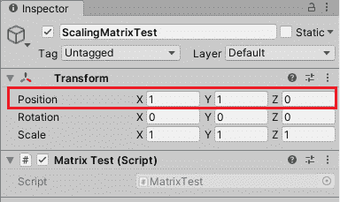

图 7.30 – 位置在 (1, 1, 0) 的 GameObject

然后，将其脚本附加到它上面并运行脚本。

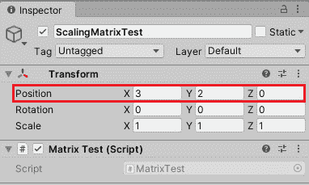

图 7.31 – 将缩放矩阵应用于此对象

如 *图 7.31* 所示，此对象的新位置是 (3, 2, 0)。这是因为此缩放矩阵将其原始位置沿 *x* 轴增加了三倍，沿 *y* 轴增加了两倍。

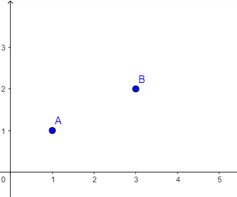

图 7.32 – 缩放一个点

如我们在这节开头提到的，在 Unity 开发中，矩阵操作是相对低级的操作。Unity 为我们提供了许多函数来掩盖矩阵的复杂性。开发者通常不直接使用矩阵，但作为一个重要概念，我们仍然需要理解一些与之相关的概念。然而，当涉及到对象旋转时，Unity 通常使用另一种类型来保存旋转数据。如果你对此感兴趣，让我们继续探索**四元数**。

# 与四元数一起工作

在 Unity 中，变换的旋转以**四元数**的形式内部存储，它有四个分量，即*x*、*y*、*z*和*w*。然而，这四个分量并不代表角度或轴，我们开发者通常不需要直接访问它们。你可能感到困惑，因为如果你查看变换的检查器窗口，你会发现旋转以 Vector3 的形式显示。

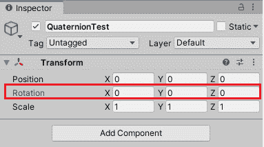

图 7.33 – 检查器窗口中的旋转属性

这是因为尽管 Unity 使用四元数来内部存储旋转，除了四元数之外，旋转还可以用*x*、*y*和*z*三个角度值来表示，即**欧拉角**。

因此，为了方便开发者编辑，Unity 在检查器中显示等效欧拉角的值。

那么，为什么 Unity 不直接使用欧拉角来存储旋转呢？它由三个轴角度组成，并且以人类易于阅读的格式存在。这是因为欧拉角受到**陀螺仪锁定**的影响，这意味着“自由度”丢失了。

另一方面，使用四元数旋转不会引起陀螺仪锁定问题。因此，Unity 使用四元数来内部存储旋转。但你需要记住的是，四元数的四个分量并不代表角度，所以我们不会单独修改一个分量的值，直接修改四元数是非常复杂的。幸运的是，Unity 在`Quaternion`结构中为我们提供了许多内置的 C#函数，以便轻松管理四元数旋转。在 Unity 中使用`Quaternion`结构和其函数来管理旋转值是我们的最佳选择。

我们可以根据其目的将这些函数分为三组，即创建旋转、操作旋转和与欧拉角一起工作。让我们接下来探索它们。

## 创建旋转

我们将要介绍的第一个函数是`LookRotation`，该函数的函数签名如下：

```cs
public static Quaternion LookRotation(Vector3 forward,
  [DefaultValue("Vector3.up")] Vector3 upwards);
```

这是一个静态函数；你可以传入参数来指定其前进和向上方向，然后它会根据传入的参数返回正确的旋转值。

在下面的示例中，我们设置了一个场景，其中有两个对象，分别命名为 `target` 和 `player`，并创建了一个名为 `LookAtScript.cs` 的新 C# 脚本。然后，我们将此脚本附加到玩家对象上，如图 *图 7.34* 所示。蓝色立方体代表玩家，红色球体代表目标对象：

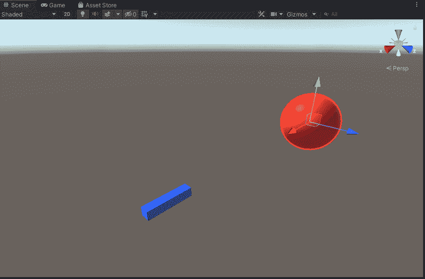

图 7.34 – 场景中的对象

在下面的脚本中，我们演示了如何实现一个函数，使玩家无论目标移动到何处，都能始终面向目标对象：

```cs
using UnityEngine;
public class LookAtTest : MonoBehaviour
{
    [SerializeField] private Transform _targetTransform;
    private void Update()
    {
        if (_targetTransform == null) return;
        var dir = _ targetTransform.position –
          transform.position;
        transform.rotation = Quaternion.LookRotation(dir);
    }
}
```

首先，我们计算了从玩家到目标的方向。然后，我们调用 `Quaternion.LookRotation` 函数来计算旋转值。

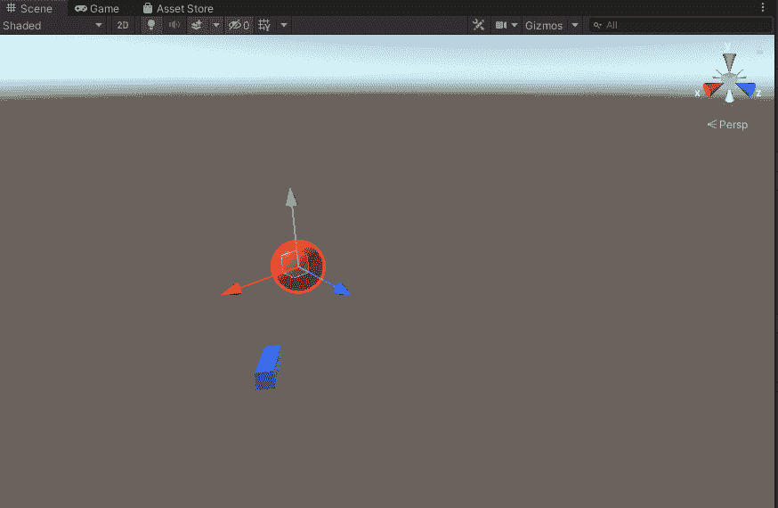

图 7.35 – 面向目标的玩家

最后，我们将目标对象和玩家移动，使它们面向目标，如图 *图 7.35* 所示。

## 操作旋转

有一些函数用于操作旋转，`Quaternion.Slerp` 就是其中之一。以下是其函数签名：

```cs
public static Quaternion Slerp(Quaternion a, Quaternion b, 
  float t);
```

这是一个静态函数。调用 `Quaternion.Slerp` 的结果是对象将开始缓慢旋转，然后在中间加快速度。

在下面的示例中，我们仍然使用之前设置的场景，这次创建一个名为 `OrbitScript.cs` 的新 C# 脚本。然后，我们将此脚本附加到玩家对象上以实现重力轨道效果。

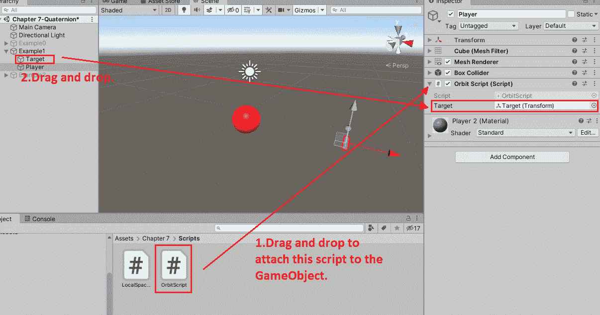

图 7.36 – 将脚本附加到 GameObject

`OrbitScript.cs` 的代码如下：

```cs
using UnityEngine;
public class OrbitScript : MonoBehaviour
{
    [SerializeField] private Transform _target;
    void Update()
    {
        if (_target == null) return;
        var dir = _target.position - transform.position;
        var targetRotation = Quaternion.LookRotation(dir);
        var currentRotation = transform.localRotation;
        transform.localRotation =
          Quaternion.Slerp(currentRotation, targetRotation,
          Time.deltaTime);
        transform.Translate(0, 0, 5 * Time.deltaTime);
    }
}
```

在此脚本中，我们重用了 `LookAtScript.cs` 中的某些代码。我们首先计算了玩家朝向目标的角度。但与之前的脚本不同，我们没有直接修改玩家的旋转，而是使用两个临时变量 `targetRotation` 和 `currentRotation` 保存了目标旋转和玩家当前旋转。然后，调用 `Quaternion.Slerp` 函数使玩家逐渐转向目标，这也是实现重力轨道效果的关键。最后，我们调用 `transform.Translate` 函数以保持玩家向前移动。

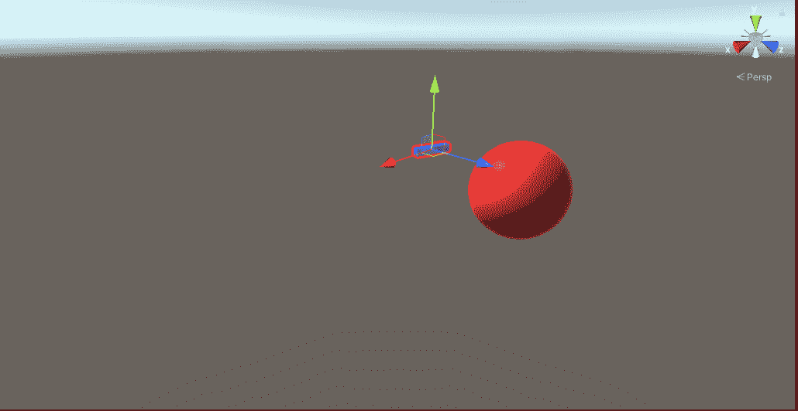

图 7.37 – 运行游戏

如果我们运行游戏，我们会发现玩家会在目标周围移动并转向面向目标，如图 *图 7.37* 所示。

## 使用欧拉角

如果在某些情况下你更愿意使用欧拉角而不是四元数，Unity 允许你将欧拉角转换为四元数，但你不应该从四元数中检索欧拉角，并在修改后将其应用到四元数上，因为这可能会引起问题。

`Quaternion.Euler` 是这些我们可以用来将欧拉角转换为四元数的函数之一。以下是其函数签名：

```cs
public static Quaternion Euler(Vector3 euler);
```

此函数需要一个 `Vector3` 类型的参数，该参数提供了围绕 *x* 轴、*y* 轴和 *z* 轴的角度。基于这些数据，此函数返回相应的四元数旋转。

以下代码片段演示了如何在脚本中正确使用欧拉角：

```cs
using UnityEngine;
public class EulerAnglesTest : MonoBehaviour
{
    private float _xValue;
    private void Update()
    {
        _xValue += Time.deltaTime * 5;
        var eulerAngles = new Vector3(_xValue, 0, 0);
        transform.rotation = Quaternion.Euler(eulerAngles);
    }
}
```

在代码中，我们创建了围绕 *x* 轴旋转的欧拉角，然后调用了 `Quaternion.Euler` 函数将欧拉角转换为四元数。


图 7.38 – 将欧拉角转换为四元数

将此脚本附加到一个立方体上并运行游戏。你会发现立方体围绕 *x* 轴旋转。

在本节中，我们向您介绍了四元数，并探讨了如何在 Unity 脚本中正确使用四元数。需要注意的是，在 Unity 中，旋转不仅可以由四元数表示，也可以由欧拉角表示。当使用欧拉角来表示旋转时，其格式对人类来说易于阅读，但由于陀螺仪锁定的影响，Unity 仍然使用四元数来内部保存旋转。

# 摘要

本章首先介绍了计算机图形学中的坐标系概念，然后讨论了 Unity 使用的坐标系。接着，我们讨论了向量的概念以及如何在 Unity 中执行向量运算，如向量加法、向量减法、点积和叉积。

我们还介绍了矩阵的概念，并演示了如何在 Unity 中使用矩阵进行平移、旋转和缩放。

最后，我们探讨了如何创建旋转以及在四元数中操作旋转，并演示了如何在脚本中正确使用欧拉角。

通过阅读本章，你现在应该对计算机图形学有了更多的数学知识。在下一章中，我们将介绍 Unity 中的可脚本渲染管线。
