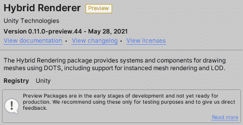

# *第九章*: Unity 中的面向数据的技术堆栈

Unity 引擎是一个非常友好的开发者引擎。在开发游戏逻辑时，Unity 的**GameObject-Components**架构可以帮助开发者快速开发功能，而在 Unity 中给 GameObject 添加新行为只需将其对应的组件附加到它上。然而，随着今天游戏变得越来越复杂，这种方法虽然对开发者非常友好，尤其是对熟悉传统**面向对象编程**（**OOP**）模型的人来说，但对于游戏性能和项目可维护性来说并不理想。

因此，Unity 引入了**面向数据的技术堆栈**（**DOTS**），允许开发者使用一种面向数据而非面向对象的替代编程哲学来编写游戏代码。它还引入了多线程功能以优化游戏性能。

本章将涉及以下关键主题：

+   DOTS 概述

+   Unity 中的多线程和 C#作业系统

+   在 Unity 中与 ECS 协作

+   使用 C#和 Burst 编译器

通过阅读本章，你将了解 DOTS 是什么，以及面向数据设计与传统面向对象设计的区别。你还将了解到如何使用 Unity 的**C#作业系统**来实现多线程以提高游戏性能，如何使用 Unity 的**实体组件系统**（**ECS**）以面向数据的方式编写游戏逻辑代码，以及如何使用**Burst 编译器**优化为 Unity 游戏生成的原生代码。

# 技术要求

本章的示例项目已在 GitHub 上提供。你可以在这里找到它：[`github.com/PacktPublishing/Game-Development-with-Unity-for-.NET-Developers/tree/main/Chapter9-DOTS`](https://github.com/PacktPublishing/Game-Development-with-Unity-for-.NET-Developers/tree/main/Chapter9-DOTS)。

# DOTS 概述

DOTS 是 Unity 中的一种新编程模式，也是近年来在 Unity 开发者社区中讨论很多的话题。

![Figure 9.1 – 基于 DOTS 的 Megacity 演示]

![Figure_9.01_B17146.jpg]

![Figure 9.1 – 基于 DOTS 的 Megacity 演示]

如果你之前有.NET 编程经验，你会熟悉**面向对象编程**（**OOP**）模式。OOP 在软件行业中得到了广泛应用，使用 Unity 开发游戏也不例外，直到 Unity 引入了 DOTS。毫无疑问，OOP 对于许多程序员来说是一个老习惯。因此，在讨论为什么 Unity 引入 DOTS 之前，我们首先会谈谈在使用 OOP 进行 Unity 开发时可能遇到的问题。

## 面向对象设计模式与 DOTS

首先，让我们来谈谈面向对象编程（OOP）的概念。我们可以在维基百科上找到一些有用的信息。这些概念包括**对象/类**、**继承**、**接口**、**信息隐藏**和**多态**。以下链接提供了详细的解释：[`en.wikipedia.org/wiki/Object-oriented_design`](https://en.wikipedia.org/wiki/Object-oriented_design)。

如果我们专注于对象/类和继承，我们会发现这两个概念是面向对象编程（OOP）和 DOTS 之间最大的区别。

让我们从**对象/类**的概念开始。在传统的面向对象编程模式中，一个类是一组紧密耦合的数据和行为，这些数据和行为作用于这些数据。这里有一个例子：

```cs
using UnityEngine;
public class Monster : MonoBehaviour
{
    # region Data
    private string _name;
    private float _hp;
    private Vector3 _position;
    private bool _isDead;
    #endregion
    #region Behavior
    public void Attack(Monster target){}
    public void Move(float speed){}
    public void Die(){}
    #endregion
}
```

如您在代码中所见，我们有一个名为 `Monster` 的类，它包含一些关于其位置、健康、名称以及是否死亡的数据。此外，这个类还可以独立于其数据表现出真实对象的行为。每个 `Monster` 对象都可以攻击目标、移动自己或死亡。

到目前为止，一切都很完美；程序中的对象就像现实世界中的对象一样，仿佛它们有自己的生命，这也符合人类经验。接下来，让我们讨论面向对象编程（OOP）的**继承**概念。我们可以通过继承扩展类的数据和行为，并重用其中的一些代码。

假设在这个例子中我们意识到并不是所有的怪物都会攻击其他怪物；有些可能会攻击人类。从编程的角度来看，人类和怪物有很多共同点：位置、健康以及是否死亡。但有些怪物可能不会被杀死，而人类不能飞来移动。在现实生活中，我们有一个怪物和人类的超集，即生物。让我们将怪物和人类共享的数据放在 `Creature` 类中，这样它们都可以拥有这些数据，但我们不必再次输入，如下所示：

```cs
public class Creature : MonoBehaviour
{
    #region Data

    private string _name;
    private float _hp;
    private Vector3 _position;
    private bool _isDead;

    #endregion
}
public class Monster : Creature
{
    # region Data
    private bool _canFly;
    #endregion
    #region Behavior
    public void Attack(Creature target){}
    public void Move(float speed){}
    public void Die(){}

    #endregion
}
```

基本上，如果我们继续这个想法，最终会得到一些复杂的类图，其中包含各种不同的生物，例如怪物、人类、动物和植物。我们甚至还没有考虑性能问题，就已经发现面向对象编程（OOP）会给我们带来很多麻烦。

现在，让我们看看面向对象编程（OOP）如何滥用硬件。随着技术的发展，处理器硬件变得越来越快，但常常被忽视的一点是，如果数据不能足够快地从内存提交到处理器，那么无论处理器有多快，它都不会像预期的那样工作得那么快。**缓存**，位于处理器核心附近，是一种更小、更快的内存。当处理器发出内存访问请求时，它首先会检查缓存中是否有数据。如果存在（这被称为缓存命中），数据将直接返回，无需访问主内存；如果不存在，必须首先将主内存中的相应数据加载到缓存中，然后再返回给处理器。CPU 通常使用具有多个缓存级别的层次结构；例如，在两级缓存系统中，**L1 缓存**靠近处理器端，而 **L2 缓存**靠近内存端。

CPU 缓存的设计基于几个假设。缓存之所以有效，主要是因为程序运行时对内存的访问具有局部性。这种局部性包括**空间局部性**和**时间局部性**。也就是说，我们需要执行一系列相关操作的数据片段可能在内存中非常接近，或者我们刚刚用于一个操作的数据可能很快就会用于另一个操作。利用这种局部性，缓存可以实现极高的命中率。

然而，面向对象编程（OOP）常常滥用硬件。我们仍然以 `Monster` 类为例。假设一个 `Monster` 对象将占用 56 字节内存，我们遍历怪物列表并调用它们的 `Move()` 函数来改变怪物的位置属性。

伪代码如下：

```cs
    public void Update()
    {
        for (var i = 0; i < _monsters.count; i++) 
        { 
            _monsters[i].Move(speed); 
        }
}
```

这段代码实际上每帧都会修改一组 Vector3 数据，但这段数据在内存中的分配方式是怎样的？以下图表显示了当 64 字节缓存行被分割成 8 字节块时，怪物对象在内存中的分配情况：


图 9.2 – 内存中的数据布局（OOP）

从图中我们可以看出，每帧将要修改的位置数据在内存中是不连续的，这意味着我们的游戏无法有效地使用高速内存，即缓存。

现在，让我们看看 Unity 中的新编程模式，DOTS。

与面向对象编程（OOP）不同，DOTS 的哲学是针对数据而不是对象进行设计，重点是优先组织和优化数据，使其内存访问尽可能高效。让我们仍然以 `Monster` 类为例，看看在使用 DOTS 时其数据在内存中的分配情况。


图 9.3 – 内存中的数据布局（DOTS）

您还记得吗？当移动一个怪物时，我们实际上只需要 12 个字节的怪物位置数据，因此代码只需要加载和处理所有怪物的位置数据来移动它们。使用 DOTS 允许我们将所有这些位置数据打包到一个数组中，并更有效地分配内存，如图中所示。在内存中将数据放置在连续的数组中提高了数据局部性，这导致缓存命中率极高，从而提高了代码性能。

因此，Unity 的 DOTS 是如何使开发者的代码运行得更高效的？嗯，Unity 中的 DOTS 不仅仅是将编程范式从面向对象转换为面向数据；它实际上包括一系列新的技术模块，即以下内容：

+   C#作业系统

+   ECS

+   Burst 编译器

每个模块都包含一个或多个 Unity 包。我们可以通过 Unity 的包管理器安装相应的功能。接下来，我们将简要介绍这三个模块，分别。

## C# 作业系统

通过使用 C#作业系统，我们可以在 Unity 中编写高效的异步代码，充分利用硬件。


图 9.4 – 使用 C#作业系统的技术演示

前面的图显示了使用 Unity 的 C#作业系统开发的演示项目，展示了场景中成千上万的“士兵”攻击敌人。您可以在 GitHub 上找到这个项目：[`github.com/Unity-Technologies/UniteAustinTechnicalPresentation`](https://github.com/Unity-Technologies/UniteAustinTechnicalPresentation)。

我们将在*Unity 中的多线程和 C#作业系统*部分详细讨论 C#作业系统。

## ECS

**ECS**的全称是**实体组件系统**。它是 Unity 中 DOTS 的核心部分，围绕使用面向数据的设计构建，这与您可能习惯的面向对象设计非常不同。


图 9.5 – 大都市演示

前面的图显示了 Unity 使用 ECS 的令人印象深刻的演示项目，名为**Megacity**，开发者可以在此处下载：[`unity.com/megacity`](https://unity.com/megacity)。


图 9.6 – 大都市下载页面

我们将在*在 Unity 中使用 ECS*部分详细介绍 ECS。

## Burst 编译器

Unity 中的 Burst 编译器是一种高级编译技术。使用 DOTS 制作的 Unity 项目可以使用 Burst 技术来提高它们的运行时性能。Burst 在 C#的一个子集上工作，称为**高性能 C#**（**HPC#**），并在 LLVM 编译器框架下应用高级优化方法来生成高效的二进制文件，从而实现设备能量的高效利用。

我们将在稍后的部分介绍如何在您的项目中使用它，*使用 C#和 Burst 编译器*。

本节介绍了与 DOTS 相关的知识，例如 DOTS 包含哪些技术模块，其设计理念与传统面向对象编程（OOP）有何不同，以及它解决了哪些问题。然而，DOTS 并不是 OOP 的替代品；它只是为 Unity 中的游戏开发者提供了一种另一种高效的编程模式。例如，你仍然可以使用 C# Job System 以传统的 Unity GameObject-Components 风格实现多线程编程，而不是自己维护线程池。好吧，接下来，让我们探索如何在 Unity 中实现高效的多线程编程。

# Unity 中的多线程和 C# Job System

在开发.NET 项目时，异步编程非常常见。但与许多熟悉.NET 开发的开发者所想的不同，Unity 对异步编程的支持最初并不友好。

## 协程

在 Unity 2017 之前，如果游戏开发者想要处理异步操作，一个常见的场景是等待网络响应。理想的解决方案是在 Unity 中使用**协程**。

我们可以在 Unity 中如下启动协程：

```cs
    void Start()
    {
        var url = "https://jiadongchen.com";
        StartCoroutine(DownloadFile(url));
    }
    private static IEnumerator DownloadFile(string url)
    {
        var request = UnityWebRequest.Get(url);
        request.timeout = 10;
        yield return request.SendWebRequest();
        if (request.error != null)
        {
            Debug.LogErrorFormat("error: {0}, url is: {1}",
              request.error, url);
            request.Dispose();
            yield break;
        }
        if (request.isDone)
        {
            Debug.Log(request.downloadHandler.text);
            request.Dispose();
            yield break;
        }
    }
```

如代码所示，我们使用`StartCoroutine`函数启动协程，并在协程内部使用`yield`语句暂停执行。然而，协程本质上仍然是单线程的，只是将任务分散到多个帧中，而不是多线程。

## async/await

Unity 在 2017 年引入了`async/await`运算符，允许游戏开发者在其游戏中使用`async/await`编写异步代码，但它仍然不像一个正常的.NET/C#程序。这是因为 Unity 引擎自行管理这些线程，大部分逻辑都在 Unity 的主线程上运行，包括作为脚本的 C#代码以及引擎的 C++代码。我们可以使用**Unity Profiler**工具来查看 CPU 时间线。如下面的截图所示，Unity 引擎默认在主线程上运行脚本：


图 9.7 – CPU 时间线

场景中有 50 个 GameObject，每个都附加了一个**MainThreadExample**脚本。你可以看到，这 50 个脚本中的**Update**函数是依次执行的。

你可以对不同类型的任务进行多线程处理；例如，在单独的线程中执行一些 Vector3 数学运算是没有问题的。但是，只要任务需要访问 Unity 主线程之外的 transform 或 GameObject，程序就会抛出异常。

让我们来看一个例子。以下代码的目的是改变 GameObject 的缩放，并使用`async/await`在另一个线程中执行操作：

```cs
using System.Threading.Tasks;
using UnityEngine;
public class AsyncExceptionTest : MonoBehaviour
{
    private async void Start()
    {
        await ScaleObjectAsync();
    }
    private async Task<Vector3> ScaleObjectAsync()
    {
        return await Task.Run(() => transform.localScale = new
          Vector3(2, 2, 2));
    }
}
```

将此脚本附加到场景中的 GameObject 上，然后在 Unity 编辑器中点击**播放**按钮来运行脚本。操作的结果是 GameObject 的缩放没有改变，并抛出了**UnityException: get_transform 只能从主线程调用**异常，如下面的截图所示：


图 9.8 – 异常

因此，你应该注意这一点，不要从 Unity 的主线程以外的线程访问变换或 GameObject。

正如我们之前提到的，我们可以在单独的线程中进行数学运算。因此，为了使之前的代码正确运行，我们可以在不同的线程中计算缩放值，访问 `Transform` 组件，并在 Unity 的主线程中修改其 `localScale` 属性：

```cs
    private async Task ScaleObjectAsync()
    {
        var newScale = Vector3.zero;
        await Task.Run(() => newScale = CalculateSize());
        transform.localScale = newScale;
    }
    private Vector3 CalculateSize()
    {
        Debug.Log("Threads");
        return new Vector3(2, 2, 2);
    }
```

这次，一切都很顺利，如果我们再次查看 Unity Profiler，我们可以在**脚本线程**部分找到这些线程的时间线，如下面的截图所示：


图 9.9 – 脚本线程

然而，作为一名开发者，即使在 C# 中编写线程安全和高效的代码也仍然存在许多挑战，如下所示：

+   编写线程安全代码很难。

+   竞态条件，其中计算的输出取决于两个或多个线程被调度的顺序。

+   不高效的上下文切换；切换线程时耗时。

Unity 中的 C# 作业系统是一个专注于解决这些挑战的解决方案，以便我们可以享受多线程带来的好处。接下来，让我们探索如何在我们的 Unity 项目中使用 C# 作业系统。

## 与 C# 作业系统一起工作

**作业系统**最初是 Unity 引擎的内部线程管理系统，但随着开发者对 Unity 中多线程编程需求的增长，Unity 引入了 C# 作业系统，这使得开发者能够在 C# 脚本中轻松地编写多线程并行处理代码，以提高游戏性能。游戏开发者不需要自己实现复杂的线程池来确保每个线程正常运行。C# 作业系统与 Unity 的原生作业系统集成，C# 脚本代码和 Unity 引擎的 C++ 代码共享线程。

这种合作形式允许游戏开发者以作业系统所需的方式编写代码；Unity 引擎为游戏开发者处理多线程，开发者不再需要担心编写多线程代码时可能遇到的问题，因为 C# 作业系统不会创建任何托管线程，而是使用 Unity 的多核工作线程，给它们分配任务，这些任务在 Unity 中被称为**作业**。

### 安装 Jobs 包

为了在项目中安装和启用**作业系统**，您首先需要安装**Jobs**包，如下面的截图所示：


图 9.10 – 作业包

然而，**作业**包目前仍然处于预览状态，如前面的屏幕截图所示，Unity 包管理器默认不显示预览状态的包。因此，如果您找不到**作业**包，则需要按照以下步骤操作以允许显示预览状态的包：

1.  通过单击 Unity 编辑器工具栏中的**编辑** | **项目设置…**项打开**项目设置**窗口，如图以下屏幕截图所示：


图 9.11 – 打开项目设置窗口

1.  接下来，点击左侧分类列表中的**包管理器**项以打开**包管理器**设置面板。


图 9.12 – 打开包管理器设置

1.  在下面的屏幕截图中，您可以看到**启用预览包**选项默认未选中。让我们检查它以在 Unity 包管理器中启用预览包。


图 9.13 – 启用预览包

完成后，您应该能够找到**作业**包并将其安装到您的项目中。

接下来，让我们通过一个示例来了解如何使用作业系统来提高游戏性能。

### 如何使用 C# 作业系统

在本例中，我们将首先使用 Unity 的传统方式，即 GameObject+Components 方式，在游戏场景中创建 10,000 个卡通汽车，每个汽车包含一个用于移动的组件。


图 9.14 – 汽车模型

本例中使用的汽车模型来自 Unity 资产商店，您可以从这里下载它们：[`assetstore.unity.com/packages/3d/vehicles/land/mobile-toon-cars-free-99857`](https://assetstore.unity.com/packages/3d/vehicles/land/mobile-toon-cars-free-99857)。然后，按照以下步骤操作：

1.  让我们创建我们的第一个 C# 脚本，命名为`CarSpawner`，以在场景中生成汽车。在这个脚本中，我们可以通过按空格键从汽车预制体创建 10,000 个新的汽车实例。正如您在以下代码中可以看到的，在`Update`方法内部，我们使用`Input.GetKeyDown(KeyCode.Space)`方法来检查是否按下了空格键。如果按下了空格键，则调用`CreateCars`方法来创建新的汽车实例：

    ```cs
    using System.Collections;
    using System.Collections.Generic;
    using UnityEngine;
    public class CarSpawner : MonoBehaviour
    {
    [SerializeField] 
    private List<GameObject> _carPrefabs;
    [SerializeField] 
    private float _rightSide, _leftSide, _frontSide,
      _backSide;
        private void Update()
        {
            if(Input.GetKeyDown(KeyCode.Space))
            {
                CreateCars(10000);
            }
        }
        private void CreateCars(int count)
        {
            for(var i = 0; i < count; i++)
            {
                var posX = Random.Range(_rightSide,
                  _leftSide);
                var posZ = Random.Range(_frontSide,
                  _backSide);
                var pos = new Vector3(posX, 0f, posZ);
                var rot = Quaternion.Euler(0f, 0f, 0f);
                int index = Random.Range(0,
                  _carPrefabs.Count);
                var carPrefab = _carPrefabs[index];
                var carInstance = Instantiate(carPrefab, pos,
                  rot);
            }
        }
    }
    ```

1.  接下来，我们还需要另一个脚本，该脚本将附加到每个汽车对象上以移动它们。如您所见，这个`Movement`脚本相对简单；它将 GameObject 向前移动：

    ```cs
    using UnityEngine;
    public class Movement : MonoBehaviour
    {
    [SerializeField] 
    private float _speed;
        private void Update()
        {
            transform.position += transform.forward *
              _speed * Time.deltaTime;
        }
    }
    ```

1.  然后，将此`Movement`脚本附加到汽车预制体上。


图 9.15 – 汽车预制体

1.  在 Unity 编辑器中点击**播放**按钮运行示例，并按空格键在场景中生成 10,000 辆车。如图所示，当场景中有 10,000 辆车时，**每秒帧数**（**FPS**）的值大约为 **12**：

![图 9.16 – FPS]


图 9.16 – FPS

1.  我们可以查看此示例的 CPU 使用时间线。按 *Ctrl* + *7* 或点击 `Movement.Update`，以查看这 10,000 辆车的移动操作是在主线程上执行，而作业工作者处于空闲状态。

![图 9.17 – CPU 时间线]


图 9.17 – CPU 时间线

显然，当我们看到所有逻辑都在主线程上执行时，作为游戏开发者，我们肯定希望能够在其他线程上运行一些操作。然而，在我们开始编写实际代码之前，我们应该稍微了解一下如何在 Unity 中编写 job 化代码。

在 Unity 的 Job 系统中，每个作业都可以看作是一个方法调用。当编写一个新的作业时，你必须遵循以下这些要点：

+   为了确保数据在内存中连续分布，并减少 **垃圾回收**（**GC**）压力，作业必须是一个值类型，这意味着它必须是一个结构体，而不是一个类。

+   一个新的作业结构需要实现 `IJob` 接口。`IJob` 接口有许多变体，例如 `IJobParallelFor`、`IJobParallelForBatch` 和 `IJobParallelForTransform`。在实现这些接口时，我们需要实现 `Execute` 方法。值得注意的是，实现不同的 `IJob` 接口变体时，`Execute` 方法所需的参数不同，这使我们能够处理不同的场景。例如，一个实现 `IJobParallelForTransform` 接口的新 `job` 可以并行访问转换数据，例如位置、旋转和缩放数据。

以下是一个实现 `IJobParallelFor` 接口的示例作业的代码：

```cs
using Unity.Jobs;
public struct SampleJob : IJobParallelFor
{
    public void Execute(int index)
    {
        throw new System.NotImplementedException();
    }
}
```

我们已经创建了一个新的作业，但如何让它工作呢？嗯，我们必须安排它。通常，安排作业非常简单。以下代码演示了如何安排它：

```cs
SampleJob job = new SampleJob();
JobHandle handle = job.Schedule();
handle.Complete();
```

我们已经介绍了一些关于如何创建新作业以及如何让它工作的基础知识。现在，让我们使用 Job 系统重写 `Movement` 脚本来将移动车辆的操作分配到不同的线程上运行：

1.  首先，让我们创建一个移动车辆的作业。您可以在下面的新 `MotionJob` 脚本中找到它。`MotionJob` 是一个结构体而不是类，并实现了 `IJobParallelForTransform` 接口，因此这个作业可以访问位置数据并对其进行修改：

    ```cs
    using UnityEngine;
    using UnityEngine.Jobs;
    public struct MotionJob : IJobParallelForTransform
    {
        public float Speed, DeltaTime;
        public Vector3 Direction;
        public void Execute(int index, TransformAccess
     transform)
        {
            transform.position += Direction * Speed *
              DeltaTime;
        }
    }
    ```

1.  接下来，我们需要另一个名为 `JobsManager` 的脚本，用于创建作业，为其提供转换数据（具体来说，在脚本中，我们使用 `TransformAccessArray` 结构来提供这些数据），并安排它。此外，此脚本与之前的 `CarSpawner` 脚本类似。它检查空格键是否被按下，如果按下空格键，则在游戏场景中创建 10,000 辆车。首先，让我们看看如何在 Unity 的 Job 工作线程上创建和安排一个作业。在 `Update` 方法中，我们创建一个新的 `MotionJob` 对象，并向它传递数据，例如 `deltaTime`、`speed` 和 `direction` 以创建一个新的作业，然后我们调用 `_motionJob.Schedule` 将作业分配到不同的线程：

    ```cs
    using UnityEngine;
    using UnityEngine.Jobs;
    using Unity.Jobs;
    using System.Collections.Generic;
    public class JobsManager : MonoBehaviour
    {
    [SerializeField] 
    private List<GameObject> _carPrefabs;
    [SerializeField] 
    private float _rightSide, _leftSide, _frontSide,
      _backSide, _speed;
        private TransformAccessArray _transArrays;
        private JobHandle _jobHandle;
        private MotionJob _motionJob;
        private void Start()
        {
            _transArrays = new
              TransformAccessArray(10000);
            _jobHandle = new JobHandle();
        }
        private void Update()
        {
            _jobHandle.Complete();
            if(Input.GetKeyDown(KeyCode.Space))
            {
                CreateCars(10000);
            }
            // Create the Job
            _motionJob = new MotionJob()
            {
                DeltaTime = Time.deltaTime,
                Speed = _speed,
                Direction = Vector3.forward
            };
            // Provide the transform data and schedule the
               Job.
            _jobHandle = _motionJob.Schedule(_transArrays);
        }
    ```

1.  接下来，让我们看看如何在代码中创建车辆。由于这次我们只需要这些车辆的位置数据，在 `CreateCars` 方法中，我们将汽车的转换数据添加到 `TransformAccessArray` 中，以便我们刚刚创建的作业可以访问 `TransformAccessArray` 以获取这些转换数据。`CreateCars` 方法如下：

    ```cs
        private void CreateCars(int count)
        {
            _jobHandle.Complete();
            _transArrays.capacity = _transArrays.length +
              count;
            for (var i = 0; i < count; i++)
            {
                var posX = Random.Range(_rightSide,
                  _leftSide);
                var posZ = Random.Range(_frontSide,
                  _backSide);
                var pos = new Vector3(posX, 0f, posZ);
                var rot = Quaternion.Euler(0f, 0f, 0f);
                int index = Random.Range(0,
                  _carPrefabs.Count);
                var carPrefab = _carPrefabs[index];
                var carInstance = Instantiate(carPrefab,
                  pos, rot);
                _transArrays.Add(carInstance.transform);
            }
    }
    ```

1.  这次，我们不再需要在运行时将移动组件附加到每辆车的实例上来移动车辆，因此我们需要移除之前附加到汽车预制体上的 **移动** 组件。


图 9.18 – 移除移动组件

1.  在 Unity 编辑器中点击 **播放** 按钮来运行示例，并按空格键在场景中生成 10,000 辆车。如图所示，当场景中有 10,000 辆车时，这次帧率值约为 **19**。在一个有 10,000 辆车移动的场景中，游戏的帧率几乎翻倍：


图 9.19 – 帧率

1.  让我们按 *Ctrl* + *7* 或在 Unity 编辑器的工具栏中点击 **窗口** | **分析** | **性能分析器** 项来打开 **性能分析器** 窗口，查看这次 CPU 使用的时间线。在这里，我们可以看到 **MotionJob** 在 Unity 中分布在多个 Job 工作线程上，而不是在主线程上运行。


图 9.20 – 在 Job 工作线程上运行

通过这个示例，我们看到了如何使用 Unity 中的 Job 系统来提高游戏的运行性能。

在本节中，我们讨论了与在 Unity 中使用异步编程相关的话题。接下来，我们将讨论 DOTS 中的另一个重要话题——即，ECS。

# 在 Unity 中使用 ECS

Unity 始终围绕组件的概念展开；例如，我们可以向 GameObject 添加一个 Movement 组件，使对象可以移动。我们还可以向 GameObject 添加一个 Light 组件，使其发出光线。我们还可以添加 AudioSource 组件，使 GameObject 可以发出声音。在这种情况下，GameObject 是一个容器，游戏开发者可以将其附加不同的组件以提供不同的行为。我们可以称这种架构为**GameObject-Components**关系。在这个架构中，我们使用传统的 OOP 编程范式来编写组件，将数据和行为耦合在一起。在上一节*面向对象设计模式与 DOTS*中，我们也讨论了 OOP 对游戏性能的影响。

因此，为了解决这些问题，Unity 引入了 ECS，允许开发者在 Unity 中编写面向数据的代码。在 ECS 中，数据和行为是分离的，这可以大大提高内存使用效率，从而提高性能。

注意

这里所说的所谓**行为**，具体来说，是**方法**。

如其名称所示，ECS 由三部分组成，即以下内容：

+   Entity

+   Component

+   System

我们将在以下各节中分别介绍它们。

### Entity

当使用 ECS 时，我们更多地谈论实体，而不是 GameObject。你可能会认为实体和 GameObject 之间没有太大区别，因为你可能会将实体视为组件的容器，就像 GameObject 一样。然而，情况并非如此。实体只是一个整数 ID。它既不是对象，也不是容器。它的功能是将其组件的数据关联起来。

#### EntityManager 和 World

如果你想在你的 C#代码中创建新的实体，Unity 提供了`EntityManager`类来管理实体，你可以使用它来创建实体、更新实体和销毁实体。ECS 使用`World`类来组织实体，并且在一个`World`中只能存在一个`EntityManager`实例。

当我们默认点击`World`时，因此我们可以通过以下代码获取默认`World`中存在的`EntityManager`：

```cs
var entityManager =
  World.DefaultGameObjectInjectionWorld.EntityManager;
```

#### Archetypes

ECS 将内存中具有相同组件集的所有实体组合在一起。ECS 将这种类型的组件集称为`EntityManager`，以创建一个包含一组组件的 Archetype：

```cs
ComponentType[] types;
var archetype = entityManager.CreateArchetype(types);
```

#### NativeArray

毫无疑问，我们还需要一个数组来存储新创建的实体。但在 ECS 中，我们将使用与.NET 编程中的传统数组不同的容器，即`NativeArray`。

`NativeArray`提供了一个 C#包装器，用于访问原生内存，以便游戏开发者可以直接在托管和原生内存之间共享数据。因此，对`NativeArray`的操作不会像.NET 中的常见数组那样生成 GC 的托管内存，并且需要元素是值类型，即结构体。以下伪代码显示了如何创建一个新的`NativeArray`并创建新的实体：

```cs
var entityArray = new NativeArray<Entity>(count,
  Allocator.Temp);
entityManager.CreateEntity(entityArchetype, entityArray);
```

### Component

在 ECS 中，也存在组件，但 ECS 中的组件与之前在谈论 GameObject-Components 关系时提到的 Movement "组件"是不同的概念。在 ECS 引入之前，我们通常将附加到 GameObject 上的`MonoBehaviour`视为组件。`MonoBehaviour`包含数据和行为。ECS 的不同之处在于实体和组件没有任何行为逻辑；它们只包含数据，逻辑操作将由 ECS 中的系统处理。

一个组件必须是一个结构体而不是一个类，并且需要实现以下接口之一：

+   `IComponentData`

+   `ISharedComponentData`

+   `IBufferElementData`

+   `ISystemStateComponentData`

+   `ISharedSystemStateComponentData`

`IComponentData`接口是常用的。以下使用它作为示例来展示如何在 ECS 中创建一个新的组件：

```cs
using Unity.Entities;
public struct SampleComponent : IComponentData
{
    public int Value;
}
```

如果您尝试将此`SampleComponent`添加到场景中的 GameObject，您会发现您不能这样做，因为它没有继承自`MonoBehaviour`类。但是，您可以将`[GenerateAuthoringComponent]`属性添加到您的组件中，将其标记为作者组件，如下所示：

```cs
using Unity.Entities;
[GenerateAuthoringComponent]
public struct SampleComponent : IComponentData
{
    public int Value;
}
```

即使不继承自 MonoBehaviour，作者组件也可以添加到 GameObject 中。

### 系统

我们已经知道，在使用 ECS 时，数据和行为是解耦的。在 ECS 中，所有逻辑都由**系统**处理，它接受一组实体并根据分组实体中包含的数据执行请求的行为。正如我们所知，使用 ECS 可以使我们的代码高效地访问内存，实际上，ECS 中的系统还可以与 C# Job System 结合使用，以有效地利用多线程并进一步提高游戏性能。

我们可以在 ECS 中创建一个新的系统。以下代码是一个示例：

```cs
using Unity.Entities;
public class SampleSystem : SystemBase
{
    protected override void OnUpdate()
    {
        Entities.ForEach((ref SampleComponent sample) =>
        {
            sample.Value = -1;
        }).
        ScheduleParallel();
    }
}
```

在这个例子中，这个新的`SampleSystem`继承自`SystemBase`类，在`OnUpdate`中有一个`ScheduleParallel` Lambda 函数`Entites.ForEach`循环用于使用 C# Job System 调度工作到 Unity 的 Job 工作线程。

通过这些简要介绍，我相信您已经对 ECS 有一个大致的了解。接下来，让我们在我们的项目中安装 ECS。

### 安装 Entities 和 Hybrid Renderer 包

为了在您的项目中安装和启用 ECS，您首先需要安装**Entities**包，如下面的截图所示：

![图 9.21 – Entities 包

![img/Figure_9.21_B17146.jpg]

图 9.21 – Entities 包

如前一个截图所示，**Entities**包也处于预览状态。尽管我们在前面的子节中检查了**启用预览包**选项，但包管理器仍然没有显示此包。这是因为从 Unity 2020.1 开始，此包不再托管在 Unity Registry 上，而是托管在 GitHub 上，因此我们需要遵循以下步骤来安装它：

1.  可以通过点击 Unity 编辑器工具栏中的**窗口** | **包管理器**项来打开包管理器窗口，如下截图所示：


图 9.22 – 打开包管理器窗口

1.  点击左上角的**+**按钮以添加来自其他来源的包。


图 9.23 – 从其他来源添加包

1.  点击`com.unity.entities`，然后进入并点击**添加**按钮。


图 9.24 – 添加 Entities 包

1.  然后，等待包安装完成。


图 9.25 – 安装 Git 包

完成后，你应该能在你的项目中找到已安装的**Entities**包。

有时我们还需要另一个包，即**混合渲染器**包。此包帮助我们渲染 ECS 实体。

安装`com.unity.rendering.hybrid`的过程。


图 9.26 – 安装混合渲染器包

等待包安装完成，然后你会在项目中找到它已安装。



图 9.27 – 混合渲染器包

接下来，我们将使用之前的例子来了解如何使用 ECS 结合 C# Job System 的使用来进一步提高基于 C# Job System 的游戏性能。

### 如何使用 ECS

在这个例子中，我们将创建一个新的组件，实体，以及一个新的系统，并使用 C# Job System 将工作分配给 Unity 的 Job 工作线程。让我们开始吧！

1.  首先，我们将为数据创建一个组件脚本。在这种情况下，是汽车的速度：

    ```cs
    using Unity.Entities;
    public struct CarSpeed : IComponentData
    {
        public float SpeedValue;
    }
    ```

1.  接下来，我们还需要一个名为`CarsManager`的正常脚本，以访问`World`中的`EntityManager`对象来创建原型和实体。在这里，我们将向这些实体添加一些 ECS 预制的组件，例如`Translation`，它只包含实体位置数据，以及`RenderMesh`，它包含实体图形属性数据：

    ```cs
    using UnityEngine;
    using Unity.Collections;
    using Unity.Mathematics;
    using Unity.Entities;
    using Unity.Rendering;
    using Unity.Transforms;
    using Random = UnityEngine.Random;
    public class CarsManager : MonoBehaviour
    {
    [SerializeField] 
    private Mesh _mesh;
    [SerializeField] 
    private Material _material;
    [SerializeField] 
    private int _count = 10000;
    [SerializeField] 
    private float _rightSide, _leftSide, _frontSide,
      _backSide, _speed;
        private void Start()
        {
            var entityManager =
              World.DefaultGameObjectInjectionWorld
              .EntityManager;
            // Create entity achetype
            var entityArchetype =
              entityManager.CreateArchetype(
                typeof(CarSpeed),
                typeof(Translation),
                typeof(LocalToWorld),
                typeof(RenderMesh),
                typeof(RenderBounds));
            var entityArray = new
              NativeArray<Entity>(_count, Allocator.Temp);

            // Create entities
            entityManager.CreateEntity(entityArchetype,
              entityArray);
            for (int i = 0; i < entityArray.Length; i++)
            {
              var entity = entityArray[i];
              entityManager.SetComponentData(entity, new
                CarSpeed { SpeedValue = 1f });
              entityManager.SetComponentData(entity, new
                Translation { Value = new
                float3(Random.Range(_rightSide,
                _leftSide),0,
                Random.Range(_frontSide, _backSide)) });
         entityManager.SetSharedComponentData(entity, new
           RenderMesh
                {
                    mesh = _mesh,
                    material = _material
                });
            }
            entityArray.Dispose();
            _information.CarCounts = _count;
        }
    }
    ```

1.  然后，将此**CarsManager**脚本附加到场景中的 GameObject 上，并分配适当的属性，例如汽车的网格和速度值。


图 9.28 – CarsManager 对象

1.  到目前为止，我们已经设置了组件和实体。接下来要做的就是创建系统。系统也是处理游戏逻辑的地方。在这个例子中，我们将使用系统来移动这些汽车。正如您在下面的代码中所看到的，与在传统的 `Update` 方法中搜索组件然后在每个实例上运行时操作相比，使用 ECS，我们只需静态声明我们需要处理所有带有 `Translation` 和 `CarSpeed` 组件的实体。要找到所有这些实体，我们只需找到匹配特定“组件集”的原型，这是由系统完成的：

    ```cs
    using Unity.Entities;
    using Unity.Transforms;
    public class CarMotionSystem : SystemBase
    {
        protected override void OnUpdate()
        {
            var deltaTime = Time.DeltaTime;
            Entities.ForEach((ref Translation translation,
              ref CarSpeed carSpeed) =>
            {
                translation.Value.z += carSpeed.SpeedValue
                  * deltaTime;
            }).
            ScheduleParallel();
        }
    }
    ```

1.  在 Unity 编辑器中点击**播放**按钮来运行示例。如图所示，当场景中有 10,000 辆汽车时，这次 FPS 的值约为 **260**！在这个有 10,000 辆移动汽车的场景中，使用 ECS 相比于原始的传统实现，将游戏的帧率提高了近 30 倍：


图 9.29 – 使用 ECS 提高游戏性能

1.  如果我们查看这个游戏场景的**层次结构**面板，我们不会在列表中看到任何汽车对象。这是因为当使用 ECS 时，不会创建传统的 GameObject 和传统组件，而是使用 ECS 的实体和组件来组织数据。


](img/Figure_9.30_B17146.jpg)

图 9.30 – 没有创建任何 GameObject

1.  为了查看场景中使用的实体、组件和系统，我们可以使用**实体调试器**来查看这些信息。通过从 Unity 编辑器的工具栏中点击**窗口** | **分析** | **实体调试器**项，我们可以打开**实体调试器**窗口。


图 9.31 – 打开实体调试器窗口

1.  在实体调试器窗口中，我们可以看到实体列表以及系统列表。如图所示，有 10,002 个实体，包括 10,000 个汽车实体：


图 9.32 – 实体调试器

1.  如果我们在实体列表中选择一个实体，该实体的**检查器**窗口将打开，显示该实体的所有组件及其数据。


](img/Figure_9.33_B17146.jpg)

图 9.33 – 实体检查器窗口

1.  最后，让我们在**性能分析器**窗口中查看 CPU 使用情况的时间线。如果您忘记了如何打开此窗口，只需按 *Ctrl* + *7* 或在 Unity 编辑器工具栏中点击**窗口** | **分析** | **性能分析器**。在这里，我们可以看到，正如我们预期的那样，C# 作业系统将 ECS 工作分配到多个作业工作线程：


图 9.34 – ECS 和作业系统

通过前面的步骤，我们将 Unity 中的传统 GameObject-Components 风格开发方法更改为使用 ECS 的开发方法，采用面向数据的设计方法，并使用 C# Job 系统，充分利用多线程编程，从而提高游戏的运行效率。

接下来，让我们讨论 DOTS 中的另一项技术，即 Burst 编译器。

# 使用 C# 和 Burst 编译器

Unity 中的 **Burst 编译器** 是一种高级编译技术，可以将 .NET 代码的一个子集转换为针对 Unity 游戏高度优化的本地代码。需要注意的是，它不是一个通用编译器，而是一个为 Unity 设计的编译器，旨在使 Unity 游戏运行得更快。

Burst 在 C# 的一个子集 HPC# 上工作，因此让我们接下来探索这个 C# 子集。

### 高性能 C# (HPC#)

HPC# 是 C# 的一个子集。标准 C# 语言使用“堆上的对象”的概念，并使用垃圾回收器自动回收未使用的内存。因此，作为开发者，我们无法控制数据在内存中的分配方式。另一方面，HPC# 不支持引用类型，即类，以避免在堆上进行分配并禁用垃圾回收器。此外，一些函数，如 `try-catch-finally`，在 HPC# 中也不受支持。

总结来说，我们可以在 HPC# 中使用以下类型：

+   值类型，如 int、float、bool 和 char，枚举类型和结构体类型

+   Unity 中的 `NativeArray`

### 启用 Burst 编译器

Burst 编译器通常与 Unity 中的 C# Job 系统一起使用以优化作业的代码。正如我们所知，作业是一个值类型结构体，因此它非常适合与 Burst 编译器一起使用。在作业中启用它非常简单：只需将 `[BurstCompile]` 属性添加到作业结构体中，如下面的代码所示：

```cs
using Unity.Jobs;
using Unity.Burst;
[BurstCompile]
public struct SampleJobWithBurst : IJobParallelFor
{
    public void Execute(int index)
    {
        throw new System.NotImplementedException();
    }
}
```

如果您也想在 Unity 编辑器中启用 Burst 编译器，您可以在工具栏中的 **作业** | **Burst** 找到相应的设置。


图 9.35 – Burst 设置

通过阅读本节，您应该了解 Burst 编译器和 HPC# 是什么。您还应该知道 Burst 编译器通常与 Unity 中的 C# Job 系统一起使用，以及如何在作业代码中启用它以生成更高效的本地二进制代码。

# 摘要

本章首先介绍了数据导向设计是什么，以及数据导向设计与传统面向对象设计的区别。然后，我们探讨了 Unity 中的 DOTS 以及构成它的三个技术模块，即 C# Job 系统、ECS 和 Burst 编译器。

之后，我们详细讨论了如何在 Unity 中实现异步编程，并使用示例演示了如何使用 Unity 的 C# Job 系统实现多线程以提高游戏性能。

我们还介绍了 ECS 的概念，讨论了 ECS 与 Unity 中传统的 GameObject-Components 架构之间的区别，并演示了如何使用 ECS 和 C# Job 系统来进一步提高游戏性能。

最后，我们探讨了 Burst 编译器和 HPC#是什么，以及如何使它们为您的 Unity 游戏生成高度优化的本地代码。

通过阅读本章，您现在应该已经理解了如何在 Unity 中正确地使用 DOTS。在下一章中，我们将讨论与 Unity 中的资源管理和序列化相关的话题。
