# 第十一章：*第十一章*：与 Microsoft Game Dev、Azure 云、PlayFab 和 Unity 一起工作

这是本书的最后一章。在前面的章节中，我们学习了可以使用 Unity 引擎开发游戏的各个模块，例如 UI 模块、物理模块和动画模块，还涵盖了某些高级主题 – 例如，Unity 的渲染管线和新的面向数据技术堆栈。此外，在 *第十章* 中，*Unity 和 Azure 中的序列化系统和资产管理*，我们不仅讨论了 Unity 的序列化系统和资产管理，还涵盖了与 Microsoft Azure 云相关的某些知识。

本章将继续探讨 **Microsoft Game Dev**（之前称为 Microsoft Game Stack）、**Microsoft Azure 云** 和 **Microsoft Azure PlayFab**，因为现代游戏开发所需工具不仅限于游戏引擎；其他工具和服务，如云，在游戏开发中的应用越来越广泛。

我们的学习路径将包括以下关键主题：

+   介绍 Microsoft Game Dev、Microsoft Azure 云和 Azure PlayFab

+   为 Unity 项目设置 Azure PlayFab

+   使用 Azure PlayFab 在 Unity 中注册和登录玩家

+   在 Unity 中使用 Azure PlayFab 实现排行榜

到本章结束时，你将了解 Microsoft Game Dev、Microsoft Azure 云和 Microsoft Azure PlayFab 是什么，以及如何在 Unity 项目中设置 Azure PlayFab 并使用 Azure PlayFab 的 API 实现注册、登录和排行榜功能。

听起来很激动人心！现在，让我们开始吧！

# 技术要求

你可以在以下 GitHub 仓库中找到本章将使用的示例项目，即 `Chapter11-AzurePlayFabAndUnity`：[`github.com/PacktPublishing/Game-Development-with-Unity-for-.NET-Developers`](https://github.com/PacktPublishing/Game-Development-with-Unity-for-.NET-Developers)。

# 介绍 Microsoft Game Dev、Microsoft Azure 云和 Azure PlayFab

我们已经学习了如何使用 Unity 引擎开发游戏。然而，现代游戏开发不仅需要游戏引擎，还需要其他工具，例如云服务。

## Microsoft Game Dev

2019 年，微软宣布了 Microsoft Game Stack，现在称为 Microsoft Game Dev，旨在为游戏开发者提供他们轻松创建和运营游戏所需的工具和服务：

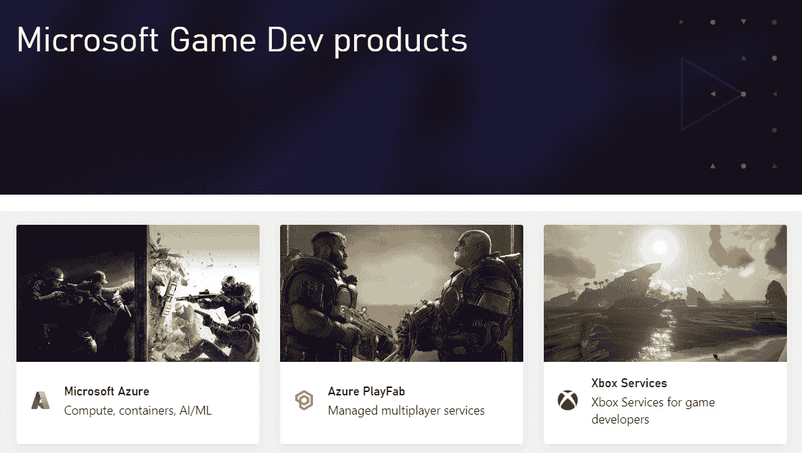

图 11.1 – Microsoft Game Dev 产品（来自 Game Dev 网站）

微软游戏开发中的这些工具和服务不仅包括 DirectX、Visual Studio、Xbox 服务、App Center 和 Havok，这些都是游戏开发者完成游戏开发和内容创作时常用的，还包括基于云的服务，如微软 Azure 云和 Azure PlayFab，所有这些共同构成了一个强大的生态系统，每个游戏开发者都可以使用，如图 *图 11.1* 所示。

微软 Azure 云和 Azure PlayFab 是微软游戏开发的重要组成部分。不仅越来越多的现代游戏需要多人支持，而且单机游戏将玩家数据存储在云中的情况也越来越普遍。因此，云在游戏开发中的重要性日益增加。

在 2022 年 3 月的游戏开发者大会上，微软宣布了一个新的计划，**ID@Azure**，旨在帮助游戏开发者使用微软 Azure 云和 Azure PlayFab 服务来开发游戏。任何游戏开发者都可以申请加入该计划，无论他们是独立游戏开发者还是游戏工作室。加入该计划后，您可以获得高达 5,000 美元的 Azure 信用额度，因此您可以访问许多云服务，获得免费的 Azure PlayFab 标准计划，获得专家支持等等。

注意

如果您对 ID@Azure 计划感兴趣，您可以在 [`aka.ms/idazure`](https://aka.ms/idazure) 找到更多信息。

现在您已经了解了微软游戏开发是什么，让我们继续探讨微软 Azure 云和 Azure PlayFab 是什么。

## 微软 Azure 云

微软 Azure 是一个云计算服务平台，您可以在其中找到以下服务：

+   **云计算**服务，例如 Azure 应用服务、Azure 函数和 Azure 虚拟机

+   **数据库**服务，例如 Cosmos DB、Azure SQL 数据库和 Azure Cache for Redis

+   **存储**服务，例如 Azure 存储帐户和数据湖存储

+   **网络**服务，例如 Azure 应用网关、Azure 防火墙和 Azure 负载均衡器

+   **分析**服务，例如 Azure 数据工厂和 Azure Synapse 分析

+   **安全**服务，例如 Azure 防御者和 Azure DDoS 保护

+   **人工智能**服务，例如 Azure 认知服务和 Azure 机器人服务

在游戏行业中，游戏服务器通常部署在尽可能靠近玩家的数据中心，这不仅减少了网络延迟，还满足了一些国家和地区的数据主权要求：

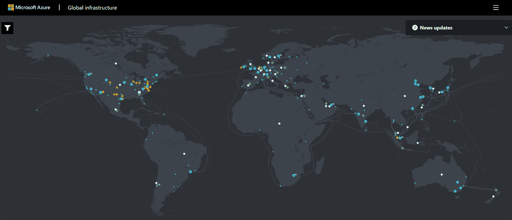

图 11.2 – 微软 Azure 全球基础设施

根据微软的数据，微软 Azure 云覆盖了全球 140 个国家和地区，可用的区域数量超过任何其他云平台。巨大的全球覆盖范围有助于游戏开发者快速为目标国家或地区部署游戏服务。

注意

您可以在[`infrastructuremap.microsoft.com/explore`](https://infrastructuremap.microsoft.com/explore)找到有关 Microsoft Azure 全球基础设施的更多信息。

除了使用 Azure 数据中心托管游戏外，游戏开发者还可以在 Microsoft Azure 云上使用 Azure 虚拟机开发游戏。2022 年 3 月在游戏开发者大会上宣布了一款新的 Azure 游戏开发虚拟机，它针对游戏开发者定制，并预装了如 Microsoft 游戏开发工具包、Visual Studio 2019 社区版和 Blender 等工具，以实现云上游戏制作。

注意

如果您对 Azure 游戏开发虚拟机感兴趣，您可以在[`aka.ms/gamedevvmdocs`](https://aka.ms/gamedevvmdocs)找到更多信息。

## Azure PlayFab

PlayFab 是构建和运营实时游戏的完整后端服务。2018 年初，微软收购了 PlayFab。现在，PlayFab 已加入 Azure 家族，并将其名称更改为 Azure PlayFab，成为 Azure 的一部分。Azure PlayFab 将 Azure 云与 PlayFab 结合；Azure 云带来可靠性、全球可访问性和企业级安全性，而 PlayFab 为游戏开发者提供完整的游戏后端服务。

作为完整的后端服务解决方案，Azure PlayFab 主要提供以下功能，供游戏开发者开发游戏：

+   游戏开发者可以使用内置的身份验证来启用玩家注册、登录，甚至跨设备跟踪玩家

+   能够创建动态扩展的多玩家服务器并在云上管理玩家数据

+   能够轻松在后台服务器上实现排行榜

    注意

    Azure PlayFab 还提供其他用于维护和运营游戏的服务，例如**Liveops**（即**实时操作**）和数据分析服务，这些服务可以用来管理游戏内容，例如在不发布新版本的情况下更新游戏，以及每日报告和分析游戏数据。它们超出了我们在这里的需求，但如果您感兴趣，您可以在[`docs.microsoft.com/en-us/gaming/playfab`](https://docs.microsoft.com/en-us/gaming/playfab)了解更多信息。

在本章的剩余部分，我们将集成 Azure PlayFab 到 Unity 项目中，以实现玩家注册、登录、数据保存、加载和排行榜。

让我们继续前进！

# 在 Unity 项目中设置 Azure PlayFab

在本例中，我们将向 Unity 中的*Flappy Bird*风格游戏添加玩家注册、登录、数据保存、加载和排行榜功能：


图 11.3 – Unity 项目

接下来，我们将首先创建一个新的 Azure PlayFab 账户，在 Azure PlayFab 中设置游戏工作室和游戏标题，然后在此 Unity 项目中设置 Azure PlayFab SDK。

## 创建新的 Azure PlayFab 账户

首先，我们需要一个新的 Azure PlayFab 账户。要创建新的 Azure Playfab 账户，让我们执行以下步骤：

1.  访问 Microsoft Azure PlayFab 的主页 [`playfab.com/`](https://playfab.com/) 并点击右上角的**注册**按钮以打开注册页面：

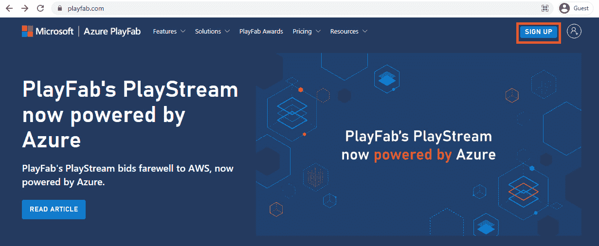

图 11.4 – Azure PlayFab 的主页

1.  在注册页面输入您的电子邮件地址和密码，然后点击**创建免费账户**按钮：

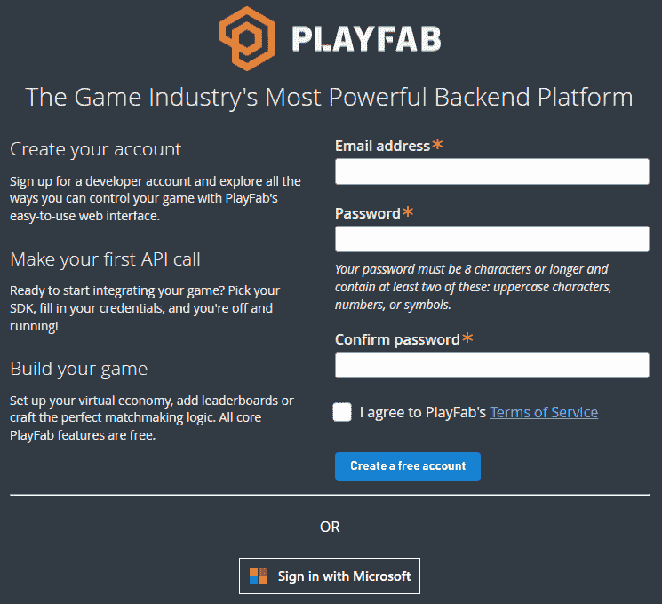

图 11.5 – 创建免费账户

1.  您将收到来自 Azure PlayFab 的验证邮件以验证您的电子邮件地址；点击**验证您的电子邮件地址**：


图 11.6 – Azure PlayFab 的电子邮件地址验证

1.  邮件地址验证完成后，您可以使用您刚刚创建的 Azure PlayFab 账户登录，您可以在 Azure PlayFab 开发者门户中看到您的游戏工作室和已设置的游戏标题，在 Azure PlayFab 中也称为**游戏管理器**：

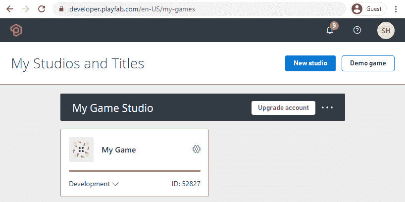

图 11.7 – Azure PlayFab 中的我的游戏工作室

现在，我们已经创建了新的 Azure PlayFab 账户，我们可以开始了解如何在 Azure PlayFab 中设置游戏工作室和游戏标题。

## 在 Azure PlayFab 中设置游戏工作室和游戏标题

在 Azure PlayFab 中创建账户后，下一个任务是设置您自己的游戏工作室和游戏标题：

1.  默认游戏工作室称为**我的游戏工作室**，这也没有什么意义，因此您可以点击右侧的**...** | **工作室设置**以打开**编辑工作室**页面：

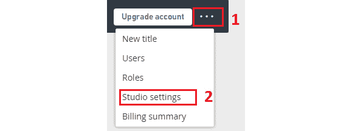

图 11.8 – 打开编辑工作室页面

1.  在 `UnityBook` 上点击**保存工作室**按钮以保存：


图 11.9 – 将工作室名称更改为 UnityBook

1.  类似地，默认游戏标题是**我的游戏**，这也没有什么意义。如图所示，您可以点击齿轮按钮，然后**编辑标题信息**以打开**编辑标题**页面：

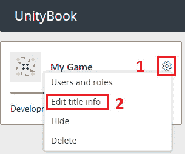

图 11.10 – 打开编辑标题页面

1.  在 `Chapter11-AzurePlayfabAndUnity` 上点击**保存标题**以保存：

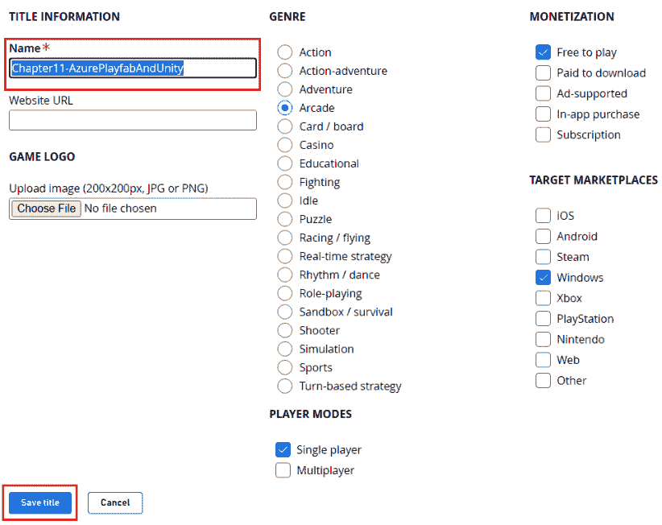

图 11.11 – 更改标题名称

现在，我们已经设置了 Azure PlayFab 中的游戏工作室和游戏标题，让我们将注意力转向在 Unity 项目中设置 Azure PlayFab SDK！

## 在 Unity 项目中设置 Azure PlayFab SDK

为了从 Unity 访问 Azure PlayFab 中的 API，我们首先需要将 Azure PlayFab SDK 导入到 Unity 项目中：

1.  您可以在 [`docs.microsoft.com/en-us/gaming/playfab/sdks/unity3d/`](https://docs.microsoft.com/en-us/gaming/playfab/sdks/unity3d/) 找到 Azure PlayFab SDK。在这里，您还可以找到 Unity PlayFab SDK GitHub 仓库的链接，如图 *Figure 11.12* 所示：

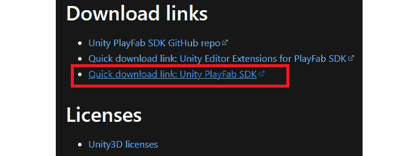

Figure 11.12 – Azure PlayFab SDK 下载链接

1.  将您刚刚下载的 `UnitySDK` 包拖放到 Unity 编辑器中。将弹出的 **导入 Unity 包** 窗口，在这里您可以预览包的内容，然后点击 **导入** 按钮将其导入到这个 Unity 项目中：


Figure 11.13 – 导入 Azure PlayFab SDK

1.  SDK 导入后，您将在 Unity 编辑器工具栏中找到 PlayFab 菜单。然后，您可以点击 **PlayFab** > **MakePlayFabSharedSettings** 以打开 **PlayFabSharedSettings** 窗口，在那里您需要配置设置以将此 Unity 项目连接到 Azure PlayFab 中的游戏标题：


Figure 11.14 – PlayFab SDK 已导入

1.  在 **Play Fab 共享设置** 窗口中，您应提供游戏标题的标题 ID 和开发者密钥，如图 *Figure 11.15* 所示：

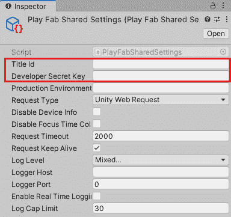

Figure 11.15 – Play Fab 共享设置窗口

1.  为了找到游戏标题 ID 和开发者密钥，您需要返回 Azure PlayFab 的开发者门户，在那里您可以在游戏标题项中找到游戏标题 ID：


Figure 11.16 – 游戏标题 ID

1.  开发者密钥与 Azure PlayFab 中的游戏标题紧密相关，因此您需要在开发者门户上首先点击标题项以打开游戏标题的概述页面。如图所示，您需要点击齿轮按钮，然后点击 **标题设置** 以打开游戏标题的设置页面：

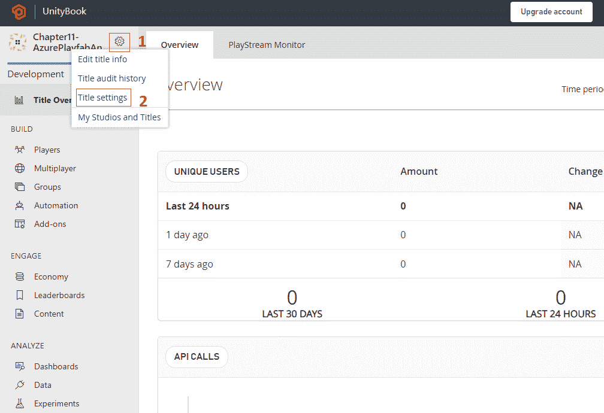

Figure 11.17 – 游戏标题概述页面

1.  在游戏标题的设置页面中，选择 **密钥** 选项卡以切换到密钥设置，在那里您可以找到默认的开发者密钥：

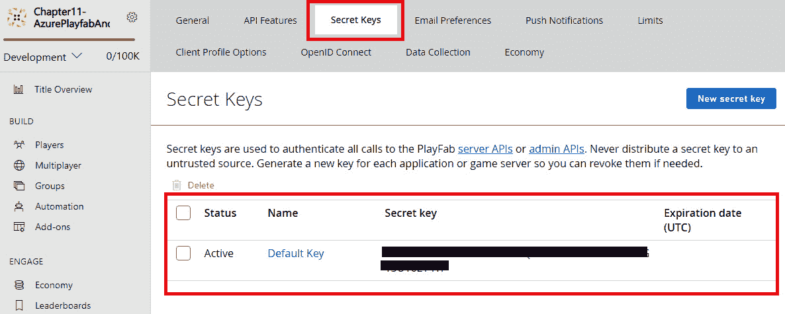

Figure 11.18 – 密钥页面

1.  返回 Unity 中的 **游戏标题共享设置** 窗口，并使用您刚刚从 Azure PlayFab 开发者门户获取的标题 ID 和开发者密钥设置标题 ID 和开发者密钥。

现在我们已经为这个 Unity 项目设置了 Azure PlayFab SDK，你应该已经了解了 Azure PlayFab，包括 Azure PlayFab 开发者门户（也称为游戏管理器），如何设置游戏工作室和游戏标题，以及如何将 Azure PlayFab 的 SDK 导入 Unity 项目并将 Azure PlayFab 中的游戏标题连接到项目。接下来，让我们继续探讨如何通过 Azure PlayFab 注册和登录玩家。

# 使用 Azure PlayFab 在 Unity 中注册和登录玩家

在*技术要求*部分提到的演示项目中，你可以在**AzurePlayFabIntegration 文件夹** | **StartScene**中找到注册和登录 UI 面板，我们将使用它来实现注册和登录功能：

![图 11.19 – UI 面板上的注册标签页（左）和登录标签页（右）]

](img/Figure_11.19_B17146.jpg)

图 11.19 – UI 面板上的注册标签页（左）和登录标签页（右）

如*图 11.19*所示，像许多常见的注册和登录页面一样，我们示例中的注册和登录 UI 面板也有两个标签页，即注册标签页和登录标签页，可以通过点击面板上的红色提醒文本进行切换。注册标签页要求玩家提供用户名、电子邮件和密码以在 Azure PlayFab 中创建新的玩家账户，而登录标签页仅要求玩家提供电子邮件和密码进行登录。

## 在 Azure PlayFab 中注册玩家

接下来，让我们首先看看如何实现注册功能：

1.  在`AzurePlayFabIntegration`文件夹中创建一个新的文件夹并命名为`Scripts`：


图 11.20 – 创建一个 Scripts 文件夹

1.  在`Scripts`文件夹中创建一个新的 C#脚本，命名为`AzurePlayFabAccountManager`，并添加以下代码：

    ```cs
    using System.Text;
    using System.Security.Cryptography;
    using UnityEngine;
    using UnityEngine.UI;
    using PlayFab;
    using PlayFab.ClientModels;
    public class AzurePlayFabAccountManager :
      MonoBehaviour
    {
        [SerializeField]
        private InputField _userName, _email, _password;
        [SerializeField]
        private Text _message;
        public void OnSignUpButtonClick()
        {
            var userRequest = new
              RegisterPlayFabUserRequest
            {
                Username = _userName.text,
                Email = _email.text,
                Password = Encrypt(_password.text)
            };
            PlayFabClientAPI.RegisterPlayFabUser(userRequest,
              OnRegisterSuccess, OnError);
        }
      public void
       OnRegisterSuccess(RegisterPlayFabUserResult result)
        {
            _message.text = "created a new account!";
            var displayNameRequest = new
              UpdateUserTitleDisplayNameRequest
            {
                DisplayName = result.Username
            };
               PlayFabClientAPI.
                 UpdateUserTitleDisplayName(display
                 NameRequest, OnUpdateDisplayNameSuccess, 
                 OnError);
        }
        public void OnError(PlayFabError error)
        {
            _message.text = error.ErrorMessage;
        }
        private static string Encrypt(string input)
        {
            var md5 = new MD5CryptoServiceProvider();
            var bytes = Encoding.UTF8.GetBytes(input);
            bytes = md5.ComputeHash(bytes);
            return Encoding.UTF8.GetString(bytes);
        }
    }
    ```

这是一个相当长的脚本；让我们如下分解代码：

+   我们使用`using`关键字添加`System.Security.Cryptography`和`System.Text`命名空间，以便在`Encrypt`方法中加密密码。

+   我们使用`using`关键字添加`PlayFab`和`PlayFab.ClientModels`命名空间，以便访问 Azure PlayFab 提供的 API。

+   在`fields`部分，我们引用了三个`InputField` UI 元素来提供用户名、电子邮件地址和密码。同时，我们还获取了`Text` UI 元素的引用来显示来自 Azure PlayFab 的消息。

+   我们创建一个`RegisterPlayFabUserRequest`的新实例，并调用`PlayFabClientAPI.RegisterPlayFabUser`来在 Azure PlayFab 中注册此用户。

+   我们还有两个回调函数 —— `OnRegisterSuccess`，当接收到结果时会被调用，以及`OnError`，当发生错误时会被调用。

+   在 `OnRegisterSuccess` 中，我们创建了一个新的 `UpdateUserTitleDisplayNameRequest` 实例，并调用 `PlayFabClientAPI.UpdateUserTitleDisplayName` 来更新用户在注册时的用户名作为显示名；否则，用户的显示名默认为空字符串。此外，您还可以使用此方法允许用户在未来更改账户的显示名。

1.  将 `AzurePlayFabAccountManager.cs` 拖放到场景中的 **SignupAndLogin** GameObject 上，并将 UI 元素分配到相应的字段，如图 *图 11.21* 所示：


图 11.21 – 设置 AzurePlayFabAccountManager

1.  选择附加了 `AzurePlayFabAccountManager` 的对象，最后，选择在按钮点击时将在 `AzurePlayFabAccountManager` 类中调用的方法，如图 *图 11.22* 所示：


图 11.22 – 设置注册按钮

1.  运行游戏，并在向 Azure PlayFab 发送的 `register user` 请求中输入用户名、电子邮件地址和密码。如图所示，创建了一个新账户：

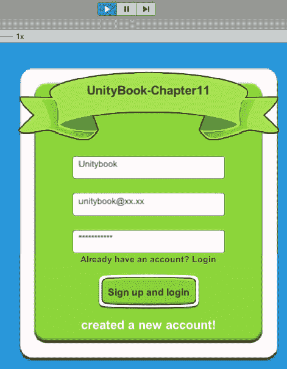

图 11.23 – 创建了一个新账户

1.  让我们回到 Azure PlayFab 中游戏标题的仪表板。在仪表板中，您可以看到有一个新的 API 调用和一个新用户已被创建。然后，我们也可以点击 **Players** 按钮打开 **Players** 页面以获取更多信息：

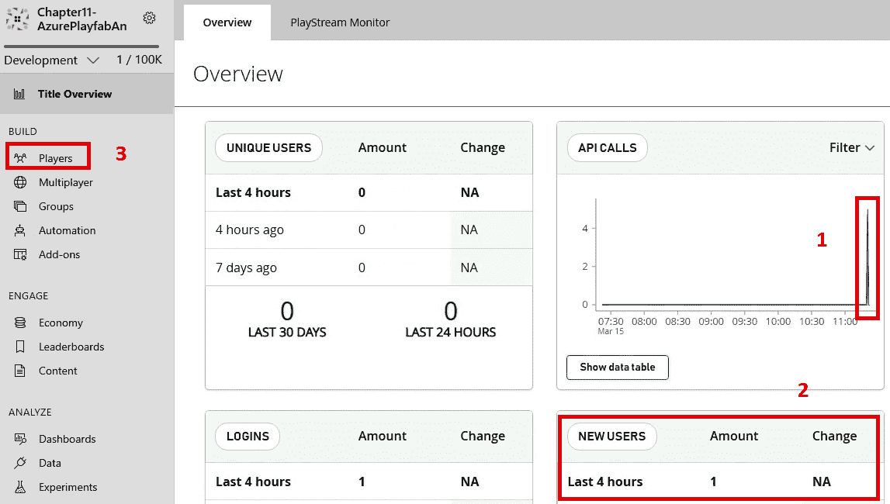

图 11.24 – 游戏标题仪表板

1.  查看**玩家**页面上的玩家列表；您可以看到我们刚刚创建的新账户。还有一些关于账户的信息，例如最后登录时间、账户创建时间以及玩家登录的国家：


图 11.25 – 玩家页面

现在我们已经实现了注册功能，是时候为已有账户的玩家实现登录功能了。

## 在 Azure PlayFab 中登录玩家

通过以下步骤，我们将要求玩家提供电子邮件和密码进行登录，如果登录成功，他们将跳转到我们的 *Flappy Bird*-风格游戏场景：

1.  返回到 `AzurePlayFabAccountManager` 脚本，并添加以下代码：

    ```cs
    // ... pre-existing code ...
    using UnityEngine.SceneManagement;
    //... pre-existing code ...
        public void OnLoginButtonClick()
        {
            var userRequest = new
              LoginWithEmailAddressRequest
            {
                Email = _email.text,
                Password = Encrypt(_password.text)
            };
            PlayFabClientAPI.
              LoginWithEmailAddress(userRequest,
      OnLoginSuccess, OnError);
        }
        public void OnLoginSuccess(LoginResult result)
        {
            _message.text = "login successful!";
            StartGame();
        }
        private static void StartGame()
        {
            SceneManager.LoadScene(1);
        }
    ```

让我们按以下方式分解新添加的代码：

+   首先，使用 `using` 关键字添加了 `UnityEngine.SceneManagement` 命名空间。这是因为如果玩家成功登录，我们需要将场景从登录场景切换到游戏场景，而与场景加载相关的逻辑定义在这个命名空间中。

+   我们创建了一个新的 `LoginWithEmailAddressRequest` 实例，并调用 `PlayFabClientAPI.LoginWithEmailAddress` 来将玩家登录到 Azure PlayFab。

+   除了使用电子邮件登录外，Azure PlayFab 还提供多种登录方式，例如通过调用 `PlayFabClientAPI.LoginWithFacebook` 使用 Facebook 访问令牌登录，以及调用 `PlayFabClientAPI.LoginWithGameCenter` 使用 iOS Game Center 玩家标识符登录。

+   当玩家成功登录时，将调用 `SceneManager.LoadScene` 方法。`SceneManager.LoadScene` 方法接受一个 `int` 参数，即目标场景的索引。

+   本例中有两个场景 – 第一个是 `StartScene`，索引为 `0`，允许玩家在此处注册或登录；第二个是 `GameScene`，索引为 `1`，允许玩家玩游戏，因此我们使用索引 `1` 从 `StartScene` 切换到 `GameScene`。

1.  选择 `AzurePlayFabAccountManager` 所附加的对象，最后选择在 `OnLoginButtonClick` 方法中调用的 `AzurePlayFabAccountManager` 类中定义的方法，如图 *图 11.26* 所示：

![img/Figure_11.26_B17146.jpg]

图 11.26 – 设置登录按钮

1.  运行游戏，切换到登录选项卡，输入电子邮件地址和密码，然后点击 **登录** 按钮向 Azure PlayFab 发送登录用户请求，如下图所示：

![Figure 11.27 – The login tab

![img/Figure_11.27_B17146.jpg]

图 11.27 – 登录选项卡

1.  然后，如果玩家成功登录，游戏场景将被加载，游戏将开始，如下图所示：

![Figure 11.28 – 游戏进行中

![img/Figure_11.28_B17146.jpg]

图 11.28 – 游戏进行中

在本节中，你学习了如何使用 Azure PlayFab API 注册用户，如何通过 Azure PlayFab API 更新 Azure PlayFab 中的用户显示名称，以及如何使用它从 Unity 游戏中登录 Azure PlayFab。接下来，我们将探讨如何在 Unity 游戏中使用 Azure PlayFab 实现排行榜。

# 在 Unity 中使用 Azure PlayFab 实现排行榜

今天的大多数游戏都使用排行榜，这表明谁是游戏中的最佳表现者，并增加了玩家对游戏的参与度。在本节中，我们将探讨如何在我们的 Unity 项目中使用 Azure PlayFab 实现排行榜。

## 在 Azure PlayFab 中设置排行榜

为了使用 Azure PlayFab 的排行榜功能，我们首先需要在 Azure PlayFab 的开发者门户中设置一个排行榜：

1.  返回 Azure PlayFab 中游戏标题的仪表板。在仪表板中，你将在左侧列中找到 **排行榜** 选项；点击它以打开 **排行榜** 页面：

![Figure 11.29 – The Leaderboards option

![img/Figure_11.29_B17146.jpg]

图 11.29 – 排行榜选项

1.  如下图所示，尚未创建排行榜，因此请点击 **新建排行榜** 按钮在 Azure PlayFab 中创建一个新的排行榜：

![Figure 11.30 – Creating a new leaderboard

![img/Figure_11.30_B17146.jpg]

图 11.30 – 创建新的排行榜

1.  在 **新排行榜** 设置面板中，我们将为此排行榜设置三个属性，即 **统计名称**、**重置频率** 和 **聚合方法**，如图 *11.31* 所示：

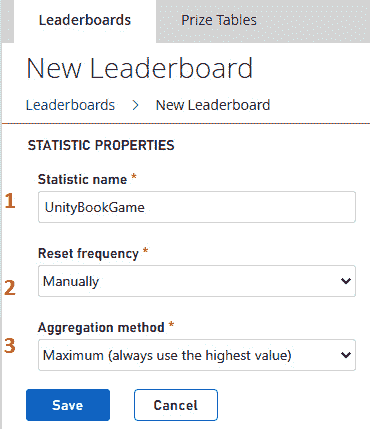

图 11.31 – 设置新的排行榜

让我们逐一解释这三个属性：

+   `UnityBookGame` 在此示例中。

+   **重置频率** 决定了排行榜应该多久重置一次。有五个选项：

    +   **手动**：这是默认值，我们保留重置频率设置为这个值，以便排行榜不会自动重置。

    +   **每小时**：每小时自动重置排行榜。

    +   **每日**：每天自动重置排行榜。

    +   **每周**：每周自动重置排行榜。

    +   **每月**：每月自动重置排行榜。

+   **聚合方法** 决定了玩家分数的保存方式。有四个选项：

    +   **最后**：这是默认选项；无论新值是否高于现有值，都会更新为新的值。

    +   **最小值**：始终使用最低值。

    +   **最大值**：始终使用最高值。我们选择此选项以保存游戏中玩家的最高分数。

    +   **总和**：将此值添加到现有值。

1.  点击 **新排行榜** 设置面板中的 **保存** 按钮；然后，我们在 Azure PlayFab 中设置了一个空排行榜：

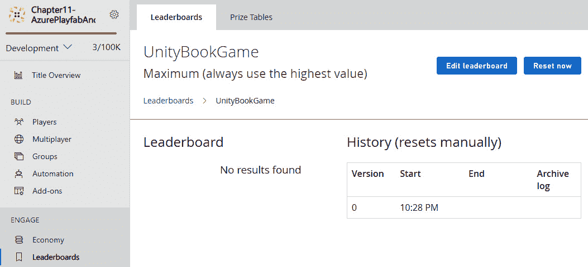

图 11.32 – 一个新的空排行榜

1.  为了允许 Unity 游戏向 Azure PlayFab 发布玩家统计信息请求，我们还需要在 Azure PlayFab 中启用 **允许客户端发布玩家统计信息** 选项。因此，首先点击左上角的齿轮图标，然后选择 **标题设置** 选项以打开游戏标题的设置页面，如图所示：

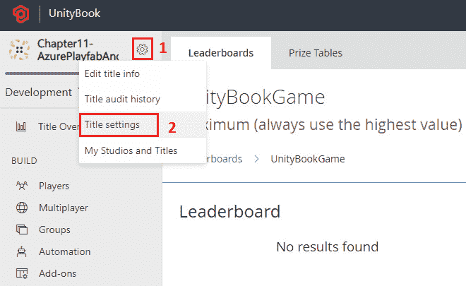

图 11.33 – 打开标题设置页面

1.  在设置页面，点击 **API 功能** 选项卡以切换到 **API 功能** 设置：


图 11.34 – API 功能设置

1.  滚动到 **启用 API 功能** 部分，启用 **允许客户端发布玩家统计信息** 选项，并保存，如图 *11.35* 所示：


图 11.35 – 启用允许客户端发布玩家统计信息选项

现在我们已经在 Azure PlayFab 中创建并设置了排行榜，让我们继续探索如何使用 Azure PlayFab API 从 Unity 更新玩家的分数。

## 使用 Azure PlayFab API 从 Unity 更新玩家的分数

当玩家完成游戏并且分数高于之前时，我们希望更新 Azure PlayFab 中的排行榜上的玩家分数。让我们执行以下步骤来实现它：

1.  在 `Scripts` 文件夹中创建一个新的 C# 脚本，命名为 `AzurePlayFabLeaderboardManager`，并添加以下代码：

    ```cs
    using System.Collections.Generic;
    using UnityEngine;
    using PlayFab;
    using PlayFab.ClientModels;
    public class AzurePlayFabLeaderboardManager :
      MonoBehaviour
    {
        public void UpdateLeaderboardInAzurePlayFab(int
           score)
        {
            var scoreUpdate = new StatisticUpdate
            {
                StatisticName = "UnityBookGame",
                Value = score
            };
            var scoreUpdateList = new
              List<StatisticUpdate> { scoreUpdate };
            var scoreRequest = new
              UpdatePlayerStatisticsRequest
            {
                Statistics = scoreUpdateList
            };
            PlayFabClientAPI.UpdatePlayerStatistics
              (scoreRequest, OnUpdateSuccess, OnError);
        }
        public void OnUpdateSuccess
          (UpdatePlayerStatisticsResult result) 
        {
            Debug.Log("Update Success!");
        }
        public void OnError(PlayFabError error) 
        {
            Debug.LogError(error.ErrorMessage);
        }
    }
    ```

让我们按以下方式分解代码：

+   在 `UpdateLeaderboardInAzurePlayFab` 方法中，我们创建了一个新的 `StatisticUpdate` 类实例，它封装了需要更新排行榜的数据。在这里，我们提供了排行榜的名称和玩家的分数。

+   然后，我们创建了一个 `StatisticUpdate` 列表并添加了我们刚刚创建的 `StatisticUpdate` 实例到它里面。

+   之后，我们创建了一个新的 `UpdatePlayerStatisticsRequest` 类实例，它封装了我们用来更新排行榜的 `StatisticUpdate` 列表，并调用 `PlayFabClientAPI.UpdatePlayerStatistics` 来更新 Azure PlayFab 中的排行榜。

+   我们还有两个回调函数 – `OnUpdateSuccess`，当接收到结果时被调用，以及 `OnError`，当发生错误时被调用。

1.  然后，我们需要确保当游戏结束时将调用 `UpdateLeaderboardInAzurePlayFab` 方法。因此，让我们打开 **BasicGame** | **Scenes** 文件夹中的示例项目的 **Game** 场景，如图 *图 11.36* 所示：


图 11.36 – 示例游戏场景

1.  在 `AzurePlayFabManager` 中创建一个新的 GameObject，然后将 `AzurePlayFabLeaderboardManager.cs` 拖放到它上面，如图 *图 11.37* 所示：


图 11.37 – 设置 GameObject

1.  接下来，我们需要修改示例项目中现有的 C# 脚本。您可以在 **BasicGame** > **Scripts** 文件夹中找到 `ExampleGameManager.cs` 文件；双击它以打开它，如图 *图 11.38* 所示：


图 11.38 – ExampleGameManager.cs 文件

1.  将以下代码添加到 `ExampleGameManager` 类中：

    ```cs
    // ... pre-existing code ...
      [SerializeField]
      private AzurePlayFabLeaderboardManager 
        _azurePlayFabLeaderboardManager;
    // ... pre-existing code ...
      public void GameOver()
        {
        _azurePlayFabLeaderboardManager.
          UpdateLeaderboardInAzurePlayFab(score);
        }
    ```

让我们按以下方式分解添加的代码：

+   首先，我们添加一个新的字段来获取 `AzurePlayFabLeaderboardManager` 实例的引用。

+   然后，我们在 `GameOver` 中调用 `UpdateLeaderboardInAzurePlayFab` 方法来更新排行榜。

1.  请记住将 `AzurePlayFabLeaderboardManager` 实例的引用分配到我们刚刚添加的字段：

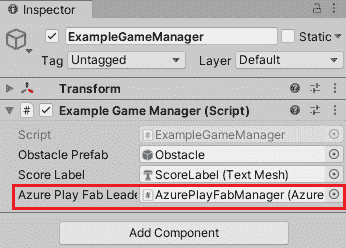

图 11.39 – 分配引用到字段

1.  让我们回到 **Start** 场景并在编辑器中运行游戏，使用我们在上一节中创建的玩家账户登录并玩游戏。在下面的屏幕截图中，我们在游戏结束时获得了 **4** 分：

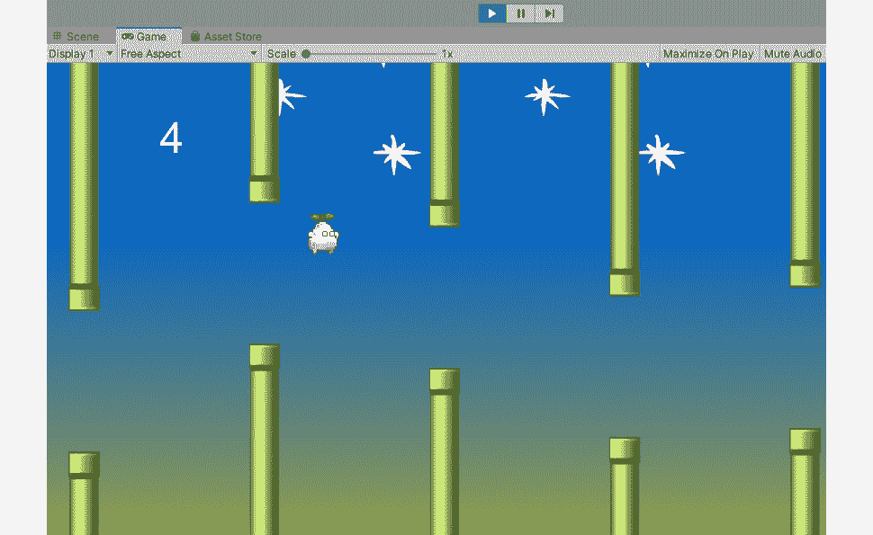

图 11.40 – 游戏中有 4 分

1.  同时，转到 Azure PlayFab 的 **Leaderboard** 仪表板，您可以看到玩家的最高分数是 **4** 分，并且排名第一：


图 11.41 – Azure PlayFab 中的排行榜

我们已经调用了 API 来更新 Azure PlayFab 中 Unity 排行榜上玩家的分数。我们的下一个挑战将是从中加载排行榜数据。

## 在 Unity 中从 Azure PlayFab 加载排行榜数据

在示例项目中，你还可以在**BasicGame** | **Scenes** | **GameScene**中找到排行榜面板，我们将使用它来显示从 Azure PlayFab 加载的前 10 名玩家。默认情况下，此 UI 面板未激活，因此现在在**Game**视图中看不到它：

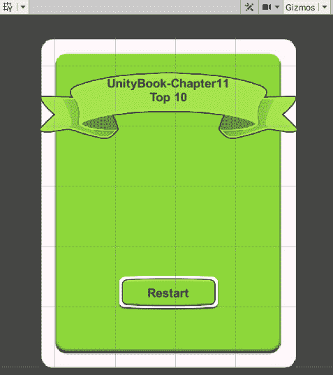

图 11.42 – 排行榜面板

在我们开始探索如何从 Azure PlayFab 加载排行榜信息之前，让我们注册更多玩家并向**UnityBookGame**排行榜添加更多项目，如下面的图所示：

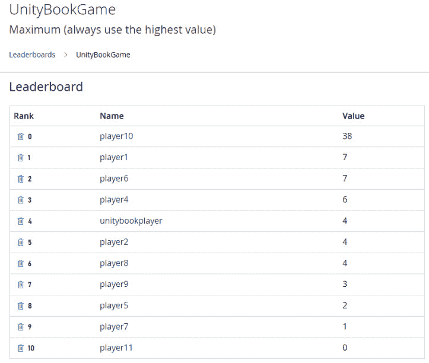

图 11.43 – UnityBookGame 排行榜

然后，我们的第一个任务是调用 Unity 中的 Azure PlayFab API 以获取排行榜数据。为此，请按照以下步骤操作：

1.  返回到`AzurePlayFabLeaderboardManager`脚本，并添加以下代码：

    ```cs
     // ... pre-existing code ...
        public void LoadLeaderboardDataFromAzurePlayFab()
        {
            var loadRequest = new GetLeaderboardRequest
            {
                StatisticName = "UnityBookGame",
                StartPosition = 0,
                MaxResultsCount = 10
            };
            PlayFabClientAPI.GetLeaderboard(loadRequest,
              OnLoadSuccess, OnError);
        }
    // ... pre-existing code ...
        public void OnLoadSuccess(GetLeaderboardResult
          result)
        {
            Debug.Log("Load Success!");
        }
    ```

让我们分解添加的代码，如下：

+   我们创建了一个新方法，并将其命名为`LoadLeaderboardDataFromAzurePlayFab`。

+   在`LoadLeaderboardDataFromAzurePlayFab`方法中，我们创建了一个新的`GetLeaderboardRequest`实例，并调用`PlayFabClientAPI.GetLeaderboard`来从`UnityBookGame`排行榜中检索最多`10`条记录，起始索引为`0`。

+   我们还添加了一个新的回调`OnLoadSuccess`，当收到结果时在控制台窗口中打印"`Load Success!`"。

1.  然后，返回到`ExampleGameManager.cs`并更新以下代码：

    ```cs
    public void GameOver()
    {
      _azurePlayFabLeaderboardManager.
        UpdateLeaderboardInAzurePlayFab(score);
      _azurePlayFabLeaderboardManager.
        LoadLeaderboardDataFromAzurePlayFab();
     }
    ```

新添加的代码将在游戏结束后从 Azure PlayFab 获取排行榜信息。

1.  游戏结束后，运行游戏并查看控制台窗口；我们成功从 Azure PlayFab 加载了排行榜数据，如下面的截图所示：


图 11.44 – 加载成功！

现在我们已经从 Azure PlayFab 收到了成功的结果，我们的下一个任务是将在 Unity 项目中排行榜 UI 面板中显示这些数据：

1.  再次返回到`AzurePlayFabLeaderboardManager`脚本并更新以下代码：

    ```cs
    // ... pre-existing code ...
        [SerializeField]
        private GameObject _leaderboardUIPanel;
        [SerializeField]
        private List<Text> _itemsText;
    // ... pre-existing code ...
        public void OnLoadSuccess(GetLeaderboardResult
          result)
        {
            _leaderboardUIPanel.SetActive(true);
            CreateRankingItemsInUnity(result.Leaderboard);
        }
        private void CreateRankingItemsInUnity
          (List<PlayerLeaderboardEntry> items)
        {
            foreach(var item in items)
            {
                var itemText = _itemsText[item.Position];
                itemText.text = $"{item.Position + 1}:
                {item.Profile.DisplayName} –
                  {item.StatValue}";
            }
        }
    ```

让我们分解新添加的代码，如下：

+   在`fields`部分，我们引用场景中的`Leaderboard`GameObject；这是因为排行榜面板默认未激活，我们希望在游戏结束时激活它以显示从 Azure PlayFab 加载的排行榜信息。此外，我们获取用于显示排行榜上每个项目的`Text`UI 元素列表的引用。

+   在`OnLoadSuccess`中，我们激活场景中的`Leaderboard`GameObject，并从 Azure PlayFab 接收排行榜信息。然后，调用`CreateRankingItemsInUnity`方法，该方法以`List<PlayerLeaderboardEntry>`作为参数。

+   在`CreateRankingItemsInUnity`中，我们更新了`Text` UI 元素，以显示有关每个项目的信息，包括玩家的排名、显示名称和得分。

1.  不要忘记将这些 UI 元素相应地分配到**游戏**场景中**AzurePlayFabManager** GameObject 的新增字段中，如图*图 11.45*所示：

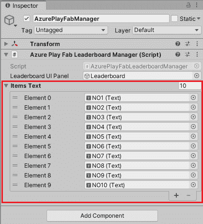

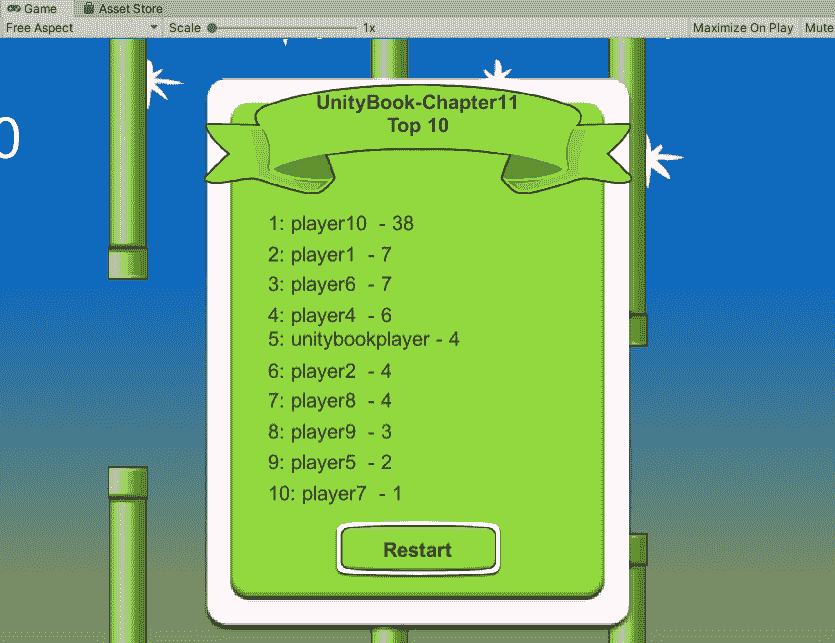

![图 11.46 – Unity 中的排行榜

通过阅读本节，你应该现在知道如何在 Azure PlayFab 中设置排行榜，如何使用 Azure PlayFab API 从 Unity 游戏中更新排行榜数据，以及如何使用 Azure PlayFab API 从 Azure PlayFab 获取排行榜数据并在 Unity 中显示。

# 摘要

本章是本书的最后一章，也是我们漫长冒险的最终阶段。在这个过程中，你学习了如何使用 Unity 游戏引擎开发游戏的各种不同主题，这可能包括你熟悉的领域，例如如何在 Unity 中使用 MVVM 架构模式实现 UI，或者可能包含你之前从未接触过的内容，例如渲染管线和相关数学知识。我希望你喜欢这段旅程，并准备好迎接新的挑战。

除了 Unity 引擎本身之外，本章还重点介绍了 Microsoft Game Dev、Microsoft Azure 云和 Azure PlayFab。我们讨论了它们是什么，以及为什么我们应该考虑在游戏开发中使用它们。然后，我们通过一个示例项目演示了如何创建新的 Azure PlayFab 开发者账户，在 Unity 项目中设置 Azure PlayFab SDK，并通过 Azure PlayFab API 在 Unity 中实现注册、登录和排行榜功能。

通过阅读本章和本书，我希望你现在明白，游戏开发所需的知识不仅仅局限于如何使用游戏引擎；它还涉及编程、计算机图形学，甚至云服务方面的知识。

虽然本章是本书的结束，但这本书只是你游戏开发者旅程的开始。继续学习，不断成长！
