# 第三章。桥梁

在第二章中，我们介绍了集成和转换的基本方面，即*消息和转换*。但转换只是 BizTalk 服务中桥梁提供的能力之一。在本章中，我们将更深入地探讨桥梁和以下功能：

+   管道阶段

+   验证、丰富和格式化消息

+   查找数据

+   消息路由和过滤器

+   BizTalk 服务资源管理器

**桥梁**实际上是一个**Windows Workflow Foundation**（**WF4**）的幕后操作。虽然您不能创建自己的桥梁定义，但提供了三个模板供您使用：

| 类型 | 描述 |
| --- | --- |
| **XML 单向** | 调用者发送基于 XML 的消息到桥梁，并期望没有响应 |
| **XML 请求-响应** | 调用者发送基于 XML 的消息并等待响应消息 |
| **透传** | 调用者以任何格式（XML 或非 XML）的单向模式发送消息 |

这些模板提供了一些标准处理步骤，您可以使用它们在处理消息时对其产生影响或采取行动。这些步骤形成了一个处理管道，每个步骤依次跟随前一个步骤。每个步骤也会根据前一个步骤的消息状态及其上下文进行操作。您还有机会在本章稍后看到，添加自己的自定义管道处理。

值得记住的是，桥梁本质上是无状态的——在桥梁处理过程中没有持久化存储的内容。如果桥梁在处理过程中失败，消息可能会丢失，因此必须小心避免这种情况。我们将在本书的第七章跟踪和故障排除中更详细地讨论这个问题。

# 管道处理

在桥梁的管道中，有以下步骤：

| 阶段 | 方向 | 目的 |
| --- | --- | --- |
| 消息类型 | 接收 | 将架构与传入的消息匹配 |
| 解码 | 接收 | 根据架构将传入的消息转换为 XML |
| 验证 | 接收 | 根据架构确定消息是否有效 |
| 丰富 | 接收 | 从消息或上下文内容创建属性 |
| 转换 | 接收/发送 | 将消息映射到另一个消息架构格式 |
| 丰富 | 发送 | 从消息或上下文内容创建属性 |
| 编码 | 发送 | 将消息准备好进行传输 |

当然，对于双向和透传桥梁，事情会有所不同，正如您所期望的那样。对于双向桥梁，没有解码和解码阶段，透传桥梁只有一个阶段，即丰富。

# 消息处理

由于 BizTalk 服务在云中托管并公开默认 HTTP 端点给您发布的桥梁，这意味着您可以通过将消息简单发布到端点来提交消息，并且在使用请求/响应桥梁的情况下，接收响应。

当然，BizTalk 服务还提供了许多其他消息来源和目的地，例如 FTP、服务总线队列和主题，以及在第四章企业应用集成中详细说明的业务系统，如 SAP。完整的列表如下表所示：

| 传输 | 来源 | 目的地 | 描述 |
| --- | --- | --- | --- |
| FTP | 是 | 是 | 支持文件传输协议 |
| SFTP | 是 | 是 | 安全文件传输协议 |
| 服务总线队列 | 是 | 是 | 接收和发送队列中的消息 |
| 服务总线主题 | 是 | 是 | 接收和发送主题中的消息 |
| HTTP(S) | 是 | 是 | 默认情况下，在您创建服务的命名空间上，网关以 HTTPS 端点形式暴露。BizTalk 服务还支持 HTTP 作为目的地，允许调用 Web 服务。 |
| Azure Blob 存储 | 否 | 是 | 向 Azure Blob 存储发送消息 |

| 中继 | 否 | 是 | 服务总线中继与 BizTalk 适配器服务一起使用，以连接以下业务系统： |

+   SQL Server

+   Oracle DB

+   Oracle eBusiness Suite

+   mySAP

+   Siebel

这在第四章*企业应用集成*中详细说明。 |

# 消息传递

使用 XML 网桥，有两个阶段用于识别接收到的消息并确定如何处理那些意外的消息。为了知道什么是不预期的，网桥的消息类型部分允许指定消息模式。可以在**消息类型选择器**对话框中配置任意数量的模式，如图所示：

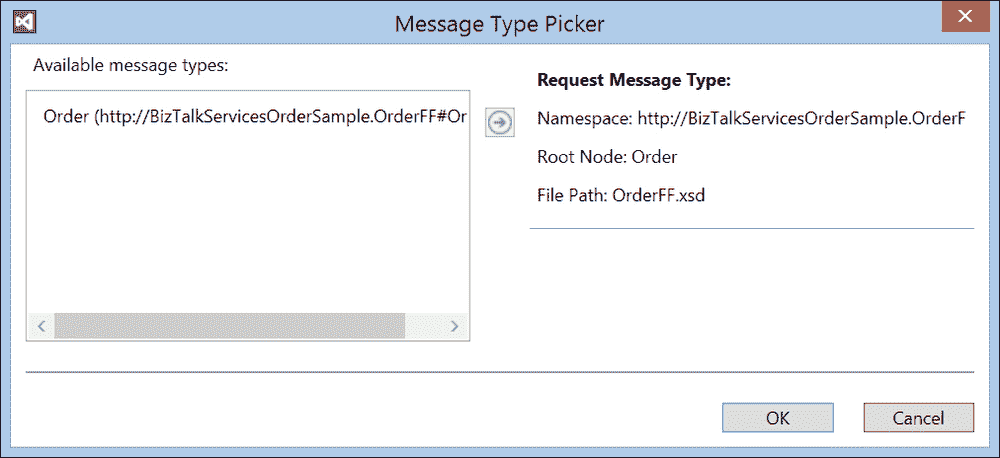

消息类型

XML 网桥的第一个阶段是解码。这仅适用于平面文件，即未作为 XML 接收且指定了平面文件模式的消息（有关平面文件模式的更多信息，请参阅第四章*企业应用集成*）。虽然使用 XML 网桥处理平面文件听起来很奇怪，但网桥的目的是将消息标准化为 XML 格式，因为这允许处理有用功能（如转换和增强）的统一性。这样，任何格式的数据，例如 JSON，都可以接收和处理。在解码阶段没有要配置的内容；相反，它从提供的消息类型中获取配置，并将匹配的平面文件模式应用于创建文件的 XML 表示形式。匹配基于在**消息类型选择器**对话框中选择的模式，如图所示。只能选择一个消息类型。

在解码阶段之后，消息将根据提供的架构进行验证。这里唯一可配置的属性是布尔设置**将警告报告为错误**。默认为`false`，这意味着未识别或无效的消息仍然会通过桥接的其余部分进行处理。将此属性设置为`true`将在桥接中引发错误，并且消息将不会处理。调用者（如果调用者使用 HTTP）将收到**HTTP 500**状态代码响应。这种通用的“服务器错误”响应通常与详细说明问题的响应一起返回，并提供一个可用于诊断原因的跟踪 ID。故障诊断和故障排除在第七章*跟踪和故障排除*中详细说明。如果配置的源是 FTP，则文件将留在 FTP 服务器上，桥接将在等待一段时间（这超过了重试次数）后重试最多三次。此行为目前在 WABS 中不可配置。

# 丰富

在桥接的以下两个点上发生丰富：在转换之前和之后。丰富阶段提供了将消息属性写入的机会，这些属性可以在任一转换（在第一个丰富阶段）或路由（转换后）中使用。消息属性仅仅是与消息本身一起移动的名称/值对，可以在丰富阶段创建。

在写入消息属性时，有多个数据源可用，以下表列出了这些数据源：

| 源类型 | 目的 |
| --- | --- |
| Soap | 访问消息的 SOAP 属性，例如 Action |
| Http | 访问调用者发送的 HTTP 头 |
| 查找 | 在 Windows Azure SQL 数据库中查找值 |
| Xpath | 在消息中使用 XPath 表达式查找值 |
| Ftp | 如果源是 FTP，则访问 FTP 属性，例如文件名 |
| Sftp | 如果源是 SFTP，则访问 SFTP 属性 |
| 系统 | 提供访问系统属性，例如接收消息的日期/时间 |
| 中介 | 如果源或目的地基于队列/主题，则访问服务总线属性 |

使用消息属性允许桥接处理以两种主要方式受到影响和控制：

+   **通过转换**：从调用者接收的消息可以转换为最终接收者所需的不同格式。可以访问消息属性。

+   **通过路由**：我们将在稍后详细讨论这一点。消息属性可以用来将消息定向到特定的目的地。

让我们看看几个例子。在下面的图中，我们有一个配置了两个目标服务总线队列的网关，**欧洲**和**美洲**。假设我们想要创建一个属性，它包含来自消息的包含国家名称的字段值。路由网关模式如图所示：

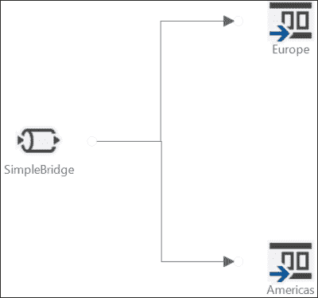

路由网关模式

进入的消息看起来如下所示：

```cs
<ns0:Order >
  <OrderId>123</OrderId>
  <PaymentType>ACCOUNT</PaymentType>
  <OrderDate>2/9/2013</OrderDate>
  <Products>
    <Product>
      <Code>AB12</Code>
      <Qty>4</Qty>
      <Price>1.50</Price>
    </Product>
    <Product>
      <Code>AC01</Code>
      <Qty>2</Qty>
      <Price>3.99</Price>
    </Product>
    <Product>
      <Code>DE4</Code>
      <Qty>10</Qty>
      <Price>12.25</Price>
    </Product>
  </Products>
  <Customer>
    <Name>John Doe</Name>
    <Email>john.doe@contoso.com</Email>
    <Phone>425-123456</Phone>
  </Customer>
  <ShippingAddress>
    <Recipient>Jane Smith</Recipient>
    <Number>1</Number>
    <Street>East Street</Street>
    <City>New York</City>
    <State>New York</State>
    <Country>UK</Country>
    <Postcode>NY12345</Postcode>
  </ShippingAddress>
</ns0:Order>
```

我们可以针对此消息创建一个 XPath 属性，如下所示：

1.  在设计器中单击第一个富化阶段。

1.  在**属性**窗口中，双击**属性定义**集合省略号。

1.  在**属性定义**对话框中，单击**添加**。

1.  选择一种 XPath 类型。

1.  在**标识符**字段中输入以下表达式：

    ```cs
    /*[local-name()='Order' and namespace-uri()='http://BizTalkServicesOrderSample.Order']/*[local-name()='ShippingAddress' and namespace-uri()='']/*[local-name()='Country' and namespace-uri()='']
    ```

    ### 提示

    要轻松获取 XML 架构中项的 XPath，请在架构编辑器中打开`.xsd`文件，选择您想要的项，然后查看**属性**窗口。**实例 XPath**属性将包含在运行时提取所需的 XPath 表达式。

1.  指定`Order`实例的消息类型。

1.  在**属性名称**字段中输入`MappedCountry`。

1.  将**数据类型**字段选择为**string**。

1.  单击**确定**。

**属性定义**对话框现在应该看起来像以下截图。在运行时，当网关接收到消息时，富化阶段将使用指定的 XPath 从消息中提取字段，并将国家值存储在消息属性中。

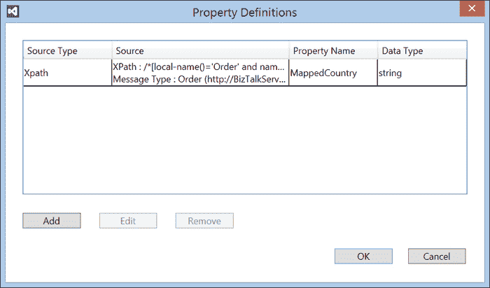

属性定义

# 查找

消息属性的另一种用法是与转换一起使用。在这里，一个常见的需求是转码，其中一个值需要替换为或映射到另一个值。代码表可以用于此目的，我们可以使用 BizTalk 服务的查找功能来完成此操作，然后将值输入到转换中替换消息中的值。

需要一些准备工作来设置这些内容。如果您还记得，当您配置新的 Windows Azure BizTalk 服务实例时，您可以选择创建一个新的 SQL Azure 数据库来存储服务所需的各种表。我们也可以在这个数据库中创建一个表来存储查找的转码数据。要创建一个表并向其中添加数据，请在数据库上运行以下脚本：

```cs
CREATE TABLE [dbo].CountryMap,
  [ISOCountry] [int] NULL
  CONSTRAINT [PK_CountryName] PRIMARY KEY CLUSTERED
  (
    [CountryName] ASC
  ) WITH (PAD_INDEX = OFF, STATISTICS_NORECOMPUTE = OFF, IGNORE_DUP_KEY = OFF, ALLOW_ROW_LOCKS = ON, ALLOW_PAGE_LOCKS = ON)
)
GO
INSERT INTO [dbo].[CountryMap] (CountryName, ISOCountry)VALUES('USA',844),('UK',826),('CANADA',124)
```

最简单的方法是访问[Azure 管理门户](http://manage.windowsazure.com)并点击**SQL 数据库**选项卡。为您的 BizTalk 服务实例创建的数据库将使用您提供的服务名称命名，并附加`_db`扩展名。点击此数据库，然后点击**管理**。浏览器中将打开一个新窗口（或选项卡），如图所示。在此窗口中，您可以选择**新建查询**，粘贴前面的 SQL 代码，然后点击**运行**以创建表并填充一些数据。


Windows Azure SQL 查询编辑器

如**属性定义**对话框所示，我们可以在桥接器中通过以下步骤配置丰富阶段，就像之前一样：

1.  在第一个丰富阶段打开**属性定义**对话框。

1.  对于**类型**字段，选择**查找**。

1.  点击**标识符**字段的下拉列表，然后点击**配置新…**。

1.  将会显示对话框；按照以下截图所示完成它：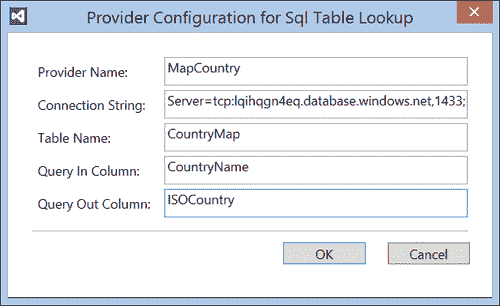

    提供者配置

    ### 注意

    要获取**连接字符串**值，请重新登录到 Azure 管理门户，点击**SQL 数据库**选项卡，就像之前一样，然后点击在配置服务时创建的 WABS 数据库。点击**仪表板**然后点击**显示连接字符串**。将 ADO.NET 文本框中的值复制到该字段。

1.  点击**确定**以关闭对话框。

1.  对于**查找**属性，选择**MappedCountry**——这是之前由 XPath 创建的上下文属性，用作查找的输入。

1.  在**属性名称**字段中输入`MappedCountry`。

1.  在**数据类型**下拉菜单中选择**字符串**。

1.  检查以下截图所示值：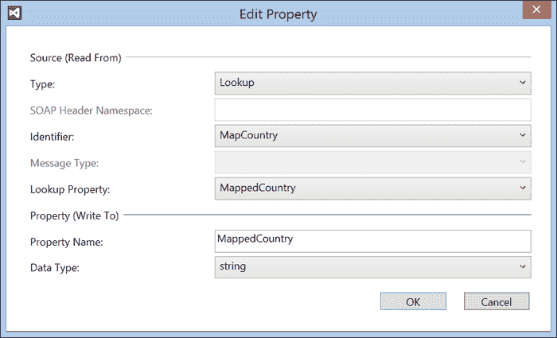

    编辑属性对话框

1.  点击**确定**以创建属性。

1.  最后，点击**确定**以关闭**属性定义**对话框。

现在，当接收到消息时，消息中的国家名称将在数据库中查找，并将 ISO 国家代码返回并存储在**MappedCountry**属性中。为了完成，我们需要添加一个转换来更新消息本身，以下是步骤：

1.  右键单击项目并选择**添加** | **新建项…**。

1.  在模板对话框中选择**映射**，并提供映射名称`CountryNameToCountryCode.trfm`。

1.  点击**确定**以创建映射。

1.  在开放映射中，点击**开源模式**链接。选择**PO.XSD**模式（来自第二章, *消息和转换*）。

1.  对于**开放目标模式**链接也执行相同的操作。

1.  在 functoids 工具箱中，将**获取上下文属性**functoid 拖放到设计器中（位于**杂项操作**部分）。

1.  双击映射上的 functoid 以配置它。

1.  在**属性名称**字段中，输入`MappedCountry`。

1.  点击**确定**以关闭对话框。

1.  按住**Shift**键，并点击并按住左侧模式中的`Order`节点。在仍然按住左鼠标按钮和**Shift**键的同时，将鼠标拖动到右侧模式中的`Order`节点以连接它们。在显示的弹出窗口中，选择**按名称链接**。回想一下第二章，*消息和转换*，这个操作将映射源到目标的所有字段。

1.  最后，您需要删除左侧和右侧的`Country`节点之间的链接，因为您现在正在 functoid 中查找此值。

1.  地图现在应该看起来像以下截图。

    ### 注意

    桥接器配置**用户界面**（**UI**）中存在一些限制，可能会使更改配置变得困难。值得记住的是，桥接器只是一个 XML 配置文件，以及与桥接器上每个源和目标关联的配置文件。

    例如，没有通过 UI 更改在 enrich 阶段添加的现有查找的数据库详细信息的途径。但是，要完成此操作，您只需打开`LookupProviderConfigurations.xml`文件并编辑连接详细信息。还应注意，连接的用户名和密码详细信息实际上存储在此文件中，因此应谨慎处理。

    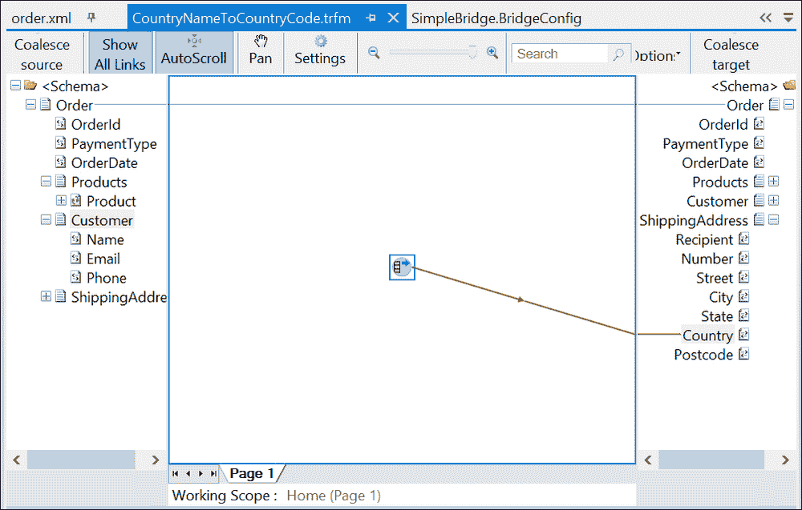

    国家代码地图

1.  需要的最后一个步骤是将地图与桥接器关联起来。双击桥接器文件以打开它（解决方案资源管理器中的`MessageFlowItinerary.bcs`文件）。

1.  双击**SimpleBridge**组件。

1.  滚动到**转换**阶段，并点击**XML 转换**框。

1.  在**属性**窗口中，点击**地图**属性旁边的省略号（**…**）。

1.  您刚刚创建的地图应该显示在对话框中；只需检查**已选择**列以启用它。

1.  点击**确定**。

# 路由

现在，让我们看看另一个常见的消息传递场景——路由。在这里，根据某些标准，消息需要发送到多个潜在端点之一。这些标准可能基于消息的属性（例如它来自哪里）或消息中的属性（例如`country`这样的数据项）。这种基于内容的路由可以通过 BizTalk Services 轻松实现，正如我们将看到的。

应注意，消息不能发送到多个端点。这是 BizTalk Server 能够做到的，但当前 BizTalk Services 不能。相反，BizTalk Services 允许您根据您配置的路由规则在目的地之间进行选择。

再次查看*增强*部分的*路由桥梁模式*图中的设计。注意有两个可能的终点。现在我们将配置消息流行程，以便如果`Country`属性是`USA`，则将消息路由到`美洲`目的地；否则，我们将路由到`欧洲`。为此，我们需要执行以下步骤：

1.  单击连接到`美洲`目的地的桥梁的箭头。

1.  在**属性**窗口中，单击**筛选条件**属性。

1.  输入 `MappedCountry = '844'` 或 `MappedCountry = '124'`。

1.  现在单击连接到`欧洲`目的地的箭头。

1.  在**属性**窗口中，单击**筛选条件**属性。

1.  输入 `MappedCountry = '826'`。

您可以通过单击桥梁并点击**路由顺序表**属性旁边的省略号（**…**）来更改路由的评估顺序。将显示一个对话框，如图所示：


更改路由顺序

通过使用上下箭头，可以更改评估顺序，以确保您想要的第一匹配条件是消息将被路由到的位置。

# 尝试一下

由于桥梁将消息发送到两个服务总线队列之一，您需要首先在 Azure 管理门户中创建这些队列。创建两个队列，一个名为`europe`，另一个名为`americas`。然后需要在桥梁上的每个队列目的地设置这些队列的连接信息。每个队列的**运行时地址**属性采用以下形式：

`sb://<your namespace>.servicebus.windows.net/Europe`

认证属性也需要进行配置。令牌提供者类型应设置为共享密钥，并将发行者密钥设置为您的服务总线命名空间中的 ACS 密钥。

现在您已准备好部署解决方案。按照常规方式操作，一旦部署，您将有一个 HTTPS 终端已部署，您可以将消息发送到该终端。

要将消息发送到已部署的桥梁，您可以使用 BizTalk 服务资源管理器，它提供了一些用于管理和测试解决方案的有用功能。它是 Visual Studio 的一个扩展，可以按照以下方式设置：

1.  启动 Visual Studio 2012，然后在**工具**菜单中选择**扩展和更新…**。

1.  在左上角单击**在线**链接，然后在搜索框中输入`biztalk service explorer`，如图所示：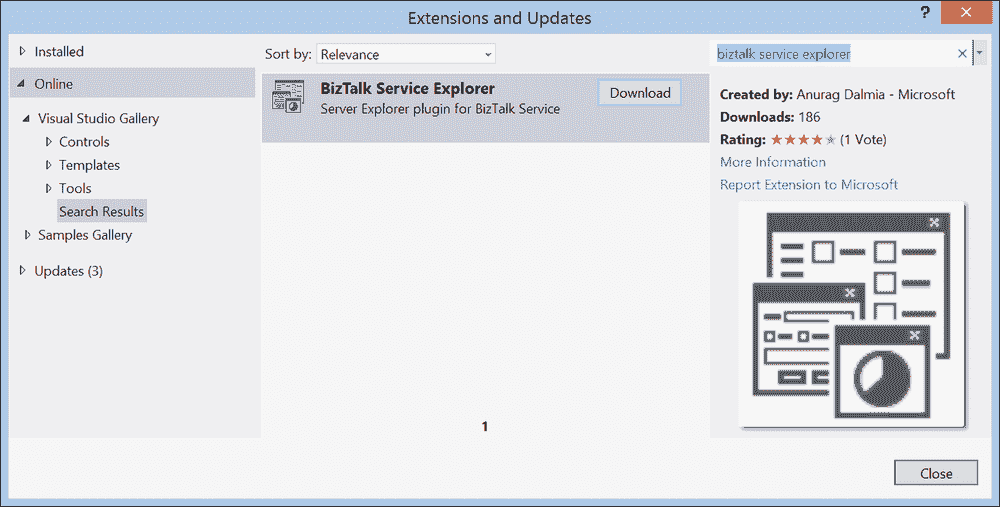

    安装 BizTalk 服务资源管理器

1.  单击**下载**按钮，这将下载一个 MSI 文件。双击它以安装并重新启动 Visual Studio。

1.  在**视图**菜单中，选择**服务器资源管理器**。

1.  **服务器资源管理器**窗口将会有一个新节点，**Windows Azure BizTalk 服务**；右键单击它，并选择**添加 BizTalk 服务…**，如图所示：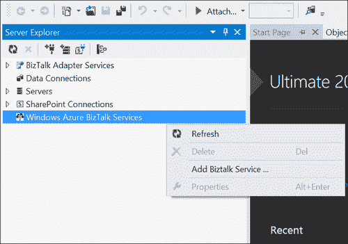

    添加 BizTalk 服务实例

1.  在出现的对话框中，输入你的服务实例的详细信息，如图所示，用适当的值替换详细信息，然后点击**确定**：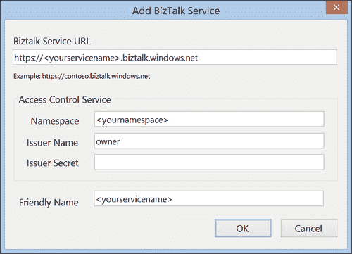

    配置探索器

1.  现在你已经设置了探索器，展开**桥接器**节点，右键单击你刚刚部署的桥接器，然后点击**发送测试消息…**。

1.  在出现的对话框中，粘贴本章开头的测试消息，如图所示，然后点击**发送**按钮：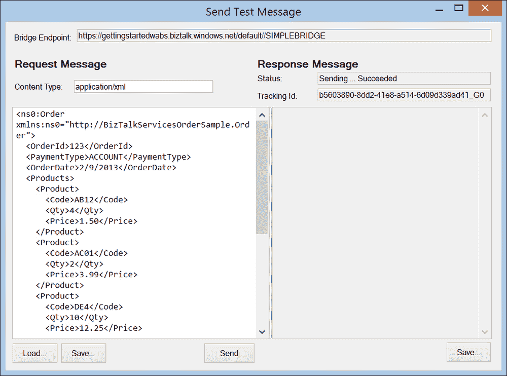

    测试桥接器

当你这样做时，请记住，根据你在输入消息中设置的`Country`值，你可以通过使用`UK`、`USA`或`CANADA`的值，将消息直接发送到`Europe`或`Americas`队列，如图所示在*增强*部分的*路由桥接器模式*图中。

要查看队列的内容，你可以使用可以从[`code.msdn.microsoft.com/windowsazure/Service-Bus-Explorer-f2abca5a`](http://code.msdn.microsoft.com/windowsazure/Service-Bus-Explorer-f2abca5a)下载的 Service Bus Explorer 应用程序。以下截图显示了包含我们刚刚发布到桥接器的消息的`Europe`目标队列。注意消息中的`Country`节点包含来自 SQL 查找表的值`826`，替换了原始消息中的`UK`值。

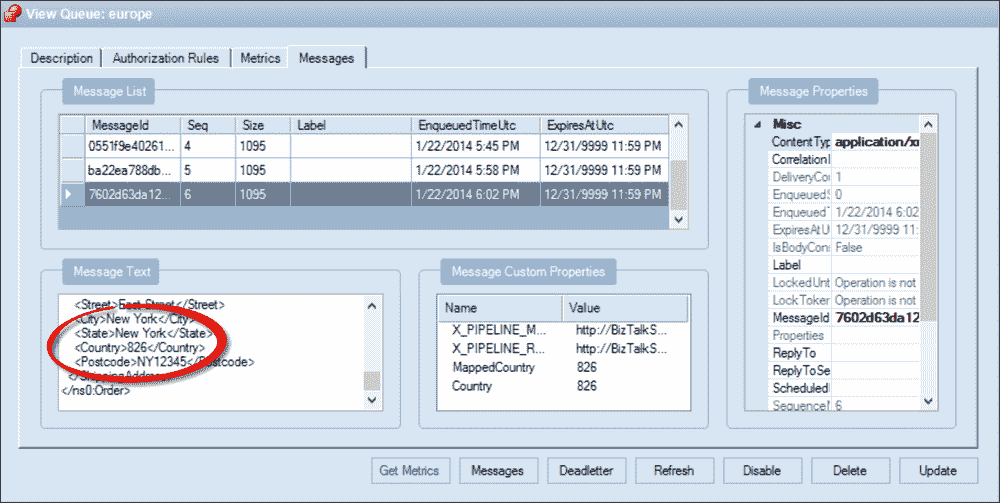

查看队列中的消息

尝试更改测试消息的国家为不在查找表中的国家，看看会发生什么。如果你输入一个不存在的国家，查找将失败。你实际上会收到一个 500 HTTP 响应代码，并带有 SOAP 错误消息**查找未返回结果**。现在尝试将查找表中的`UK`值更改为，比如说，`123`。现在会发生的情况是路由将失败，因为没有匹配到任何目的地。你将收到相同的 HTTP 500 代码，但这次带有 SOAP 错误**消息没有匹配的过滤器**。自己尝试实验，享受乐趣！

# 代理消息

如果您回顾了 *增强* 部分的表格，您可能会对代理属性类型感到好奇。通过桥梁流动的消息基于服务总线的 BrokeredMessage 类型（有关更多详细信息，请参阅 [`msdn.microsoft.com/en-us/library/microsoft.servicebus.messaging.brokeredmessage.aspx`](http://msdn.microsoft.com/en-us/library/microsoft.servicebus.messaging.brokeredmessage.aspx)）。此类提供了一系列在 BizTalk 服务中公开的属性，如 `CorrelationId`、`MessageId` 和 `SessionId`。真正有趣的是，当您使用服务总线队列或主题目标时，在桥梁中创建的属性（任何属性，而不仅仅是代理属性）或当服务总线是源时在接收消息上设置的属性不仅可以在桥梁内部访问，还可以在外部访问。这对于将状态从 BizTalk 服务传递到消费队列消息的下游应用程序非常有用，因为该应用程序将能够看到您在桥梁中设置的属性。

注意，尽管这仅适用于服务总线源和目标，但如果要将一个桥梁链接到另一个桥梁，例如，您将无法传递这些属性，因为链接实际上是通过 HTTP 进行调用，从而丢失了上下文。相反，如果您希望在桥梁之间或从桥梁到另一个应用程序之间传递属性，您必须将属性写入消息头（在 HTTP 的情况下）以保留它们。然而，如果您通过服务总线进行链接，则第一个发送桥梁中设置的属性将在第二个接收桥梁中可访问。

# 摘要

在本章中，我们更深入地探讨了 Windows Azure BizTalk 服务的基本构建块——桥梁。我们看到了如何配置桥梁以执行一系列集成活动，以及如何执行基于内容和上下文的路由。虽然我们已经了解了桥梁的大部分功能，但在下一章中，我们将重新审视桥梁，并探讨如何使用消息检查器在桥梁的阶段上执行自定义逻辑。然后，我们将探讨如何跟踪和记录创建的消息属性（跟踪）以及如何批量发送消息。
