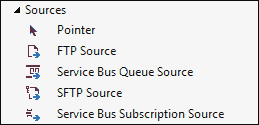
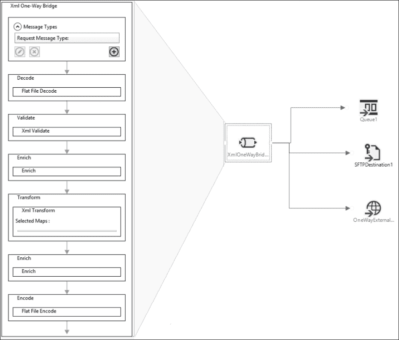
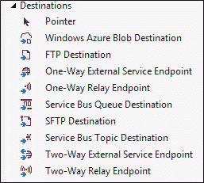
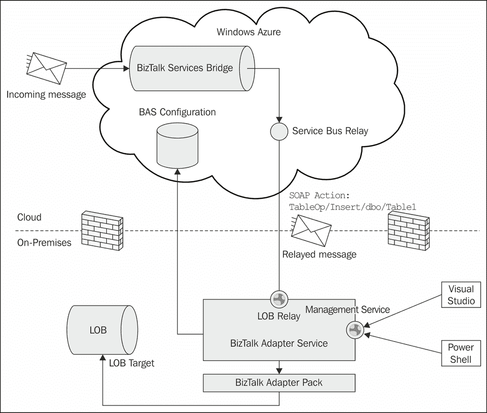
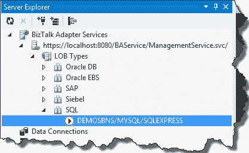
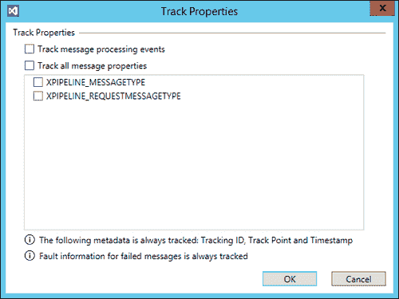
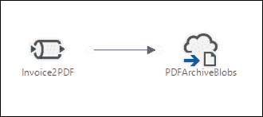
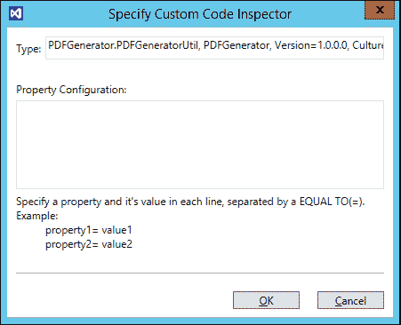
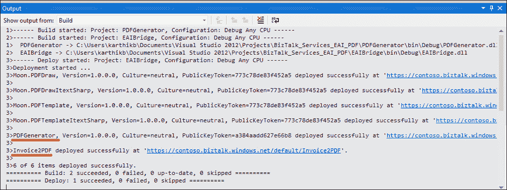

# 第四章：企业应用集成

能够使应用程序相互连接以交换数据的中间件系统或服务被称为企业应用集成或 EAI。在 BizTalk Services 中，EAI 面向开发者角色，Visual Studio 是开发和部署服务的主要工具。应用程序之间的集成可以通过消息桥接实现。随着我们探讨这些概念，我们将更详细地探讨第一章中的电子商务示例。

特别是在本章中，我们将重点关注以下主题：

+   理解 Azure 中的 EAI 功能

+   理解桥接、源和目标

+   使用消息检查器理解自定义代码

+   理解混合连接

# 企业应用集成场景

考虑以下场景：

+   Contoso 是一家电影票务公司，在多个城市的销售点终端销售票务。他们希望将终端的每日销售数据汇总到他们的 SAP 业务线系统中。在没有任何形式的中间件的情况下，POS 数据需要手动收集，并且数据需要合并并转换为与目标系统匹配的格式。使用 EAI，整个流程可以自动化，并在几分钟内通过 BizTalk Services 设置完成。

+   Fabrikam 是一家软件供应商，使用 Salesforce 来管理他们的客户管道和销售订单。所有来自 Salesforce 的已批准订单都需要在他们的 ERP 系统中集中管理，如位于本地的 Oracle 系统。使用混合连接，所有连接到本地 Oracle 的连接都可以通过 BizTalk Adapter Services 进行管理。

+   Northwind 是一家在线零售商，负责管理电子商务网站以供客户购买。他们还从活动公司和公司那里接收大量订单。Northwind 需要开发一个解决方案来验证订单，并将请求路由到正确的库存位置以交付商品。通过在 BizTalk Services 中使用 EAI，他们开发了一个通用解决方案来处理来自消费者的 XML 格式的采购订单以及来自活动公司的 EDI 格式的采购订单。

这些场景中的每一个都可以在 BizTalk Services 上建模为 EAI 解决方案。传入的请求（票务销售、销售订单和发票）可以是 XML 或平面文件消息，需要转换为目标业务线格式并路由到本地系统。如果目标是在本地，则使用混合连接设置中继端点。

# BizTalk Services 中的 EAI

让我们更详细地查看每个概念并了解其功能。

## 源

源接收来自外部应用程序的消息。BizTalk Services v1 支持五个常见的开箱即用的源：**SFTP**、**FTP**、**HTTP**、**Service Bus Queue**和**Service Bus Subscription**。默认情况下，桥梁暴露由访问控制服务保护的 HTTPS 端点。桥梁的各种源在以下屏幕截图中显示：



桥梁的源

## 桥梁和 VETER 模式

桥梁由源、管道和目的地组成。管道连接两个消息系统，由一系列阶段组成，以处理从源到目的地的消息流。阶段执行解码、验证、富集、转换和路由消息。每个阶段都可以通过 Visual Studio 属性面板启用或禁用以进行部署。阶段集是固定的，并且 BizTalk Services v1 开箱即用启用**VETER**模式。这在上面的屏幕截图中显示：



带有 VETER 模式的桥梁

以下为 VETER 模式的阶段：

| 阶段 | 描述 |
| --- | --- |
| 验证 (V) | 将传入的消息与模式进行验证 |
| 富集 (E) | 使用从消息头、正文或查找中提升的属性来丰富消息（参见第三章，*桥梁*) |
| 转换 (T) | 将消息从一种格式映射到另一种格式（参见第二章，*消息和转换*) |
| 富集 (E) | 在转换后丰富新的消息 |
| 路由 (R) | 路由到目标目的地之一 |
| 解码 | 对于平面文件处理，解码消息 |

## 目的地

**目的地**是管道处理后的消息提交的地方。在桥梁中，到目的地的路由基于 SQL-92 表达式语法。只有当路由规则评估为真时，消息才会发送到目的地。路由阶段也在第二章，*消息和转换*中解释。各种目的地在以下屏幕截图中显示：



带有桥梁的目的地

## 桥梁的属性

这里有一些桥梁的有趣属性：

+   **状态**：桥梁中的管道是无状态的，即在处理过程中不会持久化消息。如果在消息正在传输时系统崩溃或重启，则必须重新提交消息以进行处理。这也意味着消息处理是同步的。

+   **错误处理**：如果在消息处理过程中发生错误，则会向消息的发送者抛出异常以采取行动。由于 EAI 桥梁中没有单独的挂起端点，因此必须在客户端处理错误。

+   **单向/双向**：桥接器支持单向和双向通信。在单向通信的情况下，只有 HTTP 代码被传回消息的发送者。然而，在双向通信的情况下，可以发送响应消息。BizTalk 服务的双向桥接器在请求侧支持 VETER 模式，在响应侧支持 ETER 模式。响应侧的消息被认为是有效的，因为这是来自目标业务线系统或服务的。请注意，透传桥接器是单向桥接的一种特殊情况，它只有 VETER 模式的 E-R。

+   **消息格式**：消息可以以纯 XML、SOAP 和平文件格式发送。平文件消息只能与单向桥接一起使用。未来可能会添加其他格式，例如 JSON，但那些不同的格式在处理之前需要自定义代码将数据标准化为 XML。我们将在本章后面讨论自定义代码。

+   **链式**：可以通过将一个桥接器作为另一个桥接器的目标来链式多个桥接器。这可以用来通过单个桥接器集中处理消息。例如，多个桥接器可能从不同的来源抽取消息，所有这些消息都连接到单个桥接器，该桥接器将消息路由到本地端点。此外，选择性禁用阶段可以启用新的消息模式。例如，通过链式两个 VETER 桥接器可以实现 ETEVR。

# 混合连接

在 ERP 和本地服务上进行了 IT 投资的组织可能不会将所有 IT 资产迁移到云中。需要从云中通过混合连接连接到那些服务和资源。

## BizTalk 适配器服务

**BizTalk 适配器服务**（**BAS**）是一种服务，它使运行在本地环境中的应用程序能够从云中接收数据。本地应用程序，如 ERP 和 BizTalk 服务器，可以通过使用服务总线中继实现混合连接，在企业网络之外公开。Azure 上的服务总线中继服务充当中介，客户端和本地服务可以通过它相互连接。在这种情况下，客户端是 BizTalk 服务的桥接器，而本地运行的服务是 BizTalk 适配器服务，它与 ERP 进行通信。一旦 BizTalk 适配器服务和桥接器通过服务总线中继服务进行身份验证，所有来自桥接器的消息都将转发到 BizTalk 适配器服务。

## BAS 架构

以下图中展示了 BAS 架构的整体结构：



BizTalk 适配器服务架构

BizTalk Adapter 服务在客户端机器上运行，并在 IIS 中托管以处理管理操作，如端点的启动/停止以及从云到本地系统的运行时操作。有一个管理服务以及一个或多个可以通过管理服务管理的运行时服务。中继配置的元数据存储在安装期间指定的 BizTalk 服务部署的存储账户中。BizTalk Adapter 服务依赖于 BizTalk Adapter 包来连接到业务线（LOB）系统，如 Oracle DB、Oracle EBS、SAP、Siebel 和 SQL Server。

管理操作通过 Visual Studio 服务器资源管理器或通过 PowerShell 命令行进行暴露，它们都与 **BAService** 通信，该服务在本地机器上安装 BizTalk Adapter 服务时，在 IIS 上托管 `ManagementService.svc` 服务。

运行时操作按照服务总线中继进行管理，通过在 IIS 中创建新的应用程序托管 `RuntimeService.svc`。每个 LOB 可以创建一个新的中继或使用为另一个 LOB 配置的现有中继。当每个中继有多个 LOB 时，运行时地址中超过中继 URL 的子路径有助于将调用引导到正确的适配器。

当创建 LOB 中继时，根据用户配置，在 IIS 中使用新的或现有的应用程序作为服务宿主。生成的 WSDL 包含要中继的消息以及操作动作。`INSERT`、`UPDATE`、`DELETE` 和 `SELECT` 等操作作为以下格式的 `SOAPAction` 报头的一部分传递：`TableOp/{Operation}/schema/Tablename`。确切的 SOAP 动作字符串可以从 Visual Studio 中继配置的属性窗口中确定。

通过中继传递的每条消息都需要对 LOB 进行身份验证。身份验证凭证通过以下四种方式之一传递：

+   用户名和密码预先配置并存储在 BAS 存储中

+   Active Directory 域凭证

+   包含 LOB 凭证的 SOAP 报头

+   WS-Security 凭证

## BAS 安装和配置

BAS 安装是 BizTalk 服务 SDK 设置的一部分。在设置过程中，需要输入 BizTalk 服务部署的 URL。此 URL 被添加到 `C:\Program Files\Microsoft BizTalk Adapter Service\BAService` 下的 `web.config` 中。在 Visual Studio 服务器资源管理器中，需要输入本地管理服务 URL 以及部署的 ACS 凭证。现在可以使用向导驱动的界面为以下每个 LOB 设置混合连接，如下所示：



Visual Studio 服务器资源管理器中的 BizTalk Adapter 服务配置

例如，设置与运行在本地主机上的 SQL Server Express 和 DemoDB 数据库的中继连接涉及以下步骤：

1.  在 **服务器资源管理器** BAS 视图中，右键单击 **LOB 类型** | **SQL** 并选择 **添加 SQL 目标**。

1.  在弹出向导中，阅读说明并点击 **下一步**。

1.  输入服务器名称、实例和目录的值（例如 `localhost`、`SQLExpress` 和 `DemoDB` 分别）。使用 Windows 身份验证或配置的用户名和密码，并点击 **下一步**。

1.  通过中继导航到 **表**（或 **视图**），选择表，并将操作选择为 **插入**。点击 **属性** 以查看生成的 WSDL。点击 **下一步**。

1.  当消息通过中继传递时，配置 **运行时安全类型**。这些是我们之前提到的四个选项。输入凭据并点击 **下一步**。

1.  在 **指定 LOB 中继 URL** 中，选择 **创建新的 LOB 中继** 并输入服务总线凭据。为 **LOB 中继路径** 和 **LOB 中继子路径** 输入任何名称。点击 **下一步**。

1.  点击 **创建** 以完成中继和 BAS 端点的创建。

一旦中继成功设置，每个连接将出现在相应的 LOB 类型下。

## 使用桥接器消费 BAS

创建新的 BizTalk 服务项目或打开现有的项目。使用桥接器使用 BAS 配置有三个部分：

1.  从服务器资源管理器中，我们现在可以右键单击之前配置的中继连接，并选择 **将架构添加到项目**。将发送和接收目标 LOB 的相关架构添加到项目中。这些可以在桥接器内部用于映射和验证目的。

1.  将服务器资源管理器中的连接从服务器资源管理器拖放到桥接器设计表面上。这将创建必要的图标，以便从桥接器添加目标连接。

1.  点击中继连接，在 Visual Studio 属性窗口中导航到 **操作** 字段。展开视图，并记下每个索引 [0]、[1] 右侧的值。这些值都是 SOAP 动作值。要添加此值，转到 VS 属性中的路由操作，并启动 **路由操作** 窗口。点击 **添加**，在 **编辑路由操作** 弹出窗口中，输入之前复制的 SOAP 动作值。选择 **类型** 为 **Soap** 和 **标识符** 为 **Action**。点击 **确定** 以接受更改。

# EAI 中的自定义代码

现在我们已经了解了混合连接，让我们看看桥接器的另一个功能，即支持自定义代码。BizTalk 服务不会提供所有功能。自定义允许开发者插入新的功能，以增强现有的消息流。例如，我们可以选择将传入的发票 XML 转换为用户可读的 PDF 格式，以及出于法律原因存档。

在桥梁中可以在阶段级别、路由配置或转换中进行定制。转换及其定制已在第二章，*消息和转换*中介绍。在本节中，我们将查看桥梁定制。

## 消息检查器

消息检查器是桥梁中每个阶段进入或退出的自定义代码钩子。自定义代码必须实现`IMessageInspector`接口：

```cs
public interface IMessageInspector
{
Task Execute(IMessage message, IMessageInspectorContext context);
}
```

消息检查器使用.NET4 任务并行库中的 Task 编程模型实现。可以使用`IMessageInspectorContext`接口中的`ITracer`接口在自定义代码中发出跟踪。

```cs
public interface ITracer
{
void TraceEvent(TraceEventType eventType, string format, params object[] args);
}
```

### 注意

在开发自定义代码时，以下是一些关键点要记住：

+   预期用户代码具有弹性，但在某些情况下可能会抛出异常。在这种情况下，这被视为阶段级失败，并生成相应的跟踪记录。

+   VS 项目中的用户代码必须引用`Microsoft.BizTalk.Services.dll`，该文件位于`C:\Program Files (x86)\Microsoft Visual Studio 11.0\Common7\ide\Extensions`。

+   用户代码组件必须在 BizTalk 服务项目中添加为引用，并将`Copy Local`设置为 true。

+   当用户代码组件在 BizTalk 服务中部署时，必须重新启动服务，因为 DLL 需要在.NET AppDomain 中重新加载。重启选项在 VS 部署和 PS cmdlet 中可用。

+   桥梁的工件，如架构或映射，在用户代码中不可访问。

+   可以在自定义代码中定义和提升属性。在代码中，它们必须是具有 C#属性`PipelinePropertyAttribute`并设置`Name`属性的字符串属性。此属性在 VS 属性配置中的消息检查器配置窗口中设置，如*配置桥梁*部分中*带有桥梁的自定义代码配置*图所示。

# 跟踪

跟踪有助于在跟踪存储中存储消息的有趣属性。跟踪存储是在 BizTalk 服务配置期间配置的 Azure SQL 数据库。所有消息属性都存储在`PipelineTrackRecords`和`SourceTrackRecords`表中。跟踪故障排除的详细信息请参阅第七章，*跟踪和故障排除*。

要在 EAI 桥梁上启用跟踪，请在 VS 中选择桥梁，并在属性窗口中选择**跟踪属性**。跟踪的属性可以在 BizTalk 服务门户的跟踪视图中看到。



配置桥梁跟踪属性

# 场景演练

让我们回顾一下带有以下更改的 EAI 场景。

Northwind 是一家在线零售商，管理着客户购买的电子商务网站。而不是处理订单，假设他们现在从供应商那里收到销售商品的发票。为了可读性和法规原因，他们需要将此存储在本地系统中的 PDF 格式。

### 注意

假设 BizTalk Services SDK 已安装，并且 Visual Studio 显示以下项目：

+   BizTalk Service 项目：创建/部署桥接器、架构和映射

+   BizTalk Service 艺术品项目：创建/部署架构和映射

## 先决条件

Northwind 创建一个新的 BizTalk Services 部署。参见第一章，*欢迎使用 BizTalk Services*，了解创建 BizTalk Services 部署和注册 BizTalk 门户。我们将使用来自 [pdftemplate.codeplex.com](http://pdftemplate.codeplex.com) 的 PDFTemplate 工具来生成 PDF 格式的发票消息。此实用程序可在 GPLv2 许可下使用。

## 解决方案

该解决方案将接收发票 XML 并在 blob 存储中生成 PDF。要开始，让我们首先创建架构，添加生成 PDF 的代码，最后将该逻辑插入到桥接器配置中。

### 创建架构

为传入的消息创建一个示例架构。本流程中使用的示例与此章节一起提供。执行以下步骤：

1.  使用 Visual Studio 架构编辑器，为发票创建一个简单的架构，称为 `InvoiceSchema.xsd`。

1.  从 Visual Studio 命令提示符运行以下命令以为此 xsd 生成 `InvoiceSchema.cs`：

    ```cs
    xsd InvoiceSchema.xsd /classes
    ```

1.  我们将在下一步中加载此 `InvoiceSchema.cs` 文件。

### 创建自定义代码

现在让我们添加用于生成我们刚刚创建的发票的 PDF 的自定义代码：

1.  创建一个 C# 类库项目，并将对 `Microsoft.BizTalk.Services.dll` 和 PDF 依赖项的引用添加到项目中。

1.  实现 `IMessageInspector` 接口的一个类。在示例中，我们将消息体提取到 `Order` 消息对象中，如下所示：

    ```cs
    string bodystr = GetMessageBody(message);
    Order order = DeserializeMessageToOrder(bodystr);
    ```

1.  PDFGenerator 以 `layout.xml` 中所需的格式描述 PDF 结构，该格式由 codeplex 工具要求。XML 本身作为嵌入资源传递在自定义代码 DLL 中，必须在使用前提取，如下面的代码片段所示：

    ```cs
    Stream stream = System.Reflection.Assembly.GetExecutingAssembly().GetManifestResourceStream("layout.xml");
    byte[] bytes = new byte[(int)stream.Length];
    stream.Read(bytes, 0, bytes.Length);
    File.WriteAllBytes(System.IO.Path.GetTempPath(), bytes);
    ```

1.  使用来自 `Order` 对象的数据填写 PDF 文件的标题、正文、循环和页脚数据。使用以下代码片段中显示的信息使用 PDFGenerator：

    ```cs
    PDFTemplateItextSharp pdfgen = new PDFTemplateItextSharp(xmlToPdfTemplateFilePath);
    pdfgen.Draw(GetHeaderData(order), GetLoopData(order), GetBodyData(), GetFooterData());
    ```

1.  将 PDF 数据写回以下代码片段中显示的新消息：

    ```cs
    message.Data = new System.IO.MemoryStream(pdfdata);
    message.ContentType = new System.Net.Mime.ContentType("text/plain");
    ```

1.  对项目的输出程序集进行签名。请注意，所有 DLL 依赖项都需要签名。

### 配置桥接器

执行以下步骤以配置桥接器：

1.  在同一解决方案中添加 BizTalk Services 项目，并将对已签名自定义代码的引用添加到项目中。

1.  添加一个桥梁，在这种情况下，一个**透传**桥梁，并将其命名为 Invoice2PDF。同时将消息的路由添加到 Windows Azure 块存储目的地。以下图所示为**PDFArchiveBlobs**：

    BizTalk 服务项目中的 Invoice2PDF 桥梁示例

1.  在桥梁属性中填写所需字段。对于桥梁，添加 BizTalk 服务**运行时地址**和**路由表**值。对于块，添加**共享访问签名 URL**。点击桥梁，并从属性窗口中，在桥梁窗口上打开**跟踪属性**以启用跟踪。

1.  获取此自定义代码的全限定程序集名称。如果指定不正确，部署期间将出现错误。您可以使用 MSDN 代码库中的**GetAssemblyQualifiedTypeName**示例，[`code.msdn.microsoft.com/windowsazure/Windows-Azure-BizTalk-EAI-56915d1c/view/SourceCode`](http://code.msdn.microsoft.com/windowsazure/Windows-Azure-BizTalk-EAI-56915d1c/view/SourceCode)，或者运行 `sn -T` 在 DLL 上以确定公钥并确定全限定名称。它应该看起来像这样：

    ```cs
    PDFGenerator.PDFGeneratorUtil, PDFGenerator, Version=1.0.0.0, Culture=neutral, PublicKeyToken=xxxxxxxxxx
    ```

1.  双击透传桥梁并点击 enrich 阶段。从属性窗口中，点击**退出消息检查器**并在**指定自定义代码检查器**弹出窗口中添加全限定名称，如图所示：

    使用桥梁进行自定义代码配置

### 部署桥梁

现在我们可以按照以下步骤将桥梁部署到 BizTalk 服务部署中：

1.  启动 VS 并从**构建**菜单中选择**部署**命令，并输入 BizTalk 服务部署详细信息。

1.  如果项目部署多次，需要勾选**部署后刷新服务**复选框，以便更新自定义代码 DLL 被拾取。

VS 输出块将与以下所示类似：



VS 桥梁部署输出

### 发送消息

使用 MSDN 代码库示例中的 Message Sender 工具向桥梁发送消息，或者你也可以下载 BizTalk 服务探索插件用于 VS 服务器资源管理器。这允许你探索部署并发送测试消息。

一旦消息成功发送，转到具有 SAS URL 的容器并本地保存块。将文件重命名为`.PDF`扩展名，你应该能够查看存档的 PDF 文件。

## 查看跟踪数据

点击 BizTalk 服务门户导航栏中的跟踪视图以查看桥梁上消息流的状态。也可以从 VS 中的 BizTalk 服务探索器按桥梁基础查看此信息。

# 摘要

在本章中，我们首先介绍了 Azure 上 EAI 的基本概念，特别是桥梁、源、目标、混合连接和自定义代码。我们通过一个简单的场景在 BizTalk 服务中生成 PDF 发票并在 Blob 存储中归档进行了演示。在使用桥梁中的自定义代码时可能会遇到错误。我们将在第七章 *跟踪和故障排除*中介绍故障排除的各个方面。

在下一章中，我们将探讨 BizTalk 服务支持的另一个关键场景——利用 B2B 功能实现跨企业集成。
