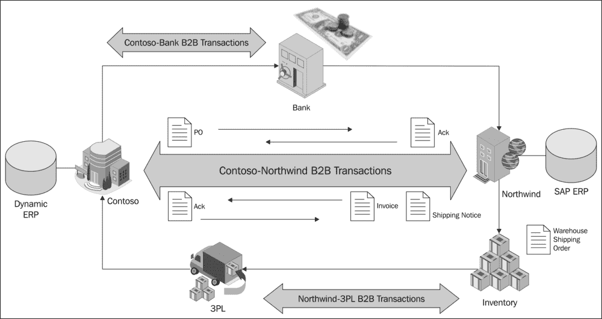
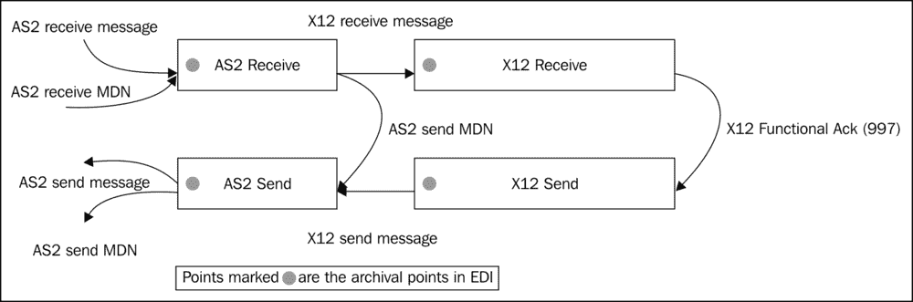
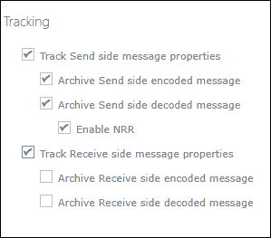
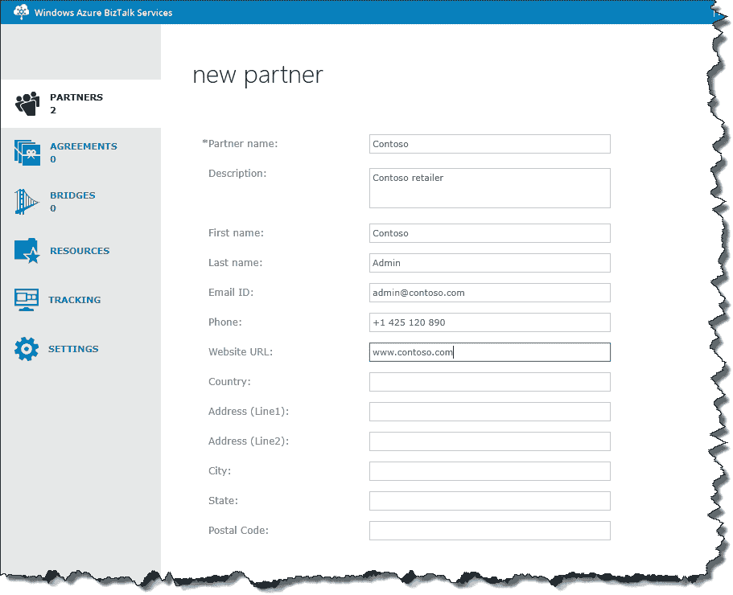
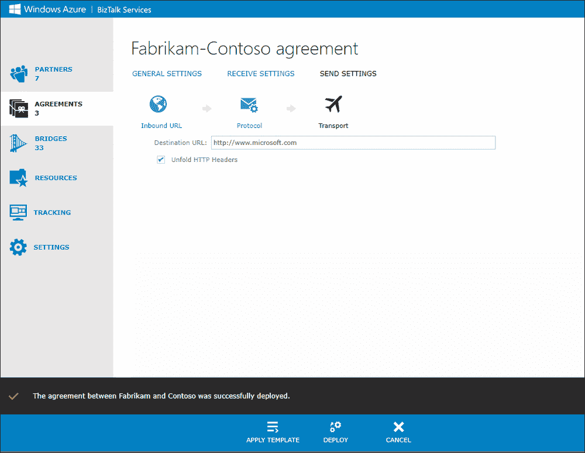
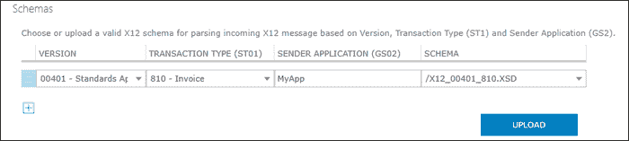

# 第五章：商业对商业集成

在买卖关系的两个公司之间的交易是商业对商业（B2B），而不是公司与消费者之间的 B2C 关系。在集成的背景下，B2B 是关于两个组织就一系列定义良好的交易达成一致，以交换商业信息。B2B 过程从商业谈判或协议开始，这进一步转化为消息流层面的技术细节。

在本章中，我们将重点关注以下主题：

+   在 Azure 的背景下理解 B2B 集成

+   理解与合作伙伴、协议、批处理和跟踪相关的服务能力

+   使用 Azure 上的 BizTalk 服务进行真实世界 B2B 场景的演练

# B2B 基本概念

考虑一个零售商 Contoso，他希望从供应商 Northwind 那里采购库存。从技术角度来看，Contoso 和 Northwind 之间的消息流可以用以下流程来解释：

+   Contoso 和 Northwind 同意建立商业关系（通常通过电话/电子邮件/会议）。双方的法律团队起草合作伙伴之间的谅解备忘录（MoU）。

+   合作伙伴交换有关如何接收/发送付款的信息，包括支票和银行详情。

+   双方合作伙伴进入一个设置阶段，其中每个 IT 部门都配置 B2B 系统以启用电子数据交换（EDI）的交换。

+   双方交换样本测试消息以验证配置，并在充分测试后，他们同意进入生产阶段。

+   在生产中，执行以下步骤：

    +   Contoso 从他们的 Dynamics AX ERP 系统中发起采购订单并将其发送给 Northwind

    +   Northwind 收到订单并确认已收到订单

    +   Northwind 处理订单并在他们的 SAP ERP 系统中查找库存，以确定他们是否可以满足请求

    +   如果订单可以服务，Northwind 将货物发送给第三方物流公司（3PL），该公司负责货物的运输

    +   Northwind 向 Contoso 回复运输详情

    +   Contoso 可以选择确认收货通知

    +   Northwind 向 Contoso 发送发票，以收取销售商品的成本

+   根据双方商定的财务条款，Contoso 向 Northwind 支付款项。

上述流程可以如下直观表示：



前一图中的每个箭头代表 Contoso 和 Northwind 之间交换的一组消息。每种消息类型由一个文档名称或事务集（例如，PO/X12 850）标识，并基于所使用的协议具有定义的格式。除了消息的结构外，协议还规定了来回交换的消息集。在前面的例子中，我们可以将第一个交易写为“Contoso 向 Northwind 提出 EDI X12 采购订单（850）”。在这里，X12 是 EDI 格式，850 是采购订单消息类型。

# 常见交互模型

B2B 集成交易伙伴有两种常见方式。如下列出。

## 直接企业集成

在此模型中，两个交易伙伴组织都有内部 IT，可以直接进行 EDI 消息交易。有系统用于通过点对点协议发送和接收 EDI 交易，无需任何中介或中间人。

## 服务提供商集成

在此模型中，一个交易伙伴是一个无法承担内部 IT 服务的小到中型企业玩家。为了促进 EDI 交互，存在一个中间人，或称 EDI 服务提供商，作为两个合作伙伴之间的联络人。服务提供商向一端的交易伙伴介绍 EDI，并与另一端的交易伙伴进行非 EDI（如 XLS/XML）交易。服务提供商根据交易规模/数量或协议的复杂性收取费用。

**增值网络**（**VANs**）是提供端到端 B2B 服务的专业网络，在服务提供商集成中发挥作用。VANs 管理服务器的托管和软件以处理 EDI 流量，通常根据消息量收费。它们可以为特定垂直领域提供专业解决方案或提供通用消息处理服务。

# 行业标准和协议

不同的组织为不同的行业垂直领域定义协议。每个协议都规定了交易伙伴之间交换的消息集、传输的确认和错误行为。

以下是一些 BizTalk 今天支持的最常见的协议及其支持的标准组织：

| 标准机构 | 网站 | 协议 | 行业 |
| --- | --- | --- | --- |
| ANSI ASC X12 | [`www.x12.org/`](http://www.x12.org/) | X12 | 在美国：制造业，零售业，政府和交通 |
|  |  | HIPAA | 医疗保健，保险 |
| UN/CEFACT | [`www.unece.org/cefact/edifact`](http://www.unece.org/cefact/edifact)[`www.gefeg.com/jswg/`](http://www.gefeg.com/jswg/) | UN/ EDIFACT | 在欧洲：制造业，零售业，政府和交通 |
| SWIFT | [`www.swift.com`](http://www.swift.com) | SWIFT | 财务，贸易和银行交易 |
| RosettaNet | [`www.rosettanet.org/`](http://www.rosettanet.org/) | RosettaNet | 供应链 |
| OAGi | [`www.oagi.org`](http://www.oagi.org) | CIDX | 多个垂直领域的水平框架 |
| PIDX | [`www.pidx.org/`](http://www.pidx.org/) | PIDX | 石油和天然气 |
| HL7 | [`www.hl7.org/`](http://www.hl7.org/) | HL7 | 医疗保健 |

X12 在美国被广泛使用，而 EDIFACT 在欧洲和亚洲国家更受欢迎。这两种协议今天都支持在 BizTalk 服务中。其余的协议可在 BizTalk 服务器中找到。

# BizTalk 服务 B2B 中的概念

BizTalk 服务中的 B2B 主要是处理交易伙伴之间的 EDI 和非 EDI 消息。它旨在使用 Azure 使 B2B 集成简单、强大和灵活。由于协议、格式和传输的性质，B2B 往往在配置上很复杂；使用 Azure，合作伙伴之间协议的服务配置变得简单。扩展服务并与 SharePoint 和移动服务等其他技术连接变得容易，以构建丰富而强大的解决方案。

B2B/EDI 中的顶级概念包括以下内容：

+   EDI 消息结构

+   合作伙伴和协议

+   EDI 中的属性提升

+   批处理

+   跟踪和归档

+   扩展性和对象模型 API

## EDI 消息结构

EDI 消息（无论是 X12 还是 EDIFACT）具有嵌套结构，将交易分块以便接收者易于理解。每个结构都有一个头部和尾部来标识嵌套结构的开始和结束。以下概述了嵌套结构：

+   **交换**：这是最外层的封装，包含头部和尾部。它标识了消息的发送者和接收者，以及消息发送的日期/时间。在 X12 的情况下，ISA 和 IEA 分别是头部和尾部；在 EDIFACT 中，UNB 和 UNZ 形成头部和尾部。

+   **组**：交换中的组段是一组根据其功能组合的交易。组以头部开始（X12 中的 GS 和 EDIFACT 中的 UNG），以尾部结束（X12 中的 GE 和 EDIFACT 中的 UNE）。与 X12 不同，EDIFACT 中的组是可选的；但是当存在组时，它们必须包含相同类型的所有交易（例如，所有采购订单）。

+   **交易集**：组中的交易集是给定类型的消息（例如，采购订单消息），其中包含详细交易的段，如项目数量或价格。交易集以头部开始（X12 中的 ST 和 EDIFACT 中的 UNH），以尾部结束（X12 中的 SE 和 EDIFACT 中的 UNT）。

下表说明了 X12 和 EDIFACT 的头部和尾部：

| X12 头部和尾部 | EDIFACT 头部和尾部 |
| --- | --- |
| ISA 交换控制头部 | UNA 可选建议 |
| GS 功能组头部 | UNB 交换控制头部 |
| ST 交易集头部 | UNG 功能组头部 |
| SE 交易集尾部 | UNH 消息头部 |
| GE 功能组尾部 | UNT 消息尾部 |
| IEA 交换控制尾 | UNE 功能组尾 |
|   | UNZ 交换控制尾 |

## **合作伙伴和协议**

在协议中使用的关键概念如下：

+   **合作伙伴**：合作伙伴是与之建立贸易关系的组织。每个合作伙伴有一个或多个称为**业务配置文件**的业务单元。每个业务配置文件都有一个标识符（例如，DUNS ID 或电话号码），它是唯一的，并添加到合作伙伴之间交换的每条消息中。

+   **协议**：协议表示合作伙伴之间消息交换的技术设置。协议是在合作伙伴的两个业务配置文件之间建立的。协议由发送设置（Contoso 的发送，Northwind 的接收）和接收设置（Contoso 的接收和 Northwind 的发送）组成，这些设置在贸易伙伴关系中。协议基于消息要求引用一个协议，如 AS2、X12、EDIFACT 等。协议还确定了跟踪和批处理周围的模式和需求。协议的部署导致两个网桥部署，因此，Azure 中的端点可以接收 EDI 消息并发送 XML，反之亦然。BizTalk 门户中的协议定义具有以下内容：

    +   **传输**：这是网桥的发送端或接收端传输。

    +   **协议**：这是网桥中使用的 EDI 协议。

    +   **转换**：这些是在消息在网桥中处理时使用的映射。

    +   **路由**：这是网桥将消息路由到消息接收者的目标目的地。

    +   **入站 URI**：这是接收要发送到目标合作伙伴的消息的发送端网桥的地址。

    +   **挂起端点**：这是在处理 EDI 消息时出现错误时将处理消息的端点。此端点可用于构建修复-重新提交场景。

+   **伙伴关系**：至少有一个协议在合作伙伴之间构成伙伴关系。伙伴关系的概念仅通过贸易伙伴管理 API 公开。

+   **协议模板**：协议模板是一个可重用单元，其中可以捕获常用设置作为模板，并在定义协议时应用，以实现快速配置。协议模板与配置文件相关联。每个模板定义都确定了在定义中指定的托管合作伙伴，以确定在创建协议时应用设置的方向。

+   **AS2 协议**：AS2 协议是指两个遵守 RFC 4130 标准的合作伙伴之间同意的 AS2 传输设置。简而言之，AS2 允许以压缩、签名或加密的形式通过 HTTP 或 HTTPS 传输消息和确认。使用证书支持签名和加密。AS2 不特定于有效负载，可用于 B2B 平面文件和 EAI XML 消息。

    ### **注意**

    如果一方（例如合作伙伴 A）的端点需要 HTTPS 进行 AS2 流量，那么合作伙伴 A 的部署证书需要添加到合作伙伴 B 的“受信任人员”证书存储中。或者，如果合作伙伴 A 的 AS2 消息发送到合作伙伴 B 的 HTTPS 端点，那么合作伙伴 B 的公共证书需要添加到合作伙伴 A 的部署证书存储中。这两个证书都需要使用从 BizTalk 服务工具加载的`PSCmdlet`上传到 BizTalk 服务部署证书存储中。以下是使用 PowerShell 添加证书的示例代码：

    ```cs
    PS C:\>Import-Module 'C:\Program Files\Windows Azure BizTalk Services Tools\Microsoft.BizTalk.Services.PowerShell.dll'
    PS C:\>Add-AzureBizTalkArtifactCertificate –AcsNamespace myAcs –IssuerName owner –IssuerKey 193194218484a= -FilePath D:\sample.cer –ArtifactPath /sample.cer –certificateStore TrustedPeople
    ```

    如果使用`makecert.exe`生成自签名证书，请确保将`–pe`和`–key`交换参数传递给命令，以便证书可导出并可用于加密目的。

+   **X12 和 EDIFACT 协议**：BizTalk 服务支持 X12 和 EDIFACT。协议的选择在创建协议时通过组合框选择可用。对于每个应用程序协议，协议设置包括一系列模式选择、确认配置、控制号配置、批处理、字符集和分隔符配置以及消息验证配置。

## 属性提升

我们之前讨论的 EDI 信封中的某些属性是自动提升的，并且可用于路由和跟踪场景。它们也可以用于程序化地确定协议端点。

以下表格列出了 EDI 和 AS2 中的提升属性：

| 属性 | 位置 | 描述 |
| --- | --- | --- |
| 消息类型 | X12 接收 | 标识消息类型的数值，例如，850 采购订单，810 发票 |
| 协议名称 | X12 接收 | 协议名称 |
| ISA 5-8ISA 9, 10, 12, 15 | X12 接收 | X12 ISA 信封 |
| GS01-08 | X12 接收 | X12 GS 信封 |
| ST01 | X12 接收 | X12 事务集消息类型 |
| ST03 | X12 接收 | X12 事务集版本 |
| AS2-到，AS2 版本，Mime 版本，AS2-从 | AS2 发送/接收 | AS2 头属性 |
| 内容 ID，内容类型，内容传输编码 |   |   |
| 处置通知到，处置通知选项 |   |   |
| 内容描述，内容处置，收据投递选项 |   |   |
| 系统请求 ID | X12 发送，X12 接收，AS2 接收 | 在桥接中跟踪消息流的 ID |
| 消息接收时间 | X12 发送，X12 接收，AS2 接收 | 来消息的日期和时间 |
| 源类型 | X12 发送，X12 接收，AS2 接收 | 根据配置的 FTP，HTTP 或 AS2 |
| 源名称 | X12 发送，X12 接收，AS2 接收 | 配置的源名称；这是 EDI 协议中自动生成的名称 |
| 协议 ID | X12 发送，X12 接收，AS2 接收 | 在 BizTalk 门户的协议列表视图中显示的协议 ID |
| UNA 段 | EDIFACT 接收 | 使用字符作为分隔符和指示符的 UNA 段 |
| UNB_Segment | EDIFACT 接收 | 交换头段 |
| UNB2_1 | EDIFACT 接收 | 发送者标识 |
| UNB2_2 | EDIFACT 接收 | 发送者代码限定符 |
| UNB2_3 | EDIFACT 接收 | 发送者反向路由地址 |
| UNB3_1 | EDIFACT 接收 | 接收者标识 |
| UNB3_2 | EDIFACT 接收 | 接收者代码限定符 |
| UNB11 | EDIFACT 接收 | 测试指示器 |
| UNG_Segment | EDIFACT 接收 | 功能组头段 |
| UNG1 | EDIFACT 接收 | 功能组标识符 |
| UNG2_1 | EDIFACT 接收 | 群组应用发送者标识符 |
| UNG3_1 | EDIFACT 接收 | 群组应用接收者标识符 |
| UNH2_1 | EDIFACT 接收 | 消息类型标识符 |
| UNH2_2 | EDIFACT 接收 | 消息类型版本号 |
| UNH2_3 | EDIFACT 接收 | 消息类型发布号 |

### 备注

AS2 发送是将消息发送给合作伙伴；因此，属性不能直接使用。在 X12 发送的情况下，我们可以将消息路由到 blob 存储或服务总线队列，并基于提升的属性采取行动。

## 批处理

批处理是一种基于选择标准累积消息的概念，一旦满足称为发布标准的所需事件，就会发布。客户使用批处理消息以成本、兼容性和便利性为由聚合消息。在 VAN 的早期，消息按大小计费，客户通过发送消息批次进行优化。例如，航空公司对所有集装箱收取相同的费用，无论它们包含 2000 公斤还是 5000 公斤。货运代理人将来自多个装运的请求批处理到单个集装箱中以节省成本是有意义的。一些贸易伙伴的主机系统无法接受超过 250 KB 的消息。在将它们发送到目标系统之前，重要的是将这些消息拆分成小于或等于 250 KB 的大小。

作为 BizTalk 服务 B2B 的一部分，客户可以在协议的发送端配置中配置和管理批次（解批处理已作为系统的一部分，因为交换格式是隐式已知的）。一个协议可以包含零个或多个批次定义。每个批次都有一个状态——它可以被启用、禁用或出错。当相应的协议部署或显式使用启动命令时，批次被启用。当批次停止时，批次中的消息将被刷新。每个批次定义都包含选择和发布标准。

### 选择标准

选择标准用于选择要批处理的消息。在 BizTalk 服务中，客户可以提升属性并在表达式中使用它们来选择要添加到一个或多个批次的消息。如果传入批次的属性与多个定义匹配，则消息将复制到这些批次中。

### 发布标准

发布标准决定了批次何时应该发布。以下可以使用作为发布标准之一：

| 发布标准 | 描述 |
| --- | --- |
| 大小 | 消息的最大大小（不包括交换和组），以 UTF-8 编码的字节为单位 |
| 计数 | 批处理消息中事务集的数量 |
| 计划 | 配置释放消息的周期性发生和重复值 |
| 超时 | 批次需要释放时的消息间空闲超时 |
| 交换大小和计划 | 交换大小或基于计划 |
| 交换大小和超时 | 交换大小或配置的超时 |
| 消息计数和计划 | 计数或基于计划 |
| 消息计数和超时 | 计数或配置的超时 |
| 交换大小和消息计数 | 交换大小或计数 |

当满足释放标准或从 BizTalk 门户停止批次时，将释放批次的消息。如果满足释放标准但批次中没有消息，则不会向发送端点发送空消息。如果批次释放消息时发送端点不可用，则消息将传递到挂起端点。在最坏的情况下，如果挂起端点在重试后仍然不可用，则未批处理的事务集将保留在系统中，并在下次可用时释放到挂起端点。此外，请注意，要删除协议，协议中定义的批次不得有任何消息。

## 跟踪和归档

跟踪有助于在消息中存储有趣的属性并在存储中归档消息。跟踪和归档都是作为协议配置的一部分启用的设置。在 B2B 的情况下，系统和用户推广的属性被跟踪并写入 Azure SQL 跟踪数据库。除了消息外，系统还跟踪与消息可以关联的确认属性。这将使用户知道 X12 是否收到了技术或功能确认，以及 AS2 消息是否收到了其 MDN NACK 或 ACK 消息。跟踪识别了当前在批次中持有的消息列表以及活动的批次列表。它还识别了在发送端发送的批次的历史记录。

如以下图所示，X12 和 AS2 支持以下情况下的归档：

+   在发送消息之前

+   在接收到消息后立即

归档在协议中的**常规设置**部分进行配置。可以通过点击相关的消息条目并选择**详细信息**从 BizTalk 门户的跟踪视图选项访问消息。从消息信息弹出视图，您可以选择要下载的实体并点击**下载**选项。

### 不可抵赖性

在 AS2 中，**不可抵赖性收据**（**NRR**）通过跟踪和归档两种方式支持。在争议解决场景中需要 NRR，例如，供应商可能不会处理采购订单或声称未收到订单或付款。NRR 确保存储 AS2 消息，并对传入的消息完整性检查（MIC）值或哈希码与存储的 AS2 消息的 MIC 进行验证。这验证了另一合作伙伴确实已接收并处理了该消息。如果启用了 NRR 选项，并且跟踪或归档失败，则消息处理也会失败（与未启用 NRR 的情况不同，即使存在跟踪错误，消息处理也可以继续）。要启用 NRR，请在 AS2 协议的 **常规设置** 页面上检查 **启用 NRR** 选项，如图所示：



## 可扩展性

通过使用 **贸易伙伴管理对象模型**（**TPM OM**）的公共 API，在 B2B 中实现可扩展性。我们将作为 BizTalk 服务中 API 的整体可扩展性的一部分介绍 TPM OM。

# 场景演练

让我们回顾本章开始时的场景；我们将添加一个服务提供商来阐述这些概念。正如我们所知，服务提供商是 EDI 的专家，将作为中间人帮助供应商连接到大型零售商。在这个例子中，大型零售商 Contoso 希望从供应商 Northwind 采购库存。由于 Northwind 不了解 EDI，他们向服务提供商 Fabrikam 寻求帮助，以帮助他们与零售商 Contoso 连接。

## 生态系统参与者

在我们的示例中，有三个参与者。Contoso 是一家大型零售商，Northwind 是连接到 Contoso 的供应商，最后，Fabrikam 是为 Northwind 提供 EDI 服务的 EDI 服务提供商。

## 配置 BizTalk 服务

Fabrikam 创建一个新的 BizTalk 服务部署。请参阅第一章，*Hello BizTalk 服务*，了解创建 BizTalk 服务部署和注册 BizTalk 服务门户。

Fabrikam 将 Northwind 的管理员电子邮件 ID 添加为 BizTalk 服务门户设置页面上的注册用户。这允许 Northwind 用户登录到与 Fabrikam 相同的视图。

## 配置合作伙伴 – Fabrikam、Northwind 和 Contoso

我们需要在 BizTalk 服务中配置贸易伙伴和协议。以下步骤需要 Fabrikam 执行以添加合作伙伴：

1.  登录后，点击 **合作伙伴** 页面，然后点击 **添加** 按钮。

1.  将 **合作伙伴名称** 输入为 `Northwind`。

1.  如果需要，请输入 **名字**、**姓氏**、**电子邮件 ID** 和 **电话** 详细信息。

1.  点击 **保存**。

1.  对 `Contoso` 和 `Fabrikam` 作为合作伙伴名称重复以上步骤。

1.  点击每个合作伙伴，导航到默认配置文件，并上传 AS2 签名和加密的证书。

新合作伙伴的创建如图所示：



## 配置 Fabrikam 和 Contoso 之间的 AS2 协议

一旦创建了合作伙伴，我们需要添加协议。以下步骤需要执行以添加 Fabrikam 和 Contoso 之间的 AS2 协议：

1.  点击左侧导航栏中的**AGREEMENTS**。

1.  点击**AS2**选项卡。

1.  点击**添加**。

1.  在**新协议**（AS2）页面中，将协议名称填写为`Fabrikam-Contoso 协议`并添加一个描述。

1.  将`Fabrikam`选为**托管合作伙伴**，将`Contoso`选为**访客合作伙伴**。在这里，**托管合作伙伴**是拥有 BizTalk 服务的桥的合作伙伴。在这种情况下，`Fabrikam`拥有 BizTalk 服务的部署，因此是托管合作伙伴。

1.  将`Fabrikam`的**AS2 身份**输入为`fabrikam`，将`Contoso`的输入为`contoso`。

1.  启用跟踪和存档；后者适用于高级 SKU。

1.  点击**继续**。

1.  页面现在重命名为`Fabrikam-Contoso 协议`，你处于**接收设置**页面。

1.  以下是配置**接收设置**的步骤：

    +   在**入站 URL**下，将**URL 后缀**设置为`endpoint1`并记下完整的 URL。这是`Fabrikam`从`Contoso`接收消息的地方。

    +   在**协议**下，打开**消息**并选择**消息应签名**或**消息应加密**（如有适用）。请注意，这两个选项都需要你在 Contoso 和 Fabrikam 的配置文件页面中添加证书。此外，如果需要，设置**确认**并选择**发送 MDN**。

1.  点击**发送设置**：

    +   **入站 URL**是`Fabrikam`发送消息以到达`Contoso`的位置。URL 中的`<协议 ID>`将在协议部署后填写。入站指的是从`Fabrikam`系统发送消息到`Contoso`通过 AS2 的端点。

    +   在**协议**下，类似于**发送设置**，如果需要，配置签名和加密选项。此外，设置**确认**并选择**请求 MDN**（你可以不勾选其他两个复选框）。

    +   在**传输**下，输入`Contoso`端点的 URL。你可以创建一个 BizTalk 服务器或 BizTalk 服务设置，以模拟合作伙伴的另一端，或者简单地保留默认 URL [`www.microsoft.com`](http://www.microsoft.com)。请注意，需要`http`前缀。

1.  点击**部署**。你应该在门户中看到以下消息：

## 配置 Northwind 和 Contoso 之间的 X12 协议

与 AS2 协议类似，我们现在需要配置 Northwind 和 Contoso 之间的 X12 协议。以下步骤需要执行：

1.  点击左侧导航栏中的**AGREEMENTS**。

1.  这次点击**EDI**；（0）表示没有 X12 或 EDIFACT 协议。

1.  点击**添加**。

1.  在**新协议**选项中，选择协议为**X12**，并将协议名称填写为`Northwind-Contoso agreement`，同时添加描述。您还可以创建 EDIFACT 协议。接下来的步骤将配置特定的 X12 设置。

1.  选择**托管合作伙伴**为`Northwind`和**来宾合作伙伴**为`Contoso`。在这里，**托管合作伙伴**是直接/间接拥有 BizTalk 服务中桥的合作伙伴。

1.  选择**限定符**为**ZZ - 互相定义（X12）**，并为 Northwind 输入值为`northwind`，为 Contoso 输入值为`contoso`。

1.  在双方启用跟踪和存档；后者适用于高级 SKU。

1.  点击**继续**。

1.  页面现在已重命名为`Fabrikam-Contoso agreement`，您现在处于**接收设置**。

1.  以下是为配置**接收设置**的步骤：

    +   在**传输**下，选择**传输类型**为**AS2**和**AS2 协议**为`Fabrikam-Contoso agreement`。这意味着所有来自 X12 协议的消息都将通过之前配置的 AS2 通道接收。将来，`Fabrikam`可以创建多个此类 X12 协议，并重用相同的 AS2 协议来连接零售商`Contoso`。这是可能的，因为只有供应商之间的 X12 配置发生变化，而`Fabrikam`对`Contoso`的连接基本上是恒定的。

    +   在**协议**下，选择**预期 TA1**和**预期 997**。假设您已从 BizTalk 服务下载页面下载了 B2B 架构，请点击**上传**并依次添加`X12_00401_810.xsd`和`X12_00401_850.xsd`。它们将在上传后列出，如下面的截图所示：

    

1.  目前保留**转换**设置不变。

1.  在**路由**下，点击**添加**以添加成功路由规则：

    +   输入规则名称为`default`。

    +   点击**高级设置**并在表达式窗口中输入`1=1`。这意味着我们将将所有成功消息路由到该端点。

    +   选择**传输类型**为**Azure Service Bus**。

    +   选择**路由目标类型**为**BasicHttpRelay**。添加**BasicHttpRelay URL**、**发行者名称**和**发行者密钥**。这是 BasicHttpRelay 服务将监听从该协议路由的成功消息的 URL。

    +   点击**保存**。

1.  添加**消息挂起设置**。挂起设置指的是如果消息未能成功到达 Northwind，将引用的目标 URL。我们可以使用队列、主题或中继配置 Azure Service Bus。队列和主题需要使用共享访问签名或发行者名称和密钥预先创建：

    +   选择**传输类型**为**Azure Service Bus**。

    +   选择**路由目标类型**为**BasicHttpRelay**。添加**BasicHttpRelay URL**、**发行者名称**和**发行者密钥**。这是 BasicHttpRelay 服务将监听来自此协议的失败消息的 URL。

    +   点击**保存**。

1.  点击**发送设置**：

    +   在**入站 URL**下，注意**端点**值——在协议部署后，URL 中的`<协议-ID>`将被更新。我们稍后会回到这个视图。

    +   目前请保持发送端的**转换**设置不变。

    +   在**批量**下，您可以配置发送消息批而不是单个消息。

    +   点击**添加批量**，输入`3 条消息的批量`作为名称，并添加描述。点击**下一步**。

    +   在**批量标准**中，选择**使用高级定义**，并在文本框中输入`1=1`。这表示所有消息都将批量处理。点击**下一步**。

    +   在**批量发布标准**中，选择**基于消息计数**，并将**计数**的值输入为`3`。

    +   点击**下一步**，最后，**保存**。

    +   您无需点击**开始批量处理**；一旦部署了协议，批量处理将自动启动。

1.  在**协议**下，选择**预期 TA1**和**预期 997**。此外，在**模式**部分下点击**+**符号，并从**模式**下拉菜单中选择现有的**X12_00401_810.xsd**选项。如果之前在**接收设置**部分已上传，它应该已经列出来了。

1.  在**传输**下，填写**传输设置**和**消息挂起设置**。在**传输**下，选择**传输类型**为**AS2**，并将**AS2 协议**选为`Fabrikam-Contoso 协议`。这意味着所有来自 X12 协议的消息都将发送到之前配置的 AS2 通道。

1.  添加**消息挂起设置**。挂起设置指的是如果消息未能到达 Contoso，将引用的目标 URL。我们可以使用队列、主题或中继配置 Azure 服务总线。队列和主题需要使用共享访问签名或发行者名称和密钥预先创建。在这种情况下，我们配置了一个使用 BasicHttpRelay 绑定的服务：

    +   选择**传输类型**为**Azure 服务总线**。

    +   选择**路由目标类型**为**BasicHttpRelay**。

    +   添加**BasicHttpRelay URL**、**发行者名称**和**发行者密钥**。这是 BasicHttpRelay 服务将监听无法发送到`Contoso`的消息的 URL。

1.  点击**部署**：

    +   应显示一条成功消息，“Northwind 和 Contoso 之间的协议已成功部署”。如果没有显示，请检查错误并再次点击**部署**。

    +   导航到协议的**发送设置**页面，并记下**入站 URL**值。这将用于向协议发送消息。

## 发送消息

**Web 发送器**是 MSDN 代码库中 BizTalk 服务示例中可用的一种工具。它可以用来向 AS2 接收端点发送消息。由于在这个示例中 AS2 与 X12 端点相关联，因此所有发送到 AS2 接收的消息都应该路由到 X12 接收的成功端点（在这种情况下是 Azure 服务总线中继端点）。**消息接收器**是 MSDN 代码库中用于在中继端点接收消息的工具；它需要在 X12 协议路由地址中配置的地址上进行监听。

使用 MSDN 代码库中的**Web Sender**测试示例 850 的 AS2 消息。您可以使用 BizTalk 服务项目中的 Visual Studio **生成实例**命令生成采购订单 EDI 850 的实例。

### 注意

您可以通过以下链接下载消息接收器 C#示例：

[`code.msdn.microsoft.com/Windows-Azure-BizTalk-EAI-e01a5b64`](http://code.msdn.microsoft.com/Windows-Azure-BizTalk-EAI-e01a5b64)

您可以通过以下链接下载 Web Sender C#示例：

[`code.msdn.microsoft.com/Windows-Azure-BizTalk-a0d12dca`](http://code.msdn.microsoft.com/Windows-Azure-BizTalk-a0d12dca)

## 查看跟踪数据

点击导航栏中的**跟踪**视图以查看协议上消息流的状态。

# 摘要

在本章中，我们首先介绍了围绕 B2B 的基本概念及其在 Azure 环境中的相关性。我们介绍了 Azure 上 B2B 的关键概念，特别是合作伙伴、协议、模板、批处理、跟踪和归档。我们还介绍了 BizTalk 服务中 AS2 和 X12 的简单协议配置。交易伙伴也可以使用 API 进行管理——这将在后面的可扩展性章节中详细说明。
