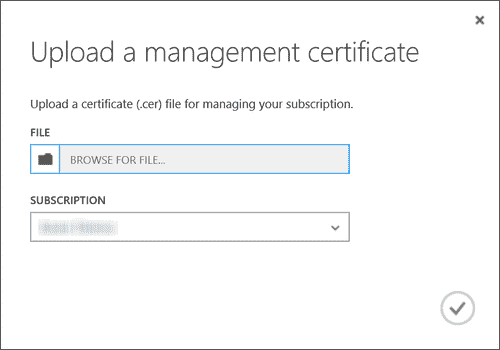
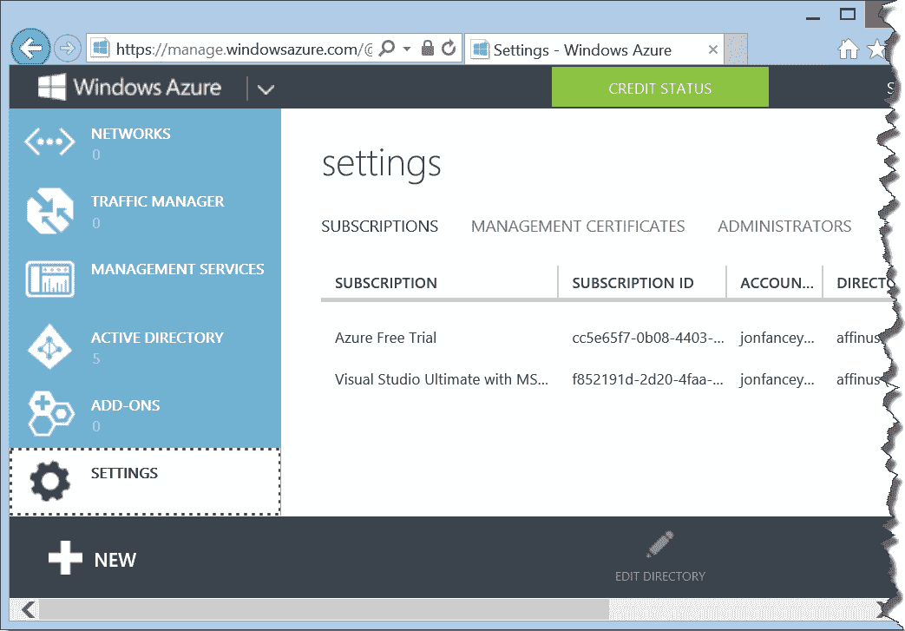
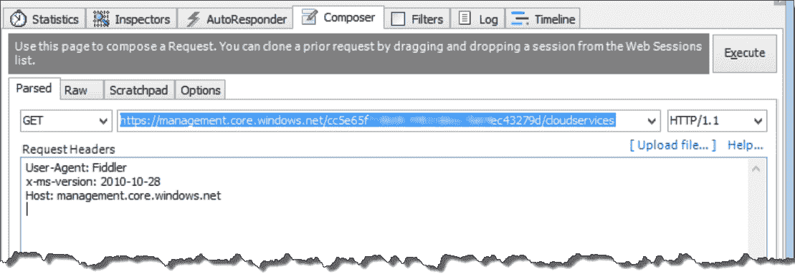
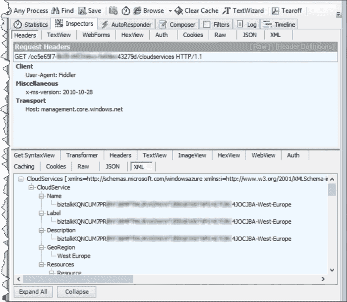
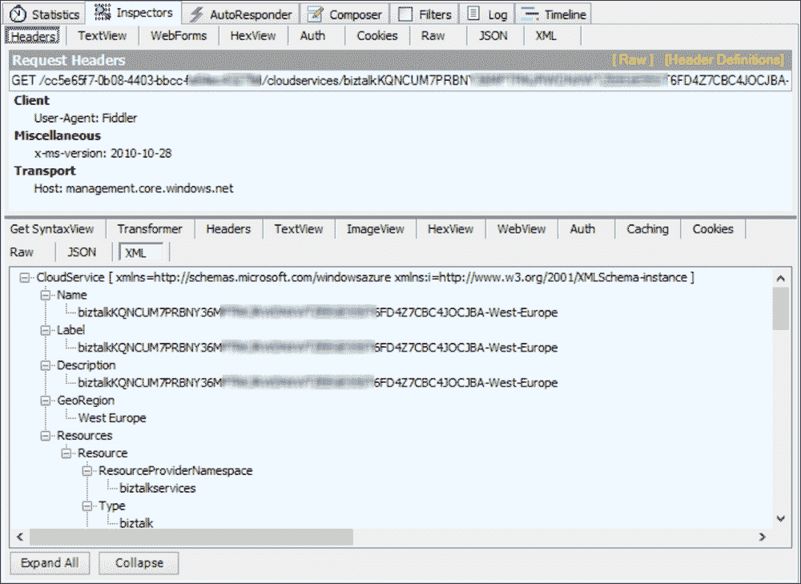
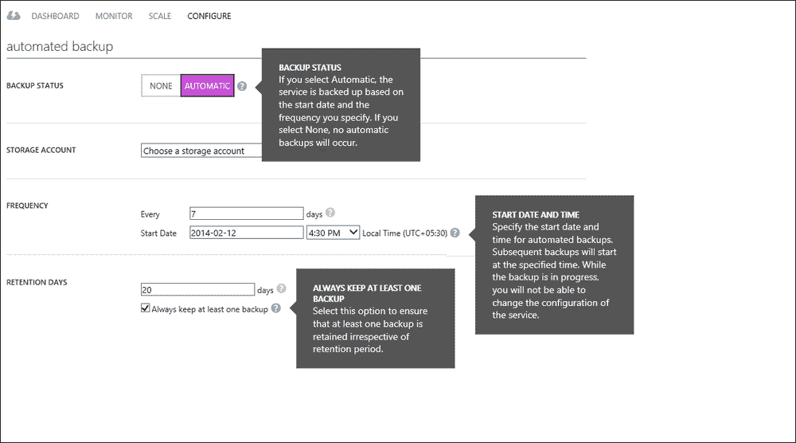
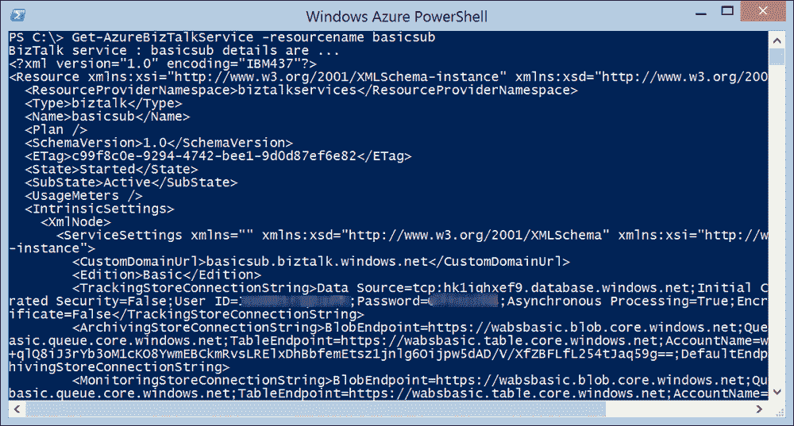

# 第六章。API

到目前为止，我们只看了与 **Windows Azure BizTalk 服务**（**WABS**）交互的图形工具。这些包括用于创建和部署解决方案的 Visual Studio 以及用于管理和监控已部署解决方案的 BizTalk 服务门户（以及 Azure 管理门户）。然而，所有这些工具的底层是一个基于 REST 的 API，它允许轻松地与脚本工具以及您自己的流程集成，以促进自动化操作，如部署、测试和管理。

在本章中，我们将探讨 WABS API 以及如何使用以下方式与之交互：

+   RESTful 网络服务

+   PowerShell

+   自定义代码

虽然 API 可以使用三种方法（门户、REST 服务和 PowerShell），但每种方法都满足不同的需求，尽管存在重叠，但在功能上也有所不同。门户在本书的另一部分已有所探讨，并为系统管理员提供了一个易于访问的控制台。PowerShell 是 IT 专业人员熟悉的一种工具，用于脚本系统交互，如部署。直接使用 REST API 对于构建自己的工具和能力，或在 WABS 之上或从其他应用程序与 WABS 交互非常有用。到本章结束时，您将很好地理解 WABS API 以及您如何在自己的组织中利用它。

# REST

首先，让我们快速了解一下提供的 API 的基础。在 Visual Studio 和管理门户中可用的所有功能也在 API 中可用。事实上，API 实际上提供了比这些工具更多的功能，正如我们将看到的。这并不令人惊讶，因为这种情况经常发生——API 通常先于工具出现。因此，了解 API 可以做什么是一个好主意。支撑这个 API 的是一组可通过 HTTP 访问的 Web 服务。WABS 使用 RESTful 服务来实现这一点。REST 不是一个标准或协议，而是一种架构风格，它通过简单的基于 HTTP 的集成来实现。它不需要 SOAP 或 Microsoft 的 WCF 等框架的开销。实际上，您通常可以使用您的网络浏览器来发出请求或查询信息。REST 基于一组标准 HTTP 动词，这些动词指定了请求的类型。WABS 在其 API 中使用以下 HTTP 动词：

| 动词 | 目的 |
| --- | --- |
| PUT | 创建新工件或更新现有工件 |
| GET | 获取工件（s） |
| DELETE | 从 WABS 中删除工件 |
| POST | 更新工件或服务状态 |

WABS REST API 动词

如您所见，通过这种方式支持了完整的 CRUD（创建、读取、更新和删除）操作，这提供了很大的灵活性，因为它促进了跨平台访问和与第三方工具的轻松集成。

# 调用 API

让我们先看看一个简单的对 BizTalk 服务 API 的 REST 调用。在这个例子中，我们将查询为给定 Azure 订阅部署的 BizTalk 服务实例。我们将看到您如何使用一个非常有用的工具 Fiddler 来执行此请求。您可以从 [`fiddler2.com/`](http://fiddler2.com/) 免费下载 Fiddler。

为了在 Azure 上执行这些 API 调用，需要每个参与方之间进行相互的证书交换过程，以便相互验证。当您的机器向 Windows Azure 管理端点发出请求时，Azure 会返回配置的证书，作为回报，您的客户端机器将向 Azure 发送其证书以进行验证。一旦完成，Azure 将执行请求并返回确认。为了使这成为可能，我们首先需要创建一个客户端证书，然后将其上传到 Azure。

这里有两个选项。您可以使用自己创建的证书，这被称为自签名证书。这样的证书对于测试很有用，但不适合生产使用。在这种情况下，您将从签名机构购买证书并使用它。这样做的原因是证书关乎信任，不仅仅是两个参与方（您的机器/组织与 Azure）之间的信任，还包括与签名机构的信任。当一方收到证书时，它可以与签名机构检查其有效性。这也允许，例如，签名机构在证书被泄露时撤销证书。

然而，对于我们的目的来说，一个自签名证书就足够了。要创建证书，打开命令提示符并输入以下命令：

```cs
makecert -sky exchange -r -n "CN=wabstest" -pe -a sha1 -len 2048 -ss 
My "%HOMEPATH%\documents\wabstest.cer"

```

此命令将创建一个自签名证书并将其安装到您的机器的证书存储中，位于您的登录账户下。完成此操作后，我们需要将其与我们的 Azure 订阅关联，我们在其中已配置了 BizTalk 服务：

1.  打开 Windows Azure 管理门户 [`manage.windowsazure.com`](http://manage.windowsazure.com)。

1.  在左侧边栏中，点击 **设置**（它是列表中的最后一个）。

1.  在 **设置** 下，点击 **管理证书** 选项卡，然后点击 **上传**。

1.  浏览到您在命令窗口中之前创建的证书文件——它默认位于 `c:\users\<youraccount>\documents`。

1.  点击勾选按钮以将您的证书与管理系统关联。

    上传管理证书

现在我们已经完成了这个步骤，我们可以使用 Fiddler 的请求作曲家功能进行调用，以查询 WABS 服务的部署。为了在 Fiddler 中设置证书，我们首先需要在发出请求之前执行几个步骤：

1.  打开 Fiddler。

1.  在 **规则** 菜单中，选择 **自定义规则…**。

1.  在 Notepad 中打开的 `CustomRules.js` 文件中，找到 `OnBeforeRequest` 函数。

1.  在此函数顶部添加以下内容，将`<username>`替换为你的用户名：

    ```cs
    if (oSession.HostnameIs("management.core.windows.net")) {
       oSession["https-Client-Certificate"] = "C:\\Users\\<username>\\Documents\\wabstest.cer";
    }
    ```

1.  保存文件并关闭记事本。

这将做的是，每当访问 Azure 管理 URL 时，都会将客户端证书发送到服务。对于下一步，你需要你的 Azure 订阅 ID。要获取此信息，请返回到 Azure 管理门户，在**设置** | **订阅**下，你将在**订阅**列中看到你的订阅列表，并在**订阅 ID**列中看到所需的订阅 ID，如下面的截图所示：



获取订阅 ID

现在，我们可以按照以下方式发出请求：

1.  点击**作曲家**标签。

1.  确保 URL 旁边的动词设置为**GET**。

1.  在框中输入以下 URL，将`<SubscriptionID>`替换为你的订阅 ID：

    `https://management.core.windows.net/<SubscriptionID>/cloudservices`

1.  在**请求头**区域添加此处提供的头信息：

    `x-ms-version:2010-10-28`

    这个 HTTP 头指定了我们想要的服务版本，并且是必须的。目前，只有一个版本，但随着时间的推移，服务可能会发生变化，这将允许你调用它的特定版本。

    你的 Fiddler 请求应如下截图所示：

    

    获取云服务列表

1.  点击**执行**按钮。

如果一切按计划进行，你现在应该在 Fiddler 窗口中看到调用结果，如下面的截图所示。你所看到的是一个列表，以 XML 格式列出为传递给订阅的 BizTalk 服务实例。如果你以编程方式调用此 API，你可以读取 XML 并提取每个实例的特定属性，也许停止或重新启动它们。出于明显的原因，我已经模糊处理了订阅 ID 和其他细节。



获取云服务列表

通过这次调用的结果，我们现在可以使用以下 URL 检索单个 WABS 实例的详细信息。在这里，传递给 Get Cloud Service 调用的云服务名称是前一个调用返回的：

`https://management.core.windows.net/<SubscriptionID>/cloudservices/<CloudServiceName>`

请求和响应如下截图所示：



获取单个 BizTalk 服务实例

# 备份和还原

现在我们已经查看了一个 WABS API 能做什么的简单示例，让我们看看一些更有趣的功能。企业开发的一个基本方面是能够在环境之间移动工件。通常，一个组织或团队将有一个开发、测试、用户验收和生产环境（以及每个环境的多个实例）。通过创建多个服务实例并根据需要配置它们，BizTalk Services 可以实现这种 DTAP（开发、测试、用户和产品）设置。然后，每个实例都可以按需使用来管理整体集成环境。

备份 BizTalk 服务实例不仅对在环境之间移动内容很有用，还可以用于保留特定环境的备份或快照，以用于灾难恢复或恢复到特定时间点。如果服务类型至少相同或更高，还可以将实例恢复到服务的不同版本。例如，基本订阅可以恢复到另一个基本订阅，也可以恢复到标准或高级订阅。然而，降级是不可能的，也不能备份服务的开发者实例。

此功能现在（截至 2014 年 2 月的服务更新）通过 Windows Azure 管理门户提供开箱即用的工具，如以下截图中的**配置**选项卡所示。虽然门户 UI 现在允许您备份服务实例，甚至可以从备份创建新的 BizTalk 服务实例，但使用 API 进行程序化操作非常有用。API 提供了将一组工件从一个实例（例如测试）移动到另一个实例（例如用户验收）的能力。在本节中，我们将通过编写一些.NET 代码来实现此功能。正如您将看到的，这非常简单直接。



使用管理门户备份 BizTalk 服务实例

在尝试此功能之前，我应该指出，此功能提供的服务实例的副本与原服务实例相似。很可能（甚至很可能）您的某些设置或配置是特定于环境的。例如，如果您的网桥向服务总线队列发送消息，那么您不太可能使用与生产环境相同的队列进行测试。因此，虽然能够备份一个环境并将其恢复到另一个环境确实非常有用，但您还需要考虑使用 REST API 在恢复的服务实例上应用配置更改。

打开 Visual Studio 并创建一个新的控制台应用程序。将其命名为`BackupService`。在静态`Main`方法中，添加以下代码以替换空的`Main`方法：

```cs
static void Main()
  {
    Task t = new Task(Run);
    t.Start();
    Console.ReadLine();
  }
```

现在添加如以下代码片段所示的`Run`方法。此代码格式化所需的 URL 以进行备份 API 调用。为此，需要三块信息。

首先，您需要您的 Windows Azure 订阅 ID；这个 ID 与之前讨论的相同，您可以通过在“调用 API”部分的“上传管理证书”截图中的 Windows Azure 门户中获取它。您还需要服务名称。这是之前显示的**名称**字段中的值，您可以通过在 Fiddler 中执行我们看到的那个 API 调用来获取您的服务名称。您还需要的数据的最后部分是 BizTalk 服务实例的资源名称。这是您在创建 WABS 实例时给出的名称。您可以通过 Azure 门户、点击 BizTalk 服务链接或再次使用 Fiddler（如前一个截图所示）来获取它。您需要的名称位于 **Resources**/**Resource**/**Name** 元素下。将代码中的三个占位符替换为您所示的服务值，如下所示：

```cs
static void Run()
{
  string subscriptionId = "<SubscriptionID>";
  string operationName = "cloudservices";
  string serviceName = "<servicename>";
  string resourceName = "<resourcename>";
  Uri requestUri = new Uri("https://management.core.windows.net/"
                                    + subscriptionId
                                    + "/cloudservices/"+ serviceName
                                    + "/resources/biztalkservices/~/biztalk/"
                                    + resourceName
                                    + "/?comp=backup");
MakeRequest(requestUri);
}
```

现在，添加以下两个程序集引用，它们包含用于向服务端点发出请求所需的类型：

```cs
System.Net.Http
System.net.Http.Request
```

直接在之前添加的代码下方添加以下方法。这将设置对备份 REST API 的调用，并且为了做到这一点，它需要您的证书。如前所述，管理 API 调用使用相互证书对服务进行身份验证，因此我们需要传递我们的证书。然而，由于我们之前添加到 Fiddler 中的规则会在向管理 URL 发出的每个请求中发送客户端证书，因此我们不需要在代码中发送证书——您只需确保 Fiddler 仍在运行（如果您想在没有 Fiddler 的情况下运行，代码中提供了添加证书的方法）。这简化了事情。

```cs
static async void MakeRequest(Uri requestUri) {
   string payload =
"{\"BackupName\":\"<backupname>\",\"BackupStoreConnectionString\":\"AccountName=<storageaccountname>;AccountKey=<storageaccountkey>;DefaultEndpointsProtocol=https\"}";

   HttpContent content = new StringContent(payload);
   content.Headers.ContentType.MediaType = "application/json";
   content.Headers.Add("x-ms-version", "2010-10-28");
   using (var client = new HttpClient())
   {
      var response = await client.PostAsync(requestUri, content);
      response.EnsureSuccessStatusCode();
      Console.WriteLine("Backup started");
   }
}
```

您需要将前述代码中的 `<storageaccountname>` 和 `<storageaccountkey>` 值替换为您自己的存储账户详细信息。要获取您的 `AccountName` 和 `AccountKey` 值，请执行以下操作：

1.  前往 Azure 管理门户。

1.  点击左侧导航栏中的存储图标。

1.  在存储账户列表中，选择与您的 BizTalk 服务实例创建的名称相同的账户。

1.  点击页面底部的**管理访问密钥**按钮。

1.  将**存储账户名称**和**主访问密钥**字段复制并粘贴到前述代码中。

实际上，您可以在第 3 步中使用任何您喜欢的存储账户，甚至创建一个新的账户。该账户用于存储备份的 WABS 实例。代码中的第三个占位符是 `<backupname>`。这是用于备份的标签，并且将此命名为有意义的名称是良好的实践，例如使用备份的日期。您使用的标签必须以字母或数字开头，只能包含数字、破折号（-）或小写字母，并且长度在 3 到 63 个字符之间。破折号不能连续。

发送到服务的数据格式是 **JSON**（**JavaScript 对象表示法**），这只是一个包含存储账户详情和备份名称的字符串。PostAsync 调用将调用 API 并等待响应。如果成功，服务将返回 OK 响应 HTTP 状态码 200。由于服务备份可能需要长达一小时才能完成，因此此 API 是异步的。作为响应，我们得到一个跟踪标识符，允许您检查备份操作的状态。API 提供了一个轮询查询，允许您传递返回的标识符（一个 GUID）并在任何时间点检索操作的结果。这样，您可以确保备份已成功完成。

现在代码已经完成，按 *F5* 构建并运行它。如果成功，控制台应用程序应该会在几秒钟后打开并关闭。您可能想在代码中设置几个断点并运行它，以查看它是否正常工作。为了简洁起见，我已经省略了任何异常处理代码。如果调用 API 失败，将抛出异常。在这种情况下，运行调试器以确定问题所在。

当然，还有一个相应的还原 API 调用，允许您将先前备份的实例还原到任何其他 BizTalk 服务实例。

如我之前提到的，您需要保持 Fiddler 运行，因为 Fiddler 正在提供必要的证书。如果您想在没有 Fiddler 的情况下运行，只需在 `MakeRequest` 方法的开头添加以下代码，将 `<your thumbprint>` 占位符替换为您自己的证书指纹，该指纹在 Azure 管理门户中显示：

```cs
var certHandler = new WebRequestHandler();
string certThumbprint = "<your thumbprint>";
X509Store certStore = new X509Store(StoreName.My,     
                                    StoreLocation.CurrentUser);
certStore.Open(OpenFlags.ReadOnly);
X509Certificate2Collection certCollection = certStore.Certificates.Find(X509FindType.FindByThumbprint, certThumbprint, false);
certStore.Close();
X509Certificate2 certificate = certCollection[0];
certHandler.ClientCertificates.Add(certificate);You also need to change the using statement as shown below to pass in the certificate from:
using (var client = new HttpClient())
To:
using (var client = new HttpClient(certHandler))
```

上述代码从您的本地计算机的证书存储中检索您的证书。因此，您需要确保它已经存储。为此，双击您的证书，在出现的向导中执行以下操作：

1.  首先接受任何安全警告。

1.  点击 **安装证书** 按钮。

1.  对于 **存储位置** 选项，选择 **本地计算机**。

1.  接受出现的任何警告。

1.  选择 **将所有证书放置在以下存储中**。

1.  点击 **浏览** 按钮。

1.  选择 **个人** 并点击 **确定**。

1.  点击 **下一步** 然后点击 **完成**。

1.  您应该会看到一个确认成功安装的消息。

1.  关闭对话框。

# 使用 PowerShell

到目前为止，我们已经看到了两种不同的方式来利用 BizTalk 服务提供的 API，直接在 Fiddler 中进行 HTTP 请求，以及通过编写代码来程序化地调用它。现在我们将看看一种更简单的方法，使用 Windows PowerShell。Windows PowerShell 是一个面向管理员的命令行工具，它提供了一种在许多 Microsoft 产品（包括第三方产品）中执行任务的一致方式。使用 PowerShell，可以自动化常见操作并创建复杂的脚本，用于配置和管理 BizTalk 服务环境和 Azure。

BizTalk 服务提供了一套 PowerShell cmdlet，可以调用提供的完整 API 集合。Cmdlet 是在 PowerShell 中执行的功能单元，BizTalk 服务为每个可用的 API 调用提供了一个 cmdlet。

为了绝对正确，BizTalk 服务实际上提供了两组 cmdlet。第一组是在你下载并安装 BizTalk 服务 SDK 时安装的，而第二组则需要下载。第一组允许控制已配置的 BizTalk 服务实例中的工件，而第二组允许控制 BizTalk 服务整体——包括创建新的 BizTalk 服务实例。由于第二组与我们已经查看过的 API 相关，我们将从这里开始。这第二组作为源代码提供，可以从以下链接下载：

[`code.msdn.microsoft.com/windowsazure/Windows-Azure-BizTalk-91e1bdf3`](http://code.msdn.microsoft.com/windowsazure/Windows-Azure-BizTalk-91e1bdf3)

由于这是源代码，需要将其在 Visual Studio 中打开并编译。我们还应该注意，这是一个示例，不是来自 Microsoft 的官方支持代码。一旦源代码构建完成，通过点击开始按钮并输入 `PowerShell`（在 Windows 8 或 2012 上）在 Windows 8/Server 2012 上打开 PowerShell。你应该在结果列表中看到 Windows Azure PowerShell。点击它以启动它。如果你看不到 Windows Azure PowerShell，请确保你已经安装了它，并且至少安装了版本 0.6.19。

在 PowerShell 命令窗口中，输入以下命令来加载 cmdlet：

```cs
import-module <pathtosource>/Microsoft.WindowsAzure.Management.BizTalkService.dll

```

为了使用 cmdlet，必须首先设置订阅上下文。通过在命令窗口中输入以下代码来完成此操作：

```cs
$sub = '<subscription ID>'
$thumbprint = '<certificate thumbprint>'
$cert = Get-Item cert:\\LocalMachine\My\$thumbprint
Set-AzureSubscription -SubscriptionName "Test" -SubscriptionId $sub -Certificate $cert
select-azuresubscription –SubscriptionName "Test"

```

现在，你应该知道如何获取需要替换的 `<subscription ID>` 的值。对于 `<certificate thumbprint>`，如果你之前遵循了生成和上传证书的步骤，你需要将此值替换为你自己的证书的指纹。要找到这个，请转到 Azure 门户并点击左侧导航栏中的 **设置**。在设置页面上，点击 **管理证书**，然后复制并粘贴你之前上传的证书的指纹列的值。

我在之前的代码中使用 `Test` 的值来命名订阅。这可以是任何你喜欢的标签。它仅用于 PowerShell 会话期间命名订阅。现在，一旦完成，所有 cmdlet 都将在特定订阅的上下文中执行。

作为如何使用 cmdlet 的一个示例，让我们看看我们之前所做的其中一个 API 调用。在命令窗口中，输入以下命令，将你的 BizTalk 服务实例名称替换为 `<service name>`：

```cs
Get-AzureBizTalkService -resourcename <service name>

```

你应该在命令窗口中看到类似于以下截图的响应：



获取 BizTalk 服务 cmdlet

使用 API 不仅限于查询服务。我们还可以创建全新的 BizTalk 服务实例或删除现有的实例。如果需要，还可以暂停或恢复特定的服务实例。要创建新实例，提供了 `New-AzureBizTalkService` 命令。它具有以下形式：

```cs
New-AzureBizTalkService -ResourceName MyNewBizTalk -Location "West Europe" –ConfigurationFile "c: \ create_new.xml"

```

除了实例名称和要创建它的数据中心之外，主要参数实际上是一个文件。源代码的下载实际上包含了一些示例文件，您可以为此目的进行修改。您提供的文件包含所有您在通过 Azure 门户创建新服务时通常要指定的详细信息；例如，要使用的数据库、用于保护服务的证书、服务类型——开发者、高级等——以及 ACS 设置。在阅读完这本书后，您应该会发现使用您的设置编辑提供的示例文件非常简单。一旦完成，您就可以随心所欲地自动化创建服务！

好的，到目前为止，我们已经涵盖了 BizTalk 服务 API 的管理方面。但如前所述，还有另一组 PowerShell 命令，用于在 BizTalk 服务实例中操作工件和设置。如果您已安装 BizTalk 服务 SDK，则该命令集已经安装，默认情况下位于 `C:\Program Files\Windows Azure BizTalk Services Tools`。

要加载命令，请在 PowerShell 窗口中键入以下命令：

```cs
import-module "C:\Program Files\Windows Azure BizTalk Services Tools\Microsoft.BizTalk.Services.Powershell.dll"

```

此 PowerShell 模块提供了在 BizTalk 服务门户 UI 中不可用的功能。一个例子是能够启动和停止桥接器。当新的桥接器部署时，它默认是激活的，但有时您可能希望停止桥接器接收消息。这可以通过 `Stop-AzureBizTalkBridgeSource` 命令实现，如下所示：

```cs
Stop-AzureBizTalkBridgeSource –AcsNamespace <namespace> –IssuerName owner –IssuerKey <key> –BridgePath MyBridge

```

这将停止桥接器 `MyBridge` 上所有可用的源，但也可以通过提供 `SourceName` 参数来停止特定的源。这在您需要执行需要暂时停止某些或所有源维护操作时非常有用。要重新启动桥接器/源，使用具有相同参数的相应的 `Start-AzureBizTalkBridgeSource` 命令。

剩余的命令涉及向 BizTalk 服务添加和删除诸如桥接器、架构、证书和程序集等工件。Visual Studio 在部署期间使用这些 API 调用，其主要用途之外是自动化和管理部署。有关命令的完整列表，请访问 [`msdn.microsoft.com/en-us/library/windowsazure/dn232360.aspx`](http://msdn.microsoft.com/en-us/library/windowsazure/dn232360.aspx)。

# 摘要

在本章中，我们探讨了 BizTalk 服务的底层 API。我们了解了如何从简单的网页浏览器中利用 API，以及如何使用 PowerShell 命令和编写自己的代码来调用它。我们研究了不同类型的 API、功能以及封装所有这些功能的命令，希望您已经看到了如何利用 BizTalk 服务 API 的功能来创建、管理、维护，更重要的是，自动化您的 BizTalk 服务实例。在下一章中，我们将探讨如何解决您的集成解决方案的问题，以及如何使用 WABS 的跟踪功能。
