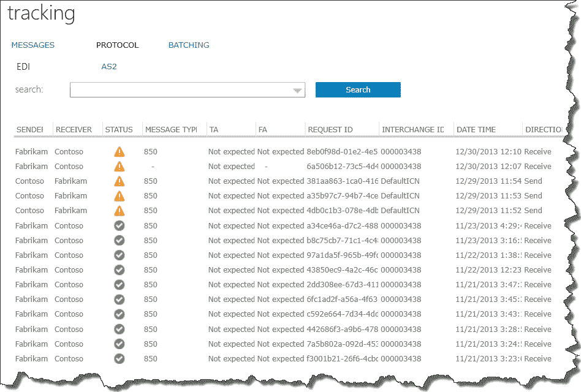
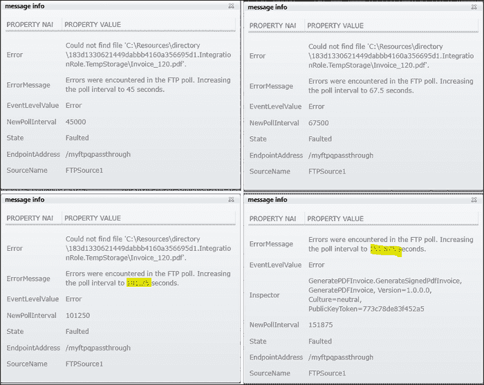
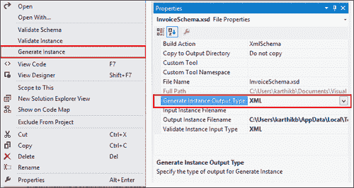

# 第七章 跟踪和故障排除

在最后几章中，我们探讨了构建 BizTalk 服务解决方案所使用的工件。到现在，你可能想知道如何跟踪消息流，或者更好的是，如果事情没有按预期进行，如何进行故障排除。在本章中，我们将探讨用于在 BizTalk 服务中故障排除的工具和常见模式。

具体来说，我们将重点关注以下主题的故障排除：

+   源和目标

+   架构和转换

+   带有自定义代码的 EAI 桥

+   B2B 协议

+   混合连接

# 消息和错误

首先，让我们快速总结一下基础知识。桥是消息通道，不会持久化消息。这意味着在 EAI 桥的情况下，任何消息处理失败都将返回给调用者的 HTTP 错误，而在 B2B 桥的情况下，消息将被推送到挂起端点。在 B2B 的情况下，挂起端点很重要，因为配置或消息结构中的错误不能发送回业务伙伴，而是供 IT 操作员消费。这意味着在 EAI 和 B2B 场景中，所有失败后的消息重试和重新提交都必须在桥外完成。

以下三种场景中可能发生错误：

+   **部署时错误**：此场景包括与 BizTalk 服务部署配置相关的所有错误。在大多数情况下，错误是自解释的，并在 Windows Azure 管理门户中显示或通过 RDFE API 发送回。需要注意的是，BizTalk 服务部署名称是唯一的。自定义域仅用于将 DNS 名称包装在 BizTalk 服务部署 URL 周围。该域的证书需要上传到访问部署的机器上的受信任根证书颁发机构证书存储中。在部署活动期间，用于跟踪和归档的存储和 Azure SQL 数据库不能重用或删除。

+   **设计时错误**：此场景包括在 BizTalk 服务门户中添加/更新/删除桥、部署 VS 项目或添加/更新/删除协议时出现的所有错误。这些错误在 EAI 场景中出现在**输出**窗口或**错误列表**窗口中，而在 B2B 场景中分别出现在 BizTalk 服务门户的状态栏中。

+   **运行时错误**：此场景包括两个应用程序或合作伙伴之间实际消息流中的所有错误。此场景可以进一步细分为四个子类别：

    +   当消息发送到 BizTalk 服务外部端点时出现的错误。

    +   当预期从 BizTalk 服务外部端点接收消息时出现的错误。

    +   当消息格式不正确且不符合桥中配置的架构时出现的错误。

    +   在 BizTalk 服务中，当桥接器、变压器、源或混合目的地等组件无法按预期工作时会出错。这通常将产品中的错误分类为缺陷。

我们将重点关注运行时错误和前三个子类别。如果启用了跟踪，跟踪记录将记录在 Windows Azure SQL 数据库中。跟踪使我们能够存储与消息相关的有趣属性——从标题、正文或通过从其他数据源查找。在 EDI 场景中，存档以原始形式持久化消息数据。对于 EAI 场景，可以通过在第四章中概述的方式添加自定义代码来实现存档，该章讨论了*企业应用集成*。写入跟踪和存档存储的数据是在**尽力而为**的基础上进行的，也就是说，如果在写入这些存储的操作中出现错误，跟踪和存档将被跳过，并且消息处理将在桥接器中继续。此情况的例外是，当 AS2 消息的存档通过在 AS2 协议的**常规设置**页面中启用**启用 NRR**选项时。在这些情况下，如果跟踪/存档无法成功完成，则消息处理将失败。

# 故障排除数据

在本节中，我们将探讨可用于故障排除问题的不同类型的数据。

## 跟踪

流经桥接器的每条消息都与一个称为**请求 ID**的已提升属性相关联，该属性是每条传入消息上的 GUID 值。如果消息被拆分为子消息，则每个子消息都会获得自己的跟踪 ID，该 ID 也是一个 GUID。如果请求 ID 与跟踪 ID 相同，则消息将不进行去批处理。桥接器端点 URI 和时间戳应指向消息的桥接器和时间。跟踪可以从 VS 中的桥接器属性以及 BizTalk 服务门户中的协议**常规设置**页面启用。

BizTalk 服务门户以用户友好的方式公开跟踪数据。有三个选项卡反映了部署中处理的消息。以下是它们的解释：

+   **消息**：此选项卡包含所有来自源、桥接器和协议的错误或信息类型条目。每个跟踪条目详细说明了消息的传入 URL、其请求 ID 和跟踪 ID、处理是否出错或成功、跟踪记录被发射的阶段以及发生的时间和日期。使用此视图跟踪通过桥接器和协议传递的所有 EAI 和 B2B 消息。

+   **协议**：此标签页列出 B2B 交互的跟踪记录。视图也被分为 EDI 和 AS2 协议级别。EDI 针对 X12 和 EDIFACT 记录的消息状态进行调用，包括发送者、接收者、消息类型（如 PO）、确认（如技术确认和功能确认）、请求 ID、交换信封的 ID 以关联批处理跟踪记录，以及记录写入的日期和时间。AS2 记录包含类似信息，但确认反映了**消息处置通知**（**MDN**）状态。使用此视图跟踪所有 B2B 协议阶段特定的跟踪条目。

+   **批处理**：最后，**批处理**标签页跟踪正在进行和完成的批次列表以及单个消息信息。视图跟踪批次名称、为该批次配置的协议以及批处理事务的发送者和接收者。条目还显示了事务接收时的大小、计数和时间，客户可以使用这些信息关联到批次的预期发布标准。使用此视图跟踪批次中的所有消息。

每个标签页都有一个**搜索**选项，可以帮助通过日期范围、消息类型、状态、发送者或接收者来过滤结果。

### 注意

不需要搜索任何选项，搜索选项会显示所有按最新日期排序的跟踪记录。这也可以在测试期间刷新页面。

**跟踪**视图如下截图所示：



BizTalk 服务门户中的跟踪视图

在某些情况下，您可能需要直接从 Azure SQL 数据库表中访问数据。一个常见的用例可能是基于跟踪事件构建一个通知系统。在跟踪中使用的 Azure SQL 数据库跟踪表如下（请注意，Microsoft 不提供或记录这些表以执行直接 T-SQL 查询）：

| 表 | 数据 |
| --- | --- |
| [dbo].[PipelineTrackRecords] | 桥接跟踪记录 |
| [dbo].[SourceTrackRecords] | 源跟踪记录 |
| [dbo].[EndpointAddressMap] | 存储桥接器或源的 URL，并使用外键引用 EndpointAddressID 将地址映射到管道和源跟踪记录 |
| [dbo].[TrackRecordMessageProperties] | 消息提升属性的名称和值对 |
| [dbo].AS2*, [dbo].Batch*, [dbo].Functional*, [dbo].Interchange*, [dbo].TransactionSet*记录 | AS2、MDN、批处理、交互、组、事务集记录以及功能或技术确认的 EDI 跟踪记录 |

## 跟踪和日志文件

除了跟踪之外，当消息通过网桥流动时，跟踪语句也会记录在 Azure 表中。当知道消息失败的时间段时，跟踪对于查找异常非常有用。跟踪信息可以补充来自 BizTalk 服务门户的跟踪信息。这些跟踪与**事件跟踪日志**（**ETL**）跟踪类似，但 BizTalk 服务跟踪是基于文本的，并存储在 Azure 表中。

对于每个部署，跟踪都会记录在创建 BizTalk 服务部署时指定的存储账户中名为**WADLogsTable**的 Azure 表中。您可以使用来自[azurestorageexplorer.codeplex.com](http://azurestorageexplorer.codeplex.com)的工具，如**Azure 存储资源管理器**，或使用商业工具，如 CloudBerry，连接到该 Azure 存储账户并查看表中的数据。

WADLogsTable 中的以下三个字段很有趣：

+   **时间戳**：跟踪记录的日期和时间。

+   **消息**：包含组件或活动信息的消息、异常或错误信息。

+   **级别**：从致命（1）、错误（2）、警告（3）和信息（4）变化的跟踪级别。级别 2 的错误伴随着异常堆栈跟踪。

当使用网桥配置自定义代码进行故障排除时，跟踪信息非常有用。由于几分钟内可能有数百条条目，您可以使用以下命令之一在**Azure 存储资源管理器**工具中过滤表中的数据：

+   `时间戳大于 datetime'2013-12-07T16:00:00'`

+   `级别 = 2`

注意，在过滤数据时，空格以及大小写都很重要。

在 BizTalk 适配器服务的情况下，可以通过在服务的`.config`文件中添加日志拦截器来写入日志文件。要故障排除混合连接运行时，请编辑`C:\Program Files\Microsoft BizTalk Adapter Service\BAServiceRuntime`中的`web.config`。必须添加的精确条目在*故障排除混合连接*部分中概述。

## 性能计数器

您可以使用性能计数器来评估系统的健康状态。与 BizTalk 服务部署相关的性能计数器存储在部署的存储账户中，并可以从 Azure 管理门户的**监控**选项卡中查看，如下面的截图所示：


Azure 管理门户的监控视图中的性能计数器

每个部署都提供了以下性能计数器：

| 性能计数器名称 | 单位 | 描述 |
| --- | --- | --- |
| **CPU 使用率** | % | 所有实例服务运行时消息的平均 CPU 使用率 |
| **源失败** | count | 源中失败的消息数量 |
| **处理中的失败** | count | 在管道处理过程中失败的消息数量 |
| **处理中的消息** | count | 当前处理中的消息数量 |
| **处理的消息** | 数量 | 部署成功处理的消息数量 |
| **接收到的消息** | 数量 | 管道接收到的消息数量 |
| **发送的消息** | 数量 | 从每个管道发送或路由的消息数量 |
| **处理延迟** | 毫秒 | 从验证阶段到路由单向桥的平均消息处理时间 |
| **往返延迟** | 毫秒 | 双向桥中处理消息往返的平均时间 |

这些计数器可用于对部署进行配置更改。例如，如果**接收到的消息**趋势较高，并且这与**处理失败**的增加和相应的**处理延迟**增加相关联，那么系统可能没有随着传入速率进行扩展。IT 管理员可以计划扩展部署并查找性能计数器的变化。

# 故障排除源和目标

源可以是以下之一：HTTP、FTP(s)、SFTP 或服务总线队列和主题。如果源端点是 HTTP，客户端发送消息时通常会在客户端看到 HTTP 错误代码，如下表所示：

| 错误场景 | HTTP 错误代码 | 描述 |
| --- | --- | --- |
| 消息发送到不存在的端点或错误的 URL | 400, 500 | 错误请求、内部服务器错误或命名空间无法解析 |
| 消息头格式错误的端点 | 401 | 认证失败或未经授权的请求 |
| 消息体格式错误的端点 | 500 | 内部服务器错误；请参阅跟踪或跟踪条目以获取更多信息 |
| 目标端点故障 | 500 | 内部服务器错误 |
| 凭据错误的目标 | 500 | 内部服务器错误 |
| 桥接目标配置为 HTTP 中继但接收器正在监听 HTTPS | 500 | 内部服务器错误 |

在 FTP 作为源的情况下，如果在处理过程中或目标处出现错误，消息将不会从源中删除。轮询间隔会增加，系统将自动重试消息的提交。

以下屏幕截图显示了在**PORTAL TRACKING**视图中看到的**Poll Error**源名称的**NewPollInterval**字段的增加。请注意，轮询间隔增加为当前轮询值的 1.5 倍。下一组轮询间隔将约为 227、341、512 和 768 秒。



跟踪条目指示对 FTP 源的指数轮询

使用 FTP 时可能出现的某些错误场景如下表所示：

| 错误场景 | HTTP 错误代码 | 描述 |
| --- | --- | --- |
| 错误的 FTP URL 或错误的用户名或密码 | 503 | 无法连接到 FTP 服务器和/或未登录 |
| 在现有服务活动时重新部署 FTP | 400 | 一个或多个资源处于启动状态；您可以使用`PSCmdlet`停止源 |

您可以根据错误消息修复问题，并使用 `PSCmdlet` 的 `Stop-AzureBizTalkBridgeSource` 和 `Start-AzureBizTalkBridgeSource` 停止和启动源。以下截图显示了 `Get-AzureBizTalkBridgeSource` 的执行，以检查源端点的状态：


使用 PSCmdlet 获取源状态

# 故障排除模式和转换

当消息对模式进行验证失败时，模式中会暴露出问题。如果验证失败，例如由于额外的标签，则会在 XML 验证阶段添加跟踪记录，从而报告错误。

如果跟踪条目指示模式验证错误，测试模式的最简单方法是生成一个测试消息。对于 EAI/B2B 模式，Visual Studio 提供了一个方便的实用工具来生成模式的实例。将模式添加到项目后，右键单击模式并选择文件的**生成实例**。从模式的**属性**窗口中，您可以生成本机（对于平面文件）或 XML 格式的实例，如图下截图所示：



从 Visual Studio 生成模式的实例

与模式类似，转换可能会由于映射不正确或某个 functoid 对特定输入出现故障而产生错误输出。转换还支持在 Visual Studio 中使用样本数据进行测试。可以通过右键单击映射并选择**测试映射**来测试映射，如图下截图所示。测试期间出现的任何错误都会在 VS **错误列表**窗口中指示为转换运行时异常。如果没有错误，转换的输出将在**输出**选项卡中指示。如果在映射部署后运行时出现错误，可以在**跟踪**视图中看到带有 `xmlTransform` 的错误跟踪记录。


从 Visual Studio 测试映射功能

# 故障排除桥接

之前，我们看到了如何故障排除桥接的两个阶段，即模式验证阶段和转换阶段。在使用桥接内部的自定义代码时，如果消息处理遇到错误，事情可能会变得困难。建议您使用 `IMessageInspectorContext.Tracer` 将 `System.Diagnostics.TraceEventType` 错误作为自定义代码的一部分进行记录。这些语句会在之前提到的 WADLogsTable 中显示出来。

# 故障排除协议

协议可以是传输层协议，例如 AS2，或者协议层协议，例如 X12 或 EDIFACT。在具有 X12 和 EDIFACT 协议的 B2B 场景中，返回给发送消息的客户端的传输状态可能是 HTTP 200 OK，但消息最终落在挂起端点。这可能是因为存在协议层错误。此类错误将由确认消息指示。

以下表格显示了某些示例场景：

| 配置 | 场景 | 结果 |
| --- | --- | --- |
| AS2 独立接收与同步 MDN | 配置错误，例如证书错误 | 带有错误 MDN 的 HTTP 400 |
| AS2 独立接收与异步 MDN | 配置错误，例如证书错误 | 异步和 MDN 的错误，HTTP 200 OK |
| AS2 独立发送 | 配置错误，例如证书错误 | HTTP 500，AS2 消息发送活动错误 |
| X12 或 EDIFACT 独立接收 | 入站消息中的标识不匹配 | 对于客户端，HTTP 200 可能表示成功，但如果消息已配置为发送错误、NACK 并最终发送到挂起目标，请查看**跟踪**视图 |
| X12 或 EDIFACT 独立发送 | 模式未找到 | 对于客户端，HTTP 200 可能表示成功，但如果消息已配置为发送错误、NACK 并最终发送到挂起目标，请查看**跟踪**视图 |

# 故障排除混合连接

最后，我们通过探讨故障排除混合连接来结束我们的讨论。主要涉及查看在第四章中引入的 BizTalk 适配器服务，*企业应用集成*。

要故障排除混合连接的运行时，请使用管理员权限将以下片段添加到`C:\Program Files\Microsoft BizTalk Adapter Service\BAServiceRuntime`中的`web.config`：

```cs
<system.diagnostics>
  <sources>
    <source name= "Microsoft.ApplicationServer.Integration.BAService.Runtime" switchValue="All">
<!-- Use Critical, Error, Warning, Verbose, All, Information to adjust the log level -->
      <listeners>
        <add name="BAServiceRuntimeTrace" />
      </listeners>
    </source>
  </sources>
  <trace autoflush="true" />
    <sharedListeners>
      <add name="BAServiceRuntimeTrace" type= "System.Diagnostics.XmlWriterTraceListener" initializeData= "C:\logs\RuntimeTraceFile.xml" />
    </sharedListeners>
</system.diagnostics>
...
<system.serviceModel>
...
  <diagnostics>
    <messageLogging
      logEntireMessage="true"
      logMalformedMessages="true"
      logMessagesAtServiceLevel="true"
      logMessagesAtTransportLevel="true"
      maxMessagesToLog="3000"
      maxSizeOfMessageToLog="2000"/>
  </diagnostics>
</system.serviceModel>
</configuration>
```

监听器配置将跟踪输出到配置中指定的用户文件夹中的 XML 文件。消息后，我们可以查看跟踪日志文件以检查业务访问或服务配置问题。

# 摘要

在本章中，我们探讨了收集数据以故障排除 BizTalk 服务的各种方法。这有助于维护服务的健康。我们还探讨了 BizTalk 服务中关键组件的错误场景以及解决这些问题的方法。

故障排除既是一门艺术也是一门科学，通常涉及一种系统的方法来识别和解决问题。在下一章和最后一章中，我们将探讨迁移以及可能添加到集成平台的功能。
